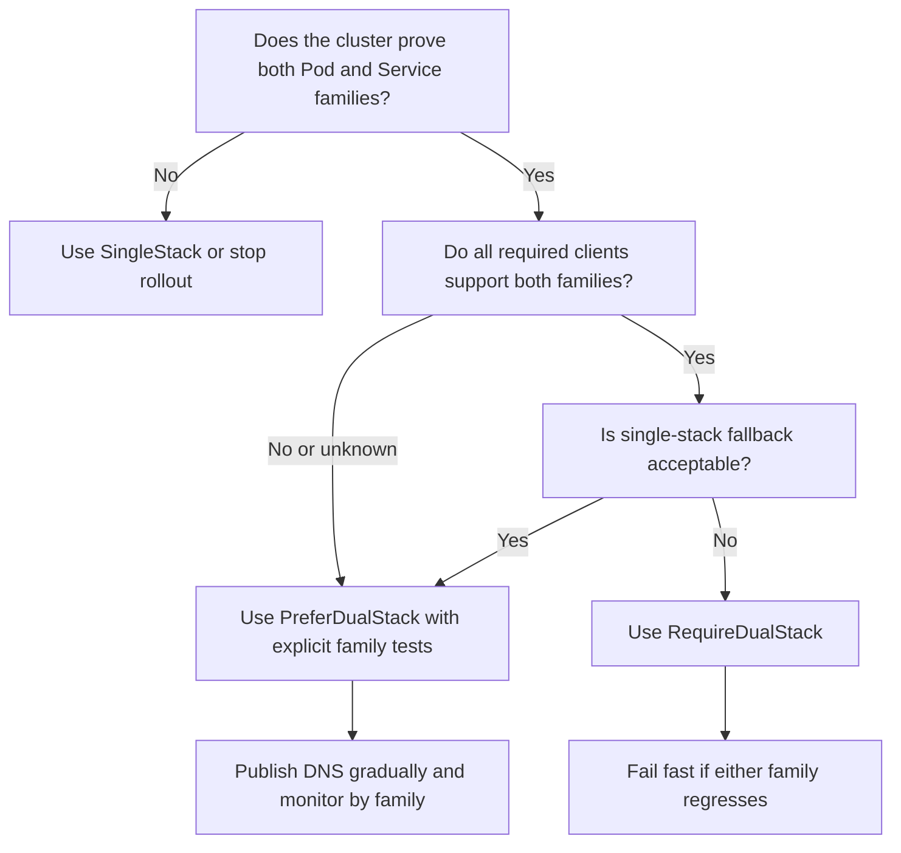

> **Complexity**: `[COMPLEX]`
>
> **Time to Complete**: 3.5 hours
>
> **Prerequisites**: [Module 1.7: IPv6 Fundamentals](module-1.7-ipv6-fundamentals/), Kubernetes Services, CNI basics, kube-proxy basics, and comfort reading YAML manifests
>
> **Track**: Foundations — Advanced Networking

---

## Learning Outcomes

After completing this module, you will be able to perform the checks and design decisions that make dual-stack Kubernetes observable instead of merely configured:

1. **Implement** dual-stack Kubernetes control-plane and CNI configuration by aligning Pod CIDRs, Service CIDRs, node address families, and vendor-specific network plugin settings.
2. **Evaluate** `ipFamilyPolicy`, `ipFamilies`, and `clusterIPs` choices for Services, then choose `SingleStack`, `PreferDualStack`, or `RequireDualStack` for realistic rollout constraints.
3. **Diagnose** dual-stack traffic failures across EndpointSlices, kube-proxy modes, Pod `status.podIPs`, CoreDNS answers, and application listener behavior.
4. **Design** dual-stack NetworkPolicy and DNS validation checks that keep IPv4 and IPv6 rules explicit instead of assuming one family protects the other.
5. **Validate** a kind dual-stack cluster by deploying a dual-stack Service and proving both address families from node, Pod, Service, EndpointSlice, and DNS evidence.

## Why This Module Matters

Hypothetical scenario: A platform team rolls out dual-stack for an internal API that already works over IPv4. The cluster starts cleanly, Pods receive two addresses, the Service shows two `clusterIPs`, and the first smoke test passes from a debug Pod. Two hours later, a new client fleet fails half its requests because the client library tries the IPv6 answer first, but one application container binds only to `0.0.0.0` and never listens on `::`. The network is not "down"; only one family of one path is down, which is exactly why dual-stack incidents are confusing.

This is the practical layer that sits directly on top of [IPv6 Fundamentals](module-1.7-ipv6-fundamentals/). IPv6 fundamentals taught address scope, NDP, DNS, and route reasoning. Kubernetes adds a second control plane on top: API server flags, controller-manager allocation, kube-proxy programming, CNI IPAM, Service family policy, EndpointSlices, DNS answers, and application assumptions. Each layer can be correct by itself while the end-to-end path still fails.

The operational promise of dual-stack is graceful transition, not magic compatibility. It lets workloads keep IPv4 while you introduce IPv6, but it also doubles the evidence you must capture during design review and incident response. A strong platform engineer can say which family a Service asked for, which family kube-proxy programmed, which family CoreDNS answered, which family the client selected, and which family the application actually accepted.

This module uses current Kubernetes and CNI documentation as the source of truth. Dual-stack Kubernetes is stable in modern releases, but old blog posts and examples still contain alpha-era feature gates, stale CNI flags, and one-family assumptions. Treat every copied flag as suspect until you can point to current upstream or vendor documentation.

## Core Content

### 1) The dual-stack contract: two families, one coherent cluster

Dual-stack Kubernetes means selected cluster objects carry both IPv4 and IPv6 identity where the API and data plane support it. Nodes may advertise IPv4 and IPv6 addresses, Pods can receive two Pod IPs, Services can receive two ClusterIPs, EndpointSlices split endpoint records by address type, and DNS can answer both A and AAAA queries for the same Service name. The important word is "coherent": all participating layers must agree on the same two families.

Think of dual-stack as running two postal systems through one building. The front desk can accept both envelope formats, but each mailroom still needs a valid route map, sorting table, and delivery rule. If the IPv4 mailroom is complete and the IPv6 mailroom has no route, no kubelet flag can rescue the packet after it chooses the broken family.

Kubernetes documentation marks IPv4/IPv6 dual-stack networking as stable since v1.23, but that does not mean every cluster is automatically dual-stack. You still need provider support for routable IPv4 and IPv6 node interfaces, a network plugin that supports dual-stack, and both Pod and Service CIDR families configured during cluster creation. Current validation docs also call out Kubernetes v1.23 or later for validating dual-stack behavior.

The high-level dependency chain is useful because it gives incident responders a fixed order for asking questions instead of letting every team start from its favorite tool:

```text
Dual-stack dependency chain
+----------------------+-------------------------------------------+
| Layer                | Dual-stack evidence                       |
+----------------------+-------------------------------------------+
| Host / provider      | Node has IPv4 and IPv6 interfaces/routes  |
| API server           | Service CIDR range includes both families |
| Controller manager   | Pod CIDR allocation includes both families|
| CNI                  | IPAM assigns IPv4 and IPv6 Pod addresses  |
| kube-proxy           | Service proxy rules see both Pod CIDRs    |
| EndpointSlice        | IPv4 and IPv6 slices exist when needed    |
| CoreDNS / clients    | A and AAAA answers are tested separately  |
| Application          | Listener and client code are family-aware |
+----------------------+-------------------------------------------+
```

Pause and predict: if a cluster has dual-stack Service CIDRs but the CNI assigns only IPv4 Pod addresses, what will a `RequireDualStack` Service prove? It can prove Service allocation intent, but it cannot make IPv6 endpoints appear. The right next check is Pod `status.podIPs` and EndpointSlice `addressType`, not DNS.

The same dependency order protects design reviews. If a proposal starts with "publish AAAA for the Service" but cannot show Pod IPv6 addresses, endpoint IPv6 slices, proxy mode evidence, and an application listener check, the proposal is starting at the user-facing symptom instead of the infrastructure contract. Dual-stack work succeeds when every layer has a small, boring proof.

#### 1.1 Control-plane flags you actually need to recognize

For kubeadm-style clusters and many self-managed installations, the control-plane shape is still easiest to reason about through the generated component flags. Do not copy these into a managed Kubernetes cluster without checking that provider's supported configuration surface, because managed services often own the API server and controller-manager flags for you.

The core fields are stable enough to memorize because they describe which address ranges Kubernetes allocates, which ranges kube-proxy treats as cluster-internal, and which node addresses become visible to other components:

| Component | Dual-stack setting | Why it matters |
|---|---|---|
| `kube-apiserver` | `--service-cluster-ip-range=<IPv4 CIDR>,<IPv6 CIDR>` | Defines the Service IP allocation ranges visible to the API server |
| `kube-controller-manager` | `--cluster-cidr=<IPv4 CIDR>,<IPv6 CIDR>` | Defines Pod CIDR allocation for nodes when node CIDR allocation is used |
| `kube-controller-manager` | `--service-cluster-ip-range=<IPv4 CIDR>,<IPv6 CIDR>` | Keeps Service allocation behavior aligned with the API server |
| `kube-controller-manager` | `--node-cidr-mask-size-ipv4` and `--node-cidr-mask-size-ipv6` | Controls per-node Pod CIDR mask sizes by family |
| `kube-proxy` | `--cluster-cidr=<IPv4 CIDR>,<IPv6 CIDR>` | Lets kube-proxy distinguish cluster traffic from external traffic for both families |
| `kubelet` | `--node-ip=<IPv4 address>,<IPv6 address>` when needed | Makes node address-family advertisement explicit when automatic detection is wrong |

The order of the comma-separated ranges is not cosmetic. Kubernetes treats the first Service range as the primary family for default Service allocation unless a Service requests a different family order through `spec.ipFamilies`. If you configure IPv4 first, an unspecified Service normally becomes IPv4 `SingleStack`; if you configure IPv6 first, the default changes accordingly.

Here is a minimal kubeadm-style configuration shape for a lab cluster. The CIDRs use documentation ranges; production ranges must come from your real address plan and must not overlap with node, Pod, Service, VPC, or peering ranges.

```yaml
apiVersion: kubeadm.k8s.io/v1beta4
kind: ClusterConfiguration
kubernetesVersion: stable
networking:
  podSubnet: "10.244.0.0/16,fd00:10:244::/56"
  serviceSubnet: "10.96.0.0/16,fd00:10:96::/112"
controllerManager:
  extraArgs:
    - name: node-cidr-mask-size-ipv4
      value: "24"
    - name: node-cidr-mask-size-ipv6
      value: "64"
```

The older habit of checking only `.spec.podCIDR` is not enough. Dual-stack nodes expose `.spec.podCIDRs`, plural, when the controller allocates both families. The same plural shift appears in Pods: `.status.podIP` still exists for compatibility, but `.status.podIPs` is the field you should teach runbooks to inspect.

When reading a live cluster, remember that component flags can be delivered through static Pod manifests, systemd units, kubeadm configuration, provider control planes, or a kube-proxy ConfigMap. The generated Kubernetes flag reference tells you the valid names, but it does not tell you where your distribution stores the active values. The operational task is to connect documentation to the actual deployment mechanism before changing anything.

```bash
kubectl get nodes -o go-template='{{range .items}}{{.metadata.name}}{{"\n"}}{{range .spec.podCIDRs}}{{printf "  %s\n" .}}{{end}}{{end}}'
kubectl get pods -A -o go-template='{{range .items}}{{.metadata.namespace}}/{{.metadata.name}}{{"\n"}}{{range .status.podIPs}}{{printf "  %s\n" .ip}}{{end}}{{end}}'
```

#### 1.2 Provider and managed-cluster caveat

Self-managed clusters expose the control-plane switches directly. Managed clusters usually expose a provider-specific setting such as "enable IPv6," "dual-stack cluster," or "secondary Service range" at cluster creation time. The Kubernetes API fields still look familiar after creation, but the path to create them is provider-owned.

This matters for operations because changing dual-stack posture after cluster creation is often more constrained than changing a Deployment. Even when Kubernetes APIs permit Service family policy changes in limited cases, CNI IPAM, cloud routes, load balancer capabilities, and node addressing may not be safely mutable in place. The practical design rule is to make dual-stack a cluster birth decision unless your provider documentation explicitly says otherwise.

For audit evidence, collect these views before declaring the cluster ready, and store the output with the rollout record so later responders know what "healthy" looked like before traffic moved:

```bash
kubectl get nodes -o wide
kubectl get nodes -o jsonpath='{range .items[*]}{.metadata.name}{" "}{.spec.podCIDRs}{"\n"}{end}'
kubectl -n kube-system get pods -o wide
kubectl get services -A -o custom-columns=NAMESPACE:.metadata.namespace,NAME:.metadata.name,FAMILIES:.spec.ipFamilies,IPS:.spec.clusterIPs
```

#### 1.3 Cost and capacity lens

Dual-stack does not usually double compute cost, but it can double several operational surfaces. Load balancers may need IPv6 frontend configuration, observability systems may store separate source-family labels, firewall objects may need paired CIDRs, and every rollout test now has two success paths. The hidden cost is usually human and telemetry capacity, not Pod CPU.

At moderate production scale, budget for extra logging cardinality, additional alert dimensions, more network-policy rules, and longer compatibility testing. The cost can spike when you publish AAAA records before the application path is ready, because clients may generate retries, timeouts, support tickets, and noisy synthetic failures while IPv4 continues to look healthy. Cost control is mostly sequencing: validate internal dual-stack first, publish external IPv6 gradually, and keep rollback at the DNS or traffic-policy layer explicit.

The cheapest dual-stack test is a local, repeatable one that fails before customers see it. The expensive test is a production DNS publication that teaches you which client libraries wait too long before falling back from IPv6. Make the early tests boring: one Pod, one Service, one EndpointSlice query, one A query, one AAAA query, and one connection attempt per family. Then scale the same pattern across environments.

The final readiness artifact should be a family-by-family evidence table, not a prose assertion that "dual-stack works." A useful table has rows for node CIDRs, Pod IPs, Service IPs, EndpointSlices, DNS answers, kube-proxy mode, application listener, NetworkPolicy, and rollback owner. For each row, record one IPv4 proof and one IPv6 proof. This makes the review slower by a few minutes and faster during every incident that follows.

If the table has a blank IPv6 cell, do not treat it as a documentation gap. Treat it as a rollout blocker or an explicitly accepted risk with an owner. Blank cells are how partial migrations become folklore: everyone remembers that "IPv6 was enabled," but nobody can prove which layer was actually working when the change shipped. The table turns memory into evidence that another engineer can audit later with reliable confidence.

### 2) CNI dual-stack configuration: the matrix before the manifest

Kubernetes provides the API contract, but the CNI plugin assigns Pod addresses and programs node-level reachability. A dual-stack cluster with a single-stack CNI is not dual-stack for workloads. The CNI must know how to allocate both families, route or encapsulate both families, and enforce policy for both families.

The safest CNI review starts with a matrix rather than a manifest. Write down which plugin owns IPAM, where the IPv6 pool is configured, whether Kubernetes node `.spec.podCIDRs` are consumed, and how policy handles `ipBlock` CIDRs by family. This prevents a common mistake where engineers paste a Service manifest and assume Pod addressing follows automatically.

| CNI | Verified dual-stack knobs | Operational notes |
|---|---|---|
| Calico | CNI IPAM fields `assign_ipv4` and `assign_ipv6`; Calico IP pools with IPv4 and IPv6 CIDRs; `IP6=autodetect`; `FELIX_IPV6SUPPORT=true`; `CALICO_IPV6POOL_CIDR` for some non-kubeadm installs | Calico docs say dual-stack workloads receive one IPv4 and one IPv6 address. IP pools must already exist when referenced by CNI config or annotations |
| Cilium | ConfigMap key `enable-ipv6`; Helm `ipv6.enabled=true`; Kubernetes host-scope IPAM can wait for `.spec.podCIDRs` with `k8s.requireIPv6PodCIDR=true` | Current Cilium Helm docs use `ipv6.enabled`; the lower-level ConfigMap key is still `enable-ipv6`. Match the install method you use |
| kind / kindnetd | kind cluster config `networking.ipFamily: dual`; optional `podSubnet`, `serviceSubnet`, `disableDefaultCNI`, and `kubeProxyMode` fields | kind ships `kindnetd` by default. It is useful for local dual-stack labs, not a production CNI recommendation |
| kube-router | `--enable-ipv4=true`, `--enable-ipv6=true`, dual Service ranges, dual external Service ranges when used, and multiple CNI IPAM ranges | kube-router documents feature-complete dual-stack support in v2.0.0 and later. Validate upgrade notes before changing an older fleet |

Notice what is not in the table: a generic "turn on IPv6" switch that applies to every CNI. Every plugin has its own IPAM model. Some consume Kubernetes PodCIDRs, some use CRDs, some use operator configuration, and some need separate daemon arguments. The matrix is the guardrail.

There are two review questions that catch most CNI mistakes. First, where does the IPv6 Pod address come from: Kubernetes node `.spec.podCIDRs`, a CNI CRD, an operator value, or a local CNI IPAM file? Second, which component proves the route back to that Pod IP after allocation? A Pod IP without a programmed return path is only an address in an API object, not working networking.

Treat CNI documentation as versioned operational input. A plugin may support dual-stack while a specific install path, encapsulation mode, or cloud integration has extra requirements. For example, a Helm value, a ConfigMap key, and a daemon argument can all describe the same feature through different surfaces. The safest review asks the owner to show the rendered cluster object, not just the command they intended to run.

The CNI proof should include both allocation and datapath evidence. Allocation is visible in Kubernetes objects: node PodCIDRs and Pod `status.podIPs`. Datapath evidence is visible through packet tests, routes, encapsulation state, BGP announcements, or CNI-specific status commands. A platform review that stops at allocation can miss the exact failure users care about: the address exists, but return traffic never finds the Pod.

#### 2.1 Calico: pools, assignment, and Felix IPv6 support

Calico's dual-stack path has two ideas you must keep separate. First, Calico needs IPv6 support in the node agent path, including variables such as `IP6=autodetect` and `FELIX_IPV6SUPPORT=true` in the documented manifest flow. Second, Calico IPAM must be told to assign both IPv4 and IPv6 addresses when it configures Pods.

The CNI configuration fields are string values, not YAML booleans, in Calico's CNI plugin documentation. This is an easy place to make a syntactically valid but semantically wrong ConfigMap.

```yaml
ipam:
  type: calico-ipam
  assign_ipv4: "true"
  assign_ipv6: "true"
```

Calico IP pools describe the address space from which workload addresses are allocated. The following examples show the shape only; replace the documentation CIDRs with ranges from your address plan.

```yaml
apiVersion: projectcalico.org/v3
kind: IPPool
metadata:
  name: dojo-ipv4-pool
spec:
  cidr: 10.244.0.0/16
  encapsulation: VXLAN
  natOutgoing: true
  nodeSelector: all()
---
apiVersion: projectcalico.org/v3
kind: IPPool
metadata:
  name: dojo-ipv6-pool
spec:
  cidr: fd00:10:244::/56
  encapsulation: VXLAN
  natOutgoing: true
  nodeSelector: all()
```

The design review question for Calico is: does the IPv6 pool match the cluster's intended Pod CIDR family, and is Calico actually assigning from it? If the pool exists but `assign_ipv6` is still false, Pods will not become dual-stack. If `assign_ipv6` is true but the pool overlaps or is disabled, allocation can fail or produce uneven rollout symptoms.

For Calico, also check whether your installation uses Calico IPAM or host-local IPAM. Calico IPAM gives you pool-aware behavior and Calico-specific assignment controls, while host-local IPAM follows a different per-node allocation model. Mixing those mental models causes confusing reviews because the same Pod symptom can come from a missing IPPool, a disabled pool, or a CNI configuration that never asked Calico IPAM to allocate IPv6 in the first place.

#### 2.2 Cilium: ConfigMap key versus Helm value

Cilium documentation exposes two surfaces that are easy to conflate. The agent ConfigMap has keys such as `enable-ipv4` and `enable-ipv6`, while the Helm reference uses values such as `ipv6.enabled`. In a Helm-managed install, set the Helm value and let the chart render the ConfigMap; in a hand-managed ConfigMap, verify the rendered keys directly.

```yaml
apiVersion: v1
kind: ConfigMap
metadata:
  name: cilium-config
  namespace: kube-system
data:
  enable-ipv4: "true"
  enable-ipv6: "true"
```

For a Helm install using Kubernetes host-scope IPAM, the relevant shape is the set of values that both enables IPv6 and requires Kubernetes to provide the IPv6 PodCIDR before the agent proceeds:

```bash
helm upgrade --install cilium cilium/cilium \
  --namespace kube-system \
  --set ipv6.enabled=true \
  --set ipam.mode=kubernetes \
  --set k8s.requireIPv6PodCIDR=true
```

That command is intentionally incomplete as a full production install; Cilium installations often require additional values for kube-proxy replacement, routing mode, tunnel mode, BPF host routing, observability, and cloud-specific integration. The point here is not to replace the Cilium install guide. The point is to identify which documented knobs prove that IPv6 is enabled and that Cilium waits for Kubernetes to provide IPv6 PodCIDR data when using Kubernetes IPAM.

Cilium also changes the kube-proxy conversation in clusters that use kube-proxy replacement or eBPF load balancing. This module still teaches kube-proxy because many clusters use it and the Kubernetes APIs remain the same, but a Cilium production review should explicitly ask whether Service load balancing is implemented by kube-proxy, Cilium, or a hybrid migration state. Debug commands must match the datapath actually installed.

#### 2.3 kindnetd: the local lab path

kind is the fastest safe way to observe dual-stack Kubernetes behavior without touching a production cluster. The kind docs expose `networking.ipFamily: dual`, and kind ships a simple default CNI called `kindnetd`. That makes it ideal for this module's hands-on exercise because it keeps the focus on Kubernetes Service behavior, EndpointSlices, CoreDNS, and kube-proxy evidence.

```yaml
kind: Cluster
apiVersion: kind.x-k8s.io/v1alpha4
name: dualstack-dojo
networking:
  ipFamily: dual
  podSubnet: "10.244.0.0/16,fd00:10:244::/56"
  serviceSubnet: "10.96.0.0/16,fd00:10:96::/112"
nodes:
  - role: control-plane
  - role: worker
```

The command uses kind's `--config` flag, which is the important muscle memory because dual-stack behavior is a cluster-creation property rather than a later `kubectl apply` patch:

```bash
kind create cluster --config kind-dualstack.yaml
```

Do not confuse kind success with production readiness. kind proves the API objects and local node data path, but it does not prove cloud load balancer IPv6 support, route advertisements, edge firewall policy, enterprise DNS behavior, or client address selection across real networks.

That limitation is exactly why kind is still valuable. A local cluster lets you teach the Kubernetes object model without cloud-specific distractions. If an engineer cannot explain `ipFamilyPolicy`, `clusterIPs`, EndpointSlice `addressType`, and Pod `status.podIPs` in kind, adding a provider load balancer will only increase the number of moving parts during the first real incident.

#### 2.4 kube-router: BGP-oriented dual-stack

kube-router documents dual-stack enablement with both `--enable-ipv4=true` and `--enable-ipv6=true`, plus additional dual-stack Service and external IP ranges when those features are used. It also documents that its CNI can accept multiple Pod ranges after dual-stack support, and that network-policy CIDRs only work for families enabled in kube-router.

The operational review for kube-router is BGP-heavy. Are both families present on the Kubernetes node object? Are both families present on physical interfaces? Are Pod CIDRs allocated in both families? Are BGP peers exchanging the intended next hops without overriding IPv4 and IPv6 semantics into one broken path?

This is a safe shape for a review checklist, not a full daemonset manifest, because kube-router deployments vary enough that copying a partial daemon command would be more dangerous than teaching the required evidence:

```text
kube-router dual-stack review
- --enable-ipv4=true
- --enable-ipv6=true
- kube-apiserver: --service-cluster-ip-range=<IPv4 CIDR>,<IPv6 CIDR>
- kube-controller-manager: --cluster-cidr=<IPv4 CIDR>,<IPv6 CIDR>
- kube-controller-manager: --service-cluster-ip-range=<IPv4 CIDR>,<IPv6 CIDR>
- kube-router: Service and external Service ranges include both families when used
- CNI IPAM ranges include both families when kube-router manages CNI allocation
```

The kube-router lesson generalizes to any CNI with routing responsibility: dual-stack is not just address assignment. If your plugin advertises Pod routes, peers with routers, enforces policy, or validates external IP ranges, each of those functions must understand IPv4 and IPv6 independently. A rollout that validates only Pod allocation can still fail when route advertisement or policy programming remains single-family.

When choosing between CNIs for a dual-stack estate, resist scoring them only by whether they have a checkmark for IPv6. Ask how operators will debug one-family failure at 2 a.m.: which command shows allocation, which command shows route programming, which command shows policy compilation, and which metric distinguishes IPv4 from IPv6 drops. The best technical choice is often the one your team can observe consistently under pressure.

### 3) Service IP families: choosing the right policy

Services are where dual-stack becomes visible to application teams. A dual-stack Pod is useful only if the Service, EndpointSlices, DNS answers, proxy programming, and clients agree on which family to use. Kubernetes gives Service authors three `spec.ipFamilyPolicy` modes, plus `spec.ipFamilies` to express family order.

The three modes are not maturity levels. They are rollout contracts, and the right choice depends on whether fallback is a feature or a bug for that specific Service:

| Policy | What it asks Kubernetes to do | Good use case | Risk if misunderstood |
|---|---|---|---|
| `SingleStack` | Allocate exactly one family | Legacy app, one-family dependency, staged migration | Teams assume dual-stack cluster means this Service has two IPs |
| `PreferDualStack` | Allocate both families when the cluster supports it, otherwise fall back to one family | Gradual migration where single-stack fallback is acceptable | Silent fallback can hide a broken dual-stack prerequisite |
| `RequireDualStack` | Allocate both families or fail Service creation/update | Critical service where partial family behavior is unsafe | Rollout fails if cluster, CNI, or Service range setup is incomplete |

`spec.ipFamilies` controls order. The first family becomes primary for fields such as the legacy `clusterIP` view. In a dual-stack Service, `spec.clusterIPs` carries the assigned IPs as an ordered list.

The order matters because many humans, dashboards, and older scripts still display only one "ClusterIP" column. If that visible value is IPv4, teams may believe the Service is IPv4-only even when the full object contains two addresses. If that visible value is IPv6, a legacy tool that assumes dotted decimal may fail even though Kubernetes is behaving correctly. Teach people to inspect the full YAML or a custom column view for dual-stack Services.

```yaml
apiVersion: v1
kind: Service
metadata:
  name: web-prefer-dual
spec:
  type: ClusterIP
  ipFamilyPolicy: PreferDualStack
  ipFamilies:
    - IPv4
    - IPv6
  selector:
    app: web
  ports:
    - name: http
      port: 80
      targetPort: 8080
```

Before running this, what output do you expect from `kubectl get service web-prefer-dual -o yaml` in a healthy dual-stack cluster? You should expect `ipFamilyPolicy: PreferDualStack`, two `ipFamilies`, and two `clusterIPs`. If only one appears, check whether the cluster supports both Service ranges and whether the policy allowed fallback.

#### 3.1 Worked example: policy choice under rollout pressure

Imagine an internal API with three consumer groups. The platform-owned health checker and a Go service already handle IPv6, but an older Java batch job is known to be IPv4-only because it parses host literals incorrectly. The team wants to expose IPv6 for new clients without breaking the batch job.

`RequireDualStack` may be too strict for the first rollout if the team has not proven all clients. `SingleStack` is safe but does not move the transition forward. `PreferDualStack` with IPv4 first is a pragmatic starting point: Kubernetes will allocate both families in a capable cluster, the legacy `clusterIP` remains IPv4-primary, and tests can explicitly query AAAA before external publication.

After all clients pass family-specific tests, a stricter Service can use `RequireDualStack` to prevent accidental regression. For a new internal platform API with a hard dual-stack contract, `RequireDualStack` is the better default because a single-stack fallback would be worse than an early, visible failure.

There is an important social part to this choice. Application teams often ask for the least disruptive field, while platform teams want a field that catches bad cluster posture. Write down which failure mode you prefer: a Service that fails to create because the cluster is not dual-stack, or a Service that creates with one family because fallback was allowed. Both can be reasonable, but mixing expectations creates avoidable incident noise.

For shared platforms, make the default policy part of a service class. A "legacy internal" class might default to `SingleStack` until the owning team opts in. A "migration candidate" class might default to `PreferDualStack` with required A, AAAA, and connection tests. A "platform critical" class might require `RequireDualStack` plus CI that checks `clusterIPs` and EndpointSlices. Classes keep policy debates from repeating on every Service manifest.

#### 3.2 EndpointSlices are family-specific evidence

EndpointSlices group network endpoints by unique combinations that include IP family. Kubernetes documentation states that each EndpointSlice object has a specific `addressType`, and that a Service available via both IPv4 and IPv6 has at least two EndpointSlice objects, one for each family. That makes EndpointSlices the first resource to inspect when a Service appears dual-stack but traffic only works through one family.

```bash
kubectl get endpointslices \
  -l kubernetes.io/service-name=web-prefer-dual \
  -o custom-columns=NAME:.metadata.name,TYPE:.addressType,READY:.endpoints[*].conditions.ready,ADDRS:.endpoints[*].addresses
```

If the Service has two `clusterIPs` but only an IPv4 EndpointSlice, the problem is probably not kube-proxy. It is more likely that Pods have only IPv4 addresses, the selector matches only single-stack Pods, the CNI did not allocate IPv6, or a readiness condition prevents IPv6 endpoints from becoming usable.

EndpointSlice readiness also matters during rolling updates. `ready`, `serving`, and `terminating` conditions describe whether endpoints should receive traffic. A dual-stack rollout can have healthy IPv4 endpoints and missing IPv6 endpoints if the app starts one listener before the other or if readiness probes validate only the IPv4 path.

For custom controllers and service meshes, EndpointSlice handling is also a compatibility boundary. Consumers of the EndpointSlice API must aggregate all slices for a Service and deduplicate endpoints correctly. A dual-stack-aware controller that reads only the first slice can accidentally create an IPv4-only view of a Service that Kubernetes represented correctly.

### 4) kube-proxy modes and the packet path

kube-proxy consumes Services and EndpointSlices, then programs node-local forwarding behavior. On Linux, current kube-proxy documentation exposes `iptables`, `ipvs`, and `nftables` proxy modes. The default mode may differ by distribution and configuration, and a kube-proxy config file can override or ignore command-line flags, so always inspect the actual ConfigMap or running arguments.

The practical difference for dual-stack troubleshooting is not "which mode is best" but "which table owns evidence." In iptables mode, you inspect generated iptables and ip6tables chains. In ipvs mode, you inspect virtual servers and real servers, usually with `ipvsadm`. In nftables mode, you inspect nftables rules. The Service API object is the same, but the packet evidence changes.

Here is the requested dual-stack IPVS packet-flow diagram, showing the point where the same Service name becomes two virtual server paths backed by family-specific endpoints:

```text
Dual-stack Service through kube-proxy IPVS
+--------------------+        +---------------------------+
| Client Pod         |        | Node running kube-proxy   |
|                    |        |                           |
| curl web-dual      |        | IPVS virtual servers      |
| A answer: 10.96.x  +------->| 10.96.x.y:80   -> v4 Pod |
| AAAA: fd00:10:96:: +------->| fd00:10:96::z:80 -> v6 Pod|
+--------------------+        +-------------+-------------+
                                            |
                                            v
                              +---------------------------+
                              | EndpointSlice source data |
                              | addressType: IPv4         |
                              | addressType: IPv6         |
                              +-------------+-------------+
                                            |
                                            v
                              +---------------------------+
                              | CNI route / encapsulation |
                              | PodIP: 10.244.x.y         |
                              | PodIP: fd00:10:244::abcd  |
                              +---------------------------+
```

In IPVS mode, kube-proxy creates a virtual server for each Service address and port, then maps it to real servers from the matching endpoint family. A broken IPv6 path can therefore appear as an IPv6 virtual server with no IPv6 real servers, or as real servers that exist but cannot be routed by the CNI. Those are different incidents.

Useful inspection commands vary by node image and privilege, but the evidence sequence is stable because Kubernetes objects should be checked before node-local packet tables:

```bash
kubectl -n kube-system get configmap kube-proxy -o yaml
kubectl get endpointslices -l kubernetes.io/service-name=web-dual -o wide
kubectl get service web-dual -o yaml
```

On a node where IPVS tooling is available, inspect both families. Do not run these blindly on managed nodes unless you have permission and a maintenance process.

```bash
sudo ipvsadm -Ln
sudo ipvsadm -Ln --exact
ip -4 route
ip -6 route
```

`nftables` is worth tracking because kube-proxy exposes it as a Linux proxy mode in current reference docs, and kind documents a `networking.kubeProxyMode: "nftables"` field. Treat it as version- and distro-sensitive operational territory: validate your observability, rollback, and runbooks before choosing it for a production dual-stack migration.

The most common kube-proxy mistake is assuming mode from memory. A cluster that started in iptables mode may later be rebuilt with IPVS, and a kind lab may test a different mode than production. Put the proxy mode into the incident template so responders know whether to inspect iptables, IPVS, nftables, or a CNI-provided replacement datapath before interpreting packet evidence.

Also separate Service proxy evidence from node route evidence. kube-proxy can correctly translate a Service IP to an endpoint IP while the node still lacks a usable route to that endpoint family. Conversely, the CNI route can be correct while kube-proxy has no real server for the IPv6 Service because the EndpointSlice is missing. Keeping those two checks separate avoids the vague phrase "networking is broken" and produces an actionable owner.

### 5) Pods, applications, NetworkPolicy, and DNS

Dual-stack Pods expose the plural `status.podIPs` field. That sounds small, but it is one of the most common places application and automation code breaks. Scripts that read only `status.podIP`, sidecars that assume a single IP in environment variables, and readiness probes that test one family can all pass while the other family is broken.

Kubernetes validation docs show the Downward API can expose `status.podIPs` into an environment variable. That is useful for demonstration, but application code should not treat the comma-separated list as a single address. Parse it as a list, preserve family information, and decide whether the app should bind to both families, prefer one family, or fail if the required family is missing.

```yaml
env:
  - name: MY_POD_IPS
    valueFrom:
      fieldRef:
        fieldPath: status.podIPs
```

#### 5.1 Application listener awareness

The half-IPv4 hypothetical scenario from the opening usually comes from application binding, not Kubernetes allocation. A container can have two Pod IPs while the process listens only on IPv4. A process bound to `0.0.0.0` is not automatically listening on IPv6. A process bound to `::` may or may not accept IPv4-mapped behavior depending on OS and application settings.

Inside a debug container or node shell, inspect listeners by family so you can separate "the Pod has two addresses" from "the process accepts connections on both families":

```bash
ss -lntp
ss -4 -lntp
ss -6 -lntp
```

For Kubernetes readiness, prefer a probe that proves the same family behavior clients need. If the Service publishes AAAA and a client class prefers IPv6, a readiness probe that only tests IPv4 is incomplete. You can keep a simple HTTP readiness path, but the rollout checklist must include family-specific smoke tests outside the Pod.

Application-layer awareness also includes outbound connections. A Pod may receive IPv6 traffic correctly while its client code still opens IPv4-only sockets to dependencies, or while an egress proxy has IPv6 disabled. Dual-stack readiness is therefore bidirectional for most services: inbound Service reachability, outbound dependency reachability, and logs that preserve the address family used for each connection.

#### 5.2 NetworkPolicy CIDRs are not family-neutral

Kubernetes `NetworkPolicy` `ipBlock.cidr` is a CIDR string. It does not mean "the IPv4 and IPv6 equivalent of this partner." If a workload needs egress to a partner over both families, write both families explicitly and validate that your CNI enforces both. kube-router's own IPv6 documentation specifically warns that it can only work with NetworkPolicy CIDRs for address families enabled in kube-router.

```yaml
apiVersion: networking.k8s.io/v1
kind: NetworkPolicy
metadata:
  name: allow-partner-egress-dual-stack
spec:
  podSelector:
    matchLabels:
      app: report-writer
  policyTypes:
    - Egress
  egress:
    - to:
        - ipBlock:
            cidr: 198.51.100.0/24
    - to:
        - ipBlock:
            cidr: 2001:db8:200::/48
```

The policy is intentionally split into two egress rules. A combined mental model is what causes mistakes. During review, ask the owner to point at the IPv4 CIDR, the IPv6 CIDR, and the test that proves each one independently.

NetworkPolicy also needs DNS context. If a policy allows traffic to a named partner through resolved addresses, the address set can change when AAAA records appear. Kubernetes NetworkPolicy itself does not resolve DNS names inside `ipBlock`; some CNIs offer extensions, but those are plugin-specific. Keep the base policy lesson simple: CIDRs are literal, family-specific ranges, and DNS publication can change which CIDRs clients try to reach.

#### 5.3 DNS: CoreDNS answers, clients choose

Kubernetes DNS documentation says normal Services receive A records for IPv4 addresses and AAAA records for IPv6 addresses. In a dual-stack Service, CoreDNS can answer both query types when the Service has both families. CoreDNS is not the component that promises every client will try AAAA first or that IPv4 fallback will be fast.

The "AAAA-first" problem is client behavior. Many applications call resolver APIs that return multiple addresses, then the operating system or library applies address-selection rules and retry timing. If IPv6 is published but broken, users may experience slow fallback, partial errors, or family-specific failures even though `dig A` looks healthy.

Always test DNS by query type and by actual connection, because a successful DNS answer is only the beginning of a connection path:

```bash
kubectl exec client -- dig +short A web-dual.default.svc.cluster.local
kubectl exec client -- dig +short AAAA web-dual.default.svc.cluster.local
kubectl exec client -- curl -sS http://web-dual.default.svc.cluster.local
```

For an incident, capture both the DNS answer and the connection attempt. A DNS answer proves publication. It does not prove route, proxy programming, endpoint readiness, or application listener behavior.

A good rollback note distinguishes between removing an AAAA record and fixing IPv6. Removing AAAA can reduce user impact by steering new attempts away from IPv6, but it does not repair the cluster, CNI, proxy, policy, or application listener. If the post-incident action stops at DNS rollback, the next publication attempt will rediscover the same untested family path.

For DNS rollout, prefer a ladder: internal Service DNS first, then synthetic clients, then a small real client group, then broader publication. At each step, record both the resolver answer and the attempted destination. This matters because a client can receive A and AAAA answers but still connect only to IPv4 due to library policy, local resolver policy, proxy configuration, or address-selection rules outside Kubernetes.

## Patterns & Anti-Patterns

| Pattern | When to use it | Why it works | Scaling consideration |
|---|---|---|---|
| Birth dual-stack clusters with both Pod and Service CIDRs | New clusters or rebuildable environments | Avoids risky in-place mutation of CNI, controller, and Service allocation assumptions | Needs address-plan review before cluster creation |
| Prefer `PreferDualStack` during consumer discovery | Existing apps with unknown client behavior | Gives dual-stack evidence while allowing fallback where supported | Must monitor for silent fallback to one family |
| Use `RequireDualStack` for platform APIs with hard contracts | New platform services and conformance-sensitive services | Fails early when dual-stack prerequisites regress | Requires mature CI and cluster readiness checks |
| Keep family-specific smoke tests in rollout gates | Any Service publishing A and AAAA answers | Proves both families instead of trusting aggregate success | Doubles basic test cases, but reduces incident ambiguity |
| Inspect EndpointSlices before kube-proxy internals | Service works on one family but not the other | EndpointSlice `addressType` shows whether endpoints exist per family | Large clusters have many slices, so use labels and custom columns |

| Anti-pattern | What goes wrong | Better alternative |
|---|---|---|
| Adding AAAA records because Pods have IPv6 | Clients choose IPv6 before the application path is ready | Publish DNS only after Service, EndpointSlice, proxy, route, and listener tests pass |
| Treating one NetworkPolicy CIDR as dual-stack coverage | IPv4 can be allowed while IPv6 is blocked, or the reverse | Write and test IPv4 and IPv6 `ipBlock` rules separately |
| Copying old feature-gate examples into current clusters | Stale flags distract from current CIDR and CNI requirements | Use current Kubernetes and CNI docs for the cluster version |
| Assuming kind dual-stack proves cloud dual-stack | kind does not prove external load balancer, edge, or provider routing support | Use kind for API/data-plane learning, then run provider-specific acceptance tests |
| Debugging DNS first for every family failure | DNS can be correct while endpoints, routes, or listeners are broken | Follow the evidence ladder: Service, EndpointSlice, PodIPs, proxy mode, DNS, client |

## Decision Framework

Start the design with the rollout risk, not the YAML field. The decision is really about whether a Service may operate with one family, whether clients are known to handle both, and whether failure should be early or gradual.



Use this matrix during design review, and require one concrete command or dashboard for every "yes" answer before approving production exposure:

| Question | If yes | If no |
|---|---|---|
| Do Pods show two `status.podIPs`? | Continue to EndpointSlice validation | Fix CNI/IPAM before touching Service policy |
| Does the Service need both families to be correct? | Choose `RequireDualStack` | Consider `PreferDualStack` or `SingleStack` |
| Are legacy clients IPv4-only? | Keep IPv4 first in `ipFamilies` while testing | Consider IPv6-first only when consumers prove readiness |
| Does DNS publish both A and AAAA? | Run family-specific connection tests | Do not infer DNS health from Service allocation alone |
| Does policy cover both families? | Test both `ipBlock` paths | Add explicit IPv4 and IPv6 rules |
| Can rollback be performed without rebuilding the cluster? | Document DNS or traffic-policy rollback | Keep rollout internal until cluster/provider constraints are understood |

The simplest rule is: use `SingleStack` when one family is the product requirement, `PreferDualStack` when migration evidence is valuable but fallback is acceptable, and `RequireDualStack` when a single-stack result would hide a platform regression. The rule is simple, but the proof is not; every choice must be backed by Pod, Service, EndpointSlice, DNS, and application evidence.

When the decision is controversial, run the kind lab from this module with all three Service policies and paste the object output into the design review. Seeing `clusterIPs`, `ipFamilies`, and EndpointSlices side by side is more persuasive than arguing from names. The fields are deliberately plain once you know where to look, and that plainness helps teams make a policy decision without treating dual-stack as mysterious.

## Did You Know?

- Kubernetes documentation marks IPv4/IPv6 dual-stack networking as `Kubernetes v1.23 [stable]`, but a stable feature still requires dual Pod CIDRs, dual Service CIDRs, node support, and a compatible CNI.
- EndpointSlices are address-family specific: a Service available through IPv4 and IPv6 has at least two EndpointSlice objects, one with `addressType: IPv4` and one with `addressType: IPv6`.
- kind documentation says dual-stack clusters are configured with `networking.ipFamily: dual`, and the cluster is created with `kind create cluster --config <file>`.
- Current kube-proxy reference documentation lists Linux proxy modes including `iptables`, `ipvs`, and `nftables`, so your troubleshooting commands must match the actual mode.

## Common Mistakes

| Mistake | Why It Happens | How to Fix It |
|---|---|---|
| Configuring IPv4 and IPv6 Service ranges but only one Pod CIDR family | Teams focus on Service allocation and forget the CNI must allocate Pod addresses too | Verify node `.spec.podCIDRs`, Pod `.status.podIPs`, and CNI IPAM before testing Services |
| Giving kube-proxy only one `--cluster-cidr` family | kube-proxy keeps running, so the cluster looks healthy until one family needs correct masquerade/proxy behavior | Configure kube-proxy from the real config source with both Pod CIDRs and confirm the mode after rollout |
| Mixing CIDR families in NetworkPolicy review | Reviewers see one `ipBlock` and assume it covers the service relationship | Add separate IPv4 and IPv6 CIDRs, then test each path with family-specific traffic |
| Publishing AAAA before application listeners are dual-stack | Service and DNS objects are ready before the process binds to IPv6 | Check `ss -4` and `ss -6`, then run an IPv6 connection test through the Service before publishing AAAA broadly |
| Assuming `PreferDualStack` guarantees two Service IPs | The policy permits fallback when the cluster cannot allocate both families | Use `RequireDualStack` for hard requirements and inspect `spec.clusterIPs` in CI |
| Reading only `status.podIP` in scripts | Legacy scripts were written before plural Pod IP evidence was needed | Update automation to read `status.podIPs` and preserve address-family order |
| Looking at only one EndpointSlice | A dual-stack Service splits endpoint records by `addressType` | Query all slices with `kubernetes.io/service-name=<service>` and compare IPv4 and IPv6 readiness |
| Treating CoreDNS as responsible for AAAA-first behavior | DNS answers and client address selection are different layers | Test A, AAAA, and real connection attempts, then inspect client resolver and retry behavior |

## Quiz

<details>
<summary>Your team creates a `RequireDualStack` Service, but the API rejects it because the cluster cannot allocate both families. Which layer do you inspect first, and why?</summary>

Start with cluster-level Service and Pod CIDR evidence, then inspect CNI allocation. `RequireDualStack` is designed to fail when Kubernetes cannot satisfy both families, so this is a useful early signal rather than a nuisance. Check the API server and controller-manager Service CIDR configuration, then verify node `.spec.podCIDRs` and CNI-specific dual-stack settings before changing the Service manifest.
</details>

<details>
<summary>A Service has two `clusterIPs`, but only IPv4 clients receive responses. EndpointSlice output shows `addressType: IPv4` only. What does this rule out, and what remains likely?</summary>

This mostly rules out DNS as the primary cause because the endpoint controller has not produced IPv6 backend evidence. The likely causes are single-stack Pod allocation, selector mismatch, CNI IPv6 IPAM failure, or readiness that only permits IPv4-backed endpoints. The next checks are Pod `status.podIPs`, CNI logs/config, and whether matched Pods have IPv6 addresses and readiness for the intended port.
</details>

<details>
<summary>An application team wants `PreferDualStack` because it sounds safer than `SingleStack`. Their legacy client is known to parse IPv6 literals incorrectly. What Service policy and rollout sequence would you recommend?</summary>

Use `PreferDualStack` only if fallback is acceptable and keep IPv4 first in `ipFamilies` while the legacy client remains in scope. Publish dual-stack internally, test A and AAAA queries separately, and verify real connection behavior from that client before external DNS changes. If the legacy client cannot be fixed, keep its path on an IPv4 `SingleStack` Service or a separate compatibility endpoint.
</details>

<details>
<summary>You are debugging a kube-proxy IPVS cluster. The IPv6 Service IP exists, but IPv6 requests time out. Which evidence separates missing endpoints from broken routing?</summary>

EndpointSlice evidence separates those cases. If there is no IPv6 EndpointSlice or it has no ready IPv6 addresses, kube-proxy cannot build useful IPv6 real servers. If IPv6 endpoints exist, inspect IPVS virtual/real server state and then the CNI route or encapsulation path for the IPv6 Pod CIDR.
</details>

<details>
<summary>A NetworkPolicy allows `198.51.100.0/24` egress to a partner, and the partner also publishes IPv6. After enabling AAAA, traffic fails over IPv6. What design bug should you look for?</summary>

The policy probably has only the IPv4 partner CIDR. `ipBlock` rules are family-specific CIDR strings, so IPv4 permission does not imply IPv6 permission. Add the partner's IPv6 prefix as a separate rule, validate that the CNI enforces IPv6 policy, and test both family paths independently.
</details>

<details>
<summary>CoreDNS returns both A and AAAA for a Service, but one client class becomes slow while another remains healthy. Why is DNS not enough evidence?</summary>

DNS publication only proves that the name maps to both families. Client resolver behavior, address-selection policy, retry timing, route availability, kube-proxy programming, and application listener behavior still decide whether a connection succeeds quickly. Capture the client's chosen address family and a real connection attempt before changing CoreDNS.
</details>

<details>
<summary>In the kind lab, `kubectl get service web-dual` shows two ClusterIPs, but `dig AAAA web-dual.default.svc.cluster.local` from the client Pod returns nothing. What are two likely causes?</summary>

First, the Service may not actually have IPv6 in `spec.ipFamilies` or the client may be querying the wrong namespace/name. Second, CoreDNS or the Service object may not have reconciled yet, especially if the Service was edited quickly after creation. Inspect the full Service YAML, query the fully qualified Service name, and compare EndpointSlices before assuming the cluster is not dual-stack.
</details>

<details>
<summary>A CI script checks only `.status.podIP` and declares a dual-stack Deployment healthy. What should the script check instead?</summary>

The script should check `.status.podIPs` and confirm that one address from each expected family is present for every ready Pod. It should then verify the Service `clusterIPs` and EndpointSlice `addressType` values, because Pod dual-stack alone does not prove Service reachability. A good CI gate reports which family failed rather than a single pass/fail line.
</details>

## Hands-On Exercise

This exercise creates a local kind dual-stack cluster, deploys a simple web workload, exposes it with `RequireDualStack`, and verifies IPv4 and IPv6 through Kubernetes objects, DNS, and live requests. It assumes `kind`, `kubectl`, and Docker or a compatible container runtime are installed.

### Goal

Build a repeatable evidence trail that proves the cluster is dual-stack at the node, Pod, Service, EndpointSlice, DNS, and client connection layers.

### Setup

Create a kind cluster config that fixes the lab's Pod and Service CIDRs up front, because this is the only moment in the exercise where cluster-family allocation is intentionally chosen:

```yaml
kind: Cluster
apiVersion: kind.x-k8s.io/v1alpha4
name: dualstack-dojo
networking:
  ipFamily: dual
  podSubnet: "10.244.0.0/16,fd00:10:244::/56"
  serviceSubnet: "10.96.0.0/16,fd00:10:96::/112"
nodes:
  - role: control-plane
  - role: worker
```

Save it as `kind-dualstack.yaml`, then create the cluster with the documented `--config` path so future reruns use the same topology:

```bash
kind create cluster --config kind-dualstack.yaml
kubectl cluster-info --context kind-dualstack-dojo
```

### Task 1: Prove node and Pod CIDRs are dual-stack

Run these commands and record the IPv4 and IPv6 CIDRs you see; this is the baseline that proves the lab should be able to allocate dual-stack Pods:

```bash
kubectl get nodes -o wide
kubectl get nodes -o go-template='{{range .items}}{{.metadata.name}}{{"\n"}}{{range .spec.podCIDRs}}{{printf "  %s\n" .}}{{end}}{{end}}'
```

<details>
<summary>Solution notes for Task 1</summary>

Each node should show Pod CIDR evidence from both families. In a kind cluster using the setup above, expect one IPv4 CIDR from `10.244.0.0/16` and one IPv6 CIDR from `fd00:10:244::/56` assigned across nodes. If only one family appears, stop here and recreate the cluster from the config rather than debugging Services.
</details>

### Task 2: Deploy a web workload and inspect Pod `status.podIPs`

Apply a Deployment with two replicas so EndpointSlice output has real backend data to show for each address family:

```yaml
apiVersion: apps/v1
kind: Deployment
metadata:
  name: web-dual
spec:
  replicas: 2
  selector:
    matchLabels:
      app: web-dual
  template:
    metadata:
      labels:
        app: web-dual
    spec:
      containers:
        - name: nginx
          image: nginx:1.27-alpine
          ports:
            - containerPort: 80
```

```bash
kubectl apply -f web-dual-deployment.yaml
kubectl rollout status deployment/web-dual
kubectl get pods -l app=web-dual -o go-template='{{range .items}}{{.metadata.name}}{{"\n"}}{{range .status.podIPs}}{{printf "  %s\n" .ip}}{{end}}{{end}}'
```

<details>
<summary>Solution notes for Task 2</summary>

Each ready Pod should report two entries under `status.podIPs`. If Pods report only IPv4, your Service cannot have IPv6 endpoints even if it later receives an IPv6 ClusterIP. That points back to CNI or cluster CIDR configuration rather than the Deployment itself.
</details>

### Task 3: Create a `RequireDualStack` Service and inspect allocation

Apply a dual-stack Service with `RequireDualStack`; the point is to make cluster misconfiguration fail loudly instead of falling back silently:

```yaml
apiVersion: v1
kind: Service
metadata:
  name: web-dual
spec:
  type: ClusterIP
  ipFamilyPolicy: RequireDualStack
  ipFamilies:
    - IPv4
    - IPv6
  selector:
    app: web-dual
  ports:
    - name: http
      port: 80
      targetPort: 80
```

```bash
kubectl apply -f web-dual-service.yaml
kubectl get service web-dual -o yaml
kubectl get service web-dual -o jsonpath='{.spec.ipFamilyPolicy}{" "}{.spec.ipFamilies}{" "}{.spec.clusterIPs}{"\n"}'
```

<details>
<summary>Solution notes for Task 3</summary>

The Service should show `ipFamilyPolicy: RequireDualStack`, `ipFamilies` containing `IPv4` and `IPv6`, and two `clusterIPs`. If Service creation fails, that is the expected behavior for `RequireDualStack` when the cluster cannot satisfy both families. Do not change the Service to `PreferDualStack` just to pass the lab; fix the cluster evidence first.
</details>

### Task 4: Verify EndpointSlices split by family

Query EndpointSlices for this Service and compare the slice address type with the Pod IPs from Task 2:

```bash
kubectl get endpointslices \
  -l kubernetes.io/service-name=web-dual \
  -o custom-columns=NAME:.metadata.name,TYPE:.addressType,READY:.endpoints[*].conditions.ready,ADDRS:.endpoints[*].addresses
```

<details>
<summary>Solution notes for Task 4</summary>

You should see at least one slice with `TYPE` as `IPv4` and one with `TYPE` as `IPv6`. The addresses should correspond to Pod addresses from the same family. If one slice is missing, compare the Service selector with Pod labels and then inspect Pod `status.podIPs`.
</details>

### Task 5: Test DNS and live connections from a client Pod

Create a long-running debug Pod so DNS and connection tests happen from inside the same cluster network as normal workloads:

```bash
kubectl run client --image=nicolaka/netshoot --restart=Never --command -- sleep 3600
kubectl wait --for=condition=Ready pod/client --timeout=120s
```

Query both DNS families before testing HTTP so you know whether a connection failure starts at name publication or later in the path:

```bash
kubectl exec client -- dig +short A web-dual.default.svc.cluster.local
kubectl exec client -- dig +short AAAA web-dual.default.svc.cluster.local
kubectl exec client -- curl -sS http://web-dual.default.svc.cluster.local
```

Test each ClusterIP explicitly to avoid hiding a broken family behind client resolver ordering or fallback behavior:

```bash
V4_IP=$(kubectl get service web-dual -o jsonpath='{.spec.clusterIPs[0]}')
V6_IP=$(kubectl get service web-dual -o jsonpath='{.spec.clusterIPs[1]}')
kubectl exec client -- curl -sS "http://${V4_IP}"
kubectl exec client -- curl -g -sS "http://[${V6_IP}]"
```

<details>
<summary>Solution notes for Task 5</summary>

`dig A` should return the IPv4 ClusterIP and `dig AAAA` should return the IPv6 ClusterIP. Both `curl` commands should return the nginx welcome page or equivalent HTTP output. The bracket syntax around the IPv6 literal is required because colons are otherwise ambiguous in URLs.
</details>

### Task 6: Compare Service policy modes

Create two additional Services that select the same Pods, then compare how policy choice changes allocation while the backend Pods remain constant:

```yaml
apiVersion: v1
kind: Service
metadata:
  name: web-single-v6
spec:
  type: ClusterIP
  ipFamilyPolicy: SingleStack
  ipFamilies:
    - IPv6
  selector:
    app: web-dual
  ports:
    - name: http
      port: 80
      targetPort: 80
---
apiVersion: v1
kind: Service
metadata:
  name: web-prefer
spec:
  type: ClusterIP
  ipFamilyPolicy: PreferDualStack
  ipFamilies:
    - IPv4
    - IPv6
  selector:
    app: web-dual
  ports:
    - name: http
      port: 80
      targetPort: 80
```

```bash
kubectl apply -f web-policy-compare.yaml
kubectl get service web-single-v6 web-prefer -o custom-columns=NAME:.metadata.name,POLICY:.spec.ipFamilyPolicy,FAMILIES:.spec.ipFamilies,IPS:.spec.clusterIPs
```

<details>
<summary>Solution notes for Task 6</summary>

`web-single-v6` should have one IPv6 ClusterIP. `web-prefer` should have two ClusterIPs in a healthy dual-stack cluster, but the policy name is a reminder that fallback is permitted if the cluster cannot allocate both. This contrast is why `RequireDualStack` is a better conformance signal in CI.
</details>

### Cleanup

```bash
kubectl delete service web-dual web-single-v6 web-prefer
kubectl delete deployment web-dual
kubectl delete pod client
kind delete cluster --name dualstack-dojo
```

### Success Criteria

- [ ] Node `.spec.podCIDRs` contains IPv4 and IPv6 CIDRs.
- [ ] Pods selected by `app=web-dual` expose two entries in `.status.podIPs`.
- [ ] The `web-dual` Service has `RequireDualStack`, two `ipFamilies`, and two `clusterIPs`.
- [ ] EndpointSlices for `web-dual` include separate `IPv4` and `IPv6` address types.
- [ ] CoreDNS returns both A and AAAA answers for `web-dual.default.svc.cluster.local`.
- [ ] A debug client can reach the Service by DNS, IPv4 ClusterIP, and bracketed IPv6 ClusterIP.
- [ ] You can explain how `SingleStack`, `PreferDualStack`, and `RequireDualStack` behaved differently in Task 6.

## Sources

- [Kubernetes IPv4/IPv6 dual-stack networking](https://kubernetes.io/docs/concepts/services-networking/dual-stack/)
- [Kubernetes validate IPv4/IPv6 dual-stack](https://kubernetes.io/docs/tasks/network/validate-dual-stack/)
- [Kubernetes kube-apiserver reference](https://kubernetes.io/docs/reference/command-line-tools-reference/kube-apiserver/)
- [Kubernetes kube-controller-manager reference](https://kubernetes.io/docs/reference/command-line-tools-reference/kube-controller-manager/)
- [Kubernetes kube-proxy reference](https://kubernetes.io/docs/reference/command-line-tools-reference/kube-proxy/)
- [Kubernetes EndpointSlices](https://kubernetes.io/docs/concepts/services-networking/endpoint-slices/)
- [Kubernetes DNS for Services and Pods](https://kubernetes.io/docs/concepts/services-networking/dns-pod-service/)
- [Kubernetes Network Policies](https://kubernetes.io/docs/concepts/services-networking/network-policies/)
- [Kubernetes Service API reference](https://kubernetes.io/docs/reference/kubernetes-api/service-resources/service-v1/)
- [Calico IPv6 and dual stack](https://docs.tigera.io/calico/latest/networking/ipam/ipv6)
- [Calico CNI plugin configuration](https://docs.tigera.io/calico/latest/reference/configure-cni-plugins)
- [Calico IPPool resource](https://docs.tigera.io/calico/latest/reference/resources/ippool)
- [Cilium Kubernetes host-scope IPAM](https://docs.cilium.io/en/stable/network/concepts/ipam/kubernetes/)
- [Cilium Helm reference](https://docs.cilium.io/en/stable/helm-reference/)
- [Cilium Kubernetes configuration](https://docs.cilium.io/en/stable/network/kubernetes/configuration/)
- [kind configuration](https://kind.sigs.k8s.io/docs/user/configuration/)
- [kube-router IPv6 dual-stack support](https://www.kube-router.io/docs/ipv6/)
- [CoreDNS kubernetes plugin](https://coredns.io/plugins/kubernetes/)
- [RFC 6724: Default Address Selection for IPv6](https://www.rfc-editor.org/rfc/rfc6724)

## Next Module

Use the upstream [Kubernetes dual-stack validation task](https://kubernetes.io/docs/tasks/network/validate-dual-stack/) as the operational follow-on while the later IPv6-only Kubernetes migration module is planned.
