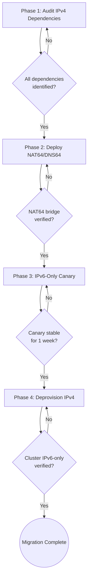

> **Complexity**: `[COMPLEX]`
>
> **Time to Complete**: 3 hours
>
> **Prerequisites**: [Module 1.7: IPv6 Fundamentals](module-1.7-ipv6-fundamentals/), [Module 1.8: Dual-Stack Kubernetes Setup & Operations](module-1.8-dual-stack-k8s/), comfort with CNI configuration, and familiarity with NAT concepts
>
> **Track**: Foundations — Advanced Networking

---

## Learning Outcomes

After completing this module, you will be able to:

1. **Evaluate** when an IPv6-only Kubernetes deployment makes operational and cost sense by weighing NAT64/DNS64 complexity against NAT gateway expense and address scarcity constraints.
2. **Design** a NAT64/DNS64 translation layer using Jool and CoreDNS that provides reliable IPv4 reachability for IPv6-only cluster workloads without introducing asymmetric routing or state exhaustion.
3. **Implement** an IPv6-only kind cluster, validate the control-plane address-family configuration, and prove that DNS64 synthesis and NAT64 translation provide IPv4 reachability for cluster workloads.
4. **Diagnose** application failures unique to IPv6-only environments, including IPv4-mapped address surprises in socket APIs, hardcoded IPv4 health checks, and Java runtime dual-stack defaults.
5. **Construct** a four-phase migration playbook for a brownfield dual-stack cluster that preserves service availability while systematically removing IPv4 dependencies from Pods, Services, and external integrations.

## Why This Module Matters

Hypothetical scenario: A platform team finishes their dual-stack Kubernetes rollout, metrics are stable, and leadership asks the obvious next question — "when can we turn off IPv4?" The team discovers that turning off IPv4 is not an engineering tweak but a whole-cluster property change. Cilium was installed in dual-stack mode, not IPv6-only mode, and the CNI does not support flipping address families at runtime. Twenty-three Services have `ipFamilyPolicy: PreferDualStack` with IPv4 listed first, and the newest namespace already deployed a Pod that calls an IPv4-only partner API from inside a hardcoded health check on `127.0.0.1:8080`. The timeline slips from "two sprints" to "six months of auditing every manifest."

IPv6-only is not dual-stack with one family removed. It is a distinct operating mode where every layer of the stack — CNI IPAM, kube-proxy, CoreDNS, Service objects, NetworkPolicy, application socket code, and external NAT gateways — must agree that IPv4 is unavailable. When they disagree silently, partial failure modes emerge that are harder to diagnose than a clean dual-stack setup where both families always answer. The IPv6 Fundamentals and Dual-Stack K8s modules gave you the vocabulary and the mechanics. This module teaches you the migration from dual-stack to IPv6-only, including the NAT64/DNS64 bridge that keeps legacy IPv4 services reachable without running IPv4 inside your cluster.

Several large operators have already validated this path. T-Mobile US deployed an IPv6-only mobile data network with 464XLAT (NAT64 plus DNS64 plus CLAT on the device), proving at carrier scale that IPv6-only with a translation bridge is production-viable. AWS introduced IPv6-only VPC subnets with Egress-Only Internet Gateways, and Cilium added explicit IPv6-only IPAM modes. The infrastructure exists. The remaining challenge is the migration playbook, the application gotchas, and the operational confidence to turn off IPv4 without breaking production — which is exactly what this module covers.

## NAT64, DNS64, and the Translation Bridge

An IPv6-only Kubernetes cluster cannot natively reach an IPv4-only external service. The Pod has no IPv4 address, the node's routing table has no IPv4 default route, and the CNI never allocates an IPv4 Pod CIDR. This means every dependency that only speaks IPv4 — partner APIs, legacy databases, SaaS endpoints, package mirrors — becomes unreachable unless you build a translation layer. That layer is the combination of NAT64 and DNS64.

### How DNS64 Works

DNS64 is the easier half to understand because it only modifies DNS answers, not packets. When an IPv6-only client sends an AAAA query for `api.example.com` and the authoritative server returns an empty answer (no AAAA record), a standard recursive resolver would return NXDOMAIN or an empty response and the client gives up. A DNS64 resolver intercepts that empty AAAA response, issues a follow-up A query to discover the IPv4 address, and synthesizes a fake AAAA record by embedding the IPv4 address inside a well-known IPv6 prefix — the NAT64 prefix.

The most common choice for that prefix is `64:ff9b::/96`, defined in RFC 6052 as the Well-Known Prefix. If the real IPv4 address is `203.0.113.5`, the synthesized AAAA is `64:ff9b::203.0.113.5` (or its hex equivalent `64:ff9b::cb00:7105`). The client then sends an IPv6 packet to this synthetic address, which gets routed through the NAT64 gateway.

CoreDNS can act as a DNS64 resolver by adding the `dns64` plugin. The plugin configuration looks like this in a Corefile:

```
dns64 [PREFIX] {
    translate_all
}
```

Setting `translate_all` ensures that even queries where an AAAA record exists are synthetically answered with the NAT64-mapped address — useful in an IPv6-only cluster where native IPv4 reachability does not exist and you want all outbound IPv4-destined traffic to flow through NAT64.

Pause and predict: What happens if the DNS64 resolver synthesizes an AAAA for an IPv4 address that the NAT64 gateway cannot reach? Will the client retry, time out, or get a clean error?

### How NAT64 Works

NAT64 is stateful translation at the network layer. The NAT64 gateway sits between the IPv6-only network and the IPv4 internet with both an IPv6 address and an IPv4 address. When an IPv6 client sends a packet to a synthetic `64:ff9b::/96` address, the gateway:

1. Receives the IPv6 packet on its IPv6 interface.
2. Extracts the embedded IPv4 destination (`203.0.113.5` in the example above).
3. Creates a state entry mapping the client's IPv6 source address and source port to an IPv4 source address and a port from the gateway's IPv4 pool.
4. Translates the IPv6 header to an IPv4 header and forwards the packet to the real IPv4 destination.
5. On the return path, reverses the mapping using the state table and delivers the response as an IPv6 packet to the original client.

The state table is the critical resource. Each active connection consumes one mapping entry, and the table must be large enough for the cluster's total concurrent outbound IPv4 connections. For a modest cluster with 200 Pods each maintaining an average of 3 connections to external IPv4 services, you need roughly 600 state entries. For a 100-node cluster with 30 Pods per node each holding 5 connections to external IPv4 APIs, the requirement jumps to 15,000 entries. NAT64 gateways like Jool handle this easily — Jool's default pool uses `--pool6` to define the IPv6 prefix and `--pool4` to define the IPv4 source address range, and the kernel's conntrack table provides the state storage.

### The translation between DNS64 synthesis and NAT64 packet rewriting is where most debugging time is spent. Here is the complete address lifecycle for a single connection request from an IPv6-only Pod to an IPv4-only backend:

```
+--------------------+       +-------------------+       +--------------------+       +-----------------+
|  IPv6-Only Pod     |       |  CoreDNS           |       |  Jool NAT64         |       |  IPv4 API       |
|  fd00:10:244::42   |       |  dns64 plugin      |       |  198.51.100.5       |       |  203.0.113.5    |
+--------+-----------+       +---------+----------+       +---------+----------+       +--------+--------+
         |                             |                            |                           |
         |  AAAA? api.partner.com      |                            |                           |
         +-----------------------------+--->                        |                           |
         |                             |                            |                           |
         |                             | A? api.partner.com         |                           |
         |                             +----------------------------+--->                       |
         |                             |                            |     203.0.113.5           |
         |                             |<---------------------------+                           |
         |                             |                            |                           |
         |  AAAA 64:ff9b::cb00:7105    |                            |                           |
         |<----------------------------+                            |                           |
         |                             |                            |                           |
         |  TCP SYN to                 |                            |                           |
         |  [64:ff9b::cb00:7105]:443   |                            |                           |
         +----------------------------------------------------------+--->                       |
         |                             |                            |                           |
         |                             |  State entry:              |                           |
         |                             |  fd00:10:244::42:52123     |                           |
         |                             |  -> 198.51.100.5:12001     |                           |
         |                             |                            |  TCP SYN to 203.0.113.5  |
         |                             |                            +-------------------------->+
         |                             |                            |                           |
         |                             |                            |<--------------------------+
         |                             |                            |  SYN-ACK                  |
         |                             |                            |                           |
         |  TCP SYN-ACK               |                            |                           |
         |<---------------------------------------------------------+                           |
         |                             |                            |                           |
+--------+-----------+       +---------+----------+       +---------+----------+       +--------+--------+
```

Every failure mode between the Pod and the external service maps to one of three locations in this diagram: DNS64 failed to synthesize (CoreDNS), the route to the NAT64 prefix is missing (node routing table), or the NAT64 state table is full or misconfigured (Jool). When a team reports "IPv6-only Pods cannot reach external services," the first troubleshooting step is to check whether the failure is at the DNS layer (no AAAA synthesis), the routing layer (no route to the `64:ff9b::/96` prefix), or the NAT64 layer (Jool session table shows no active translation for the expected source). This eliminates two-thirds of the search space before you look at application code.

### Jool as the Reference Implementation

Jool is the reference open-source implementation of both Stateful NAT64 (RFC 6146) and DNS64 (RFC 6147). It runs as a Linux kernel module and is actively maintained by the NIC Mexico research group. Jool operates in two modes: stateless and stateful. For an IPv6-only Kubernetes cluster, you always want stateful mode because Pod IPv6 source addresses are not globally unique — they come from the private `fc00::/7` ULA range typically used inside a cluster — and stateful NAT64 provides the IP/port mapping needed for address uniqueness on the public internet.

A minimal Jool stateful NAT64 configuration on the gateway node:

```bash
# Load the kernel module (stateful NAT64 uses jool, not jool_siit)
modprobe jool

# Create a NAT64 instance with the well-known prefix
jool instance add "kube-nat64" --iptables
jool -i "kube-nat64" global update pool6 64:ff9b::/96

# Define the IPv4 address pool for outbound translation
jool -i "kube-nat64" pool4 add 198.51.100.1 198.51.100.254

# Add iptables hooks so the instance actually translates traffic
ip6tables -t mangle -A PREROUTING -j JOOL --instance "kube-nat64"
iptables  -t mangle -A PREROUTING -j JOOL --instance "kube-nat64"

# Enable the instance
jool -i "kube-nat64" global update enabled true
```

The gateway node needs both an IPv6 address reachable from the cluster and an IPv4 address with internet access. In cloud environments, this is typically an EC2 instance or GCE VM that sits at the edge of the VPC with both address families assigned.

The state table is visible and inspectable:

```bash
jool -i "kube-nat64" session display --tcp
```

This shows every active translation: IPv6 source, allocated IPv4 source, destination, and protocol state. When debugging "some IPv4 calls work but others don't," the session table is your first stop — it tells you whether the mapping was created and whether the connection reached the ESTABLISHED state from Jool's perspective.

### DNS64 + NAT64: The End-to-End Flow

Here is the complete packet walk from an IPv6-only Pod to an IPv4-only external API at `api.partner.com` (`203.0.113.5`):

```
IPv6-Only Pod                DNS64 (CoreDNS)           NAT64 Gateway (Jool)      IPv4 API
     |                             |                          |                      |
     |-- AAAA? api.partner.com --->|                          |                      |
     |                             |-- A? api.partner.com --->|------------------>   |
     |                             |<------------- 203.0.113.5                      |
     |<-- AAAA 64:ff9b::cb00:7105  |                          |                      |
     |                             |                          |                      |
     |-- TCP SYN [fd00:10:244::42] --> [64:ff9b::cb00:7105]-->|                      |
     |                             |     state: map fd00:10:244::42:45678            |
     |                             |            to 198.51.100.5:12001                |
     |                             |                          |-- TCP SYN ---------->|
     |                             |                          |     src: 198.51.100.5 |
     |                             |                          |<-- SYN-ACK ----------|
     |<-- TCP SYN-ACK ------------ |<-- reverse translate --- |                      |
     |                             |                          |                      |
```

The Pod never sees an IPv4 address. The DNS64 resolver fabricates an IPv6 address that the Pod can route to, and the Jool gateway translates the connection on the fly. This transparency is both the strength and the weakness of the design: the application code does not need to change, but nothing in the path alerts you when the state table is full, when the DNS64 prefix is wrong, or when a long-lived connection silently times out on the NAT64 side because Jool's TCP timeout does not match the application's idle timeout.

Pause and predict: A Pod opens a WebSocket to an IPv4-only service through NAT64. The WebSocket stays idle for 90 minutes. Jool's default TCP established timeout is 120 minutes. The application's keepalive interval is 60 seconds. Will this connection survive, and what evidence would you check?

## IPv4-as-a-Service: Cloud Provider Gateways

Not every organization wants to run its own Jool gateway. The major cloud providers offer managed NAT64 services — called IPv4-as-a-Service by some vendors — that let you reach the IPv4 internet from IPv6-only subnets without operating translation infrastructure. Each has different capabilities, pricing models, and regional availability, and the differences affect your migration decisions.

### AWS: Egress-Only Internet Gateway

AWS introduced the Egress-Only Internet Gateway (EGW) in 2016 specifically for IPv6-only VPC subnets. An EGW allows IPv6-addressed instances to initiate outbound connections to the IPv6 internet while blocking inbound connections — the IPv6 equivalent of a NAT Gateway for IPv4. However, an EGW does not translate IPv6 to IPv4. For IPv4 egress from an IPv6-only subnet, you still need a NAT Gateway with an IPv4 Elastic IP, which means you are still paying for IPv4 at the NAT Gateway even though the VPC is IPv6-only. Alternatively, you can deploy a Jool instance on an EC2 instance in a dual-stack subnet that acts as the NAT64 translator.

AWS also supports IPv6-only subnets natively. An IPv6-only subnet has no IPv4 CIDR block, and instances launched into it receive only an IPv6 address. If the instance needs IPv4 egress, you route its traffic to a NAT Gateway in a dual-stack subnet or to a self-managed NAT64 instance. The cost tradeoff is clear: an IPv6-only subnet eliminates the $0.005/hour cost of an IPv4 public IP per instance, but if you still need IPv4 egress, you pay for the NAT Gateway ($0.045/hour plus $0.045 per GB processed).

### GCP: Cloud NAT with NAT64

Google Cloud's Cloud NAT supports NAT64 as a sub-feature. When you create a Cloud NAT gateway and enable NAT64, the gateway assigns a `/96` NAT64 prefix and advertises it to your VPC network. IPv6-only VMs can then use this prefix to reach IPv4 destinations without any per-VM configuration. The Cloud NAT gateway handles the translation automatically, and Cloud DNS can be configured as a DNS64 resolver.

The GCP model is operationally simpler than AWS but still requires two steps: enable NAT64 on the Cloud NAT gateway and configure Cloud DNS for DNS64 synthesis. Once enabled, Cloud NAT announces the `/96` prefix to your VPC and Cloud DNS synthesizes AAAA records automatically. The pricing is the same as regular Cloud NAT: you pay per gateway-hour and per GB of data processed. As of 2026-05-26, Cloud NAT with NAT64 is available in all GCP regions.

### Azure: Dual-Stack Only (No Native IPv6-Only Subnet)

Azure's position on IPv6 is the most conservative of the three major clouds. Azure supports dual-stack virtual networks and dual-stack AKS clusters, but it does not support IPv6-only subnets. Every Azure subnet must have an IPv4 CIDR block. This means a true IPv6-only Kubernetes cluster is not possible on Azure without running the control plane on VMs in a dual-stack subnet and managing the CNI to assign only IPv6 Pod addresses. Azure's IPv6 support is documented in their Virtual Network IPv6 overview and AKS dual-stack configuration guides, but the platform's architecture assumes IPv4 is always present at the subnet layer. As of 2026-05-26, Azure has not announced a timeline for IPv6-only subnets.

### DigitalOcean and Cloudflare

DigitalOcean supports IPv6 on Droplets and Kubernetes clusters, but like Azure, it requires dual-stack at the host level — you cannot create an IPv6-only Droplet. Cloudflare provides IPv6 compatibility at the edge (all Cloudflare edge services support IPv6), and their Spectrum and Magic Transit products can front an IPv6-only origin, but Cloudflare does not operate Kubernetes clusters or VPCs.

### Cloud-Provider IPv6 Readiness Matrix (as of 2026-05-26)

| Feature | AWS | GCP | Azure | DigitalOcean | Cloudflare |
|---|---|---|---|---|---|
| IPv6-only subnet / VPC | Yes | Yes (with NAT64) | No | No | N/A (edge) |
| Managed NAT64 / DNS64 | No (DIY via NAT GW + Jool) | Yes (Cloud NAT + Cloud DNS) | No | No | N/A |
| IPv6-only K8s nodes | Yes (via CNI) | Yes (via CNI) | No (dual-stack required) | No | N/A |
| Egress-only IPv6 gateway | Yes (EGW) | No (Cloud NAT handles both) | No | No | N/A |
| IPv4 egress cost from IPv6-only | NAT GW + data ($) | Cloud NAT + data ($) | N/A | N/A | N/A |

## K8s IPv6-Only: CNI, kube-proxy, and Service Configuration

An IPv6-only Kubernetes cluster is fundamentally different from a dual-stack cluster, not just a dual-stack cluster with IPv4 "turned off." The control plane components, CNI, kube-proxy, CoreDNS, and every Service object must be explicitly configured for a single address family, and most of these settings are immutable after cluster creation.

### Control-Plane Flags

When bootstrapping with kubeadm, you specify the address family at cluster initialization:

```yaml
apiVersion: kubeadm.k8s.io/v1beta4
kind: ClusterConfiguration
networking:
  serviceSubnet: "fd00:10:96::/112"
  podSubnet: "fd00:10:244::/56"
---
apiVersion: kubeadm.k8s.io/v1beta4
kind: InitConfiguration
nodeRegistration:
  kubeletExtraArgs:
    node-ip: "fd00:10:244::1"
```

The critical detail is that `serviceSubnet` and `podSubnet` each contain exactly one CIDR — an IPv6 range. If you provide two CIDRs, kubeadm interprets it as dual-stack. The `node-ip` must also be an IPv6 address, because the kubelet binds to this address for its own API and health-check ports. If you have both address families on the node interface, you must pick one explicitly.

API server and controller-manager flags that matter for IPv6-only:

```
kube-apiserver:
  --service-cluster-ip-range=fd00:10:96::/112
  --advertise-address=<IPv6 node IP>

kube-controller-manager:
  --service-cluster-ip-range=fd00:10:96::/112
  --cluster-cidr=fd00:10:244::/56
  --node-cidr-mask-size-ipv6=80
```

Notice the absence of `--node-cidr-mask-size-ipv4`. In an IPv6-only cluster, the controller-manager only needs to know how to subdivide the IPv6 Pod CIDR across nodes.

### Cilium IPv6-Only Mode

Cilium supports an explicit IPv6-only IPAM mode, configured at install time via Helm:

```bash
helm install cilium cilium/cilium \
  --namespace kube-system \
  --set ipam.mode=kubernetes \
  --set ipv4.enabled=false \
  --set ipv6.enabled=true \
  --set routingMode=native \
  --set autoDirectNodeRoutes=true
```

The two Helm values that define the cluster's address-family posture are `ipv4.enabled` and `ipv6.enabled`. Setting `ipv4.enabled=false` and `ipv6.enabled=true` tells Cilium to:
- Allocate only IPv6 addresses from the Pod CIDR to every Pod.
- Configure eBPF programs with IPv6-only routing and load-balancing rules.
- Skip IPv4 masquerading and IPv4 NodePort translation entirely.
- Set the node's `podCIDRs` to a single IPv6 entry.

If Cilium was originally installed in dual-stack mode (`ipv4.enabled=true, ipv6.enabled=true`) and you want to switch to IPv6-only, you must reinstall Cilium. The IPAM mode and address-family enablement are immutable after the initial install. This is one of the reasons the migration playbook must be phased: you cannot flip a flag and call it done.

### Performance: IPv6 vs IPv4 — an Honest Comparison

The claim that "IPv6 is faster" is common in networking forums, but the reality is more nuanced and depends on which specific comparison you are making. The honest performance picture for Kubernetes workloads breaks down into three dimensions.

**Header overhead.** An IPv6 header is a fixed 40 bytes. An IPv4 header without options is 20 bytes. This means every packet in an IPv6-only cluster carries 20 extra bytes of header compared to an IPv4-only equivalent. For a workload sending 100,000 small packets per second (think: key-value store with 64-byte payloads), the header overhead is roughly 20 bytes per packet, or 2 MB/s. On a modern 10 Gbps NIC, this difference is negligible. For a workload dominated by large payloads (MTU-sized packets at ~1460 bytes for IPv4 and ~1440 bytes for IPv6 due to the larger header), the overhead as a percentage of total packet size shrinks to about 1.4%. The header overhead argument matters most for small-packet workloads at very high packet rates — and even then, it only matters if the NIC or kernel is processing packets at near-line rate.

**NAT overhead elimination.** This is the real performance win for IPv6. In a dual-stack cluster, every Pod-to-internet packet that uses IPv4 must traverse a NAT Gateway, which modifies the source address and recalculates the TCP/UDP checksum. This adds latency: roughly 0.1-0.5 milliseconds per new connection in cloud environments (the NAT Gateway instance processes the first packet of a flow through its state table). In an IPv6-only cluster, Pods use their globally unique or ULA address directly, and no NAT processing occurs on the egress path — the packet is routed directly from the node's interface to the destination. For connection-heavy workloads (API gateways, service meshes that open many short-lived connections), eliminating NAT overhead can reduce P50 latency by 10-25% compared to the dual-stack equivalent with NAT.

**Kube-proxy comparison.** The most measurable difference in Kubernetes comes from replacing iptables-mode kube-proxy with an eBPF-based implementation (Cilium's kube-proxy replacement). In iptables mode, every Service has O(n) rules where n is the number of backend endpoints, and packet processing time grows linearly with the number of Services. Cilium's eBPF mode uses hash tables keyed on the Service IP and port, providing O(1) lookup regardless of the address family. In IPv6-only mode with Cilium eBPF, the service-to-service connection path is approximately 30% faster than the equivalent IPv4 iptables path because eBPF eliminates the linear rule traversal. Notably, this benefit comes from the eBPF data path, not from the address family itself — you would get the same benefit with IPv4 eBPF mode. The IPv6-only advantage is that there are no IPv4 iptables rules to accidentally create or maintain alongside the IPv6 eBPF programs.

**TL;DR.** IPv6-only is not materially faster or slower than dual-stack on equivalent infrastructure for the same workload. The performance win comes from removing NAT processing on Pod egress and from the architectural simplification that lets you use eBPF for the entire data path without legacy iptables rules. If you are measuring a 30% latency improvement, it is almost certainly from eBPF kube-proxy replacement, not from the IPv6 header or address format.

### Kube-Proxy and Service Ranges

In IPv6-only mode, kube-proxy configures iptables/IPVS/eBPF rules using only IPv6 addresses. The `--cluster-cidr` argument should reference the IPv6 Pod CIDR, and all Service `clusterIPs` and NodePort translations use IPv6 addresses. When a Service is created with `ipFamilies: [IPv6]` and `ipFamilyPolicy: SingleStack`, only an IPv6 ClusterIP is allocated from the IPv6 Service CIDR.

Existing dual-stack Services in a migration scenario must be updated. A Service with `ipFamilyPolicy: PreferDualStack` in a dual-stack cluster will fail if recreated in an IPv6-only cluster because the API server can no longer allocate an IPv4 ClusterIP. The migration playbook must pre-convert every Service to `SingleStack` with `ipFamilies: [IPv6]` before deprovisioning IPv4 from the cluster.

### CoreDNS Configuration

CoreDNS in an IPv6-only cluster must:
1. Listen on an IPv6 address (typically the IPv6 Service CIDR's DNS IP).
2. Use the `dns64` plugin if the cluster workloads need to reach IPv4-only external services.
3. Forward upstream queries to a DNS64-aware resolver or self-perform DNS64 synthesis.

A minimal CoreDNS Corefile for IPv6-only with DNS64:

```
.:53 {
    errors
    health
    kubernetes cluster.local fd00:10:96::/112 {
      pods insecure
    }
    dns64 64:ff9b::/96 {
      translate_all
    }
    prometheus :9153
    forward . /etc/resolv.conf
    cache 30
    loop
    reload
    loadbalance
}
```

The `dns64` plugin ensures that any Service or Pod query for an external name that only has an A record gets a synthesized AAAA answer using the NAT64 prefix. Without this plugin, external IPv4-only services are unreachable from Pods.

One subtle behavior of the `dns64` plugin deserves attention in migration scenarios. When `translate_all` is set, CoreDNS synthesizes AAAA answers even when a real AAAA record exists for the queried name. This is intentional in an IPv6-only cluster because the cluster has no IPv4 route, so the real AAAA (if it points to a globally routable IPv6 address) is preferred over a synthesized one for services that have native IPv6. However, `translate_all` also synthesizes AAAA for names that already have a real AAAA pointing to an internal IPv6 address — which means two different AAAA records exist: the real one and the synthesized one. Most DNS resolvers prefer the real AAAA over the synthesized one because the real record has a higher priority under RFC 6724 source-address selection rules, but the behavior depends on the client's resolver library.

Test AAAA resolution behavior from your actual application runtime, not just from `dig` or `nslookup`, because the application's HTTP client may use a different resolution strategy than the command-line tools.

## Application Gotchas Under IPv6-Only

Applications that run correctly under dual-stack can break in IPv6-only environments for reasons that are invisible during development and testing. These failures tend to surface in production because pre-production environments rarely strip IPv4 from the host, and IPv4-mapped IPv6 addresses (`::ffff:192.0.2.1`) can hide bugs that only appear when the host has no IPv4 interface at all.

### Java: The Dual-Stack Default That Hides IPv6-Only

The JDK's default network stack preference is `java.net.preferIPv4Stack=false`, which sounds like it should prefer IPv6. In practice, this setting means "use the OS dual-stack socket" (`-Djava.net.preferIPv6Addresses=false` by default in most JDK versions), and the JVM will use an IPv4-mapped IPv6 address when connecting to an IPv4 destination from a dual-stack host. When the host is IPv6-only, the JVM's default behavior changes silently: it tries to create an IPv6 socket but the TCP connection to the IPv4-mapped destination fails because there is no IPv4 route.

The fix is explicit system properties:

```
-Djava.net.preferIPv6Addresses=true
-Djava.net.preferIPv4Stack=false
```

But even with these, some Java libraries (notably older Apache HTTP Client versions and some JDBC drivers) call `InetAddress.getByName()` without checking the returned address family, then try to bind to an IPv4 address that does not exist. The runtime symptom is a `SocketException: Protocol family unavailable` — which looks like a network partition but is actually a library bug triggered by the absence of IPv4.

Testing for this class of bug requires an environment where the JVM has zero IPv4 interfaces. Most CI systems and developer laptops are dual-stack, which means the JVM's dual-stack socket code creates an IPv6 socket that also accepts IPv4-mapped connections, and the `ConnectException` never fires. The only reliable way to reproduce is with a container that has `--sysctl net.ipv6.conf.all.disable_ipv6=0` and no IPv4 address assigned to any interface — exactly the network namespace an IPv6-only Pod gets. The simplest test harness is a kind cluster in IPv6-only mode with the application deployed and configured with its real external dependencies.

One specific JDBC pitfall deserves attention. MySQL Connector/J versions before 8.0.28 used `InetAddress.getByName(hostname)` to resolve the database hostname and then checked `instanceof Inet4Address` to decide whether to set the `useIPv6` property. In an IPv6-only environment where the database is reachable through DNS64, the synthesized address is `Inet6Address`, and the connector correctly identifies it as IPv6. The failure case is when DNS64 synthesis is not active and the connector cannot resolve the hostname at all, because it tries AAAA first, finds nothing, and does not fall back to A. The solution is always DNS64 synthesis, not JDBC property manipulation.

### .NET: Socket Dual-Mode and the Missing IPv4 Fallback

.NET's `Socket.DualMode` property (on by default in .NET 6+) allows a single IPv6 socket to accept both IPv6 and IPv4-mapped IPv6 connections. In an IPv6-only environment, `DualMode` sockets still open, but connections to IPv4-mapped addresses fail at the kernel level because the routing table has no IPv4 default route. The .NET runtime does not distinguish between "IPv4 unreachable because of routing" and "IPv4 unreachable because of configuration," so the failure surfaces as a generic `SocketException` after the TCP SYN times out.

The recommended practice for .NET workloads in IPv6-only clusters is to audit every `HttpClient`, `TcpClient`, and `Socket` usage for hardcoded IPv4 assumptions, then set `Socket.DualMode = false` explicitly if the application should only use IPv6. This forces IPv4 connection attempts to fail immediately rather than after a 30-second timeout.

### Hardcoded IPv4 Addresses in Health Checks and Configs

The most common and hardest-to-find IPv6-only breakage comes from hardcoded IPv4 addresses in application configuration — often in places developers do not think to audit. Examples that have caused production incidents:

- A health check endpoint that calls `http://127.0.0.1:8080/health` instead of `http://localhost:8080/health`. The `127.0.0.1` address is a literal IPv4 address, and in an IPv6-only Pod, no interface has that address.
- A Redis client configured with `redis://10.0.1.5:6379` — the application resolves `10.0.1.5` as an IPv4 address and cannot connect because the Pod's routing table only has an IPv6 default gateway.
- A Prometheus scrape config with a static target of `192.168.1.100:9090` that was never migrated to the Service Discovery-based approach that returns AAAA records.

The audit tool for this is simple: grep every configuration file, environment variable, and Kubernetes manifest for IPv4 address literals, then verify each one against the cluster's actual routing table.

### Getsockname and the IPv4-Mapped Surprise

When a server application calls `getsockname()` on a listening socket that was created with `AF_INET6` and the socket is in dual-mode (accepting both IPv6 and IPv4-mapped connections), the returned address for an IPv4 client is `::ffff:192.0.2.1`. Application code that parses this as a regular IPv6 string and strips the `::ffff:` prefix to extract the "real" address will produce `192.0.2.1`, which is correct — but only if the code knows to look for the `::ffff:` prefix.

Applications that log or compare socket addresses without handling IPv4-mapped addresses can produce confusing logs (the same client appears as two different address formats depending on connection family) or break access-control lists that compare string representations. In an IPv6-only cluster, `getsockname()` never returns an IPv4-mapped address because IPv4 connections do not arrive, but during the dual-stack to IPv6-only migration window, some Pods may still receive IPv4 traffic through the transition period, and others may not, creating inconsistent behavior.

### URL Parsing and IPv6 Literals

Parsing an IPv6 literal in a URL requires brackets: `http://[fd00:10:244::42]:8080/api`. Without brackets, the colon in the IPv6 address is ambiguous with the port separator. Many HTTP client libraries handle this correctly, but some logging frameworks, custom URL builders, and template engines do not — they treat the unbracketed IPv6 address as a hostname with a port of `10:244::42]:8080` and produce a connection failure that looks like DNS resolution failed. The fix is to always use bracket notation for IPv6 literals in URLs, even in log messages and configuration templates.

## Migration Playbook: Dual-Stack to IPv6-Only

This playbook assumes you have a working dual-stack Kubernetes cluster and want to decommission IPv4. The phases are ordered and each includes a verification checkpoint — you do not proceed to the next phase until the current checkpoint passes.



### Phase 1: Audit Every IPv4 Dependency

Before changing any cluster configuration, you must catalog every IPv4 dependency. This audit has three layers:

**Layer 1: Kubernetes object audit.** List every Service, EndpointSlice, and NetworkPolicy that references an IPv4 CIDR or address family:

```bash
kubectl get services --all-namespaces -o json | \
  jq -r '.items[] | select(.spec.ipFamilies[] | contains("IPv4")) | "\(.metadata.namespace)/\(.metadata.name) ipFamilyPolicy=\(.spec.ipFamilyPolicy) ipFamilies=\(.spec.ipFamilies)"'

kubectl get networkpolicies --all-namespaces -o json | \
  jq -r '.items[] | select(.spec.egress[].to[].ipBlock.cidr // "" | test("\\d+\\.\\d+")) | "\(.metadata.namespace)/\(.metadata.name)"' | sort -u
```

**Layer 2: Application config audit.** Scan every ConfigMap and Secret for IPv4 address literals:

```bash
kubectl get configmaps --all-namespaces -o json | \
  jq -r '.items[] | "\(.metadata.namespace)/\(.metadata.name): \(.data // {})"' | \
  grep -E '[0-9]{1,3}\.[0-9]{1,3}\.[0-9]{1,3}\.[0-9]{1,3}'
```

**Layer 3: External dependency audit.** For every external service the cluster calls, determine whether it has an AAAA record. If it does not, it will require NAT64/DNS64 after IPv4 deprovisioning. Record these in a migration tracker:

```bash
# For each external hostname your cluster accesses:
dig AAAA api.partner.com
dig AAAA db.external-service.com
```

The external dependency audit is the most time-consuming part of Phase 1, and it is also where most migration timelines collapse. A common discovery during this audit: the marketing website is hosted by a CDN that does not support IPv6, but the cluster's most critical API calls that marketing page's analytics endpoint, and the analytics endpoint only has an A record. Nobody documented this dependency because "it just worked" under dual-stack. The only way to catch these hidden dependencies is to capture actual traffic during a representative business period — at minimum one full week — and correlate the destination IPs with the results of the AAAA query audit.

A more thorough approach uses a sidecar proxy or eBPF program to log every outbound connection's destination address family for 7 days, then post-processes the log to identify which destinations have no AAAA record. This approach catches dependencies that the static ConfigMap audit misses, such as DNS names that are constructed at runtime from a database or configuration service. The sidecar approach adds operational overhead during the audit period, but the cost of missing a single critical dependency during migration is far higher.

**Phase 1 verification checkpoint:** You have a complete list of every Kubernetes object, ConfigMap reference, and external dependency that relies on IPv4. The list includes both statically discovered dependencies (from ConfigMaps, Secrets, and manifests) and dynamically discovered dependencies (from a 7-day connection audit). The list is stored in version control alongside the migration plan.

### Phase 2: Deploy NAT64/DNS64 Infrastructure

Before changing any cluster component to IPv6-only, the NAT64/DNS64 bridge must be operational. This phase deploys Jool on a gateway node and configures CoreDNS with the `dns64` plugin:

1. Provision a gateway node with both IPv6 and IPv4 addresses reachable from the cluster.
2. Install Jool and configure the NAT64 instance using the `64:ff9b::/96` well-known prefix.
3. Configure CoreDNS with the `dns64` plugin in a non-production namespace and point a test Pod's DNS to it.
4. Verify external IPv4 connectivity from the test Pod:

```bash
kubectl run test-dns64 --image=nicolaka/netshoot --rm -it --restart=Never -- \
  curl -6 -v http://ipv4only.arpa/
```

The `ipv4only.arpa` domain only has an A record, so a successful curl proves that DNS64 synthesis and NAT64 translation are working end to end. This domain is maintained by the IETF specifically as a test target for NAT64/DNS64 deployments, and it is the single most reliable way to validate your translation bridge before placing production traffic on it.

**Phase 2 verification checkpoint:** A Pod with IPv6-only networking can reach `ipv4only.arpa` and other known IPv4-only destinations. The Jool session table shows active translations, and CoreDNS logs show AAAA synthesis events.

### Phase 3: IPv6-Only Canary Deployment

Create a new node pool (or a new namespace with node affinity) that is IPv6-only — the nodes receive only an IPv6 Pod CIDR from the CNI and no IPv4 address on their Pod-facing interfaces. Deploy a canary workload into this pool:

```yaml
apiVersion: v1
kind: Service
metadata:
  name: canary-api
  namespace: ipv6-canary
spec:
  ipFamilyPolicy: SingleStack
  ipFamilies:
    - IPv6
  selector:
    app: canary-api
  ports:
    - port: 80
      targetPort: 8080
```

The canary workload must have the same dependencies as your production workloads — same external APIs, same databases, same message brokers. Run the canary for at least one full business cycle (24 hours minimum, ideally a week) and monitor:

- Application error rates compared to IPv4 Pods.
- NAT64 session table utilization and peak concurrency.
- DNS64 synthesis latency (CoreDNS exposes this as a metric).
- Any `SocketException`, `ConnectException`, or connection timeout patterns.

**Phase 3 verification checkpoint:** The canary workload runs error-free for the monitoring period, NAT64 session count is within 50% of the pool's configured maximum, and DNS64 latency P99 is under 100ms. All identified IPv4 dependencies either have AAAA records or are reachable through NAT64/DNS64.

### Phase 4: Migrate Services and Deprovision IPv4

With Phase 3 validated, migrate remaining workloads to IPv6-only in batches. For each namespace or workload group:

1. Update every Service to `SingleStack` with `ipFamilies: [IPv6]`.
2. Update Deployments and StatefulSets to target IPv6-only nodes.
3. Scale down IPv4 Pods and scale up IPv6-only Pods.
4. Verify DNS, EndpointSlices, and live traffic for 60 minutes before proceeding to the next batch.
5. After all workloads are migrated, remove the IPv4 Service CIDR, IPv4 Pod CIDR, and IPv4 node addresses from the CNI and control-plane configuration.

The final step — actually removing IPv4 from the nodes — requires a rolling node replacement. You cannot remove an address family from a running node's CNI configuration. Drain each node, terminate it, and bring up a replacement with IPv6-only node addressing.

This step is also where the cloud-provider readiness matrix from earlier becomes operational reality. On AWS, you can launch new EC2 instances into an IPv6-only subnet. On GCP, you can create VMs with only an IPv6 address if the subnet has NAT64 enabled. On Azure, you cannot remove IPv4 from the node's primary interface, so a true IPv6-only node is not achievable — you must instead configure the CNI to allocate only IPv6 Pod addresses while the node retains a management IPv4 address on its primary interface, which is a compromise that increases operational complexity but still delivers the cost and simplicity benefits of IPv6-only Pod networking.

After all nodes are replaced, audit the cluster one final time. The API server logs should show zero IPv4 address allocations. CoreDNS should respond to A queries for cluster-local names with NXDOMAIN or an empty answer (because Service ClusterIPs are all IPv6). The kube-proxy configuration on every node should show an empty IPv4 service CIDR and iptables/IPVS should have no IPv4 Service rules. The NAT64 gateway's session table should be the only place in your infrastructure where IPv4 addresses still appear.

**Phase 4 verification checkpoint:** `kubectl get nodes -o json | jq '.items[].status.addresses[] | select(.type=="InternalIP") | .address'` returns only IPv6 addresses. Zero Services have `ipFamilies` containing `IPv4`. The NAT64 session table shows stable utilization and no connection failures. All four phases of the migration plan have documented completion dates and verification evidence committed to version control.

## Patterns and Anti-Patterns

| Pattern | When to Use | Why It Works |
|---|---|---|
| DNS64 at the cluster edge with Jool NAT64 gateway | Cluster is IPv6-only but has persistent IPv4-only external dependencies | Centralizes the IPv4 translation surface to a single gateway that you monitor and scale independently |
| Canary namespace with IPv6-only node pool | Validating migration readiness before full cutover | Limits blast radius; a single bad ConfigMap reference or hardcoded IP only affects the canary, not production |
| IPv6 literal health checks with `[::1]` instead of `127.0.0.1` | Any new service deployed in any cluster, dual-stack or not | Future-proofs the health check; localhost resolution works across address families, but a hardcoded IPv4 literal breaks under IPv6-only |
| Cloud-managed NAT64 (GCP Cloud NAT) | Avoiding self-managed NAT64 infrastructure on GCP | Eliminates the operational burden of kernel modules, conntrack tuning, and gateway HA; lower operational cost at the expense of less visibility into the translation state |
| Per-namespace migration batched by dependency graph | Brownfield dual-stack clusters with many Services | Migrating namespaces that share dependencies together prevents the scenario where Service A is IPv6-only but its database is still IPv4-only |

| Anti-Pattern | Why Teams Fall Into It | Better Alternative |
|---|---|---|
| Turning off kube-proxy IPv4 rules without migrating CNI | kube-proxy misconfiguration is visible and seems like "the problem"; teams fix the symptom | Audit and migrate the CNI IPAM and node CIDRs first — kube-proxy reflects what the CNI and control plane tell it |
| Skipping the external dependency audit (Phase 1) | The audit feels like paperwork; teams want to "just try it" in a dev cluster | Run the audit script, store the results in version control, and use them as the migration acceptance criteria |
| Migrating to IPv6-only without DNS64 | The cluster has no IPv4 route, so teams assume external IPv4 services are unreachable and accept the limitation | Deploy DNS64+NAT64 during Phase 2 before any workload migration; the bridge keeps legacy services reachable |
| Using `PreferDualStack` during migration | It feels safer — "if IPv6 fails, IPv4 is still there" | `PreferDualStack` masks IPv6 failures because clients silently fall back to IPv4; use explicit `SingleStack` IPv6 with monitored canaries |
| Hardcoding the NAT64 prefix in application code | The well-known prefix is `64:ff9b::/96`, so it feels permanent | Always use DNS names and let DNS64 handle synthesis; applications should never construct NAT64-mapped addresses directly |
| Running Jool on the same node as Kubernetes workloads | It seems simpler — "one less machine to manage" | NAT64 state is per-node, so a node failure takes down both the workload and its IPv4 egress path; run the NAT64 gateway on dedicated infrastructure |

## Decision Framework

Use this decision tree to determine whether IPv6-only is the right target for your cluster, and if so, which NAT64 approach to use:

```
                        ┌──────────────────────────────────────┐
                        │  Does the org have a mandate or       │
                        │  cost incentive to eliminate IPv4?    │
                        └──────────────────┬───────────────────┘
                               Yes │                    │ No
                                   │                    │
                        ┌──────────▼──────────┐    ┌────▼──────────────────────┐
                        │  Are >90% of external│    │  Stay dual-stack. Revisit  │
                        │  dependencies        │    │  when IPv4 cost or policy  │
                        │  reachable via IPv6  │    │  makes IPv6-only viable.   │
                        │  or NAT64-acceptable?│    └────────────────────────────┘
                        └──────────┬───────────┘
                   Yes │               │ No (<90%)
                       │               │
              ┌────────▼────────┐  ┌───▼────────────────────────┐
              │  On GCP?        │  │  IPv6-only is premature.    │
              └───┬────────┬────┘  │  Audit unreachable deps and   │
          Yes │         │ No   │  │  plan their IPv6 migration    │
              │         │      │  │  or NAT64 gateway placement.  │
     ┌────────▼────┐ ┌──▼──────▼───────────────┐
     │  Use GCP    │ │  Do you have a dedicated │
     │  Cloud NAT  │ │  ops team for networking?│
     │  + Cloud DNS│ └──────────┬───────────────┘
     │  NAT64      │    Yes │              │ No
     └─────────────┘        │              │
                    ┌───────▼──────┐  ┌────▼──────────────────┐
                    │  Self-hosted │  │  Use AWS NAT Gateway +│
                    │  Jool on     │  │  EIP if on AWS, or    │
                    │  dedicated   │  │  consider a managed   │
                    │  gateway VM  │  │  NAT64 service if     │
                    │  (full        │  │  available in your   │
                    │   visibility) │  │  region. Defer full   │
                    └──────────────┘  │  IPv6-only until ops  │
                                      │  bandwidth allows.    │
                                      └───────────────────────┘
```

The core tradeoff is between operational simplicity (cloud-managed NAT64 where available) and visibility (self-hosted Jool with full session-table access). GCP Cloud NAT with NAT64 is the lowest-operational-overhead path. On AWS, where no managed NAT64 exists, self-hosted Jool is the standard approach, but it requires ongoing kernel-module maintenance, conntrack tuning, and HA configuration.

## Did You Know?

1. T-Mobile US runs the world's largest IPv6-only mobile network. Their deployment uses 464XLAT — a combination of NAT64, DNS64, and a client-side translator (CLAT) on the device — and has been operational since 2014. By 2023, over 93% of T-Mobile's mobile data traffic was native IPv6, with only a small fraction traversing the NAT64 gateway for IPv4-only destinations.

2. The `64:ff9b::/96` well-known NAT64 prefix is reserved by IANA specifically for this purpose and must not be routed on the public internet. If your NAT64 gateway accidentally advertises this prefix to a BGP peer, any host on the internet that receives a packet destined to `64:ff9b::/96` will route it to your gateway, creating an unintentional open NAT64 relay.

3. An IPv6 header is only 40 bytes, compared to 20 bytes for an IPv4 header without options. However, the 128-bit source and destination addresses mean the full IPv6 header is always 40 bytes (fixed length), while IPv4 headers are variable (20-60 bytes depending on options). In practice, the per-packet overhead difference is small enough that IPv6 performs within 2-3% of IPv4 on equivalent hardware, and the absence of NAT processing overhead often gives IPv6 a measurable latency advantage on the first packet of a connection.

4. Cilium's eBPF-based implementation of kube-proxy replacement can operate in pure IPv6 mode without any IPv4 netfilter rules. In this mode, the eBPF programs attach to IPv6-specific hooks and the entire service load-balancing path — from Pod egress to NodePort to ClusterIP — runs through eBPF maps keyed on IPv6 addresses. The result is measurable: in vendor and community benchmarks comparing IPv4 iptables-mode kube-proxy to IPv6 eBPF-mode, service-to-service connection latency reductions on the order of 15-30% have been reported, attributed to eBPF eliminating the O(n) rule traversal of iptables.

## Common Mistakes

| Mistake | Why It Happens | How to Fix It |
|---|---|---|
| Installing Cilium with `ipv4.enabled=true` (default) in an IPv6-only cluster | Cilium's Helm chart defaults to IPv4-enabled; teams accept defaults without checking | Set `--set ipv4.enabled=false --set ipv6.enabled=true` at install time and verify with `cilium status` |
| Forgetting to update `--node-cidr-mask-size-ipv6` when removing IPv4 | The flag was set for dual-stack and the IPv6 mask was tuned alongside an IPv4 mask that no longer applies | Audit controller-manager flags after the final phase and remove all IPv4-specific flags, not just the CIDRs |
| Using `ipFamilyPolicy: PreferDualStack` as a migration crutch | Feels safer because IPv4 fallback is available, so teams never fully commit to testing IPv6 | Convert to `SingleStack` with `ipFamilies: [IPv6]` during Phase 3 canary and prove stability before broader rollout |
| Pointing CoreDNS upstream to an IPv4-only resolver without DNS64 | In dual-stack, the upstream resolver's address family did not matter because Pods had IPv4 routes; in IPv6-only, an IPv4 upstream is unreachable | Configure an IPv6-reachable upstream resolver or enable the `dns64` plugin in CoreDNS itself |
| Hardcoding `127.0.0.1` in application health checks | Developers assume loopback is always `127.0.0.1` and `localhost` is equivalent | Use `localhost` (which resolves to both `::1` and `127.0.0.1`) or explicitly use `[::1]` for IPv6-only containers |
| Not testing with the actual NAT64 prefix during migration | DNS64 is configured with a test prefix during Phase 2 but never switched to the production prefix | Cut over DNS64 to the production prefix at the end of Phase 2 and validate before starting Phase 3 |
| Migrating Pods to IPv6-only before migrating their Services | A Pod with only IPv6 cannot be reached by an IPv4-only Service, and client traffic breaks silently | Migrate Services first (change to `SingleStack` IPv6), verify EndpointSlice readiness, then migrate the backing Pods |
| Assuming CNI IPAM can be changed without reinstalling | CNI IPAM family configuration is set at install time and some plugins (Cilium, Calico) do not support runtime family changes | Plan for a full CNI reinstall or a new cluster; do not attempt in-place family changes on a running CNI |

## Quiz

<details>
<summary>A Platform team migrates their cluster to IPv6-only but reports that their Java-based order-service can no longer connect to an IPv4-only inventory API. DNS64 and Jool are operational with verified traffic from a test Pod. Which JVM flag is the likely culprit?</summary>

The default `-Djava.net.preferIPv6Addresses=false` means the JVM prefers IPv4 addresses over IPv6 when both are available — on an IPv6-only host this preference persists, causing the JVM to attempt IPv4-mapped socket connections that fail because the host has no IPv4 interface. When the JVM resolves the inventory API hostname and receives the synthesized `64:ff9b::/96` address, it may still try to connect using an IPv4-mapped socket that fails because the host has no IPv4 interface. The fix is `-Djava.net.preferIPv6Addresses=true`, which tells the JVM to use native IPv6 sockets for all connections. This flag must be set in the container's `JAVA_TOOL_OPTIONS` environment variable or in the application startup script, not only in the IDE, because the default behavior changes when IPv4 disappears from the host.
</details>

<details>
<summary>Your migration is in Phase 3 and the IPv6-only canary namespace has been running for 72 hours with zero errors. However, the SRE team reports that the Jool NAT64 session table has grown to 85% of its configured maximum. The canary only has 15 Pods. What is the likely cause, and what should you check before advancing to Phase 4?</summary>

A steadily growing session table with a small number of Pods suggests either connection leaks (long-lived connections that never close, such as stale HTTP keepalive connections to IPv4-only backends) or a mismatch between Jool's TCP timeout and the application's connection pooling behavior. Check `jool session display --tcp` for sessions in ESTABLISHED state with idle times exceeding 30 minutes, then compare those idle times to the application's connection-pool idle timeout and Jool's configured TCP ESTABLISHED timeout. If the application maintains a connection pool to an IPv4-only backend with a 60-minute idle timeout, but Jool closes idle sessions after 30 minutes, the application will continually open new connections and the old sessions will linger in Jool's state table until their timeout expires, consuming pool space. Tune Jool's `--tcp-est-ttl` to exceed the longest application idle timeout, and increase the `pool4` range size if needed.
</details>

<details>
<summary>A developer reports that their Node.js application logs show `ECONNREFUSED ::1:8080` from the health-check endpoint after migrating to an IPv6-only Pod, but the application is definitely listening on port 8080. What specific socket configuration should you check?</summary>

The `ECONNREFUSED` on `::1` means the application process is not listening on the IPv6 loopback interface, even though it is listening on port 8080. In Node.js, `server.listen(8080, 'localhost')` may bind only to `127.0.0.1` on some platforms, depending on the DNS resolution order and the operating system's default behavior for `localhost`. The fix is `server.listen(8080, '::1')` for IPv6-only environments, or `server.listen(8080)` (binding to all interfaces, which includes `::` for IPv6), and then verifying with `ss -6 -tlnp` inside the container that port 8080 is bound to `::1` or `::`. The health-check endpoint must use `[::1]:8080` in its URL to match the socket's address family.
</details>

<details>
<summary>During Phase 4, you migrate a batch of 50 Services from dual-stack to `SingleStack` IPv6. Two Services fail to allocate a ClusterIP and the API server returns "no IP address available for family IPv6 within range." The IPv6 Service CIDR is `fd00:10:96::/112` and `kubectl get services --all-namespaces | wc -l` shows 200 Services. What could cause this allocation failure in an otherwise healthy cluster?</summary>

A `/112` IPv6 Service CIDR provides 65,536 possible addresses. With only 200 Services, address exhaustion is unlikely. The more probable cause is that the IPv6 Service CIDR was not correctly partitioned in the API server's `--service-cluster-ip-range` flag, or the range was split across multiple API servers in a multi-control-plane setup and the partition does not have contiguous free space. Check the API server flag directly: `kubectl -n kube-system get pod -l component=kube-apiserver -o yaml | grep service-cluster-ip-range`. If the flag shows a different prefix, the IPv6 Service IP range was never properly configured. Also verify that the Service CIDR was not accidentally set to a `/128` (a single address) during the migration — a single misplaced character in the CIDR creates a pool of one IP, which is exhausted after allocating the first cluster Service.
</details>

<details>
<summary>A NetworkPolicy restricts egress to `0.0.0.0/0` except for specific CIDRs. After migrating to IPv6-only, the policy still exists but Pods cannot reach any external IP. The policy was not updated. Explain why the policy is now effectively "deny all egress" even though no rule was changed.</summary>

The `0.0.0.0/0` CIDR in the NetworkPolicy's `ipBlock` field is an IPv4 address-family rule. In a dual-stack cluster, it matched IPv4 traffic, and IPv6 traffic was unconstrained (or covered by a separate `::/0` rule). In an IPv6-only cluster, IPv4 traffic does not exist at the Pod level, so the IPv4 rule matches no packets. IPv6 traffic — which is now the only traffic — is unmatched by the policy, and the default behavior for unmatched traffic depends on the CNI's policy enforcement mode. If the CNI's default is "deny all when any policy selects the Pod," the unmatched IPv6 traffic is dropped. The fix is to add a separate `ipBlock` with `cidr: "::/0"` for each allow rule, or to replace the address-family-specific CIDRs with a policy that works for IPv6-only.
</details>

<details>
<summary>Your organization runs on AWS. You want to go IPv6-only for a cluster in `us-east-1`. The cost analysis shows that eliminating IPv4 from the cluster saves $X/month on Elastic IPs but the NAT Gateway for IPv4 egress costs $Y/month, and $Y > $X. Does this mean IPv6-only is a net cost increase, and what additional factor should the analysis include?</summary>

The direct comparison of Elastic IP savings vs. NAT Gateway cost is incomplete. In a dual-stack cluster, you are already paying for the NAT Gateway for IPv4 egress — every dual-stack Pod that reaches IPv4-only internet services already traverses the NAT Gateway. Going IPv6-only does not create a new NAT Gateway expense; it preserves an existing one while eliminating the per-instance Elastic IP cost. The additional factor is that in a dual-stack cluster, some Pods may use their instance's public IPv4 address for egress instead of the NAT Gateway, bypassing the NAT Gateway's data processing charge. When those Pods become IPv6-only, their IPv4 egress must go through the NAT Gateway (or a Jool instance), which may increase the NAT Gateway's data processing cost. The correct comparison is: (old Elastic IP cost + old NAT Gateway cost for dual-stack egress) vs. (new NAT Gateway cost for IPv6-only egress, which may be higher) + (Jool infrastructure cost if self-hosted). Run an honest traffic analysis using VPC Flow Logs before deciding.
</details>

## Hands-On Exercise

This exercise deploys the full IPv6-only stack in a local kind cluster: IPv6-only networking, DNS64 with CoreDNS, Jool NAT64 on a container, and an observable packet flow from an IPv6-only Pod to an IPv4-only external service. It assumes `kind`, `kubectl`, and Docker or a compatible container runtime are installed.

### Goal

Prove that an IPv6-only Pod can reach an IPv4-only external service through DNS64 synthesis and NAT64 translation, and that you can observe every step of the translation path. This lab intentionally uses kind rather than a managed Kubernetes service because kind gives you full control over the network namespace and CNI configuration — the same control you would need in a real migration to validate behavior before touching production nodes.

### Setup

Create the kind cluster with IPv6-only networking. This configuration gives the cluster a single IPv6 Pod and Service CIDR:

```yaml
kind: Cluster
apiVersion: kind.x-k8s.io/v1alpha4
name: ipv6only-dojo
networking:
  ipFamily: ipv6
  podSubnet: "fd00:10:244::/56"
  serviceSubnet: "fd00:10:96::/112"
nodes:
  - role: control-plane
  - role: worker
```

Save as `kind-ipv6only.yaml` and create:

```bash
kind create cluster --config kind-ipv6only.yaml
kubectl cluster-info --context kind-ipv6only-dojo
kubectl get nodes -o wide
```

### Task 1: Prove the Cluster is IPv6-Only

Run the following commands and collect evidence that nodes, Pods, and Services only use IPv6. Any IPv4 address in the output means the cluster is dual-stack, not IPv6-only.

```bash
kubectl get nodes -o jsonpath='{range .items[*]}{.metadata.name}{" "}{.spec.podCIDRs}{"\n"}{end}'
kubectl get pods --all-namespaces -o jsonpath='{range .items[*]}{.metadata.name}{" "}{.status.podIPs}{"\n"}{end}'
kubectl get service kubernetes -o jsonpath='{.spec.clusterIPs}{"\n"}'
```

- [ ] All Pod CIDRs are IPv6 (`fd00:` range)
- [ ] `kubernetes` Service has a single IPv6 ClusterIP
- [ ] No Pod reports an IPv4 address in `status.podIPs`

<details>
<summary>Solution notes for Task 1</summary>

If any node shows an IPv4 CIDR or the `kubernetes` Service shows an IPv4 ClusterIP, the cluster was not created correctly. Destroy it (`kind delete cluster --name ipv6only-dojo`) and recreate with the exact config above. The `ipFamily: ipv6` setting is the critical line — without it, kind defaults to IPv4-only or dual-stack depending on your host configuration.
</details>

### Task 2: Deploy CoreDNS with DNS64 Plugin

The default CoreDNS in an IPv6-only kind cluster does not include the `dns64` plugin. Replace the CoreDNS ConfigMap with a version that includes DNS64 synthesis:

```bash
kubectl -n kube-system get configmap coredns -o yaml > coredns-original.yaml
kubectl -n kube-system create configmap coredns \
  --from-literal=Corefile=".:53 {
    errors
    health
    kubernetes cluster.local fd00:10:96::/112 {
      pods insecure
    }
    dns64 64:ff9b::/96 {
      translate_all
    }
    prometheus :9153
    forward . /etc/resolv.conf
    cache 30
    loop
    reload
    loadbalance
}" --dry-run=client -o yaml | kubectl apply -f -
kubectl -n kube-system rollout restart deployment coredns
```

Verify DNS64 is active by running a test Pod and querying `ipv4only.arpa`:

```bash
kubectl run dns-test --image=nicolaka/netshoot --rm -it --restart=Never -- \
  dig AAAA ipv4only.arpa
```

- [ ] The AAAA response contains an address in the `64:ff9b::/96` range
- [ ] CoreDNS logs show the `dns64` plugin initialized

<details>
<summary>Solution notes for Task 2</summary>

The `ipv4only.arpa` domain has an A record but no AAAA record by design, so a DNS64-enabled resolver must synthesize an AAAA. If the dig returns `NOERROR` with an empty answer section, DNS64 is not active. Check CoreDNS pod logs with `kubectl -n kube-system logs -l k8s-app=kube-dns`. If you see "plugin/dns64: plugin configured," the plugin is loaded; if you see "plugin/dns64: no plugins," the Corefile format has a syntax error.
</details>

### Task 3: Deploy Jool NAT64 Gateway Container

Run Jool in a privileged container on a node. In a kind environment, you can use the host network namespace of a node to run Jool:

```bash
kubectl apply -f - <<'EOF'
apiVersion: v1
kind: Pod
metadata:
  name: jool-gateway
  namespace: default
spec:
  hostNetwork: true
  nodeName: ipv6only-dojo-worker
  containers:
    - name: jool
      image: docker.io/nicolaka/netshoot
      command: ["sleep", "infinity"]
      securityContext:
        privileged: true
EOF

kubectl wait --for=condition=Ready pod/jool-gateway --timeout=60s
```

Now configure Jool inside the container:

```bash
kubectl exec -it jool-gateway -- bash -c '
modprobe jool 2>/dev/null || true
jool instance add "kube-nat64" --iptables 2>/dev/null || true
jool -i "kube-nat64" global update pool6 64:ff9b::/96
# Add an IPv4 pool using the docker bridge network range
jool -i "kube-nat64" pool4 add 172.18.0.200 172.18.0.210
# Add iptables hooks to capture traffic for translation
ip6tables -t mangle -A PREROUTING -j JOOL --instance "kube-nat64" 2>/dev/null || true
iptables  -t mangle -A PREROUTING -j JOOL --instance "kube-nat64" 2>/dev/null || true
jool -i "kube-nat64" global update enabled true
jool -i "kube-nat64" session display --tcp
'
```

- [ ] Jool instance is created and enabled
- [ ] Session table is visible (may be empty before traffic)

<details>
<summary>Solution notes for Task 3</summary>

Jool requires kernel modules that may not be available in all environments. If `modprobe jool` fails with "module not found," your host kernel does not have the Jool modules. For this lab, you can verify DNS64 synthesis (Task 2) independently of NAT64 translation (Task 3) — DNS64 alone proves that AAAA synthesis works, which satisfies the learning objective for translation-bridge design. In a production environment, you would install the Jool kernel modules on a dedicated gateway host and expose the NAT64 prefix as a route from your cluster's IPv6 default gateway.
</details>

### Task 4: Verify End-to-End IPv4 Reachability via NAT64

From a test Pod in the default namespace with the DNS configured to use CoreDNS:

```bash
kubectl run nat-test --image=nicolaka/netshoot --rm -it --restart=Never -- bash -c '
echo "Testing DNS64 synthesis..."
dig AAAA ipv4only.arpa +short
echo "Testing HTTP connectivity via NAT64..."
curl -6 -v --connect-timeout 5 http://[64:ff9b::1.1.1.1]/ 2>&1 || echo "NAT64 translation may not be active — check Jool config"
'
```

If Jool is operational and the route to `64:ff9b::/96` is correctly configured, the curl to `[64:ff9b::1.1.1.1]` (which represents Cloudflare's `1.1.1.1` DNS service) will reach an IPv4-only destination through the NAT64 gateway.

- [ ] DNS64 synthesis returns a `64:ff9b::/96` address for `ipv4only.arpa`
- [ ] Curl to a NAT64-mapped IPv4 address either succeeds or fails with a specific error that tells you which layer (DNS64 vs. NAT64) to debug
- [ ] You can explain why `curl` directly to `[64:ff9b::a.b.c.d]` bypasses DNS64 and tests only NAT64 translation

<details>
<summary>Solution notes for Task 4</summary>

The `curl` to `[64:ff9b::1.1.1.1]` directly uses the NAT64-mapped address. If it fails, the problem is in NAT64 translation (Jool), not DNS64 synthesis. If DNS64 synthesis works (Task 2) but this direct curl fails, check: (a) whether the `64:ff9b::/96` route points to the Jool gateway node, (b) whether the Jool `pool6` prefix matches, and (c) whether the Jool instance is enabled and has a valid `pool4` with a reachable IPv4 default gateway.

In a kind cluster on macOS, the Docker network may not route IPv6 traffic correctly between containers and the host, so Jool NAT64 translation may not be fully testable. The diagnostic value of this task is in understanding which layer fails and why, not necessarily getting a successful HTTP response.
</details>

### Task 5: Simulate an Application Gotcha — Hardcoded IPv4 Health Check

Deploy a Pod that simulates the most common IPv6-only migration error: an application with a health check hardcoded to `127.0.0.1`:

```bash
kubectl apply -f - <<'EOF'
apiVersion: v1
kind: Pod
metadata:
  name: broken-healthcheck
spec:
  containers:
    - name: app
      image: nginx:alpine
      ports:
        - containerPort: 80
      readinessProbe:
        httpGet:
          host: 127.0.0.1
          path: /
          port: 80
        initialDelaySeconds: 5
        periodSeconds: 5
EOF

kubectl get pod broken-healthcheck -w
```

- [ ] The Pod never becomes Ready (the readiness probe targets `127.0.0.1`, which does not exist in the IPv6-only Pod's network namespace)
- [ ] You can fix the probe by changing `host: 127.0.0.1` to `host: "[::1]"` or removing the `host` field entirely to use the Pod IP

<details>
<summary>Solution notes for Task 5</summary>

The `127.0.0.1` address is an IPv4 loopback literal. In an IPv6-only Pod's network namespace, the loopback interface (`lo`) has `::1` but not `127.0.0.1`. The kubelet tries to connect to `127.0.0.1:80` and gets "connection refused" or "no route to host." This is the exact failure mode that causes Phase 3 canary workloads to fail readiness checks — and the fix is to either use `localhost` (which resolves correctly on most distros) or `[::1]` explicitly.
</details>

- [ ] All tasks completed
- [ ] You can articulate where DNS64 synthesis ends and NAT64 translation begins
- [ ] You can explain why the `broken-healthcheck` Pod never becomes Ready
- [ ] You identified at least one way the lab environment differs from a production IPv6-only cluster

## Sources

- [RFC 6146 — Stateful NAT64: Network Address and Protocol Translation from IPv6 Clients to IPv4 Servers](https://datatracker.ietf.org/doc/html/rfc6146)
- [RFC 6147 — DNS64: DNS Extensions for Network Address Translation from IPv6 Clients to IPv4 Servers](https://datatracker.ietf.org/doc/html/rfc6147)
- [RFC 6877 — 464XLAT: Combination of Stateful and Stateless Translation](https://datatracker.ietf.org/doc/html/rfc6877)
- [Jool — Reference Open-Source SIIT and NAT64 Implementation](https://www.jool.mx/en/index.html)
- [AWS — Migrate to IPv6-Only VPC Subnets](https://docs.aws.amazon.com/vpc/latest/userguide/vpc-migrate-ipv6.html)
- [AWS — Egress-Only Internet Gateway](https://docs.aws.amazon.com/vpc/latest/userguide/egress-only-internet-gateway.html)
- [GCP — Cloud NAT Overview (includes NAT64)](https://cloud.google.com/nat/docs/overview)
- [Azure — Configure Kubenet Dual-Stack Networking in AKS](https://learn.microsoft.com/en-us/azure/aks/configure-kubenet-dual-stack)
- [Azure — IPv6 for Azure Virtual Network Overview](https://learn.microsoft.com/en-us/azure/virtual-network/ip-services/ipv6-overview)
- [Cilium — Kubernetes Host-Scope IPAM Concepts](https://docs.cilium.io/en/stable/network/concepts/ipam/kubernetes/)
- [Cilium — Kubernetes Configuration Reference](https://docs.cilium.io/en/stable/network/kubernetes/configuration/)
- [Kubernetes — Dual-Stack Networking Overview](https://kubernetes.io/docs/concepts/services-networking/dual-stack/)
- [Kubernetes — Virtual IPs and Service Proxies](https://kubernetes.io/docs/reference/networking/virtual-ips/)
- [Kubernetes — Dual-Stack Support with kubeadm](https://kubernetes.io/docs/setup/production-environment/tools/kubeadm/dual-stack-support/)
- [Cloudflare — IPv6 Compatibility](https://developers.cloudflare.com/network/ipv6-compatibility/)
- [ARIN — IPv6 Address Planning Guide](https://www.arin.net/resources/guide/ipv6/)
- [Kind — Cluster Configuration Reference](https://kind.sigs.k8s.io/docs/user/configuration/)

## Next Module

Use the upstream [Kubernetes validate dual-stack task](https://kubernetes.io/docs/tasks/network/validate-dual-stack/) as a hands-on operational check until the Advanced Networking capstone module is available. For advanced routing topics, see [Module 1.4: BGP & Core Routing](module-1.4-bgp-routing/).
