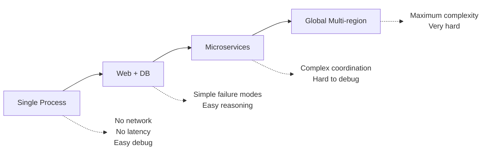
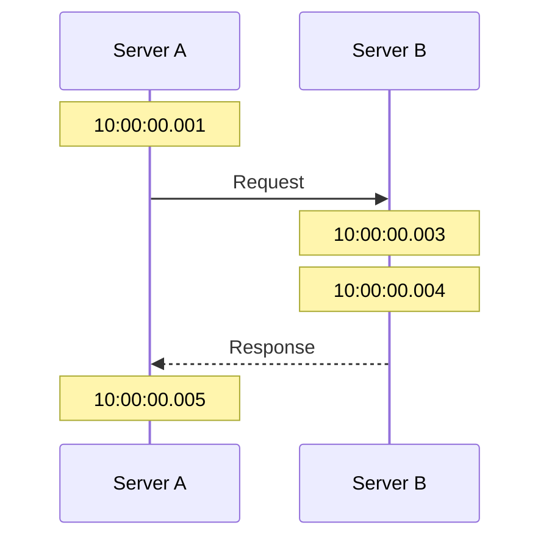
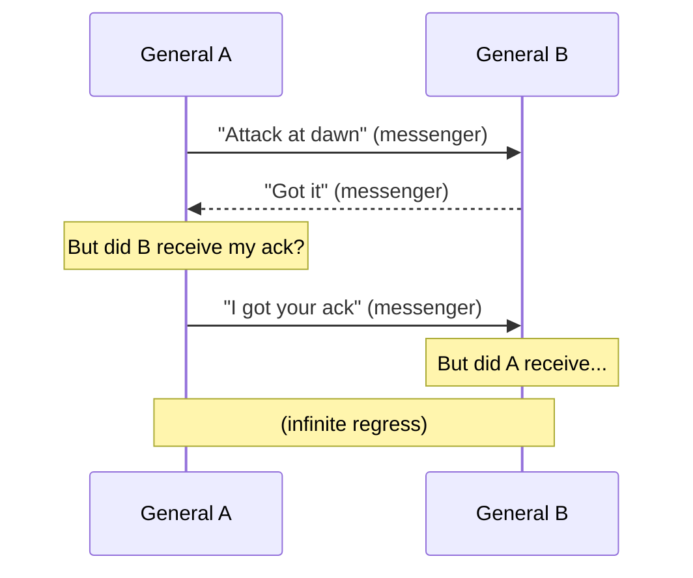

> **Complexity**: `[MEDIUM]`
>
> **Time to Complete**: 25-30 minutes
>
> **Prerequisites**: [Systems Thinking Track](/platform/foundations/systems-thinking/) (recommended)
>
> **Track**: Foundations

### What You'll Be Able to Do

After completing this module, you will be able to:

1. **Explain** the eight fallacies of distributed computing and identify where each manifests in real cloud-native architectures
2. **Analyze** a system's architecture to determine which components introduce distributed-system challenges (partial failure, network partitions, clock skew)
3. **Design** service boundaries that account for the inherent unreliability of network communication between components
4. **Evaluate** when a distributed architecture is justified versus when a simpler single-process design would be more reliable and maintainable

---

**February 28, 2017. Amazon Web Services experiences what would become one of the most costly outages in cloud computing history.**

A simple typo in a command to remove a small number of S3 servers accidentally removes a larger set of servers than intended. The servers being removed supported the S3 index and placement systems—the metadata layer that tracks where every object is stored.

**For the next 4 hours, S3 in US-East-1 was essentially offline.** But the real impact was just beginning. Hundreds of other AWS services depended on S3. Websites couldn't load images. Applications couldn't access configuration. CI/CD pipelines failed. The AWS status dashboard—itself hosted on S3—couldn't display that S3 was down.

The cascade revealed what most engineers knew but rarely confronted: **even the simplest web application is a distributed system**, with hidden dependencies, partial failures, and emergent behaviors that no single person fully understands.

**S&P 500 companies collectively lost an estimated $150 million during the outage.** And it all started because distributed systems don't behave like the single-machine programs most engineers learn to write.

This module teaches why distributed systems are fundamentally different—and why understanding their constraints is essential for building anything that scales.

---

## Why This Module Matters

Every modern system is distributed. The moment you have a web server talking to a database, you have a distributed system. The moment you deploy to the cloud, you're distributed across availability zones. The moment you scale beyond one machine, distribution becomes your reality.

But distributed systems don't behave like single machines. Things that were easy become hard. Things that were guaranteed become probabilistic. Assumptions that held for decades suddenly break. The sooner you understand why, the sooner you can design systems that actually work.

This module introduces the fundamental challenges of distributed systems—the laws of physics and logic that constrain what's possible, and the patterns that emerge when you can't escape them.

> **The Space Station Analogy**
>
> Imagine Mission Control in Houston talking to astronauts on the International Space Station. Messages take time to travel. Signals can be lost. The astronauts can't wait for permission before every action—they need autonomy. And Mission Control can't know the exact state of the station at any instant. Every distributed system faces the same challenges: latency, unreliability, and uncertainty about remote state.

---

## What You'll Learn

- What makes a system "distributed" (and why it matters)
- The fundamental challenges: latency, partial failure, no global clock
- The CAP theorem and what it really means
- Why distributed systems require different thinking
- How Kubernetes is a distributed system

---

## Part 1: Defining Distributed Systems

### 1.1 What is a Distributed System?

```text
DISTRIBUTED SYSTEM DEFINITION
═══════════════════════════════════════════════════════════════

A distributed system is one where:
- Components run on multiple networked computers
- Components coordinate by passing messages
- The system appears as a single coherent system to users

Leslie Lamport's definition:
"A distributed system is one in which the failure of a computer
you didn't even know existed can render your own computer unusable."

KEY PROPERTIES
─────────────────────────────────────────────────────────────
1. CONCURRENCY: Multiple things happen simultaneously
2. NO GLOBAL CLOCK: No single source of "now"
3. INDEPENDENT FAILURE: Parts can fail without others knowing
4. MESSAGE PASSING: Communication via network, not shared memory
```

### 1.2 Why Distribute?

```text
REASONS TO DISTRIBUTE
═══════════════════════════════════════════════════════════════

SCALABILITY
─────────────────────────────────────────────────────────────
One machine has limits. Need more capacity? Add more machines.

    Single server: 10,000 requests/sec max
    10 servers: 100,000 requests/sec
    100 servers: 1,000,000 requests/sec

AVAILABILITY
─────────────────────────────────────────────────────────────
One machine will fail. Multiple machines can cover for each other.

    Single server: Server dies -> System dies
    Multiple servers: Server dies -> Others handle load

LATENCY
─────────────────────────────────────────────────────────────
Physics limits speed. Put data closer to users.

    US user -> US server: 20ms
    US user -> Europe server: 100ms
    US user -> Asia server: 200ms

ORGANIZATIONAL
─────────────────────────────────────────────────────────────
Different teams, different services, different deployment cycles.

    Monolith: One team, one deployment, everyone waits
    Microservices: Independent teams, independent deploys
```

### 1.3 The Distribution Spectrum



Most systems live in the middle—distributed enough to need the mental models, but not so distributed that nothing works.

> **Try This (2 minutes)**
>
> Think about a system you work with. Where does it fall on the spectrum?
>
> | Component | Runs Where | Communicates Via |
> |-----------|------------|------------------|
> | | | |
> | | | |
> | | | |
>
> Is it more distributed than you initially thought?

---

## Part 2: The Fundamental Challenges

### 2.1 Challenge #1: Latency

```text
LATENCY: THE SPEED OF LIGHT PROBLEM
═══════════════════════════════════════════════════════════════

In a single machine:
    Function call: ~1 nanosecond
    Memory access: ~100 nanoseconds

Across a network:
    Same datacenter: ~500 microseconds (500,000 ns)
    Cross-country: ~30 milliseconds (30,000,000 ns)
    Cross-ocean: ~100 milliseconds (100,000,000 ns)

IMPACT
─────────────────────────────────────────────────────────────
-------------------------------------------------------------
  Local call:     1 ns
  Network call:   1,000,000 ns (1 ms)

  That's 1,000,000x slower!

  Design that works locally can be disastrous distributed.

  Example: Loop with 100 database calls
    Local: 100 × 1ns = 100ns
    Network: 100 × 1ms = 100ms (user notices!)
-------------------------------------------------------------

LATENCY NUMBERS EVERY PROGRAMMER SHOULD KNOW
─────────────────────────────────────────────────────────────
L1 cache reference:                    0.5 ns
L2 cache reference:                      7 ns
Main memory reference:                 100 ns
SSD random read:                    16,000 ns   (16 μs)
Network round trip (same DC):      500,000 ns   (500 μs)
Disk seek:                       2,000,000 ns   (2 ms)
Network round trip (US->EU):    100,000,000 ns   (100 ms)
```

> **Stop and think**: If the speed of light is a hard physical limit on network latency, how can a global system like a Content Delivery Network (CDN) serve files to users worldwide in just a few milliseconds?

### 2.2 Challenge #2: Partial Failure

```text
PARTIAL FAILURE: THE UNRELIABILITY PROBLEM
═══════════════════════════════════════════════════════════════

In a single machine:
    Either the whole thing works, or the whole thing crashes.
    Failure is total and obvious.

In a distributed system:
    Part can fail while other parts continue.
    Failure can be partial, intermittent, or undetectable.

FAILURE MODES
─────────────────────────────────────────────────────────────
-------------------------------------------------------------
  CRASH FAILURE
    Node stops responding entirely.
    At least you know it's dead.

  OMISSION FAILURE
    Messages lost. Did the server get my request?
    Did it respond but I didn't receive?

  TIMING FAILURE
    Response came, but too slow. Did it timeout?
    Did it complete? Is it still running?

  BYZANTINE FAILURE
    Component lies or behaves maliciously.
    Hardest to handle. Usually assume this won't happen.
-------------------------------------------------------------

THE FUNDAMENTAL UNCERTAINTY
─────────────────────────────────────────────────────────────
You send a request. No response. What happened?

    1. Request was lost in transit?
    2. Server crashed before processing?
    3. Server crashed after processing?
    4. Response was lost in transit?
    5. Server is just slow?

You cannot distinguish these cases from the client side.
This is fundamental. No protocol can solve it.
```

### 2.3 Challenge #3: No Global Clock



Which happened first? The request or the response?

Server A says: Request at 10:00:00.001, response at 10:00:00.005
Server B says: Request at 10:00:00.003, response at 10:00:00.004

Server B's clock is 2ms ahead. The timestamps are misleading.

**CONSEQUENCES**
- Can't use timestamps to order events across machines
- "Last write wins" requires agreeing on what "last" means
- Debugging is hard: logs from different servers don't align
- Need logical clocks (Lamport clocks, vector clocks) for ordering

> **War Story: The $12 Million Clock Skew Incident**
>
> **March 2018. A high-frequency trading firm discovers they've been losing money for months—not from bad trades, but from bad timestamps.**
>
> The firm operated trading servers in both New Jersey and Chicago. The servers used NTP to synchronize clocks, but NTP only guarantees accuracy within tens of milliseconds. The clocks had drifted 47ms apart.
>
> When a trade executed in Chicago triggered a hedge trade in New Jersey, the timestamps sometimes showed the hedge happening *before* the original trade. The reconciliation system, which used timestamps to order events, processed them wrong. Sometimes hedges were cancelled as "duplicate trades." Sometimes positions were calculated incorrectly.
>
> **Timeline of discovery:**
> - **Day 1**: Risk analyst notices P&L discrepancies in overnight reports
> - **Week 2**: Engineering traces problem to event ordering logic
> - **Week 3**: Clock drift identified as root cause
> - **Week 4**: Logical clocks implemented (Lamport timestamps)
> - **Month 2**: Full audit reveals $12 million in losses over 6 months
>
> **The fix**: The team replaced wall-clock ordering with Lamport timestamps. Every event now carries a logical clock value that increments with each operation. When server A sends a message to server B, it includes its clock value. Server B sets its clock to max(its_clock, received_clock) + 1. This guarantees that caused events always have higher timestamps than their causes—regardless of what the physical clocks say.
>
> **The lesson**: In distributed systems, "when" something happened is less important than "what caused what." Physical time is unreliable. Causal ordering is essential.

---

## Part 4: The CAP Theorem

### 3.1 Understanding CAP

```text
THE CAP THEOREM
═══════════════════════════════════════════════════════════════

In a distributed system, you can have at most TWO of:

    C - CONSISTENCY
        Every read receives the most recent write.
        All nodes see the same data at the same time.

    A - AVAILABILITY
        Every request receives a response.
        System is always operational.

    P - PARTITION TOLERANCE
        System continues operating despite network partitions.
        Messages between nodes can be lost or delayed.

THE CATCH
─────────────────────────────────────────────────────────────
Network partitions WILL happen. You don't get to choose.

So really, during a partition you choose between:
    CP: Consistent but unavailable during partition
    AP: Available but possibly inconsistent during partition

-------------------------------------------------------------
     Normal operation: You can have all three!

     During partition: Choose C or A

         CP: Reject requests to maintain consistency
         AP: Accept requests, reconcile later
-------------------------------------------------------------
```

### 3.2 CAP in Practice

```text
CAP TRADE-OFFS IN REAL SYSTEMS
═══════════════════════════════════════════════════════════════

CP SYSTEMS (Consistent, Partition-tolerant)
─────────────────────────────────────────────────────────────
During partition: Refuse some requests to maintain consistency

Examples:
    - Traditional RDBMS with synchronous replication
    - ZooKeeper
    - etcd (Kubernetes' brain)
    - MongoDB with majority write concern

Use when: Correctness matters more than availability
    - Financial transactions
    - Inventory systems
    - Coordination services

AP SYSTEMS (Available, Partition-tolerant)
─────────────────────────────────────────────────────────────
During partition: Accept requests, data may diverge

Examples:
    - Cassandra
    - DynamoDB (eventually consistent reads)
    - DNS
    - Caches

Use when: Availability matters more than immediate consistency
    - Shopping carts
    - Social media feeds
    - Metrics/logging

REALITY CHECK
─────────────────────────────────────────────────────────────
Most systems need BOTH consistency AND availability.
The choice is: which to sacrifice DURING a partition?

Partitions are rare but not rare enough to ignore.
Design for partition. Choose your trade-off deliberately.
```

### 3.3 Beyond CAP: PACELC

```text
PACELC: A MORE COMPLETE MODEL
═══════════════════════════════════════════════════════════════

CAP only talks about partitions. But what about normal operation?

PACELC: If Partition, then Availability vs Consistency,
        Else, Latency vs Consistency

-------------------------------------------------------------
   During Partition (P):
       Choose A (availability) or C (consistency)

   Else (normal operation):
       Choose L (latency) or C (consistency)

   PA/EL: Available during partition, low latency normally
          (Cassandra, DynamoDB)

   PC/EC: Consistent during partition, consistent normally
          (Traditional RDBMS, etcd)

   PA/EC: Available during partition, consistent normally
          (Some configs of MongoDB)
-------------------------------------------------------------

This model acknowledges that even in normal operation,
you trade latency for consistency (synchronous replication)
or consistency for latency (asynchronous replication).
```

> **Try This (3 minutes)**
>
> For each scenario, which trade-off makes sense?
>
> | Scenario | During Partition | Why |
> |----------|------------------|-----|
> | Bank account balance | CP | Can't show wrong balance |
> | Social media likes count | AP | |
> | Kubernetes pod state | | |
> | Shopping cart | | |
> | DNS | | |

---

## Part 4: Distributed System Patterns

### 4.1 The Two Generals Problem



**IMPOSSIBILITY**
There is NO protocol that guarantees agreement if messages can be lost. This is proven mathematically impossible.

**IMPLICATIONS FOR DISTRIBUTED SYSTEMS**
You cannot guarantee that two nodes agree on anything if the network is unreliable. The best you can do:
- Increase probability (retries, acknowledgments)
- Accept uncertainty (eventual consistency)
- Use consensus protocols (Paxos, Raft) when possible

### 4.2 The Byzantine Generals Problem

```text
BYZANTINE GENERALS PROBLEM
═══════════════════════════════════════════════════════════════

Same as Two Generals, but worse:
    - Some generals might be traitors
    - Traitors send conflicting messages to different generals
    - Loyal generals must still reach agreement

THE CHALLENGE
─────────────────────────────────────────────────────────────
    General A: "Attack!"
    General B: "Attack!" (traitor, tells C "Retreat")
    General C: "Attack!"

    C receives: "Attack" from A, "Retreat" from B
    A receives: "Attack" from B (B lies), "Attack" from C

    How can A and C agree despite B's lies?

SOLUTION REQUIREMENTS
─────────────────────────────────────────────────────────────
To tolerate f Byzantine (lying) nodes, you need 3f + 1 total.

    1 traitor -> need 4 generals
    2 traitors -> need 7 generals

This is expensive! Most systems assume no Byzantine failures.

WHERE IT MATTERS
─────────────────────────────────────────────────────────────
- Blockchain (trustless networks)
- Safety-critical systems (aviation, medical)
- Systems where nodes might be compromised

Most internal systems assume nodes are honest but buggy.
They handle crash failures, not Byzantine failures.
```

### 4.3 Idempotency

```text
ID