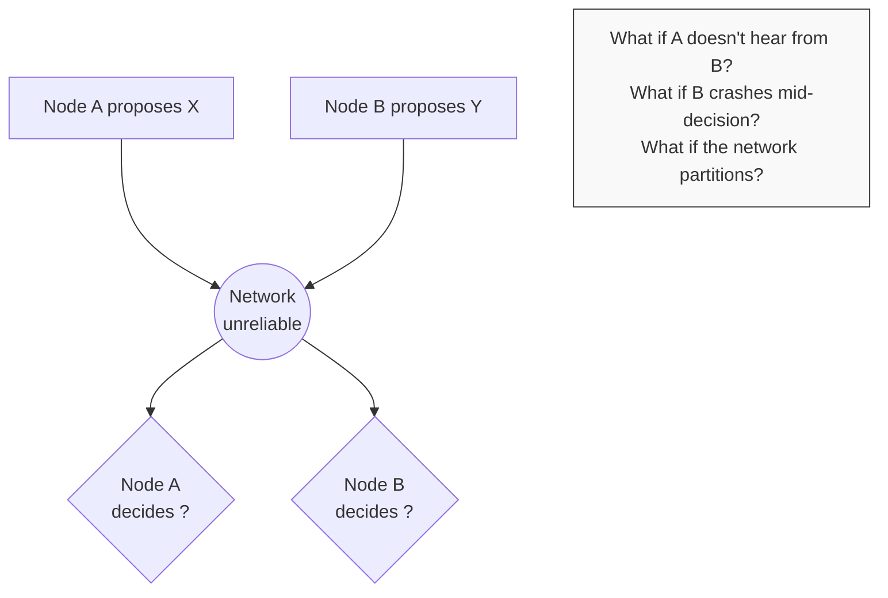
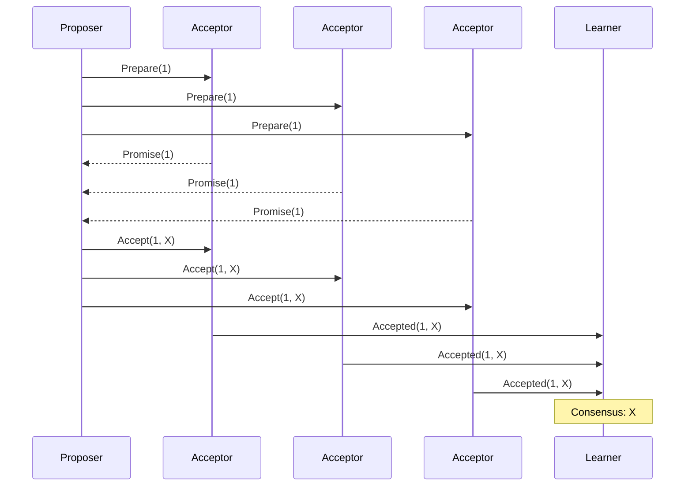
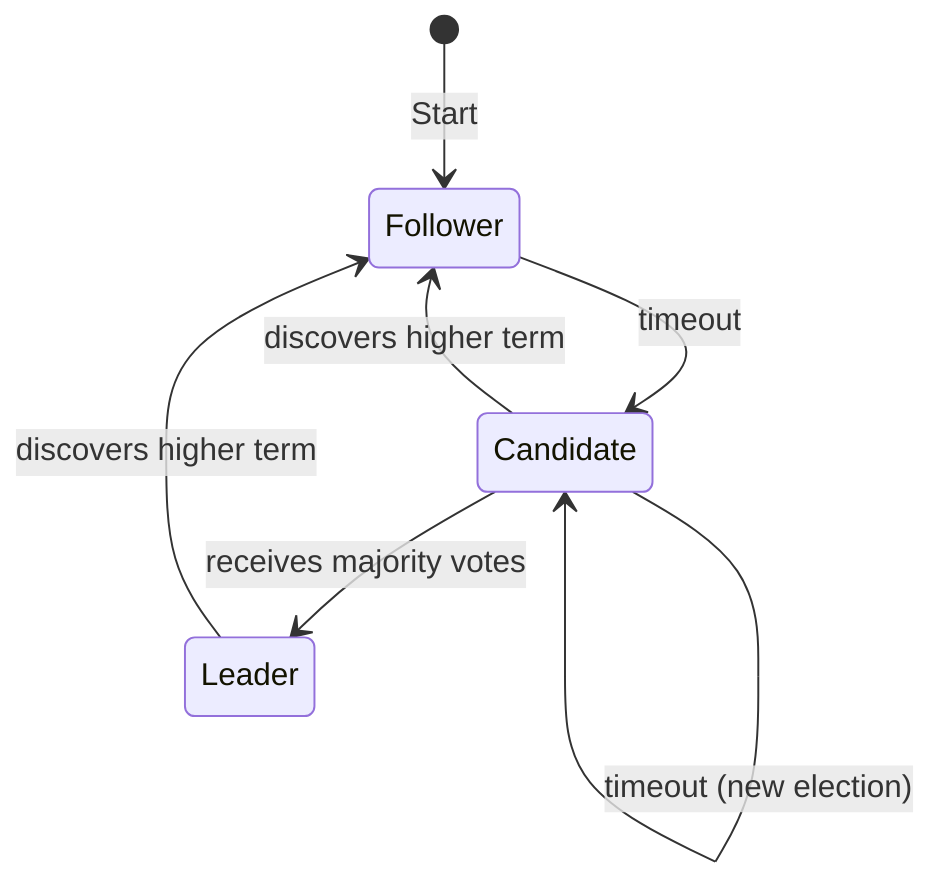
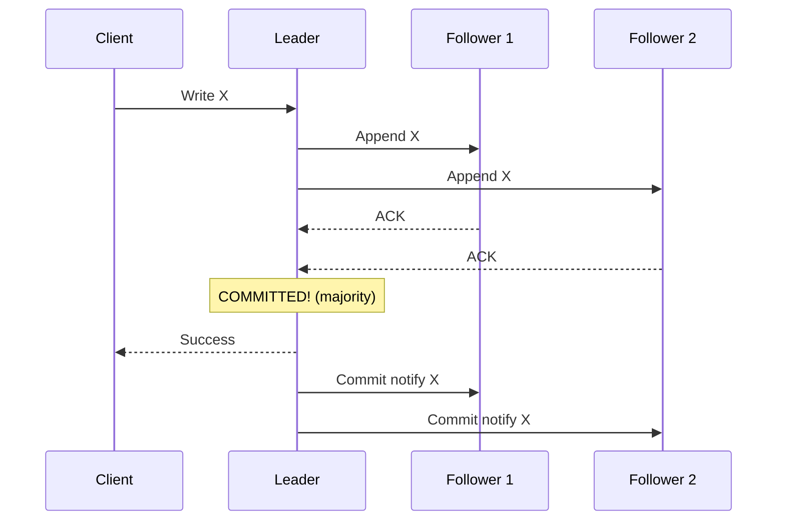
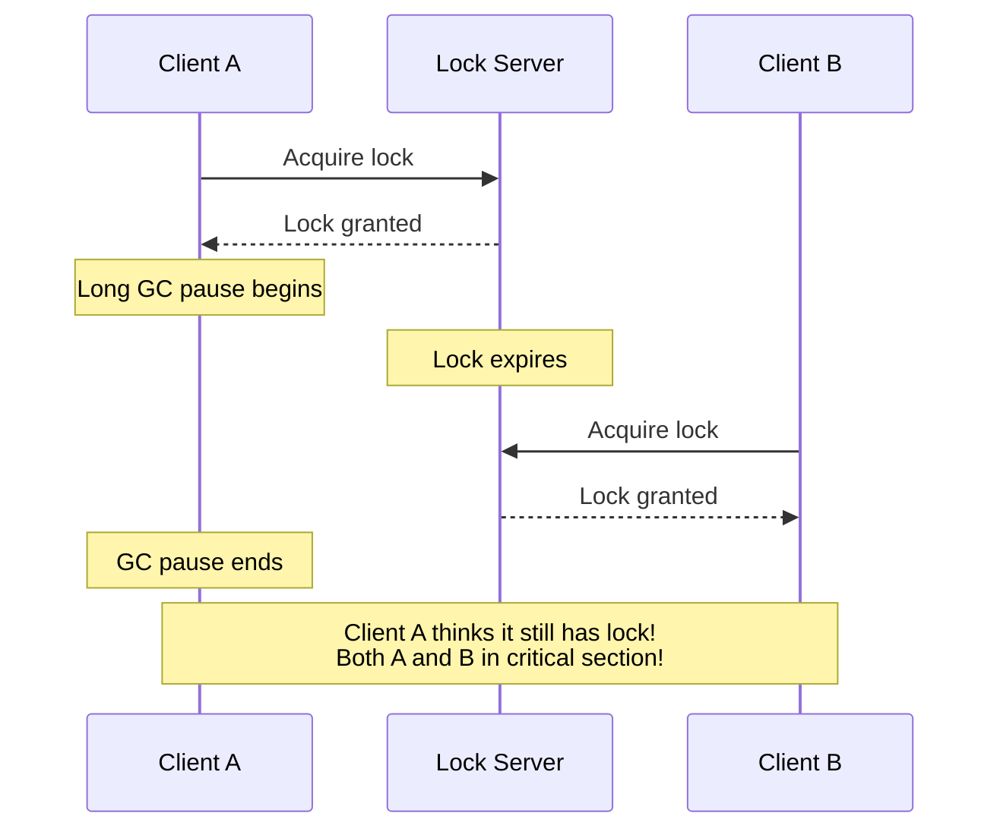

> **Complexity**: `[COMPLEX]`
>
> **Time to Complete**: 35-40 minutes
>
> **Prerequisites**: [Module 5.1: What Makes Systems Distributed](../module-5.1-what-makes-systems-distributed/)
>
> **Track**: Foundations

### What You'll Be Able to Do

After completing this module, you will be able to:

1. **Explain** how Raft and Paxos achieve consensus and why the FLP impossibility theorem constrains all consensus protocols
2. **Evaluate** consensus-based systems (etcd, ZooKeeper, Consul) by analyzing their quorum requirements, failure tolerance, and split-brain prevention
3. **Design** coordination patterns (leader election, distributed locks, barrier synchronization) appropriate for different consistency requirements
4. **Diagnose** consensus failures by analyzing quorum loss scenarios, network partitions, and leader election storms in production systems

---

**November 24, 2014. A routine database migration at a major financial services company triggers one of the most expensive consensus failures in banking history.**

The company operated a distributed trading system with five database nodes using Paxos-based replication. During the migration, a network misconfiguration caused three nodes to become unreachable from each other—but each could still reach some of the remaining two nodes. The Paxos implementation had a subtle bug: under this specific partition pattern, two different nodes each believed they had achieved quorum.

**For 45 minutes, the trading system had two leaders accepting conflicting writes.** One leader processed $127 million in buy orders. The other processed $89 million in sell orders for the same securities. When the partition healed and the nodes attempted to reconcile, the conflict was irreconcilable—the audit log showed trades that couldn't have both happened.

**The total cost: $23 million in immediate losses from voided trades, $31 million in regulatory fines for order book integrity violations, and $180 million in customer lawsuit settlements.** The root cause wasn't the network—it was a consensus algorithm implementation that hadn't been tested against byzantine partition scenarios.

This module teaches consensus: how distributed systems reach agreement, why it's deceptively hard, and why getting it wrong can cost more than most companies earn in a year.

---

## Why This Module Matters

How do you get multiple computers to agree on something? It sounds simple—until network partitions split them, messages get lost, and nodes crash mid-decision. Yet agreement is essential: which node is the leader? Is this transaction committed? What's the current configuration?

**Consensus** is the foundation of reliable distributed systems. Without it, you can't have consistent replicated databases, reliable leader election, or fault-tolerant coordination. Understanding consensus helps you choose the right tools and understand their limitations.

This module explores how distributed systems reach agreement—the algorithms, the trade-offs, and where you'll encounter consensus in practice.

> **The Committee Analogy**
>
> Imagine a committee that must vote on decisions, but members are in different cities and can only communicate by mail. Letters get lost. Some members don't respond. The committee must still make decisions. How do they ensure everyone agrees on what was decided? This is the consensus problem—made harder because there's no chairperson everyone trusts.

---

## What You'll Learn

- What consensus means and why it's hard
- Key consensus algorithms (Paxos, Raft)
- How leader election works
- Distributed locks and coordination
- How etcd and ZooKeeper implement consensus
- When you need consensus (and when you don't)

---

## Part 1: The Consensus Problem

### 1.1 What is Consensus?

```
CONSENSUS DEFINITION
═══════════════════════════════════════════════════════════════

Consensus: Getting multiple nodes to agree on a single value.

REQUIREMENTS
─────────────────────────────────────────────────────────────
1. AGREEMENT: All non-faulty nodes decide on the same value
2. VALIDITY: The decided value was proposed by some node
3. TERMINATION: All non-faulty nodes eventually decide

SOUNDS SIMPLE, BUT...
─────────────────────────────────────────────────────────────
```



### 1.2 Why Consensus is Hard

```
THE FLP IMPOSSIBILITY RESULT
═══════════════════════════════════════════════════════════════

Fischer, Lynch, and Paterson proved (1985):

    In an asynchronous system where even ONE node might crash,
    there is NO algorithm that guarantees consensus.

ASYNCHRONOUS = No timing assumptions
    - Messages can take arbitrarily long
    - You can't tell if a node crashed or is just slow

THE PROBLEM
─────────────────────────────────────────────────────────────
You're waiting for Node B's vote. No response.

Option 1: Wait forever
    Problem: If B crashed, you never decide (no termination)

Option 2: Proceed without B
    Problem: B might be alive and decide differently (no agreement)

Option 3: Use timeouts
    Problem: You might timeout a live node, or wait for a dead one

There's no perfect solution. Every algorithm makes trade-offs.

PRACTICAL IMPLICATIONS
─────────────────────────────────────────────────────────────
FLP says: Can't guarantee consensus in all cases.
Reality: Consensus is highly probable with good algorithms.

Algorithms like Paxos and Raft work in practice because:
- True asynchrony is rare (most messages arrive quickly)
- Random backoff prevents live-lock
- Timing assumptions usually hold
```

> **Stop and think**: If it's mathematically impossible to guarantee consensus in all situations, how do systems like Kubernetes run reliably in production every day? What assumptions do they make that the FLP theorem doesn't?

### 1.3 Consensus Use Cases

```
WHERE YOU NEED CONSENSUS
═══════════════════════════════════════════════════════════════

LEADER ELECTION
─────────────────────────────────────────────────────────────
"Who is the leader?"

Only one node should be leader at a time.
All nodes must agree on who it is.
If leader fails, elect a new one.

    Examples:
    - Kubernetes controller-manager
    - Database primary
    - Message queue broker

DISTRIBUTED LOCKS
─────────────────────────────────────────────────────────────
"Who holds the lock?"

Only one client can hold a lock at a time.
All nodes must agree on current holder.
If holder crashes, lock must be released.

    Examples:
    - Preventing duplicate processing
    - Coordinating batch jobs
    - Resource allocation

REPLICATED STATE MACHINES
─────────────────────────────────────────────────────────────
"What is the current state?"

All replicas apply the same operations in the same order.
Must agree on operation ordering.

    Examples:
    - etcd (Kubernetes configuration)
    - Replicated databases
    - Configuration management

ATOMIC COMMIT
─────────────────────────────────────────────────────────────
"Should this transaction commit?"

All participants must agree: commit or abort.
Can't have some commit and some abort.

    Examples:
    - Distributed transactions
    - Two-phase commit
    - Saga coordination
```

> **Try This (2 minutes)**
>
> Think of systems you use. Where is consensus happening?
>
> | System | Consensus For | What if it Fails? |
> |--------|---------------|-------------------|
> | Kubernetes | Leader election, etcd | |
> | | | |
> | | | |

---

## Part 2: Consensus Algorithms

### 2.1 Paxos: The Original

```
PAXOS (Leslie Lamport, 1989)
═══════════════════════════════════════════════════════════════

The first proven consensus algorithm.
Famous for being difficult to understand.
Basis for many production systems.

ROLES
─────────────────────────────────────────────────────────────
PROPOSERS: Suggest values (can be multiple)
ACCEPTORS: Vote on values (majority must agree)
LEARNERS: Learn the decided value

BASIC PAXOS (Single Value)
─────────────────────────────────────────────────────────────
Phase 1: PREPARE
    Proposer → Acceptors: "Prepare proposal number N"
    Acceptors → Proposer: "Promise to not accept < N"
                          (plus any already-accepted value)

Phase 2: ACCEPT
    If majority promised:
    Proposer → Acceptors: "Accept value V with number N"
    Acceptors → Learners: "Accepted V"

    If majority accept: Consensus reached!
```



```
WHY IT'S COMPLEX
─────────────────────────────────────────────────────────────
- Multiple proposers can conflict
- Must handle old proposals
- Single-decree Paxos decides ONE value
- Multi-Paxos for sequences (even more complex)
```

### 2.2 Raft: Understandable Consensus

```
RAFT (Diego Ongaro, 2014)
═══════════════════════════════════════════════════════════════

Designed for understandability.
Equivalent to Paxos but easier to implement.
Used by etcd, Consul, CockroachDB.

KEY INSIGHT
─────────────────────────────────────────────────────────────
Instead of symmetric nodes, use a leader.
Leader orders all decisions.
Consensus becomes: "elect leader" + "follow leader"

THREE SUB-PROBLEMS
─────────────────────────────────────────────────────────────
1. LEADER ELECTION: Choose a leader
2. LOG REPLICATION: Leader replicates log to followers
3. SAFETY: Ensure consistency despite failures

NODE STATES
─────────────────────────────────────────────────────────────
```



**State Transitions:**
- **Start**: All nodes are Followers
- **Timeout**: Follower becomes Candidate, requests votes
- **Majority**: Candidate becomes Leader
- **Failure**: Leader times out, new election

### 2.3 Raft Deep Dive

```
RAFT: LEADER ELECTION
═══════════════════════════════════════════════════════════════

TERMS
─────────────────────────────────────────────────────────────
Time divided into terms (epochs).
Each term has at most one leader.
Term number increases monotonically.

    Term 1: Node A is leader
    Term 2: Node A fails, Node B elected
    Term 3: Node B fails, Node C elected
```

> **Pause and predict**: If a network partition splits a 5-node cluster into a group of 3 and a group of 2, what will happen to the leader if it was in the group of 2?

```
ELECTION PROCESS
─────────────────────────────────────────────────────────────
1. Follower doesn't hear from leader (timeout)
2. Increments term, becomes candidate
3. Votes for itself, requests votes from others
4. Others vote if:
   - Haven't voted this term
   - Candidate's log is at least as up-to-date
5. Majority votes → becomes leader
6. No majority → timeout, new election with random delay

SPLIT VOTE PREVENTION
─────────────────────────────────────────────────────────────
Random election timeouts (150-300ms).
Unlikely two candidates timeout simultaneously.
If they do, random backoff ensures one wins next round.

RAFT: LOG REPLICATION
═══════════════════════════════════════════════════════════════

Leader receives client requests.
Appends to local log.
Replicates to followers.
Once majority acknowledge, entry is "committed."
Leader notifies followers of commit.
```



```
LOG CONSISTENCY
─────────────────────────────────────────────────────────────
Leader's log is authoritative.
Followers must match leader.
If mismatch, leader sends earlier entries until sync.
```

> **War Story: The $4.2 Million etcd Split-Brain**
>
> **June 2019. A fintech startup's Kubernetes cluster loses $4.2 million in a single weekend due to an etcd misconfiguration.**
>
> The company ran a payment processing platform on Kubernetes. Their 3-node etcd cluster sat in a single availability zone—violating every high-availability best practice. When the network switch serving Node A failed, the cluster split: Node A was isolated, while Nodes B and C remained connected.
>
> **The timeline of disaster:**
> - **Friday 6:42 PM**: Network switch fails, partitioning Node A
> - **Friday 6:42 PM**: Nodes B and C detect missing heartbeat, start election
> - **Friday 6:43 PM**: Node B wins election with term 42 (majority: B+C = 2/3)
> - **Friday 6:43 PM - Sunday 2:00 AM**: System operates normally on B+C
> - **Friday 6:42 PM - Sunday 2:00 AM**: Node A continues receiving writes from misconfigured clients
>
> **The critical failure**: Some microservices had been configured with Node A's IP directly, bypassing the load balancer. These services kept writing to Node A, which accepted writes despite having no quorum—**the etcd version had a bug where stale leaders accepted reads but not writes, except through a deprecated API the microservices used**.
>
> **When the network healed Sunday morning:**
> - Node A rejoined with term 41 (stale)
> - Node A's 33 hours of writes were rejected—term 42 > term 41
> - 142,000 payment records existed only on Node A
> - Node A's data was overwritten by B+C's authoritative log
>
> **The cost:**
> - $3.1 million in customer refunds for lost payment confirmations
> - $1.2 million in emergency engineering (weekend rates, consultants)
> - $400,000 in regulatory penalties for payment processing failures
>
> **The fix**: The company moved to 5-node etcd across 3 availability zones, enforced all traffic through a load balancer with health checks, and implemented etcd endpoint monitoring that alerts on quorum loss within 30 seconds.

---

## Part 3: Leader Election

### 3.1 Why Leaders?

```
WHY USE LEADERS?
═══════════════════════════════════════════════════════════════

LEADERLESS (all nodes equal)
─────────────────────────────────────────────────────────────
    Every request needs coordination
    Complex conflict resolution
    Higher latency (wait for quorum)
    No single point of failure

LEADER-BASED
─────────────────────────────────────────────────────────────
    Leader orders all operations
    Simple decision making
    Lower latency (leader decides alone)
    Must handle leader failure

COMPARISON
─────────────────────────────────────────────────────────────
```

| Feature | Leaderless | Leader-based |
|---------|------------|--------------|
| **Writes** | Any node | Leader only |
| **Coordination** | Every write | Leader election |
| **Latency** | Higher | Lower |
| **Availability** | Higher | Lower (election) |
| **Complexity** | Complex reads | Complex failover |
| **Examples** | Cassandra | etcd, ZooKeeper |

### 3.2 Leader Election Mechanisms

```
LEADER ELECTION APPROACHES
═══════════════════════════════════════════════════════════════

BULLY ALGORITHM
─────────────────────────────────────────────────────────────
Highest ID wins. Simple but not partition-tolerant.

    Node 1 (ID=1): "I want to be leader"
    Node 2 (ID=2): "I have higher ID, step aside"
    Node 3 (ID=3): "I have highest ID, I'm leader"

CONSENSUS-BASED (Raft/Paxos)
─────────────────────────────────────────────────────────────
Nodes vote. Majority wins. Partition-tolerant.

    - Requires quorum for election
    - Leader has "lease" (term)
    - New election on leader failure

LEASE-BASED
─────────────────────────────────────────────────────────────
Leader holds time-limited lease. Must renew.

    Leader acquires lease (e.g., 15 seconds)
    Leader renews every 5 seconds
    If leader crashes, lease expires
    Others can acquire after expiry

    # Kubernetes leader election uses leases
    kubectl get leases -n kube-system

EXTERNAL COORDINATION
─────────────────────────────────────────────────────────────
Use external system (etcd, ZooKeeper) for coordination.

    Component → etcd: "I'm leader" (with lease)
    etcd: "OK, you're leader until lease expires"
    Other components: Watch etcd for current leader
```

### 3.3 Kubernetes Leader Election

```
KUBERNETES LEADER ELECTION
═══════════════════════════════════════════════════════════════

HOW IT WORKS
─────────────────────────────────────────────────────────────
Uses Lease objects in etcd.
Leader creates/renews lease.
Others watch lease, take over if expired.

EXAMPLE: CONTROLLER-MANAGER
─────────────────────────────────────────────────────────────
# View current leader
kubectl get lease kube-controller-manager -n kube-system -o yaml

apiVersion: coordination.k8s.io/v1
kind: Lease
metadata:
  name: kube-controller-manager
  namespace: kube-system
spec:
  holderIdentity: master-1_abc123    # Current leader
  leaseDurationSeconds: 15           # Lease validity
  renewTime: "2024-01-15T10:30:00Z"  # Last renewal

IMPLEMENTATION FOR YOUR APPS
─────────────────────────────────────────────────────────────
# Using client-go leader election

import (
    "k8s.io/client-go/tools/leaderelection"
)

leaderelection.RunOrDie(ctx, leaderelection.LeaderElectionConfig{
    Lock: &resourcelock.LeaseLock{
        LeaseMeta: metav1.ObjectMeta{
            Name:      "my-app-leader",
            Namespace: "default",
        },
    },
    LeaseDuration: 15 * time.Second,
    RenewDeadline: 10 * time.Second,
    RetryPeriod:   2 * time.Second,
    Callbacks: leaderelection.LeaderCallbacks{
        OnStartedLeading: func(ctx context.Context) {
            // I'm the leader, do leader work
        },
        OnStoppedLeading: func() {
            // I'm no longer leader
        },
    },
})
```

---

## Part 4: Distributed Locks and Coordination

### 4.1 Distributed Locks

```
DISTRIBUTED LOCKS
═══════════════════════════════════════════════════════════════

PURPOSE
─────────────────────────────────────────────────────────────
Ensure only one process does something at a time.
Coordinate access to shared resources.

LOCAL LOCK (single machine)
─────────────────────────────────────────────────────────────
    mutex.Lock()
    // Critical section
    mutex.Unlock()

    Simple. Process crashes → OS releases lock.

DISTRIBUTED LOCK (multiple machines)
─────────────────────────────────────────────────────────────
    // Acquire lock from coordination service
    lock.Acquire("resource-x")
    // Critical section
    lock.Release("resource-x")

    Complex. Process crashes → Who releases lock?

THE PROBLEM WITH DISTRIBUTED LOCKS
─────────────────────────────────────────────────────────────
```



> **Stop and think**: Why does a distributed lock need a TTL (time-to-live) in the first place? What would happen if a client acquired a lock without a TTL and then crashed permanently before releasing it?

```
SOLUTION: FENCING TOKENS
─────────────────────────────────────────────────────────────
Lock server issues incrementing token with each acquisition.
Resource checks token, rejects stale tokens.

    Client A gets lock with token 33
    Client A pauses
    Lock expires, Client B gets lock with token 34
    Client A wakes, tries to write with token 33
    Resource rejects: 33 < 34 (stale)
```

### 4.2 Coordination Patterns

```
COORDINATION PATTERNS
═══════════════════════════════════════════════════════════════

DISTRIBUTED QUEUE
─────────────────────────────────────────────────────────────
Multiple workers, one task at a time.

    /tasks/task-001 → Worker A claims
    /tasks/task-002 → Worker B claims
    /tasks/task-003 → Worker C claims

    Workers watch for new tasks, claim by creating ephemeral node.

BARRIER (RENDEZVOUS)
─────────────────────────────────────────────────────────────
Wait until N nodes are ready, then proceed.

    Worker 1: Create /barrier/worker-1
    Worker 2: Create /barrier/worker-2
    Worker 3: Create /barrier/worker-3

    All watch /barrier. When count = N, all proceed.

    Use case: Coordinated restart, batch processing start.

SERVICE DISCOVERY
─────────────────────────────────────────────────────────────
Services register, clients find them.

    Service A: Create /services/api/instance-1 (ephemeral)
    Service A: Create /services/api/instance-2 (ephemeral)

    Client: List /services/api → [instance-1, instance-2]

    If service crashes, ephemeral node deleted automatically.

CONFIGURATION DISTRIBUTION
─────────────────────────────────────────────────────────────
Central config, all nodes watch.

    Admin: Write /config/feature-flags = {"new-ui": true}
    All nodes: Watch /config/feature-flags
    Change detected → All nodes update simultaneously
```

### 4.3 etcd and ZooKeeper

```
etcd vs ZooKeeper
═══════════════════════════════════════════════════════════════

SIMILARITIES
─────────────────────────────────────────────────────────────
Both provide:
- Distributed key-value store
- Strong consistency (linearizable)
- Watch mechanism (change notifications)
- TTL/leases (automatic expiration)
- Used for coordination, not data storage

DIFFERENCES
─────────────────────────────────────────────────────────────
```

| Feature | etcd | ZooKeeper |
|---------|------|-----------|
| **Protocol** | gRPC | Custom binary |
| **Consensus** | Raft | Zab (Paxos-like) |
| **Data model** | Flat key-value | Hierarchical (tree) |
| **API** | Simple KV | ZNodes (like files) |
| **Watches** | Efficient (stream) | One-time triggers |
| **Typical use** | Kubernetes | Kafka, Hadoop |
| **Language** | Go | Java |

```
etcd EXAMPLE
─────────────────────────────────────────────────────────────
# Set a key
etcdctl put /myapp/config '{"version": 2}'

# Get a key
etcdctl get /myapp/config

# Watch for changes
etcdctl watch /myapp/config

# Set with TTL (lease)
etcdctl lease grant 60
etcdctl put /myapp/leader "node-1" --lease=<lease-id>

ZOOKEEPER EXAMPLE
─────────────────────────────────────────────────────────────
# Create a znode
create /myapp/config '{"version": 2}'

# Get a znode
get /myapp/config

# Watch (one-time)
get /myapp/config -w

# Ephemeral node (deleted when session ends)
create -e /myapp/leader "node-1"
```

---

## Part 5: When to Use Consensus

### 5.1 Consensus is Expensive

```
THE COST OF CONSENSUS
═══════════════════════════════════════════════════════════════

LATENCY
─────────────────────────────────────────────────────────────
Every write requires:
    1. Client → Leader
    2. Leader → Followers (parallel)
    3. Followers → Leader (acknowledgments)
    4. Leader → Client (commit confirmation)

    Minimum: 2 round trips
    With geographic distribution: 100s of milliseconds

THROUGHPUT
─────────────────────────────────────────────────────────────
All writes go through leader.
Leader is bottleneck.
Can't horizontally scale writes.

    Single leader: ~10,000-50,000 writes/second typical
    Compare to Redis: ~100,000+ writes/second (no consensus)

AVAILABILITY
─────────────────────────────────────────────────────────────
Requires quorum (majority).
3 nodes: 1 can fail
5 nodes: 2 can fail
7 nodes: 3 can fail

    More nodes = better fault tolerance
    More nodes = slower consensus (more coordination)

COMPLEXITY
─────────────────────────────────────────────────────────────
Consensus algorithms are hard to implement correctly.
Subtle bugs can cause data loss.
Use battle-tested implementations (etcd, ZooKeeper).
```

### 5.2 When You Need Consensus

```
YOU NEED CONSENSUS WHEN
═══════════════════════════════════════════════════════════════

[YES] LEADER ELECTION
    Only one leader at a time, all must agree.
    Alternative: Live with multiple (might cause duplicates)

[YES] DISTRIBUTED LOCKS (if correctness matters)
    Only one holder, must be certain.
    Alternative: Optimistic locking with conflicts

[YES] CONFIGURATION CHANGES
    All nodes must see same config.
    Alternative: Eventual propagation (brief inconsistency)

[YES] TRANSACTION COMMIT
    All participants agree: commit or abort.
    Alternative: Sagas (compensating transactions)

[YES] TOTAL ORDERING
    All nodes process operations in same order.
    Alternative: Partial ordering or eventual consistency

YOU PROBABLY DONT NEED CONSENSUS WHEN
═══════════════════════════════════════════════════════════════

[NO] CACHING
    Stale data is acceptable.
    Use TTLs instead.

[NO] METRICS/LOGGING
    Approximate counts are fine.
    Eventual consistency is enough.

[NO] USER PREFERENCES
    Minor inconsistency is tolerable.
    Conflict-free data types (CRDTs) work well.

[NO] SHOPPING CART
    Merge conflicts on checkout.
    Eventual consistency with conflict resolution.
```

### 5.3 Alternatives to Consensus

```
ALTERNATIVES TO CONSENSUS
═══════════════════════════════════════════════════════════════

EVENTUAL CONSISTENCY
─────────────────────────────────────────────────────────────
Changes propagate asynchronously.
All nodes converge to same state... eventually.

    Pro: Higher availability, lower latency
    Con: Temporary inconsistency

CONFLICT-FREE REPLICATED DATA TYPES (CRDTs)
─────────────────────────────────────────────────────────────
Data structures that merge automatically.
No coordination needed.

    Examples:
    - G-Counter: Only grows (add, never subtract)
    - LWW-Register: Last-write-wins by timestamp
    - OR-Set: Observed-remove set

    Pro: No coordination, always available
    Con: Limited operations, eventual consistency

OPTIMISTIC CONCURRENCY
─────────────────────────────────────────────────────────────
Assume no conflicts. Detect and retry if wrong.

    Read record with version V
    Make changes
    Write "if version still V"
    If version changed, retry

    Pro: No locks, high concurrency
    Con: Retries under contention

SINGLE LEADER (NO CONSENSUS)
─────────────────────────────────────────────────────────────
One designated leader (not elected).
Simple but single point of failure.

    Pro: Simple, no consensus needed
    Con: Manual failover, downtime during failure
```

---

## Did You Know?

- **Paxos was rejected twice** by academic journals because reviewers found it too hard to understand. Lamport eventually published it as a "part-time parliament" allegory to make it more accessible.

- **Raft's name** comes from "Reliable, Replicated, Redundant, And Fault-Tolerant." It was specifically designed to be understandable—the paper includes a user study showing people learn Raft faster than Paxos.

- **Google's Chubby** (Paxos-based lock service) was so critical that when it went down for 15 minutes, more Google services failed than when a major datacenter lost power. Dependencies on coordination services can be dangerous.

- **etcd started at CoreOS** in 2013 as a simple key-value store for CoreOS's distributed init system. When Kubernetes adopted it as its brain, etcd became one of the most critical pieces of infrastructure in cloud-native computing—now running in production at virtually every major tech company.

---

## Common Mistakes

| Mistake | Problem | Solution |
|---------|---------|----------|
| Using consensus for everything | Slow, complex, bottleneck | Consensus only when needed |
| Wrong quorum size | 2 of 4 nodes isn't majority | Use odd numbers (3, 5, 7) |
| Ignoring leader election time | Brief unavailability on failover | Design for election pauses |
| Distributed locks without fencing | Stale clients corrupt data | Use fencing tokens |
| Rolling your own consensus | Subtle bugs, data loss | Use battle-tested implementations |
| Consensus across datacenters | High latency, frequent elections | Prefer regional consensus |

---

## Quiz

1. **Scenario**: You are tasked with building a highly reliable distributed database where three nodes must agree on the order of transactions. During testing, you notice that if the network becomes heavily congested, the system completely halts and refuses to commit new transactions. Why is this behavior actually expected rather than a bug?
   <details>
   <summary>Answer</summary>

   This behavior is expected due to the constraints of the FLP impossibility theorem, which states that in an asynchronous system where even one node might fail, no algorithm can guarantee consensus. Because the system cannot distinguish between a node that has crashed and one that is simply slow to respond due to network congestion, it must make a trade-off. In this scenario, the database has prioritized safety (agreement and validity) over liveness (termination). Practical consensus algorithms like Raft and Paxos accept that they cannot guarantee termination in all possible faulty states, choosing instead to pause operations rather than risk data corruption or split-brain scenarios.
   </details>

2. **Scenario**: In a 5-node etcd cluster powering a production Kubernetes environment, the current leader node suffers a hardware failure and abruptly dies. Walk through the exact mechanism the remaining four nodes use to recover and agree on the cluster's next state.
   <details>
   <summary>Answer</summary>

   When the leader dies, the remaining follower nodes will eventually stop receiving heartbeat messages, triggering an election timeout on one or more of them. The first node to time out increments its current term number and transitions to a candidate state, voting for itself and sending request-vote messages to the other nodes. The remaining nodes will grant their vote if they haven't voted in this term and if the candidate's log is at least as up-to-date as their own. Once the candidate receives a majority of votes, it assumes the role of leader and immediately begins sending heartbeats to establish its authority. This process ensures the cluster safely transitions to a new leader without any single point of failure disrupting the overall consensus.
   </details>

3. **Scenario**: You are implementing a distributed lock using a simple Redis key with a TTL. A developer asks why you can't just delete the key when the process finishes instead of worrying about fencing tokens. Explain the fundamental flaw in relying solely on TTLs and deletion for distributed locks.
   <details>
   <summary>Answer</summary>

   Relying solely on a TTL and deletion is fundamentally flawed because it assumes a perfectly synchronous environment where processes never freeze and networks never delay. If a process acquires a lock but experiences a massive garbage collection pause, the TTL will expire on the server while the process is completely unaware. When a second process inevitably acquires the now-free lock, both processes will eventually attempt to execute their critical sections concurrently, leading to silent data corruption. Fencing tokens are required because they shift the ultimate validation from the unreliable client processes to the storage layer itself. By ensuring the resource rejects any writes from a client holding a stale, older token, the system remains safe even when distributed lock guarantees temporarily break down.
   </details>

4. **Scenario**: A junior engineer proposes using etcd (which relies on Raft consensus) to store the high-volume clickstream events and real-time user metrics for a popular e-commerce website, arguing that "we need to ensure we never lose a click." Explain why this architectural choice will fail in production and what pattern should be used instead.
   <details>
   <summary>Answer</summary>

   Using a consensus-based system like etcd for high-volume clickstream data will quickly bottleneck the system and lead to severe performance degradation. Every write in a Raft cluster must go through the single leader node and be replicated to a majority of followers before it can be acknowledged, which introduces significant latency and caps the maximum throughput. Consensus algorithms prioritize strict linearizability and correctness over high availability and write throughput, making them entirely unsuited for transient, high-volume data like metrics. Instead, the team should use an eventually consistent system or a distributed message queue designed for high throughput. In these alternative systems, occasional data loss or reordering in clickstream analytics is an acceptable trade-off for the massive performance gains required at e-commerce scale.
   </details>

5. **Scenario**: You are configuring a new Raft-based service and set the election timeout to a fixed 200ms across all 5 nodes. During a network blip that drops the leader, the cluster completely fails to elect a new leader for several minutes, continuously timing out. What configuration error caused this cascading failure, and how does the protocol natively solve this?
   <details>
   <summary>Answer</summary>

   Setting a fixed, identical election timeout across all nodes virtually guarantees a persistent split-vote scenario during recovery. When the leader fails, all followers will time out at exactly the same moment, transition to candidates, and vote for themselves, preventing anyone from achieving a majority. This cycle will repeat indefinitely because they will all restart their candidate timers simultaneously, completely halting cluster operations. The Raft protocol natively solves this by requiring randomized election timeouts (for example, a random value between 150ms and 300ms) for each individual node. This randomness ensures that one node will reliably time out before the others, allowing it to request and win the necessary votes before competing candidates can even emerge.
   </details>

6. **Scenario**: Your global infrastructure team deploys a 7-node etcd cluster spread evenly across three datacenters: 3 nodes in US-East, 2 in EU-West, and 2 in AP-South. The transatlantic fiber cable is cut, completely isolating the US-East datacenter from the other two. Will the Kubernetes control planes in any of these regions continue to function, and why?
   <details>
   <summary>Answer</summary>

   Yes, the cluster will continue to function, but only the partition containing EU-West and AP-South will be able to accept writes and make progress. A 7-node cluster requires a quorum of 4 nodes to achieve consensus and confirm any state changes. The US-East datacenter only has 3 nodes, so it cannot form a quorum and will degrade to a read-only state, safely rejecting all new configuration changes to prevent a split-brain. However, the connected partition of EU-West and AP-South contains 4 nodes in total, giving them the exact majority needed to elect a new leader and continue processing writes. This demonstrates why careful distribution of nodes across fault domains is critical; if US-East had contained 4 nodes instead, the loss of a single datacenter would have taken down the entire global cluster.
   </details>

7. **Scenario**: A distributed lock has a 15-second TTL and a 5-second renewal heartbeat. Client A acquires the lock, but exactly 2 seconds later experiences a severe 20-second garbage collection pause. Walk through the exact timeline of events that leads to a split-brain state, and explain how a fencing token neutralizes this specific timeline.
   <details>
   <summary>Answer</summary>

   At T=0, Client A acquires the lock and begins processing, but at T=2 it enters a severe 20-second garbage collection pause. Because Client A is frozen, it cannot send the required 5-second renewal heartbeats, causing the lock server to expire the lock at T=15. At T=16, Client B acquires the newly available lock and begins legitimately writing to the shared resource. When Client A wakes up at T=22, it has no knowledge of the pause and still believes it holds the exclusive lock, resulting in both clients actively mutating the resource. A fencing token neutralizes this exact timeline because the shared resource would reject Client A's writes at T=22, recognizing that its associated token is older than the token currently being used by Client B.
   </details>

8. **Scenario**: Your organization is migrating a legacy Java-based Hadoop data lake and a modern Go-based Kubernetes microservices platform into a unified architecture. The architecture board wants to standardize on a single coordination service—either ZooKeeper or etcd—for both platforms to reduce operational overhead. Defend why standardizing on a single tool might be a mistake in this specific context.
   <details>
   <summary>Answer</summary>

   Standardizing on a single coordination service in this mixed environment ignores the native integrations and architectural assumptions of the respective ecosystems. The legacy Hadoop and Java stack relies heavily on ZooKeeper's hierarchical znode data model and has deep, battle-tested client libraries specifically built around those semantics. Conversely, the modern Kubernetes ecosystem is fundamentally designed around etcd's flat key-value store and highly efficient gRPC watch streams. Forcing Hadoop to use etcd, or Kubernetes to use ZooKeeper, would require building complex translation layers that introduce latency and significantly increase the risk of consensus-related outages. The operational overhead of running both services is far lower than the engineering cost and operational risk of fighting the native design patterns of these two major platforms.
   </details>

---

## Hands-On Exercise

**Task**: Explore consensus and coordination in Kubernetes.

**Part 1: Observe etcd Consensus (10 minutes)**

```bash
# If you have etcd access (e.g., kind cluster)
# List etcd members
kubectl exec -it -n kube-system etcd-<node> -- etcdctl member list

# Check etcd health
kubectl exec -it -n kube-system etcd-<node> -- etcdctl endpoint health

# Watch etcd statistics
kubectl exec -it -n kube-system etcd-<node> -- etcdctl endpoint status --write-out=table
```

Record cluster status:

| Node | Is Leader | Raft Term | Raft Index |
|------|-----------|-----------|------------|
| | | | |
| | | | |
| | | | |

**Part 2: Observe Leader Election (10 minutes)**

```bash
# View current leaders
kubectl get leases -n kube-system

# Watch leader lease for controller-manager
kubectl get lease kube-controller-manager -n kube-system -o yaml

# Observe holder identity and renew time
# Note: renewTime updates regularly while leader is healthy
```

**Part 3: Implement Simple Coordination (15 minutes)**

Create a ConfigMap that multiple pods watch:

```yaml
# coordination-config.yaml
apiVersion: v1
kind: ConfigMap
metadata:
  name: shared-config
  namespace: default
data:
  feature-flag: "false"
---
apiVersion: v1
kind: Pod
metadata:
  name: watcher-1
spec:
  containers:
  - name: watcher
    image: busybox
    command: ['sh', '-c', 'while true; do cat /config/feature-flag; sleep 5; done']
    volumeMounts:
    - name: config
      mountPath: /config
  volumes:
  - name: config
    configMap:
      name: shared-config
```

```bash
# Create the resources
kubectl apply -f coordination-config.yaml

# Watch the output
kubectl logs -f watcher-1

# In another terminal, update the config
kubectl patch configmap shared-config -p '{"data":{"feature-flag":"true"}}'

# Observe: Does the watcher see the change?
# (Note: ConfigMap volume updates have propagation delay)
```

**Success Criteria**:
- [ ] Observed etcd cluster state and leader
- [ ] Understood lease-based leader election
- [ ] Saw configuration propagation delay
- [ ] Understand why coordination services are needed

---

## Further Reading

- **"In Search of an Understandable Consensus Algorithm"** - Diego Ongaro. The Raft paper, specifically designed to be readable.

- **"Designing Data-Intensive Applications"** - Martin Kleppmann. Chapters 8-9 cover consensus, distributed transactions, and coordination.

- **"The Raft Visualization"** - raft.github.io. Interactive visualization of Raft consensus.

---

## Key Takeaways

Before moving on, ensure you understand:

- [ ] **Consensus fundamentals**: Getting nodes to agree on a single value with agreement (same value), validity (proposed value), and termination (eventual decision)
- [ ] **FLP impossibility**: In asynchronous systems, consensus can't be guaranteed with even one failure. Practical algorithms work because true asynchrony is rare
- [ ] **Raft mechanics**: Leader election via majority vote, log replication to followers, terms to prevent split-brain, random timeouts to break ties
- [ ] **Quorum math**: Majority = floor(n/2) + 1. For 5 nodes, need 3. For 7 nodes, need 4. Use odd numbers to avoid ties
- [ ] **Leader election trade-offs**: Leader-based is simpler and faster but requires failover. Leaderless is more available but more complex
- [ ] **Distributed lock dangers**: GC pauses, network delays can cause client to think it holds expired lock. Fencing tokens are essential
- [ ] **Consensus cost**: Every write requires 2 round trips through leader. Limited to ~10-50K writes/sec. Don't use for high-throughput data
- [ ] **When to avoid consensus**: Caching, metrics, logs, shopping carts—anywhere eventual consistency is acceptable. Save consensus for leader election, strong locks, transaction commits

---

## Next Module

[Module 5.3: Eventual Consistency](../module-5.3-eventual-consistency/) - When you don't need strong consistency, and how to make eventual consistency work.