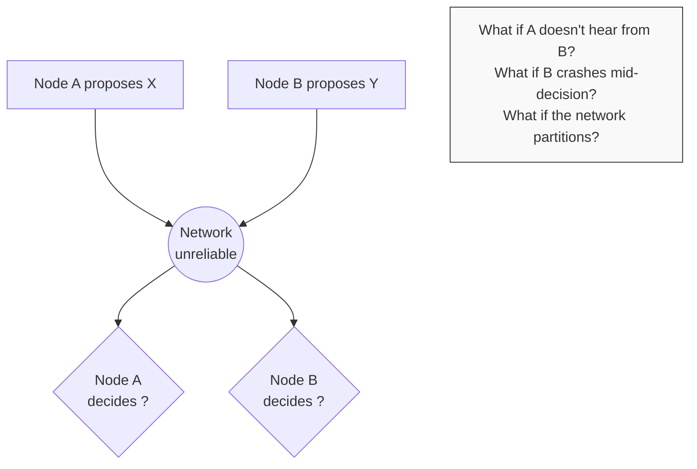
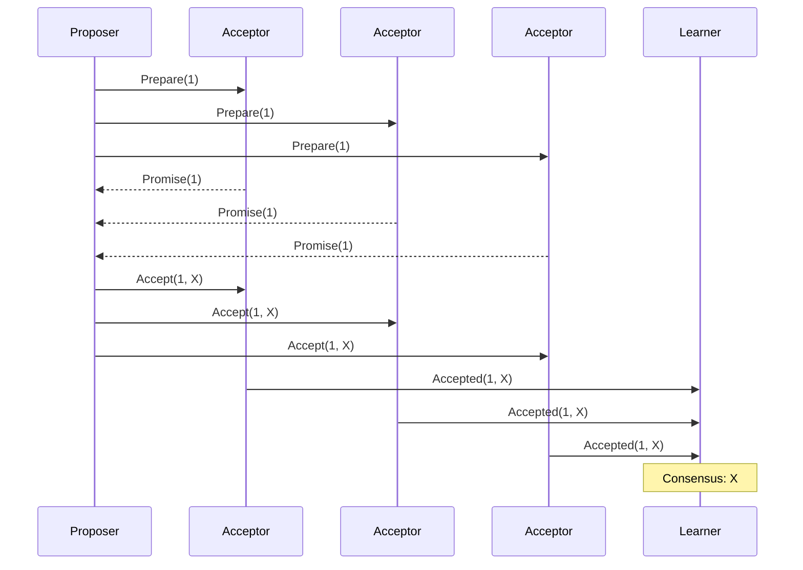
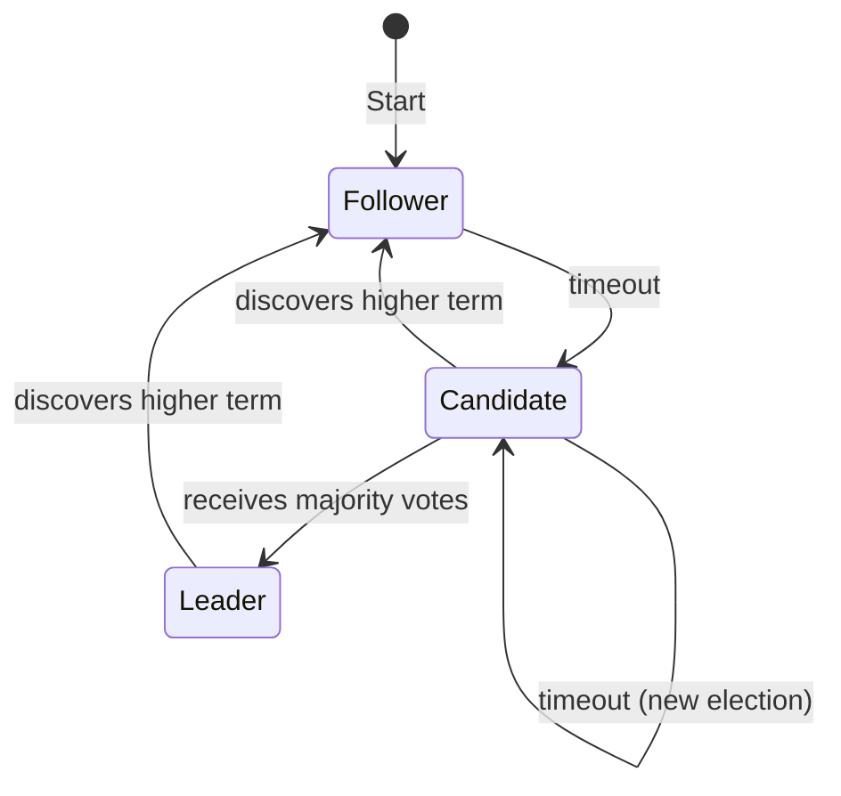
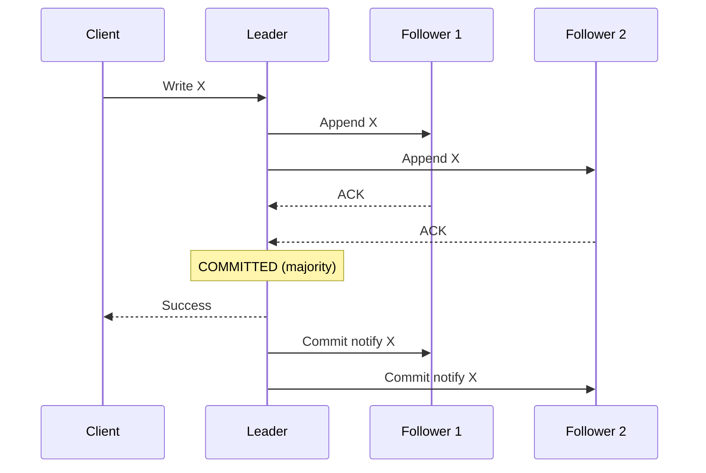
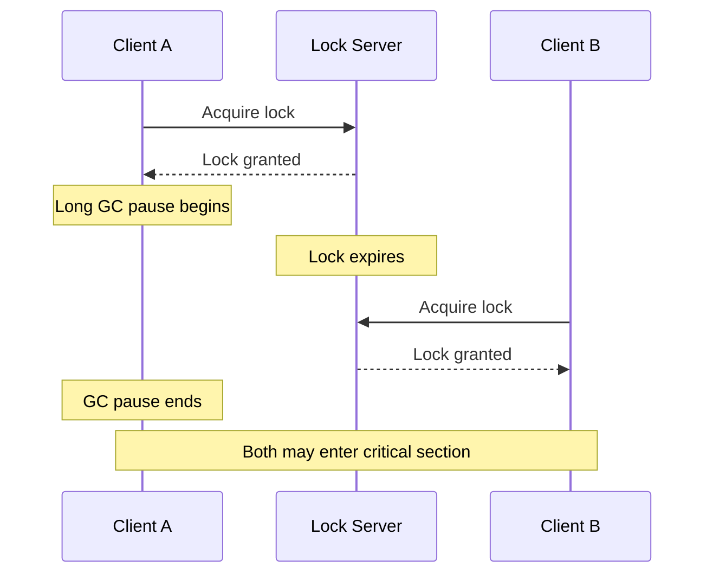
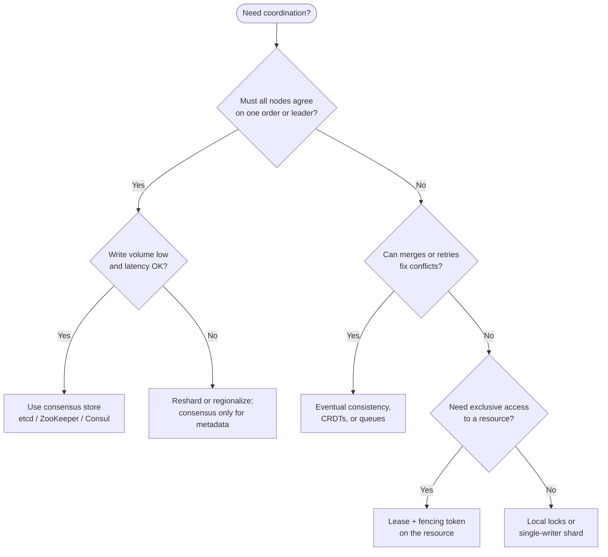

> **Complexity**: `[COMPLEX]`
>
> **Time to Complete**: 35-40 minutes
>
> **Prerequisites**: [Module 5.1: What Makes Systems Distributed](../module-5.1-what-makes-systems-distributed/)
>
> **Track**: Foundations

## What You'll Be Able to Do

After completing this module, you will be able to apply consensus theory to production architecture reviews, evaluate coordination stores under failure, and debug leader-election behavior using the durable outcomes below.

1. **Explain** how Raft and Paxos achieve consensus and why the FLP impossibility theorem constrains all consensus protocols
2. **Evaluate** consensus-based systems (etcd, ZooKeeper, Consul) by analyzing their quorum requirements, failure tolerance, and split-brain prevention
3. **Design** coordination patterns (leader election, distributed locks, barrier synchronization) appropriate for different consistency requirements
4. **Diagnose** consensus failures by analyzing quorum loss scenarios, network partitions, and leader election storms in production systems

---

## Why This Module Matters

How do you get multiple computers to agree on something? The question sounds simple until a network partition splits them, messages get lost, and nodes crash mid-decision. Agreement still matters: which node is the leader, whether a transaction committed, and what the current configuration is. **Consensus** is the foundation of reliable distributed systems. Without it, you cannot run consistent replicated databases, reliable leader election, or fault-tolerant coordination in production.

This module explores how distributed systems reach agreement, which algorithms engineers use, where the trade-offs live, and when consensus is worth its cost. You will learn why Paxos and Raft exist, how quorums prevent split brain, why distributed locks need fencing tokens, and when a lease or optimistic concurrency check is the better tool. The goal is not to memorize protocol steps, but to recognize consensus problems in architecture reviews and choose coordination mechanisms that match your consistency needs.

Strong coordination shows up in places that are easy to overlook. Service meshes elect control-plane leaders. Databases elect primaries. CI systems elect build executors. Each case needs an answer to the same question: who may mutate shared state right now? Weak coordination hides in caches and analytics pipelines where duplicates or delay are tolerable. Learning to classify workloads into those buckets keeps platforms fast without sacrificing safety on the metadata path.

> **The Committee Analogy**
>
> Imagine a committee that must vote on decisions, but members are in different cities and can only communicate by mail. Letters get lost, some members do not respond, and the committee must still make decisions. How do they ensure everyone agrees on what was decided when there is no chairperson everyone trusts? That is the consensus problem, and every production control plane faces a version of it.

---

## Part 1: The Consensus Problem

### 1.1 What is Consensus?

**Consensus** means getting multiple nodes to agree on a single value or on an ordered log of values. Formally, a consensus protocol aims for three properties. **Agreement** requires that all non-faulty nodes decide on the same value. **Validity** requires that the decided value was proposed by some node rather than invented by the protocol. **Termination** requires that every non-faulty node eventually decides rather than waiting forever.

These three properties sound modest, yet they are difficult to satisfy together when networks are unreliable and nodes fail independently. Consensus is not about one RPC succeeding; it is about a group converging on one outcome despite partial failure. That distinction matters when you design Kubernetes control planes, payment ledgers, or configuration stores.

Single-value consensus decides one proposal, such as which node is primary. Replicated log consensus decides an ordered sequence of operations, which is what state machines require. Database replication, configuration stores, and distributed locks all reduce to ordered logs sooner or later. When someone says "we need strong consistency," translate that statement into whether they need one agreed value now or a durable history forever.


```mermaid
flowchart TD
    A[Node A proposes X] --> N((Network<br>unreliable))
    B[Node B proposes Y] --> N
    N --> DA{Node A<br>decides ?}
    N --> DB{Node B<br>decides ?}

    classDef note fill:#f9f9f9,stroke:#333,stroke-width:1px;
    Note[What if A doesn't hear from B?<br>What if B crashes mid-decision?<br>What if the network partitions?]:::note
```

When Node A and Node B propose different values, the network may deliver some messages and drop others. A may decide while B still waits, or both may decide differently if the protocol is wrong. Correct consensus algorithms eliminate those outcomes by requiring majorities, monotonic terms, or prepared proposal numbers before any decision becomes binding.

Engineers sometimes confuse "everyone received the message" with "everyone agreed on the same decision." Broadcast alone is insufficient because recipients may process messages in different orders or miss retries. Consensus protocols add voting rounds, persistent promises, and leader serialization so that agreement survives retransmissions and crashes.

### 1.2 Why Consensus is Hard

In 1985, Fischer, Lynch, and Paterson published the **FLP impossibility result**. They proved that in a fully asynchronous model, where messages can take arbitrarily long and there are no reliable timeouts, no deterministic algorithm can guarantee consensus if even one process may crash. The proof exposes a cruel ambiguity: when you stop hearing from a peer, you cannot tell whether the peer crashed or is merely slow.

If you wait forever for the missing vote, you may violate termination because a crashed peer never responds. If you proceed without the missing vote, you may violate agreement because the slow peer might still be alive and decide differently. If you use a timeout, you are no longer in a purely asynchronous model; you are making a timing bet. FLP does not say consensus is impossible in practice. It says you cannot have a protocol that guarantees termination in every possible schedule without stepping outside strict asynchrony.

Real systems sidestep the theorem with partial synchrony assumptions, randomized backoff, and failure detectors implemented as timeouts. Paxos, Raft, and Zab all rely on those practical ingredients. They prioritize safety first: they would rather stop accepting writes than accept conflicting ones. Liveness returns when the network stabilizes and enough nodes can talk again.

Partial synchrony does not mean synchronized clocks across datacenters. It means there exists some period after an unknown but finite time when messages arrive within predictable bounds long enough for leaders to renew authority and for majorities to respond. Consensus implementations exploit those stable windows. During severe instability they pause, which operators experience as elevated latency or write unavailability rather than as corrupted state.

> **Stop and think**: If consensus cannot be guaranteed in all situations, how do systems like Kubernetes run reliably every day? What assumptions do they make that the FLP theorem does not?

### 1.3 Quorums and Fault Tolerance

Most consensus systems use **quorums**: any two quorums overlap, so two different majorities cannot make independent decisions. For `n` nodes, a quorum is typically `floor(n/2) + 1`. A cluster of three nodes tolerates one failure because the remaining two form a majority. A cluster of five tolerates two failures because three nodes still form a majority.

Engineers often choose odd-sized clusters because even sizes waste a node without increasing fault tolerance. Four nodes still require three for a quorum, same as three nodes, but you pay for an extra machine. The rule of thumb for tolerating `f` simultaneous failures is `2f + 1` nodes. That formula appears in etcd sizing guides, ZooKeeper deployment notes, and every Raft implementation review.

Quorums also define what happens during partitions. A minority partition cannot commit new writes because it cannot assemble a quorum. That behavior feels like an outage to clients pinned to the minority side, but it prevents split brain. Availability and consistency trade off here: the majority partition stays writable while the minority stops, which is the safe choice for coordination stores.

When you size a cluster, count failure domains rather than only node counts. Three nodes in one rack tolerate one machine failure but not rack power loss. Five nodes spread across three zones tolerate zone loss only if quorums cannot form inside a lost zone alone. Placement and quorum math must be designed together, otherwise you will discover gaps during the first real partition instead of during a tabletop exercise.

### 1.4 Consensus Use Cases

Consensus shows up wherever a group must pick one answer. **Leader election** asks which node is authoritative right now. **Distributed locks** ask which client may enter a critical section. **Replicated state machines** ask which operation happened in which order across replicas. **Atomic commit** asks whether a distributed transaction should commit or abort as a unit.

Kubernetes uses etcd, a Raft-backed store, to record desired cluster state. Controller-manager and scheduler components elect leaders through Lease objects so only one active controller mutates shared resources at a time. Kafka and Hadoop historically relied on ZooKeeper, which uses the Zab protocol, for similar coordination. The tool names differ, but the underlying need is the same: strong agreement under failure.

Atomic commit across microservices is another face of consensus. Two-phase commit asks every participant to prepare and then commit or abort together. Saga patterns relax all-or-nothing guarantees with compensating transactions. The consensus question still appears at the coordinator: did everyone agree on the outcome? If your business cannot tolerate divergent commit decisions, you need either consensus or a human reconciliation process.

> **Try This (2 minutes)**
>
> Think of systems you use. Where is consensus happening, and what breaks if it fails?
>
> | System | Consensus For | What if it Fails? |
> |--------|---------------|-------------------|
> | Kubernetes | Leader election, etcd | |
> | | | |
> | | | |

---

## Part 2: Consensus Algorithms

### 2.1 Paxos: The Original

Leslie Lamport introduced **Paxos** in the late 1980s as the first proven solution to consensus in asynchronous networks with crash failures. Paxos is famous for being correct and for being difficult to teach. Many production systems borrow Paxos ideas even when engineers implement Raft instead for clarity.

Paxos assigns three roles. **Proposers** suggest values. **Acceptors** vote on proposals and remember promises. **Learners** observe the chosen value once acceptors agree. Basic Paxos decides a single value in two phases. In the prepare phase, a proposer sends a proposal number and collects promises from a majority of acceptors not to accept older numbers. In the accept phase, the proposer sends a value with that number; if a majority accepts, consensus is reached.


```mermaid
sequenceDiagram
    participant P as Proposer
    participant A1 as Acceptor
    participant A2 as Acceptor
    participant A3 as Acceptor
    participant L as Learner

    P->>A1: Prepare(1)
    P->>A2: Prepare(1)
    P->>A3: Prepare(1)
    A1-->>P: Promise(1)
    A2-->>P: Promise(1)
    A3-->>P: Promise(1)
    P->>A1: Accept(1, X)
    P->>A2: Accept(1, X)
    P->>A3: Accept(1, X)
    A1->>L: Accepted(1, X)
    A2->>L: Accepted(1, X)
    A3->>L: Accepted(1, X)
    Note over L: Consensus: X
```

Multi-Paxos extends the idea to a sequence of log entries, which is what databases need, but the bookkeeping grows quickly. Competing proposers, stale proposal numbers, and learner notification all add operational complexity. That complexity is one reason Diego Ongaro and John Ousterhout designed Raft as an understandable alternative with equivalent safety properties for replicated logs.

Lamport's later paper [Paxos Made Simple](https://lamport.azurewebsites.net/pubs/paxos-simple.pdf) reframed the algorithm for practitioners, yet operational teams still prefer implementations with clear leader roles and explicit logs. Google Chubby, Spanner's Paxos groups, and numerous legacy systems prove Paxos at scale, but onboarding cost remains high. When you read about "Paxos-based" storage, ask whether the system uses single-decree Paxos, Multi-Paxos, or a derivative such as Zab that borrows Paxos-style quorums with different messaging shapes.

### 2.2 Raft: Understandable Consensus

**Raft**, published in 2014, reorganizes consensus around a strong leader. Instead of symmetric proposers competing at all times, Raft elects one leader that orders client requests and replicates them to followers. Consensus decomposes into leader election, log replication, and safety rules that keep logs consistent.

Raft nodes are followers by default. If followers stop receiving heartbeats from a leader, they start an election. A candidate requests votes; if it wins a majority, it becomes the new leader. The leader accepts client writes, appends them to its log, and replicates entries to followers. Under Raft §5.4.2, a leader may commit an entry from its **current term** directly once a majority has replicated it; entries from **prior terms** become committed only **indirectly**, when a current-term entry at a higher index commits and pulls them along — a leader cannot treat a replicated-on-majority old-term entry as safely committed on its own. Only then may the leader treat an operation as durable.


```mermaid
stateDiagram-v2
    [*] --> Follower: Start
    Follower --> Candidate: timeout
    Candidate --> Candidate: timeout (new election)
    Candidate --> Leader: receives majority votes
    Leader --> Follower: discovers higher term
    Candidate --> Follower: discovers higher term
```

This state machine is easier to teach than Paxos because there is one obvious writer at a time. etcd, Consul, CockroachDB, and many other systems implement Raft or a close variant for replicated logs.

Followers are passive except during elections. Candidates gather votes. Leaders accept client traffic and replicate entries. The simplicity is intentional: most engineering time goes into snapshotting, compaction, and operational tooling rather than into proving liveness for exotic proposer races. When you debug Raft, ask which role a node believes it holds and whether its term matches the cluster majority.

### 2.3 Raft Deep Dive: Leader Election

Raft divides time into **terms**, numbered monotonically. Each term has at most one leader. When a follower times out, it increments its term, votes for itself, and asks peers for votes. Peers grant at most one vote per term and refuse candidates whose logs lag behind theirs. That log-completeness rule prevents a stale node from winning leadership with missing entries.

Split votes happen when multiple candidates start elections simultaneously. Raft mitigates split votes with **randomized election timeouts**, typically spread across a few hundred milliseconds. Randomness makes it likely that one candidate wins before others restart the race. Fixed identical timeouts across nodes can cause election storms where no candidate reaches a majority for minutes.

Log completeness voting prevents a lagging node from truncating committed history if it wins an election. The rule compares the last log term and index between candidate and voter. Operators who restore old snapshots without understanding index continuity can accidentally elect nodes that force large reconciliations or reject valid candidates.

During a partition, only the side with a quorum can elect a leader and commit entries. A stale leader on the minority side may still append incoming client requests to its own local log, but it cannot replicate them to a majority, so it never commits or acknowledges them. Clients talking only to the minority see timeouts, errors, or uncertainty rather than durable success, and those uncommitted entries are discarded when the partition heals. That behavior is safety working as designed, not a random glitch.

Heartbeats are empty **AppendEntries** RPCs — they carry no log entries and are not written to the log — sent periodically to suppress unnecessary elections. Operators who set extremely aggressive election timeouts to "fail over faster" sometimes trigger flapping leadership during normal latency spikes. Tune timeouts against measured round-trip times inside the cluster, not against developer laptop benchmarks.

> **Pause and predict**: If a network partition splits a five-node cluster into groups of three and two, what happens to the leader if it lands in the group of two?

### 2.4 Raft Deep Dive: Log Replication and Safety

The leader serializes all writes. For each client request, the leader appends an entry to its local log, sends AppendEntries RPCs to followers, and waits for acknowledgments from a quorum. Once a quorum stores an entry from the leader's **current term**, the leader marks it committed and applies it to its state machine; older-term entries replicated on a majority commit only indirectly when a current-term entry above them commits (Raft §5.4.2). Followers learn commit indexes from the leader and apply the same entries in order.

Raft's safety argument rests on two ideas. First, committed entries appear in every future leader's log because leaders are elected by majorities and majorities overlap. Second, if two logs diverge, the leader forces followers to discard uncommitted suffixes and match its log before accepting new entries. That reconciliation is why a rejoining node with stale data cannot overwrite the authoritative history.

The **commit index** separates "stored on some nodes" from "safe to expose." Clients should not treat a write as durable until the leader commits it. Many outages trace back to clients ignoring that boundary or talking to endpoints that are not fault-aware.

Snapshot and compaction are operational extensions of the same log model. etcd periodically snapshots state so logs do not grow without bound. Compaction deletes superseded entries while preserving safety for new leaders. Those maintenance operations still respect quorum rules; running them during unhealthy clusters can stall recovery if operators skip health checks.


```mermaid
sequenceDiagram
    participant C as Client
    participant L as Leader
    participant F1 as Follower 1
    participant F2 as Follower 2

    C->>L: Write X
    L->>F1: Append X
    L->>F2: Append X
    F1-->>L: ACK
    F2-->>L: ACK
    Note over L: COMMITTED (majority)
    L-->>C: Success
    L->>F1: Commit notify X
    L->>F2: Commit notify X
```

### 2.5 Membership Changes

Changing cluster membership is dangerous because overlapping majorities from old and new configurations could decide different values. Raft handles this with **joint consensus**: a transitional configuration requires majorities of both old and new sets before committing membership changes. After the joint phase completes, the cluster shrinks to the new configuration alone.

Operators feel this during etcd scale-up and scale-down events. Rushing node removal without following the documented steps can shrink quorums unexpectedly. Treat membership changes as planned operations with verified quorum health, not as casual autoscaling.

Read paths deserve the same skepticism as write paths during partitions. A stale member may serve lagging data unless the client requests linearizable reads through the leader or uses verified indexes. Many "mystery bugs" after failover are stale reads rather than lost writes. Document which APIs guarantee linearizability and which tolerate lagging followers so application teams do not guess under pressure.

> **Hypothetical scenario:** Imagine a three-node etcd cluster running in a single availability zone for a Kubernetes platform. A top-of-rack switch failure isolates one node while the other two remain connected. The pair detects missed heartbeats, holds an election, and elects a new leader at term N+1 with a quorum of two. The isolated node still believes it is leader at the older term N and may append client requests to its local log from clients configured with its IP directly instead of the cluster endpoint list, but it cannot replicate those entries to a majority, so it never commits or acknowledges them.

When the partition heals, the stale node rejoins and discovers the higher term N+1. Raft discards the uncommitted entries from term N because they never reached a quorum. Operators see "lost" configuration changes that existed only on the minority side. The lesson is twofold: minority partitions must not be treated as writable, and clients must use fault-aware endpoints rather than pinning to a single member IP. The term numbers here are illustrative, but the mechanics match real Raft behavior documented in etcd operations guides.

Monitoring should alert when etcd loses quorum or when clients bypass endpoint lists. Healthy servers cannot fix misconfigured writers that keep sending traffic to an isolated member. Include client configuration verification in consensus incident runbooks alongside server health checks.

---

## Part 3: Leader Election

### 3.1 Why Leaders?

Leaderless designs allow any replica to accept writes, which can improve availability during partitions at the cost of conflict resolution. Leader-based designs route writes through one node, which simplifies ordering and shrinks the coordination problem to "who is leader?" rather than "how do we merge every write?"

| Feature | Leaderless | Leader-based |
|---------|------------|--------------|
| **Writes** | Any node | Leader only |
| **Coordination** | Every write | Leader election |
| **Latency** | Depends on consistency level, quorum size, and locality | Often lower for single-leader steady-state writes |
| **Availability** | Higher | Lower during election |
| **Complexity** | Complex reads | Complex failover |
| **Examples** | Cassandra | etcd, ZooKeeper |

Latency is not a universal ordering: leaderless designs may win on local quorum-one writes or tunable consistency, while leader-based paths pay round trips to one coordinator but simplify ordering. Compare designs using your consistency target, quorum layout, conflict handling, and geographic placement — not a blanket "leaderless is always slower" rule.

Leader election introduces a brief unavailability window when the leader fails, but it makes steady-state performance predictable. For control planes and metadata stores, that trade-off is usually correct.

Dual leaders on a minority partition are prevented by quorum voting, not by good intentions. Application-level "leader flags" stored in local memory do not participate in consensus and can lie after partitions heal. Always anchor leadership in a quorum-backed lease or log entry.

### 3.2 Leader Election Mechanisms

Simple algorithms like **bully election** pick the highest numeric ID and work on LANs with stable membership. They are not partition tolerant: split groups may each declare a leader. Consensus-based election through Raft or Zab elects leaders with quorum support, which prevents dual leaders in minority partitions.

**Lease-based leadership** adds time bounds. A leader must renew a lease periodically; if renewal stops, others may take over. Leases convert "leader died" into "leader failed to prove liveness within N seconds." That pattern appears in Kubernetes Lease objects and in Chubby-style lock services.

External coordination stores let application components delegate hard consensus to etcd or ZooKeeper. Your service watches a key or lease, runs leader callbacks, and exits cleanly on loss of leadership. That separation keeps application code simpler while benefiting from battle-tested replication.

Compare bully election only in teaching exercises or strictly trusted LANs. In cloud environments, partitions happen during routine maintenance. Consensus-backed leases cost more latency but buy the property you actually need: at most one acknowledged leader at a time for a given term.

### 3.3 Kubernetes Leader Election

Kubernetes components such as kube-controller-manager and kube-scheduler use **Lease** objects in the `coordination.k8s.io/v1` API. The active leader creates or renews a Lease; followers watch the Lease and attempt takeover when renewals stop. Lease duration, renew deadline, and retry period define how quickly failover happens versus how sensitive the cluster is to short pauses.

```bash
kubectl get lease kube-controller-manager -n kube-system -o yaml
```

```yaml
apiVersion: coordination.k8s.io/v1
kind: Lease
metadata:
  name: kube-controller-manager
  namespace: kube-system
spec:
  holderIdentity: control-plane-node-1_abc123
  leaseDurationSeconds: 15
  renewTime: "2026-01-15T10:30:00Z"
```

Application controllers can use client-go leader election with the same Lease mechanism. Callbacks separate **OnStartedLeading** work from **OnStoppedLeading** cleanup, which prevents split-brain writes if your process continues after losing the lease.

```go
leaderelection.RunOrDie(ctx, leaderelection.LeaderElectionConfig{
    Lock: &resourcelock.LeaseLock{
        LeaseMeta: metav1.ObjectMeta{
            Name:      "my-app-leader",
            Namespace: "default",
        },
    },
    LeaseDuration: 15 * time.Second,
    RenewDeadline: 10 * time.Second,
    RetryPeriod:   2 * time.Second,
    Callbacks: leaderelection.LeaderCallbacks{
        OnStartedLeading: func(ctx context.Context) {
            // Leader work here
        },
        OnStoppedLeading: func() {
            // Stop writers; release resources
        },
    },
})
```

Treat leader loss as a normal event. Long garbage-collection pauses or network blips can delay renewal; your process must stop mutating shared state when leadership ends even if it still feels healthy locally.

In Kubernetes 1.35, Lease-based leader election remains the standard path for in-tree and custom controllers. The coordination API is stable, but your callbacks must still be non-blocking enough to renew before `renewTime` drifts past `leaseDurationSeconds`. Watch dashboards for rising workqueue depth during leader transitions; those spikes often indicate controllers that assume leadership is permanent.

---

## Part 4: Distributed Locks and Coordination

### 4.1 Distributed Locks

A local mutex protects in-process critical sections because the operating system releases locks when a process exits. A **distributed lock** protects shared resources across machines, but there is no shared OS to clean up after crashes. Lock services must combine consensus with time bounds so locks eventually expire when holders die.

The naive pattern stores a lock key in etcd or Redis with a TTL. That helps, but TTL alone does not make locks safe. If a holder pauses longer than the TTL, another client can acquire the lock while the first still believes it holds exclusivity.

Lock granularity matters as much as correctness. One global lock for an entire batch pipeline creates an availability bottleneck. Fine-grained locks per shard reduce contention but multiply fencing requirements. Prefer idempotent shard workers with lease-based claim keys when possible, and reserve exclusive locks for resources that truly cannot be shared.


```mermaid
sequenceDiagram
    participant A as Client A
    participant S as Lock Server
    participant B as Client B

    A->>S: Acquire lock
    S-->>A: Lock granted
    Note over A: Long GC pause begins
    Note over S: Lock expires
    B->>S: Acquire lock
    S-->>B: Lock granted
    Note over A: GC pause ends
    Note over A, B: Both may enter critical section
```

Martin Kleppmann's analysis of Redlock explains why fencing is required for correctness. A lock service can only hint at exclusivity; the storage layer must reject stale writers.

### 4.2 Fencing Tokens

**Fencing tokens** are monotonically increasing numbers issued with each lock acquisition. Writers attach the token to every mutating request. The shared resource rejects requests whose token is older than the highest token it has seen. Even if Client A wakes late and still believes it holds the lock, its stale token cannot corrupt data.

This pattern shifts correctness from the unreliable client to the storage layer, which you control. Databases and object stores can store the latest fencing token alongside each record. Any payment, inventory, or shard migration API that relies on distributed locks should understand fencing before production load arrives.

Redlock-style designs attempt to survive Redis node failures by quorum acquisition across independent Redis masters, but Kleppmann's critique shows that without fencing at the resource, clock drift and long pauses still break safety. If you cannot plumb fencing tokens into the storage layer, treat the lock as a performance hint rather than a correctness guarantee and choose idempotent workflows instead.

### 4.3 Coordination Patterns

Beyond locks, coordination services implement **queues**, **barriers**, and **service discovery**. Workers claim tasks by creating ephemeral nodes or conditional keys. Barriers let N workers signal readiness before a batch step proceeds. Service registration publishes instance endpoints that disappear automatically when sessions end.

These patterns reuse the same primitives: consistent writes, watches or long polls, and ephemeral keys tied to session lifetime. The difference is semantics, not infrastructure. Choosing the wrong pattern, such as using a lock where a queue suffices, adds latency without improving correctness.

Barriers coordinate phased work such as rolling restarts or batch ETL starts. Queues decouple producers and consumers while preserving at-most-one claim semantics when implemented with compare-and-swap or ephemeral nodes. Service discovery publishes membership that should disappear automatically when processes crash. Each pattern maps cleanly to watches in etcd or ZooKeeper, but the error handling differs when sessions expire during long-running jobs.

### 4.4 etcd and ZooKeeper

Both etcd and ZooKeeper provide strongly consistent coordination stores with watch mechanisms and lease support. They are optimized for small, critical metadata rather than application data volumes.

| Feature | etcd | ZooKeeper |
|---------|------|-----------|
| **Protocol** | gRPC | Custom binary |
| **Consensus** | Raft | Zab (atomic broadcast) |
| **Data model** | Flat key-value | Hierarchical znodes |
| **API** | Simple KV + watches | Tree operations |
| **Typical use** | Kubernetes | Kafka, Hadoop legacy stacks |

```bash
etcdctl put /myapp/config '{"version": 2}'
etcdctl get /myapp/config
etcdctl watch /myapp/config
etcdctl lease grant 60
etcdctl put /myapp/leader "node-1" --lease=<lease-id>
```

ZooKeeper clients create ephemeral znodes that disappear when sessions expire, which is how early Hadoop ecosystems implemented leader election and membership. Modern Kubernetes stacks standardize on etcd, but ZooKeeper remains relevant where ecosystems already embed it.

Consul uses Raft internally and targets service mesh and multi-datacenter discovery scenarios. The comparison table is not a winner-take-all ranking; it is a map of which protocol and data model your ecosystem already expects. Migrating Kafka off ZooKeeper toward KRaft, for example, changes operational assumptions that used to hide inside znode hierarchies.

---

## Part 5: When to Use Consensus

### 5.1 Consensus is Expensive

Every committed write in Raft crosses the leader and a quorum of followers. That implies at least two network round trips and serializes writes through one node. Geographic distribution amplifies latency; a quorum spanning regions may measure hundreds of milliseconds per write.

Throughput also caps out earlier than in leaderless stores. A single Raft leader might sustain tens of thousands of small writes per second on good hardware, while an in-memory cache without consensus can exceed that by an order of magnitude. You pay for linearizable agreement with latency, throughput, and operational complexity.

Availability requires quorum maintenance. A three-node cluster survives one failure; a five-node cluster survives two. Adding nodes increases fault tolerance but also increases coordination work. Even-sized clusters should be avoided unless you have a documented reason.

Benchmark claims about writes per second vary with value size, fsync policy, and network latency. Treat numbers as order-of-magnitude guidance. The enduring lesson is structural: consensus writes are serialized through a leader and acknowledged by majorities, so they will not behave like horizontally sharded application databases no matter how fast the hardware becomes.

### 5.2 When You Need Consensus

Reach for consensus when mistakes are expensive and ordering must be global. Leader election, strongly consistent configuration, distributed locks with fencing, and atomic commit decisions fit that profile. If two leaders or two lock holders would corrupt user data or violate regulation, consensus or an equivalent strong coordination layer belongs in the design.

Platform metadata is the classic sweet spot. Kubernetes object counts stay far smaller than application payload volumes, yet errors propagate cluster-wide. That asymmetry justifies etcd on the control plane while application data lives elsewhere. Copy the pattern before you copy the tool.

When in doubt, prototype failure modes before benchmarking happy-path throughput. A system that survives leader loss and partition recovery usually beats a faster system that corrupts state silently during the first maintenance window.

Document quorum layout and client endpoints in the same runbook entry so on-call engineers do not rediscover placement math during an outage. Include expected election pause duration so product owners understand brief write unavailability during controlled failover.

You probably do not need consensus for caches, metrics, high-volume event streams, or shopping carts where business rules tolerate merge and retry. Eventual consistency, CRDTs, and idempotent workers often deliver better user experience at lower cost for those workloads.

The test is whether two concurrent writers can create an irreconcilable business state. If the worst case is a duplicated metric point or a cart line merged at checkout, consensus is overkill. If the worst case is two leaders mutating the same shard or two payments capturing the same invoice, consensus or fencing belongs on the critical path.

### 5.3 Alternatives to Consensus

**Leases** grant temporary authority without a full round of replication for every decision, as long as holders renew promptly. **Optimistic concurrency** reads a version, computes an update, and writes only if the version unchanged, retrying on conflict. **CRDTs** merge concurrent updates without coordination for data types that support commutative operations. **Single-writer sharding** assigns each key range to one authoritative node, avoiding cross-shard consensus for the common case.

Optimistic concurrency appears in Kubernetes resource updates through resourceVersion checks. A controller reads an object, computes a patch, and submits it expecting the same resourceVersion. If another writer changed the object first, the API rejects the patch and the controller retries. That pattern provides safety without a global lock as long as conflicts are rare enough that retries stay cheap.

These alternatives trade strict global ordering for performance and availability. The design task is to match the tool to the business invariant, not to default to etcd because it is familiar.

Martin Kleppmann's treatment of consensus in *Designing Data-Intensive Applications* emphasizes that coordination is a scarce resource. Every strong decision consumes time on a critical path shared by the entire system. Platform teams should publish guidance about which namespaces may create Lease objects, which services may hold global locks, and which data belongs in eventually consistent stores instead. Without that guardrail, every new microservice adds another hidden dependency on the coordination layer.

---

## Patterns

1. **Quorum-first sizing** — Run odd-sized clusters across failure domains so losing one zone still leaves a majority; document `2f+1` capacity before deployment.
2. **Endpoint lists, not member IPs** — Clients talk to load-balanced or DNS-backed etcd endpoints so partitions do not pin traffic to an isolated member that can append locally but never commit or acknowledge writes.
3. **Term-aware leadership** — Treat higher terms as authoritative; automate stale leader detection instead of trusting local role flags after network heals.
4. **Fenced writes** — Pair distributed locks with monotonic fencing tokens checked by the storage layer, not only by clients.
5. **Joint membership changes** — Expand or shrink consensus clusters using documented joint-configuration flows rather than abrupt node removal.

Each pattern above addresses a failure mode that appears repeatedly in postmortems. Quorum sizing fights split brain. Endpoint lists fight misconfigured clients. Term awareness fights stale leaders. Fencing fights pause-induced double writers. Joint configuration fights overlapping majorities during membership churn. Adopting one pattern without the others still leaves holes.

---

## Anti-Patterns

| Anti-Pattern | Why It Fails | Better Approach |
|--------------|--------------|-----------------|
| Consensus for telemetry | Writes bottleneck on the leader | Use metrics pipelines with eventual consistency |
| Even-sized etcd clusters | Pay for a node without extra fault tolerance | Prefer 3, 5, or 7 members |
| TTL locks without fencing | Paused clients corrupt shared state after expiry | Issue fencing tokens validated by resources |
| Fixed election timeouts | Split votes stall failover for minutes | Randomize timeouts per node within a safe band |
| Rolling your own Raft | Subtle bugs cause silent data loss | Use etcd, Consul, or proven libraries |
| Cross-region quorum on every write | Latency and partitions dominate uptime | Regional consensus with async replication for data plane |

Anti-patterns often arrive as reasonable shortcuts. A team stores high-volume metrics in etcd because it is already there. Another pins automation to node IP addresses because DNS once failed in staging. Another skips fencing because TTL locks worked in demos. Each shortcut removes a guardrail that consensus systems assume, and production load eventually finds the gap.

---

## Decision Framework

Choosing coordination machinery is a design decision, not a default import. Start from the invariant you must protect, then map that invariant to consensus, leases, or nothing. The flowchart below summarizes the most common branch points platform engineers use when reviewing service proposals.

Use this flowchart when choosing coordination mechanisms for a new service, and validate the chosen path with failure-mode questions before implementation begins.


```mermaid
flowchart TD
    Start([Need coordination?]) --> Q1{Must all nodes agree<br>on one order or leader?}
    Q1 -->|Yes| Q2{Write volume low<br>and latency OK?}
    Q1 -->|No| Q3{Can merges or retries<br>fix conflicts?}
    Q2 -->|Yes| Consensus[Use consensus store<br>etcd / ZooKeeper / Consul]
    Q2 -->|No| Reshard[Reshard or regionalize;<br>consensus only for metadata]
    Q3 -->|Yes| Eventual[Eventual consistency,<br>CRDTs, or queues]
    Q3 -->|No| Q4{Need exclusive access<br>to a resource?}
    Q4 -->|Yes| Lock[Lease + fencing token<br>on the resource]
    Q4 -->|No| Local[Local locks or<br>single-writer shard]
```

Ask three questions in design reviews: What invariant breaks if two actors proceed at once? What is the cost of a wrong decision versus a delayed decision? Can we prove liveness with our timeout and quorum layout? Honest answers route you to consensus, leases, or nothing.

Document the decision in architecture notes so future teams do not optimize away etcd without understanding which invariant they are weakening. Many outages begin when a faster datastore replaces a coordination store but nobody updates the failure model.

When you present this framework to stakeholders, translate technical branches into business language. "Must all nodes agree" becomes "would duplicate leaders corrupt money or safety?" "Write volume low" becomes "is this metadata or customer traffic?" Shared vocabulary prevents teams from accidentally shipping strong-consistency requirements into high-throughput paths.

---

## Did You Know?

- **Paxos publication history**: Leslie Lamport's Paxos work was initially considered difficult to review; his later "Paxos Made Simple" paper reframed the algorithm for broader audiences and remains a standard reference.
- **Raft's design goal**: Diego Ongaro and John Ousterhout designed Raft for understandability and evaluated it with user studies comparing comprehension against Paxos in the 2014 USENIX ATC paper.
- **Chubby's blast radius**: Google's Chubby lock service influenced many coordination designs; the original OSDI paper describes how widespread dependencies on a lock service can amplify outages.
- **etcd's Kubernetes role**: etcd became Kubernetes' backing store for cluster state; its Raft-backed API is on the critical path for nearly every control-plane change in modern clusters.

Leslie Lamport's work on logical clocks and ordering underpins many coordination designs even when teams implement Raft instead of Paxos directly. Understanding happens-before relationships helps you interpret why consensus logs are append-only authorities rather than mutable shared files.

The next module explores what to do when you deliberately choose weaker consistency. Keep the consensus mental model in mind: eventual consistency is not "no rules," it is a different set of guarantees with different recovery tools.

---

## Common Mistakes

| Mistake | Problem | Solution |
|---------|---------|----------|
| Using consensus for everything | Slow writes and leader bottlenecks | Reserve consensus for metadata and strong invariants |
| Wrong quorum size | Even counts waste nodes without gain | Size clusters as odd `2f+1` groups |
| Ignoring election pauses | Failover looks like mysterious unavailability | Budget leader transition time in SLOs |
| Distributed locks without fencing | Stale holders write after lease expiry | Validate monotonic fencing tokens at storage |
| Pinning clients to one etcd member | Isolated member appends locally but never commits or acknowledges without a quorum | Use endpoint lists and health-aware routing |
| Rolling your own consensus | Rare edge cases lose data silently | Adopt etcd, ZooKeeper, or mature libraries |
| Global quorum for app data | Cross-region latency dominates | Keep consensus regional; replicate data asynchronously |
| Skipping joint configuration | Membership changes create dual majorities | Follow Raft joint-consensus procedures |

---

## Quiz

1. **Scenario**: You are building a replicated database where three nodes must agree on transaction order. Under heavy network congestion the system halts and refuses new commits. Why is that expected rather than a bug?
   <details>
   <summary>Answer</summary>
   This behavior reflects the FLP impossibility result and the safety-first design of practical consensus. In an asynchronous network you cannot distinguish a crashed node from a slow one, so algorithms like Raft prioritize agreement and validity over guaranteed termination. Halting commits prevents split brain or conflicting orders. When congestion clears and quorums can form again, liveness typically returns without sacrificing the safety properties you relied on when choosing consensus.
   </details>

2. **Scenario**: A five-node etcd cluster loses its leader to hardware failure. Describe how the remaining nodes elect a replacement and resume safe replication.
   <details>
   <summary>Answer</summary>
   Followers stop receiving heartbeats and eventually exceed their election timeouts. One follower increments its term, becomes a candidate, votes for itself, and requests votes from peers. Peers grant votes if they have not voted in the new term and if the candidate's log is at least as up to date as theirs. When the candidate receives a majority, it becomes leader, sends heartbeats to establish authority, and resumes AppendEntries replication. Committed entries from the old leader remain safe because majorities overlap across terms.
   </details>

3. **Scenario**: A developer proposes Redis TTL locks without fencing for inventory updates. Explain the flaw and the fix.
   <details>
   <summary>Answer</summary>
   TTL locks assume holders always run forward in real time. Garbage collection pauses, VM freezes, or long network partitions can expire a lock while the holder still believes it is exclusive. A second client then acquires the lock and both mutate inventory. Fencing tokens fix this by requiring the storage layer to reject writes with tokens older than the highest token it has seen, even if a stale client wakes up late.
   </details>

4. **Scenario**: A team wants etcd for high-volume clickstream ingestion because they "cannot lose clicks." Why will that fail, and what should they use?
   <details>
   <summary>Answer</summary>
   etcd optimizes for consistent metadata, not firehose ingestion. Every write traverses a single Raft leader and waits for quorum acknowledgment, capping throughput and adding latency unsuitable for click volumes. Losing an occasional analytic event is usually acceptable compared to losing payment metadata. Use a partitioned log or stream processor with at-least-once delivery and idempotent consumers instead of a consensus store for telemetry.
   </details>

5. **Scenario**: All five Raft nodes use an identical 200 ms election timeout. After a leader failure, elections loop for minutes. What went wrong and how does Raft mitigate it?
   <details>
   <summary>Answer</summary>
   Identical timeouts synchronize candidates so they split votes repeatedly and nobody wins a majority. Raft requires randomized election timeouts spread across a range so one follower times out first, wins votes, and becomes leader before others restart competing elections. Operators should never copy one timeout value to every node without jitter.
   </details>

6. **Scenario**: A seven-node etcd cluster spans three datacenters with three, two, and two nodes. Transatlantic links fail, isolating the three-node site. Which partitions remain writable and why?
   <details>
   <summary>Answer</summary>
   A seven-node cluster needs four nodes for a quorum. The isolated site of three cannot commit writes because it lacks a majority and should reject new mutations to stay safe. The remaining four nodes can elect a leader and continue because they still form a quorum. This layout shows why node placement across fault domains must be counted against quorum math, not just total node count.
   </details>

7. **Scenario**: Client A holds a fifteen-second lock with five-second renewals but enters a twenty-second GC pause at second two. Trace the split-brain timeline and how fencing neutralizes it.
   <details>
   <summary>Answer</summary>
   Client A stops renewing during the pause, so the lock expires around second fifteen. Client B acquires the lock and receives a higher fencing token. Client A resumes at second twenty-two believing it still holds the lock, but the resource rejects A's stale token while accepting B's writes. Fencing makes the storage layer authoritative instead of trusting client clocks or lock memory.
   </details>

8. **Scenario**: An organization wants one coordination service for Hadoop on ZooKeeper and Kubernetes on etcd. Argue against forced unification.
   <details>
   <summary>Answer</summary>
   Hadoop ecosystems embed ZooKeeper's hierarchical znode semantics and session models, while Kubernetes integrates deeply with etcd's gRPC watches and Lease-based leader election. Forcing either stack to emulate the other adds translation layers, latency, and failure modes without removing operational components. Running both coordination systems is often cheaper than fighting each platform's native integration points and risk profile.
   </details>

---

## Hands-On Exercise

This exercise connects Raft terminology to objects you can inspect in a Kubernetes lab cluster. You will read etcd health and leadership signals, observe Lease renewals used for control-plane leader election, and compare strong coordination with weaker configuration propagation delays.

**Part 1 — etcd cluster state (10 minutes).** Run the commands below against a kind, minikube, or other cluster where etcd is reachable. Replace the pod name if your control plane uses a different identifier.

```bash
kubectl exec -it -n kube-system etcd-control-plane -- etcdctl member list
kubectl exec -it -n kube-system etcd-control-plane -- etcdctl endpoint health
kubectl exec -it -n kube-system etcd-control-plane -- etcdctl endpoint status --write-out=table
```

Fill in the table from `endpoint status` output so you can explain which member is leader, which Raft term is active, and how far the log index has progressed during your session.

| Node | Is Leader | Raft Term | Raft Index |
|------|-----------|-----------|------------|
| | | | |
| | | | |
| | | | |

**Part 2 — Lease-based leader election (10 minutes).** Kubernetes control-plane components renew Lease objects instead of embedding custom Raft clients. Inspect renew timestamps to see liveness in action.

```bash
kubectl get leases -n kube-system
kubectl get lease kube-controller-manager -n kube-system -o yaml
```

**Part 3 — Configuration propagation (15 minutes).** The manifest below creates a shared ConfigMap and a watcher pod. Patching the ConfigMap shows that not every Kubernetes object provides etcd-linearizable watch semantics with instant delivery.

```yaml
apiVersion: v1
kind: ConfigMap
metadata:
  name: shared-config
  namespace: default
data:
  feature-flag: "false"
---
apiVersion: v1
kind: Pod
metadata:
  name: watcher-1
spec:
  containers:
  - name: watcher
    image: busybox
    command: ['sh', '-c', 'while true; do cat /config/feature-flag; sleep 5; done']
    volumeMounts:
    - name: config
      mountPath: /config
  volumes:
  - name: config
    configMap:
      name: shared-config
```

```bash
kubectl apply -f coordination-config.yaml
kubectl logs -f watcher-1
kubectl patch configmap shared-config -p '{"data":{"feature-flag":"true"}}'
```

**Success Criteria** — confirm each item before closing the exercise:

- [ ] Observed etcd cluster state and leader
- [ ] Understood lease-based leader election
- [ ] Saw configuration propagation delay
- [ ] Understand why coordination services are needed

---

## Key Takeaways

Before moving on, confirm that you can explain each bullet below without peeking at notes, because the next modules assume you can reason about consistency trade-offs confidently.

- [ ] **Consensus properties**: Agreement, validity, and termination define the problem; FLP limits pure asynchronous guarantees
- [ ] **Quorum math**: Majorities overlap; use `2f+1` odd-sized clusters for `f` failures
- [ ] **Raft mechanics**: Terms, leader election, log replication, and commit indexes enforce one authoritative history
- [ ] **Partition behavior**: Minorities cannot commit or acknowledge writes; clients need fault-aware endpoints
- [ ] **Lock safety**: TTL alone is insufficient; fencing tokens protect shared resources from stale holders
- [ ] **Cost awareness**: Consensus serializes writes; use it for metadata and invariants, not firehose data
- [ ] **Alternatives**: Leases, optimistic concurrency, CRDTs, and sharding reduce coordination when strong global order is unnecessary

---

## Sources

- Diego Ongaro and John Ousterhout, [In Search of an Understandable Consensus Algorithm (Raft)](https://raft.github.io/raft.pdf)
- Raft project, [Raft consensus website](https://raft.github.io/)
- Leslie Lamport, [Paxos Made Simple](https://lamport.azurewebsites.net/pubs/paxos-simple.pdf)
- Fischer, Lynch, and Paterson, [Impossibility of Distributed Consensus with One Faulty Process](https://www.cs.princeton.edu/courses/archive/fall09/cos518/papers/flp.pdf) — see also [Lamport publications index](https://lamport.azurewebsites.net/pubs/pubs.html) for related work
- Martin Kleppmann, [Designing Data-Intensive Applications](https://dataintensive.net/)
- Martin Kleppmann, [How to do distributed locking](https://martin.kleppmann.com/2016/02/08/how-to-do-distributed-locking.html)
- etcd documentation, [etcd.io docs](https://etcd.io/docs/latest/)
- Apache ZooKeeper, [ZooKeeper Internals (Zab)](https://zookeeper.apache.org/doc/current/zookeeperInternals.html)
- Mike Burrows et al., [The Chubby lock service for loosely-coupled distributed systems](https://static.googleusercontent.com/media/research.google.com/en//archive/chubby-osdi06.pdf)
- Kyle Kingsbury, [Jepsen: etcd 3.4.3 analysis](https://jepsen.io/analyses/etcd-3.4.3)
- Kubernetes documentation, [Leases](https://kubernetes.io/docs/concepts/architecture/leases/)
- Kubernetes API reference, [Lease (coordination.k8s.io/v1)](https://kubernetes.io/docs/reference/kubernetes-api/cluster-resources/lease-v1/)
- Kubernetes documentation, [Control plane node communication](https://kubernetes.io/docs/concepts/architecture/control-plane-node-communication/)

---

## Next Module

[Module 5.3: Eventual Consistency](../module-5.3-eventual-consistency/) — When you do not need strong consistency, and how to make eventual consistency work in production.
