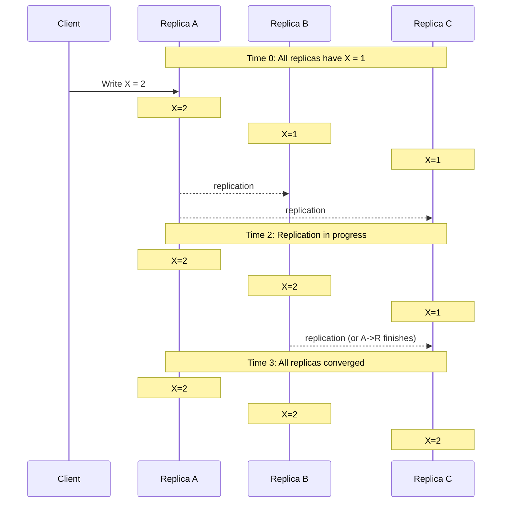
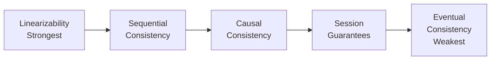
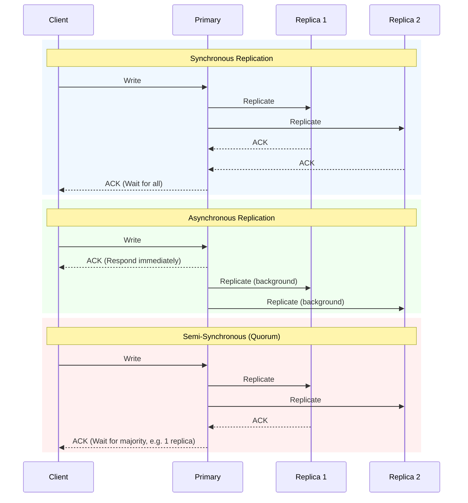
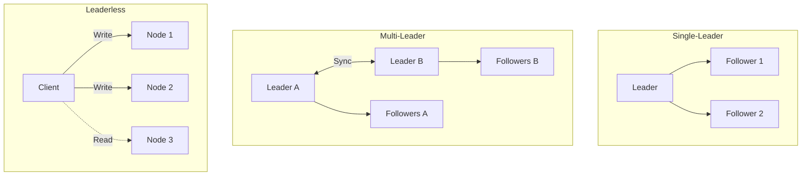
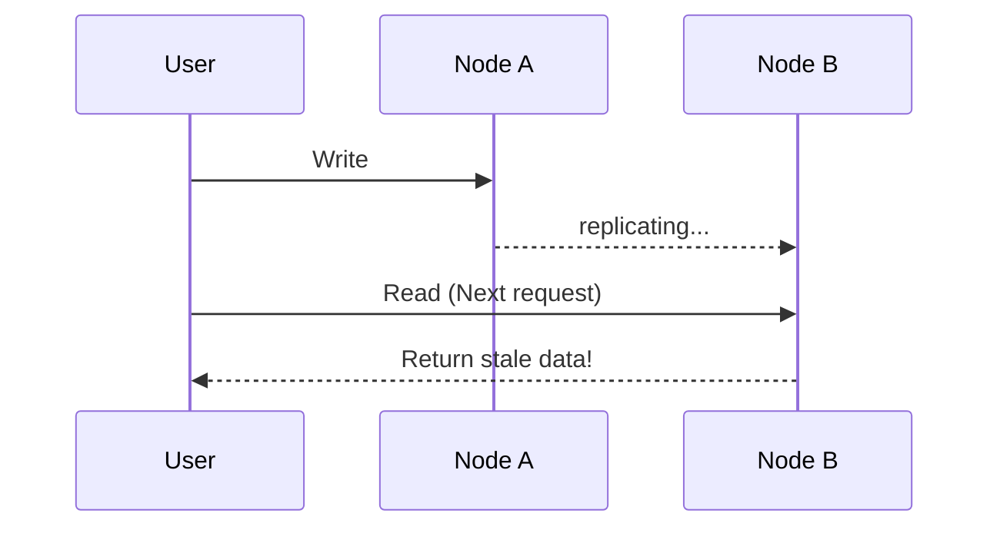

> **Complexity**: `[MEDIUM]`
>
> **Time to Complete**: 30-35 minutes
>
> **Prerequisites**: [Module 5.2: Consensus and Coordination](../module-5.2-consensus-and-coordination/)
>
> **Track**: Foundations

### What You'll Be Able to Do

After completing this module, you will be able to:

1. **Evaluate** the CAP theorem tradeoffs for a given service and justify choosing eventual consistency over strong consistency (or vice versa)
2. **Design** eventually consistent data flows using conflict resolution strategies (last-write-wins, vector clocks, CRDTs) appropriate for the data model
3. **Implement** read-your-writes and causal consistency guarantees on top of eventually consistent datastores when user experience demands it
4. **Analyze** consistency anomalies in production to determine whether they indicate a design flaw or acceptable convergence delay

---

**December 26, 2012. Amazon's retail website experiences intermittent failures during the busiest shopping week of the year—and the root cause is surprisingly simple: they chose the wrong consistency model for their inventory system.**

Amazon's engineers had designed a strongly consistent inventory system. Every purchase required immediate confirmation from all database replicas before the customer saw "Order Confirmed." This worked perfectly at normal load. But on the day after Christmas, with millions of gift card recipients flooding the site, the synchronous replication became a bottleneck. Database replicas couldn't keep up, write latency spiked to 30+ seconds, and shopping carts started timing out.

**For 49 minutes, an estimated $66,000 per minute in potential revenue was lost**—not because servers were down, but because the system was waiting for perfect consistency that customers didn't actually need.

The irony: customers don't need to know the exact inventory count. They need to know if they can buy the item. Amazon's post-incident analysis led to a fundamental architecture shift: use eventual consistency everywhere possible, reserve strong consistency only for the actual purchase transaction.

**The lesson rippled through the industry.** Amazon's 2007 Dynamo paper, describing their eventually consistent key-value store, became the blueprint for Cassandra, Riak, and DynamoDB. The paper's core insight: for most data, "close enough" consistency with high availability beats perfect consistency that fails under load.

This module teaches eventual consistency—when to use it, how to design for it, and the patterns that make it work in production.

---

## Why This Module Matters

Strong consistency is expensive. Consensus requires coordination, coordination adds latency, and during network partitions you must choose: be unavailable or be inconsistent. For many applications, that's an unacceptable trade-off.

**Eventual consistency** is the alternative. Instead of guaranteeing immediate agreement, it guarantees that if updates stop, all nodes will eventually converge to the same state. It sounds weak—but it enables systems that are faster, more available, and more resilient.

This module explores eventual consistency: what it means, when to use it, how to design for it, and the patterns that make it practical.

> **The Library Analogy**
>
> Imagine a library with multiple branches. When you return a book at Branch A, other branches don't instantly know. Someone at Branch B might see the book as "checked out" for a few minutes. Eventually, all branches sync their records. The slight inconsistency is acceptable—it's better than making every checkout wait for all branches to agree.

---

## What You'll Learn

- What eventual consistency actually means
- The consistency spectrum (strong to eventual)
- Replication strategies and their trade-offs
- Conflict resolution approaches
- Read-your-writes and other consistency models
- CRDTs: conflict-free data structures

---

## Part 1: Understanding Eventual Consistency

### 1.1 What is Eventual Consistency?

**Eventual Consistency Definition**
"If no new updates are made, eventually all nodes will return the same value for a given key."

**Key Properties:**
1. **Eventual Convergence**: All replicas will eventually have the same data. "Eventually" could be milliseconds or seconds.
2. **No Guarantee on "When"**: No bound on how long convergence takes. (Though in practice, usually very fast).
3. **Reads May Return Stale Data**: You might read old values during propagation. Different clients might see different values.



> **Stop and think**: If eventual consistency means data can be stale, how long is "eventually"? What factors might delay convergence in a real network?

### 1.2 The Consistency Spectrum



- **Linearizability (Strongest)**: Operations appear to execute atomically at a single point in time. All clients see operations in real-time order. Example: etcd, Spanner. Cost: High latency, limited availability.
- **Sequential Consistency**: Operations appear in some total order consistent with program order. Not necessarily real-time order.
- **Causal Consistency**: Causally related operations seen in order. Concurrent operations may be seen in any order. ("If I write X, then read X, then write Y... anyone who sees Y must have seen my X.")
- **Session Consistency**: Within a session, a client sees a consistent view. May include read-your-writes, monotonic reads.
- **Eventual Consistency (Weakest)**: Only guarantees eventual convergence. No ordering guarantees. Example: DNS, CDN caches. Benefit: Maximum availability, lowest latency.

### 1.3 Why Choose Eventual Consistency?

**Strong Consistency Trade-offs:**
- ✓ Easy to reason about, no stale reads, no conflict resolution needed.
- ✗ Higher latency (wait for replication), lower availability (need quorum), doesn't scale writes well.

**Eventual Consistency Trade-offs:**
- ✓ Lower latency (respond immediately), higher availability (no quorum needed), better write scalability, works during partitions.
- ✗ Harder to reason about, may read stale data, must handle conflicts.

**When Eventual Consistency Makes Sense:**
- ✓ User-generated content (posts, comments) — seeing a post 1 second late is fine.
- ✓ Like counts, view counts — approximate is good enough.
- ✓ Shopping carts — merge on checkout, not on every add.
- ✓ DNS — TTL-based caching, eventual propagation.
- ✓ CDN cached content — stale content is better than no content.
- ✓ Session data — user doesn't notice brief inconsistency.

> **Try This (2 minutes)**
>
> For each scenario, which consistency level is appropriate?
>
> | Scenario | Consistency | Why |
> |----------|-------------|-----|
> | Bank transfer | Strong | Can't show wrong balance |
> | Twitter likes | Eventual | Approximate OK |
> | Inventory count | | |
> | User profile photo | | |
> | Order status | | |

---

## Part 2: Replication Strategies

### 2.1 Synchronous vs Asynchronous Replication



> **Pause and predict**: If you use asynchronous replication and the primary node crashes before replicating to followers, what happens to the most recent writes?

- **Synchronous Replication**: Write completes after ALL replicas acknowledge. Strong consistency, no data loss on primary failure. High latency (wait for slowest replica), availability depends on all replicas.
- **Asynchronous Replication**: Write completes after PRIMARY acknowledges. Low latency (respond immediately), availability only needs primary. Eventual consistency, data loss possible if primary fails before replication.
- **Semi-Synchronous (Quorum)**: Write completes after MAJORITY acknowledges. Balances consistency and performance, tolerates some replica failures. Still has some latency for quorum.

### 2.2 Multi-Leader and Leaderless Replication



- **Single-Leader**: All writes go to one leader. Leader replicates to followers. No write conflicts. Leader is bottleneck, cross-region latency for writes.
- **Multi-Leader**: Each region has a leader. Leaders sync with each other. Low latency writes in each region, tolerates region failure. Introduces write conflicts between regions and conflict resolution complexity.
- **Leaderless (Dynamo-style)**: Write to ANY node. Read from multiple nodes, resolve conflicts. No single point of failure, high availability. Must handle conflicts on read, complex consistency tuning (W, R, N values).

### 2.3 Consistency Tuning

In quorum systems:
- **N** = Number of replicas
- **W** = Write quorum (how many must acknowledge write)
- **R** = Read quorum (how many to read from)

```mermaid
flowchart LR
    subgraph Strong Consistency W+R > N
        W[Write] --> A1[Node A]
        W --> B1[Node B]
        A1 -.->|overlap| R[Read]
        B1 -.-> R
    end
    subgraph Eventual Consistency W+R <= N
        W2[Write] --> A2[Node A]
        B2[Node B] -.->|no overlap| R2[Read]
    end
```

**Strong Consistency (W + R > N):**
Write touches enough nodes that a read is guaranteed to hit at least one node with the latest data. Example: N=3, W=2, R=2.

**Eventual Consistency (W + R ≤ N):**
Faster but might read stale data. Example: N=3, W=1, R=1.

**Tuning Examples:**
- `N=3, W=1, R=3`: Fast writes, slow reads, eventual.
- `N=3, W=3, R=1`: Slow writes, fast reads, strong.
- `N=3, W=2, R=2`: Balanced, strong consistency.
- `N=5, W=3, R=3`: More fault tolerant, still strong.

---

## Part 3: Conflict Resolution

### 3.1 Why Conflicts Happen

- **Concurrent Writes**: Two clients write different values to the same key simultaneously. (e.g., Client 1 sets email to `alice@new.com`, Client 2 sets to `alice@work.com`).
- **Partition During Writes**: Network partition splits replicas. Both sides accept writes. When the partition heals, which update wins?
- **Offline Edits**: User edits a document offline. Another user edits online. The offline user reconnects, causing a conflict.

> **Pause and predict**: If a system uses "Last-Write-Wins" (LWW) based on timestamps, what happens if two servers have their system clocks out of sync by 5 minutes?

### 3.2 Conflict Resolution Strategies

- **Last-Write-Wins (LWW)**: Highest timestamp wins. Simple but lossy. Depends heavily on accurate clock synchronization.
- **First-Write-Wins**: Lowest timestamp wins. Used for immutable data (event logs, ledgers) where once created, data cannot be overwritten.
- **Multi-Value (Siblings)**: Keep all conflicting values and return them to the application to resolve. (Read returns `["A", "B"]`). No data loss, but pushes complexity to the application.
- **Merge Function**: Custom logic to merge conflicting values. (e.g., merging shopping cart `[item1, item2]` and `[item1, item3]` results in `[item1, item2, item3]`).
- **Operational Transformation (OT)**: Transform operations to preserve intent. Used heavily in collaborative text editors to adjust index positions when concurrent inserts occur.

### 3.3 Version Vectors

Version vectors track causality, not wall-clock time. Each node maintains a counter per known node.

**Example:**
Initial: `X = {value: "A", version: {Node1: 1, Node2: 0}}`

Node 1 writes: `X = {value: "B", version: {Node1: 2, Node2: 0}}`
Node 2 writes (didn't see Node 1's update): `X = {value: "C", version: {Node1: 1, Node2: 1}}`

**Conflict Detection:**
Compare `{Node1: 2, Node2: 0}` vs `{Node1: 1, Node2: 1}`. Neither strictly dominates in all components. This indicates a concurrent write conflict.
If comparing `{Node1: 2, Node2: 0}` vs `{Node1: 1, Node2: 0}`, the first dominates. No conflict; the first is strictly newer.

> **War Story: The $8.2 Million Shopping Cart Bug**
>
> **Black Friday 2018. A major electronics retailer discovers their shopping carts are "eating" high-value items—and the timing couldn't be worse.**
>
> The company had implemented eventually consistent shopping carts using last-write-wins (LWW) conflict resolution. The theory was sound: shopping carts are a classic eventual consistency use case. But the implementation had a fatal flaw.
>
> **The bug**: When a user added an item on their phone, then added a different item on their laptop before the phone's write replicated, the laptop's write included only its local cart state. Last-write-wins meant the phone's item disappeared.
>
> **Timeline of the disaster:**
> - **Wednesday before Black Friday**: QA notices occasional "missing item" reports but can't reproduce
> - **Black Friday 6:00 AM**: Doors open, traffic spikes 40x normal
> - **Black Friday 8:15 AM**: Customer complaints surge—"I added a TV but it's gone"
> - **Black Friday 9:00 AM**: Engineering traces bug to LWW conflict resolution
> - **Black Friday 10:30 AM**: Hotfix deployed—all cart writes now merge (union) instead of replace
> - **Black Friday 6:00 PM**: Final tally: 127,000 carts affected, 23,000 abandoned purchases
>
> **The cost:**
> - $4.8 million in lost sales (abandoned carts with high-value items)
> - $2.1 million in emergency discounts to affected customers
> - $1.3 million in overtime engineering and customer service
>
> **The fix**: The team replaced their cart data structure with a CRDT-style design:
> ```javascript
> // Before: Single value, LWW
> cart = {items: ["tv", "laptop"]}  
> // After: OR-Set style, merges correctly
> cart = {
>   adds: {"tv": uuid1, "laptop": uuid2},
>   removes: {}
> }  
> ```
>
> **The lesson**: Eventual consistency requires thinking about conflict resolution at design time, not after the bug reports come in. "Last-write-wins" is almost never what you actually want for user data.

---

## Part 4: Practical Consistency Patterns

### 4.1 Read-Your-Writes

Users should always see their own updates. Even with eventual consistency, this is often required. The problem arises when a user writes to Node A, but their next read hits Node B before replication is complete.



**Solutions:**
1. **Sticky Sessions**: Route the user to the same node that received the write. Simple, but complicates load balancing and failovers.
2. **Read from Write Quorum**: Read from enough nodes to guarantee overlap (`W + R > N`). Higher latency but guaranteed consistency.
3. **Version-Based Reads**: Client tracks the version of their last write. Reads include an "at least version V" parameter, and the node waits until it has that version to respond.
4. **Synchronous Replication for Sensitive Data**: Write synchronously, read from anywhere.

### 4.2 Monotonic Reads

Once you've seen a value, you shouldn't see an older one. Time shouldn't "go backwards."
If Read 1 returns `X=2` (from a fully replicated node) and Read 2 returns `X=1` (from a lagging node), the user experiences a jarring rewind in state.

> **Stop and think**: How would a jarring "rewind in state" (like seeing a deleted item reappear temporarily) affect user trust in an application?

**Solutions:**
- Session affinity to the same replica.
- Track last-seen version, and only accept responses that are newer or equal to that version.

### 4.3 Causal Consistency

If event B depends on event A, everyone sees A before B. Concurrent events (no dependency) can appear in any order.

For example, Alice posts: "I got a promotion!" Bob comments: "Congratulations!" Bob's comment DEPENDS on Alice's post. Without causal consistency, a user might see the comment before the post exists.

**Implementation:** Track dependencies with version vectors or explicit references. A replica will not show the comment until the referenced post dependency is satisfied locally.

---

## Part 5: CRDTs - Conflict-Free Data Types

### 5.1 What are CRDTs?

Conflict-Free Replicated Data Types (CRDTs) are data structures that automatically merge without conflicts. No coordination is needed—mathematical properties guarantee convergence.

**Key Property: Commutativity & Associativity**
The order and grouping of operations don't matter. `A + B = B + A`.

If Node A and Node B both increment a standard integer concurrently, a naive merge of the final values might discard one increment. With a CRDT like a G-Counter, Node A tracks its own increments, Node B tracks its own, and the merge function safely combines them without data loss.

### 5.2 Common CRDTs

- **G-Counter (Grow-only counter)**: Only increments. Each node has its own counter. Merge by taking the `max()` of each node's count.
- **PN-Counter (Positive-Negative counter)**: Increments and decrements. Implemented as two G-Counters (one for positives, one for negatives).
- **G-Set (Grow-only set)**: Only add, never remove. Merge via standard set union.
- **2P-Set (Two-Phase set)**: Add and remove, but removed elements can't be re-added. Two G-Sets internally (`added` and `removed`).
- **OR-Set (Observed-Remove set)**: Add and remove. Can re-add after remove. Each add is tagged with a unique ID.
- **LWW-Register (Last-Writer-Wins register)**: Simple value with timestamp. Keeps the value with the highest timestamp.

### 5.3 CRDTs in Practice

- **Riak**: Database with built-in CRDT support for counters, sets, and maps.
- **Redis Enterprise**: Conflict-free replication across geo-distributed clusters.
- **Automerge**: A JSON CRDT library heavily used for building collaborative applications.
- **SoundCloud**: Uses G-Counters for eventually consistent play counts and likes.

**Limitations:**
- Memory overhead (version vectors and metadata grow over time).
- Limited operations (you cannot apply arbitrary, non-commutative logic safely).
- They only guarantee eventual consistency, not immediate correctness in business rules.

---

## Did You Know?

- **Amazon's shopping cart** was one of the first famous eventually consistent systems. Their 2007 Dynamo paper showed how eventual consistency enables high availability and became the blueprint for Cassandra, Riak, and DynamoDB.
- **CRDTs were independently discovered** multiple times. The mathematical foundations (lattices, semilattices) existed long before distributed systems, but applying them to replication was a breakthrough in 2011.
- **DNS is eventually consistent** by design. When you update a DNS record, it can take up to 48 hours (or the TTL) to propagate worldwide. Yet the internet works fine because most applications tolerate stale DNS.
- **Figma uses CRDTs** for real-time collaborative design. Multiple designers can edit the same file simultaneously, and their changes merge automatically without conflicts. When you drag a shape while your colleague resizes it, both operations succeed—no "your changes were overwritten" errors.

---

## Common Mistakes

| Mistake | Problem | Solution |
|---------|---------|----------|
| Assuming immediate consistency | Read stale data, confused users | Implement read-your-writes |
| Last-write-wins without thought | Silent data loss | Use merge functions or CRDTs |
| Ignoring conflict resolution | Conflicts surface as bugs later | Design conflict strategy upfront |
| Clock-based ordering | Clock skew causes wrong order | Use logical clocks or version vectors |
| No causal ordering | Comments before posts, replies before questions | Track causality explicitly |
| Over-engineering consistency | Complexity without benefit | Start eventual, add consistency where needed |

---

## Quiz

1. **You are designing a globally distributed user profile service for a social media app. You choose eventual consistency to keep latency low. When explaining the system guarantees to the product manager, what exactly are you promising about the data state?**
   <details markdown="1">
   <summary>Answer</summary>

   Eventual consistency guarantees two things: first, that if no new updates occur, all replicas will eventually converge to identical data. Second, there will be no permanent data loss for acknowledged writes. It does NOT guarantee when convergence happens (it could take milliseconds or minutes) or what intermediate stale states a user might read during propagation. Ultimately, you are promising that the system will prioritize availability over returning the strict, globally real-time correct data on every read.
   </details>

2. **Two users in a collaborative document editor are working offline. User A changes the title to "Draft 1", and User B changes it to "Final Draft". When both reconnect, the system uses version vectors to detect a conflict. How does this mechanism identify that neither change should automatically overwrite the other?**
   <details markdown="1">
   <summary>Answer</summary>

   Version vectors track the causal history of data rather than wall-clock time. Each node maintains a counter array representing the updates it has seen. When User A and User B edit offline, they both fork from the same baseline version vector, incrementing their own local node counter without seeing the other's increment. Upon reconnecting, the system compares their vectors and finds that neither vector strictly dominates the other across all elements. Because neither has seen the other's operation, the system flags it as a true concurrent write conflict requiring a merge strategy.
   </details>

3. **You are migrating a distributed "like" counter for a video streaming service from a simple integer column to a CRDT (G-Counter). How does the mathematical structure of the CRDT guarantee that concurrent "likes" from different regions will merge perfectly without dropping counts?**
   <details markdown="1">
   <summary>Answer</summary>

   A G-Counter CRDT works by having every node independently track only its own increments in a local variable, rather than mutating a shared global integer. Because the merge function uses the mathematical `max()` operation across each node's array of counts, the operations become commutative, associative, and idempotent. This means the order in which region synchronizations arrive doesn't matter, and applying the same sync payload twice won't duplicate counts. By eliminating the need to lock and modify a single scalar value, concurrent increments merge safely and deterministically without data loss.
   </details>

4. **Your e-commerce architecture review board is debating the consistency models for two microservices: the Product Catalog and the Payment Ledger. What consistency models should you apply to each, and why?**
   <details markdown="1">
   <summary>Answer</summary>

   The Product Catalog should use Eventual Consistency, while the Payment Ledger requires Strong Consistency. For the catalog, high availability and low read latency are critical for user experience; if a user sees stale pricing or an old image for a few seconds, the business impact is minimal. Conversely, the payment ledger handles financial state, where correctness is absolutely critical. A stale read on a payment ledger could result in double-charging or shipping goods without confirmed payment. This makes the latency costs of strong consistency, such as waiting for quorum or consensus, an acceptable and necessary trade-off.
   </details>

5. **Your database cluster has 5 nodes (N=5). You are deploying a new microservice that requires high availability for reads, but writes must be strictly strongly consistent. What read (R) and write (W) quorum values should you configure, and how does this affect system latency during a node failure?**
   <details markdown="1">
   <summary>Answer</summary>

   For strict strong consistency, you must satisfy the quorum rule `W + R > N`. To prioritize high availability and fast reads, you should set `R=1` and `W=5`. By reading from just 1 node, read latency is extremely low, but writing requires an acknowledgement from all 5 nodes to guarantee overlap. The major drawback is fault tolerance: if even a single node goes down, your write operations will block or fail entirely. This configuration heavily penalizes write latency and write availability to ensure readers never wait and always see the latest data.
   </details>

6. **A social media platform stores user posts with eventual consistency. User A posts "Hello", then immediately comments "First!" on their own post. Another user B refreshes their feed and sees the comment "First!" but not the original "Hello" post. What specific consistency property is violated, and how would you architecturally prevent it?**
   <details markdown="1">
   <summary>Answer</summary>

   This scenario violates **Causal Consistency**, as a dependent event (the comment) was made visible before its cause (the original post). This happens when the comment replicates to a secondary node faster than the post itself. To prevent this, you should implement explicit causal dependency tracking. The comment object would include the post ID in a dependencies list (e.g., `deps: [post_id]`), and the receiving replica would hold the comment in a pending state, refusing to serve it to clients until the required parent post has successfully replicated locally.
   </details>

7. **You're implementing a collaborative document editor. User A inserts "Hello" at position 0. User B inserts "World" at position 0 (concurrently, before seeing A's edit). After syncing, what mechanism prevents the document state from being scrambled or losing data?**
   <details markdown="1">
   <summary>Answer</summary>

   Systems prevent this using either Operational Transformation (OT) or Replicated Growable Array CRDTs. If using OT, when User A receives B's operation, the system algorithmically transforms the index of B's insert to account for the length of "Hello", shifting it so both strings are preserved. If using a CRDT, every inserted character is assigned a unique, immutable ID (comprising a timestamp and node ID) rather than relying on absolute indices. Because the edits are anchored to surrounding character IDs, they will sort deterministically across all clients, resulting in either "HelloWorld" or "WorldHello" consistently everywhere without data loss.
   </details>

8. **You are monitoring a distributed cache system that uses a G-Counter CRDT to track video page views across 3 regional nodes. The G-Counter has the following state across the nodes. Calculate the total count. Then, Node B handles 5 more page views locally and subsequently syncs with Node A. What is Node A's new state, and why does this prevent data loss?**
   ```text
   Node A: {A: 10, B: 3, C: 7}
   Node B: {A: 8,  B: 3, C: 5}
   Node C: {A: 10, B: 2, C: 7}
   ```
   <details markdown="1">
   <summary>Answer</summary>

   The true total count initially is the sum of the maximums of each component across all nodes: `max(10,8,10) + max(3,3,2) + max(7,5,7) = 10 + 3 + 7 = 20`. When Node B increments its local counter by 5, its state becomes `{A: 8, B: 8, C: 5}`. When Node B synchronizes this new vector to Node A, the merge function independently takes the highest known value for each node's key. Node A's state updates to `{A: max(10,8), B: max(3,8), C: max(7,5)}`, resulting in `{A: 10, B: 8, C: 7}`. This mathematical max function ensures increments are safely merged without duplication, preserving the operations from both regions.
   </details>

---

## Hands-On Exercise

**Task**: Explore eventual consistency behavior.

**Part 1: Observe Replication Lag (10 minutes)**

If using a multi-node Kubernetes cluster:

```bash
# Create a ConfigMap
kubectl create configmap test-data --from-literal=value=1

# Immediately read from different nodes
# (Results may vary based on your cluster setup)
kubectl get configmap test-data -o jsonpath='{.data.value}'

# Update the ConfigMap
kubectl patch configmap test-data -p '{"data":{"value":"2"}}'

# Read again immediately - you should see consistent results
# (Kubernetes uses etcd with strong consistency)
```

Note: Kubernetes (v1.35+) uses strongly consistent etcd, so you won't see replication lag. This exercise shows the contrast.

**Part 2: Simulate Conflict Resolution (15 minutes)**

Create a simple conflict scenario:

```yaml
# Create two versions of a ConfigMap in different files
# version-a.yaml
apiVersion: v1
kind: ConfigMap
metadata:
  name: conflict-test
data:
  setting: "value-from-A"

# version-b.yaml
apiVersion: v1
kind: ConfigMap
metadata:
  name: conflict-test
data:
  setting: "value-from-B"
```

```bash
# Apply version A
kubectl apply -f version-a.yaml

# Quickly apply version B
kubectl apply -f version-b.yaml

# Which value won?
kubectl get configmap conflict-test -o jsonpath='{.data.setting}'

# Kubernetes uses last-write-wins (based on resourceVersion)
```

**Part 3: Design a CRDT Counter (15 minutes)**

On paper, design a distributed like counter:

1. Multiple servers receive "like" requests
2. Users can like from any server
3. Total count should eventually be accurate

Questions:
- How would you structure the data?
- How would servers sync?
- What happens if a server is temporarily unreachable?

**Success Criteria**:
- [ ] Observed that Kubernetes provides strong consistency
- [ ] Understood last-write-wins behavior
- [ ] Designed a G-Counter approach for distributed counting

---

## Further Reading

- **"Designing Data-Intensive Applications"** - Martin Kleppmann. Chapter 5 covers replication and consistency in depth.
- **"A comprehensive study of Convergent and Commutative Replicated Data Types"** - Shapiro et al. The foundational CRDT paper.
- **"Dynamo: Amazon's Highly Available Key-value Store"** - DeCandia et al. The paper that popularized eventual consistency.

---

## Key Takeaways

Before moving on, ensure you understand:

- [ ] **Eventual consistency guarantee**: If updates stop, all replicas converge to the same state. No bound on "when"—but usually milliseconds in practice
- [ ] **The consistency spectrum**: Linearizability → Sequential → Causal → Session → Eventual. Stronger = more latency, less availability
- [ ] **Quorum math**: W + R > N for strong consistency. W=R=majority is common. Tuning W and R trades consistency for performance
- [ ] **Replication trade-offs**: Synchronous = strong but slow. Asynchronous = fast but eventual. Multi-leader = available but conflicts
- [ ] **Conflict resolution strategies**: Last-write-wins (simple, lossy), merge functions (semantic), version vectors (detect conflicts), CRDTs (conflict-free by design)
- [ ] **CRDTs eliminate conflicts**: Commutative + associative + idempotent operations. G-Counter, PN-Counter, OR-Set. Use when available, but limited expressiveness
- [ ] **Read-your-writes is essential**: Even with eventual consistency, users should see their own updates. Implement via sticky sessions, quorum reads, or version tracking
- [ ] **Design for conflict upfront**: "Last-write-wins" is almost never what you want for user data. Choose conflict resolution strategy before you ship

---

## Track Complete: Distributed Systems

Congratulations! You've completed the Distributed Systems foundation. You now understand:

- Why distribution is hard: latency, partial failure, no global clock
- Consensus: how nodes agree, and when you need it
- Eventual consistency: when immediate agreement isn't necessary
- Conflict resolution: handling concurrent updates

**Where to go from here:**

| Your Interest | Next Track |
|---------------|------------|
| Platform building | [Platform Engineering Discipline](/platform/disciplines/core-platform/platform-engineering/) |
| Reliability | [SRE Discipline](/platform/disciplines/core-platform/sre/) |
| Kubernetes deep dive | [CKA Certification](/k8s/cka/) |
| Observability tools | [Observability Toolkit](/platform/toolkits/observability-intelligence/observability/) |

---

## Foundations Complete!

You've now completed all five Foundations tracks:

| Track | Key Takeaway |
|-------|--------------|
| Systems Thinking | See the whole system, not just components |
| Reliability Engineering | Design for failure, measure what matters |
| Observability Theory | Understand through metrics, logs, traces |
| Security Principles | Defense in depth, least privilege, secure defaults |
| Distributed Systems | Consensus when needed, eventual when possible |

These foundations prepare you for the Disciplines and Toolkits tracks, where you'll apply these concepts to real-world practices and tools.

*"A distributed system is one in which the failure of a computer you didn't even know existed can render your own computer unusable."* — Leslie Lamport