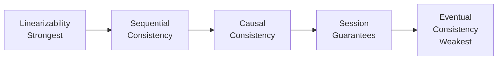
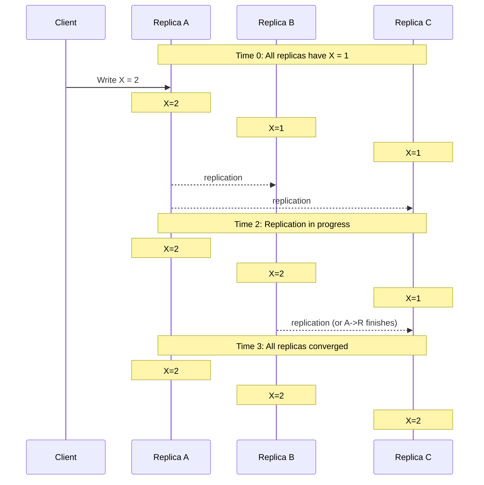
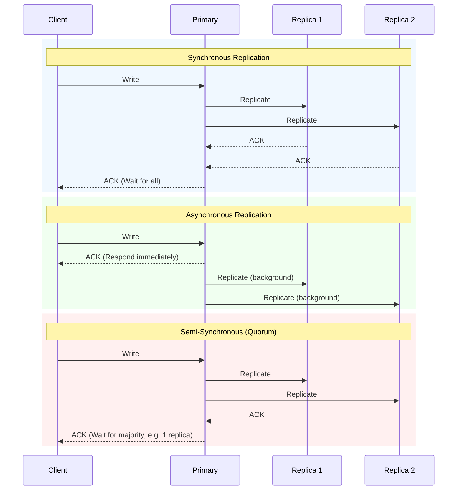
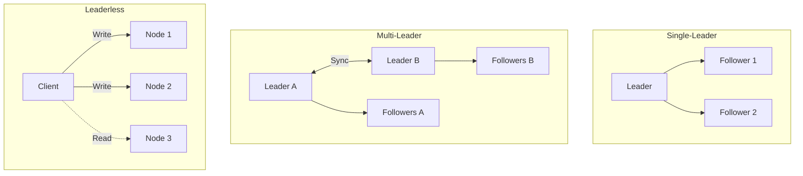
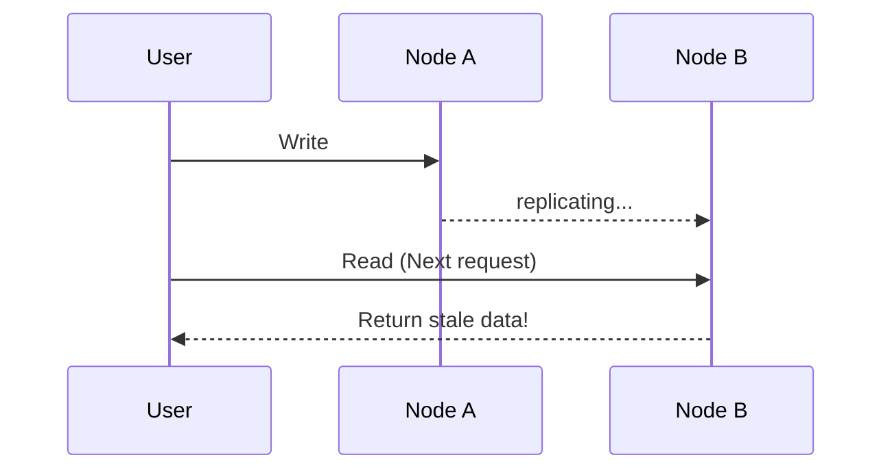
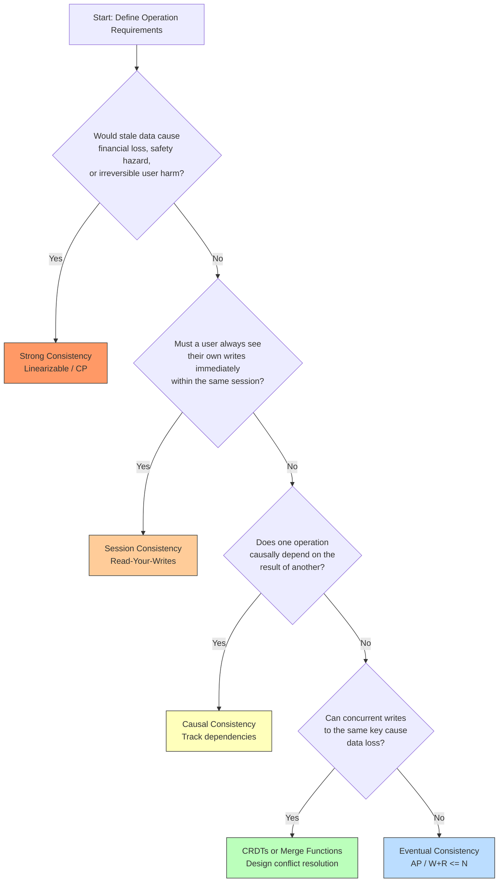

> **Complexity**: `[MEDIUM]`
>
> **Time to Complete**: 35-40 minutes
>
> **Prerequisites**: [Module 5.2: Consensus and Coordination](../module-5.2-consensus-and-coordination/)
>
> **Track**: Foundations

## What You'll Be Able to Do

After completing this module, you will be able to:

1. **Explain** the CAP Theorem trade-off and the full consistency spectrum from linearizability through eventual consistency, including when and why each level makes sense for a given workload.
2. **Contrast** strong versus eventual consistency models and reason about which is appropriate for a specific service based on its latency, availability, and correctness requirements.
3. **Reason** about replication topologies and quorum tuning — including the `W + R > N` overlap rule, synchronous versus asynchronous trade-offs, and leader versus leaderless architectures.
4. **Diagnose and resolve** write conflicts using the appropriate tool: last-write-wins (and its pitfalls), version vectors for concurrency detection, merge functions, and Conflict-Free Replicated Data Types (CRDTs).
5. **Apply** session guarantees — including read-your-writes, monotonic reads, and causal consistency — to build acceptable user experiences on top of eventually consistent stores.

---

## Why This Module Matters

In 2007, a team at Amazon published a paper that changed how the industry thought about distributed data. The problem they were solving was deceptively simple: a shopping cart. Users add items from multiple devices — a phone on the bus, a laptop at home, a tablet on the couch — and those additions must never be lost, even when network links between data centers are slow, noisy, or temporarily severed. If a customer adds a book on one device and a pair of headphones on another, both items had better appear at checkout time, regardless of which replica served which write or in what order those writes propagated through the system.

The Amazon Dynamo paper — authored by DeCandia, Hastorun, Jampani, Kakulapati, Lakshman, Pilchin, Sivasubramanian, Vosshall, and Vogels — introduced a radical idea for its time: give up on strong consistency. Let replicas diverge temporarily, accept writes on any node, and resolve conflicts at read time or during background synchronization. The shopping cart became a mergeable data structure: concurrent additions from different devices combine via set union rather than overwriting each other, so no item is ever silently lost because of a replication race. The paper demonstrated that you could build a highly available, always-writable key-value store by embracing eventual consistency as a first-class design principle, not a bug to be tolerated.

That paper became the blueprint for an entire generation of distributed databases — Cassandra, Riak, Voldemort, and later DynamoDB all trace their lineage to its ideas. What made Dynamo's approach durable was not the specific implementation but the recognition that consistency is not a binary property. It is a spectrum, and choosing where to sit on that spectrum is one of the most consequential architectural decisions you will make when designing any system that spans more than one machine. Pick a level stronger than necessary, and you waste latency and throughput on coordination nobody actually needs. Pick a level too weak, and you silently corrupt application state in ways that can be astronomically expensive to repair after the fact.

This module teaches you how to make that decision with confidence. You will learn the theoretical underpinnings — CAP, PACELC, the consistency spectrum — and the practical mechanics: replication topologies, quorum tuning, conflict detection with version vectors, and conflict elimination with CRDTs. By the end, you will be able to look at a distributed service's requirements and decide whether it needs linearizability, causal consistency, or plain eventual consistency, and you will know exactly what engineering trade-off you are making with each choice.

---

## Part 1: The CAP Theorem and the Consistency Spectrum

### 1.1 The CAP Theorem Defined

The **CAP Theorem** was first articulated by Eric Brewer in a 2000 keynote. Gilbert and Lynch later formalized it with a proof published in ACM SIGACT News in 2002. The theorem states that a distributed data store can provide at most two of the following three guarantees simultaneously:

1. **Consistency (C)**: Every read receives the most recent write or an error. In linearizable (strongly consistent) terms, the system behaves as though there is only a single copy of the data, and all operations appear to execute atomically at a single point on a global timeline. No client ever sees stale data, and the system preserves the illusion that the distributed nodes are a single machine.
2. **Availability (A)**: Every request to a non-failing node receives a non-error response. The system continues serving reads and writes even when some nodes are unreachable due to network partitions or crashes. However, there is no guarantee that the response reflects the most recent write — the system may return stale data because it prioritizes staying online over staying correct.
3. **Partition Tolerance (P)**: The system continues to operate correctly despite an arbitrary number of messages being dropped, delayed, or reordered by the network between nodes. A partition, in this context, means any situation where some nodes cannot communicate with others — not just a clean fiber cut, but also congestion-induced packet loss, misconfigured firewalls, or the asymmetric reachability problems that plague real-world networks.

In practice, network partitions are not an edge case — they are a physical certainty in any system that spans more than one machine. Ethernet cables get unplugged, switches fail, BGP routes flap, and latency spikes can be functionally indistinguishable from lost packets for the duration of a timeout window. Because partitions are inevitable, **Partition Tolerance is not optional** for any distributed system that aspires to real-world reliability. This forces architects into a hard choice: during a partition, do you preserve Consistency or Availability?

Choosing **CP (Consistency + Partition Tolerance)** means refusing to serve writes — or in some designs, even reads — from nodes that cannot reach a quorum. The system sacrifices availability on the altar of correctness, ensuring that no client ever observes stale or conflicting data but potentially leaving users staring at error pages during a network outage. Choosing **AP (Availability + Partition Tolerance)** means allowing nodes to serve requests with potentially stale data, thereby compromising strict consistency to keep the system online and responsive. Eventual consistency is the deliberate architectural commitment to the AP side of this trade-off: you accept that readers may temporarily see old values in exchange for lower latency, higher throughput, and resilience in the face of network degradation.

### 1.2 PACELC: The Trade-off When There Is No Partition

CAP addresses the system's behavior *during* a partition, but what about the vast majority of operational time — the 99.9% of seconds when the network is healthy and all nodes can communicate? Daniel Abadi's **PACELC** extension, published in 2012, fills this gap with an elegantly simple formulation: if there is a **P**artition, choose between **A**vailability and **C**onsistency; **E**lse, when the system is **L**atency-sensitive and the network is intact, choose between **L**atency and **C**onsistency.

This is a profound insight because it reveals that even in the complete absence of failures, strong consistency imposes a real and measurable cost on every operation. A linearizable system must coordinate every write across replicas — typically via consensus (see Module 5.2) or synchronous replication to a quorum — which adds a network round-trip penalty to every single operation. That round-trip might be hundreds of microseconds within a single availability zone, but it becomes tens or hundreds of milliseconds across continental distances. PACELC forces you to ask a question that CAP alone cannot answer: is that extra latency justified by the correctness guarantees it buys? For a payment ledger, almost certainly yes — the correctness invariant (no double-spend, no overdraft) is worth every millisecond. For a social media "like" counter, almost certainly no — nobody will notice or care if a like count is off by one for three seconds. PACELC gives you the vocabulary and the analytical framework to explain those choices to your team, your product manager, and your future self who will inherit this architecture.

### 1.3 The Consistency Spectrum in Depth

Consistency is not binary. It is a spectrum, and each level trades away some degree of coordination in exchange for performance. Understanding the full range is essential because picking a level stronger than necessary wastes latency and throughput on every operation, while picking a level too weak can corrupt application state in ways that are expensive or impossible to undo after the fact. The spectrum runs from the strongest guarantee to the weakest, and every step downward relaxes a specific constraint that the level above enforces.


```mermaid
flowchart LR
    L[Linearizability<br/>Strongest] --> S[Sequential<br/>Consistency]
    S --> C[Causal<br/>Consistency]
    C --> Se[Session<br/>Guarantees]
    Se --> E[Eventual<br/>Consistency<br/>Weakest]
```

**Linearizability** is the gold standard of consistency models. Every operation appears to execute instantaneously at some point between its invocation and its completion, and that point falls on a single global timeline that all clients agree on. A read that begins after a write completes must see that write — there is no window where one client observes the new value while another still sees the old one. Systems that provide linearizability, such as etcd (via the Raft consensus algorithm) and Google Spanner (via TrueTime atomic clocks), pay for it with higher latency and reduced write availability during partitions. Linearizability is what makes a distributed lock safe and what prevents a bank balance from being overdrawn by concurrent withdrawals at different ATMs. It is also, by a wide margin, the most expensive consistency model to implement and operate at scale.

**Sequential Consistency**, formalized by Leslie Lamport in his landmark 1979 paper "How to Make a Multiprocessor Computer That Correctly Executes Multiprocess Programs," relaxes the real-time constraint. Operations from all clients appear in some total order consistent with each client's program order — meaning no client sees its own operations reordered — but there is no guarantee that a write visible to client A is immediately visible to client B. The real-time freshness guarantee of linearizability is gone, but the ordering contract remains intact. Treat sequential consistency as a formal reasoning model, not as a description of commodity CPU hardware: x86 is commonly described as Total Store Order, while ARM and RISC-V permit still weaker reorderings unless software uses fences or atomic operations. Sequential consistency provides a useful mental bridge between the absolute certainty of linearizability and the more relaxed models that distributed systems typically adopt.

**Causal Consistency** goes further: operations that are causally related must be seen in causal order by every replica, but concurrent (causally independent) operations may appear in any order across different replicas. If Alice posts a photo and then comments on it, the comment is causally dependent on the post — no replica should ever show the comment without the photo. But if two users independently "like" the same photo at roughly the same time, those likes have no causal relationship and can be ordered arbitrarily. Causal consistency is the weakest model that still preserves the intuitive "cause before effect" expectation that humans rely on to make sense of the world. Causal consistency is often the sweet spot for collaborative applications where users interact with each other's content.

**Session Guarantees** — including read-your-writes, monotonic reads, consistent prefix, and writes-follow-reads — operate within the scope of a single user session. They provide a pragmatic middle ground: strong enough for most application user interfaces, where users reasonably expect to see the effects of their own actions, but weak enough to scale horizontally without the global coordination that consensus demands. They were formalized by Terry, Demers, Petersen, et al. in their 1994 paper "Session Guarantees for Weakly Consistent Replicated Data," and they remain the most widely deployed form of consistency above plain eventual in production systems today.

**Eventual Consistency** is the weakest guarantee on the spectrum. It promises only that if no new updates are made, all replicas will eventually converge to the same state. There is no bound on how long convergence takes, no ordering guarantee for concurrent writes, and no protection against stale reads — a client reading from a lagging replica may see data that is seconds, minutes, or in pathological cases even hours out of date. What eventual consistency offers in return is maximum availability, minimum write latency, and the simplest operational model for wide-area replication. It is the default consistency model of DNS, of CDN cache invalidation, and of the Amazon Dynamo lineage of databases, and it powers a surprising fraction of the internet infrastructure that billions of people interact with every day.

> **Stop and think**: If linearizability guarantees that every read sees the latest write, what specific latency price are you paying? How many network round-trips does a linearizable write require compared to an eventually consistent one, and what happens to that cost as you add more replicas or spread them across wider geographic distances?

---

## Part 2: Understanding Eventual Consistency

### 2.1 Defining Eventual Convergence

Formally, **eventual consistency** guarantees: *if no new updates are made to a given data item, eventually all accesses to that item will return the last updated value.* The definition, originating from Werner Vogels's influential 2009 ACM Queue article "Eventually Consistent," has three critical implications that every architect must internalize before choosing this model for a production system.

1. **Eventual Convergence**: All replicas will eventually reach an identical state. No acknowledged write is permanently lost, assuming the system's durability guarantees hold — writes are persisted to disk before the acknowledgement is returned. The path to convergence, however, may involve background processes like read-repair, anti-entropy sweeps, or gossip protocols that operate asynchronously and at their own pace. These mechanisms are statistical, not deterministic: they improve the probability that a given read will see fresh data, but they make no absolute guarantees about any particular read operation.

2. **No Temporal Bound**: There is no mathematical or operational guarantee on how long convergence will take. Under normal conditions with healthy networks and light load, it may be milliseconds — fast enough that users perceive the system as instant. During a severe partition, with saturated inter-DC links and backlogged replication queues containing millions of pending writes, convergence could take minutes or longer. The system makes no promise, and your application must not rely on any assumed convergence window, because the moment you bake an assumption like "replication finishes within 500 milliseconds" into your business logic is the moment your system will encounter a network event that violates that assumption.

3. **Stale Reads Are Normal and Expected**: During the propagation window — the interval between a write being acknowledged and all replicas receiving it — different clients querying different replicas may observe entirely different versions of the same data item. This is not a bug or a transient failure state; it is the expected behavior of the consistency model. The question is not whether staleness will occur, but whether your application logic can tolerate it when it does. For a product catalog, showing yesterday's price for three seconds is probably fine. For a payment ledger, showing yesterday's balance is absolutely not.


```mermaid
sequenceDiagram
    participant C as Client
    participant A as Replica A
    participant B as Replica B
    participant R as Replica C

    Note over A,R: Time 0: All replicas have X = 1
    C->>A: Write X = 2
    Note over A: X=2
    Note over B: X=1
    Note over R: X=1
    A-->>B: replication
    A-->>R: replication
    Note over A,R: Time 2: Replication in progress
    Note over A: X=2
    Note over B: X=2
    Note over R: X=1
    B-->>R: replication (or A->R finishes)
    Note over A,R: Time 3: All replicas converged
    Note over A: X=2
    Note over B: X=2
    Note over R: X=2
```

> **Stop and think**: If eventual consistency means data can be stale, how long is "eventually"? What factors — network bandwidth between data centers, replication queue depth, partition duration, the sheer volume of writes generated during a peak traffic event — might delay convergence in a real deployment?

### 2.2 Anti-Entropy and Read-Repair

Eventual consistency does not happen by magic or by waiting long enough. Two specific mechanisms drive replica convergence in production systems, and understanding how they work is essential to reasoning about the consistency behavior your users will actually experience.

**Anti-entropy** is a background process that continuously compares replicas and synchronizes any missing updates. A common and efficient implementation uses Merkle trees: each replica builds a hash tree over its key range — hashing contiguous blocks of keys, then hashing those hashes together — and periodically exchanges these tree structures with its peers. Where the trees diverge, the replicas know that some keys in that subtree differ, and they exchange only those specific keys rather than the entire dataset. This is bandwidth-efficient and scalable, but it operates on its own schedule — typically every few minutes — and provides no guarantee that any particular read, executed between anti-entropy sweeps, will see the latest write. Anti-entropy is the safety net, not the primary consistency mechanism.

**Read-repair** opportunistically corrects stale data during normal read operations. When a coordinator reads from multiple replicas to satisfy a quorum read (or a probabilistic read in a leaderless system), it may notice that one of the replicas returned an older version than the others. Rather than silently accepting the inconsistency, the coordinator can push the newer version to the lagging replica — repairing it — before returning the freshest result to the client. Read-repair provides a statistical improvement in consistency for data that is actively being accessed: the more often a key is read, the more likely it is to be repaired. However, cold data — records that nobody has queried in hours or days — may remain inconsistent indefinitely until an anti-entropy sweep eventually catches them. This is a deliberate design choice: repair effort is concentrated on the data that users care about right now.

### 2.3 The Full Trade-off Landscape

Choosing eventual consistency reshapes the performance profile of your application in ways that go beyond the simple "faster but stale" summary. The effects cascade through latency, availability, scalability, and — most critically — application complexity.

**Advantages.** Write latency drops dramatically because a single node can acknowledge the write locally without coordinating with peers — no consensus rounds, no quorum waits, no cross-DC round-trips. Availability increases because the system can accept writes even when a majority of nodes are partitioned from each other; any reachable node can process the request and the system stays online. Horizontal scalability becomes simpler because nodes operate with high independence, minimizing cross-node coordination overhead that grows super-linearly with cluster size in strongly consistent systems. These are genuine engineering wins, and they explain why the Dynamo model became dominant for large-scale internet services.

**Disadvantages.** Application complexity shifts from the database to the developer, and this is a cost that compounds over time. Every developer working on the service must understand the consistency model and code defensively against it. Stale reads must be detected or tolerated; conflict resolution logic must be written, tested, and maintained for every data type that permits concurrent writes; and certain application invariants — uniqueness constraints, foreign key relationships, atomic multi-item updates — become either impossible in the general case or require expensive compensating transactions implemented at the application layer. This is not a one-time cost. Every new feature, every schema migration, and every new team member must account for the fact that the database makes weaker promises than they were taught to expect in their undergraduate databases course.

---

## Part 3: Replication Strategies

### 3.1 Synchronous vs Asynchronous Replication

How data propagates between replicas after a write is acknowledged is the single largest lever you can pull when tuning a distributed system's consistency, durability, and latency profile. The choice between synchronous and asynchronous replication has first-order effects on every property your users care about, and understanding the trade-off at a mechanical level — what actually happens inside the system when a write arrives — is essential to making the right choice.


```mermaid
sequenceDiagram
    participant C as Client
    participant P as Primary
    participant R1 as Replica 1
    participant R2 as Replica 2

    rect rgb(240, 248, 255)
    Note over C,R2: Synchronous Replication
    C->>P: Write
    P->>R1: Replicate
    P->>R2: Replicate
    R1-->>P: ACK
    R2-->>P: ACK
    P-->>C: ACK (Wait for all)
    end

    rect rgb(240, 255, 240)
    Note over C,R2: Asynchronous Replication
    C->>P: Write
    P-->>C: ACK (Respond immediately)
    P->>R1: Replicate (background)
    P->>R2: Replicate (background)
    end

    rect rgb(255, 240, 240)
    Note over C,R2: Semi-Synchronous (Quorum)
    C->>P: Write
    P->>R1: Replicate
    P->>R2: Replicate
    R1-->>P: ACK
    P-->>C: ACK (Wait for majority, e.g. 1 replica)
    end
```

**Synchronous replication** blocks the write acknowledgment until every designated replica has confirmed that it has durably persisted the update. Every replica is in lockstep: no read from any replica can ever be stale, and no acknowledged write can be lost if the primary fails — at least one other node has the data on durable storage. The cost is latency measured by the slowest replica in the set. If you have replicas in three availability zones and one zone experiences a brief network hiccup, every write in the cluster stalls for the duration of that hiccup. This is why synchronous replication is almost never deployed with more than a small number of replicas within a single availability zone. Systems that need strong guarantees across regions typically use consensus-based approaches rather than naive synchronous replication.

**Asynchronous replication** acknowledges the write to the client the moment the primary node has persisted it locally. Replication to followers happens in the background, decoupled from the client's request-response lifecycle and invisible to the user who submitted the write. This delivers the lowest possible write latency — the client waits for exactly one disk write and zero network round-trips to replicas — but it introduces a durability gap that every architect must reckon with. If the primary crashes before the background replication completes, the acknowledged writes sitting in its local write-ahead log are permanently lost. The window of vulnerability is typically small — milliseconds to seconds under normal conditions — but it is real. Asynchronous replication alone cannot satisfy durability requirements for financial or safety-critical data.

**Semi-synchronous (quorum) replication** occupies the middle ground. The primary blocks the write acknowledgement until a configurable subset of replicas — typically a simple majority, but sometimes a weighted subset based on node health or geographic proximity — has confirmed the write. The remaining replicas catch up asynchronously in the background. This provides a tunable dial: raise the quorum for stronger durability and consistency guarantees, lower it for faster response times during degraded conditions. Most production deployments of leader-based replication, including MySQL Group Replication and PostgreSQL synchronous replication with `synchronous_commit = remote_write`, use some form of quorum rather than all-or-nothing synchronous replication.

> **Pause and predict**: If you use asynchronous replication and the primary node crashes before replicating to any follower, every write since the last replication event is lost. How would you detect this loss after the primary recovers? What information would the followers need to identify the gap?

### 3.2 Topologies: Leader and Leaderless

Replication can be organized into fundamentally different architectural topologies, and the choice of topology determines not only the system's performance characteristics but also where and how conflicts manifest — and who is responsible for resolving them.


```mermaid
flowchart TD
    subgraph Single-Leader
        L1[Leader] --> F1[Follower 1]
        L1 --> F2[Follower 2]
    end

    subgraph Multi-Leader
        LA[Leader A] <-->|Sync| LB[Leader B]
        LA --> FA[Followers A]
        LB --> FB[Followers B]
    end

    subgraph Leaderless
        C[Client] -->|Write| N1[Node 1]
        C -->|Write| N2[Node 2]
        C -.->|Read| N3[Node 3]
    end
```

**Single-Leader** replication funnels all writes through one designated primary node. This is the simplest model to reason about and the most widely deployed in relational databases: the leader defines the authoritative write order, and followers apply updates in that exact sequence from the leader's write-ahead log or binary log. Conflict resolution is trivial because there is exactly one source of truth for each data item — the leader's current state. The architectural price is a write bottleneck: all write throughput is gated by the leader's capacity, and a failover dependency exists because writes are unavailable from the moment the leader crashes until a new leader is elected and promoted. Leader election (see Module 5.2) can be automated with consensus, but the failover window is never zero — there is always a gap where the system is read-only or fully unavailable.

**Multi-Leader** replication allows multiple nodes to accept writes independently, typically deployed across different geographic regions so that users in each region experience local-latency writes rather than cross-continental round-trips. This is a powerful pattern for globally distributed applications — a user in Tokyo and a user in London can both update their profiles simultaneously without either waiting for a trans-Pacific network round-trip — but it introduces the hardest problem in distributed systems: concurrent writes to the same data item from different leaders create conflicts that must be resolved. The resolution strategy — whether last-write-wins, application-level merge, or CRDT — becomes a first-class architectural concern, not an implementation detail you can defer to later sprints.

**Leaderless** replication, pioneered by Amazon Dynamo and adopted by Cassandra, Riak, and DynamoDB in its eventually consistent modes, lets any node accept a write from any client at any time. Clients typically send writes to multiple nodes simultaneously — enough to satisfy a write quorum — and read from multiple nodes to satisfy a read quorum. Conflicts are detected at read time by comparing version vectors and resolved either by the client (in Dynamo's original design, the shopping cart merge logic ran in the application) or by a coordinating proxy within the database cluster. The leaderless model eliminates the single point of failure and the leader-election latency gap entirely, but it pushes conflict detection and resolution onto every read path, making reads more expensive and more complex than in leader-based systems.

### 3.3 Hinted Handoff and Sloppy Quorums

In a leaderless system, what happens when a node that should receive a write is temporarily down or unreachable? The naive answer — reject the write and return an error — would sacrifice the very availability that leaderless replication was designed to achieve. **Hinted handoff**, a technique introduced in the Dynamo paper, provides a more graceful degradation path. When the coordinator determines that one of the designated replica nodes for a key is unreachable, it selects a substitute node — one that is healthy but not among the canonical home replicas for that key — and writes the data there. The write is tagged with a "hint" metadata field indicating which node the data was originally intended for. The coordinator proceeds as though the write succeeded against the full replica set. When the intended node eventually recovers and rejoins the cluster, the substitute node detects this (via gossip or periodic health checks), forwards the hinted data to the now-healthy original node, and deletes the local copy of the hint.

This is a **sloppy quorum**: the write and read quorums may be satisfied by nodes that are not the canonical home replicas for the key, increasing availability during transient failures at the cost of a temporarily weakened consistency guarantee. During the handoff window — the interval between the substitute receiving the hinted write and the original node receiving the forwarded data — a read that queries the canonical replicas but misses the substitute node may not see the hinted write, even if the read quorum overlaps with the write quorum under normal circumstances. Sloppy quorums are not linearizable, but they keep the system accepting writes during conditions that would cause strict quorums to fail entirely. DynamoDB's eventual consistency mode, Cassandra's `ANY` consistency level, and Riak's `sloppy_quorum` all rely on variations of this technique, and it represents a conscious choice to prioritize availability over correctness during transient infrastructure failures.

### 3.4 Consistency Tuning and Quorum Math

In quorum-based systems, consistency is not a binary switch but a continuous dial — tunable on a per-request or even per-operation basis by adjusting three parameters that every developer operating a Dynamo-style database should be able to reason about in their sleep.

- **N**: Total number of replicas that store the data item. This is typically set at the keyspace or table level and remains fixed for the lifetime of the data.
- **W**: Write quorum — the number of replicas that must acknowledge a write before it is considered successful and durable. The coordinator waits for W acknowledgements, then returns success to the client.
- **R**: Read quorum — the number of replicas that must respond to a read before the result is returned to the client. The coordinator typically reads from multiple replicas and returns the version with the highest version vector.

```mermaid
flowchart LR
    subgraph Quorum Overlap W+R > N
        W[Write] --> A1[Node A]
        W --> B1[Node B]
        A1 -.->|overlap| R[Read]
        B1 -.-> R
    end
    subgraph No Guaranteed Overlap W+R <= N
        W2[Write] --> A2[Node A]
        B2[Node B] -.->|no overlap| R2[Read]
    end
```

The governing equation is `W + R > N`. When this inequality holds in a strict quorum system, the read and write quorums are mathematically guaranteed to overlap by at least one node. That overlap provides **quorum consistency** for completed writes: a read quorum intersects the quorum that acknowledged the write, so the read path has a chance to discover that completed write if version selection chooses the causally newest value. This is a useful read-after-write guarantee, but it is not the same thing as global linearizability. Concurrent writes, sloppy quorums, hinted handoff, stale repair state, and timestamp-based version selection can still produce histories that do not behave like a single copy of the data. Reserve the word **linearizability** for systems that serialize operations through consensus or an equivalent single-copy mechanism, such as etcd using Raft or Spanner using its transaction protocol.

When `W + R <= N`, there is no guaranteed overlap between the read and write quorums, and the system operates with eventual consistency. A read may query a set of replicas that happens to exclude every node that received the latest write, returning stale data. The system is faster because fewer nodes must respond to each operation, and it is more available during partitions because a write only needs W reachable nodes, which might be as few as 1. But the probability of a stale read is non-zero, and for workloads with high write throughput or frequent network instability, that probability can become uncomfortably high.

**Typical configurations in production.** The most common safe default sets `W = R = (N+1)/2` — a majority quorum for both reads and writes, rounded up. With `N=3`, this means `W=R=2`, giving `W+R=4 > 3`, so every completed write quorum intersects every later read quorum under strict quorum assumptions while tolerating the loss of any single node. With `N=5`, `W=R=3` gives `W+R=6 > 5`, tolerating the loss of up to two nodes. This configuration balances latency (you wait for a bare majority, not all N nodes) with fault tolerance (writes remain available as long as at least W nodes are reachable). For read-heavy workloads where eventual consistency is acceptable and write latency is the primary bottleneck, many teams set `R=1, W=N`. Reads are blazingly fast — a single local node responds — while writes require acknowledgement from every replica, maximizing completed-write overlap at the cost of write latency and write availability. For write-heavy workloads, the inverse — `R=N, W=1` — provides fast writes at the cost of slow reads that must consult every replica to discover the freshest completed write. Each configuration represents a deliberate trade-off, and the right choice depends entirely on the access patterns, latency budgets, and correctness requirements of the specific service.

---

## Part 4: Conflict Resolution and Version Vectors

### 4.1 The Inevitability of Conflicts

When a system prioritizes availability — accepting writes on any reachable node without first establishing global consensus on the current state — conflicts become not a possibility but a statistical certainty at sufficient scale. They arise from three primary scenarios. Every distributed system architect must design for all three from day one. Retrofitting conflict resolution into an existing data model is orders of magnitude harder than building it in from the start.

1. **Concurrent Writes**: Two clients, unaware of each other's existence, modify the same key at roughly the same instant. Neither operation "happened before" the other in Lamport's precise sense — they are causally independent events, and the system has no basis for deciding which one expresses the user's true intent. The system must choose between discarding one update, merging them programmatically, or surfacing the conflict to a human operator.

2. **Network Partitions**: A connection between two data centers severs — fiber cut, BGP misconfiguration, DDoS saturation. Both centers continue accepting localized writes to the same keyset because they are designed for availability. When the link eventually heals, potentially hours later, the divergent histories spanning thousands or millions of writes must be reconciled. This is the "split-brain" scenario, and it is the hardest conflict resolution problem in practice because the semantic distance between the two divergent states can be enormous — for instance, one side may have deleted a record that the other side updated with dozens of new field values.

3. **Offline Operation**: A mobile device allows local edits while completely disconnected from the network — an airplane, a subway tunnel, a rural area with no coverage. When it reconnects hours or days later, those local edits may conflict with changes made on the server or on other devices during the offline window. This is the canonical use case for CRDTs and merge-based conflict resolution, because the conflict window is measured in hours or days rather than milliseconds, making the probability of a genuine conflict close to 100% for any actively edited data.

> **Pause and predict**: If a system uses "Last-Write-Wins" (LWW) based on wall-clock timestamps to resolve conflicts, what happens when two servers have their system clocks out of sync by five minutes — a common occurrence when NTP is misconfigured or temporarily unreachable? Which write "wins," and is that outcome correct from the user's perspective?

### 4.2 Conflict Resolution Strategies

When divergent data converges — whether at read time, during anti-entropy, or when a partition heals — the system needs a deterministic policy for deciding what the merged state should be. The choice of strategy is arguably the single most important architectural decision in an eventually consistent design, because it determines whether concurrent user actions are silently discarded or intelligently combined.

**Last-Write-Wins (LWW)** is the simplest possible strategy: discard every version except the one with the highest timestamp, and call that the truth. It requires no application logic, no domain knowledge, and no special data structures — it is just a comparison operator applied at write time. This simplicity is seductive, but it is catastrophically prone to silent data loss. Every concurrent write except exactly one is discarded without warning, without logging, and without any notification to the user who submitted it. Clock skew between servers — which is inevitable in any real deployment — can cause an older write to "win" over a newer one if the older server's clock is ahead. LWW is appropriate only for data where true concurrent writes are architecturally impossible (single-writer workloads) or where any discarded write is genuinely and permanently acceptable — cached derived values, idempotent status flags, or append-only logs where timestamps are monotonic by construction.

**Merge Functions** represent the next level of sophistication. Instead of discarding conflicts, the system surfaces conflicting values to a custom application-provided function that understands the semantics of the data and decides the merged result. For a shopping cart, the merge function takes the set union of items from both versions — both the book and the headphones appear at checkout. For a distributed counter, it sums the divergent increments rather than picking a winner. For a calendar, it might keep both conflicting appointments and alert the user to resolve the conflict manually. Merge functions give the application developer full semantic control over conflict resolution, but they come with a significant engineering cost. A merge function must be written, tested, and maintained for every data type in the system. Incorrect merge logic — a function that drops a field or miscalculates a derived value — produces data corruption. This corruption is indistinguishable from a bug in the conflict resolution process itself.

**Operational Transformation (OT)** is used primarily in collaborative text editing and represents an entirely different approach. Instead of merging conflicting states, OT mathematically transforms concurrent operations so that they can be applied in any order and still produce an identical document state. If two users insert characters at different positions, OT adjusts the insertion indices to account for the fact that the other user's concurrent insert shifted the character positions. OT is extremely powerful — it powers Google Docs, Etherpad, and numerous other collaborative editors — but it is notoriously difficult to implement correctly. The transformation functions must be proven correct for every possible pair of concurrent operations, and the proof is non-trivial even for simple text operations.

### 4.3 Version Vectors and Concurrency Detection

To reliably detect conflicts without relying on fragile and skew-prone wall-clock timestamps, distributed databases use **version vectors** — sometimes called **vector clocks** when used in the context of causal ordering rather than data versioning. The distinction is subtle but worth understanding: version vectors track per-replica data versions as monotonically increasing counters (version A evolved from counter 1 to counter 2 to counter 3), while vector clocks track per-process logical timestamps for ordering events in a causal history. In database literature and implementation, the terms are often used interchangeably, and the mechanism is identical: an array of counters, one per node in the cluster, that collectively encode what each replica has seen.

When a client reads from a replica, it receives not just the data but also the current version vector — a snapshot of the causal history that produced this particular value. When the client later writes back, it includes that version vector with the write. The database compares the incoming vector against the current state to determine whether the write is a clean descendant or a concurrent conflict.

If the incoming vector is strictly greater than or equal to the current vector in every position — meaning every node's counter in the incoming vector is at least as high as the corresponding counter in the current vector — the write is a **descendant**. It represents a later state based on having observed the current data, and it can be applied without conflict because no concurrent writes occurred in the interval between the read and the write. But if neither vector dominates the other — Node A's counter is higher in one slot while Node B's counter is higher in another — the system has detected a **concurrent write**. Two clients made independent updates based on the same parent version, and neither observed the other's changes before submitting their own. This is a genuine conflict that requires resolution.

Consider a concrete example with three nodes. Node A writes to a key and records version vector `[A:1, B:0, C:0]`. Node B independently writes to the same key and records `[A:0, B:1, C:0]`. When these vectors are compared, neither dominates. Node A's vector has a higher value in the A slot, and Node B's vector has a higher value in the B slot. The system correctly identifies this as a concurrent write conflict and invokes the configured resolution strategy — merge function, CRDT, or flagging for human review. Without version vectors, this conflict would be invisible to the system, and a naive LWW policy would silently discard one of the two writes, with no warning and no audit trail.

### 4.4 Hypothetical Scenario: The Shopping Cart That Forgot

Consider an e-commerce platform that uses eventually consistent shopping carts with a naive last-write-wins (LWW) conflict resolution strategy. The reasoning at design time seemed defensible: shopping carts are a textbook eventual-consistency use case, after all, and LWW is trivial to implement and requires no domain-specific logic. Here is what actually goes wrong in production.

**The bug.** A user adds a laptop to their cart on their phone during the morning commute, when the cellular connection is spotty and the write lands on one replica. They then add a monitor to the same cart on their laptop at work, before the phone's write has finished replicating to the replica that serves the laptop. The laptop's local replica contains only the monitor — it never received the laptop addition because replication is still in flight. When the laptop's write propagates, LWW sees a newer timestamp on the laptop's write and overwrites the cart, silently discarding the laptop. The user arrives at checkout, sees a monitor but no laptop, assumes the system lost their item, and abandons the purchase. The platform lost a sale not because of infrastructure failure, but because the conflict resolution strategy treated a set as a scalar value.

This scenario illustrates the core problem: **the root cause.** LWW treats each write as a complete replacement of the cart's state, with no awareness that the cart is semantically a *set* — a collection of independently added items that are not in competition with each other. Concurrent additions should combine (union), not compete (last-writer-wins). The timestamp on the laptop's write says "this write happened later in wall-clock time," but wall-clock time cannot express the semantic relationship between two independent additions made on different devices by the same user. The system chose the wrong primitive for the data type.

**The fix.** Replace the single-value cart with a mergeable data structure, modeled after the approach described in the Amazon Dynamo paper. Instead of storing the cart as a flat list that is overwritten on every write, the system stores each item as an independently tagged entry with a unique identifier. The merge operation is set union over the add-tombstone structure.

```javascript
// Before: Single value, LWW — concurrent additions LOST
cart = {items: ["laptop"]}   // phone's write
cart = {items: ["monitor"]}  // laptop's write overwrites — laptop LOST

// After: OR-Set style — concurrent additions MERGE
cart = {
  adds: {"laptop": "uuid-1", "monitor": "uuid-2"},
  removes: {}
}
```

With the OR-Set approach, every addition carries a unique identifier that is independent of wall-clock time and replica identity. When the system receives conflicting cart states — one with the laptop, one with the monitor — it computes the union of the `adds` maps (minus any items whose UUIDs appear in the `removes` tombstone set), producing a cart that contains both items. No addition is ever silently dropped, regardless of the order in which writes arrive or the relative skew of the replicas' clocks. This is precisely the design choice that the Dynamo paper describes: the shopping cart is modeled as a data type whose merge operation is set union. Conflicts are resolved by combining concurrent additions rather than choosing a winner. The lesson is not specific to shopping carts. Any time your data model contains independently created items that should accumulate rather than replace each other — a playlist, a collaborative to-do list, a set of tags on a document — the merge strategy should be union. LWW is the wrong tool for the job.

---

## Part 5: Practical Consistency Patterns and CRDTs

### 5.1 Session Guarantees: Read-Your-Writes and Beyond

Even in an architecture that embraces eventual consistency at the storage layer, users expect a coherent experience within their own session — the sequence of interactions they perform with your application over the course of minutes or hours. If a user updates their profile photo and immediately refreshes the page, they should see the new photo, not the old one, regardless of which replica happens to serve the refresh request. This expectation is formalized as **read-your-writes consistency**, one of four session guarantees identified by Terry, Demers, Petersen, et al. in their foundational 1994 paper on session guarantees for weakly consistent replicated data. The paper demonstrated that even without global strong consistency, a system can provide a local, per-session consistency model that is sufficient for the vast majority of user-facing application logic.


```mermaid
sequenceDiagram
    participant U as User
    participant NA as Node A
    participant NB as Node B

    U->>NA: Write
    NA-->>NB: replicating...
    U->>NB: Read (Next request)
    NB-->>U: Return stale data!
```

The diagram above illustrates the core problem. The user writes to Node A, but their next read request — perhaps due to load-balancer routing or a connection drop and reconnect — lands on Node B, which has not yet received the replication. Node B returns stale data, and from the user's perspective, the system appears to have lost their write. The user's trust in the application erodes instantly, and unlike a backend consistency metric, this erosion is invisible to monitoring dashboards.

**Implementation strategies for read-your-writes** represent a spectrum of complexity and coverage. Sticky sessions (session affinity) are the simplest: configure the load balancer to route all requests from a given user session to the same replica that handled their writes, using a cookie or a header-based routing rule. This requires no database-level support and works immediately, but it breaks when the pinned replica fails, when the user switches devices, or when an operational task like a rolling restart shifts the user to a different node. Version-tagged reads are more robust: the client remembers the version vector or logical timestamp from its last write, and all subsequent reads include a "read at least version V" directive. If the serving replica is behind, it either blocks until it catches up — adding latency but preserving the guarantee — or returns an error telling the client to retry against a more current replica. This approach works across devices because the version hint can be stored in a cookie, a mobile app's local state, or a user's session record, but it requires the database to support conditional reads. Quorum reads with a write timestamp offer a third path: the client reads from a quorum of replicas (R > 1) and selects the result whose version is at least as recent as the client's last known write, discarding stale results from lagging nodes. This provides read-your-writes without any sticky-session dependency and without blocking, but it adds latency from the multi-replica read.

**Monotonic reads** guarantee that time never appears to move backward for a user. Once a user has observed a particular version of the data — say, version 7 of a document — every subsequent read from that user's session must return version 7 or later. The user should never see version 6 again after having seen version 7, because that temporal rewind is deeply disorienting and undermines trust. Implementation again relies on the client carrying a high-watermark version token and the database rejecting or redirecting reads that would return a version older than the token.

**Causal consistency** extends these guarantees across users, creating a shared causal order that multiple users can rely on. If Alice posts a photo and Bob comments on it, Bob's comment is causally dependent on Alice's post — the comment would not exist without the post, and it makes no sense to display the comment without the post. Systems implement causal consistency by including dependency metadata with every write. Bob's comment carries an explicit reference to Alice's post, and any replica that receives Bob's comment before Alice's post will suppress the comment from read results, holding it in a pending queue until the causal dependency — Alice's post — has been locally replicated. This ensures that no user anywhere in the world ever sees a reply before the message it replies to, a comment before the post it comments on, or a "like" on content that hasn't loaded yet.

### 5.2 Conflict-Free Replicated Data Types (CRDTs)

**Conflict-Free Replicated Data Types (CRDTs)** — formalized by Shapiro, Preguiça, Baquero, and Zawirski in their 2011 paper "A Comprehensive Study of Convergent and Commutative Replicated Data Types" — are specialized data structures designed from their mathematical foundations to be merged across distributed replicas without coordination, without conflict, and without data loss. They achieve this remarkable property by ensuring that the merge operation satisfies three algebraic laws that collectively guarantee deterministic convergence regardless of message ordering or duplication.

The three laws are **commutativity**, **associativity**, and **idempotence**. Commutativity means that the order in which merges are applied does not affect the final result: `merge(a, b) == merge(b, a)`. Replicas can exchange state in any sequence, and the end state is always identical. Associativity means that grouping of merge operations does not matter: `merge(a, merge(b, c)) == merge(merge(a, b), c)`. This enables incremental, pairwise synchronization — Replica A can sync with Replica B, then later with Replica C, and arrive at the same state as if all three synchronized simultaneously. Idempotence means that applying the same merge multiple times produces no additional effect: `merge(a, a) == a`. This makes CRDTs safe against duplicate message delivery, retry storms, and the "at-least-once" delivery semantics that are the norm in distributed messaging systems.

CRDTs come in two families that represent different points on the bandwidth-versus-simplicity spectrum. **State-based CRDTs (CvRDTs)** have each replica periodically transmit its entire local state to its peers. The receiving replica merges the incoming state with its own using the CRDT's merge function, and the system converges. State-based CRDTs are simpler to implement and naturally tolerate message loss — if a state transmission is dropped, the next periodic transmission will repair any gap. The trade-off is bandwidth: state transmission is proportional to the state size, which can be prohibitive for large data structures. **Operation-based CRDTs (CmRDTs)** have each replica broadcast only the operations it performed — "increment counter by 1," "add element X to set" — rather than its full state. The receiving replicas apply these operations locally. Operation-based CRDTs use dramatically less bandwidth. However, they require reliable causal broadcast to ensure that every replica receives every operation in causal order. This infrastructure requirement is non-trivial.

**Common CRDT implementations in production.** Each of the following data structures satisfies the commutativity, associativity, and idempotence laws that guarantee conflict-free convergence:

- **G-Counter (Grow-only Counter)**: Each node maintains its own local counter and never touches another node's counter. To read the total value, the system sums all node-local counters. The merge function takes the element-wise maximum of each node's counter across the merging vectors, ensuring that no increment from any node is ever lost. The limitation is that G-Counters can only increase — there is no decrement operation.

- **PN-Counter (Positive-Negative Counter)**: Composed internally of two G-Counters — one tracking all increments, one tracking all decrements. The value is `sum(increments) - sum(decrements)`. Both sub-counters are grow-only, which makes the PN-Counter itself a valid CRDT even though it supports both addition and subtraction at the API level. This is the CRDT equivalent of an integer that can go up and down, as long as the increments and decrements are themselves monotonic within their respective counters.

- **OR-Set (Observed-Remove Set)**: Items are added with unique identifiers, typically UUIDs. Removal does not delete an item; instead, it adds the item's UUID to a tombstone set. An element is considered present in the set if its UUID appears in the add-set but not in the tombstone-set. The concurrent add and remove of the same element is resolved deterministically: both the add with its UUID and the tombstone for that UUID are preserved, and the element is considered removed because the tombstone takes precedence. This means that once an item is removed, it can be re-added (with a new UUID, representing a genuinely new addition), but the original addition's UUID remains tombstoned forever.

- **LWW-Register (Last-Write-Wins Register)**: Each write to the register is tagged with a timestamp and a replica identifier for deterministic tiebreaking. The merge operation selects the write with the highest timestamp, using the replica ID as a tiebreaker when timestamps are equal. Unlike a naive LWW database write, the LWW-Register CRDT makes the tiebreaking rule explicit, deterministic, and auditable, and it preserves the complete version history so that no write is technically lost — it is simply superseded in the merged view. This makes the LWW-Register suitable for use cases where "the most recent value" is genuinely the right semantic, such as a "last modified by" field on a document.

The transformative insight behind CRDTs is that they eliminate conflicts at the data structure level rather than at the application level. If your application can express its mutable state in terms of CRDTs — counters, sets, registers, maps — you get automatic, mathematically proven conflict resolution without writing a single line of application-level merge logic and without the risk of an incorrectly implemented merge function silently corrupting data. The trade-off is expressiveness. CRDTs cover a surprisingly wide range of real-world use cases — collaborative text editing, distributed counters, presence tracking, shopping carts, playlists, and configuration management — but they cannot express arbitrary application invariants such as uniqueness constraints across records or multi-item atomic updates. For those invariants, you still need consensus, and you must pay the latency and availability cost that consensus demands.

---

## Patterns and Anti-Patterns

### Patterns

1. **Mergeable Data Model First**: Design your data types to support deterministic merge before you write a single line of application-level conflict resolution code. If a counter can be a G-Counter, if a collection can be an OR-Set, if a field can be an LWW-Register — use the CRDT. The merge logic is mathematically proven correct by the CRDT's algebraic structure, and you will never find yourself debugging a lost-update bug at 3 AM because a hand-rolled merge function mishandled an edge case you didn't anticipate.

2. **Tune Quorum Per Operation, Not Per Database**: Every operation in a service has its own consistency requirements, and they are rarely uniform. A product catalog page view can use `R=1` for sub-millisecond reads with eventual consistency. A shopping cart "add item" operation can use `W=2, R=2` on a 3-node cluster for read-your-writes without blocking on all replicas. A payment confirmation should use `W=3, R=3` — or better, a dedicated strongly consistent store — for linearizability. The database's tunable quorum knobs exist precisely so that you can apply the weakest consistency that still satisfies each operation's specific correctness requirements.

3. **Read-Repair Aggressively**: Every read in an eventually consistent system is an opportunity to improve consistency for free. When your read coordinator notices version discrepancies across the replicas it queried — one replica returned version 5, another returned version 7 — it should push version 7 to the lagging node before returning the result to the client. This converts the probability of reading stale data into a self-healing mechanism that accelerates convergence for data that users actively access.

4. **Version Vectors Over Timestamps**: Whenever you need to detect concurrent writes or establish causal ordering, use version vectors or hybrid logical clocks (HLCs) rather than wall-clock timestamps. Clocks skew — NTP can drift by tens or hundreds of milliseconds, virtual machine time can jump forward or backward during live migration, and leap seconds introduce discontinuities that no NTP configuration can fully paper over. Version vectors are a logical construct that tracks what each replica has actually observed, and they are immune to every one of these problems by design.

### Anti-Patterns

| Anti-Pattern | Why It's Harmful | Better Approach |
|---|---|---|
| LWW for mutable user data | Silent data loss on every concurrent write; no warning, no audit trail, no recovery path | Merge functions for domain types, CRDTs for counters/sets/registers, or strong consistency for operations where correctness is non-negotiable |
| Assuming "eventually" means seconds | Network partitions can last minutes or hours; there is no bound on convergence, and your code must not assume one | Design for arbitrary convergence delay; surface staleness indicators to users if data freshness matters to their workflow |
| Strong consistency everywhere by default | Every operation pays the latency and availability cost of consensus or quorum, even for data where occasional staleness is imperceptible | Audit each operation's requirements; start with eventual consistency and escalate to stronger models only where correctness demands it |
| Ignoring conflict resolution until production | Conflicts surface as data corruption — duplicated records, lost updates, inconsistent derived values — that may be impossible to retroactively correct without data migration | Design the conflict resolution strategy as part of the data model specification; test concurrent-write scenarios in CI with randomized message delays |
| Clock-based ordering for correctness-critical decisions | NTP skew, leap seconds, and VM time jumps cause the wrong write to "win" in LWW, producing incorrect application state with no error signal | Use version vectors or hybrid logical clocks; never rely on wall-clock timestamps for anything that affects data correctness |
| No monitoring of replication lag | Stale reads go undetected; users report bugs that engineering cannot reproduce because the lag has healed by the time anyone investigates | Export per-replica lag metrics — seconds behind the leader, pending replication queue depth — and alert when lag exceeds application-defined thresholds |
| Treating eventual consistency as "good enough for everything" | Some operations — payment processing, inventory decrement, distributed lock acquisition — genuinely require linearizability | Use the Decision Framework below to classify each operation; never apply eventual consistency to operations where stale data could cause financial loss or safety hazards |

---

## Decision Framework

Use this flowchart to select a consistency level when designing a new distributed service or evaluating an existing operation's consistency requirements:


```mermaid
flowchart TD
    Start[Start: Define Operation Requirements] --> Q1{Would stale data cause<br/>financial loss, safety hazard,<br/>or irreversible user harm?}
    Q1 -->|Yes| Strong[Strong Consistency<br/>Linearizable / CP]
    Q1 -->|No| Q2{Must a user always see<br/>their own writes immediately<br/>within the same session?}
    Q2 -->|Yes| Session[Session Consistency<br/>Read-Your-Writes]
    Q2 -->|No| Q3{Does one operation<br/>causally depend on the<br/>result of another?}
    Q3 -->|Yes| Causal[Causal Consistency<br/>Track dependencies]
    Q3 -->|No| Q4{Can concurrent writes<br/>to the same key cause<br/>data loss?}
    Q4 -->|Yes| CRDTorMerge[CRDTs or Merge Functions<br/>Design conflict resolution]
    Q4 -->|No| Eventual[Eventual Consistency<br/>AP / W+R <= N]

    style Strong fill:#f96,stroke:#333
    style Session fill:#fc9,stroke:#333
    style Causal fill:#ffb,stroke:#333
    style CRDTorMerge fill:#bfb,stroke:#333
    style Eventual fill:#bdf,stroke:#333
```

**Quick reference matrix for common workload types.** Use this table to map specific operational requirements to the appropriate consistency model:

| Workload | Recommended Model | Rationale |
|---|---|---|
| Payment / financial write | Linearizable (CP) | Correctness is non-negotiable; double-charging or overdraft is unacceptable at any latency |
| User profile update | Read-your-writes | User must see their own change immediately after refresh; other users can see it eventually |
| Social media feed | Eventual (AP) | Few-seconds staleness in a feed is imperceptible and acceptable to users |
| Collaborative document editing | CRDT or OT | Concurrent edits from multiple users must merge without any data loss |
| Inventory count (available quantity) | Causal or strong | Overselling is a real business cost with customer-service and reputational consequences |
| Analytics / metrics dashboard | Eventual (AP) | Approximate values with low latency are sufficient; exact counts are rarely needed in real-time dashboards |
| Distributed lock acquisition | Linearizable (CP) | Two holders of the same lock is a safety violation that can corrupt arbitrary application state |
| Shopping cart (add items) | CRDT (OR-Set) | Concurrent additions from multiple devices must accumulate, never overwrite each other |

---

## Did You Know?

- Amazon's Dynamo paper (DeCandia et al., SOSP 2007) introduced the shopping-cart-as-mergeable-set pattern — treating the cart not as a scalar value but as a collection whose merge is set union — and became the architectural blueprint for Cassandra, Riak, Voldemort, and DynamoDB. The paper explicitly argues that the "add to cart" operation must never be lost under any circumstance, which drove the design of the entire conflict resolution subsystem.
- Conflict-Free Replicated Data Types (CRDTs) have deep mathematical roots in lattice theory and order theory from abstract algebra, fields that predate distributed computing by decades. Shapiro et al.'s 2011 paper bridged the gap between pure mathematics and practical database engineering by showing that any data structure whose state space forms a monotonic semilattice — where the merge operation is the least upper bound in the lattice — naturally converges without coordination. This connection between algebraic structure and distributed consistency is one of the most elegant results in computer science.
- The global Domain Name System (DNS) is arguably the world's largest eventually consistent system, serving billions of queries per day across hundreds of thousands of recursive resolvers. When you update a DNS record, the change can take up to the TTL duration to propagate to every resolver worldwide — 24 to 48 hours for high-TTL records — yet the internet functions reliably because every application that relies on DNS is designed to tolerate transient inconsistencies in name-to-address mappings.
- Session guarantees were formalized in 1994 as a practical middle layer between single-copy consistency and fully weak replication. The key insight was that many user-facing applications do not need every replica to agree immediately; they need each user session to feel coherent, so guarantees like read-your-writes and monotonic reads can preserve trust without forcing every operation through global coordination.

---

## Common Mistakes

| Mistake | Problem | Solution |
|---|---|---|
| Assuming immediate consistency after a write | Users see stale data and lose trust in the application; bugs are non-deterministic and hard to reproduce | Implement read-your-writes via sticky sessions, version-tagged reads, or quorum reads with write timestamps |
| Using last-write-wins without analyzing the data model | Silent data loss on every concurrent write; no warning, no recovery, and no audit trail to even know it happened | Use merge functions for domain types that have natural merge semantics; use CRDTs for counters, sets, and registers |
| Ignoring conflict resolution during the design phase | Conflicts surface as production data corruption — duplicated records, lost updates, inconsistent derived values — that may require a data migration to fix | Define the conflict resolution strategy as part of the data model specification; write it down before the first line of persistence code |
| Relying on wall-clock timestamps for correctness-critical ordering | Clock skew between nodes causes the wrong write to "win" in LWW, producing incorrect application state with no error signal | Use version vectors or hybrid logical clocks; never trust NTP for anything that affects data correctness |
| No causal ordering enforcement for dependent operations | Users see comments before parent posts, replies before original questions, "likes" on content that hasn't loaded | Embed causal dependencies in write payloads; suppress delivery of dependent operations until all causal predecessors are locally replicated |
| Over-engineering consistency for every operation in a service | Every operation pays the latency and availability cost of consensus or quorum, even when staleness would be acceptable or imperceptible | Use tunable quorums per operation; audit each endpoint and apply the weakest consistency that satisfies its specific correctness requirements |
| No replication lag monitoring | Stale reads go undetected for weeks; users experience bugs that engineering cannot reproduce because the lag window has closed by the time anyone investigates | Export per-replica lag metrics — seconds behind, pending queue depth — and set alerts based on application-defined staleness thresholds |

---

## Quiz

1. **You are designing a globally distributed user profile service for a social media app. You choose eventual consistency to keep latency low. When explaining the system guarantees to the product manager, what exactly are you promising about the data state?**
   <details>
   <summary>Answer</summary>
   Eventual consistency guarantees that if no new updates occur, all replicas will eventually converge to identical data. It does not, by itself, guarantee that every acknowledged write is durable under every failure mode. That durability promise depends on the write path: quorum acknowledgement, durable local persistence, fsync policy, replication factor, and repair behavior all matter. In a safely configured service, you can promise that acknowledged writes are persisted according to the system's documented durability contract and will eventually propagate to other replicas, but an asynchronous single-primary design can still lose an acknowledged write if the primary fails before replication. Eventual consistency also does NOT guarantee when convergence happens (it could take milliseconds or minutes) or what intermediate stale states a user might read during propagation. Ultimately, you are promising that the system will prioritize availability over returning the strict, globally correct data on every read — a trade-off that makes sense for user profiles where occasional staleness is acceptable but slow page loads driven by cross-region consensus latency are not.
   </details>

2. **Two users in a collaborative document editor are working offline. User A changes the title to "Draft 1", and User B changes it to "Final Draft". When both reconnect, the system uses version vectors to detect a conflict. How does this mechanism identify that neither change should automatically overwrite the other?**
   <details>
   <summary>Answer</summary>
   Version vectors track the causal history of data rather than wall-clock time. Each node maintains a counter array representing the updates it has seen from every replica. When User A and User B edit offline, they both fork from the same baseline version vector, incrementing their own node's counter without observing the other's increment. Upon reconnecting, the system compares their vectors element by element and finds that neither vector strictly dominates the other across all dimensions — A's vector has a higher counter in A's slot, B's in B's slot. Because neither client observed the other's operation before submitting their own, the system mathematically proves that a concurrent write occurred, flags it as a conflict, and invokes the configured resolution strategy rather than silently discarding one user's work.
   </details>

3. **You are migrating a distributed "like" counter for a video streaming service from a simple integer column to a CRDT (G-Counter). How does the mathematical structure of the CRDT guarantee that concurrent "likes" from different regions will merge perfectly without dropping counts?**
   <details>
   <summary>Answer</summary>
   A G-Counter CRDT works by having every node independently track only its own local increments in a per-node counter, rather than mutating a shared global integer that multiple nodes compete to update. Because the merge function uses the mathematical `max()` operation across each node's position in the counter array, the operations become commutative (order does not matter), associative (grouping does not matter), and idempotent (applying the same merge twice has no effect). This means the order in which regional synchronizations arrive is irrelevant to the final count, and applying the same sync payload twice — due to a retry or duplicate message — will not double-count any likes. By eliminating the mutable shared integer and replacing it with a monotonic per-node counter structure, concurrent increments merge safely and deterministically without requiring locks, consensus, or conflict resolution code.
   </details>

4. **Your e-commerce architecture review board is debating the consistency models for two microservices: the Product Catalog and the Payment Ledger. What consistency models should you apply to each, and why?**
   <details>
   <summary>Answer</summary>
   The Product Catalog should use Eventual Consistency, while the Payment Ledger requires Strong (Linearizable) Consistency. For the catalog, high availability and low read latency directly impact user experience and conversion rates; if a user sees a product description from an hour ago or a price that is off by a few cents, the business impact is negligible and the user is unlikely to notice. Conversely, the payment ledger handles financial state, where correctness is absolutely critical — a stale read or a lost write on a payment ledger could result in double-charging a customer, shipping goods without confirmed payment, or violating regulatory audit requirements. The latency cost of strong consistency — waiting for quorum acknowledgement or consensus rounds — is an acceptable and necessary trade-off for the ledger because the alternative is financial error, which is unacceptable at any latency.
   </details>

5. **Your database cluster has 5 nodes (N=5). You are deploying a read-heavy microservice where every read should overlap with a completed write quorum, but the workload does not require consensus-grade linearizability for concurrent writes. What read (R) and write (W) quorum values should you configure, and how does this affect write availability during a node failure?**
   <details>
   <summary>Answer</summary>
   In a strict quorum model, the overlap rule is `W + R > N`. To prioritize high read availability and fast reads while preserving completed-write/read-quorum overlap, you can set `R=1` and `W=5`, giving `W+R=6 > 5`. By reading from just 1 node, read latency is extremely low — a single local node responds — but writing requires acknowledgement from all 5 nodes so that every possible one-node read quorum intersects the completed write quorum. The major drawback is fault tolerance: if even a single node goes down, `W=5` becomes unsatisfiable and write operations will block or fail until the node recovers. This is not a substitute for consensus-backed linearizability; concurrent writes still need version vectors, merge logic, or a single-copy serialization mechanism. It is a quorum-overlap trade-off that makes sense only when read speed matters more than write availability and when the application can tolerate the remaining conflict-resolution semantics.
   </details>

6. **A social media platform stores user posts with eventual consistency. User A posts "Hello", then immediately comments "First!" on their own post. Another user B refreshes their feed and sees the comment "First!" but not the original "Hello" post. What specific consistency property is violated, and how would you architecturally prevent it?**
   <details>
   <summary>Answer</summary>
   This scenario violates **Causal Consistency**, as a causally dependent event (the comment) was made visible to a reader before its cause (the original post) had been replicated to that reader's replica. This happens when the comment — typically a smaller payload that replicates faster — arrives at a secondary node before the larger post payload completes replication. To prevent this, you should implement explicit causal dependency tracking in the write protocol. The comment object would include the post ID in a `dependencies` list (e.g., `deps: [post_id]`), and the receiving replica, upon receiving the comment, would check whether the referenced post has been locally replicated. If not, the replica would hold the comment in a suppressed pending queue and refuse to serve it to any client until the causal dependency — the original post — has been fully replicated and is available for read. This preserves the intuitive "cause before effect" ordering that users expect from any social application.
   </details>

7. **You are implementing a collaborative document editor. User A inserts "Hello" at position 0. User B inserts "World" at position 0 (concurrently, before seeing A's edit). After syncing, what mechanism prevents the document state from being scrambled or losing data?**
   <details>
   <summary>Answer</summary>
   Systems prevent data scrambling using either Operational Transformation (OT) or Replicated Growable Array CRDTs. If using OT, when User A's replica receives B's concurrent insert operation, the transformation engine algorithmically adjusts the index of B's insert to account for the length of the string that A inserted — shifting B's insertion point from position 0 to position 5 (after "Hello") — so both strings are preserved in the correct relative order. If using a CRDT-based approach, every inserted character is assigned a globally unique, immutable identifier composed of a site identifier and a monotonic counter, rather than relying on fragile absolute indices. Because each character's identity is anchored to its unique ID and its position relative to neighboring character IDs, the insertions will sort deterministically across all replicas, producing either "HelloWorld" or "WorldHello" consistently everywhere, without any data loss or corruption.
   </details>

8. **You are monitoring a distributed cache system that uses a G-Counter CRDT to track video page views across 3 regional nodes. The G-Counter has the following state across the nodes. Calculate the total count. Then, Node B handles 5 more page views locally and subsequently syncs with Node A. What is Node A's new state, and why does this prevent data loss?**
   ```text
   Node A: {A: 10, B: 3, C: 7}
   Node B: {A: 8,  B: 3, C: 5}
   Node C: {A: 10, B: 2, C: 7}
   ```
   <details>
   <summary>Answer</summary>
   The true total count initially is the sum of the element-wise maximums across all nodes: `max(10,8,10) + max(3,3,2) + max(7,5,7) = 10 + 3 + 7 = 20`. When Node B handles 5 additional local page views, it increments only its own counter (the B component), producing the new vector `{A: 8, B: 8, C: 5}`. When Node B synchronizes this updated vector with Node A, the merge function independently computes the element-wise maximum for each node's position: Node A's state becomes `{A: max(10,8), B: max(3,8), C: max(7,5)}` = `{A: 10, B: 8, C: 7}`. The total is now `10 + 8 + 7 = 25`, correctly reflecting all 5 additional views. Because the merge uses the mathematical `max()` function — which is commutative, associative, and idempotent — the 5 new views are safely merged without duplication, and none of Node C's previously recorded 7 views are affected by the merge.
   </details>

---

## Hands-On Exercise

**Task**: Explore consistency behavior and conflict resolution mechanics. You will use Kubernetes ConfigMaps as a strongly consistent baseline, then use a sequential overwrite as an analogy for last-write-wins risk before designing a CRDT-based counter that avoids overwrite-style data loss.

**Task 1: Environment Setup and Strong Consistency Observation**. Run the following commands to create and modify a ConfigMap, observing how Kubernetes (which uses strongly consistent etcd) handles reads immediately after writes. Kubernetes v1.35+ is assumed for these commands.

```bash
# Create a ConfigMap
kubectl create configmap test-data --from-literal=value=1

# Immediately read back through the Kubernetes API server / etcd path
kubectl get configmap test-data -o jsonpath='{.data.value}'

# Update the ConfigMap
kubectl patch configmap test-data -p '{"data":{"value":"2"}}'

# Read again immediately - you should see consistent results
# (Kubernetes uses etcd with strong consistency)
kubectl get configmap test-data -o jsonpath='{.data.value}'
```
<details>
<summary>Solution and Explanation</summary>
Kubernetes stores API objects in etcd, and etcd uses Raft to provide a strongly consistent control-plane data store. A `kubectl get` request goes through the Kubernetes API server to that control-plane storage path; it is not reading arbitrary copies from worker nodes. The read operation immediately after the patch should return "2". You will not observe eventual consistency or stale reads in this configuration — this serves as a CP baseline for contrast when you later work with eventually consistent systems.
</details>

**Task 2: Prepare an Overwrite Analogy**. Create two separate YAML files that represent two actors wanting different final values for the same ConfigMap field. These manifests are an analogy for overwrite-style conflict resolution, not a claim that Kubernetes resolves genuine concurrent writes with last-write-wins semantics.

```yaml
# version-a.yaml
apiVersion: v1
kind: ConfigMap
metadata:
  name: conflict-test
data:
  setting: "value-from-A"

# version-b.yaml
apiVersion: v1
kind: ConfigMap
metadata:
  name: conflict-test
data:
  setting: "value-from-B"
```
<details>
<summary>Solution and Explanation</summary>
You have prepared two manifests targeting the exact same Kubernetes resource (`conflict-test`). Kubernetes itself protects object updates with optimistic concurrency: if a client submits a write carrying a stale `resourceVersion`, the API server rejects it with an HTTP 409 Conflict rather than silently choosing a winner by timestamp. In the next task you are not intentionally sending a stale precondition; you are applying two ordinary updates in sequence, which makes the result a controlled overwrite demonstration rather than a real Kubernetes concurrent-update race.
</details>

**Task 3: Trigger and Analyze a Sequential Overwrite**. Apply both ConfigMap versions in sequence. Use the result as an analogy for why LWW-style overwrite policies are dangerous in eventually consistent systems, while remembering that Kubernetes is accepting two ordinary updates in order, not asking etcd to merge concurrent histories by timestamp.

```bash
# Apply version A
kubectl apply -f version-a.yaml

# Quickly apply version B
kubectl apply -f version-b.yaml

# Which value won?
kubectl get configmap conflict-test -o jsonpath='{.data.setting}'

# This is an overwrite analogy, not Kubernetes using resourceVersion as LWW
```
<details>
<summary>Solution and Explanation</summary>
The surviving value should be "value-from-B" because you deliberately sent version B after version A without a stale-`resourceVersion` precondition. Kubernetes did not use `resourceVersion` as a last-write-wins tie-breaker, and etcd did not choose the newest update by wall-clock timestamp. `resourceVersion` is Kubernetes' optimistic-concurrency token: a stale conditional update is rejected with HTTP 409 Conflict. The lesson is narrower and more precise: if an API operation is allowed to replace a field without a merge policy or precondition, the later accepted update can overwrite prior state. Eventually consistent systems that use LWW make that overwrite behavior their conflict-resolution rule, which is why LWW is dangerous for data where both concurrent values carry meaning.
</details>

**Task 4: Design a CRDT Counter Architecture**. On paper (or in a text file), design a distributed "like" counter for a cluster with 3 regional nodes. Users must be able to submit likes to any node, and no like should ever be lost when nodes synchronize their state. What data structure do you use, and how does the merge operation work?
<details>
<summary>Solution and Explanation</summary>
You should design a G-Counter (Grow-only Counter) CRDT. Each of the 3 nodes maintains a map tracking only its own local increments — for example, `{NodeA: 5, NodeB: 0, NodeC: 2}` after some period of operation. When nodes synchronize, the merge function computes the element-wise `max()` for each node's key in the counter vector. The total global like count is the sum of these per-node maximum values. Because the `max()` operation is commutative (order does not matter), associative (grouping does not matter), and idempotent (applying the same merge twice has no effect), no concurrent increment from any node is ever lost or double-counted, regardless of the order in which replicas exchange state or whether messages are duplicated in transit.
</details>

**Success Criteria**. Review your work against this checklist to confirm you have completed every objective:
- [ ] Successfully executed ConfigMap creation and patching, observing strongly consistent reads
- [ ] Used two ConfigMap versions to demonstrate a sequential overwrite against a strongly consistent API server
- [ ] Explained why Kubernetes `resourceVersion` is optimistic concurrency, not a silent LWW timestamp mechanism
- [ ] Architected a theoretical G-Counter CRDT that prevents such data loss in a multi-node system
- [ ] Explained how the mathematical properties of the merge function (commutativity, associativity, idempotence) guarantee correctness

---

## Sources

- [Dynamo: Amazon's Highly Available Key-value Store — DeCandia et al., SOSP 2007](https://www.allthingsdistributed.com/files/amazon-dynamo-sosp2007.pdf)
- [Eventually Consistent — Werner Vogels, ACM Queue 2009](https://queue.acm.org/detail.cfm?id=1466448)
- [Brewer's Conjecture and the Feasibility of Consistent, Available, Partition-Tolerant Web Services — Gilbert & Lynch, 2002](https://dl.acm.org/doi/10.1145/564585.564601)
- [Designing Data-Intensive Applications — Martin Kleppmann, O'Reilly 2017 (Chapters 5 and 9)](https://dataintensive.net/)
- [A Comprehensive Study of Convergent and Commutative Replicated Data Types — Shapiro, Preguiça, Baquero, Zawirski, 2011](https://hal.inria.fr/inria-00555588/document)
- [CRDT.tech — Interactive CRDT explanations and references](https://crdt.tech/)
- [Jepsen: Consistency Models — Kyle Kingsbury](https://jepsen.io/consistency)
- [x86-TSO: A Rigorous and Usable Programmer's Model for x86 Multiprocessors — Sewell et al., CACM 2010](https://www.cl.cam.ac.uk/~pes20/weakmemory/cacm.pdf)
- [Arm Developer: The Memory Model](https://developer.arm.com/documentation/100941/0101/The-memory-model)
- [RISC-V Unprivileged ISA: RVWMO Memory Consistency Model](https://docs.riscv.org/reference/isa/unpriv/rvwmo.html)
- [Session Guarantees for Weakly Consistent Replicated Data — Terry, Demers, Petersen, et al., 1994](https://dl.acm.org/doi/10.1109/PDIS.1994.331722)
- [Highly Available Transactions: Virtues and Limitations — Peter Bailis et al., VLDB 2014](https://www.bailis.org/papers/hat-vldb2014.pdf)
- [Kubernetes API Concepts: Resource Versions](https://kubernetes.io/docs/reference/using-api/api-concepts/)
- [Spanner: Google's Globally-Distributed Database — Corbett et al., OSDI 2012](https://static.googleusercontent.com/media/research.google.com/en//archive/spanner-osdi2012.pdf)
- [Distributed Systems for Fun and Profit — Mikito Takada](https://book.mixu.net/distsys/)

---

## Next Module

[Module 5.4: Partial Failure and Timeouts](../module-5.4-partial-failure-and-timeouts/) — where you will learn how distributed systems degrade under stress, why "the network is reliable" is the deadliest of the eight fallacies of distributed computing, and how timeouts, retries, and backoff strategies let you build systems that remain resilient when components inevitably fail.
