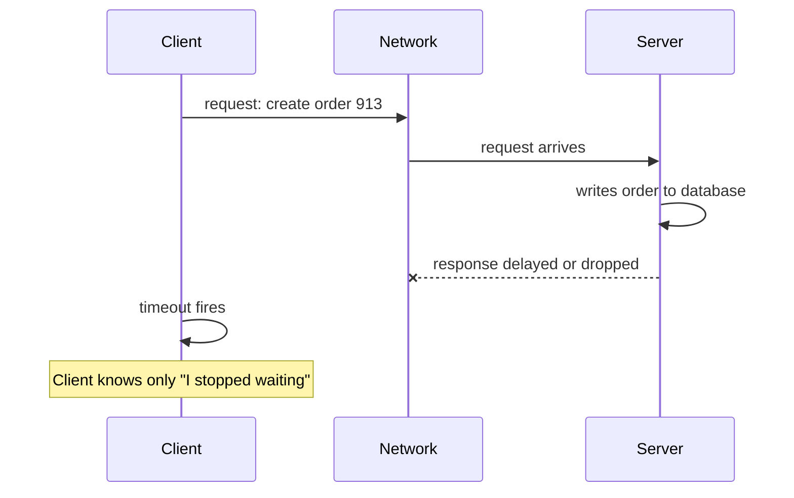
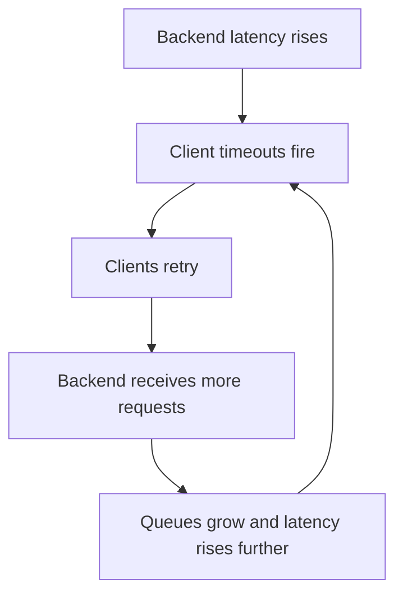
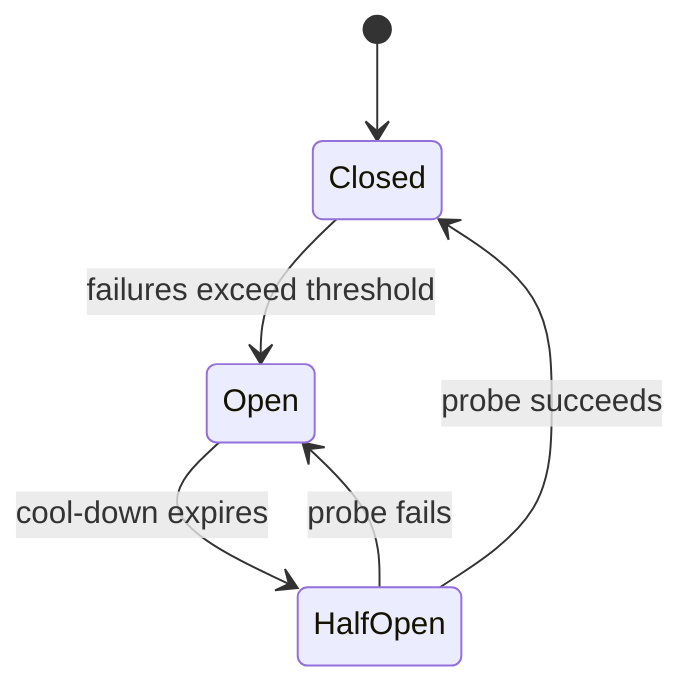

> **Complexity**: `[COMPLEX]`
>
> **Time to Complete**: 60-75 minutes
>
> **Prerequisites**: [Module 5.3: Eventual Consistency](../module-5.3-eventual-consistency/)
>
> **Track**: Foundations

## What You'll Be Able to Do

After completing this module, you will be able to:

1. **Explain** why a timeout is not proof that a remote operation failed, and why a client cannot distinguish a dead server from a slow server by waiting on a network call.
2. **Compare** at-most-once and at-least-once delivery semantics, including why the Two Generals problem keeps acknowledgements from creating perfect certainty.
3. **Design** idempotent retry behavior with stable operation identifiers so repeated attempts do not create duplicate side effects.
4. **Diagnose** retry storms and thundering herds by tracing how client timeouts multiply backend load during overload.
5. **Apply** backoff with jitter and a circuit breaker to protect a slow dependency from cascading failure.

---

## Why This Module Matters

The most dangerous distributed-system failure is not the clean crash where a process exits and every monitor turns red. The dangerous one is silence. A frontend calls a payment service, waits 200 milliseconds, and hears nothing. The socket is still open. The network path did not send a neat explanation. The payment service might be down. It might be slow. It might have already charged the customer and lost the response on the way back. It might be stuck behind a long garbage-collection pause and about to reply just after the client gives up.

That ambiguity is the operator's daily problem. A local function call has shared fate with its caller: if the process is running, memory and CPU are mostly shared, and failure is usually visible. A remote call does not have that property. The client, network, load balancer, server, server dependency, and return path can all fail independently. Martin Kleppmann's [Designing Data-Intensive Applications](https://dataintensive.net/) builds much of its replication and consistency discussion around this reality: distributed systems are not hard because machines are mysterious, but because communication delay, failure, and uncertainty are part of the model.

Timeouts are necessary because waiting forever consumes real resources, but timeouts also create a trap. A timeout tells you that the client stopped waiting. It does not tell you whether the server stopped working. If you retry immediately, you may save the user from a transient packet loss. If a thousand clients retry immediately during overload, you may turn a partial failure into a full outage. The AWS Builders Library article [Timeouts, retries, and backoff with jitter](https://aws.amazon.com/builders-library/timeouts-retries-and-backoff-with-jitter/) calls retries powerful but dangerous: they can improve availability during transient faults, and they can amplify backend load when the backend is already struggling.

This module is about the habits that keep that ambiguity from becoming an outage. You will learn to treat timeouts as uncertainty, not facts; to make retries safe through idempotency; to budget retries instead of sprinkling them everywhere; to spread retry traffic with backoff and jitter; and to stop calling a failing dependency with a circuit breaker before the failure cascades through the rest of the system.

---

## Part 1: Timeout Does Not Mean Failure

### 1.1 The Silent Server Problem

When a client makes a remote call, it usually wants a simple answer: did the operation happen? In a distributed system, that answer may not be knowable from the client's perspective. The client can observe only its own local events: it sent bytes, waited, and either received bytes or stopped waiting. It cannot observe what happened inside the server unless the server's reply arrives.



There are several possible histories behind the same client observation:

| Client Observation | Possible Server Reality | Operator Consequence |
|--------------------|-------------------------|----------------------|
| Timeout | Server never received the request | Retrying may be harmless and useful |
| Timeout | Server received request but crashed before side effect | Retrying may complete the operation |
| Timeout | Server completed side effect but response was lost | Retrying may duplicate the side effect |
| Timeout | Server is overloaded and still processing | Retrying increases load on the weakest component |
| Timeout | Network path is partitioned in one direction | Retrying through the same path may change nothing |

This is why "timeout handling" is not just a client-library setting. It is a correctness problem. If the operation has no side effect, such as reading a cache value, retrying is usually safe. If the operation creates a VM, charges a card, schedules a job, or sends an email, a retry can create a second side effect unless the API was designed for retries.

Leslie Lamport's [Time, Clocks, and the Ordering of Events in a Distributed System](https://www.microsoft.com/en-us/research/publication/time-clocks-ordering-events-distributed-system/) is usually taught for logical clocks, but it also gives a useful mental model here: distributed systems do not have one perfectly observable global order. A client-side timeout and a server-side commit are separate events, and without a message connecting them, the client cannot infer the server's state from local time alone.

### 1.2 The Failure Detector Is a Guess

Operators often talk as if a timeout "detects" failure. More precisely, a timeout is a suspicion threshold. The client chooses a duration after which it would rather stop waiting than keep resources tied up. That threshold may be reasonable, but it is still a guess about the downstream latency distribution and about the user's patience.

The AWS Builders Library recommends choosing timeouts from downstream latency percentiles and an acceptable false-timeout rate. For example, if you can tolerate about 0.1% false timeouts on an in-region service, you might start near the downstream p99.9 latency and then add padding for connection setup, DNS, TLS, and other hidden work. The important lesson is not the exact percentile. The lesson is that a timeout should be chosen from measured behavior and a business deadline, not from a round number that felt comfortable during development.

```text
User deadline:                  1000 ms
Frontend work:                   120 ms
Network and load balancer:        80 ms
Budget left for dependency:      800 ms

Dependency p50 latency:           40 ms
Dependency p90 latency:           90 ms
Dependency p99 latency:          350 ms
Dependency p99.9 latency:        780 ms

Timeout at 100 ms: many false timeouts, many retries
Timeout at 900 ms: fewer false timeouts, but user budget is gone
Timeout at 500 ms: trade-off that must be tested under load
```

> **Pause and predict**: If a downstream service's p99 latency rises from 350 ms to 700 ms during a deployment, what happens to a client that has a 500 ms timeout and three immediate retries?

The answer is uncomfortable: the client begins turning slow-but-possibly-successful requests into failed attempts, then adds more requests to the downstream at the exact moment the downstream is already slow. The timeout may be locally rational and globally harmful.

### 1.3 Slow and Dead Look the Same From the Caller

A remote call does not carry a truth label. A client waiting for a reply sees silence whether the server is dead, slow, paused, partitioned, or still working. That is the fundamental uncertainty of partial failure.

The operator habit is to separate **what you observed** from **what you inferred**:

| Say This | Not This |
|----------|----------|
| "The caller timed out after 200 ms." | "The backend failed." |
| "The retry budget was exhausted." | "The operation did not happen." |
| "The client received no response." | "The server did not process it." |
| "The backend is above its latency SLO." | "The backend is down." |

This wording sounds pedantic until an incident. During a payment outage, "the charge failed" and "the checkout caller timed out" lead to different recovery actions. The first encourages the team to ask customers to retry. The second forces the team to check whether the payment provider may already have processed some of those charges.

### 1.4 Timeout Values Express Priorities

A timeout value is a product decision, a capacity decision, and a correctness decision disguised as a number. If the timeout is too high, callers wait long after the user has stopped caring, worker pools fill with stuck requests, and upstream services hold memory, file descriptors, TCP connections, and goroutines that could have served other work. If the timeout is too low, ordinary tail latency becomes apparent failure, and the caller creates avoidable retries. The right timeout is therefore not "as short as possible" or "long enough that errors disappear." It is the point where the user deadline, downstream latency distribution, and retry policy are all honest about the same budget.

This is why experienced operators ask for the whole request timeline. A 300 ms dependency timeout may be generous inside a 700 ms user deadline if the frontend has little local work and only one dependency. The same 300 ms timeout may be reckless inside a page load that fans out to twelve services and then renders a response through another aggregation layer. The number cannot be judged without knowing what happens before it, what happens after it, how many parallel calls share the budget, and what the caller does when the timer expires.

Connection setup is a common source of false confidence. A client may believe it has set a request timeout, but the timer may include DNS lookup, TCP connection establishment, TLS negotiation, proxy routing, and connection-pool waiting, or it may exclude some of those steps depending on the library. The AWS article gives a concrete warning about this class of pitfall: a timeout that looked safe during steady state caused failures after deployments because new secure connections took longer than reused connections. The operator lesson is to test timeouts during cold start, rollout, connection churn, and DNS disruption, not only during a warm happy path.

### 1.5 Timeouts Need Owners

Large systems often accumulate timeouts by accident. A browser has one timeout, an API gateway has another, the service mesh has another, the frontend has another, the language HTTP client has another, and the database driver has another. If those values are not designed together, lower layers may continue work after the user-facing deadline has already expired, or upper layers may retry while lower layers are still retrying the same operation. The result is wasted work that looks like reliability engineering in each individual component and looks like overload at the system boundary.

The cleaner pattern is deadline propagation. The entry point chooses an overall deadline based on the user or workflow requirement, then passes the remaining budget downstream. Each layer spends from that shared budget instead of inventing a private one. If the frontend has 800 ms left when it calls inventory, inventory should not start a database query with a 2 second timeout. If the caller has already given up, the downstream should be able to stop or deprioritize the work rather than completing a response nobody can use.

Deadline propagation also improves incident analysis. When every span in a trace carries the remaining deadline, you can see whether failures came from a slow dependency, a queue that consumed the entire budget before work began, or a retry loop that kept trying after success was no longer useful. Without that visibility, teams tend to tune whichever timeout is closest to the error log, which can move the symptom while leaving the system-level budget broken.

### 1.6 The Operator's Timeout Runbook

When timeout alarms fire, resist the urge to change a value first. Start by separating symptoms into four buckets: caller-side waiting, network connection setup, server queueing, and server execution. Caller-side waiting shows up as exhausted worker pools, connection pools, or request contexts. Network setup issues show up as DNS latency, TLS handshake latency, SYN retransmits, or proxy errors. Server queueing appears when requests reach the backend but wait behind other work. Server execution appears when the backend starts promptly but spends too long in CPU, IO, locks, or dependencies.

Each bucket suggests a different fix. If callers are exhausting their own pools, a longer timeout can make the incident worse. If connection setup is the hidden cost, pre-warming connections or separating connect and request timeouts may help. If server queueing is the issue, retries are usually harmful until load is reduced. If server execution has a genuine long-tail path, you may need caching, query changes, priority queues, or degraded responses. The timeout is only the alarm bell; the runbook has to find where time was spent before deciding whether to wait, retry, shed, or fail fast.

---

## Part 2: At-Most-Once, At-Least-Once, and the Two Generals

### 2.1 Delivery Semantics Are Trade-offs

When a call is uncertain, a client has three broad choices. It can stop after one attempt, retry until it hears success, or delegate the operation to a durable queue with its own acknowledgement protocol. Each choice gives different delivery semantics.

| Semantic | Client Behavior | What You Gain | What You Risk |
|----------|-----------------|---------------|---------------|
| At-most-once | Send once, do not retry after uncertainty | Avoid duplicate side effects | Operation may never happen |
| At-least-once | Retry after uncertainty | Operation is likely to happen eventually | Operation may happen more than once |
| Exactly-once effect | Retry with idempotency or transactions | Repeated messages produce one logical effect | Requires explicit design and state |

"Exactly once" is often misunderstood. Networks generally do not give you exactly-once delivery. You build exactly-once **effects** by making duplicate deliveries collapse into the same result. A message may arrive three times, but the order should be created once. A retry may call the billing API four times, but the card should be charged once for a stable operation id.

Kleppmann emphasizes this distinction in the data-systems context: reliability is usually achieved by combining imperfect communication with durable logs, transactions, idempotent operations, and reconciliation. The network does not remove ambiguity for you.

### 2.2 The Two Generals Problem

The Two Generals problem is the classic framing for why acknowledgements cannot create perfect certainty over an unreliable channel. Imagine two armies on opposite hills. They can defeat the enemy only if both attack at dawn. They can send messengers through the valley, but a messenger may be captured. General A sends, "Attack at dawn." General B receives it and sends, "I agree." But now B does not know whether A received the acknowledgement. A could send an acknowledgement of the acknowledgement, but then A does not know whether B received that message. The chain never ends.

```text
General A                     Unreliable valley                     General B
    |                                |                                  |
    |---- Attack at dawn ---------->|                                  |
    |                                |---- message arrives ------------>|
    |                                |<--- I agree ---------------------|
    |<--- acknowledgement arrives ---|                                  |
    |---- I received your ack ------>|                                  |
    |                                |---- maybe lost ----------------->|

Each extra message increases confidence.
No finite number creates perfect common knowledge.
```

Production systems are not literally armies, but the pattern is familiar. A client sends a write. The server commits it and sends a response. The response is lost. The client retries. The server now receives a duplicate. No amount of wishful thinking changes the fact that the duplicate is a normal outcome of at-least-once delivery.

### 2.3 Idempotency Is the Bridge

An operation is **idempotent** when applying it multiple times has the same logical effect as applying it once. Setting a user's display name to "Sam" is idempotent. Incrementing a counter is not idempotent unless the increment has a stable operation id and the receiver deduplicates it. Sending an email is not idempotent unless the mailer stores a unique send key. Creating an order is not idempotent unless the order id or idempotency key is chosen before the retry.

```text
Not idempotent:
    POST /orders
    body: {sku: "lab-kit", quantity: 1}

Retry result:
    order 1001 created
    order 1002 created
    customer receives two lab kits

Idempotent:
    PUT /orders/client-request-7f3a
    body: {sku: "lab-kit", quantity: 1}

Retry result:
    first call creates order client-request-7f3a
    later calls return the same order
    customer receives one lab kit
```

The API shape matters. A server cannot deduplicate a retry if every attempt looks like a new operation. A stable idempotency key moves the operation identity from "whatever the server happens to create this time" to "the thing the client intended once." AWS calls this out directly in its retry guidance: APIs with side effects should not be retried unless they provide idempotency.

### 2.4 Idempotency Is Not Just a Header

Many teams add an `Idempotency-Key` header and stop thinking. That is not enough. The receiver has to store the key, associate it with a request fingerprint, preserve the result for a useful retention window, and decide what to do if the same key appears with a different payload.

| Design Question | Why It Matters |
|-----------------|----------------|
| Who creates the key? | The client must choose it before retrying, or duplicates cannot be recognized |
| How long is the key retained? | Retrying after the retention window may create a duplicate |
| Is the payload fingerprinted? | Reusing a key with different intent should be rejected |
| Is the response cached? | A duplicate should usually receive the original result |
| Is the dedupe store durable? | A crash that loses dedupe state can reintroduce duplicates |

Good idempotency design is boring during normal traffic and priceless during incidents. It lets clients use at-least-once delivery without turning every timeout into a possible duplicate side effect.

### 2.5 Idempotency Has a Data Model

The safest way to think about idempotency is as a small data model, not as middleware. A receiver needs a durable table keyed by operation id. That table usually stores the request fingerprint, the operation state, the final response or resource pointer, creation time, and expiration time. When the first request arrives, the server records the key before performing the side effect. If the process crashes after the record is written but before the side effect completes, a later retry can inspect the state and either continue the operation or report that it is still in progress. If the process performs the side effect first and stores the key afterward, a crash in the middle can still create duplicates.

The request fingerprint matters because idempotency keys are sometimes reused incorrectly. If a client sends key `abc` to create a small order and later sends the same key with a different cart, the server should reject the second request as a key conflict rather than returning the old result or creating a new order. This turns a subtle data-corruption bug into a clear client error. It also makes incident response safer because operators can replay requests without worrying that a malformed replay will mutate a different resource under an old key.

Retention is a business decision. A payment idempotency key may need to live long enough to cover mobile reconnects, queue redelivery, provider reconciliation, and support workflows. A search-index update key may need only a short window because duplicates are cheap and the next full sync will correct drift. The mistake is to choose retention only from storage cost. The retention window defines how long "safe retry" remains true. After the window expires, a retry with the same key can become a new operation unless the resource identity itself is also stable.

### 2.6 Idempotent Retries Still Need Limits

Idempotency makes retries safe for correctness, but it does not make them free. If one logical operation is delivered 100 times, the dedupe table may protect the user from 100 charges, but the backend still pays for 100 HTTP requests, authentication checks, database lookups, lock acquisitions, and response writes. A system can be perfectly idempotent and still fall over because clients retry too aggressively during overload. This distinction is one reason retry storms are so deceptive: teams see no duplicate orders and assume the retry policy is healthy, while the backend is spending most of its capacity proving that duplicates are duplicates.

The practical rule is that idempotency is a prerequisite for retries, not permission for unlimited retries. Pair it with retry budgets, backoff, jitter, and clear overload signals. If the backend says "I am overloaded," the best client behavior may be to stop retrying and surface a temporary failure. That is not giving up on reliability. It is preserving enough capacity for the backend to recover and for other critical work to continue.

---

## Part 3: Retries Can Become the Outage

### 3.1 The Retry Storm Feedback Loop

Retries are attractive because they work beautifully for small, random failures. A packet drops. A pod restarts. A load balancer sends one request to a cold backend. The retry lands on a healthy path and the user never notices.

The failure mode appears when the dependency is slow because it is overloaded. In that case, the retry is not a second chance. It is extra work for the component with the least spare capacity.



Google's SRE chapter [Addressing Cascading Failures](https://sre.google/sre-book/addressing-cascading-failures/) describes this retry amplification clearly: retries can destabilize a backend, consume CPU and memory, and keep a service overloaded even after the original load spike has passed. The chapter also warns against retrying at multiple layers because attempts multiply as a product across the stack.

Consider a request path with four layers:

```text
Browser -> API gateway -> frontend -> inventory service -> database
```

If each layer makes the original attempt plus three retries, one user action can create `4 * 4 * 4 * 4 = 256` database attempts. That does not mean the user became 256 times more important. It means every layer independently tried to be helpful without a system-level retry budget.

### 3.2 Thundering Herds

A **thundering herd** happens when many clients wake up and do the same work at the same time. Retries can create herds because timeouts synchronize clients. If thousands of requests start at the top of a second, time out after exactly 200 ms, and retry immediately, the downstream sees another burst at nearly the same moment.

```text
Time       Backend receives
0 ms       1000 original requests
200 ms     1000 retry #1 requests
400 ms     1000 retry #2 requests
600 ms     1000 retry #3 requests
```

Backoff helps by spacing retries out. Jitter helps by preventing every client from choosing the same spacing. Without jitter, exponential backoff can still synchronize clients at 100 ms, 200 ms, 400 ms, and 800 ms. With jitter, those attempts spread across windows, which gives the downstream a chance to drain queues instead of receiving sharp retry waves.

The AWS retry article makes this operational point: traffic is bursty, retries are bursty, and adding jitter to retries and periodic work reduces correlated spikes. The point is not randomness for its own sake. The point is to protect the shared dependency from synchronized client behavior.

### 3.3 The 90/10 Tail Latency Trap

Average latency hides the user experience of distributed calls. Suppose a dependency is fast 90% of the time and slow 10% of the time:

```text
90 requests out of 100:  40 ms
10 requests out of 100: 900 ms
Average:                126 ms
```

The average looks tolerable, but user actions often fan out to multiple calls. If one page load requires eight independent downstream calls, the chance that all eight land in the fast 90% is:

```text
0.90 ^ 8 = 0.43
```

That means the chance that at least one call hits the slow 10% is:

```text
1 - 0.43 = 0.57
```

More than half of page loads feel the slow tail. This is the 90/10 long-tail latency problem: a small slow fraction can dominate the user experience when requests fan out. If every slow call triggers retries, the tail does not stay a user-experience problem. It becomes a capacity problem.

> **Stop and think**: If your frontend calls ten services and each service has a 1% timeout rate, what is the probability that a full page load sees at least one timeout? What happens if every timeout creates three retry attempts?

### 3.4 Retry Budgets and Deadlines

The practical fix starts with two budgets:

1. **Deadline budget**: How long is the overall user action allowed to take?
2. **Retry budget**: How much extra load is the caller allowed to create while trying to improve success?

A deadline prevents a lower layer from spending time the user no longer has. A retry budget prevents a caller from creating unlimited extra work. Google SRE guidance recommends limiting retries per request, using randomized exponential backoff, considering server-wide retry budgets, and avoiding retries at multiple layers when one layer can own the policy.

```text
Bad:
    every layer retries independently
    no shared deadline
    no maximum retry budget
    no jitter

Better:
    top layer owns retries for cheap operations
    deadline is passed down
    retry count is capped
    retry timing uses backoff with jitter
    overload responses cause callers to stop retrying
```

This is an operator habit more than a code pattern. During design review, ask where retries happen. During an incident, ask whether retries are increasing load. During postmortems, check whether a retry policy that improved availability during small faults made a large fault harder to recover from.

### 3.5 A Worked Retry-Multiplier Example

Imagine a normal minute where 10,000 user requests reach a frontend, and each request makes one inventory call. The backend handles 10,000 inventory attempts and stays healthy. Now a database index regression pushes inventory p99 latency above the frontend timeout. Ten percent of user requests time out on the first attempt, and the frontend retries each timeout three more times. User demand did not change, but backend demand becomes 9,000 successful first attempts plus 1,000 original slow attempts plus 3,000 retry attempts, for 13,000 backend attempts. The user-facing failure rate may still look modest, while the backend suddenly sees 30% more work during the exact minute it has less spare capacity.

If latency worsens and 50% of first attempts cross the timeout, the same policy produces 5,000 successful first attempts, 5,000 original slow attempts, and 15,000 retry attempts, for 25,000 backend attempts. The retry multiplier is now 2.5x. If an API gateway and a service mesh also retry, the multiplier can jump again without any corresponding increase in real user demand. This is why backend teams sometimes report "traffic doubled" while product metrics show no launch, marketing campaign, or customer surge. The additional traffic is synthetic demand created by the recovery mechanism.

The most useful incident graph overlays user requests, backend attempts, and timeout rate on the same timeline. If user requests are flat while backend attempts climb with timeouts, the retry policy is part of the incident. If backend attempts fall after the circuit opens and recovery begins, the protection is working even if users still see temporary errors. This graph also helps with communication: leadership can understand that the team is intentionally failing some calls locally to prevent a longer, wider outage.

### 3.6 Backoff Is a Load-Shaping Tool

Backoff is often explained as "wait longer each time," but the deeper purpose is load shaping. The first retry may be close because the failure could be a single dropped packet or a cold connection. Later retries should be farther apart because repeated failure is evidence that the dependency may be unhealthy. Jitter then spreads those later attempts so the backend sees a smoother arrival pattern. A smooth pattern is easier to serve, easier to autoscale, and easier to reason about than synchronized spikes.

A useful default for many internal calls is capped exponential backoff with jitter and a strict attempt limit. The cap matters because pure exponential growth can exceed the user's deadline. The attempt limit matters because a request that keeps retrying forever can outlive the workflow that created it. The jitter matters because thousands of clients can otherwise align on the same capped delay. AWS's [Exponential Backoff and Jitter](https://aws.amazon.com/blogs/architecture/exponential-backoff-and-jitter/) article gives more detail on jitter variants, but the operator habit is simple: if many clients might retry together, deterministic retry timing is a risk.

### 3.7 Overload Responses Should Change Client Behavior

Not all errors deserve the same retry. A validation error should not be retried with the same payload. A permanent authorization failure should not be retried until credentials change. A transient connection reset might be worth one retry. An explicit overload response should usually reduce traffic. Google SRE's overload guidance emphasizes client-side throttling because even rejected requests consume backend resources; once a backend is spending meaningful CPU just rejecting traffic, callers need to self-regulate before the rejection path becomes its own overload source.

This means API contracts should distinguish failure classes. A generic `500` leaves clients guessing. A clear overload status, retry-after hint, or quota response gives clients permission to back off. The backend also needs to make rejection cheap. If rejecting a request requires the same database query or lock as serving it, the overload response will not protect much. Good overload handling is designed on both sides of the call: the backend emits a cheap, specific signal, and the client treats that signal as a reason to slow down rather than a reason to hammer retry.

---

## Part 4: Circuit Breakers and Failing Locally

### 4.1 What a Circuit Breaker Does

A circuit breaker is a local protection mechanism around a remote dependency. It has three basic states:

| State | Behavior | Why |
|-------|----------|-----|
| Closed | Calls pass through normally | Dependency is believed healthy |
| Open | Calls fail locally without reaching dependency | Dependency is failing or overloaded |
| Half-open | A small number of probe calls are allowed | Test whether recovery has happened |



The circuit breaker does not make the dependency healthy. It prevents the caller from making the dependency less healthy. That distinction matters. If the payment service is overloaded, a circuit breaker in checkout may return a clear "payment temporarily unavailable" response instead of sending thousands of doomed retry attempts. The user still sees an error, but the payment service has a chance to recover.

### 4.2 Circuit Breakers Are Not Magic

Circuit breakers introduce modal behavior: the same code path behaves differently depending on recent history. The AWS Builders Library article notes that circuit breakers can be difficult to test and may add recovery time if tuned poorly. That does not make them bad. It means they should be designed explicitly, observed carefully, and tested under failure.

Key design decisions include:

| Decision | Good Default |
|----------|--------------|
| Failure signal | Timeouts, connection errors, and explicit overload responses |
| Threshold | Based on a short rolling window, not a single rare blip |
| Open duration | Long enough to reduce pressure, short enough to probe recovery |
| Half-open probes | Very limited concurrency |
| User response | Clear local failure, not hidden infinite waiting |
| Metrics | State, rejected calls, probe results, downstream latency |

Do not use a circuit breaker to hide a dependency you always need. Use it to protect the dependency and preserve the rest of the system. Marc Brooker's [Avoiding fallback in distributed systems](https://aws.amazon.com/builders-library/avoiding-fallback-in-distributed-systems/) is useful here because fallback logic often looks safer than it is. A fallback path that is rarely exercised can fail during the exact outage it was supposed to soften, or it can expand the blast radius by calling another shared dependency. Sometimes the best fallback is to fail fast, shed load, and keep the system honest.

### 4.3 A Practical Call Policy

For an operator, a healthy remote-call policy usually looks like this:

```text
1. Every remote call has a deadline.
2. Every retryable operation is idempotent.
3. Retries happen at one intentional layer.
4. Retry count is capped.
5. Retry delay uses exponential backoff with jitter.
6. Overload responses reduce caller traffic.
7. Circuit breakers fail locally when the dependency is unhealthy.
8. Metrics expose attempts, timeouts, duplicate idempotency keys, and circuit state.
```

This policy does not promise that every request succeeds. It promises that failure remains bounded. That is the difference between resilience and denial.

### 4.4 Case Study: The Fallback That Expanded the Outage

Marc Brooker's AWS Builders Library article on fallback describes a pattern that is easy to recognize in platform incidents. A system has a main path and a fallback path. The fallback sounds safer because it gives the caller another way to answer the request when the main path fails. In practice, distributed fallback is hard to test because the failure case involves multiple machines, partial dependency outages, queueing, and timing. The fallback path may sit unused for months, then run for the first time under the highest stress the system has seen all quarter.

The dangerous part is that fallback can increase the scope of impact. If the main dependency is unhealthy and every caller falls back to another shared dependency, the fallback can overload that second dependency. If the fallback skips a cache and calls a database directly, it can turn a partial cache problem into a database problem. If the fallback produces lower-quality responses slowly, callers may still time out and retry, adding load to both paths. The system now has two problems: the original failure and the recovery behavior.

The circuit-breaker lesson is different. A circuit breaker does not pretend the dependency is fine. It says, "Recent evidence shows this dependency is unhealthy, so I will stop spending its capacity until a small probe suggests recovery." That may sound less heroic than fallback, but it is often the safer operational choice. A clear local failure can preserve the rest of the system, keep dashboards honest, and give responders a bounded problem to fix.

### 4.5 Tuning the Breaker Without Hiding the Incident

Circuit breakers fail when they are tuned from hope instead of evidence. If the threshold is too sensitive, one small packet-loss blip opens the circuit and creates unnecessary user-visible errors. If the threshold is too insensitive, the breaker opens only after the backend has already melted down. If the open interval is too long, recovery is delayed. If half-open probing allows too much concurrency, the probe becomes another thundering herd. The right values come from load tests, failure injection, and production telemetry, not from copying a library default.

The breaker also needs observability as a first-class feature. Emit metrics for state transitions, local rejections, downstream attempts, probe successes, probe failures, and time spent open. Add trace attributes that show whether a request failed because the dependency timed out or because the circuit was already open. During an incident, responders should be able to answer whether the breaker is protecting the backend, flapping between states, or masking a permanent dependency failure that needs escalation.

Finally, be explicit about user experience. A circuit-open response should not look like a generic crash. It should be a controlled failure with a message, status code, and retry guidance appropriate to the caller. Internal callers may receive a structured overload error. Human users may see "temporarily unavailable" and avoid double-submitting a payment. Operators may use the circuit state to decide whether to shed noncritical work or move traffic. A circuit breaker is a coordination signal as much as a code branch.

---

## Part 5: Operator Mental Models

### 5.1 The Four Questions

When a service is silent, ask four questions in order:

| Question | Why It Comes First |
|----------|--------------------|
| What did the caller observe? | Keeps evidence separate from inference |
| Could the operation have already happened? | Prevents duplicate side effects during recovery |
| Are retries helping or adding load? | Identifies retry storms early |
| What should fail locally? | Protects the dependency and the rest of the system |

These questions are deliberately plain. During an incident, cleverness is less useful than disciplined wording. "The backend is down" might be true, but "checkout callers see 200 ms timeouts and retry three times" is more actionable.

### 5.2 The Three Counters

For retry-heavy systems, three counters reveal more than a generic error rate:

| Counter | What It Reveals |
|---------|-----------------|
| User requests | The amount of real work users asked for |
| Backend attempts | The amount of work the dependency had to handle |
| Unique idempotency keys | The number of logical operations represented by those attempts |

If user requests are 1,000 and backend attempts are 4,000, your retry multiplier is 4x. If unique idempotency keys are 1,000, idempotency is probably preventing duplicate effects. If unique keys are also 4,000, every retry looks like new intent, and you may be duplicating work.

```text
retry_multiplier = backend_attempts / user_requests
duplicate_attempts = backend_attempts - unique_idempotency_keys
```

During overload, watch the retry multiplier. It may explain why a backend with only 20% more user traffic suddenly sees 300% more load.

### 5.3 The Tail Is the Product

Fan-out turns small tail probabilities into common user pain. If one dependency is slow 10% of the time, that is a problem. If a user action calls eight such dependencies, the slow tail becomes normal. If every slow dependency triggers retries, the tail becomes load.

This mental model changes what you measure. Do not look only at average latency per service. Look at p95, p99, and p99.9 latency. Look at request fan-out. Look at the distribution of attempts per user action. A system with acceptable averages can still have terrible user experience and dangerous retry behavior.

### 5.4 A Review Checklist for Remote Calls

Before approving a new service-to-service call, review it as an operator would review a failure path. Ask what the caller's total deadline is, how the timeout value was chosen, whether connection setup is covered, and what happens when the downstream is slow but not dead. Ask whether the operation has side effects, where the idempotency key comes from, how long dedupe state is retained, and whether duplicate attempts return the original result. Ask where retries happen in the stack, whether retry count is capped, whether retry timing uses jitter, and whether overload responses change client behavior.

Then ask what the dashboards will show at 3 AM. You want graphs for user requests, backend attempts, timeout count, retry count, local circuit rejections, downstream latency percentiles, and unique idempotency keys. You want logs that include the operation id, attempt number, remaining deadline, and circuit state without leaking sensitive data. You want traces that make it obvious whether time was spent waiting in the caller, connecting over the network, queueing in the backend, or executing backend work.

This checklist is intentionally repetitive because distributed failures are repetitive. Most retry incidents are not caused by a lack of clever algorithms. They are caused by missing ownership: nobody owned the overall deadline, nobody owned idempotency retention, nobody owned retry placement, and nobody owned the graph that compared user demand to backend attempts. Good platform engineering turns those ownership questions into defaults, libraries, review templates, and runbooks.

### 5.5 Best Practices and Anti-Patterns in One Sentence

The best practice is to make uncertainty explicit and bounded. Use deadlines to bound waiting, idempotency to bound duplicate effects, retry budgets to bound extra work, jitter to bound synchronization, and circuit breakers to bound cascading failure. Each pattern addresses a different part of the problem, and removing one usually shifts risk somewhere else. Idempotency without retry limits protects correctness but not capacity. Backoff without jitter lowers frequency but not correlation. Circuit breakers without probes protect recovery but may delay it. Timeouts without observability create error messages but not understanding.

The anti-pattern is to make uncertainty invisible. Infinite waits hide stuck work. Blind retries hide ambiguous outcomes. Fallbacks hide dependency health. Averages hide the tail. Generic errors hide overload. Missing operation ids hide duplicate effects. These choices feel simpler during implementation, but they export complexity to incidents, where the team has less time and worse information. The operator habit is to surface the uncertainty early, name it accurately, and decide how the system should behave before the silent server appears.

---

## Did You Know?

- Amazon engineers treat timeouts, retries, backoff, and jitter as a connected design problem, not four independent settings. The AWS Builders Library article on [timeouts and jitter](https://aws.amazon.com/builders-library/timeouts-retries-and-backoff-with-jitter/) explicitly warns that retries can amplify load when failures are caused by overload.
- Google's SRE guidance on [handling overload](https://sre.google/sre-book/handling-overload/) describes client-side throttling, where clients reject some requests locally after observing backend rejection, because even rejected backend requests consume resources.
- Lamport's 1978 paper is famous for logical clocks, but its deeper lesson is operational: distributed systems expose only partial ordering unless messages establish causality. A timeout is a local event, not a global fact.
- Kubernetes API design relies heavily on stable resource names and resource versions, which is one reason controllers can retry reconciliation loops without treating every repeated observation as a new user intent.

---

## Common Mistakes

| Mistake | Problem | Better Approach |
|---------|---------|-----------------|
| Treating timeout as failed operation | You may retry an operation that already happened | Treat timeout as unknown; check idempotency before retrying |
| Retrying non-idempotent writes | Duplicate charges, orders, emails, or jobs | Require stable operation ids and dedupe state |
| Retrying at every layer | Attempts multiply across the stack | Put retry ownership at one intentional layer |
| Using fixed retry delays | Clients synchronize and create retry waves | Use exponential backoff with jitter |
| Setting timeout from a guess | False timeouts trigger avoidable retries | Use downstream latency percentiles and user deadlines |
| Hiding overload with fallback | Fallback can add more dependencies and widen blast radius | Prefer fail-fast, load shedding, or exercised failover |
| Missing retry metrics | Error rate hides amplification | Track user requests, backend attempts, and idempotency keys |
| Keeping the circuit closed during overload | Sick dependency receives more work | Open the circuit and fail locally until probes succeed |

---

## Quiz

1. **A checkout service calls a payment provider with a 300 ms timeout. The call times out, and the user clicks "Pay" again. Why is it incorrect to say "the payment failed"?**
   <details>
   <summary>Answer</summary>
   The timeout proves only that the checkout service stopped waiting after 300 ms. The payment provider may never have received the request, may have received it and crashed, may still be processing it, or may have successfully charged the card while the response was delayed or lost. The correct statement is "checkout did not receive a response before its deadline." Recovery should check idempotency keys, provider state, or reconciliation data before encouraging another non-idempotent payment attempt.
   </details>

2. **A service retries `POST /orders` three times after timeouts. Each attempt lets the server generate a new order id. What delivery semantic is the client trying to achieve, and what correctness bug can appear?**
   <details>
   <summary>Answer</summary>
   The client is trying to achieve at-least-once delivery: it wants the order creation to happen despite uncertain communication. The bug is duplicate side effects. Because each retry looks like a new operation, the server may create multiple orders for the same user intent. The fix is to make the operation idempotent, usually by having the client choose a stable order id or idempotency key before the first attempt and having the server store and deduplicate that key.
   </details>

3. **Why does adding exponential backoff without jitter still leave a thundering herd risk?**
   <details>
   <summary>Answer</summary>
   If many clients start at the same time and use the same deterministic backoff schedule, they can still retry together at the same future times: for example 100 ms, 200 ms, 400 ms, and 800 ms. Backoff reduces retry frequency, but it does not necessarily decorrelate clients. Jitter spreads retries across a window so the backend receives smoother traffic and has a better chance to drain queues.
   </details>

4. **A frontend calls ten downstream services in parallel. Each downstream has a 1% chance of being slow enough to hit the frontend timeout. Approximately how likely is the page load to see at least one timeout, assuming independent calls?**
   <details>
   <summary>Answer</summary>
   The chance that one dependency does not time out is 99%, or 0.99. The chance that all ten avoid timeout is `0.99^10`, which is about 0.904. Therefore the chance of at least one timeout is `1 - 0.904`, or about 9.6%. This is why tail latency dominates fan-out systems: small per-call tail probabilities become common at the user-action level.
   </details>

5. **During an outage, backend CPU is high, request latency is high, and frontend logs show many timeout retries. Why might increasing the frontend timeout make things better, and why might it also make things worse?**
   <details>
   <summary>Answer</summary>
   Increasing the timeout might reduce false timeouts, which can reduce retry traffic and allow slow-but-successful backend work to complete. It might make things worse if callers hold resources much longer, exhaust connection pools or worker threads, and exceed user deadlines anyway. The right choice depends on measured latency, resource limits, and the overall deadline budget. Timeout changes should usually be paired with retry limits, jitter, and circuit-breaking behavior.
   </details>

6. **What is the difference between a circuit breaker and a retry policy?**
   <details>
   <summary>Answer</summary>
   A retry policy decides when a caller should make another attempt after uncertainty or transient failure. A circuit breaker decides when the caller should stop sending attempts to a dependency because recent evidence suggests the dependency is unhealthy or overloaded. Retries can increase load; circuit breakers cap load by failing locally. Good systems often use both: a small number of idempotent, jittered retries while healthy, and local failure when the circuit opens.
   </details>

7. **A backend deduplicates idempotency keys for only five minutes. A mobile client retries the same operation after reconnecting thirty minutes later. What can go wrong?**
   <details>
   <summary>Answer</summary>
   The backend may have forgotten the original idempotency key and treat the late retry as a new operation. That can create a duplicate side effect even though the client reused the same key. Idempotency retention must match realistic retry windows, offline behavior, and reconciliation needs. If long offline retries are possible, the dedupe record or the operation resource itself must remain durable long enough to recognize duplicates.
   </details>

8. **Your incident dashboard shows 5,000 user requests per minute but 25,000 backend attempts per minute. What does that ratio tell you, and what should you inspect next?**
   <details>
   <summary>Answer</summary>
   The backend is seeing a 5x retry multiplier relative to real user demand. You should inspect where retries happen, whether multiple layers are retrying, whether operations are idempotent, whether retry delays include jitter, and whether the backend is overloaded because retries are keeping it overloaded. You should also compare backend attempts to unique idempotency keys to understand whether duplicates are being safely deduplicated or treated as new side effects.
   </details>

---

## Hands-On Exercise

**Task**: Connect timeout, retry, and circuit-breaker concepts to Kubernetes control-plane behavior and to pen-and-paper load math.

**Task 1: Observe Lease Renewal as a Timeout Boundary (10 minutes)**

Kubernetes controllers use lease objects with renewal deadlines. When renewals stop, another candidate can take leadership. This is a concrete example of a caller-side timeout boundary: the holder must prove liveness before the lease expires.

```bash
# List control-plane leader leases
kubectl get leases -n kube-system

# Inspect controller-manager lease timing
kubectl get lease kube-controller-manager -n kube-system -o yaml

# Note leaseDurationSeconds, renewTime, and holderIdentity
# Re-run after ~30 seconds and compare renewTime
kubectl get lease kube-controller-manager -n kube-system -o jsonpath='{.spec.holderIdentity}{"\n"}{.spec.leaseDurationSeconds}{"\n"}{.spec.renewTime}{"\n"}'
```

<details>
<summary>Solution & Explanation</summary>
A healthy leader updates `renewTime` regularly within `leaseDurationSeconds`. If the holder pauses (GC, overload, partition), renewal stops and the lease eventually expires even though the process may still be running locally. That is the same ambiguity pattern as a remote HTTP timeout: local silence does not prove the peer failed globally, but the coordination layer must act on missed renewals to avoid split leadership.
</details>

**Task 2: Read Probe Timeouts on a Workload (10 minutes)**

Readiness and liveness probes are another form of timeout policy. They decide when Kubernetes stops sending traffic or restarts a container based on local observations, not on global certainty about application health.

```bash
# Pick any running pod in your cluster
kubectl get pods -A | head -5

# Dump probe config across all kube-system pods (no name needed — this lists them)
kubectl get pod -n kube-system -o yaml | rg -n "livenessProbe|readinessProbe|timeoutSeconds|periodSeconds|failureThreshold" -A2
```

<details>
<summary>Solution & Explanation</summary>
Probe `timeoutSeconds` is a suspicion threshold, not proof that the application logic failed. A pod can be mid-request, blocked on a dependency, or slow during startup while the kubelet already marks it unready. Operators should align probe timeouts with startup time, dependency latency, and user-facing deadlines instead of copying generic defaults.
</details>

**Task 3: Calculate a Retry Multiplier (15 minutes)**

Use the worked example from Part 3.5. Assume 10,000 user requests per minute, each making one inventory call. Ten percent of first attempts time out, and the frontend retries each timeout three more times.

On paper, compute:

1. Successful first attempts
2. Original slow attempts that timed out
3. Retry attempts
4. Total backend attempts
5. Retry multiplier (`backend_attempts / user_requests`)

Then change the timeout rate to 50% and recompute. Write one sentence explaining why the backend can see a traffic spike when user demand is flat.

<details>
<summary>Solution & Explanation</summary>
At 10% timeouts with three retries: 9,000 successful first attempts + 1,000 original slow attempts + 3,000 retries = 13,000 backend attempts. Multiplier = 1.3x. At 50% timeouts: 5,000 + 5,000 + 15,000 = 25,000 attempts. Multiplier = 2.5x. The spike happens because retries are synthetic load created by the recovery policy, not by more users.
</details>

**Task 4: Design an Idempotent Payment API (15 minutes)**

Sketch a side-effecting `POST /payments` API that clients may retry after timeouts. Specify: who creates the idempotency key, how long dedupe state is retained, what happens when the same key arrives with a different payload, and what the client should do after a timeout before encouraging the user to click Pay again.

<details>
<summary>Solution & Explanation</summary>
The client should generate a stable idempotency key before the first attempt and send it on every retry. The server stores key, payload fingerprint, state, and result for a retention window that covers realistic reconnect and support workflows. Same key + different payload returns a conflict error. After timeout, checkout should query payment status or reconciliation by key instead of issuing a fresh non-idempotent charge.
</details>

**Success Criteria**:

- [ ] Inspected a Kubernetes lease and explained renewal as a timeout boundary
- [ ] Located probe timeout settings and explained what they do and do not prove
- [ ] Computed retry multipliers for 10% and 50% timeout rates
- [ ] Designed idempotency behavior for a retryable payment API

---

## Key Takeaways

Before moving on, ensure you understand:

- [ ] **Timeouts are local observations**: A timeout means the caller stopped waiting, not that the server failed or that the operation did not happen.
- [ ] **Slow and dead are indistinguishable from the caller**: Without a response, the client cannot know whether the server is dead, slow, partitioned, or already done.
- [ ] **At-least-once creates duplicates**: Retrying improves the chance that work happens but can produce repeated delivery.
- [ ] **Idempotency creates safe effects**: Stable operation ids and dedupe state let repeated attempts collapse into one logical side effect.
- [ ] **Retries can amplify outages**: During overload, retries add work to the weakest component and can delay recovery.
- [ ] **Tail latency dominates fan-out**: Small per-call slow fractions become common when one user action depends on many calls.
- [ ] **Backoff needs jitter**: Backoff reduces frequency; jitter reduces synchronization.
- [ ] **Circuit breakers bound failure**: Failing locally can be the healthiest behavior when a dependency is overloaded.
- [ ] **Metrics need attempt counts**: Track user requests, backend attempts, unique idempotency keys, and circuit state, not just success and error rates.

---

## Sources

- Martin Kleppmann, [Designing Data-Intensive Applications](https://dataintensive.net/) - replication, consistency, fault tolerance, and the design trade-offs behind reliable data systems.
- AWS Builders Library, [Timeouts, retries, and backoff with jitter](https://aws.amazon.com/builders-library/timeouts-retries-and-backoff-with-jitter/) - practical guidance on timeout selection, idempotency, retry amplification, and jitter.
- AWS Architecture Blog, [Exponential Backoff and Jitter](https://aws.amazon.com/blogs/architecture/exponential-backoff-and-jitter/) - deeper comparison of jitter strategies for contended clients.
- AWS SDK Reference, [Retry behavior](https://docs.aws.amazon.com/sdkref/latest/guide/feature-retry-behavior.html) - how modern AWS SDKs expose retry modes and token-bucket style retry controls.
- Amazon EC2 Developer Guide, [Ensuring idempotency in Amazon EC2 API requests](https://docs.aws.amazon.com/ec2/latest/devguide/ec2-api-idempotency.html) - an example of client-token idempotency for side-effecting API calls.
- Google SRE Book, [Handling Overload](https://sre.google/sre-book/handling-overload/) - client-side throttling and overload management.
- Google SRE Book, [Addressing Cascading Failures](https://sre.google/sre-book/addressing-cascading-failures/) - retry amplification, cascading failure patterns, and mitigation guidance.
- Marc Brooker, [Avoiding fallback in distributed systems](https://aws.amazon.com/builders-library/avoiding-fallback-in-distributed-systems/) - why fallback paths can widen outages and why failover must be exercised.
- Leslie Lamport, [Time, Clocks, and the Ordering of Events in a Distributed System](https://www.microsoft.com/en-us/research/publication/time-clocks-ordering-events-distributed-system/) - the foundational paper behind logical time and partial ordering in distributed systems.
- Leslie Lamport, [Time, Clocks, and the Ordering of Events in a Distributed System PDF](https://lamport.org/pubs/time-clocks.pdf) - the paper text in Lamport's publication archive.
- Kubernetes documentation, [API Concepts](https://kubernetes.io/docs/reference/using-api/api-concepts/) - resource identity, watches, and API behavior relevant to retrying controller operations.

---

## Next Module

Partial failure is the foundation for the remaining distributed-systems mental models. When you see a remote call time out, think in terms of uncertainty, delivery semantics, idempotency, retry budgets, and overload protection. These habits apply directly to platform operations: Kubernetes controllers retry reconciliation, service meshes enforce deadlines, queues redeliver messages, and user-facing APIs must protect downstream systems when the tail gets slow.

The next module turns from *whether* a remote call succeeded to *when* events actually happened. [Module 5.5: Clock Skew and Ordering](../module-5.5-clock-skew-and-ordering/) explains why wall-clock timestamps are untrustworthy across machines, and how logical clocks recover a usable ordering of events without a shared "now."

### Key Links

- [Module 5.1: What Makes Systems Distributed](../module-5.1-what-makes-systems-distributed/)
- [Module 5.2: Consensus and Coordination](../module-5.2-consensus-and-coordination/)
- [Module 5.3: Eventual Consistency](../module-5.3-eventual-consistency/)
- [Module 5.5: Clock Skew and Ordering](../module-5.5-clock-skew-and-ordering/)
- [SRE Discipline](/platform/disciplines/core-platform/sre/)
- [Platform Engineering Discipline](/platform/disciplines/core-platform/platform-engineering/)
