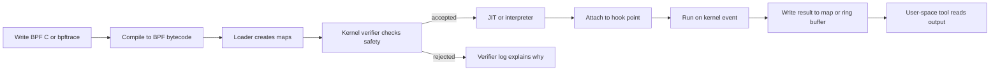

> **Complexity**: `[MEDIUM]`
>
> **Time to Complete**: 55-65 minutes
>
> **Prerequisites**: Linux process and networking basics, Kubernetes Services and Pods, and basic observability vocabulary from [Instrumentation Principles](../observability-theory/module-3.3-instrumentation-principles/)
>
> **Track**: Foundations

---

## Learning Outcomes

After completing this module, you will be able to:

1. **Debug** a simple eBPF-based observation by identifying the hook point, the event data, the map used to transfer state, and the user-space component that reads the result.
2. **Design** a safe first eBPF use case by choosing between tracing, networking, cgroup, and LSM hooks instead of treating "run code in the kernel" as a single undifferentiated capability.
3. **Evaluate** whether a platform tool should use bpftrace, BCC, libbpf with CO-RE, or a packaged product such as Cilium, Tetragon, Pixie, or KubeArmor.
4. **Explain** why the verifier, bounded memory access, helper restrictions, and capabilities exist, and predict the class of programs the kernel will reject before they reach production.
5. **Assess** operational risk in eBPF deployments by checking BTF availability, kernel version support, map pressure, privilege boundaries, JIT hardening, and unprivileged BPF settings.

---

## Why This Module Matters

In May 2020, a public Cilium community bug report described a connection-tracking failure that looked ordinary from the application side and strange from the kernel side. Certain TCP reset flows created entries in Cilium's BPF connection-tracking map that kept the maximum TCP lifetime, reported as about `21600s`, and the issue notes that the accumulation could eventually lead to `CT: Map insertion failed` and dropped packets. The important part of the story is not the specific Cilium version; it is the debugging shape. The cluster could lose connections even when classic Linux conntrack metrics looked innocent, because the decisive state lived in eBPF maps owned by the datapath rather than in the old subsystem the operator expected to inspect. [The issue is a compact real-world example of why eBPF is both powerful and easy to misunderstand](https://github.com/cilium/cilium/issues/11742).

That incident is the moment many platform engineers discover that eBPF is not "just faster iptables" and not "magic observability." It is a kernel extension model with its own state, limits, tooling, and failure modes. When Cilium drops a packet, Tetragon blocks a syscall, Pixie shows a dependency graph, or KubeArmor enforces runtime policy, the user interface is usually friendly, but the underlying mechanism is still a program loaded into the Linux kernel, verified, attached to a hook, and coordinated with user space through maps and events. If you cannot reason about that lifecycle, you can install the tool but not operate it.

> **The JavaScript-for-the-Kernel Analogy**
>
> Before JavaScript, a browser mostly rendered documents; after JavaScript, a browser became programmable while still trying to sandbox untrusted code. eBPF plays a similar role for the Linux kernel. It lets teams add small, event-driven programs to existing kernel paths without rebuilding the kernel or loading arbitrary modules, while the verifier and capability model act as the guardrails that decide which programs are safe enough to run.

This module gives you the shared vocabulary that downstream platform modules assume: hooks, programs, maps, helpers, verifier, BTF, CO-RE, libbpf, BCC, bpftrace, and the security switches that make production eBPF different from a demo. The goal is not to turn you into a kernel developer in one lesson. The goal is to make Cilium, Tetragon, Pixie, Parca-style profilers, and future eBPF tools feel inspectable instead of mysterious.

---

## Core Content

### 1. The Problem eBPF Solves

Linux has always exposed useful kernel events, but changing behavior inside the kernel used to force an uncomfortable trade-off. You could patch kernel source and wait for a custom build, load a kernel module and accept a large blast radius, or move logic into user space and pay the cost of copying events across the kernel boundary. eBPF gives operators a narrower path: load small programs into specific kernel hooks, let the kernel verify that they obey safety rules, attach them at runtime, and exchange state with user space through well-defined data structures. [The Cilium BPF reference describes this as kernel programmability without sacrificing native kernel performance](https://docs.cilium.io/en/stable/reference-guides/bpf/architecture/).

The word "program" matters. An eBPF program is not a shell script, a DaemonSet, or a sidecar. It is bytecode for a constrained virtual machine inside the kernel. A loader, often using libbpf, asks the `bpf()` system call to create maps, load the program, and attach it to a hook. The kernel verifier checks control flow, pointer use, stack access, helper calls, and program-type restrictions before the program can run. If the program passes, the kernel may interpret it or JIT compile it to native instructions, depending on configuration. If the program fails, it never attaches.

That means eBPF is best understood as a placement decision, not only a programming technique. You choose it when the useful event already happens in the kernel, when copying every event to user space would be too expensive, or when the decision must happen before a packet, syscall, or security operation continues. You avoid it when ordinary application code, a controller, a sidecar, or a log pipeline can answer the question with lower privilege and less operational coupling.

For Kubernetes platform work, the placement decision appears constantly. A CNI datapath cares about packet verdicts before packets reach pods. A runtime security tool cares about process execution before the process finishes doing harm. An observability tool cares about traffic and syscall behavior even when the application was never instrumented. Those are natural eBPF shapes. A business metric such as "checkout started by loyalty tier" is not a natural eBPF shape, because the kernel does not know the business meaning unless the application or protocol exposes it.

This distinction prevents a common architecture mistake. Teams see that eBPF can observe something without code changes, then assume it can replace every higher-level signal. It cannot. Kernel visibility can tell you that a process opened a file, created a socket, sent a request, or waited on DNS. It usually cannot tell you that the request represented a gold-tier renewal, a failed fraud decision, or a customer-visible promise unless that meaning is encoded somewhere observable. eBPF gives behavioral truth; application instrumentation gives semantic truth.



Think about the control boundary in that lifecycle. Your application team does not usually write the BPF program behind Cilium or Pixie, but your platform team is still responsible for where it attaches, what privileges it has, how much map memory it consumes, and whether it is compatible with the worker-node kernel. eBPF moves logic closer to the event source, which is why it can be fast and precise, but it also means production incidents can involve state that is invisible to application logs, Kubernetes Events, or old network debugging habits.

The lifecycle also shows where different teams participate. A product maintainer writes and releases the BPF object. A platform engineer chooses the DaemonSet, Helm values, capabilities, and node pools. The kernel accepts or rejects the program. A user-space agent translates map state into flows, alerts, profiles, or dashboards. An incident responder reads the output and decides whether the evidence is complete. Confusion begins when those responsibilities collapse into one phrase like "the eBPF agent is installed."

For a new tool, trace the lifecycle once before production. Identify the binary that loads programs. Identify the maps it creates and whether they are pinned in bpffs. Identify the hooks it attaches to. Identify the health checks that prove programs loaded on every expected node. Identify the command that dumps the relevant map or event stream during an incident. If a vendor cannot answer those questions, you can still pilot the tool, but you should not treat it as core infrastructure yet.

### 2. Where eBPF Programs Run

An eBPF program always runs because something happened at a hook point. The hook point determines the context object the program receives, which helper functions it may call, whether it can mutate behavior, and what operational risk it carries. [The Linux libbpf program-type table lists many supported program families and attachment section names](https://docs.kernel.org/bpf/libbpf/program_types.html), but platform engineers usually start with a smaller set: tracing hooks for observation, XDP and tc hooks for packet handling, cgroup hooks for workload boundaries, and LSM hooks for security decisions.

| Hook family | Typical attachment | What the program sees | Platform example | Main risk |
|---|---|---|---|---|
| kprobe / fentry | Kernel function entry or return; fentry needs BTF-backed attachment, typically Linux 5.5+ | Function arguments and kernel context | Debugging a kernel path or profiler sample | Kernel internals can change across versions |
| tracepoint | Stable kernel instrumentation point | Typed event fields from a named event | bpftrace syscall tracing | Lower risk than arbitrary kprobes, but less flexible |
| XDP | Earliest network receive path in the driver | Raw packet data before the normal stack | DDoS filtering or very fast packet drop | A bad decision can drop traffic before higher layers see it |
| tc / [tcx](https://docs.ebpf.io/linux/program-type/BPF_PROG_TYPE_SCHED_CLS/) (tcx: Linux 6.6+) | Traffic-control ingress or egress path | Packet metadata after more networking context exists | Cilium datapath and policy logic | Packet mutation and policy state must be carefully tested |
| cgroup | Socket, syscall, or device boundary for a cgroup | Workload-scoped operation context | Per-workload connect or bind policy | Mis-scoping can affect every process in a workload group |
| LSM | Linux Security Module hook | Security decision context | Tetragon or KubeArmor-style enforcement | False positives can block legitimate production work |

**Predict before you read on:** a platform team wants to count which files processes open during a short incident investigation. Would you start with XDP, tc, cgroups, LSM, or a syscall tracepoint? Write down the hook family and the reason. The best first answer is usually a syscall tracepoint, because the question is observational, file-oriented, and temporary; packet hooks are irrelevant, and enforcement hooks would add unnecessary blocking risk.

Hook choice is the first design decision because it defines the shape of the evidence you can collect. A tracepoint on `sys_enter_openat` can show a filename argument, but it cannot directly tell you which Kubernetes NetworkPolicy decided a packet verdict. An XDP program can drop a packet before the main networking stack sees it, but it does not automatically know the high-level business operation that caused the traffic. An LSM program can influence an access decision, but it must be designed with rollback and staging because it sits directly in a security path.

In Kubernetes, hook choice often maps to team boundaries. The networking team usually owns XDP, tc, and socket-level behavior because those hooks influence traffic. The security team usually owns LSM and syscall enforcement behavior because those hooks influence what workloads may do. The observability team usually owns tracing, profiling, and event collection behavior because those hooks produce evidence. A single product may cross all three boundaries, but the review still needs all three perspectives.

Hook stability also matters. A tracepoint is usually a better first learning target than a kprobe because tracepoints are named instrumentation points with defined fields. A kprobe can reach more places, but it follows internal kernel functions that may change. XDP is excellent when the decision is truly about a packet at receive time, but it is a poor place for a decision that needs Kubernetes labels unless the user-space control plane has already translated those labels into map state. LSM is powerful when you need a security decision, but it is too heavy for casual exploration.

When you are unsure, choose the latest safe hook that still answers the question. "Latest" means closest to the layer with enough context, not latest in time as a universal rule. For file-open observation, a syscall tracepoint is late enough and rich enough. For packet flood defense, XDP may be early enough to matter. For workload-specific egress control, a cgroup or tc hook may be the right compromise. For runtime least privilege, LSM may be the only hook that can enforce the intended boundary.

### 3. Programs, Maps, and Helpers

Most beginner explanations say eBPF is "code in the kernel," but that hides the three primitives you actually debug: programs, maps, and helpers. The program is the event-driven logic. A map is a kernel-resident key-value data structure shared between BPF programs and user space. A helper is a kernel-provided function that a BPF program may call, subject to program-type restrictions. [The Cilium BPF architecture guide calls out maps, helper functions, tail calls, object pinning, and hook-specific helper availability as core parts of BPF infrastructure](https://docs.cilium.io/en/stable/reference-guides/bpf/architecture/).

```text
+-------------------------+       helper call        +--------------------+
| BPF program at hook     | -----------------------> | kernel helper      |
| tracepoint openat       |                          | get pid, read arg  |
+------------+------------+                          +--------------------+
             |
             | map update
             v
+-------------------------+       map read           +--------------------+
| BPF map                 | <----------------------> | user-space tool    |
| key: process name       |                          | bpftrace, agent,   |
| val: open count         |                          | CLI, controller    |
+-------------------------+                          +--------------------+
```

This separation explains why eBPF tools feel different from ordinary agents. In a normal user-space agent, the process observes the system through APIs, files, sockets, or tracing interfaces and stores state in its own heap. In an eBPF agent, the event often starts inside the kernel, the program performs a tiny amount of work at the hook, and a user-space component periodically reads maps or event buffers. Cilium's datapath maps may represent service backends, identities, policy verdicts, and connection-tracking state; Pixie's collectors may enrich kernel-observed events with Kubernetes metadata; Tetragon may turn syscall context into structured security events.

Use a four-question review whenever you inspect an eBPF tool. First, ask which hook wakes the program. Second, ask which context fields the hook exposes. Third, ask which map stores shared state. Fourth, ask which user-space process owns interpretation, retention, and policy. These questions keep the design concrete. They also prevent a common failure where teams discuss "the eBPF layer" as if it were one component.

The same review helps during incidents. If packets disappear, identify the hook that could return a drop verdict. If events disappear, inspect the ring buffer or map that carries them to user space. If an enforcement rule blocks too much, check the selector and the user-space policy compiler before assuming the kernel hook is broken. Most failures become simpler once you separate event source, kernel-side decision, map state, and user-space control.

This model also sets a boundary for responsibility. The kernel program should make small, fast, bounded decisions. User space should handle names, Kubernetes metadata, dashboards, exports, retries, and durable storage. When a product keeps that boundary clean, it is easier to reason about load and failure. When a product blurs it, you need stronger tests because every extra branch in the hot path can affect production behavior.

**Try this mentally:** suppose you are designing a program that counts `openat()` calls by process name. The hook is the `sys_enter_openat` tracepoint, the program key might be `comm`, the map value might be a counter, and the helper might read the current process name. Now change the requirement to "block writes to `/etc/shadow` from this namespace." The hook family, return behavior, map keys, privilege needs, rollout plan, and failure risk all change, which is why "just use eBPF" is never a complete design.

The safest production pattern is to keep the kernel-side program small and push expensive interpretation into user space. A BPF program should filter early, collect just enough context, update bounded state, and emit events that a normal process can enrich, sample, store, and display. When teams put too much logic in the BPF side, they run into verifier complexity, stack limits, helper restrictions, and operational surprises. When they put too little logic in the BPF side, they drown user space in raw events and lose the performance advantage that made eBPF attractive.

Maps are the hidden operational surface. They can hold counters, policy tables, connection-tracking entries, service backends, process metadata, stack traces, or program arrays for tail calls. They are also bounded. A map with the wrong key can become a cardinality problem. A map with an undersized maximum can reject inserts under load. A map that outlives the process that created it can preserve confusing state until the tool cleans it up. Debugging eBPF often means asking whether the program is correct and whether the map state is current.

Helpers are the other half of the contract. They let a BPF program ask the kernel for safe services, such as reading tracepoint data, getting the current process identifier, looking up a map value, redirecting a packet, emitting an event, or getting a timestamp. You cannot call arbitrary kernel functions from ordinary BPF code. The allowed helper set depends on the program type, which is one reason a snippet that works for tracing may not work for XDP or LSM. That restriction is a safety feature, not an annoyance.

The practical design question is always "what work belongs where?" Put stable lookup tables in maps. Put bounded filtering in the BPF program. Put names, ownership, exports, retries, and UI in user space. Put long-term policy definitions in Git or a Kubernetes API, not only in live map entries. That arrangement gives you a path to inspect each layer separately. It also gives you a rollback path when one layer is wrong.

#### Worked Example: Packet Drop Triage

Imagine a production service starts timing out after a CNI upgrade. The application team reports errors. The service mesh team sees no obvious proxy failures. The node team says CPU is normal. The fastest eBPF-aware triage does not start with blame. It starts with the packet path. Which hook can drop this packet? Which tool owns that hook? Which map contains the policy or service decision? Which user-space command shows the verdict?

For Cilium, that usually means checking Cilium agent health, Hubble or monitor drop output, service maps, endpoint identity, policy state, and connection-tracking pressure. You do not need to understand every line of the datapath program to ask those questions. You need to know that a packet verdict may be produced by BPF code, that the code consults maps, and that the user-space agent is responsible for keeping those maps synchronized with Kubernetes state.

Now imagine the drop reason says a service backend is missing. That is not a generic Linux networking problem yet. It might be an EndpointSlice synchronization problem, a Cilium agent state problem, a stale map entry, an upgrade race, or an actual missing backend. The useful move is to compare Kubernetes truth with BPF map truth. If Kubernetes says the backend exists and the BPF map does not, the synchronization path is suspicious. If both are missing it, the service discovery path is suspicious.

The same pattern works for security enforcement. If a process is killed by an eBPF-based runtime tool, start with the policy match, not the application stack trace. Which hook observed the action? Which selector matched the workload? Which map or generated program represented the policy? Which user-space component produced the audit event? If you cannot answer those questions, you may disable the policy and restore service, but you have not yet learned whether the policy, the selector, the tool, or the application was wrong.

This is the main skill this module is building. You are not expected to memorize every Cilium command, Tetragon field, or Pixie table here. You are expected to recognize the layers. Hook, program, map, helper, user-space controller, and rendered evidence are separate things. Once you can name them, tool-specific documentation becomes easier to use because you know what kind of fact you are looking for.

### 4. The Verifier and the Runtime Lifecycle

The verifier is the reason platform teams can use eBPF without treating every program like an arbitrary kernel module. [The Linux verifier documentation describes a two-stage safety process: control-flow validation followed by simulated execution through possible paths while tracking register and stack state](https://www.kernel.org/doc/html/latest/bpf/verifier.html). It rejects unreadable registers, invalid pointer arithmetic, unsafe memory access, missing null checks, leaked references, disallowed helper calls, and other patterns that could crash the kernel, leak addresses, or create unbounded execution.

The verifier is not a style checker. It is a static analysis engine in the kernel, and it is intentionally conservative. If the verifier cannot prove an access is safe, the program is rejected even if a human believes the code is logically safe. This is why eBPF developers learn to structure code in verifier-friendly ways: bounds check packet data before reading it, check map lookups for null before dereferencing the result, keep stack use small, prefer stable tracepoints when possible, and read verifier logs carefully instead of guessing.

```c
// Conceptual example: the pattern is what matters, not a full program.
value = bpf_map_lookup_elem(&counts, &key);
if (!value) {
    return 0;          // verifier needs the null check before dereference
}
__sync_fetch_and_add(value, 1);
return 0;
```

[The kernel BPF design Q&A states that unprivileged BPF programs have a `BPF_MAXINSNS` limit of `4096`, while the verifier also has internal limits such as an explored-instruction analysis limit currently set to one million](https://www.kernel.org/doc/html/latest/bpf/bpf_design_QA.html). Privileged loaders such as Cilium agents, Tetragon, or similar node-level DaemonSets can load larger programs; the `4096` value is the unprivileged `BPF_MAXINSNS`, not a universal kernel cap. Those numbers matter because they force design discipline. The kernel is willing to run small, bounded programs at hot event points, but it is not a place for unbounded parsers, heavyweight policy engines, or arbitrary loops that might stall production CPUs.

Operationally, the lifecycle has two failure modes that beginners often conflate. A load-time failure means the program never attached, usually because the verifier rejected it, the kernel lacks a helper or program type, BTF data is unavailable, or the process lacks capabilities. A run-time failure means the program attached but the system behavior is wrong: a map fills, a policy key is stale, events are dropped, a hook sees a different context than expected, or user space misinterprets the data. Debugging starts by separating those two classes before touching production configuration.

Verifier errors are easier to handle when you read them as proof failures. "Invalid mem access" usually means the verifier cannot prove the pointer is valid for that read. "R2 unreadable" means the program used a register before defining it on every path. "Unreleased reference" means the program acquired something the verifier expects to be released. "Program is too large" may mean the source looks small, but branching, inlining, or loop expansion made the analysis too complex. The wording can feel low-level, but the pattern is usually precise.

Runtime failures need a different posture. The verifier proved that the program is safe enough to attach; it did not prove that your policy is correct, your map is sized well, your kernel matrix is complete, or your user-space collector can keep up. A program can be safe and still operationally wrong. It can drop too much traffic, miss a namespace, lose events during bursts, or aggregate on a high-cardinality key. Treat verifier success as the start of operational testing, not the end.

For a platform team, the best debugging artifact is a small compatibility report. It should say which program types loaded, which helpers were available, whether BTF was found, which maps were created, and which capabilities were required. Keep that report per node image or per node pool. It turns vague statements such as "BPF is supported" into evidence. It also gives reviewers something concrete to compare when a managed Kubernetes provider changes a node image under you.

### 5. BTF, CO-RE, and the Toolchain Landscape

Kernel data structures change across versions, configurations, architectures, and distributions. A BPF program that reads a field from `task_struct` cannot assume the field has the same offset everywhere. That used to make portable BPF tooling painful, because programs were coupled to the kernel headers and layout of the machine where they were built. BTF and CO-RE solve much of that problem by moving type information and relocation into the build/load path.

[BTF is the kernel's compact metadata format for BPF-related type information](https://docs.kernel.org/bpf/btf.html). It describes types, functions, and line information in a way loaders can use. [The Linux libbpf overview explains that BPF CO-RE brings together BTF type information, libbpf, and the compiler so a single binary can run across multiple kernel versions and configurations](https://cdn.kernel.org/doc/html/latest/bpf/libbpf/libbpf_overview.html). At load time, libbpf matches the program's recorded type and relocation information against the running kernel's BTF, commonly exposed at `/sys/kernel/btf/vmlinux`, then adjusts offsets so the program reads the intended fields.

Version floors are practical starting points, not guarantees. Managed Kubernetes providers may backport features, disable them in node images, or run older long-term kernels, so verify the node instead of trusting a marketing phrase such as "supports eBPF."

| Feature or requirement | Practical floor | Verify on a node |
|---|---|---|
| vmlinux BTF exposed for loaders | Common on many distributions around Linux 5.5+ | `test -r /sys/kernel/btf/vmlinux` |
| CO-RE relocation support through libbpf | Around Linux 5.4+, plus usable BTF for the target kernel | `bpftool btf dump file /sys/kernel/btf/vmlinux format c >/dev/null` |
| `CAP_BPF` privilege split | Linux 5.8+ | `uname -r`, then inspect the pod security context or `capsh --print` |
| fentry programs | Linux 5.5+ with vmlinux BTF | `bpftool feature probe kernel \| grep -i fentry` |
| tcx attachment | Linux 6.6+ | `uname -r`, then confirm the tool can attach its tcx program in a canary node pool |

| Tooling choice | Best fit | Trade-off |
|---|---|---|
| bpftrace | Fast, temporary tracing and learning on a Linux host | Excellent for one-liners, weaker for packaged production agents |
| BCC | Python/Lua-fronted tracing tools and older workflows | Productive, but often depends on kernel headers and runtime compilation |
| libbpf + CO-RE | Production agents, portable binaries, long-lived tools | More engineering work, but cleaner deployment and version control |
| Packaged platform tools | Cilium, Tetragon, Pixie, KubeArmor, profilers | Operationally convenient, but you still own kernel compatibility and privileges |

[bpftrace describes itself as a high-level tracing language for Linux and documents one-liners using syscall tracepoints such as `tracepoint:syscalls:sys_enter_openat`](https://bpftrace.org/tutorial-one-liners). [BCC is a toolkit for BPF-based Linux IO analysis, networking, monitoring, and more, with front ends such as Python and Lua](https://github.com/iovisor/bcc). [libbpf is the C library that handles much of the loading, verifying, attaching, and map interaction work for compiled BPF object files](https://cdn.kernel.org/doc/html/latest/bpf/libbpf/libbpf_overview.html). A senior platform engineer does not rank these as universally good or bad; they choose based on whether the work is exploratory, repeatable, packaged, or part of a production control plane.

Use a simple selection rule before you choose tooling. If the question will last minutes, prefer bpftrace. If the question will become a repeatable operations script, BCC may be reasonable in environments that already support it. If the tool will ship to many nodes for months, prefer libbpf with CO-RE or a mature product. If the tool will enforce policy, slow down and review privileges, rollback, and failure behavior before writing code.

The portability conversation should happen before the first production rollout. Ask whether every node exposes `/sys/kernel/btf/vmlinux`. Ask whether the managed Kubernetes provider allows the required host mounts and capabilities. Ask whether old nodes are drained before the agent upgrades. Ask what happens when a helper is missing. The correct answer is rarely "the install fails somewhere." A better platform answer is a compatibility check that blocks the rollout or degrades clearly.

This is also where build ownership matters. A one-liner can live in an incident note. A BCC script can live in a runbook if the runtime dependencies are documented. A libbpf program needs source control, tests, release notes, and kernel-matrix validation. A packaged tool needs an owner who reads upstream release notes and knows how to collect diagnostics. eBPF lowers the cost of kernel visibility, but it does not lower the cost of owning privileged production software.

### 6. Security and Operating Model

eBPF is powerful because it crosses a boundary that security teams care deeply about. A process that can load privileged BPF programs can observe or affect kernel behavior, inspect sensitive activity, and in networking or LSM paths change production outcomes. [Linux added `CAP_BPF` in 5.8 to separate privileged BPF operations from the historically overloaded `CAP_SYS_ADMIN`](https://man7.org/linux/man-pages/man7/capabilities.7.html), and many real deployments still combine BPF-related capabilities with `CAP_NET_ADMIN`, `CAP_PERFMON`, privileged pods, host mounts, or DaemonSets because the tool needs node-level visibility.

Security hardening also involves sysctls and JIT behavior. [The kernel's `kernel.unprivileged_bpf_disabled` documentation describes values that disable unprivileged `bpf()` calls unless the process has `CAP_SYS_ADMIN` or `CAP_BPF`](https://docs.kernel.org/admin-guide/sysctl/kernel.html). [The `net.core.bpf_jit_harden` documentation explains hardening modes for the BPF JIT compiler and notes the performance trade-off](https://docs.kernel.org/admin-guide/sysctl/net.html). These switches do not replace workload isolation, but they are part of the baseline conversation whenever an organization allows eBPF-capable tools on production nodes.

The operating model should treat eBPF like any other privileged platform extension. Inventory which DaemonSets can load programs. Record the kernel versions, distribution backports, and BTF availability across node pools. Monitor map pressure and event drop counters when the tool exposes them. Stage enforcement tools in audit mode before blocking. Pin tool versions to supported Kubernetes and kernel combinations. Give incident responders commands for listing loaded programs, maps, and tool-specific health, because the worst time to learn `bpftool` basics is during an unexplained packet drop.

A practical production review has three layers. The first layer is access: who can deploy a BPF loader, which namespaces can run privileged agents, and which CI path approves those manifests. The second layer is compatibility: which node pools expose BTF, which kernels support the required helpers, and which managed-cluster policies block host access. The third layer is runtime health: which dashboards show map pressure, lost events, verifier load failures, and agent restarts.

This review should be boring and repeatable. Add it to platform readiness checks, not only security reviews. New node images should prove that expected BPF tools still load. New tool versions should prove that old kernels still work or fail cleanly. New enforcement policies should prove their audit data before blocking. eBPF is safest when the team treats it as ordinary privileged infrastructure with extraordinary reach, not as a special exception to normal change control.

The final habit is to write runbooks in terms of evidence. "Cilium is broken" is not evidence. "The service map lacks the expected backend" is evidence. "Pixie is missing traffic" is not evidence. "The PEM DaemonSet is absent from one node" is evidence. "Tetragon killed a process" is not enough. "This TracingPolicy matched this namespace and sent this action" is evidence. That level of precision is what turns eBPF from a black box into an operable platform layer.

You can now read downstream modules with a sharper eye. In [Cilium](/platform/toolkits/infrastructure-networking/networking/module-5.1-cilium/), look for the hook where packets enter the datapath, the maps that represent services and policy, and the user-space agent that keeps those maps aligned with Kubernetes. The Cilium user interface may show identities, flows, and verdicts, but the foundation remains the same. A packet event wakes BPF code. The code consults map state. A userspace control plane explains the result.

In [Tetragon](/platform/toolkits/security-quality/security-tools/module-4.5-tetragon/), read policies as generated kernel observations and actions. A process event is not merely a log line; it is a hook decision attached to workload context. If a policy kills a process, the first question is which selector matched and which hook observed the action. The second question is whether the enforcement was intentionally scoped. The third question is whether audit data already proved the behavior before blocking was enabled.

In [Pixie](/platform/toolkits/observability-intelligence/observability/module-1.6-pixie/), read zero-instrumentation as a starting point, not a replacement for all telemetry. Pixie can reveal behavior that applications failed to emit, but the platform still needs durable metrics, traces, logs, and SLOs for long-term operations. The foundation from this module helps you ask why a node is missing data, whether a protocol is visible, and whether a kernel or privilege requirement blocks collection.

In [KubeArmor](/platform/toolkits/security-quality/security-tools/module-4.6-kubearmor/), read least privilege through the same safety lens. Runtime policy is valuable because it can constrain real process, file, network, and capability behavior after a container starts. It is risky for the same reason. A wrong allow-list can break normal work. A vague selector can affect too many pods. A missing audit phase can turn a good security idea into a production incident.

The unifying lesson is that eBPF changes the starting point of a debugging conversation. Instead of asking only what the application logged, you can ask what the kernel observed. Instead of asking only which Kubernetes object exists, you can ask which map state the node is using right now. Instead of asking only whether an agent pod is running, you can ask whether the program loaded, attached, and emitted events. Those questions are more precise, and precision shortens incidents.

Do not turn that precision into overconfidence. eBPF tools can be wrong, stale, underscoped, overscoped, or blocked by the environment. Kernel evidence can be partial. User-space enrichment can mislabel data. Map state can lag behind Kubernetes intent. The discipline is to compare layers rather than worship one layer. When application telemetry, Kubernetes state, and eBPF evidence agree, you have strong ground. When they disagree, the disagreement itself is often the fastest path to the root cause. That comparison habit is the difference between owning kernel-powered tools and merely installing them.

---

## Did You Know?

- **The eBPF register model is tiny on purpose**: [the instruction-set documentation describes ten general-purpose 64-bit registers plus the read-only frame pointer register `R10`](https://docs.kernel.org/bpf/instruction-set.html), and the Cilium BPF reference describes the associated 512-byte BPF stack space.
- **The verifier has hard numerical guardrails**: [the kernel BPF design Q&A lists `4096` as the unprivileged `BPF_MAXINSNS` limit and describes an internal verifier analysis limit of one million explored instructions](https://www.kernel.org/doc/html/latest/bpf/bpf_design_QA.html).
- **The modern privilege split is recent**: [Linux capabilities documentation says `CAP_BPF` was added in Linux 5.8](https://man7.org/linux/man-pages/man7/capabilities.7.html), which is why older operational habits and some manifests still lean on broader capabilities.
- **Real outages can hide in BPF maps**: [Cilium issue #11742 documents TCP reset flows producing BPF connection-tracking entries with about `21600s` expiry, with eventual `CT: Map insertion failed` packet drops](https://github.com/cilium/cilium/issues/11742).

---

## Common Mistakes

| Mistake | Why | Fix |
|---|---|---|
| Treating eBPF as "faster sidecars." | eBPF runs at kernel hooks, while sidecars run as user-space proxies with different failure and security boundaries. | Identify the hook point, context, map state, and user-space reader before comparing designs. |
| Debugging only old subsystems. | Cilium, Pixie, and security tools may keep decisive state in BPF maps rather than iptables, netfilter conntrack, or application logs. | Check tool-specific BPF map and health commands alongside traditional Linux diagnostics. |
| Choosing XDP for every network problem. | XDP is early and fast, but it has less context than later networking hooks and can drop packets before higher layers can explain them. | Use XDP for early packet decisions, tc/tcx for richer packet context, and application telemetry for business semantics. |
| Ignoring verifier logs. | The verifier rejects programs for proof failures that are not obvious from source code, especially around bounds, null checks, and references. | Capture verbose verifier output and fix the proof pattern instead of randomly simplifying code. |
| Assuming CO-RE means "runs everywhere." | CO-RE needs compatible BTF, helpers, program types, and kernel features; distributions may backport some pieces and omit others. | Test against the actual kernel matrix and document minimum kernel and config requirements. |
| Running enforcement in production first. | LSM or runtime-security policies can block legitimate operations if selectors, namespaces, or process patterns are wrong. | Start in audit or observation mode, scope narrowly, and define rollback commands before enforcing. |
| Forgetting map capacity and event loss. | Maps and ring buffers are bounded; high-cardinality keys or event bursts can silently change tool behavior. | Monitor map pressure, event drops, key cardinality, and agent logs under realistic load. |
| Granting broad privileges permanently. | CAP_BPF, privileged pods, host paths, and node-level agents expand the platform attack surface. | Use least privilege where supported, disable unprivileged BPF when appropriate, and review BPF loaders as privileged infrastructure. |

---

## Quiz

1. A payment service is timing out only on nodes that run Cilium kube-proxy replacement. Classic conntrack counters look normal, and application logs show only retries. What eBPF-specific state would you inspect next, and why?

   <details>
   <summary>Answer: debug eBPF map state</summary>
   Inspect Cilium's BPF maps and Cilium drop/monitor output, especially service, policy, and connection-tracking maps. In an eBPF datapath, packet verdicts and connection state may live in BPF maps instead of netfilter conntrack, so old counters can look healthy while the BPF datapath is dropping or failing to insert entries.
   </details>

2. You need a temporary view of which files processes open on one Linux host during a five-minute investigation. Which tool and hook family would you choose first?

   <details>
   <summary>Answer: evaluate bpftrace tool choice</summary>
   Start with bpftrace on a syscall tracepoint such as `tracepoint:syscalls:sys_enter_openat`. The task is temporary, observational, host-local, and file-oriented, so a high-level tracing one-liner is safer and faster than building a production libbpf program or attaching to packet/security hooks.
   </details>

3. A developer writes a BPF program that looks up a map value and immediately increments the returned pointer. Explain why the verifier rejects it and what proof is missing.

   <details>
   <summary>Answer: explain verifier proof</summary>
   The program must prove the map lookup succeeded before dereferencing the pointer. BPF map lookups can return null, so the verifier needs an explicit null check on the returned pointer before any load, store, or atomic operation against the value.
   </details>

4. A team wants one BPF binary to run across Ubuntu, RHEL, and custom kernel builds. They say "we use CO-RE, so compatibility is solved." What should you challenge?

   <details>
   <summary>Answer: evaluate CO-RE compatibility</summary>
   CO-RE helps with type and field offset portability, but it does not guarantee every kernel has the required BTF, helpers, program types, attach points, or security configuration. Ask for a tested kernel matrix, minimum versions, BTF validation, and failure behavior when a node lacks the required feature.
   </details>

5. A security tool can block suspicious file access with an LSM hook. Design a safe first rollout plan instead of deploying it in blocking mode cluster-wide on day one.

   <details>
   <summary>Answer: design safe eBPF rollout</summary>
   Require audit mode first, namespace or workload scoping, representative staging tests, a documented rollback command, monitoring for false positives, and ownership for policy review. Enforcement hooks sit in production decision paths, so a selector mistake can become an outage.
   </details>

6. An observability vendor says its eBPF agent replaces application instrumentation. What is the strongest technical objection?

   <details>
   <summary>Answer: evaluate instrumentation boundary</summary>
   Kernel-observed behavior can reveal traffic, syscalls, DNS, database calls, and dependencies, but it cannot reliably infer all business semantics such as customer tier, checkout phase, feature flag, or domain-specific error meaning. eBPF is excellent for behavioral evidence and instrumentation gap discovery; application instrumentation still owns semantic truth.
   </details>

7. A bpftrace script prints too much data and the host becomes noisy during an incident. What change keeps the kernel-side work aligned with eBPF's strengths?

   <details>
   <summary>Answer: debug hook output and map aggregation</summary>
   Filter earlier, aggregate in maps, and emit less data to user space. For example, count by process or pathname prefix instead of printing every event. eBPF works best when the hook program does bounded filtering or aggregation rather than streaming unbounded raw events.
   </details>

8. A platform team wants to install an eBPF observability agent across three managed node pools with different Linux kernels. Assess the operational risk before approving the rollout.

   <details>
   <summary>Answer: assess BTF kernel privilege risk</summary>
   Check kernel versions, BTF availability, required helpers and program types, node security policies, privileges, map memory limits, event drop metrics, and rollback behavior. The key risk is not only whether the agent installs once; it is whether every node pool can load the same programs, expose trustworthy data, and fail safely when a kernel feature is missing.
   </details>

---

## Hands-On Exercise: Trace File Opens with bpftrace

**Objective**: Use a syscall tracepoint to observe file-open activity on a Linux host with `bpftrace` installed, then explain the hook, program, helper-style data access, and user-space output path in your own words. Run this only on a lab machine or disposable VM where you are allowed to use privileged tracing.

### Step 1: Confirm bpftrace and the tracepoint exist

```bash
bpftrace --version
sudo bpftrace -l 'tracepoint:syscalls:sys_enter_openat'
```

You should see a bpftrace version and the `tracepoint:syscalls:sys_enter_openat` probe name. If the probe is missing, the kernel or tracefs setup on that host does not expose the expected syscall tracepoint, and you should stop rather than changing the exercise to an unrelated probe.

### Step 2: Run a bounded trace in one terminal

```bash
timeout 20 sudo bpftrace -e 'tracepoint:syscalls:sys_enter_openat { printf("%-16s %s\n", comm, str(args->filename)); }'
```

### Step 3: Generate a few harmless opens in another terminal while the trace is running

```bash
cat /etc/hosts >/dev/null
ls /tmp >/dev/null
test -r /etc/passwd && head -n 1 /etc/passwd >/dev/null
```

### Step 4: Verify and explain the result

Expected output should include process names such as `cat`, `ls`, `head`, or shell-related helpers beside file paths such as `/etc/hosts`, `/tmp`, or `/etc/passwd`. The exact lines will vary because the host is busy and many processes open files, but the exercise is successful when your trace shows live filenames during the 20-second window.

Write a short note with four sentences: the hook was a syscall tracepoint; the BPF program ran when `openat()` was entered; `args->filename` came from the tracepoint context and `comm` identified the current process name; bpftrace compiled, loaded, attached, and printed the events from user space after the kernel accepted the program.

**Success Criteria**:

- [ ] Confirmed that `bpftrace` is installed and can list the `sys_enter_openat` tracepoint.
- [ ] Captured at least one file path produced by a command you ran during the 20-second trace.
- [ ] Explained the hook, context field, program execution point, and user-space output path without saying "eBPF magic."

**Optional refinement:** change the one-liner to print only one process name, replacing `cat` with a process you control.

```bash
timeout 20 sudo bpftrace -e 'tracepoint:syscalls:sys_enter_openat /comm == "cat"/ { printf("%s\n", str(args->filename)); }'
```

The refinement demonstrates the production principle from this module: filter early at the hook when you can, because every event you avoid emitting is work your user-space collector does not need to do.

---

## Next Module

Continue to [eBPF Security & Networking Deep-Dive](module-1.2-ebpf-security-networking-deepdive/) for Cilium datapath mechanics (XDP, tc, socket LB, kube-proxy replacement maps) and Tetragon kernel enforcement (kprobes, LSM, Sigkill). Then use [Cilium - The Kernel-Powered Network Revolution](/platform/toolkits/infrastructure-networking/networking/module-5.1-cilium/) for day-two operations, Hubble debugging, and policy authoring.

---

## Sources

- [Linux kernel eBPF verifier documentation](https://www.kernel.org/doc/html/latest/bpf/verifier.html)
- [Linux kernel BPF design Q&A](https://www.kernel.org/doc/html/latest/bpf/bpf_design_QA.html)
- [Linux kernel BTF documentation](https://docs.kernel.org/bpf/btf.html)
- [Linux kernel libbpf overview](https://cdn.kernel.org/doc/html/latest/bpf/libbpf/libbpf_overview.html)
- [Linux kernel libbpf program types and ELF sections](https://docs.kernel.org/bpf/libbpf/program_types.html)
- [Linux capabilities manual page](https://man7.org/linux/man-pages/man7/capabilities.7.html)
- [Linux sysctl documentation for `kernel.unprivileged_bpf_disabled`](https://docs.kernel.org/admin-guide/sysctl/kernel.html)
- [Linux sysctl documentation for `net.core.bpf_jit_harden`](https://docs.kernel.org/admin-guide/sysctl/net.html)
- [Cilium BPF architecture reference](https://docs.cilium.io/en/stable/reference-guides/bpf/architecture/)
- [Cilium issue #11742: connection tracking issue](https://github.com/cilium/cilium/issues/11742)
- [bpftrace one-liner tutorial](https://bpftrace.org/tutorial-one-liners)
- [BCC GitHub repository](https://github.com/iovisor/bcc)
