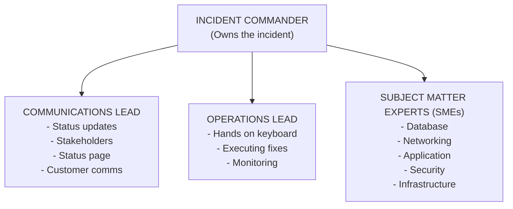
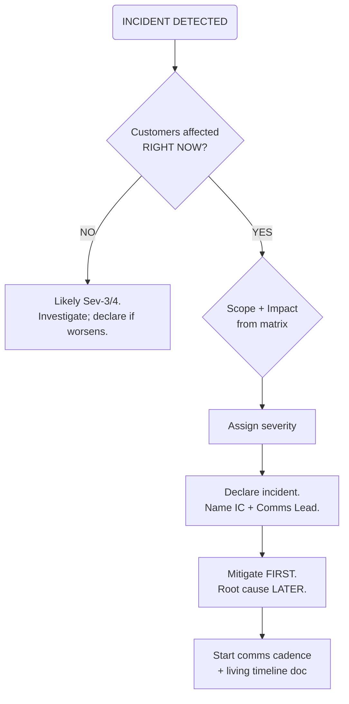
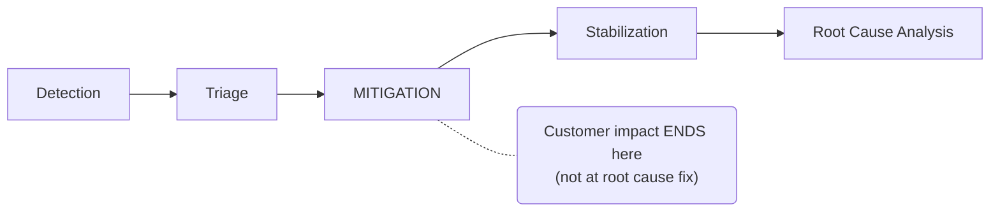

> **Complexity**: `[COMPLEX]`
>
> **Time to Complete**: 2.5 hours
>
> **Prerequisites**: None
>
> **Track**: Foundations

**Hypothetical scenario:** The opening narrative below is a composite teaching example. It combines coordination failures documented in public incident postmortems and in Google's SRE book chapter on managing incidents, but it does not describe one specific company's outage. User counts, error rates, durations, and dollar figures are illustrative round numbers for pedagogy — not claims about any particular vendor or customer.

It is 2:45 AM on a Friday night. A senior SRE wakes to a cascade of pages. The primary database cluster has stopped accepting writes. Read replicas lag behind and climb. Customer-facing APIs return errors at thousands of requests per minute. The on-call Slack channel fills with messages from engineers who were also paged. Three people SSH into production servers running diagnostic queries. Nobody coordinates. Nobody knows what anyone else is doing. A junior engineer, trying to help, restarts the primary database node — which wipes the in-memory query cache and doubles read latency on the replicas. An outage that could have been contained in roughly twenty minutes drags on for hours. Failed transactions pile up. Enterprise clients demand explanations the team cannot yet provide.

This is not a rare story. It is what happens when talented engineers face a crisis without a system for managing it. The technology that failed was not the database alone — it was the absence of incident command. No one declared themselves in charge. No one controlled communications. No one stopped well-meaning engineers from making the situation worse. The technical skills in the room were more than sufficient to solve the problem. What was missing was structure.

---

## What You'll Be Able to Do

After completing this module, you will be able to:

1. **Implement** the Incident Commander role by establishing communication channels, assigning workstreams, and controlling the pace of response
2. **Design** an incident response framework with clear escalation paths, severity definitions, and role assignments before a crisis occurs
3. **Evaluate** incident response effectiveness by identifying coordination failures, communication gaps, and decision bottlenecks in post-incident reviews
4. **Apply** crisis management techniques (stabilize-before-fix, controlled communication, parallel workstreams) to reduce mean time to recovery

---

## Why This Module Matters

When production breaks at 3 AM, your organization does not need more heroes — it needs a choreography everyone already understands. Incident command is that choreography. It separates coordination from hands-on repair, gives stakeholders a predictable communication rhythm, and prevents the most common failure mode in software outages: a room full of capable engineers who make the situation worse because nobody is managing the humans.

The stakes are not abstract. Uptime Institute's 2024 Global Data Center Survey found that more than half of respondents reported their most recent significant outage cost over $100,000, and roughly one in five reported costs exceeding $1 million when direct, opportunity, and reputation costs are included. Those figures vary enormously by industry and service criticality, but the directional lesson holds: minutes of unmanaged coordination burn budgets that hours of post-incident investigation cannot recover. The first fifteen minutes of mitigation matter more than the next fifteen hours of root-cause analysis when customers cannot complete transactions.

This module teaches durable practices that outlast any single on-call tool. The Incident Command System (ICS) model, severity classification, communication cadence, and mitigation-first thinking are frameworks you can implement with Slack and a spreadsheet or with a full incident-management platform — the principles are the same. By the end, you will know how to walk into chaos, establish order, and lead a team through the worst night of their operational lives. You will know when to escalate, how to communicate, and — critically — when to stop trying to fix and start trying to stabilize.

> **The Air Traffic Control Analogy**
>
> Air traffic controllers do not fly the planes. They coordinate dozens of aircraft with incomplete weather data, mechanical uncertainties, and pilots who each see only their own cockpit. The controller's job is to maintain a single picture of the airspace, assign priorities, prevent collisions, and communicate clearly so every pilot knows what to do next. Incident command works the same way in software operations: the Incident Commander does not SSH into production — they maintain the operational picture, assign workstreams, prevent conflicting changes, and keep communication flowing so engineers can fix the system without tripping over each other.

> **Stop and think**: Think about the worst incident you have been involved in. Was the bottleneck a lack of technical knowledge, or a lack of coordination and communication?

---

## The Incident Command System: From Wildfires to Web Services

The Incident Command System (ICS) was not invented by software engineers. California firefighters created it in the 1970s after a series of devastating wildfires where multiple agencies responded, nobody knew who was in charge, and fires burned out of control because coordination failed faster than water could flow. The National Incident Management System (NIMS), maintained by the U.S. Federal Emergency Management Agency (FEMA), formalized ICS as a scalable framework for any emergency where many responders must work together under time pressure.

ICS solved a fundamental coordination problem: how do you get dozens of people from different teams, with different expertise, working together when every minute matters and information is incomplete? The answer was deceptively simple — clear roles, clear communication channels, and a single point of authority at any given moment. Unity of command means every responder knows whom they report to. Span of control means leaders manage a small number of direct reports (typically three to seven) rather than twenty simultaneous conversations. Management by objectives means the team agrees on what "done" looks like for this hour, not for the entire root-cause investigation.

The software industry adopted ICS because production incidents share the same structural properties as wildfire response. Time pressure is real — every minute of customer-visible failure erodes trust and burns error budgets. Multiple responders converge from different specialties — database engineers, application developers, network specialists, security analysts — each seeing a slice of the problem. Information is incomplete at the start; you rarely know root cause when the pager fires. Stakes are high because wrong actions amplify damage — restarting the wrong process, applying an untested fix, or failing over into a degraded secondary can turn a contained incident into a cascading outage. Communication overhead grows nonlinearly with headcount unless someone deliberately structures it.

Google documented its adaptation of ICS in Chapter 14 of the *Site Reliability Engineering* book, describing roles such as Incident Command, Operational Work, Communication, and Planning. PagerDuty published its internal incident response documentation at [response.pagerduty.com](https://response.pagerduty.com/) as a cut-down version of the same discipline. Atlassian's Incident Management Handbook describes an incident manager role with overall authority to page anyone in the organization and keep responders focused on restoring service. These organizations name tools differently, but the durable spine is identical: one coordinator, separated responsibilities, a living incident document, and explicit handoffs.

| ICS Principle | Firefighting Context | Software Incident Context |
|---|---|---|
| **Unity of Command** | Every firefighter reports to one supervisor | Every responder reports to the Incident Commander |
| **Modular Organization** | Expand or contract teams as needed | Pull in SMEs only when their domain is implicated |
| **Management by Objectives** | "Contain the fire to this ridge" | "Restore write capability to the primary database" |
| **Span of Control** | Three to seven direct reports per leader | IC manages three to five leads, not twenty engineers |
| **Common Terminology** | Standard terms across agencies | Severity levels, standard status update templates |
| **Integrated Communications** | Single radio frequency for command | Single Slack channel and single bridge call for coordination |

The key insight from ICS is this: in a crisis, process is not bureaucracy. Process is survival. Without it, you get a room full of smart people all pulling in different directions while executives fill the void with assumptions worse than reality.

---

## Implementing the Incident Commander Role

Implementing the Incident Commander role starts with a cultural decision, not a job title. Someone must be willing to say aloud, "I'm declaring myself Incident Commander for this incident — acknowledge," within minutes of recognizing that an event exceeds normal on-call troubleshooting. That declaration is not a power grab; it is a service to everyone else in the channel. Engineers who were about to SSH into production now know whom to report findings to. The Communications Lead knows who will approve external messaging. The Operations Lead knows whom to ask before executing a failover. Without that explicit claim, seniority and loudness determine coordination — and both are unreliable at 3 AM.

The Incident Commander owns the incident's trajectory but does not own the keyboard. Google's SRE book describes the commander as holding high-level state, structuring the response task force, and assigning responsibilities according to need and priority. PagerDuty's documentation lists parallel duties: set severity, assign roles, make decisions when the team disagrees, maintain the timeline, decide when to escalate or de-escalate, and declare resolution. What is conspicuously absent from every authoritative ICS-derived description is "debug the database" or "write the patch." The moment the IC starts troubleshooting, coordination stops — and that is the number one failure mode in incident management.

Effective IC behavior is verbal and visible. The IC states objectives in plain language: "Our objective for the next thirty minutes is restoring writes. Root cause analysis comes later." The IC assigns workstreams with names and deadlines: "Alex, you're Operations Lead — focus on the database cluster and report back in ten minutes." The IC approves or rejects proposed production changes: "What's the risk of that failover? ... Acceptable. Proceed. Comms Lead, update the status page." The IC escalates when progress stalls: "It's been thirty minutes with no mitigation path — I'm paging the VP of Engineering for business impact assessment and additional authority."

What the IC does not do is equally important. The IC does not SSH into production servers, write code, or disappear into a log grep that takes twenty minutes of silence. The IC does not let three engineers argue about the right fix without making a decision — tie-break authority is the entire point of the role. The IC does not answer every executive question personally; that is why the Communications Lead exists. When the IC is also the most senior engineer and sees an inefficient command on the Operations Lead's terminal, the correct action is to note it for later coaching, not to take the keyboard. Seniority does not override unity of command during an active incident.

Single-IC-at-a-time is non-negotiable. Two incident commanders produce two timelines, two severity assessments, and two approval chains — which is zero commanders from the responder's perspective. When the current IC fatigues or lacks context for the next phase, they perform an explicit handoff: state the current status, open questions, and assigned roles; name the incoming IC; wait for firm acknowledgment ("You're now Incident Commander — acknowledged?"); announce the handoff in the coordination channel. PagerDuty's documentation recommends this handoff happen over phone or video even when the outgoing and incoming ICs are in the same chat, because ambiguity during transfer has caused real incidents to drift leaderless.



> **Pause and predict**: If the Incident Commander is the most senior engineer on the team, and they see a command the Ops Lead is typing is slightly inefficient, should they intervene and take over the keyboard?

---

## Incident Roles: Who Does What

There are four critical roles in a software incident response framework. In a small team, one person may wear multiple hats — the on-call engineer might be IC and Ops Lead for the first ten minutes until backup arrives. In a large organization, each role is a separate person. But every role must be filled explicitly, even if implicitly at first. "We all know what we're doing" is how incidents become folklore about the night nobody was in charge.

The **Communications Lead** is the voice of the incident to everyone who is not hands-on keyboard. They post and update the status page, send internal updates to leadership and stakeholders, draft customer-facing communications, moderate the incident Slack channel (redirecting side conversations to threads), relay stakeholder questions to the IC, and maintain the written timeline of events. Without a Comms Lead, one of two predictable failures occurs. Either the IC gets pulled away from coordination every five minutes to answer "what's happening?" from executives, or nobody communicates and leadership invents a narrative from partial tweets. The Comms Lead is not a junior role — it requires judgment about what is verified enough to publish externally.

The **Operations Lead** runs diagnostics and executes approved mitigations. They propose actions; the IC approves them. This proposal-approval loop prevents well-meaning engineers from making unilateral production changes during a crisis. The Ops Lead reports status at regular intervals even when there is no news — "still investigating replica lag, no new findings" is itself a finding because it tells the IC that the current hypothesis has not yet produced mitigation. When the Ops Lead needs expertise outside their domain, they request SMEs through the IC rather than paging six people independently.

**Subject Matter Experts** are specialists pulled in when the incident touches their domain — the DBA for query planner regressions, the network engineer for BGP flaps, the security engineer for suspected credential leaks, the application developer who owns the failing service. SMEs advise; they do not command. They provide options and risks to the Operations Lead and IC, who make the final decision about what actions to take. Pulling SMEs too early creates noise; pulling them too late burns minutes. The IC uses severity and progress rate to decide when to expand the roster.

The **Scribe** (sometimes folded into Communications Lead in smaller teams) maintains the living incident document — a shared timeline of decisions, actions, and observations with timestamps. Google's SRE book emphasizes this document as the commander's most important artifact besides the people themselves. It can be messy during the incident; it must be functional. Post-incident, it becomes the skeleton of the postmortem. Reconstructing timelines from memory and scattered chat logs weeks later produces blame-shaped narratives, not learning-shaped ones.

```text
  Ops Lead: "I want to failover to the secondary database cluster."
  IC:       "What's the risk?"
  Ops Lead: "We'll lose about 30 seconds of writes during the switchover.
             Some in-flight transactions will need to be retried by clients."
  IC:       "That's acceptable. Proceed. Comms Lead, update the status page:
             'We are performing a database failover. Brief interruption expected.'"
```

---

## Designing an Incident Response Framework

Designing an incident response framework is work you do on a calm Tuesday, not during a Sev-1. The framework answers questions that become expensive when asked for the first time under fire: What severity is this? Who becomes IC? Who owns external comms? When do we open a war-room bridge versus handle quietly in the on-call channel? What escalation path pages the VP? What templates do we use for status page updates? Organizations that skip this design phase discover during their first major outage that "everyone knows the process" means "everyone has a different process in their head."

Severity definitions anchor the framework. Severity is not a vibe — it is a predefined mapping from customer impact and scope to response expectations. PagerDuty's public documentation describes levels from SEV-1 (all-hands, highest customer impact) through lower severities with reduced response intensity. Your exact labels matter less than consistency: a Sev-2 at your company must mean the same thing next quarter as it means today, and on-call runbooks must reference those definitions explicitly. Revenue impact, user percentage affected, data integrity risk, and regulatory exposure are typical inputs — document which inputs matter for your product.

Escalation paths define who gets paged at each severity and after what time without mitigation. A common pattern: Sev-1 pages IC backup and engineering leadership immediately; Sev-2 pages IC backup after thirty minutes without progress; Sev-3 stays with on-call unless business hours demand broader notification. Atlassian's handbook encodes "escalate, escalate, escalate" as a value — waking someone unnecessarily is less costly than playing catch-up on a major incident. Your framework should make escalation the default safe action, not a career-risking admission of defeat.

The decision to **declare** an incident is as important as severity assignment. Google's SRE book recommends declaring early when you need a second team, when customers are affected, or when concentrated analysis for an hour has not solved the problem. Declaration triggers the role structure, the coordination channel, the incident document, and the communication cadence — not because every page requires a war room, but because the cost of activating structure late exceeds the cost of standing down a false alarm. Teams that treat declaration as bureaucratic overhead often discover they needed structure two hours earlier.

War-room versus quiet response is a severity and scope judgment. A Sev-1 affecting core revenue functions with multiple workstreams typically warrants a dedicated bridge call with strict etiquette: one conversation at a time, state your name before speaking, mute when not speaking, no spectators. A Sev-3 affecting an internal tool on a Saturday may be handled in a single Slack thread with the on-call engineer as IC and no bridge. The framework should specify triggers — for example, "open a bridge when more than three roles are active or when executive stakeholders request real-time updates."

---

## Establishing Communication Channels

Communication is where incidents are won or lost. Too little communication and nobody knows what is happening; too much unstructured communication and the signal drowns in noise. The goal is structured, predictable, and focused communication with a single source of truth for each audience. Internal responders coordinate in one channel; external stakeholders read one status page; executives receive summaries on a fixed cadence from the Communications Lead — not from thirty parallel DMs to whoever answered their call.

The war room — physical or virtual — is where synchronous coordination happens. In remote-first organizations, this is almost always a video bridge with explicit etiquette borrowed from PagerDuty's incident call guidelines: one speaker at a time, name before speaking, side conversations in threads, background noise minimized, and only assigned roles on the bridge by default. Spectators who join "just to listen" often ask clarifying questions that reset the team's mental stack; the framework should route observers to the async incident channel instead.

For Sev-1 and Sev-2 incidents, create a dedicated Slack channel immediately with a standardized naming convention such as `#incident-YYYY-MM-DD-short-description`. Pin a status message at the top listing severity, IC, Comms Lead, Ops Lead, bridge link, status page link, and the latest structured update. Channel discipline matters as much as channel creation: the main timeline is for coordinated updates only; debugging chatter lives in threads; "is this related to my service?" questions live in threads; spectator commentary stays out entirely. The Comms Lead moderates and redirects.

The **15-minute update cadence** for Sev-1 (30 minutes for Sev-2) is non-negotiable even when there is no news. Silence during an incident is terrifying for stakeholders and leadership because humans extrapolate worst-case scenarios into informational voids. A structured update communicates that people are actively working the problem:

```text
UPDATE — 03:15 UTC (30 min into incident)
Status: Mitigating
What we know: Primary DB disk I/O saturated at 100%. Cause under investigation.
What we're doing: Failing over to secondary cluster. ETA 5 minutes.
Customer impact: Write operations failing. Read operations degraded (~3s latency).
Next update: 03:30 UTC
```

Even "no change, still investigating" is a valid update because it resets the clock on stakeholder anxiety and documents that the team has not gone silent.

---

## Status Pages and External Communication

Your status page is the single source of truth for customers during an incident. It should reflect a new incident within minutes of declaration — not when you understand root cause, but when you understand customer-visible impact. Status levels typically include operational, degraded performance, partial outage, and major outage; your framework should map severity levels to status page transitions so the Comms Lead does not debate wording under pressure.

External communication templates are pre-written for a reason. During a crisis, cognitive bandwidth for prose is scarce. Templates force you to fill in only what you know: affected service, customer-visible impact, what you are doing, and when the next update arrives. Do not write customer communications from scratch at 3 AM.

Your first external update should post within five minutes of declaration using a template like the one below — fill in only verified facts about affected services and customer-visible impact, and commit to a specific next-update time the Comms Lead can honor.

```text
We are aware of an issue affecting [service/feature]. Our team is actively
investigating. We will provide updates every [15/30] minutes.

Current impact: [brief description of what customers are experiencing]
```

Golden rules of external communication are simple but unforgiving when broken. Never lie: if you do not know the cause, say you are investigating, because fabricating an explanation destroys trust when the truth emerges. Never blame a vendor publicly — your customers chose you, not your cloud provider. Never give an ETA you cannot meet; "we are working on it" beats "fixed in thirty minutes" when you have no basis for that claim. Acknowledge impact in customer terms, not internal architecture terms, and show empathy without over-promising recovery timelines you cannot defend.

Internal coordination and external status are deliberately separated. Engineers on the bridge need blunt technical truth; customers need accurate impact statements without premature root-cause speculation. The Communications Lead translates between these audiences — they do not dump raw logs onto the status page, and they do not sanitize technical reality so much that responders lose time correcting public statements.

---

## Severity Levels and the Decision to Declare

Severity levels translate messy reality into response expectations. Define them before you need them, publish them in on-call runbooks, and rehearse them in tabletop exercises so triage at 3 AM is pattern matching, not philosophy.

| Level | Customer Impact | Typical Response |
|---|---|---|
| **SEV-1** | All or most users cannot use core functionality | All-hands response. IC plus full team. Executive notification. 15-minute update cadence. Bridge call. |
| **SEV-2** | Large subset of users affected or core feature degraded | Dedicated responders. IC assigned. 30-minute update cadence. Business hours plus on-call. |
| **SEV-3** | Small subset of users; non-critical feature broken | On-call investigates. 2-hour update cadence. May defer bridge. |
| **SEV-4** | Internal only or cosmetic issue | Ticket tracked. Fixed in normal sprint. No active incident management. |

| Scenario | Severity | Rationale |
|---|---|---|
| Payment processing down for all customers | **Sev-1** | Core revenue function; all users affected |
| Login failing for users in one region | **Sev-2** | Core feature; subset of users |
| Search results slow (5s vs 500ms normal) | **Sev-2** | Degraded core feature; broad user impact |
| Reporting dashboard shows stale data (2 hours old) | **Sev-3** | Non-core feature; data available but delayed |
| Internal admin panel has broken CSS | **Sev-4** | Internal only; cosmetic |
| Email notifications delayed by ten minutes | **Sev-3** | Non-critical feature; mild user impact |
| Mobile app crashes on launch for all iOS users | **Sev-1** | Core functionality; major user segment |
| Staging environment down | **Sev-4** | No customer impact |

Severity is not set in stone. Re-evaluate as you learn more. Upgrade when impact is broader than initially thought, when mitigation is slower than expected, or when a workaround fails. Downgrade when a workaround reduces customer impact or when the affected population is smaller than estimated. The IC makes severity changes; the Comms Lead communicates them immediately on the status page and internal channels.

> **Pause and predict**: If a non-critical internal tool used by the HR team goes down on a Saturday, what severity level would you assign it? Why?

---

## Decision Framework: Severity Classification Matrix

Use this matrix during the first five minutes of triage to classify severity and trigger the corresponding response pattern. Impact measures customer-visible harm; scope measures how much of your user base or geography is affected. When impact and scope disagree, take the higher classification until evidence lowers it — over-classify early, downgrade with evidence.

|  | **Scope: Small** (<10% users / single internal team) | **Scope: Medium** (10–50% users / multi-team) | **Scope: Large** (>50% users / company-wide) |
|---|---|---|---|
| **Impact: Critical** (core revenue or safety function broken) | Sev-2 | Sev-1 | Sev-1 |
| **Impact: Major** (core feature degraded but partial service remains) | Sev-3 | Sev-2 | Sev-1 |
| **Impact: Minor** (non-core feature; workarounds exist) | Sev-4 | Sev-3 | Sev-2 |
| **Impact: None visible** (internal or cosmetic) | Sev-4 | Sev-4 | Sev-3 |

Once the matrix assigns a severity level, the following response triggers apply automatically — there is no secondary debate about whether a Sev-1 deserves a bridge call. The framework decided that when you classified; now execute the matching row.

| Severity | IC assigned | Comms cadence | Bridge / war room | Executive notify |
|---|---|---|---|---|
| Sev-1 | Within 5 minutes | Every 15 minutes | Yes, immediately | Yes, within 15 minutes |
| Sev-2 | Within 15 minutes | Every 30 minutes | If multi-team | If customer-facing > 30 min |
| Sev-3 | On-call lead | Every 2 hours | Optional | No unless escalated |
| Sev-4 | Ticket owner | On resolution | No | No |



The five-minute triage mindset is deliberate: it is always better to over-classify and downgrade than to under-classify and scramble to catch up. Declaring a Sev-1 that becomes a Sev-3 wastes a few hours of sleep. Treating a Sev-1 as a Sev-3 can cost orders of magnitude more in customer trust and revenue when mitigation arrives late.

---

## Mitigating vs. Resolving: Stop the Bleeding First

Mitigation means reducing or eliminating customer impact even when the underlying problem is not fixed. Resolution means fixing root cause so the problem does not recur. During an active incident, mitigation is the primary objective; resolution is the follow-on program. This distinction is the single most important concept in incident management — and the one engineers get wrong most often because their training rewards root-cause curiosity.



| Problem | Mitigation (do this first) | Resolution (do this later) |
|---|---|---|
| Database overloaded | Failover to replica, add read cache | Optimize slow queries, upgrade hardware |
| Bad deploy causing 500s | Rollback to previous version | Fix the bug, improve test coverage |
| Memory leak in service | Restart the service | Find and fix the leak |
| DNS pointing to wrong IP | Update DNS record | Fix deployment pipeline that set wrong IP |
| Third-party API down | Enable fallback or cached responses | Add circuit breaker, diversify providers |
| Disk full on primary server | Delete old logs, expand volume | Add disk usage alerts, log rotation |

Engineers resist mitigation because problem-solving identity is tied to understanding *why*. During an incident, "why" is a luxury; "how do we stop customer pain" is the obligation. Compare two timelines for the same database write failure:

```text
RESOLUTION-FIRST (anti-pattern):
  03:00 - Alert fires. Engineer reads database logs.
  03:20 - Engineer finds suspicious query pattern.
  03:45 - Engineer deep in execution plans.
  04:30 - Engineer adds missing index. Writes recover.
  Customer impact: ~90 minutes.

MITIGATION-FIRST (correct):
  03:00 - Alert fires. IC declares Sev-1.
  03:05 - Triage: primary DB disk I/O saturated.
  03:10 - Ops Lead: "Failover to secondary in ~2 minutes."
  03:12 - IC: "Approved. Proceed."
  03:14 - Failover complete. Writes recovering.
  03:20 - Customer impact mitigated. Root cause analysis begins.
  Customer impact: ~14 minutes.
```

The same engineers, the same root cause, different question asked first: "How do I make it stop affecting customers?" versus "Why is this happening?"

> **Stop and think**: Can you recall an incident where the team spent hours finding root cause while customers suffered, when a simple rollback could have restored service immediately?

---

## Timeline: Well-Managed vs. Poorly Managed Incident

The difference between these two timelines is not technical skill — it is incident command. Study both tables as paired case studies: the technical failure is identical in spirit (database write path impaired), but the well-managed column shows declaration, role assignment, mitigation approval, and comms cadence compressing customer impact to roughly twenty minutes, while the poorly managed column shows freelance debugging, silent status pages, and approval paralysis stretching impact past two hours.

### A Well-Managed Sev-1

| Time | Event | Who |
|---|---|---|
| 02:46 | Alerts fire: DB write errors > 1000/min | Monitoring |
| 02:48 | On-call engineer acks the page | Sarah |
| 02:50 | Sarah checks dashboards: primary DB disk I/O at 100%, replica lag climbing | Sarah |
| 02:52 | Sarah declares Sev-1, creates `#incident-2026-03-24-db-outage`, pages Ops Lead (Alex) and Comms Lead (Jordan) | Sarah (IC) |
| 02:55 | Jordan posts initial status page update | Jordan |
| 02:56 | Alex joins bridge call, begins diagnostics | Alex |
| 03:00 | Jordan sends first Slack update to leadership | Jordan |
| 03:05 | Alex reports: "Primary disk controller degraded. Recommend failover to secondary." | Alex |
| 03:06 | Sarah approves failover | Sarah |
| 03:08 | Failover initiated | Alex |
| 03:10 | Jordan updates status page: failover in progress | Jordan |
| 03:12 | Writes recovering on secondary cluster | Alex |
| 03:15 | Error rates at baseline. Sarah requests 15-minute monitoring period. | Sarah |
| 03:17 | Jordan updates status page: "Mitigated. Monitoring." | Jordan |
| 03:30 | 15 minutes clean. Sarah declares incident resolved. | Sarah |
| 03:32 | Jordan posts resolution notice on status page | Jordan |
| 03:35 | Sarah schedules postmortem. Total customer impact: ~20 minutes | Sarah |

### A Poorly Managed Sev-1

| Time | Event | Who |
|---|---|---|
| 02:46 | Alerts fire: DB write errors > 1000/min | Monitoring |
| 02:48 | On-call engineer acks the page | Mike |
| 02:50 | Mike SSHs into primary DB. Starts reading logs. | Mike |
| 03:00 | Two more engineers paged. They also SSH into production. | Dev1, Dev2 |
| 03:05 | Dev1 restarts a suspicious background job. No improvement. | Dev1 |
| 03:10 | Nobody has updated the status page. Support tickets pile up. | (nobody) |
| 03:15 | VP sees social media posts about outage. Asks in #general. | VP Eng |
| 03:20 | Mike, Dev1, Dev2 investigate different theories. No coordination. | Mike, Dev1, Dev2 |
| 03:30 | VP joins bridge, asks questions every 2 minutes. Focus lost. | VP Eng |
| 03:45 | Dev2 restarts primary DB node. Query cache wiped. | Dev2 |
| 03:46 | Read latency doubles. More alerts fire. | Monitoring |
| 04:00 | Senior DBA paged. Assesses in 5 minutes: disk controller failing. | DBA |
| 04:10 | Ten minutes debating who approves failover. | (nobody) |
| 04:20 | Failover initiated | DBA |
| 04:25 | Writes recovering | DBA |
| 05:00 | Error rates at baseline. Total customer impact: ~2+ hours | |

---

## Evaluating Incident Response Effectiveness

Evaluating incident response effectiveness happens primarily in the post-incident review, but the IC seeds evaluation during the incident by preserving evidence. Ask whether coordination failures, communication gaps, or decision bottlenecks prolonged customer impact — not whether someone "should have known" the answer sooner. Blameless evaluation focuses on system design: Did we declare early enough? Was the IC off the keyboard? Did comms cadence hold? Did mitigation precede investigation? Did unauthorized production changes occur?

Coordination failures show up as duplicated work (two engineers running the same diagnostic), contradictory work (one engineer failing over while another restarts the primary), or absent ownership (everyone assumed someone else was IC). Communication gaps show up as silent status pages while executives learn from Twitter, or as engineers receiving stakeholder pressure directly instead of through the Comms Lead. Decision bottlenecks show up as mitigation proposals waiting ten minutes for approval because nobody knew who could authorize a failover.

Use a simple effectiveness checklist in every postmortem regardless of technical root cause:

| Evaluation Question | Good Signal | Warning Signal |
|---|---|---|
| Time to IC declaration | < 5 minutes on Sev-1 | Nobody named IC for > 15 minutes |
| Time to first status page update | < 5 minutes after declaration | Customers learn before status page |
| Mitigation vs. investigation order | Mitigation attempted before root cause closed | Root cause chase during customer impact |
| Unauthorized changes | Zero | "Helpful" production changes without IC approval |
| Comms cadence adherence | Updates on schedule even if "no news" | Multi-hour silence |
| Handoff clarity | Explicit IC transfer documented | Ambiguous who was in charge at shift change |

Google's postmortem culture chapter and Etsy's writing on blameless postmortems both emphasize that the incident response process itself is a system to improve — not a performance review of individuals. When you evaluate effectiveness, you are debugging coordination architecture the same way you debug service architecture.

---

## Applying Crisis Management Techniques

Applying crisis management techniques means operationalizing stabilize-before-fix, controlled communication, and parallel workstreams so they happen under stress without improvisation. These techniques are not inspirational posters — they are explicit behaviors rehearsed in tabletop exercises until they are muscle memory.

**Stabilize-before-fix** is the discipline of choosing the fastest path to reduced customer impact even when it leaves technical debt on the table. Roll back the deploy, fail over to the replica, disable the feature flag, enable cached responses, shed load — then investigate. The IC enforces this by repeatedly asking, "What stops the bleeding in the next five minutes?" not "What is the root cause?"

**Controlled communication** means one voice externally (Comms Lead), one coordination channel internally (incident Slack plus optional bridge), and a living document as the single source of truth for timeline reconstruction. Parallel DMs, side channels, and executive drive-by questions are redirected into the structure — politely but firmly. The IC protects Operations Lead focus the same way a surgeon's scrubs team protects the sterile field.

**Parallel workstreams** activate after mitigation stabilizes customer impact. Stream one continues monitoring and guards against regression. Stream two investigates root cause. Stream three handles customer success outreach for affected accounts. The IC assigns stream owners and collects status on a schedule — not by letting everyone self-organize three investigations into the same database.

Crisis management also includes knowing when to close the incident. Declaring "resolved" requires a stabilization period — typically fifteen to thirty minutes of clean metrics — not merely the moment the fix deploys. Bouncing incidents (resolve → recur → redeclare) damage trust more than staying in "monitoring" status for an extra thirty minutes. The Comms Lead transitions the status page to monitoring, then to resolved, then schedules the postmortem while memories are fresh.

---

## Patterns & Anti-Patterns

### Patterns (what good looks like)

| Pattern | Why It Works | When to Use |
|---|---|---|
| **Early declaration** | Activates roles and comms before chaos compounds | Any customer-visible or multi-team issue |
| **IC off keyboard** | Preserves coordination bandwidth | All Sev-1 and Sev-2 incidents |
| **Mitigation-first sequencing** | Minimizes customer impact duration | Active customer-visible outage |
| **Fixed comms cadence** | Prevents stakeholder panic filling silence | Sev-1 and Sev-2 with external impact |
| **Living incident document** | Enables accurate postmortem and handoffs | Any incident beyond quick on-call fix |
| **Explicit IC handoff** | Prevents leaderless gaps across time zones | Incidents spanning shifts or > 2 hours |

### Anti-Patterns (what to avoid)

| Anti-Pattern | Why It Fails | Better Approach |
|---|---|---|
| **Hero debugging** | Senior engineer becomes IC-by-accident while SSH'd | Name IC explicitly; separate ops lead |
| **Root cause during impact** | Customers suffer while engineers satisfy curiosity | Mitigate, then investigate |
| **Status page silence** | Public narrative filled by speculation | Update within 5 minutes; cadence after |
| **Open bridge / open channel** | Noise scales faster than fixes | Role-based participation; thread debugging |
| **Freelance production changes** | Unilateral "fixes" amplify damage | IC approval for all prod changes |
| **Severity understatement** | Response resources arrive too late | Over-classify; downgrade with evidence |

---

## Hypothetical scenario: The Expired Certificate Login Outage

**Hypothetical scenario:** A SaaS company serving enterprise clients experiences a login failure on a Monday morning peak-traffic hour. The authentication service rejects all login attempts with an internal server error. The on-call engineer diagnoses within minutes: an expired TLS certificate on the internal service mesh. Auto-renewal failed days earlier, and the certificate-expiry alert was snoozed during unrelated maintenance and never re-enabled.

Here is where incident command discipline fails in this composite example. The engineer knows the fix — manually renew the certificate and restart affected services, a short operational procedure. Instead of mitigating, they investigate why auto-renewal failed, reasoning that a renewed certificate might fail again for the same reason. While they investigate, a large population of users cannot log in. No Incident Commander was declared. Nobody tracks that work shifted from mitigation to root-cause analysis. The status page stays green. Customer success managers field angry calls with no approved talking points.

The certificate is eventually renewed roughly forty-five minutes after initial failure. During that window, enterprise clients with contractual uptime guarantees experience a complete authentication outage at peak business hours. The postmortem identifies three systemic gaps: missing certificate-expiry alerting, inadequate auto-renewal monitoring, and — most critically for this module — **absence of incident command that would have separated mitigation from investigation**. A two-minute certificate renewal should not wait behind a forty-minute process failure.

The lesson is not "certificates are scary." The lesson is that without IC structure, skilled engineers routinely choose investigation over mitigation because nothing in the moment forces the question, "What stops customer pain fastest?"

---

> **Landscape snapshot — as of 2026-06.** Tool names, integrations, and pricing change fast; verify against vendor documentation before relying on specifics. The durable capabilities below are what matter for incident command design — tools are illustrative peers, not rankings.

| Durable capability | PagerDuty | Atlassian (Jira SM / Opsgenie) | incident.io | FireHydrant | Statuspage |
|---|---|---|---|---|---|
| On-call scheduling & escalation | Core product | Opsgenie heritage in Jira SM | Supported | Supported | N/A (comms-focused) |
| Incident Commander role workflow | Documented in response.pagerduty.com | Incident manager in handbook | Role-based workflows | Runbooks + roles | N/A |
| Living incident timeline / scribe | Event timeline features | Jira issue + Confluence | Collaborative timeline | Timeline capture | N/A |
| Status page / external comms | Integrations | Statuspage integration | Status comms features | Status integrations | Core product |
| Postmortem / retrospective tracking | Postmortem docs | Jira follow-up issues | Retrospective workflows | Post-incident tasks | N/A |

---

## Did You Know?

1. **Google's incident management system is built on ICS.** Chapter 14 of the Google *Site Reliability Engineering* book states that Google's incident management system is based on the Incident Command System, with roles including Incident Command, Operational Work, Communication, and Planning. SREs train in these principles before managing production incidents.

2. **Significant outages are expensive — and costs cluster at the high end.** Uptime Institute's 2024 Global Data Center Survey found that 54% of respondents reported their most recent significant outage cost more than $100,000, and 20% reported costs exceeding $1 million including direct, opportunity, and reputation costs. The exact dollar figure matters less than the asymmetry: minutes of delay at declaration multiply downstream harm.

3. **Dedicated incident command reduces coordination overhead.** PagerDuty's public incident response documentation separates the Incident Commander from hands-on operators precisely because coordination chaos consumes recovery time. Organizations that rehearse IC role assignment consistently report faster time-to-mitigate than ad hoc responses — not because the IC is the best debugger, but because they prevent duplicate and contradictory work.

4. **Blameless culture speeds incident response.** Google's postmortem culture chapter and DORA research both connect psychological safety to faster detection and recovery: when engineers are not afraid of punishment, they escalate earlier, communicate more honestly during incidents, and spend cognitive budget on mitigation instead of self-protection.

---

## Common Mistakes

| Mistake | What Happens | What To Do Instead |
|---|---|---|
| **No Incident Commander declared** | Multiple people issue conflicting instructions. Nobody tracks the overall picture. Actions are duplicated or contradictory. | First senior responder declares themselves IC within 2 minutes of incident detection. Transfer IC role later if needed. |
| **IC starts debugging** | Coordination stops. Nobody is managing communication, tracking actions, or making decisions. The incident is now unmanaged. | IC stays off the keyboard. If you're the only person available, do triage first, then get someone else to take IC before you start debugging. |
| **Skipping mitigation for root cause** | Customers suffer while engineers investigate. A 10-minute outage becomes a 90-minute outage because the team is chasing "why" instead of "how to stop it." | Always ask: "Can we reduce customer impact right now?" Rollback, failover, feature flag, circuit breaker — anything to stop the bleeding. Root cause analysis happens after. |
| **Too many people in the war room** | Noise overwhelms signal. Every engineer who joins asks "what's happening?" and the team has to re-explain. Spectators offer untested theories. | Strict role-based access. Only IC, Comms Lead, Ops Lead, and requested SMEs on the bridge. Everyone else follows the Slack channel updates. |
| **No regular status updates** | Leadership panics and starts making phone calls. Customer support has nothing to tell customers. Social media fills the void with speculation. Executives show up in the war room asking questions. | Comms Lead posts structured updates every 15 minutes for Sev-1, every 30 minutes for Sev-2, whether or not there is news. |
| **Freelance production changes** | An engineer, trying to help, makes an unauthorized change that makes the situation worse. Classic example: restarting a database node and wiping the cache during a performance incident. | All production changes during an incident go through the IC. "I want to try X" is a request, not an action. The IC approves or rejects. |
| **Not documenting actions during the incident** | The postmortem timeline is reconstructed from memory, Slack messages, and partial logs. Key decisions and their rationale are lost. | Comms Lead or a designated scribe logs every significant action and decision in the incident channel with timestamps. |
| **Declaring "resolved" too early** | The fix is deployed but not verified. The incident recurs 20 minutes later and the team has to reconvene. Customer trust takes a double hit. | Require a minimum stabilization period (15-30 minutes of clean metrics) before declaring resolved. Monitor closely for the next 2-4 hours. |

---

## Quiz

Work through each scenario-based question below before opening the answer — the goal is to rehearse IC decisions under time pressure, not to memorize definitions.

### Question 1
Your monitoring alerts fire at 3 AM showing a 40% error rate on your API gateway. You are the only engineer paged. What is the correct first action?

<details>
<summary>Answer</summary>

**Triage the severity within five minutes and implement incident command if warranted.** Check dashboards to determine whether customers are affected, what percentage of traffic is failing, and whether a core function is impacted. Based on this, declare the severity level. If it is Sev-1 or Sev-2, page additional responders, name yourself Incident Commander, and assign Communications and Operations leads before deep debugging. A 40% error rate on the API gateway is likely Sev-1 or high Sev-2 — nearly half your traffic is failing — which means you need coordinated response structure, not solo hero debugging.
</details>

### Question 2
You are the Incident Commander during a Sev-1. Your best database engineer says: "I know exactly what the problem is. Give me 20 minutes and I'll have the root cause fixed." Meanwhile, a simpler mitigation (failover to a replica) could restore service in 3 minutes but would lose about 10 seconds of recent writes. What do you do?

<details>
<summary>Answer</summary>

**Order the failover — apply crisis management stabilize-before-fix.** Mitigation always comes before resolution during customer-visible outages because stopping impact is the primary objective. A three-minute path to restoring service with minor write loss is almost always preferable to a twenty-minute root-cause fix that may take longer under pressure. After failover restores service, the database engineer can investigate and fix root cause without time pressure. As IC, you are implementing the decision framework: customer impact reduction trumps technical elegance until impact ends.
</details>

### Question 3
During a Sev-2 incident, a VP joins the bridge call and starts asking detailed technical questions every few minutes. This is disrupting the Operations Lead's focus. What should happen?

<details>
<summary>Answer</summary>

**The IC should redirect the VP to the Communications Lead.** The IC says: "I understand you need updates — Jordan is our Communications Lead and will provide updates every thirty minutes. I need this bridge focused on technical response." If the VP insists on staying, the IC asks them to mute and listen without interrupting. Unity of command means the IC manages the war room regardless of organizational hierarchy. This protects Operations Lead focus so mitigation work continues while stakeholders still receive controlled communication through the proper channel.
</details>

### Question 4
An engineer notices elevated error rates on a service they own but believes it is transient and decides not to declare an incident. Two hours later, errors have increased and customers are complaining. What went wrong?

<details>
<summary>Answer</summary>

**The engineer failed the over-classify principle built into the severity decision framework.** Declaring an incident early and downgrading is cheaper than missing one. By waiting, two hours of customer impact accumulated that structured response might have contained. The correct action was to declare at least Sev-3 when errors first appeared, monitor with explicit checkpoints, and upgrade severity if trends worsened. Designing an incident response framework means making early declaration the safe default, not a last resort.
</details>

### Question 5
Your team has resolved a Sev-1 incident. Error rates are back to zero and the fix has been deployed. It is 4:30 AM. Should you declare the incident resolved and go back to sleep?

<details>
<summary>Answer</summary>

**Not yet — apply the stabilization technique before closure.** Monitor clean metrics for at least fifteen to thirty minutes before declaring resolved. Many incidents bounce when fixes fail under load or when edge conditions recur. Update the status page to "monitoring," send a near-final stakeholder update, ensure someone watches dashboards for two to four hours, then declare resolved and schedule the postmortem. Evaluating incident response effectiveness includes knowing that premature resolution damages trust more than an extra thirty minutes of caution.
</details>

### Question 6
You are the IC for a Sev-1. Thirty minutes in, the Operations Lead reports they are stuck after three unsuccessful attempts. What do you do?

<details>
<summary>Answer</summary>

**Escalate and expand parallel workstreams.** Page subject matter experts immediately — fresh eyes often spot missed assumptions. Ask whether any mitigation (rollback, failover, feature disable) remains available without full root-cause understanding. Reassess severity in case impact is broader than initially estimated. Notify senior leadership if customer impact continues on a Sev-1 beyond thirty minutes without mitigation. The IC implements coordination, not debugging: your job is to unblock the response structure, not to personally find the bug.
</details>

### Question 7
Your organization is designing an incident response framework before any major outage occurs. Which elements belong in the written framework document?

<details>
<summary>Answer</summary>

**Severity definitions, escalation paths, role assignments, communication cadence templates, and declaration criteria.** Designing the framework in advance means on-call engineers can pattern-match during triage instead of inventing process under stress. Include who becomes IC at each severity, when to open a bridge, how often the Comms Lead updates stakeholders, and pre-written status page templates. Rehearse the framework in tabletop exercises quarterly so roles feel familiar at 3 AM. The framework should reference durable ICS principles — unity of command, span of control, management by objectives — not specific tool click paths.
</details>

### Question 8
During a post-incident review, you find the status page was silent for forty minutes while executives learned about the outage from social media. How do you evaluate and improve this?

<details>
<summary>Answer</summary>

**Identify a communication gap failure — not an individual blame target.** Evaluating incident response effectiveness means asking why the Communications Lead role was not filled or why cadence was not triggered at declaration. Corrective actions might include: mandatory status page update within five minutes of Sev-1 declaration, automatic Comms Lead paging in escalation policy, and tabletop practice for external communication. The fix is systemic: make silence harder than posting "we are investigating with updates every fifteen minutes."
</details>

---

## Hands-On Exercise: Tabletop Exercise — Managing a Sev-1 Database Outage

A tabletop exercise is a simulation where you walk through an incident scenario, making decisions at each stage. You do not need a real system — you need a quiet room, this scenario, and ideally two to four other people to play roles. If practicing solo, play the IC and write what you would say and do at each decision point.

### The Scenario

You are the Incident Commander on Tuesday at 10:15 AM. Your largest customer — a significant share of annual revenue — is in the middle of their quarterly financial close, the most critical period of their fiscal cycle. At 10:15 AM, PagerDuty fires three alerts in quick succession: PostgreSQL primary replication lag exceeding sixty seconds, API error rate above five percent on the `/api/v2/transactions` endpoint, and connection pool utilization above ninety percent on three application servers. Your available team includes yourself as IC, Morgan (senior backend engineer), Priya (PostgreSQL DBA, currently in a meeting), Taylor (SRE with strong monitoring skills), and Casey (customer success manager for the affected enterprise account). Available resources include Grafana dashboards, two healthy PostgreSQL read replicas, a feature flag system, and a deploy log showing a release thirty minutes earlier at 9:45 AM.

### Decision Point 1 (10:15 AM): Initial Response

Based on the alerts: What severity do you declare and why? Who do you page and what roles do you assign? What is the first message you post in the incident channel?

<details>
<summary>Recommended Actions</summary>

**Severity: Sev-1.** The transaction endpoint is a core revenue function. Error rates above 5% during a customer's financial close is a direct revenue and relationship threat. Replication lag, API errors, and connection pool exhaustion suggest a systemic issue.

**Pages and roles:** Pull Priya as Operations Lead immediately. Morgan as application SME. Taylor as Comms Lead until a dedicated comms resource arrives. Casey on standby for customer outreach — not in the war room.

**Incident channel message:** Declare Sev-1, name IC, Ops Lead, Comms Lead, bridge link, impact statement, and next update time.
</details>

### Decision Point 2 (10:22 AM): First Findings

Taylor reports the 9:45 AM deploy introduced a migration running `CREATE INDEX` without `CONCURRENTLY`, holding an `ACCESS EXCLUSIVE` lock on the transactions table for thirty-seven minutes. What is your mitigation strategy? What do you tell Casey to communicate?

<details>
<summary>Recommended Actions</summary>

**Mitigation: Cancel the index creation immediately.** Cancelling releases the lock and restores writes. The index can be recreated later with `CREATE INDEX CONCURRENTLY`. Ask Priya to confirm cancellation is safe, then approve: "Cancel it. Now." Customer communication via Casey: brief disruption, data safe, resolution expected within ten minutes — do not blame "a bad deploy" externally.
</details>

### Decision Point 3 (10:26 AM): Thundering Herd

After lock release, roughly four thousand queued transactions hit the database simultaneously. Connection pool at 98%. What action do you take?

<details>
<summary>Recommended Actions</summary>

**Manage the thundering herd actively.** Ask Priya whether the database can absorb the burst or needs throttling. Morgan may enable rate limiting via feature flag or config. Monitor ten minutes — if pools hit 100%, temporarily shed new requests to drain backlog. This is a known post-mitigation pattern; do not assume self-resolution.
</details>

### Decision Point 4 (10:40 AM): Stabilizing

Error rates at 0%. Replication lag normal. Connection pools at 45%. Is the incident over?

<details>
<summary>Recommended Actions</summary>

**Not yet — begin stabilization monitoring.** Require fifteen minutes of clean metrics before declaring resolved. Log postmortem follow-ups: enforce `CREATE INDEX CONCURRENTLY`, pre-deploy lock checks, long-running lock alerts, thundering herd runbook.
</details>

### Exercise Debrief

After completing all four decision points, debrief against the questions above: Did you prioritize mitigation over investigation? Did you manage the thundering herd? Did you communicate throughout? Did you resist declaring resolved too early? Disagreements in group exercises are especially valuable because they reveal gaps in your written incident playbook before a real Sev-1 exposes them.

**Success Criteria** — after your tabletop run, confirm you can check each box below. These items translate the module's learning outcomes into observable behaviors you should demonstrate during the exercise.

- [ ] Declared Sev-1 with named IC, Ops Lead, and Comms Lead within five minutes of first alert
- [ ] Chose mitigation (cancel index) before root-cause process fixes
- [ ] Maintained 15-minute customer communication cadence through Casey or Comms Lead
- [ ] Managed post-mitigation thundering herd with explicit actions
- [ ] Waited for 15-minute stabilization before declaring resolved

**Verification:** Review your written decisions against the recommended actions in each decision point. If practicing with a group, compare disagreements — they reveal gaps in your team's incident playbook.

---

## Sources

- [Managing Incidents — Google SRE Book, Chapter 14](https://sre.google/sre-book/managing-incidents/) — Primary reference for Google's ICS-derived incident roles, living incident documents, and declaration guidance.
- [Emergency Response — Google SRE Book, Chapter 13](https://sre.google/sre-book/emergency-response/) — Prerequisites on effective troubleshooting before incident command activates.
- [Postmortem Culture — Google SRE Book, Chapter 15](https://sre.google/sre-book/postmortem-culture/) — Blameless learning and evaluating response effectiveness after incidents.
- [PagerDuty Incident Response Documentation](https://response.pagerduty.com/) — Public cut-down of PagerDuty's internal ICS-based process including roles, severity, and training.
- [PagerDuty — Severity Levels](https://response.pagerduty.com/before/severity_levels/) — Example severity classification and response expectations.
- [PagerDuty — Different Roles for Incidents](https://response.pagerduty.com/before/different_roles/) — Incident Commander, Scribe, and liaison role definitions.
- [Atlassian Incident Management Handbook](https://www.atlassian.com/incident-management/handbook) — Incident manager role, values (escalate, blameless, restore quickly), and tooling-agnostic process patterns.
- [FEMA IS-100.c — Introduction to the Incident Command System](https://training.fema.gov/is/courseoverview.aspx?code=IS-100.c) — Original ICS/NIMS framework adapted by software incident response practices.
- [Blameless PostMortems and a Just Culture — Etsy Code as Craft (John Allspaw)](https://web.archive.org/web/2023/https://codeascraft.com/2012/05/22/blameless-postmortems/) — Foundational writing on learning from failure without blame.
- [Debriefing Facilitation Guide — Etsy (Allspaw et al.)](https://extfiles.etsy.com/DebriefingFacilitationGuide.pdf) — Facilitation techniques for incident debriefs and postmortems.
- [Google re:Work — Develop Your Team](https://rework.withgoogle.com/guides/managers-develop-team/how-to-coach/en/) — Coaching and team development practices relevant to growing IC capability.
- [On-Call at Any Size — Increment Magazine](https://increment.com/on-call/on-call-at-any-size/) — Organizational patterns for sustainable on-call and incident response at different scales.
- [Uptime Institute — 2024 Global Data Center Survey (outage costs)](https://datacenter.uptimeinstitute.com/rs/711-RIA-145/images/2024.GlobalDataCenterSurvey.Report.pdf) — Survey data on significant outage cost distribution (54% > $100k; 20% > $1M).

---

## Next Module

[Module 1.2: Blameless Postmortems](../module-1.2-postmortems/) — Learn how to turn incidents into organizational learning without blame, fear, or finger-pointing. The postmortem is where incidents stop being crises and start being investments in reliability.
