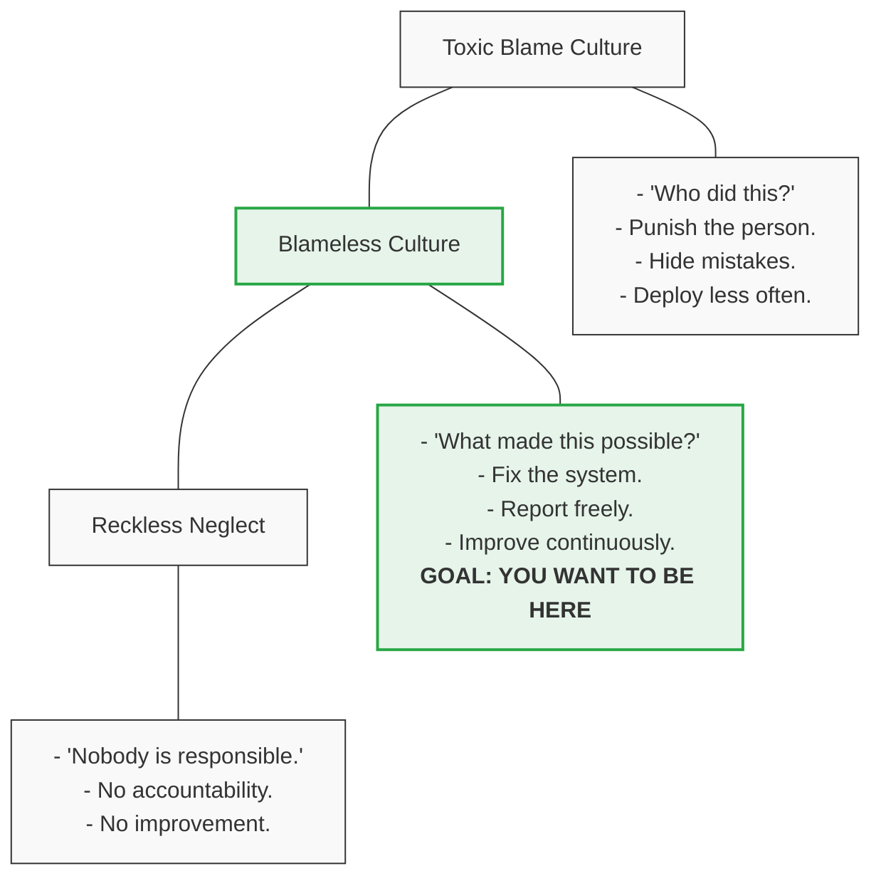
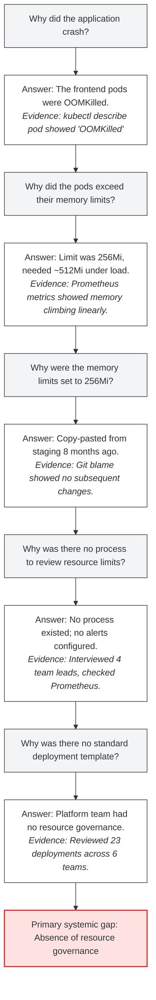
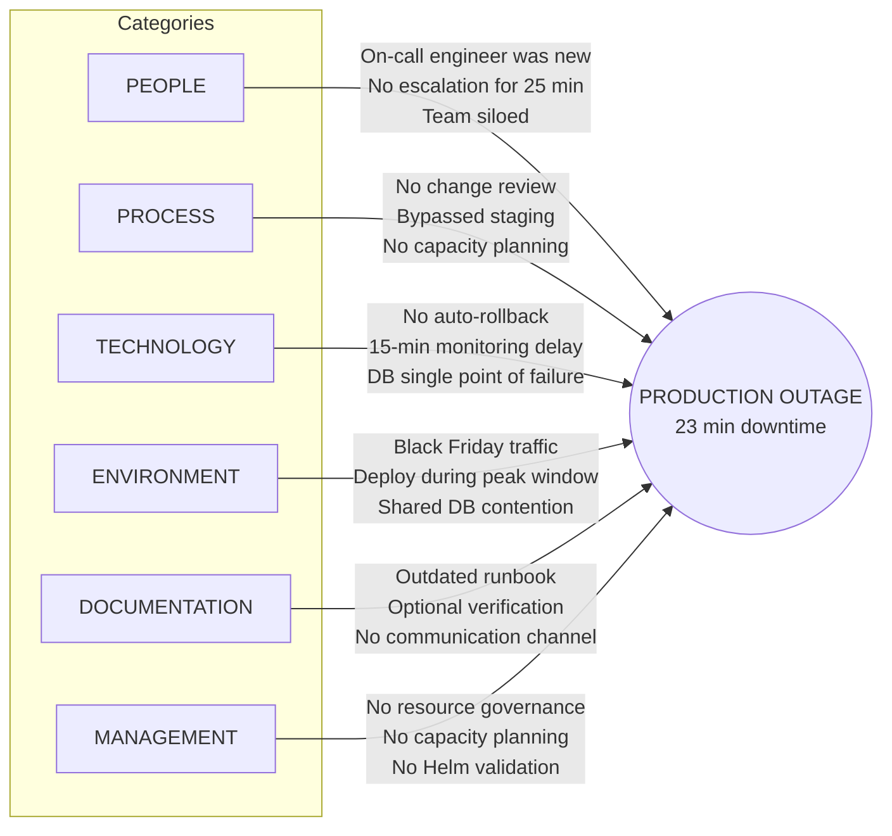
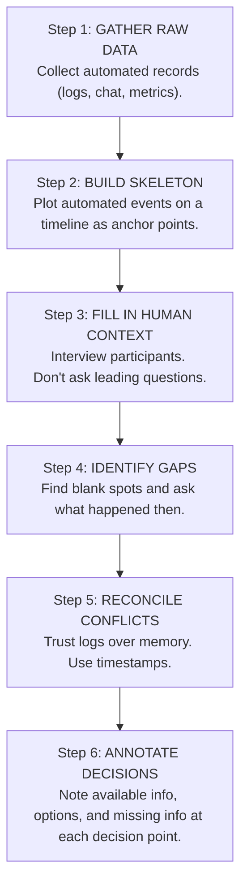
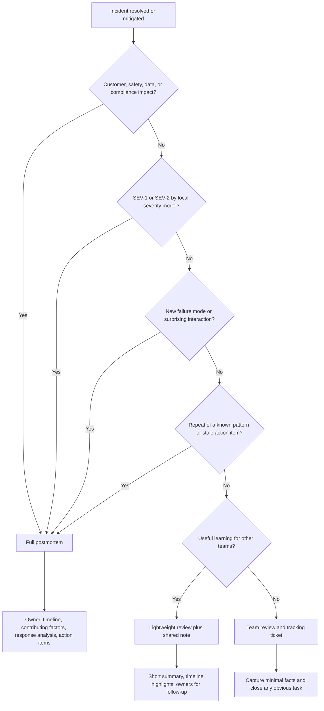
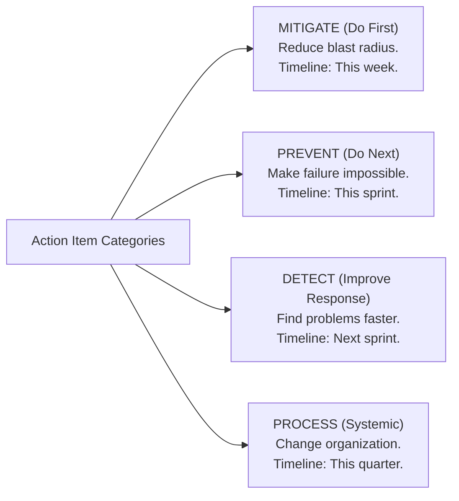

> **Complexity**: `[MEDIUM]` | **Time**: 2 hours | **Prerequisites**: [Module 1.1: Incident Command](../module-1.1-incident-command/)

## What You'll Be Able to Do

After completing this module, you will be able to connect post-incident learning with concrete reliability improvements in your own engineering organization:

- **Explain** why blameless postmortems treat human error as a starting point and counter hindsight bias with local rationality.
- **Reconstruct** incident timelines that separate observed facts, decision context, detection, mitigation, and recovery.
- **Analyze** contributing factors with 5 Whys, fishbone diagrams, and Just Culture categories without collapsing to a single root cause.
- **Write** postmortem documents with impact, summary, lessons, and action items that have owners, due dates, and verification.
- **Decide** when incidents need a full postmortem, lightweight review, or team retro, and how to keep action items from rotting.

---

## Why This Module Matters

**Hypothetical scenario: two companies, same failure, different learning system.** Imagine these organizations as mirrors for the habits your own team may already be practicing.

Company A has a bad Tuesday. A senior engineer deploys a config change that interrupts payment processing for a little over half an hour. In the review meeting the next day, the first executive question is, "Who pushed the bad config?" The room goes cold. The engineer who made the change becomes defensive. Other responders start editing their memories in real time, because every sentence now feels like testimony instead of evidence.

The visible damage is the outage. The deeper damage is the learning collapse that follows. Engineers deploy less often, add manual approvals that nobody trusts, and write incident reports as self-defense. People stop volunteering for on-call because the pager now carries social risk as well as technical risk. The organization still has incidents, but it has lost the honest raw material needed to understand them.

Company B has the same class of config failure. Their postmortem opens differently: "We had a payment-processing outage yesterday. Let's understand what happened, what information people had at each decision point, and what made the failure possible." That sentence changes the room. Responders can describe their actions precisely because the purpose is system improvement, not public accusation.

The team discovers that the config change was the trigger, not the whole explanation. The contributing factors include no validation layer for config changes, no canary rollout for risky configuration, no automated rollback when error rates spike, and a deployment path that allows production changes to bypass staging. The engineer did what the system made easy and normal. The system is what needs to change.

Within the next planning cycle, Company B turns the postmortem into concrete work: config validation in CI, a canary path for high-risk configuration, rollback criteria tied to service-level indicators, and a short learning note for teams that own similar deployment pipelines. Two other teams recognize the same pattern in their own systems and close it before it becomes their incident.

**The difference was not talent, and it was not tools; it was the philosophy that shaped what people felt safe to say after failure.**

Company A asked "who." Company B asked "why." Company A got silence and fear. Company B got systemic improvement and a more resilient organization.

This module teaches you how to build Company B's learning system. The postmortem is not a document-writing ritual; it is the bridge between incident response and organizational change. If that bridge is blameless, factual, and followed through, every incident buys real learning. If it is blameful, vague, or ignored after publication, every incident becomes an expensive rehearsal for the next one.

> **Stop and think**: How would your current team react to a serious customer-impacting outage? Would the immediate focus be identifying the person who pushed the button, or analyzing the system that allowed the button to be pushed?

---

## Module Map

We will start with the philosophy of blameless learning, because facilitation technique does not matter if people believe honesty will be punished. From there, we will move into the structure of a postmortem: impact, timeline, contributing factors, response analysis, action items, and lessons. The middle of the module teaches analysis tools such as 5 Whys and fishbone diagrams, but it also explains their traps, especially hindsight bias and the single-root-cause fallacy.

The second half turns the analysis into operational practice. You will learn how to decide which incidents deserve a full postmortem, how to write action items that survive prioritization pressure, how to distribute learning across teams, and how to detect whether your postmortem culture is actually improving reliability. The examples use Kubernetes-flavored incidents because this curriculum lives in platform engineering, but the durable practice applies to any socio-technical system.

---

## Part 1: The Philosophy of Blameless Culture

### Human Error Is a Symptom, Not a Root Cause

This is the single most important idea in this entire module: **human error is a symptom of a system that made the error possible, likely, or inevitable.**

When an engineer mistypes a production command, the question is not "why did a person make a mistake?" People make mistakes under time pressure, interrupted attention, incomplete documentation, fatigue, and ambiguous signals. That observation is too general to improve anything. The better question is: *why did the system allow a mistyped command to reach production, and why was that command the reasonable next action from the operator's point of view?*

John Allspaw popularized the idea that every simple "human error" story has a second story underneath it: the deeper story of the environment in which the decision made sense. A postmortem that stops at "Sarah deleted the database" writes only the first story. A postmortem that asks what Sarah saw, what tools were available, what safeguards were absent, what pressures existed, and what previous successes had taught the team begins to uncover the second story. That second story is where durable fixes live.

Consider this progression, and pay attention to how quickly the blame-focused path runs out of useful engineering work:

```mermaid
graph TD
    subgraph "Blame-Focused Thinking"
        B1["Sarah deleted the production database."] --> B2["Root Cause: Sarah made an error."]
        B2 --> B3["Action Item: Tell Sarah to be more careful."]
        B3 --> B4["Next incident: Someone else deletes something."]
        B4 --> B5["Repeat forever."]
    end

    subgraph "Systems-Focused Thinking"
        S1["The production database was deleted via a manual command."] --> S2["Why was a manual command possible?"]
        S2 --> S3["Why was there no confirmation step?"]
        S3 --> S4["Why was there no RBAC preventing delete?"]
        S4 --> S5["Why was production accessible from a dev terminal?"]
        S5 --> S6["Root Cause: Insufficient access controls and missing safety mechanisms."]
        S6 --> S7["Action Items: RBAC policies, confirmation gates, separate prod access, automated backups."]
        S7 --> S8["That class of failure can never happen again."]
    end
```



The systems-focused approach doesn't just prevent *this* incident from recurring --- it prevents an entire *class* of incidents. That's the difference between fixing a bug and fixing an architecture.

### The Accountability Paradox

This is the part that makes managers uncomfortable, and it is worth stating carefully: **blameless does not mean accountable-less**.

People are still responsible for their actions, and leaders are still responsible for deciding which risks are acceptable. Blameless culture simply refuses to confuse accountability with punishment. If someone deliberately bypasses controls they understood and accepted the risk of harm, that requires a different management response. Most incidents are not that story. Most incidents involve competent people making locally rational decisions in systems that hid risk until the combination of conditions finally mattered.

The key mental model is **local rationality**: at the moment a person made a decision, it seemed like the right thing to do given what they knew, what they expected, and what the organization had taught them through prior rewards and constraints. Your job in the postmortem is to understand *why* it seemed right. Judging a decision after the outcome is known is easy; reconstructing the decision before the outcome was known is the craft.

Two cognitive traps make this hard. **Hindsight bias** makes the warning signs look obvious after the outage, even if they were faint, ambiguous, or buried during the incident. **Outcome bias** makes the same action look foolish when it fails and wise when it succeeds. A risky manual database change that happens to work may be called "pragmatic"; the same change that fails may be called "reckless." A mature postmortem process resists both biases by asking what evidence existed at the time, what alternatives were visible, and what constraints shaped the choice.



Blameless culture means people report incidents honestly because they know accuracy will not be punished. It means contributing factors are identified systemically because the goal is to fix the conditions that made failure likely, not to find a person to absorb organizational anxiety. It also means accountability exists at the system level: if a release process is unsafe, the owners of that process must improve it; if an action item is accepted, its owner must either complete it or explicitly renegotiate it.

The easiest way to test whether your team understands this distinction is to listen to the verbs in the room. Blameful rooms say "failed to," "forgot to," and "should have known" without explaining the surrounding conditions. Blameless rooms say "the system allowed," "the signal was hidden," "the runbook implied," and "the approval path rewarded speed over safety." The second vocabulary produces better engineering work because it points toward things you can actually change.

### Just Culture and the Boundary of Blamelessness

Safety-critical fields often use the term **Just Culture** for the balance between learning and accountability. The useful idea for engineering leaders is not that all behavior is excused. The useful idea is that different kinds of behavior deserve different responses, and most operational reviews should start by examining system design before they decide that individual discipline is the right tool.

One common Just Culture distinction separates unintentional human error, at-risk behavior, and reckless behavior so leaders can choose a response proportional to the behavior:

| Behavior | Description | Appropriate Response |
|----------|-------------|---------------------|
| **Human error** | Unintentional slip or mistake | Console, learn, fix the system |
| **At-risk behavior** | Conscious choice, risk not recognized | Coach, remove incentives for risk |
| **Reckless behavior** | Conscious disregard of known risk | Remedial or disciplinary action |

This table protects blamelessness from two opposite failures. The first failure is scapegoating: treating every mistake as moral failure and destroying the candor needed for learning. The second failure is permissiveness: pretending that repeated, conscious disregard of known risk is just another learning opportunity. A credible postmortem process names this boundary clearly. It starts from learning, investigates context, and escalates only when evidence shows conscious disregard rather than ordinary human fallibility or misaligned incentives.

For platform teams, Just Culture matters because infrastructure work often gives small groups enormous leverage. A mistaken label selector, RBAC change, Helm value, network policy, or Kubernetes resource limit can affect many teams at once. If every incident review becomes a trial, platform engineers will hide uncertainty and slow every change. If no one is accountable for weak controls, the platform becomes hazardous. The durable middle path is systemic accountability: fix the guardrails, clarify ownership, and keep honest reporting safe.

---

## Part 2: The 5 Whys Technique

### How It Works

The 5 Whys is the simplest root cause analysis technique. You start with the problem and ask "why?" repeatedly until you reach a systemic cause. The number 5 is a guideline, not a rule --- sometimes you need 3, sometimes you need 7.

The technique was developed by Sakichi Toyoda and used at Toyota during the evolution of their manufacturing processes. It sounds childishly simple. It is. That's what makes it powerful.

> **Pause and predict**: If you only ask "Why" 2 or 3 times during an incident review, what kind of action items do you think you will typically end up with?

### The Rules

Start with a specific, observable problem rather than a vague complaint. "Checkout error rate exceeded the SEV-1 threshold" gives the room something to investigate; "payments were broken" invites storytelling. Each answer should be grounded in evidence, such as logs, deployment records, alert timestamps, chat messages, or direct responder notes. If the answer is speculation, mark it as a hypothesis and keep looking for supporting data.

The chain should continue until it reaches something the organization can change: a process, policy, design, signal, guardrail, ownership model, or incentive. Never stop at a person. If the answer is "because Jordan approved the change," the next question is why the approval path made that decision reasonable and why the system did not supply a safer constraint. The human action may remain in the timeline, but it should not become the final explanation.

### Hypothetical Kubernetes Example: The Cascading Pod Crash

Let's walk through a realistic platform scenario. The numbers are illustrative, and the point is the structure of the inquiry rather than the specific service:

**Problem**: A production commerce application failed during a peak traffic event, causing 23 minutes of customer-visible downtime across the primary buying path.



**Root Cause**: Absence of resource governance --- no standard templates, no review processes, no resource-pressure alerting, no capacity planning for peak events.

**Notice what the root cause is NOT**: "Someone set the wrong memory limit." That's a symptom. The root cause is the organizational gap that made it *inevitable* that someone, somewhere, would have the wrong limits.

### When 5 Whys Fails

The 5 Whys is a good starting tool, but it fails when teams treat it as a straight line through a complex system. Incidents rarely travel along one clean causal chain. A memory-limit outage may involve template drift, weak ownership, missing alerting, lack of peak-load rehearsal, and an escalation delay. If the facilitator picks only one branch, the room may generate one tidy answer while leaving the real interaction untouched.

| Limitation | Problem | Mitigation |
|-----------|---------|------------|
| **Single thread** | Real incidents have multiple contributing factors; 5 Whys only follows one chain | Branch into multiple chains at each "why" |
| **Confirmation bias** | Analysts tend to follow the chain that confirms their initial hypothesis | Have multiple people do independent 5 Whys |
| **Stops too early** | Teams stop at a convenient answer rather than the systemic cause | Always ask "can I dig one level deeper?" |
| **Hindsight bias** | Knowledge of the outcome biases the analysis | Focus on what was known *at the time* |
| **Oversimplification** | Complex failures rarely have a single root cause | Combine with Fishbone diagrams |

Counterfactual reasoning is another trap. It is tempting to say, "If the on-call engineer had noticed the memory graph earlier, the outage would not have happened." That statement may be true, but it is often too narrow to be useful. Better counterfactuals ask whether a different engineer with the same dashboard, alert timing, runbook, cognitive load, and escalation path would have done better. If the answer is uncertain, your action item probably belongs in the system, not in a reminder to be more vigilant.

For complex incidents, use 5 Whys as a warmup, then move to more structured techniques. A good facilitator will often branch the Whys, sketch a fishbone, and then return to the timeline to test whether the proposed factors actually explain the observed sequence. The goal is not to produce the most elegant diagram. The goal is to identify changes that reduce recurrence, reduce blast radius, or speed recovery.

---

## Part 3: Ishikawa (Fishbone) Diagrams

### What They Are

An Ishikawa diagram (also called a fishbone diagram or cause-and-effect diagram) is a structured way to brainstorm and categorize the many contributing factors to an incident. It comes from quality-management practice associated with Kaoru Ishikawa, and software teams borrow it because complex outages usually have interacting causes rather than one tidy explanation.

Unlike the 5 Whys, which often follows a single thread, the fishbone diagram captures the full landscape of contributing factors across multiple categories. That makes it especially useful when the room is arguing about "the" root cause. Instead of forcing agreement too early, the facilitator can say, "Let's put every credible contributing factor on the diagram first, then examine how they interacted." The visual structure reduces debate about blame because it makes the system visible.

A fishbone diagram is not proof by itself. It is a shared map of hypotheses that must be checked against the timeline, logs, alerts, and participant accounts. The discipline is to use it as a discovery tool, not as a decorative artifact for the final document. If a branch contains five process gaps and one technology gap, that is a signal about where action items should probably focus. If a branch contains only assumptions, that is a signal that more evidence is needed before the postmortem can claim a cause.

### The Standard Categories

For software engineering incidents, these six categories are a useful starting point because they keep the room from looking only at code:



### How to Build One

**Step 1**: Write the problem (effect) on the right side. Be specific --- "23-minute outage of payment processing" not "things broke."

**Step 2**: Draw the main "spine," the horizontal line pointing to the effect, so every branch clearly connects back to the incident.

**Step 3**: Add category branches, then brainstorm contributing factors in each category before debating which ones mattered most.

**Step 4**: For each factor, ask "what contributed to *this*?" and add sub-branches until the interaction becomes clearer.

**Step 5**: Look for patterns. Which category has the most factors? Where do factors from different categories interact?

### Translating Fishbone into Action

The power of the fishbone diagram is that it reveals *clusters* of contributing factors. When you see that "Process" has 5 branches and "Technology" has 2, that tells you something important: this was primarily a process failure that technology happened to expose.

Prioritize action items by addressing the categories with the densest clusters of contributing factors first, but do not count branches mechanically. A single process improvement might address several branches on the fishbone, while a technology fix might address only one. The reverse can also be true: one admission policy, deployment gate, or automated rollback can remove a whole family of manual-process dependencies. The useful question is, "Which change weakens the most dangerous interaction?"

This is where postmortems become leadership work rather than document work. A team may identify that the same unsafe deployment path is used by several product groups, but the fix may require platform backlog, security review, and product-lead agreement. The postmortem should not hide that complexity. It should name the cross-team ownership problem, create an action item with a real decision owner, and escalate the tradeoff instead of pretending the incident team can fix everything alone.

---

## Part 4: Timeline Reconstruction

### Why Timelines Matter

The timeline is the backbone of every postmortem. Without an accurate timeline, you're doing root cause analysis on a fictional story. Every other section of the postmortem depends on the timeline being right.

A good timeline answers three questions. First, what happened as an observable event rather than an interpretation? Second, when did it happen, using precise timestamps and time zones rather than memory phrases like "around lunchtime"? Third, who knew what, when, and through which signal? That third question is the one most teams skip, and it is often where the real learning lives.

The timeline should capture detection, diagnosis, mitigation, recovery, communication, and decision context. A dashboard crossing a threshold matters. A person acknowledging a page matters. A quiet gap where nobody escalated matters. A wrong hypothesis matters if it was reasonable given the signals available at the time. A good timeline lets the room replay the incident from inside the uncertainty, not from the comfortable position of knowing the ending.

### Building the Timeline

Use multiple sources of truth, and prefer records captured during the incident over memory reconstructed after everyone knows the outcome:

1. **Automated logs and metrics** --- timestamps are exact, no human memory bias
2. **Chat transcripts** (Slack, Teams) --- real-time communication with timestamps
3. **Alerting system records** --- when alerts fired, acknowledged, resolved
4. **Deployment/CI logs** --- when changes were deployed
5. **Human recollection** --- least reliable, most biased, but captures context

The reconstruction process should move from raw evidence to context, then from context to gaps that need follow-up:



> **Stop and think**: What is the most reliable source of truth in your current organization? If an incident happened today, how quickly could you pull exact timestamps from your logs?

### Example Timeline Entry Format

Good timeline entries are factual, specific, and include the source so later readers can tell evidence from interpretation:

```text
TIMELINE: Payment Processing Outage (2025-11-28)
══════════════════════════════════════════════════

All times UTC. Sources: [PD] PagerDuty, [SL] Slack,
[PM] Prometheus, [K8] Kubernetes events, [GH] GitHub,
[HR] Human recollection.

09:14  [GH] PR #4521 merged: update frontend memory limits
            from 512Mi to 256Mi (intended for staging only)
09:17  [GH] CI pipeline triggered, all tests pass (no
            resource-limit validation in pipeline)
09:22  [K8] ArgoCD syncs changes to production cluster
09:22  [K8] Rolling update begins. New pods start with
            256Mi memory limit.
09:24  [PM] Memory usage of new pods at 78% of limit
            (no alert configured below 90%)
09:31  [PM] First pod hits 256Mi limit
09:31  [K8] Pod frontend-7d4b8c6f9-x2k4p OOMKilled
09:31  [K8] Kubernetes restarts pod (CrashLoopBackOff begins)
09:32  [PM] Error rate crosses 5% threshold
09:32  [PD] ALERT: "Frontend error rate > 5%" fires
            Routed to on-call engineer (Alex, week 2 on team)
09:35  [SL] Alex in #incidents: "Looking at frontend errors,
            seeing OOMKilled pods"
09:37  [HR] Alex checks recent deployments but doesn't
            connect PR #4521 to the issue (PR title didn't
            mention production)
09:38  [SL] Alex: "Restarting affected pods"
09:39  [K8] Manual pod restart. Pods come up, immediately
            start consuming memory at the same rate.
09:41  [K8] Restarted pods OOMKilled again
09:43  [SL] Alex: "Restarts aren't helping. Escalating."
09:44  [PD] Alex pages senior engineer (Jordan)
09:46  [SL] Jordan joins #incidents
09:49  [SL] Jordan: "Checking resource limits... these were
            changed today. Reverting."
09:51  [GH] Revert PR #4528 merged
09:53  [K8] ArgoCD syncs revert. Rolling update begins.
09:55  [PM] New pods stable at ~45% memory usage
09:55  [PD] Error rate drops below threshold. Alert resolves.

TOTAL DURATION: 33 minutes (09:22 detection-worthy event
                to 09:55 resolution)
TOTAL DETECTION TIME: 10 minutes (09:22 to 09:32)
TOTAL RESPONSE TIME: 23 minutes (09:32 to 09:55)
```

### Common Timeline Mistakes

Using local times without a timezone creates avoidable confusion, especially when responders are distributed or customer communications cross regions. Use UTC for the canonical incident timeline and add local time only when it helps a specific audience. Mixing facts with interpretations is another common failure. "Pod restarted with OOMKilled status" is a fact; "the pod crashed because of the bad deploy" is an analysis claim that belongs later.

Do not omit periods where "nothing happened." If nobody escalated for fifteen minutes, that quiet period is part of the incident and may reveal alert fatigue, unclear ownership, confusing dashboards, or missing incident-command handoff. Also resist retroactive editing. A polished timeline that makes everyone look decisive is less valuable than an honest one that shows confusion, wrong turns, and delayed decisions. Those rough edges are the evidence that tells you where the response system needs improvement.

### Incident Review, Postmortem, and Retro Are Not the Same Thing

Teams often use these words interchangeably, but the distinction matters because each meeting has a different burden of evidence. An **incident review** is the immediate operational check after mitigation: is the system stable, are temporary fixes still in place, who needs communication, and what information must be preserved before logs expire or memories fade? It can happen the same day and may be short.

A **postmortem** is the durable learning artifact. It reconstructs impact, timeline, contributing factors, detection and response quality, action items, and lessons. It should be factual enough that someone who was not in the incident can understand what changed afterward. A **team retrospective** is broader and more regular; it looks at collaboration, process, and team health across a sprint, project, or period. Retros may discuss incidents, but they are not a substitute for the evidence-heavy postmortem when customer impact, safety risk, data risk, or repeated failure patterns are involved.

This distinction keeps the process lightweight without losing rigor. Not every alert deserves a full postmortem, but every meaningful incident deserves some review. The leadership skill is choosing the smallest ritual that still captures the learning needed for the risk involved.

## Decision Framework: Full Postmortem or Lightweight Review?

The decision to write a full postmortem should be explicit. If every minor alert becomes a long document, teams will treat postmortems as bureaucracy. If only catastrophic outages get reviewed, teams will miss weak signals and repeatable failure patterns. Use severity, novelty, learning value, stakeholder impact, and recurrence risk together rather than relying on a single threshold.



| Signal | Lightweight Review | Full Postmortem |
|--------|--------------------|-----------------|
| **Impact** | Internal-only interruption, no customer-visible effect, no data or compliance concern | Customer-visible outage, data integrity risk, security concern, safety concern, or contractual communication need |
| **Novelty** | Known failure mode with existing mitigation and no surprises | New interaction, surprising propagation path, unclear ownership, or diagnosis that required cross-team investigation |
| **Recurrence** | One-off operational mistake with a clear small fix | Repeat incident, stale action item, or same contributing factor appearing across teams |
| **Learning Value** | Lesson is local to one team and already understood | Lesson generalizes to deployment safety, observability, platform ownership, incident command, or organizational incentives |
| **Stakeholders** | Same team can understand and fix the issue | Product, support, security, legal, leadership, or multiple engineering teams need a shared account |

The framework is intentionally conservative for repeated and surprising failures. A small incident that exposes a new class of risk may deserve a full postmortem because it is cheap learning. A noisy but well-understood alert storm may deserve a lightweight review because the better investment is finishing known remediation. The decision should be documented either way so the organization can later ask whether it is over-reviewing, under-reviewing, or reviewing the wrong incidents.

---

## Part 5: Writing Effective Action Items

### The Graveyard of Good Intentions

Here is the uncomfortable operational truth about postmortems: many action items are accepted sincerely and still never change the system.

The pattern is familiar even when no one measures it formally. The postmortem report gets written, everyone agrees that the action items are important, and then the next sprint fills with feature commitments, support escalations, hiring loops, and roadmap pressure. Items assigned to "the team" become invisible. Items with no deadline become aspirations. Items with no verification step become status debates. The document exists, but the system has not changed.

An incomplete action item is worse than no action item at all. It creates the *illusion* of improvement while leaving the actual vulnerability in place. The next incident hits the same gap, and now you've had two postmortems about the same problem. That's how teams lose faith in the postmortem process entirely.

The operational rule is simple: a postmortem is not complete when it is published. It is complete when its accepted action items are either done, explicitly rejected with a reason, or converted into a larger initiative with accountable ownership. Anything else is learning debt. Like technical debt, learning debt compounds quietly until the next incident makes the unpaid work visible.

### SMART Action Items

Every action item must be written with enough precision that a reviewer can determine whether it was actually completed:

| Criterion | Bad Example | Good Example |
|-----------|-------------|--------------|
| **Specific** | "Improve monitoring" | "Add Prometheus alert for pod memory usage > 80% of limit on all production namespaces" |
| **Measurable** | "Make deployments safer" | "Add config validation step to CI pipeline that rejects resource limit changes without `env:` label verification" |
| **Assignable** | "Team should fix this" | "Owner: @jordan. Reviewer: @alex." |
| **Realistic** | "Rewrite the entire deployment system" | "Add `conftest` policy check to existing ArgoCD pipeline" |
| **Time-bound** | "Do this soon" | "Complete by 2025-12-15. Check-in at next week's team standup." |

> **Pause and predict**: Look at the last three action items your team created. How many of them were actually completed on time? If the answer is zero, which SMART criteria were they missing?

### The Action Item Template

```yaml
# Action Item Format
- id: PI-2025-038-03
  title: "Add memory usage alerting for all production pods"
  description: |
    Create Prometheus alerting rules that fire when any production
    pod's memory usage exceeds 80% of its configured limit for
    more than 5 minutes. Alert should route to the owning team's
    PagerDuty service.
  priority: P1  # P1=this sprint, P2=next sprint, P3=this quarter
  owner: jordan @company.com
  reviewer: platform-team @company.com
  deadline: 2025-12-15
  status: open  # open, in_progress, completed, wont_fix
  tracking: JIRA-4521
  verification: |
    - [ ] Alert rule deployed to production Prometheus
    - [ ] Test alert fires correctly in staging
    - [ ] PagerDuty routing confirmed for 3 teams
    - [ ] Runbook updated with response steps
  related_incidents:
    - PI-2025-032  # Previous incident with same contributing factor
```

### Categorizing Action Items

Not all action items are created equal, so categorize them by the kind of risk reduction they provide before prioritizing work:



### Following Up

Action items without follow-up are wishes, not plans, because the organization has not yet committed capacity to the learning.

Establish a tracking cadence that matches your planning rhythm, and make it visible enough that incident work competes honestly with feature work:
- **Weekly**: Review open P1 items in team standup
- **Bi-weekly**: Review all open items in team retrospective
- **Monthly**: Engineering leadership reviews completion rates across teams
- **Quarterly**: Analyze trends --- which categories of action items keep recurring?

If the same type of action item appears in several postmortems, that is a signal that you have a systemic gap individual incident teams cannot fix alone. Time to escalate to a project, platform initiative, policy change, or explicit risk acceptance. Repeated "add alert" items may indicate missing observability standards. Repeated "update runbook" items may indicate the runbook format is unusable. Repeated "add validation" items may indicate that the platform lacks a shared policy engine or deployment-safety contract.

### Meta-Review: Reviewing the Postmortem System Itself

Engineering leaders should periodically review the postmortem process as a system. Sample a few recent postmortems and ask whether they were timely, factual, blameless, useful to readers outside the team, and connected to completed action items. Look for repeated weak spots: timelines reconstructed from memory rather than logs, action items with no owner, root-cause sections that stop at a trigger, or documents that never reach adjacent teams.

Meta-review also protects teams from postmortem inflation. If every postmortem is twenty pages, people will stop reading them. If every action item is a quarter-long project, teams will stop believing them. A healthy process produces artifacts sized to the learning need, and it keeps a visible queue of remediation work. The leadership question is not "did we write the document?" The leadership question is "did the organization change in proportion to what the incident taught us?"

---

## Part 6: Distributing and Institutionalizing Learnings

### The Learning Distribution Problem

You wrote a great postmortem. Thorough analysis. Clear action items. The team that was involved learned a ton.

Now here is the question that determines whether the postmortem changed the organization: **did the other teams learn anything useful from it?**

In most companies, the answer is no. Postmortems get filed in a wiki, maybe announced in a Slack channel, and forgotten. Six months later, a completely different team makes the exact same mistake because they never saw the postmortem from the team that already learned this lesson.

This is the learning distribution problem, and solving it is just as important as writing the postmortem in the first place.

> **Stop and think**: If a critical incident happened on a different team in your organization yesterday, would you know about it today? How would that knowledge reach you?

### Strategies That Work

**1. Postmortem Reading Clubs are structured learning sessions, not status meetings or public defenses of the incident team.**

Monthly sessions where the engineering organization reviews the most instructive postmortems from the recent period. This is not a status meeting; it is a learning session. Pick a small number of incidents, have the authors present the systems lesson, and discuss three questions: could this happen to us, do we have the same gaps, and what can we adopt from their action items?

This is extremely effective. Teams hear about failures they'd never have encountered otherwise, and the social element makes the learning stick.

**2. Weekly Postmortem Digest entries should be short enough to read and specific enough to help teams recognize reusable patterns.**

A curated email or Slack post summarizing recent postmortems in 2-3 sentences each, with links to the full documents. Think of it as a "newspaper" for organizational learning. Keep it short --- people won't read a wall of text, but they'll scan 5 bullet points.

**3. Failure Pattern Libraries turn repeated incident lessons into searchable organizational memory rather than isolated wiki pages.**

Over time, you'll notice that the same patterns cause incidents across different teams. Document these as pattern entries:

```text
FAILURE PATTERN: Resource Limit Drift
═══════════════════════════════════════════

Description: Resource limits set at deployment time are never
             updated to match actual usage patterns, leading
             to OOMKills or CPU throttling under load.

Occurred in: PI-2025-038, PI-2025-032, PI-2024-188

Detection:   Compare allocated vs actual resource usage.
             Look for pods consistently using >70% of limits.

Prevention:  - Automated resource recommendations (VPA)
             - Quarterly resource review process
             - Alerts at 80% of resource limit

Affected teams: payments, search, recommendations
```

**4. Onboarding Integration uses selected postmortems to teach production reality that architecture diagrams cannot show.**

New engineers should read a curated set of impactful postmortems during onboarding. This teaches them how systems actually fail, which constraints matter in production, and which local practices exist because of hard-earned experience. Architectural diagrams show intended design; postmortems show how the design behaves under stress.

**5. Pre-Mortem Exercises ask teams to imagine the future postmortem before a major launch exposes the risk.**

The inverse of a postmortem: before launching a new service or making a major change, the team imagines it's 3 months from now and things went wrong. "What's the postmortem we'd write?" This surfaces risks proactively and creates action items *before* the incident.

### Measuring Learning Effectiveness

How do you know if your postmortem process is actually making the organization better rather than merely creating polished documents?

| Metric | What It Tells You | Target |
|--------|-------------------|--------|
| **Repeat incident rate** | Are the same failures happening again? | Should trend down as systemic fixes land |
| **Action item completion rate** | Are you following through? | Should be reviewed as part of normal planning, not as a side spreadsheet |
| **Time to postmortem** | Are you writing them while memory is fresh? | Should be soon enough that logs, chat, and memory are still reliable |
| **Postmortem participation** | Are the right people involved? | All key responders + relevant stakeholders |
| **Cross-team action items** | Are you addressing systemic issues? | Should appear when the contributing factor crosses ownership boundaries |
| **Mean time between similar incidents** | Is the gap growing? | Should increase for classes of failure that received real remediation |

Metrics should never become a game. A team can reduce repeat incident rate by renaming incidents so they do not look related, and a team can raise completion rate by writing tiny action items that do not reduce risk. Use the metrics as prompts for judgment. The best evidence is a pattern of fewer repeated failure modes, faster recognition of known hazards, and postmortem action items that show up in platform roadmaps rather than disappearing into isolated team queues.

---

## Part 7: Good Postmortem vs. Bad Postmortem

Let's look at the same hypothetical incident documented two different ways. The first document preserves blame and ambiguity. The second document preserves facts, context, and follow-through.

### The Bad Postmortem

```text
POSTMORTEM: Website Down
Date: March 15, 2025
Duration: ~1 hour

What happened:
Dave deployed a bad config change that broke the website. It was
down for about an hour. We lost some money.

Root cause:
Dave didn't test his changes before deploying.

Action items:
- Dave needs to be more careful
- We should test things more
- Maybe add some monitoring

Lessons learned:
Don't deploy on Fridays.
```

What is wrong with this draft is not subtle, and the flaws map directly to postmortem habits you should avoid:

- **Blames an individual** ("Dave deployed a bad config")
- **Vague timeline** ("about an hour")
- **Root cause is a person** ("Dave didn't test")
- **Action items are useless** ("be more careful" is not actionable)
- **No severity or impact data**
- **No timeline of events**
- **No contributing factors analysis**
- **No ownership on action items**
- **Lesson learned is a superstition** ("don't deploy on Fridays")

### The Good Postmortem

```text
POSTMORTEM: PI-2025-012 --- Production Frontend Outage
══════════════════════════════════════════════════════════

Date: March 15, 2025
Severity: SEV-1
Duration: 45 minutes (14:20 - 15:05 UTC)
Author: Morgan (Incident Commander)
Reviewed by: Platform team, Frontend team, SRE team

IMPACT
──────
- Complete frontend unavailability during an active traffic window
- Customer sessions failed until the revert completed and metrics recovered
- Enterprise SLA notifications triggered for affected accounts
- Elevated support ticket volume during and shortly after the outage

SUMMARY
───────
A configuration change to the frontend Ingress rules was
deployed to production without passing through the staging
environment. The change contained a regex error in the path
matching rules that caused the Ingress controller to reject
all incoming requests. The error was not caught because the
CI pipeline did not validate Ingress configurations, and the
deployment path allowed staging to be bypassed.

TIMELINE
────────
14:02 [GH]  PR #892 merged: "Update Ingress path routing"
14:05 [CI]  Pipeline passes (no Ingress validation step)
14:08 [K8]  ArgoCD syncs to production (staging skip was
            possible due to missing environment gate)
14:15 [K8]  Ingress controller reloads with new config
14:15 [K8]  NGINX returns 503 for all frontend routes
14:21 [PM]  Error rate alert fires (6-minute delay due to
            alert evaluation interval)
14:24 [PD]  On-call engineer (Casey) paged
14:26 [SL]  Casey: "Investigating 503s on frontend"
14:31 [SL]  Casey: "Ingress config looks wrong. Checking
            recent changes."
14:35 [SL]  Casey: "Found bad regex in Ingress. PR #892.
            Reverting."
14:38 [GH]  Revert PR #895 merged
14:42 [K8]  ArgoCD syncs revert to production
14:45 [K8]  Ingress controller reloads with reverted config
14:45 [PM]  503 errors stop. Traffic recovering.
15:05 [PM]  All metrics return to normal baseline.

CONTRIBUTING FACTORS
────────────────────
1. [PROCESS] CI pipeline had no Ingress configuration
   validation step. NGINX config errors were not caught
   before deployment.

2. [PROCESS] The deployment pipeline allowed changes to
   skip the staging environment. No gate enforced
   staging deployment before production.

3. [TECHNOLOGY] Alert evaluation interval was 6 minutes,
   adding delay to detection. For a total outage, this
   should trigger within 1 minute.

4. [TECHNOLOGY] ArgoCD was configured for auto-sync to
   production, meaning merged PRs deployed immediately
   with no manual approval gate.

5. [ENVIRONMENT] Change was deployed during peak traffic
   hours. No deployment freeze policy existed for
   high-traffic periods.

6. [DOCUMENTATION] No runbook existed for "complete
   frontend outage" scenario. Casey had to investigate
   from scratch.

ROOT CAUSE ANALYSIS (5 Whys)
────────────────────────────
Q1: Why was the frontend unavailable?
A1: The Ingress controller rejected all requests due to
    an invalid regex in the path matching rules.

Q2: Why did an invalid regex reach production?
A2: The CI pipeline did not validate Ingress configurations
    against the NGINX config parser.

Q3: Why was there no validation in the pipeline?
A3: Ingress resources were treated as "simple YAML" and only
    validated for Kubernetes schema compliance, not for NGINX
    configuration correctness.

Q4: Why could the change skip staging?
A4: The ArgoCD ApplicationSet did not enforce a promotion
    workflow (staging → production). Any merged change
    deployed directly to all environments simultaneously.

Q5: Why was there no deployment promotion workflow?
A5: When ArgoCD was adopted 6 months ago, the team chose
    speed over safety. A promotion workflow was on the roadmap
    but never prioritized.

Primary systemic gap: Missing deployment safety mechanisms --- no
config validation, no staging gate, no promotion workflow.

ACTION ITEMS
────────────
P1 (This Sprint):
  [AI-1] Add nginx -t validation step to CI pipeline for
         all Ingress resource changes.
         Owner: @casey | Deadline: March 22
         Verification: Pipeline fails on invalid NGINX config.

  [AI-2] Reduce alert evaluation interval to 30 seconds for
         5xx error rates in production.
         Owner: @monitoring-team | Deadline: March 19
         Verification: Test alert fires within 1 minute of
         threshold breach.

P2 (Next Sprint):
  [AI-3] Implement ArgoCD promotion workflow: staging must be
         healthy for 15 minutes before production sync.
         Owner: @jordan | Deadline: April 5
         Verification: PR deployed to staging only. Manual
         promotion required for production.

  [AI-4] Create runbook for "complete frontend outage" scenario.
         Owner: @casey | Deadline: April 1
         Verification: Runbook reviewed by 2 team members.

P3 (This Quarter):
  [AI-5] Implement deployment freeze policy for top-5 traffic
         hours. Deployments during these windows require
         explicit approval from team lead.
         Owner: @team-lead | Deadline: May 1

  [AI-6] Audit all ArgoCD applications for auto-sync to
         production without promotion gates.
         Owner: @jordan | Deadline: April 15

LESSONS LEARNED
───────────────
1. "Simple" Kubernetes resources (Ingress, ConfigMaps) can
   cause total outages. They deserve the same validation
   rigor as application code.

2. Speed-over-safety tradeoffs accumulate. The decision to
   skip a promotion workflow 6 months ago felt reasonable
   at the time. The cost was paid in this incident.

3. Auto-sync to production is a loaded gun. Convenient when
   things go right. Catastrophic when they don't.

WHAT WENT WELL
──────────────
- Casey identified the root cause within 9 minutes of being
  paged. Good investigative instincts.
- Revert was clean and fast (7 minutes from decision to
  resolution).
- Incident was communicated clearly in #incidents channel.
```

The difference is stark. The good postmortem is longer, yes --- but every line serves a purpose. It teaches the organization something. It produces actionable improvements. And it does all of this without blaming anyone.

---

## Part 8: Complete Postmortem Template

Use this template for your own postmortems. Copy it, adapt it, make it yours --- but don't skip sections.

```markdown
# Postmortem: [ID] --- [Title]

**Date**: YYYY-MM-DD
**Severity**: SEV-1 / SEV-2 / SEV-3
**Duration**: X minutes/hours (HH:MM - HH:MM UTC)
**Author**: [Incident Commander or designated author]
**Status**: Draft / In Review / Final
**Reviewed by**: [List of teams/individuals]

---

## Impact

- Duration of user-facing impact
- Number of users/customers affected
- Revenue impact (if measurable)
- SLA/SLO violations triggered
- Data loss (if any)
- Reputational impact

## Summary

[2-3 paragraph narrative of what happened. Written for someone
who wasn't involved. No blame, no jargon without explanation.]

## Timeline

[Chronological events with timestamps, sources, and actors.
All times in UTC.]

| Time (UTC) | Source | Event |
|------------|--------|-------|
| HH:MM | [source] | Event description |

## Contributing Factors

[Numbered list. Each factor tagged with category:
PEOPLE, PROCESS, TECHNOLOGY, ENVIRONMENT, DOCUMENTATION,
MANAGEMENT]

## Root Cause Analysis

[5 Whys or Fishbone diagram. Show your work.]

## Action Items

### P1 --- This Sprint
| ID | Action | Owner | Deadline | Status |
|----|--------|-------|----------|--------|

### P2 --- Next Sprint
| ID | Action | Owner | Deadline | Status |
|----|--------|-------|----------|--------|

### P3 --- This Quarter
| ID | Action | Owner | Deadline | Status |
|----|--------|-------|----------|--------|

## Lessons Learned

[Numbered list of insights. Focus on things that surprised
the team or challenged assumptions.]

## What Went Well

[Credit good work during the incident. Reinforce behaviors
you want to see repeated.]

## What Could Be Improved

[Process gaps observed during incident response itself,
separate from the technical root cause.]

## Supporting Data

[Links to dashboards, graphs, logs, Slack threads, alerts.
Include screenshots of key metrics during the incident.]
```

---

## Patterns & Anti-Patterns

Postmortem quality is visible in patterns long before it shows up in reliability metrics. Healthy teams tend to repeat a small set of behaviors: they preserve evidence, invite the right perspectives, separate trigger from contributing factors, and close the loop on remediation. Unhealthy teams also repeat patterns: they search for a culprit, turn the document into a compliance artifact, write vague action items, and let the same class of failure reappear.

| Pattern | Why It Works | What It Looks Like |
|---------|--------------|--------------------|
| **Second-story inquiry** | It reconstructs why actions made sense at the time instead of judging them after the outcome is known | Facilitator asks what signals, expectations, runbooks, and constraints shaped each decision |
| **Contributing-factor analysis** | It avoids the single-root-cause fallacy and reveals interacting system conditions | Timeline, 5 Whys, fishbone branches, and Just Culture categories are compared before action items are chosen |
| **Action-item ownership** | It turns learning into changed systems rather than stored documents | Each accepted item has one owner, a due date, a priority, a tracking home, and a verification method |
| **Learning distribution** | It prevents one team from paying for a lesson while other teams repeat the same failure | Postmortem digests, reading clubs, onboarding examples, and pattern libraries make lessons portable |

| Anti-Pattern | Why It's Dangerous | Better Approach |
|--------------|-------------------|-----------------|
| **Name-blame-shame** | It trains responders to hide context, soften timelines, and protect themselves rather than the system | State blameless ground rules, redirect "who" questions into process questions, and document local rationality |
| **Single-root-cause theater** | It creates a tidy story that is too narrow to prevent recurrence | Name trigger, contributing factors, detection gaps, response gaps, and follow-through gaps separately |
| **Action-item graveyard** | It creates the feeling of improvement while known hazards remain open | Review remediation in normal planning, escalate stale systemic items, and close or renegotiate every accepted item |
| **Private learning** | It lets other teams rediscover the same failure through their own outages | Publish concise summaries, tag reusable patterns, and invite adjacent owners to reviews when lessons generalize |

These patterns are also diagnostic. If your postmortems contain beautiful timelines but weak action items, the problem is not writing skill; it is ownership and prioritization. If your action items are strong but incidents repeat in other teams, the problem is learning distribution. If your meetings are polite but the document avoids uncomfortable system tradeoffs, the problem is psychological safety or leadership pressure. Treat the postmortem process itself as something you can debug.

---

## Hypothetical scenario: The Postmortem That Never Happened

A payments team experiences a cascading database failure during a busy business period. A routine schema migration locks a critical table for several hours. Payment processing is unavailable, account managers are fielding urgent customer questions, and the engineering organization is tired from the emergency response.

The first leadership reaction is, "Who approved this migration during business hours?" That question changes the temperature of the room. The database engineer who ran the migration becomes the story. Their manager worries about performance management. The postmortem meeting is scheduled, then postponed, then replaced by a short email that says the process has been updated and the organization should move forward.

No postmortem is written, so the organization never records the real contributing factors. The migration tooling did not estimate lock impact. The review checklist did not distinguish online and offline schema changes. The deployment calendar did not mark customer-sensitive windows. The rollback plan assumed the migration would fail before acquiring the lock, not after it had already blocked writes. The team had no shared library of safer migration patterns.

Weeks later, a different team runs a different migration on a different database. The same pattern appears: lock-heavy change, weak review, no rehearsal, no cross-team warning, and an improvised rollback. The second incident is smaller, but it is more frustrating because the organization had already paid for the lesson and failed to capture it. The first team remembers the pain; the second team never received the learning.

The lesson is not "always write long documents." The lesson is that a missing postmortem destroys memory. A four-hour review, a clear timeline, and a handful of owned action items would have been enough to preserve the migration hazard, distribute the pattern, and force a decision about safer tooling. Without that artifact, the organization relies on rumor, individual memory, and private caution. Those are poor controls for recurring technical risk.

The postmortem that never happened is often more expensive than the one people are too busy to write. It leaves no shared account of what happened, no accountable owner for the risk, no evidence for prioritizing the fix, and no way for adjacent teams to recognize the pattern. That is why the action-item follow-through is not administrative overhead. It is the mechanism by which the incident stops echoing.

---

---

## Did You Know?

- **Fact 1**: Google's public SRE materials define a postmortem as a written record of an incident, its impact, mitigation or resolution actions, root causes, and follow-up actions. The same materials emphasize that writing a postmortem is a learning opportunity, not punishment.
- **Fact 2**: Etsy's blameless postmortem guidance says engineers should be able to describe their actions, observations, expectations, assumptions, and timeline understanding without fear of punishment or retribution. That is the practical meaning of blamelessness.
- **Fact 3**: The NASA Aviation Safety Reporting System receives confidential aviation safety reports, and the FAA describes ASRS protections as confidentiality plus limited immunity from enforcement actions under its advisory circular. The lesson for software is that reporting systems need trust before they can reveal system risk.
- **Fact 4**: Just Culture frameworks distinguish human error, at-risk behavior, and reckless behavior so organizations can learn from ordinary fallibility without pretending conscious disregard of known risk is harmless. This is why blameless postmortems can still have accountability.

---

## Common Mistakes

| Mistake | Why It Happens | Better Approach |
|---------|---------------|-----------------|
| **Stopping at "human error"** | It's satisfying to find someone to blame; it feels like an answer | Ask "what made this error possible?" Human error is where the analysis *starts*, not where it ends |
| **Writing action items as "be more careful"** | Teams confuse awareness with prevention | Action items must change the system: add a gate, automate a check, create a constraint. If a human has to "remember" to do something, you haven't fixed it |
| **Postmortem delayed too long** | "We'll do it when things calm down" usually means evidence and memory decay | Schedule the review while logs, chat context, and responder memory are still fresh. The longer the gap, the more the document fills with reconstructed certainty |
| **No follow-up on action items** | Writing the postmortem feels like the work is done | Track action items in your sprint board alongside feature work. Review completion rates monthly. Treat incomplete action items as tech debt |
| **Only the incident commander writes it** | Seems efficient; one person just documents everything | Multiple perspectives catch things the IC missed. Contributors should review and add their own sections, especially the timeline |
| **Skipping "What Went Well"** | Postmortems feel like they should focus on problems | Reinforcing good behaviors is just as important as fixing bad ones. If the on-call engineer made a great escalation call, say so. People repeat recognized behavior |
| **Treating the postmortem as a compliance exercise** | Management requires it; team goes through the motions | Make postmortems genuinely useful: share learnings broadly, celebrate the best ones, track improvements that came from them. If postmortems feel pointless, the format or culture needs work |
| **Confusing triggers with causes** | The trigger is visible and recent; the causes are hidden and old | The deploy that broke things is the trigger. The missing validation, absent review process, and lack of testing are the causes. Always dig past the trigger |

---

## Quiz

Test your understanding of blameless postmortems and root cause analysis by applying the concepts to realistic facilitation choices:

**Question 1**: An engineer accidentally deletes a production ConfigMap, causing an outage. In a blameless postmortem, what is the correct way to explain the role of human error?

<details>
<summary>Answer</summary>

Human error is the starting point, not the conclusion. The postmortem should say that a production ConfigMap was deleted by a manual command, then investigate why RBAC, admission policy, GitOps reconciliation, backup practice, and confirmation steps allowed that action to create an outage. This framing counters hindsight bias because it asks what the engineer reasonably saw and expected at the time. It also produces system action items instead of a reminder for one person to be more careful.
</details>

**Question 2**: During a review, the timeline has clear alert and recovery timestamps but no record of what responders believed during the first twenty minutes. What should you do before finalizing the postmortem?

<details>
<summary>Answer</summary>

You should reconstruct the missing decision context rather than treating the timeline as complete. Interview responders with non-leading questions, compare their memory to chat, logs, dashboards, and alert records, and mark any remaining gaps explicitly. A good incident timeline separates observed facts from what people believed during detection, mitigation, and recovery. Without that context, the postmortem will judge decisions from hindsight rather than explaining why they made sense in the moment.
</details>

**Question 3**: Your 5 Whys chain ends at "the engineer was tired and approved the wrong migration." How should you analyze contributing factors without collapsing the incident to a single root cause?

<details>
<summary>Answer</summary>

Do not stop at fatigue, because that is a condition to explain rather than a durable root cause. Branch the 5 Whys, sketch a fishbone diagram, and examine categories such as process, technology, documentation, staffing, environment, and management pressure. Just Culture categories help distinguish ordinary human error, at-risk behavior, and conscious disregard of known risk, but the default inquiry should still focus on system design. The final postmortem should name contributing factors and their interactions, not declare one person or one root cause as the whole explanation.
</details>

**Question 4**: You are leading a postmortem for a database migration that locked a table and caused an outage. Which action item is strongest?

A) "Improve our deployment process"
B) "Add a migration check that rejects lock-heavy changes unless an online migration plan is attached. Owner: @jordan. Due: next sprint. Verification: test migration fails the gate in staging."
C) "The team should test more before deploying"
D) "Fix the monitoring so this doesn't happen again"

<details>
<summary>Answer</summary>

Option B is strongest because it describes a concrete system change, names an owner, gives a due date, and defines verification. A postmortem action item should be written so someone can later prove whether it changed the system. Options A, C, and D may sound reasonable, but they lack ownership, scope, and completion criteria. Strong action items are how you write postmortem documents that survive planning pressure.
</details>

**Question 5**: A minor internal incident caused no customer impact, but it revealed a surprising deployment path that could bypass staging for several services. Should the team run a full postmortem or a lightweight review?

<details>
<summary>Answer</summary>

The decision framework points toward a full postmortem because novelty and cross-service recurrence risk can matter more than immediate customer impact. A lightweight review might be enough for a known, local, low-risk alert, but a surprising bypass path has broad learning value. The postmortem should decide who owns the deployment contract, how the bypass existed, and which services share the risk. This is a case where the cheap learning from a small incident can prevent a larger one.
</details>

**Question 6**: Your organization writes blameless postmortems, but action items keep rotting in a tracker and similar incidents continue. What would you change?

<details>
<summary>Answer</summary>

The failure is probably in follow-through, prioritization, or learning distribution rather than the meeting format alone. Move action items into the team's real planning system, require one owner and verification method per item, and review stale remediation work in normal sprint or operational planning. Run a meta-review to see whether items are too vague, too large, unactionable by the assigned team, or repeatedly blocked by the same cross-team dependency. Keeping action items from rotting is part of the postmortem system, not an administrative afterthought.
</details>

**Question 7**: You're facilitating a postmortem and a senior manager keeps asking "who approved this change?" and "why didn't anyone catch this?" How do you redirect the conversation to maintain a blameless culture?

<details>
<summary>Answer</summary>

Redirect the question from a person to the approval system. You might say, "That is an important approval-process question; let's inspect what evidence the approver had, what the gate required, and whether a different engineer would have been stopped." This preserves accountability while keeping the room focused on systems, incentives, and controls. If the manager continues to demand individual blame, handle that separately after the review because public blame will degrade the evidence you need.
</details>

---

## Hands-On Exercise: Rewrite a Blame-Heavy Postmortem

### Scenario

You've been asked to review and rewrite the following postmortem draft before it is shared with engineering leadership. The incident is hypothetical, but the failure modes are common: blameful language, vague timeline, trigger mistaken for cause, and action items that will not survive the next planning meeting.

```text
POSTMORTEM DRAFT: API Outage

What happened:
Taylor merged a bad environment-variable change and broke the API.
The service was down for about an hour. Support was upset.

Root cause:
Taylor did not test the change properly, and review missed it.

Timeline:
Sometime after lunch, the deploy went out. Alerts started firing.
Taylor tried a restart, which did not work. Riley reverted the PR.

Action items:
- Taylor should be more careful.
- Reviewers should check config changes better.
- We should improve monitoring.

Lessons learned:
Do not deploy risky changes when people are busy.
```

### Your Task

Rewrite the draft into a blameless postmortem outline. You do not need to invent missing facts; in fact, you should mark unknowns explicitly. Your rewrite should demonstrate the durable structure: impact, summary, timeline, contributing factors, detection and response analysis, action items with owners and verification, lessons learned, and follow-up cadence.

Start by replacing blameful phrases with observable facts. "Taylor merged a bad change" should become something like "an environment-variable change reached production and caused API pods to fail readiness checks." Then list the questions you would ask to reconstruct the missing timeline: exact deploy time, alert time, acknowledgement time, first mitigation attempt, revert time, recovery time, and what each responder believed at those moments.

Next, decide whether the incident deserves a full postmortem or a lightweight review. If the outage was customer-visible, repeated a known pattern, exposed an unexpected deployment path, or created cross-team learning, choose a full postmortem and explain why. If it was local, low-impact, already understood, and fully addressed by a small fix, choose a lightweight review and still capture the minimum facts.

Finally, write three action items that would actually change the system. At least one should prevent recurrence, one should improve detection or response, and one should improve learning distribution. Each action item needs one owner, a due date, a tracking location, and a verification method. Avoid action items that depend on memory alone.

### Success Criteria

- [ ] The rewritten summary describes the incident without naming a person as the root cause.
- [ ] The timeline separates observed facts from unknowns and decision context.
- [ ] The contributing factors include at least one process factor, one technology factor, and one documentation or ownership factor.
- [ ] The review-depth decision uses the decision framework rather than personal preference.
- [ ] Each action item has an owner, due date, tracking home, and verification method.
- [ ] The follow-up plan explains how stale action items will be reviewed or escalated.

### Verification

Use this checklist to inspect your own rewrite before you share it, especially if the draft still feels emotionally satisfying but technically vague:

```text
Blameless language check:
- Does any sentence imply that one person is the root cause?
- Does each human action have surrounding context?
- Does the document distinguish trigger from contributing factors?

Evidence check:
- Are timestamps sourced or marked unknown?
- Are customer-impact claims supported or softened?
- Are hypotheses labeled as hypotheses?

Follow-through check:
- Does every action item have one owner?
- Is there a due date and tracking location?
- Is completion objectively verifiable?
```

---

## Sources

- [Google SRE Book: Postmortem Culture](https://sre.google/sre-book/postmortem-culture/)
- [Google SRE Workbook: Postmortem Practices](https://sre.google/workbook/postmortem-culture/)
- [Google Research: Postmortem Action Items](https://research.google/pubs/postmortem-action-items-plan-the-work-and-work-the-plan/)
- [Google SRE Incident Management Guide](https://sre.google/resources/practices-and-processes/incident-management-guide/)
- [Etsy Debriefing Facilitation Guide](https://extfiles.etsy.com/DebriefingFacilitationGuide.pdf)
- [Atlassian: How to Run a Blameless Postmortem](https://www.atlassian.com/incident-management/postmortem/blameless)
- [FAA: Aviation Voluntary Reporting Programs](https://www.faa.gov/newsroom/aviation-voluntary-reporting-programs-1)
- [ECRI: Human Error, At-Risk Behavior, and Reckless Behavior](https://home.ecri.org/blogs/ismp-alerts-and-articles-library/the-differences-between-human-error-at-risk-behavior-and-reckless-behavior-are-key-to-a-just-culture)
- [PagerDuty Incident Response: Postmortem Process](https://response.pagerduty.com/after/post_mortem_process/)
- [Atlassian Incident Management Handbook: Postmortems](https://www.atlassian.com/incident-management/handbook/postmortems)
- [Atlassian: In Defense of 5 Whys](https://www.atlassian.com/incident-management/postmortem/5-whys)
- [PagerDuty Postmortems: What Is a Postmortem](https://postmortems.pagerduty.com/what_is/)
- [FireHydrant Docs: Incident Milestones and Lifecycle Phases](https://docs.firehydrant.com/docs/incident-milestones-lifecycle-phases)
- [incident.io: Incident Post-Mortem Guide](https://incident.io/hubs/post-mortem)

## Next Module

Continue to [Module 1.3: Sustainable On-Call](../module-1.3-oncall/) to connect postmortem learning with humane operational load and pager ownership.
