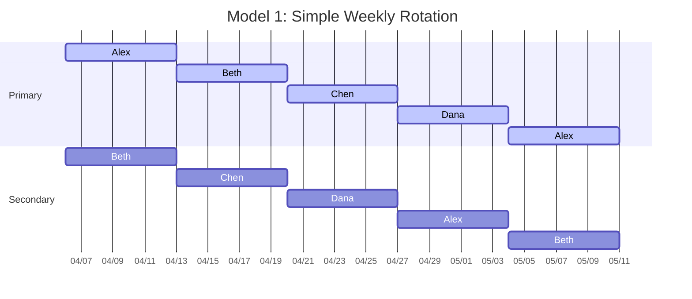
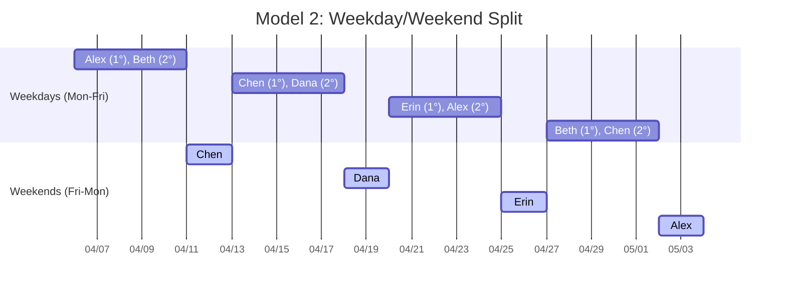
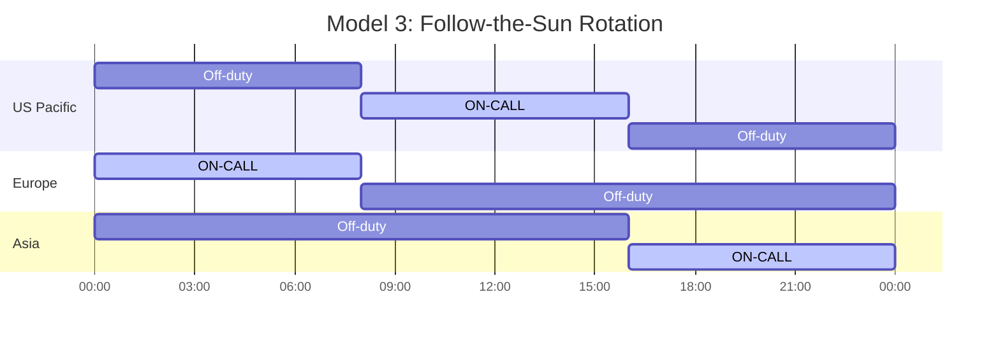
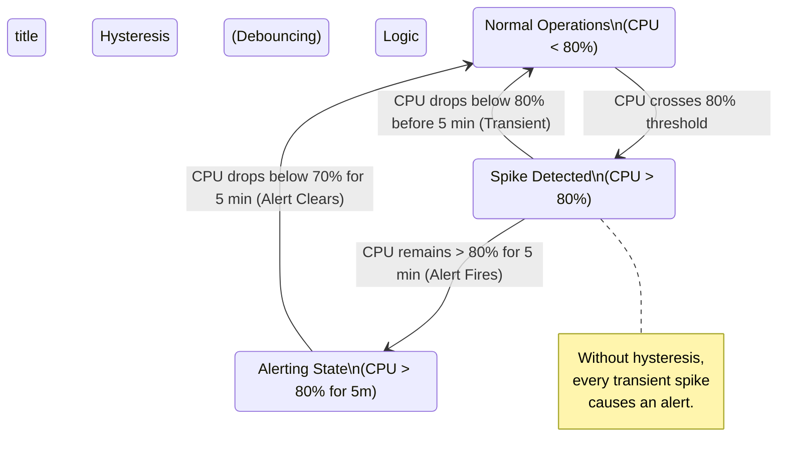

> **Complexity**: `[MEDIUM]`
>
> **Time to Complete**: 2 hours
>
> **Prerequisites**: None
>
> **Track**: Foundations

### What You'll Be Able to Do

After completing this module, you will be able to:

1. **Design** on-call rotations that distribute load fairly, provide adequate rest, and include clear escalation paths.
2. **Evaluate** alert quality by identifying noisy, non-actionable, and duplicate alerts that contribute to on-call burnout.
3. **Implement** on-call health metrics (pages per shift, time-to-acknowledge, interrupt frequency) that make burnout risk visible to leadership.
4. **Apply** sustainable on-call practices including runbook-driven response, toil budgets, and compensation models that retain experienced engineers.
5. **Diagnose** systemic organizational failures that lead to alert fatigue and engineer attrition.

---

## The Engineer Who Stopped Sleeping

March 2019. A mid-size fintech company in Austin, Texas, was experiencing hyper-growth. Priya, a senior backend engineer, had been with the company for three years. She was exceptionally talented, reliable, and possessed an encyclopedic knowledge of the system's architecture. When the engineering department transitioned to a microservices model running on early versions of Kubernetes, they realized they needed a formal on-call rotation. Priya, proud of the systems she had built, volunteered immediately. She reasoned that since she knew the systems best, she was the logical choice to keep them running at night.

The first month of the rotation was manageable. She received two pages out of hours; both were legitimate hardware failures, and she resolved both within fifteen minutes. However, by the third month, the microservice architecture had ballooned. New services were deployed weekly by autonomous teams, introducing complex, unmapped dependencies and novel failure modes. The monitoring systems were rudimentary, configured with aggressive thresholds. Alerts began arriving in clusters—three, four, or five a night. A disk usage alert would fire at 62% against a threshold of 60%. A health check would flap because a downstream dependency experienced a brief cold start. A "critical" severity alert would trigger for a batch job failure that wasn't actually required to succeed until the next business day.

Priya's life degraded rapidly. She stopped sleeping through the night, instead dozing with her phone on her chest, the ringer set to maximum volume. She developed a severe Pavlovian anxiety response to the specific chime of her incident management app; hearing a similar tone in public would cause her heart rate to spike uncontrollably. Exhausted, she stopped exercising, subsisted on takeout, and frequently skipped team meetings to nap in her car. Her manager noticed her decline and asked if she was okay. Conditioned by an engineering culture that viewed stoicism as a virtue, she insisted she was fine. By month six, Priya resigned without another job lined up. The company lost a foundational engineer, incurred $25,000 in recruitment costs, and lost approximately $75,000 in reduced productivity during the six-month ramp-up for her replacement. The hidden cost of lost institutional knowledge was incalculable. She left because the organization allowed a broken on-call system to destroy her well-being.

> **Stop and think**: What organizational failures led to Priya's resignation? Was it just the volume of alerts, or did the lack of systemic feedback loops play a larger role?

---

## Why This Module Matters

On-call responsibility is the harsh reality of operating production software. If your organization runs services that customers depend on around the clock, human intervention is required when automated remediation fails. 

However, on-call is fundamentally a human system interacting with a technical one. It involves sleep disruption, cognitive load under extreme pressure, and the compounding effects of stress. The industry's best engineering organizations understand this duality. They engineer their on-call rotations with the same meticulous rigor they apply to distributed system design. They establish clear ownership, enforce strict escalation paths, measure the human cost of alerting, and relentlessly eliminate noise. 

Conversely, immature organizations simply purchase an incident management tool, configure a round-robin schedule, and declare the problem solved. They ignore the reality that alert fatigue is a systemic toxin. This module will teach you how to architect an on-call framework that is highly effective at resolving incidents while fiercely protecting the humans who operate it. We will explore structural rotation design, the economics of toil, and the psychological mechanisms of alert fatigue.

### Did You Know?

- **Google's SRE book reports** that an on-call engineer should receive no more than **2 events per 12-hour shift** on average. Exceeding this limit degrades incident response quality because the engineer is forced to context-switch constantly rather than investigating issues deeply.
- **Sleep deprivation equivalent**: After 17-19 hours without sleep, cognitive performance drops to the equivalent of a **blood alcohol concentration of 0.05%**. After 24 hours, it reaches **0.10%**—legally intoxicated in every US state. Paging an engineer at 3 AM is asking an impaired person to make critical production decisions.
- **Alert fatigue kills people—literally.** In the healthcare sector, the Joint Commission found that **72-99% of clinical alarms are false positives**, directly linking alarm fatigue to patient mortality. Software engineers experience the same psychological conditioning; excessive noise trains the brain to ignore real emergencies.
- **The cost of an interrupted night**: Research from the University of Tel Aviv demonstrates that even a **single night of fragmented sleep** (being woken twice for 10-15 minutes) produces cognitive impairment identical to obtaining only **4 hours of total sleep**.

---

## Structuring Healthy On-Call Rotations

An effective on-call rotation must explicitly define five parameters: **who** is responsible, **when** they are responsible, **how long** the shift lasts, **what support** mechanisms exist, and **how** the effort is compensated. 

### Rotation Models

Organizations typically adopt one of three primary scheduling models, depending on their size and geographic distribution.



The Simple Weekly Rotation is the industry standard for co-located teams. While easy to schedule and highly predictable, it demands a significant personal sacrifice, entirely consuming the on-call engineer's weekend.



For teams wishing to protect continuous rest periods, the Weekday/Weekend Split isolates the highest-burden periods. This allows organizations to provide different compensation for weekend coverage, though it introduces additional context-switching during handoffs.



The Follow-the-Sun model is the gold standard for humane on-call. By leveraging globally distributed teams, nobody is required to sacrifice their sleep. However, this model requires significant organizational maturity, standardized runbooks, and the budget to hire across multiple continents.

### Primary and Secondary Tiers

A single point of failure is unacceptable in system architecture, and it is equally unacceptable in human operations. Every rotation must implement at least two tiers of response.

| Role | Responsibility | Escalation Timing |
|------|---------------|-------------------|
| **Primary** | First responder. Gets paged immediately. Expected to acknowledge within 5-15 minutes. | N/A — they're first. |
| **Secondary** | Backup. Gets paged if primary doesn't acknowledge within the SLA. Also available for consultation. | 10-15 min after primary page |
| **Escalation Manager** | Engineering manager or senior IC. Gets paged if both primary and secondary fail, or if incident severity is high enough. | 15-30 min, or immediately for SEV-1 |

The Secondary role is vital. Beyond acting as a fallback if the Primary is in the shower or driving, the Secondary provides psychological safety. Knowing that a colleague is available for consultation drastically reduces the anxiety of carrying the pager.

### Defining Rotation Lengths

Choosing the correct shift duration requires balancing system context retention against human endurance.

| Duration | Assessment | Notes |
|----------|------------|-------|
| **24 hours** | Too short | Constant handoffs destroy context. |
| **3 days** | Awkward | Scheduling overlaps with weekends unpredictably. |
| **1 week** | **Ideal** | Industry standard. Long enough for context, short enough to not burn out. Most teams use this. |
| **2 weeks** | Too long | Only acceptable for low-page services (< 1 page/day average). Exhausting for high-volume. |

As a strict mathematical rule, an engineer should never be on-call for more than 25% of their working life. A rotation must contain a minimum of four engineers, with six to eight being the optimal target to ensure adequate recovery time between shifts.

---

## The Economics of On-Call: Compensation and Toil Budgets

On-call is labor, and labor outside of standard business hours must be managed through strict budgeting and fair compensation. Organizations that treat on-call as an implicit, uncompensated duty of being a salaried engineer inevitably suffer high attrition rates among their most experienced staff.

### Establishing Toil Budgets

In Site Reliability Engineering (SRE), "toil" is defined as work that is manual, repetitive, automatable, tactical, and devoid of enduring value. Responding to alerts, running database migrations at midnight, and manually scaling Kubernetes deployments all constitute toil.

Leadership must enforce a hard **Toil Budget**, typically capped at 50% of an engineer's time. If an on-call rotation requires more than 50% of the team's capacity to simply keep the systems running, feature development must immediately cease. The rotation is considered mathematically bankrupt. 

When a toil budget is breached, the engineering manager must intervene. The operational burden is handed back to the product development teams (a practice known as "handing back the pager"), forcing the organization to prioritize reliability, automation, and tech debt reduction over new feature delivery. This creates a critical feedback loop: bad code causes alerts, alerts consume the toil budget, and a depleted toil budget stops feature launches.

### Compensation Models

If an organization demands that an engineer remain sober, within 15 minutes of a laptop, and ready to work at 3 AM on a Saturday, that organization is restricting the engineer's freedom. This restriction requires structural compensation.

1. **The Pager Stipend**: A flat rate (e.g., $300 - $600) paid to the engineer for the week they carry the pager, regardless of whether it rings. This compensates for the restriction of liberty and the baseline anxiety of being on standby.
2. **Hourly Incident Pay**: When an alert fires outside of business hours, the engineer logs the time spent mitigating the issue and is paid an hourly override rate. This creates a financial incentive for the company to fix noisy alerts, as alert storms directly impact payroll.
3. **Mandatory Time-in-Lieu**: If an engineer is woken up at 4 AM to fight a fire, they do not attend the 10 AM standup. They sleep. If a severe incident consumes an engineer's Sunday, they are mandated to take Monday or Tuesday off. This is not vacation time; this is operational recovery time, and managers must fiercely enforce it.

---

## Signal vs. Noise: Defeating Alert Fatigue

Alert fatigue is a biological reality. The human brain cannot maintain a state of hyper-vigilance indefinitely; it adapts to continuous stimuli by raising its response threshold. When the vast majority of alerts are unactionable, the brain learns to dismiss the alerting mechanism entirely. 

> **Pause and predict**: If you lower the threshold for a CPU alert to be "safer" and catch issues earlier, what psychological effect will that ultimately have on the on-call engineer?

### Measuring Signal-to-Noise Ratio (SNR)

Engineering leadership must track the SNR of their monitoring systems continuously. 

**SNR = (Actionable Alerts / Total Alerts) × 100%**

An actionable alert means it required human intervention, prevented user impact, was not a duplicate, and did not self-resolve. An SNR below 50% is a toxic environment. If your SNR drops below 30%, it is an organizational emergency. 

### Systematically Classifying Alerts

To improve SNR, teams should hold a weekly alert review meeting, categorizing every page from the previous seven days:

| Category | Definition | Action |
|----------|-----------|--------|
| **True Positive, Actionable** | Real problem, needed human fix | Keep this alert. Tune thresholds if needed. |
| **True Positive, Self-Healing** | Real problem, but system recovered automatically | Convert to a non-paging notification. Review why auto-healing isn't trusted enough to not alert. |
| **False Positive** | Alert fired, but nothing was actually wrong | Fix the detection logic, raise thresholds, add hysteresis. |
| **Duplicate** | Same incident triggered multiple alerts | Deduplicate at the source. Group related alerts. |
| **Informational** | Not a problem, just a status change | Remove from paging entirely. Move to a dashboard or log. |

### Implementing Hysteresis (Debouncing)

A massive source of false positives is transient spikes. A CPU might hit 85% for ten seconds while garbage collection runs, triggering an immediate alert. By the time the engineer logs in, the CPU is at 40%. The solution is hysteresis—requiring the threshold to be breached for a sustained duration before alerting.



### Alert Grouping and Suppression

When a foundational dependency fails, it often triggers a cascade of downstream failures. An unoptimized alerting system will page the engineer for every single failing downstream service, creating an alert storm. Modern systems like Prometheus Alertmanager allow you to define routing trees that group and suppress these alerts.

**BAD: Alert storm from a single root cause**
```text
03:14:22  CRITICAL  payment-service: connection timeout to postgres
03:14:23  CRITICAL  order-service: connection timeout to postgres
03:14:23  WARNING   inventory-service: high error rate
03:14:24  CRITICAL  user-service: connection timeout to postgres
03:14:25  CRITICAL  notification-service: unhandled exception
... (38 more alerts over next 5 minutes)

Engineer's phone: *vibrating continuously for 5 minutes straight*
```

**GOOD: Root cause detection with suppression**
```text
03:14:22  CRITICAL  postgres-primary: connection refused (port 5432)
          ↳ Suppressing 44 downstream dependency alerts for 15 minutes
          ↳ Runbook: https://wiki.internal/runbooks/postgres-connection

Engineer's phone: *one page, one runbook link, clear root cause*
```

---

## Paging Etiquette and Escalation Policies

Not all system anomalies deserve a page. A page explicitly states: *"This problem is urgent enough to interrupt a human's life immediately."* If the problem can wait until morning, it is a ticket, not a page.

### The "Two Pizza Rule" for Pages
<!-- incident-xref: amazon-two-pizza -->

Before configuring a new alert to page a human, ask three questions:
1. **If this fires at 3 AM, will the engineer need to take action right now?**
2. **If the engineer ignores this until morning, will irreversible damage occur?**
3. **Can this be auto-remediated?**

If the answers are No, No, and No—it should not