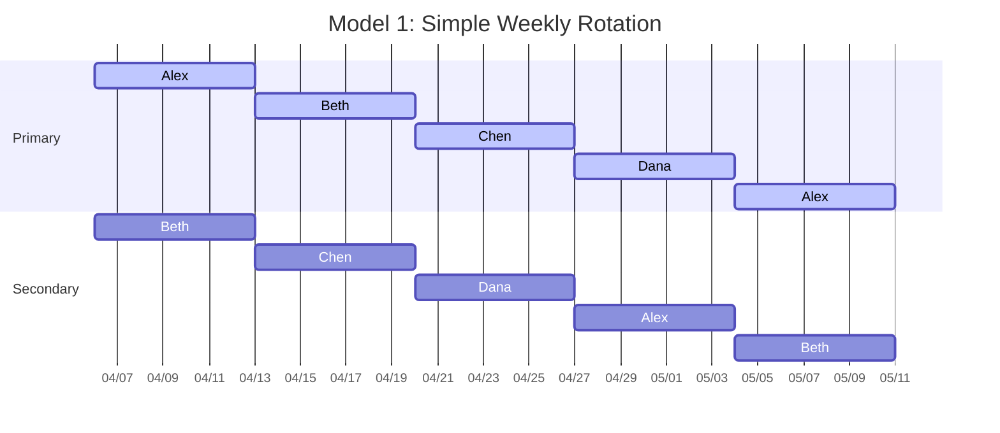
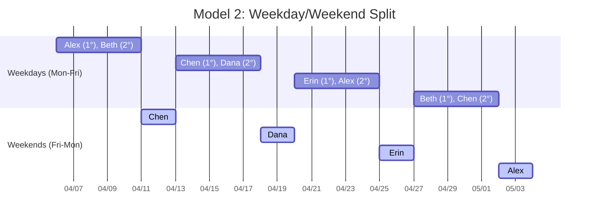
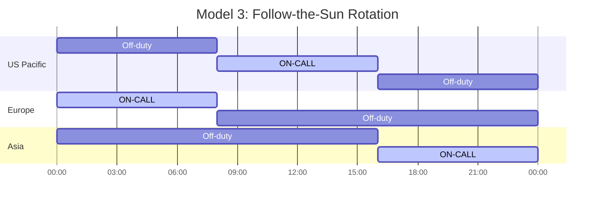
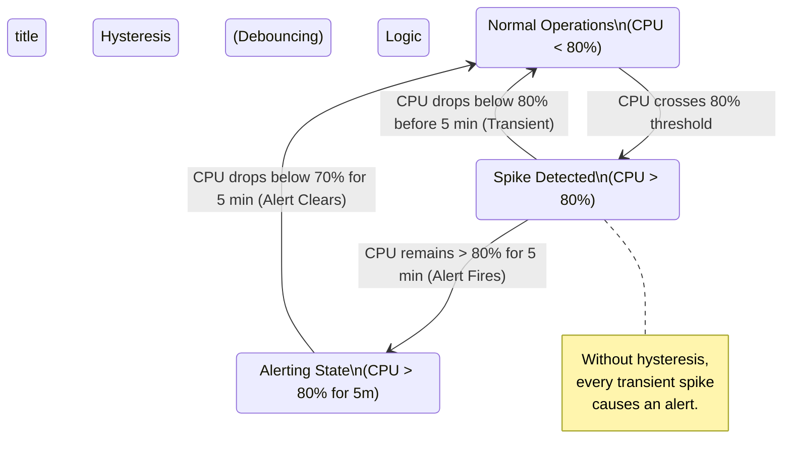
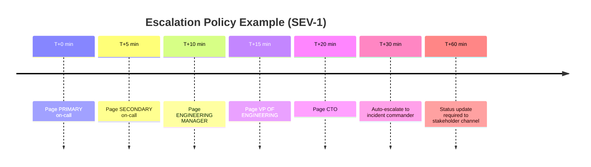
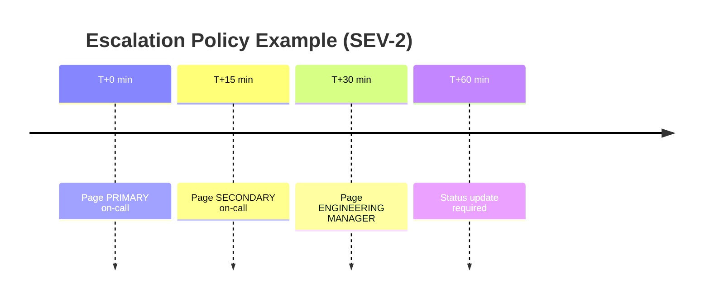

> **Complexity**: `[MEDIUM]`
>
> **Time to Complete**: 2 hours
>
> **Prerequisites**: None
>
> **Track**: Foundations

### What You'll Be Able to Do

After completing this module, you will be able to:

1. **Design** on-call rotations that distribute load fairly, provide adequate rest, and include clear escalation paths
2. **Evaluate** alert quality by identifying noisy, non-actionable, and duplicate alerts that contribute to on-call burnout
3. **Implement** on-call health metrics (pages per shift, time-to-acknowledge, interrupt frequency) that make burnout risk visible to leadership
4. **Apply** sustainable on-call practices including runbook-driven response, toil budgets, and compensation models that retain experienced engineers

---

## The Engineer Who Stopped Sleeping

**March, 2019. A mid-size fintech company in Austin, Texas.**

Priya had been a backend engineer for three years. She was good at her job—reliable, sharp, the kind of person who could read a stack trace like a bedtime story. When the team transitioned to a microservices architecture and needed to staff an on-call rotation, she volunteered. She was proud of the systems she'd built. Who better to keep them running at night?

The first month was fine. Two pages, both legitimate, both resolved in under fifteen minutes. She told herself: *this isn't so bad.*

By month three, the architecture had grown. New services. New dependencies. New failure modes nobody had anticipated. The alerts started coming in clusters—three, four, five per night. Some were real. Most were not. A disk usage alert firing at 62% on a threshold of 60%. A health check flapping because a downstream service had a 200ms cold start. A "critical" alert for a batch job that wasn't actually needed until morning.

Priya stopped sleeping through the night. She started sleeping with her phone on her chest, volume at maximum. She developed a Pavlovian anxiety response to her ringtone—even hearing a similar sound in a grocery store would spike her heart rate. She stopped exercising. She stopped cooking. She ate takeout at her desk and skipped team lunches because she needed to nap.

Her manager noticed the dark circles. "You doing okay?" he asked.

"Fine," she said. Engineers are trained to fix things, not admit they're broken.

By month six, Priya put in her two weeks' notice. She didn't have another job lined up. She just couldn't do it anymore. The company lost one of its best engineers—not because of compensation, not because of career growth, not because of a toxic culture. Because they let bad on-call practices grind her into dust.

> **Stop and think**: What organizational failures led to Priya's resignation? Was it just the volume of alerts, or did the lack of systemic feedback loops play a larger role?

> **The Hidden Cost of Bad On-Call**
>
> What Priya's company thought they saved:
> - $0 (no on-call tooling investment, no rotation redesign)
>
> What Priya's company actually lost:
> - Recruiting her replacement: ~$25,000
> - Ramp-up time for new hire (6 months): ~$75,000 in reduced output
> - Knowledge that walked out the door: Priceless (and unrecoverable)
> - Team morale damage: 2 more resignations followed
>
> **TOTAL: $100,000+ and a mass attrition event**

Priya's story isn't rare. It's the norm at companies that treat on-call as an afterthought. This module exists to make sure you never build—or tolerate—an on-call system that destroys people.

---

## Why This Module Matters

On-call is the frontline of production reliability. Every modern software organization that runs 24/7 services needs humans in the loop when automation fails. That is an engineering reality.

But on-call is also a *human* system. It involves sleep deprivation, interrupted personal time, cognitive load under pressure, and the slow accumulation of stress that—left unchecked—turns into clinical burnout. That is a *human* reality.

The best engineering organizations understand both realities simultaneously. They design on-call rotations with the same rigor they apply to system architecture: clear ownership, well-defined escalation paths, measurable quality, and continuous improvement. They treat alert noise the way they treat technical debt—as something to be measured, budgeted, and systematically reduced.

The worst organizations throw a PagerDuty license at the problem and call it done.

This module teaches you to build on-call systems that are both *effective* (incidents get resolved quickly) and *humane* (the people doing the work don't burn out). These goals are not in tension. In fact, they reinforce each other: well-rested engineers with low-noise alerts resolve incidents faster than exhausted engineers drowning in false positives.

> **The Firefighter Analogy**
>
> Professional fire departments don't make firefighters respond to every car alarm in the city. They have dispatch systems that filter signal from noise, clear escalation procedures, mandatory rest periods, and structured shift rotations. A fire department that paged every firefighter for every alarm would collapse within a week.
>
> Your on-call rotation is no different. The tools, the processes, the human factors—they all need to be engineered deliberately.

---

## Did You Know?

- **Google's SRE book reports** that an on-call engineer should receive no more than **2 events per 12-hour shift** on average. More than that, and incident quality degrades because the responder is constantly context-switching instead of deeply investigating each issue.

- **Sleep deprivation equivalent**: After 17-19 hours without sleep, cognitive performance drops to the equivalent of a **blood alcohol concentration of 0.05%**. After 24 hours, it's equivalent to **0.10%**—legally drunk in every US state. When you page someone at 3 AM who went to bed at midnight, you're asking a person with impaired judgment to make production decisions.

- **Alert fatigue kills people—literally.** In healthcare, the Joint Commission found that **72-99% of clinical alarms are false positives**, and alarm fatigue has been directly linked to patient deaths. The same psychology applies to software alerts: when most pages are noise, engineers learn to ignore them—including the real ones.

- **The cost of an interrupted night**: Research from the University of Tel Aviv shows that even a **single night of fragmented sleep** (woken twice for 10-15 minutes) produces cognitive impairment equivalent to getting only **4 hours of total sleep**. It's not just the total time lost—it's the disruption of sleep cycles that does the damage.

---

## Structuring Healthy On-Call Rotations

A well-designed rotation answers five questions: **who**, **when**, **how long**, **with what support**, and **with what compensation**. Let's work through each.

### Rotation Models


*Best for: Small teams (4-6 people), single timezone. Pros: Simple, predictable. Cons: Full week is exhausting, weekends are consumed.*


*Best for: Teams that want to protect weekends, 5-8 people. Pros: Weekend rotation is separate and can be compensated differently. Cons: Handoff friction at boundaries.*


*Best for: Distributed teams across 2-3 timezones. Pros: Nobody gets paged at night (Gold Standard). Cons: Requires hiring globally.*

### Primary / Secondary Model

Every rotation should have at least two tiers:

| Role | Responsibility | Escalation Timing |
|------|---------------|-------------------|
| **Primary** | First responder. Gets paged immediately. Expected to acknowledge within 5-15 minutes. | N/A — they're first. |
| **Secondary** | Backup. Gets paged if primary doesn't acknowledge within the SLA. Also available for consultation. | 10-15 min after primary page |
| **Escalation Manager** | Engineering manager or senior IC. Gets paged if both primary and secondary fail, or if incident severity is high enough. | 15-30 min, or immediately for SEV-1 |

The secondary role is not just a safety net for missed pages. It serves three critical functions:

1. **Coverage gaps**: Primary needs a doctor's appointment, a school pickup, a shower.
2. **Consultation**: Primary is investigating but needs a second pair of eyes.
3. **Psychological safety**: Knowing someone has your back reduces the anxiety of being on-call.

### Rotation Length and Frequency

| Duration | Assessment | Notes |
|----------|------------|-------|
| **24 hours** | Too short | Constant handoffs destroy context. |
| **3 days** | Awkward | Scheduling overlaps with weekends unpredictably. |
| **1 week** | **Ideal** | Industry standard. Long enough for context, short enough to not burn out. Most teams use this. |
| **2 weeks** | Too long | Only acceptable for low-page services (< 1 page/day average). Exhausting for high-volume. |

**Minimum Team Size for Healthy Rotation:**
- **4 people**: On-call every 4th week → MINIMUM viable (borderline)
- **5 people**: On-call every 5th week → Acceptable
- **6 people**: On-call every 6th week → Good
- **8 people**: On-call every 8th week → **Ideal**

> **Rule of Thumb**: No one should be on-call more than one week out of every four. Google's SRE practice targets a maximum of one week in every three to four.

---

## Alert Fatigue: The Silent Killer

Alert fatigue is what happens when an on-call engineer receives so many alerts that they stop treating each one as meaningful. It's not laziness—it's a well-documented psychological phenomenon. The human brain literally cannot sustain a high-alert state indefinitely. It adapts by lowering its response threshold. The alerts become background noise.

This is how real incidents get missed. Not because nobody was on-call, but because the person on-call had been conditioned by weeks of false positives to assume the next page is also noise.

> **Pause and predict**: If you lower the threshold for a CPU alert to be "safer" and catch issues earlier, what psychological effect will that ultimately have on the on-call engineer?

### Measuring Signal-to-Noise Ratio

Every on-call team should track this metric:

**SNR = (Actionable Alerts / Total Alerts) × 100%**

Where "Actionable" means:
- Required human intervention
- Would have caused user impact if not addressed
- Was NOT a duplicate of another alert
- Was NOT a transient blip that self-resolved

**Benchmarks:**
- **< 30% SNR**: CRITICAL. Your team is drowning. Stop everything and fix alerting before it causes a real incident (or a resignation).
- **30-50% SNR**: Poor. Significant noise. Dedicate sprint time to alert hygiene.
- **50-70% SNR**: Acceptable. Normal for growing systems. Continuous improvement needed.
- **70-90% SNR**: Good. Your alerting is healthy. Keep iterating.
- **> 90% SNR**: Excellent. You might be under-alerting (double-check coverage), but likely you're doing a great job.

### Systematically Reducing Noise

Reducing alert noise is not a one-time project. It's a continuous discipline. Here's a framework:

**Step 1: Classify every alert from the past 30 days.**

Put each alert into one of these buckets:

| Category | Definition | Action |
|----------|-----------|--------|
| **True Positive, Actionable** | Real problem, needed human fix | Keep this alert. Tune thresholds if needed. |
| **True Positive, Self-Healing** | Real problem, but system recovered automatically | Convert to a non-paging notification. Review why auto-healing isn't trusted enough to not alert. |
| **False Positive** | Alert fired, but nothing was actually wrong | Fix the detection logic, raise thresholds, add hysteresis. |
| **Duplicate** | Same incident triggered multiple alerts | Deduplicate at the source. Group related alerts. |
| **Informational** | Not a problem, just a status change | Remove from paging entirely. Move to a dashboard or log. |

**Step 2: Apply the ICE framework to prioritize fixes.**

For each noisy alert, score it on three dimensions (1-10 each):

- **I**mpact: How much on-call pain does this alert cause?
- **C**onfidence: How sure are you that the fix will work?
- **E**ase: How easy is the fix to implement?

Multiply all three. Fix the highest-scoring alerts first.

**Step 3: Implement hysteresis (debouncing).**

A shocking number of false positive alerts come from momentary threshold crossings:



**Step 4: Group correlated alerts.**

When a database goes down, you don't need 47 alerts for every service that depends on it. You need one alert that says "database is down" and a suppression rule that silences downstream symptoms for a defined window.

**BAD: Alert storm from a single root cause**
```text
03:14:22  CRITICAL  payment-service: connection timeout to postgres
03:14:23  CRITICAL  order-service: connection timeout to postgres
03:14:23  WARNING   inventory-service: high error rate
03:14:24  CRITICAL  user-service: connection timeout to postgres
03:14:25  CRITICAL  notification-service: unhandled exception
... (38 more alerts over next 5 minutes)

Engineer's phone: *vibrating continuously for 5 minutes straight*
```

**GOOD: Root cause detection with suppression**
```text
03:14:22  CRITICAL  postgres-primary: connection refused (port 5432)
          ↳ Suppressing 44 downstream dependency alerts for 15 minutes
          ↳ Runbook: https://wiki.internal/runbooks/postgres-connection

Engineer's phone: *one page, one runbook link, clear root cause*
```

---

## Paging Etiquette

Not everything deserves a page. A page is a statement that says: "This problem is urgent enough to interrupt a human's life right now." That is a high bar, and it should be treated as one.

### When to Page

| Page-Worthy | Why |
|------------|-----|
| User-facing service is down or severely degraded | Direct user impact right now |
| Data loss is occurring or imminent | Irreversible damage in progress |
| Security breach detected | Active threat requires immediate response |
| SLO error budget burn rate is critical | Will breach SLO within hours at current rate |
| Automated remediation has failed | The safety net is gone |

### When NOT to Page

| Not Page-Worthy | What to Do Instead |
|-----------------|-------------------|
| Disk at 72% (threshold 70%) | Non-paging alert. Create a ticket. It can wait until morning. |
| A single 5xx error in the last hour | Log it. Investigate during business hours if pattern emerges. |
| Non-production environment is down | Slack notification to the team channel. Fix during work hours. |
| A batch job that runs daily failed once | Auto-retry. Alert only if it fails 3 consecutive times. |
| A dependency is slow but within SLO | Dashboard warning. No page. |
| Certificate expires in 30 days | Ticket. This is planned work, not an emergency. |
| CPU spike that lasted 45 seconds | Don't even notify. This is normal. |

### Escalation Policies

A well-designed escalation policy has clear timing, clear ownership, and an explicit "stop" condition:





**SEVERITY 3 (Minor issue, no user impact):**
- Slack notification to `#oncall` channel.
- Auto-create Jira ticket. No page. Address during next business day.

**SEVERITY 4 (Cosmetic, informational):**
- Log only. Review in weekly alert triage meeting.

### The "Two Pizza Rule" for Pages

Before you create a new paging alert, ask these three questions:

1. **If this fires at 3 AM, will the engineer need to take action right now?** If no, it's not a page.
2. **If the engineer ignores this until morning, will something irreversible happen?** If no, it's not a page.
3. **Can this be auto-remediated?** If yes, auto-remediate first, page only if auto-remediation fails.

If you cannot answer "yes" to at least one of the first two questions, the alert should be a non-paging notification, a ticket, or a dashboard metric—not a page.

---

## Runbooks: Your 3 AM Best Friend

A runbook is a document that tells an on-call engineer exactly what to do when a specific alert fires. Good runbooks are the difference between a 5-minute resolution and a 45-minute panicked investigation.

> **Stop and think**: Why is it dangerous to have a single "Subject Matter Expert" as the sole escalation path listed in a runbook? What happens when they go on vacation?

### What Makes a Good Runbook

The person reading your runbook is sleep-deprived, stressed, and possibly looking at a system they haven't touched in months. Write for that person.

**Principles:**

- **Start with impact.** What is broken and who is affected? This determines urgency.
- **Give the most common fix first.** 80% of the time, the solution is the same thing. Put it at the top.
- **Include exact commands.** Not "restart the service" but the actual command to copy-paste.
- **Include rollback steps.** If the fix makes things worse, how do you undo it?
- **Link to dashboards.** The engineer needs to see the state of the system, not hunt for it.
- **Keep it under 2 pages.** If it's longer, the runbook is trying to cover too many scenarios. Split it.

### Runbook Template

```markdown
# Runbook: [Alert Name]

**Last Updated**: YYYY-MM-DD
**Owner**: [Team Name]
**Severity**: [1/2/3]

## What Is Happening
[1-2 sentences. What triggered this alert and what is the user impact?]

## Quick Diagnosis
1. Check [Dashboard Link] — is the service actually down or is this a false positive?
2. Check [Dependency Status Page] — is a dependency causing this?
3. Check recent deployments: `kubectl rollout history deployment/[name] -n [namespace]`

## Most Common Fix
[Step-by-step instructions for the fix that works 80% of the time]

### Commands
```bash
# Step 1: Verify the problem
kubectl get pods -n production -l app=payment-service

# Step 2: Check logs for the root cause
kubectl logs -n production -l app=payment-service --tail=100 --since=10m

# Step 3: Apply the fix (most common: restart the pods)
kubectl rollout restart deployment/payment-service -n production

# Step 4: Verify recovery
kubectl rollout status deployment/payment-service -n production
```

## If That Doesn't Work
[Second-tier investigation steps. Less common causes.]

## Rollback
[How to undo what you just did if it made things worse.]

## Escalation
- If unresolved after 30 minutes, escalate to: [Name/Team]
- Subject matter expert: [Name, contact info]

## History
| Date | What Happened | Resolution |
|------|--------------|------------|
| 2025-01-15 | OOM kill due to memory leak in v2.3.1 | Rolled back to v2.3.0 |
| 2024-11-02 | Connection pool exhaustion | Increased pool size to 50 |
```

### Runbook Anti-Patterns

| Anti-Pattern | Why It's Bad | Fix |
|-------------|-------------|-----|
| "Investigate and resolve" | That's the whole job, not a runbook | Write specific diagnostic steps |
| Outdated commands that don't work | Worse than no runbook—wastes precious time | Review runbooks quarterly |
| Assumes deep system knowledge | The person reading this might be new | Explain context, don't assume |
| No dashboard links | Engineer wastes 5 minutes finding the right dashboard | Embed direct links |
| 10-page novel | Nobody reads a novel at 3 AM | Keep it under 2 pages |
| "Ask [person]" as the only step | That person is on vacation. Now what? | Document what that person knows |

---

## Recognizing Burnout

Burnout isn't dramatic. It doesn't announce itself with a bang. It creeps in slowly—a little less enthusiasm here, a little more cynicism there—until one day a great engineer quietly puts in their notice and everyone is shocked.

The World Health Organization classifies burnout as an **occupational phenomenon** resulting from "chronic workplace stress that has not been successfully managed." It has three dimensions:

1. **Exhaustion**: Physical and emotional depletion
2. **Cynicism**: Mental distancing from work, negativity, detachment
3. **Reduced efficacy**: Feeling incompetent, unproductive, like nothing you do matters

> **Pause and predict**: What is typically the first observable behavioral sign that a highly engaged engineer is entering the early stages of burnout?

### Warning Signs

**In Yourself:**

```mermaid
timeline
    title Burnout Progression