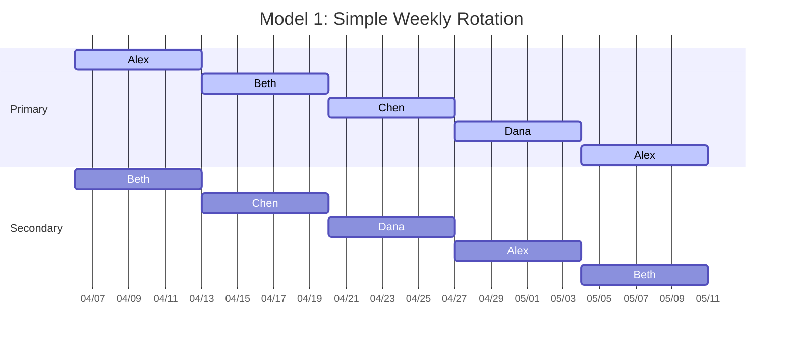
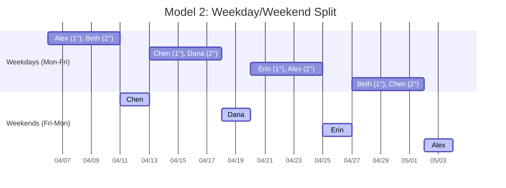
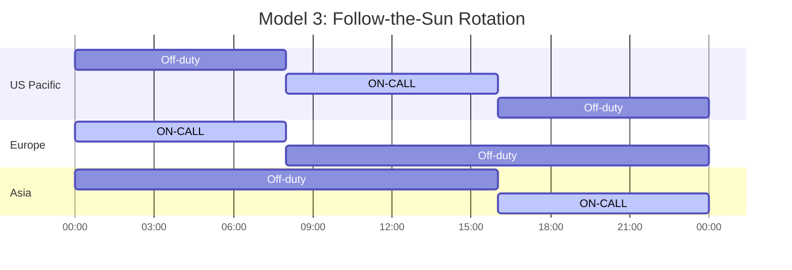
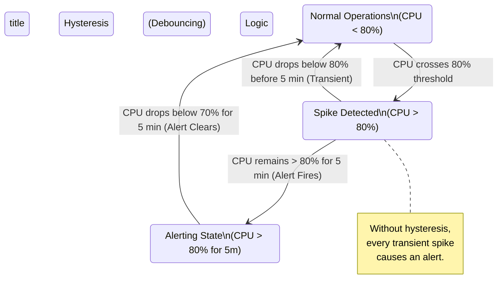
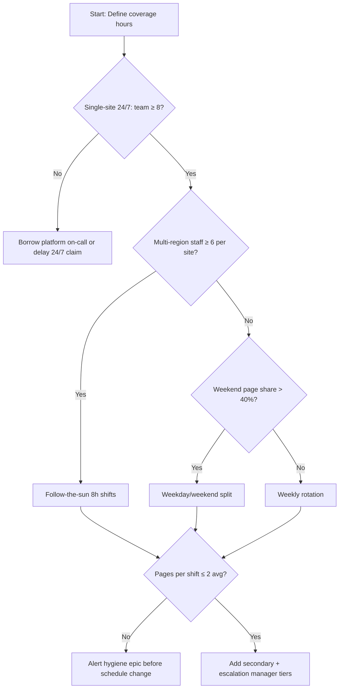

> **Complexity**: `[MEDIUM]`
>
> **Time to Complete**: 2 hours
>
> **Prerequisites**: None
>
> **Track**: Foundations

## What You'll Be Able to Do

After completing this module, you will be able to:

1. **Design** on-call rotations that distribute load fairly, provide adequate rest, and include clear escalation paths.
2. **Evaluate** alert quality by identifying noisy, non-actionable, and duplicate alerts that contribute to on-call burnout.
3. **Implement** on-call health metrics (pages per shift, time-to-acknowledge, interrupt frequency) that make burnout risk visible to leadership.
4. **Apply** sustainable on-call practices including runbook-driven response, toil budgets, and compensation models that retain experienced engineers.
5. **Diagnose** systemic organizational failures that lead to alert fatigue and engineer attrition.

---

## Hypothetical scenario: The engineer who stopped sleeping

Imagine a mid-size engineering team that has just migrated from a monolith to a growing microservices architecture running on Kubernetes. A senior backend engineer — call her Alex — volunteered for the first on-call rotation because she knew the legacy systems best and wanted to protect the migration. The logic felt sound: the person with the deepest context should carry the pager while everyone else learns the new topology.

The first month goes reasonably well. Alex receives two overnight pages; both are legitimate failures, and she resolves each within about fifteen minutes using runbooks she wrote herself. By the third month, the picture has changed. Autonomous teams deploy new services weekly, dependencies are poorly documented, and monitoring was configured quickly with aggressive thresholds. Alerts arrive in clusters: disk usage fires at 62% against a 60% threshold; health checks flap when a downstream dependency cold-starts; a batch job failure pages as critical even though the job is not required until the next business day.

Alex's sleep fragments. She keeps her phone on her chest with the ringer at maximum volume, waking at every notification regardless of severity. She develops a conditioned anxiety response to the incident app's alert tone — hearing a similar sound in public spikes her heart rate. She stops exercising, skips team meetings to nap, and tells her manager she is "fine" because the team culture treats stoicism as a virtue. Six months later, Alex resigns without another role lined up. The organization loses deep institutional knowledge, spends months re-hiring and ramping a replacement, and never quantifies the reliability work that did not happen because the people who would have done it left.

> **Stop and think**: What organizational failures led to Alex's resignation? Was it only alert volume, or did missing feedback loops — page budgets, toil caps, manager intervention — play a larger role?

This scenario is illustrative, not a report of a specific company. The lesson is durable: on-call is a human system interacting with a technical one. When the human system is neglected — no page budgets, no alert review, no recovery time — the technical system loses the engineers who understand it, and reliability work stalls while the organization re-hires and re-trains replacements who will face the same broken pager unless the loop closes.

---

## Why This Module Matters

On-call responsibility is the harsh reality of operating production software. If your organization runs services that customers depend on around the clock, human intervention is required when automated remediation fails. That intervention happens at inconvenient hours, under cognitive load, and often without complete information about what broke or why.

However, on-call is fundamentally a human system interacting with a technical one. It involves sleep disruption, context switching under pressure, and the compounding effects of stress. The industry's best engineering organizations understand this duality. They engineer on-call rotations with the same rigor they apply to distributed system design: clear ownership, enforced escalation paths, measured human cost, and relentless elimination of noise. Google's Site Reliability Engineering practice treats operational overload as a measurable quantity with explicit caps — not a heroic expectation that engineers simply endure.

Conversely, immature organizations purchase an incident management tool, configure a round-robin schedule, and declare the problem solved. They ignore that alert fatigue is a systemic toxin: it degrades response quality, hides real emergencies in noise, and drives attrition among the engineers who know the systems best. This module teaches you how to architect an on-call framework that resolves incidents effectively while fiercely protecting the humans who operate it. We explore rotation design, operational load and toil economics, alert quality discipline, humane compensation, handoff rituals, and the metrics that make burnout risk visible before people quit.

On-call health is also a reliability signal. When pages-per-shift climb sustainably above industry baselines, the problem is rarely "hire more on-call engineers." It is almost always "the system or its observability is generating too much operational work." Treating on-call metrics as product health indicators — connected to error budgets and engineering priorities — closes the feedback loop that hypothetical Alex's team never built.

---

## Structuring Healthy On-Call Rotations

An effective on-call rotation must explicitly define five parameters: **who** is responsible, **when** they are responsible, **how long** the shift lasts, **what support** mechanisms exist, and **how** the effort is compensated. Ambiguity in any of these dimensions transfers stress to the individual carrying the pager, because they must negotiate expectations in real time while tired and under pressure.

Rotation design is not a scheduling puzzle alone. It is an organizational commitment about how much operational load you believe is acceptable per engineer, how fairly that load is distributed, and what happens when reality exceeds the design. A rotation that looks equitable on a calendar can still be brutal if alert quality is poor or runbooks are missing, because the calendar measures time on-call while burnout measures interrupts per shift.

### Rotation Models

Organizations typically adopt one of three primary scheduling models, depending on team size, geographic distribution, and page volume. None of these models is universally correct; each trades predictability against sleep protection, simplicity against fairness, and local context retention against global coverage.


```mermaid
gantt
    title Model 1: Simple Weekly Rotation
    dateFormat YYYY-MM-DD
    axisFormat %m/%d
    section Primary
    Alex :active, 2026-04-06, 7d
    Beth :active, 2026-04-13, 7d
    Chen :active, 2026-04-20, 7d
    Dana :active, 2026-04-27, 7d
    Alex :active, 2026-05-04, 7d
    section Secondary
    Beth :2026-04-06, 7d
    Chen :2026-04-13, 7d
    Dana :2026-04-20, 7d
    Alex :2026-04-27, 7d
    Beth :2026-05-04, 7d
```

The Simple Weekly Rotation is the industry standard for co-located teams. It is easy to schedule and highly predictable: everyone knows who carries the pager and when their week arrives. The tradeoff is personal sacrifice, because a full week including nights and weekends entirely consumes the on-call engineer's off-hours availability. This model works only when page volume stays within sustainable bounds and secondary coverage is real, not nominal.


```mermaid
gantt
    title Model 2: Weekday/Weekend Split
    dateFormat YYYY-MM-DD
    axisFormat %m/%d
    section Weekdays (Mon-Fri)
    Alex (1°), Beth (2°) :2026-04-06, 5d
    Chen (1°), Dana (2°) :2026-04-13, 5d
    Erin (1°), Alex (2°) :2026-04-20, 5d
    Beth (1°), Chen (2°) :2026-04-27, 5d
    section Weekends (Fri-Mon)
    Chen :active, 2026-04-11, 2d
    Dana :active, 2026-04-18, 2d
    Erin :active, 2026-04-25, 2d
    Alex :active, 2026-05-02, 2d
```

For teams wishing to protect continuous rest periods, the Weekday/Weekend Split isolates the highest-burden periods. Weekend coverage can carry different compensation because the lifestyle restriction is more severe. The cost is additional handoff complexity: weekday and weekend engineers must exchange context explicitly, or weekend pages repeat investigations the weekday rotation already started.


```mermaid
gantt
    title Model 3: Follow-the-Sun Rotation
    dateFormat YYYY-MM-DD HH:mm
    axisFormat %H:%M
    section US Pacific
    Off-duty :2026-04-13 00:00, 8h
    ON-CALL :active, 2026-04-13 08:00, 8h
    Off-duty :2026-04-13 16:00, 8h
    section Europe
    ON-CALL :active, 2026-04-13 00:00, 8h
    Off-duty :2026-04-13 08:00, 16h
    section Asia
    Off-duty :2026-04-13 00:00, 16h
    ON-CALL :active, 2026-04-13 16:00, 8h
```

The Follow-the-Sun model is the gold standard for humane on-call at global scale. By leveraging geographically separated teams, nobody is required to sacrifice routine sleep for routine coverage. This model demands organizational maturity: standardized runbooks, consistent observability, documented escalation paths across regions, and enough staffing at each site that local engineers are not silently absorbing another region's operational debt.

### Primary and Secondary Tiers

A single point of failure is unacceptable in system architecture, and it is equally unacceptable in human operations. Every rotation must implement at least two tiers of response, with a defined escalation manager for incidents that exceed the team's authority or expertise.

| Role | Responsibility | Escalation Timing |
|------|---------------|-------------------|
| **Primary** | First responder. Gets paged immediately. Expected to acknowledge within 5-15 minutes. | N/A — they're first. |
| **Secondary** | Backup. Gets paged if primary doesn't acknowledge within the SLA. Also available for consultation. | 10-15 min after primary page |
| **Escalation Manager** | Engineering manager or senior IC. Gets paged if both primary and secondary fail, or if incident severity is high enough. | 15-30 min, or immediately for SEV-1 |

The Secondary role is vital beyond failover. Knowing a colleague is available for consultation drastically reduces the anxiety of carrying the pager alone. PagerDuty's public incident response documentation recommends that backup shifts often follow primary shifts so context transfers naturally, and that teams treat "never hesitate to escalate" as cultural policy rather than personal failure.

### Defining Rotation Lengths and Team-Size Math

Choosing the correct shift duration requires balancing system context retention against human endurance. Too-frequent handoffs destroy incident context; too-long shifts accumulate fatigue even when page volume is low, because the psychological burden of standby persists for the entire shift.

| Duration | Assessment | Notes |
|----------|------------|-------|
| **24 hours** | Too short | Constant handoffs destroy context. |
| **3 days** | Awkward | Scheduling overlaps with weekends unpredictably. |
| **1 week** | **Ideal** | Industry standard. Long enough for context, short enough to not burn out. Most teams use this. |
| **2 weeks** | Too long | Only acceptable for low-page services (< 1 page/day average). Exhausting for high-volume. |

Google's [Being On-Call](https://sre.google/sre-book/being-on-call/) guidance recommends that an engineer should not spend more than roughly 25% of working life on-call. The math depends on how many **person-weeks of coverage** your model requires each calendar week. A single-site 24/7 rotation with mandatory **primary and secondary** tiers consumes **two person-weeks of on-call duty per week** — one engineer on primary, one on secondary — regardless of whether pages actually fire. Spread across *N* engineers, each person carries **2/N** of that load: four engineers → **50%** on-call life; six → **33%**; eight → **25%**. That is why Google recommends a **minimum of eight engineers** for a single-site 24/7 rotation with primary and secondary coverage on week-long shifts (each engineer on-call roughly one week per month), and **at least six engineers per geographic site** for follow-the-sun coverage where each site runs its own local rotation.

Primary-only math is different — one person-week per week yields **1/N** — but primary-only rotations are fragile: they create a single point of human failure and eliminate the consultation buffer that makes secondary tiers valuable. When team size falls below eight for single-site 24/7 primary+secondary coverage, rotations become mathematically punishing unless page volume is negligible or you borrow shared platform on-call capacity. This is why "just add the senior engineer to the rotation indefinitely" is an anti-pattern: it concentrates context and burden on the people least able to absorb more load without leaving.

### Handoff Discipline

Handoffs are where rotations succeed or fail in practice. A calendar rotation without a handoff ritual is two disconnected individuals sharing a pager symbolically. Effective teams treat handoff as a short, structured ceremony — not an optional Slack message when someone remembers.

A strong handoff covers four categories: **active issues** (flapping alerts, open incidents, mitigations in progress), **recent changes** (deploys, config changes, feature flags toggled during the outgoing shift), **known risks** (scheduled maintenance, capacity concerns, dependencies with elevated error rates), and **runbook gaps** (anything the outgoing engineer wished they had documented). The incoming engineer should acknowledge receipt and ask clarifying questions before the outgoing engineer stands down, even when both are in the same timezone and the handoff happens over video rather than asynchronously.

Written handoff notes matter even on small teams. A shared on-call log — a lightweight document or ticket comment thread — creates continuity when shifts overlap partially or when an incident spans a handoff boundary at 2 AM. The goal is zero re-discovery: the incoming engineer should not repeat triage the outgoing engineer already completed, because repeated triage at shift boundaries is one of the hidden taxes that makes rotations feel heavier than the calendar suggests.

---

## Operational Load, Toil, and the Error-Budget Connection

On-call does not exist in isolation from how the organization prioritizes reliability work. Site Reliability Engineering defines **toil** as operational work that is manual, repetitive, automatable, tactical, devoid of enduring value, and scaling linearly with service growth. Answering pages, restarting failed pods by hand, and manually scaling deployments at night are classic toil. Google's SRE practice caps toil at 50% of an engineer's time; the remaining capacity must go to engineering work that permanently reduces future operational burden.

The connection to on-call is direct. Every page represents potential toil: tactical, interrupt-driven work that may or may not produce enduring improvement. When pages cluster above sustainable thresholds, the team is not experiencing bad luck — it is experiencing **operational overload**, a measurable failure mode that leadership must address by redirecting engineering effort toward reliability and automation rather than feature velocity.

Error budgets formalize this tradeoff. A service with a defined availability target (for example, 99.9% monthly uptime) has a finite budget of acceptable unavailability. Burning that budget on incidents is expected; burning it on preventable noise is not. When on-call pages correlate with error-budget consumption, leadership gains a shared language: "This alert storm consumed three engineers' nights and 0.2% of our monthly budget on a self-healing flap" is an argument for engineering time that "on-call is stressful" alone cannot win.

When a toil budget is breached, the engineering manager must intervene. The operational burden is handed back to the product development teams — a practice sometimes called "handing back the pager" — forcing the organization to prioritize reliability, automation, and tech debt reduction over new feature delivery. This creates a critical feedback loop: unreliable systems cause alerts, alerts consume the toil budget, and a depleted toil budget stops feature launches until reliability improves.

PagerDuty's alerting principles distinguish **page** (immediate human action required), **ticket** (work needed, not urgently), and **log/dashboard** (informational). Confusing these channels is how organizations accidentally convert every metric twitch into a lifestyle restriction. The durable rule: if ignoring the signal until business hours causes no irreversible harm, it must not page.

---

## The Economics of On-Call: Compensation and Recovery Time

On-call is labor, and labor outside standard business hours must be managed through strict budgeting and fair compensation. Organizations that treat on-call as an implicit, uncompensated duty of being a salaried engineer inevitably suffer attrition among experienced staff, because the restriction of personal freedom is real even when the pager never rings.

### Compensation Models

If an organization demands that an engineer remain within minutes of a laptop and ready to work at 3 AM on a Saturday, that organization is restricting the engineer's freedom. This restriction requires structural compensation — not as a bonus for heroism, but as recognition that standby availability has cost.

1. **The Pager Stipend**: A flat rate paid for the week carrying the pager, regardless of whether it rings. This compensates for the restriction of liberty and the baseline anxiety of being on standby. Stipend levels vary by market and burden; the principle matters more than the exact dollar figure.

2. **Hourly Incident Pay**: When an alert fires outside business hours, the engineer logs mitigation time and receives an override rate. This creates a financial incentive for the company to fix noisy alerts, because alert storms directly impact payroll.

3. **Mandatory Time-in-Lieu**: If an engineer is woken at 4 AM to fight a fire, they do not attend the 10 AM standup. They sleep. If a severe incident consumes a Sunday, they take Monday or Tuesday off. This is operational recovery time, not vacation, and managers must enforce it without guilt. PagerDuty's public on-call guidance explicitly notes that colleagues who look tired after a night of pages deserve slack, not judgment.

### The Manager's Role in Protecting the Rotation

Managers own the organizational feedback loop that individual engineers cannot close alone. When page volume exceeds sustainable thresholds, the manager's job is to escalate operational overload to leadership and product owners — not to praise the team for "toughing it out." Effective managers track pages-per-shift trends, block feature work when toil caps are breached, fund alert hygiene sprints, and remove engineers who are consistently overloaded from rotation until systemic fixes land.

Psychological safety matters here. Engineers who fear career penalty for reporting on-call pain will hide it until they leave. Managers should ask directly in one-on-ones: "How was your rotation? How many real pages? Anything we should fix?" and treat the answers as input to prioritization, not as weakness.

---

## Signal vs. Noise: Defeating Alert Fatigue

Alert fatigue is a biological reality. The human brain cannot maintain hyper-vigilance indefinitely; it adapts to continuous stimuli by raising its response threshold. When the vast majority of alerts are unactionable, the brain learns to dismiss the alerting mechanism entirely — including alerts that signal genuine emergencies.

> **Pause and predict**: If you lower the threshold for a CPU alert to be "safer" and catch issues earlier, what psychological effect will that ultimately have on the on-call engineer?

### Measuring Signal-to-Noise Ratio (SNR)

Engineering leadership must track the SNR of monitoring systems continuously. Without measurement, alert cleanup becomes a subjective debate about which dashboards feel noisy.

**SNR = (Actionable Alerts / Total Alerts) × 100%**

An actionable alert required human intervention, prevented user impact, was not a duplicate, and did not self-resolve before anyone acted. There is no universal industry cutoff for "healthy" SNR — what matters is **trend**, **actionability**, and whether weekly alert review produces remediation owners with dates. As a **local planning heuristic** (not an industry standard), many teams treat sustained SNR below roughly 50% as a signal to pause new page routes and fund an alert hygiene epic, and below roughly 30% as an organizational emergency warranting leadership intervention: you are training engineers to ignore the pager while paying the full lifestyle cost of carrying it. Calibrate your own review targets against page volume and the SRE baseline of two incidents per 12-hour shift.

### Page vs. Ticket vs. FYI: Alert Quality Discipline

Every alert route should pass a simple quality gate before it pages a human:

| Channel | Meaning | When to Use |
|---------|---------|-------------|
| **Page** | Wake someone now | Customer impact is ongoing or imminent; delay causes harm |
| **Ticket** | Work needed, not urgent | Fix required, but business hours are acceptable |
| **FYI / Dashboard** | Context only | Trend visibility, capacity planning, non-actionable state changes |

Google's SRE book recommends expecting no more than two incidents per 12-hour on-call shift on average, because thorough incident handling — triage, mitigation, follow-up, postmortem preparation — consumes hours per event. If your team consistently exceeds that threshold, the rotation schedule is not the solution. The alerting stack needs an audit.

### Systematically Classifying Alerts

Teams should hold a weekly alert review, categorizing every page from the previous seven days. The meeting is not blame; it is quality control for observability.

| Category | Definition | Action |
|----------|-----------|--------|
| **True Positive, Actionable** | Real problem, needed human fix | Keep this alert. Tune thresholds if needed. |
| **True Positive, Self-Healing** | Real problem, but system recovered automatically | Convert to a non-paging notification. Review why auto-healing isn't trusted enough to not alert. |
| **False Positive** | Alert fired, but nothing was actually wrong | Fix the detection logic, raise thresholds, add hysteresis. |
| **Duplicate** | Same incident triggered multiple alerts | Deduplicate at the source. Group related alerts. |
| **Informational** | Not a problem, just a status change | Remove from paging entirely. Move to a dashboard or log. |

### Implementing Hysteresis (Debouncing)

A massive source of false positives is transient spikes. A CPU might hit 85% for ten seconds while garbage collection runs, triggering an immediate alert. By the time the engineer logs in, the CPU is at 40%. The solution is hysteresis — requiring the threshold to be breached for a sustained duration before alerting.


```mermaid
stateDiagram-v2
    title Hysteresis (Debouncing) Logic
    state "Normal Operations\n(CPU < 80%)" as Normal
    state "Spike Detected\n(CPU > 80%)" as Spike
    state "Alerting State\n(CPU > 80% for 5m)" as Alerting

    Normal --> Spike : CPU crosses 80% threshold
    Spike --> Normal : CPU drops below 80% before 5 min (Transient)
    Spike --> Alerting : CPU remains > 80% for 5 min (Alert Fires)
    Alerting --> Normal : CPU drops below 70% for 5 min (Alert Clears)
    
    note right of Spike
      Without hysteresis, 
      every transient spike 
      causes an alert.
    end note
```

### Alert Grouping and Suppression

When a foundational dependency fails, it often triggers a cascade of downstream failures. An unoptimized alerting system pages the engineer for every failing downstream service, creating an alert storm. Modern observability stacks allow routing trees that group and suppress dependent alerts when a root cause is identified.

**BAD: Alert storm from a single root cause**
```text
03:14:22  CRITICAL  payment-service: connection timeout to postgres
03:14:23  CRITICAL  order-service: connection timeout to postgres
03:14:23  WARNING   inventory-service: high error rate
03:14:24  CRITICAL  user-service: connection timeout to postgres
03:14:25  CRITICAL  notification-service: unhandled exception
... (38 more alerts over next 5 minutes)

Engineer's phone: *vibrating continuously for 5 minutes straight*
```

**GOOD: Root cause detection with suppression**
```text
03:14:22  CRITICAL  postgres-primary: connection refused (port 5432)
          ↳ Suppressing 44 downstream dependency alerts for 15 minutes
          ↳ Runbook: https://wiki.internal/runbooks/postgres-connection

Engineer's phone: *one page, one runbook link, clear root cause*
```

---

## Paging Etiquette and Escalation Policies

Not all system anomalies deserve a page. A page explicitly states: *"This problem is urgent enough to interrupt a human's life immediately."* If the problem can wait until morning, it is a ticket, not a page. Conflating the two destroys trust in the paging channel and guarantees that engineers will eventually silence or ignore alerts.

Escalation policies define what happens when the primary engineer does not acknowledge within the service-level window. A healthy policy escalates to secondary automatically, then to an escalation manager, without requiring the primary to manually coordinate while driving or showering. Timeouts should be short enough to protect customers but long enough to respect real life: PagerDuty's public documentation recommends roughly five-minute acknowledgment windows with staggered notification methods (push, SMS, phone).

### The Three-Question Page Review (module mnemonic)

Before configuring a new alert to page a human, ask three questions in writing during alert design review, and record the answers in the monitoring change ticket so future engineers understand the intent: (1) If this fires at 3 AM, will the engineer need to take action right now? (2) If the engineer ignores this until morning, will irreversible damage occur? (3) Can this be auto-remediated? If the answers are No, No, and No — it should not page. Route it to a ticket queue or dashboard instead. This is a **module mnemonic**, not industry terminology — do not confuse it with Amazon's unrelated "two-pizza team" sizing heuristic. The principle is universal: paging should be as rare as the team's ability to respond with focused attention, and every new page route should survive skeptical review from someone who has carried the pager recently.

### On-Call Onboarding and Runbooks

New rotation members should shadow an experienced on-call engineer for at least one full cycle before carrying primary alone. Shadowing means receiving the same pages, following the response in real time, and debriefing afterward — not merely reading documentation. Runbooks should link from alert payloads where possible so the first action at 3 AM is "open runbook step 1," not "reconstruct the architecture from memory."

Runbook quality directly affects MTTA (mean time to acknowledge) and MTTR (mean time to restore). **MTTR** measures elapsed time from **failure start or detection** (whichever your organization records first) through **service restored** — it includes detection lag, triage, and mitigation, not just the on-call response window. Some teams also track **page-to-restore** (minutes from page to service restored) separately; that metric isolates responder speed but omits time the failure existed before paging. A runbook that lists verification commands, rollback steps, and escalation contacts converts an interrupt into a procedure. A runbook that says "investigate database" converts the same interrupt into an anxiety spike.

---

## Metrics That Make Burnout Visible

You cannot manage on-call health without measuring it. Leadership needs metrics that connect human experience to engineering priorities — not vanity dashboards that show "uptime good" while engineers quit.

| Metric | What It Measures | Why It Matters |
|--------|------------------|----------------|
| **MTTA** (Mean Time to Acknowledge) | Minutes from page to acknowledgment | Long MTTA may indicate alert storms, notification misconfiguration, or fatigue |
| **MTTR** (Mean Time to Restore) | Minutes from failure start or detection to service restored (includes detection lag) | High MTTR with low page volume suggests runbook, detection, or tooling gaps |
| **Page-to-restore** (optional) | Minutes from page to service restored | Isolates on-call response speed; omitting detection lag can hide slow alerting |
| **Pages per shift** | Count of actionable pages per on-call block | Compare against the two-incidents-per-12-hours SRE baseline |
| **Interrupt load** | Total minutes spent in overnight mitigation per rotation | Captures severity, not just count — one four-hour incident differs from four one-minute flaps |
| **SNR** | Actionable alerts / total alerts | Leading indicator of alert fatigue before attrition |
| **Self-reported rotation quality** | Brief survey after each shift | Surfaces psychological burden metrics that paging data alone misses |

Use these metrics in production review meetings alongside error-budget burn. When pages-per-shift rise for three consecutive months, schedule an alert hygiene epic before adding headcount. Adding engineers to a noisy rotation spreads suffering; it does not fix the system. The same review should ask whether MTTR improvements are masking alert quality problems: a team that fixes incidents quickly but gets paged constantly is efficient at firefighting and poor at fire prevention.

Self-reported rotation quality closes a gap that paging data alone cannot see. A brief post-rotation survey — even three questions about sleep, stress, and runbook adequacy — gives managers early warning before resignation conversations. Pair quantitative metrics with qualitative signals, because an engineer can acknowledge pages within SLA while drowning psychologically.

---

## Connecting On-Call to Incident Command and Learning Loops

On-call is the front door to incident response, not a separate discipline. When a page arrives, the responder performs triage: Is this customer-impacting? What severity applies? Should an Incident Commander be declared? The practices from [Module 1.1: Incident Command](module-1.1-incident-command/) apply the moment a page escalates beyond a five-minute fix. Carrying the pager without understanding severity classification means every alert feels like a crisis, which is another path to burnout.

The handoff between on-call and incident command matters during long incidents. If a Sev-1 spans a rotation boundary, the outgoing engineer briefs the incoming engineer as if handing off command: current customer impact, active mitigations, open hypotheses, and stakeholder communications already sent. Treating a major incident as "someone else's problem after my shift ends" leaves customers in limbo and duplicates work. The IC role may transfer, but continuity of command must not.

After mitigation, on-call work feeds postmortems described in [Module 1.2: Blameless Postmortems](module-1.2-postmortems/). Every actionable page should produce either a postmortem (for customer-impacting or novel failures) or a tracked alert-tuning ticket (for false positives and self-healing noise). Without that loop, the same alert wakes the same engineer weekly until they leave. Google's SRE practice expects postmortem follow-up work to be counted in the six-hour-per-incident budget that justifies the two-pages-per-shift cap — on-call is not only the night of the page but the week after when someone fixes the root cause.

Product teams that "hand back the pager" when error budgets burn learn faster than teams that treat pages as operations magic. When developers experience their own alert thresholds at 2 AM, threshold debates change character: "Do we really need to page on this?" becomes a question developers ask themselves, not a lecture from SRE. That feedback loop is how operational load becomes a design constraint rather than an afterthought.

---

## Operational Load Budgets in Practice

Abstract toil percentages become real when you instrument them. A practical approach is to tag interrupt work in your ticket system — pages, manual remediations, break-glass deploys — and review the rolling four-week total against engineering capacity. If interrupt work exceeds half of available engineering hours for the service, declare operational overload formally in the production meeting and freeze non-essential feature work until two conditions improve: pages-per-shift return toward the two-per-12-hours baseline, and the top three noisy alerts have remediation owners with dates.

Error budgets make that conversation legible to non-engineers. If your monthly availability target is 99.9%, you have roughly 43 minutes of acceptable downtime per month. Incidents that burn budget are expected; alert noise that burns engineer sleep without burning budget is still a reliability failure, but error budgets help you explain why a week of firefighting deserves sprint space even when the customer-facing graph looks green. Pair budget charts with page counts so leadership sees both customer harm and operator harm.

Automation is the durable exit from high operational load, but automation requires engineering time that high toil steals. Breaking that cycle requires explicit investment: reliability sprints, "fix the pager" OKRs, or SRE embedding with product teams. The organizations that succeed treat noisy on-call as a defect with the same seriousness as a memory leak — invisible to customers until the people who maintain the system fail.

---

## Humane On-Call: Runbooks, Safety, and Sustainability

Sustainable on-call is not a perk — it is a reliability strategy. Tired engineers make mistakes that extend incidents, ship risky fixes, and skip postmortem follow-ups. Humane practices are how organizations keep the people who remember why the system behaves oddly at quarter-end, when batch windows collide with cache expirations and three teams deploy in the same hour.

Runbook-driven response means every page-worthy alert has a linked procedure with prerequisites, verification commands, rollback paths, and escalation contacts. The runbook should assume the reader is cognitively impaired from sleep fragmentation, because that is the normal operating mode at 3 AM. Checklists beat prose at that hour: "Step 1: confirm postgres primary pod status" is actionable; "investigate database layer" is not. Teams should block new page routes in code review unless a runbook link is attached, the same way they block deploys without rollback plans.

Psychological safety means engineers can say "I need help" or "I do not know this service" at 3 AM without career fear. PagerDuty's public on-call documentation states plainly that there is no shame in escalating and that service owners will know more than the rotation engineer about edge cases. Managers reinforce this by thanking escalations in postmortems rather than treating them as competence failures. Compensation and recovery time mean overnight work is recognized structurally — stipend, override pay, and mandatory sleep after severe pages — not with pizza parties that confuse gratitude with policy.

On-call onboarding means nobody carries primary alone on day one. Shadowing should include receiving the same pages as the mentor, debriefing responses, and walking through handoff logs. Manager protection means overloaded rotations trigger prioritization changes and alert hygiene funding, not praise for endurance. When a rotation member reports dread before their week, that is a work-order for leadership, not a character assessment.

The durable principle of **ownership alignment** holds that on-call responsibility must match change authority: the team that ships code should own its operational consequences, and nobody should answer pages for systems they cannot modify or safely roll back. Observability practitioners have argued for years that paging people who cannot fix the underlying code creates learned helplessness. Align ownership, and on-call becomes a feedback channel that improves the system instead of a punishment for knowing where the logs live.

---

## Landscape snapshot — as of 2026-06

> This changes fast; verify against vendor docs before relying on specifics.

Incident management tools implement the same durable capabilities — schedules, escalations, notification routing, and handoff visibility — with different ergonomics. None of these products replaces rotation design or alert quality discipline; they operationalize policies you must already have. When evaluating tools, compare integration with your observability stack, how escalation policies are expressed, whether alert grouping is native or requires external configuration, and how handoff notes reach the next engineer. The tool should make your policies visible and auditable, not become the policy itself.

| Durable capability | PagerDuty | Opsgenie | incident.io | FireHydrant |
|--------------------|-----------|----------|-------------|-------------|
| Primary/secondary schedules | Yes | Yes (existing customers; migration-only — see note) | Yes | Yes |
| Escalation policies with timeouts | Yes | Yes | Yes | Yes |
| Alert grouping / suppression | Via integrations | Via integrations | Native workflows | Native workflows |
| On-call handoff notes | Via integrations | Via schedules | Native | Native |
| Status page integration | Yes (Statuspage) | Via integrations | Yes | Yes |

**Opsgenie status (as of 2026-06):** Atlassian ended new sales on **2025-06-04** and plans end of support on **2027-04-05**. Treat Opsgenie as **existing-customer / migration-only** — new deployments should plan migration to **Jira Service Management** and **Compass** rather than greenfield Opsgenie adoption. Feature parity and migration paths evolve; verify against current Atlassian documentation before committing.

Present these tools as peers implementing shared capabilities. Choose based on integration fit, workflow ergonomics, and total cost of ownership — not marketing claims about which platform "leads" the market.

---

## Patterns & Anti-Patterns

Sustainable on-call cultures repeat a handful of structural patterns because they close feedback loops between human experience and system design. The first durable pattern is to **treat on-call load as a product health metric** rather than a personal stamina contest. Track pages-per-shift, interrupt minutes, and signal-to-noise ratio alongside error-budget burn in the same production review forum where feature launches are discussed. When operational load rises for two consecutive months, fund an alert hygiene or automation epic before hiring another rotation member, because adding people to a noisy pager spreads suffering without reducing customer risk. This pattern gives engineering managers a defensible prioritization argument that product leadership understands: operational overload is technical debt with a human face.

The second pattern is a **weekly alert review with explicit classification**, where every page from the previous seven days is tagged as actionable, self-healing, false positive, duplicate, or informational, then assigned an owner and due date for remediation. The meeting is not retrospective blame; it is quality control for observability, analogous to code review for monitoring changes. Teams that run this ritual consistently often cut page volume substantially within a quarter without adding headcount, because the review forces a public conversation about which alerts still earn the right to interrupt sleep. The output should be a short action list linked to tickets, not a forgotten spreadsheet.

The third pattern is a **structured handoff with a written log**, where outgoing engineers document active issues, recent deploys, known risks, and runbook gaps before the incoming engineer acknowledges receipt. Verbal handoffs alone fail when shifts overlap partially or when an incident spans a boundary at 2 AM. A shared log creates continuity for the whole team and prevents the incoming engineer from repeating triage the outgoing engineer already completed. Mature teams treat missing handoff notes with the same seriousness as missing deploy documentation.

Three anti-patterns recur in organizations that wonder why senior engineers quietly leave. **Hero rotation** concentrates the pager on one person who "knows the system best," which blocks knowledge transfer, maximizes bus factor, and guarantees eventual resignation when that person burns out. **Paging everything to be safe** lowers thresholds until engineers ignore the channel entirely, which is the opposite of safety because real emergencies hide inside noise. **Uncompensated standby** pretends that lifestyle restriction has no cost, which selects for junior engineers who cannot yet leave and repels the seniors you need most. A fourth anti-pattern is **ignoring toil caps** while demanding feature velocity: when on-call consumes more than half of engineering time, you are borrowing reliability from the future and incidents will collect the interest with interest.

---

## Decision Framework: Choosing a Rotation Structure

Use this matrix when designing or redesigning on-call. Start from team size and coverage requirements; page volume and geographic distribution refine the choice.

| Team Size | Coverage Need | Recommended Model | Secondary Required? | Key Constraint |
|-----------|---------------|-------------------|---------------------|----------------|
| 2-7 engineers | Single timezone, 24/7 primary+secondary | **Not recommended** — borrow shared platform on-call or hire before formal 24/7 rotation | Yes, when unavoidable | Primary+secondary = 2/N; need **8+** for ≤25% on-call life ([Google SRE](https://sre.google/sre-book/being-on-call/)) |
| 8+ engineers | Single timezone, 24/7 service | Weekly rotation + mandatory secondary | **Yes** | 2/8 = 25% on-call share; page budget must stay ≤2 incidents per 12h shift |
| 8+ engineers | Single timezone, high page volume | Weekday/weekend split OR weekly with aggressive alert hygiene | **Yes** | Split weekends if weekend pages dominate |
| 6+ per site | Two well-separated regions | Follow-the-sun (6+ engineers per site) | **Yes, per region** | Each site needs ≥6 for sustainable local rotation; requires runbook standardization |
| 8+ engineers | Single timezone, low page volume | Weekly rotation with 2-week option only if <1 page/day average | **Yes** | Longer shifts acceptable only at low interrupt load |
| Any size | Page volume chronically high | **Pause rotation expansion** — fix alerting first | Yes | Adding people to noisy rotation spreads burnout |


```mermaid
flowchart TD
    A[Start: Define coverage hours] --> B{Single-site 24/7: team ≥ 8?}
    B -->|No| C[Borrow platform on-call or delay 24/7 claim]
    B -->|Yes| D{Multi-region staff ≥ 6 per site?}
    D -->|Yes| E[Follow-the-sun 8h shifts]
    D -->|No| F{Weekend page share > 40%?}
    F -->|Yes| G[Weekday/weekend split]
    F -->|No| H[Weekly rotation]
    E --> I{Pages per shift ≤ 2 avg?}
    G --> I
    H --> I
    I -->|No| J[Alert hygiene epic before schedule change]
    I -->|Yes| K[Add secondary + escalation manager tiers]
```

---

## Did You Know?

- **Google's SRE book recommends no more than two incidents per 12-hour on-call shift on average**, because thorough handling — root-cause analysis, remediation, and follow-up — takes roughly six hours per incident. Exceeding this threshold degrades response quality and signals alerting or system design problems rather than a need for more heroes.

- **Sleep deprivation impairs cognition comparably to alcohol intoxication.** Research by Dawson and Reid demonstrated that after 17 hours of sustained wakefulness, performance drops to levels similar to a 0.05% blood alcohol concentration; after 24 hours, roughly 0.10%. Paging an engineer at 3 AM is asking someone cognitively impaired to make production decisions.

- **Clinical alarm fatigue research finds the vast majority of hospital monitor alarms do not require clinical intervention** — estimates in [Joint Commission](https://www.jointcommission.org/resources/news-and-multimedia/newsletters/newsletters/sentinel-event-alert/sentinel-event-alert-50-medical-device-alarm-safety-in-hospitals/) and systematic review literature commonly range from roughly **85% to 99%** non-actionable. Software on-call is not life-support, but the same psychological conditioning applies: excessive noise trains humans to dismiss the channel.

- **Google recommends at least eight engineers per on-call rotation** (or six per geographic site for follow-the-sun) to avoid fatigue and sustain low turnover. Below that minimum, the mathematics of recovery time between shifts breaks down even when individual engineers are willing to volunteer.

---

## Common Mistakes

| Mistake | Problem | Solution |
|---------|---------|----------|
| **Paging on informational metrics** | Engineers learn to ignore the pager; real emergencies get lost | Route FYI signals to dashboards; page only when immediate action prevents harm |
| **No secondary tier** | Primary carries full anxiety; single point of human failure | Always staff primary + secondary with automatic escalation timeouts |
| **Skipping handoff ritual** | Incoming engineer rediscovers context under pressure | Structured verbal + written handoff every rotation change |
| **Rotation too small for 24/7** | Primary+secondary on N engineers = 2/N exceeds 25% cap (e.g., six engineers → 33%) | Grow to 8+ for single-site 24/7, 6+ per site for follow-the-sun, or borrow platform on-call |
| **Treating on-call as unpaid default** | Senior engineers leave; juniors fear rotation | Stipend, override pay, and mandatory recovery time |
| **Measuring uptime but not pages-per-shift** | Leadership sees green dashboards while engineers burn out | Track MTTA, MTTR, pages-per-shift, SNR in production reviews |
| **Alert storms without suppression** | One root cause triggers dozens of pages | Group by dependency; suppress downstream until root is acknowledged |
| **No runbook linked from alert** | Every page becomes an architecture archaeology exercise | Link runbooks in alert payloads; block new page routes without runbooks |

---

## Quiz

Test your understanding. Try answering before revealing the answer.

**Question 1:** Your team of five engineers runs a weekly primary rotation with no secondary. Pages average four per night. What is the systemic failure, and what should leadership do first?

<details>
<summary>Answer</summary>

The failure is twofold: missing secondary coverage (unacceptable single point of human failure) and chronic page volume roughly double the SRE sustainable baseline of two incidents per 12-hour shift. Leadership should not add a sixth engineer to the rotation first — they should audit alerting SNR, classify last month's pages, and fund an alert hygiene epic. Adding people to a noisy rotation spreads burnout without fixing the system. Secondary tier must be implemented immediately regardless.
</details>

**Question 2:** A developer wants to add a page for "API latency p99 > 500ms for 1 minute" to catch issues early. Customer impact only begins when latency exceeds 2 seconds for ten minutes. Should you approve the page?

<details>
<summary>Answer</summary>

No. At 3 AM this page would not require immediate action — the service self-recovers from brief latency spikes and customers are unaffected at p99 500ms for one minute. Route it to a dashboard or daily ticket instead. Applying the three-question page review: if ignoring until morning causes no irreversible harm, it must not page. Early detection belongs in trend monitoring, not wake-up calls.
</details>

**Question 3:** Your on-call engineer mitigated a SEV-2 at 4 AM and attended the 9 AM standup because they "didn't want to look lazy." What management practice failed?

<details>
<summary>Answer</summary>

Mandatory time-in-lieu failed. Overnight incident work requires operational recovery time — sleep — not attendance theater. Managers must enforce recovery without guilt and model the behavior themselves. Sleep-deprived engineers make slower decisions and ship riskier fixes, which converts a humane-policy failure into a reliability failure. Compensation models must include recovery time, not only stipends.
</details>

**Question 4:** MTTR is excellent but pages-per-shift tripled over two quarters. Error-budget burn is flat. Is on-call healthy?

<details>
<summary>Answer</summary>

No. Low MTTR with rising page volume means engineers are fast at fighting fires the system should not be starting. Flat error-budget burn can hide alert noise that does not affect customers but destroys engineers. Rising pages-per-shift is a leading indicator of burnout and indicates alerting or auto-remediation gaps. Leadership should launch alert classification review and treat the trend as a reliability priority alongside customer-facing SLOs.
</details>

**Question 5:** A team of eight engineers across California and Ireland considers follow-the-sun with four engineers per site. What risk should they address before adopting the model?

<details>
<summary>Answer</summary>

Google's [Being On-Call](https://sre.google/sre-book/being-on-call/) guidance recommends at least six engineers per geographic site for sustainable follow-the-sun staffing. Four per site yields **2/4 = 50%** on-call share with primary+secondary — double the 25% target — and insufficient depth for secondary coverage, vacation coverage, and knowledge transfer. Before follow-the-sun, they should grow each site to six-plus engineers (twelve total across two sites) or use regional weekly rotations with explicit handoff until staffing matures. They also need standardized runbooks and observability so each region can act without re-discovering context.
</details>

**Question 6:** During weekly alert review, 60% of pages are "true positive, self-healing." What is the correct remediation pattern?

<details>
<summary>Answer</summary>

Convert self-healing events to non-paging notifications and investigate why auto-remediation is not trusted. If the system recovers without human action, paging trains engineers to wake for no reason. The review should ask whether detection is too sensitive, whether hysteresis is missing, or whether the auto-heal path needs hardening so teams can downgrade the route confidently. Goal is higher SNR, not zero alerts — humans should page only when automation genuinely needs help.
</details>

**Question 7:** A new engineer joins the team and is added to primary rotation next week without shadowing. What outcomes should you expect?

<details>
<summary>Answer</summary>

Expect longer MTTA and MTTR, higher escalation rates, and elevated anxiety for both the new engineer and secondary. On-call onboarding requires shadowing a full cycle with shared pages and debriefs before solo primary duty. Skipping shadowing saves a week upfront and costs months of incident time when unfamiliar runbooks meet 3 AM cognitive impairment. Pair shadowing with runbook assignments for services they will own.
</details>

**Question 8:** Product leadership resists pausing features when toil exceeds 50%, arguing that pages are "just part of the job." What durable SRE principle refutes this?

<details>
<summary>Answer</summary>

Google's SRE practice caps operational toil at 50% and redirects overflow to product teams — effectively handing back the pager until reliability improves. Toil that scales with alerts is a signal that the system demands engineering remediation, not heroism. Error-budget policy ties customer-facing availability to engineering priorities; sustained operational overload without reliability investment borrows from future availability. The argument is economic and customer-outcome-based, not comfort-based.
</details>

---

## Hands-On Exercise: Design and Audit an On-Call Program

This exercise works solo or with two colleagues playing primary and secondary roles. You do not need production access — use a fictional service or your team's actual rotation if data is available. Complete all three parts in order; each part produces an artifact you could paste into a team doc or production review agenda.

### Part A: Rotation Design

Design an on-call rotation for a fictional 24/7 API service given the following constraints: six backend engineers in a single US Pacific timezone, a current weekly primary rotation without secondary coverage, and roughly three pages per night on average. Your goal is a sustainable program within ninety days. Begin by calculating each engineer's current on-call share using the **2/N rule**: primary-only today means **1/6 ≈ 17%** of weeks on primary duty (~8.7 weeks/year), but adding mandatory secondary coverage raises the load to **2/6 ≈ 33%** — above Google's 25% cap. Document that gap explicitly, then choose a rotation model from this module and justify it using the Decision Framework matrix. Your plan must include a path to **eight or more engineers** (or shared platform on-call) before claiming 24/7 primary+secondary sustainability. Define primary, secondary, and escalation manager roles with acknowledgment SLAs, and propose at least one compensation element — stipend, override pay, or mandatory time-in-lieu — with a sentence explaining why it fits your team's burden.

Success criteria for Part A:

- [ ] Rotation model documented with explicit **2/N** team-size math and a credible path to ≤25% on-call life (8+ engineers for single-site 24/7 primary+secondary per [Google SRE Being On-Call](https://sre.google/sre-book/being-on-call/))
- [ ] Secondary tier defined with escalation timeouts
- [ ] Handoff checklist written (active issues, recent changes, known risks, runbook gaps)
- [ ] Page-volume remediation plan included if current average exceeds two incidents per 12-hour shift

### Part B: Alert Audit

Classify alerts from a fictional on-call week and propose remediations. Start from the five samples below, then invent five more alerts relevant to your stack (Kubernetes, databases, queues, or batch jobs). Classify all ten using the weekly review categories from this module, write a remediation action for every non-actionable page, and **compute SNR from your full classified set** — do not assume a ratio that contradicts your table.

| Alert | Sample Classification |
|-------|----------------------|
| Disk 62% (threshold 60%) | False positive / threshold tuning |
| Postgres connection refused | True positive, actionable |
| Pod restart after OOM (auto-rescheduled) | True positive, self-healing |
| Batch job failed (deadline next day) | Informational — ticket only |
| Same postgres alert repeated 6 times | Duplicate (counts once toward total pages) |

Success criteria for Part B:

- [ ] All alerts classified with proposed remediation action
- [ ] SNR calculated from your ten classifications and interpreted against the module's local review heuristics (trend + actionability; ~50% / ~30% as planning signals, not industry standards)
- [ ] At least three alerts downgraded from page to ticket or dashboard with rationale

### Part C: Metrics Dashboard Sketch

Draft a one-page on-call health summary that leadership would review monthly. Include pages-per-shift trend, MTTA, MTTR, SNR, the top three noisy alerts from Part B, and one self-reported rotation-quality survey question. For each metric, write a plain-language definition and a "so what" interpretation that connects the number to a decision — for example, when rising pages-per-shift should trigger an alert hygiene epic.

Success criteria for Part C:

- [ ] Each metric defined in plain language with a "so what" interpretation
- [ ] Thresholds tied to SRE baselines where applicable
- [ ] One explicit action triggered when pages-per-shift rises two months consecutively

Verify your rotation math and SNR calculation with simple shell arithmetic when helpful:

```bash
# Rotation math: primary+secondary on N engineers = 2/N on-call share
# 6 engineers → 2/6 = 33% (>25% cap); need 8+ for single-site 24/7 primary+secondary
echo "scale=0; 2 * 100 / 6" | bc   # → 33
echo "scale=0; 2 * 100 / 8" | bc   # → 25

# SNR from your Part B classifications (example: 3 actionable of 10 pages)
echo "scale=0; 3 * 100 / 10" | bc   # → 30 (interpret trend + weekly review, not a fixed cutoff)
```

---

## Key Takeaways

On-call sustainability reduces to a short list of durable principles you can rehearse before your first rotation and teach to new teammates during shadowing. Rotation design, compensation, and recovery time deserve the same rigor as system architecture, because exhausted engineers are a single point of failure no load balancer can fix. Page volume is a reliability metric: when pages-per-shift exceed roughly two incidents per 12 hours sustained, fix alerting and automation before adding rotation headcount. Every page must be actionable; route everything else to tickets or dashboards so signal-to-noise ratio stays high enough that engineers answer the phone at 3 AM. Secondary coverage is non-negotiable, handoffs are ceremonies rather than assumptions, and toil caps connect on-call pain to product priorities so operational overload redirects engineering effort toward reliability instead of heroic endurance.

Metrics make burnout visible early when MTTA, MTTR, pages-per-shift, and SNR appear in the same review forum as error budgets, because operator harm can accumulate while customer-facing graphs still look healthy. Postmortems and alert-tuning tickets close the loop: every actionable page should produce follow-up work so the same interrupt does not become a weekly tradition that trains engineers to quit.

---

## Next Module

[Module 1.4: Architecture Decision Records & Technical Writing](module-1.4-adrs/) — Learn how to capture the reasoning behind technical choices so on-call engineers and future teammates understand *why* systems behave the way they do. Good ADRs reduce 3 AM guesswork; good on-call hygiene ensures someone is awake to read them.

---

## Sources

- [Google SRE Book — Being On-Call](https://sre.google/sre-book/being-on-call/)
- [Google SRE Book — Production Services Best Practices](https://sre.google/sre-book/service-best-practices/)
- [Google SRE Book — Eliminating Toil](https://sre.google/sre-book/eliminating-toil/)
- [Google SRE Book — Practical Alerting](https://sre.google/sre-book/practical-alerting/)
- [Google SRE Book — Embracing Risk (Error Budgets)](https://sre.google/sre-book/embracing-risk/)
- [PagerDuty Incident Response — Being On-Call](https://response.pagerduty.com/oncall/being_oncall/)
- [PagerDuty Incident Response — Alerting Principles](https://response.pagerduty.com/oncall/alerting_principles/)
- [Atlassian Incident Management Handbook](https://www.atlassian.com/incident-management/handbook)
- [Atlassian — Responding to an Incident](https://www.atlassian.com/incident-management/handbook/incident-response)
- [Etsy — Blameless PostMortems and a Just Culture (John Allspaw)](https://web.archive.org/web/2023/https://codeascraft.com/2012/05/22/blameless-postmortems/)
- [Dawson & Reid — Fatigue, Alcohol and Performance Impairment (Nature, 1997)](https://www.nature.com/articles/40775)
- [Joint Commission Sentinel Event Alert — Medical Device Alarm Safety](https://www.jointcommission.org/resources/news-and-multimedia/newsletters/newsletters/sentinel-event-alert/sentinel-event-alert-50-medical-device-alarm-safety-in-hospitals/)
- [Will Larson — Staff Engineering (staffeng.com)](https://staffeng.com/)
- [Google re:Work — Managers and Mentorship Guides](https://rework.withgoogle.com/)
