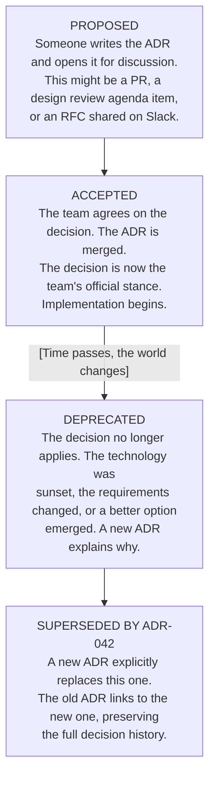
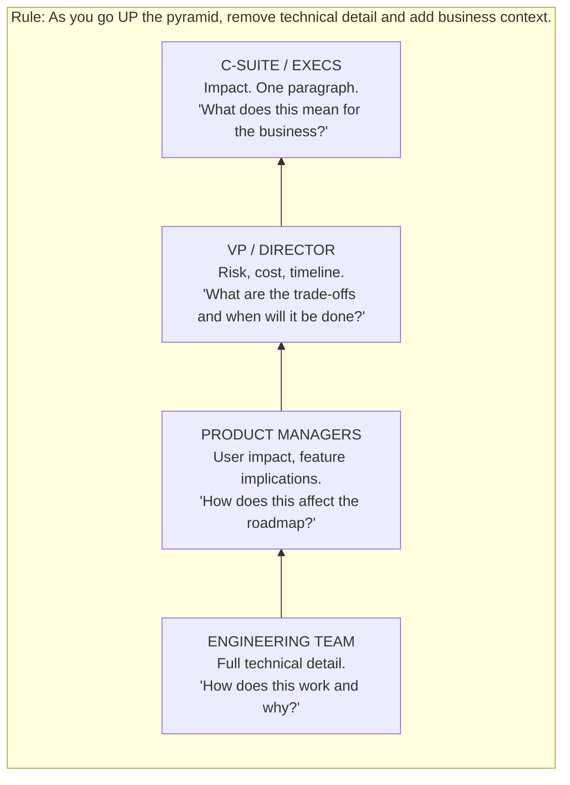
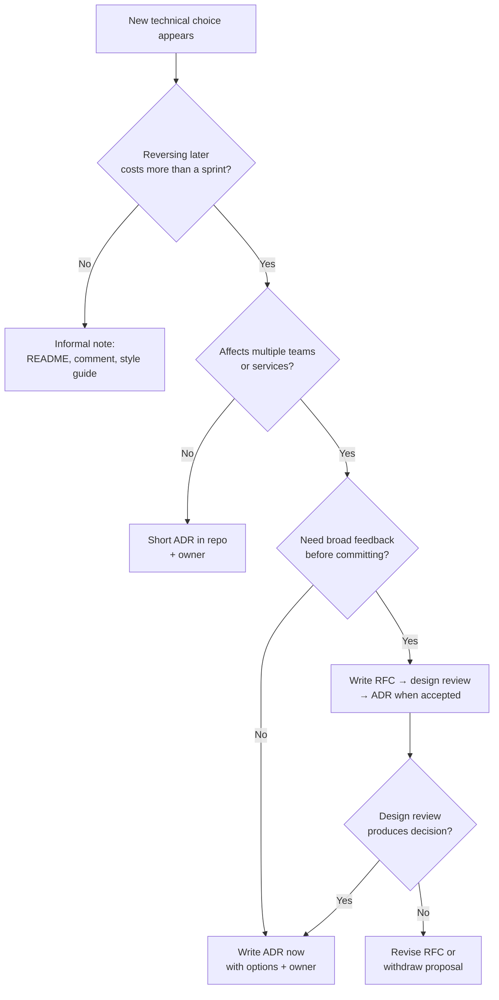

> **Complexity**: `[MEDIUM]` | **Time**: 2 hours | **Prerequisites**: System Design basics
>
> **Track**: Foundations / Engineering Leadership

## What You'll Be Able to Do

After completing this module, you will be able to:

- **Build** Architecture Decision Records that capture context, constraints, alternatives considered, and rationale in a format future engineers can act on without relitigating settled choices.
- **Design** a decision-documentation workflow that integrates with pull request and review rituals without adding empty ceremony that teams will ignore.
- **Evaluate** when a decision warrants an ADR, an RFC, or informal notes based on reversibility, blast radius, contention, and team size.
- **Apply** audience-aware technical writing so engineers, product partners, and executives each receive the decision information they actually need to act.
- **Run** design reviews that convert RFC discussion into accepted decisions and finalized ADRs with clear ownership and follow-through.

---

## Why This Module Matters

**Hypothetical scenario: the decision nobody remembers.** It is Thursday afternoon during sprint planning, and someone asks a reasonable question: "Why are we using RabbitMQ instead of Kafka?" The room goes quiet. Engineers exchange glances. The tech lead who made that decision left many months ago. Someone mutters that there might have been a chat thread about it. Another engineer searches the wiki and finds dozens of pages that mention messaging, yet none of them answer the question directly.

So the team does what many teams do in this situation: they relitigate the decision from scratch. Two senior engineers spend a week benchmarking. A third writes a comparison document. A director mentions a constraint nobody else knew about during a one-on-one. Several weeks later, they arrive at the same conclusion the previous tech lead reached---but they have burned substantial engineering time to get there.

> **Stop and think**: How many times in the last six months has your team debated a technical decision that was already settled a year ago? How much engineering time did that cost?

This happens constantly, not because engineers are careless, but because most organizations have no systematic way to record why decisions were made. They document what was built through API references, runbooks, and README files, yet they almost never document why the system was built that way. Architecture Decision Records fix that gap. They are one of the highest-leverage tools in engineering leadership, and a well-scoped ADR often takes roughly thirty minutes to draft once the team already understands the trade-offs.

This module teaches you how to write ADRs well and, more broadly, how to communicate technical decisions to different audiences, because the best decision in the world is worthless if nobody understands or remembers it when constraints change.

Every engineering team makes hundreds of decisions per quarter: which database to use, how to handle authentication, whether to build or buy, monolith or microservices, managed service or self-hosted. Most of these decisions are invisible. They live in chat threads that scroll away, in meeting notes nobody reads, and in the heads of engineers who eventually leave. When new team members join, they inherit a codebase full of choices they do not understand, and they respond in one of three predictable ways.

Some newcomers accept everything blindly and treat every pattern as intentional, which leads to cargo-cult engineering where rituals survive long after their reasons disappear. Others question everything constantly and burn time re-opening settled debates, which frustrates teammates who remember the original pain. Still others redo decisions from scratch because the absence of written rationale makes every old choice look arbitrary, which wastes months on problems the organization already solved once.

ADRs address all three failure modes by giving newcomers context, protecting institutional knowledge, and preventing decision amnesia when staff turnover or vendor churn reshapes the team. But ADRs are only one form of technical writing. The broader skill---communicating decisions clearly to different audiences---is what separates a strong individual contributor from an engineering leader who can align a whole organization around a technical direction.

You might need to explain the same messaging decision to your team with full technical depth and benchmark data, to your director with risk and timeline framing, and to an executive sponsor with a single paragraph about business impact. This module teaches the discipline of capturing and communicating those decisions effectively, starting with the durable ADR format and extending through RFCs, design reviews, and audience-aware summaries.

> **The Real Cost of Undocumented Decisions**
>
> When developers cannot reconstruct why a system looks the way it does, they spend a disproportionate share of their week on maintenance, archaeology, and rework rather than on new capability. Most teams underestimate how much engineer time goes to understanding existing systems rather than extending them cleanly—especially after staff turnover, vendor migrations, or undocumented pivots that never became ADRs. ADRs will not eliminate technical debt by themselves, but they dramatically reduce the cognitive overhead of working in a mature codebase because they preserve the reasoning that code alone cannot express.

---

## Module Map

We begin with the case for decision records because motivation determines whether a team will actually write them under delivery pressure. From there we walk through the standard ADR structure, the lifecycle states that keep history honest, and the audience pyramid that turns one technical decision into several purposeful messages. The middle of the module connects RFCs to ADRs and treats design reviews as the decision-making ritual that sits between proposal and record.

The second half focuses on durable writing habits: documenting why at scale, evaluating real examples, choosing tooling without letting tooling become the subject, and recognizing patterns that make decision documentation succeed or rot on the shelf. The hands-on exercise asks you to draft a complete ADR under realistic constraints so you can feel where ambiguity usually hides before a decision hardens into production architecture.

---

## Part 1: The Case for Decision Records

### What Decisions Deserve Recording?

Not every decision needs an ADR. You do not need one for choosing between `camelCase` and `snake_case`, because that belongs in a style guide with a short rationale and automated lint enforcement. You also do not need one for which CI/CD tool to use when your company already standardized on one platform-wide, unless the local team is explicitly deviating from that standard for a documented reason.

ADRs are for **architecturally significant decisions**---choices that are hard to reverse once implemented, cross-cutting across multiple teams or services, costly in engineering time or operational burden, or contentious enough that reasonable engineers disagreed at the time. The filter below is intentionally simple because teams under pressure need a fast heuristic, not a governance committee meeting before every pull request.

> **Pause and predict**: If you left your organization tomorrow, which three technical decisions would your team struggle to explain to your replacement? Those are your next three ADRs.

When a decision passes the significance filter, the ADR becomes the durable artifact that prevents the next team from paying the rediscovery tax. When it fails the filter, a comment, README note, or style-guide entry is usually enough, and forcing an ADR anyway teaches the organization that decision records are bureaucratic noise rather than useful memory.

```
DECISION SIGNIFICANCE FILTER
======================================================================

Ask these questions about a technical decision:

 1. Would reversing this cost more than a sprint?          → YES = ADR
 2. Does it affect more than one team or service?          → YES = ADR
 3. Will people ask "why did we do this?" in 6 months?     → YES = ADR
 4. Are there trade-offs that won't be obvious later?      → YES = ADR
 5. Did multiple engineers disagree on the approach?       → YES = ADR

If you answered YES to any of these, write an ADR.
If you answered YES to three or more, write it before implementation hardens the choice.
```

If you answered YES to any of these, write an ADR. If you answered YES to three or more, write it before implementation hardens the choice into data migrations, client SDKs, and on-call expectations that make reversal expensive.

The filter works because it encodes reversibility and blast radius, which are the two variables that most predict whether undocumented decisions will hurt you later. Reversible choices can be corrected cheaply in code review; irreversible choices become archaeology projects. Local choices affect one service; cross-cutting choices shape how dozens of engineers interpret "the way we do things here."

### Why Not Just Use Confluence/Notion/Google Docs?

You can store decision text in many systems, and non-engineering stakeholders often prefer wiki or document tools for readability. The argument for repository-native ADRs is not snobbery about markdown; it is about keeping decisions versioned alongside the systems they govern so that history, code, and rationale move together through review and release.

| Approach | Pros | Cons |
|----------|------|------|
| **ADRs in repo** (`docs/adr/`) | Versioned with code, survives tool changes, discoverable via grep, reviewed in PRs | Not accessible to non-engineers |
| **Wiki (Confluence/Notion)** | Accessible to everyone, rich formatting | Gets stale, hard to find, not versioned with code, dies when you switch tools |
| **Slack threads** | Fast, natural discussion | Disappears in weeks, unsearchable, no structure |
| **Google Docs** | Collaborative editing, comments | Disconnected from code, access control issues |

The recommendation is to **write the ADR in markdown in your repository**, and link to it from your wiki if non-technical stakeholders need access. Version control alignment matters because the decision and the code it governs should change together through review, not drift apart across separate systems with different retention policies.

Repository-native ADRs also survive vendor churn. Wikis get migrated, renamed, or permission-locked; chat logs expire; shared drives accumulate broken links. Markdown in git remains discoverable through search, blame, and pull request history, which is exactly the forensic trail you want when diagnosing why a subsystem looks unusual six quarters later.

> **Landscape snapshot — as of 2026-06. This changes fast; verify against vendor docs before relying on specifics.**

| Durable capability | adr-tools / MADR (git-native) | Log4brains (ADR + catalog UI) | Backstage ADR plugin | Confluence / Notion |
|--------------------|-------------------------------|-------------------------------|----------------------|---------------------|
| Store ADRs next to code | Native markdown in repo | Exports/syncs from repo | Reads repo paths | Separate wiki space |
| PR-based review | Standard git workflow | Depends on export flow | Via repo PRs | Page comments |
| Search across decisions | `rg`, git log, IDE | Web UI + repo | Developer portal | Wiki search |
| Non-engineer readability | Markdown render / export | Web UI | Portal docs | Rich wiki pages |
| Tool independence | High | Medium | Medium (portal coupling) | Low (platform coupling) |

Use the table to choose a **workflow**, not a winner. Many teams store canonical ADRs in git and mirror summaries elsewhere for stakeholders who never open a repository. The durable goal is discoverable decision memory, not universal agreement on a single SaaS tool.

For managed messaging platforms referenced later in this module, vendor SLAs and pricing models change frequently. As of 2026-06, [Amazon MSK](https://docs.aws.amazon.com/msk/latest/developerguide/msk-slis.html) documents a 99.9% monthly uptime SLA for multi-AZ clusters; verify current terms in provider documentation before embedding SLA assumptions in an ADR or RFC.

---

## Part 2: ADR Structure

### The Standard ADR Format

Michael Nygard proposed the original ADR format in 2011, and it has become the de facto standard across organizations that want lightweight architecture memory without a heavyweight governance process. The structure below is intentionally small because ADRs are decision logs, not design textbooks; the value is in disciplined thinking, not page count.

The MADR project and the broader ADR GitHub community have since standardized numbering, status fields, and markdown templates, but the durable spine remains Nygard's four questions: what forced the decision, what options existed, what did we choose, and what trade-offs did we accept?

```markdown
# ADR-NNN: Title of the Decision

## Status

[Proposed | Accepted | Deprecated | Superseded by ADR-042]

## Date

YYYY-MM-DD

## Context

What is the issue that we're seeing that is motivating this decision?
What are the forces at play? Technical constraints, business requirements,
team capabilities, timeline pressures?

## Options Considered

### Option 1: [Name]
Description, pros, cons, estimated effort.

### Option 2: [Name]
Description, pros, cons, estimated effort.

### Option 3: [Name]
Description, pros, cons, estimated effort.

## Decision

What is the change that we're proposing and/or doing?
State the decision clearly and unambiguously.

## Consequences

What becomes easier or harder as a result of this decision?
Both positive and negative consequences should be listed.
```

Let's break down each section in detail, because teams often treat the template as a checklist of headings rather than as a sequence of thinking steps. The quality of an ADR is determined by how honestly you answer each section, not by how quickly you fill in the markdown skeleton.

### Context: The "Why" Section

This is the most important section because it captures the forces that led to the decision: business requirements, technical constraints, team dynamics, and timeline pressures that shaped the choice. A future reader should understand not only what problem you faced, but also what would have been unreasonable to expect from the team at that moment.

**Hypothetical scenario:**
> Our order processing system currently uses synchronous HTTP calls between six microservices. During a recent peak sales event, cascading failures appeared when the inventory service slowed under load. Peak traffic is on the order of tens of thousands of orders per minute with a growth target within the next few quarters. The team has a handful of backend engineers, only some of whom have prior experience with high-throughput messaging. Infrastructure budget for messaging is a meaningful monthly line item but not unlimited.

The good version tells you why the decision is being made, what constraints exist, and what success looks like. Someone reading this two years later will understand the full picture even if the exact throughput numbers have changed, because the structural constraints remain legible.

### Options Considered: Show Your Work

List at least two or three options, including ones you rejected. This section is critical because it proves you did not simply pick a favorite technology, helps future engineers understand what was available at the time, and prevents re-evaluation of alternatives that were already considered and discarded for documented reasons.

For each option, capture enough detail that a skeptical new hire could understand why the team did not choose it without reopening a multi-week spike. Effort estimates can be rough, but they should be honest about skill gaps, operational load, and migration risk rather than pretending every path was equally cheap.

```
OPTION EVALUATION TEMPLATE
======================================================================

Option Name: [Technology/Approach]

  Description:   What is it? How would we use it?
  Pros:          What does it do well for our use case?
  Cons:          What are the downsides?
  Effort:        How long to implement? What skills needed?
  Cost:          Infrastructure, licensing, operational cost
  Risk:          What could go wrong?
  Team Fit:      Do we have the skills? Can we hire for it?
```

### Decision: Be Unambiguous

State the decision clearly and avoid hedging language that pretends the team has not committed yet. Do not say "we might" or "we are leaning toward" in an accepted ADR. Say "We will use X because Y," and mean it.

**Weak decision statement (too tentative):**
> We are going to try Kafka and see how it goes.

**Strong decision statement (committed and justified):**
> We will use managed Kafka for asynchronous event processing between order, inventory, and notification services. We chose managed Kafka over self-hosted deployment to reduce operational burden, accepting higher steady-state cost in exchange for automatic patching, scaling, and monitoring.

### Consequences: The Honest Part

Every decision has trade-offs, and the consequences section is where authors earn trust by documenting downsides openly. Teams that only list benefits teach readers to treat ADRs as marketing, which encourages the next engineer to ignore them. Teams that document operational cost, skill gaps, migration risk, and vendor coupling teach readers that the decision was taken seriously.

Negative consequences are especially important when the chosen option is the one the author preferred all along. Future maintainers need to know what pain was accepted intentionally so they do not "fix" the downside by undoing the decision without understanding why it existed.

Good consequences sections read like a frank postmortem written before the pain arrives. Split outcomes into categories that future operators will actually use: **operational** (who pages, what dashboards are required), **organizational** (training, hiring, cross-team coordination), **financial** (steady-state cost versus migration cost), and **architectural** (coupling, consistency models, failure modes you can no longer ignore). When two options look similar on a feature checklist, the consequences section is often where the real decision lives—one path may reduce broker operations while shifting schema-evolution risk to application teams, and both sides of that trade-off belong in writing.

If you are unsure whether a downside is worth listing, ask whether a reasonable engineer could treat it as a bug six months later. Eventual consistency, manual scaling steps, vendor-specific APIs, and "temporary" dual-write periods all qualify. The goal is not pessimism; it is informed ownership so the team that inherits the decision knows which problems were accepted as the price of the chosen benefits.

```
CONSEQUENCES TEMPLATE
======================================================================

POSITIVE:
  + Decouples services, reducing cascading failure risk
  + Enables replay of events for debugging and recovery
  + Scales horizontally for Black Friday load requirements

NEGATIVE:
  - Adds operational complexity (topic management, consumer groups)
  - Introduces eventual consistency (team must handle this in code)
  - Managed service costs more per hour than self-hosted alternatives at steady load
  - Vendor coupling for the managed control plane and operational tooling

RISKS:
  ! Team has limited Kafka experience (mitigated by managed service and pairing plan)
  ! Schema evolution could cause consumer breakage (mitigated by schema registry policy)
```

---

## Part 3: ADR Lifecycle

ADRs are not static documents. They have a lifecycle that mirrors how real organizations learn: proposals become accepted standards, standards become outdated as requirements shift, and outdated standards get superseded by better ones without pretending the past never happened.

Treating ADRs as immutable gospel is as harmful as deleting them. The lifecycle gives you vocabulary for change: proposed while debate is open, accepted when the team commits, deprecated when the world moved on, superseded when a specific replacement decision exists. That vocabulary keeps history readable instead of turning the docs folder into a graveyard of contradictions.



### Never Delete ADRs

This is a common mistake because overturned decisions feel embarrassing, and teams want a clean slate. That impulse is understandable and wrong. The old ADR is history. It explains why the previous approach was chosen, which helps people understand the current one and avoids repeating failures for opposite reasons.

When you supersede an ADR, link forward explicitly and summarize what changed in the environment: new scale, new compliance requirement, new team skill, new multi-cloud mandate. Future readers should see a chain of reasoning, not a sudden unexplained pivot.

Instead, mark the old ADR as `Superseded by ADR-042` and add a forward link at the top that tells readers which decision replaced it and why the environment changed enough to justify migration.

A healthy supersede lifecycle has four practical steps that teams often skip when they are rushing a migration. First, **freeze the old decision in place**: update status on the superseded ADR before the new system is fully live, so nobody treats the replacement as unofficial. Second, **write the replacement ADR with explicit backward links**: the new record should summarize what changed in constraints—scale, compliance, staffing, multi-cloud mandates—not merely announce a new tool. Third, **update the index and inbound links**: search for references to the old ADR in runbooks, README files, and pull request templates so newcomers do not follow dead reasoning. Fourth, **schedule a short deprecation window** when both systems coexist: note dual-write or strangler patterns in the superseding ADR so operators know which record is authoritative during the transition.

Supersede chains also help auditors and staff engineers reconstruct evolution without blame. The old ADR explains why Kafka made sense under AWS-only assumptions; the new ADR explains why Pulsar or another broker became necessary when multi-cloud replication entered scope. Readers see progression, not contradiction.

Keep ADRs in a dedicated directory so discovery stays predictable. A common layout places numbered markdown files under `docs/adr/` with a template file new authors can copy. Consistent numbering matters more than clever naming because engineers will reference decisions in pull requests, runbooks, and incident timelines.

The index README acts as the human-friendly entry point: a table of ADR number, title, status, and date lets staff engineers and auditors scan decision history without learning your folder naming scheme first.

```
docs/
└── adr/
    ├── README.md              # Index of all ADRs with status
    ├── 001-use-postgresql.md
    ├── 002-event-driven-architecture.md
    ├── 003-managed-kafka.md
    ├── 004-graphql-api.md
    └── template.md            # Blank template for new ADRs
```

When superseding a decision, update status in both the old and new files:

```markdown
## Status

**Superseded by ADR-042: Migration to Apache Pulsar**

> This ADR documented our earlier decision to use managed Kafka. We migrated
> after multi-cloud requirements emerged. See ADR-042 for the replacement decision.
```

Example index table for `docs/adr/README.md`:

```markdown
# Architecture Decision Records

| ADR | Title | Status | Date |
|-----|-------|--------|------|
| 001 | Use PostgreSQL for primary data store | Accepted | 2023-03-15 |
| 002 | Adopt event-driven architecture | Accepted | 2023-06-01 |
| 003 | Use managed Kafka for messaging | Superseded by 007 | 2023-08-20 |
| 004 | GraphQL for public API | Accepted | 2023-11-10 |
```

---

## Part 4: Writing for Different Audiences

An ADR is written primarily for engineers who will maintain the system, but the same decision often needs to be communicated to product managers, directors, and executives. The information is largely the same; the framing changes completely because each audience optimizes for different decisions and different risks.

The audience pyramid is not about hiding truth from executives. It is about translating truth into the decision language each layer can act on. Engineers need mechanism and trade-offs. Product partners need roadmap and customer impact. Directors need risk, staffing, and timeline. Executives need a concise statement of business consequence and strategic alignment.

### The Audience Pyramid



### Same Decision, Four Audiences

**Hypothetical scenario: same decision, four audiences.** Suppose your team decided to migrate from a monolithic API to smaller services communicating through asynchronous events. The technical ADR would describe service boundaries, event contracts, deployment independence, and failure isolation. The product-facing summary would emphasize that notification features can ship without risking core order flow. The director-facing summary would connect deployment risk and incident history to the investment timeline. The executive summary would state that independent shipping removes a quarterly bottleneck for customer-visible features.

Each version should remain factually consistent. If the executive summary promises payback within one quarter, the engineering ADR should contain the assumptions that justify that claim, or the executive summary should soften the promise.

### The "So What?" Test

Before sending any technical communication upward or outward, apply the **"So what?" test** by asking what changes for customers, revenue, risk, or delivery speed if the recipient accepts your update as true.

Every communication to a non-technical audience should lead with the "so what" answer rather than the mechanism. Mechanism belongs in the appendix, the ADR, or the follow-up thread for engineers who must implement the decision.

> **Stop and think**: Look at the last technical email or Slack update you sent to a product manager. Did it lead with the 'So what?' or did it bury the business impact under technical details?

---

## Part 5: The RFC Process

### ADRs vs RFCs

ADRs and RFCs serve different purposes but complement each other in a healthy decision workflow. An RFC invites debate while uncertainty is still cheap; an ADR records the outcome once the team is ready to commit. Confusing the two creates either premature certainty or endless relitigation.

Think of the RFC as the discussion artifact and the ADR as the conclusion artifact. Large organizations often add structured design-doc reviews or architecture review boards between those stages, but the durable pattern is the same: propose in a document meant for feedback, decide in a forum with explicit ownership, record in a short durable log tied to the codebase.

| Aspect | ADR | RFC |
|--------|-----|-----|
| **Purpose** | Record a decision | Propose a change and solicit feedback |
| **Timing** | Written when decision is made (or shortly after) | Written before work begins |
| **Length** | 1-2 pages | 3-15 pages |
| **Audience** | Future engineers | Current team + stakeholders |
| **Tone** | Declarative ("We decided...") | Propositional ("I propose...") |
| **Approval** | Team consensus or tech lead decision | Formal review process |

Think of it this way: an RFC is the discussion artifact, and the ADR is the conclusion artifact. Large organizations often add structured design-doc reviews or architecture review boards between those stages, but the durable pattern is unchanged. Propose in a document meant for feedback, decide in a forum with explicit ownership, record in a short durable log tied to the codebase.

RFCs reward breadth because stakeholders need enough detail to spot integration risks, migration hazards, and operational gaps before implementation begins. That does not mean every RFC must become a novel. It means the author must show their reasoning clearly enough that reviewers can disagree on specifics rather than guessing hidden assumptions. When the RFC stabilizes, distill the outcome into one or more ADRs that future engineers can read without wading through the entire comment thread history.

### RFC Structure

A good RFC includes the sections below because each section answers a question reviewers will ask anyway. Summary and motivation establish urgency. Detailed design exposes interfaces and failure modes. Alternatives prevent the proposal from feeling like a foregone conclusion. Migration plan and open questions demonstrate operational seriousness rather than slide-deck optimism.

```markdown
# RFC: [Title]

**Author**: [Name]
**Date**: YYYY-MM-DD
**Status**: [Draft | In Review | Accepted | Rejected | Withdrawn]
**Reviewers**: [Names of people whose input is required]

## Summary
One paragraph. What are you proposing and why?

## Motivation
Why is this needed? What problem does it solve?
Include data: error rates, customer complaints, engineering hours wasted.

## Detailed Design
The technical proposal. Architecture diagrams, API contracts,
data models, sequence diagrams. This is the meat of the RFC.

## Alternatives Considered
What else could we do? Why is this proposal better?

## Migration Plan
How do we get from here to there? What's the rollout strategy?
How do we roll back if things go wrong?

## Open Questions
What haven't you figured out yet? What do you need input on?
Being honest about unknowns builds trust.

## Timeline
Rough estimate of effort and milestones.
```

### Running Effective Design Reviews

The RFC is the document. The design review is the meeting where a team converts written proposal into an owned decision. Done well, design reviews reduce surprise, surface constraints early, and produce ADRs that reflect real consensus rather than the loudest voice in the room. Done poorly, they become slide presentations where nobody read the doc, contentious details eat the entire hour, and the team leaves with more opinions but no clearer decision owner.

Effective design reviews share a few durable habits regardless of whether your organization calls them architecture reviews, technical deep dives, or RFC readouts. First, distribute the document early enough for async comment; second, optimize the live time for unresolved trade-offs rather than re-reading background; third, end with explicit decisions, owners, and follow-up artifacts rather than a vague sense that "we should keep talking."

```
DESIGN REVIEW BEST PRACTICES
======================================================================

BEFORE THE MEETING:
  - Share the RFC at least 2 business days before the review
  - Ask reviewers to leave async comments first
  - Identify the 2-3 most contentious decisions to focus on

DURING THE MEETING:
  - Don't read the RFC aloud (everyone should have read it)
  - Start with: "What questions do you have?"
  - Focus on trade-offs, not preferences
  - Time-box to 45 minutes (30 discussion + 15 decisions)
  - Assign someone to take notes on decisions made

AFTER THE MEETING:
  - Update the RFC with decisions and rationale
  - Write the ADR(s) capturing final decisions
  - Share the outcome with stakeholders

ANTI-PATTERNS TO AVOID:
  ✗ Bikeshedding (arguing about trivial details)
  ✗ "Let me present for 40 minutes" (it's a discussion, not a lecture)
  ✗ Design-by-committee (someone must own the decision)
  ✗ Blocking on perfection (good enough now > perfect later)
```

The before-meeting phase is where most design reviews are won or lost. When reviewers arrive cold, the meeting defaults to oral summary and status performance, which favors confident speakers over accurate analysis. Async comments flip the dynamic: introverts, remote staff, and subject-matter experts in adjacent teams can flag risks without fighting for airtime. The facilitator's job is to cluster those comments into the few decisions that actually require synchronous debate.

During the meeting, prefer questions over presentations. If a reviewer asks for a detail that is already in the RFC, point to the section and move on; that habit trains the room to read. When trade-offs are genuinely hard, name the decision owner explicitly. Committees can inform, but they cannot own operational consequences; someone must accept pager, staffing, and migration responsibility or the decision is not real yet.

Facilitation mechanics matter as much as agenda design. Open with the two or three decisions that async comments flagged as unresolved, not with a recap of background everyone already read. Use a visible decision log during the meeting—accepted, rejected, deferred with owner—and read it back in the last five minutes so participants confirm what was actually decided versus what was merely debated. When disagreement persists, prefer **time-boxed deferral** with a named spike owner and review date over fake consensus; deferred items belong in the RFC's Open Questions section, not silently omitted from the eventual ADR. If a senior voice dominates airtime, redirect to written comments already on the doc and ask quieter reviewers whether their concerns were addressed.

After the meeting, the workflow closes the loop. Update the RFC status, publish the ADR with accepted status, and broadcast a short summary to stakeholders who did not attend. Without that closure, the same debate reappears in sprint planning two weeks later because half the organization never learned the decision happened.

Google's public engineering-practices guidance emphasizes design documents and structured code review for proposals at scale. That is separate from Abseil's code-readability review, which is a knowledge-sharing program for idiomatic code—not an RFC or design-doc approval stage. Many large organizations describe a similar written-proposal → structured critique → recorded outcome pattern under names like design-doc review or architecture review board. Oxide's RFD process and other RFC cultures differ in naming and numbering, but the durable idea is identical---make thinking cheap before code makes it expensive.

---

## Part 6: Documenting "Why" Over "What"

### Code Tells You What. Comments Tell You Why. ADRs Tell You Why at Scale.

This principle applies at every level of technical communication, from inline comments through runbooks, RFCs, and ADRs. Code shows behavior; comments explain local exceptions; ADRs explain systemic choices that shape many files and services at once. When teams skip the why layer, they optimize for short-term velocity and pay compounding interest every time a new engineer touches the system.

The future engineer test is a practical quality gate. Smart newcomers can read what the system does, but they cannot infer organizational history from syntax alone. Your documentation should let them reconstruct the decision environment fairly: what was known, what was uncertain, what was rejected, and what pain the team was trying to avoid.

```python
# BAD: Comment says what the code does (I can read the code)
# Retry 3 times with exponential backoff
for i in range(3):
    try:
        response = call_api()
        break
    except TimeoutError:
        time.sleep(2 ** i)

# GOOD: Comment says WHY (I can't read your mind)
# The payment gateway rate-limits aggressive retries.
# After a production incident, we found that exponential backoff
# with max 3 retries keeps us under their published rate threshold.
for i in range(3):
    try:
        response = call_api()
        break
    except TimeoutError:
        time.sleep(2 ** i)
```

The same principle applies to ADRs. Don't just document *what* you chose. Document *why* you chose it, *what you rejected*, and *what trade-offs you accepted*.

### The "Future Engineer" Test

When writing any technical document, imagine someone joining your team in eighteen months. They are skilled, but they do not know your history, your past incidents, or the political constraints that shaped a compromise. If they cannot answer the four questions below, your documentation is incomplete no matter how polished it looks.

1. Will they understand *what* we decided? (The easy part)
2. Will they understand *why* we decided it? (The hard part)
3. Will they know *what alternatives were considered*? (Prevents re-litigation)
4. Will they understand *what constraints existed* at the time? (Prevents unfair criticism)

If the answer to any of these is "no," your documentation is incomplete.

---

## Part 7: Worked Hypothetical ADR Examples

The examples below are **templates**, not transcripts from a specific company. They show how context, options, decision, and consequences read when the author resists the urge to sanitize trade-offs. Notice how each example spends more words on constraints and rejected paths than on celebrating the final choice—that balance is what makes ADRs trustworthy.

When you adapt these templates, replace illustrative numbers with your team's real measurements where you have them, and label hypotheticals explicitly when you do not. An ADR that pretends to precision it does not possess will age badly and teach readers to ignore your docs.

### Example 1: Database Selection

**Hypothetical scenario:** A profile service with relational data, moderate read/write volume, and a team that already knows PostgreSQL but not a key-value store.

```markdown
# ADR-012: Use PostgreSQL with Read Replicas Instead of DynamoDB

## Status
Accepted

## Date
YYYY-MM-DD

## Context
Our user profile service handles on the order of thousands of reads per
second and hundreds of writes per second at current load. Growth
projections suggest roughly 5× read volume within the next year. The
team (a small backend group) has deep PostgreSQL expertise but no
DynamoDB experience. Our data model includes complex relationships
(users → organizations → roles → permissions) that benefit from JOIN
operations.

We evaluated options after leadership asked for a scaling plan ahead
of a major customer rollout.

## Options Considered

### Option 1: DynamoDB
- Fully managed, scales automatically
- Pay-per-request pricing is competitive at moderate scale but shifts with access patterns
- Requires denormalizing our relational data model
- Team would need 2-3 months to become proficient
- No JOIN support; complex queries require application-level logic

### Option 2: PostgreSQL with Read Replicas
- Team already proficient; no ramp-up time
- RDS managed instances with read replicas fit relational scaling with manual replica planning
- Handles our relational data model naturally
- Read replicas handle read scaling to 50,000 reads/sec
- Requires manual scaling decisions (add/remove replicas)

### Option 3: CockroachDB
- Distributed SQL; scales horizontally
- Compatible with PostgreSQL wire protocol
- Managed service pricing and ops model differ from PostgreSQL-on-RDS; learning curve required
- Team would need 1 month to learn operational differences
- Overkill for our current and projected scale

## Decision
We will use PostgreSQL on AWS RDS with read replicas.

Our data model is inherently relational, and the team's PostgreSQL
expertise means we can ship the scaling improvements in 2 weeks
instead of the 2-3 months DynamoDB would require. Read replicas
give us 10x headroom on reads, which covers our 12-month projection.

## Consequences
+ Team ships immediately with no learning curve
+ Relational queries remain simple and maintainable
+ Cost-effective at current and projected scale
- We accept manual scaling decisions (adding read replicas)
- If we exceed 50,000 reads/sec, we'll need to re-evaluate
- Single-region limitation with RDS (acceptable for now)
```

### Example 2: API Paradigm

**Hypothetical scenario:** A platform with many internal services and a public API where integrators request widely varying field subsets.

```markdown
# ADR-018: Use REST for Internal APIs, GraphQL for Public API

## Status
Accepted

## Date
YYYY-MM-DD

## Context
We maintain roughly a dozen internal microservices and a public API
consumed by many third-party integrators. Internal services need
simple, predictable communication. External consumers have diverse
data needs---some need full user profiles, others need just email
and name.

Our current REST API forces external consumers to make several calls
to assemble data that could be fetched in one GraphQL query.
Integrator feedback about API inefficiency has increased over recent
quarters.

## Decision
Internal services will continue using REST with OpenAPI specs.
The public-facing API will add a GraphQL layer backed by the existing REST services.

## Consequences
+ External consumers get flexible data fetching (reduced API calls)
+ Internal services remain simple and well-understood
+ GraphQL layer acts as a BFF (Backend for Frontend), insulating
  internal changes from external consumers
- Team must learn and maintain GraphQL (training budget approved)
- Two API paradigms to document and support
- GraphQL introduces query complexity risks (mitigated by depth limiting)
```

Strong ADR examples share a rhythm: context explains forces, options prove the decision was not arbitrary, the decision sentence is unambiguous, and consequences include at least one downside the team knowingly accepted. Copy that rhythm even when your subject area differs completely from databases or API paradigms.

---

## Part 8: Integrating ADRs into Daily Engineering Workflow

Decision records fail when they live in a parallel universe that pull requests never touch. The durable pattern is to treat ADRs as part of shipping software, not as homework for staff engineers after the fact. When a change introduces or implements an architecturally significant choice, the ADR should appear in the same review window as the code that embodies it, so reviewers can ask whether the implementation matches the stated trade-offs.

A practical workflow looks boring on purpose. During RFC review, capture open questions and alternatives in the proposal document. At design review closure, assign an owner and convert accepted decisions into ADRs with status `Accepted`. During implementation, link the ADR from the pull request description and from module README files affected by the change. During onboarding, point new engineers at the ADR index before they ask why the messaging layer looks unusual compared to their previous company.

Pull request integration also creates accountability for consequences. If an ADR lists operational risks, reviewers can ask where runbooks, dashboards, or migration steps live. If an ADR claims a managed service reduces ops load, reviewers can ask who still owns consumer lag, schema compatibility, and replay procedures. The ADR becomes a contract between the decision maker and the team that inherits pager responsibility.

Numbering tools such as MADR templates or adr-tools-style helpers reduce friction by generating the next ADR filename and stub sections automatically. Those tools are optional; the non-optional part is cultural. Teams that reward fast merges without decision memory get fast merges and slow archaeology. Teams that reward concise ADRs tied to merged work get compounding clarity without heavyweight governance boards.

Technical writing quality improves when you revise for audience after drafting for truth. Draft the ADR for accuracy first: context, options, decision, consequences without marketing language. Then produce derivative summaries for product and leadership audiences by rewriting the opening paragraph and risk section, not by dumbing down the engineering record. The ADR stays the source of truth; the summaries are views on that truth.

Finally, schedule lightweight ADR hygiene quarterly. Scan for records stuck in `Proposed`, decisions that clearly shipped without status updates, and supersede links that point at deleted branches. Hygiene sessions are short if ADRs stayed small and linked from PRs; they are painful if the team treated documentation as a one-time migration project. The goal is trustworthy memory that reduces relitigation and protects engineers from repeating expensive debates.

---

## Decision Framework: ADR, RFC, or Informal Note?

Use this flow when a technical choice appears during planning. The goal is right-sized documentation: enough memory to prevent expensive rediscovery, not so much process that teams hide decisions in chat to avoid paperwork.



The flow encodes two durable ideas. First, reversibility and blast radius determine memory needs more reliably than technology fashion. Second, RFCs belong **before** commitment when disagreement is likely or stakeholders are numerous; ADRs belong **when** the team is ready to stand behind a choice. If you skip straight to an ADR while debate is still open, people read accepted status as fake certainty. If you never write an ADR after a design review, the meeting notes become the institutional memory—and meeting notes rarely survive reorganizations.

---

## Patterns & Anti-Patterns

Decision documentation quality shows up as patterns long before it shows up in architecture metrics. Healthy teams repeat a small set of behaviors: they capture context while it is fresh, show rejected options honestly, integrate docs into review workflows, and supersede rather than erase. Unhealthy teams also repeat patterns: they write post-hoc justifications, hide trade-offs, let proposed ADRs rot, or migrate decisions into wikis where they drift away from code.

| Pattern | Why It Works | What It Looks Like |
|---------|--------------|-------------------|
| **Context-first writing** | Preserves constraints that code cannot express | ADR opens with forces, scale, risks, and deadlines—not the final technology name |
| **Options with rejection reasons** | Prevents expensive re-spikes of discarded paths | At least two alternatives with explicit why-not reasoning |
| **Review-integrated records** | Keeps decisions aligned with implementation | ADR merged via PR alongside code that implements it |
| **Supersede chains** | Makes evolution readable | Old ADR links forward; new ADR summarizes what changed in the environment |
| **Audience-tier summaries** | Aligns stakeholders without duplicating full ADRs | One technical ADR plus short product/executive summaries derived from it |

| Anti-Pattern | Why It's Dangerous | Better Approach |
|--------------|-------------------|-----------------|
| **Post-hoc justification ADR** | Teaches teams that ADRs are theater | Write during decision week; capture open questions in RFC first |
| **Single-option ADR** | Invites relitigation | Document status quo and credible alternatives, even if one looks obvious |
| **Wiki-only decision memory** | Breaks version alignment with code | Canonical ADR in git; mirror summary elsewhere if needed |
| **Lecture design review** | Rewards presenters, not readers | Async comments first; live time for unresolved trade-offs only |
| **Accepted status without owner** | Leaves ambiguity about who mitigates consequences | Name decision owner and operational responsibilities in ADR |
| **Ten-page ADR** | Becomes write-only documentation | Keep ADR short; link RFC for depth |

These patterns are diagnostic. If your ADRs are polished but ignored, the problem may be ADR fatigue from recording trivial choices. If your RFCs are lively but nothing ever becomes accepted, the problem is missing decision ownership at design review closure. Debug the workflow the same way you debug software, with explicit owners and measurable follow-through rather than hope.

---

## Did You Know?

- **Michael Nygard** published the original ADR format in November 2011 in a short blog post that defined status, context, decision, and consequences. The post is intentionally minimal; the community additions (options considered, supersede links, numbering) came later through practice rather than upfront standards committees.

- **ThoughtWorks Technology Radar** has listed lightweight Architecture Decision Records as a recommended technique, reflecting years of field experience that small decision logs outperform heavyweight architecture document repositories for agile teams.

- **Amazon's narrative memo culture** replaces slide decks for many decision meetings with written prose read silently before discussion. Jeff Bezos described the practice in Amazon's [2017 letter to shareholders](https://www.aboutamazon.com/news/company-news/2017-letter-to-shareholders) as a way to force clearer thinking than bullet-oriented presentations allow.

- **Google's public engineering practices** treat design documents and structured code review as core mechanisms for sharing technical proposals before implementation scales. Abseil's separate code-readability program helps engineers learn idiomatic patterns—it is not a substitute for design-doc review.

---

## Common Mistakes

| Mistake | Why It's a Problem | Better Approach |
|---------|-------------------|-----------------|
| **Writing ADRs after the fact as an afterthought** | Context and reasoning are forgotten; the ADR becomes a hollow justification | Write the ADR during or immediately after the decision. The discussion is freshest then. |
| **Listing only the chosen option** | Future engineers don't know what was considered and re-evaluate from scratch | Always include 2-3 alternatives with honest pros/cons for each. |
| **Omitting negative consequences** | Erodes trust; makes ADRs feel like marketing documents | List trade-offs honestly. Every decision has downsides---acknowledge them. |
| **Making ADRs too long** | Nobody reads 10-page ADRs. They become write-only documents. | Keep ADRs to 1-2 pages. Move detailed analysis to appendices or linked RFCs. |
| **No clear owner or approval process** | ADRs rot in "Proposed" status forever because nobody is responsible for driving them to acceptance | Assign an owner to each ADR. Set a review deadline (1-2 weeks). |
| **Deleting superseded ADRs** | Destroys decision history. Future engineers lose context about why the previous approach was abandoned. | Mark as "Superseded by ADR-042" and keep the file. It is an archive, not a wiki. |
| **Using ADRs for non-architectural decisions** | Dilutes the value. Teams get ADR fatigue and stop reading them. | Reserve ADRs for significant, hard-to-reverse decisions. Use style guides, runbooks, and READMEs for everything else. |
| **Writing for yourself instead of your audience** | You understand the jargon and context today. Your reader in 18 months will not. | Apply the "Future Engineer" test. Write for someone smart but new to the team. |

---

## Quiz

Test your understanding of ADRs and technical writing.

**Question 1:** You are drafting a decision record for adopting GraphQL. A colleague reviews it and notes that you only included the final choice and the code changes required. Based on the standard ADR format, what critical structural components are missing from your document, and what risk does this create?

<details>
<summary>Show Answer</summary>

You are missing the **Context**, **Options Considered**, and **Consequences** sections. Without the Context, future engineers will not understand the business or technical constraints that forced this decision at this specific time. Omitting the Options Considered means the team will likely relitigate discarded alternatives (like gRPC or REST) because there is no proof they were evaluated. Finally, failing to list Consequences (especially negative ones) creates a false sense of perfection and leaves future maintainers unprepared for the architectural trade-offs they will inherit.
</details>

**Question 2:** Your team decided to use Redis for caching 2 years ago. Now you're migrating to Memcached. What should you do with the original Redis ADR?

<details>
<summary>Show Answer</summary>

You should absolutely **not delete the original ADR**. Instead, you must mark it as "Superseded by ADR-042" (pointing to the new Memcached ADR) and leave it in the repository as a historical artifact. ADRs are meant to capture the point-in-time reasoning of the engineering team, and deleting them destroys the context of why the system evolved the way it did. By preserving the old document, you help future engineers understand the prior constraints, scale limits, or team capabilities that originally justified Redis before the migration became necessary.
</details>

**Question 3:** You need to explain a database migration to your CEO. Which of these approaches is better and why?

A) "We're migrating from MySQL 5.7 to PostgreSQL 16 because MySQL's query optimizer doesn't support hash joins and our analytical workloads require better parallel query execution."

B) "We're switching databases to handle 10x more reporting queries without slowing down the product. This supports the enterprise sales push by enabling the real-time dashboards large customers are requesting."

<details>
<summary>Show Answer</summary>

**Option B is the correct approach.** The CEO operates at the business and strategic level, so they care primarily about market impact, customer features, and organizational risk rather than query optimizer internals. Option A provides technical details that are entirely irrelevant to the CEO's decision-making context, likely causing confusion or lost attention. By using Option B, you successfully apply the "So What?" test, translating a highly technical migration into the direct business value (enterprise sales and real-time dashboards) that justifies the engineering investment.
</details>

**Question 4:** Your team is planning a major overhaul of the authentication system. A senior engineer says, "I'll go write an ADR so we can get everyone's feedback on the design before we start." What is conceptually wrong with this statement, and what document should they be writing instead?

<details>
<summary>Show Answer</summary>

The engineer is confusing the purpose of an ADR with that of an **RFC (Request for Comments)**. An ADR is intended to be a historical record written *after* or exactly *when* a decision is finalized, serving as a permanent log of the outcome. An RFC, on the other hand, is a propositional document written *before* any work begins specifically to propose a design and solicit the very feedback the engineer is looking for. Using an ADR to gather feedback creates confusion about whether the decision is still up for debate or already settled policy.
</details>

**Question 5:** Your company has just adopted a new enterprise wiki, and the PMO director proposes migrating all architecture documentation, including ADRs, out of the Git repositories and into the new wiki to 'centralize knowledge.' As a technical lead, you need to defend keeping ADRs in the code repository. What are the primary architectural and operational reasons you would use to justify keeping ADRs versioned with the codebase rather than in the wiki?

<details>
<summary>Show Answer</summary>

The most critical reason is **version control alignment**. Keeping ADRs in the repository ensures they are versioned alongside the exact code they describe, allowing developers to see the specific decisions in effect at any historical commit. Secondly, this practice ensures **durability and tool independence**. Corporate wikis change frequently, often resulting in broken links and lost history, whereas markdown files in a Git repository will survive indefinitely regardless of the SaaS tools the company adopts. Finally, keeping them in the repository allows them to go through the standard Pull Request review process, tightly integrating architectural decisions into the existing engineering workflow.
</details>

**Question 6:** You are writing an ADR for adopting a specific CI/CD tool, but you can only think of one option because it seems completely obvious. How should you handle the "Options Considered" section?

<details>
<summary>Show Answer</summary>

If you genuinely believe there is only one viable option, you still must document the alternatives you implicitly rejected and explain exactly why they were eliminated. At a minimum, you should evaluate the "Do nothing" (status quo) approach or a direct market competitor to prove that your "obvious" choice holds up under scrutiny. Documenting this reasoning is critical because what seems obvious to you today will not be obvious to a new hire in two years. Providing these discarded options prevents future teams from wasting time investigating alternatives you already knew were insufficient.
</details>

**Question 7:** You are presenting a proposal to containerize the legacy monolith to the Product Management team. You plan to spend 15 minutes explaining how Docker namespaces and cgroups work. What communication framework are you violating, and how should you adjust your presentation?

<details>
<summary>Show Answer</summary>

You are violating the **"So What?" test** and failing to adapt your message to the appropriate audience tier. Product managers are focused on user impact, feature delivery, and roadmap implications, not the low-level kernel primitives that make containerization possible. You should adjust your presentation to focus entirely on the outcomes: how containerization will reduce deployment times from hours to minutes, eliminate "it works on my machine" bugs, and ultimately allow the product team to ship features significantly faster and with greater reliability. By diving into technical implementations without explaining the business value, you risk losing their attention and failing to secure buy-in for the project.
</details>

**Question 8:** You scheduled a one-hour design review for a new RFC, but async comments show reviewers still disagree about two trade-offs. During the meeting, one senior engineer begins reading the RFC slide-by-slide. What effective design review practices are being violated, and how should you redirect the session?

<details>
<summary>Answer</summary>

The session violates **async-first preparation** and **discussion-not-lecture** design review practice. Reviewers should arrive having read the RFC; live time should focus on the unresolved trade-offs, not an oral reread of background material. Redirect by stopping the slide walkthrough, restating the two open decisions explicitly, assigning a decision owner for each, and time-boxing debate to reach accepted, rejected, or deferred outcomes. Close by updating the RFC, writing the ADR with accepted status, and sharing a short summary with stakeholders who were not in the room.
</details>

---

## Hands-On Exercise: Draft an ADR

### Scenario

**Hypothetical scenario:** Your team runs an event-driven e-commerce platform on Kubernetes. The current RabbitMQ cluster struggles under load during peak sales events such as seasonal promotions. Messages are being dropped, consumers cannot keep up, and the operations team spends significant time managing the cluster manually.

You need to decide between managed Kafka on your cloud provider versus self-hosted Kafka on Kubernetes using an operator such as Strimzi. Both paths can work; the ADR should reveal which organizational constraint breaks the tie.

**Constraints for your ADR (illustrative numbers):** six engineers with mixed Kafka experience, rising event volume over the next year, a fixed monthly infrastructure envelope, AWS-only infrastructure today, at least seven-day retention for replay, and a high-availability target appropriate to order processing.

### Your Task

Write a complete ADR using the standard format. Your document must include a context section that explains the current failure mode and success criteria, an options section that compares both paths with honest pros and cons, a clear decision with rationale, and a consequences section that lists positive and negative outcomes including operational ownership.

When evaluating trade-offs, consider operational cost versus control, scaling responsibility, skills required on-call, portability across environments, reliability assumptions, and how each option fits the budget envelope at projected load.

```
TRADE-OFF ANALYSIS FRAMEWORK
======================================================================

 Dimension          AWS MSK               Self-Hosted (Strimzi)
 ─────────────────────────────────────────────────────────────────
 Operational Cost   Managed service        Lower platform spend but
                    shifts broker          team owns broker upgrades,
                    patching, scaling,     patches, capacity planning,
                    and broker ops to      and partition management
                    vendor; teams still
                    own topics, schemas,
                    consumer lag, quotas,
                    and incident response

 Control            AWS manages broker     Full control over
                    config, limited        configuration, tuning,
                    customization          and version

 Scaling            AWS handles broker     Team must plan and
                    execute scaling        operations manually
                    partition scaling      

 Skills Required    Kafka application      Kafka application +
                    knowledge only         Kafka operations +
                                           Strimzi operator

 Vendor Lock-in     Tied to AWS MSK        Portable across any
                    (MSK-specific APIs)    Kubernetes cluster

 Reliability        Vendor-published SLA   Depends on your team's
                    for managed broker;    operational maturity and
                    verify current terms   on-call coverage
                    (see Landscape snapshot)

 Cost at Scale      Higher managed cost    Lower infra cost but
                    at projected load      higher engineering ops load
```

Writing the ADR for this scenario forces you to make implicit preferences explicit: operational simplicity versus control, vendor-managed reliability versus in-house Kubernetes expertise, and budget headroom versus engineering attention during peak season. Strong ADRs name which constraint was decisive when options look close on paper.

### Success Criteria

- [ ] ADR follows the standard format (Status, Date, Context, Options, Decision, Consequences)
- [ ] Context section explains the current problem with specific numbers
- [ ] At least 2 options are evaluated with honest pros and cons
- [ ] Decision is clear, unambiguous, and justified
- [ ] Consequences include both positive and negative outcomes
- [ ] A non-technical reader could understand *why* the decision was made (even if not the technical details)
- [ ] The ADR is 1-2 pages (not a 10-page novel)

### Stretch Goals

- Write a 3-sentence summary of the decision for your VP of Engineering (focus on cost and risk)
- Write a 1-sentence summary for the CTO (focus on business impact)
- Identify which consequence is most likely to cause problems in 12 months

---

## Sources

- [Documenting Architecture Decisions — Michael Nygard (2011)](https://cognitect.com/blog/2011/11/15/documenting-architecture-decisions)
- [ADR GitHub Organization](https://adr.github.io/)
- [MADR — Markdown Any Decision Records](https://github.com/adr/madr)
- [ThoughtWorks Technology Radar: Lightweight Architecture Decision Records](https://www.thoughtworks.com/radar/techniques/lightweight-architecture-decision-records)
- [Architecture Decision Record resources — Joel Parker Henderson](https://github.com/joelparkerhenderson/architecture-decision-record)
- [Google Engineering Practices Documentation](https://google.github.io/eng-practices/)
- [Design Docs at Google — industrial empathy summary](https://www.industrialempathy.com/posts/design-docs-at-google/)
- [Oxide RFD Process (public RFC culture example)](https://rfd.shared.oxide.computer/)
- [arc42 — Architecture Documentation Template](https://docs.arc42.org/)
- [C4 Model for Visualising Software Architecture](https://c4model.com/)
- [Write the Docs — Documentation Style Guides](https://www.writethedocs.org/guide/writing/style-guides/)
- [StaffEng — Work on What Matters (Will Larson)](https://staffeng.com/guides/work-on-what-matters/)
- [Software Engineering at Google — Chapter 3: Knowledge Sharing (Abseil)](https://abseil.io/resources/swe-book/html/ch03.html)
- [2017 Letter to Shareholders — Jeff Bezos (Amazon)](https://www.aboutamazon.com/news/company-news/2017-letter-to-shareholders)
- [Amazon MSK Service Level Agreements](https://docs.aws.amazon.com/msk/latest/developerguide/msk-slis.html)

## Next Module

[Module 1.5: Stakeholder Communication & Managing Expectations](../module-1.5-stakeholders/) — Translating tech debt into business risk, saying "No" effectively, and communicating during crises to non-technical stakeholders.