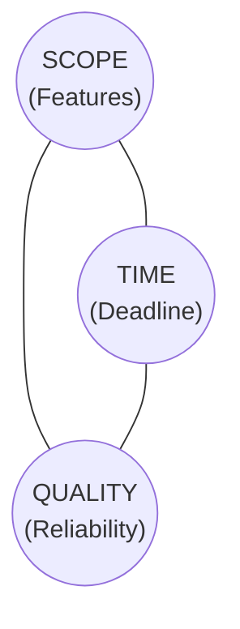

> **Complexity**: `[COMPLEX]` | **Time**: 2.5 hours | **Prerequisites**: None
>
> **Track**: Foundations / Engineering Leadership

### What You'll Be Able to Do

After completing this module, you will be able to:

1. **Design** communication strategies tailored to different stakeholder audiences (executives, product, engineering, customers) with appropriate detail levels
2. **Apply** expectation management techniques to surface technical risk, timeline uncertainty, and scope tradeoffs before they become crises
3. **Evaluate** whether engineering concerns are being translated into business impact language that non-technical stakeholders can act on
4. **Build** status reporting cadences that maintain trust through transparency without creating overhead or enabling micromanagement

---

## The Feature That Shipped on Time (and Broke Everything)

*Monday morning all-hands. The VP of Product is beaming.*

"I'm thrilled to announce we shipped the real-time analytics dashboard on schedule! Huge thanks to the engineering team for delivering on time."

The engineering team sits in silence. They shipped on time, yes. But here's what the VP of Product doesn't know:

- They skipped database migration testing to make the deadline
- The dashboard queries are running directly against the production database (no read replica)
- The feature flag system was bypassed because "we're shipping on time, we don't need it"
- Two engineers worked weekends for three straight weeks
- The on-call engineer has been triaging slow-query alerts since Friday

Three weeks later, the production database locks up during peak hours. The analytics dashboard---the one everyone celebrated---is issuing queries that block the checkout flow. Revenue drops $180,000 in 26 minutes. The incident takes 6 hours to resolve.

At the post-incident review, someone asks: "Why didn't engineering push back on the timeline?"

And the tech lead says the quiet part out loud: "We tried. Nobody listened."

> **Stop and think**: Have you ever been in a situation where you raised a technical concern, but it was ignored because of a deadline? How did you frame the concern, and how could it have been communicated differently?

**This is a stakeholder communication failure.** Not a technical failure. The technology worked exactly as the engineers predicted it would. The breakdown happened in the space between engineering and the rest of the organization---the space where technical reality meets business expectations.

This module teaches you to operate effectively in that space.

---

## Why This Module Matters

The hardest problems in engineering leadership are not technical. They're communicational.

You can design the most elegant architecture in the world, but if you can't:
- Explain why it matters to someone who doesn't write code
- Push back on unrealistic timelines without being labeled "negative"
- Translate security risks into language that motivates budget approval
- Keep executives informed without triggering micromanagement

...then your technical excellence is wasted. The decisions will be made by the people who communicate best, not the people who understand the technology best.

This is not a cynical observation. It's a call to action. **Communication is an engineering skill.** It's as learnable as Kubernetes, as practicable as Go, and as essential as knowing how to debug a production outage.

> **The Uncomfortable Truth**
>
> A mediocre engineer who communicates well will have more organizational impact than a brilliant engineer who communicates poorly. This isn't because the organization is broken (though it might be). It's because engineering decisions are always made in a context of competing priorities, limited budgets, and imperfect information. The engineer who can navigate that context shapes the outcome. The one who can't is shaped by it.

Consider the numbers: a 2023 State of DevOps report found that **high-performing teams spend 33% less time on unplanned work**. The primary difference wasn't better technology---it was better communication between engineering and business stakeholders about priorities, risks, and trade-offs.

---

## What You'll Learn

- How to translate tech debt into language executives actually care about
- The art of saying "No" without saying "No" (scope negotiation)
- Managing upward: giving status updates that build trust, not trigger micromanagement
- Handling executive pushback on security and reliability investments
- Building empathy across product, sales, and customer success
- Communicating during outages to non-technical audiences

---

## Part 1: Translating Tech Debt into Business Risk

### Why "Tech Debt" Doesn't Work

Walk into any executive meeting and say "we need to address tech debt" and watch what happens. Eyes glaze over. The CFO checks her phone. The CEO nods politely and asks, "Can we do that next quarter?"

The phrase "tech debt" has been so overused that it's lost all meaning to non-technical leaders. It sounds like engineers complaining. It sounds optional. It sounds like you want to rewrite things for fun.

Here's the problem: when you say "tech debt," executives hear **"engineers want to do work that doesn't ship features."** And in a world of competing priorities, that's a losing argument.

> **Pause and predict**: If you tell a product manager "we need to rewrite the billing service because the code is messy," what will they immediately assume about your priorities?

The fix is simple: **stop talking about tech debt. Start talking about business risk.**

| What Engineers Say | What Executives Hear |
|---|---|
| "We have tech debt" | "Engineers want to refactor for fun" |
| "The code is messy" | "So? It works." |
| "We need to refactor" | "They want to rewrite everything again, didn't we do this last year?" |
| "Our tests are flawed" | "Testing is an engineering concern, not a business priority" |
| "The architecture won't scale" | "It scales fine today. Let's worry about it when we get there." |

Now compare with business risk language:

| Business Risk Framing | What Executives Hear |
|---|---|
| "Shipping new features takes 3x longer than last year" | "We're slower than competitors. This affects revenue." |
| "We're one config change away from a 4-hour outage" | "We could lose customers and face legal liability." |
| "Each deployment has a 15% chance of causing an incident" | "We're gambling with uptime every time we ship." |
| "Customer-facing bugs increased 200% this quarter" | "Customer satisfaction is dropping. Churn risk is increasing." |
| "We can't pass the SOC 2 audit with our current architecture" | "Enterprise deals are blocked. Revenue is at risk." |

### The Business Risk Framework

When you need to communicate a technical concern to business stakeholders, use this framework:

1. **IMPACT:** What business outcome is at risk?
   - Revenue, customer satisfaction, regulatory compliance, competitive position, employee retention
2. **PROBABILITY:** How likely is the bad outcome?
   - Use data: incident frequency, error rates, near-misses
   - "We've had 3 near-misses in the last month" is more compelling than "it could happen"
3. **TIMELINE:** When will this become critical?
   - "This will block the Q3 enterprise launch" is urgent
   - "This might cause problems someday" is ignorable
4. **COST OF DELAY:** What happens if we wait?
   - "Fixing this now: 2 weeks. Fixing this after an outage: 6 weeks + incident cost + customer trust damage"
5. **ASK:** What specifically do you need?
   - "We need 1 engineer for 3 sprints" is actionable
   - "We need to address tech debt" is not

### Worked Example: The Database That's Going to Fail

**The technical reality:** Your PostgreSQL database is running at 78% disk capacity and growing 5% per month. The disk I/O latency has increased 40% in the last quarter. The vacuum process is struggling to keep up with dead tuple cleanup.

**Bad communication (to VP of Engineering):**
> "We need to address our database scaling issues. The disk is filling up and vacuum isn't keeping up. We should migrate to a larger instance type and implement table partitioning."

**Good communication (to VP of Engineering):**
> "Our production database will run out of disk space in approximately 4 months at current growth rates. Before that happens---likely within 2 months---query performance will degrade to the point where checkout latency exceeds our 500ms SLO, directly impacting conversion rates.
>
> We have two options:
> 1. **Vertical scaling** (larger instance): 1 day of work, $800/month increase, buys us 12 months. Low risk.
> 2. **Table partitioning**: 3 weeks of work, reduces query times by 60%, scales horizontally for 3+ years. Medium risk during migration.
>
> I recommend we do option 1 immediately (this sprint) and plan option 2 for Q2. This gives us breathing room without delaying the product roadmap.
>
> If we do nothing, I estimate a production incident within 60 days."

The second version:
- Quantifies the risk (4 months, 60 days)
- Connects to business impact (checkout latency, conversion rates)
- Offers options with effort and cost
- Makes a specific recommendation
- Creates urgency without panic

---

## Part 2: Saying "No" Effectively

### Why Engineers Are Bad at Saying No

Engineers are problem-solvers. When someone says "can you build this?" the instinct is to figure out *how*, not to question *whether*. This is a strength when building systems. It's a weakness when managing expectations.

The result: engineers say "yes" to everything and then work nights and weekends to deliver. Or they deliver on time but cut corners (skipping tests, hardcoding values, bypassing review). Or they deliver late and lose credibility.

**The root cause is not overwork. It's the inability to negotiate scope.**

### The "Yes, And" Technique

Never say "No." Say "Yes, and here's what that requires."

**Scenario:** VP of Product wants real-time analytics in 4 weeks. Your estimate is 10 weeks for full implementation.

**Bad Response:**
"No, that's impossible. It'll take at least 10 weeks."
- *Result:* You're now "the engineer who says no to everything"

**Okay Response:**
"We can try, but it might not be great quality."
- *Result:* You've committed to something you can't deliver well. When it breaks, it's your fault.

**Good Response:**
"Yes, we can ship analytics in 4 weeks. Here's what that looks like at different scopes:
- **4 weeks:** Daily batch analytics. Pre-computed reports updated every 24 hours. Covers 80% of the use cases identified in user research.
- **7 weeks:** Near-real-time analytics. 15-minute data freshness. Custom date ranges. Covers 95% of use cases.
- **10 weeks:** True real-time analytics. Sub-second updates. Custom dashboards. Full feature set.

My recommendation: Ship the 4-week version, get user feedback, and iterate. Most users don't actually need sub-second updates for business analytics."

- *Result:* You've said "yes" to the timeline, given options, shown you understand the business need, and steered toward a pragmatic solution.

### Scope Negotiation Tactics

| Tactic | How It Works | Example |
|--------|-------------|---------|
| **Time vs Scope** | Hold quality constant. Trade features for speed. | "We can ship in 4 weeks with features A and B. Feature C adds 3 weeks." |
| **Phase the Delivery** | Ship a smaller version first, iterate | "V1 in 4 weeks covers 80% of users. V2 in 8 weeks covers the rest." |
| **Highlight Hidden Costs** | Surface the risks of rushing | "We can do 4 weeks, but we'll skip load testing. The last time we did that, it caused INC-2024-055." |
| **Offer Alternatives** | Solve the problem differently | "Instead of building custom analytics, we can integrate Metabase in 2 weeks. It handles 90% of the requirements." |
| **Defer Non-Essential Work** | Cut scope without cutting quality | "We can skip SSO integration for V1---only 12% of users need it. We'll add it in V2." |
| **Make the Trade-off Explicit** | Force the stakeholder to choose | "I can do analytics in 4 weeks OR the security audit in 4 weeks. Which is the priority?" |

### The "Iron Triangle" Visual

> **Stop and think**: When a stakeholder asks you to deliver a project faster, which of the three points on the Iron Triangle do you usually sacrifice first?

When stakeholders push on timeline, use the iron triangle to make trade-offs visible:



**The Rule:** You cannot increase scope, reduce time, AND maintain quality. Something has to give. The question is: what?

- **COMMON ANTI-PATTERN:** "Ship all features by Friday at high quality"
  - **Results in:** engineers working 80-hour weeks
  - **Which causes:** burnout, turnover, MORE quality problems

- **HEALTHY PATTERN:** "What can we ship by Friday at high quality?"
  - **Results in:** honest scope discussion
  - **Which causes:** realistic expectations, sustainable delivery

---

## Part 3: Managing Upward

### Status Reporting That Builds Trust

The goal of status updates is to give your manager enough information to represent your team's work accurately---without so much detail that they feel compelled to manage your execution.

**Too Little:**
"Everything's fine."
- Your manager doesn't know what you're doing
- They start asking more questions
- You feel micromanaged
- But YOU created the information vacuum

**Too Much:**
"We fixed 47 bugs, refactored the auth module, updated 12 dependencies, reviewed 23 PRs, and had 6 design discussions. The flaky test in CI was caused by a race condition in the connection pool initialization..."
- Your manager's eyes glaze over
- They don't know what's important
- They start asking clarifying questions
- You feel micromanaged
- But YOU overwhelmed them with noise

**Just Right:**
"On track for Q2 goals. Three things to know:
1. Analytics dashboard ships next Tuesday (demo available Friday)
2. Database scaling is 70% complete---on schedule
3. Risk: the auth service migration is blocked on the security team's review. If we don't get approval by Thursday, the Q2 deadline is at risk. I'll escalate if needed."
- Manager knows what matters
- They can represent your work accurately to THEIR stakeholders
- They trust you, so they don't dig deeper
- You feel trusted and autonomous

### The 3-3-3 Status Update Format

Use this format for weekly updates to your manager or skip-level:

**3 Things Completed** (what shipped or was finished)
1. [Concrete outcome, not activity]
2. [Concrete outcome, not activity]
3. [Concrete outcome, not activity]

**3 Things In Progress** (what's being worked on)
1. [What + expected completion date]
2. [What + expected completion date]
3. [What + expected completion date]

**3 Risks or Blockers** (what might go wrong)
1. [Risk + impact if not resolved + what you're doing about it]
2. [Risk + impact if not resolved + what you're doing about it]
3. [Risk + impact if not resolved + what you're doing about it]

**Example:**

> **Weekly Update - Platform Team - Week of March 17**
>
> **Completed:**
> 1. Database read replica deployed to production - checkout latency improved from 450ms to 180ms (p99)
> 2. SOC 2 evidence collection finished - all 47 controls documented
> 3. Hired Senior SRE (Priya) - starts April 1
>
> **In Progress:**
> 1. Kafka migration: consumer groups moving this week (ETA: March 21)
> 2. Kubernetes 1.35 upgrade: staging complete, prod scheduled for March 25 maintenance window
> 3. Q2 OKR planning: draft ready for review by Friday
>
> **Risks:**
> 1. Kafka migration may slip 1 week - discovered schema compatibility issue in the order service. Impact: delays event-driven checkout. Mitigation: pair programming session scheduled for Tuesday.
> 2. Priya's start date may shift - visa processing delayed. Impact: SRE on-call rotation stays at 3 people (stretching thin). Mitigation: none needed yet, monitoring the situation.
> 3. No risks for item 3.

### Preventing Micromanagement

Micromanagement is usually a symptom, not a cause. Most managers micromanage because they feel uninformed or anxious about outcomes. The cure is **proactive transparency**.

| Micromanagement Trigger | Proactive Prevention |
|------------------------|---------------------|
| Manager doesn't know project status | Send weekly 3-3-3 updates before they ask |
| Manager was surprised by a missed deadline | Flag risks early ("this might slip") so surprises become expected updates |
| Manager doesn't trust the team's technical judgment | Share reasoning, not just conclusions. "We chose X because Y" builds confidence. |
| Manager is getting pressure from their manager | Give them the talking points they need to represent your team. Make it easy for them to defend you. |
| Manager has been burned by a previous team | Over-communicate for the first 2-3 months. Trust is built through consistent, honest updates. |

---

## Part 4: Handling Executive Pushback

### The Security Budget Conversation

This is one of the hardest conversations in engineering. You need budget for security improvements, but security is invisible when it works. Executives don't see the attacks that were prevented---only the features that weren't shipped.

**The Wrong Approach:**
> "We need to implement a WAF, upgrade our TLS configuration, add runtime container scanning, and hire a security engineer. Total cost: $280,000/year."

Executive response: "Can we do this next quarter?"

**The Right Approach:**
> "I need to share a risk assessment. We currently have three security gaps that could result in a data breach:
>
> 1. **No web application firewall**: We're exposed to the OWASP Top 10. Companies our size experience an average of 2.3 security incidents per year without a WAF. Average cost per incident: $4.2M (IBM 2024 data breach report).
>
> 2. **No container runtime scanning**: If a compromised container image enters our pipeline, we won't detect it until customers are affected. This happened to [well-known company] last year, costing them $12M and 3 months of engineering time.
>
> 3. **No dedicated security engineer**: Our backend engineers handle security part-time. They're not trained in threat modeling, and they miss things. Our last penetration test found 4 critical vulnerabilities.
>
> The cost of prevention: $280,000/year.
> The expected cost of a breach: $4.2M (industry average for our company size).
> The question isn't whether we can afford security. It's whether we can afford not to."

### The Reliability Investment Conversation

Similar to security, reliability is invisible when it works.

| Don't Say | Say |
|---|---|
| "We need to improve our uptime" | "Each hour of downtime costs us $47,000 in lost revenue. We had 6 hours of downtime last quarter. That's $282,000." |
| "We need better monitoring" | "Our average time to detect an outage is 23 minutes. Industry best practice is under 5 minutes. Those 18 extra minutes cost us $14,000 per incident." |
| "We need to do chaos engineering" | "Netflix runs chaos experiments continuously. That's why they survived the AWS outage that took down their competitors. We want the same resilience for our customers." |
| "Our infrastructure is outdated" | "We're spending 40% of engineering time on workarounds for infrastructure limitations. That's 2.4 FTEs of capacity we're wasting---equivalent to $480,000/year in salary." |

### The "Three Options" Technique

When facing pushback, never present a single proposal. Present three options that make the trade-offs visible:

**Option 1: Do Nothing ($0)**
- Database runs out of space in ~4 months
- Checkout latency degrades within 2 months
- High probability of production outage
- Estimated incident cost: $150,000-$500,000

**Option 2: Minimum Viable Fix ($15,000)**
- Upgrade instance type (1 day of work)
- Buys 12 months of runway
- Does not solve the underlying scaling problem
- We'll be back here in a year

**Option 3: Strategic Fix ($85,000)**
- Table partitioning + read replicas (3 weeks)
- Scales for 3+ years at projected growth
- Reduces query latency by 60%
- Enables real-time analytics feature (on product roadmap)

**Recommendation:** Option 2 immediately + Option 3 in Q2.
This addresses the urgent risk while allowing strategic planning.

Executives like options. It gives them the feeling of control and allows them to make an informed trade-off---which is their job.

---

## Part 5: Building Empathy Across Functions

### Understanding What Each Team Cares About

To communicate effectively with stakeholders, you need to understand what keeps them up at night.

**Product Management**
- **Primary concern:** Shipping features that users want
- **Success metric:** User adoption, feature usage, NPS
- **Fear:** Building the wrong thing, missing the market
- **Frustration with engineering:** "Engineering always says things take longer than they should"
- **How to help:** Give clear timelines, flag risks early, suggest creative alternatives to hard problems

**Sales**
- **Primary concern:** Closing deals, hitting quota
- **Success metric:** Revenue, deal size, win rate
- **Fear:** Losing deals to competitors, missing quota
- **Frustration with engineering:** "The product doesn't have [feature competitor has], and I can't get a timeline for it"
- **How to help:** Be honest about timelines, explain what IS possible, help them set realistic expectations with prospects

**Customer Success**
- **Primary concern:** Keeping customers happy and renewing
- **Success metric:** Churn rate, CSAT, expansion revenue
- **Fear:** Customers leaving, escalations to executives
- **Frustration with engineering:** "Engineering deprioritizes bugs that affect only a few customers"
- **How to help:** Take customer-reported bugs seriously, provide root cause analysis, give ETAs for fixes

**Finance**
- **Primary concern:** Predictable spending, ROI on investments
- **Success metric:** Budget variance, unit economics
- **Fear:** Surprise costs, runaway cloud spend
- **Frustration with engineering:** "Our cloud bill went up 40% and nobody can explain why"
- **How to help:** Tag infrastructure costs, provide monthly cloud spend reports, explain cost drivers

**Legal / Compliance**
- **Primary concern:** Regulatory compliance, reducing liability
- **Success metric:** Audit results, compliance certifications
- **Fear:** Data breaches, regulatory fines, lawsuits
- **Frustration with engineering:** "Engineering can't tell me where customer data is stored or who has access to it"
- **How to help:** Maintain data flow diagrams, document access controls, participate actively in audit prep

### Building Bridges: Practical Actions

| Action | Effort | Impact |
|--------|--------|--------|
| Attend a customer call with the Sales team once a month | 1 hour | You'll understand what customers actually ask for (vs what Product interprets) |
| Shadow Customer Success for a day | 4 hours | You'll see the bugs that frustrate real users (not the ones engineers think matter) |
| Invite Product to sprint demos | 30 min/sprint | They'll see progress incrementally instead of waiting for a big reveal |
| Send a monthly "engineering health" report to Finance | 2 hours/month | Prevents surprise cloud bills and builds budget trust |
| Include compliance requirements in your definition of "done" | Minimal | Legal stops being a last-minute blocker |
| Have coffee with someone from a different team each week | 30 minutes | Builds relationships before you need them |

### The Language Gap

The same concept means different things to different teams:

| Engineering Says | Product Hears | What to Say Instead |
|-----------------|---------------|---------------------|
| "That's a breaking change" | "It'll break existing features" | "Existing users will need to update their integration. Here's the migration path and timeline." |
| "We need to do a migration" | "Everything will be down" | "We're upgrading the system. Users won't notice---we'll do it with zero downtime." |
| "That's technically impossible" | "They don't want to build it" | "That specific approach won't work because [reason]. But here's an alternative that achieves the same goal." |
| "We're at capacity" | "They're being lazy" | "Adding this would delay [other project] by 3 weeks. Would you like to reprioritize?" |
| "It's a race condition" | "...what?" | "Two processes are fighting over the same data, which causes intermittent errors. We need to add coordination between them." |

---

## Part 6: Communicating During Outages

### The Two Audiences During an Incident

During an outage, you're communicating with two very different audiences simultaneously:

1. **The technical team** resolving the incident (Slack, war room)
2. **Non-technical stakeholders** who need to communicate to customers, executives, and partners

These audiences need completely different information.

**Track 1: Technical (Slack #incident channel)**
- **Audience:** Engineers, SREs, on-call team
- **Content:** Root cause analysis, commands being run, logs, metrics, deployment status
- **Tone:** Direct, technical, fast
- **Example:** "Identified: Order service OOM-killed due to memory leak in v2.4.3 connection pool. Rolling back to v2.4.2. ETA: 5 minutes for rollback, 10 minutes for recovery."

**Track 2: Stakeholder (email, status page, Slack #incidents-updates)**
- **Audience:** Product, Sales, Support, Executives, Customers
- **Content:** Impact, estimated time to resolution, workarounds
- **Tone:** Calm, clear, empathetic, jargon-free
- **Example:** "We're experiencing an issue affecting order processing. Some customers may see errors when placing orders. Our team is actively working on a fix. Estimated resolution: within 30 minutes. We'll update every 15 minutes."

### Stakeholder Incident Communication Template

Use this template for non-technical stakeholder updates during incidents:

> **INCIDENT UPDATE - [SEVERITY] - [TIME]**
>
> **What's Happening:**
> [1-2 sentences. What users see. No technical jargon.]
>
> **Who's Affected:**
> [Which customers/features are impacted. Be specific.]
>
> **What We're Doing:**
> [1-2 sentences. Action being taken. Show progress.]
>
> **Estimated Resolution:**
> [Time estimate. If unknown, say when the next update will be.]
>
> **Workaround:**
> [If one exists, describe it in user terms.]
>
> **Next Update:**
> [When stakeholders will hear from you again.]

**Example:**

> **INCIDENT UPDATE - HIGH - 2:45 PM EST**
>
> **What's Happening:**
> Some customers are unable to complete checkout. Orders placed in the last 30 minutes may not have been processed.
>
> **Who's Affected:**
> Approximately 15% of customers attempting checkout. The product catalog, search, and account features are working normally.
>
> **What We're Doing:**
> We've identified the cause and are deploying a fix. Orders that failed will be automatically retried once the fix is in place.
>
> **Estimated Resolution:**
> Within 30 minutes.
>
> **Workaround:**
> Customers can save items to their cart and complete checkout after the fix is deployed.
>
> **Next Update:**
> 3:00 PM EST, or sooner if the issue is resolved.

### What NOT to Say During Outages

| Tempting Statement | Why It's Bad | Better Alternative |
|-------------------|--------------|-------------------|
| "It's just a minor issue" | If it affects customers, it's not minor to them | "We're aware of the issue and are working on it" |
| "This shouldn't have happened" | Implies blame and incompetence | "We've identified the cause and are deploying a fix" |
| "We're not sure what's wrong" | Creates panic | "We're investigating and will have more information within [time]" |
| "Bob pushed a bad deploy" | Never blame individuals externally | "A recent change caused an unexpected interaction" |
| "This never happens" | Dismisses the customer's experience | "We take this seriously and are working to prevent recurrence" |
| "It should be fixed now" | "Should" erodes confidence | "The fix has been deployed. We're monitoring to confirm resolution." |

### The Post-Incident Stakeholder Summary

After the incident is resolved, send a brief summary to stakeholders. This is different from the technical post-incident review---it's focused on impact and prevention.

> **POST-INCIDENT SUMMARY**
>
> **Incident:** Checkout Processing Failure
> **Date:** March 17, 2026, 2:15 PM - 3:02 PM EST
> **Duration:** 26 minutes
> **Impact:** ~2,400 customers were unable to complete checkout. All affected orders have been successfully reprocessed.
>
> **What Happened:**
> A software update caused the order processing system to slow down under load, resulting in checkout failures during peak afternoon traffic.
>
> **What We've Done:**
> 1. Deployed an immediate fix (resolved within 26 minutes)
> 2. Reprocessed all affected orders (no customer action needed)
> 3. Added monitoring to detect similar issues within 2 minutes (instead of the 18 minutes it took today)
>
> **What We're Doing To Prevent Recurrence:**
> 1. Adding automated load testing before every deployment
> 2. Implementing canary deployments (gradual rollout to 5% of traffic before full deployment)
> 3. Review complete by March 24
>
> **Customer Communication:**
> Affected customers have been notified via email with confirmation that their orders are being processed.

---

## Common Mistakes

| Mistake | Why It's a Problem | Better Approach |
|---------|-------------------|-----------------|
| **Using jargon with non-technical audiences** | People tune out what they don't understand. Jargon creates a power dynamic that damages trust. | Translate every technical term into its business impact. "Horizontal scaling" becomes "handling more customers without slowing down." |
| **Saying "No" without offering alternatives** | You're labeled as negative, obstructionist, or not a team player. People stop including you in decisions. | Use "Yes, and here's what that requires." Always offer options with trade-offs. |
| **Sandbagging estimates to create buffer** | When stakeholders figure it out (and they will), you lose all credibility on future estimates. | Give honest estimates with explicit risk ranges. "2-3 weeks, assuming no surprises with the legacy API. 4 weeks if we hit compatibility issues." |
| **Surprising stakeholders with bad news** | Surprises destroy trust. An executive who learns about a risk from a customer or their boss will never trust you again. | Flag risks early and often. "This might slip" is infinitely better than "this slipped." |
| **Over-promising to avoid conflict** | Short-term peace, long-term pain. You'll miss the deadline, cut corners, or burn out. | Be honest about what's achievable. Discomfort now prevents disaster later. |
| **Treating every request as equal priority** | Everything becomes urgent, nothing gets done well. The team burns out. | Force explicit prioritization. "We can do A and B this sprint, or C. Which matters more?" |
| **Not adapting communication style to the audience** | The CEO doesn't need to know about your database migration strategy. The junior engineer doesn't need to hear about revenue impact. | Match detail level to audience. Technical depth for engineers, business impact for executives. |
| **Ignoring emotional context** | A VP who just got yelled at by the CEO about a missed deadline isn't in a state to hear your nuanced technical explanation. | Read the room. Sometimes the best response is "I hear your concern. Let me put together options and get back to you by end of day." |

---

## Quiz

Test your understanding of stakeholder communication.

**Question 1:** Your VP asks why a feature is taking so long. Which response is better?

A) "The legacy auth system uses OAuth 1.0 with a custom token rotation mechanism that's incompatible with our new OIDC-based identity provider, so we need to implement an adapter layer with backward-compatible session management."

B) "The old login system and the new one speak different languages. We're building a translator between them. It's adding 2 weeks, but it means existing users won't need to re-login. I can show you the progress at Friday's demo."

<details>
<summary>Show Answer</summary>

**B is better.** It uses an analogy ("speak different languages"), gives a concrete timeline impact ("2 weeks"), explains the user benefit ("won't need to re-login"), and offers visibility ("Friday's demo"). Response A is technically accurate, but it is overloaded with jargon that doesn't help the VP make a business decision. Executives need to understand the impact on timelines and user experience, not the implementation details of OAuth and OIDC. By framing the technical challenge in terms of user value and clear timelines, you build trust and demonstrate that you understand the business priorities. Save the architectural details for your engineering team's design documents.
</details>

**Question 2:** Product wants Feature X in 4 weeks. Your estimate is 8 weeks. How do you handle this?

<details>
<summary>Show Answer</summary>

Use the "Yes, And" technique with scope options to negotiate rather than flatly refusing. First, identify the core functionality that delivers 80% of the value and propose shipping that as a 4-week version. Next, define a 6-week version that adds the most requested secondary features, and an 8-week version for the full feature set. Make the trade-offs explicit: "In 4 weeks, we can ship this subset, but we'd defer these other features to a follow-up release." Never just say "No, it takes 8 weeks," because it shuts down collaboration, and never say "We'll try" when you know it's 8 weeks of work, because that dishonesty will inevitably damage your credibility when the deadline is missed.
</details>

**Question 3:** You have inherited a legacy billing system that takes 3 weeks to add a new payment method. The VP of Finance wants Stripe integration by next month. You know the current architecture is a tangled mess. How do you communicate this tech debt to the VP of Finance?

<details>
<summary>Show Answer</summary>

Never use the phrase "tech debt," as executives often misinterpret it as engineers wanting to refactor for fun rather than delivering value. Instead, translate the technical reality into business risk by focusing on the cost of delay and the impact on revenue. Explain that shipping the Stripe integration takes 3 weeks because the system's current complexity slows down all new feature development, directly impacting the company's ability to capture new revenue streams. Offer concrete options: a quick, localized fix that hits the deadline but increases future risk, versus a longer strategic refactor that speeds up all future integrations. This framing shifts the conversation from an engineering complaint to a strategic business decision, allowing the VP to weigh the trade-offs and make an informed choice.
</details>

**Question 4:** During an outage, a Sales director messages you directly asking "Is it fixed yet? I have a customer demo in 20 minutes." How do you respond?

<details>
<summary>Show Answer</summary>

Acknowledge their urgency, give them what they need, and immediately redirect them to the appropriate communication channel. You could say: "I understand the timing is critical. We're investigating a database load issue, and the estimated resolution is 30 minutes. For your demo, I recommend using the staging environment." Directing them to the official channel (e.g., `#incident-updates`) is crucial because fielding ad-hoc requests distracts the engineering team from actually resolving the incident. Providing a workaround empowers the Sales director to salvage their meeting, while setting a boundary ensures that the technical team can focus entirely on restoring the service.
</details>

**Question 5:** Your manager has started pinging you daily for updates on the new Kubernetes 1.35 migration, asking about specific pod disruptions. You feel micromanaged, but realize you haven't been proactively sharing status. How can you use the 3-3-3 format to rebuild trust?

<details>
<summary>Show Answer</summary>

The 3-3-3 format is the perfect tool here because micromanagement is usually a symptom of a manager feeling uninformed or anxious. By structuring your weekly update into 3 things completed, 3 things in progress, and 3 risks or blockers, you proactively fill the information vacuum before your manager feels the need to ask. This format forces you to focus on concrete outcomes and high-level timelines rather than low-level technical minutiae like individual pod disruptions. When your manager sees that you are predictably surfacing progress and risks on your own, their anxiety decreases. Over time, this proactive transparency rebuilds trust and significantly reduces their urge to micromanage your day-to-day execution.
</details>

**Question 6:** Your company recently failed a compliance pre-audit due to missing security controls. You need to convince your CFO to approve a $280,000/year budget for security improvements, but she is hesitant due to recent budget cuts. What framing do you use to secure the funding?

<details>
<summary>Show Answer</summary>

You must frame this request entirely around business risk and potential financial impact rather than technical necessity. Start by quantifying the risk: compare the $280,000 prevention cost against the industry average cost of a data breach (e.g., $4.2M) and the likelihood of it occurring without these protections. Show the probability by citing near-misses or the rising number of attacks your edge network already deflects. Create urgency by tying the investment to upcoming business milestones, such as a SOC 2 audit required to unblock enterprise sales deals. By presenting the security budget as a necessary risk management strategy rather than an arbitrary engineering expense, you empower the CFO to make a clear, financially sound decision.
</details>

**Question 7:** A product manager asks your team to build a feature that syncs data across 5 regions with absolute zero latency---a physical impossibility due to the speed of light. Your initial thought is to say "that's technically impossible." Why is this a bad response, and what should you say instead to move the project forward?

<details>
<summary>Show Answer</summary>

Saying "technically impossible" is a bad response because it shuts down the conversation, leaves the product manager with no path forward, and often sounds like you simply don't want to do the work. The PM is likely focusing on a business goal (e.g., preventing data conflicts for global users), not dictating the laws of physics. Instead, use the "Yes, And" technique to address the underlying goal while explaining the constraint. You could say: "We can't achieve absolute zero latency across regions due to network transit times, but if we relax the requirement to a 5-second eventual consistency model, we can build a solution that meets 99% of user needs." This approach redirects the conversation from a flat refusal to a collaborative exploration of what is actually achievable.
</details>

---

## Hands-On Exercise: Draft a Stakeholder Communication

### Scenario

You are the tech lead for the platform team at a mid-size SaaS company (200 employees, $30M ARR). Your team is preparing to release v3.0 of the product---the biggest release of the year. Marketing has announced the launch date publicly. Sales has been promising the features to prospects.

Two weeks before launch, your security team discovers three critical vulnerabilities during a penetration test:

1. **SQL injection** in the new reporting module (severity: critical)
2. **Broken access control** allowing users to view other tenants' data (severity: critical)
3. **Insecure deserialization** in the API gateway (severity: high)

Fixing all three will take 3-4 weeks. The launch date is in 2 weeks.

Your VP of Product wants to launch on time: "We've already announced it. We can patch the security issues after launch."

You believe launching with these vulnerabilities is unacceptable.

### Your Task

Draft an email to the VP of Product explaining why the release must be delayed. Your email must:

1. **Acknowledge their concern** about the announced date and business impact
2. **Explain the risk** in business terms (not security jargon)
3. **Quantify the consequences** of launching with known vulnerabilities
4. **Propose alternatives** (not just "delay the launch")
5. **End with a clear recommendation**

### Constraints

- Maximum 400 words (executives don't read long emails)
- Zero jargon (no "SQL injection," "deserialization," or "access control" without explanation)
- Must address the business concern (announced date, sales commitments)
- Must include at least one alternative to a full delay

### Evaluation Rubric

Your email will be evaluated on:

| Criteria | Weight | What to Look For |
|----------|--------|-----------------|
| **Empathy** | 20% | Acknowledges the VP's concern before presenting yours |
| **Business framing** | 25% | Risks described in business terms (revenue, customers, legal) |
| **Specificity** | 20% | Concrete numbers, timelines, and consequences |
| **Options** | 20% | At least 2 alternatives with trade-offs |
| **Clarity** | 15% | Under 400 words, no jargon, clear recommendation |

### Example Structure

```text
Subject: v3.0 Launch - Security Risk and Options

Hi [VP Name],

[Acknowledge the business concern - 2 sentences]

[Explain what was found - in business terms - 3-4 sentences]

[Quantify the risk of launching - 2-3 sentences]

[Present options - 2-3 alternatives with trade-offs]

[Clear recommendation - 2 sentences]

[Offer to discuss - 1 sentence]
```

### Success Criteria

- [ ] Email is under 400 words
- [ ] Zero security jargon (or jargon is translated for the audience)
- [ ] VP's concern about the announced date is acknowledged
- [ ] Risk is framed in business terms (revenue, customers, legal liability)
- [ ] At least 2 options are presented (not just "delay")
- [ ] A clear recommendation is made
- [ ] The tone is collaborative, not adversarial
- [ ] A reader with no technical background could understand the email

### Stretch Goal

Write the same message as a 3-sentence Slack message to the CEO, who only has 30 seconds to read it.

---

## Did You Know?

- **The Boeing 737 MAX disasters** (2018-2019, 346 deaths) were partly caused by communication failures between engineering and management. Engineers raised concerns about the MCAS system, but those concerns were not effectively communicated up the chain. The lesson for software engineers: if you know about a safety risk and fail to communicate it effectively, the consequences can be catastrophic---even if "effectively" means adapting your language, escalating loudly, or putting it in writing.

- **Amazon requires a "Press Release" draft before building any new product.** Before a single line of code is written, the team writes a mock press release and FAQ from the customer's perspective. This forces them to think about the "so what?" before investing engineering effort. The technique is called "Working Backwards."

- **Pixar's "Braintrust" meetings** are a model for technical design reviews. The rules: candid feedback is mandatory, but the director retains full authority over decisions. Feedback is about the work, never the person. This separation of "input" from "authority" is exactly what makes good engineering design reviews work.

- **The phrase "tech debt" was coined by Ward Cunningham in 1992**, and he later said it's been widely misunderstood. He meant it specifically as a metaphor for the cost of *learning*---shipping code before you fully understand the domain, then refactoring as understanding improves. It was never meant to describe "messy code" or "shortcuts," which is how most teams use the term today.

---

## Further Reading

- **"Crucial Conversations"** by Patterson, Grenny, McMillan, and Switzler --- The definitive book on high-stakes communication. Chapter on "making it safe" is directly applicable to engineering-product conversations.

- **"The Manager's Path"** by Camille Fournier --- Excellent coverage of managing upward and stakeholder communication for technical leaders.

- **"Radical Candor"** by Kim Scott --- Framework for giving feedback that's both caring and direct. Applicable to cross-functional relationships, not just management.

- **"An Elegant Puzzle"** by Will Larson --- Systems-thinking approach to engineering management, with practical advice on communicating with executives.

- **"Turn the Ship Around!"** by L. David Marquet --- How a submarine captain transformed a crew by changing communication patterns. Directly applicable to engineering leadership.

---

## Next Module

[Module 1.6: Mentorship & Multiplying Impact](../module-1.6-mentorship/) --- Transitioning from individual contributor to force multiplier. Effective code review, creating safe failure opportunities, and building inclusive engineering cultures.

---

*"The single biggest problem in communication is the illusion that it has taken place."* --- George Bernard Shaw

*"If you can't explain it simply, you don't understand it well enough."* --- Attributed to Albert Einstein (possibly apocryphal, but the point stands)