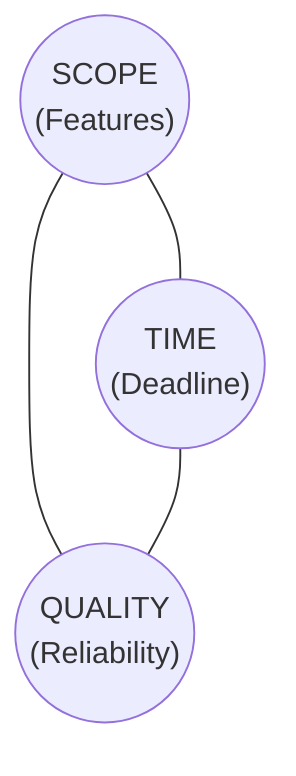

> **Complexity**: `[COMPLEX]` | **Time**: 2.5 hours | **Prerequisites**: None
>
> **Track**: Foundations / Engineering Leadership

## What You'll Be Able to Do

After completing this module, you will be able to:

1. **Design** stakeholder communication strategies that match audience, decision authority, urgency, and detail level without hiding engineering reality
2. **Translate** technical debt, reliability risk, and security exposure into business impact language that executives and product partners can act on
3. **Negotiate** scope by saying "no" without saying "no," using options, trade-offs, and explicit decision ownership instead of defensive refusal
4. **Build** upward status cadences that create trust, surface risks early, and prevent micromanagement by filling the right information gaps
5. **Communicate** across product, sales, support, finance, legal, and non-technical outage audiences with empathy, clarity, and useful next steps

---

## Why This Module Matters

Engineering leadership lives in the space between technical reality and organizational decision-making. You may understand the database constraint, the Kubernetes upgrade risk, the security control gap, or the operational load better than anyone else in the room, but the organization cannot act on that knowledge until it is translated into decisions other people can make. Stakeholder communication is therefore not a soft accessory to engineering work. It is the mechanism by which engineering facts become priorities, budgets, launch plans, incident updates, and sustainable operating agreements.

A common failure pattern is that engineers wait until a risk is technically obvious before they communicate it, while non-technical leaders need to hear about it when there is still time to choose among options. By the time the system is paging, the launch date is public, or the audit deadline is two weeks away, the conversation has already become expensive. Good communication moves the discussion upstream. It turns "the team is worried about tech debt" into "we have three choices, each with a clear trade-off in customer impact, delivery date, and operational risk."

This skill is durable because the underlying problem does not depend on any vendor tool. PagerDuty, Opsgenie, incident.io, FireHydrant, Statuspage, Jira, Linear, Slack, Teams, Confluence, Backstage, and similar products can help route messages or keep records, but they do not decide what needs to be said. The durable spine is audience analysis, expectation management, risk framing, decision hygiene, and empathy for people who are accountable for outcomes you may not personally own.

> **The Stakeholder Translation Analogy**
>
> A good engineering leader is like a simultaneous interpreter in a high-stakes meeting. The interpreter does not change the truth, make the speaker more agreeable, or decide the policy. Their job is to preserve meaning across languages so the people in the room can make a real decision. Stakeholder communication works the same way: you preserve the technical truth while translating it into the business language each audience can use.

Hypothetical scenario: a team ships a real-time analytics dashboard on the promised launch date, but the deadline was met by skipping migration testing, bypassing feature flags, and sending expensive dashboard queries directly to the production database. The product announcement is successful for a few weeks, then peak traffic exposes the hidden risk and checkout slows down while engineers scramble to isolate the workload. The exact numbers do not matter for this lesson; the important point is that the technical risk was known, the business decision was not fully informed, and the team paid for that gap during the incident instead of during planning.

At the review, someone asks why engineering did not push back on the timeline, and the frustrated answer is usually "we tried." That answer is often true, but incomplete. Saying "this is risky" in an engineering meeting is not the same as giving a product leader three launch options with concrete consequences. Saying "we need time for hardening" is not the same as explaining which customers, revenue motions, compliance obligations, or support queues will be affected if hardening is skipped. The rest of this module teaches you to make those conversations legible before the organization locks itself into a brittle plan.

---

## Part 1: Designing Stakeholder Communication Strategies

### Start With the Decision, Not the Message

Before you write a status update, schedule a meeting, or post in an incident channel, ask what decision the stakeholder needs to make or support. Executives may need to choose between investment options. Product managers may need to cut scope or move a launch. Support leaders may need language for customers. Sales may need a truthful commitment they can repeat without overpromising. Finance may need to understand whether a platform investment is a one-time cost, a recurring cost, or an avoided risk. The same technical fact should be shaped differently for each of those decisions.

This is where many technically strong teams accidentally create noise. They believe more detail proves rigor, so they send a long explanation of replication lag, queue saturation, authentication flows, or container runtime policy. The recipient then has to infer why the detail matters and what action is expected. That inference step is where communication fails. A useful message makes the decision path explicit: what changed, why it matters, what choices exist, what trade-offs attach to each choice, and what you recommend.

The audience map below is not a script. It is a reminder that stakeholders are accountable for different outcomes, and people listen most carefully when a message connects to the outcome they own. Treating every stakeholder as if they were another engineer is not transparency; it is an avoidable translation burden. Treating every stakeholder as if they only care about money is also wrong. Product cares about customer value, sales cares about credible commitments, support cares about trust under stress, legal cares about liability, and finance cares about predictability.

### Audience and Detail Levels

Use four questions when planning communication: who needs to know, what decision are they making, how much detail helps rather than distracts, and when do they need the next update. This small amount of planning prevents the two extremes that damage trust: burying stakeholders in raw technical detail or hiding so much detail that they feel surprised later.

| Stakeholder Audience | What They Usually Need | What to Avoid |
|---|---|---|
| Executives | Business impact, risk, options, recommendation, decision deadline | Debugging detail, acronyms, unbounded asks |
| Product Management | Customer impact, scope choices, launch trade-offs, sequencing | "Impossible" with no alternative path |
| Engineering Teams | Technical context, constraints, ownership, implementation implications | Vague business slogans with no technical teeth |
| Sales and Customer Success | Customer-facing language, timelines, workarounds, confidence level | Internal blame, uncertain promises, jargon |
| Finance and Legal | Cost drivers, risk exposure, audit or contract implications | Surprise spend, vague risk language, undocumented assumptions |

Good communication strategy also defines cadence. A one-time announcement is enough for a small completed change, but a risky migration, a major launch, or an outage needs repeated updates at predictable intervals. Cadence is not bureaucracy when it reduces interruptions. If stakeholders know they will get a useful update every Friday, or every fifteen minutes during a customer-impacting incident, they are less likely to interrupt engineers for ad hoc reassurance.

### The Stakeholder Contract

Every important communication should make a small contract with the audience. The contract says, "Here is what we know, here is what we do not know yet, here is what we are doing next, and here is when you will hear from us again." This is especially important when certainty is low. Stakeholders can tolerate uncertainty better than silence, but they need to know whether the uncertainty is being actively reduced.

For example, "we are still investigating" is weak if it stands alone. "We are still investigating the checkout failures, we have narrowed the likely cause to the order-processing path, customers can still browse and save carts, and the next update will be at the top of the hour" is much stronger. It does not pretend to know the root cause early, but it gives stakeholders a stable mental model and a next checkpoint.

---

## Part 2: Translating Tech Debt into Business Risk

### Why "Tech Debt" Often Fails

Walk into an executive meeting and say "we need to address tech debt," and you will often see polite nods without action. The phrase has become overloaded. To engineers, it may mean accumulated design compromises that slow delivery or increase incident risk. To non-technical leaders, it may sound like a request to stop feature work because engineers dislike old code. That misunderstanding is not because executives are anti-engineering; it is because the phrase does not identify the business outcome at risk.

The fix is not to hide the technical reality. The fix is to translate the technical reality into impact, probability, timeline, cost of delay, and a specific ask. If the billing service is hard to change, the business problem may be slower enterprise deal support. If test coverage is weak around authorization, the business problem may be customer data exposure or failed compliance evidence. If the deployment process is fragile, the business problem may be launch risk, customer trust, and burned on-call capacity. The translation should be truthful, concrete, and tied to a decision.

| What Engineers Say | What Executives Hear |
|---|---|
| "We have tech debt" | "Engineers want to refactor for fun" |
| "The code is messy" | "So? It works." |
| "We need to refactor" | "They want to rewrite everything again, didn't we do this last year?" |
| "Our tests are flawed" | "Testing is an engineering concern, not a business priority" |
| "The architecture won't scale" | "It scales fine today. Let's worry about it when we get there." |

Now compare that with business risk language. Notice that the second table does not dumb anything down. It simply changes the unit of discussion from internal discomfort to consequences the organization can weigh against other priorities.

| Business Risk Framing | What Executives Hear |
|---|---|
| "Shipping new features takes three times longer than it did last year" | "We're slower than competitors. This affects revenue." |
| "We're one config change away from a multi-hour outage" | "We could lose customers and face legal liability." |
| "Deployments regularly create customer-visible regressions" | "We're gambling with uptime every time we ship." |
| "Customer-facing bugs increased sharply this quarter" | "Customer satisfaction is dropping. Churn risk is increasing." |
| "We can't pass the SOC 2 audit with our current architecture" | "Enterprise deals are blocked. Revenue is at risk." |

### The Business Risk Framework

When you need to communicate a technical concern, use five lenses. Impact names the business outcome at risk: revenue, customer satisfaction, compliance, delivery speed, support load, employee retention, or strategic flexibility. Probability explains why this is not a vague fear, using incident history, near misses, error budgets, audit findings, support volume, or observed trend data. Timeline explains when the risk becomes urgent. Cost of delay describes what becomes more expensive if the organization waits. The ask states exactly what decision, people, time, or budget you need.

The discipline is to keep those lenses connected. A scary impact without probability sounds like fear. Probability without timeline sounds like a someday problem. Timeline without an ask creates anxiety but no action. An ask without cost of delay competes poorly against feature work. When the five lenses are present together, stakeholders can disagree with your assumptions, but at least the conversation becomes a decision rather than a vibe.

Hypothetical scenario: your primary PostgreSQL database is approaching a storage and I/O limit while the product roadmap includes heavier reporting workloads. A purely technical message says, "Vacuum is falling behind, disk utilization is high, and we should partition the largest tables." A stakeholder-ready message says, "At current growth, checkout latency is likely to breach the customer-facing SLO before the next major launch. We can buy short-term runway with a low-risk infrastructure change this sprint, or invest several weeks in partitioning to reduce long-term operational risk. I recommend the short-term runway now and the strategic fix in the next planning cycle."

That second message is still technical underneath, but it gives the VP of Engineering and product leadership something to decide. It explains impact, names the time pressure, separates tactical and strategic options, and avoids pretending that one choice is free. Most importantly, it does not ask stakeholders to approve "tech debt work" in the abstract. It asks them to choose between business outcomes with visible trade-offs.

---

## Part 3: Scope Negotiation and Saying "No" Without Saying "No"

### Why Flat Refusal Fails

Engineers are trained to protect correctness. When someone asks for a feature in four weeks that realistically takes ten, the honest instinct is to say, "No, that is impossible." The statement may be technically accurate, but it often fails as leadership communication because it stops at rejection. The stakeholder hears that engineering is blocking the business goal, not that the plan violates time, scope, and quality constraints.

Scope negotiation starts by separating the business goal from the proposed implementation. A product leader who asks for "real-time analytics" may actually need customers to understand yesterday's campaign performance before a weekly meeting. A sales leader who asks for "multi-region zero-latency sync" may actually need a way to prevent visible data conflicts for global accounts. If you reject the implementation without exploring the goal, you miss the chance to propose a smaller or different solution that preserves the business value.

### The "Yes, And" Technique

The practical move is to say yes to the goal and then make the required trade-offs visible. "Yes, we can improve analytics before the launch, and here are three scopes that fit different timelines" keeps the conversation collaborative. It does not promise the impossible. It keeps quality from becoming the hidden variable that engineers silently sacrifice. It also transfers the final prioritization decision to the stakeholder who owns the business outcome.

Hypothetical scenario: a VP of Product wants real-time analytics in four weeks, while engineering estimates ten weeks for the full implementation. A bad answer is, "No, that is impossible." A weak answer is, "We can try, but it might not be great quality." A useful answer is, "Yes, we can ship analytics value in four weeks if we define the first release as daily batch reports for the core customer workflows. A near-real-time version with shorter freshness windows is a larger follow-up, and full custom dashboards are the full ten-week scope. My recommendation is to ship the four-week version, learn from usage, and decide whether the extra freshness is worth the additional delay."

That answer works because it protects quality while changing scope. It demonstrates that engineering understands the business deadline, but it refuses to hide the cost of the desired implementation. It also creates a written decision trail: if the organization chooses the smaller launch, everyone knows what was deliberately deferred; if it chooses the full version, everyone knows why the launch date moved.

### Scope Negotiation Tactics

The tactics below are useful only when you apply them with curiosity rather than as rhetorical tricks. The goal is not to win an argument against product, sales, or executives. The goal is to expose the real constraint so the organization can choose intentionally.

| Tactic | How It Works | Example |
|--------|-------------|---------|
| **Time vs Scope** | Hold quality constant. Trade features for speed. | "We can ship in four weeks with features A and B. Feature C adds three weeks." |
| **Phase the Delivery** | Ship a smaller version first, then iterate with data | "V1 covers the highest-volume customer workflow. V2 adds the long-tail cases after feedback." |
| **Highlight Hidden Costs** | Surface the risks of rushing without using fear as the only argument | "We can hit the date by skipping load testing, but that moves outage risk into launch week." |
| **Offer Alternatives** | Solve the underlying problem differently | "Instead of building custom analytics immediately, we can provide exported reports while validating demand." |
| **Defer Non-Essential Work** | Cut scope without cutting quality | "We can skip SSO integration for the first release if only internal beta users need access." |
| **Make the Trade-off Explicit** | Force priority clarity when two commitments compete | "I can staff analytics or the security remediation this sprint. Which outcome should take precedence?" |

### The "Iron Triangle" Visual

When stakeholders push on timeline, use the iron triangle to make trade-offs visible. The triangle is not a law of physics, but it is a helpful teaching model: if scope grows and time shrinks, quality, sustainability, or both will be pressured unless capacity changes realistically.


```mermaid
flowchart TB
    Scope(("SCOPE<br/>(Features)"))
    Time(("TIME<br/>(Deadline)"))
    Quality(("QUALITY<br/>(Reliability)"))

    Scope --- Time
    Scope --- Quality
    Time --- Quality
```

The unhealthy pattern is "ship all features by Friday at high quality" while pretending the team can absorb the contradiction through heroics. That usually creates weekend work, hidden shortcuts, turnover risk, and more reliability problems later. The healthy pattern is "what can we ship by Friday at high quality?" because it turns pressure into a scope conversation before quality becomes the unspoken casualty.

### Decision Framework: Choose the Right Conversation

Use this decision framework when a stakeholder request conflicts with engineering reality. It helps you decide whether the next conversation should focus on translation, negotiation, escalation, or incident-style communication.

| Situation | Primary Risk | Best Communication Move | Decision Owner |
|---|---|---|---|
| Stakeholder does not understand why engineering work matters | Risk is invisible or framed as internal cleanup | Translate technical debt into business impact, probability, timeline, cost of delay, and ask | Executive or product leader funding the work |
| Stakeholder wants fixed deadline and full scope | Quality or sustainability becomes the hidden variable | Present two or three scope options that preserve quality and name deferred work | Product or business owner accountable for launch value |
| Stakeholder asks for unsafe security or reliability compromise | Customer trust, legal exposure, or operational stability is at stake | State the non-negotiable constraint, offer safer alternatives, and escalate if needed | Accountable executive with risk ownership |
| Manager or skip-level keeps asking for status | Information vacuum is creating anxiety | Establish a predictable status cadence with completed work, current work, and risks | You own the update; manager owns escalation help |
| Customer-impacting incident is active | Ad hoc questions distract responders and amplify confusion | Separate technical command from stakeholder communication and publish timed updates | Incident commander and communications lead |

The matrix is intentionally simple. In practice, a single event may move through several rows: a risky launch starts as scope negotiation, becomes executive pushback when security findings appear, and becomes incident communication if the organization launches anyway and customers are affected. The earlier you choose the right conversation mode, the fewer people have to improvise under pressure later.

---

## Part 4: Managing Upward With Trust-Building Status

### Status Reporting That Builds Trust

The goal of an upward status update is to let your manager or skip-level represent the team's work accurately without needing to manage the execution minute by minute. Too little information creates a vacuum, and vacuums invite check-ins, clarifying questions, and anxious escalation. Too much information creates a different problem: the recipient cannot tell what matters, so they ask follow-up questions and the team experiences that as micromanagement.

A status update should therefore emphasize outcomes, movement, and risk. "Everything is fine" is not useful because it hides the shape of the work. A dense activity dump is not useful because it forces the manager to decode priority from noise. The useful middle is a short narrative: what changed since the last update, what is moving next, what decision or escalation might be needed, and when you will update again.

Hypothetical scenario: a manager asks daily about a Kubernetes 1.35 migration because the previous team surprised leadership with a late rollback. The wrong conclusion is "my manager is micromanaging." The better diagnosis is "my manager does not yet have enough reliable signals to feel safe representing this work." A weekly written update that names completed migration steps, next workloads, open risks, and the exact trigger for escalation often reduces the daily pings because it replaces anxiety with a predictable information channel.

### The 3-3-3 Status Update Format

Use the 3-3-3 format for weekly updates to a manager, skip-level, or cross-functional leadership group. The format is intentionally constrained: three completed outcomes, three in-progress outcomes, and three risks or blockers. The limit forces you to choose what matters, and the risk section prevents the false confidence that comes from only reporting wins.

**3 Things Completed** means shipped outcomes, not activity. "Read replica deployed and checkout latency improved" is stronger than "worked on database project." **3 Things In Progress** means current ownership and expected completion, not a vague list of themes. **3 Risks or Blockers** means the possible bad outcome, the impact if it happens, and what you are doing about it. A risk with no mitigation is a complaint; a risk with mitigation is a leadership signal.

> **Weekly Update - Platform Team - Example**
>
> **Completed:** Database read replica deployed to production and checkout latency improved materially at peak; SOC 2 evidence collection finished for the platform-owned controls; new SRE hire accepted and onboarding plan is ready.
>
> **In Progress:** Kafka migration continues with consumer groups moving this week; Kubernetes 1.35 upgrade is complete in staging and production is scheduled for the maintenance window; Q2 OKR planning draft is ready for review by Friday.
>
> **Risks:** Kafka migration may slip one week because of a schema compatibility issue in the order service, and the mitigation is a focused pairing session with the service owner. The SRE rotation remains thin until the new hire is fully onboarded, so the team is limiting non-critical project work during the next rotation. No escalation is needed today, and I will update again Friday.

The example avoids the fabricated precision of counting every bug, review, and meeting. It gives enough detail for representation without turning the manager into a task tracker. It also names where help may be needed, which is the part many engineers omit because they fear looking weak. In leadership communication, early risk disclosure usually increases trust because it proves you are managing reality rather than hiding it.

### Preventing Micromanagement

Micromanagement is often a symptom, not a root cause. Some managers do over-control work, but many start digging because they were surprised before, are under pressure from their own leaders, or cannot see how your team's work connects to their commitments. You cannot fix every management problem with status updates, but you can remove the information vacuum that makes micromanagement more likely.

| Micromanagement Trigger | Proactive Prevention |
|------------------------|---------------------|
| Manager doesn't know project status | Send weekly 3-3-3 updates before they ask |
| Manager was surprised by a missed deadline | Flag risks early so surprises become expected updates |
| Manager doesn't trust the team's technical judgment | Share reasoning, not just conclusions. "We chose X because Y" builds confidence. |
| Manager is getting pressure from their manager | Give them the talking points they need to represent your team. Make it easy for them to defend you. |
| Manager has been burned by a previous team | Over-communicate during the trust-building period. Trust is built through consistent, honest updates. |

There is also a relational side to managing upward. Learn what your manager is accountable for, what decisions they need to defend, what information they prefer in writing, and what situations cause them to escalate. This is not political manipulation. It is operational empathy. A manager who can confidently explain your team's risks and choices to their own stakeholders becomes an ally instead of an interrupt source.

---

## Part 5: Handling Executive Pushback on Security and Reliability

### Make Invisible Work Visible

Security and reliability investments are hard to sell because success is often invisible. When they work, nothing dramatic happens: the audit passes, the customer trust conversation is boring, the deploy rolls back safely, the incident is contained, and the on-call engineer sleeps. Stakeholders who live outside operations may only see the opportunity cost: fewer product features this quarter, more platform work, or new recurring spend.

The wrong move is to respond with a stack of tool names. "We need a WAF, better scanning, runtime controls, and a dedicated security engineer" may be accurate, but it still asks executives to trust the shopping list. A stronger move is to present a risk assessment: what customer or business outcome is exposed, what evidence shows the exposure, what options exist, what each option costs in capacity or time, and what residual risk remains after each option.

Hypothetical scenario: a compliance pre-audit finds missing controls that could block enterprise renewals. A weak pitch says, "We need to buy security tooling and hire help." A stronger pitch says, "The audit gap affects the enterprise deals already in negotiation because customers require evidence we cannot currently produce. We can either pause feature work for a focused remediation sprint, split remediation across two quarters with explicit deal risk, or accept that some enterprise commitments may slip. I recommend the focused remediation because it protects the revenue path and reduces future audit scramble."

### The Reliability Investment Conversation

Reliability framing works the same way. Do not say only that uptime should improve, monitoring is weak, or infrastructure is outdated. Connect reliability to user trust, support load, contractual commitments, incident response time, and team sustainability. Avoid unverifiable industry averages unless you have a current source and the context really matches your organization. Most of the time, your own incident history, support tickets, error budget burn, and on-call load are more credible than a generic benchmark.

| Don't Say | Say |
|---|---|
| "We need to improve our uptime" | "Recent downtime affected customer trust and support load. Here are the customer journeys at risk and the options to reduce repeat incidents." |
| "We need better monitoring" | "Our detection is slower than our response target, which means customers often report problems before we can explain them. This work shortens the blind spot." |
| "We need to do chaos engineering" | "We need controlled failure practice so the first test of our recovery path is not a live customer incident." |
| "Our infrastructure is outdated" | "The current platform forces engineers into repeated workarounds, slows delivery, and increases operational risk during launches." |

### The Three Options Technique

When facing executive pushback, avoid presenting one proposal as if it were the only rational choice. Present three options that make trade-offs visible. The options should not be fake choices where two are obviously absurd. They should represent real paths the business could choose, with clear consequences.

**Option 1: Do nothing intentionally.** This costs no immediate capacity, but the known risk remains and should be accepted by the accountable leader in writing. This option is sometimes valid when the impact is low or the business has a higher priority, but it should never be chosen accidentally through silence.

**Option 2: Minimum viable mitigation.** This reduces the most urgent risk with limited scope, often by adding runway, narrowing exposure, or improving detection. It is useful when the deadline is real and a strategic fix cannot be completed safely in time, but it should include a follow-up trigger so the organization does not mistake temporary relief for completion.

**Option 3: Strategic fix.** This addresses the structural cause and usually requires more planning, engineering capacity, and stakeholder coordination. It is the right answer when the risk is recurring, cross-team, audit-related, or tied to a major business bet. It should include sequencing so the organization understands what it gets early and what arrives later.

Executives like options because options let them do their job: allocate scarce resources under uncertainty. Engineering leaders should still recommend a path. Neutrality can look professional, but it often hides the judgment the organization needs from you. The mature pattern is, "Here are the options, here are the trade-offs, and here is my recommendation based on the risk we are carrying."

---

## Part 6: Building Empathy Across Product, Sales, Support, Finance, and Legal

### Learn What Each Function Is Protecting

Cross-functional empathy is not about agreeing with every request. It is about understanding what each stakeholder is trying to protect so your response can engage the real concern. Product is protecting customer value and market timing. Sales is protecting credible commitments and deal momentum. Customer Success is protecting trust and renewal health. Finance is protecting predictability and unit economics. Legal and compliance are protecting the company from obligations it cannot meet.

When engineers ignore those pressures, they misread stakeholders as irrational or careless. Product is not necessarily reckless when it pushes a launch; it may be trying to meet a market window that closes quickly. Sales is not necessarily dishonest when it asks for a roadmap date; it may be trying to avoid inventing one. Finance is not necessarily hostile to infrastructure work; it may simply need a forecast and a reason the spend changes now. Legal is not necessarily bureaucratic; it may be preventing commitments that engineering cannot safely support.

**Product Management** cares about shipping features that users want, learning quickly, and not missing the market. Help by giving clear timelines, surfacing risks early, and suggesting creative alternatives when the original implementation is too large.

**Sales** cares about closing deals and making commitments prospects can trust. Help by being honest about timelines, explaining what is possible, and giving sales language that does not turn a tentative roadmap into a contractual promise.

**Customer Success** cares about customer health, renewals, and escalations. Help by taking customer-reported issues seriously, explaining root causes in customer terms, and giving realistic expectations for fixes or workarounds.

**Finance** cares about predictable spend and return on investment. Help by tagging infrastructure costs, explaining cost drivers, and reporting trend changes before the invoice becomes a surprise.

**Legal and Compliance** care about regulatory obligations, contracts, and liability. Help by maintaining data flow diagrams, documenting access controls, and involving them early when product changes affect customer data or commitments.

### Building Bridges: Practical Actions

Relationship-building work has leverage because it happens before conflict. If the first time you talk with Sales is during an escalated deal, both sides arrive with stress and low context. If you have already listened to customer calls, joined support reviews, or explained platform health to finance, you have a shared vocabulary before the hard conversation.

| Action | Effort | Impact |
|--------|--------|--------|
| Attend a customer call with the Sales team once a month | 1 hour | You'll understand what customers actually ask for, not only what Product interprets |
| Shadow Customer Success for a day | 4 hours | You'll see the bugs that frustrate real users, not only the ones engineers notice |
| Invite Product to sprint demos | 30 min/sprint | They'll see progress incrementally instead of waiting for a big reveal |
| Send a monthly "engineering health" report to Finance | 2 hours/month | Prevents surprise cloud bills and builds budget trust |
| Include compliance requirements in your definition of "done" | Minimal | Legal stops being a last-minute blocker |
| Have coffee with someone from a different team each week | 30 minutes | Builds relationships before you need them |

### The Language Gap

The same phrase can mean different things to different teams. A "migration" may sound like downtime to a product manager. "At capacity" may sound like refusal to a sales leader. "Breaking change" may sound like a broken product to Customer Success. Your job is to translate without condescension and without stripping away the real constraint.

| Engineering Says | Product Hears | What to Say Instead |
|-----------------|---------------|---------------------|
| "That's a breaking change" | "It'll break existing features" | "Existing users will need to update their integration. Here's the migration path and timeline." |
| "We need to do a migration" | "Everything will be down" | "We're upgrading the system. Users won't notice because we will run both paths during the transition." |
| "That's technically impossible" | "They don't want to build it" | "That specific approach won't work because of this constraint. Here is an alternative that achieves the same goal." |
| "We're at capacity" | "They're being lazy" | "Adding this would delay the committed reliability work. Would you like to reprioritize?" |
| "It's a race condition" | "...what?" | "Two processes are trying to update the same data at the same time, which creates intermittent errors. We need coordination between them." |

The pattern is consistent: name the user-visible consequence, explain the constraint in ordinary language, and offer a next step. This keeps the conversation practical. It also protects engineering credibility because you are not asking stakeholders to accept magic words as proof.

---

## Part 7: Communicating During Outages to Non-Technical Audiences

### Separate Technical Command From Stakeholder Communication

During an outage, communication has two audiences with different needs. The technical response team needs logs, hypotheses, commands, rollback status, and clear ownership. Non-technical stakeholders need user impact, confidence level, workarounds, next update time, and language they can repeat to customers or executives. Mixing those audiences into one channel slows responders and confuses stakeholders.

Google's public SRE materials describe incident response roles such as Incident Commander, Operations Lead, and Communications Lead. The durable principle is role separation: one person or role coordinates the response, one role focuses on technical mitigation, and one role keeps stakeholders informed. Even if your company is too small to staff every role separately, someone should explicitly own stakeholder updates once customer impact exists. Otherwise every executive, support manager, and sales leader will interrupt the people trying to fix the system.

**Track 1: Technical (incident channel)** should contain operational facts: observed symptoms, hypotheses, commands, metrics, deployment status, ownership, and handoffs. A useful technical update might say, "Order service memory usage spiked after the latest deploy; rollback is in progress; one responder owns database health while another validates queue recovery."

**Track 2: Stakeholder (email, status page, or update channel)** should contain user impact, current action, workaround, confidence level, and the next update time. A useful stakeholder update might say, "Some customers are seeing errors when placing orders. Browsing and account access are working. We are rolling back the recent change and will update again in fifteen minutes."

### Stakeholder Incident Communication Template

Use this template for non-technical stakeholder updates during incidents. The point is not to sound polished; the point is to be calm, consistent, and useful while uncertainty is still high.

> **INCIDENT UPDATE - [SEVERITY] - [TIME]**
>
> **What's Happening:** [What users see, in one or two sentences, without technical jargon.]
>
> **Who's Affected:** [Which customers, regions, or features are affected, and what is still working.]
>
> **What We're Doing:** [The action being taken, stated in user-safe language.]
>
> **Estimated Resolution:** [A time estimate if you have one. If not, say when the next update will arrive.]
>
> **Workaround:** [If one exists, describe it in user terms.]
>
> **Next Update:** [The exact time or cadence for the next stakeholder update.]

Hypothetical scenario: checkout is failing for a portion of customers during a launch. A stakeholder update should not say, "The order service is OOM-killing because the connection pool regressed." That may be useful in the technical channel, but it is not what Sales, Support, Product, or customers need first. A better stakeholder update says, "Some customers cannot complete checkout. Items remain in carts, browsing still works, and failed orders will be retried after recovery. We are rolling back the recent change and will update again at the next checkpoint."

### What NOT to Say During Outages

The table below preserves a simple rule: do not minimize impact, blame individuals, speculate wildly, or use uncertain language that erodes confidence. Be honest about uncertainty, but package it with action and cadence.

| Tempting Statement | Why It's Bad | Better Alternative |
|-------------------|--------------|-------------------|
| "It's just a minor issue" | If it affects customers, it's not minor to them | "We're aware of the issue and are working on it" |
| "This shouldn't have happened" | Implies blame and incompetence | "We've identified the cause and are deploying a fix" |
| "We're not sure what's wrong" | Creates panic | "We're investigating and will have more information at the next update" |
| "Bob pushed a bad deploy" | Never blame individuals externally | "A recent change caused an unexpected interaction" |
| "This never happens" | Dismisses the customer's experience | "We take this seriously and are working to prevent recurrence" |
| "It should be fixed now" | "Should" erodes confidence | "The fix has been deployed. We're monitoring to confirm resolution." |

### The Post-Incident Stakeholder Summary

After the incident is resolved, send a brief stakeholder summary that is separate from the technical post-incident review. The stakeholder summary should explain what customers experienced, what the company did, what remains to be done, and whether customers need to take action. It should not contain raw logs, internal blame, or speculative root cause analysis that has not yet been reviewed.

> **POST-INCIDENT SUMMARY**
>
> **Incident:** Checkout Processing Failure
>
> **Impact Window:** The issue affected checkout during peak afternoon traffic.
>
> **Customer Impact:** Some customers were unable to complete checkout. Saved carts remained intact, and failed orders were retried after recovery.
>
> **What Happened:** A software update caused the order-processing path to slow under load, which resulted in checkout failures for a portion of customers.
>
> **What We've Done:** We rolled back the change, confirmed checkout recovery, and contacted affected customers with the next steps they need.
>
> **What We're Doing To Prevent Recurrence:** We are adding load testing to the release path, improving detection for this failure mode, and reviewing rollout safeguards before the next release.

### Landscape Snapshot - as of 2026-06

This changes fast; verify against vendor docs before relying on specifics. Tooling can support stakeholder communication, but the durable decision is which capability your incident process needs and who owns it. Treat the products below as examples, not rankings or recommendations.

| Durable Capability | Example Tool Families | What to Verify Before Relying on Specifics |
|---|---|---|
| Alert routing and escalation | PagerDuty, Opsgenie, service-management platforms | Supported escalation policies, stakeholder notification paths, audit requirements, and plan limits |
| Incident coordination | incident.io, FireHydrant, Jira Service Management, Linear-based workflows | Role assignment, timeline capture, chat integration, post-incident export, and ownership model |
| Customer-facing status updates | Statuspage, custom status pages, support email systems | Subscriber model, update channels, template support, regional component modeling, and access control |
| Internal executive updates | Slack, Microsoft Teams, email groups, incident documents | Who can post, who approves external language, retention requirements, and handoff behavior |

The point of the snapshot is quarantine. Vendor capabilities, prices, names, and limits can change quickly, so they should not be woven through the teaching prose as if they were permanent truths. The permanent truth is that responders need protected focus, stakeholders need reliable updates, and customers need clear impact language.

---

## Patterns & Anti-Patterns

Stakeholder communication patterns work because they create shared reality before decisions become irreversible. They are not personality tricks; they are operational habits that make complex engineering work understandable to people who own different outcomes.

**Pattern: Translate before you escalate.** Before asking for budget, time, or authority, translate the technical issue into business impact, probability, timeline, cost of delay, and a specific ask. Escalation without translation sounds like pressure. Translation without an ask sounds like interesting background. The combination gives the accountable leader something concrete to decide.

**Pattern: Offer options with a recommendation.** Mature stakeholders do not need engineering to pretend every trade-off has one obvious answer. They need to understand the choices and hear engineering judgment. Presenting options without a recommendation can look evasive, while presenting only one option can look like cornering the room. The strongest pattern is "here are three choices, here is the trade-off, and here is the path I recommend."

**Pattern: Set a cadence before anxiety fills the gap.** Status updates, launch-risk updates, and incident updates should arrive before stakeholders have to ask. A predictable cadence lowers interruption pressure because people know when they will hear from you next. It also makes bad news less explosive because risks appear as managed developments rather than sudden surprises.

**Anti-pattern: Using jargon as a shield.** Technical precision matters, but jargon can become a way to avoid the harder work of translation. If the stakeholder cannot explain the decision after your update, the update failed even if every technical statement was true. Replace jargon with user impact first, then provide technical depth for the audience that needs it.

**Anti-pattern: Saying yes while secretly cutting quality.** Teams sometimes accept impossible deadlines and pay for them with skipped testing, brittle rollouts, or unsustainable overtime. That is not collaboration; it is hidden risk transfer. If quality is being traded away, say so explicitly and make the accountable stakeholder choose whether that risk is acceptable.

**Anti-pattern: Surprising people with known risks.** A risk that engineering saw coming but did not translate early enough feels like a betrayal to product, sales, support, and executives. You do not need certainty to communicate risk. You need a current hypothesis, the likely impact, the mitigation plan, and the next update point.

---

## Did You Know?

- **Google's public SRE incident guidance separates incident command, operations, and communications roles.** The communications role exists so stakeholders receive regular updates while technical responders stay focused on mitigation.

- **Amazon's Working Backwards process uses a PR/FAQ narrative before building.** The durable lesson for engineering leaders is to define customer value and stakeholder questions before implementation momentum makes scope harder to change.

- **Google re:Work identifies psychological safety and structure/clarity as important team effectiveness dynamics.** In stakeholder work, those ideas show up as people feeling safe to raise risks and knowing how decisions will be made.

- **Ward Cunningham's original debt metaphor was about learning and design understanding, not a generic insult for messy code.** That distinction matters because "technical debt" should lead to a decision about future cost, not a vague complaint about code quality.

---

## Common Mistakes

| Mistake | Why It's a Problem | Better Approach |
|---------|-------------------|-----------------|
| **Using jargon with non-technical audiences** | People tune out what they don't understand. Jargon creates a power dynamic that damages trust. | Translate every technical term into its business impact. "Horizontal scaling" becomes "handling more customers without slowing down." |
| **Saying "No" without offering alternatives** | You're labeled as negative, obstructionist, or not a team player. People stop including you in decisions. | Use "Yes, and here's what that requires." Always offer options with trade-offs. |
| **Sandbagging estimates to create buffer** | When stakeholders figure it out, you lose credibility on future estimates. | Give honest estimates with explicit risk ranges and assumptions. Explain what changes the estimate. |
| **Surprising stakeholders with bad news** | Surprises destroy trust, especially when the risk was visible earlier to engineering. | Flag risks early and often. "This might slip" is far better than "this slipped." |
| **Over-promising to avoid conflict** | Short-term peace becomes long-term pain through missed deadlines, hidden shortcuts, or burnout. | Be honest about what is achievable, and make trade-offs visible before commitments are locked. |
| **Treating every request as equal priority** | Everything becomes urgent, nothing gets done well, and the team burns out. | Force explicit prioritization. "We can do A and B this sprint, or C. Which matters more?" |
| **Not adapting communication style to the audience** | The CEO doesn't need implementation detail, and the engineer doing the work needs more than revenue framing. | Match detail level to audience. Technical depth for engineers, decision framing for executives. |
| **Ignoring emotional context** | A leader under pressure may not be ready for a long technical explanation. | Read the room, acknowledge the concern, and offer a clear follow-up with options. |

---

## Quiz

Test your understanding of stakeholder communication.

**Question 1:** Your VP asks why a feature is taking longer than expected. Which response is better, and why?

A) "The legacy auth system uses OAuth 1.0 with a custom token rotation mechanism that's incompatible with our new OIDC-based identity provider, so we need to implement an adapter layer with backward-compatible session management."

B) "The old login system and the new one speak different languages. We're building a translator between them. It adds about two weeks, but it prevents existing users from being forced through a disruptive login change. I can show you the progress at Friday's demo."

<details>
<summary>Answer</summary>

B is better because it translates a technical dependency into user impact, timeline impact, and a concrete visibility point. The answer still preserves the technical truth, but it does not require the VP to understand OAuth details before making a business decision. This probes the outcome about translating technical debt and implementation constraints into business impact language. Save the deep auth explanation for the engineering design review, where it can inform implementation choices.
</details>

**Question 2:** Product wants Feature X in four weeks, but your estimate for the full scope is eight weeks. How do you say "no" without saying "no"?

<details>
<summary>Answer</summary>

Use scope negotiation rather than flat refusal. Start by confirming the business goal, then offer options that preserve quality: a four-week version with the highest-value subset, a later version with secondary workflows, and the full eight-week implementation. Make the trade-offs explicit so the product owner chooses scope with informed decision ownership. This is the art of saying no without saying no: you reject the impossible combination of fixed time, full scope, and hidden quality cuts while still helping the stakeholder reach the underlying goal.
</details>

**Question 3:** You inherited a legacy billing system that takes several weeks to add each new payment method. The VP of Finance wants a new integration next month. How do you communicate the technical debt?

<details>
<summary>Answer</summary>

Do not lead with "the billing code is messy" or "we need a refactor." Translate the technical debt into business risk: each integration takes longer because the current design couples payment providers, invoices, and customer entitlements in one change path. Present options, such as a localized integration that hits the immediate date but increases future cost, or a focused redesign that delays this integration while reducing the effort for future ones. The VP of Finance can then decide based on revenue timing, future integration needs, and risk tolerance rather than trying to judge code quality.
</details>

**Question 4:** During an outage, a Sales director messages you directly: "Is it fixed yet? I have a customer demo soon." How do you respond without derailing the incident?

<details>
<summary>Answer</summary>

Acknowledge the urgency, give customer-safe information, and redirect to the official stakeholder update path. A good response is, "I understand the timing is important. Some checkout actions are still affected, browsing is working, and the next incident update will land in the stakeholder channel at the scheduled checkpoint. For the demo, use the prepared fallback environment rather than promising live checkout." This answer probes communicating during outages to non-technical audiences because it separates technical response from stakeholder communication. It also protects responders from ad hoc interruptions while giving Sales a practical next step.
</details>

**Question 5:** Your manager has started asking daily for updates on the Kubernetes 1.35 migration, and you realize you have not been sharing proactive status. How can the 3-3-3 format rebuild trust?

<details>
<summary>Answer</summary>

The 3-3-3 format rebuilds trust by filling the information gap before it turns into micromanagement. Send a weekly update with three completed outcomes, three in-progress items with expected dates, and three risks or blockers with impact and mitigation. This gives your manager enough material to represent the work upward without asking about every pod disruption or rollout detail. Over time, predictable status proves that you are managing risk actively, not waiting to announce success or failure at the end.
</details>

**Question 6:** Your company failed a compliance pre-audit because several security controls are missing. The CFO is hesitant to fund remediation during a tight planning cycle. What framing should you use?

<details>
<summary>Answer</summary>

Frame the conversation as executive pushback on a business risk, not as a shopping list for security tools. Explain which customer commitments, audit evidence, enterprise renewals, or legal obligations are exposed by the missing controls. Offer options: accept the risk explicitly, run a minimum viable remediation focused on the audit blocker, or fund a strategic fix that reduces recurring audit scramble. Then recommend the option that best matches the company's risk tolerance and near-term revenue commitments.
</details>

**Question 7:** A product manager asks your team to sync data across multiple regions with absolute zero latency. Your instinct is to say, "that's technically impossible." Why is that a bad response, and what should you say instead?

<details>
<summary>Answer</summary>

"Technically impossible" may be accurate, but it shuts down the conversation before you understand the product goal. The product manager probably wants to prevent confusing user-visible conflicts, not repeal network physics. A better answer is, "Absolute zero latency across regions is not achievable, but we can design a consistency model that keeps conflicts rare, visible, and recoverable for the user workflows that matter most." This uses empathy across functions and scope negotiation together: you respect the business need while offering an achievable alternative.
</details>

---

## Hands-On Exercise: Draft a Stakeholder Communication

### Scenario

**Hypothetical scenario:** you are the tech lead for the platform team at a mid-size SaaS company with hundreds of employees. Your team is preparing to release v3.0 of the product, which is the biggest release of the year. Marketing has announced the launch window publicly, and Sales has been discussing the features with prospects.

Two weeks before launch, your security team discovers three critical vulnerabilities during a penetration test:

1. **SQL injection** in the new reporting module (severity: critical)
2. **Broken access control** allowing users to view other tenants' data (severity: critical)
3. **Insecure deserialization** in the API gateway (severity: high)

Fixing all three will take three to four weeks, while the announced launch window is about two weeks away. The VP of Product wants to launch on time because the market has already heard the date and Sales is counting on the release. You believe launching with known critical vulnerabilities is unacceptable, but your communication must still acknowledge the business pressure and offer workable options.

### Your Task

Draft an email to the VP of Product explaining why the release must be delayed or narrowed. Your email must:

1. **Acknowledge their concern** about the announced date and business impact
2. **Explain the risk** in business terms, not security jargon
3. **Quantify the consequences** qualitatively or with verified internal facts, not invented industry numbers
4. **Propose alternatives** instead of only saying "delay the launch"
5. **End with a clear recommendation**

### Constraints

- Maximum 400 words
- Zero unexplained security jargon
- Must address the business concern about the announced date and sales commitments
- Must include at least one alternative to a full delay

### Evaluation Rubric

Your email will be evaluated on:

| Criteria | Weight | What to Look For |
|----------|--------|-----------------|
| **Empathy** | 20% | Acknowledges the VP's concern before presenting yours |
| **Business framing** | 25% | Risks described in business terms such as customers, trust, legal exposure, and renewals |
| **Specificity** | 20% | Concrete timelines, decision points, and consequences without fabricated precision |
| **Options** | 20% | At least two alternatives with trade-offs |
| **Clarity** | 15% | Under 400 words, no jargon, clear recommendation |

### Example Structure

```text
Subject: v3.0 Launch - Security Risk and Options

Hi [VP Name],

[Acknowledge the business concern - 2 sentences]

[Explain what was found - in business terms - 3-4 sentences]

[Describe the risk of launching - 2-3 sentences]

[Present options - 2-3 alternatives with trade-offs]

[Clear recommendation - 2 sentences]

[Offer to discuss - 1 sentence]
```

### Success Criteria

- [ ] Email is under 400 words
- [ ] Zero security jargon, or every technical term is translated for the audience
- [ ] VP's concern about the announced date is acknowledged
- [ ] Risk is framed in business terms such as customer trust, legal exposure, support load, or revenue timing
- [ ] At least two options are presented, not just "delay"
- [ ] A clear recommendation is made
- [ ] The tone is collaborative, not adversarial
- [ ] A reader with no technical background could understand the email

### Stretch Goal

Write the same message as a three-sentence Slack or Teams message to the CEO, who only has thirty seconds to read it. The message should preserve the decision, the risk, and the recommended next step without turning into a technical explanation.

---

## Sources

- [Google SRE: Incident Management Guide](https://sre.google/resources/practices-and-processes/incident-management-guide/)
- [Google SRE Book: Managing Incidents](https://sre.google/sre-book/managing-incidents/)
- [Google SRE Workbook: Incident Response](https://sre.google/workbook/incident-response/)
- [Atlassian: Incident Communication Best Practices](https://www.atlassian.com/incident-management/incident-communication)
- [Atlassian: Incident Management Handbook](https://www.atlassian.com/incident-management/handbook)
- [PagerDuty Support: Communicate with Stakeholders](https://support.pagerduty.com/main/docs/communicate-with-stakeholders)
- [Google re:Work: Understand Team Effectiveness](https://rework.withgoogle.com/intl/en/guides/understand-team-effectiveness)
- [Google re:Work: Manager Effectiveness](https://rework.withgoogle.com/intl/en/subjects/managers)
- [Amazon: An Insider Look at Amazon's Culture and Processes](https://www.aboutamazon.com/news/workplace/an-insider-look-at-amazons-culture-and-processes)
- [AWS Prescriptive Guidance: Start with Why](https://docs.aws.amazon.com/prescriptive-guidance/latest/strategy-product-development/start-with-why.html)
- [Crucial Conversations: Tools for Talking When Stakes Are High](https://cruciallearning.com/crucial-conversations-book/)
- [O'Reilly: The Manager's Path](https://www.oreilly.com/library/view/the-managers-path/9781491973882/)
- [Will Larson: Partnering with Your Manager](https://lethain.com/partnering-with-your-manager/)
- [StaffEng: Learn to Never Be Wrong](https://staffeng.com/guides/learn-to-never-be-wrong/)
- [Stakeholder Management — Atlassian Work Management](https://www.atlassian.com/work-management/project-management/stakeholder-management)

---

## Next Module

[Module 1.6: Mentorship & Multiplying Impact](../module-1.6-mentorship/) --- Transitioning from individual contributor to force multiplier. Effective code review, creating safe failure opportunities, and building inclusive engineering cultures.
