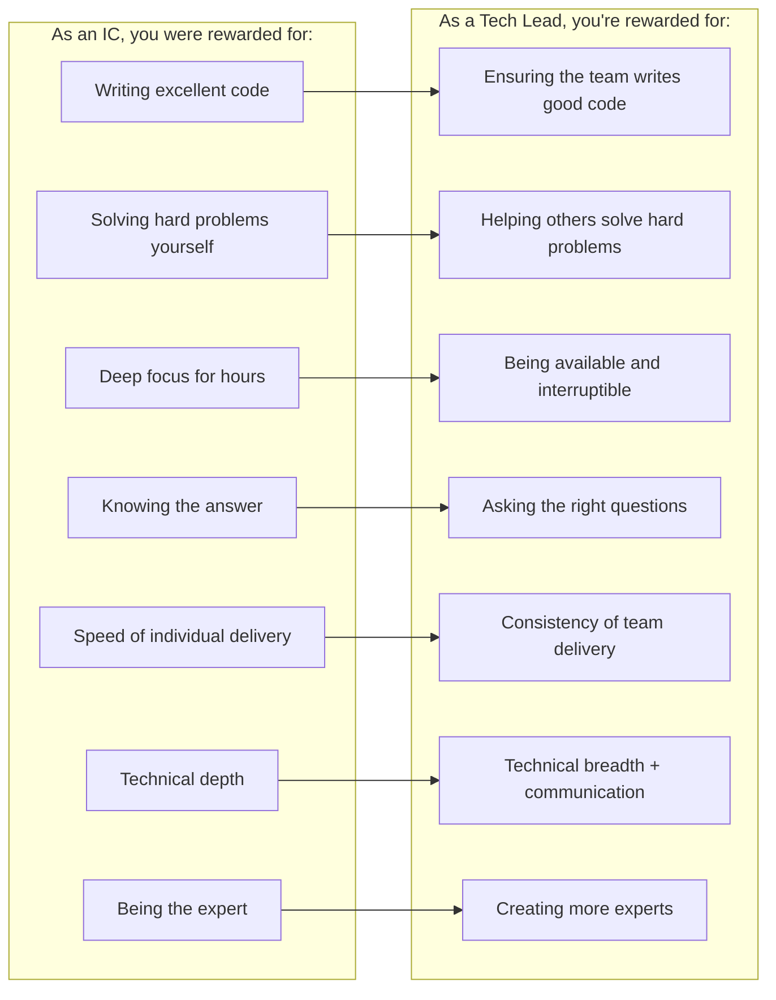
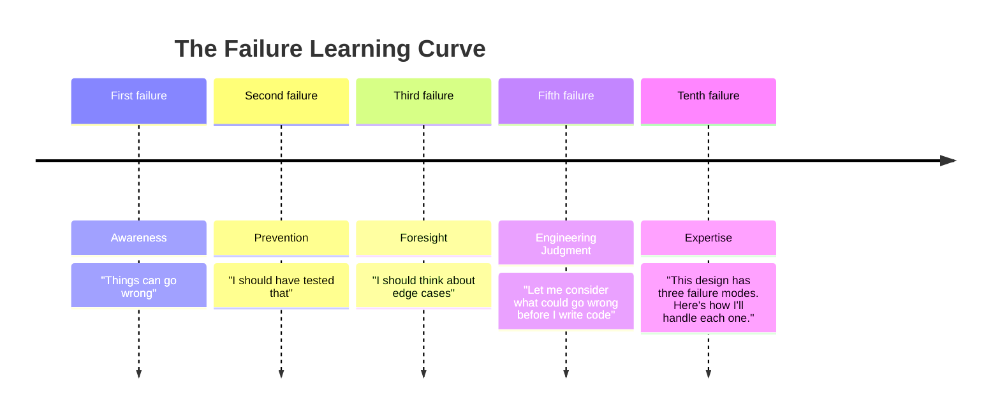
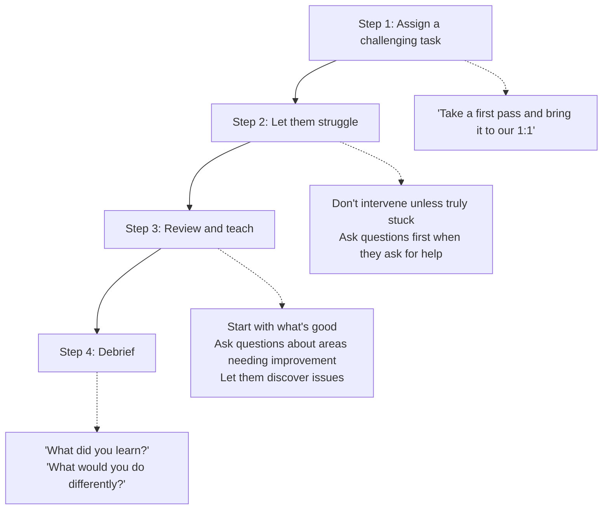

> **Complexity**: `[MEDIUM]` | **Time**: 2 hours | **Prerequisites**: None
>
> **Track**: Foundations / Engineering Leadership

### What You'll Be Able to Do

After completing this module, you will be able to:

1. **Design** mentorship programs that accelerate junior engineer growth through structured pairing, graduated autonomy, and deliberate skill-building
2. **Apply** coaching techniques (Socratic questioning, just-in-time teaching, productive struggle) that build problem-solving ability rather than dependency
3. **Evaluate** your own multiplier impact by measuring how your code reviews, pairing sessions, and knowledge sharing improve team-wide output
4. **Build** a culture of knowledge sharing through tech talks, documentation, and collaborative debugging that scales beyond one-on-one mentorship

---

## The 10x Engineer Myth

*There's a legend in software engineering about the "10x engineer"---the lone genius who writes more code, solves harder problems, and ships faster than everyone else combined.*

*The legend is wrong. Or rather, it's incomplete.*

The real 10x engineers aren't the ones who write 10x more code. They're the ones who make 10 other engineers twice as effective. They do this through mentorship, code review, knowledge sharing, and creating environments where everyone can do their best work.

Consider two engineers:

**Engineer A** writes 500 lines of production code per week. Exceptional output. But they work alone, rarely review others' code, and when they do, their feedback is terse and intimidating. Junior engineers are afraid to ask them questions. When Engineer A leaves the company (and they always do eventually), the team is left with a codebase only they understood.

**Engineer B** writes 200 lines of production code per week. But they also review 15 PRs, mentor 2 junior engineers, pair-program for 3 hours per week, and write documentation that prevents 20 questions per week. They've helped 3 engineers get promoted. Every engineer they've worked with ships faster and makes fewer mistakes.

Engineer A's impact: 500 lines/week. Total: 500.

Engineer B's impact: 200 lines/week + making 10 engineers 30% more productive = 200 + (10 x 150 improvement) = 1,700 lines-equivalent/week.

**Engineer B is the actual 10x engineer.** They just don't look like one in a sprint velocity chart.

This module teaches you how to become Engineer B---how to multiply your impact through others instead of maximizing your individual output.

---

## Why This Module Matters

At some point in every engineer's career, they hit a ceiling. Not a technical ceiling---they can still learn new frameworks, master new languages, solve harder problems. The ceiling is *impact*.

There are only so many hours in a day. No matter how talented you are, you can only write so much code, review so many designs, and debug so many incidents. Your individual output has a hard upper bound.

The only way to break through that ceiling is to **multiply your impact through others**. This means:

- Teaching engineers to solve problems you used to solve yourself
- Creating systems and documentation that answer questions without your involvement
- Building a team culture where people grow quickly and stay long
- Making every code review an investment in someone else's capability

This transition---from individual contributor to force multiplier---is the hardest and most important transition in an engineering career. It requires you to redefine "productivity" from "code I wrote" to "outcomes the team achieved."

> **The Bus Factor**
>
> The "bus factor" measures how many team members would need to be hit by a bus before the project stalls. If you're the only person who can deploy to production, debug the payment system, or understand the authentication flow, your bus factor is 1. That's not a sign of your importance---it's a sign of your failure to mentor. A strong mentor actively works to make themselves replaceable.

---

## What You'll Learn

- The IC to tech lead transition and the "multiplier mindset"
- How to give code review feedback that teaches, not just corrects
- Pairing, mobbing, and async feedback techniques
- Creating safe failure opportunities for junior engineers
- Building psychological safety and inclusive engineering cultures
- Measuring engineering effectiveness (beyond lines of code)

---

> **Stop and think**: Who is the person that has had the biggest multiplier effect on your career so far, and what specifically did they do differently than other engineers?

## Part 1: The IC to Tech Lead Transition

### What Changes When You Become a Tech Lead

The transition from individual contributor (IC) to tech lead is disorienting because the skills that made you a great IC are not the skills that make a great tech lead.



### The Emotional Difficulty

Nobody warns you about this: the transition *feels* like getting worse at your job. You write less code. You solve fewer problems directly. Your calendar fills with meetings. You feel like you're not "doing real work."

This feeling is normal, and it's wrong. You ARE doing real work. It just doesn't look like what you're used to.

> ### The Productivity Identity Crisis
>
> **Week 1 as Tech Lead:**
>
> - **Monday:** 3 hours of code review, 1 hour of mentoring, 2 hours of planning, 1 hour of 1:1s
> - **Tuesday:** Design review meeting, helped junior debug a concurrency issue, wrote ADR for caching strategy
> - **Wednesday:** Paired with mid-level engineer on API design, reviewed 4 PRs, unblocked deployment pipeline issue
> - **Thursday:** Sprint planning, architecture discussion with platform team, wrote technical spec for Q2 project
> - **Friday:** 1:1s, reviewed 3 PRs, helped new hire understand the authentication flow
>
> **Lines of code written:** 47
>
> **Your Brain:** *"I was useless this week. I barely wrote any code."*
>
> **Reality:** You unblocked 5 engineers, prevented 3 bugs from reaching production, transferred knowledge to a new hire, and shaped the technical direction for next quarter. Your team shipped 40% more than they would have without you.

### The Multiplier Mindset

The mindset shift is this: **your output is no longer measured by what you produce, but by what you enable.**

Ask yourself these questions at the end of each week:

1. Who did I unblock today?
2. What did I teach someone that they'll use for years?
3. What decision did I help the team make better?
4. What mistake did I help someone avoid?
5. What process did I improve that saves time every sprint?

If you can answer at least three of these with concrete examples, you had a productive week---even if you wrote zero lines of code.

---

> **Pause and predict**: If you review a junior engineer's code and find ten stylistic errors and one architectural flaw, how many of those issues should you comment on, and in what order?

## Part 2: Effective Code Review

### Code Review Is Teaching

Most engineers treat code review as quality control---finding bugs and enforcing style. That's the floor, not the ceiling. Great code review is a **teaching opportunity** disguised as a process.

Every PR review is a chance to:
- Share knowledge about the codebase
- Teach design patterns and best practices
- Explain *why* something should be different, not just *what*
- Model how to think about problems
- Build the reviewer's (and author's) engineering judgment

### The Code Review Spectrum

**Nitpicking (Low value, high annoyance)**
- *"Use camelCase here."*
- *"Add a blank line before the return statement."*
- *"This variable name should be longer."*
- *"I prefer map() over forEach()."*
> **Takeaway:** These should be handled by linters and formatters, not humans. If you're writing these comments, automate them instead.

**Correcting (Medium value, necessary but insufficient)**
- *"This will cause a null pointer exception if user is undefined."*
- *"This SQL query is vulnerable to injection."*
- *"This loop is O(n^2); it'll be slow with large datasets."*
> **Takeaway:** Important to catch, but misses the teaching opportunity. The author fixes the bug but doesn't learn to prevent it.

**Teaching (High value, lasting impact)**
- *"This will NPE if user is undefined. A pattern I've found helpful is to validate inputs at the function boundary---that way every function can assume its inputs are valid. See how we did this in the PaymentService: [link]. What do you think about that approach here?"*
- *"This SQL query concatenates user input directly, which opens us to injection attacks. Here's a quick article on parameterized queries: [link]. The short version: never put user input directly in SQL strings. Use `?` placeholders and let the database driver handle escaping. Want to pair on refactoring this? It's a pattern you'll use in every service."*
> **Takeaway:** The author learns a principle they'll apply forever. The reviewer invests 3 extra minutes for a permanent improvement.

### The Code Review Checklist for Mentors

When reviewing a junior engineer's PR, use this mental checklist:

| Check | Question to Ask Yourself | Example Comment |
|-------|------------------------|-----------------|
| **Correctness** | Does it work? Are there edge cases? | "What happens when the list is empty? Let's add a test for that." |
| **Design** | Is this the right approach? Could it be simpler? | "This solves the problem, but there's a simpler pattern. Have you seen the Strategy pattern? Here's how it could apply..." |
| **Readability** | Will someone understand this in 6 months? | "This function does 3 things. If we split it, each piece becomes easier to test and understand. What do you think?" |
| **Learning** | What principle can I teach here? | "Good instinct reaching for a cache here. One thing to think about: cache invalidation. What happens when the underlying data changes?" |
| **Confidence** | What did they do well? | "The error handling in this function is really clean. Nice work." |
| **Growth** | What's the next step in their development? | "Now that you're comfortable with REST APIs, I'd love for you to try designing the WebSocket endpoint for the next feature." |

### How to Phrase Feedback

The way you phrase feedback dramatically affects how it's received:

| Phrasing | Impact | Better Version |
|----------|--------|----------------|
| "This is wrong." | Shuts down. Author feels attacked. | "I think there might be an issue here---let me explain what I'm seeing." |
| "You should do X." | Prescriptive. Doesn't teach reasoning. | "Have you considered X? The reason I think it might work better is..." |
| "Why didn't you...?" | Accusatory. Implies they should have known. | "One approach I've seen work well here is... What do you think?" |
| "This is bad practice." | Vague and judgmental. | "This pattern can cause [specific problem] because [specific reason]. Here's an alternative..." |
| "Just use a map." | Dismissive. Doesn't explain why. | "A Map could simplify this because it lets you look up values in O(1) instead of looping. Want me to show you an example?" |
| "LGTM" (on a junior's PR) | Missed teaching opportunity. | "LGTM! One thing I liked: your test coverage for error cases. One thing to explore next time: consider adding a benchmark test for the sort function---it'll help you catch performance regressions." |

### The "Nit" Prefix

For truly minor suggestions that are optional, prefix with `nit:`. This signals that the comment is a preference, not a requirement, and the author can ignore it:

```
nit: I'd name this `processPayment` instead of `handlePayment`,
since "process" implies a transformation and "handle" implies
error handling in our codebase. But either works---not a blocker.
```

This small convention reduces review friction enormously. The author knows what's a suggestion and what's a requirement.

---

> **Stop and think**: When was the last time you pair programmed with someone? Were you primarily driving or navigating, and what did you learn from the experience?

## Part 3: Pairing, Mobbing, and Async Feedback

### Pair Programming: When and How

Pair programming is not about writing code faster. It's about **transferring knowledge in real time**. Used correctly, it's the fastest way to level up a junior engineer.

### When to Pair

| High Value | Low Value |
|------------|-----------|
| Complex debugging sessions | Routine CRUD implementation |
| Unfamiliar part of the codebase | Well-understood, repetitive tasks |
| Architecture/design decisions | Writing tests for existing code |
| Junior learning a new concept | Senior doing something they've done 100 times |
| Onboarding a new team member | Solo deep-focus work |

### The Driver / Navigator Model

**Driver (Hands on keyboard):**
- Writes the code
- Focuses on syntax and implementation
- Asks questions when stuck
- Thinks about the current line

**Navigator (Watches the screen):**
- Thinks about the big picture
- Catches bugs and typos
- Suggests approaches and patterns
- Thinks about edge cases
- Looks up documentation

> **Key Rule:** Switch roles every 20-30 minutes.

**For Mentoring:** Let the junior engineer drive. They learn by doing. The mentor navigates, asking guiding questions instead of dictating:
- **Good:** *"What do you think would happen if the input is null?"*
- **Bad:** *"Add a null check on line 14."*
- **Good:** *"How could we make this function easier to test?"*
- **Bad:** *"Extract that into a separate function."*

### Mob Programming

Mob programming extends pairing to the whole team: one screen, one keyboard, the entire team contributing. It sounds wildly inefficient. In practice, it's extraordinarily effective for:

- Solving problems nobody has solved before
- Onboarding multiple new engineers simultaneously
- Making complex architectural decisions with full team buy-in
- Breaking through blockers that have stalled the team

### Mob Programming Format

**Setup:**
- One large screen (or screen share)
- One person "drives" (types)
- Everyone else "navigates" (suggests, questions, researches)
- Driver rotates every 10-15 minutes
- Time-box to 90 minutes maximum (with a break at 45)

**Rules:**
1. The driver ONLY types what the navigators tell them (this ensures the driver isn't running ahead alone).
2. Anyone can suggest an approach.
3. Disagreements are resolved by trying both approaches.
4. Take breaks---mob programming is mentally intense.

**Anti-Patterns:**
- One person dominates the conversation
- The driver codes independently while others watch
- Sessions run longer than 90 minutes
- Used for tasks that don't benefit from collaboration

### Async Feedback

Not all mentoring happens synchronously. Async feedback scales better and respects people's focus time. Here are effective async mentoring techniques:

| Technique | How It Works | Best For |
|-----------|-------------|----------|
| **Detailed PR reviews** | Write thorough comments with explanations and links | Teaching patterns and best practices |
| **Code walkthrough recordings** | Record a Loom/video walking through a design or implementation | Explaining complex systems to new team members |
| **Written design feedback** | Comment on RFCs/design docs with thoughtful analysis | Teaching architectural thinking |
| **"TIL" Slack channel** | Team members share one thing they learned today | Building a culture of continuous learning |
| **Internal blog posts** | Write up how you solved a hard problem | Scaling knowledge beyond direct mentoring |
| **Annotated examples** | Write sample code with extensive comments explaining decisions | Teaching idioms and patterns |

---

> **Pause and predict**: What is the danger of creating a development environment where junior engineers are entirely insulated from experiencing failure in production?

## Part 4: Creating Safe Failure Opportunities

### Why Junior Engineers Need to Fail

This sounds counterintuitive: you want junior engineers to fail? Yes. Controlled failure is the fastest path to learning. The key word is "controlled."



THE PROBLEM: If junior engineers are never allowed to fail, they never develop engineering judgment. They follow rules without understanding why the rules exist.

> **Stop and think**: Think about a time you made a critical mistake in production. How did your team react, and how did that reaction affect your future work?

### Safe Failure Environments

Create opportunities where failure has minimal blast radius:

| Environment | Blast Radius | What They Learn |
|-------------|-------------|-----------------|
| **Local development** | Zero | Basic debugging, trial and error |
| **Feature branches** | Zero | Code review feedback, iteration |
| **Staging/dev environment** | Very low | Deployment process, integration issues |
| **Behind a feature flag** | Low | Production behavior, monitoring |
| **Low-traffic production path** | Medium | Real-world performance, error handling |
| **Internal tools** | Medium | Full ownership, end-to-end delivery |
| **High-traffic production** | High | NOT appropriate for learning through failure |

### The Mentor's Role in Safe Failure

Your job is not to prevent failure. Your job is to:

1. **Create the safety net**: Ensure failures are recoverable
2. **Guide, don't rescue**: Ask questions instead of giving answers
3. **Debrief without blame**: After a failure, ask "What did we learn?" not "What did you do wrong?"
4. **Normalize failure**: Share your own failure stories. "Let me tell you about the time I dropped a production database..."
5. **Escalate your trust gradually**: Start with low-risk tasks, increase responsibility as judgment develops



---

> **Pause and predict**: How can you tell the difference between a team with high psychological safety and one where people are just being "nice" to each other?

## Part 5: Psychological Safety

### What Psychological Safety Actually Means

Google's Project Aristotle (2015) studied 180 teams to find what makes teams effective. The single most important factor wasn't skill, experience, or having senior engineers. It was **psychological safety**---the belief that you won't be punished for making mistakes, asking questions, or proposing ideas.

### What Psychological Safety Is and Isn't

**Psychological Safety is NOT:**
- Being nice all the time
- Avoiding conflict
- Lowering the quality bar
- Agreeing with everyone
- Never giving critical feedback

**Psychological Safety IS:**
- Admitting mistakes without fear of punishment
- Asking "dumb" questions without being mocked
- Disagreeing with senior engineers respectfully
- Proposing unconventional ideas without ridicule
- Saying "I don't know" without losing credibility
- Giving honest feedback upward without retaliation

### Building Psychological Safety as a Tech Lead

Psychological safety is not declared. It is demonstrated. Every day, in small interactions.

| Action | Why It Matters | Example |
|--------|---------------|---------|
| **Admit your own mistakes publicly** | If the most senior person can be wrong, everyone else can too | "I missed a race condition in my design. Here's what I learned..." |
| **Thank people for finding bugs** | Reframes bug reports as contributions, not criticism | "Great catch on that edge case, Sarah. You probably saved us an outage." |
| **Ask questions in meetings** | Shows that not knowing is normal | "I'm not sure I understand how this interacts with the caching layer. Can someone explain?" |
| **Respond to mistakes with curiosity** | Blame kills safety. Curiosity builds it. | Instead of "Why did you do that?" ask "Walk me through your thinking---I want to understand the context." |
| **Give credit publicly** | People contribute more when they're recognized | "Raj's idea to use a circuit breaker here was really smart. It prevented exactly the failure mode we saw last week." |
| **Protect dissent** | The person who disagrees might be right | "Wait, Elena raised a concern about this approach. I want to hear her out before we move forward." |

### The "Failure Retrospective" Practice

Run a monthly "failure retrospective" where the team shares things that went wrong and what they learned.

### Failure Retrospective Format

**Frequency:** Monthly, 30 minutes
**Format:** Each person shares one failure or mistake from the month

**Rules:**
1. Failures are celebrated, not criticized.
2. Focus on learning, not blame.
3. The most senior person goes FIRST (models vulnerability).
4. No "but it worked out fine"---own the failure.
5. End each story with "What I'll do differently."

**Example:**
- **Tech Lead:** *"I approved a PR without testing the migration script. It worked in staging but failed in production because the staging database was missing 3 tables. What I'll do differently: always run migration scripts against a production-like database backup before approving."*
- **Junior Engineer:** *"I deployed on Friday at 4 PM and caused an alert storm. I didn't know about the no-Friday-deploys convention. What I'll do differently: check with the team before deploying late in the week, and I added it to our onboarding doc."*

---

> **Stop and think**: Have you ever worked with a "brilliant jerk"? What was the unseen cost to the rest of the team's productivity and morale?

## Part 6: Inclusive Engineering Cultures

### Why Inclusion Is an Engineering Problem

Inclusion isn't just an HR initiative. It directly affects engineering outcomes:

- **Diverse teams find more bugs.** A 2018 study at North Carolina State University found that diverse code review teams identified 15% more defects than homogeneous ones.
- **Inclusive teams retain talent.** Engineers who feel included stay 2x longer (Kapor Center, 2017). Turnover costs 50-200% of annual salary per engineer.
- **Psychological safety requires inclusion.** If some team members don't feel they belong, they won't speak up---and you'll miss their contributions.

### Practical Inclusion for Tech Leads

| Practice | Implementation | Why It Matters |
|----------|---------------|----------------|
| **Rotate meeting facilitators** | Different person leads each standup/retro | Prevents dominant voices from controlling every discussion |
| **Written before verbal** | Collect ideas in writing before discussing | Removes bias toward fast talkers and native speakers |
| **Inclusive meeting times** | Rotate meeting times for distributed teams | Respects that not everyone is in your timezone |
| **Interview diverse candidates** | Use structured interviews with consistent rubrics | Reduces bias in hiring (unstructured interviews are terrible predictors) |
| **Review promotion criteria** | Audit who gets promoted and why | Ensure criteria reward impact, not visibility or self-promotion |
| **Mentorship matching** | Pair underrepresented engineers with sponsors | Sponsorship (advocacy) is more impactful than mentorship (advice) alone |
| **Document tribal knowledge** | Write down unwritten rules and norms | Levels the playing field for newcomers who don't have informal networks |
| **Acknowledge different communication styles** | Some people think out loud, others need time to process | Don't penalize quiet people. Create space for async input. |

### The "Brilliant Jerk" Problem

Every team eventually faces this: a highly skilled engineer who is condescending, dismissive, or hostile to others. They write great code, but they make people miserable.

> ### The Brilliant Jerk Cost Analysis
>
> **What the Brilliant Jerk Produces:**
> - Exceptional individual output
> - Solves hard problems quickly
>
> **What the Brilliant Jerk Costs:**
> - Junior engineers stop asking questions (learning stops)
> - Team members avoid their code reviews (quality drops)
> - People leave the team (replacement cost: $150K-$300K each)
> - Remaining engineers disengage (productivity drops 20-40%)
> - Candidates decline offers after meeting them (hiring slows)
> - Psychological safety collapses (innovation stops)
>
> **The Math:**
> If one brilliant jerk causes 2 engineers to leave per year:
> - Replacement cost: 2 × $200K = $400K
> - Lost productivity during vacancy: 2 × 3 months × $15K/mo = $90K
> - Ramp-up time for replacements: 2 × 3 months × reduced output = $60K
> - **Total annual cost: ~$550K**
> 
> *No individual contributor's output is worth $550K/year in damage to the team.*
>
> **What to Do:**
> 1. Give clear, specific feedback about the behavior (not the person).
> 2. Set concrete expectations with a timeline.
> 3. If behavior doesn't change, manage them out.
> 4. NEVER tolerate brilliance as an excuse for cruelty.

---

> **Stop and think**: Reflect on your own team's metrics. Which of the DORA metrics do you think your team struggles with the most, and how could better mentorship improve it?

## Part 7: Measuring Engineering Effectiveness

### What Not to Measure

Before discussing good metrics, let's address the bad ones:

| Metric | Why It's Harmful |
|--------|-----------------|
| **Lines of code** | Incentivizes verbosity. The best code is often the shortest. |
| **Number of commits** | Incentivizes small, meaningless commits. |
| **Hours worked** | Incentivizes presence, not productivity. Punishes efficient engineers. |
| **Story points completed** | Teams inflate estimates to look productive. Points become meaningless. |
| **Number of PRs** | Incentivizes splitting work into tiny PRs regardless of logical grouping. |
| **Individual velocity** | Pits team members against each other. Discourages helping others. |

### DORA Metrics: The Industry Standard

The DevOps Research and Assessment (DORA) team at Google identified four metrics that reliably predict engineering team effectiveness:

### The Four DORA Metrics

**1. Deployment Frequency**
*How often does your team deploy to production?*
- **Elite:** Multiple times per day
- **High:** Once per day to once per week
- **Medium:** Once per week to once per month
- **Low:** Less than once per month

**2. Lead Time for Changes**
*How long from code commit to running in production?*
- **Elite:** Less than 1 hour
- **High:** 1 day to 1 week
- **Medium:** 1 week to 1 month
- **Low:** More than 1 month

**3. Change Failure Rate**
*What percentage of deployments cause a failure?*
- **Elite:** 0-15%
- **High:** 16-30%
- **Medium:** 31-45%
- **Low:** 46-60%

**4. Time to Restore Service**
*How long to recover from a failure in production?*
- **Elite:** Less than 1 hour
- **High:** Less than 1 day
- **Medium:** 1 day to 1 week
- **Low:** More than 1 week

> **Key Insight:** Elite teams score high on ALL FOUR metrics. Speed and stability are NOT trade-offs---they reinforce each other.

### SPACE Framework: A Broader View

DORA metrics focus on delivery. The SPACE framework (from Microsoft Research and GitHub) adds dimensions for developer satisfaction and collaboration:

### The SPACE Framework

**S - Satisfaction and Well-Being**
*Are developers happy and sustainable?*
- **Measures:** Survey scores, retention rates, burnout indicators

**P - Performance**
*What is the outcome of the developer's work?*
- **Measures:** Quality, reliability, customer impact

**A - Activity**
*How much output is being produced? (Use cautiously)*
- **Measures:** Deployment frequency, PR throughput

**C - Communication and Collaboration**
*How effectively does the team work together?*
- **Measures:** Review turnaround time, knowledge sharing, onboarding speed

**E - Efficiency and Flow**
*Can developers get work done without interruptions?*
- **Measures:** Flow state time, context switches, meeting load

### Mentorship-Specific Metrics

How do you know if your mentoring is working?

| Metric | How to Measure | Target |
|--------|---------------|--------|
| **Time to first PR** | Days from start date to first merged PR | < 1 week |
| **Time to first solo feature** | Weeks from start date to independently shipped feature | < 6 weeks |
| **Code review turnaround** | Hours from PR opened to first review | < 4 hours |
| **Questions asked in public channels** | Count of questions in team Slack | Increasing (means people feel safe asking) |
| **Knowledge sharing** | Blog posts, presentations, documentation PRs | At least 1 per person per quarter |
| **Promotion rate of mentees** | Percentage of mentees who get promoted within 18 months | > 50% |
| **Retention rate** | Percentage of team members still at company after 1 year | > 85% |

---

## Common Mistakes

| Mistake | Why It's a Problem | Better Approach |
|---------|-------------------|-----------------|
| **Giving answers instead of asking questions** | The mentee learns the answer but not how to find it. They'll come back with the same type of question next week. | Ask guiding questions. "What have you tried? What do you think is happening? Where would you look next?" |
| **Only reviewing for correctness** | Misses the teaching opportunity. The code works but the engineer doesn't grow. | Review for design, readability, and patterns. Explain the *why* behind your suggestions. |
| **Pairing by taking the keyboard** | The junior watches but doesn't internalize. They learn to be passive. | Let the junior drive. Navigate with questions, not commands. |
| **Assuming everyone learns the same way** | Some people learn by reading, some by doing, some by discussing. One approach doesn't fit all. | Ask your mentee: "How do you learn best?" Adapt your style. |
| **Protecting junior engineers from all failure** | They never develop judgment. They can follow rules but can't think independently. | Create safe failure environments. Let them make recoverable mistakes. Debrief afterward. |
| **Not giving positive feedback** | People don't know what they're doing well. They only hear about problems. Growth stalls because they don't know what to repeat. | For every piece of critical feedback, give at least one piece of specific positive feedback. "The way you handled that error case was really thorough." |
| **Tolerating brilliant jerks** | One toxic person can destroy a team's psychological safety, cause turnover, and negate years of culture building. | Address behavior directly and early. Set clear expectations. If behavior doesn't change, the person must go---regardless of technical skill. |
| **Measuring inputs instead of outcomes** | Lines of code, hours worked, and commits per day incentivize the wrong behaviors and punish efficient engineers. | Use DORA and SPACE metrics. Measure deployment frequency, lead time, change failure rate, and developer satisfaction. |

---

## Quiz

Test your understanding of mentorship and engineering effectiveness.

**Question 1:** Your VP of Engineering wants to hire a "10x engineer" to rescue a struggling project and asks you to evaluate a candidate who works completely isolated but delivers 1,000 lines of perfect code a week. How should you evaluate this candidate's true impact on the team?

<details>
<summary>Show Answer</summary>
You should evaluate the candidate not by their individual line count, but by how they affect the rest of the team. The mythical 10x engineer is a single point of failure who produces high individual output but leaves the team with a codebase only they understand, creating bottlenecks. A true 10x engineer makes 10 other engineers more effective through mentorship, code review, knowledge sharing, and creating enabling environments. If the candidate refuses to review code or mentor others, their isolated output will eventually be outweighed by the drag they place on team collaboration and the bus factor risk they introduce. Their true impact is limited, and they will likely stunt the growth of junior engineers.
</details>

**Question 2:** You're reviewing a junior engineer's PR. They used a nested loop that's O(n^2) where a hash map would be O(n). Which response is better?

A) "This is O(n^2). Use a hash map."

B) "This works correctly---nice job on the edge case handling. One optimization to consider: the nested loop checks every item against every other item. If we put the items in a hash map first, we can do lookups in O(1) instead of O(n), making the whole thing O(n) instead of O(n^2). For our current dataset of 100 items, it won't matter. But if this list grows to 10,000 items, the difference is 100 million operations vs 10,000. Want to try refactoring it? Happy to pair if you'd like."

<details>
<summary>Show Answer</summary>
Response B is the correct approach because it seizes a critical teaching opportunity rather than just enforcing a rule. It starts with positive feedback to build confidence, then explains the underlying principle of time complexity with concrete examples (100 million vs 10,000 operations). This contextualizes the impact of the choice and helps the junior engineer understand why the optimization matters as the dataset scales. By offering to pair and framing it as an exploration, it invites collaboration instead of demanding compliance. Response A is technically correct but teaches nothing; the junior would fix this instance but wouldn't recognize the pattern next time because they don't understand the underlying reasoning.
</details>

**Question 3:** Your team is evaluating its performance, and leadership wants to focus solely on increasing the number of features shipped per month (velocity). You suggest adopting DORA metrics instead. What specific scenario demonstrates why focusing on velocity alone is dangerous, and how do DORA metrics provide a safer picture?

<details>
<summary>Show Answer</summary>
Focusing solely on feature velocity incentivizes teams to take shortcuts, skip testing, and deploy large, risky batches of code to meet quotas. This inevitably leads to catastrophic production outages and technical debt, ultimately slowing the team down in the long run. The four DORA metrics (Deployment Frequency, Lead Time for Changes, Change Failure Rate, Time to Restore Service) provide a balanced picture because they measure both speed and stability simultaneously. Elite teams score high on all four metrics because speed and stability are not trade-offs; they reinforce each other. By tracking failure rates and recovery times alongside deployment frequency, DORA metrics ensure the team is shipping reliably rather than just recklessly fast.
</details>

**Question 4:** A junior engineer deployed a change that caused a 10-minute outage. How should you respond?

<details>
<summary>Show Answer</summary>
Your first priority must be to help them restore service and fix the outage without expressing anger or panic. After the incident is resolved, you should initiate a blameless debrief by asking them to walk you through what happened and what they would do differently next time. It is crucial to normalize the experience by sharing a time you caused an outage yourself, which helps maintain psychological safety and keeps them from hiding future mistakes. Ultimately, you must recognize that if a junior engineer can cause a production outage with a routine deployment, the deployment pipeline itself lacks necessary safeguards. You should fix the system rather than punishing the person, ensuring they walk away feeling supported and having learned a valuable lesson.
</details>

**Question 5:** During a critical architecture meeting, a senior engineer proposes a new microservices design. A junior engineer notices a major flaw in how data consistency will be handled but stays silent because they don't want to look foolish or offend the senior engineer. What team dynamic is missing here, and what is the long-term cost of ignoring it?

<details>
<summary>Show Answer</summary>
The missing dynamic is psychological safety, which is the belief that team members will not be punished or humiliated for speaking up, asking questions, or making mistakes. When psychological safety is absent, teams suffer from groupthink and critical flaws go unaddressed because engineers are too intimidated to challenge authority. The long-term cost is that the team will ship broken architectures, junior engineers will remain stagnant because they fear asking questions, and diverse perspectives will be entirely lost. You can build this safety by actively encouraging dissent, praising people when they point out flaws, and having senior engineers publicly admit their own mistakes. This ensures that the best ideas surface regardless of who proposes them.
</details>

**Question 6:** You are pair programming with a new hire to debug a complex race condition. You know exactly what the fix is, and it would only take you two minutes to type it out, but it's taking the new hire over twenty minutes to navigate the file. Why is it critical that you keep your hands off the keyboard, and what should your role be instead?

<details>
<summary>Show Answer</summary>
It is critical that the new hire continues to "drive" (keep their hands on the keyboard) because people learn by actively doing, not by passively watching someone else type. If you take over, you deprive them of the struggle required to build mental models, muscle memory, and confidence in the codebase. Instead of dictating syntax, your role as the navigator is to ask guiding questions, point out edge cases, and think about the big picture while they focus on the immediate logic. Resisting the urge to take over is the essence of mentorship; the five minutes you save by typing the solution yourself will cost the junior an hour of deep learning.
</details>

**Question 7:** You have an engineer on your team who single-handedly resolves the most difficult Sev-1 incidents and writes incredibly efficient code. However, they regularly leave condescending comments on junior engineers' PRs and roll their eyes when people ask questions. Leadership wants to promote them. Why is this a dangerous idea, and how should you address the situation?

<details>
<summary>Show Answer</summary>
Promoting this engineer is dangerous because they are a "brilliant jerk" whose individual output is vastly outweighed by the damage they do to team cohesion and psychological safety. Their behavior causes junior engineers to stop asking questions and halts team learning, ultimately leading to high turnover and severe productivity drops across the rest of the group. No individual's technical output is worth the hundreds of thousands of dollars in replacement costs and lost velocity caused by a toxic environment. You must address this by giving them clear, specific feedback about their behavior and setting a strict timeline for improvement. If they refuse to change how they treat their teammates, they must be managed out, regardless of their technical brilliance.
</details>

---

## Hands-On Exercise: Review a Junior Engineer's PR

### Scenario

A junior engineer named Alex has submitted a pull request for a function that finds duplicate users in a database. The function works correctly but has several issues you'd want to address in a mentoring code review.

> **Stop and think**: Think about the worst PR review you've ever received. How did it make you feel, and how did it affect your productivity that week?

Here is Alex's code:

```python
# user_dedup.py - Find and merge duplicate user accounts

import psycopg2
import os

def find_duplicates():
    conn = psycopg2.connect(
        host=os.environ['DB_HOST'],
        port=os.environ['DB_PORT'],
        dbname=os.environ['DB_NAME'],
        user=os.environ['DB_USER'],
        password=os.environ['DB_PASSWORD']
    )

    cursor = conn.cursor()
    cursor.execute("SELECT id, email, name, created_at FROM users")
    all_users = cursor.fetchall()

    duplicates = []

    for i in range(len(all_users)):
        for j in range(i + 1, len(all_users)):
            if all_users[i][1].lower() == all_users[j][1].lower():
                duplicates.append({
                    'original': all_users[i],
                    'duplicate': all_users[j]
                })

    if len(duplicates) > 0:
        for dup in duplicates:
            original_id = dup['original'][0]
            duplicate_id = dup['duplicate'][0]
            cursor.execute(
                "UPDATE orders SET user_id = " + str(original_id) +
                " WHERE user_id = " + str(duplicate_id)
            )
            cursor.execute(
                "DELETE FROM users WHERE id = " + str(duplicate_id)
            )
        conn.commit()
        print(f"Merged {len(duplicates)} duplicate users")
    else:
        print("No duplicates found")

    conn.close()
    return duplicates


if __name__ == '__main__':
    find_duplicates()
```

### Your Task

Write a code review with **at least 6 comments** on Alex's PR. Your review must:

1. **Start with something positive** --- find at least one thing Alex did well
2. **Identify the critical issues** --- there are at least 3 serious problems in this code
3. **Teach, don't just correct** --- explain *why* each issue matters and how to fix it
4. **Prioritize** --- mark which issues are blockers vs suggestions
5. **Offer to help** --- suggest pairing or point to learning resources
6. **End with encouragement** --- acknowledge the effort and set expectations for iteration

### Issues to Find

Here are hints about what to look for (try to find them yourself first):

<details>
<summary>Hint 1: Security</summary>
The SQL queries use string concatenation with user data. This is vulnerable to SQL injection, even though the data comes from the database itself---it's a dangerous pattern to learn.
</details>

<details>
<summary>Hint 2: Performance</summary>
The nested loop comparing every user to every other user is O(n^2). With 100,000 users, that's 10 billion comparisons. A hash map (or a SQL GROUP BY query) would be dramatically faster.
</details>

<details>
<summary>Hint 3: Data Safety</summary>
The function fetches all users into memory, then deletes users and reassigns orders without any transaction safety. If the process crashes halfway through, data is left in an inconsistent state.
</details>

<details>
<summary>Hint 4: Error Handling</summary>
No try/except blocks. No connection cleanup on failure. Environment variables accessed without defaults. Any error crashes the process silently.
</details>

<details>
<summary>Hint 5: Design</summary>
One function does everything: connects to the database, fetches data, finds duplicates, merges records, and prints output. This is impossible to test in isolation.
</details>

<details>
<summary>Hint 6: Operational Safety</summary>
This function deletes user records with no dry-run mode, no logging, no backup, and no confirmation. Running it in production could cause irreversible data loss.
</details>

### Success Criteria

- [ ] Review starts with specific positive feedback (not generic "good job")
- [ ] At least 6 comments addressing different issues
- [ ] Each comment explains WHY the issue matters (not just WHAT to change)
- [ ] Comments are phrased as teaching opportunities, not commands
- [ ] Critical issues (security, data safety) are clearly marked as blockers
- [ ] Minor suggestions are marked as non-blocking (e.g., prefixed with `nit:`)
- [ ] Review ends with encouragement and an offer to pair or discuss
- [ ] Tone is constructive throughout---Alex should feel motivated to improve, not discouraged

### Stretch Goals

- Rewrite one section of the code to show Alex what the improved version looks like
- Suggest a test that Alex should write for the `find_duplicates` logic
- Identify which improvement would be the best learning opportunity for Alex to tackle first

---

## Did You Know?

- **Google's "Project Aristotle"** (2015) studied 180 teams and found that WHO was on the team mattered less than HOW the team worked together. Psychological safety was the #1 predictor of team success. Teams of "average" engineers with high psychological safety consistently outperformed teams of "star" engineers without it.

- **The term "pair programming" was popularized by Kent Beck** in his 1999 book "Extreme Programming Explained," but the practice predates it. Fred Brooks observed in the 1970s that the best code at IBM was written by pairs of programmers working together. He just didn't have a name for it.

- **Netflix has no formal mentorship program.** Instead, they embed mentoring into their culture through "context, not control"---leaders provide context about strategy and constraints, then trust engineers to make good decisions. When mistakes happen, the response is "what did we learn?" not "who's responsible?" This approach works because it treats every interaction as a mentoring moment.

- **Studies show that diverse code review teams catch 15% more defects** (North Carolina State University, 2018). The reason is simple: people with different backgrounds and experiences notice different things. A reviewer who has experienced a particular class of bug is more likely to spot it. Homogeneous teams have homogeneous blind spots.

---

## Further Reading

- **"The Manager's Path"** by Camille Fournier --- The definitive guide to the IC-to-management transition. Chapters on tech lead and mentoring are essential.

- **"Accelerate"** by Nicole Forsgren, Jez Humble, and Gene Kim --- The research behind DORA metrics. Data-driven proof that speed and stability aren't trade-offs.

- **"The Fearless Organization"** by Amy Edmondson --- The research behind psychological safety. Edmondson coined the term and has studied it for 25 years.

- **"An Elegant Puzzle"** by Will Larson --- Systems-thinking approach to engineering leadership. Practical advice on team dynamics and growing engineers.

- **"Radical Candor"** by Kim Scott --- Framework for giving feedback that is both caring and direct. The "Ruinous Empathy" quadrant is a common trap for new mentors.

---

## Next Module

Return to the [Engineering Leadership README]() for the full module index and learning path.

---

*"The best engineers are not the ones who know the most. They're the ones who make everyone around them better."* --- Unknown

*"Tell me and I forget, teach me and I may remember, involve me and I learn."* --- Benjamin Franklin