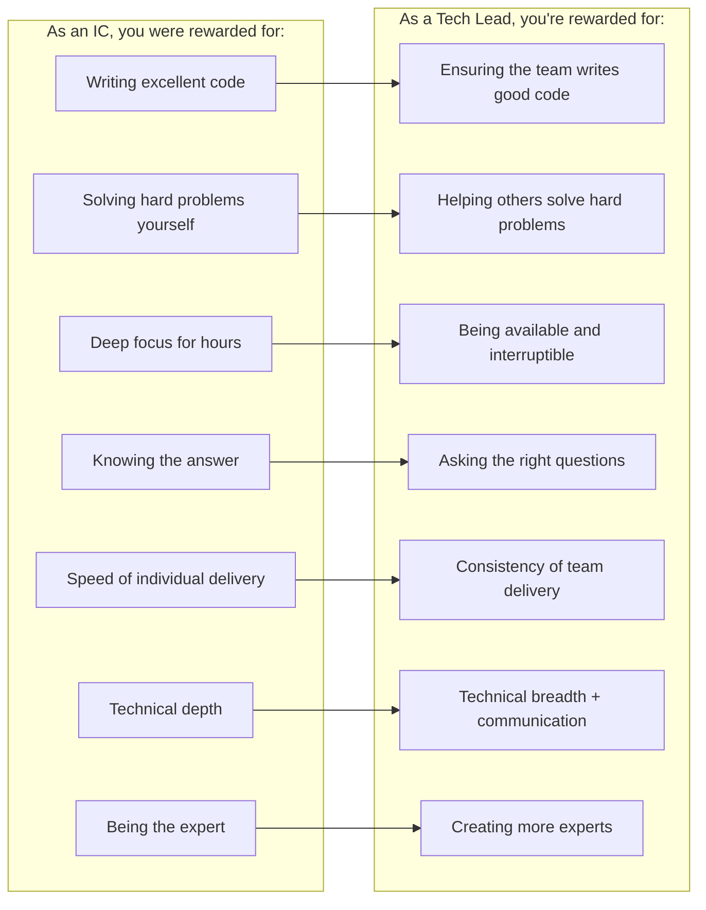
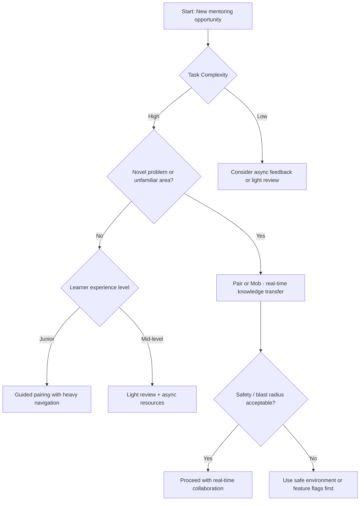
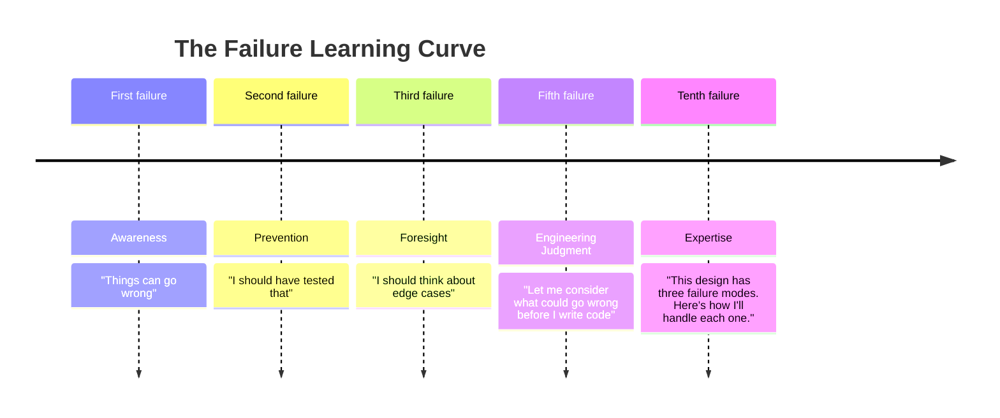
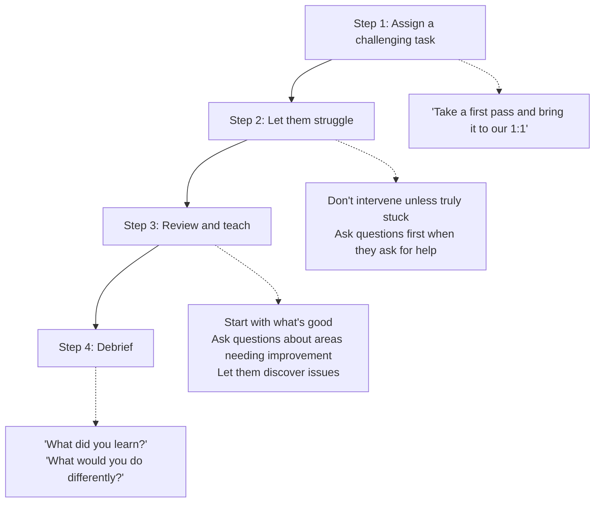

> **Complexity**: `[MEDIUM]` | **Time**: 2 hours | **Prerequisites**: None
>
> **Track**: Foundations / Engineering Leadership

## What You'll Be Able to Do

After completing this module, you will be able to:

1. **Design** mentorship and coaching practices — structured pairing, graduated autonomy, Socratic questioning, and just-in-time teaching — that build problem-solving ability rather than dependency
2. **Evaluate** your own multiplier impact by measuring how your code reviews, pairing sessions, and knowledge sharing improve team-wide output
3. **Build** a culture of knowledge sharing through tech talks, documentation, and collaborative debugging that scales beyond one-on-one mentorship
4. **Implement** decision frameworks for when to use different mentoring modalities like pairing, mobbing, or async feedback based on context and learning goals
5. **Foster** psychological safety and inclusive practices that enable high-performing engineering teams while addressing anti-patterns like the brilliant jerk dynamic

---

## The 10x Engineer Myth

There's a legend in software engineering about the "10x engineer"—the lone genius who writes more code, solves harder problems, and ships faster than everyone else combined. The legend is wrong. Or rather, it's incomplete. 

The real force multipliers in engineering organizations are not the ones who maximize their personal output in isolation. They are the ones who systematically increase the effectiveness of everyone around them. This happens through consistent mentorship practices, thoughtful code reviews that transfer knowledge rather than just gatekeep, structured knowledge sharing that reduces repeated questions across the team, and the deliberate creation of environments where psychological safety allows people to take risks, ask questions, and grow rapidly. 

When you examine two different types of engineers over time, the contrast becomes clear. One type focuses exclusively on their own delivery metrics. They produce substantial individual output but their colleagues struggle with the parts of the system only they understand. Questions go unanswered or are met with impatience. When this person eventually moves on to new opportunities, as talented engineers often do, the team experiences a significant productivity drop as institutional knowledge evaporates and tribal knowledge gaps become apparent. Their impact, while real in the short term, proves surprisingly limited when measured across quarters or years.

In contrast, the engineer who embraces the multiplier role may write less code personally in any given week. However, they invest time in reviewing pull requests with explanations that teach underlying principles, they pair with team members to transfer not just solutions but approaches to problem solving, they document patterns so that questions get answered by searchable artifacts rather than repeated interruptions, and they create space for others to present their work and learn from collective discussion. Over time, the engineers they have worked with ship features more reliably, make better technical decisions independently, and require less oversight. The team's overall throughput increases measurably even though the multiplier's personal commit count might appear lower on velocity dashboards. This is the actual 10x impact. It does not show up neatly in individual contribution graphs but it transforms team performance in durable ways.

This module teaches you how to become that multiplier. It explores the transition from measuring success by personal code written to measuring success by team outcomes enabled. The practices covered here—effective teaching through code review, creating safe opportunities for productive struggle, building psychological safety, choosing the right mentoring modality for the situation, and measuring effectiveness through frameworks that capture collaboration rather than just activity—represent durable approaches that outlast specific tools or organizational structures. These are the skills that allow senior engineers to have impact that scales beyond their individual capacity.

---

## Why This Module Matters

At some point in every engineer's career, they hit a ceiling. Not a technical ceiling—they can still learn new frameworks, master new languages, solve harder problems. The ceiling is impact. There are only so many hours in a day. No matter how talented you are, you can only write so much code, review so many designs, and debug so many incidents yourself. Your individual output has a hard upper bound determined by the finite nature of time and attention.

The only way to break through that ceiling is to multiply your impact through others. This means teaching engineers to solve the categories of problems you used to solve yourself so that your time is freed for higher leverage work. It means creating systems and documentation that answer common questions without requiring your direct involvement, allowing the team to maintain velocity even when you are in meetings or focused on strategic initiatives. It means building a team culture where people grow quickly, take ownership, and choose to stay with the organization because they feel supported in their development. It means treating every code review, every pairing session, and every design discussion as an investment in someone else's long-term capability rather than just a quality gate.

This transition from individual contributor to force multiplier is the hardest and most important transition in an engineering career. It requires you to redefine what productivity means. Instead of focusing on code you personally wrote or bugs you personally fixed, you begin measuring your success by outcomes the team achieved because of the capabilities you helped them develop. This shift can feel uncomfortable at first because the rewards are delayed and indirect. You might go several days without writing any production code while unblocking multiple team members, preventing recurring classes of errors through better patterns, and shaping technical direction through questions rather than directives. The visible artifacts of your work become less obvious even as your real impact grows substantially.

The bus factor concept illustrates this perfectly. The bus factor measures how many team members would need to be unavailable before the project stalls. If you are the only person who can deploy to production, debug the payment system, or understand the authentication flow, your bus factor is one. That is not a sign of your unique importance. It is evidence that you have not successfully transferred knowledge or built redundant capabilities in the team. A strong mentor actively works to raise the bus factor by ensuring critical knowledge is distributed, processes are documented, and multiple people have hands-on experience with key systems. This requires intentional effort and a willingness to invest time in teaching even when it slows down the immediate task.

> **The Bus Factor**
>
> The "bus factor" measures how many team members would need to be hit by a bus before the project stalls. If you're the only person who can deploy to production, debug the payment system, or understand the authentication flow, your bus factor is 1. That's not a sign of your importance—it's a sign of your failure to mentor. A strong mentor actively works to make themselves replaceable in the best possible way by distributing capability across the team.

---

> **Stop and think**: Who is the person that has had the biggest multiplier effect on your career so far, and what specifically did they do differently than other engineers?

## Part 1: The IC to Tech Lead Transition

### What Changes When You Become a Tech Lead

The transition from individual contributor to tech lead is disorienting because the skills that made you a great individual contributor are not the same skills that make a great tech lead. The reward structures change in fundamental ways that can create an identity crisis if not understood clearly.


```mermaid
graph LR
    subgraph IC["As an IC, you were rewarded for:"]
        direction TB
        IC1["Writing excellent code"]
        IC2["Solving hard problems yourself"]
        IC3["Deep focus for hours"]
        IC4["Knowing the answer"]
        IC5["Speed of individual delivery"]
        IC6["Technical depth"]
        IC7["Being the expert"]
    end

    subgraph TL["As a Tech Lead, you're rewarded for:"]
        direction TB
        TL1["Ensuring the team writes good code"]
        TL2["Helping others solve hard problems"]
        TL3["Being available and interruptible"]
        TL4["Asking the right questions"]
        TL5["Consistency of team delivery"]
        TL6["Technical breadth + communication"]
        TL7["Creating more experts"]
    end

    IC1 --> TL1
    IC2 --> TL2
    IC3 --> TL3
    IC4 --> TL4
    IC5 --> TL5
    IC6 --> TL6
    IC7 --> TL7
```

This diagram captures the essence of the shift. Where individual contributors are often recognized for deep expertise and personal velocity, tech leads are recognized for their ability to develop expertise in others and maintain consistent team performance even when they are not the one writing the code. This requires a different mix of technical breadth, communication skills, and patience with being interrupted because your availability directly enables others to maintain momentum.

### The Emotional Difficulty

Nobody warns you about this: the transition feels like getting worse at your job. You write less code. You solve fewer problems directly. Your calendar fills with meetings and 1:1s. You find yourself answering the same questions repeatedly and spending time on coordination that feels less "real" than debugging a complex distributed systems issue. This feeling is normal, and it is also misleading. You are doing real work. It simply does not look like the work that previously earned you recognition and promotion.

The productivity identity crisis is particularly acute in the first few months. **Hypothetical scenario:** imagine starting your first week in a tech lead role. You spend significant time in code reviews explaining not just what should change but why certain patterns are preferred in this codebase. You conduct 1:1s with team members to understand their career goals and current challenges. You facilitate a design discussion where instead of dictating the architecture, you ask questions that help the team arrive at a better decision collectively. At the end of the week you might have written very little production code yourself. Your brain, conditioned by years of measuring value through personal output, might conclude that you were unproductive. The reality is that you unblocked several engineers who were stuck, prevented architectural decisions that would have created future pain, transferred knowledge that will compound over time, and shaped the team's technical direction in ways that will pay dividends for months. The impact is real but harder to see immediately than a merged pull request with your name on it.

### The Multiplier Mindset

The mindset shift at the core of this transition is that your output is no longer measured primarily by what you produce directly but by what you enable others to produce. This requires reframing how you evaluate your own effectiveness at the end of each week or sprint. Instead of counting lines of code or tickets closed, ask yourself questions that surface the multiplier effect: Who did I help unblock today through a well-timed question or pointer to existing documentation? What principle did I teach someone that they will be able to apply independently in future work? What decision did the team make better because I facilitated discussion rather than providing the answer? What mistake did I help the team avoid by sharing a pattern from past experience? What process did I improve that will save the team time in every future sprint?

If you can identify concrete examples for several of these questions, you have had a genuinely productive week even if your personal contribution graph shows relatively little activity. This mindset does not come naturally. It must be practiced deliberately until it becomes the default way you think about your role. The practices in the rest of this module—effective code review, pairing and mobbing, creating safe failure, building psychological safety, and measuring the right things—are all expressions of this multiplier mindset in action.

**Landscape snapshot — as of 2026-06. This changes fast; verify against vendor docs before relying on specifics.** Tools like Linear or Jira can help track work, while Backstage/TechDocs can publish and help engineers discover knowledge-sharing artifacts; note that mentorship-outcome tracking is not a native Backstage capability and typically relies on Jira/Linear or custom reporting. However, the durable practice is choosing metrics that reflect learning and team capability growth rather than activity volume. Present these tools as illustrative examples of how teams operationalize the principles rather than as the principles themselves. The core frameworks of mentorship, psychological safety, and effective knowledge transfer remain consistent regardless of which project management or developer portal tool your organization adopts.

> **Pause and predict**: If you review a junior engineer's code and find ten stylistic errors and one architectural flaw, how many of those issues should you comment on, and in what order?

## Part 2: Effective Code Review

### Code Review Is Teaching

Most engineers initially treat code review primarily as a quality control mechanism for finding bugs and enforcing style guides. While catching defects is necessary, it represents only the baseline of what a code review can accomplish. Great code review functions as a teaching opportunity that is disguised as a routine process. Each pull request becomes a chance to share context about why the codebase evolved certain patterns, to teach design principles that apply beyond this specific change, to explain the reasoning behind preferences rather than just stating them, to model thoughtful approaches to problem decomposition, and to build the author's engineering judgment over time.

When done well, code review becomes one of the highest leverage activities a tech lead can engage in because the lessons compound. A well-explained comment about input validation at function boundaries does not just fix one bug. It helps the author internalize a principle they will apply in every service they write going forward. The few extra minutes invested in explanation pay dividends across many future contributions.

### The Code Review Spectrum

Code reviews exist on a spectrum from low-value nitpicking to high-value teaching that builds lasting capability. At the low end is nitpicking about stylistic preferences that should be automated by linters and formatters. Comments like suggestions about variable naming conventions or whitespace are better handled by tools so that humans can focus on substantive issues. These types of comments create review friction without corresponding learning value.

In the middle is correction of concrete defects. Pointing out a potential null pointer, a SQL injection risk, or a performance problem in a specific loop is important work. However, if the review stops at identifying the problem and stating the fix, the author learns the specific correction for this instance but does not necessarily develop the mental model that would prevent similar issues in different contexts going forward.

At the high end is teaching that connects the specific issue to broader principles. Instead of simply saying a query is vulnerable, the reviewer explains the general pattern of parameterized queries, provides context about why string concatenation creates risk even when the immediate data seems safe, links to documentation or examples from the existing codebase, and offers to pair on the refactoring. This approach takes more time in the moment but creates engineers who can recognize and avoid entire classes of problems independently. The investment in explanation builds judgment rather than just compliance.

### The Code Review Checklist for Mentors

When reviewing work from less experienced engineers, having a structured mental checklist helps ensure that reviews address the full range of learning opportunities rather than focusing narrowly on correctness. The checklist includes verifying that the code works and handles edge cases, evaluating whether the chosen design is appropriate or if simpler alternatives exist, assessing whether the code will remain understandable months later, identifying principles that can be taught through this specific change, calling out what the author did well to build confidence, and considering what the next growth step for this engineer might be.

This checklist transforms review from a reactive defect-finding process into a proactive development conversation. By explicitly considering the learning dimension in every review, you ensure that feedback compounds over time.

### How to Phrase Feedback

The specific language used in code review comments has an outsized effect on how the feedback is received and whether it leads to growth or defensiveness. Phrasing that sounds like absolute judgment ("This is wrong") tends to shut down the recipient and makes them feel attacked rather than supported. Prescriptive language ("You should do X") skips the reasoning step and teaches compliance rather than judgment. Questions that imply the author should have known better ("Why didn't you...?") create shame rather than curiosity.

More effective phrasing starts with curiosity, provides context for why an alternative might be preferable, connects the suggestion to observable consequences or established patterns in the codebase, and invites collaboration. For truly minor preferences that are not requirements, the "nit:" prefix has become a widely adopted convention that sets clear expectations. It signals that the comment is offered for consideration but is not a blocker, which reduces anxiety and review friction significantly.

The difference between these approaches is not trivial. Poorly phrased feedback can discourage engineers from seeking review in the future or from taking risks in their work. Well-phrased feedback that teaches principles builds both capability and confidence.

### The "Nit" Prefix

For truly minor suggestions that are optional, prefix with `nit:`. This signals that the comment is a preference, not a requirement, and the author can ignore it:

```text
nit: I'd name this `processPayment` instead of `handlePayment`,
since "process" implies a transformation and "handle" implies
error handling in our codebase. But either works---not a blocker.
```

This small convention reduces review friction enormously. The author knows what's a suggestion and what's a requirement.

---

> **Stop and think**: When was the last time you pair programmed with someone? Were you primarily driving or navigating, and what did you learn from the experience?

## Part 3: Pairing, Mobbing, and Async Feedback

### Pair Programming: When and How

Pair programming is frequently misunderstood as simply a technique for writing code faster. When practiced as a mentoring tool, its primary value is transferring knowledge and mental models in real time. The driver and navigator roles, when used intentionally, create a dynamic where the less experienced engineer builds confidence through doing while the more experienced engineer guides through questions rather than directives.

The decision about when to pair should be driven by learning potential rather than habit. Complex debugging, unfamiliar areas of the codebase, architectural decisions, and onboarding situations offer high value for pairing. Routine tasks that are well understood or purely mechanical offer lower value and may be better handled individually or through other feedback mechanisms. The key is matching the mentoring modality to the specific learning goal and context.

### The Driver / Navigator Model

In the driver/navigator model, the person with hands on the keyboard focuses on the immediate implementation details while the navigator maintains the bigger picture, watches for potential issues, suggests approaches, and looks up relevant information. Switching roles regularly prevents either person from becoming passive. When mentoring, it is particularly important to let the junior engineer drive as much as possible. The learning happens through the active work of typing, making decisions, and experiencing the consequences of those decisions in the moment. The navigator's job is to ask questions that surface considerations the driver might not have thought about yet.

### Mob Programming

Mob programming takes the pairing concept to the entire team with one person driving at a time while the group navigates. Although it can feel inefficient at first glance, it proves remarkably effective for solving novel problems, onboarding multiple people simultaneously, reaching consensus on complex decisions, and breaking through longstanding blockers. The format requires discipline—rotating the driver frequently, ensuring the driver only implements what the group agrees upon, resolving disagreements through experimentation rather than authority, and keeping sessions timeboxed to maintain intensity without burnout.

### Async Feedback

Not all effective mentoring needs to happen in real time. Async techniques often scale better and respect individual focus patterns. Detailed pull request reviews with thorough explanations, recorded code walkthroughs, written feedback on design documents, shared learning channels, internal technical blog posts, and heavily annotated example code all provide ways to transfer knowledge without requiring synchronized schedules. The most effective teams combine synchronous and asynchronous approaches based on the nature of the knowledge being transferred and the preferences of the people involved.

### Decision Framework

Choosing the right mentoring approach depends on several factors including the complexity of the task, the experience level of the learner, the urgency of the work, and the type of knowledge being transferred.


```mermaid
flowchart TD
    Start["Start: New mentoring opportunity"] --> Complexity{"Task Complexity"}
    Complexity -->|High| Novelty{"Novel problem or unfamiliar area?"}
    Complexity -->|Low| Routine["Consider async feedback or light review"]
    Novelty -->|Yes| PairOrMob["Pair or Mob - real-time knowledge transfer"]
    Novelty -->|No| Experience{"Learner experience level"}
    Experience -->|Junior| GuidedPair["Guided pairing with heavy navigation"]
    Experience -->|Mid-level| LightReview["Light review + async resources"]
    PairOrMob --> Safety{"Safety / blast radius acceptable?"}
    Safety -->|Yes| Proceed["Proceed with real-time collaboration"]
    Safety -->|No| SafeEnv["Use safe environment or feature flags first"]
```

This framework helps tech leads match their approach to the specific situation rather than defaulting to whatever feels most comfortable. The durable principle is that the mentoring modality should serve the learning goal and respect both the learner's current capability and the constraints of the production environment.

---

> **Pause and predict**: What is the danger of creating a development environment where junior engineers are entirely insulated from experiencing failure in production?

## Part 4: Creating Safe Failure Opportunities

### Why Junior Engineers Need to Fail

The idea that junior engineers should be allowed to fail sounds counterintuitive to many new tech leads. The instinct is to protect them from mistakes that could have negative consequences. However, controlled failure is one of the most effective ways humans develop nuanced judgment. Without experiencing the consequences of decisions, even in safe ways, people tend to follow rules mechanically without understanding the underlying reasons those rules exist. They lack the mental models needed to adapt when situations fall outside the documented patterns.

The learning curve from failure is predictable. Initial failures create basic awareness that things can go wrong. Subsequent failures lead to prevention strategies and foresight about edge cases. With enough safe repetitions, engineers develop the ability to anticipate multiple failure modes before writing code. This progression cannot be fully achieved through observation or instruction alone. Some learning requires the emotional weight of having caused a problem and then resolving it.

**Hypothetical scenario:** consider two junior engineers. One works in an environment where all potential failures are caught by seniors before they reach production. They follow established patterns carefully but become anxious when facing ambiguous situations not covered by existing documentation. The other works in an environment with appropriate guardrails like feature flags, comprehensive automated testing, and blameless debrief practices. When they cause a contained incident, the team treats it as a learning opportunity. Over time, the second engineer develops stronger judgment and becomes comfortable making decisions in uncertain conditions. The difference in long-term capability is substantial even though both started with similar technical aptitude.

### Safe Failure Environments

Not all failure is equally valuable for learning. The key is creating environments where the blast radius is contained while the learning potential remains high. Local development and feature branches offer zero production impact but still provide debugging and iteration experience. Staging environments add integration complexity with minimal risk. Feature flags allow production exposure for specific user segments or with easy rollback. The progression should be deliberate, matching the engineer's demonstrated judgment with increasing responsibility.

The mentor's role is not to prevent all failure but to ensure that failures are recoverable, to guide through questions rather than rescue with answers, to facilitate blameless debriefs that focus on system improvements and personal learning, to normalize the experience by sharing their own past mistakes, and to increase trust gradually as capability is demonstrated.


```mermaid
timeline
    title The Failure Learning Curve
    First failure : Awareness : "Things can go wrong"
    Second failure : Prevention : "I should have tested that"
    Third failure : Foresight : "I should think about edge cases"
    Fifth failure : Engineering Judgment : "Let me consider what could go wrong before I write code"
    Tenth failure : Expertise : "This design has three failure modes. Here's how I'll handle each one."
```


```mermaid
flowchart TD
    Step1["Step 1: Assign a challenging task"] --> Step2["Step 2: Let them struggle"]
    Step2 --> Step3["Step 3: Review and teach"]
    Step3 --> Step4["Step 4: Debrief"]

    Step1 -.-> S1_Desc["'Take a first pass and bring it to our 1:1'"]
    Step2 -.-> S2_Desc["Don't intervene unless truly stuck<br/>Ask questions first when they ask for help"]
    Step3 -.-> S3_Desc["Start with what's good<br/>Ask questions about areas needing improvement<br/>Let them discover issues"]
    Step4 -.-> S4_Desc["'What did you learn?'<br/>'What would you do differently?'"]
```

This structured approach to safe failure turns inevitable mistakes into predictable learning opportunities rather than sources of shame or hidden technical debt.

---

> **Pause and predict**: How can you tell the difference between a team with high psychological safety and one where people are just being "nice" to each other?

## Part 5: Psychological Safety

### What Psychological Safety Actually Means

Psychological safety refers to the shared belief that team members will not be punished or humiliated for speaking up, asking questions, admitting mistakes, or proposing unconventional ideas. It is the foundation that allows teams to leverage the full capability of every member rather than having good ideas remain unspoken because of fear. Research from multiple organizations has consistently shown that this factor predicts team performance more reliably than individual talent levels or technical skills alone.

### What Psychological Safety Is and Isn't

It is important to distinguish psychological safety from related but distinct concepts. It is not about being nice all the time or avoiding all conflict. Healthy teams with strong psychological safety can have vigorous technical debates because people trust that disagreement will not damage relationships or lead to retaliation. It is not about lowering standards. In fact, when people feel safe to admit gaps in their knowledge or to point out problems, the overall quality of work typically improves because issues surface earlier.

Psychological safety manifests as the ability to admit mistakes publicly without fear, to ask basic questions without being made to feel incompetent, to respectfully disagree with more senior colleagues, to propose ideas that might seem unrealistic at first, to say "I don't know" without losing credibility, and to provide upward feedback without worrying about career consequences.

### Building Psychological Safety as a Tech Lead

Psychological safety cannot be declared in a meeting or enforced through policy. It is built through consistent small behaviors repeated over time. Senior leaders admitting their own mistakes publicly signals that vulnerability is safe. Thanking people for surfacing problems reframes bug reports as valuable contributions. Asking questions in meetings demonstrates that not knowing is normal. Responding to mistakes with curiosity rather than blame encourages transparency. Giving credit generously and protecting minority opinions all contribute to an environment where the best ideas surface regardless of who proposes them.

A regular practice like a monthly failure retrospective where everyone including the most senior person shares a recent mistake and what they learned can accelerate the development of safety. When the most experienced team members model vulnerability first, it gives permission for everyone else to participate authentically.

### The "Brilliant Jerk" Problem

Every engineering organization eventually encounters the challenge of a highly skilled individual whose behavior negatively impacts those around them. **Hypothetical scenario:** imagine an engineer who consistently solves the most difficult technical problems and writes exceptionally efficient code. However, their interactions with the team involve condescending comments on pull requests, visible impatience when questions are asked in public channels, and a general demeanor that makes less experienced engineers hesitant to seek help or share ideas.

While their individual contributions may be substantial, the cumulative effect on the team is deeply negative. Junior engineers stop asking questions, which slows their growth and allows problems to remain hidden longer. Team members may avoid submitting code for review from this person, leading to quality gaps. Over time, turnover increases as people choose to work in less toxic environments. The innovation that comes from diverse perspectives dries up because people self-censor to avoid potential ridicule. The net impact on organizational performance is negative despite the individual's strong personal output. Addressing this pattern requires direct, specific feedback focused on observable behaviors, clear expectations with timelines, and ultimately removal from the team if the behavior does not change. Technical brilliance does not excuse behavior that destroys team capability.

---

> **Stop and think**: Have you ever worked with a "brilliant jerk"? What was the unseen cost to the rest of the team's productivity and morale?

## Part 6: Inclusive Engineering Cultures

### Why Inclusion Is an Engineering Problem

Inclusion is not solely an HR concern. It has direct, measurable effects on engineering outcomes. Teams with diverse backgrounds and experiences tend to identify more potential failure modes during design and review because different life experiences create different mental models. When people feel they belong and can contribute fully, they are more likely to stay with the organization, reducing the substantial costs associated with turnover and knowledge loss. Psychological safety cannot exist in an environment where certain groups feel they do not belong or must work harder to have their contributions recognized.

### Practical Inclusion for Tech Leads

Practical steps that tech leads can take include rotating facilitation responsibilities so that no single voice dominates discussions, collecting ideas in writing before verbal discussion to reduce bias toward fast talkers, being thoughtful about meeting times in distributed teams, using structured interview processes with consistent rubrics, regularly auditing promotion criteria and outcomes for unintended bias, creating mentorship and sponsorship pairings that connect underrepresented engineers with advocates, documenting tribal knowledge so that informal networks are not the only path to information, and explicitly making space for different communication styles including those who prefer processing time before speaking.

These practices are not about lowering standards. They are about removing artificial barriers so that the best ideas and capabilities can surface regardless of who proposes them.

### Measuring Engineering Effectiveness

Before discussing useful metrics, it is worth examining common but harmful ones. Focusing on lines of code, number of commits, hours worked, story points completed in isolation, or individual velocity tends to incentivize the wrong behaviors. These measures encourage verbosity, meaningless small changes, presence theater, inflated estimates, fragmentation of work, and competition rather than collaboration. They penalize the very mentoring and knowledge sharing behaviors that create multiplier effects.

More effective measurement frameworks look at outcomes, collaboration quality, and sustainable delivery. The DORA metrics measure software delivery performance, and the published set has evolved — **as of 2026-06, DORA describes five metrics**: deployment frequency, change lead time, change fail rate, failed deployment recovery time (which replaced the older time-to-restore framing), and deployment rework rate. Together they capture both throughput and stability, showing that elite performing teams achieve both rather than trading one for the other; verify the current set at dora.dev, since the model continues to change. The SPACE framework expands this view to include satisfaction, performance, activity, communication, and efficiency, providing a more holistic picture that includes developer experience and collaboration effectiveness.

Mentorship-specific signals include how quickly new team members can make their first meaningful contribution, how rapidly they progress to independent feature ownership, review turnaround times, the volume of public questions (which can indicate safety to ask), the rate of knowledge sharing artifacts like documentation or presentations, promotion rates among mentees, and overall team retention. These indicators, when tracked thoughtfully over time, help tech leads understand whether their multiplier efforts are having the intended effect.

---

> **Stop and think**: Reflect on your own team's metrics. Which aspects of delivery and collaboration do you think your team struggles with the most, and how could better mentorship practices improve them?

## Part 7: Putting It All Together

The practices described throughout this module work together as an integrated system for multiplying impact. Effective code review builds judgment. Pairing and mobbing transfer tacit knowledge that documentation alone cannot capture. Safe failure opportunities develop foresight and resilience. Psychological safety ensures that learning from failure actually happens rather than being hidden. Inclusive practices ensure that the full capability of the team is available rather than limited by who feels comfortable speaking. Thoughtful measurement keeps the focus on durable outcomes rather than superficial activity.

Becoming a multiplier is a long-term practice rather than a destination. It requires ongoing self-reflection, willingness to receive feedback on your own mentoring effectiveness, and continuous refinement of your approach based on what actually helps your specific team members grow. The reward is seeing engineers you have worked with take on increasing responsibility, ship increasingly complex work with confidence, and eventually become multipliers themselves. This compounding effect is what separates organizations that grow sustainably from those that remain dependent on a small number of heroic individuals.

## Patterns & Anti-Patterns

**Effective multiplier patterns** include deliberately creating space for productive struggle while providing safety nets, documenting architectural decisions in standardized formats so that context is preserved, using regular lightweight knowledge sharing mechanisms that become part of the team rhythm rather than special events, matching mentoring intensity to both the learner's current capability and the risk level of the work, and regularly reflecting on whether your interventions are building capability or creating dependency.

**Common anti-patterns** include defaulting to heroic individual problem solving instead of teaching others how to solve the class of problem, allowing brilliant but toxic individuals to remain on the team because of their individual output, measuring success through personal activity metrics that disincentivize mentoring, failing to adapt mentoring approaches to individual learning styles, and treating documentation and knowledge sharing as optional activities rather than core responsibilities of senior roles.

These patterns and anti-patterns represent durable organizational dynamics that appear across different technologies, team sizes, and industry verticals. The specific tools used to implement them will change, but the underlying principles of building capability in others, maintaining safety while allowing learning through experience, and measuring what actually matters remain consistent.

## Did You Know?

- **Google's Project Aristotle research** identified psychological safety as the single most important factor in team effectiveness. The quality of interactions and the environment in which people work proved more predictive of success than the individual talents of team members.
- **Pair programming practices** have roots going back decades in software development. The core insight that two people working together can produce better outcomes through real-time knowledge transfer has been validated across many different contexts and team types.
- **Measurement frameworks like DORA and SPACE** emerged from large-scale studies of software delivery performance. They demonstrated that elite teams achieve both high speed and high stability rather than trading one for the other, and that developer satisfaction and collaboration quality are crucial leading indicators.
- **Blameless approaches to incidents and failures** can improve both learning and psychological safety. When teams focus on understanding systems and improving processes rather than assigning individual blame, they identify more systemic issues and create more durable fixes.

## Common Mistakes

| Mistake | Why It's a Problem | Better Approach |
|---------|--------------------|-----------------|
| Giving answers instead of asking questions | Creates dependency and prevents development of independent problem-solving capability. The learner gets the fish but never learns to fish. | Use Socratic questioning to guide the learner through their own reasoning process. Ask what they have tried, what they think is happening, and where they would look next. |
| Focusing code reviews only on correctness | Misses the substantial teaching opportunity. The immediate bug is fixed but the engineer does not internalize principles that prevent similar issues. | Always include explanation of why the change matters, connection to broader patterns, and questions that help the author develop judgment. |
| Taking the keyboard during pairing with juniors | The learner becomes passive. They watch but do not build the muscle memory or mental models that come from doing the work themselves. | Let the junior drive. Navigate with questions that surface considerations and let them make decisions within safe bounds. |
| Using the same mentoring style for every person | Ignores real differences in how people learn best. Some thrive on hands-on doing while others benefit more from reading or discussion first. | Ask mentees explicitly how they learn best and adapt your approach. Check in regularly about what is working and what is not. |
| Protecting juniors from all possible failure | Prevents development of engineering judgment. Rules are followed without understanding why they exist. | Create controlled environments with appropriate guardrails. Debrief after incidents focusing on learning rather than blame. |
| Measuring personal productivity by individual output metrics | Discourages the very behaviors that create multiplier effects. Engineers optimize for visible personal activity rather than team outcomes. | Track team-level outcomes, growth of mentees, reduction in repeated questions, and improvement in DORA and SPACE metrics. |
| Tolerating brilliant jerks | One toxic individual can destroy psychological safety for the entire team, leading to hidden problems, turnover, and lost innovation. | Address specific observable behaviors early with clear expectations. Remove from team if behavior does not improve regardless of individual technical output. |
| Treating mentorship as optional or extra work | Prevents the transition to multiplier mindset. The highest leverage work is deprioritized in favor of immediate visible tasks. | Recognize mentoring, reviewing, and knowledge sharing as core responsibilities of senior roles. Allocate time for them explicitly in planning. |

## Quiz

**Question 1:** Your VP of Engineering wants to hire a "10x engineer" to rescue a struggling project and asks you to evaluate a candidate who works completely isolated but delivers substantial individual output. How should you evaluate this candidate's true impact on the team?

<details>
<summary>Show Answer</summary>
You should evaluate the candidate not by their individual output alone but by how they affect the rest of the team. The mythical 10x engineer who works in isolation often creates single points of failure and knowledge bottlenecks. A true multiplier makes other engineers more effective through mentorship, thorough code reviews that teach principles, knowledge sharing that reduces repeated questions, and creation of systems that outlast their personal involvement. If the candidate shows no interest in reviewing others' work, documenting patterns, or helping juniors grow, their isolated output will likely be outweighed by the drag they place on team collaboration, the bus factor risk they introduce, and the stunted growth of less experienced engineers. True impact compounds through others rather than remaining individual.
</details>

**Question 2:** You're reviewing a junior engineer's pull request that contains both minor style issues and a significant architectural concern related to error handling. Which response best aligns with the multiplier mindset and why?

<details>
<summary>Show Answer</summary>
The best response starts with specific positive feedback about what the author did well, addresses the architectural concern by explaining the underlying principle and why it matters for maintainability and reliability, connects it to existing patterns in the codebase, offers to pair on the refactoring if helpful, and marks minor style issues as non-blocking or automatable through linters. This approach seizes the teaching opportunity, builds the author's confidence by starting with strengths, helps them understand the "why" behind the architectural recommendation rather than just the "what," and maintains psychological safety. It treats the review as an investment in the engineer's long-term capability rather than simply a quality gate. This directly supports the outcome of applying coaching techniques that build problem-solving ability.
</details>

**Question 3:** Your team is evaluating its performance and leadership wants to focus primarily on increasing feature velocity measured by story points completed. You suggest adopting broader frameworks instead. What makes focusing solely on velocity dangerous, and how do more balanced measurement approaches help?

<details>
<summary>Show Answer</summary>
Focusing solely on velocity incentivizes shortcuts, reduced testing, larger riskier deployments, and technical debt accumulation that eventually slows the team down. It also discourages mentoring, documentation, and other multiplier activities that do not show up directly in point tallies. Balanced frameworks like DORA's metrics (as of 2026-06: deployment frequency, change lead time, change fail rate, failed deployment recovery time, and deployment rework rate) examine throughput and stability together, showing that sustainable speed requires stability. The SPACE framework further incorporates satisfaction, communication, and efficiency, ensuring that developer experience and collaboration quality are not sacrificed. These approaches align with measuring multiplier impact because they capture the outcomes of good mentorship such as faster onboarding, better collaboration, and sustainable delivery rather than just individual activity. This probes the outcome around measuring engineering effectiveness beyond simplistic metrics.
</details>

**Question 4:** A junior engineer causes a production incident during their first solo deployment. How should you respond in a way that supports both immediate recovery and long-term growth while maintaining psychological safety?

<details>
<summary>Show Answer</summary>
The immediate priority is restoring service and fixing the issue without expressing blame or panic, as emotional reactions can destroy safety and cause the engineer to hide future problems. Once stable, facilitate a blameless debrief focused on understanding the sequence of events, what was learned, what system improvements could prevent similar incidents, and what the engineer would do differently next time. Share a relevant example from your own experience to normalize that mistakes happen even to experienced engineers. Examine whether the deployment process itself provided adequate safeguards or if the expectations for "solo" deployment were set appropriately for their current experience level. The goal is for the engineer to walk away feeling supported, having learned concrete lessons, and motivated to continue taking ownership rather than becoming risk-averse. This directly supports outcomes around creating safe failure opportunities and building psychological safety.
</details>

**Question 5:** During a design review, a junior team member notices a potential consistency problem with the proposed approach but remains silent. What team dynamic is likely missing, and what are the long-term consequences if this pattern continues?

<details>
<summary>Show Answer</summary>
The missing dynamic is psychological safety—the shared belief that speaking up with concerns or questions will not result in negative social or career consequences. When this is absent, critical flaws go unaddressed, groupthink takes over, and the team misses valuable perspectives that could improve designs. Over time, junior engineers stop developing their technical voice, knowledge sharing decreases, innovation suffers because diverse viewpoints are not heard, and the team becomes overly dependent on the loudest or most senior voices. As a tech lead, you can address this by explicitly inviting input from quieter members, publicly thanking people who raise concerns, having senior engineers model vulnerability by admitting gaps in their own understanding, and following up privately with anyone who seemed hesitant to speak. This connects directly to the outcome of building inclusive cultures and psychological safety.
</details>

**Question 6:** You are working with a new team member who learns best through reading and reflection rather than immediate hands-on coding. They have asked for resources before starting a complex task. How should you adapt your mentoring approach and why does this matter for their development?

<details>
<summary>Show Answer</summary>
You should respect their stated learning preference by providing high-quality written resources, annotated examples, or design documents first, then follow up with a discussion to check understanding before moving to implementation. Forcing them into immediate pairing or mobbing when their preference is different would likely create frustration and reduce the effectiveness of the learning experience. By asking explicitly how people learn best and adapting your style, you demonstrate respect for individual differences and increase the likelihood that the knowledge will actually be internalized. This connects to the outcome of designing mentorship programs that accelerate growth through approaches matched to individual needs rather than one-size-fits-all methods. Over time, you can gently expand their comfort zone with hands-on work once foundational understanding is established through their preferred modality.
</details>

**Question 7:** Your organization is considering promoting a very strong individual contributor who consistently delivers difficult features but regularly leaves dismissive comments on pull requests and shows impatience with questions from newer team members. From a multiplier perspective, should this promotion be supported and why or why not?

<details>
<summary>Show Answer</summary>
The promotion should not be supported without clear evidence of behavioral change because this person exhibits the brilliant jerk anti-pattern. Their individual technical contributions, while valuable, are outweighed by the damage they do to psychological safety, knowledge sharing, and the growth of other engineers. Junior team members will stop asking questions or seeking review from them, which creates hidden risks and slows collective learning. Turnover is likely to increase as people seek less toxic environments. True multipliers improve the performance of those around them rather than optimizing only for personal output. The organization should provide specific feedback about the observable behaviors, set clear expectations with a timeline for improvement, and only consider promotion if the individual demonstrates consistent change in how they interact with the team. This directly probes the outcome around building inclusive cultures and avoiding anti-patterns that destroy team capability.
</details>

## Hands-On Exercise: Review a Junior Engineer's PR

### Scenario

**Hypothetical scenario:** a junior engineer named Alex has submitted a pull request for a function that finds duplicate users in a database. The function works correctly but has several issues you'd want to address in a mentoring code review.

> **Stop and think**: Think about the worst PR review you've ever received. How did it make you feel, and how did it affect your productivity that week?

Here is the function Alex wrote to find and merge duplicate user accounts. Read it carefully before drafting your review, paying attention to how it manages the database connection, builds its queries, and performs destructive deletes:

```python
# user_dedup.py - Find and merge duplicate user accounts

import psycopg2
import os

def find_duplicates():
    conn = psycopg2.connect(
        host=os.environ['DB_HOST'],
        port=os.environ['DB_PORT'],
        dbname=os.environ['DB_NAME'],
        user=os.environ['DB_USER'],
        password=os.environ['DB_PASSWORD']
    )

    cursor = conn.cursor()
    cursor.execute("SELECT id, email, name, created_at FROM users")
    all_users = cursor.fetchall()

    duplicates = []

    for i in range(len(all_users)):
        for j in range(i + 1, len(all_users)):
            if all_users[i][1].lower() == all_users[j][1].lower():
                duplicates.append({
                    'original': all_users[i],
                    'duplicate': all_users[j]
                })

    if len(duplicates) > 0:
        for dup in duplicates:
            original_id = dup['original'][0]
            duplicate_id = dup['duplicate'][0]
            cursor.execute(
                "UPDATE orders SET user_id = " + str(original_id) +
                " WHERE user_id = " + str(duplicate_id)
            )
            cursor.execute(
                "DELETE FROM users WHERE id = " + str(duplicate_id)
            )
        conn.commit()
        print(f"Merged {len(duplicates)} duplicate users")
    else:
        print("No duplicates found")

    conn.close()
    return duplicates


if __name__ == '__main__':
    find_duplicates()
```

### Your Task

Write a complete code review with at least six comments on Alex's pull request, approaching it as a mentoring opportunity that builds judgment rather than a gate that simply blocks the merge. Your review must:

1. Start with something positive — find at least one thing Alex did well
2. Identify the critical issues — there are at least 3 serious problems in this code
3. Teach, don't just correct — explain *why* each issue matters and how to fix it
4. Prioritize — mark which issues are blockers vs suggestions
5. Offer to help — suggest pairing or point to learning resources
6. End with encouragement — acknowledge the effort and set expectations for iteration

### Issues to Find

Here are hints about the categories of problems worth looking for, but resist opening them until you have tried to find each issue yourself, since the productive struggle is where the real learning happens:

<details>
<summary>Hint 1: Security</summary>
The SQL queries use string concatenation with user data. This is vulnerable to SQL injection, even though the data comes from the database itself—it's a dangerous pattern to learn.
</details>

<details>
<summary>Hint 2: Performance</summary>
The nested loop comparing every user to every other user is O(n^2). With large datasets this becomes impractical. A hash map or SQL-based approach would be dramatically more efficient.
</details>

<details>
<summary>Hint 3: Data Safety</summary>
The function fetches all users into memory, then performs updates and deletes without transaction safety or backup mechanisms. A crash midway could leave data inconsistent.
</details>

<details>
<summary>Hint 4: Error Handling</summary>
No try/except blocks. No guaranteed connection cleanup on failure. Environment variables accessed without defaults or validation. Any error crashes the process.
</details>

<details>
<summary>Hint 5: Design</summary>
One large function does everything from connection management to business logic to output. This is difficult to test, reuse, or maintain.
</details>

<details>
<summary>Hint 6: Operational Safety</summary>
The function performs destructive operations with no dry-run mode, no detailed logging, no confirmation step, and no backup capability. Running it could cause irreversible data loss.
</details>

### Success Criteria

- [ ] Review starts with specific positive feedback (not generic "good job")
- [ ] At least 6 comments addressing different issues
- [ ] Each comment explains WHY the issue matters (not just WHAT to change)
- [ ] Comments are phrased as teaching opportunities, not commands
- [ ] Critical issues (security, data safety, destructive operations) are clearly marked as blockers
- [ ] Minor suggestions are marked as non-blocking (e.g., prefixed with `nit:`)
- [ ] Review ends with encouragement and an offer to pair or discuss further
- [ ] Tone is constructive throughout—Alex should feel motivated to improve, not discouraged

### Stretch Goals

- Rewrite one section of the code to show Alex what the improved version looks like
- Suggest a test that Alex should write for the `find_duplicates` logic
- Identify which improvement would be the best learning opportunity for Alex to tackle first and explain why


## Sources

- [Understanding Team Effectiveness - re:Work by Google](https://rework.withgoogle.com/guides/understanding-team-effectiveness/steps/introduction/)
- [Psychological Safety - Amy Edmondson](https://www.amycedmondson.com/)
- [An Elegant Puzzle: Systems of Engineering Management - Will Larson](https://lethain.com/elegant-puzzle/)
- [The Manager's Path: A Guide to Navigating the Career Stages of Software Engineering - Camille Fournier](https://www.oreilly.com/library/view/the-managers-path/9781491973882/)
- [Accelerate: The Science of Lean Software and DevOps - Nicole Forsgren, Jez Humble, Gene Kim](https://itrevolution.com/book/accelerate/)
- [The SPACE of Developer Productivity - ACM Queue](https://queue.acm.org/detail.cfm?id=3454124)
- [Pair Programming - Martin Fowler](https://martinfowler.com/bliki/PairProgramming.html)
- [Site Reliability Engineering - Google SRE Book](https://sre.google/sre-book/table-of-contents/)
- [Blameless PostMortems - Etsy Code as Craft](https://codeascraft.com/2012/05/22/blameless-postmortems/)
- [Google Engineering Practices - Code Review](https://google.github.io/eng-practices/review/)
- [re:Work Guides on Manager and Mentorship Practices](https://rework.withgoogle.com/guides/)

All sources were selected for their focus on durable principles rather than transient tool-specific guidance. Verify current availability before relying on any specific link as web locations can change.

## Next Module

Return to the [Engineering Leadership README](../README.md) for the full module index and learning path.

