> **Complexity**: `[MEDIUM]`
>
> **Time to Complete**: 50-60 minutes
>
> **Prerequisites**: [Reliability Engineering Track](/platform/foundations/reliability-engineering/) (recommended)
>
> **Track**: Foundations

## What You'll Be Able to Do

After completing this module, you will be able to perform five core engineering tasks that separate monitoring-heavy organizations from teams that can debug novel production behavior without emergency code changes:

1. **Compare** logs-first, metrics-first, and traces-first observability approaches and justify a starting point for your architecture and primary failure domain.
2. **Diagnose** why traditional monitoring leaves blind spots in distributed, high-cardinality production systems.
3. **Evaluate** whether on-call engineers can answer novel questions about system behavior without shipping new code or changing configuration.
4. **Design** an observability strategy that supports debugging unknown-unknowns, not only firing alerts on predefined conditions.
5. **Apply** the control-theory definition of observability to judge whether a software system can be understood from its telemetry alone.

---

> **Pause and predict**: If all your dashboard metrics are green but customers are reporting massive failures, where does the fault lie? Is it the system, the dashboard, or the questions the dashboard was designed to answer?

## Why This Module Matters

Consider the standard on-call scenario. It is 3:00 AM. The pager alerts the on-call engineer: "High latency detected in the checkout path." The engineer opens the primary dashboard. Application CPU is normal. Database memory is normal. The aggregate error rate is low. But user support is escalating complaints. Something is wrong, and nobody can see what it is.

This scenario highlights the gap between **monitoring** and **observability**. Monitoring tells you when predefined things go wrong. Observability lets you understand why your system is behaving the way it is—even when you did not predict the specific failure mode in advance. In complex distributed systems, you cannot anticipate every failure state. You need systems that let operators ask new, specific questions without deploying new code or waiting for new telemetry to be collected. The diagram and channel transcript below illustrate the monitoring trap that catches many on-call engineers when aggregate dashboards disagree with customer reports.

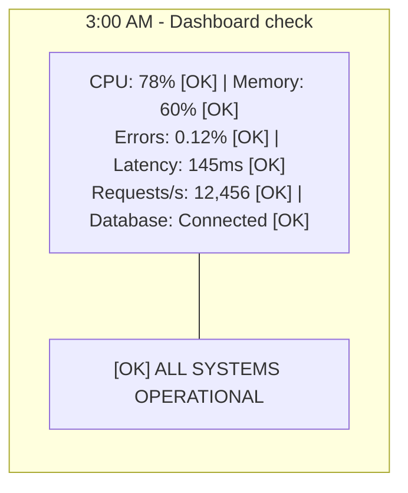

```text
3:05 AM - Slack channel

Support: "Users reporting checkout failures"
Support: "12 tickets in the last 5 minutes"
Support: "All from premium users?"

Engineer: "Dashboard shows everything green..."
Engineer: "Let me check logs..."
Engineer: "3.2 million log lines in the last hour"
Engineer: "Can't search by user ID"
Engineer: "Can't correlate across services"
Engineer: "I have no idea what's happening"
```

The production dashboard answered every question it was designed to answer. It could not answer the only question that mattered: why are these users failing right now?

> **The Car Dashboard Analogy**
>
> A traditional car dashboard represents monitoring: it shows predefined metrics (speed, fuel level, engine temperature). When something complex happens—a grinding noise or a vibration at exactly 65 miles per hour—the dashboard provides no help. A mechanic with an OBD-II diagnostic tool has observability: they can probe the vehicle's computer, trace sensor connections, read raw data streams, and discover what is wrong without knowing in advance which part to inspect.

## The Dashboard That Showed Green While the Company Lost Millions

March 2017. Amazon Web Services. 9:37 AM Pacific Time.

The senior site reliability engineer's primary operations dashboard shows absolutely nothing wrong. CPU utilization across the vast fleet of servers is completely normal. Memory consumption is well within strictly established baselines. Aggregate error rates look healthy. Network throughput is stable. All the visual indicators are green, and every host-level metric sits within the ranges historical trends say it should be.

But the incident escalation phone will not stop ringing. Customer support tickets are flooding the queue at an unprecedented rate.

"The S3 web console will not load for any of our administrators."
"Our application's static assets are returning continuous 404 Not Found errors."
"The entirety of the us-east-1 region seems completely broken and unresponsive."

The on-call engineer stares at the dashboard in disbelief, slowly realizing it is actively lying to him. Every single metric says "fine" while half the internet is effectively offline. 

Here is the technical reality of what actually occurred: An authorized S3 team member ran an established playbook command intended to remove a small number of servers from the S3 billing subsystem while debugging a billing-system issue. Incorrect input removed a larger set of servers than intended. Those servers also supported two other subsystems: the **index subsystem**, which manages the metadata and location information of every S3 object in the region and is required to serve all GET, LIST, PUT, and DELETE requests; and the **placement subsystem**, which manages allocation of new storage, depends on the index subsystem, and is used during PUT requests. Removing that much capacity forced a full restart of both the index and placement subsystems. While they restarted, S3 could not service object requests in us-east-1, and AWS services depending on S3 were affected too.

Thousands of major websites went dark immediately. Massive, global platforms like Slack, Quora, and Trello became entirely unavailable to their millions of users. The cascading, systemic outage lasted for four grueling hours before engineers could restore capacity. Third-party analysts (Cyence) later estimated the outage cost S&P 500 companies on the order of $150 million and U.S. financial-services firms around $160 million—external estimates of aggregate business impact, not figures from AWS's official post-mortem.

The fundamental problem during this massive incident was not a lack of data; it was the nature of the questions the dashboard was capable of answering. All the monitoring metrics were meticulously designed to answer a single variation of a predefined question: "Is this specific hardware component okay?" None of the tooling was capable of answering the actual question the engineers needed: "Why are customers experiencing total failure while our infrastructure graphs show complete health?" 

This incident perfectly encapsulates the critical difference between monitoring and observability. The S3 team possessed world-class monitoring capabilities. Every server accurately reported its local health. Every metric was collected, indexed, and visualized. But they could not dynamically interrogate the telemetry to discover that the relationship between subsystems was fundamentally broken. They could confirm the individual trees were green, but they could not see the forest was actively burning. 

This historic incident reinforced how modern engineering organizations approach incident response. It underscored the need for dependency-level visibility and request correlation across subsystems—not just per-host health monitoring—and for the capability to ask ad-hoc questions engineers had never anticipated needing to ask when they built the system. We revisit this outage here through the lens of observability; the full failure-modes and blast-radius breakdown lives in [Reliability Engineering: Failure Modes and Effects](../reliability-engineering/module-2.2-failure-modes-and-effects/).

---

## Part 1: Monitoring vs. Observability Deep Dive

### 1.1 What is Monitoring?

**Monitoring** is the practice of collecting predefined metrics and triggering alerts when those metrics cross established thresholds. It is reactive and based on historical assumptions about how a system will break. You define in advance what to measure (CPU utilization, HTTP 500 error rate), what counts as normal (CPU under 80 percent), and when to alert (CPU above 80 percent for five consecutive minutes). Dashboards then answer a narrow question: are the things you decided to watch still within healthy parameters?

The strength of monitoring is operational efficiency at scale. A small set of well-chosen RED or Golden Signal metrics on each service lets one on-call engineer watch hundreds of microservices. Recording rules and long retention make month-over-month capacity planning possible. Alerting on SLO burn rates turns monitoring into a contract with product teams about acceptable unreliability. None of that goes away when you adopt observability—you still want to know quickly when error rates spike.

The weakness appears when the metric set is incomplete relative to real user experience. Monitoring assumes you already identified the right signals and thresholds. It does not help when the failure is a combination of attributes you never labeled—Safari plus region plus account age—or when dependencies fail while local resource metrics stay green, as in the 2017 S3 incident narrative above. Treat monitoring as the **detection layer**, not the **diagnosis layer**.

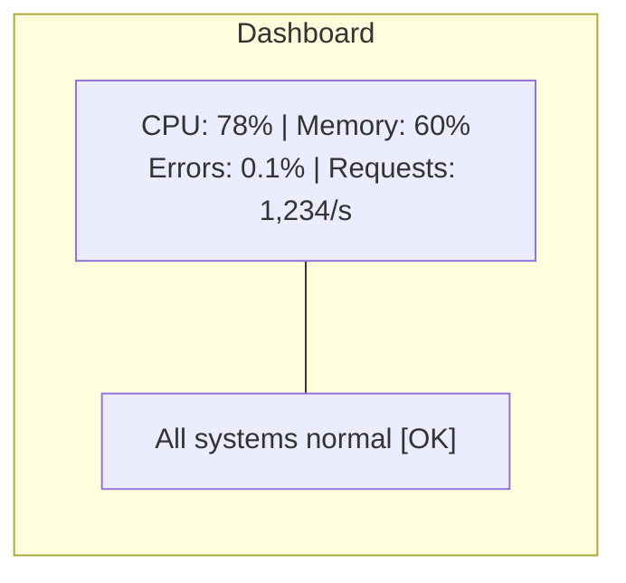

Monitoring works well when you know which components can fail, failures match known patterns, the architecture is relatively simple, and you are tracking physical limits like disk space or network bandwidth. It breaks down when the failure is emergent, affects only a slice of traffic, or lives in the interaction between components rather than inside any single box.

### 1.2 What is Observability?

**Observability** is a property of a system: the ability to understand internal state from external outputs without knowing in advance what problem you are looking for. Instead of asking "Is CPU okay?" you ask "Why are 5% of requests slow?" and follow the evidence wherever it leads—by endpoint, region, user segment, deployment version, or any other dimension your telemetry preserves.

Charity Majors' practical test: can you ask a question you did not instrument explicitly last sprint and get an answer from data already flowing? If every new question requires a JIRA ticket to add logging, you have monitoring with extra steps, not observability. The property emerges when telemetry is rich enough, correlated enough, and queryable enough that investigation resembles data analysis rather than archaeology across SSH sessions.

Observability does not mean infinite retention or storing every byte forever. It means preserving sufficient detail—often via sampling and tiered retention—that the questions incident response actually asks remain answerable. A sampled trace backend that always retains errors and high-latency tails can be more observable than a verbose unstructured log dump nobody can search.

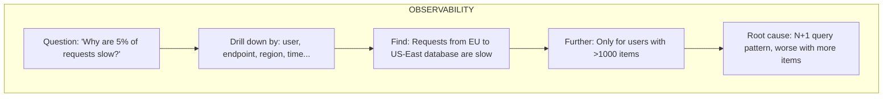

Observability empowers engineers to answer: "Why is the system behaving this particular way right now?" That question is not a luxury for large platforms—it is the difference between a four-hour outage and a twenty-minute fix when aggregate metrics look fine.

### 1.3 The Key Differences Outlined

| Aspect | Monitoring | Observability |
|--------|------------|---------------|
| Questions | Predefined | Ad-hoc, exploratory |
| Approach | "Is X okay?" | "Why is this happening?" |
| Failure modes | Known in advance | Discovered during investigation |
| Data | Aggregated metrics | High-cardinality, detailed |
| Investigation | Dashboard → Runbook | Explore → Hypothesize → Verify |

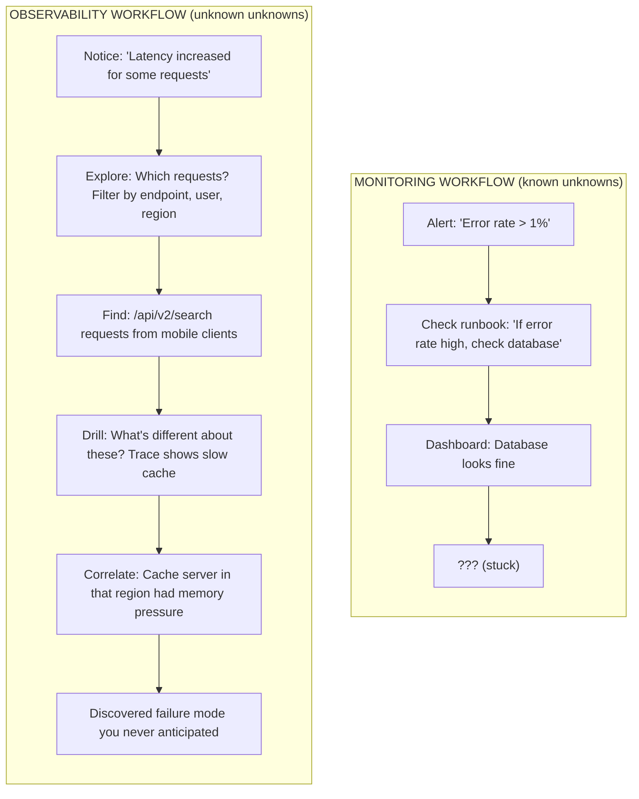

When an engineer hits a dead end in a runbook, monitoring leaves them blind. Observability provides the data fidelity to pivot instantly and follow the trail of evidence wherever it leads, even when the runbook author never imagined that failure mode.

### 1.4 Complementary Signal Frameworks: Golden Signals, USE, and RED

Three widely cited frameworks help teams decide *what* to measure before debating *how* to store it. They are complementary lenses, not competing religions—you often use more than one in the same system.

**Four Golden Signals** (Google SRE) recommend monitoring **latency**, **traffic**, **errors**, and **saturation** for each user-facing service. Latency captures how long work takes; traffic captures demand; errors capture failure rate; saturation captures how full the service is (queue depth, thread pool usage, or quota consumption). This framework is service-centric and maps cleanly to SLO thinking: if latency and errors stay within budget while traffic rises, users are probably happy.

**USE** (Brendan Gregg) targets **Utilization**, **Saturation**, and **Errors** for every *resource*—CPU, memory, disk, network interface. Utilization is the percentage of time a resource is busy; saturation is the backlog of work waiting for that resource; errors are fault events. USE excels at infrastructure and host-level debugging: "Is this node out of CPU, or is the CPU idle while a run queue backs up?"

**RED** (Tom Wilkie) applies **Rate**, **Errors**, and **Duration** to every *request-serving* component. Rate is requests per second; errors is the failed fraction; duration is latency distribution (often histograms, not just averages). RED is the microservice-native cousin of the Golden Signals—same shape, slightly different vocabulary, easier to implement in Prometheus-style metrics.

| Framework | Unit of analysis | Best for | Typical blind spot |
|-----------|------------------|----------|-------------------|
| Four Golden Signals | User-facing service | SLOs, capacity planning | Does not name individual resources |
| USE | Hardware/resource | Nodes, disks, NICs | Hard to apply to abstract resources like "memory pressure" |
| RED | Request path / service | API gateways, microservices | Does not cover batch jobs or queue workers without adaptation |

None of these frameworks *is* observability. They tell you which aggregates to collect so you notice problems quickly. Observability is what lets you drill from "latency is elevated" into "only Safari clients on old accounts in us-east hitting the checkout flag are slow." Golden Signals, USE, and RED get you to the alert; high-cardinality telemetry and correlation get you to the root cause. Platform engineers should be fluent in all three vocabularies because infrastructure on-call and application on-call often look at the same incident through different lenses during a bridge call.

---

> **Stop and think**: Why might adding a `user_id` tag to every log line be incredibly useful for debugging, but adding a `user_id` label to a Prometheus metric be potentially disastrous?

## Part 2: Why Traditional Monitoring Fails in Modern Contexts

### 2.1 The Cardinality Problem

Traditional monitoring systems aggregate data to reduce storage cost and speed up queries. Aggressive aggregation destroys the details required to debug complex issues. Imagine your application processes one million requests per hour. Your dashboard shows average latency at 100 ms, p99 at 500 ms, and error rate at 0.5%—all green. Yet 5,000 users had a broken experience. Aggregate monitoring cannot tell you which users failed, which endpoints were involved, what those requests had in common, or why they differed from successful ones.

**Cardinality** is the number of unique values a dimension can take. **Dimensionality** is how many distinct dimensions you can slice by at once (`endpoint`, `region`, `browser`, `feature_flag`, and so on). High-cardinality dimensions essential for debugging include `user_id` (millions of values), `request_id` and `trace_id` (billions), `customer_tenant_id`, endpoint-plus-parameter combinations, and geographic or device attributes. High dimensionality means you can combine those fields in ad-hoc queries; high cardinality means each field has many possible values. Both matter, but cardinality is what breaks time-series backends.

In a **time-series database** like Prometheus, every unique combination of metric name plus label values creates a separate series stored in memory and on disk. If you track `http_request_duration_seconds` with labels `endpoint` (10 values), `region` (3 values), and `user_id` (one million values), you create 30 million series—each consuming index space and scrape storage. The explosion is multiplicative: adding one high-cardinality label multiplies series count by the number of unique values that label can hold. That is why Prometheus documentation explicitly warns against labels like user IDs or email addresses.

**Event and columnar stores** used in observability platforms (Honeycomb-style backends, ClickHouse, BigQuery over structured logs) handle cardinality differently. They store raw or semi-structured events—one row per request, span, or log line—with columns for each attribute. A million distinct `user_id` values add storage proportional to the data you retain, not a million pre-created time series updated every scrape interval. Aggregations (average latency by browser, error count by region) are computed at **query time** over the events you kept, rather than baked in at ingest time. You pay for storage volume and query compute, but you do not multiply memory usage every time a new user appears.

The practical lesson: metrics backends are optimized for low-cardinality aggregates over long retention; event backends are optimized for high-cardinality exploration over shorter windows or sampled retention. Mature observability strategies use both—metrics to detect anomalies cheaply, events and traces to explain them—but never pretend a metrics label can safely carry unbounded identity fields. When in doubt, ask your storage vendor what happens at ten million unique label values; the honest answer informs architecture more than any dashboard screenshot.

### 2.2 The Unknown Unknowns

You can only write monitoring rules for failures you anticipate. Complex distributed systems fail in novel ways that no runbook predicted—interaction bugs between services deployed on different days, race conditions visible only at certain traffic multiples, or dependency degradation that never triggers error codes because clients retry until timeouts propagate.

Donald Rumsfeld's taxonomy maps cleanly to operations: **known knowns** (disk full) suit monitoring; **known unknowns** (latency sometimes spikes under load) need broader metrics and some drill-down; **unknown unknowns** (this browser cohort hits a latent N+1 query) require retained context and exploratory queries. Teams that conflate "we have alerts" with "we can debug anything" discover the gap during the first major outage after a microservice split.

Observability supports investigation of unknown unknowns because you retain raw, high-fidelity event data and can ask questions you did not plan when you built the system. The cultural companion is psychological safety to explore during incidents instead of forcing premature runbook execution—hypothesis testing with data beats guessing under pressure.

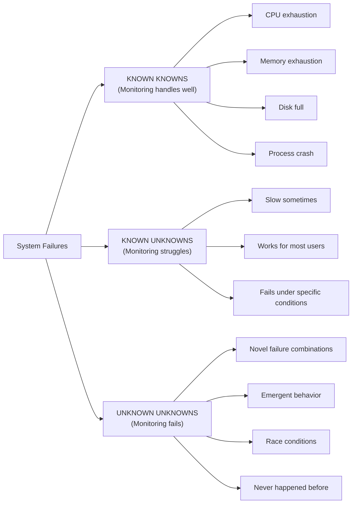

Observability supports investigation of unknown unknowns because you retain raw, high-fidelity event data and can ask questions you did not plan when you built the system.

### 2.3 Distributed System Complexity

Monitoring paradigms were designed for monolithic architectures where a single process owned the full request lifecycle, log files lived on one disk, and a stack trace pointed to one codebase. Distributed systems break those assumptions because failure becomes a property of graphs—how services call one another under load—not a property of any single box on a dashboard.

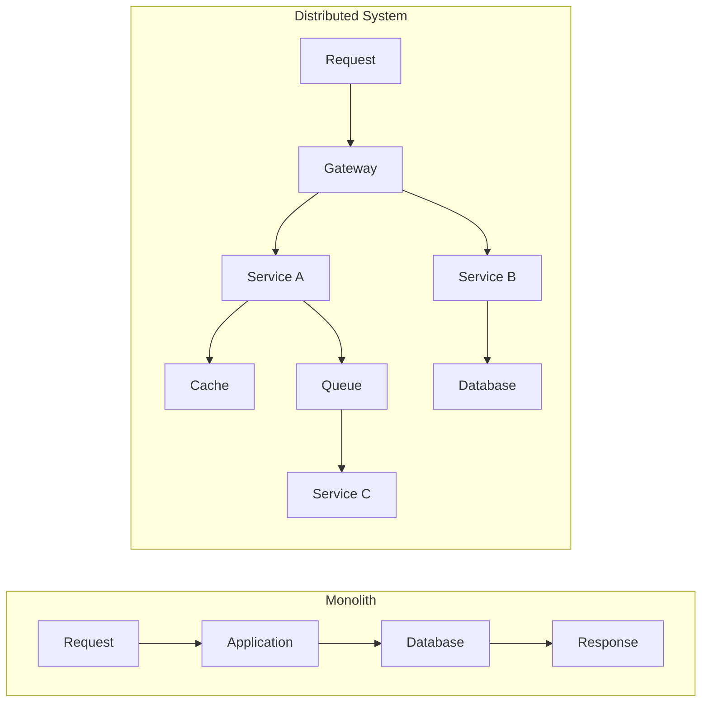

In a monolith, a failed request usually leaves one stack trace in one log file. In microservices, a single click may traverse a gateway, six services, a queue, and three databases—with no unified stack trace. Evidence is fragmented across machines and teams. Distributed systems require distributed observability: shared trace identifiers, correlated logs, and the ability to reconstruct a single request's path end to end.

---

## Part 3: The Observability Equation

### 3.1 Control Theory Origins

The term "observability" is not marketing jargon; it is a formal concept from control theory, introduced by Rudolf E. Kálmán in 1960 alongside the related property of **controllability**. The two ideas are mathematical duals: controllability asks whether inputs can drive the system to any desired state; observability asks whether outputs reveal enough information to reconstruct the internal state.

In classical linear systems, state evolves according to inputs, and sensors produce outputs. A system is **observable** if, given the input history and output history over a time window, you can uniquely determine the current internal state. If two different internal states produce identical outputs forever, the system is **not observable**—you cannot distinguish them from outside. Kálmán's observability matrix gives a concrete test for linear time-invariant systems: rank conditions on powers of the system matrix multiplied by the output matrix tell you whether state is recoverable.

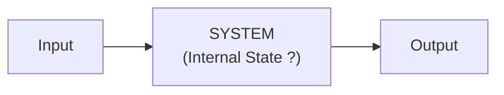

Software analogies map cleanly but have limits. **Observable in the software sense**: structured logs, traces, and metrics with enough context that you can infer which code path ran, which dependency failed, and which configuration applied—without SSH, debugger attachment, or emergency logging patches. **Not observable**: a service that returns HTTP 500 for every internal failure mode, with no request ID, no trace, and no structured fields—database timeout and null pointer look identical from outside.

The analogy's **limits** matter for platform engineers. Real software state includes caches, connection pools, feature flags, partial failures, and human-driven config changes—far richer than a finite-dimensional linear state vector. Telemetry is always sampled, lossy, and delayed; you rarely prove state uniquely, you estimate it well enough to act. Control-theory observability is a **design discipline**: emit outputs that make internal state *inferable*, not a guarantee that every question is answerable from today's dashboards.

When a post-mortem says the system "was not observable in the control-theory sense," it usually means engineers had to modify running code to learn what happened—proof that external outputs were insufficient for the questions incident response required.

### 3.2 Software Observability

Applied to software engineering, observability means: **can you understand why your system behaves as it does in production by examining the telemetry it emits?** If engineers must SSH into production, attach a debugger, or deploy a hotfix solely to add logging, the system lacks observability for that failure mode.

Software differs from physical plants in important ways. State is partly digital (in-memory caches, connection pools) and partly organizational (feature flags, kill switches, manual config). Outputs are lossy: logs truncate, metrics aggregate, traces sample. You are never guaranteed full state reconstruction—you aim for **sufficient** reconstruction to act safely: roll back a deploy, disable a flag, scale a pool, or open a targeted ticket with evidence attached.

Highly observable software teams treat telemetry schemas like API contracts. Breaking changes to log field names require migration notes the same way REST payload changes do. They test observability in staging by running representative queries ("find slow checkout traces with loyalty flag enabled") before production launch. They measure incident metrics not only in MTTR but in **questions answered per hour** during the bridge call—because every unanswered question is a candidate hotfix or a customer still failing.

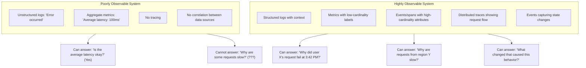

### 3.3 Properties of Observable Systems

Observability is not purchased—it is engineered through deliberate data properties (cardinality, correlation, queryability) and through operational practice that treats exploration as a first-class incident response step rather than a post-mortem afterthought.

| Property | What It Means | Example |
|----------|---------------|---------|
| **High cardinality** | Many unique dimension values | `user_id`, not just "users" |
| **High dimensionality** | Many dimensions to slice by | user, endpoint, region, version, feature_flag |
| **Correlation** | Can connect data across sources | Trace ID links logs, metrics, traces |
| **Context preservation** | Details not aggregated away | Full request details, not just averages |
| **Queryability** | Can ask arbitrary questions | "Show me requests where X AND Y AND Z" |

---

## Part 4: The Observability Mindset

### 4.1 From "Know What's Wrong" to "Understand Behavior"

Achieving observability is a cultural shift as much as a technical one. Teams move from predicting every failure to ensuring the system can explain itself when something unexpected happens.

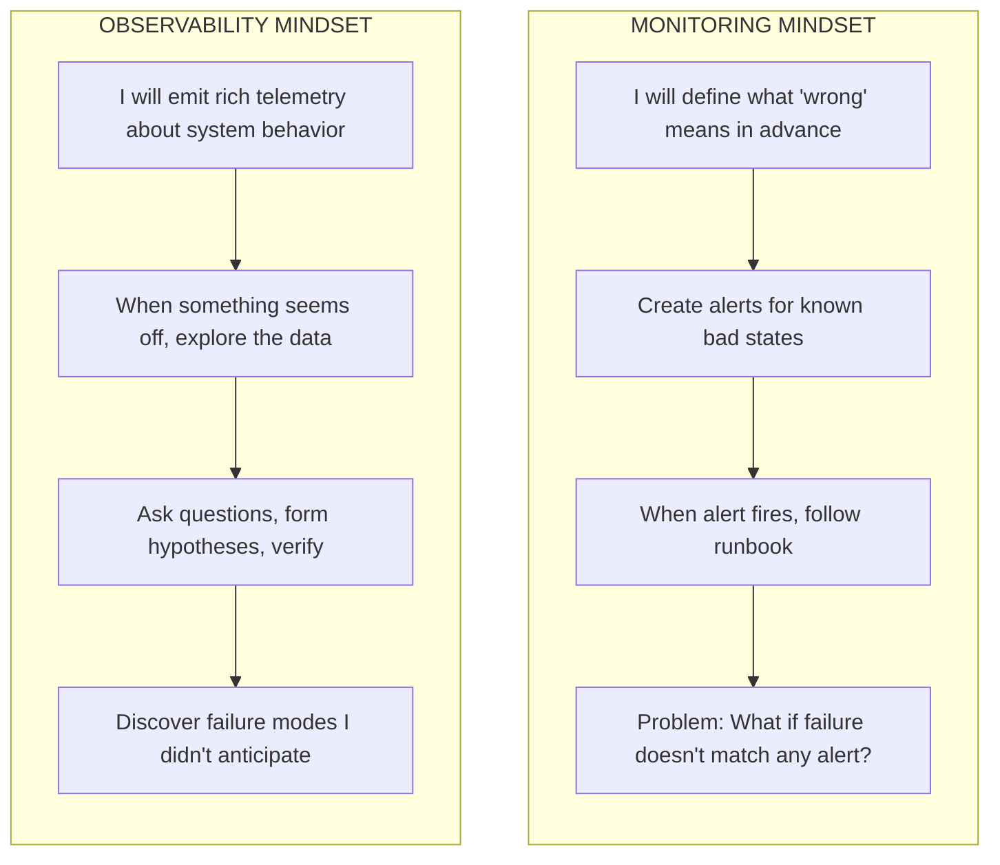

### 4.2 Exploration Over Dashboards

Dashboards provide fixed views of predefined metrics. They are excellent for watching known signals and useless for investigating novel problems without drill-down into high-cardinality data.

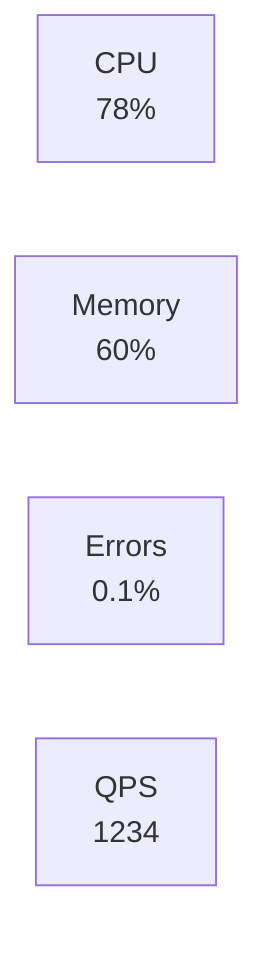

If these four dials do not illuminate the root cause, the engineer is stuck unless an exploration interface exists. **Exploration (observability)** relies on ad-hoc queries optimized for slicing and pivoting high-cardinality fields rather than scrolling fixed charts.

```text
> show requests where latency > 500ms
  → 5,234 requests (2.1%)

> group by endpoint
  → /api/search: 4,891 (94%)

> filter endpoint=/api/search, group by user_tier
  → premium: 12, free: 4,879

> Hypothesis: Free tier hitting rate limits?
```

### 4.3 Questions Observability Enables

With high-fidelity telemetry, responders can ask questions that monitoring dashboards were never designed to support, including pinpointing single-request latency, discovering shared attributes among failures, correlating behavior with recent changes, determining whether a failure mode is novel, scoping affected users, and mapping blast radius across dependent services:

> **Hypothetical scenario:** During a peak traffic window, checkout dashboards show normal average latency (~200 ms) and a low global error rate (~0.3%). Support reports that checkout "hangs" for a noticeable subset of users. After enabling queryable, high-cardinality telemetry, engineers find that roughly **5%** of checkout requests take **more than 8 seconds**—invisible to averages because **95%** of traffic is fast. Filtering reveals a narrow profile: accounts **older than two years**, **Safari** browsers, clients in **US-East**, all with a **loyalty feature flag** enabled. The flag triggers a **synchronous third-party analytics call** during checkout. Chrome masks some delay; Safari enforces stricter timeouts. The third-party endpoint is reachable but adds cross-region latency for East Coast users. The fix is disabling the flag or making the call asynchronous—minutes of work once the segment is visible. Aggregate metrics were correct about the majority and blind to the minority that mattered for revenue and trust.

---

## Part 5: Comparing Observability Tooling Approaches

When building an observability strategy, teams choose where to invest first among **logs**, **metrics**, and **traces**—often called the three pillars. Mature organizations correlate all three; early rollouts must prioritize based on architecture, failure domain, and bandwidth.

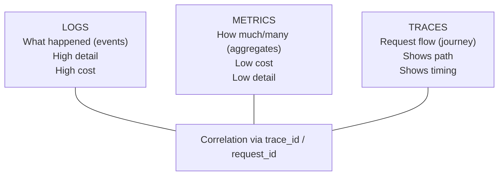

### The Metrics-First Approach

Metrics-first prioritizes numerical time-series data for aggregate health. Tools like Prometheus and Grafana dominate this space. Metrics are far cheaper to store and retain long-term than full per-request logs because they discard per-request context in favor of aggregation. Tracking CPU, memory, and request rates across thousands of pods scales economically compared to retaining every request as a log line.

**Architectural fit:** Infrastructure-heavy environments—Kubernetes control planes, bare-metal fleets, stateless workers—where resource saturation matters more than individual request narratives. Primary failure domains: hardware exhaustion, network saturation, predictable scaling cycles. **Drawback:** When one customer reports a slow API call, metrics show haystack statistics—the distribution of all requests—not the specific slow request or the label combination that identifies it.

### The Logs-First Approach

Logs-first prioritizes structured, timestamped events (typically JSON). Elasticsearch and OpenSearch index rich fields—user ID, query text, stack traces, memory snapshots—for fast arbitrary search. Loki takes a different trade-off: it indexes only labels (low-cardinality metadata such as service and namespace), stores log content in compressed chunks, and queries content at read time. That design is cheaper to store but best suited to label-scoped queries rather than ad-hoc full-text search across every field.

**Architectural fit:** Monoliths and thick services where one process handles the full request lifecycle. A single log stream often tells the complete failure story.

**Drawback:** In microservices, one user action may produce hundreds of log lines across dozens of hosts. Without correlation IDs, reconstruction is manual and slow. Log volume also drives storage cost faster than metrics.

### The Traces-First Approach

Traces-first tracks one request across network boundaries via propagated context (OpenTelemetry, Jaeger, Zipkin). A trace ID injected at the edge appears in every downstream service.

**Architectural fit:** Deep microservice graphs, serverless chains, event-driven architectures where failures are cross-service timeouts and retry storms, not single-process crashes. **Drawback:** Requires instrumentation and political agreement across teams; legacy codebases with many languages need consistent propagation standards before traces become trustworthy.

### Justifying Your Starting Point

Match tooling to architectural pain rather than vendor marketing: undertake structured logging first when lifting a legacy monolith, because tracing across one process adds little until services split; prioritize metrics-first when operating a multi-tenant Kubernetes platform where node health and quota saturation dominate incident volume; mandate distributed tracing from day one on greenfield microservices before the service graph becomes too tangled to instrument consistently.

The sections below formalize this comparison into patterns, anti-patterns, and a reusable decision framework you can apply in design reviews and architecture decision records.

---

## Patterns & Anti-Patterns

### Patterns That Scale

**Instrument at boundaries and propagate one trace ID.** Generate a correlation identifier at the edge (API gateway, load balancer, first service) and pass it through HTTP headers, message queues, and database client metadata. Boundaries—ingress, egress, external API calls, database handoffs—are where latency and errors concentrate; they are the highest-leverage instrumentation points. One stable ID lets you pivot from a metric spike to logs and traces without guessing timestamps.

**Store raw events; aggregate at query time.** Retain structured events or spans with full attribute sets for a defined retention window. Compute percentiles, error rates by segment, and top-N endpoints when investigating—not at ingest, where aggregation destroys the tail. Metrics derived from events (recording rules, rollups) are fine for alerting; the raw store remains the source of truth for "why."

**Prefer wide structured events over many narrow log lines.** A single JSON object per request completion—with latency, status, user tier, region, flag state, and trace ID—beats ten printf lines that cannot be queried together. Wide events align with how columnar query engines work and reduce log volume noise. When each microservice emits one completion event with nested fields for dependency calls, investigators reconstruct stories without joining dozens of grep results.

**Define cardinality budgets with platform teams.** Product engineers should know which fields are safe on metrics (low tens of values) versus spans and logs (millions). Publishing a short allowlist—`http.route`, `deployment.version`, `cloud.region` on metrics; `user.id` on spans only—prevents well-meaning instrumentation from taking down shared infrastructure. Governance is not bureaucracy; it is how multi-tenant observability stacks survive Black Friday-shaped traffic.

### Anti-Patterns to Avoid

| Anti-Pattern | What Goes Wrong | Better Approach |
|--------------|-----------------|-----------------|
| **Dashboards == observability** | Green panels hide segment-specific failure | Add queryable high-cardinality backends; use dashboards as entry points, not the whole story |
| **High-cardinality label on a metric** | Time-series memory explosion; OOM on scrapers | Keep identity fields on events/spans; use low-cardinality labels on metrics |
| **Aggregate-first, lose the tail** | p99 looks fine while 5% of users timeout | Retain raw or sampled events; alert on burn rates and tail latency |
| **Tool sprawl without correlation** | Three UIs, manual timestamp matching | Standardize on `trace_id` / `request_id` across logs, metrics exemplars, and traces |

---

## Decision Framework: Choosing Your First Signal

Use this framework when leadership asks "What should we implement first?" The answer depends on **architecture shape** and **primary failure domain**, not vendor preference.

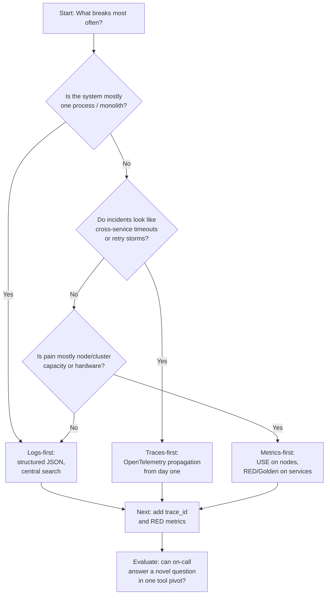

| If your primary failure domain is… | Start with… | Because… | Add next… |
|-----------------------------------|-------------|----------|-----------|
| Single-app logic bugs, batch jobs in one JVM | **Logs-first** | One process, one narrative | Metrics for saturation; traces if you split services |
| Cross-service latency, dependency chains | **Traces-first** | Path and timing across hops | Structured logs with `trace_id`; RED metrics per service |
| Node exhaustion, noisy neighbors, cluster stability | **Metrics-first** | Cheap fleet-wide aggregates | Logs on anomalies; traces for app teams |
| Unknown segment failures (browser, region, cohort) | **Events / wide logs** | Needs high cardinality | Metrics for detection only; never put cohort IDs on metric labels |

**Compare** the three approaches explicitly in design docs: list what each pillar would miss for your top three recent incidents. If traces would not have helped any of them, do not start with traces—regardless of industry hype. **Justifying your starting point** means tying the choice to incident history and architecture, not tool popularity.

### From Alerts to Answers: An Observability Maturity Progression

Teams rarely jump from dashboards-only to full high-cardinality exploration in one quarter. A realistic maturity progression helps you **evaluate** where you are and **design** the next increment without boiling the ocean.

**Stage 1 — Monitoring-centric.** You have host and service metrics, threshold alerts, and Grafana dashboards. Incidents start when a pager fires. Responders follow runbooks. Unknown failure modes stall until someone SSHes in or adds printf logging. Most organizations live here for years; it is sufficient until distributed architecture or customer segmentation makes aggregates lie.

**Stage 2 — Structured telemetry.** Logs become JSON with consistent fields (`service`, `level`, `trace_id`, `user_tenant`). Metrics adopt RED or Golden Signal naming per service. Alerts still dominate entry points, but responders can search logs by request ID when support provides one. Gap: cross-service stories still require manual timestamp alignment.

**Stage 3 — Correlated traces.** OpenTelemetry (or equivalent) propagates context through HTTP and messaging. Spans link to log lines; histograms expose exemplars pointing at slow traces. Mean time to resolution drops for latency incidents because the path is visible. Gap: high-cardinality ad-hoc grouping (every combination of browser, region, and flag) may still require a dedicated event store.

**Stage 4 — Exploratory observability.** Raw or sampled events retain wide attributes for days to weeks. On-call can ask novel questions—"show checkout spans where loyalty_flag=true and duration>3s, group by browser"—without a deploy. This is where unknown-unknowns become tractable. Cost management (sampling, retention tiers) becomes a first-class engineering concern.

Moving one stage up is a reasonable annual goal. Attempting stage four without stage two's structured fields fails because garbage identifiers do not correlate. Attempting stage three on a monolith still helps future splits but should not delay log quality on the current codebase.

### Connecting Observability to Reliability Practice

Observability does not replace SLOs, error budgets, or incident response—it feeds them. When you define an SLI such as "successful checkout completion under two seconds," observability tells you **which** requests violate that SLI and **why**, while the SLO tells you whether burn rate warrants a page. A team with perfect SLO dashboards but no drill-down will know they are missing budget without knowing whether database locks, a third-party API, or a feature flag caused the miss.

During incident response, observability supports the scientific method: observe a symptom (latency spike), form a hypothesis (maybe cache region X), query telemetry to confirm or refute, narrow scope, repeat. Monitoring-only cultures skip experimentation and jump from dashboard to runbook step three, which is why runbooks fail on novel failures. Post-incident, observability data becomes evidence for blameless post-mortems: exact request samples, flag states, and dependency timings replace guesswork.

For platform teams serving internal developers, observability maturity is a product feature. Application teams choose your cluster partly on whether they can debug their own services without opening a central ops ticket for every investigation. Publishing standards—required span attributes, log field schemas, cardinality budgets—turns observability from heroics into contract.

### Instrumentation Philosophy for Foundation Teams

Theory modules avoid prescribing a single vendor, but they can prescribe **shape**: emit outputs at boundaries, propagate one correlation ID, prefer wide structured events over string formatting, and treat high-cardinality fields as first-class query dimensions rather than debugging accidents. Default tags should include service name, deployment version, and environment; optional tags capture business context (tenant tier, feature flags) at span or log level, never on unbounded metric labels.

Sampling is inevitable at scale. Head-based sampling decides at trace start whether to keep the whole trace—simple but may discard rare slow paths. Tail-based sampling retains traces that ended with errors or high latency—better for SRE use cases, harder to implement. The observability mindset accepts sampling when you can still statistically find needles; it rejects sampling when it permanently destroys the ability to ask questions about discarded events.

Finally, observability is a feedback loop for engineering quality. When on-call regularly cannot answer "why," that signal belongs in sprint planning as instrumentation debt—same as flaky tests or missing runbooks. **Apply** the control-theory lens here: if you cannot infer internal state from outputs, the system is asking operators to open the black box under fire. Fixing that is architecture work, not a tooling purchase alone.

---

> **Stop and think**: If you were forced to choose only one of the three pillars (logs, metrics, or traces) to start improving a complex distributed system, which one would give you the highest immediate return on investment for debugging?

## Did You Know?

- **Honeycomb** was founded in 2016 on the principle that high-cardinality data is essential for modern debugging. Traditional monitoring tools could not handle millions of unique dimension values without crashing, so the team built datastore systems optimized for ad-hoc grouping by arbitrary fields.
- **Google's Dapper paper**, published in 2010, introduced distributed tracing at scale inside Google and inspired open-source projects like Zipkin, Jaeger, and eventually OpenTelemetry.
- **The term "pillars"** (logs, metrics, traces) has been criticized since around 2018. Practitioners like Charity Majors argue they are different views of the same events—not silos to purchase and operate separately.
- **Twitter's "Fail Whale"** era (circa 2008) reflected outages the team struggled to debug in a rapidly growing distributed architecture. Basic monitoring existed, but answering "why" required investments in tracing and correlated telemetry that later influenced industry practice.

---

## Common Mistakes

| Mistake | Problem | Solution |
|---------|---------|----------|
| "We have dashboards, we're observable" | Dashboards are monitoring, not observability | Add queryable, high-cardinality data |
| Logging without structure | Can't query, can't correlate | Structured JSON logs with context |
| No request/trace IDs | Can't follow requests across services | Generate IDs at edge, propagate everywhere |
| Aggregating too early | Lose detail needed for debugging | Store raw events, aggregate at query time |
| Treating pillars as silos | Can't correlate logs, metrics, traces | Use common identifiers (`trace_id`) |
| Only instrumenting your code | Miss database, cache, external calls | Instrument at boundaries too |
| High-cardinality metric labels | OOM and slow queries on TSDB | Put identity on events; keep metrics low-cardinality |
| Tool collection without correlation | Long MTTR despite many products | One ID across signals; exemplars linking metrics to traces |

---

## Quiz

The following eight scenario-based questions test whether you can **compare** tooling approaches, **diagnose** monitoring blind spots, **evaluate** organizational maturity, **design** strategies for unknown-unknowns, and **apply** the control-theory definition in realistic on-call situations.

1. **You are the lead engineer for a new microservices platform. The VP asks you to justify OpenTelemetry instead of relying only on Prometheus CPU and memory alerts. How do you compare what each approach enables during an incident?**
   <details>
   <summary>Answer</summary>

   Prometheus-style monitoring answers predefined questions: whether CPU, memory, or error thresholds crossed values you anticipated. It detects known failure modes efficiently. Observability via OpenTelemetry traces and correlated logs lets you compare request paths across services and ask new questions when an unknown issue appears—such as which dependency added latency for mobile clients only. **Compare** metrics-first detection with traces-first explanation: metrics tell you something changed; traces and events tell you where and why in the call graph.
   </details>

2. **Your checkout service runs in three regions with ten endpoints. Adding `user_id` (one million active users) as a Prometheus label crashes the server with OOM errors. Diagnose why traditional metrics systems fail here.**
   <details>
   <summary>Answer</summary>

   Each unique label combination creates a new time series. Ten endpoints times three regions times one million users yields tens of millions of series, each consuming memory and index space on every scrape. **Diagnose** this as a cardinality explosion: metrics backends multiply series by label values, unlike event stores that store one row per request and aggregate at query time. High-cardinality identity belongs on logs or spans, not metric labels.
   </details>

3. **During a post-mortem, an architect says the system "isn't observable in the control theory sense" because the team deployed a hotfix only to add logging. Apply the control-theory definition: did this system pass or fail?**
   <details>
   <summary>Answer</summary>

   In control theory, a system is observable if internal state can be inferred from external outputs without opening the black box. **Apply** that test: needing a code change to emit new outputs means existing telemetry was insufficient to determine state. The system failed observability for that incident—outputs did not yet support the questions responders needed. Passing the test means on-call can investigate from current telemetry alone.
   </details>

4. **You migrate a monolith to fifteen microservices. Debugging now takes hours despite "good" average latency metrics. Design what an observability strategy must add beyond monitoring.**
   <details>
   <summary>Answer</summary>

   **Design** for unknown-unknowns: propagate trace IDs across all fifteen services, structure logs with shared fields, and retain enough request-level detail to reconstruct paths. Monitoring averages will still look fine when one dependency fails for a subset of traffic. Observability strategy prioritizes correlation and high-cardinality exploration so emergent cross-service failures become visible without new deploys per investigation.
   </details>

5. **One million daily transactions show 150 ms average latency and 400 ms p99, yet support reports 0.5% of requests exceed five seconds. How many users are affected, and why did dashboards miss them?**
   <details>
   <summary>Answer</summary>

   0.5% of one million is **5,000 users per day** experiencing extreme latency. Dashboards missed them because aggregates summarize the majority: averages are dominated by fast requests, and p99 still ignores the slowest half-percent tail. **Diagnose** this as aggregate blind spots—only event-level or high-cardinality queries expose small suffering segments.
   </details>

6. **Fifty endpoints, ten regions, two million users— a proposal adds `user_id` as a metric label for per-user latency. Estimate series count and explain infrastructure impact.**
   <details>
   <summary>Answer</summary>

   Fifty times ten times two million equals **one billion** potential series—far beyond what Prometheus-class systems handle. Memory, scrape duration, and query latency collapse. Per-user performance belongs in an event or tracing backend with query-time aggregation, not pre-materialized metric series.
   </details>

7. **An SRE says Prometheus, Grafana, and ELK mean the company is "fully observable," yet tracing one failed transaction across three services took four hours. Evaluate whether the organization actually has observability.**
   <details>
   <summary>Answer</summary>

   **Evaluate** observability by capability, not tool count: can on-call answer a novel question without new code? Four hours to follow one transaction proves correlation gaps—likely missing shared trace IDs linking logs and spans, or no way to pivot from metrics to a specific trace. Tools present without high-cardinality query paths and correlation are fragmented monitoring, not observability maturity.
   </details>

8. **In the 2017 AWS S3 outage, per-server health looked fine while customers could not access objects. What exploratory questions would modern observability enable?**
   <details>
   <summary>Answer</summary>

   Engineers could ask: "Which subsystem dependencies fail when index nodes serve GET requests?" and "What changed immediately before error rates rose for object retrieval?" Correlated traces or structured dependency events would show index and placement subsystem capacity loss and restart despite green CPU graphs. **Compare** that investigative path to checking only hardware metrics—the observability questions target subsystem dependencies and what changed, not isolated per-server health.
   </details>

---

## Key Takeaways

```text
OBSERVABILITY ESSENTIALS CHECKLIST
═══════════════════════════════════════════════════════════════════════════════

UNDERSTANDING THE DIFFERENCE
[ ] Monitoring answers predefined questions ("Is CPU > 80%?")
[ ] Observability enables unknown questions ("Why are THESE requests slow?")
[ ] Dashboards showing green doesn't mean users are happy

THE CARDINALITY IMPERATIVE
[ ] Traditional metrics aggregate away the details you need
[ ] High cardinality (user_id, request_id) is essential for debugging
[ ] 5% of users having problems is 50,000 users at 1M requests/day

DISTRIBUTED SYSTEM REALITY
[ ] No single stack trace shows the full picture
[ ] Logs scattered across machines need correlation (trace_id)
[ ] Failures emerge from interactions, not individual components

THE OBSERVABILITY MINDSET
[ ] Emit rich telemetry, explore when problems arise
[ ] Form hypotheses, verify with data
[ ] Discover failure modes you didn't anticipate

STARTING THE JOURNEY
[ ] Structured logging with context (user_id, request_id)
[ ] Propagate trace IDs through all services
[ ] Enable ad-hoc queries, not just predefined dashboards
```

---

## Hands-On Exercise

**Task:** Evaluate the observability maturity of a software system you operate or contribute to by working through a scorecard, a gap analysis, and a simulated slow-checkout incident. The goal is an honest baseline—not a roadmap fantasy—and a concrete list of telemetry gaps that would block you during the next unknown-unknown.

Complete **Part 1** by scoring six capabilities (structured logging, request ID propagation, distributed tracing, high-cardinality queries, cross-service correlation, ad-hoc investigation) from 0 (absent) to 3 (comprehensive), recording notes that cite real services and tools. Sum the scores for a total out of 18: 0–6 indicates monitoring-only vulnerability, 7–12 partial observability, 13–18 strong exploratory capability.

Complete **Part 2** by selecting your three lowest scores and filling a gap table with current state, missing elements, and a single technical first step per row—for example, "add `trace_id` to JSON log schema in checkout-api" rather than "buy a new vendor."

Complete **Part 3** by writing a short investigation narrative for this scenario: *multiple users report intermittent checkout slowness while the primary dashboard shows normal average latency.* Document which dashboard or index you would open first, three ad-hoc questions you would try to answer, which telemetry you expect to be missing, and the point where your current toolchain would force you back to monitoring-only guesswork.

| Capability | Score (0-3) | Notes |
|------------|-------------|-------|
| **Structured logging** | | 0=none, 1=some, 2=most, 3=all |
| **Request IDs propagated** | | 0=none, 1=some services, 2=most, 3=all |
| **Distributed tracing** | | 0=none, 1=basic, 2=detailed, 3=comprehensive |
| **High-cardinality queries** | | 0=can't, 1=limited, 2=some, 3=any dimension |
| **Cross-service correlation** | | 0=manual, 1=partial, 2=mostly automated, 3=seamless |
| **Ad-hoc investigation** | | 0=impossible, 1=painful, 2=possible, 3=easy |

| Capability | Current State | What's Missing | First Step to Improve |
|------------|---------------|----------------|----------------------|
| | | | |
| | | | |
| | | | |

**Success Criteria Checklist**:
- [ ] Scorecard completed with an honest assessment of current capabilities.
- [ ] At least two observability gaps identified with actionable improvement steps.
- [ ] The simulation demonstrates the difference between monitoring mindset and observability mindset.
- [ ] At least one telemetry gap identified that prevents investigating unknown-unknowns.

---

## Sources

- [Summary of the Amazon S3 Service Disruption in US-EAST-1 (February 2017)](https://aws.amazon.com/message/41926/) — Official AWS post-event summary of the index and placement subsystem capacity removal and restart. <!-- incident-xref: aws-s3-useast1-2017 -->
- [Amazon outage cost S&P 500 companies $150M (Axios, citing Cyence)](https://www.axios.com/2017/12/15/amazon-outage-cost-sp-500-companies-150m-1513300728) — Third-party analyst estimates of aggregate business impact from the February 2017 S3 disruption.
- [Google SRE Book: Monitoring Distributed Systems](https://sre.google/sre-book/monitoring-distributed-systems/) — Four Golden Signals and monitoring philosophy for distributed services.
- [OpenTelemetry: Observability Primer](https://opentelemetry.io/docs/concepts/observability-primer/) — Vendor-neutral definition of observability and the role of traces, metrics, and logs.
- [Dapper, a Large-Scale Distributed Systems Tracing Infrastructure](https://research.google/pubs/pub36356/) — Google's 2010 tracing paper that shaped the industry.
- [Prometheus: Metric and Label Naming](https://prometheus.io/docs/practices/naming/) — Guidance against high-cardinality labels such as user IDs.
- [Brendan Gregg: The USE Method](https://www.brendangregg.com/usemethod.html) — Utilization, Saturation, and Errors for system resources.
- [Grafana Labs: The RED Method](https://grafana.com/blog/2018/08/02/the-red-method-how-to-instrument-your-services/) — Rate, Errors, and Duration for request-driven services.
- [Honeycomb: Observability — A Manifesto](https://www.honeycomb.io/blog/observability-a-manifesto) — Charity Majors on high-cardinality exploration versus pre-aggregation.
- [O'Reilly: Distributed Systems Observability (Cindy Sridharan)](https://www.oreilly.com/library/view/distributed-systems-observability/9781492033431/) — Trade-offs among logging, metrics, and tracing.
- [Wikipedia: Observability (control theory)](https://en.wikipedia.org/wiki/Observability) — Kálmán's 1960 formal definition and relationship to controllability.
- [CNCF TAG Observability](https://tag-observability.cncf.io/) — Cloud native observability landscape and community resources.

Additional books for deeper study: *Observability Engineering* (Majors, Fong-Jones, Miranda); *Distributed Systems Observability* (Sridharan, free O'Reilly edition).

---

## Next Module

[Module 3.2: The Three Pillars](../module-3.2-the-three-pillars/) - Prepare for a technical deep dive into logs, metrics, and traces—uncovering exactly what each data type provides, where they fall short, and how they must be correlated together to achieve true observability in production environments.
