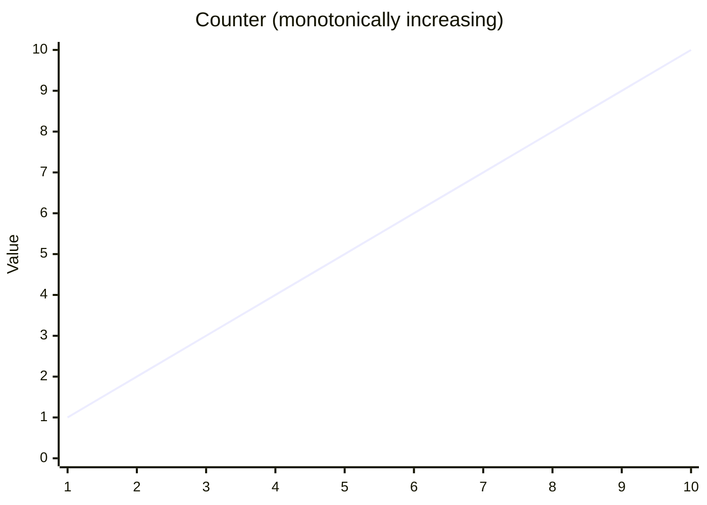
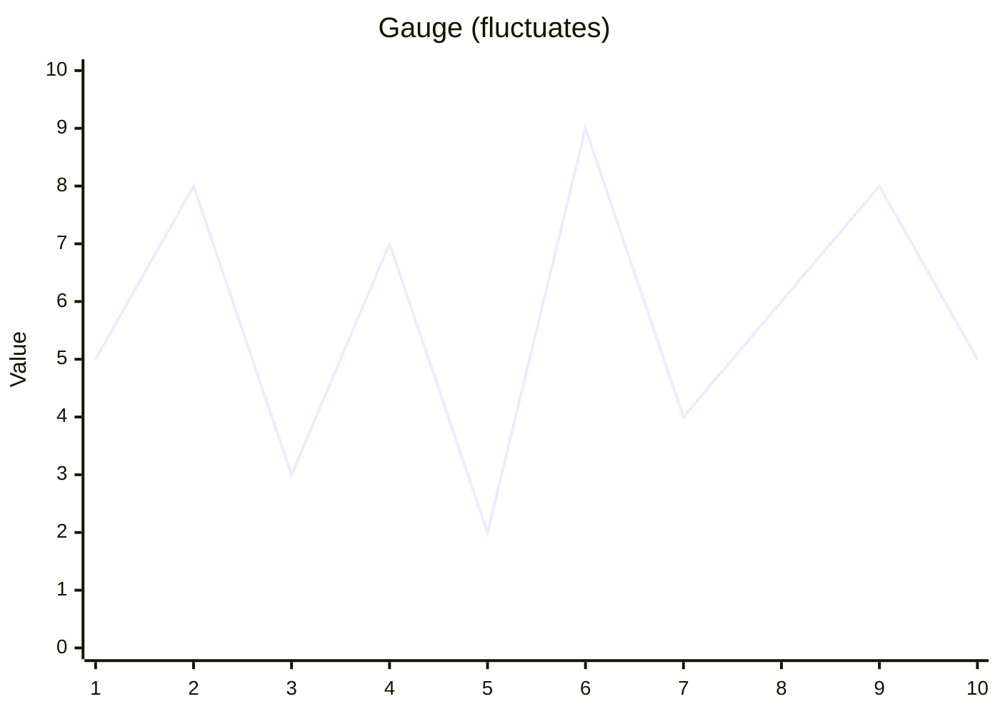
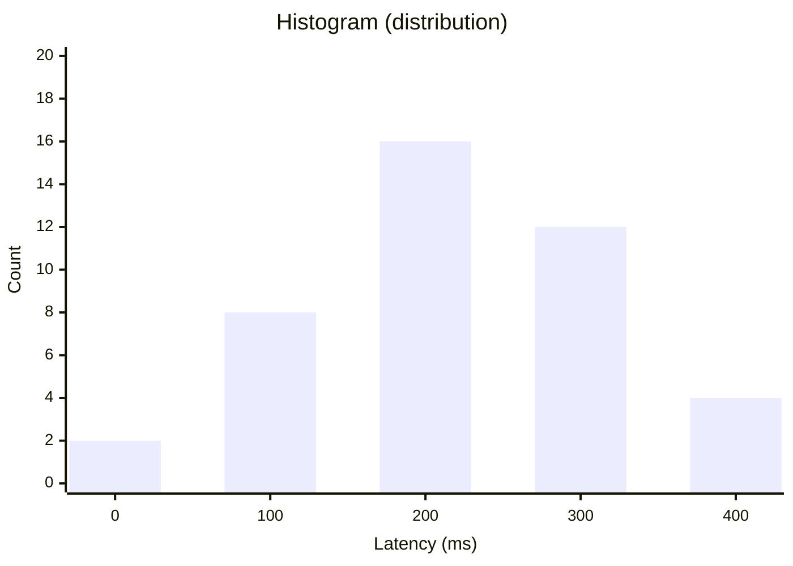
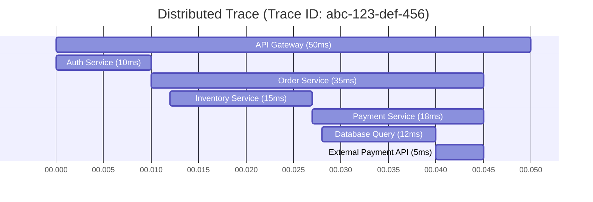
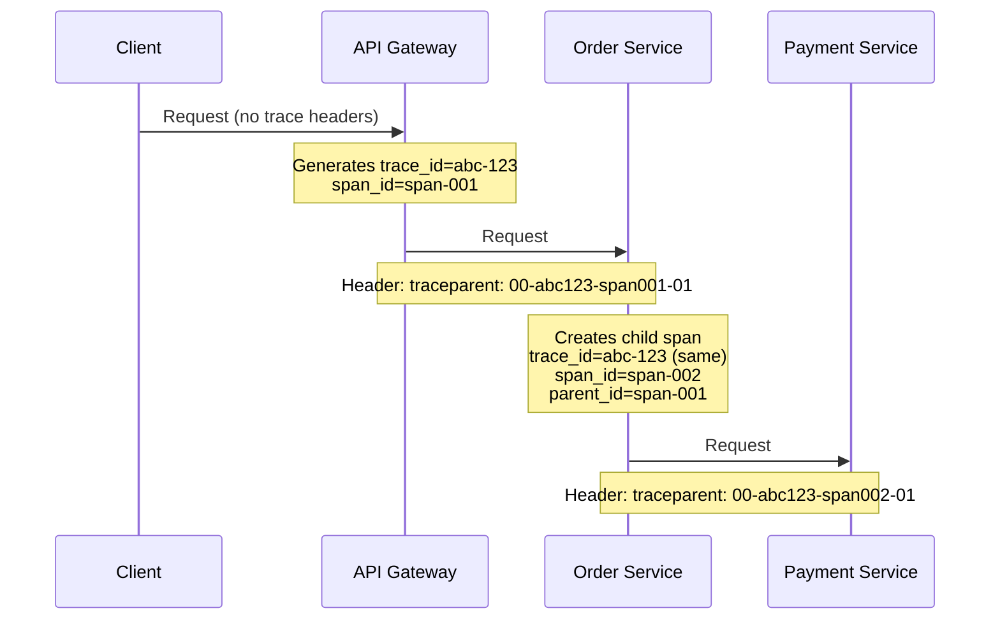
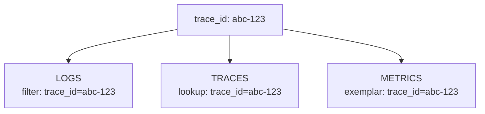
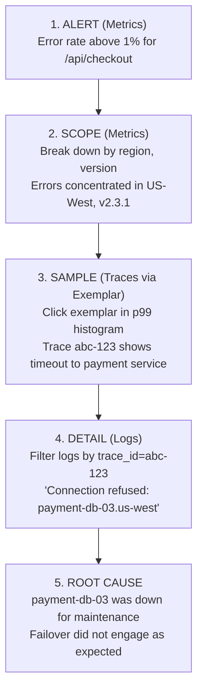
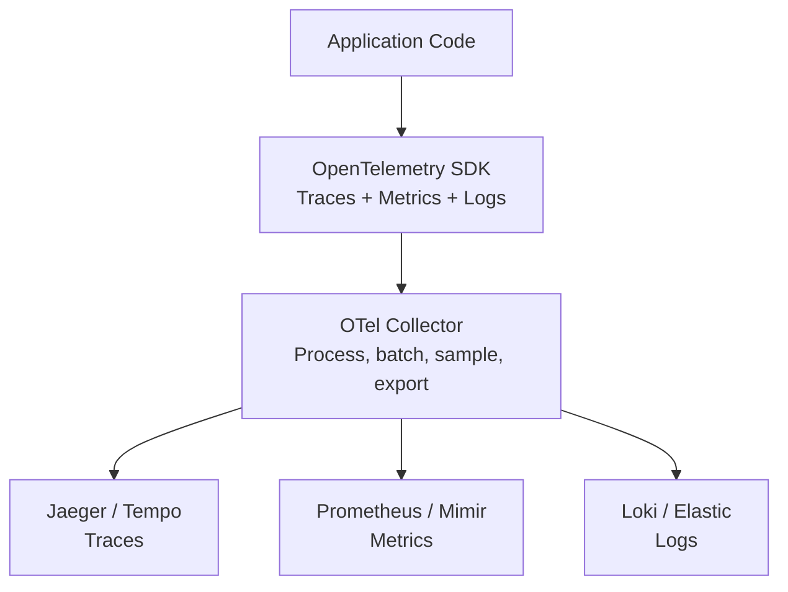
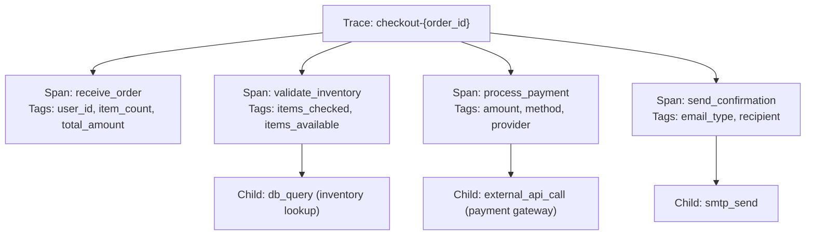
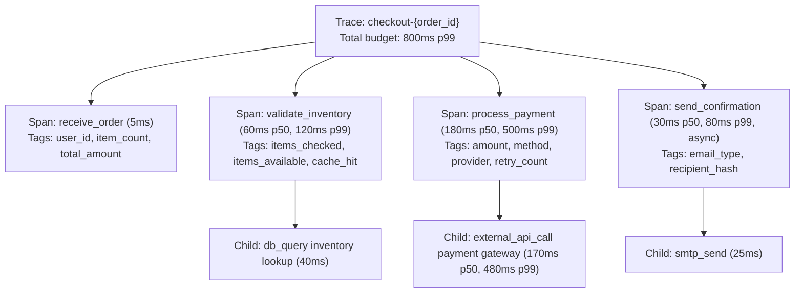

> **Complexity**: `[MEDIUM]`
>
> **Time to Complete**: 45-55 minutes
>
> **Prerequisites**: [Module 3.1: What is Observability?](../module-3.1-what-is-observability/)
>
> **Track**: Foundations

### What You'll Be Able to Do

After completing this module, you will be able to:

1. **Analyze** any debugging scenario and decide whether logs, metrics, traces, or a combination is the right starting tool, and explain why the others would fail or waste time.
2. **Design** a correlated observability pipeline where a single shared identifier (`trace_id`) lets you pivot from a metric anomaly to a sampled trace to the specific log line that explains the failure.
3. **Evaluate** an existing observability stack and identify the specific correlation gaps that would extend mean-time-to-resolution during a real incident.
4. **Compare** head-based and tail-based sampling for a given workload and justify which one (or which hybrid) keeps the diagnostic data an on-call engineer actually needs.
5. **Implement** an instrumentation contract — log fields, metric labels, span attributes — that makes the three pillars reinforce each other instead of becoming three siloed data lakes.

---

## The Engineer Who Had Everything and Nothing

**October 2015. A Major Rideshare Company. 7:43 PM on New Year's Eve.**

The platform is about to handle 440% of normal traffic. The engineering team has prepared for months. They have comprehensive Prometheus metrics on every service. They have Elasticsearch with 2 TB of logs per day. They have distributed tracing through Jaeger. All three pillars, best-in-class tooling, and a war room full of engineers who built the systems themselves.

At 11:52 PM, surge pricing stops working.

The on-call engineer opens Grafana. The latency on the pricing service spikes — p99 jumps from 150 ms to eight seconds. Great, the metrics show *that* something is wrong, but they do not show *which* requests are slow, *which* customers are affected, or *what* the slow code path actually did.

She switches to Jaeger to find slow traces, but the trace UI only lets her search by trace ID or service name. She does not have a trace ID. She searches for `pricing-service` and gets two million results in the last hour. There is no way to filter by duration. There is no way to find the slow ones inside the haystack.

She pivots to Elasticsearch. Searches for "pricing" and "error." 800,000 results. None of the log lines have trace IDs because the team never instrumented their loggers to add them. She can see that errors happened, but she cannot connect a particular error to a particular trace, or to the latency spike on the dashboard, or to the actual customer who is currently sitting in a freezing parking lot watching the surge multiplier flicker.

**Ninety minutes.** That is how long it took to find the root cause: a database connection pool exhaustion that only manifested at New Year's Eve traffic levels. The fix was a single config change. But finding it required manually correlating timestamps across three disconnected tools, on the busiest night of the year, while every minute of downtime burned hundreds of thousands of dollars.

**Cost**: $12.4 million in lost surge pricing revenue. 340,000 customer complaints. A PR crisis that took weeks to contain. Three best-in-class observability tools, and not one of them could answer the only question that mattered: *which specific requests are failing right now, and why?*

> **Stop and think**: If the team had all three tools running perfectly, why couldn't they solve the problem quickly? What specific piece of metadata, present in every log line and every span, would have collapsed those ninety minutes into ten?

### The Three Pillars Paradox

| What the Team Had | What They Could Do |
|-------------------|--------------------|
| Prometheus metrics (2M series) | Could not find which specific requests failed |
| Elasticsearch logs (2 TB/day) | Could not connect a log to its trace |
| Jaeger traces (100M spans/day) | Could not find traces matching a metric spike, query logs by `trace_id`, or drill from aggregate to specific |

The reality the team learned that night is the most important sentence in this entire module: **having the pillars is not the same as having observability.** Three sources of data that cannot be cross-referenced are three separate forensic projects, not one coherent investigation. The pillars give you raw material; correlation turns raw material into answers.

What they added after the incident — and what every team that has lived through this lesson now considers table-stakes — was almost embarrassingly small in scope: every log line gained a `trace_id` field, every latency histogram gained an exemplar pointing to a sample trace, the trace UI gained a duration-based search, and the dashboards learned to deep-link into the trace tool by carrying the trace ID through the query string. **Same data, same volume, same tools — ten-minute resolution time on the next incident of the same shape.** The expensive part was not buying tools; it was choosing to make them talk to each other.

---

## Why This Module Matters

You learned in Module 3.1 what observability is and why it matters. This module answers the next question every team has to answer: *how do you actually achieve it?* The industry has converged on three complementary data types — logs, metrics, and traces — each with sharply different storage profiles, query patterns, and blind spots. Used together with proper correlation, they let you move from "something is wrong" to "this specific line of code, on this specific server, for this specific customer, at this specific timestamp." Used in isolation, they give you the New Year's Eve experience above.

The goal of this module is not to make you a Prometheus or Jaeger expert; later modules go deep on the tools. The goal is to give you the conceptual scaffolding that lets you look at any observability stack — yours, a vendor demo, a job interview's whiteboard — and immediately see whether it is genuinely correlated or just three expensive silos in a trench coat.

> **The Crime Scene Analogy**
>
> Investigating an incident is like investigating a crime. **Logs** are witness statements — long, detailed, particular accounts of what happened to one observer. **Metrics** are statistics — how many cars passed, how often the alarm tripped, what the trend has been over the last quarter. **Traces** are the timeline — minute-by-minute reconstruction of the sequence of events that links the witnesses to the statistics. A competent investigator uses all three: statistics to spot the anomaly, witnesses to learn the texture of what happened, and the timeline to prove which event caused which other event. Drop any one of those three, and either the case takes ten times longer or it never closes at all.

---

## What You'll Learn

- What each pillar provides, what it costs, and where its blind spots are
- When to reach for logs, metrics, or traces first, and why the wrong choice burns time
- How shared identifiers turn three silos into one connected investigation
- Why sampling exists, the difference between head-based and tail-based strategies, and how to choose
- How OpenTelemetry collapses the instrumentation story into a single SDK and a single wire format

---

## Part 1: Logs

### 1.1 What Are Logs?

A **log** is a timestamped record of a single discrete event. Each log line is a tiny snapshot of a moment in time, written by a piece of code at the instant something interesting happened: a request arrived, a database query returned, a payment failed, a feature flag flipped. Logs are the oldest form of observability — Unix systems have had `syslog` since the 1980s — because they map directly onto how programmers think about their own code: "when X happens, write down what just happened so I can read it later."

```text
2024-01-15T10:32:15.123Z level=info  msg="Request received"  method=POST path=/api/checkout user_id=12345 request_id=abc-123
2024-01-15T10:32:15.456Z level=info  msg="Payment processed" amount=99.99 currency=USD request_id=abc-123 duration_ms=333
2024-01-15T10:32:15.789Z level=error msg="Inventory check failed" item_id=SKU-789 error="connection timeout" request_id=abc-123
```

Notice how each line is self-contained: timestamp, severity, human-readable message, plus structured key-value context. The shared `request_id=abc-123` across all three lines is the seed of what later becomes full request correlation. Without it, these are three unrelated events; with it, they are three chapters of one story.

### 1.2 Structured vs. Unstructured Logs

The single biggest decision you will make about logging is whether the output is structured (JSON, logfmt, OTLP) or unstructured (free-form English sentences). Unstructured logs are friendly to humans reading one line at a time, but they are hostile to every kind of automated analysis you will eventually want to do. Once you have more than one server, more than one service, or more than one engineer who needs to debug things, structured logging is no longer optional.

**Unstructured Log (hard to query)**

```text
[2024-01-15 10:32:15] ERROR: Payment failed for user 12345, order #789, amount $99.99 - connection timeout
```

This line is human-readable, but try answering "how many payment failures did user 12345 have this week?" and you immediately discover the problem: extracting the user ID requires a regex over the message body, and that regex has to be re-written every time someone phrases a log message slightly differently. Multiply that by hundreds of services, and querying your logs becomes archaeology.

**Structured Log (easy to query)**

```json
{
  "timestamp": "2024-01-15T10:32:15.789Z",
  "level": "error",
  "message": "Payment failed",
  "user_id": 12345,
  "order_id": 789,
  "amount": 99.99,
  "currency": "USD",
  "error": "connection timeout",
  "request_id": "abc-123",
  "service": "payment-api",
  "version": "2.3.1"
}
```

The same event, but every piece of context is now a typed field. Your log backend can index `user_id`, `order_id`, and `service` natively, which means `WHERE user_id = 12345 AND level = "error"` runs in milliseconds rather than minutes, and aggregations like "top 10 error messages by count, broken down by service version" become a single query. The cost is a one-time discipline: developers must use a structured logger (Zap, Zerolog, slog, structlog) instead of `printf`, and they must agree on field names so that `userId` in one service does not become `user_id` in another.

### 1.3 Log Strengths and Weaknesses

| Strengths | Weaknesses |
|-----------|------------|
| Rich, unbounded detail and context per event | High storage cost at scale (often the largest line item) |
| Flexible, evolving schema — new fields cost nothing | Easy to become noisy and overwhelming |
| Best signal for debugging a specific failure | Hard to see trends or patterns directly |
| Natural audit trail for compliance | I/O overhead can dominate hot paths |
| Familiar to every developer who has ever written `print()` | Query latency grows with volume |

### 1.4 When to Use Logs

Logs are the right tool whenever the answer to your question lives inside the details of one specific event. They shine for incident-level debugging ("what exactly happened to request `abc-123`?"), for compliance evidence ("who logged in as the `admin` user, from where, at what time?"), for capturing rare error contexts (stack traces, the entire request body that triggered a 500), and for narrating state changes that are too infrequent to bother turning into metrics ("user `kris@example.com` upgraded from free to enterprise tier"). They are the worst tool when your question is fundamentally about counts and trends — "what is our error rate?" — because answering that from raw logs forces the backend to scan, parse, group, and aggregate billions of lines on every query.

> **Pause and predict**: If you only had logs and no metrics, how would you know your error rate had doubled in the last five minutes? What would happen to your log backend's CPU if you ran that query every fifteen seconds because it powers your alerting?

> **Try This (2 minutes)**
>
> Pull a log line from a production system you work on. Walk down this checklist and tick what you find:
>
> - [ ] Timestamp with timezone (ISO-8601 UTC ideally)
> - [ ] Severity level
> - [ ] `trace_id` or equivalent request correlation ID
> - [ ] User or tenant identifier
> - [ ] Service name and version
> - [ ] Structured JSON or logfmt format
>
> Each item missing is a future incident in which an engineer will have to manually reconstruct context that should already have been there. Treat the missing items as backlog tickets, not aspirations.

---

## Part 2: Metrics

### 2.1 What Are Metrics?

A **metric** is a numeric measurement of some property of your system, sampled at regular intervals over time, and stored in a way that is optimized for aggregation. The shape of a metric is always the same: a name (`http_requests_total`), a set of labels that describe the dimensions you want to slice by (`method`, `path`, `status`), and a number whose interpretation depends on the metric type (a counter that only goes up, a gauge that fluctuates, a histogram that records a distribution). The point of a metric is not to capture any one event — it is to capture *how the entire population of events behaves over time*.

```text
http_requests_total{method="POST", path="/api/checkout", status="200"} 45623
http_requests_total{method="POST", path="/api/checkout", status="500"} 127

http_request_duration_seconds{quantile="0.99"} 0.456
http_request_duration_seconds{quantile="0.50"} 0.089

db_connections_active 12
db_connections_max 100
```

These five lines tell you, in roughly fifty bytes, the total volume of checkout requests, the failure count for that endpoint, the median and tail latency of every request, and the current saturation of your database connection pool. Producing the equivalent picture from logs would require scanning gigabytes. That density is why metrics are the universal language of dashboards and alerts.

### 2.2 Metric Types

| Type | What It Measures | Example |
|------|------------------|---------|
| **Counter** | Cumulative total that only ever increases (resets only on process restart) | Total requests, total errors, bytes sent |
| **Gauge** | Instantaneous value that can go up or down | Active connections, queue depth, free memory |
| **Histogram** | Distribution of values bucketed for percentile calculation | Request latency distribution |
| **Summary** | Pre-calculated quantiles computed inside the application | p50/p99 latencies emitted by the app |

A counter answers "how much, since the beginning?" A gauge answers "how much, right now?" A histogram answers "what does the distribution look like?" The mistake beginners make is reaching for a counter when they want a gauge, or for a gauge when they want a histogram, and then producing dashboards that lie. Asking "what's our p99 latency?" with a gauge of the *current* request's latency tells you almost nothing; you need a histogram across a window.







### 2.3 Metric Strengths and Weaknesses

| Strengths | Weaknesses |
|-----------|------------|
| Tiny storage footprint per data point | Loses individual event detail completely |
| Sub-second query latency even over months of data | Hard cardinality limit — high-cardinality labels destroy the system |
| Excellent for trends, capacity planning, alerting | Cannot debug a specific failed request |
| Pre-aggregated at scrape time, cheap to chart | The aggregation chosen is the aggregation you keep |
| Mature toolchain (Prometheus, VictoriaMetrics, Mimir) | Choosing what to instrument is genuinely hard |

### 2.4 When to Use Metrics

Metrics are the right tool when the answer to your question is a number that summarizes a population. Reach for them first for alerting (`error_rate > 1%`), for dashboards displaying overall system health, for SLI/SLO compliance ("what fraction of requests were under 200 ms this quarter?"), for capacity planning ("how fast is our memory usage growing?"), and for business observability ("how many orders per minute, broken down by region?"). They are the wrong tool the moment your question requires per-request fidelity or arbitrary dimensions you did not pre-declare.

> **Gotcha: The Cardinality Trap**
>
> Every unique combination of label values produces a separate time series in the backend. A metric `http_requests_total{method, path, status}` with three methods, twenty paths, and five status codes produces 300 series — easy. Add `user_id` to that label set, and with one million users you now have 300 million series. Prometheus instances OOM-kill themselves over this almost weekly across the industry. The rule of thumb: **labels are for dimensions you would put in a `GROUP BY` clause; identifiers belong in logs and traces.**

> **Pause and predict**: A teammate proposes adding a `customer_email` label to your `http_requests_total` metric so the support team can quickly see per-customer request volumes. You have 400,000 active customers. What happens to the Prometheus server's memory in the next hour? Where should that data live instead?

---

## Part 3: Traces

### 3.1 What Are Traces?

A **trace** captures the complete journey of a single request as it travels through every service in your distributed system. It is structured as a tree of **spans**, where each span represents one unit of work — an HTTP handler running, a database query executing, a queue write completing — and each span knows its own start time, end time, parent span, and any tags or events attached to it during execution. The trace as a whole is identified by a single `trace_id` that is generated when the request enters the system and propagated to every service it touches.

If a log line answers "what happened?" and a metric answers "how often?", a trace answers "where did the time go, and what called what?" That last question is genuinely impossible to answer from logs alone in a system with more than two or three services, because reconstructing causality from timestamps is fragile, and reconstructing it across machines with imperfectly synchronized clocks is worse than fragile.



Reading the gantt chart top-to-bottom, you can immediately see two things that no amount of logs would have told you: the API Gateway holds the request for the entire fifty milliseconds, and the Payment Service does not start its work until twenty-seven milliseconds in because it is blocked behind Inventory Service. That second observation — a forced sequential dependency where parallelism would have been possible — is the kind of insight traces uniquely surface.

### 3.2 Trace Components

| Component | What It Is | Example |
|-----------|------------|---------|
| **Trace** | The full request journey, identified by `trace_id` | `trace_id=abc-123` |
| **Span** | A single timed unit of work, identified by `span_id` | "Database query", "HTTP call" |
| **Parent Span** | The span that triggered this one (nested causality) | Order Service is parent of Payment Service |
| **Tags / Attributes** | Key-value metadata attached to a span | `http.status_code=200`, `db.statement="SELECT ..."` |
| **Events / Span Logs** | Timestamped annotations that happened *inside* a span | "Cache miss", "Retry attempt 2 succeeded" |

### 3.3 Trace Propagation

The trick that makes distributed tracing work is **context propagation**: the `trace_id` and the current `span_id` are passed from each service to the next one through the network call's metadata, usually an HTTP header called `traceparent` defined by the W3C Trace Context standard. When a downstream service receives a request, it reads the incoming `traceparent`, creates a new child span that points at the parent, and continues the trace. If a single service in the chain forgets to forward the header, the trace splits in half — and you get the "three disconnected traces for the same request" symptom that haunts under-instrumented systems.

> **Stop and think**: If service A calls service B, and service B calls service C, what concrete piece of information must C possess to be recognised as part of A's transaction by the tracing backend? What happens to your trace tree if B is a third-party SaaS that strips unknown HTTP headers?



Every span in the resulting tree shares the same `trace_id` and is linked to its parent through `parent_span_id`. The tracing backend reassembles the tree from these foreign-key relationships and presents it as the gantt chart you saw above.

### 3.4 Trace Strengths and Weaknesses

| Strengths | Weaknesses |
|-----------|------------|
| Reveals request flow across service boundaries | Heavy storage cost — many spans per request |
| Identifies which service owns which slice of latency | Almost always requires sampling |
| Auto-discovers service-to-service dependencies | Relies on disciplined header propagation |
| Pinpoints specific failed or slow requests | Instrumentation effort is non-trivial |
| Surfaces serial execution that should be parallel | Hard to set up correctly the first time |

### 3.5 When to Use Traces

Traces are the right tool when your question is "where did the time go?" or "what called what?" or "what was the exact sequence of events for this one specific failed request?" They are indispensable in microservices architectures, particularly during latency investigations, dependency audits, and debugging requests that touch a dozen services. They are wasteful when your question is fundamentally aggregate ("what fraction of requests are slow?") — that is what histograms with exemplars are for.

### 3.6 Sampling: Why You Cannot Keep Every Trace

A service that handles 10,000 requests per second produces 36 million traces per hour, and each trace might contain 20 to 200 spans. Storing all of that is rarely justified, because the overwhelming majority of those traces describe healthy, fast, identical-to-each-other transactions that teach you nothing new and that you will never look at. **Sampling** is the discipline of deciding which traces to persist and which to drop, and the strategy you pick determines whether your tracing system is genuinely useful during an incident or just a very expensive write-only log. The two main families — head-based and tail-based — differ on a single but consequential question: *when is the keep-or-drop decision made?*

#### Head-Based Sampling: Decide at the Start

In **head-based sampling** (also called "head sampling" or "upfront sampling"), the keep-or-drop decision is made at the very beginning of the request, before any of the work has happened, before the system knows how long the request will take, and before it knows whether the request will succeed or fail. The decision is then propagated to every downstream service through the trace context headers — a single bit in the W3C `traceparent` flags field indicates whether the trace is sampled — so every service either records its spans or skips them, consistently, for the whole transaction. This consistency is essential: if Service A decides to keep a trace and Service B decides to drop it, you end up with half-traces that are worse than no traces.

The most common head-based policies are easy to reason about and cheap to operate:

| Policy | How It Decides | Example |
|---|---|---|
| **Probabilistic** | Random number compared against a target rate | "Keep 1% of traces" |
| **Rate-limited** | Token bucket caps traces per second | "Keep at most 100 traces/sec per service" |
| **Per-route** | Different rates for different endpoints | "100% of `/checkout`, 0.1% of `/healthz`" |

Head-based sampling is cheap, simple, and stateless. The trade-off is that you cannot use information you do not yet have. If 0.5% of your requests fail with a critical error and you are running 1% probabilistic sampling, you will, on average, capture only one in two hundred of those failures, and the failed traces you do capture will be statistically indistinguishable from the successful ones in your sampled set. For rare-but-important events — the exact category that brings down production — head-based sampling alone is the wrong tool.

#### Tail-Based Sampling: Decide at the End

**Tail-based sampling** flips the timing. Every span from every service is sent to a collector tier (typically the OpenTelemetry Collector running with the `tail_sampling` processor) that buffers all of the spans for a given trace until the trace is judged "complete" — usually after a few seconds of inactivity. Only at that point does the collector evaluate the trace as a whole and decide whether to keep it. Because the decision happens after the work has finished, the collector knows the total duration, the error count, the HTTP status codes on every span, the customer tier carried in attributes, and any other tag the application set during execution.

Typical tail-based rules are stated declaratively and combined with OR:

- **Always keep errors** — any trace containing a span with `error=true`, an HTTP 5xx, or a non-OK gRPC status is kept, no matter how rare.
- **Always keep slow traces** — any trace with a total duration above a latency threshold (often the SLO budget) is kept so you have data to investigate tail-latency outliers.
- **Always keep flagged users** — traces tagged with internal debug flags, premium-tier customers, or staging traffic are kept at 100%.
- **Sample the boring stuff** — keep 1-5% of fast, error-free traces as a baseline so you have a healthy population to compare the failures against.

The benefit is precision: you keep exactly the diagnostic data you need and drop the rest. The cost is operational complexity. The collector tier has to buffer every span from every service for the duration of the buffering window, which means significant memory, careful timeout tuning (a span that arrives late is dropped from its trace), and extra network egress because *all* spans must reach the collector before any can be dropped. Running tail-based sampling correctly at scale is its own subspecialty.

#### Choosing a Strategy

| Question | If Yes, Lean Toward |
|---|---|
| Are most failures rare (well below 1%)? | Tail-based with always-keep-errors |
| Is your trace volume so high that buffering is cost-prohibitive? | Head-based with high per-route rates for critical endpoints |
| Do you need consistent decisions across third-party services you do not control? | Head-based (the W3C `traceparent` propagates the decision for free) |
| Do you need to retain slow traces but drop fast ones? | Tail-based — "slow" is unknowable upfront |
| Are you just getting started and want something working tonight? | Head-based probabilistic at 1-10% as a baseline |

Most production deployments at scale end up with a hybrid: head-based at the SDK to drop obviously irrelevant traffic (health checks, internal pings) cheaply at the source, and tail-based at the collector to make the final keep-or-drop call on whatever survived the first stage. The hybrid is more code and more configuration, but it gives you the cost profile of head-based with the diagnostic precision of tail-based.

> **Did You Know?**
>
> Google processes more than 10 billion search and ads requests per day. Even at an aggressive 0.01% sampling rate, that is over a million traces persisted daily. Dapper, the internal tracing system that inspired Zipkin, Jaeger, and the modern distributed tracing field, was built around the assumption that you cannot keep every trace. Most modern systems sample heavily by default — you do not need every trace, only enough representative ones to characterise behaviour and enough error traces to debug pathologies.

---

## Part 4: Connecting the Pillars

### 4.1 The Correlation Problem

Each pillar in isolation tells you something that the other two cannot. That is also the root of the problem: each pillar in isolation has blind spots that the other two would have covered if only you could pivot between them. The list of "what you can see, what you cannot" is short and devastating:

**Logs alone**: you can see *that* an error occurred in the payment service, but you cannot tell whether this particular error was the slow request your customer is complaining about, what called payment service in the first place, or how many other requests hit the same code path.

**Metrics alone**: you can see *that* the error rate increased at 3 PM, but you cannot tell which specific requests failed, what the actual error was, or which customers were affected.

**Traces alone**: you can see *that* request `abc-123` took 500 ms, with 400 ms spent in the database, but you cannot tell whether this is normal latency or a regression, how many other requests are similarly affected, or what the database actually said when it returned the slow row.

Connected — *only* connected — the same three pillars give you the full forensic picture. The metric alert fires telling you the error rate is up, you click an exemplar in the latency histogram and land on a sample failed trace, you click a span in the trace and see the log lines that the same `trace_id` produced inside that span, and within ninety seconds you have moved from "something is wrong" to "the database connection pool is exhausted because we forgot to raise its size after last week's traffic increase, affecting 5% of checkout requests in the US-West region." The correlation is not optional decoration; it is the entire point.

### 4.2 Correlation via IDs

The mechanism that turns three silos into one investigation is almost embarrassingly simple: **shared identifiers**. Every log line, every span, and every metric exemplar carries the same `trace_id` (and ideally the same `span_id` for finer-grained pivots). Whatever query interface you use — Grafana, Honeycomb, Datadog, Splunk, Elastic — can then take a `trace_id` from one signal type and use it to look up the others.



The query "show me everything for trace `abc-123`" becomes a single navigation: logs from every service that touched the request, the trace tree showing timing and call structure, and the metrics that were happening at the time the request was in flight. Compared with the "manually correlate timestamps across three tools" workflow that produced the New Year's Eve outage, this is the difference between investigating with a search engine and investigating with a magnifying glass.

### 4.3 Exemplars: Connecting Metrics to Traces

A latency histogram tells you that p99 is 1.5 seconds; it does not tell you *which* requests were the slow ones. **Exemplars** solve exactly this gap. An exemplar is a single representative trace ID attached to a metric data point at the moment the data point was recorded, so when you see a spike on the dashboard you can click it and land directly in a trace that exemplifies the spike.

```text
# Prometheus Exemplar format:
http_request_duration_seconds_bucket{path="/checkout",le="0.5"} 12483 # {trace_id="abc-123"} 0.48 1705320735
```

Without exemplars, the workflow is "alert fires, engineer guesses a time window, manually queries the trace backend with a duration filter, sifts through results." With exemplars, the workflow is "alert fires, engineer clicks the spike, lands in a trace, debugging starts." Cutting that handoff out of an incident saves the most expensive minutes of any outage — the ones at the start when nobody knows where to look.

### 4.4 The Correlation Workflow



The five-step pattern — alert, scope, sample, detail, root-cause — is the same regardless of vendor or stack. What changes between mature and immature observability is the friction at each transition. Each handoff that requires copy-pasting a timestamp into a different tool is friction that gets paid in minutes during an outage and in customer trust over the long run.

> **Try This (3 minutes)**
>
> Map your current investigation workflow against the table below. Be honest about which transitions are clicks versus which are "open another tab and copy the timestamp."
>
> | Step | Your Tool / Method | What's Missing? |
> |------|-------------------|-----------------|
> | Alert | | |
> | Scope | | |
> | Sample | | |
> | Detail | | |
>
> Anywhere a transition takes more than one click is a correlation gap. Add it to your team's backlog with a number on it: how many minutes does each manual hop add to a real incident?

> **War Story: The $6.7 Million Investigation Gap**
>
> **2018. A major trading platform. Monday morning, market open.**
>
> At 9:31 AM Eastern, order execution latency jumped from 3 ms to 400 ms. For a high-frequency trading platform, this was catastrophic; every millisecond of delay translated into lost arbitrage opportunities. Customers were losing money in real-time and switching to competitors before the on-call team had even finished reading the alert.
>
> The platform had genuinely excellent tooling: Prometheus with 50,000 active series, Elasticsearch ingesting 500 GB of logs daily, and Zipkin handling 10 million spans per hour. On paper, world-class observability. On the ground, three completely siloed tools with no shared identifiers between them.
>
> - **9:31 AM** — Alert fires. P99 latency above threshold.
> - **9:34 AM** — Engineer opens Grafana, confirms the spike, can see *which* services are slow but not *why*.
> - **9:41 AM** — Switches to Zipkin, searches for "order-execution" service, gets 800,000 traces. No way to filter by latency, no way to land on the slow ones.
> - **9:52 AM** — Opens Elasticsearch, searches for "order" and "slow." 2.3 million matches. Logs have timestamps but no trace IDs, so correlation by hand is the only option.
> - **10:14 AM** — Resorts to manually comparing timestamps across all three tools, tab by tab.
> - **10:52 AM** — Root cause finally identified: a Redis primary failover during a vendor maintenance window was not announced; connections were timing out during reconnection.
> - **10:54 AM** — Fix deployed (raise the connection pool retry budget by one).
>
> **Time to resolution: 83 minutes. The fix took 2 minutes. The investigation took 81.**
>
> | What They Had | What They Could Not Do |
> |---|---|
> | 50,000 Prometheus metrics | Find the slow traces from the metric spike |
> | 500 GB/day logs in Elasticsearch | Search logs by `trace_id` |
> | 10M spans/hour in Zipkin | Filter traces by duration |
> | Three world-class tools | Navigate between them in less than ten minutes |
>
> **Financial impact**: $847,000 in lost trading volume during the outage; $5.8M in annual revenue lost when three major clients churned within the week; $120,000 regulatory fine for execution delay. Total: roughly $6.77 million on a single 81-minute investigation.
>
> **What they built afterwards**: `trace_id` injected into every log line at the logger layer (two hours of work), exemplars wired into every latency histogram (four hours), a unified search UI that linked all three tools by ID (two engineering weeks). The very next incident of the same shape — a Redis connection timeout cascade three months later — was resolved in nine minutes.
>
> **The arithmetic**: $6.77 M cost ÷ two engineering-weeks of correlation work = the highest-ROI infrastructure project in that team's history.

---

## Part 5: Beyond the Three Pillars

### 5.1 The Pillars Critique

The "three pillars" framing is so widely repeated that it is easy to forget it has serious critics, and that the critics have a point. The critique, advanced most prominently by Charity Majors and the Honeycomb team, is that talking about logs, metrics, and traces as three separate disciplines encourages teams to buy three separate products, hire three separate sub-teams to operate them, and instrument them through three separate libraries — and that this organisational shape is exactly what produced the New Year's Eve and trading-platform outages described above.

The critique's positive claim is more interesting than the negative one. The argument is that systems do not really emit "logs" or "metrics" or "traces"; they emit **events** — structured records of something that happened — and the three pillars are simply three different *projections* of the same underlying event stream. View an event in isolation and it is a log. Aggregate events over time into counts and percentiles and they are metrics. Connect events together by trace ID and they are a trace. The pillars are lenses, not data types, and treating them as data types creates the silos the lenses were supposed to eliminate.

### 5.2 Events-Based Observability

Modern observability thinking centres on the **wide event** — a single structured record per unit of work, carrying every field the team has ever wanted to slice or filter by:

```json
{
  "timestamp": "2024-01-15T10:32:15.789Z",
  "trace_id": "abc-123",
  "span_id": "span-001",
  "service": "payment-api",
  "operation": "process_payment",
  "duration_ms": 333,
  "user_id": "12345",
  "amount": 99.99,
  "status": "success",
  "db_queries": 3,
  "cache_hit": false,
  "kubernetes_pod": "payment-api-7d4b-xx9q2",
  "deploy_version": "2.3.1"
}
```

From this single event representation, every projection falls out for free. Read it as a row of detail and it is a log; bucket the `duration_ms` field across many such events and you have a histogram metric; group by `trace_id` and you have a span in a trace. One data model, multiple views, one source of truth for "what happened during this unit of work." The cost is upfront discipline in instrumentation — you have to actually emit the wide event with all the fields filled in — and the benefit is that you can answer questions you did not anticipate when you set the system up.

### 5.3 OpenTelemetry: The Unified Approach

**OpenTelemetry** (OTel) is the CNCF-graduated project that operationalises this thinking at the protocol level. It defines a vendor-neutral SDK in every major language, a vendor-neutral wire format (OTLP) for shipping signals over the network, and a vendor-neutral collector that processes, batches, and routes those signals to whatever backends you have chosen. Critically, the SDK auto-correlates the three signal types: a span you create has a `trace_id`, the logs your application emits inside that span are stamped with the same `trace_id` automatically, and the metrics you record inside the span can be tagged with an exemplar pointing back at it.



The benefits compound: instrumentation is vendor-neutral so you can change backends without changing application code, correlation happens at the source rather than being bolted on later, and one library replaces three. The cost is that OTel is still rapidly evolving — the logs SDK reached general availability later than the traces SDK in most languages — and operating an OTel Collector tier is non-trivial work. But every team building greenfield observability today should default to OTel and migrate the rest as the cost-benefit allows.

---

## Did You Know?

- **Netflix streams over a billion hours of video per week** and instruments every request with traces. They sample aggressively (often well below 1% on hot paths), but they keep 100% of error traces because the value of seeing the full picture when something fails dwarfs the storage savings of dropping it.

- **The W3C Trace Context standard** (`traceparent` and `tracestate` headers) was finalised in 2020 and is now the universal way that trace IDs propagate across HTTP. Before this standard, every tracing system had its own header — Zipkin used `B3`, Jaeger used `uber-trace-id`, AWS used `X-Amzn-Trace-Id` — and crossing a service boundary that used a different system silently broke correlation. W3C ended that decade-long fragmentation.

- **Logs are the oldest pillar** by a wide margin. Unix `syslog` has been shipping log records over UDP since 1980; Graphite and RRDtool defined the modern metrics era in the 2000s; distributed tracing did not become mainstream until Google's Dapper paper in 2010 and Twitter's open-sourcing of Zipkin in 2012. Each pillar emerged in response to a complexity boundary the previous tools could not cross.

- **Uber built Jaeger** (German for "hunter") in 2015 to handle their internal scale of billions of spans per day across thousands of microservices. They open-sourced it in 2017, donated it to the CNCF, and it has since become one of the two most-deployed tracing backends in the world alongside Tempo. The naming convention foreshadowed the entire industry pivot toward "go find the slow request" as a first-class workflow.

---

## Common Mistakes

| Mistake | Problem | Solution |
|---------|---------|----------|
| No trace propagation | Traces silently break at every service boundary, leaving you with disconnected stubs | Use the OpenTelemetry SDK and verify `traceparent` headers reach every downstream service |
| High-cardinality metric labels | Storage explodes, query latency collapses, Prometheus OOM-kills itself | Move identifiers (`user_id`, `request_id`) to logs and trace attributes; metrics get bounded labels only |
| Unstructured logs | Cannot query, cannot filter, cannot correlate without regex archaeology | JSON or logfmt output with consistent field names across services |
| No `trace_id` in log lines | Cannot pivot from a trace to its logs or vice versa | Configure your logger to read the active trace context and inject `trace_id` automatically |
| Three siloed tools, no shared IDs | Manual timestamp correlation during incidents adds 60+ minutes to MTTR | Use exemplars, shared `trace_id`, and a unified UI that deep-links between signals |
| Probabilistic sampling on rare errors | Critical failures are statistically dropped before they reach the trace store | Use tail-based sampling (or hybrid) with always-keep-errors and always-keep-slow rules |
| Logging every request body | Storage cost and PII exposure both balloon; signal-to-noise drops to nothing | Log meaningful events with structured fields; sample debug logs; never log secrets |
| Treating pillars as products, not signals | Three teams, three vendors, three query languages, no correlation | Adopt OpenTelemetry and design the instrumentation contract before picking backends |

---

## Quiz

1. **You are investigating a customer report that they cannot complete checkout. Your dashboard shows a 5% increase in 500 errors on the `/checkout` endpoint over the last twenty minutes, but no other signal explaining why. Which pillar do you reach for next, and what specific kind of information are you hoping it gives you that the metric did not?**
   <details>
   <summary>Answer</summary>

   You reach for **logs** — ideally via a sampled trace so you arrive at the right log lines instead of grepping a haystack. The metric tells you that the 500 rate is up but strips away every piece of high-cardinality context: which user, which order, which downstream call, which error message. Logs are where that context lives, because the structured fields on the failing log lines (the error string, the stack trace, the request body, the upstream dependency that timed out) carry the precise signal you need to identify the failure mode. The metric is the alarm; the log line is the witness statement.
   </details>

2. **Your microservices architecture consists of an API Gateway, an Auth Service, and a Data Service. A request takes 4 seconds end-to-end, but in Jaeger you see three separate disconnected traces for the same request, each lasting a fraction of a second. What concept is missing, why does the symptom appear this way, and what is the smallest fix that restores a single connected trace?**
   <details>
   <summary>Answer</summary>

   The missing concept is **trace context propagation** between services. When a request first enters the system, the Gateway generates a `trace_id`, but for the trace to be reconstructed end-to-end that ID must be forwarded to every downstream service via the `traceparent` HTTP header. Because the Gateway is not forwarding the header, the Auth and Data services believe they are the start of brand-new requests and generate their own `trace_id` values, producing three logically unrelated trace trees. The smallest fix is to install (or correctly configure) the OpenTelemetry HTTP client instrumentation on the Gateway so that outbound calls automatically inject `traceparent`; that one change reconnects the entire chain without touching application logic.
   </details>

3. **Your on-call engineer gets paged because p99 latency on the inventory service has crossed two seconds. They open Grafana, see the spike, and then spend twenty minutes manually searching Jaeger for traces longer than two seconds in that window. What feature would have eliminated that twenty-minute hop, how does it work mechanically, and what does it cost to enable?**
   <details>
   <summary>Answer</summary>

   The missing feature is **exemplars** on the latency histogram. An exemplar is a representative `trace_id` attached to a histogram bucket at the moment a high-latency observation lands in that bucket. When the dashboard renders the spike, the visualization can attach a clickable link directly to a slow trace — no time-window guessing, no manual filter construction. Mechanically, the application's metrics SDK reads the active trace context at the time it records the latency observation and writes the trace ID alongside the bucket (Prometheus stores this as a `# {trace_id="..."}` annotation on the line). The cost is small extra storage per histogram (one trace ID per bucket per scrape) and a one-time wiring change in the metrics SDK; the saved time-to-resolution typically pays it back on the first incident.
   </details>

4. **A newly hired Director of Engineering insists on buying three separate best-in-class enterprise tools — one strictly for logs, one for metrics, one for traces — and argues this satisfies the "three pillars" of observability. Based on what you have learned about correlation, why is this purchase plan likely to underperform a single integrated stack during a real incident, and what concrete capability would you ask the Director to add to the requirements list?**
   <details>
   <summary>Answer</summary>

   The plan is likely to underperform because it optimises each silo in isolation while ignoring the bottleneck that actually drives MTTR: the cost of pivoting between signals. During a high-pressure incident, engineers must move from a metric alert to a sample trace to a specific log line in seconds, and three best-in-class tools that do not share identifiers force them to copy-paste timestamps and guess at correlations across browser tabs — the exact failure mode that produced the 81-minute trading-platform outage and the 90-minute rideshare outage in this module. The capability you must add to the requirements list is **shared identifiers and deep-linking**: every log line must carry a `trace_id`, every metric histogram must support exemplars pointing at trace IDs, and the UI must let an engineer jump from any one signal to the related signals by ID with a single click. Without that, the pillars are three lakes, not one ocean.
   </details>

5. **Your high-traffic e-commerce platform processes 10,000 requests per second. To save tracing costs the team enabled a strict 1% probabilistic head-based sampling policy. During a major outage 0.5% of all checkout requests fail with a critical database error, but engineers complain they cannot find traces of the failures. Explain why head-based sampling produced this gap, and design a sampling strategy that keeps the diagnostic data you need without abandoning cost control.**
   <details>
   <summary>Answer</summary>

   The strategy failed because **head-based probabilistic sampling makes its keep-or-drop decision before the request has executed, so it cannot use information about the eventual outcome.** A 1% policy means roughly 99 out of every 100 traces are dropped at the SDK before any spans are even recorded — and because failed requests look statistically identical to successful ones at the moment of the decision, the failure traces are dropped at the same 99% rate. With a 0.5% failure rate, you would expect to retain only one in two hundred failed traces; during a brief outage that may mean zero. The fix is to move the keep-or-drop decision to the **tail-based** layer in the OpenTelemetry Collector, where the spans have already been emitted and the collector can see the outcome. Configure rules along the lines of: always keep any trace containing a span with `error=true`, an HTTP 5xx, or `duration > 2s`; sample 1-5% of fast, error-free traces as a healthy baseline. For cost control, retain head-based filtering at the SDK for obviously irrelevant traffic such as `/healthz` and internal pings, and let the tail-based stage do the precision work on what survives. The result is a hybrid that costs slightly more than pure head-based but actually contains the traces an on-call engineer needs.
   </details>

6. **To support a per-user rate-limit dashboard, a developer adds a `user_id` label to the `http_requests_total` Prometheus metric. The application has 5 million active users. Within an hour, the Prometheus server crashes with out-of-memory errors. Diagnose the anti-pattern, explain why metrics specifically punish this mistake, and propose a correct design that still answers the original product question.**
   <details>
   <summary>Answer</summary>

   This is the **high-cardinality label trap.** Prometheus stores every unique combination of label values as its own time series, with non-trivial in-memory state per series (label index, head chunk, sample buffer). Adding `user_id` to a metric on a system with five million users instantly creates several million new time series, and Prometheus's memory budget — sized for tens or hundreds of thousands of series — collapses almost immediately. Metrics punish this mistake disproportionately because the entire data model assumes bounded cardinality so it can be aggressively pre-aggregated and indexed; logs and traces, by contrast, treat `user_id` as just another field on an event and handle it without trouble. The correct design records per-request `user_id` in **structured logs and on the trace span attributes**, where high-cardinality data belongs, and computes per-user rate-limit dashboards either by querying the log store directly or by maintaining a derived per-user counter in a database designed for that workload (Redis, ClickHouse). The metric `http_requests_total` keeps only bounded labels — `method`, `path`, `status_code`, `region` — so the time-series database stays healthy.
   </details>

7. **A startup proudly announces it has achieved "full observability" because every service now emits structured JSON logs centralized in Elasticsearch. When a complex multi-service transaction fails, however, it still takes the team hours to reconstruct what happened. Explain why structured logging alone is insufficient and what minimum additions would actually deliver the capability they are claiming.**
   <details>
   <summary>Answer</summary>

   Structured logging alone is insufficient because it provides excellent **per-event detail** but no built-in **causality between events.** JSON logs make it easy to filter by service or severity, but when a transaction touches eight services, you still have to reconstruct the order in which the events happened, which event triggered which other event, and where time was spent waiting versus working — and the only signal logs give you for that is timestamps, which are unreliable across machines with imperfectly synchronised clocks and which lie outright when work happens in parallel. The minimum additions to deliver real observability are: **trace context propagation** across every service boundary so a `trace_id` exists, **automatic injection of that `trace_id` into every log line** so log queries can be scoped to a single request, and a **tracing backend** that reassembles the spans into a tree so engineers can see the timeline visually. With those three additions the same Elasticsearch logs become enormously more useful, because every grep can be scoped to a single request and every timeline can be cross-referenced with the surrounding events.
   </details>

8. **You are analysing a distributed trace for a checkout request that took 850 ms. The trace shows five child spans for downstream calls (inventory, pricing, payment, shipping, notification) that add up to 675 ms of execution. There is a 175 ms gap on the timeline where no child spans are active. What does that gap most likely represent, what are two plausible causes inside the parent service, and what is the next instrumentation step?**
   <details>
   <summary>Answer</summary>

   The 175 ms gap represents **un-instrumented work happening inside the parent checkout service itself** — time the parent code spent doing things that were not wrapped in spans. A trace only visualises operations that have been explicitly instrumented; whatever the parent does between calling its children counts toward the parent's total duration but appears as empty space on the gantt chart. Two plausible causes: first, **CPU-bound local work** such as parsing or transforming a payload, computing a discount, or serialising a response, all of which would consume real time but have no obvious "external operation" to instrument; second, **lock contention or queue waiting**, where the parent thread sat idle behind a mutex, a connection-pool checkout, or a thread-pool slot before being able to dispatch the next downstream call. The next instrumentation step is to add finer-grained custom spans inside the parent service for each significant phase of its own logic — `validate_payload`, `compute_total`, `acquire_db_connection`, `serialise_response` — and re-run the trace. The gap will then either resolve into named spans you can reason about, or it will narrow further and highlight the precise location of the missing 175 ms.
   </details>

---

## Key Takeaways

### Three Pillars Essentials Checklist

**Understanding Each Pillar**
- [x] **Logs** — detailed events, high cardinality welcome, best for "what exactly happened?"
- [x] **Metrics** — numeric aggregates, low cardinality required, best for "how much, how often, what's the trend?"
- [x] **Traces** — request journey, shows causality and dependencies, best for "where did the time go?"

**When To Use What**
- [x] Debugging one specific request → traces, then logs scoped by `trace_id`
- [x] Alerting on thresholds → metrics
- [x] Finding patterns across many users → logs with structured fields, queried in a log database
- [x] Identifying which service is slow → traces
- [x] Capacity planning and trend analysis → metrics over long windows

**The Correlation Imperative**
- [x] `trace_id` in every log line — non-negotiable
- [x] Exemplars on every histogram so dashboards deep-link into traces
- [x] Same timestamp format and timezone across all signals
- [x] Unified UI or deep-linked navigation between tools

**Cardinality Rules**
- [x] **Metrics** — bounded dimensions only (`endpoint`, `region`, `status_code`, `method`)
- [x] **Logs** — high-cardinality fields are fine (`user_id`, `request_id`, `session_id`)
- [x] **Traces** — sample for volume control; always keep errors and slow traces

**Sampling**
- [x] Head-based — cheap, stateless, decided upfront, blind to outcome
- [x] Tail-based — precise, stateful, decided after the fact, more expensive to operate
- [x] Hybrid is usually right at scale

**The Events Perspective**
- [x] Pillars are views of a single event stream, not three separate data types
- [x] OpenTelemetry collapses the instrumentation story into one SDK and one wire format
- [x] The goal is to answer questions you did not anticipate — that is what "observability" actually means

---

## Hands-On Exercise

**Task**: Design a complete observability strategy using all three pillars for a realistic service. You will work through four parts and then check your output against a worked solution.

**Scenario**: You are building a checkout service that:

- Receives orders from users via HTTP
- Validates inventory by calling an inventory microservice
- Processes payments via a third-party payment gateway
- Sends a confirmation email through an internal notification service

The service runs in Kubernetes 1.35+ behind an ingress; expected steady-state load is 200 requests per second with 10x peaks during promotions.

### Part 1: Design Structured Logs (10 minutes)

For each key event, define the log structure. Use the table below as a starter and add at least three more events of your own.

| Event | Log Level | Key Fields |
|-------|-----------|------------|
| Order received | INFO | `timestamp`, `trace_id`, `user_id`, `order_id`, `items[]`, `total` |
| Inventory checked | INFO | `timestamp`, `trace_id`, `order_id`, `items_available`, `items_unavailable` |
| Payment attempted | INFO | `timestamp`, `trace_id`, `order_id`, `amount`, `payment_method` |
| Payment failed | ERROR | `timestamp`, `trace_id`, `order_id`, `error_code`, `error_message`, `provider` |
| Email sent | INFO | `timestamp`, `trace_id`, `order_id`, `email_type`, `recipient_hash` |

| Event | Log Level | Key Fields |
|-------|-----------|------------|
| | | |
| | | |
| | | |

### Part 2: Design Metrics (10 minutes)

Define metrics for monitoring and alerting. Add at least three more metrics of your own and justify each metric type and label choice.

| Metric Name | Type | Labels | Purpose |
|-------------|------|--------|---------|
| `checkout_requests_total` | Counter | `status`, `payment_method` | Volume and success rate |
| `checkout_duration_seconds` | Histogram | `step` (validate, pay, email) | Latency by phase |
| `inventory_availability_ratio` | Gauge | `item_category` | Stock-level monitoring |
| `payment_failures_total` | Counter | `error_code`, `provider` | Payment-issue tracking |

| Metric Name | Type | Labels | Purpose |
|-------------|------|--------|---------|
| | | | |
| | | | |
| | | | |

### Part 3: Design Traces (10 minutes)

Define the span structure for a checkout request and add timing expectations.



Add timing expectations:

- Total checkout: ____ ms expected at p50, ____ ms at p99
- Which span is most likely to dominate latency, and why? ____

### Part 4: Correlation Plan (5 minutes)

How will you connect the three pillars during an incident?

| Correlation Need | Solution |
|------------------|----------|
| Find logs for a known trace | Inject `trace_id` into every log line via the logger's MDC/context |
| Find traces for a metric spike | Enable exemplars on every histogram |
| Find metrics for a time window | Query by timestamp range and filter by label |
| | |

**Success Criteria**:

- [ ] At least 5 meaningful log events defined with fields
- [ ] At least 4 metrics with appropriate types and label sets
- [ ] Trace structure with at least 4 spans and a stated timing budget
- [ ] Correlation strategy explicitly defined for all three pivot directions

### Model Answer

Compare your design against the worked solution below. The point is not to match it exactly — your scenario may legitimately differ — but to confirm that for every choice you made, you can justify it with a sentence about *what question this signal answers* and *which other signal it correlates with*.

#### Part 1 — Worked Log Design

The five seed events plus three more, for a total of eight, with the additions justified inline:

| Event | Log Level | Key Fields | Why this log exists |
|-------|-----------|------------|---------------------|
| Order received | INFO | `timestamp`, `trace_id`, `span_id`, `user_id`, `order_id`, `items[]`, `total`, `currency`, `client_ip_hash` | First record of the request entering the system; anchors the trace |
| Inventory checked | INFO | `timestamp`, `trace_id`, `order_id`, `items_available`, `items_unavailable[]`, `inventory_service_latency_ms` | Records the outcome of a downstream call without scraping the trace |
| Payment attempted | INFO | `timestamp`, `trace_id`, `order_id`, `amount`, `payment_method`, `provider` | Pre-call breadcrumb so a hung downstream call is still visible |
| Payment failed | ERROR | `timestamp`, `trace_id`, `order_id`, `error_code`, `error_message`, `provider`, `retry_count`, `provider_request_id` | Captures error context for support reproduction |
| Email sent | INFO | `timestamp`, `trace_id`, `order_id`, `email_type`, `recipient_hash`, `template_version` | Auditability for "did we send the confirmation?" |
| **Inventory reservation timeout** | WARN | `timestamp`, `trace_id`, `order_id`, `inventory_service`, `timeout_ms`, `attempt` | Distinguishes a transient downstream timeout from a hard failure |
| **Order completed** | INFO | `timestamp`, `trace_id`, `order_id`, `total_duration_ms`, `total`, `payment_provider` | Closing record per request; powers SLI calculations from logs |
| **Order cancelled by user** | INFO | `timestamp`, `trace_id`, `order_id`, `reason`, `cancellation_stage` | Distinguishes user-initiated cancellation from a system failure |

Notes on the design choices: every log carries `trace_id` and `span_id` so the entire request can be reconstructed in the log backend; PII fields like `recipient` and `client_ip` are hashed to keep the log store out of compliance scope; high-cardinality fields like `user_id` and `order_id` live in logs (where they belong) and not in metric labels (where they would explode storage).

#### Part 2 — Worked Metric Design

Seven metrics that together support alerting, capacity planning, and SLI/SLO measurement:

| Metric Name | Type | Labels | Purpose |
|-------------|------|--------|---------|
| `checkout_requests_total` | Counter | `status` (success/failure), `payment_method` (card/paypal/applepay) | Total volume and overall success rate |
| `checkout_duration_seconds` | Histogram | `step` (receive, validate, pay, email) | End-to-end and per-phase latency, with exemplars |
| `inventory_availability_ratio` | Gauge | `item_category` (electronics, apparel, grocery) | Real-time stock health |
| `payment_failures_total` | Counter | `error_code` (card_declined, network_timeout, fraud_block), `provider` | Drill down into payment failures by cause |
| **`checkout_in_flight`** | Gauge | `region` | Concurrent in-flight checkouts; saturation signal |
| **`payment_gateway_latency_seconds`** | Histogram | `provider`, `outcome` | Quantifies third-party dependency latency, which is rarely your fault but always your problem |
| **`email_send_failures_total`** | Counter | `provider`, `failure_reason` | Catches a class of failures that does not block checkout completion but ruins customer experience |

Why these labels and not others: `payment_method` has roughly five possible values, so it stays in metrics. `user_id` does not — it would create millions of series — so it lives in logs and trace attributes only. `error_code` is bounded by the payment gateway's documented error codes (typically dozens), so it is safe. `region` is bounded by the number of cloud regions you deploy to, so it is safe. The pattern: count distinct values; if it is in the dozens or low hundreds and bounded by something stable, label it; if it is unbounded or grows with your user base, log it.

#### Part 3 — Worked Trace Design

Span tree with timing budget and bottleneck analysis:



- Total checkout: roughly 280 ms expected at p50, 800 ms at p99
- The dominant span at p99 is **`process_payment`**, because it depends on a third-party payment gateway whose tail latency you do not control. This is also why you separated `payment_gateway_latency_seconds` into its own histogram in Part 2 — it gives you a defensible "this is the gateway's fault, not ours" signal during incidents.

Two further design notes worth understanding: `send_confirmation` is shown as part of the trace tree but is typically dispatched asynchronously after the response returns to the user, so it should not count toward the p99 latency budget. The `validate_inventory` span has a `cache_hit` boolean tag so a slow inventory call can immediately be attributed to a cache miss rather than to genuine downstream latency.

#### Part 4 — Worked Correlation Plan

| Correlation Need | Solution |
|------------------|----------|
| Find logs for a known trace | Inject `trace_id` into every log line via the logger's MDC / context (OpenTelemetry's logs SDK handles this automatically when correctly wired). |
| Find traces for a metric spike | Enable Prometheus exemplars on `checkout_duration_seconds` and `payment_gateway_latency_seconds`; configure Grafana panels to render the exemplars as clickable trace links. |
| Find metrics for a time window | Query by timestamp range filtered by `service`, `region`, and `deploy_version` labels so the metric view matches the trace view. |
| **Find the deploy that caused a regression** | Add a `deploy_version` label to your top-level metrics and a `deploy.version` resource attribute to spans so you can group both by release. |
| **Find the customer affected by a known failed trace** | Pull `user_id` from the root span's tags or from any log line carrying that `trace_id`; never put it on a metric. |

This plan satisfies the original success criteria, but more importantly it satisfies the underlying question those criteria are testing for: **for every signal you produce, can you state which other signals it lets you pivot to, and how?** If yes, you have observability. If no, you have three lakes and a lot of dashboards.

---
## Next Module

[Module 3.3: Instrumentation Principles](../module-3.3-instrumentation-principles/) — having decided what to collect, how do you actually add observability to your code without drowning in boilerplate or destroying performance? We cover what to instrument, where to put the spans, how to keep cardinality safe, and how to make instrumentation a first-class part of feature work rather than an afterthought.
