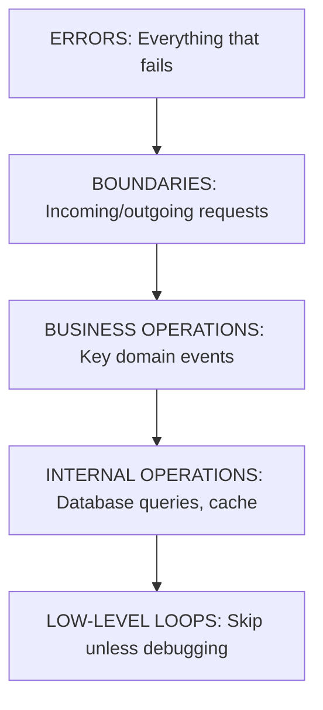
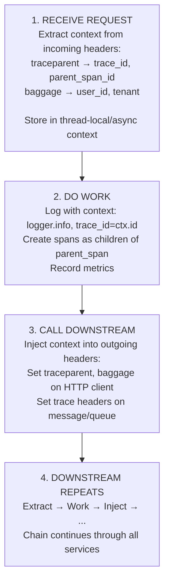

> **Complexity**: `[MEDIUM]`
>
> **Time to Complete**: 30-35 minutes
>
> **Prerequisites**: [Module 3.2: The Three Pillars](../module-3.2-the-three-pillars/)
>
> **Track**: Foundations

### What You'll Be Able to Do

After completing this module, you will be able to:

1. **Design** instrumentation that captures high-cardinality dimensions without creating cardinality explosions or unsustainable cost
2. **Apply** the RED (Rate, Errors, Duration) and USE (Utilization, Saturation, Errors) methods to determine what to instrument in a service
3. **Implement** structured logging and context propagation patterns that make cross-service debugging possible
4. **Evaluate** whether a service's instrumentation is sufficient to diagnose production incidents without redeploying code

---

## The Startup That Went Blind at the Worst Possible Moment

**November 2019. A Fast-Growing Fintech Startup. Series B Funding Just Closed.**

The engineering team had built fast. Really fast. In 18 months, they went from zero to 2 million users, handling $40 million in transactions monthly. The codebase was a masterpiece of velocity—features shipped weekly, bugs fixed within hours.

But they had cut one corner: observability. Every service logged to stdout with basic print statements. No structured data. No trace IDs. No metrics beyond "is the server up?" When things worked, nobody noticed. When things broke, they guessed.

November 15th, 3:47 PM. Their payment processor reports a critical vulnerability. They need to identify every transaction processed through a specific code path in the last 72 hours. Regulatory deadline: 4 hours.

The senior engineer opens their logging system. Searches for "payment." Gets 847 million results. Unstructured text. No way to filter by transaction ID. No way to identify the affected code path. No correlation between services.

**Hour 1**: They try regex patterns on raw logs. The patterns match too much. False positives everywhere.

**Hour 2**: They dump logs to CSV and manually filter in Excel. The file is 52GB. Excel crashes.

**Hour 3**: They start reading logs line by line, trying to reconstruct transaction flows manually. Ten engineers working in parallel.

**Hour 4**: They miss the deadline.

**The Fallout**:
- Regulatory fine: $2.3 million
- Emergency audit: 6 weeks of engineering time diverted
- Customer notification required: 847,000 users informed of potential data exposure
- Reputation damage: Two enterprise deals cancelled
- Investor confidence: Series C delayed by 9 months

**Total cost**: $18.7 million in direct losses, plus immeasurable opportunity cost.

**The root cause**: Not the vulnerability itself—that was a common library issue affecting thousands of companies. The root cause was **invisible instrumentation**. They couldn't see what their systems had done.

```
THE INSTRUMENTATION BLINDNESS TRAP
═══════════════════════════════════════════════════════════════════════════════

WHAT THEY HAD                          WHAT THEY NEEDED
─────────────────────────────────────  ─────────────────────────────────────
print("processing payment")            Structured: {"event": "payment_start",
                                                    "transaction_id": "T-12345",
                                                    "user_id": "U-6789",
                                                    "trace_id": "abc-123"}

No metrics                             Counters: payments_processed_total
                                       Histograms: payment_duration_seconds
                                       Gauges: active_transactions

No tracing                             Spans: payment-service → fraud-check
                                              → processor-api → ledger-write

TIME TO ANSWER "What transactions used code path X?"

With their setup:   4+ hours (and failed)
With proper setup:  52 seconds (WHERE code_path = 'X' AND timestamp > '3 days ago')
```

After the incident, they spent 3 months instrumenting properly. The same regulatory request—which came again during the next quarterly audit—took 2 minutes to answer.

> **Stop and think**: How would you have solved this without proper instrumentation? Is it even possible to retroactively extract execution paths without traces?

---

## Why This Module Matters

You understand logs, metrics, and traces. But where do they come from? **Instrumentation**—the code that generates telemetry.

Bad instrumentation means missing data when you need it most. Over-instrumentation means noise, performance overhead, and massive bills. Good instrumentation means the right data at the right time, with enough context to debug any issue.

This module teaches you instrumentation principles that apply regardless of language or tool. The goal isn't to make you an expert in any specific SDK, but to give you the judgment to instrument effectively.

> **The Security Camera Analogy**
>
> Security cameras need to be placed strategically. Too few and you have blind spots. Too many and you're drowning in footage with no budget to store it. You need cameras at entry points, high-value areas, and places where things go wrong. Instrumentation is the same: strategic placement at service boundaries, business operations, and error-prone code.

---

## What You'll Learn

- What to instrument (and what not to)
- Where instrumentation belongs (service boundaries, business operations)
- Instrumentation patterns for logs, metrics, and traces
- The cost of instrumentation
- Context propagation and correlation

---

## Part 1: What to Instrument

### 1.1 The Instrumentation Decision

Not everything needs instrumentation. Focus on:



> **Pause and predict**: If you only had time to instrument one of the layers in the priority pyramid, which one would give you the highest return on investment?

### 1.2 Must-Instrument: Service Boundaries

Every request entering or leaving your service should be instrumented:

```
SERVICE BOUNDARY INSTRUMENTATION
═══════════════════════════════════════════════════════════════

INCOMING (Inbound)
─────────────────────────────────────────────────────────────
→ HTTP request received
   Log: request_id, method, path, headers, user_id
   Metric: http_requests_total, http_request_duration
   Trace: Create/continue span

→ Message consumed (Kafka, RabbitMQ)
   Log: message_id, topic/queue, consumer_group
   Metric: messages_consumed_total, processing_duration
   Trace: Extract trace context from message headers

OUTGOING (Outbound)
─────────────────────────────────────────────────────────────
→ HTTP request to another service
   Log: request_id, target_service, path, response_status
   Metric: outbound_requests_total, outbound_request_duration
   Trace: Create child span, propagate context

→ Database query
   Log: query (sanitized), duration, rows_affected
   Metric: db_query_duration, db_connections_active
   Trace: Child span with db.system, db.statement tags

→ Cache access
   Log: cache_key, hit/miss
   Metric: cache_hits_total, cache_misses_total
   Trace: Child span with cache.hit tag
```

### 1.3 Must-Instrument: Business Operations

Key domain events that matter to the business:

```
BUSINESS OPERATION EXAMPLES
═══════════════════════════════════════════════════════════════

E-commerce:
├── user_signup
├── product_viewed
├── add_to_cart
├── checkout_started
├── payment_processed
├── order_completed
└── refund_issued

SaaS:
├── account_created
├── user_invited
├── subscription_started
├── feature_used
├── limit_reached
├── subscription_cancelled
└── account_deleted

For each business operation:
- Log with full context (who, what, when, outcome)
- Metric for volume and success rate
- Span if part of a larger flow
```

### 1.4 Must-Instrument: Errors

Every error should be captured with context:

```
ERROR INSTRUMENTATION
═══════════════════════════════════════════════════════════════

GOOD ERROR LOG
{
  "timestamp": "2024-01-15T10:32:15.789Z",
  "level": "error",
  "message": "Payment processing failed",
  "trace_id": "abc-123",
  "user_id": "12345",
  "order_id": "ORD-789",
  "amount": 99.99,
  "payment_method": "credit_card",
  "error_code": "CARD_DECLINED",
  "error_message": "Insufficient funds",
  "stack_trace": "...",
  "retry_count": 2,
  "service": "payment-api",
  "version": "2.3.1"
}

WHAT TO INCLUDE
├── Context: Who? (user_id), What? (order_id), When? (timestamp)
├── Error details: code, message, stack trace
├── Correlation: trace_id, request_id
├── Environment: service, version, region
└── State: retry_count, previous_attempts
```

> **Try This (2 minutes)**
>
> List 3 business operations in your system that should definitely be instrumented:
>
> 1. ________________
> 2. ________________
> 3. ________________
>
> For each: Are they currently instrumented with logs, metrics, and traces?

---

## Part 2: Instrumentation Patterns

### 2.1 Logging Patterns

**Structured Logging**

```python
# BAD: Unstructured, hard to query
logger.info(f"User {user_id} placed order {order_id} for ${amount}")

# GOOD: Structured, queryable
logger.info("order_placed", extra={
    "user_id": user_id,
    "order_id": order_id,
    "amount": amount,
    "item_count": len(items),
    "trace_id": get_trace_id()
})
```

**Log Levels**

| Level | When to Use | Example |
|-------|-------------|---------|
| DEBUG | Development/troubleshooting | Variable values, flow details |
| INFO | Normal operations | Requests received, operations completed |
| WARN | Unexpected but handled | Retry succeeded, fallback used |
| ERROR | Failures requiring attention | Request failed, exception caught |
| FATAL | System cannot continue | Startup failure, critical dependency down |

### 2.2 Metrics Patterns

**USE Method** (Utilization, Saturation, Errors):

```
USE METHOD METRICS
═══════════════════════════════════════════════════════════════

For every resource (CPU, memory, connections, queues):

UTILIZATION: How busy is it?
    cpu_usage_percent
    memory_usage_bytes
    connection_pool_usage_ratio

SATURATION: How overloaded is it?
    request_queue_length
    thread_pool_pending
    connection_wait_time

ERRORS: How often does it fail?
    connection_errors_total
    timeout_errors_total
    oom_kills_total
```

**RED Method** (Rate, Errors, Duration):

```
RED METHOD METRICS
═══════════════════════════════════════════════════════════════

For every service (user-facing):

RATE: How many requests per second?
    http_requests_total (rate over time)

ERRORS: How many requests fail?
    http_requests_total{status="5xx"}
    error_rate = errors / total

DURATION: How long do requests take?
    http_request_duration_seconds (histogram)
    p50, p90, p99 latencies
```

### 2.3 Tracing Patterns

**Span Naming**

```
SPAN NAMING CONVENTIONS
═══════════════════════════════════════════════════════════════

GOOD span names (low cardinality, descriptive):
    HTTP GET /api/users/{id}
    DB SELECT users
    QUEUE process order
    CACHE get session

BAD span names (high cardinality, will explode):
    HTTP GET /api/users/12345      ← includes ID
    DB SELECT * FROM users WHERE id = 12345  ← includes query
    GET user_12345                 ← includes ID

Put variable data in TAGS, not span names:
    Span: HTTP GET /api/users/{id}
    Tags: http.user_id=12345
```

**Span Attributes**

| Attribute | Type | Example |
|-----------|------|---------|
| http.method | string | "GET", "POST" |
| http.status_code | int | 200, 500 |
| http.url | string | "/api/users/12345" |
| db.system | string | "postgresql", "redis" |
| db.statement | string | "SELECT..." (sanitized) |
| error | boolean | true |
| error.message | string | "Connection refused" |

---

## Part 3: Context Propagation

### 3.1 Why Context Matters

Without context, each service starts fresh. With context, you can:

```
CONTEXT PROPAGATION VALUE
═══════════════════════════════════════════════════════════════

WITHOUT CONTEXT
────────────────────────────────────────
Service A logs: "Request received from user 123"
Service B logs: "Processing order"
Service C logs: "Database query executed"

Q: Did Service C's query relate to Service A's request?
A: No idea. No connection between them.

WITH CONTEXT
────────────────────────────────────────
Service A logs: "Request received" trace_id=abc-123 user_id=123
Service B logs: "Processing order" trace_id=abc-123
Service C logs: "Database query" trace_id=abc-123

Q: Did Service C's query relate to Service A's request?
A: Yes! Same trace_id. Can reconstruct full flow.
```

### 3.2 What Context to Propagate

```
CONTEXT PROPAGATION
═══════════════════════════════════════════════════════════════

STANDARD (W3C Trace Context)
─────────────────────────────────────────────────────────────
Header: traceparent
Format: {version}-{trace_id}-{parent_span_id}-{flags}
Example: 00-abc123def456-span001-01

Header: tracestate
Format: vendor-specific data
Example: congo=t61rcWkgMzE,rojo=00f067aa0ba902b7

APPLICATION CONTEXT (Baggage)
─────────────────────────────────────────────────────────────
Header: baggage
Format: key=value pairs
Example: user_id=12345,tenant=acme,feature_flag=new_checkout

Use baggage for:
- User/tenant ID (for filtering logs)
- Feature flags (for understanding behavior)
- Request source (for debugging)
```

### 3.3 Propagation Implementation



> **Gotcha: Broken Propagation**
>
> Context propagation breaks when:
> - A service doesn't extract/inject headers
> - An async queue drops headers
> - A third-party library doesn't propagate
> - Manual HTTP clients skip instrumentation
>
> Test propagation by checking: "Can I see the full trace?" If spans are disconnected, propagation is broken somewhere.

---

## Part 4: The Cost of Instrumentation

### 4.1 Performance Overhead

```
INSTRUMENTATION OVERHEAD
═══════════════════════════════════════════════════════════════

LOGGING
─────────────────────────────────────────────────────────────
- CPU: Serializing log data (JSON encoding)
- Memory: Buffering logs before flush
- I/O: Writing to disk/network
- Latency: Typically <1ms per log if async

Mitigation:
- Use async logging (don't block request)
- Sample verbose logs
- Use appropriate log levels

METRICS
─────────────────────────────────────────────────────────────
- CPU: Incrementing counters (negligible)
- Memory: Storing histogram buckets
- Network: Scraping/pushing (batched)
- Latency: Typically microseconds

Mitigation:
- Keep cardinality bounded
- Use appropriate histogram buckets
- Batch metric updates

TRACING
─────────────────────────────────────────────────────────────
- CPU: Creating spans, encoding
- Memory: Storing span data until export
- Network: Exporting spans (batched)
- Latency: 1-5ms overhead typical

Mitigation:
- Sample traces (not all requests)
- Use head-based or tail-based sampling
- Batch exports
```

### 4.2 Storage and Cost

```
COST CONSIDERATIONS
═══════════════════════════════════════════════════════════════

LOGS
1 request = ~500 bytes of logs
1M requests/day = 500 MB/day = 15 GB/month
At $0.50/GB storage + query costs = $$$

METRICS
1 metric × 100 label combinations × 15s scrape = moderate
High cardinality = storage explosion
At $0.10/million samples = manageable

TRACES
1 request = 5 spans × 200 bytes = 1KB
1M requests/day sampled at 1% = 10GB/month
Full traces at 100% = 1TB/month = $$$$

Sampling is essential for traces at scale.
```

### 4.3 Sampling Strategies

```
SAMPLING STRATEGIES
═══════════════════════════════════════════════════════════════

HEAD-BASED SAMPLING
─────────────────────────────────────────────────────────────
Decide at the START whether to trace

    Request arrives → Random: 1% → Trace
                   → Random: 99% → Don't trace

Pros: Simple, predictable cost
Cons: Might miss interesting requests

TAIL-BASED SAMPLING
─────────────────────────────────────────────────────────────
Decide at the END based on what happened

    Request completes → Error? → Keep trace
                     → Slow (>1s)? → Keep trace
                     → Normal → Sample at 0.1%

Pros: Keeps interesting traces
Cons: Must buffer all traces temporarily, more complex

ADAPTIVE SAMPLING
─────────────────────────────────────────────────────────────
Adjust rate based on traffic

    Low traffic → Sample 100%
    High traffic → Sample 1%
    Error spike → Increase error sampling

Pros: Cost control with coverage
Cons: Complex to implement correctly
```

> **Try This (2 minutes)**
>
> For your system:
> - Current trace sampling rate: ____%
> - Estimated monthly trace storage cost: $_____
> - If you sampled at 1%, would you still catch the important issues?

---

## Part 5: Instrumentation Best Practices

### 5.1 The Golden Rules

```
INSTRUMENTATION GOLDEN RULES
═══════════════════════════════════════════════════════════════

1. INSTRUMENT AT BOUNDARIES
   Every request in, every request out
   Don't trust others to instrument for you

2. INCLUDE CONTEXT
   trace_id in every log
   user_id, request_id where relevant
   Correlation is key

3. NAME CONSISTENTLY
   Same field names across services
   user_id everywhere, not user_id/userId/uid

4. KEEP CARDINALITY BOUNDED
   Logs: high cardinality OK
   Metrics: low cardinality only
   Traces: low cardinality span names

5. SAMPLE APPROPRIATELY
   100% of errors
   Sample normal requests
   Adjust based on value vs. cost

6. TEST YOUR INSTRUMENTATION
   Can you find logs for a trace?
   Can you see the full request flow?
   Do metrics match reality?
```

### 5.2 Common Patterns

**Request Timing**

```python
# Pattern: Measure duration of operations
start_time = time.time()
try:
    result = do_operation()
    metrics.histogram("operation_duration_seconds",
                      time.time() - start_time,
                      labels={"status": "success"})
except Exception as e:
    metrics.histogram("operation_duration_seconds",
                      time.time() - start_time,
                      labels={"status": "error"})
    raise
```

**Error Counting**

```python
# Pattern: Count errors with context
try:
    result = call_external_service()
except TimeoutError:
    metrics.counter("external_service_errors_total",
                   labels={"error_type": "timeout", "service": "payment"})
    logger.error("External service timeout", extra={
        "service": "payment",
        "timeout_ms": 5000,
        "trace_id": get_trace_id()
    })
    raise
```

> **War Story: The $50,000/Month Instrumentation Disaster**
>
> **2021. A Series A SaaS Startup. 50 Engineers.**
>
> The VP of Engineering declared: "We will never be caught blind by an incident. Instrument everything."
>
> The team took it literally. Every function got timing metrics. Every variable assignment got logged. Every code branch got a span. They were proud of their 847,000 active time series and 2.3TB of daily logs.
>
> **Month 1**: Observability bill: $12,000. "Worth it for visibility."
>
> **Month 3**: Bill: $28,000. Dashboards taking 52 seconds to load. "We'll optimize later."
>
> **Month 6**: Bill: $52,000. Queries timing out. Engineers avoiding the observability stack because it's too slow. Alert fatigue from 400+ daily alerts.
>
> **The Breaking Point**: A P0 incident occurs. The on-call engineer opens their dashboard. 52-second load time. They search for the error in logs. Query times out after 5 minutes. They try to find relevant metrics among 847,000 series. Needle in a haystack.
>
> The incident that should have taken 15 minutes to debug took 3 hours. Their "comprehensive observability" was actually *anti-observability*—so much noise that signal was invisible.
>
> **The Recovery**:
>
> | Before | After |
> |--------|-------|
> | 847,000 metric series | 12,400 series |
> | 2.3 TB daily logs | 180 GB daily logs |
> | Every function instrumented | Boundaries + business ops + errors |
> | $52,000/month | $4,200/month |
> | 52-second dashboard load | 1.2-second dashboard load |
> | 400 daily alerts (90% noise) | 23 daily alerts (95% actionable) |
>
> **What they removed**:
> - Loop iteration metrics (who cares how many times a for-loop ran?)
> - Internal function timing (nobody debugs at this granularity)
> - Debug-level logs in production (useful in dev, noise in prod)
> - Metrics with unbounded cardinality (user_id as a label = disaster)
>
> **What they kept**:
> - Every HTTP request in/out (boundaries)
> - Every database query (boundaries)
> - Business operations (signup, payment, order)
> - All errors with full context
>
> **The Lesson**: "Instrument everything" is not a strategy. It's an anti-pattern. The goal isn't maximum data—it's maximum *signal*. Every datapoint you add should answer a question you'll actually ask.

---

## Did You Know?

- **Facebook instruments 10 billion events per second** and samples aggressively. They use machine learning to decide which traces to keep based on predicted interestingness.

- **Prometheus was designed for pull-based metrics** (scraping), while StatsD uses push. Pull is simpler operationally (no service discovery at client), but push handles short-lived processes better.

- **The OpenTelemetry project** merged OpenTracing and OpenCensus in 2019. It's now the second-largest CNCF project (after Kubernetes) by contributors.

- **LinkedIn discovered that 1% of their traces** consumed 50% of their tracing storage. These "mega-traces" from long-running batch jobs needed special handling. The lesson: not all requests are equal—design your sampling strategy accordingly.

---

## Common Mistakes

| Mistake | Problem | Solution |
|---------|---------|----------|
| Logging sensitive data | PII in logs, compliance issues | Sanitize before logging, use allow-lists |
| High-cardinality metrics | Storage explosion, slow queries | Move high-cardinality to logs |
| No sampling | Massive costs, performance impact | Implement sampling (keep 100% of errors) |
| Inconsistent field names | Can't correlate across services | Define and enforce naming conventions |
| Forgetting async boundaries | Context lost in async code | Use context propagation libraries |
| Not testing instrumentation | Missing data when you need it | Verify telemetry works before incidents |

---

## Quiz

1. **Your team is launching a new microservice and has exactly two days to add observability before the release freeze. An engineer suggests instrumenting all internal helper functions, while another suggests only instrumenting the HTTP handlers and database clients. Which approach is correct and why?**
   <details>
   <summary>Answer</summary>

   The second engineer's approach (instrumenting boundaries) is correct because boundaries are where requests enter/leave and where context changes. By instrumenting HTTP handlers and database clients, you immediately capture the most valuable data—inbound request flows, outbound dependency latencies, and cross-service errors—with minimal code changes. Internal helper functions often generate high volumes of low-value spans that increase costs without providing systemic insight. Furthermore, boundary instrumentation ensures that if a failure occurs at a network or trust boundary, it is captured, whereas deep internal traces might miss the forest for the trees.
   </details>

2. **Your e-commerce platform processes 10,000 requests per second. You've implemented a 1% trace sampling strategy at the API gateway, but developers are complaining that they can never find traces for the intermittent 500 errors occurring in the payment service. What sampling approach is currently causing this, and what should you switch to?**
   <details>
   <summary>Answer</summary>

   The current issue is caused by head-based sampling, which randomly decides whether to trace a request at the very beginning of the transaction. Because the decision is made upfront and randomly (at 1%), there is a 99% chance that any given failed payment request was simply dropped before the error even occurred. To fix this, you should switch to tail-based sampling, where the tracing system buffers the spans and makes the sampling decision at the end of the request. This allows you to configure a rule that retains 100% of traces containing errors, ensuring developers always have the context they need for debugging while still randomly sampling successful requests to save costs.
   </details>

3. **During a severe outage, you're trying to trace a user's journey across three services. Service A logs `userId: 12345`, Service B logs `user_id: 12345`, and Service C logs `account_id: 12345`. How does this impact your incident response, and what instrumentation principle was violated?**
   <details>
   <summary>Answer</summary>

   This inconsistency drastically slows down incident response because you cannot use a single query to correlate the user's journey across the entire system. Instead of writing one simple search, responders must manually map the fields and write complex, brittle queries tailored to each service's specific logging schema. This violates the principle of consistent field naming, which mandates that dimensions like user identifiers must use the exact same key across all services. Enforcing a standardized logging schema ensures that observability tools can automatically link related events, reducing cognitive load during high-stress situations.
   </details>

4. **Your service is experiencing memory pressure. An engineer proposes adding a log line that prints the current memory usage every time a request is processed. Another engineer suggests this is a bad idea. Who is right, and what is the proper way to instrument this data?**
   <details>
   <summary>Answer</summary>

   The second engineer is right; logging memory usage per request is an anti-pattern that misuses the logging system for time-series data. Logs are designed for high-cardinality, contextual data about specific events, whereas metrics are optimized for tracking numeric values over time and performing aggregations. Printing memory usage on every request will bloat your log storage and make it extremely difficult to visualize trends or set up alerts for memory leaks. The proper approach is to expose memory usage as a metric (e.g., a gauge) and scrape it periodically, keeping the telemetry lightweight and perfectly suited for alerting dashboards.
   </details>

5. **Your billing service has 100 endpoints, returns 50 possible status codes, and serves 1 million active users. A junior engineer submits a pull request adding a Prometheus metric `http_requests_total` with labels for `endpoint`, `status_code`, and `user_id`. What will happen to your metrics infrastructure if this PR is merged, and how should it be fixed?**
   <details>
   <summary>Answer</summary>

   Merging this PR will cause a massive cardinality explosion that will likely crash or severely degrade your Prometheus infrastructure. Because each unique combination of labels creates a new time series, including `user_id` will generate 5 billion potential time series (100 × 50 × 1,000,000), vastly exceeding the system's capacity. Metrics must be strictly limited to low-cardinality dimensions like `endpoint` and `status_code` to remain performant and cost-effective. To fix the PR, the `user_id` label must be removed from the metric entirely, and user-specific context should instead be captured in structured logs where high cardinality is supported.
   </details>

6. **You've configured your API gateway to randomly sample 1% of all requests. A critical bug that only affects 0.1% of transactions was deployed yesterday. The engineering manager asks you to pull the traces for the failed transactions. Why might you struggle to fulfill this request, and how would you redesign the sampling architecture?**
   <details>
   <summary>Answer</summary>

   With a 1% head-based sampling rate, you are randomly keeping only 1 in 100 requests, meaning the vast majority of the already-rare buggy transactions (0.1%) are simply discarded by the system. You will struggle to find traces because the statistical probability of capturing one of these specific failures is incredibly low, leaving you with almost no diagnostic data. To redesign this, you should implement tail-based or adaptive sampling, which evaluates the trace after the request completes. By doing so, you can configure the system to retain 100% of traces that contain errors or anomalous latencies, ensuring critical diagnostic data is never dropped.
   </details>

7. **During a code review, you spot the following line in a new authentication service: `logger.info(f"Processing login for user {user.email} with password {user.password}")`. Identify all the critical problems with this instrumentation approach and explain how to rewrite it properly.**
   <details>
   <summary>Answer</summary>

   This log line introduces severe security, compliance, and observability problems. First, logging plain-text passwords is a critical credential leak that violates nearly all security standards (like SOC2 or GDPR) and exposes user accounts to anyone with log access. Second, the use of an unstructured Python f-string makes it impossible to efficiently query or filter the logs in a modern observability platform. Finally, it uses an email address (PII) instead of an opaque user ID and lacks correlating identifiers like a `trace_id`. It should be rewritten using a structured logging approach that drops the password, replaces the email with an opaque `user_id`, and includes distributed tracing context.
   </details>

8. **Your checkout service calls an external payment gateway. When looking at your tracing dashboard, you see the trace end at the checkout service, and a completely separate, disconnected trace begin when the payment gateway sends a webhook response back to your system. What distributed tracing concept has failed, and how would you debug it?**
   <details>
   <summary>Answer</summary>

   This scenario indicates a complete failure of context propagation across service boundaries or asynchronous boundaries. When the checkout service calls the external gateway, it fails to inject the trace context (like a W3C `traceparent` header) into the outbound request, or the gateway fails to return it in the webhook. Because the context is lost, the webhook receiver starts a brand-new trace, severing the causal link between the checkout attempt and the payment result. To debug this, you would first inspect the outgoing HTTP headers from the checkout service to ensure context is being injected, and then verify whether the payment gateway's documentation supports passing trace identifiers through their webhook payload.
   </details>

---

## Key Takeaways

```
INSTRUMENTATION ESSENTIALS CHECKLIST
═══════════════════════════════════════════════════════════════════════════════

WHAT TO INSTRUMENT (PRIORITY ORDER)
☑ 1. Errors - EVERYTHING that fails, with full context
☑ 2. Boundaries - every request in, every request out
☑ 3. Business operations - signup, payment, order, key events
☑ 4. Dependencies - database, cache, external APIs
☑ 5. Internal operations - SELECTIVE, not exhaustive

INSTRUMENTATION RULES
☑ Structured logs with consistent field names
☑ trace_id in EVERY log line (non-negotiable)
☑ Low-cardinality metric labels only
☑ Span names should be low-cardinality (variables in tags)
☑ NEVER log passwords, tokens, PII, credentials

COST AWARENESS
☑ Every metric costs storage and query time
☑ Every log line costs storage and search time
☑ Every span costs memory and export bandwidth
☑ Sample traces strategically (100% for errors, % for normal)
☑ Calculate cardinality BEFORE adding labels

CONTEXT PROPAGATION
☑ Use W3C Trace Context standard (traceparent header)
☑ Test propagation across ALL service boundaries
☑ Include context in async operations (queues, callbacks)
☑ Use baggage for application-level context (user_id, tenant)

COMMON ANTI-PATTERNS TO AVOID
☑ "Instrument everything" → instrument strategically
☑ High-cardinality metrics → move to logs
☑ Unstructured logs → structured JSON with fields
☑ Missing trace_id → always include correlation
☑ Sensitive data in logs → use allow-lists
```

---

## Hands-On Exercise

**Task**: Instrument a sample service endpoint with all three pillars.

**Part 1: Define Instrumentation Points (10 minutes)**

For this endpoint: `POST /api/orders` (create order)

```
Flow:
1. Receive HTTP request
2. Validate user authentication
3. Validate order data
4. Check inventory (DB call)
5. Reserve inventory (DB call)
6. Create order record (DB call)
7. Publish order event (message queue)
8. Return response
```

For each step, define what to instrument:

| Step | Log Event | Metric | Trace Span |
|------|-----------|--------|------------|
| 1. Receive | "request_received" + method, path, user_id | http_requests_total | HTTP POST /api/orders |
| 2. Auth | "auth_validated" or "auth_failed" | auth_duration_seconds | auth.validate |
| 3. Validate | | | |
| 4. Check inventory | | | |
| 5. Reserve inventory | | | |
| 6. Create order | | | |
| 7. Publish event | | | |
| 8. Response | | | |

**Part 2: Write Pseudo-Code (15 minutes)**

Write instrumentation code for steps 4-6 (database operations):

```python
# Your pseudo-code here

def check_inventory(items, trace_context):
    # Create span
    # Log start
    # Call database
    # Log result
    # Record metric (duration, success/failure)
    # Return result
    pass

def reserve_inventory(items, order_id, trace_context):
    # Similar pattern
    pass

def create_order(order_data, trace_context):
    # Similar pattern
    pass
```

**Part 3: Error Handling (10 minutes)**

What happens when step 5 (reserve inventory) fails because an item is out of stock?

Define the instrumentation:

| Signal | What to Capture |
|--------|-----------------|
| Log | level=WARN, message=?, fields=? |
| Metric | which metric? labels? |
| Trace | span status? error tags? |

How would you find all "out of stock" errors in the last hour?

**Success Criteria**:
- [ ] All 8 steps have defined instrumentation (logs, metrics, traces)
- [ ] Database operations include: duration metrics, child spans, contextual logs
- [ ] Error case instrumentation is comprehensive
- [ ] Query for finding errors is defined

---

## Further Reading

- **"Observability Engineering"** - Charity Majors et al. Chapters on instrumentation practices.

- **OpenTelemetry Instrumentation Docs** - Language-specific instrumentation guides.

- **"Distributed Tracing in Practice"** - Austin Parker et al. Deep dive into tracing instrumentation.

---

## Next Module

[Module 3.4: From Data to Insight](../module-3.4-from-data-to-insight/) - Using observability data: alerting, debugging, and building understanding.