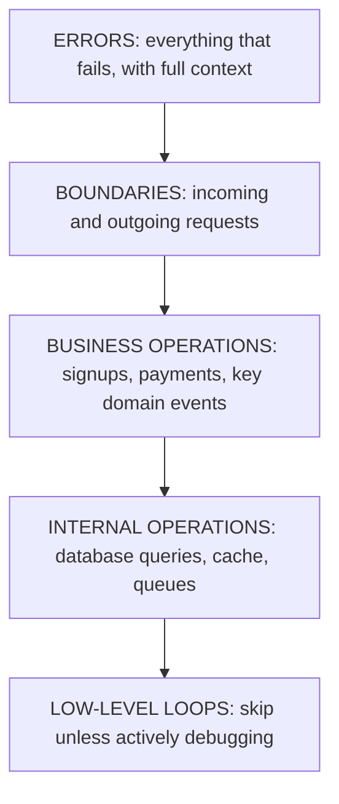
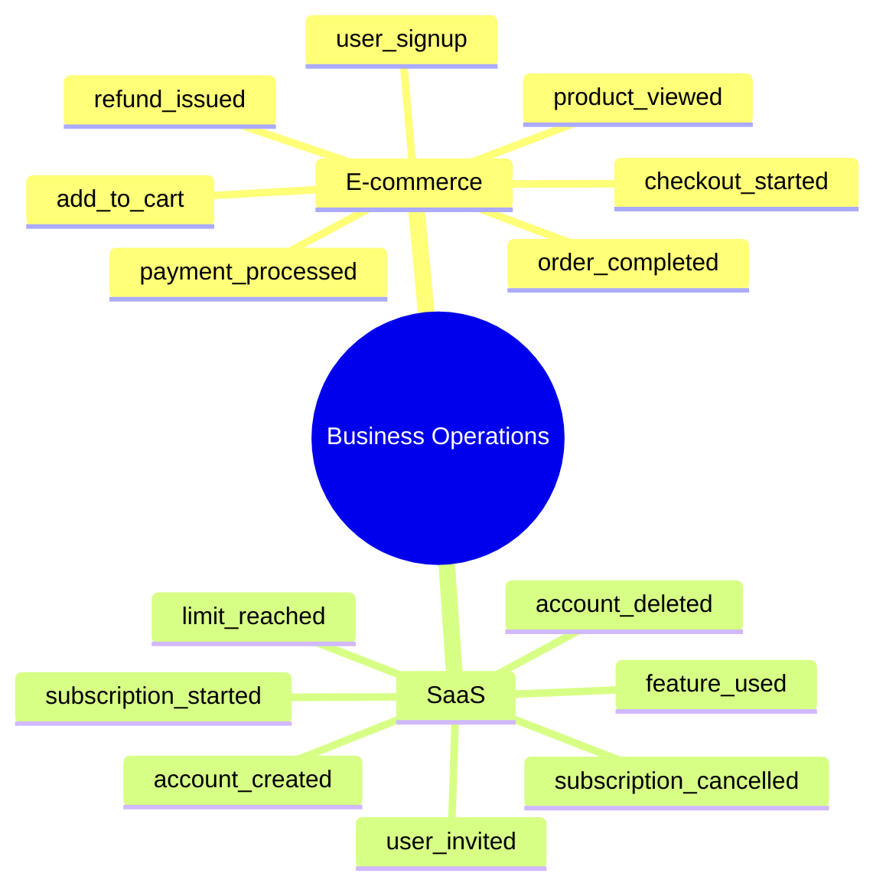
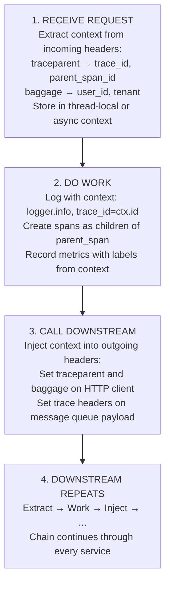
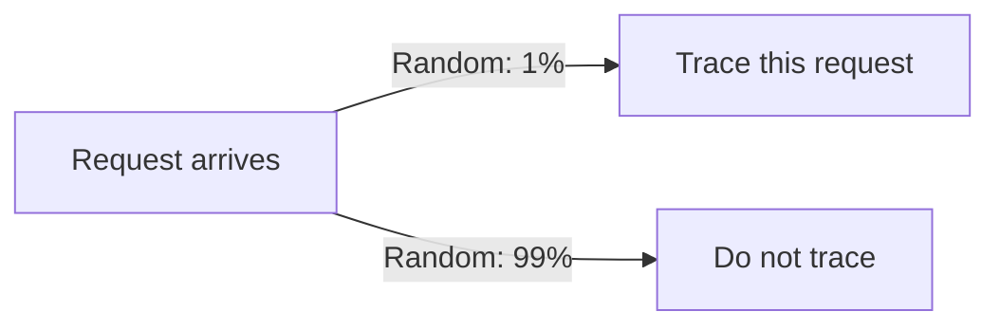
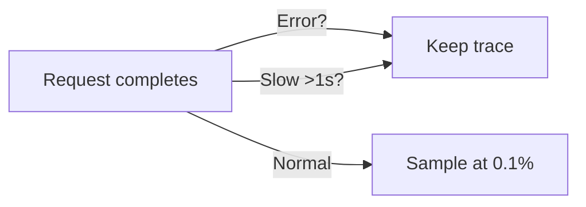
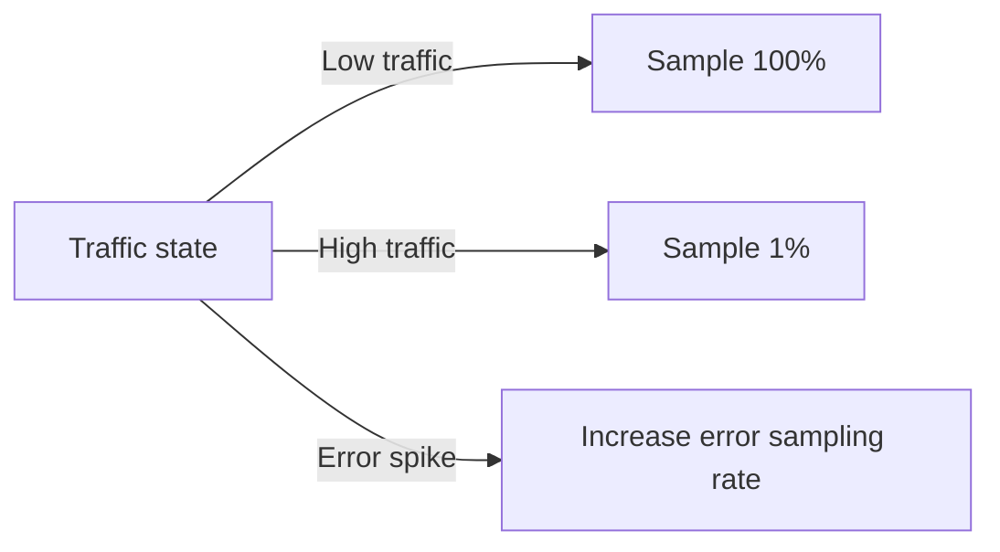

> **Complexity**: `[MEDIUM]`
>
> **Time to Complete**: 35-40 minutes
>
> **Prerequisites**: [Module 3.2: The Three Pillars](../module-3.2-the-three-pillars/)
>
> **Track**: Foundations

### What You'll Be Able to Do

After completing this module, you will be able to:

1. **Design** instrumentation that captures useful dimensions without creating cardinality explosions or runaway query bills, by reasoning about which fields belong in metrics, logs, and span attributes respectively.
2. **Apply** the RED (Rate, Errors, Duration) method to user-facing services and the USE (Utilization, Saturation, Errors) method to resources, and explain when each is the wrong lens to reach for.
3. **Implement** structured logging and W3C trace-context propagation patterns that survive service boundaries, message queues, and asynchronous callbacks.
4. **Evaluate** whether a service's instrumentation is sufficient to diagnose a production incident without redeploying code, attaching a debugger, or asking a customer to "try again with the network tab open."
5. **Compare** head-based, tail-based, and adaptive sampling strategies, and justify a choice for a given traffic profile and budget.

---

## The Startup That Went Blind at the Worst Possible Moment

**November 2019. A fast-growing fintech startup. Series B funding just closed.**

The engineering team had built fast. Really fast. In eighteen months they went from zero to two million users, handling forty million dollars in transactions every month. The codebase was a masterpiece of velocity: features shipped weekly, bugs fixed within hours, deploys went out at noon and again at five. They were proud of their pace, and the post-mortem culture was healthy in the small ways: blameless retros, runbooks that got updated, on-call shifts that rotated fairly. But velocity hides costs that only show up under load, and one of those costs was about to come due.

The team had cut one corner without noticing it was a corner. Every service logged to stdout with `print()` statements. There were no structured fields, no trace identifiers, no metrics beyond a single uptime probe that pinged the load balancer once a minute. When systems worked, nobody noticed. When they broke, the on-call engineer guessed, then SSH'd into a box, then guessed again. The team had reasoned, perfectly logically, that "we will instrument it when we need it" — without realising that the moment they would need it was also the moment they would be unable to add it.

That moment arrived on November 15th at 3:47 PM. Their payment processor reported a critical vulnerability in a shared cryptography library. Regulators required them to identify every transaction routed through a specific code path within the last seventy-two hours. The deadline was four hours. The senior engineer opened their logging system, searched for the string "payment," and got eight hundred and forty-seven million results back, all unstructured prose. There was no way to filter by transaction ID because the IDs were embedded inside log messages as plain text. There was no way to correlate the payment service's activity with the fraud-check service's activity, because the two services did not share any identifier the engineer could grep for.

In the first hour they tried to write regular expressions against the raw text and the patterns matched too broadly, returning false positives in the millions. In the second hour they exported the relevant time window to CSV and tried to load it into Excel, which crashed under fifty-two gigabytes of input. In the third hour they split the file across ten engineers and started reading line by line, attempting to reconstruct transaction flows manually by looking for adjacent timestamps. In the fourth hour they missed the deadline.

The fallout was severe and entirely predictable in retrospect. The regulator imposed a fine of two-point-three million dollars. The emergency audit consumed six weeks of engineering time, diverted from a critical product launch. They were forced to notify eight hundred and forty-seven thousand users that their data may have been exposed, even though the team strongly suspected only a small subset was actually affected — they had no way to prove it. Two enterprise deals were cancelled by procurement teams who refused to renew with a vendor that had publicly disclosed a data event. The Series C round, which had been weeks away from term sheets, slipped by nine months. Direct losses came in around eighteen million dollars; the opportunity cost was uncountable.

The most important sentence in the post-mortem was this: **the root cause was not the vulnerability itself.** The library issue was a common one, affecting thousands of companies that month, and most of them resolved it without making the news. The root cause was invisible instrumentation. The team could not see what their systems had done, and they could not retroactively reconstruct it from the prose of their logs. After the incident they spent three months instrumenting properly. The same regulatory request, which arrived again during the next quarterly audit, took two minutes to answer.

### The Instrumentation Blindness Trap

| What They Had | What They Needed |
|---------------|------------------|
| `print("processing payment")` | Structured: `{"event": "payment_start", "transaction_id": "T-12345", "user_id": "U-6789", "trace_id": "abc-123"}` |
| No metrics beyond uptime | Counters like `payments_processed_total`, histograms like `payment_duration_seconds`, gauges like `active_transactions` |
| No tracing | Spans across `payment-service` → `fraud-check` → `processor-api` → `ledger-write` with parent/child relationships preserved |
| Free-text searching | Queryable JSON fields with consistent names across all services |

**Time to Answer: "Which transactions used code path X?"** With their original setup, four hours and counting, ultimately failed. With proper instrumentation, fifty-two seconds: a single SQL-like query of the form `WHERE code_path = 'X' AND timestamp BETWEEN ?? AND ??`.

> **Stop and think**: How would you have solved this without proper instrumentation? Is it even possible to retroactively extract execution paths from production traffic without traces, or is the data fundamentally absent? If you decided your team needed to be able to answer this question in two minutes, what would the smallest change be that would make that possible?

---

## Why This Module Matters

You already know what logs, metrics, and traces are from the previous module. What you do not yet know is how they appear in your system, because telemetry does not arrive by magic. Every signal you query in production is the result of a decision a developer made, sometimes consciously and sometimes by default, about which line of code emits which fact. That decision is **instrumentation**, and it is one of the highest-leverage and most-neglected disciplines in modern software engineering. A team with mediocre tooling and excellent instrumentation will out-debug a team with elite tooling and afterthought instrumentation, every single time.

Bad instrumentation produces missing data exactly when you need it most. Over-instrumentation produces noise, performance overhead, and observability bills that quietly become the third-largest line item in your cloud spend. The art is to capture the right data at the right time, with enough context to debug any incident the system can produce, while costing a sustainable fraction of your operating budget. This module teaches the principles that govern that art independently of any specific SDK, vendor, or programming language. The goal is not to make you fluent in OpenTelemetry's Java API; it is to give you the judgment that lets you instrument any service, in any stack, well.

> **The Security Camera Analogy**
>
> Security cameras need to be placed strategically. Too few and you have blind spots in places where things actually go wrong. Too many and you are drowning in footage with no budget to store it and no human capacity to review it. A competent security architect places cameras at entry points, at high-value areas, and at locations where prior incidents have occurred — the goal is high signal density at the points where evidence is likely to be needed. Instrumentation follows the same logic: cover service boundaries (entry and exit), business operations (high-value events), and error paths (where things historically go wrong). Anything else is decoration that you will pay for monthly.

---

## What You'll Learn

This module is structured as a progression from "what to instrument" to "how to instrument it without bankrupting yourself." We start with the question of where instrumentation belongs in a service, then look at the patterns for generating each of the three signals well, then turn to context propagation across service boundaries, and finish with the cost engineering and sampling strategies that separate a junior implementer from a senior platform engineer. Along the way we will look at the schema and naming conventions that turn a pile of telemetry into a queryable dataset, and at the failure modes that have repeatedly tipped well-meaning teams into observability bankruptcy.

---

## Part 1: What to Instrument

### 1.1 The Instrumentation Decision

The most common instrumentation mistake is treating it as a binary question — "is this code instrumented or not?" — when it is actually a question of priority and placement. Not every line of code deserves a span, and not every variable deserves a log field. The goal is to spend your instrumentation budget where it pays back the most: at the places where requests cross trust boundaries, where business outcomes are decided, and where things have failed before. Junior engineers tend to instrument in proportion to how interesting they personally find a piece of code; senior engineers instrument in proportion to how often that code will appear in a future incident.

A useful priority pyramid sits in the back of every senior engineer's head when they review a pull request that adds telemetry. Errors come first because every failure is a question your future self will need to answer. Boundaries come second because they are where context changes hands and where most multi-service bugs hide. Business operations come third because they are the events your product manager will ask about during quarterly reviews. Internal operations like cache hits and database calls come fourth, instrumented selectively. Low-level loops come last, almost never, and only with explicit justification.



> **Pause and predict**: If you only had time to instrument one of the layers in the priority pyramid before tonight's release, which one would give you the highest return on investment, and why does that answer change for a brand-new service versus one that has been in production for two years?

### 1.2 Must-Instrument: Service Boundaries

Every request entering or leaving your service is a place where context changes hands and where bugs hide. The reason boundaries matter so much is that a service is, from the outside, a black box: when something goes wrong, the only ground truth available to other teams is what they observed at the boundary, and the only ground truth available to you is what you observed at your own boundary. If those two observations disagree, you have either a bug or an instrumentation gap, and you cannot tell which one without trustworthy boundary telemetry. The minimum viable instrumentation for any service is "every request in, every request out, with timing, status, and a correlation identifier."

For inbound HTTP requests you should log the request identifier, method, path, the relevant high-level headers (user-agent, content-type), and the authenticated user identifier. You should record metrics for request count and request duration, labelled by route and status code. You should create or continue a trace span. For inbound message-queue consumption you should log the message identifier, the topic or queue name, the consumer group, and the time spent processing the message. You should record metrics for messages consumed and processing duration, and you should extract the trace context from message headers so the span sits beneath the producer's span in the trace tree.

For outbound HTTP calls to other services you should log the request identifier, the target service, the path, the response status, and any retry count. You should record metrics for outbound request count and duration, broken down by target and status. You should create a child span and inject the trace context into the outgoing headers. For database queries you should log the sanitised query text (with parameter values stripped), the duration, and the affected row count. You should record query duration as a histogram and connection-pool utilization as a gauge. You should create a child span with `db.system` and `db.statement` tags, taking care that the statement is the parameterised form, not the substituted form, to keep cardinality bounded. For cache operations you should log the cache key, whether the result was a hit or a miss, and the duration; you should record hit and miss counters; you should create a span with a `cache.hit` boolean tag.

### 1.3 Must-Instrument: Business Operations

Business operations are the events your product cares about, and they are usually the ones your engineering organisation will most often be asked to reason about retrospectively. When the head of payments asks "how many checkouts did we process between 2pm and 3pm yesterday, broken down by payment method?", the answer must come from your instrumentation, because no other system in your company will have that data at the resolution and freshness required. A service whose business operations are not explicitly instrumented forces every such question to become an offline data engineering project, which is both slow and expensive, and which often produces answers nobody fully trusts.



For every business operation you should emit three signals together. A structured log entry that captures the full context — who performed the action, what they did, when, and what the outcome was — gives you a queryable record of every individual event. A counter or histogram metric gives you cheap aggregate views, including success rate and throughput trends, that you can alert on and chart on a dashboard without scanning logs. A span attached to the rest of the request flow gives you a causal record of what triggered the event and what happened next, which is invaluable when an event was unexpected or when you need to explain a downstream consequence to a customer or auditor.

### 1.4 Must-Instrument: Errors

Every error path in your service is a place where you have already failed once and where you are likely to fail again. Errors deserve the most generous instrumentation budget in the system because the cost of a missing field at error time is paid in incident minutes, and incident minutes are the most expensive minutes your engineering organisation produces. The rule is simple and uncompromising: an error log without enough context to reproduce the failure is worse than no log at all, because it gives the on-call engineer the false confidence that the data exists somewhere, when in fact it does not.

```json
{
  "timestamp": "2024-01-15T10:32:15.789Z",
  "level": "error",
  "message": "Payment processing failed",
  "trace_id": "abc-123",
  "span_id": "def-456",
  "user_id": "12345",
  "order_id": "ORD-789",
  "amount": 99.99,
  "currency": "USD",
  "payment_method": "credit_card",
  "error_code": "CARD_DECLINED",
  "error_message": "Insufficient funds",
  "stack_trace": "...",
  "retry_count": 2,
  "service": "payment-api",
  "version": "2.3.1",
  "region": "us-east-1"
}
```

The structure above captures four categories of context that are non-negotiable on any error path. The first is identity context: who the request was for, what resource it acted on, and when. The second is error context: a stable error code that downstream systems can match against, a human-readable message, and a stack trace deep enough to identify the failing function. The third is correlation context: the trace identifier and request identifier that let you reconstruct what happened before and after the failure. The fourth is environment context: the service name, version, and region, which let you isolate failures specific to a single deployment, build, or availability zone. Add anything else that is cheap to capture and likely to be relevant — feature flags, retry count, prior attempt outcomes — and resist the temptation to add data that is "just nice to have," because every additional field has a storage cost that compounds across millions of requests.

> **Try This (2 minutes)**
>
> List three business operations in your current system that should definitely be instrumented:
>
> 1. ________________
> 2. ________________
> 3. ________________
>
> For each one, ask yourself: are they currently instrumented with logs, metrics, and traces? If you had to answer "how many of these happened in the last hour, broken down by user tier?", how long would it take, and which signal would you query first? If the answer is "I do not know" or "more than five minutes," you have just identified the highest-leverage instrumentation work in your backlog.

---

## Part 2: Instrumentation Patterns

### 2.1 Logging Patterns

The single most important transformation in modern logging is the move from prose to structure. A line like `logger.info(f"User {user_id} placed order {order_id} for ${amount}")` looks helpful to a human reading it, but it is opaque to every machine downstream. Search engines that ingest it cannot extract `user_id` as a field because they do not know it is a field; they have to fall back to regular expressions that break the moment somebody changes the wording. Aggregation tools cannot bucket by `amount` because the value is embedded inside a string. Worst of all, the format is unstable: a developer who tweaks the prose for readability silently breaks every saved query that depended on the original phrasing.

```python
# Bad: unstructured, hard to query, format drift breaks dashboards
logger.info(f"User {user_id} placed order {order_id} for ${amount}")

# Good: structured, queryable, schema-stable
logger.info("order_placed", extra={
    "user_id": user_id,
    "order_id": order_id,
    "amount_cents": amount_cents,
    "currency": "USD",
    "item_count": len(items),
    "trace_id": get_trace_id(),
})
```

The structured form is identical in cost to the prose form at write time, and dramatically cheaper at query time. Notice three small but consequential choices. The event name `order_placed` is a stable, low-cardinality identifier that you can group on, count, and alert on without ever parsing the log message. The amount is in cents (an integer) rather than dollars (a float), removing a class of representation bugs that have caused real-world incidents at multiple unicorns. The `trace_id` ties this log to the rest of the request flow, which means the moment someone opens a trace they get this log line as supporting context for free.

Log levels exist to control verbosity, not to convey importance to humans. The five canonical levels each have a specific operational meaning, and using them sloppily is one of the quiet ways teams burn observability money on data they will never query.

| Level | When to Use | Example |
|-------|-------------|---------|
| DEBUG | Development and active troubleshooting only — disabled in production by default | Variable values inside a hot function, intermediate computation results |
| INFO | Normal, expected operations that an operator would want to confirm happened | Request received, operation completed, scheduled job ran |
| WARN | Unexpected but handled — something deviated from the happy path but the system recovered | Retry succeeded after one failure, fallback path was used, deprecated API was called |
| ERROR | Failures that require human attention or investigation, even if eventually recovered | Database query failed, downstream call returned 5xx, exception caught and surfaced |
| FATAL | The process cannot continue and is exiting or being killed | Startup configuration invalid, critical dependency unreachable at boot time |

The key discipline is that every level above DEBUG should be queryable in production, and every level should answer a different operational question. A common anti-pattern is logging everything at INFO so nothing is ever missed; the actual effect is that the noise level rises until ERROR-grade events are buried under indistinguishable volume.

### 2.2 Metrics Patterns

The two foundational frameworks for metric coverage are RED and USE, and they are not interchangeable. RED, due to Tom Wilkie, applies to user-facing services and answers "how is this service doing from the perspective of someone calling it?" The three signals are Rate (requests per second), Errors (failed requests, ideally as a fraction of total), and Duration (latency, expressed as a histogram so you can compute p50, p95, p99 and not just mean). USE, due to Brendan Gregg, applies to resources and answers "is this thing about to fall over?" The three signals are Utilization (how busy is it as a percentage), Saturation (how much queued or pending work is waiting on it), and Errors (how often does it fail or refuse work).

The reason these two methods exist as a pair is that services and resources fail differently, and a metric set that is correct for one is often misleading for the other. A queue might have ten percent utilization (USE looks fine) and yet have a saturation of ten thousand items waiting to be processed (a disaster). Conversely, a service might have a perfectly healthy duration distribution (RED looks fine) while the database it depends on is at ninety-eight percent CPU (USE catches what RED missed). Senior platform engineers reach for whichever lens fits the layer they are looking at, and they instrument both for any non-trivial system.

For RED, the typical implementation is a single counter `http_requests_total` labelled by route, method, and status code, plus a single histogram `http_request_duration_seconds` labelled the same way. From these two metrics you can compute every standard service-level indicator the team will ever ask for: request rate, error rate, latency percentiles, and availability. For USE, the implementation depends on the resource: CPU and memory are gauges, queue depth is a gauge, connection pool wait time is a histogram, and resource-specific error counters track timeouts and refusals. Across both methods, the overriding concern is cardinality discipline, which we cover in detail later.

### 2.3 Tracing Patterns

Spans are the unit of observation in tracing, and the way you name and tag them determines whether your tracing system is queryable or whether it merely stores data. The single most important rule of span naming is that **span names must be low cardinality, and high-cardinality data must go in span attributes (tags)**. A span named `HTTP GET /api/users/{id}` is correct. A span named `HTTP GET /api/users/12345` is wrong, because it creates a new span name for every user, which makes aggregation impossible and inflates storage exponentially.

The right mental model is that a span name identifies a *kind* of operation, while attributes identify the *specific instance*. Span name `DB SELECT users` and attribute `db.user_id=12345`: correct. Span name `DB SELECT * FROM users WHERE id = 12345`: catastrophic. The cost of getting this wrong is not just storage; it is also the loss of every aggregate query you would otherwise have been able to run, because tracing systems aggregate by span name and treat each unique name as a separate operation. A team that puts variable data in span names ends up with a tracing UI that is unsearchable.

| Attribute | Type | Example |
|-----------|------|---------|
| http.method | string | "GET", "POST" |
| http.status_code | int | 200, 500 |
| http.route | string | "/api/users/{id}" |
| http.user_id | string | "12345" (high-cardinality data, correctly placed in an attribute) |
| db.system | string | "postgresql", "redis" |
| db.statement | string | "SELECT id, email FROM users WHERE id = ?" (parameterised) |
| error | boolean | true |
| error.type | string | "TimeoutError" |
| error.message | string | "Connection refused" |

Every instrumentation library on the market today implements the OpenTelemetry semantic conventions, which fix these attribute names across vendors and languages. Using the conventions is not optional — it is the difference between telemetry that is portable across backends and telemetry that locks you into a single vendor's query language. If you find yourself making up an attribute name, check the conventions first; the chances are extremely high that the name you need already exists.

---

## Part 3: Context Propagation

### 3.1 Why Context Matters

A microservice architecture without context propagation is a collection of services that cannot answer questions about each other's behaviour. Each service logs what it did, in isolation, and there is no shared identifier that ties one service's record of a request to another service's record of the same request. When a customer reports that their checkout failed, the on-call engineer can see that *some* checkout failed in the order service, that *some* request errored in the payment service, and that *some* database query timed out, but they cannot prove these three observations are about the same customer's transaction. The investigation degenerates into pattern-matching by timestamp, which is unreliable at the scale of any real system.

Consider the same flow with and without propagation. Without context, Service A logs "Request received from user 123," Service B logs "Processing order," and Service C logs "Database query executed," and there is nothing in any of those three records that proves they belong to the same logical operation. With context, all three services log the same `trace_id=abc-123`, and the on-call engineer can issue a single query that returns the full causal chain in one screen. The shift from the first world to the second is the most consequential single improvement most teams will ever make to their observability posture, and it is essentially free once the propagation library is wired in correctly.

> **Stop and think**: How would you correlate logs if a single user made three simultaneous requests within the same second? Without a trace identifier, even a user identifier is insufficient because the three flows are interleaved. A `trace_id` per request is the smallest unit of identity that uniquely names one execution path through the system.

### 3.2 What Context to Propagate

The W3C Trace Context specification defines two HTTP headers that have become the industry-standard mechanism for propagating trace identity across service boundaries, and using them is essentially a free win because every modern instrumentation library understands them out of the box. The `traceparent` header carries the trace identifier, the parent span identifier, and a flags byte, packed into a fixed format that is cheap to parse and impossible to misinterpret. The `tracestate` header carries vendor-specific data that lets multi-vendor environments coexist without losing information.

Beyond the trace identity itself there is a second mechanism called *baggage*, also standardised by the W3C, which lets you propagate arbitrary key-value pairs alongside the trace context. Baggage is the right home for application-level identifiers that you want every downstream service to know about — a tenant identifier, a feature-flag bucket, a synthetic-test marker, a request source code — without forcing every service to extract them from the original payload. A common anti-pattern is to add these identifiers as request body fields and force every internal API to parse them; baggage avoids that by treating them as transport metadata.

```text
traceparent: 00-4bf92f3577b34da6a3ce929d0e0e4736-00f067aa0ba902b7-01
            ^^  ^^^^^^^^^^^^^^^^^^^^^^^^^^^^^^^^^^^^  ^^^^^^^^^^^^^^^^  ^^
            |   |                                     |                 |
            |   trace_id (16 bytes hex)               parent_span_id    flags
            version

tracestate: vendor1=value1,vendor2=value2

baggage: user_id=12345,tenant=acme,feature_flag=new_checkout
```

The discipline around baggage is that it is propagated to every downstream service, including services you do not control, so you must not put sensitive data into it. Personally identifiable information, authentication tokens, and any field subject to regulatory protection belong in the body of authenticated requests, not in baggage that may be logged by intermediate proxies.

### 3.3 Propagation Implementation



The four-step pattern looks deceptively simple, but the failure modes are all in the corners. Async code is the most common place propagation breaks, because the context is stored in thread-local or task-local storage and a naive `await` or `submit` call will run the continuation on a different worker without copying the context. Modern instrumentation libraries handle this for you if you use their async-aware primitives, but hand-rolled thread pools and custom executor services are landmines. Message queues are the second most common failure point, because the trace context lives in HTTP headers but messages do not have HTTP headers; you have to explicitly serialise the context into the message payload at publish time and deserialise it at consume time, and forgetting either side breaks the trace.

> **Gotcha: Broken Propagation**
>
> Context propagation breaks when a service does not extract or inject headers, when an async queue drops trace context fields, when a third-party library does not propagate, or when a manual HTTP client constructs requests outside the instrumented client. The diagnostic test is: pick a real production trace ID and confirm you can see spans from every service that participated. If any expected service is missing or shows up as a disconnected root span, propagation is broken at the boundary entering that service. Instrumentation that works in unit tests but breaks in production almost always does so because of an async hop that the test harness did not exercise.

---

## Part 4: The Cost of Instrumentation

### 4.1 Performance Overhead

Every piece of instrumentation imposes some cost on the running process, and a senior engineer reasons about that cost explicitly rather than pretending it is zero. The good news is that for well-implemented instrumentation, the overhead is bounded and predictable; the bad news is that "well-implemented" is doing a lot of work in that sentence, and it is easy to write instrumentation that costs orders of magnitude more than it should.

For logging, the dominant costs are CPU time spent serialising structured data to JSON, memory used buffering log entries before they flush to a sink, and I/O bandwidth writing them to disk or network. Synchronous logging on the request path can add several milliseconds per log call; asynchronous logging using a background flusher reduces this to under a millisecond in the typical case, at the cost of some memory overhead and the risk of losing buffered logs if the process crashes. The right default is asynchronous logging with bounded queue depth and a documented behaviour for what happens when the queue is full, because "what happens when logs back up" is a question that will eventually appear during an incident.

For metrics, the dominant costs are CPU time incrementing counters and updating histogram buckets, memory storing the in-process metric state, and network bandwidth scraping or pushing metrics to a backend. Counter increments are a single atomic operation and are essentially free. Histogram updates are slightly more expensive because they involve bucket selection, but still typically take microseconds. The hidden cost of metrics is cardinality: every unique label combination is a separate time series, and the per-process memory cost grows linearly with the number of series, while the backend cost grows superlinearly. We will return to this in section 4.3.

For tracing, the dominant costs are CPU time creating and encoding spans, memory holding span data until the batch exporter flushes it, and network bandwidth shipping spans to the backend. Per-span overhead is typically one to five milliseconds depending on the SDK, the number of attributes, and whether the span involves parent-child setup. The cost scales linearly with span count, which is why sampling is essential at high request volumes.

### 4.2 Storage and Cost

Instrumentation storage is the single largest contributor to most teams' observability bill, and it has a habit of growing faster than the team's awareness of it. A useful rule of thumb is that every signal class has a different unit cost and a different scaling shape, and conflating them in your budgeting causes nasty surprises. Logs cost roughly half a kilobyte per request worth of structured entries, which compounds to fifteen gigabytes per million requests per day, which compounds further if you keep them for thirty days at ingest-plus-query pricing. Metrics cost roughly a few bytes per sample, but the sample rate is determined by your label cardinality, so a single carelessly-added label can ten-x your bill overnight. Traces cost roughly a kilobyte per request at full fidelity, which at a million requests per day is a terabyte per month — usually unaffordable, which is why sampling is non-optional.

The economics shift once you understand them. Logs are typically the cheapest signal per query, the most expensive per byte stored, and the highest cardinality. Metrics are typically the cheapest per byte stored, the most efficient to query, and the most cardinality-constrained. Traces are typically the most expensive per byte stored, the most expensive to query, and the only signal that captures cross-service causality. A senior engineer treats these three signals as a portfolio: cheap, queryable aggregates from metrics; specific events with full context from logs; cross-service causality from traces. Trying to do everything with one signal class is how teams end up with the fifty-thousand-dollar observability bill described in the war story below.

> **Pause and predict**: If you increase your log retention from seven days to thirty days, what happens to query performance during an active incident? The naive answer is "nothing, queries should still work." The real answer is that most log query engines scan more data when the retention window is larger, even if your time filter is narrow, because index granularity and shard scheduling are tuned for typical retention. A retention-window bump that looks free can quietly multiply your incident-time query latency.

### 4.3 Sampling Strategies

Sampling is how you reconcile the goal of "see every interesting request" with the constraint of "do not store every uninteresting one." There are three common strategies, each appropriate for a different operating regime, and choosing the right one is a senior-level decision that depends on your traffic shape, your error rate, and the kinds of investigations you typically run.

**Head-Based Sampling.** Decide at the start of the request, based on a random coin flip seeded by the trace ID, whether to keep this trace. The decision is propagated through the entire trace so all participating services agree. Operationally simple, predictable in cost, and fast — there is no buffering. The disadvantage is that the decision is uninformed: at one percent sampling you keep a random one percent of all traces, including the ninety-nine percent of boring ones, while dropping ninety-nine percent of the interesting ones. Head-based sampling is the right choice for high-volume, low-error services where the median trace is representative.



**Tail-Based Sampling.** Buffer all traces in a collector for a short window after they complete, then decide based on what happened whether to keep each one. This lets you implement rules like "keep every trace that had an error," "keep every trace longer than one second," and "sample one in a hundred normal traces." The advantage is that you keep the interesting traces almost by definition. The disadvantage is operational: you need a tier of collectors with enough memory to buffer every trace for the duration of the buffer window, and you need the buffer window to be longer than the longest trace you care about, which can be expensive in latency-sensitive systems.



**Adaptive Sampling.** Adjust the sampling rate dynamically based on traffic, errors, or service health. At low traffic you might sample at a hundred percent; during a traffic spike you drop to one percent; during an error spike you increase the error sample rate to capture diagnostic data while reducing the normal-traffic rate to compensate. This is the most powerful strategy and the most complex to implement correctly. The risk is that the feedback loop misbehaves under unusual conditions and you end up sampling at the wrong rate during the exact incident you needed coverage for.



A pragmatic default for most production services is **head-based sampling for normal traffic at one to ten percent, combined with always-keep policies for errors and high-latency requests at the collector tier**. This is technically a hybrid head-and-tail strategy and it captures most of the benefit of pure tail-based sampling at a fraction of the operational complexity. As your scale and your investigation maturity grow, you upgrade to full tail-based or adaptive sampling.

> **Try This (2 minutes)**
>
> For your current system, write down the answers to these three questions before reading on. What is your current trace sampling rate? What is the estimated monthly storage cost of your traces? If you sampled at one percent, would you still catch the production issues you have actually had to debug in the last quarter? The third question is the one that matters: sampling design is reverse-engineering from "what investigations do we run" back to "what traces do we need to keep."

---

## Part 5: Cardinality, Schema, and Naming

### 5.1 Cardinality Discipline

Cardinality is the count of distinct values a label or attribute can take, and it is the single most important concept in instrumentation cost engineering. A metric with a status-code label has cardinality on the order of ten or twenty (the number of distinct HTTP status codes you actually return). A metric with a route label has cardinality on the order of a hundred (the number of distinct routes in your service). A metric with a user-ID label has cardinality on the order of your entire user base, potentially in the hundreds of millions, and adding it to a metric has been known to take down entire metrics backends within hours. The lesson is that label cardinality multiplies, not adds, and that a label whose cardinality looks innocuous in isolation becomes catastrophic when combined with other labels.

The decision rule for any new label is: **estimate the worst-case cardinality of this label combined with every existing label, multiply, and only add the label if the result is bounded and tolerable**. For a metric `http_requests_total` with labels `route` (one hundred), `method` (six), and `status_code` (twenty), the cardinality is twelve thousand, which is comfortable. Adding `user_id` (one hundred million) takes it to one-point-two trillion, which will instantly destroy any time-series database you point it at. The right place for `user_id` is in logs, where high cardinality is cheap and even desirable, and in span attributes, where the cost is paid only on traces you actually keep.

### 5.2 Schema and Naming Conventions

A naming convention is the difference between a queryable observability dataset and a hopeless tangle. The most important rule is consistency across services: if one service logs `user_id` and another logs `userId` and a third logs `uid`, you cannot write a single query that filters on a user across the platform. The cost of inconsistency is paid every time anyone runs a cross-service investigation, which is exactly the time when you most want the data to be tractable. Adopt a single convention — typically snake_case for log fields and dotted hierarchical names for span attributes, following the OpenTelemetry semantic conventions — and enforce it with linting at code-review time. Retrofitting a naming convention onto an existing platform is a multi-quarter project, so doing it right from the start is enormously valuable.

Beyond field names, the schema includes the structure of event names, error codes, and resource identifiers. Event names should be verb-based and past-tense (`order_placed`, `user_invited`, `payment_failed`) so that they read naturally in queries and dashboards. Error codes should be stable strings rather than human-readable messages, because the messages will be reworded and the codes need to remain searchable across versions. Resource identifiers should be opaque strings, not parsed-out fields like email addresses, because using PII as a primary identifier creates compliance problems the moment you need to delete or anonymise records.

### 5.3 Common Patterns

The two patterns below are the workhorses of production instrumentation, and they appear in nearly every well-instrumented service. Both pair the timing or counting concern with the structured-context concern, and both are designed so that the success path and the error path emit comparable telemetry rather than only generating data when things go wrong.

```python
# Pattern: measure duration of an operation, regardless of outcome
start_time = time.monotonic()
status = "success"
try:
    result = do_operation()
    return result
except Exception:
    status = "error"
    raise
finally:
    metrics.histogram(
        "operation_duration_seconds",
        time.monotonic() - start_time,
        labels={"operation": "do_operation", "status": status},
    )
```

```python
# Pattern: count errors with full context, propagating the original exception
try:
    result = call_external_service()
except TimeoutError:
    metrics.counter(
        "external_service_errors_total",
        labels={"error_type": "timeout", "service": "payment"},
    )
    logger.error("External service timeout", extra={
        "service": "payment",
        "timeout_ms": 5000,
        "trace_id": get_trace_id(),
        "retry_count": current_retry,
    })
    raise
```

> **War Story: The Fifty-Thousand-Dollar-a-Month Instrumentation Disaster**
>
> **2021. A Series A SaaS startup. Fifty engineers.**
>
> The VP of Engineering issued a memorable directive to her team: "we will never be caught blind by an incident — instrument everything." The team took her literally, in the way that only an engineering team determined to please an executive can. Every function got a timing metric. Every variable assignment got a debug log. Every code branch got a span. They were proud of their eight-hundred-thousand active time series and two-point-three terabytes of daily logs.
>
> Month one's observability bill was twelve thousand dollars. "Worth it for visibility," everyone agreed. Month three was twenty-eight thousand, and dashboards were taking fifty-two seconds to load; the team made a note to optimise later. Month six was fifty-two thousand, queries were timing out, and engineers had quietly stopped opening the observability stack because it was too slow to be useful in the time they had during an investigation. Alert fatigue had set in: four hundred daily alerts, the vast majority of which were noise.
>
> Then a P0 incident hit. The on-call engineer opened her dashboard, waited fifty-two seconds for it to load, searched for the error in logs, watched the query time out after five minutes, and tried to find the relevant metric among eight hundred thousand series — needle in a haystack. An incident that should have taken fifteen minutes took three hours. Their "comprehensive observability" had become *anti-observability*: so much noise that signal was invisible. The recovery, over the following six weeks, looked like this.
>
> | Before | After |
> |--------|-------|
> | Eight hundred thousand metric series | Twelve thousand four hundred series |
> | 2.3 TB of daily logs | 180 GB of daily logs |
> | Every function instrumented | Boundaries, business operations, and errors |
> | Fifty-two thousand dollars per month | Forty-two hundred dollars per month |
> | Fifty-two-second dashboard load | One-point-two-second dashboard load |
> | Four hundred daily alerts (ninety percent noise) | Twenty-three daily alerts (ninety-five percent actionable) |
>
> What they removed: loop-iteration metrics that nobody had ever queried, internal function-timing for code paths nobody debugged at that granularity, debug-level logs that were only useful in development, and metrics with unbounded cardinality where a customer ID had been used as a label. What they kept: every HTTP request in and out, every database query, every business operation, and every error with full context. The lesson is short, and worth repeating until it is reflexive: "instrument everything" is not a strategy. It is an anti-pattern. The goal is not maximum data; it is maximum *signal*. Every datapoint you add should answer a question you actually plan to ask.

---

## Did You Know?

- **Facebook instruments billions of events per second** and samples aggressively at the collector tier. They published research describing how they use machine-learning-based prioritisation to decide which traces to keep based on predicted "interestingness," because at their scale even tail-based sampling rules need to be ranked rather than evaluated all-or-nothing.

- **Prometheus was designed for pull-based metrics** (the server scrapes endpoints), while StatsD and most older systems use push (clients send to a collector). Pull is simpler operationally because there is no service-discovery problem on the client side, and a missed scrape becomes a visible gap rather than a silent loss; push handles short-lived processes more naturally because there is no time for a scraper to find them. Most modern stacks support both modes for different use cases.

- **The OpenTelemetry project** merged OpenTracing and OpenCensus in 2019 and is now the second-largest CNCF project by contributor count, behind only Kubernetes itself. Its semantic conventions are the closest thing the industry has to a standard schema for telemetry, and adopting them at the service level decouples your application from any specific tracing or metrics backend.

- **LinkedIn discovered that one percent of their traces** consumed half of their tracing storage. These "mega-traces," generated by long-running batch jobs, needed special handling because they violated the assumption that the median trace is representative of the cost. The lesson generalises: the distribution of trace size is heavy-tailed, and your sampling design needs to account for the tail rather than just the mean.

---

## Common Mistakes

| Mistake | Problem | Solution |
|---------|---------|----------|
| Logging sensitive data (PII, tokens, passwords) | Compliance violation, credential exposure if logs are breached, data-deletion impossible | Sanitise before logging, use allow-lists of fields, scrub at the SDK layer rather than relying on developer discipline |
| High-cardinality metric labels (user_id, trace_id, raw URL) | Cardinality explosion, storage cost spikes, query slowness, possible backend outage | Move high-cardinality dimensions to logs and span attributes; keep metric labels strictly bounded |
| No sampling on traces | Massive storage costs, performance impact, ingestion backpressure during incidents | Implement head-based sampling at the SDK plus always-keep rules at the collector for errors and slow requests |
| Inconsistent field names across services | Cannot correlate across services, every cross-service query becomes a special case | Define a naming convention, enforce it with linters or shared SDKs, follow OpenTelemetry semantic conventions |
| Forgetting async or queue boundaries | Trace context lost in async code, queues drop headers, downstream traces look orphaned | Use context-aware async primitives, explicitly serialise context into queue payloads, test propagation in integration tests |
| Span names containing variables (IDs, paths) | Cardinality explosion in tracing backend, aggregation impossible | Use template names like `HTTP GET /api/users/{id}` and put the actual id in an attribute |
| Logging at INFO for everything | Signal buried in noise, storage cost compounds, on-call fatigue | Reserve INFO for events an operator would want to confirm; demote routine flow detail to DEBUG (off in prod) |
| Never validating instrumentation works | Missing data the moment you need it, false confidence between incidents | Periodically pick a real trace ID and confirm logs, metrics, and spans for it are all present and connected |

---

## Quiz

1. **Your team is launching a new microservice and has exactly two days to add observability before the release freeze. One engineer suggests instrumenting every internal helper function, while another suggests instrumenting only the HTTP handlers, the database client, and the message-queue consumer. Which approach is correct, and what is the underlying principle that determines the answer?**
   <details>
   <summary>Answer</summary>

   The second engineer is correct because the boundaries — HTTP handlers, database client, and message-queue consumer — are where requests cross into and out of the service and where context changes hands. Boundary instrumentation captures the highest-value telemetry for the smallest surface area: every request flow, every dependency latency, and every cross-service error are visible from the boundary, while internal helper functions tend to generate high volumes of low-value spans that increase cost without enabling new investigations. The underlying principle is that instrumentation budget should be allocated proportionally to where future incidents will live, and the data shows that almost all multi-service incidents reveal themselves at boundaries first. Internal helper instrumentation is appropriate later, when a specific code path has demonstrated a recurring problem worth deeper visibility, not as a default.
   </details>

2. **Your e-commerce platform processes ten thousand requests per second. You implemented a one percent trace sampling strategy at the API gateway, but developers complain they cannot find traces for the intermittent 500 errors occurring in the payment service. What sampling approach is causing this and what should you switch to?**
   <details>
   <summary>Answer</summary>

   The current setup is head-based sampling, which decides whether to keep a trace at the very start of the request, before any downstream processing has happened. Because the decision is random and uninformed, only about one in a hundred error traces is retained, which is far too low to support reliable debugging of an intermittent failure. The fix is to switch to tail-based sampling, where traces are buffered at a collector tier until the request completes and then a rule decides whether to keep them based on outcome. With a rule like "keep one hundred percent of traces containing an error or exceeding one second in duration" combined with a small percentage for normal traffic, developers retain every error trace at a small marginal cost over pure head-based sampling.
   </details>

3. **During an outage you trace a user across three services. Service A logs `userId: 12345`, Service B logs `user_id: 12345`, and Service C logs `account_id: 12345`. Walk through how this affects your incident response and identify the principle that was violated.**
   <details>
   <summary>Answer</summary>

   Inconsistent field naming forces every cross-service query to become a special case, because no single filter expression matches the user across all three services. During the incident the responder must either run three separate queries and manually join the results, or write a complex `OR` clause that lists every variant — both options multiply mental load and slow down the investigation when speed matters most. The principle violated is consistent naming across services, which mandates that semantic identities like the user's identifier must use the same key everywhere. The right remediation is platform-wide schema convention, enforced at code-review or linter level, ideally driven from a shared instrumentation library so individual service authors cannot accidentally diverge.
   </details>

4. **An engineer proposes adding a log line that prints current memory usage on every request. A second engineer says this is a bad idea. Who is right, and what is the correct way to instrument this signal?**
   <details>
   <summary>Answer</summary>

   The second engineer is right because logging memory usage per request misuses the logging system for time-series data. Logs are designed for high-cardinality contextual events, where each entry describes a specific occurrence, while metrics are designed for numeric values sampled over time, where aggregation, downsampling, and alerting are the primary use cases. Per-request memory logging will inflate log storage, make trends invisible (because each entry is contextualised against a single request rather than time), and make alerting impossible without expensive log-based metric extraction. The correct approach is to expose memory usage as a gauge metric scraped at a regular interval, and let dashboards and alerts operate against the time-series view, which is what they were built for.
   </details>

5. **Your billing service has 100 endpoints, returns 50 possible status codes, and serves 1 million active users. A junior engineer submits a pull request adding a Prometheus metric `http_requests_total` with labels for `endpoint`, `status_code`, and `user_id`. What happens to your metrics infrastructure if the PR merges, and how do you fix it?**
   <details>
   <summary>Answer</summary>

   The PR will create a cardinality explosion that will likely degrade or crash the metrics backend within hours of going live. The cardinality of a metric is the product of its label cardinalities, so this metric has a worst-case of one hundred times fifty times one million, or five billion distinct time series, which is several orders of magnitude beyond what any time-series database can serve at interactive query latencies. The fix is to remove `user_id` from the metric entirely, leaving the metric at twelve thousand series — eminently manageable — and to capture per-user data in logs and span attributes instead, where high cardinality is cheap. The reviewer should also add a unit test or assertion that bounds the metric's cardinality, so a future PR cannot reintroduce the same mistake.
   </details>

6. **You have configured your API gateway to randomly sample one percent of all requests. A bug that affects only one in a thousand transactions was deployed yesterday. Your engineering manager asks for traces of the failed transactions. Why is this hard and how would you redesign the sampling architecture?**
   <details>
   <summary>Answer</summary>

   With head-based sampling at one percent, the chance that any individual transaction is even traced is one percent, and the chance that a one-in-a-thousand bug happens to land on a sampled trace is on the order of one in a hundred thousand — vanishingly small. Most of the bug occurrences are dropped before the error even has a chance to be observed, leaving the manager's investigation without data. The redesign is to deploy a collector tier that performs tail-based sampling with an always-keep rule for errors, optionally combined with adaptive sampling that increases the keep-rate during error spikes. This way every error trace is retained with full causal detail, while normal-traffic costs remain bounded by the percentage you set for the success path.
   </details>

7. **In a code review you spot the following line in a new authentication service: `logger.info(f"Processing login for user {user.email} with password {user.password}")`. List every distinct problem with this single line and propose the corrected version.**
   <details>
   <summary>Answer</summary>

   The line has at least four distinct problems, each independently severe. First, it logs a plain-text password, which is a credential leak that violates virtually every relevant compliance regime (SOC2, PCI-DSS, GDPR, ISO 27001) and exposes every user whose login passes through any node with log access. Second, it logs an email address, which is personally identifiable information and should not appear in service logs at INFO level — an opaque user identifier should be used instead, with the email-to-id mapping kept in a controlled location. Third, it uses an f-string, which produces an unstructured prose log that cannot be reliably queried or aggregated. Fourth, it lacks a `trace_id` or any correlation identifier, so this event cannot be tied back to the wider request flow during an investigation. The corrected version is a structured log call with the password removed entirely, the email replaced by a `user_id`, the event named `login_attempt`, and the trace context attached.
   </details>

8. **Your checkout service calls an external payment gateway. Your tracing dashboard shows the trace ending at the checkout service, and a separate, disconnected trace beginning when the gateway sends a webhook back to your system. Which concept failed and how do you debug it?**
   <details>
   <summary>Answer</summary>

   This is a classic context-propagation failure across an asynchronous service boundary. The checkout service either failed to inject the trace context (`traceparent` header) into the outbound call to the gateway, the gateway did not propagate that context onward into its webhook payload, or the webhook handler on your side did not extract the context from whatever transport carried it back. To debug, you would inspect the actual outbound HTTP headers from the checkout service to confirm `traceparent` is being sent, then check the gateway's documentation to see whether it supports trace-context propagation through webhooks (most do not by default and require an explicit field in the webhook payload), and finally confirm the webhook handler extracts and continues that context rather than starting a fresh trace. The longer-term remediation is a documented list of every external integration along with whether and how it propagates trace context, so future integrations get the question asked at design time rather than at incident time.
   </details>

---

## Key Takeaways

**What to instrument, in priority order**
- [x] Errors first, with full context — every failure is a question your future self will ask.
- [x] Boundaries second — every request in, every request out, with timing and status.
- [x] Business operations third — the events your product cares about retrospectively.
- [x] Dependencies fourth — database, cache, queue, external API.
- [x] Internal operations selectively — only when an actual investigation has demonstrated need.

**Instrumentation rules**
- [x] Structured logs with consistent field names across services.
- [x] `trace_id` in every log line — non-negotiable, the cornerstone of cross-service correlation.
- [x] Low-cardinality metric labels only; high-cardinality data goes in logs and span attributes.
- [x] Span names are templates, not instances — variable data in attributes, never in names.
- [x] Never log passwords, tokens, full credit-card numbers, or other regulated PII.

**Cost awareness**
- [x] Every metric, log, and span has a storage cost that compounds with traffic.
- [x] Sample traces strategically: keep all errors and slow requests, sample normal traffic.
- [x] Compute the cardinality of any new metric label before merging the PR.
- [x] Treat your three signals as a portfolio: aggregates from metrics, events from logs, causality from traces.

**Context propagation**
- [x] Use the W3C Trace Context standard (`traceparent`, `tracestate`, `baggage`).
- [x] Test propagation across every service boundary, including async hops and queues.
- [x] Use baggage for application context (`user_id`, `tenant`); never put secrets in baggage.

**Anti-patterns to avoid**
- [x] "Instrument everything" — instrument strategically, with a clear question per signal.
- [x] High-cardinality metrics — move that data to logs or attributes.
- [x] Unstructured logs — JSON with stable field names, always.
- [x] Missing correlation identifiers — every signal needs a `trace_id`.
- [x] Sensitive data in logs — sanitise at the SDK, do not rely on developer memory.

---

## Hands-On Exercise

**Task**: Instrument a sample order-creation endpoint with all three pillars, end to end.

**Part 1: Define instrumentation points (10 minutes)**

For the endpoint `POST /api/orders` (create order), the request flows through these eight steps:

```text
Flow:
1. Receive HTTP request
2. Validate user authentication
3. Validate order data
4. Check inventory (DB call)
5. Reserve inventory (DB call)
6. Create order record (DB call)
7. Publish order event (message queue)
8. Return response
```

For each step, fill in what you would instrument. Steps 1 and 2 are filled in as worked examples; complete steps 3 through 8 yourself before moving on.

| Step | Log Event | Metric | Trace Span |
|------|-----------|--------|------------|
| 1. Receive | `request_received` with method, path, user_id | `http_requests_total{route, method}` | `HTTP POST /api/orders` |
| 2. Auth | `auth_validated` or `auth_failed` with user_id, reason | `auth_attempts_total{result}`, `auth_duration_seconds` | `auth.validate` |
| 3. Validate | | | |
| 4. Check inventory | | | |
| 5. Reserve inventory | | | |
| 6. Create order | | | |
| 7. Publish event | | | |
| 8. Response | | | |

**Part 2: Write pseudo-code (15 minutes)**

Write the instrumentation code for steps 4 through 6 (the database operations) using the timing and error patterns from section 5.3. Each function should: create a child span, log the start of the operation with relevant context, perform the database call, record the duration histogram with success or error status, log the result (or the error with full context), and return the result or re-raise. Pay particular attention to ensuring `trace_id` and `order_id` appear in every log entry.

```python
def check_inventory(items, trace_context):
    # Create span as child of trace_context
    # Log start with item count, trace_id
    # Call database with timing wrapper
    # On success: log result, record histogram with status="success"
    # On failure: log error with full context, record histogram with status="error", re-raise
    pass

def reserve_inventory(items, order_id, trace_context):
    # Same shape as above, plus order_id in every log entry
    pass

def create_order(order_data, trace_context):
    # Same shape, with the new order_id added to the log context as soon as it is generated
    pass
```

**Part 3: Error handling (10 minutes)**

What should happen when step 5 (reserve inventory) fails because an item is out of stock? This is a *handled* error from the system's perspective (it is a normal business outcome) but a *failure* from the user's perspective (the order will not be placed). Define the instrumentation:

| Signal | What to capture |
|--------|-----------------|
| Log | Level WARN (handled business outcome, not a system error). Message `inventory_reservation_failed`. Fields include `trace_id`, `order_id`, `user_id`, `item_id`, `requested_qty`, `available_qty`. |
| Metric | Counter `inventory_reservation_failures_total` labelled by `reason` (where `reason="out_of_stock"`). Do NOT label by item_id (cardinality explosion). |
| Trace | Span status set to error, with `error.type=out_of_stock` attribute. The parent span continues normally because the request itself completed successfully — the user just got a "sold out" response. |

How would you find all "out of stock" errors in the last hour? You would query the metric `rate(inventory_reservation_failures_total{reason="out_of_stock"}[1h])` for an aggregate count, and `level=warn AND message=inventory_reservation_failed` in your log query language to get the specific events with their item IDs and user IDs for product-team analysis.

**Success Criteria**:
- [ ] All eight steps have defined instrumentation across logs, metrics, and traces.
- [ ] Database operations include duration histograms, child spans, and contextual logs that all share `trace_id` and `order_id`.
- [ ] Error-case instrumentation distinguishes business outcomes (WARN) from system errors (ERROR).
- [ ] Cardinality of every proposed metric label has been checked and is bounded.
- [ ] At least one query is defined per signal class for finding the failures retrospectively.

---

## Further Reading

- **"Observability Engineering"** by Charity Majors, Liz Fong-Jones, and George Miranda — the chapters on instrumentation practices and cardinality are the canonical reference.
- **OpenTelemetry Instrumentation Documentation** — language-specific instrumentation guides and the semantic conventions reference.
- **"Distributed Tracing in Practice"** by Austin Parker, Daniel Spoonhower, Jonathan Mace, Ben Sigelman, and Rebecca Isaacs — a deep dive into tracing instrumentation and propagation.
- **"The USE Method" by Brendan Gregg** and **"The RED Method" by Tom Wilkie** — short articles establishing the two foundational frameworks for resource and service instrumentation.

---

## Next Module

[Module 3.4: From Data to Insight](../module-3.4-from-data-to-insight/) — using observability data effectively: alerting, debugging, and turning telemetry into operational understanding.
