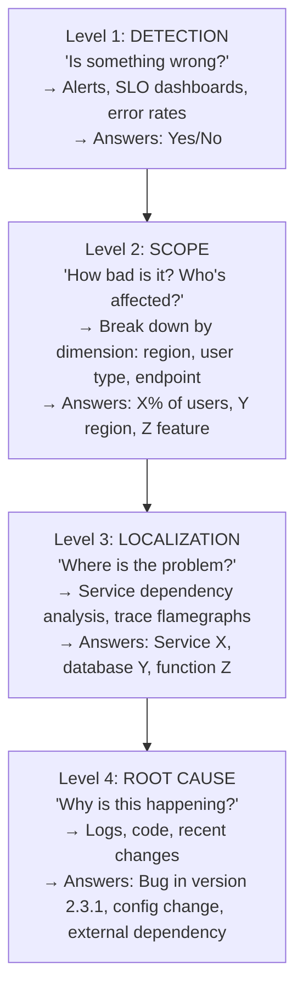
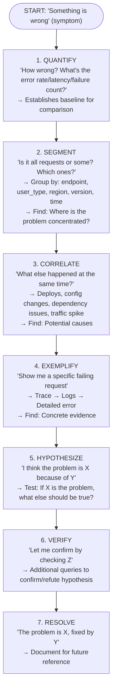
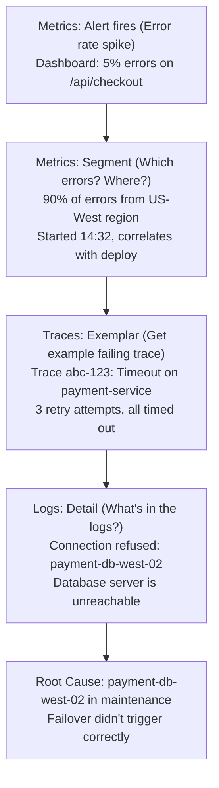
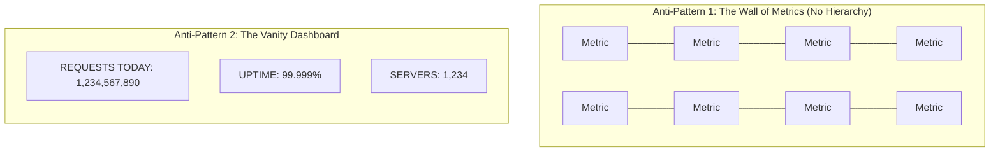
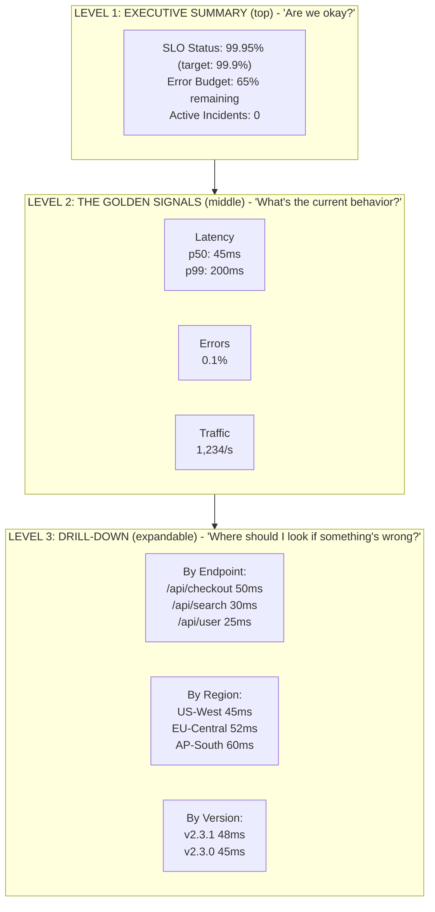
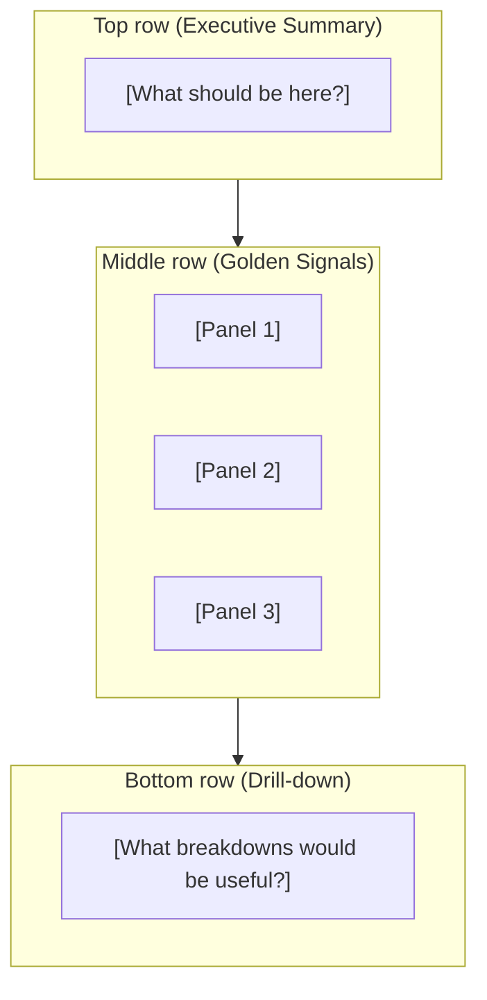

> **Complexity**: `[MEDIUM]`
>
> **Time to Complete**: 30-35 minutes
>
> **Prerequisites**: [Module 3.3: Instrumentation Principles](../module-3.3-instrumentation-principles/)
>
> **Track**: Foundations

### What You'll Be Able to Do

After completing this module, you will be able to:

1. **Build** alert rules that detect meaningful user-impact signals rather than generating noise from infrastructure metrics
2. **Analyze** observability data to move from symptom detection to root-cause identification within a structured debugging workflow
3. **Design** dashboards that answer operational questions at a glance and guide engineers toward the right next investigation step
4. **Evaluate** whether an alerting strategy minimizes both false positives and time-to-detection for real incidents

---

## The Team That Had Perfect Data But No Answers

**December 2018. A Major E-commerce Platform. Black Friday Weekend.**

The observability team had done everything right. World-class Prometheus deployment with 2.3 million time series. Elasticsearch cluster ingesting 4TB of logs daily. Jaeger storing 500 million spans. Beautiful Grafana dashboards covering every service. They'd spent 18 months building this observability stack.

2:14 AM, Saturday. The worst time for e-commerce—Black Friday shoppers still active, Cyber Monday promotions launching in hours.

Alert: "Checkout error rate exceeded 2%."

The on-call engineer opens Grafana. Error rate: 2.3%. She can see *that* something is wrong. But the dashboard has 47 panels. Which one matters right now? She clicks through each one, looking for anomalies. Five minutes pass.

She opens the logs. Searches for "checkout" and "error." 2.4 million results in the last hour. She adds "level:error"—still 847,000 results. She can't narrow down further because the logs don't have consistent field names. Different services use different conventions.

She switches to tracing. Finds a failing trace. The error is "connection timeout" to the inventory service. Great. But why? The inventory service dashboard shows... nothing wrong. Latency normal. Error rate normal.

**47 minutes**. That's how long it took to find the root cause. The inventory service was fine. The problem was network congestion between the checkout service and inventory service—a firewall rule change made two weeks earlier had introduced a 50ms timeout where there should have been 500ms. Under Black Friday load, retries stacked up and cascaded.

**The fix**: One line of configuration. 30 seconds to apply.

**The cost**: 47 minutes × 2.3% error rate × Black Friday traffic = $2.8 million in abandoned carts. Plus customer support costs. Plus reputation damage.

> **Stop and think**: How would having a defined dashboard hierarchy have changed the on-call engineer's first 5 minutes of investigation?

### The Data-to-Insight Gap

| What They Had | What They Lacked |
|---|---|
| [x] 2.3 million metrics | [ ] Dashboard hierarchy (what matters now?) |
| [x] 4TB daily logs | [ ] Consistent field names (can't query) |
| [x] 500 million spans | [ ] SLO-based alerting (why 2%? is that bad?) |
| [x] Beautiful dashboards | [ ] Runbooks (what to do when this happens) |
| [x] All three pillars | [ ] Investigation workflow (where to start) |
| [x] Perfect instrumentation | [ ] Mental model of failure modes |

**DATA ≠ INSIGHT**

They had all the data to find the problem in 5 minutes.
They lacked the insight to navigate that data effectively.
Cost of the gap: $2.8 million.

After the incident, they rebuilt their approach:
- Created dashboard hierarchy (summary → signals → details)
- Defined consistent field naming across all services
- Implemented SLO-based alerts with error budgets
- Wrote runbooks for common failure modes
- Trained the team on systematic investigation

The next similar incident took 8 minutes to resolve.

---

## Why This Module Matters

You've instrumented your services. Logs are flowing, metrics are being scraped, traces are being collected. Now what?

Having data isn't the same as having understanding. The real value of observability comes from turning data into **insight**—answering questions, detecting problems, and building mental models of system behavior.

This module teaches you how to use observability data effectively: asking the right questions, building useful alerts, debugging systematically, and developing intuition about your systems.

> **The Medical Analogy**
>
> A doctor doesn't just collect test results—they interpret them. Blood pressure, heart rate, and lab results are data. A diagnosis is insight. The same data can mean different things in different contexts. Observability is similar: metrics, logs, and traces are raw data. Understanding why your system behaves the way it does is insight.

---

## What You'll Learn

- How to ask good questions of your observability data
- Building effective alerts (signal vs. noise)
- Debugging systematically with observability
- Dashboards that tell stories
- Building mental models of system behavior

---

## Part 1: Asking Questions

### 1.1 The Question Hierarchy

Not all questions are equally useful. Start broad, narrow down:

> **Pause and predict**: If you jump straight from Level 1 (Detection) to Level 4 (Root Cause) without scoping or localizing, what kinds of mistakes are you likely to make?

### 1.2 Good Questions vs. Bad Questions

| Bad Questions (vague, hard to answer) | Good Questions (specific, answerable) |
|---|---|
| **"Why is the site slow?"** → What is "slow"? For whom? Since when? | **"What's the p99 latency for `/api/checkout` in the last hour?"** → Specific metric, specific endpoint, specific timeframe |
| **"Is everything okay?"** → Define "okay" | **"Which users experienced errors during the deploy at 3pm?"** → Specific event, specific population |
| **"What happened yesterday?"** → What specifically? | **"What changed between 2pm (working) and 3pm (broken)?"** → Specific comparison, specific times |

### 1.3 The Exploratory Investigation Pattern

> **Try This (3 minutes)**
>
> Think of a recent incident. Walk through the investigation pattern:
> - How did you quantify the problem?
> - How did you segment to narrow down?
> - What correlations did you look for?
> - Did you find a specific example to examine?

---

## Part 2: Effective Alerting

> **Stop and think**: What happens to an engineering team's culture when 90% of their alerts are false positives? How does this affect their response time to real, critical incidents?

### 2.1 Alert Philosophy

**ALERT ONLY WHEN ACTION IS NEEDED**
- If the alert fires and you do nothing → Remove the alert
- If the alert fires and you always do the same thing → Automate it
- If the alert fires and you investigate → Good alert

**ALERT ON SYMPTOMS, NOT CAUSES**
- Bad: "CPU > 80%" (cause - might be fine)
- Good: "Error rate > 1%" (symptom - users affected)
- Good: "p99 latency > 500ms" (symptom - users affected)

**ALERT ON USER IMPACT**
- Would a user notice? Alert.
- Would only you notice? Maybe don't alert.
- Error budget burn rate > threshold → Users will be affected → Alert

> **Pause and predict**: How does defining an "error budget" change the conversation between product managers and engineers about when to stop deploying new features?

### 2.2 SLO-Based Alerting

Instead of arbitrary thresholds, alert based on error budget:

**SLO: 99.9% availability (error budget: 43 minutes/month)**

| Severity | Alert Condition | Meaning |
|---|---|---|
| **SEVERE** (page immediately) | Burn rate that would exhaust budget in 1 hour (720x normal) | "At this rate, we're out of budget in 1 hour" |
| **HIGH** (page during business hours) | Burn rate that would exhaust budget in 6 hours (120x normal) | "At this rate, we're out of budget in 6 hours" |
| **MEDIUM** (ticket) | Burn rate that would exhaust budget in 3 days (10x normal) | "At this rate, we're out of budget this week" |
| **LOW** (dashboard) | Any error budget consumption | "We're using budget, but within acceptable range" |

### 2.3 Reducing Alert Fatigue

| Problem | Cause | Solution |
|---------|-------|----------|
| Too many alerts | Low thresholds | Raise thresholds, use SLO-based |
| Alerts for non-issues | Alerting on causes | Alert on symptoms instead |
| Flapping alerts | Sensitive thresholds | Add duration requirement (5 min) |
| Duplicate alerts | Multiple rules for same issue | Deduplicate, use alert hierarchy |
| Unactionable alerts | No clear response | Add runbook, or delete alert |

### Alert Hygiene Checklist

For each alert, answer:
- [ ] Does this require human action?
- [ ] Is the action clear? (link to runbook)
- [ ] Does this fire rarely enough to be noticed?
- [ ] Is the severity appropriate?
- [ ] Has this alert been useful in the last 30 days?

If you can't answer "yes" to all → Fix or remove the alert.

> **Did You Know?**
>
> Google's SRE teams aim for a 50% "signal ratio"—meaning 50% of pages should be real issues requiring intervention. Below 50%, alerts are too noisy and get ignored. Above 80%, you're probably missing issues because you're not alerting enough.

---

## Part 3: Debugging with Observability

> **Pause and predict**: If you immediately restart a failing service before querying its current state, what crucial debugging information is lost forever?

### 3.1 The Debugging Workflow

### 3.2 Common Debugging Patterns

> **Stop and think**: Think about the last time you said "It's weird" when debugging. What was the exact baseline you were implicitly comparing the weird behavior against?

**"It's slow"**
1. **Confirm**: What's the actual latency? p50? p99?
2. **Scope**: All requests or some? Which endpoints?
3. **Trace**: Get example slow traces
4. **Flamegraph**: Where is time spent?
   └── Network call to service X: 800ms (80% of time)
5. **Drill down**: Why is service X slow?
6. **Repeat** until root cause found

**"It's broken"**
1. **Confirm**: What's the error rate? Error types?
2. **Scope**: Which users? Which endpoints? Which versions?
3. **Compare**: What's different about failing requests?
4. **Exemplify**: Get specific error logs
   └── Stack trace, error message, context
5. **Correlate**: What changed? Deploy? Config? Dependency?
6. **Hypothesize and verify**

**"It's weird"**
1. **Define**: What exactly is "weird"? Quantify it.
2. **Baseline**: What's "normal"? Compare to historical data.
3. **Isolate**: Find the smallest reproducing case.
4. **Trace**: Follow request through system.
5. **Diff**: What's different from normal requests?
6. **Often**: Race condition, caching issue, state dependency

### 3.3 Comparison: Then vs. Now

**"It was working yesterday, now it's broken"**

**Query pattern**:
Compare: `metric_X` at `time_good` vs `time_bad`

**Example**:
- **GOOD**: 2024-01-15 10:00-12:00, error_rate = 0.1%
- **BAD**:  2024-01-16 10:00-12:00, error_rate = 5.0%

**Segment by deploy_version**:
- **GOOD**: version 2.3.0, error_rate = 0.1%
- **BAD**:  version 2.3.1, error_rate = 4.9%

**Conclusion**: Version 2.3.1 introduced the problem.

Similar pattern for:
- Before/after deploy
- This week vs. last week
- Failing user vs. working user

> **War Story: The $4.2 Million Lesson in Systematic Investigation**
>
> **2020. A Major Subscription Service. Sunday Evening, Peak Usage.**
>
> 9:17 PM. Alert fires: "Video streaming error rate exceeded 1%." The on-call engineer opens the dashboard. Error rate: 1.3%. He's seen this before. "Probably just a CDN hiccup," he thinks. He restarts the streaming service pods. Error rate drops to 0.8%. Problem solved?
>
> No. Error rate climbs back to 1.5% within 5 minutes. Then 2.1%. Then 3.4%.
>
> **The Old Approach** (what he did):
> - 9:17 PM: Alert fires. Restarts pods.
> - 9:23 PM: Error rate climbing. Restarts more pods.
> - 9:31 PM: No improvement. Escalates to senior engineer.
> - 9:45 PM: Senior tries rolling back recent deploy. No effect.
> - 10:12 PM: Team realizes problem isn't in their code.
> - 10:34 PM: Discover third-party authentication provider is rate-limiting them.
> - 10:41 PM: Implement token caching workaround.
>
> **Time to resolution: 84 minutes.** Most users couldn't watch anything during peak Sunday evening.
>
> **The New Approach** (what they trained to do after):
>
> | Step | Action | Time |
> |------|--------|------|
> | Quantify | "Error rate 1.3%, normally 0.1%. Specific error: 'auth_token_failed'" | 2 min |
> | Segment | "100% of errors are auth failures. Affects all regions equally." | 3 min |
> | Correlate | "Started 9:15 PM. No deploys. No config changes. Check external deps." | 4 min |
> | Exemplify | "Trace shows auth service calling identity provider, getting 429 Too Many Requests" | 3 min |
> | Hypothesize | "Identity provider is rate-limiting us" | 1 min |
> | Verify | "Check identity provider dashboard—confirmed, hitting rate limit" | 2 min |
> | Resolve | "Enable token caching (was disabled in recent cleanup)" | 5 min |
>
> **Time to resolution with systematic approach: 20 minutes.**
>
> **The Financial Impact**:
> - 84 minutes at peak × 3.4% average error rate × 12 million active users = ~408,000 users affected
> - Estimated lost subscription renewals: $890,000
> - Compensation credits issued: $340,000
> - Customer support costs: $125,000
> - Engineering escalation (5 engineers × 2 hours): $2,500
> - **Total: $1.36 million for this single incident**
>
> With systematic investigation, the impact would have been:
> - 20 minutes × 2.1% average error rate × 12 million users = ~50,000 users affected
> - Estimated cost: ~$160,000
> - **Savings: $1.2 million from faster investigation**
>
> The team ran the numbers. They'd had 47 similar incidents in the past year. If systematic investigation saved even 20 minutes on average, that was $4.2 million annually.
>
> They built runbooks. They trained on the exploratory pattern. They created investigation checklists. The pattern works. Use it.

---

## Part 4: Dashboards That Tell Stories

### 4.1 Dashboard Anti-Patterns

- **The Wall of Metrics Problem**: No hierarchy, everything equal importance. Result: Eyes glaze over, important signals missed.
- **The Vanity Dashboard Problem**: Big numbers that never change actionably. Result: Looks impressive, helps no one.

### 4.2 Good Dashboard Structure

### 4.3 Dashboard Design Principles

| Principle | Why | Example |
|-----------|-----|---------|
| **Hierarchy** | Important things first | SLO status at top, details below |
| **Context** | Show what normal looks like | Current value + historical range |
| **Action** | Link to next step | Click metric → See traces |
| **Consistency** | Same layout across services | Everyone knows where to look |
| **Simplicity** | Only what's needed | Remove metrics nobody looks at |

> **Try This (3 minutes)**
>
> Look at one of your dashboards:
> - Can you tell system health in 5 seconds?
> - Is there a clear hierarchy?
> - Do you know what to click if something's wrong?
> - When did you last remove a panel?

---

## Part 5: Building Mental Models

> **Pause and predict**: What happens to an engineering team's incident response time if only the most senior engineer holds the complete mental model of the system architecture?

### 5.1 What is a Mental Model?

A **mental model** is your understanding of how the system actually works—not the documentation, but your intuition built from experience.

- **Architecture**: "Request comes in at load balancer, goes to API server, which calls auth service, then the appropriate backend."
- **Dependencies**: "If Redis is down, sessions break. If Postgres is down, nothing works. If payment API is slow, checkout is slow."
- **Behavior Under Stress**: "Under high load, the API starts queueing requests. Past 1000 QPS, we see cascading timeouts."
- **Failure Modes**: "When disk fills, logs stop but service keeps running. When memory fills, OOM killer takes random processes."
- **Recent Changes**: "We deployed v2.3.1 yesterday, added new caching layer last week, migrated database replica last month."

### 5.2 Building Mental Models

1. **Watch Normal Behavior**
   └── What do metrics look like during a normal day?
   └── What's the typical request flow?
   └── What are normal log patterns?
2. **Watch Abnormal Behavior**
   └── What happens during incidents?
   └── What breaks first under load?
   └── What error messages appear?
3. **Trace Requests End-to-End**
   └── Pick a request type, follow it through
   └── Understand every service it touches
   └── Know the critical path
4. **Learn from Postmortems**
   └── What failed? Why didn't we catch it?
   └── What was the actual impact?
   └── What did we learn about the system?
5. **Experiment (carefully)**
   └── What happens if we scale down?
   └── What happens if we add latency?
   └── Chaos engineering builds models

### 5.3 Sharing Mental Models

Mental models in one person's head don't scale. Share them:

| Method | When | Example |
|--------|------|---------|
| **Runbooks** | Common scenarios | "If X, do Y because Z" |
| **Architecture diagrams** | System overview | Request flow, dependencies |
| **Postmortems** | After incidents | What happened and why |
| **Pairing** | Onboarding | Debug together, share intuition |
| **Documentation** | Reference | "The system works like this..." |

---

## Did You Know?

- **NASA's Mission Control** uses a layered dashboard system called "Flight Director Console." The top level shows overall mission health. Lower levels show subsystem details. This hierarchy-based design is over 60 years old but still the gold standard.

- **The term "runbook"** comes from IBM mainframe operations in the 1960s. Operators had physical books of procedures to "run" for common scenarios. Digital runbooks serve the same purpose.

- **Expert intuition is real**. Studies show experienced operators can often sense something is wrong before any alert fires—they've internalized subtle patterns. This is the goal of building mental models.

- **PagerDuty analyzed millions of incidents** and found that the median time to acknowledgement is 3 minutes, but the median time to resolution is 30 minutes. The investigation phase—understanding what's wrong—takes 10x longer than noticing something is wrong. Good observability reduces investigation time, not detection time.

---

## Common Mistakes

| Mistake | Problem | Solution |
|---------|---------|----------|
| Alerting on everything | Alert fatigue, ignored pages | Alert on symptoms, not causes |
| Dashboard sprawl | Can't find the right dashboard | Hierarchy, templates, linking |
| No runbooks | Every incident is new | Document common scenarios |
| Siloed investigation | Can't correlate across signals | Shared trace IDs, linked tools |
| Over-reliance on dashboards | Miss issues dashboards don't show | Combine with exploration |
| Not sharing knowledge | One expert, team bottleneck | Postmortems, pairing, docs |

---

## Quiz

1. **You are setting up alerts for a new microservice. Your teammate suggests alerting whenever CPU usage exceeds 80%. What is the danger of this approach, and what should you alert on instead?**
   

   
Answer

   Alerting on CPU usage is alerting on a cause rather than a symptom. High CPU usage might be completely fine if the service is still responding quickly and without errors, leading to false positives and alert fatigue. Instead, you should alert on symptoms that directly impact the user experience, such as elevated error rates or increased p99 latency. By alerting on symptoms, every page represents actual user impact, ensuring that when an alert fires, immediate action is truly needed.
   

2. **Your current alerting rule triggers whenever the error rate exceeds 2% for 5 minutes. During a low-traffic night shift, a brief network blip causes a 3% error rate for 6 minutes, waking up the on-call engineer, though it resolves on its own. How would SLO-based alerting handle this situation differently?**
   

   
Answer

   SLO-based alerting ties alerts to the error budget burn rate rather than an arbitrary threshold. During a low-traffic period, a brief spike in error rate consumes very little of the overall error budget, so it wouldn't trigger a critical page. Instead, it might only register as a low-severity notification or appear on a dashboard for later review. This approach prevents unnecessary wake-ups for self-resolving issues while still aggressively paging if the burn rate threatens to exhaust the budget over a sustained period.
   

3. **An alert fires for high latency on the checkout service. The on-call engineer immediately starts randomly checking logs and restarting database pods, hoping to fix it, which takes 40 minutes. How would applying the exploratory investigation pattern have changed this response?**
   

   
Answer

   Without a structured approach, debugging devolves into random guessing and potentially destructive actions like restarting pods without capturing evidence. The exploratory investigation pattern provides a systematic, step-by-step workflow: quantify the latency, segment to see which users or endpoints are affected, correlate with recent changes, find an exemplar trace, hypothesize a cause, and verify it before acting. By methodically narrowing down the scope of the problem based on data, the engineer would efficiently converge on the true root cause, dramatically reducing the time to resolution. This structured approach prevents wasted effort and preserves valuable diagnostic state that blind restarts would otherwise destroy.
   

4. **Two engineers are investigating a sudden spike in failed background jobs. Engineer A immediately checks the Redis memory metrics, while Engineer B spends 15 minutes reading architecture documentation to understand how the job queue works. What concept does Engineer A possess that Engineer B lacks, and why is it valuable?**
   

   
Answer

   Engineer A possesses a strong mental model of the system's architecture and dependencies, instinctively knowing that the background jobs rely heavily on Redis. A mental model is an internalized understanding of how the system actually operates and fails in the real world. Having this intuition allows operators to jump straight to likely causes and narrow down investigations quickly, without needing to reference documentation from scratch. Sharing these mental models across the team through pairing, runbooks, and postmortems ensures everyone can investigate with similar efficiency.
   

5. **Your SRE team is on-call for a major e-commerce platform. Over the past week, you received 150 pages, but 135 of them self-resolved before anyone could even log in, requiring zero intervention. What specific metric describes this situation, why is it dangerous, and what immediate steps should the team take?**
   

   
Answer

   The team's "signal ratio" is 10%, meaning only 15 out of 150 alerts are actually actionable. This is critically low, as Google recommends targeting a 50% signal ratio. A low signal ratio causes severe alert fatigue, psychologically training engineers to ignore alerts and resulting in real issues getting lost in the background noise. To fix this, the team must audit their noisy alerts, delete the ones that never require human action, and shift from arbitrary infrastructure thresholds to symptom-based, SLO-aligned alerts.
   

6. **During a P1 outage, the on-call engineer opens the 'Payment Service Health' dashboard, which contains 47 different metric panels arranged in alphabetical order by metric name. They spend 10 precious minutes just trying to figure out if the service is currently up or down. What fundamental design anti-pattern is this dashboard suffering from, and how should it be structurally reorganized to be useful during an incident?**
   

   
Answer

   The primary problem is "The Wall of Metrics" anti-pattern, suffering from a complete lack of visual hierarchy where all 47 panels are competing equally for attention. When everything is presented with the same priority, engineers are forced to manually parse through irrelevant data to find the critical signals, wasting precious time during an outage. To fix this, the team should reorganize the dashboard into clear, logical tiers. The top row should provide an executive summary answering "are we okay?" in five seconds with high-level SLO status. The middle row should surface the golden signals (latency, traffic, errors) to indicate current behavior, while the bottom section should contain expandable drill-down panels for when deep investigation is actually required.
   

7. **At 3:00 AM, an alert fires for high latency on the user-profile service. The responding engineer hypothesizes "the database must be hung again," so they immediately restart the primary database pod. The latency drops back to normal, and the engineer closes the ticket with the note "Fixed root cause by restarting DB." Why is this conclusion dangerously incorrect, and what exact steps were skipped in the exploratory investigation pattern?**
   

   
Answer

   The engineer did not find the root cause; they merely applied a mitigation that temporarily masks the underlying issue. By blindly restarting the database without capturing evidence first, they destroyed valuable state (like active query locks, connection pool exhaustion, or memory leaks) that could have explained the slowness. The problem is highly likely to recur because they skipped the critical Verify step. In the exploratory investigation pattern, they completely bypassed Exemplify (finding a specific failing trace) and Verify (confirming the database was actually the source of the latency before acting).
   

8. **Your engineering director is pushing back on a $100,000/year contract for a new tracing platform, arguing it's too expensive. Your critical checkout service processes 100,000 requests per minute with an average revenue of $0.50 per request. Last month, a 5% error rate incident took 40 minutes to investigate, which you estimate could have been reduced to 10 minutes with the new tracing tool. How would you justify the platform's cost using the financial impact of that single incident?**
   

   
Answer

   A 40-minute delay costs the business massive revenue, calculated as 200,000 failed requests over that period multiplied by $0.50 per request, totaling $100,000 in lost revenue. If the new tracing tool reduces investigation time to just 10 minutes, the financial impact drops to $25,000, meaning the company saves $75,000 on that single incident alone. Assuming multiple similar incidents occur throughout the year, the financial savings easily exceed the annual cost of the enterprise observability platform. This demonstrates that proper observability tooling almost always pays for itself by directly minimizing the revenue impact of prolonged outages.
   

---

## Key Takeaways

**Asking Good Questions**
- [x] Start broad (is something wrong?) then narrow
- [x] Be specific: endpoint, timeframe, metric
- [x] Avoid vague questions ("why is it slow?")
- [x] Follow the question hierarchy: Detection → Scope → Localization → Root Cause

**The Exploratory Investigation Pattern**
- [x] 1. Quantify - how bad is it?
- [x] 2. Segment - who/what is affected?
- [x] 3. Correlate - what else happened?
- [x] 4. Exemplify - show me a specific case
- [x] 5. Hypothesize - I think X is the cause
- [x] 6. Verify - test the hypothesis
- [x] 7. Resolve - fix and document

**Effective Alerting**
- [x] Alert on symptoms (user impact), not causes (CPU/memory)
- [x] Use SLO-based alerting with error budgets
- [x] Target 50%+ signal ratio (actionable alerts)
- [x] Every alert must have: clear action + runbook link
- [x] Delete alerts that never require action

**Dashboard Design**
- [x] Hierarchy: Summary → Golden Signals → Drill-down
- [x] Answer "are we okay?" in 5 seconds (top row)
- [x] Consistency across services (same layout)
- [x] Link to next step (metric → traces → logs)

**Building Mental Models**
- [x] Watch normal behavior to recognize abnormal
- [x] Learn from postmortems (failure modes)
- [x] Trace requests end-to-end (understand flow)
- [x] Share knowledge: runbooks, docs, pairing
- [x] Experiment carefully (chaos engineering)

---

## Hands-On Exercise

**Task**: Design an observability workflow for a common scenario.

**Scenario**: You receive an alert: "p99 latency for /api/search exceeded 500ms"

**Part 1: Investigation Plan (10 minutes)**

Write out your investigation steps using the exploratory pattern:

| Step | Question | How You'd Answer (tool/query) |
|------|----------|-------------------------------|
| Quantify | What's the actual p99? How long has it been elevated? | |
| Segment | All search requests or some? Which dimensions? | |
| Correlate | What changed? Deploys? Traffic spike? | |
| Exemplify | Get a specific slow trace | |
| Hypothesize | What do you think is the cause? | |
| Verify | How would you confirm? | |

**Part 2: Alert Design (10 minutes)**

Design an SLO-based alert for this scenario:

| Element | Your Design |
|---------|-------------|
| SLO target | p99 latency for /api/search ≤ ___ms |
| Measurement window | ___ minutes |
| Severe alert | Burn rate = ___ (exhausts budget in ___ hours) |
| High alert | Burn rate = ___ (exhausts budget in ___ hours) |
| Runbook link | Steps to investigate (from Part 1) |

**Part 3: Dashboard Design (10 minutes)**

Sketch a simple dashboard for search health:

**Success Criteria**:
- [x] Investigation plan covers all steps of exploratory pattern
- [x] Alert design includes SLO target and multiple severity levels
- [x] Dashboard has clear hierarchy (summary → signals → details)
- [x] Each dashboard panel has a clear purpose

---

## Further Reading

- **"Practical Monitoring"** - Mike Julian. Excellent coverage of alerting philosophy and dashboard design.

- **"The Art of Monitoring"** - James Turnbull. Comprehensive guide to building monitoring systems.

- **"Thinking in Systems"** - Donella Meadows. Foundational book on building mental models of complex systems.

---

## Observability Theory: What's Next?

Congratulations! You've completed the Observability Theory foundation. You now understand:

- What observability is and how it differs from monitoring
- The three pillars: logs, metrics, traces
- How to instrument systems effectively
- How to turn data into insight

**Where to go from here:**

| Your Interest | Next Track |
|---------------|------------|
| Implementing observability | [Observability Toolkit](/platform/toolkits/observability-intelligence/observability/) |
| Operating with observability | [SRE Discipline](/platform/disciplines/core-platform/sre/) |
| Security observability | [Security Principles](/platform/foundations/security-principles/) |
| Foundational concepts | [Distributed Systems](/platform/foundations/distributed-systems/) |

---

## Track Summary

| Module | Key Takeaway |
|--------|--------------|
| 3.1 | Observability lets you ask questions you didn't predict; monitoring answers predefined questions |
| 3.2 | Logs (detail), metrics (aggregation), traces (flow)—connected by correlation IDs |
| 3.3 | Instrument boundaries and business operations; keep cardinality bounded; sample traces |
| 3.4 | Alert on symptoms not causes; debug systematically; build and share mental models |

*"The goal isn't to have all the data. The goal is to understand the system."*