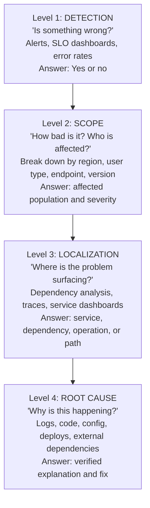
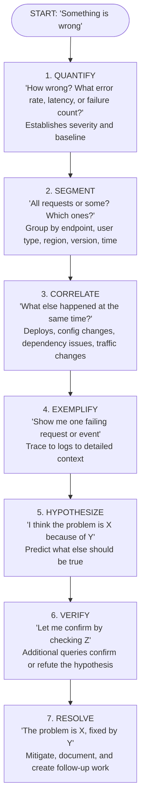
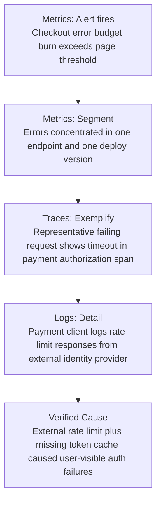
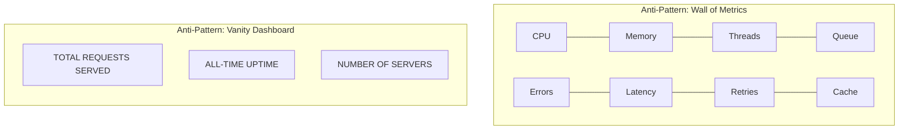
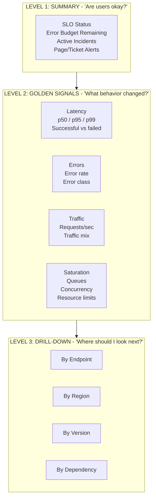
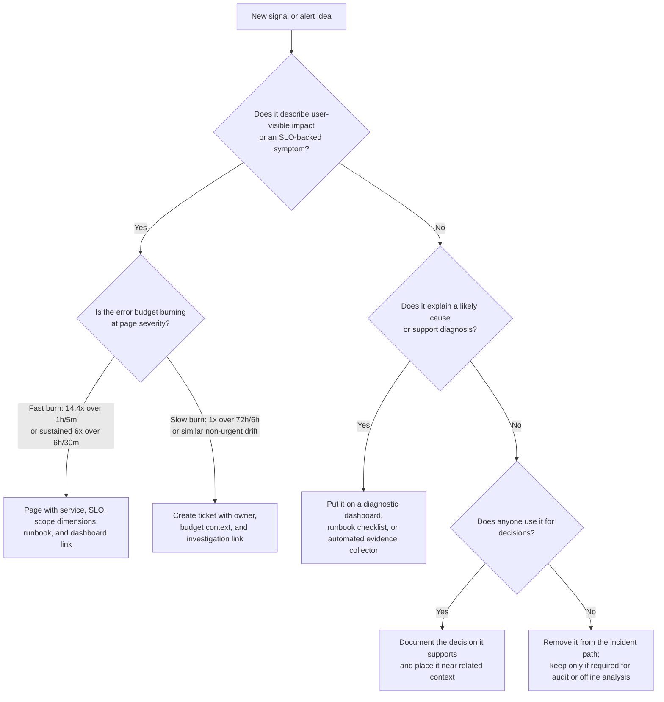
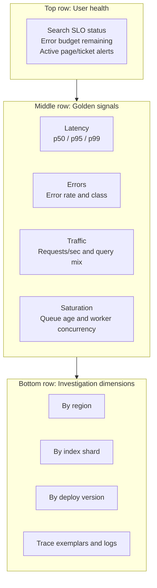

> **Complexity**: `[MEDIUM]`
>
> **Time to Complete**: 40-50 minutes
>
> **Prerequisites**: [Module 3.3: Instrumentation Principles](../module-3.3-instrumentation-principles/)
>
> **Track**: Foundations

## What You'll Be Able to Do

After completing this module, you will be able to:

1. **Build** alert rules that detect meaningful user-impact signals rather than generating noise from infrastructure metrics.
2. **Analyze** observability data to move from symptom detection to root-cause identification within a structured debugging workflow.
3. **Design** dashboards that answer operational questions at a glance and guide engineers toward the right next investigation step.
4. **Evaluate** whether an alerting strategy minimizes both false positives and time-to-detection for real incidents.

---

## Why This Module Matters

You have instrumented your services. Logs are flowing, metrics are being scraped, traces are being collected, and dashboards are full of colorful panels. That is a necessary milestone, but it is not the finish line. The real value of observability appears only when a team can turn those raw signals into decisions: whether to wake a human, where to start an investigation, what changed, which users are affected, and what response will actually reduce harm.

This is the data-to-insight gap. Teams often have millions of metric series, terabytes of logs, and enough traces to reconstruct a busy service in detail, yet still lose the first half hour of an incident arguing about whether the problem is real. The data was technically present, but the path through it was not. Fast recovery depends on the structures around the data: alert philosophy, SLOs, consistent dimensions, dashboard hierarchy, shared runbooks, and a disciplined investigation pattern that prevents people from jumping from "something is wrong" to "restart the thing I remember breaking last time."

The previous modules taught the pieces of observability: what observability means, how logs, metrics, and traces show different views of the same system, and how instrumentation decisions shape what questions you can ask later. This capstone is about using those pieces under pressure. You will practice asking progressively better questions of telemetry, building alerts around user-visible symptoms instead of internal noise, debugging with a repeatable workflow, designing dashboards that guide decisions, and sharing the mental models that experienced responders usually carry in their heads.

| What Teams Often Have | What Enables Fast Recovery |
|---|---|
| Huge metric volume and dozens of labels | A dashboard hierarchy that starts with user impact and then drills down by dimension |
| Large log stores with inconsistent field names | Shared event fields such as `service.name`, `trace_id`, `region`, `endpoint`, and `deploy.version` |
| Traces collected for many requests | Exemplars that connect aggregate symptoms to a concrete request path |
| Attractive dashboards with no operational question | Panels organized around "Are users okay?", "What changed?", and "Where should I look next?" |
| Alerts for every suspected cause | SLO-based alerting that pages only when error-budget burn requires human action |
| One senior engineer who knows the failure modes | Runbooks, postmortems, diagrams, and practice that distribute the model across the team |

> **The Medical Analogy**
>
> A doctor does not diagnose a patient by collecting test results at random. Blood pressure, heart rate, oxygen saturation, lab values, symptoms, and medical history become useful only when interpreted together. The same blood pressure reading can mean different things depending on age, medication, pain, and recent activity. Observability is similar: metrics, logs, and traces are raw observations, while insight is the contextual explanation that lets you choose the next safe action.

---

## Part 1: Asking Better Questions

### 1.1 The Question Hierarchy

The fastest responders are rarely the people who know the most commands. They are usually the people who ask questions in the right order. Observability data has high branching factor: every graph can be split by endpoint, region, customer tier, version, host, dependency, feature flag, and time window. If you start with a narrow theory too early, you can burn time proving that your favorite explanation is wrong while the incident continues. The question hierarchy gives you a way to reduce that search space without losing important context.

Detection asks, "Is something wrong?" This is the only level that belongs on a pager, because its job is to decide whether a human should pay attention right now. A good detection question is binary and user-centered: error budget is burning too quickly, checkout p99 latency is above the SLO objective, or the public health check is failing from multiple locations. A poor detection question asks whether an internal component looks unusual without proving user harm, such as CPU above an arbitrary threshold or a queue depth above a number someone copied years ago.

Scope asks, "How bad is it, and who is affected?" This level prevents overreaction and underreaction at the same time. A one-region latency regression, a single enterprise tenant with bad configuration, and a global outage all deserve different response patterns even if the top-line error graph looks similar. Scoping by dimensions such as region, endpoint, user type, request method, client version, and deploy version tells you whether to page another team, roll back one release, update a status page, or keep the incident local.

Localization asks, "Where in the system is the failure surfacing?" This is where traces, dependency maps, service-level dashboards, and exemplars become valuable. The point is not to prove root cause yet. The point is to identify the narrowest component or path that explains the scoped symptom. Skipping localization is why teams restart databases for frontend bugs, blame networks for slow dependency calls that are actually retries, or roll back services that were only reporting errors caused upstream.

Root cause asks, "Why is this happening?" This level requires the most evidence and should be treated as a hypothesis until verified. Logs, code changes, config history, dependency status, and trace details help explain the localized symptom, but they are easy to misuse if the earlier levels are missing. Root cause analysis without detection, scope, and localization often becomes storytelling: the team selects a plausible cause and then searches for data that supports it.

```mermaid
flowchart TD
    L1["Level 1: DETECTION<br>'Is something wrong?'<br>Alerts, SLO dashboards, error rates<br>Answer: Yes or no"]
    L2["Level 2: SCOPE<br>'How bad is it? Who is affected?'<br>Break down by region, user type, endpoint, version<br>Answer: affected population and severity"]
    L3["Level 3: LOCALIZATION<br>'Where is the problem surfacing?'<br>Dependency analysis, traces, service dashboards<br>Answer: service, dependency, operation, or path"]
    L4["Level 4: ROOT CAUSE<br>'Why is this happening?'<br>Logs, code, config, deploys, external dependencies<br>Answer: verified explanation and fix"]

    L1 --> L2
    L2 --> L3
    L3 --> L4
```

Skipping levels creates predictable failure modes. Jumping from detection directly to root cause leads to confirmation bias because the responder starts searching for evidence that supports a theory before understanding the blast radius. Jumping from detection to remediation can destroy the state that would have explained the incident, especially when restarts clear memory, drop connection pools, rotate logs, or cause replicas to reschedule. Jumping from scope to root cause without localization can involve the wrong team, which adds communication overhead while the actual owner remains unaware.

> **Pause and predict**
>
> If an alert says "checkout is slow" and you immediately inspect the database, what facts are still missing? You have not yet proven whether checkout is slow for all users, whether the slowdown is limited to one endpoint, whether a specific deploy version is involved, or whether the database is cause, symptom, or unrelated background noise.

### 1.2 Good Questions Are Specific, Comparative, and Answerable

Bad observability questions are usually vague because they hide several smaller questions inside one sentence. "Why is the site slow?" sounds reasonable, but it does not define which site path, which users, which latency percentile, which time window, or what baseline counts as normal. The responder must first translate the sentence into something queryable. Under incident pressure, that translation step often happens differently for each person in the room, which produces conflicting graphs and avoidable debate.

Good questions have three properties. They are specific enough to map to telemetry fields, comparative enough to distinguish abnormal from normal, and answerable with data the system actually emits. "What is the p99 latency for `/api/checkout` in the last hour, split by region and deploy version?" is longer than "Why is checkout slow?", but it tells you exactly which signal to query and which dimensions might narrow the scope. "Which users experienced `auth_token_failed` during the deploy window?" connects logs or traces to a population, not just an error count.

| Vague Question | Better Question | Why the Better Question Works |
|---|---|---|
| "Why is the site slow?" | "What are p50, p95, and p99 latency for `/api/checkout` over the last hour, compared with the same hour yesterday?" | It names an endpoint, metric, percentile set, time window, and baseline. |
| "Is everything okay?" | "Are any user-facing SLIs currently burning error budget faster than their page threshold?" | It converts anxiety into an SLO-backed decision about user impact. |
| "What happened yesterday?" | "What changed between the last known-good window and the first bad window for deploy version, config version, traffic mix, and dependency errors?" | It frames the investigation as a before/after comparison rather than a broad search. |
| "Is the database broken?" | "Do failing checkout traces spend more time in database spans than successful checkout traces for the same endpoint and region?" | It tests a theory against exemplars instead of treating the theory as fact. |

The comparison piece is especially important. Humans recognize anomalies by comparing against a mental or statistical baseline. If a service normally has p99 latency near 900 ms during batch windows, a 700 ms graph may be healthy even if it looks high in isolation. If the same service normally runs at 120 ms during business hours, 700 ms is urgent. Every useful dashboard and investigation query should make the baseline visible: previous hour, previous day, previous deploy, successful request group, unaffected region, or SLO threshold.

### 1.3 The Exploratory Investigation Pattern

The exploratory pattern turns the hierarchy into an incident workflow. It is intentionally not "open dashboard, stare, guess." Each step changes what you know and constrains the next query. Quantify establishes the size of the problem, Segment finds concentration, Correlate searches for time-aligned changes, Exemplify chooses a concrete failing request or event, Hypothesize states the current explanation, Verify tests what else should be true, and Resolve applies the smallest safe fix with evidence preserved for the postmortem.

```mermaid
flowchart TD
    Start(["START: 'Something is wrong'"])
    Q1["1. QUANTIFY<br>'How wrong? What error rate, latency, or failure count?'<br>Establishes severity and baseline"]
    Q2["2. SEGMENT<br>'All requests or some? Which ones?'<br>Group by endpoint, user type, region, version, time"]
    Q3["3. CORRELATE<br>'What else happened at the same time?'<br>Deploys, config changes, dependency issues, traffic changes"]
    Q4["4. EXEMPLIFY<br>'Show me one failing request or event'<br>Trace to logs to detailed context"]
    Q5["5. HYPOTHESIZE<br>'I think the problem is X because of Y'<br>Predict what else should be true"]
    Q6["6. VERIFY<br>'Let me confirm by checking Z'<br>Additional queries confirm or refute the hypothesis"]
    Q7["7. RESOLVE<br>'The problem is X, fixed by Y'<br>Mitigate, document, and create follow-up work"]

    Start --> Q1
    Q1 --> Q2
    Q2 --> Q3
    Q3 --> Q4
    Q4 --> Q5
    Q5 --> Q6
    Q6 --> Q7
```

Quantify protects you from vague severity. If the page says "latency high," quantify the actual p99, the duration, the SLO target, the current burn rate, and the number of affected requests. That number determines whether you need an incident commander, a status update, a rollback, or a quiet investigation. It also gives you a post-fix comparison point. Without quantification, teams can declare victory because a graph "looks better" while the SLO remains unhealthy.

Segment protects you from treating averages as truth. A global error rate of 2% can hide a complete outage for a small region, a partial outage for one endpoint, or a harmless spike in synthetic traffic. Segment by dimensions that explain ownership and response: endpoint, region, tenant, plan, dependency, version, feature flag, client platform, and request type. Good instrumentation from Module 3.3 matters here because you can only segment by fields you captured consistently before the incident.

Correlate protects you from ignoring time. Most production incidents have a temporal clue: a deploy, a config change, a certificate renewal, a dependency rate limit, a traffic shift, a scaling event, or a scheduled batch job. Correlation is not proof, but it produces testable hypotheses. The discipline is to write "started two minutes after config rollout" rather than "config rollout caused it" until later verification supports that claim.

Exemplify protects you from debugging aggregates forever. A metric can tell you that checkout errors increased, but a single failing trace can show the path through frontend, API, auth, inventory, payment, retry middleware, and the final error. The exemplar should be representative of the scoped problem: if only EU users on version `2.3.1` fail, choose a failing EU `2.3.1` request, not a random error from another region. Logs attached to the trace then provide concrete fields, exception messages, and dependency responses.

Hypothesize and Verify protect you from cargo-cult fixes. A hypothesis should make predictions. If you think an external identity provider is rate-limiting requests, then traces should show calls to that provider failing with a rate-limit response, internal service latency should be mostly waiting on that dependency, and retry volume should increase around the same time. If those predictions do not hold, the hypothesis weakens. Verification is the difference between "the database was slow" and "checkout traces spent 85% of their time waiting on `payment-db-west-02`, logs show connection refused, and the database event log shows maintenance mode enabled."

Resolve is more than applying a fix. A good resolution includes the mitigation, the evidence that user impact ended, the reason the fix was chosen, and the follow-up that prevents recurrence. Sometimes the correct resolution is rollback; sometimes it is disabling a feature flag, raising a dependency quota, shedding load, or routing traffic away from one region. The key is that the resolution follows from verified evidence rather than from the most familiar operational reflex.

> **Try This (3 minutes)**
>
> Think of a recent incident and write one sentence for each investigation step. If one step is hard to fill in, that is a useful signal. It may mean your telemetry lacks a dimension, your dashboards hide the baseline, your traces are not connected to logs, or your runbook jumps straight to remediation before evidence is preserved.

---

## Part 2: Effective Alerting

### 2.1 Alert Philosophy

Alerting is not a notification system for everything interesting. It is a scarce human-attention system. Every page spends trust from the on-call engineer, and that trust has a budget just like reliability does. If alerts routinely wake people for conditions that resolve without action, the team learns that pages are optional. When a real incident arrives, the response is slower because the alert channel has trained everyone to discount it.

The strongest alerting rule is simple: page a human only when timely human action is required. If an alert fires and nobody does anything, delete it or convert it to a dashboard signal. If an alert fires and the same mechanical action always fixes the condition, automate the action and alert only if automation fails. If an alert fires and a human must investigate, the alert should say what is affected, why the page is urgent, where to start, and which runbook owns the first response.

This philosophy leads directly to symptom-based alerting. A symptom is what users experience: failed requests, slow responses, unavailable features, incorrect results, or exhausted error budget. A cause is an internal explanation: CPU saturation, thread pool exhaustion, disk latency, garbage collection, queue depth, or a dependency outage. Causes are excellent debugging signals and poor page triggers when used alone. High CPU may be efficient use of capacity; low CPU may be a dead service; a full queue may be expected during a batch window. User-visible symptoms tell you when the system is failing its purpose.

The distinction is not absolute because complex systems have layers. A database SRE may treat slow database reads as a symptom for the database service, while an application SRE treats the same slow reads as a possible cause of checkout latency. The operational rule is to page the team on the symptom that matches their service boundary and user promise, then provide cause-oriented dashboards for diagnosis. That keeps paging simple while preserving enough white-box detail to debug quickly.

| Alert Candidate | Page, Ticket, or Dashboard? | Reason |
|---|---|---|
| Public checkout SLO burns budget at page threshold | Page | Users are affected now and delay consumes the reliability budget quickly. |
| CPU above 80% on one replica for five minutes | Dashboard or ticket | It may explain a symptom, but it is not user impact by itself. |
| Error logs increase after a deploy but SLOs remain healthy | Ticket or deploy-watch annotation | The signal deserves review, but it does not yet justify waking a human. |
| Runbook automation failed to clear a known stuck queue | Page or ticket depending on impact | Automation was the first response, and human attention is needed if impact remains. |

### 2.2 SLO-Based Alerting and Burn Rate

SLO-based alerting replaces arbitrary thresholds with budget math. Suppose a service promises 99.9% availability over a 30-day window. The allowed bad-event ratio is 0.1%, or 0.001 of requests. A service that experiences exactly 0.1% bad requests over the month has spent its budget at the neutral rate. Burn rate is the observed bad-event ratio divided by the allowed bad-event ratio. If the observed bad-event ratio is 1.44%, the burn rate is 14.4 because the service is spending budget 14.4 times faster than the neutral monthly pace.

This matters because the same raw error rate has different urgency depending on duration and traffic shape. A few failed requests on a low-traffic service can produce a scary percentage while consuming little absolute budget. A smaller but sustained error rate on a high-traffic path may quietly destroy the month. Burn-rate alerting asks the operational question directly: "If this continues, how much of the error budget will we consume, and how soon does a human need to act?"

The Google SRE Workbook recommends multiwindow, multi-burn-rate alerts because a single window forces a bad tradeoff. A short window detects fast outages quickly but false-alarms on brief blips. A long window improves precision but can detect severe incidents too slowly and keep firing long after the incident is over. Requiring both a long window and a short window at the same burn-rate threshold gives you two forms of evidence: the long window proves enough budget has been consumed to matter, while the short window proves the problem is still happening.

For a 99.9% SLO over a 30-day period, the canonical starting points are:

| Severity | Long Window | Short Window | Burn Rate | Budget Consumed | Response |
|---|---:|---:|---:|---:|---|
| Fast page | 1 hour | 5 minutes | 14.4x | 2% | Wake the on-call engineer because budget is burning rapidly right now. |
| Slow page | 6 hours | 30 minutes | 6x | 5% | Page because the incident is sustained enough to threaten the budget within hours. |
| Ticket | 72 hours | 6 hours | 1x | 10% | Create work for the next business day because the service is off-track but not urgent. |

The budget-consumed column comes from burn rate times long-window duration divided by the SLO period. A 14.4x burn over one hour consumes `14.4 * 1 / 720`, or 2% of a 30-day budget. A 6x burn over six hours consumes `6 * 6 / 720`, or 5%. A 1x burn over 72 hours consumes `1 * 72 / 720`, or 10%. These numbers are not magic constants; they are defaults that encode a policy about when to interrupt a person versus when to create planned work.

Page versus ticket is a product and operations decision, not just a monitoring decision. Page-level alerts mean "human action is needed now because waiting materially worsens user impact or budget loss." Ticket-level alerts mean "the service is drifting outside its reliability objective, but the response can be scheduled." This distinction is how teams protect both users and on-call health. A system that pages on every budget deviation burns people out; a system that never pages until the monthly SLO is already missed detects too late.

Low-traffic services need extra care. If a service receives only a handful of requests per hour, one failure can produce an enormous burn rate even when user impact is small. In that case, you may need event-count minimums, synthetic probes, longer windows, or aggregation across similar operations. The principle remains the same: alert on significant budget consumption that requires human action, then tune the mechanics to the service's traffic profile.

> **Pause and predict**
>
> How does defining an error budget change the conversation between product and engineering? Instead of arguing whether an error rate "feels high," the team can discuss a shared budget: how much unreliability users can tolerate, how quickly the budget is being spent, and when feature velocity should give way to reliability work.

### 2.3 Reducing Alert Fatigue

Alert fatigue is not only a tooling problem. It is a feedback loop. Noisy alerts create delayed responses; delayed responses make incident impact worse; worse incidents create pressure to add even more alerts; the added alerts increase noise again. Breaking the loop requires deleting or downgrading alerts as deliberately as you create them. Every alert should have an owner, a runbook, a severity, a review cadence, and a history of whether it produced useful action.

The alert review question is blunt: "When this fired recently, what did a human do that improved the outcome?" If the answer is "nothing," the rule is not a page. If the answer is "we checked and it was fine," the rule is too sensitive or pointed at the wrong symptom. If the answer is "we always run the same command," automation should perform that command and record evidence. If the answer is "we used the runbook to verify impact and mitigate," the alert is probably valuable.

| Problem | Common Cause | Better Approach |
|---|---|---|
| Too many alerts | Low thresholds copied from component metrics | Use SLO burn rates and page only on significant user impact. |
| Alerts for non-issues | Alerting on causes without symptom confirmation | Keep cause metrics on dashboards and page on symptoms. |
| Flapping alerts | Short windows with no duration or confirmation | Require both short and long windows, or add duration where SLO math is not available. |
| Duplicate alerts | Multiple teams page on the same user symptom | Route one primary symptom alert and link to owner-specific diagnostic dashboards. |
| Unclear response | Alert lacks context, owner, or runbook | Include service, SLO, dimensions, recent changes, and the first investigation step. |
| Permanent warning state | Known issue never receives follow-up | Convert to ticket, assign ownership, or remove until it can drive action. |

Good alert hygiene is operational work. Review the noisiest alerts after each on-call rotation. Look for pages that self-resolved, pages with no associated action, alerts that fired after the incident was already known, alerts without runbooks, and alerts that fired for symptoms owned by another team. The goal is not to reach zero alerts. The goal is for every page to deserve the responder's urgency.

---

## Part 3: Debugging with Observability

### 3.1 Metrics, Traces, and Logs as a Debugging Path

Metrics, traces, and logs are most powerful when they hand off to each other. Metrics are efficient at detection and scoping because they summarize many events. Traces are efficient at exemplification and localization because they show one request path across service boundaries. Logs are efficient at detail because they capture the specific fields, errors, decisions, and state transitions inside a component. Treating the three signals as separate products slows you down; treating them as linked views of the same events creates a debugging path.

The common path is metric to trace to log. A latency or error metric tells you that a symptom exists. A segmented metric tells you which population is affected. An exemplar trace shows one representative failing or slow request. Span attributes reveal which dependency, operation, or retry path consumed time. Logs connected by `trace_id`, `span_id`, `request_id`, or another correlation field then explain what the service believed it was doing at the moment of failure.

```mermaid
flowchart TD
    Metrics1["Metrics: Alert fires<br>Checkout error budget burn exceeds page threshold"]
    Metrics2["Metrics: Segment<br>Errors concentrated in one endpoint and one deploy version"]
    Traces["Traces: Exemplify<br>Representative failing request shows timeout in payment authorization span"]
    Logs["Logs: Detail<br>Payment client logs rate-limit responses from external identity provider"]
    RootCause["Verified Cause<br>External rate limit plus missing token cache caused user-visible auth failures"]

    Metrics1 --> Metrics2
    Metrics2 --> Traces
    Traces --> Logs
    Logs --> RootCause
```

The reverse path can also be useful during proactive debugging. A strange log line may lead to a trace, which reveals an unexpected dependency call, which then leads to a metric showing how often the pattern occurs. The important principle is correlation. Without shared identifiers and consistent fields, each signal becomes a separate room with a locked door. With correlation, the responder can preserve context while changing the resolution of the question.

> **Pause and predict**
>
> If you immediately restart a failing service before querying its current state, what evidence disappears? You may lose in-memory queues, active locks, connection-pool state, hot stack traces, local cache contents, process-level counters, and logs that would have explained why the service entered the bad state.

### 3.2 Common Debugging Patterns

When someone says "it's slow," translate the phrase into latency distribution, scope, and critical path. Confirm p50, p95, and p99 rather than relying on an average, because averages hide tail latency and tail latency is usually what users feel. Segment by endpoint, region, tenant, version, and dependency path. Then choose representative slow traces and inspect where time is spent. If a trace shows 800 ms in one downstream call, that does not immediately prove the downstream service is broken; it tells you where to ask the next question.

When someone says "it's broken," translate the phrase into error rate, error type, and affected population. Separate user-visible failures from internal retries, expected validation errors, synthetic tests, and background-job noise. Compare successful and failing requests with the same endpoint and time window. Good logs are useful here because they expose structured fields such as `error.kind`, `http.status_code`, `dependency.name`, `deploy.version`, and `feature_flag`. A stack trace without request context is much less useful than a structured error event attached to the failing trace.

When someone says "it's weird," ask them to define normal. Weirdness is a comparison, not a property. The baseline might be yesterday's traffic, last week's batch window, the previous deploy, a healthy region, or a successful request cohort. Once normal is explicit, isolate the smallest reproducing case and diff it against the abnormal case. Many "weird" incidents turn out to be state dependencies: cache warmup, retry storms, race conditions, uneven shard ownership, client version skew, or feature flags interacting with one tenant's data.

The USE and RED methods are helpful mental checklists during these patterns. USE asks about Utilization, Saturation, and Errors for resources such as CPU, memory, disks, and networks. RED asks about Rate, Errors, and Duration for request-serving services. Neither method replaces the exploratory pattern, but both reduce blind spots. USE helps when you suspect a resource bottleneck; RED helps when you need a consistent service-health view. The four golden signals - latency, traffic, errors, and saturation - combine both perspectives for user-facing services.

### 3.3 Before/After Comparisons

Many incidents are change investigations. The system worked before and fails now, which means a useful query compares a known-good window with a known-bad window. Pick the windows carefully. The good window should match traffic shape if possible, such as the same hour yesterday or the hour before the deploy. The bad window should begin when the symptom began, not when someone noticed it. Then compare dimensions that can change: deploy version, config version, feature flags, region, dependency error codes, traffic mix, and client versions.

| Comparison | Example Question | Useful When |
|---|---|---|
| Before deploy vs after deploy | "Did error rate increase only for `deploy.version=2.3.1` after rollout began?" | A recent code or config change is plausible. |
| Affected region vs healthy region | "Do EU requests show different dependency latency than US requests for the same endpoint?" | The symptom is geographically concentrated. |
| Failed request vs successful request | "Which span attributes differ between failing and successful checkout traces?" | You need an exemplar-level explanation. |
| Current hour vs same hour last week | "Is traffic mix, cache hit rate, or queue depth outside the normal weekly pattern?" | The symptom may relate to load or scheduled work. |

The trap is to stop at correlation. If version `2.3.1` has a higher error rate than `2.3.0`, the version is involved, but the next question is still "why?" Maybe the new version changed a timeout, maybe it increased calls to an external API, maybe it made an old dependency limit visible, or maybe it simply received a different traffic cohort during rollout. Version correlation points to a smaller search space; it does not complete the investigation.

**Hypothetical scenario:** A subscription streaming service receives an evening page because video playback errors crossed the SLO page threshold. The first responder has seen short CDN issues before and restarts the streaming pods. Errors dip briefly, then climb again. Another responder rolls back a recent streaming-service deploy, but the error rate does not improve. Only after a long bridge call does the team notice that every failing trace contains an authentication step returning rate-limit responses from an external identity provider. The root cause was not the streaming code; it was an identity-provider limit combined with token caching being disabled.

The old response was understandable but expensive in time. The responder acted on memory instead of evidence. Restarts erased useful state, rollback consumed attention, and the team argued about the wrong service because the first query did not segment by error type. A structured response would have started by quantifying the error, segmenting by endpoint and error class, correlating with deploy and dependency timelines, choosing one failing trace, and verifying the identity-provider hypothesis before changing the system.

| Step | Structured Action | Illustrative Timing |
|---|---|---:|
| Quantify | "Playback error rate is around ten times normal, and the dominant error is `auth_token_failed`." | About 2 minutes |
| Segment | "Failures are authentication-related, affect all regions, and are concentrated in requests that need a fresh token." | About 3 minutes |
| Correlate | "No streaming deploy or config change aligns with the start; identity-provider rate-limit graphs changed at the same time." | About 4 minutes |
| Exemplify | "A failing trace shows the auth service calling the identity provider and receiving `429 Too Many Requests`." | About 3 minutes |
| Hypothesize | "The identity provider is rate-limiting token refreshes because our cache is not absorbing repeated requests." | About 1 minute |
| Verify | "Provider dashboard and local auth logs show rate-limit responses while cached-token paths succeed." | About 2 minutes |
| Resolve | "Re-enable token caching, reduce retry pressure, and monitor the playback SLO until budget burn returns to normal." | About 5 minutes |

The lesson is not that every incident can be solved in a fixed number of minutes. The lesson is that structure changes the first actions. Blind restart-and-pray treats every symptom as a familiar cause. Quantify -> Segment -> Correlate -> Exemplify -> Hypothesize -> Verify -> Resolve turns observability data into a narrowing funnel. It preserves evidence, reduces unnecessary changes, and makes the final explanation defensible in the postmortem.

---

## Part 4: Dashboards That Tell Stories

### 4.1 Dashboards Are Interfaces for Questions

A dashboard is not a trophy case for every metric a service emits. It is an interface for answering operational questions quickly. During an incident, a responder should be able to glance at the top of the dashboard and answer "Are users okay?" within seconds. If the answer is no, the next visible section should answer "Which symptom is unhealthy?" and "Where should I investigate first?" If the dashboard cannot guide that path, it is decoration rather than operational tooling.

The wall-of-metrics anti-pattern happens when every panel has equal visual weight. Alphabetical ordering by metric name feels neutral, but it pushes cognitive load onto the responder at the worst time. The responder must remember which metrics matter, which values are normal, which panels are related, and which graph should be trusted first. The vanity dashboard anti-pattern has the opposite problem: it shows impressive numbers that rarely change decisions. Total requests served, all-time uptime, and total hosts may be useful for a review deck, but they seldom tell an on-call engineer what to do next.

```mermaid
flowchart TD
    subgraph Wall ["Anti-Pattern: Wall of Metrics"]
        direction LR
        M1["CPU"] --- M2["Memory"] --- M3["Threads"] --- M4["Queue"]
        M5["Errors"] --- M6["Latency"] --- M7["Retries"] --- M8["Cache"]
    end
    subgraph Vanity ["Anti-Pattern: Vanity Dashboard"]
        direction TB
        V1["TOTAL REQUESTS SERVED"]
        V2["ALL-TIME UPTIME"]
        V3["NUMBER OF SERVERS"]
    end
```

Good dashboards tell a story in layers. The top layer summarizes user health and SLO status. The middle layer shows the service's golden signals: latency, traffic, errors, and saturation. The lower layer provides drill-downs by the dimensions that usually explain incidents: endpoint, region, version, dependency, tenant, and feature flag. The layers matter because they match the question hierarchy. A responder should not need to scan dependency internals before knowing whether users are affected.

```mermaid
flowchart TD
    subgraph Level1 ["LEVEL 1: SUMMARY - 'Are users okay?'"]
        direction LR
        S1["SLO Status<br>Error Budget Remaining<br>Active Incidents<br>Page/Ticket Alerts"]
    end

    subgraph Level2 ["LEVEL 2: GOLDEN SIGNALS - 'What behavior changed?'"]
        direction LR
        S2_1["Latency<br>p50 / p95 / p99<br>Successful vs failed"]
        S2_2["Errors<br>Error rate<br>Error class"]
        S2_3["Traffic<br>Requests/sec<br>Traffic mix"]
        S2_4["Saturation<br>Queues<br>Concurrency<br>Resource limits"]
    end

    subgraph Level3 ["LEVEL 3: DRILL-DOWN - 'Where should I look next?'"]
        direction LR
        S3_1["By Endpoint"]
        S3_2["By Region"]
        S3_3["By Version"]
        S3_4["By Dependency"]
    end

    Level1 --> Level2
    Level2 --> Level3
```

### 4.2 Dashboard Design Principles

Hierarchy is the first design principle because attention is limited. Put the most operationally important answer at the top, in the largest or most prominent position, and make less urgent detail available below. Context is the second principle because numbers without baselines are ambiguous. Current p99 latency should appear next to the SLO target, recent historical range, or comparison window. Action is the third principle because dashboards should lead to the next investigative surface: a trace query, log search, runbook, deploy history, or dependency dashboard.

Consistency reduces training time across services. If every team invents its own dashboard layout, responders must learn the dashboard before they can learn the incident. A shared pattern - summary first, golden signals second, drill-downs third, runbooks and links nearby - lets engineers move between services without reorienting. Consistency does not mean every dashboard has identical metrics; it means the operational questions appear in familiar places.

Simplicity is not minimalism for its own sake. It is the removal of panels that do not change decisions. If nobody has used a panel during an incident, postmortem, capacity review, or SLO review in several months, ask whether it belongs somewhere else. Exploratory tools can hold long-tail metrics. The primary incident dashboard should protect the main path through the data.

| Dashboard Tier | Primary Question | Best Signals | Common Mistake |
|---|---|---|---|
| Service overview | Are users okay right now? | SLO status, budget burn, active incidents, top symptoms | Showing infrastructure internals before user impact |
| Symptom view | What changed in behavior? | Latency, errors, traffic, saturation, success rate | Mixing successful and failed latency without separating them |
| Scope view | Who or what is affected? | Endpoint, region, tenant, deploy version, client platform | Only showing global averages |
| Dependency view | Where might the symptom originate? | Downstream latency, error codes, retries, timeout rate | Treating dependency symptoms as proven root cause |
| Evidence view | What specific example proves the path? | Trace exemplar links, correlated logs, runbook links | Leaving responders to manually reconstruct context |

> **Try This (3 minutes)**
>
> Open one service dashboard and cover everything below the first screen. Can you tell whether users are okay, which SLO is at risk, and where you would click next if the answer is no? If not, the dashboard is probably organized around available metrics rather than operational questions.

---

## Part 5: Building and Sharing Mental Models

### 5.1 What a Mental Model Is

A mental model is your internal explanation of how the system behaves. It includes architecture, dependencies, normal traffic patterns, failure modes, retry behavior, queueing behavior, operational limits, and recent changes. It is not the same as a diagram or a runbook, although good diagrams and runbooks help create it. The model is what lets an experienced responder say, "If Redis is down, sessions fail first; if Postgres is down, checkout and account pages fail; if the payment API is slow, checkout p99 rises before errors increase."

Mental models are powerful because incidents rarely announce themselves in the vocabulary of the component that failed. They arrive as symptoms: slow checkout, missing search results, delayed jobs, empty dashboards, or unusual customer reports. A responder with a good model can map those symptoms to likely paths and ask focused questions. A responder without the model must discover the architecture during the incident, which is possible but slow and stressful.

Mental models can also be dangerous when they are stale. A senior engineer may remember a dependency that was removed, a retry behavior that changed, or a traffic pattern that no longer exists. Observability should challenge the model as much as it uses the model. The best responders hold their model lightly: "I expect payment authorization to be the slow span; if the trace disagrees, the model needs updating."

### 5.2 How Teams Build Mental Models

Teams build mental models by watching normal behavior first. Normal is not a single value; it is a set of patterns across daily traffic, weekly cycles, deploy windows, background jobs, regional differences, and customer behavior. If you never study normal, every incident graph looks surprising. On-call training should include exercises where engineers explain a healthy dashboard: why traffic rises at this hour, why p99 changes during a batch job, why one dependency has more retries, and which changes would be concerning.

Abnormal behavior teaches a different part of the model. Postmortems, load tests, game days, chaos experiments, and controlled failovers reveal how the system behaves under stress. Which component saturates first? Which retry loops amplify load? Which alerts fire too late? Which dashboards mislead? Which runbooks assume permissions the on-call engineer does not have? Every incident should update the shared model, not just produce a list of action items.

Tracing representative requests end-to-end is one of the best ways to connect architecture to experience. Pick a checkout request, a search request, a login request, and a background job. Follow each path through the load balancer, API layer, authentication, caches, databases, message queues, external dependencies, and response. Note which spans are on the critical path and which happen asynchronously. The next time latency increases, that model tells you where time can accumulate and which signals should move together.

Runbooks share mental models when they explain why, not only what. A runbook that says "restart worker pods" may solve a symptom but teaches little. A better runbook says, "If queue age rises while worker error rate remains low, workers may be stuck waiting on the image-processing dependency. Check dependency latency before restarting workers; restarting can duplicate in-flight jobs." The explanation helps newer responders adapt when the exact symptom differs from the last incident.

### 5.3 Incident Roles and Knowledge Transfer

Mental models in one person's head do not scale. During small incidents, a single on-call engineer may detect, investigate, mitigate, communicate, and document. During larger incidents, those responsibilities compete. Incident response practices commonly separate command, subject-matter investigation, scribing, and communication so that the person building the technical hypothesis does not also have to manage the whole response. This separation is not bureaucracy; it is cognitive-load control.

Postmortems are the bridge between private intuition and team knowledge. A useful postmortem explains what the system did, why the team believed what it believed at each stage, which signals were missing or misleading, and how the mental model changed. Avoid postmortems that only list a root cause and a fix. The most transferable knowledge is often the investigation path: which question narrowed the scope, which graph contradicted the first hypothesis, and which runbook step would have saved time.

Automation can encode parts of the mental model, but it should not hide the model completely. A runbook automation job can collect logs, capture traces, drain traffic, restart a known-safe component, or validate a post-mitigation condition. The automation should record evidence and explain its checks so responders can understand what happened. Blind automation without visibility creates the same problem as blind human restarts: it changes the system while weakening the team's ability to learn from it.

---

## Current Landscape

Modern observability practice has converged on a few durable ideas even though the tools keep changing. OpenTelemetry provides a vendor-neutral vocabulary for signals such as traces, metrics, logs, baggage, and profiles. Prometheus-style metrics and alert rules popularized symptom-oriented alerting patterns. Grafana-style dashboards made visualization accessible across many data sources. Trace systems made exemplar-driven debugging practical in distributed systems. Incident-response platforms made paging, escalation, runbooks, and postmortems part of the same operational loop.

The foundation lesson is that none of these tools creates insight automatically. A tracing backend full of spans still needs consistent attributes and a responder who knows which exemplar to choose. A dashboarding tool still needs hierarchy and baselines. An alert manager still needs policy about page versus ticket. A runbook automation platform still needs a safe procedure with verification. Treat tools as surfaces for the concepts in this module, not as substitutes for them.

| Practice Area | Durable Concept | Tool-Agnostic Question |
|---|---|---|
| Alerting | Human attention is scarce and should be spent on actionable user impact. | Does this alert require timely human action, and does it tell the responder where to start? |
| SLO burn-rate rules | Error budgets connect reliability promises to alert severity. | How fast are we spending the budget, and what response speed does that require? |
| Dashboards | Visual hierarchy should match the question hierarchy. | Can a responder move from user health to scope to evidence without reorienting? |
| Correlation | Signals are more useful when they describe the same event from different angles. | Can a metric spike lead to a representative trace and the logs for that request? |
| Runbooks | Operational knowledge must be executable and teachable. | Does the procedure explain why each step is safe and what evidence proves success? |

---

## Patterns & Anti-Patterns

### Proven Patterns

**Pattern 1: Symptom-first paging with cause-rich diagnosis.** Page on the user-visible symptom that matches a service promise, then link to cause-oriented dashboards and traces. This pattern scales because it keeps the interrupt path simple while preserving diagnostic depth. It also reduces inter-team noise: the owning service receives the page for its user promise, then uses dependency data to involve other teams with evidence instead of suspicion.

**Pattern 2: Multiwindow burn-rate severity.** Use short and long windows together so a page requires both meaningful budget consumption and current impact. This pattern scales because it encodes policy in a reusable way across services with different request volumes. Teams can discuss thresholds in terms of budget consumed and response urgency instead of copying arbitrary percentages from one system to another.

**Pattern 3: Dashboard layers tied to the investigation workflow.** Put SLO status and active symptoms first, golden signals second, scoping dimensions third, and exemplar links near the relevant panels. This pattern scales because every service dashboard teaches the same navigation path. Responders do not need to memorize each team's panel taxonomy before answering the first incident question.

**Pattern 4: Evidence-preserving runbooks.** Before remediation, collect the small set of state needed to explain the failure: exemplar trace, key logs, current config, deploy version, queue state, dependency status, and any local process information that a restart would erase. This pattern scales because it improves both incident response and postmortem quality. It also makes automation safer because automated steps can collect evidence before changing state.

### Anti-Patterns

**Anti-pattern 1: Restart-and-pray.** Teams fall into this pattern because restarts sometimes make symptoms disappear and feel faster than investigation. The cost is lost evidence, repeated incidents, and false confidence. The better alternative is to quantify and exemplify first, then choose mitigation with an explicit hypothesis. Restarting can still be the right mitigation, but it should be a chosen response rather than an investigative reflex.

**Anti-pattern 2: Alerting on every suspected cause.** Teams fall into this pattern after painful incidents because they want to catch that exact cause earlier next time. Over time, the pager becomes a stream of internal conditions that may or may not matter to users. The better alternative is to alert on symptoms and keep cause signals visible in dashboards, tickets, deploy checks, or automation triggers.

**Anti-pattern 3: Dashboard sprawl.** Teams fall into this pattern because adding a panel is easier than deciding what the dashboard is for. Sprawl makes dashboards look comprehensive while hiding the important signal. The better alternative is a dashboard review habit: every panel must answer an operational question, provide context, or link to a next step. Panels that serve exploration can live in lower-level dashboards rather than the incident entry point.

**Anti-pattern 4: Expert-only operations.** Teams fall into this pattern when the most experienced engineer solves incidents quickly but does not externalize the model. The organization becomes dependent on one person's memory and availability. The better alternative is to capture investigation paths in runbooks, review postmortems for model changes, pair during incidents, and rehearse common failure modes before they happen in production.

---

## Decision Framework

Use this framework when deciding what to do with a signal, an alert proposal, or a dashboard panel. The first branch asks whether the signal represents user impact. If it does, evaluate it through SLO burn-rate severity and route it to page or ticket. If it does not, decide whether it is useful diagnostic evidence, automation input, or background information. The goal is not to discard internal signals; the goal is to put them in the right operational channel.

```mermaid
flowchart TD
    A["New signal or alert idea"] --> B{"Does it describe user-visible impact<br>or an SLO-backed symptom?"}
    B -- "Yes" --> C{"Is the error budget burning<br>at page severity?"}
    C -- "Fast burn: 14.4x over 1h/5m<br>or sustained 6x over 6h/30m" --> D["Page with service, SLO, scope dimensions,<br>runbook, and dashboard link"]
    C -- "Slow burn: 1x over 72h/6h<br>or similar non-urgent drift" --> E["Create ticket with owner,<br>budget context, and investigation link"]
    B -- "No" --> F{"Does it explain a likely cause<br>or support diagnosis?"}
    F -- "Yes" --> G["Put it on a diagnostic dashboard,<br>runbook checklist, or automated evidence collector"]
    F -- "No" --> H{"Does anyone use it for decisions?"}
    H -- "Yes" --> I["Document the decision it supports<br>and place it near related context"]
    H -- "No" --> J["Remove it from the incident path;<br>keep only if required for audit or offline analysis"]
```

The same framework helps with dashboards. A top-level dashboard should contain signals from branches that answer user impact and current severity. Diagnostic dashboards should contain cause-oriented signals that help after the first question is answered. Automation should use signals that have a deterministic safe action and a verification step. Offline analysis can keep long-tail metrics that matter for capacity planning, cost, or research but do not belong in an incident entry point.

| Decision | Choose This When | Tradeoff |
|---|---|---|
| Page | Budget is burning quickly, users are affected, and immediate human action can reduce harm. | Interrupts people, so precision and runbook quality must be high. |
| Ticket | Budget drift or operational risk matters, but waiting until working hours is acceptable. | Slower response, so ownership and due date must be explicit. |
| Dashboard panel | Signal helps localize or explain a symptom during investigation. | Useful only if placed near context and not mixed into an undifferentiated wall. |
| Runbook automation | Response is repeatable, safe, and verifiable. | Can hide system behavior unless it records evidence and results clearly. |
| Remove or archive | Signal does not support a decision, response, audit, or learning goal. | Requires discipline because deleting unused telemetry can feel risky. |

---

## Did You Know?

- **The four golden signals are intentionally small.** Google SRE describes latency, traffic, errors, and saturation as the four signals to prioritize for user-facing systems, which is powerful precisely because it resists the temptation to make every internal metric equally important.

- **Multiwindow burn-rate alerting is designed to balance precision and detection time.** The Google SRE Workbook's 99.9% SLO example uses paired long and short windows so an alert requires both significant budget consumption and evidence that the problem is still active.

- **OpenTelemetry treats traces, metrics, logs, baggage, and profiles as signals.** This vocabulary matters because observability work is not about worshiping three fixed pillars; it is about linking system outputs so they answer questions from different angles.

- **Prometheus alerting guidance points teams toward simple, symptom-oriented pages.** Its alerting practices summarize the same philosophy used throughout this module: keep pages understandable, alert on user pain, provide consoles for diagnosis, and avoid pages where there is nothing to do.

---

## Common Mistakes

| Mistake | Problem | Better Approach |
|---|---|---|
| Alerting on every interesting internal metric | The pager becomes noisy, responders learn to ignore it, and real incidents hide among non-actions. | Page on user-impact symptoms and keep internal causes on diagnostic dashboards or tickets. |
| Using fixed error-rate thresholds without SLO context | A threshold may be too sensitive for low traffic and too slow for high traffic or critical paths. | Use error-budget burn rates, then tune windows and minimum counts for the service profile. |
| Jumping from alert to root-cause theory | Confirmation bias narrows the search before scope and localization are known. | Follow Quantify -> Segment -> Correlate -> Exemplify -> Hypothesize -> Verify -> Resolve. |
| Restarting before preserving evidence | Restarts can clear the exact state that explains the incident. | Capture representative traces, logs, config, queue state, and process state before mitigation when safe. |
| Building dashboards around available metrics | Responders must manually discover which panels matter during an incident. | Design dashboards around operational questions, starting with SLO status and user impact. |
| Treating averages as truth | Global averages hide regional, endpoint, tenant, and version-specific failures. | Segment by dimensions that map to ownership, blast radius, and likely causes. |
| Keeping runbooks as command lists without explanations | New responders can follow steps but cannot adapt when symptoms differ. | Explain why each step exists, what evidence it expects, and what success looks like. |
| Letting one expert hold the mental model | Incidents slow down when that person is unavailable or overloaded. | Share models through postmortems, pairing, diagrams, game days, and evidence-rich runbooks. |

---

## Quiz

1. **You are setting up alerts for a new microservice. Your teammate suggests paging whenever CPU usage exceeds 80%. What is the danger of this approach, and what should you alert on instead?**
   

   
Answer

   CPU usage is a possible cause signal, not a user-visible symptom by itself. The service may be healthy at high CPU, or unhealthy at low CPU if it is stuck and doing no work. The better alert starts from the Build outcome in this module: page on meaningful user-impact signals such as SLO burn rate, elevated error rate, or p99 latency for a critical operation. CPU should remain available on diagnostic dashboards so it can help explain a symptom after the page fires.
   

2. **Your current alert triggers whenever error rate exceeds 2% for five minutes. During a low-traffic night shift, a small network blip wakes the on-call engineer even though it resolves on its own. How would SLO-based alerting handle this situation differently?**
   

   
Answer

   SLO-based alerting evaluates how quickly the service is consuming its error budget rather than treating every short percentage spike as equally urgent. A low-traffic service may need longer windows, event-count minimums, synthetic checks, or ticket-level routing so one brief blip does not create a page. Multiwindow burn-rate rules also require evidence that the issue consumed meaningful budget and is still active. This is part of the Evaluate outcome: judging whether an alerting strategy reduces false positives without hiding real incidents.
   

3. **An alert fires for high checkout latency. The on-call engineer randomly checks logs and restarts database pods for 40 minutes. How would the exploratory investigation pattern have changed the response?**
   

   
Answer

   The exploratory pattern would have forced the engineer to quantify the latency first, segment the affected requests, correlate with recent changes, choose a representative slow trace, state a hypothesis, verify it, and only then resolve. That Analyze workflow turns a broad symptom into a narrowing sequence of evidence-backed questions. It also protects diagnostic state because the responder does not restart components before learning what the current state can teach. The likely result is fewer unnecessary changes and a more defensible root-cause explanation.
   

4. **Two engineers investigate failed background jobs. Engineer A immediately checks Redis queue saturation because they know the job architecture, while Engineer B spends 15 minutes reading diagrams. What concept does Engineer A possess, and how should the team share it?**
   

   
Answer

   Engineer A has a mental model of the system: how requests and jobs flow, which dependencies matter, and which failure modes usually appear first. That model is valuable because it turns a vague symptom into a focused question without requiring the engineer to rediscover the architecture during the incident. The team should share it through runbooks that explain why, postmortems that describe the investigation path, pairing, game days, and diagrams connected to real telemetry. Otherwise the organization remains dependent on one expert's memory.
   

5. **Your SRE team received 150 pages in a week, and most self-resolved before anyone could take action. What metric describes this situation, why is it dangerous, and what should the team do first?**
   

   
Answer

   The situation describes a poor signal-to-noise ratio: the pager is producing many interruptions that do not require useful human action. The danger is behavioral as much as technical, because responders learn that pages are probably noise and become slower to react when a real incident appears. The team should audit recent alerts, delete or downgrade rules that never require action, add runbooks to unclear alerts, and shift page-level rules toward SLO-backed user symptoms. This directly supports the Build and Evaluate outcomes because alert quality is measured by actionability, not by volume.
   

6. **During a P1 outage, the on-call engineer opens the "Payment Service Health" dashboard, which contains more than 30 metric panels arranged alphabetically by metric name. They spend 10 minutes trying to determine whether the service is up or down. What dashboard anti-pattern is this, and how should it be reorganized?**
   

   
Answer

   This is the wall-of-metrics anti-pattern: every panel has equal weight, so the responder must manually discover which signals matter during the incident. A better Design approach uses hierarchy. The top layer should answer "Are users okay?" with SLO status, error-budget burn, and active symptoms. The next layer should show golden signals, and lower layers should break down by endpoint, region, version, dependency, and exemplar links for deeper investigation.
   

7. **At 3:00 AM, an alert fires for high user-profile latency. The responder assumes "the database must be hung again" and immediately restarts the primary database pod. Latency drops, and they close the incident as fixed. Why is that conclusion unsafe?**
   

   
Answer

   The restart may have mitigated the symptom, but it did not verify root cause. The responder skipped exemplification and verification, so they do not know whether the database was the source, whether the restart cleared useful evidence, or whether the same condition will return. A structured Analyze workflow would capture a representative trace, compare failing and successful requests, inspect database and application logs, and state what evidence would confirm the database hypothesis before changing state. Closing the incident without that evidence weakens both reliability and learning.
   

8. **Hypothetical scenario: A director questions the cost of a tracing platform. Your checkout path handles about 100,000 requests per minute, each failed request costs roughly $0.50 in lost gross revenue, and the last incident had a 5% error rate for 40 minutes. If faster exemplars could reduce investigation to 10 minutes, how would you frame the value without overstating certainty?**
   

   
Answer

   Use the numbers as an illustrative decision model, not as a guaranteed savings claim. At 100,000 requests per minute and 5% failures, about 5,000 requests fail each minute; at $0.50 per failed request, that is roughly $2,500 per minute of impact. Reducing investigation from 40 minutes to 10 minutes avoids about 30 minutes of impact, or roughly $75,000 in this simplified scenario. The honest argument is that better tracing can pay for itself when it reliably shortens high-impact investigations, but the business case should include incident frequency, adoption, data quality, and whether responders actually use the exemplars.
   

---

## Hands-On Exercise

**Task**: Design an observability workflow for a common latency incident.

**Scenario**: You receive an alert: "p99 latency for `/api/search` exceeded 500 ms and the search SLO is burning budget at page severity."

**Part 1: Investigation Plan (10 minutes)**

Write out your investigation steps using the exploratory pattern. For each row, name the telemetry signal, the dimension you would split by, and the decision the answer would influence.

| Step | Question | How You Would Answer |
|---|---|---|
| Quantify | What is the actual p99, how long has it been elevated, and how fast is budget burning? | Compare current latency and burn rate against the SLO target and the previous healthy window. |
| Segment | Is it all search requests or a subset by region, endpoint variant, tenant, version, or client platform? | Split the latency metric and error metric by dimensions that map to ownership and blast radius. |
| Correlate | What changed near the start time? | Check deploy history, config changes, feature flags, traffic mix, cache hit rate, dependency status, and scheduled jobs. |
| Exemplify | What does one representative slow request show? | Open a trace for an affected request and follow spans for search API, cache, index service, database, and external calls. |
| Hypothesize | What explanation best fits the scoped evidence? | State the current theory and list what else should be true if it is correct. |
| Verify | Which independent signal confirms or refutes the hypothesis? | Query logs, dependency dashboards, deploy metadata, or a healthy-region comparison before changing state. |
| Resolve | What action reduces user impact and proves recovery? | Apply the smallest safe mitigation, then verify SLO burn, p99 latency, and affected segments return to healthy ranges. |

**Part 2: Alert Design (10 minutes)**

Design an SLO-based alert for this scenario. Use the burn-rate defaults as starting points, then note any service-specific adjustment you would need for traffic volume or business criticality.

| Element | Your Design |
|---|---|
| SLO target | p99 latency for `/api/search` remains at or below your user-facing objective for the agreed measurement window. |
| Fast page | 14.4x burn rate across both 1 hour and 5 minutes for a 99.9% monthly SLO. |
| Slow page | 6x burn rate across both 6 hours and 30 minutes for sustained budget loss. |
| Ticket | 1x burn rate across both 72 hours and 6 hours when the service is off-track but not urgent. |
| Alert context | Include SLO, burn rate, affected dimensions, dashboard link, trace-exemplar query, deploy link, and runbook owner. |

**Part 3: Dashboard Design (10 minutes)**

Sketch a simple dashboard for search health. Keep the top row limited to the answer a responder needs first, then use lower rows for signals and drill-downs.

```mermaid
flowchart TD
    subgraph Top ["Top row: User health"]
        direction LR
        A["Search SLO status<br>Error budget remaining<br>Active page/ticket alerts"]
    end

    subgraph Middle ["Middle row: Golden signals"]
        direction LR
        B1["Latency<br>p50 / p95 / p99"]
        B2["Errors<br>Error rate and class"]
        B3["Traffic<br>Requests/sec and query mix"]
        B4["Saturation<br>Queue age and worker concurrency"]
    end

    subgraph Bottom ["Bottom row: Investigation dimensions"]
        direction LR
        C1["By region"]
        C2["By index shard"]
        C3["By deploy version"]
        C4["Trace exemplars and logs"]
    end

    Top --> Middle
    Middle --> Bottom
```

**Success Criteria**:

- [ ] Your investigation plan explicitly walks from Quantify through Resolve and explains what evidence changes your next step at each stage.
- [ ] Your alert design distinguishes fast page, slow page, and ticket routing using SLO burn-rate language rather than arbitrary thresholds alone.
- [ ] Your dashboard sketch has a clear hierarchy from user health to golden signals to drill-down dimensions and exemplar evidence.
- [ ] Your workflow preserves diagnostic evidence before remediation and defines how you will verify that user impact has ended.

---

## Key Takeaways

Turning data into insight is mostly a design problem around questions. Detection asks whether users are harmed, scope asks who is affected, localization asks where the symptom appears, and root-cause analysis asks why. If your telemetry does not support those questions in order, responders will compensate with memory, guesses, and unnecessary changes.

Effective alerting spends human attention only when action is required. SLO burn-rate alerts connect severity to error-budget consumption, and multiwindow rules reduce the tradeoff between fast detection and false positives. Cause metrics still matter, but they belong in diagnostic surfaces unless they are directly tied to user impact or a safe automated response.

Dashboards should tell an operational story. Start with SLO status and current user health, then show golden signals, then provide drill-downs by dimensions that help scope and localize. A dashboard full of panels is not automatically useful; a dashboard that guides the next question is.

Mental models are the hidden accelerant in incident response. The goal is not to make every engineer memorize every subsystem. The goal is to turn private intuition into shared assets: runbooks with explanations, postmortems that teach investigation paths, dashboards that reveal normal and abnormal behavior, and practice sessions that let teams rehearse failure before production pressure arrives.

---

## Sources

- [Google SRE Book: Monitoring Distributed Systems](https://sre.google/sre-book/monitoring-distributed-systems/) - Source for symptoms versus causes, black-box versus white-box monitoring, and the four golden signals.
- [Google SRE Workbook: Alerting on SLOs](https://sre.google/workbook/alerting-on-slos/) - Source for error-budget burn-rate alerting and the multiwindow burn-rate defaults.
- [Prometheus Documentation: Alerting](https://prometheus.io/docs/practices/alerting/) - Source for simple, symptom-oriented alerting guidance and links to Rob Ewaschuk's alerting philosophy.
- [Rob Ewaschuk: My Philosophy on Alerting](https://docs.google.com/document/d/199PqyG3UsyXlwieHaqbGiWVa8eMWi8zzAn0YfcApr8Q/edit) - Source for the actionable-page philosophy that influenced many SRE alerting practices.
- [Brendan Gregg: The USE Method](https://www.brendangregg.com/usemethod.html) - Source for Utilization, Saturation, and Errors as a resource-oriented diagnostic checklist.
- [Grafana Labs: The RED Method](https://grafana.com/blog/the-red-method-how-to-instrument-your-services/) - Source for Rate, Errors, and Duration as a service-oriented monitoring method.
- [Grafana Documentation: Dashboard Best Practices](https://grafana.com/docs/grafana/latest/visualizations/dashboards/build-dashboards/best-practices/) - Source for dashboard design practices and dashboard organization concepts.
- [Grafana Documentation: Dashboards](https://grafana.com/docs/grafana/latest/visualizations/dashboards/) - Source for dashboard concepts such as links, variables, annotations, and reusable dashboard organization.
- [OpenTelemetry Documentation: Signals](https://opentelemetry.io/docs/concepts/signals/) - Source for the current OpenTelemetry signal categories: traces, metrics, logs, baggage, and profiles.
- [OpenTelemetry Documentation: Observability Primer](https://opentelemetry.io/docs/concepts/observability-primer/) - Source for vendor-neutral observability concepts and terminology.
- [PagerDuty Incident Response Documentation](https://response.pagerduty.com/) - Source for incident-response process structure, preparation, response, and post-incident practices.
- [PagerDuty Incident Response: Different Roles](https://response.pagerduty.com/before/different_roles/) - Source for incident roles such as Incident Commander, Deputy, Scribe, and liaisons.
- [PagerDuty Runbook Automation](https://www.pagerduty.com/platform/automation/runbook/) - Source for runbook automation concepts and operational automation capabilities.
- [Rundeck Runbook Automation Documentation](https://docs.rundeck.com/docs/) - Source for runbook automation terminology and implementation concepts.

---

## Further Reading

- **"Practical Monitoring" by Mike Julian** - A useful book-length treatment of alerting philosophy, dashboard design, and operational monitoring habits.
- **"The Art of Monitoring" by James Turnbull** - A broad introduction to monitoring systems, alerting, and instrumentation tradeoffs.
- **"Thinking in Systems" by Donella Meadows** - A durable foundation for understanding feedback loops, delays, and mental models in complex systems.
- **"Site Reliability Engineering" and "The Site Reliability Workbook" by Google SRE** - Primary references for symptom-based monitoring, SLOs, error budgets, and burn-rate alerting.

---

## Next Module

This is the capstone of the Observability Theory sub-track. To continue through Platform Foundations, move to [Security Principles](../security-principles/). If you want to apply these concepts operationally, continue with the [SRE Discipline](/platform/disciplines/core-platform/sre/) or the [Observability Toolkit](/platform/toolkits/observability-intelligence/observability/).

---

## Track Summary

| Module | Key Takeaway |
|---|---|
| 3.1 | Observability lets you ask questions you did not predict; monitoring answers predefined questions. |
| 3.2 | Logs, metrics, and traces are different views of system behavior, and correlation makes them stronger together. |
| 3.3 | Instrument boundaries and business operations; keep dimensions intentional; preserve context across calls. |
| 3.4 | Alert on symptoms, investigate systematically, design dashboards around decisions, and share mental models. |

The goal is not to have all the data. The goal is to understand the system well enough to ask the next useful question.
