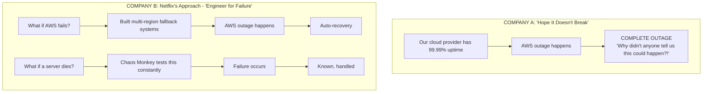
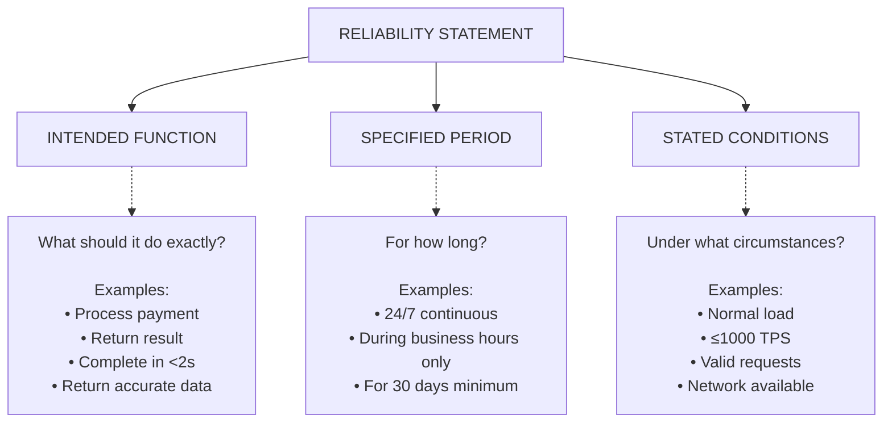
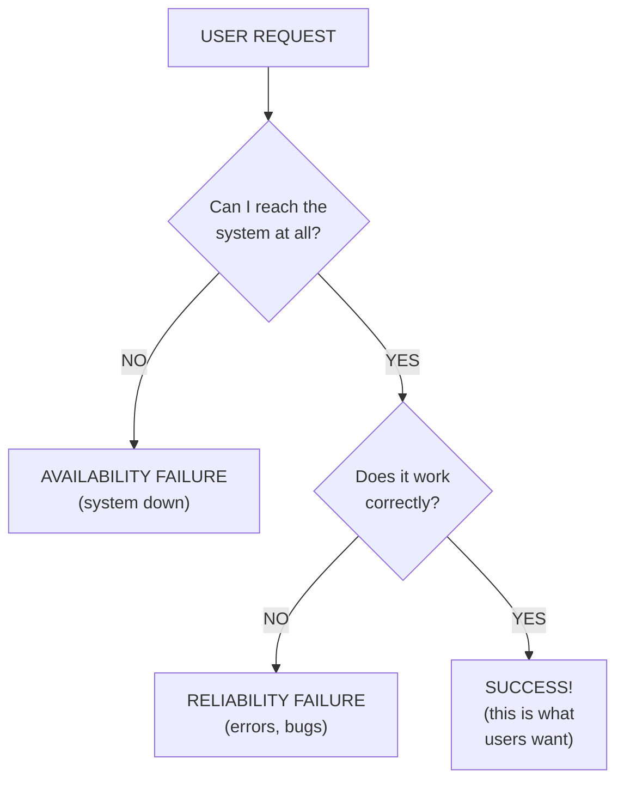
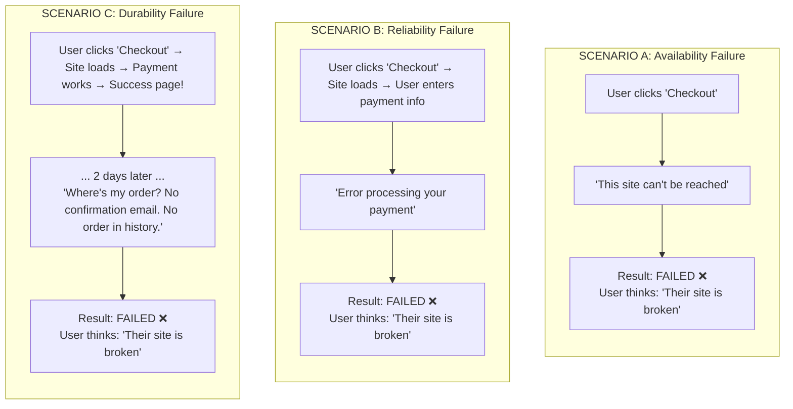
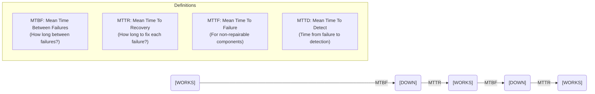
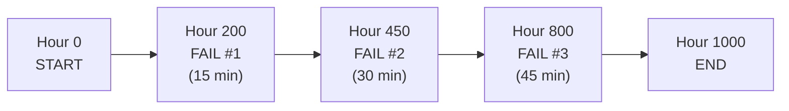
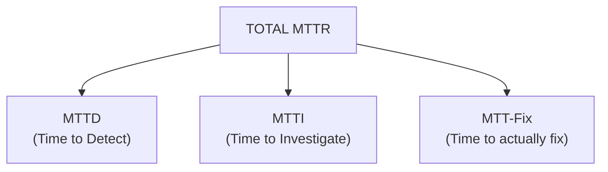
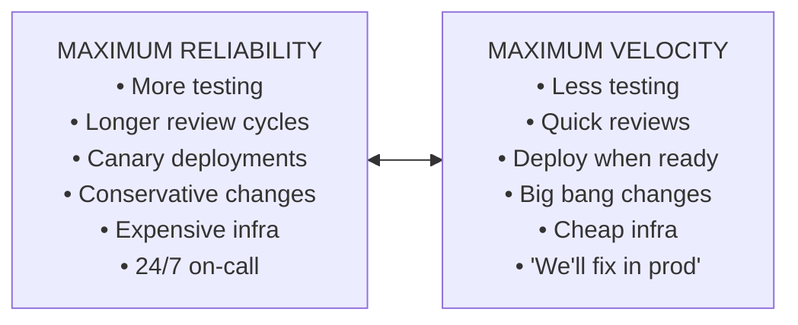
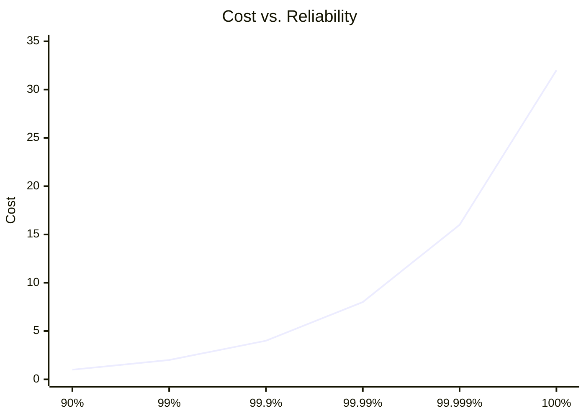
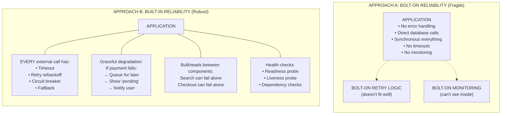

> **Complexity**: `[MEDIUM]`
>
> **Time to Complete**: 35-40 minutes
>
> **Prerequisites**: [Systems Thinking Track](/platform/foundations/systems-thinking/) (recommended)
>
> **Track**: Foundations

### What You'll Be Able to Do

After completing this module, you will be able to:

1. **Explain** the difference between availability, durability, and reliability and why each requires distinct engineering strategies
2. **Evaluate** a system's reliability posture by identifying single points of failure and hidden dependencies
3. **Design** reliability requirements for a service by mapping user expectations to concrete engineering constraints
4. **Compare** reactive vs. proactive reliability approaches and justify when to invest in each

---

## The Incident That Changed Everything

**During a major holiday-period cloud outage.**

A major cloud outage during a peak-traffic holiday period illustrates why reliability engineering matters most when demand and user expectations are both high.

But something unexpected happens.

Teams that invest in failover, graceful degradation, and recovery automation are far better positioned to limit user impact when a cloud dependency fails.

The secret? **Years of reliability engineering.**

Teams that deliberately test cloud-dependency failure are better prepared to keep serving users when a provider has problems.



This is the difference between hoping and engineering. Between luck and reliability.

---

## Why This Module Matters

Your users don't care about your architecture. They don't care about your tech stack. They don't care that you're using Kubernetes or that your microservices are beautifully decoupled. They care about exactly one thing:

**Does it work when I need it?**

That question seems simple. But answering it systematically—measuring it, designing for it, trading off against other goals—that's the discipline of reliability engineering.

Consider what "99% reliable" actually means:

```text
THE BRUTAL MATH OF UNRELIABILITY
═══════════════════════════════════════════════════════════════════════════════

"99% reliable" sounds great until you do the math:

Per Year:      99% uptime = 3.65 DAYS of downtime
Per Month:                = 7.3 HOURS of downtime
Per Week:                 = 1.7 HOURS of downtime
Per Day:                  = 14.4 MINUTES of downtime

For a payment processor handling $1M/hour:
─────────────────────────────────────────────────────────────────────────────
7.3 hours/month × $1,000,000/hour = $7.3 MILLION in lost revenue PER MONTH

For an emergency services dispatcher:
─────────────────────────────────────────────────────────────────────────────
14 minutes per day × 365 = 85 HOURS per year of "911 not working"

For a trading platform:
─────────────────────────────────────────────────────────────────────────────
Each minute of downtime during market hours can cost millions in trades
```

This module teaches you to think about reliability systematically—not as "we hope it doesn't break" but as an engineering discipline with clear metrics, trade-offs, and design principles.

> **The Bridge Analogy**
>
> Civil engineers don't say "we hope this bridge doesn't collapse." They calculate loads, specify materials, add safety factors, and design for specific failure scenarios. They know exactly what wind speed will cause problems, what weight the bridge can bear, and what happens if a cable snaps.
>
> Software reliability engineering applies the same rigor to systems: understand the failure modes, design for them, measure the results. The question isn't "will it fail?" but "how will it fail, and what happens when it does?"

---

## What You'll Learn

- How to define and measure reliability precisely
- The relationship between availability, reliability, and durability
- MTBF, MTTR, and other reliability metrics that actually matter
- Why "five nines" is exponentially harder than "three nines"
- The reliability vs. velocity trade-off and how to navigate it
- How to calculate and use error budgets

---

## Part 1: Defining Reliability

### 1.1 What Does "Reliable" Mean?

Here's a conversation that happens in every engineering organization:

```text
THE VAGUENESS PROBLEM
═══════════════════════════════════════════════════════════════════════════════

Product Manager: "Is the payment system reliable?"

Engineer 1: "Yes, we haven't had any outages this month."

Engineer 2: "Well, we had 500 failed transactions yesterday."

Engineer 1: "But that's only 0.01% of transactions!"

Engineer 2: "That's 500 customers who couldn't buy things."

Product Manager: "So... is it reliable or not?"

Everyone: "..."
```

The problem? "Reliable" means different things to different people. We need precision.

**Reliability** is [the probability that a system performs its intended function for a specified period under stated conditions](https://csrc.nist.gov/glossary/term/reliability).

Three components must be defined:



**Vague vs. Precise Reliability Statements:**

| Vague | Precise |
|-------|---------|
| "The system is reliable" | "The system successfully processes 99.9% of valid requests within 2 seconds" |
| "High availability" | "Available 99.95% of the time, measured monthly" |
| "Data is safe" | "Very high annual object-durability target" |
| "Fast enough" | "95th percentile latency under 200ms" |

```text
COMPLETE RELIABILITY DEFINITION EXAMPLE
═══════════════════════════════════════════════════════════════════════════════

❌ Vague: "The payment system is reliable"

✅ Precise: "The payment system successfully processes 99.9% of
           transactions within 2 seconds, under normal load (up to
           1000 TPS), 24/7"

Breaking it down:
┌─────────────────────────────────────────────────────────────────────────────┐
│ INTENDED FUNCTION                                                           │
│ ─────────────────                                                           │
│ • Process transactions                                                      │
│ • Successfully (not just accept, but complete)                              │
│ • Within 2 seconds (latency requirement)                                    │
├─────────────────────────────────────────────────────────────────────────────┤
│ SPECIFIED PERIOD                                                            │
│ ─────────────────                                                           │
│ • 24/7 (continuous operation)                                               │
│ • No planned maintenance windows excluded                                    │
├─────────────────────────────────────────────────────────────────────────────┤
│ STATED CONDITIONS                                                           │
│ ─────────────────                                                           │
│ • Normal load: ≤1000 transactions per second                                │
│ • Assumes valid transactions (garbage in = garbage out is ok)               │
│ • Assumes network connectivity to payment processor                          │
└─────────────────────────────────────────────────────────────────────────────┘
```

> **Pause and predict**: If you optimize purely for uptime (availability), what user experience issues might you miss?

### 1.2 Reliability vs. Availability vs. Durability

These three terms get confused constantly. Even experienced engineers mix them up. Let's fix that forever.

| Concept | Question It Answers | Measures | Example |
|---------|---------------------|----------|---------|
| **Reliability** | "When I use it, does it work?" | Success rate | "99.9% of requests succeed" |
| **Availability** | "Can I use it right now?" | Uptime | "System is up 99.99% of time" |
| **Durability** | "Will my data still exist tomorrow?" | Data retention | "99.999999999% of data preserved" |



**The Four Combinations:**

```mermaid
quadrantChart
    title Reliability vs Availability Matrix
    x-axis Low Availability --> High Availability
    y-axis Low Reliability --> High Reliability
    quadrant-1 IDEAL (Works great all the time)
    quadrant-2 FLAKY (Perfect when up, but...)
    quadrant-3 WORST (Can't reach it, and it fails)
    quadrant-4 UNRELIABLE (Always up, but errors)
```

**Real-World Examples:**
- **High Availability + Low Reliability (UNRELIABLE):** API usually responds, but 5% of responses are errors.
- **Low Availability + High Reliability (FLAKY):** Mainframe with weekly maintenance windows—when up, zero errors.
- **High Both (IDEAL):** Modern streaming services—available most of the time, almost always works.
- **Low Both (WORST):** That internal tool nobody maintains—down half the time, buggy the other half.

**Durability: The Third Dimension**

Durability is different—it's about data persistence over time, not requests.

```text
DURABILITY EXPLAINED
═══════════════════════════════════════════════════════════════════════════════

Scenario: You upload a photo to cloud storage

AVAILABILITY question: "Can I access my photo right now?"
  • If cloud storage is down, you can't access it
  • But the photo still exists!

DURABILITY question: "Will my photo exist in 10 years?"
  • Even if storage is up, corruption could destroy it
  • Durability = probability of data survival

THE MATH OF 11 NINES (Amazon S3's durability guarantee):
─────────────────────────────────────────────────────────────────────────────
99.999999999% durability

If you store 10,000,000 objects:
• Expected losses per year: 10M × 0.000000001 = 0.01 objects
• Expected losses per century: ~1 object

That's ~10,000 years between losing a single object.

How they achieve it:
• Multiple copies across multiple data centers
• Automatic integrity checking
• Self-healing when corruption detected
• Geographic distribution
```

> **Did You Know?**
>
> [Amazon S3's published 11-nines durability target](https://docs.aws.amazon.com/AmazonS3/latest/userguide/DataDurability.html) implies an extremely low expected rate of object loss. That's not availability—S3 can be temporarily unavailable while still being durable. Your data is safe; you just can't access it right now.
>
> This distinction matters enormously. When S3 has an "outage," your files aren't being deleted—they're just temporarily inaccessible. Durability and availability are independent properties.

### 1.3 The User's Perspective

From your user's perspective, reliability is simple: **Did it work?**

Users don't care about our careful distinctions between availability, reliability, and durability. They care about outcomes.



This is why we need to measure all three dimensions—because any failure mode leads to the same user outcome.

> **Try This (2 minutes)**
>
> Think about an app you use daily. Recall a time it failed you. Was it:
> - An availability failure (couldn't connect)?
> - A reliability failure (connected but got an error)?
> - A durability failure (your data was lost)?
>
> Understanding the failure type helps identify the fix.
>
> Bonus: Think about how you, as a user, responded. Did you retry? Give up? Switch to a competitor? That's the business cost of unreliability.

---

## Part 2: Measuring Reliability

> **Stop and think**: Why is going from 99.9% to 99.99% exponentially harder than going from 99% to 99.9%?

### 2.1 The Nines

When engineers talk about reliability, they talk about "nines." You'll hear phrases like "we need five nines" or "we're only at three nines." What does this mean?

The "nines" are a shorthand for the number of 9s in the reliability percentage:

| Nines | Percentage | Error Rate | Downtime/Year | Downtime/Month | Downtime/Day |
|-------|------------|------------|---------------|----------------|--------------|
| One nine | 90% | 10% | 36.5 days | 3 days | 2.4 hours |
| Two nines | 99% | 1% | 3.65 days | 7.3 hours | 14 minutes |
| Three nines | 99.9% | 0.1% | 8.76 hours | 43.8 minutes | 1.4 minutes |
| Four nines | 99.99% | 0.01% | 52.6 minutes | 4.4 minutes | 8.6 seconds |
| Five nines | 99.999% | 0.001% | 5.26 minutes | 26.3 seconds | 0.86 seconds |
| Six nines | 99.9999% | 0.0001% | 31.5 seconds | 2.6 seconds | 86 ms |

```text
VISUALIZING THE NINES
═══════════════════════════════════════════════════════════════════════════════

If you handle 1,000,000 requests per day:

90% (1 nine)     ████████████████████████████████████░░░░░░░░
                 100,000 failures per day
                 "Basically broken"

99% (2 nines)    ████████████████████████████████████████░░░░
                 10,000 failures per day
                 "Unreliable, users complaining constantly"

99.9% (3 nines)  █████████████████████████████████████████░░░
                 1,000 failures per day
                 "Okay for internal tools, not great for customers"

99.99% (4 nines) ██████████████████████████████████████████░░
                 100 failures per day
                 "Good for most consumer services"

99.999% (5 nines)███████████████████████████████████████████░
                 10 failures per day
                 "Enterprise-grade, mission-critical"

99.9999%(6 nines)████████████████████████████████████████████
                 1 failure per day
                 "Financial trading, emergency services"
```

**The Exponential Cost of Each Nine:**

Each additional nine usually requires disproportionately more engineering effort and cost to achieve. Here's why:

```text
THE EXPONENTIAL COST OF NINES
═══════════════════════════════════════════════════════════════════════════════

NINES    REQUIREMENTS                                  APPROXIMATE COST FACTOR
─────────────────────────────────────────────────────────────────────────────────

99%      • Basic monitoring                                      $
         • Some automation
         • Single data center

99.9%    • Good monitoring                                      $$
         • Automated failover
         • Redundant components
         • On-call rotation

99.99%   • Sophisticated monitoring                            $$$$
         • Multi-zone deployment
         • Automatic scaling
         • Fast incident response
         • Chaos engineering
         • 24/7 operations

99.999%  • Multi-region deployment                          $$$$$$$$
         • Global load balancing
         • Zero-downtime deployments
         • Full automation
         • Dedicated reliability teams
         • Extensive testing infrastructure

WHY IT'S EXPONENTIAL:
─────────────────────────────────────────────────────────────────────────────────
Going from 99% to 99.9%:  Remove 90% of remaining failures
Going from 99.9% to 99.99%: Remove 90% of remaining failures AGAIN
Going from 99.99% to 99.999%: And again...

The easy failures are fixed first. Each level requires fixing
progressively harder, rarer, weirder problems.

At 99.99%, you're fixing bugs that only happen during full moons
(or at least, that's what it feels like).
```

### 2.2 Key Reliability Metrics

Beyond "nines," there are four critical metrics every reliability engineer must understand:



**MTBF - Mean Time Between Failures**

MTBF measures how frequently failures occur. Higher MTBF = fewer failures = better.

**MTBF CALCULATION**

Formula: `MTBF = Total Operating Time / Number of Failures`

**Example Scenario:**

Timeline over 1000 hours:



**Calculation:**
- Total operating time: 1000 hours
- Number of failures: 3
- `MTBF = 1000 / 3 = 333.3 hours`

Interpretation: On average, expect a failure every 333 hours (~14 days)

**MTTR - Mean Time To Recovery**

MTTR measures how quickly you recover from failures. Lower MTTR = faster recovery = better.



**Calculating Availability from MTBF and MTTR:**

```text
THE AVAILABILITY FORMULA
═══════════════════════════════════════════════════════════════════════════════

              MTBF
Availability = ────────────
              MTBF + MTTR


Example:
─────────────────────────────────────────────────────────────────────────────
• MTBF = 250 hours (failure every ~10 days)
• MTTR = 2 hours (takes 2 hours to fix each failure)

Availability = 250 / (250 + 2) = 250/252 = 99.2%

What this means:
• System is working: 99.2% of the time
• System is down: 0.8% of the time
• Per month downtime: 0.8% × 720 hours = 5.76 hours
```

> **The MTTR Revelation**
>
> Here's a secret that many teams miss: **reducing MTTR is often easier and more effective than reducing MTBF**.
>
> Consider two approaches to improving from 99% to 99.9%:
>
> | Approach | Starting Point | Target | Improvement Needed |
> |----------|---------------|--------|-------------------|
> | Increase MTBF | MTBF=100h, MTTR=1h | MTBF=1000h | **10x fewer failures** |
> | Decrease MTTR | MTBF=100h, MTTR=1h | MTTR=6min | **10x faster recovery** |
>
> Preventing all failures is hard—you're fighting complexity, unknown unknowns, and Murphy's Law. But recovering faster? You can invest in:
> - Better monitoring (detect failures faster)
> - Automated rollbacks (fix some failures in seconds)
> - Runbooks and training (human recovery is faster)
> - Simpler architectures (easier to debug)
>
> The best reliability engineers optimize both—but they often get more ROI from MTTR.

### 2.3 Error Budgets

Here's a concept that changed how the industry thinks about reliability: the **error budget**.

An error budget is [the acceptable amount of unreliability—the difference between 100% and your reliability target](https://cloud.google.com/service-mesh/v1.24/docs/observability/design-slo).

```text
ERROR BUDGET: THE CONCEPT
═══════════════════════════════════════════════════════════════════════════════

If your target is 99.9% reliability...

                    100% - 99.9% = 0.1% error budget

That 0.1% is not a failure—it's PERMISSION TO FAIL within limits.

In a month (30 days = 43,200 minutes):
─────────────────────────────────────────────────────────────────────────────
Error budget = 43,200 × 0.001 = 43.2 minutes

You can "spend" 43.2 minutes on:
• Downtime from incidents
• Failed requests
• Deployments that break things temporarily
• Experiments that don't work out

BUDGET VISUALIZATION (Example: Month in Progress)
─────────────────────────────────────────────────────────────────────────────
Week 1:  [████████░░]  Incident: 5 min     Budget: 38.2 min remaining
Week 2:  [███████░░░]  Incident: 12 min    Budget: 26.2 min remaining
Week 3:  [██████░░░░]  Deployment: 3 min   Budget: 23.2 min remaining
Week 4:  [█████░░░░░]  Healthy!            Budget: 23.2 min remaining

Status: ✅ HEALTHY - Room for one more risky deployment this month
```

**Why Error Budgets Are Revolutionary:**

Before error budgets, reliability conversations went like this:
- Developers: "Let's ship fast!"
- Ops: "No, we need stability!"
- Result: Endless conflict, arbitrary decisions

Error budgets change the conversation:

```text
ERROR BUDGETS CREATE ALIGNMENT
═══════════════════════════════════════════════════════════════════════════════

OLD CONVERSATION (Conflict)
─────────────────────────────────────────────────────────────────────────────
Developer: "Let's deploy the new feature!"
Ops: "Too risky, we just had an incident."
Developer: "When CAN we ship then?"
Ops: "When I feel comfortable."
Developer: "That's not a real answer!"
→ RESULT: Arguments, politics, frustration

NEW CONVERSATION (Data-Driven)
─────────────────────────────────────────────────────────────────────────────
Developer: "Let's deploy the new feature!"
Ops: "What's our error budget status?"
Developer: "We have 28 minutes remaining this month."
Ops: "Last similar deployment caused 5 minutes of issues."
Developer: "So we can afford this. Let's go."
→ RESULT: Shared decision based on data
```

**Error Budget Policy:**

| Budget Status | What It Means | Team Response |
|---------------|---------------|---------------|
| **>50% remaining** | Plenty of room | Ship features, take calculated risks, experiment |
| **25-50% remaining** | Getting tight | Continue carefully, reduce risk per deployment |
| **<25% remaining** | Warning zone | Slow down, extra testing, avoid risky changes |
| **0% or negative** | Reliability crisis | **Freeze** features, all hands on reliability |

> **Stop and think**: If a team has 0 error budget left, how should they handle a critical security vulnerability patch?

```text
ERROR BUDGET POLICY IN ACTION
═══════════════════════════════════════════════════════════════════════════════

SCENARIO: Team wants to deploy major new feature

Budget Status Check:
┌──────────────────────────────────────────────────────────────────────────────┐
│                                                                              │
│   This Month's Error Budget: 43.2 minutes                                    │
│   Used so far: 35.8 minutes                                                  │
│   Remaining: 7.4 minutes (17%)                                               │
│                                                                              │
│   [███████████████████████████████████░░░░░░░░░░] 83% used                   │
│                                                                              │
│   Status: ⚠️  WARNING ZONE                                                    │
│                                                                              │
└──────────────────────────────────────────────────────────────────────────────┘

Decision: Hold the risky feature until next month. Instead:
• Deploy smaller, safer changes
• Focus on reliability improvements
• Bank error budget for next month

This isn't "ops blocking devs"—it's the TEAM deciding based on shared data.
```

> **Try This (3 minutes)**
>
> Your service has 99.5% reliability target. Calculate your monthly error budget:
>
> 1. What percentage is your error budget? (100% - 99.5% = ?)
> 2. How many minutes per month? (43,200 × budget = ?)
> 3. If you've had 3 incidents of 30 minutes each, how much budget remains?
> 4. Based on the policy above, what should your team do?

---

## Part 3: The Reliability Trade-offs

### 3.1 Reliability vs. Velocity

Here's the uncomfortable truth every engineering organization faces: you can't have maximum reliability AND maximum velocity. There's a fundamental tension.



**Examples on the Spectrum:**
- **Medical Device:** "Zero tolerance" (Maximum Reliability)
- **Banks:** "Must be trustworthy"
- **Airlines:** "Regulated but needs innovation"
- **E-commerce:** "Revenue depends on uptime"
- **Internal Tools:** "Annoying but not critical"
- **Startup MVP:** "Speed is survival"
- **Hackathon Project:** "Ship something by 5pm" (Maximum Velocity)

**Why you can't fully optimize both:**

```text
THE PHYSICS OF THE TRADE-OFF
═══════════════════════════════════════════════════════════════════════════════

1. EVERY DEPLOYMENT IS A RISK
   ─────────────────────────────────────────────────────────────────────────
   More deploys = More chances for bugs to slip through
   Each deploy could be "the one" that breaks production

   Fast velocity: Deploy 10 times/day = 10 opportunities for failure
   High reliability: Deploy 1 time/week = Fewer opportunities for failure

2. EVERY FEATURE ADDS COMPLEXITY
   ─────────────────────────────────────────────────────────────────────────
   More features = More code paths = More failure modes

   Features: 100 → Surface area for bugs: 100 potential failure points
   Features: 1000 → Surface area for bugs: 1000 potential failure points

3. EVERY TEST ADDS TIME
   ─────────────────────────────────────────────────────────────────────────
   More testing = More confidence but slower delivery

   Quick path: 5 min test suite = Fast, but might miss edge cases
   Thorough path: 2 hour test suite = Slow, but catches more bugs

4. REDUNDANCY COSTS MONEY
   ─────────────────────────────────────────────────────────────────────────
   More reliability = More servers, regions, engineers

   Single region: $10k/month, single point of failure
   Multi-region: $50k/month, survives region failure
```

### 3.2 Context Determines Trade-offs

The right trade-off depends entirely on what you're building:

| System Type | Reliability Target | Velocity Target | Why This Balance |
|-------------|-------------------|-----------------|------------------|
| Pacemaker firmware | 99.9999%+ | Releases per year | **Lives at stake** - One bug could kill |
| Banking core | 99.99% | Releases per quarter | **Money and trust** - Errors lose customers |
| Flight booking | 99.95% | Releases per week | **Revenue impact** - Downtime = lost sales |
| E-commerce | 99.9% | Daily releases | **Balance** - Fast features, acceptable risk |
| Internal tool | 99% | Multiple per day | **Low stakes** - If it breaks, devs complain |
| Prototype | "Runs sometimes" | Constantly | **Learning** - Reliability is future problem |

### 3.3 The 100% Reliability Myth

Let's talk about something engineers need to accept: **100% reliability is not achievable in real-world systems**.

Not merely "very expensive." Not just "only for Google." **Practically unattainable in real-world systems.**

**WHY 100% RELIABILITY IS NOT ACHIEVABLE IN REAL-WORLD SYSTEMS**

**THE PHYSICS PROBLEM**
- Hardware fails randomly (transistors wear out, solder cracks)
- Memory errors and other hardware faults still occur in real systems, including bit corruption events.
- Power grids have outages (transformers explode, trees fall)
- Datacenter cooling fails (air conditioners break)

**THE DEPENDENCY PROBLEM**
- DNS providers can suffer major outages or attacks, making many popular sites unreachable for large groups of users.
- Cloud providers have had major outages, so customer architectures still need to plan for provider failure.
- [Certificate authorities get compromised (DigiNotar 2011)](https://www.cisa.gov/news-events/alerts/2011/08/30/fraudulent-diginotar-ssl-certificate)
- BGP gets hijacked (routing your traffic to wrong places)

**THE HUMAN PROBLEM**
- Engineers make mistakes (fat-finger deploy to production)
- On-call gets sick (at 3 AM, during a snowstorm)
- Documentation becomes outdated (runbook says "click button" but UI changed)
- Knowledge leaves (the one person who understood that system quit)

**THE ECONOMICS PROBLEM**



Cost grows EXPONENTIALLY. At some point, another nine costs more than it's worth. That breakeven point is different for every system.

> **Did You Know?**
>
> Google's Chubby lock service **intentionally introduces planned outages**. Why? To ensure that dependent services don't accidentally build assumptions about 100% availability.
>
> If Chubby were "too reliable," services would build implicit dependencies on it always being there. Then when Chubby eventually had an unplanned outage, those services would fail catastrophically—they had not adequately tested for Chubby being down.
>
> By being deliberately unreliable (within SLA), Chubby forces dependent services to handle its failures gracefully. Controlled unreliability builds resilience.
>
> This is brilliant: your dependencies can be TOO reliable if it causes you to not handle their failure.

> **War Story: The 99.99% Promise**
>
> Teams sometimes promise availability numbers that their current incident response capability cannot realistically support.
>
> ```text
> THE MATH NOBODY DID
> ═════════════════════════════════════════════════════════════════════════════
>
> Promised: 99.99% availability
> Monthly budget: 43,200 minutes × 0.0001 = 4.32 minutes
>
> Reality:
> • Average incident detection time: 8 minutes
> • Average investigation time: 15 minutes
> • Average fix time: 22 minutes
> • Total average MTTR: 45 minutes
>
> ONE incident per month = SLA violation by 10x
>
> Q1 Results:
> ─────────────────────────────────────────────────────────────────────────────
> Month 1: 2 incidents, 87 minutes downtime (20x over budget)
> Month 2: 1 incident, 52 minutes downtime (12x over budget)
> Month 3: 3 incidents, 142 minutes downtime (33x over budget)
>
> SLA credits owed: $2.4 million
> Engineering budget for reliability: $800,000
>
> The SLA credits alone cost 3x what it would have taken to fix the problems!
> ```
>
> The lesson is to set customer commitments that match demonstrated operational capability, then improve response and resilience from there.
>
> Customers were happier with a realistic promise kept than an ambitious promise broken.
>
> **Lesson: Your SLA should match your operational capability, not your marketing aspirations.**

---

## Part 4: Reliability as a Practice

### 4.1 Reliability is Not a Feature

Here's a common mistake: treating reliability as something you add later. "First we'll build the features, then we'll make it reliable."

This is like saying "First we'll build the house, then we'll add the foundation."



### 4.2 The Reliability Mindset

Reliability engineers think differently. They ask questions that others don't:

```text
THE FIVE QUESTIONS OF RELIABILITY
═══════════════════════════════════════════════════════════════════════════════

┌─────────────────────────────────────────────────────────────────────────────┐
│                                                                             │
│  1. WHAT CAN FAIL?                                                          │
│     ────────────────                                                        │
│     Answer: EVERYTHING. Make a list:                                        │
│     • Database: connection lost, slow queries, disk full                    │
│     • Network: timeout, partition, DNS failure                              │
│     • Third-party: API down, rate limited, changed response                 │
│     • Infrastructure: server crash, region outage, deployment               │
│     • Human: bad config, wrong button, missing step                         │
│                                                                             │
│  2. HOW WILL WE KNOW IT FAILED?                                             │
│     ────────────────────────────                                            │
│     • What metrics indicate failure?                                        │
│     • What logs capture the evidence?                                       │
│     • What alerts wake someone up?                                          │
│     • How do we distinguish "slow" from "broken"?                           │
│                                                                             │
│  3. HOW WILL WE RECOVER?                                                    │
│     ─────────────────────                                                   │
│     • Automated: failover, restart, rollback?                               │
│     • Manual: runbook, escalation path?                                     │
│     • How long will recovery take?                                          │
│     • What's the backup plan if Plan A fails?                               │
│                                                                             │
│  4. HOW DO WE PREVENT RECURRENCE?                                           │
│     ────────────────────────────────                                        │
│     • Post-incident review (blameless)                                      │
│     • Action items with owners and dates                                    │
│     • Tests that would catch this failure                                   │
│     • Architecture changes to eliminate the failure mode                    │
│                                                                             │
│  5. WHAT'S THE BLAST RADIUS?                                                │
│     ────────────────────────                                                │
│     • If this component fails, what else breaks?                            │
│     • Are there bulkheads to contain the damage?                            │
│     • Can we degrade gracefully instead of failing hard?                    │
│     • Who is affected: all users, some users, internal only?                │
│                                                                             │
└─────────────────────────────────────────────────────────────────────────────┘
```

### 4.3 Reliability Anti-patterns

These are the patterns that look reasonable but lead to unreliable systems:

| Anti-pattern | Why It Seems Reasonable | Why It Fails | Better Approach |
|--------------|------------------------|--------------|-----------------|
| **"It won't fail"** | "We've never seen it fail" | Past stability doesn't guarantee future stability | Assume everything fails; design for it |
| **"We'll fix it in prod"** | "We can move faster this way" | Each prod fix is an incident; users are your testers | Test failure modes before production |
| **"More redundancy = more reliable"** | "Two is better than one" | Redundancy adds complexity; can cause split-brain | Understand failure modes FIRST, then add appropriate redundancy |
| **"Users will retry"** | "Retries are simple" | Pushes reliability burden onto users; causes retry storms | Handle retries internally with backoff |
| **"We tested it"** | "Tests passed!" | Tests only check known scenarios; prod has unknowns | Test + monitor + chaos engineering |
| **"The cloud handles it"** | "AWS never fails" | Cloud providers fail; you're responsible for your SLA | Design for cloud provider failures |

> **Try This (3 minutes)**
>
> Pick one of your services. Ask yourself the five reliability questions:
>
> 1. What are the top 3 things that could fail?
> 2. How would you know if each one happened?
> 3. What would you do about each one?
>
> If you can't answer these quickly, that's a reliability gap—and now you know where to focus.

---

## Did You Know?

- [**Reliability engineering developed as a formal discipline in the mid-20th century, driven in part by military and aerospace electronics programs.**](https://en.wikipedia.org/wiki/Reliability_engineering) Those methods later influenced software reliability practice.

- **In hardware-heavy domains, MTBF is often tracked in usage-based units such as operating hours.** This reflects usage exposure rather than calendar time.

- **The first software reliability model** was created by [John Musa at Bell Labs in 1975](https://en.wikipedia.org/wiki/John_D._Musa). He applied hardware reliability mathematics to software, founding the field of software reliability engineering. His insight: software bugs follow statistical patterns just like hardware failures.

- **Netflix popularized the "Chaos Monkey" approach**, randomly killing production instances to ensure their systems could handle failures. Why the name? Because it's like having a monkey loose in your data center, randomly unplugging things. This evolved into chaos engineering—deliberately injecting failures to build confidence. If you haven't tested a failure, you don't know if you can survive it.

- [**The Space Shuttle had five redundant computers**](https://en.wikipedia.org/wiki/Space_Shuttle) running different software written by different teams. Why? A single bug could kill astronauts. The fifth computer ran entirely different software to protect against systematic bugs. This is the ultimate "defense in depth."

- **Teams often set internal reliability objectives stricter than customer-facing SLAs.** This creates buffer for multi-service dependency chains and unexpected failures.

---

## Common Mistakes

| Mistake | What It Looks Like | Why It's Wrong | How to Fix It |
|---------|-------------------|----------------|---------------|
| **Measuring availability, not reliability** | "We had 100% uptime!" but error rates are 5% | System is up but returning errors; users are still failing | Track success rate of user-facing operations, not just uptime |
| **Ignoring partial failures** | "It works" when search is broken but checkout works | Users experience service as degraded; you don't know | Define and measure degraded states; create SLIs for each component |
| **Setting unrealistic targets** | "We need five nines" without doing the math | Team is demoralized; SLA credits drain budget | Start with user impact, work backward to a realistic target |
| **Not tracking error budget** | No visibility into how much reliability "spend" remains | Can't make informed velocity vs. reliability trade-offs | Implement error budget tracking with clear policy |
| **Optimizing one component** | Made the database 10x faster but users still see errors | End-to-end reliability is what matters, not component | Measure reliability from user's perspective (synthetic monitoring) |
| **Treating MTTR as fixed** | "Incidents take 45 minutes to fix, that's just how it is" | Recovery time is controllable; you're leaving improvements on the table | Invest in detection, runbooks, automation; measure MTTD separately |
| **Confusing SLOs and SLAs** | Internal target = customer promise | No buffer for unexpected issues; breaches become SLA violations | Set internal SLO tighter than external SLA |
| **Not testing failure modes** | "We have redundancy" but never tested failover | First test of redundancy is during a real incident | Regular game days; chaos engineering |

---

## Quiz

Test your understanding of reliability concepts:

**1. Scenario: You are reviewing the metrics for a newly launched photo-sharing service. The dashboard proudly displays 99.9% availability for the month, but the customer support queue is flooded with complaints about failed uploads. You dig deeper and discover the reliability success rate is only 95%. What exactly are the users experiencing?**

<details>
<summary>Answer</summary>

Users are experiencing a service that is almost always reachable, but frequently fails to process their requests. Because the availability is 99.9%, the servers are online and accepting connections almost all the time (down only ~43 minutes a month). However, the 95% reliability means that when users attempt an action, like uploading a photo, 5 out of every 100 attempts result in an error or failure. The combined effect (99.9% × 95%) means the actual user success rate is only 94.9%. This scenario highlights why measuring only availability is dangerous; it creates a false sense of security while users suffer through persistent partial failures and bugs.
</details>

**2. Scenario: The sales team at your SaaS company just closed a massive enterprise contract by promising a 99.99% availability SLA. The engineering team currently has an average Time to Detect (MTTD) of 5 minutes and an average Time to Fix (MTT-Fix) of 15 minutes. Calculate your monthly error budget in minutes and explain why this new contract puts the company in severe danger.**

<details>
<summary>Answer</summary>

The monthly error budget for a 99.99% SLA is approximately 4.32 minutes (43,200 minutes per month × 0.0001). This contract puts the company in extreme danger because a single average incident takes 20 minutes to resolve (5 minutes to detect + 15 minutes to fix). Therefore, just one typical incident would quickly blow through nearly five months' worth of error budget, likely triggering financial SLA penalties. Achieving 99.99% requires fully automated detection and recovery mechanisms that resolve issues in sub-minute timeframes, which the current team clearly lacks. Promising this level of availability without the operational maturity to support it is a guaranteed recipe for losing money.
</details>

**3. Scenario: You must choose between two database architectures. Architecture Alpha crashes rarely (MTBF = 500 hours) but requires manual intervention to restore, taking 30 minutes (MTTR). Architecture Beta crashes much more frequently due to aggressive preemptive node cycling (MTBF = 100 hours), but it has an automated failover that restores service in exactly 5 minutes (MTTR). Which architecture provides higher overall availability to the end user?**

<details>
<summary>Answer</summary>

Architecture Beta provides higher overall availability (99.92%) compared to Architecture Alpha (99.90%). To find this, we calculate availability using the formula MTBF / (MTBF + MTTR). For Alpha, 500 / (500 + 0.5) equals 99.90%. For Beta, 100 / (100 + 0.083) equals 99.92%. This counterintuitive result demonstrates the immense power of optimizing for fast recovery over failure prevention. Even though Beta fails five times as often, its fully automated, rapid recovery means users ultimately experience less total downtime over the long run.
</details>

**4. Scenario: A product manager hands you a specification for a new microservice. The document states: "Requirement: The payment processing API must be 99.9% reliable." As a reliability engineer, you push back and ask them to rewrite it. Why is this requirement unusable, and what is it missing?**

<details>
<summary>Answer</summary>

This requirement is unusable because it is too vague to be measured or engineered against. A proper reliability statement must precisely define three components: the intended function, the specified period, and the stated conditions. In this case, it fails to define what constitutes a "successful" API response (e.g., must it return within 500ms? Is a 500 error a failure?). It also fails to specify the time window for measurement (e.g., over a rolling 30-day window) and the conditions under which the guarantee holds (e.g., under normal load up to 1000 TPS, excluding planned maintenance). Without these specifics, engineers and stakeholders will constantly disagree on whether the system is actually "reliable" when an edge-case incident occurs.
</details>

**5. Scenario: It is the third week of the month, and your team's service has suffered a few rocky deployments, consuming 38 minutes of your 43.2-minute monthly error budget. The product team is pressuring you to deploy a massive, highly anticipated feature update before the weekend. According to error budget policies, how should you handle this situation?**

<details>
<summary>Answer</summary>

You should halt the deployment of the major feature until the next month when the error budget resets. With only 5.2 minutes of budget remaining, you are deep in the warning zone, meaning any slight hiccup during this risky deployment will push the service over its SLA limit. The error budget exists specifically to remove emotion from these decisions; it is an agreed-upon contract that dictates feature freezes when reliability is threatened. Instead of deploying the risky feature, the team should spend the rest of the month deploying small, low-risk patches or focusing entirely on reliability and technical debt improvements. If the business decides the feature must go out regardless, it requires explicit executive sign-off acknowledging the accepted breach of the reliability targets.
</details>

---

## Hands-On Exercise

**Scenario**: You're joining a team as a reliability engineer. Your first task is to assess the current reliability posture and make recommendations.

### Part 1: Calculate Reliability Metrics (15 minutes)

**Data from last month's monitoring:**

| Metric | Value |
|--------|-------|
| Total requests | 10,000,000 |
| Failed requests (5xx errors) | 12,000 |
| Slow requests (>2s latency) | 85,000 |
| Number of incidents | 4 |
| Total incident duration | 3 hours 20 minutes (200 minutes) |
| Operating hours | 720 (full month) |

**Calculate each metric:**

```text
1. SUCCESS RATE (RELIABILITY)
═══════════════════════════════════════════════════════════════════════════════
Formula: Success Rate = (Total - Failed) / Total × 100

Your calculation:
───────────────────────────────────────────────────────────────────────────────


Result: _______%
```

```text
2. AVAILABILITY
═══════════════════════════════════════════════════════════════════════════════
Formula: Availability = (Operating Time - Downtime) / Operating Time × 100

Your calculation:
───────────────────────────────────────────────────────────────────────────────


Result: _______%
```

```text
3. MTBF (Mean Time Between Failures)
═══════════════════════════════════════════════════════════════════════════════
Formula: MTBF = Operating Time / Number of Incidents

Your calculation:
───────────────────────────────────────────────────────────────────────────────


Result: _______ hours
```

```text
4. MTTR (Mean Time To Recovery)
═══════════════════════════════════════════════════════════════════════════════
Formula: MTTR = Total Downtime / Number of Incidents

Your calculation:
───────────────────────────────────────────────────────────────────────────────


Result: _______ minutes
```

```text
5. ERROR BUDGET STATUS
═══════════════════════════════════════════════════════════════════════════════
Target: 99.9% reliability
Error budget: 0.1% = 43.2 minutes per month

Your calculation:
───────────────────────────────────────────────────────────────────────────────
Budget: 43.2 minutes
Used: _______ minutes
Remaining: _______ minutes
Status: [ ] Healthy  [ ] Warning  [ ] Over budget
```

### Part 2: Write a Reliability Assessment (10 minutes)

Based on your calculations, write a brief assessment:

```text
RELIABILITY ASSESSMENT TEMPLATE
═══════════════════════════════════════════════════════════════════════════════

CURRENT STATE:
──────────────────────────────────────────────────────────────────────────────
• Reliability (success rate): _______% (target: 99.9%)
• Availability: _______% (target: 99.9%)
• Error budget: _______ status

KEY FINDINGS:
──────────────────────────────────────────────────────────────────────────────
1. Meeting target? [ ] Yes  [ ] No
2. Biggest gap: _________________________________
3. MTBF vs MTTR priority: _________________________________

RECOMMENDATION:
──────────────────────────────────────────────────────────────────────────────
Top priority improvement: _________________________________

Why: _________________________________
```

### Part 3: Bonus Challenge

Notice the data includes 85,000 "slow requests" (>2s latency) that aren't counted as failures. Should they be?

Consider:
- If users expect <2s response, is a 5s response a "success"?
- How would counting slow requests as failures change your reliability number?
- What should the SLI definition be?

---

**Success Criteria:**
- [ ] All 5 metrics calculated correctly
- [ ] Analysis identifies whether target is met
- [ ] MTBF vs MTTR trade-off reasoned through
- [ ] One specific improvement identified with justification
- [ ] (Bonus) Considered impact of slow requests on reliability definition

---

<details>
<summary>Check Your Work - Sample Answers</summary>

**Calculations:**

1. **Success Rate** = (10,000,000 - 12,000) / 10,000,000 = **99.88%**

2. **Availability** = (720 - 3.33) / 720 = **99.54%**

3. **MTBF** = 720 / 4 = **180 hours** (~7.5 days between failures)

4. **MTTR** = 200 minutes / 4 = **50 minutes** per incident

5. **Error Budget**:
   - Budget: 43.2 minutes
   - Used: 200 minutes
   - **Over budget by 156.8 minutes (463% over!)**

**Assessment:**

**CURRENT STATE:**
- Reliability: 99.88% (close but not meeting 99.9% target)
- Availability: 99.54% (significantly below 99.9% target)
- Error budget: **Severely over budget**

**KEY FINDINGS:**
1. Not meeting targets on either dimension
2. Biggest gap: **Availability** - 3+ hours of downtime vs 43 minutes allowed
3. Priority: **MTTR first** - 50 minutes per incident is too long. Reducing to 15 minutes would make a huge difference.

**RECOMMENDATION:**
- **Invest in faster incident response**
- Implement automated detection (reduce MTTD from unknown to <5 minutes)
- Create runbooks for common issues
- Add automated rollback capability
- Goal: MTTR from 50 minutes → 15 minutes

**Bonus - Slow Requests:**
If slow requests count as failures:
- Total failures = 12,000 + 85,000 = 97,000
- New success rate = (10M - 97K) / 10M = **99.03%**

This changes the picture dramatically! The SLI definition matters.

**Better SLI definition:** "99.9% of requests complete successfully (2xx) within 2 seconds"

</details>

---

## Further Reading

**Books:**

- **"Site Reliability Engineering"** - Google (free online). Chapters 1-4 cover reliability fundamentals from the team that coined "SRE." The definitive text on modern reliability engineering.

- **"Release It! Design and Deploy Production-Ready Software"** - Michael Nygard (2nd edition). Practical patterns for building reliable systems. Every pattern has war stories from real production failures.

- **"The Checklist Manifesto"** - Atul Gawande. How checklists improve reliability in complex domains (aviation, surgery)—surprisingly applicable to incident response.

**Papers:**

- **"How Complex Systems Fail"** - Richard Cook. A 5-page paper that every reliability engineer should read. Describes why failures happen and why hindsight is misleading.

- **"On Designing and Deploying Internet-Scale Services"** - James Hamilton. Classic paper on building reliable services at scale. Written in 2007 but still relevant.

**Talks:**

- **"Mastering Chaos: A Netflix Guide to Microservices"** - Josh Evans (YouTube). How Netflix builds reliability into their microservices architecture.

- **"Building Reliability In"** - John Allspaw. Thoughtful exploration of what reliability actually means in practice.

---

## Key Takeaways

Before moving on, make sure you understand these core concepts:

```text
RELIABILITY FUNDAMENTALS CHECKLIST
═══════════════════════════════════════════════════════════════════════════════

□ Reliability = probability of correct operation
  (not the same as availability)

□ Availability = proportion of time system is operational
  (can be up but still failing requests)

□ Durability = probability data survives
  (your data is safe even when you can't access it)

□ Nines are exponentially harder
  (99.99% is ~10x harder than 99.9%)

□ MTBF tells you how often you fail
  (longer is better)

□ MTTR tells you how fast you recover
  (shorter is often easier to improve than MTBF)

□ Error budgets make trade-offs explicit
  (shared language between dev and ops)

□ 100% reliability is impossible
  (and probably undesirable)
```

---

## Next Module

[Module 2.2: Failure Modes and Effects](../module-2.2-failure-modes-and-effects/) - Now that you understand what reliability means, learn how systems actually fail. Understanding failure modes is the first step to designing for reliability.

## Sources

## Sources

- [NIST Reliability Glossary Entry](https://csrc.nist.gov/glossary/term/reliability) — Provides an authoritative definition of reliability for the module's core terminology.
- [Data Protection in Amazon S3](https://docs.aws.amazon.com/AmazonS3/latest/userguide/DataDurability.html) — Explains S3 durability characteristics and distinguishes durability expectations from availability.
- [Designing SLOs](https://cloud.google.com/service-mesh/v1.24/docs/observability/design-slo) — Covers SLO design and error-budget math with concrete downtime examples.
- [Fraudulent DigiNotar SSL Certificate](https://www.cisa.gov/news-events/alerts/2011/08/30/fraudulent-diginotar-ssl-certificate) — Documents the DigiNotar compromise as a real certificate-authority failure.
- [Reliability engineering](https://en.wikipedia.org/wiki/Reliability_engineering) — Summarizes the field's historical development and early military and aerospace roots.
- [John D. Musa](https://en.wikipedia.org/wiki/John_D._Musa) — Provides background on Musa's Bell Labs work and his role in software reliability engineering.
- [Space Shuttle](https://en.wikipedia.org/wiki/Space_Shuttle) — Describes the Shuttle's redundant flight-computer architecture and backup software approach.
