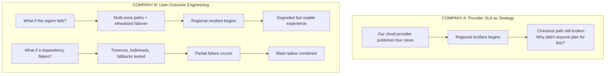
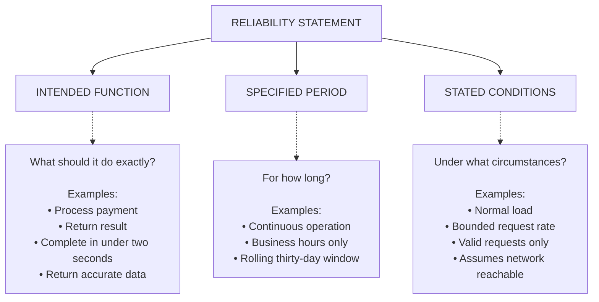
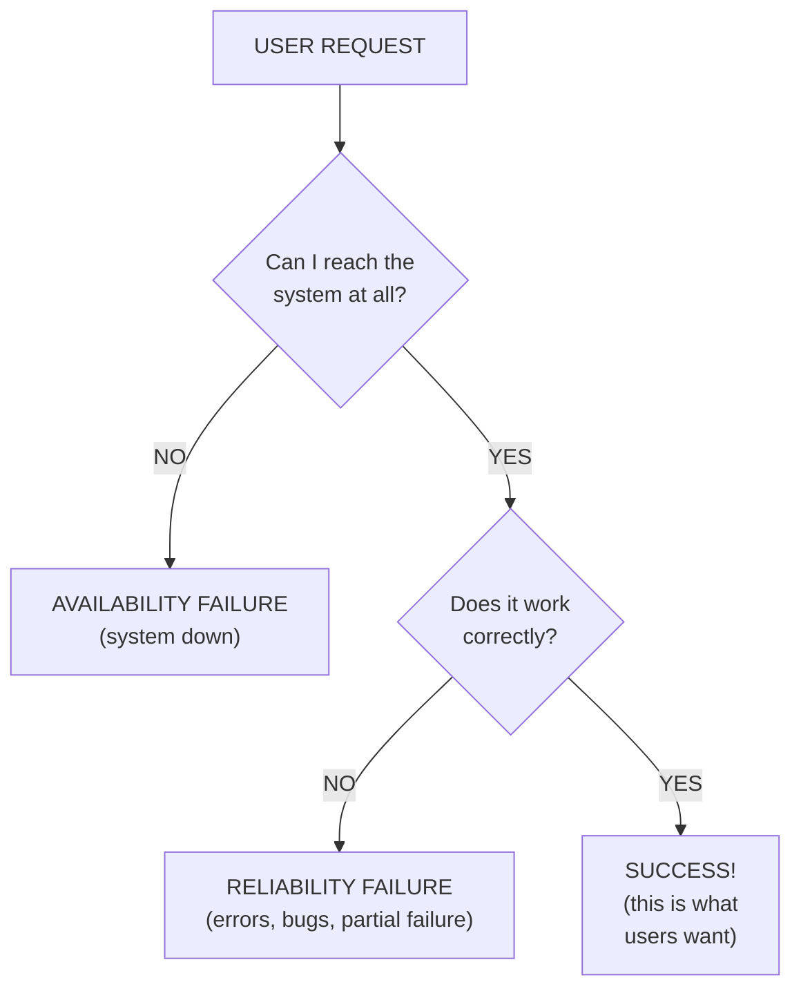
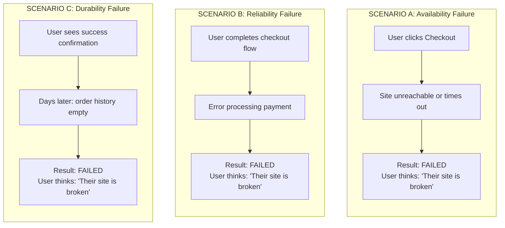
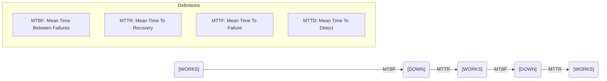
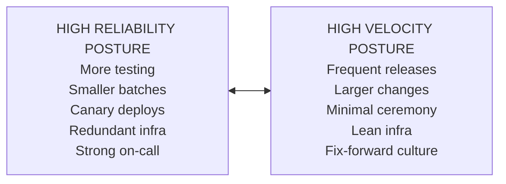
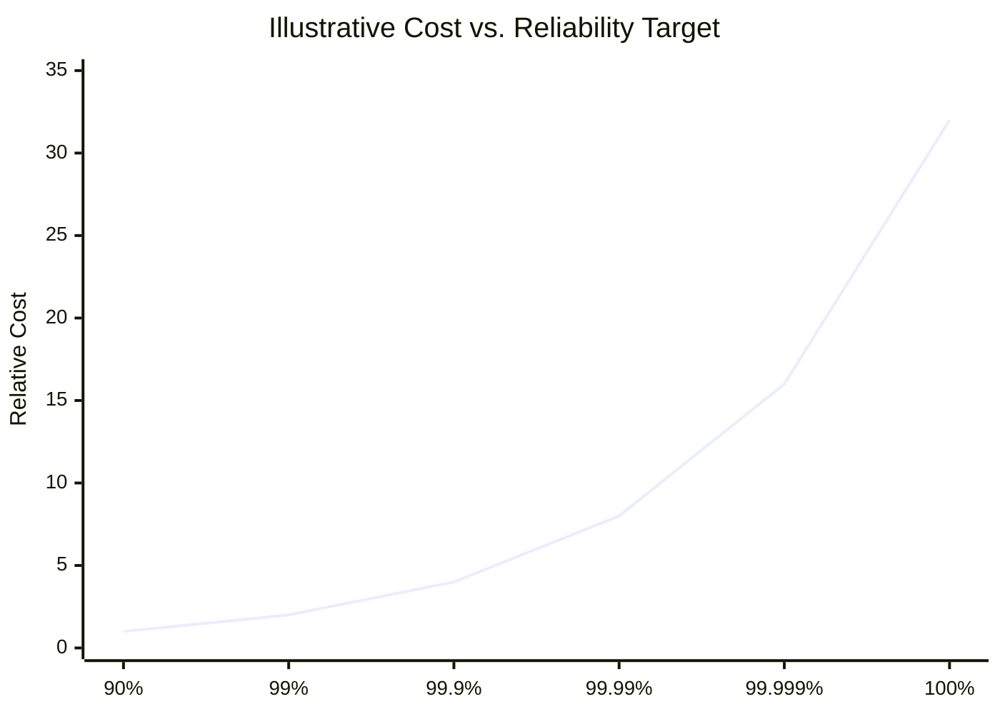
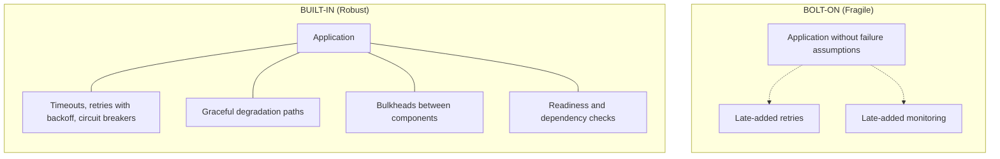

> **Complexity**: `[MEDIUM]`
>
> **Time to Complete**: 35-40 minutes
>
> **Prerequisites**: [Systems Thinking Track](/platform/foundations/systems-thinking/) (recommended)
>
> **Track**: Foundations

## When Cloud Dependencies Fail

**Hypothetical scenario:** The following narrative is a composite teaching example. It combines patterns documented in public post-mortems from multi-tenant SaaS platforms during peak-traffic events, but it does not describe one specific company's outage. Dollar figures and timelines are illustrative, not claims about any particular vendor or customer.

Two online retailers share the same cloud region and the same headline availability figure from their provider. During a regional control-plane incident, both lose direct access to managed load balancers and object storage for roughly ninety minutes. Company A treated the provider's monthly uptime percentage as proof that dependency failure was "someone else's problem." Company B spent years asking a different question: what happens to checkout, authentication, and media delivery when this region misbehaves? They built multi-zone failover paths, rehearsed regional evacuation, and validated graceful degradation with game days.

When the incident arrives, Company A discovers that "the cloud is up" and "our product works for users" are not the same statement. DNS resolves, health checks pass on empty backends, and dashboards stay green while customers cannot complete purchases. Company B routes traffic to a warm secondary region, serves cached catalog data with clear stale indicators, and queues write-heavy operations until the primary region recovers. Neither team enjoys the outage, but only one engineered for the failure mode users actually experience.


```mermaid
flowchart TD
    subgraph Company_A ["COMPANY A: Provider SLA as Strategy"]
        A1["Our cloud provider publishes four nines"] --> A2["Regional incident begins"]
        A2 --> A3["Checkout path still broken<br/>'Why didn't anyone plan for this?'"]
    end

    subgraph Company_B ["COMPANY B: User-Outcome Engineering"]
        B1["What if the region fails?"] --> B2["Multi-zone paths + rehearsed failover"]
        B2 --> B3["Regional incident begins"]
        B3 --> B4["Degraded but usable experience"]
        
        B5["What if a dependency flakes?"] --> B6["Timeouts, bulkheads, fallbacks tested"]
        B6 --> B7["Partial failure occurs"]
        B7 --> B8["Blast radius contained"]
    end
```

Company B's posture — rehearsed failover, tested fallbacks, and contained blast radius — is exactly the discipline that [chaos engineering](../../disciplines/reliability-security/chaos-engineering/module-1.1-chaos-principles/) formalizes by deliberately injecting failures before they happen for real. The lesson for this foundations module is structural: reliability is something you design before the incident, not something you negotiate during it.

---

## What You'll Be Able to Do

By the end of this module, you will be able to:

1. **Explain** the difference between availability, durability, and reliability and why each requires distinct engineering strategies
2. **Evaluate** a system's reliability posture by identifying single points of failure and hidden dependencies
3. **Design** reliability requirements for a service by mapping user expectations to concrete engineering constraints
4. **Analyze** why five nines of availability is exponentially harder to achieve than three nines
5. **Navigate** the reliability versus velocity trade-off using error budgets and SLO-based decision making

---

## Why This Module Matters

Your users do not care about your architecture diagram, your service mesh, or how many microservices you operate. They care about a single outcome: when they click, submit, pay, or upload, does the system do the right thing in a reasonable time? That question sounds simple until you try to answer it consistently across teams, dashboards, and executive reviews. Without shared definitions, one engineer celebrates "no outages this month" while another points at thousands of failed transactions—and both are looking at real data that tells incompatible stories about the same product.

Reliability engineering exists to replace hope with measurable intent. Instead of debating whether the payment API is "fine," you specify what success means (correct completion within a latency bound), over what window (rolling thirty days), under which load (normal traffic, excluding abuse), and how much failure is acceptable (an error budget derived from an SLO). That precision turns reliability from a vibe into a design constraint you can staff, fund, and improve the same way civil engineers specify load ratings for a bridge.

Consider what "99% reliable" actually means in calendar time. At ninety-nine percent availability, a system can be unavailable for roughly three and a half days per year, seven hours per month, or fourteen minutes per day—depending on how you annualize the math. For a revenue-critical workflow, those minutes map directly to lost transactions; for emergency coordination tools, they map to moments when people cannot reach help. The numbers are not abstract; they are the vocabulary executives and engineers must share before anyone promises "high availability" in a contract.

This module teaches you to think about reliability systematically: define the user-visible function, measure success and failure with appropriate metrics, understand why each additional nine demands disproportionate effort, and use error budgets to balance shipping speed against stability. You will work through availability versus reliability versus durability, MTBF and MTTR, nines arithmetic, and the reliability–velocity trade-off—the foundations every later module in this track builds on.

Reliability engineering also connects to organizational incentives in ways pure uptime dashboards hide. When teams are rewarded only for feature output, reliability work becomes invisible until an incident makes headlines. When teams share error budgets, reliability improvements become as discussable as roadmap items: faster rollback, better dependency isolation, and clearer SLOs are not "ops chores" but budget-preserving investments. Establishing that vocabulary early prevents the common pattern where reliability is everyone’s responsibility in theory and nobody’s priority until customers leave.

You will reuse these definitions throughout the Platform Engineering track. Observability modules ask what to measure; failure-mode modules ask what can break; SLO modules ask how much failure to allow; SRE discipline modules ask who acts when budget burns. Each step assumes you can state what "working" means for your users—this module supplies that anchor.

> **The Bridge Analogy**
>
> Civil engineers do not say "we hope this bridge does not collapse." They calculate loads, specify materials, add safety factors, and design for credible failure scenarios such as a snapped cable or extreme wind. They know what happens when a component fails because they modeled it before opening the bridge to traffic.
>
> Software reliability engineering applies the same discipline to digital systems: enumerate failure modes, design containment and recovery, measure outcomes from the user's perspective, and accept that perfect uptime is neither achievable nor always desirable. The question is not "will it fail?" but "how will it fail, what will users experience, and how fast can we restore correct behavior?"

---

## Part 1: Defining Reliability

### 1.1 What Does "Reliable" Mean?

Every engineering organization eventually has the same hallway conversation: a product manager asks whether the system is reliable, one engineer cites uptime, another cites error rates, and nobody can agree because "reliable" was never defined. The payment service might accept connections all month while returning errors on a fraction of transactions; support tickets spike even though the infrastructure dashboard looks green. Precision fixes this argument by forcing everyone to describe success the same way before debating whether you met it.

**Reliability** is [the probability that a system performs its intended function for a specified period under stated conditions](https://csrc.nist.gov/glossary/term/reliability). That definition looks academic until you decompose it. "Intended function" means the user-visible outcome, not "the pod is running." "Specified period" might be a rolling thirty-day window or a business-hours calendar—pick one and document it. "Stated conditions" captures load, input validity, and dependency health assumptions so you do not accidentally promise impossible behavior during a regional disaster.


```mermaid
flowchart TD
    R["RELIABILITY STATEMENT"]
    R --> F["INTENDED FUNCTION"]
    R --> P["SPECIFIED PERIOD"]
    R --> C["STATED CONDITIONS"]
    
    F -.-> F1["What should it do exactly?<br/><br/>Examples:<br/>• Process payment<br/>• Return result<br/>• Complete in under two seconds<br/>• Return accurate data"]
    P -.-> P1["For how long?<br/><br/>Examples:<br/>• Continuous operation<br/>• Business hours only<br/>• Rolling thirty-day window"]
    C -.-> C1["Under what circumstances?<br/><br/>Examples:<br/>• Normal load<br/>• Bounded request rate<br/>• Valid requests only<br/>• Assumes network reachable"]
```

Vague slogans hide disagreement; precise statements expose it early when fixing requirements is cheap. Compare "the system is reliable" with "the system successfully completes ninety-nine point nine percent of valid checkout requests within two seconds, measured over a rolling thirty-day window, under normal load up to one thousand transactions per second." The second version tells observability engineers what to measure, tells product what to promise, and tells on-call what counts as a breach.

| Vague | Precise |
|-------|---------|
| "The system is reliable" | "The system successfully processes 99.9% of valid requests within 2 seconds" |
| "High availability" | "Available 99.95% of the time, measured monthly" |
| "Data is safe" | "Annual object-durability target with documented replication policy" |
| "Fast enough" | "95th percentile latency under 200ms under stated load" |

When you draft a reliability requirement, walk the three components explicitly. Intended function: what user outcome counts as success? Specified period: over what horizon do you judge success—incident to incident, calendar month, rolling window? Stated conditions: what load, inputs, and dependency assumptions apply, and what exclusions (planned maintenance, force majeure) are documented? If any component is missing, two teams will measure different things and both will believe they are right.

Operationalizing the definition requires choosing measurement points that mirror user experience. A batch job that succeeds at 02:00 but missed its business deadline still failed the intended function for finance stakeholders, even if the process exit code was zero. A mobile client that retries silently may make server-side success rates look acceptable while users perceive sluggish failure. Reliability engineering therefore pairs the formal definition with an SLI (service level indicator) that captures good events and bad events at the boundary where users interact with the system—checkout completed, upload verified, query returned fresh data—not merely where packets leave the data center.

Good requirements also specify how partial success is classified. If nine of ten microservices in a checkout chain succeed but payment capture fails, was the request reliable? Most products answer no, which implies you need end-to-end instrumentation rather than a green checklist per component. That end-to-end lens is what separates reliability engineering from infrastructure monitoring: the latter tells you whether pods restarted; the former tells you whether customers accomplished their goals.

> **Pause and predict**: If you optimize purely for uptime (availability), what user experience issues might you miss even when servers appear healthy?

### 1.2 Reliability vs. Availability vs. Durability

These three terms appear interchangeably in slide decks, yet they answer different questions and require different engineering tactics. Confusing them leads to classic failure modes: celebrating green infrastructure metrics while customers cannot complete workflows, or promising data safety based on uptime alone. Learning to separate the dimensions is one of the highest-leverage distinctions in this entire track.

| Concept | Question It Answers | Measures | Example |
|---------|---------------------|----------|---------|
| **Reliability** | "When I use it, does it work?" | Success rate of intended function | "99.9% of checkout requests succeed end-to-end" |
| **Availability** | "Can I reach it right now?" | Proportion of time the system is operational | "Service endpoints respond to health checks 99.99% of the month" |
| **Durability** | "Will my data still exist tomorrow?" | Probability that stored data survives over time | "Extremely low expected rate of object loss per year" |


```mermaid
flowchart TD
    UR["USER REQUEST"] --> Q1{"Can I reach the<br/>system at all?"}
    Q1 -->|NO| AF["AVAILABILITY FAILURE<br/>(system down)"]
    Q1 -->|YES| Q2{"Does it work<br/>correctly?"}
    Q2 -->|NO| RF["RELIABILITY FAILURE<br/>(errors, bugs, partial failure)"]
    Q2 -->|YES| S["SUCCESS!<br/>(this is what<br/>users want)"]
```

Availability failures are blunt: connection refused, load balancer returning no healthy backends, DNS failing to resolve. Reliability failures are subtler: HTTP 200 responses with wrong data, checkout succeeding while inventory reservation fails, or success paths that violate latency expectations users treat as failure. Durability failures may not appear at request time at all—you discover them days later when an object, log segment, or backup is missing despite months of green uptime charts.

```mermaid
quadrantChart
    title Reliability vs Availability Matrix
    x-axis Low Availability --> High Availability
    y-axis Low Reliability --> High Reliability
    quadrant-1 IDEAL (Works great when reachable)
    quadrant-2 FLAKY (Great when up, often unreachable)
    quadrant-3 WORST (Down and wrong)
    quadrant-4 UNRELIABLE (Always up, frequently wrong)
```

Real systems occupy every quadrant. An API that responds quickly but returns errors five percent of the time is highly available yet unreliable—users experience a broken product while operators argue about semantics. A batch system with weekly maintenance windows may show lower availability while exhibiting excellent reliability during operating hours. The worst quadrant combines both: unreachable often and wrong when reachable. Your observability stack needs signals for each dimension, not a single ping check.

Durability is orthogonal to whether the front door opens. Object storage can be temporarily unavailable while replicas remain intact; conversely, a writable system can lose data through application bugs, misconfigured lifecycle rules, or storage corruption even while availability metrics look fine. [Amazon S3 documents durability separately from availability](https://docs.aws.amazon.com/AmazonS3/latest/userguide/DataDurability.html): extremely low expected object-loss rates achieved through replication and integrity checking across facilities, which is not the same guarantee as "you can always download immediately."

When object storage has a regional impairment, durability means your bits still exist; availability means you might not fetch them until control planes recover. Product messaging should not conflate "we could not read your file for an hour" with "your file was deleted." Users hear both as failure, but engineers remediate them with different playbooks—failover versus restore-from-replica versus forensic recovery.

Engineering tactics differ by dimension as well. Improving availability often means redundancy, health checks, and fast failover paths. Improving reliability often means better testing, idempotent handlers, dependency timeouts, and eliminating silent partial writes. Improving durability means replication, checksums, backup verification, and lifecycle policies that prevent accidental deletion. A roadmap that only adds servers addresses one leg of the stool while leaving data-corruption or logic-error risks untouched—common in teams that celebrate infrastructure uptime while support tickets about "random errors" climb.

Contract language mirrors the distinction. An availability SLA might reference monthly uptime of a public endpoint; a durability commitment might reference annual expected object survival; a reliability-oriented SLO might reference successful completion of named user journeys. Mixing those promises in one vague "uptime guarantee" creates legal and engineering debt simultaneously. When you review vendor or internal commitments, highlight which dimension each clause actually protects so on-call engineers know which runbook applies when metrics move.

### 1.3 The User's Perspective

From the user's perspective, reliability collapses to a single question: did I get what I came for? They do not classify failures into availability, reliability, or durability taxonomies—they experience frustration, retry, abandon carts, or switch vendors. That emotional outcome is why teams must measure all three engineering dimensions even though users hear one story.


```mermaid
flowchart TD
    subgraph Scenario_A ["SCENARIO A: Availability Failure"]
        direction TB
        A1["User clicks Checkout"] --> A2["Site unreachable or times out"]
        A2 --> A3["Result: FAILED<br/>User thinks: 'Their site is broken'"]
    end

    subgraph Scenario_B ["SCENARIO B: Reliability Failure"]
        direction TB
        B1["User completes checkout flow"] --> B2["Error processing payment"]
        B2 --> B3["Result: FAILED<br/>User thinks: 'Their site is broken'"]
    end

    subgraph Scenario_C ["SCENARIO C: Durability Failure"]
        direction TB
        C1["User sees success confirmation"] --> C2["Days later: order history empty"]
        C2 --> C3["Result: FAILED<br/>User thinks: 'Their site is broken'"]
    end
```

Scenario thinking helps during incident triage. If users cannot connect, start with routing, DNS, load balancers, and regional health. If they connect but errors spike, inspect recent deploys, dependency timeouts, and data correctness paths. If symptoms arrive late, trace write pipelines, replication lag, backup coverage, and retention policies. The fix for a durability defect is not "restart the API"—it is forensic recovery and prevention of silent data loss.

When you **evaluate** reliability posture, map hidden dependencies the same way. A service may appear redundant while sharing a single database cluster, certificate, feature flag provider, or identity vendor. Single points of failure often live outside the diagram box labeled "our code." Dependency graphs and game days exist to surface those couplings before a vendor incident turns them into user-visible outages.

> **Try This (2 minutes)**
>
> Pick an app you use daily and recall a time it failed you. Was the failure primarily availability (could not connect), reliability (connected but the action failed), or durability (data vanished or never persisted)? Write one sentence on how you reacted—retry, abandon, switch competitor—because that reaction is the business cost your SLO must justify preventing.

---

## Part 2: Measuring Reliability

> **Stop and think**: Why is moving from 99.9% to 99.99% usually harder than moving from 99% to 99.9%, even though both steps add "one nine" in conversation?

### 2.1 The Nines

Engineers shorthand reliability targets as "nines"—three nines, four nines, five nines—referring to the number of nines after the decimal in a percentage. The language is convenient in executive meetings but dangerous without downtime math attached, because each nine removes an order of magnitude from allowed failure time. [Google's SRE book emphasizes tying nines to error budgets and realistic operational cost](https://sre.google/sre-book/embracing-risk/) rather than treating them as marketing badges.

| Nines | Percentage | Error Rate | Downtime/Year | Downtime/Month | Downtime/Day |
|-------|------------|------------|---------------|----------------|--------------|
| One nine | 90% | 10% | 36.5 days | 3 days | 2.4 hours |
| Two nines | 99% | 1% | 3.65 days | 7.3 hours | 14 minutes |
| Three nines | 99.9% | 0.1% | 8.76 hours | 43.8 minutes | 1.4 minutes |
| Four nines | 99.99% | 0.01% | 52.6 minutes | 4.4 minutes | 8.6 seconds |
| Five nines | 99.999% | 0.001% | 5.26 minutes | 26.3 seconds | 0.86 seconds |
| Six nines | 99.9999% | 0.0001% | 31.5 seconds | 2.6 seconds | 86 ms |

The table exposes why **five nines is exponentially harder than three nines** in operational terms, not merely "a bit better." Three nines allows roughly forty-four minutes of downtime per month; five nines allows roughly twenty-six seconds. That is not a linear tightening—it is two orders of magnitude less failure budget. Incidents measured in minutes, which are normal for human-driven response, consume months of five-nines budget in a single event unless detection and recovery are largely automated.

Each additional nine also attacks a smaller, weirder tail of failures. The first improvements catch obvious bugs, missing timeouts, and single-zone deployments. Later improvements chase rare race conditions, dependency combinations nobody tested, and cosmic-ray-style events you previously ignored because they were below measurement noise. Cost rises because you pay for redundancy, tooling, on-call coverage, and opportunity cost of slower change—while the remaining defects become harder to find.

```text
WHY EACH NINE COSTS MORE (ILLUSTRATIVE)
═══════════════════════════════════════════════════════════════════════════════

99%      Basic monitoring, some automation, single-site deployment
99.9%    Redundant components, on-call rotation, runbooks
99.99%   Multi-zone architecture, fast rollback, game days
99.999%  Multi-region paths, aggressive automation, strict change control

Going from 99% → 99.9% removes ninety percent of remaining failure budget.
Going from 99.9% → 99.99% removes ninety percent again—from a smaller pool.
Going from 99.99% → 99.999% repeats the pattern on an already-rare tail.
```

When you **analyze** nines targets, start from user harm and work backward, not from competitor slogans forward. An internal admin tool and a patient-critical workflow should not share the same table row by default. The right target is the highest level you can sustain with demonstrated detection, mitigation, and error-budget policy—not the highest number that sounds impressive in a slide.

Translate nines into actionable budgets for your traffic shape. A service handling a billion requests per month at three nines can still fail millions of requests and remain within target—those failures must be distributed, visible, and acceptable to product. At five nines the allowable failed requests plummets; you either reduce raw failure count through quality and architecture or shrink scope (fewer dependencies, simpler paths, stronger defaults). Teams that skip this arithmetic often discover too late that their on-call roster and automation level cannot possibly defend the number in the contract.

Multi-window, multi-burn-rate alerting (covered in depth in later SRE modules) exists because a single monthly nines figure hides dangerous short bursts. You might be "within SLA" on a thirty-day chart while burning an entire quarter's budget in one afternoon during a deploy gone wrong. Reliability measurement therefore combines long-window targets with short-window guardrails so teams cannot accidentally spend budget faster than they can detect it.

### 2.2 Key Reliability Metrics

Beyond nines shorthand, four metrics anchor day-to-day reliability work: MTBF (mean time between failures), MTTR (mean time to recovery), MTTF (mean time to failure for non-repairable components), and MTTD (mean time to detect). Together they describe how often you fail and how long users suffer when you do—quantities you can trend, alert on, and improve with targeted investments.


```mermaid
flowchart LR
    W1("[WORKS]") -- "MTBF" --> D1("[DOWN]")
    D1 -- "MTTR" --> W2("[WORKS]")
    W2 -- "MTBF" --> D2("[DOWN]")
    D2 -- "MTTR" --> W3("[WORKS]")
    
    subgraph Definitions
        direction TB
        M1["MTBF: Mean Time Between Failures"]
        M2["MTTR: Mean Time To Recovery"]
        M3["MTTF: Mean Time To Failure"]
        M4["MTTD: Mean Time To Detect"]
    end
```

**MTBF** answers how frequently failures occur in a defined period. Calculate it as total operating time divided by number of failures during that window. If a service runs seven hundred twenty hours in a month with four incidents, MTBF is one hundred eighty hours between incidents on average—useful for capacity planning and comparing architectures, though only meaningful when "failure" is defined consistently.

**MTTR** captures total time from failure start to restored correct behavior, often decomposed into detect, diagnose, and repair segments. **MTTD** is frequently the hidden killer: if you only learn about failure from customer tweets, MTTR includes minutes or hours of silent user pain even when repair itself is fast. Investing in synthetic checks, SLO-based alerting, and clear ownership shrinks MTTD and often delivers faster user-visible wins than trying to prevent every possible bug.

Availability relates to MTBF and MTTR through a classic approximation:

```text
              MTBF
Availability ≈ ────────────
              MTBF + MTTR
```

If MTBF is two hundred fifty hours and MTTR is two hours, availability is roughly ninety-nine point two percent—matching intuition that shorter outages improve uptime even when failure frequency stays constant. Many teams discover they can improve user outcomes faster by cutting MTTR with automated rollback, better runbooks, and feature flags than by chasing mythical zero-defect releases.

Consider a worked example that mixes units carefully—the kind of mistake that appears in incident reviews. Suppose a service operated seven hundred twenty hours in a month and experienced four user-visible incidents totaling two hundred minutes of impaired behavior. MTBF measured in hours between incidents is seven hundred twenty divided by four, or one hundred eighty hours. MTTR as average incident duration is two hundred divided by four, or fifty minutes—convert to hours (about zero point eight three) before plugging into the availability approximation if you want consistent units: one hundred eighty divided by one hundred eighty point eight three yields roughly ninety-nine point five percent availability from that formula alone. Compare that with success-rate reliability computed from requests: if twelve thousand of ten million requests failed, success rate is ninety-nine point eight eight percent. The two numbers differ because not every failed request coincided with formal incident boundaries, and not every minute of incident time blocked all traffic. That gap is normal; the lesson is to pick one primary user-facing SLI and derive MTBF or MTTR diagnostics as supporting signals rather than mixing formulas without context.

MTTF applies to components you replace rather than repair—SSD wear, disposable workers, or canary instances you discard after a test pass. MTTD deserves explicit dashboards: time from first user impact to first page, time from page to owner acknowledgement, and time from acknowledgement to mitigation start. Teams that only optimize MTTR after detection silently waste budget during the detection gap. Synthetic probes and black-box checks aligned to SLIs shrink that gap by measuring what users would experience from outside the cluster.

> **The MTTR Revelation**
>
> Preventing every failure is hard; recovering quickly is often more tractable. Compare two paths from roughly ninety-nine percent toward ninety-nine point nine percent: tenfold increase in MTBF versus tenfold decrease in MTTR. Both move the formula, but automated detection, safe rollbacks, and practiced incident response frequently cost less than eliminating every tail-risk bug in a large codebase. Strong teams optimize both—and measure MTTD separately so they do not confuse "fast fix after we noticed" with "fast fix after users suffered."

### 2.3 Error Budgets

An **error budget** is the acceptable unreliability implied by your SLO—the gap between perfect and your target over a measurement window. [Google's SRE materials frame error budgets as the mechanism that aligns reliability with product velocity](https://sre.google/sre-book/embracing-risk/): when budget remains, teams can take thoughtful release risk; when budget is exhausted, engineering focus shifts to stability until trust is rebuilt.

If your SLO is ninety-nine point nine percent over thirty days, the error budget is zero point one percent of that window—roughly forty-three minutes of equivalent failure budget per month, depending on how you convert failed requests versus hard downtime. Budget is consumable: incidents, bad deploys, dependency outages, and experiments that violate the SLO all spend it. Healthy organizations track remaining budget the way finance tracks cash—transparently, with agreed policies for what happens in each zone.

```text
ERROR BUDGET POLICY (ILLUSTRATIVE ZONES)
═══════════════════════════════════════════════════════════════════════════════

>50% remaining   Ship features; calculated release risk acceptable
25–50%          Increase test rigor; reduce batch size of changes
<25%            Warning zone—defer risky launches; prioritize fixes
0% or negative  Feature freeze; focus on reliability until budget resets
```

Error budgets change arguments from "ops versus dev" to shared data. Instead of "never deploy on Fridays" folklore, teams ask whether remaining budget can afford the expected blast radius of a change—and whether mitigation (canaries, rollbacks) is ready. When you **navigate** the reliability versus velocity trade-off, the budget is the negotiated currency: velocity spends it; reliability work earns it back.

Security patches and compliance fixes still ship when budget is low, but the conversation becomes explicit: breaking the SLO is a conscious leadership decision with documented risk, not an accidental byproduct of sprint pressure. That distinction preserves trust with customers and prevents silent SLA erosion.

Budget accounting also forces honesty about planned work. Maintenance windows, experimental flags, and canary populations all consume reliability headroom. Teams that hide downtime in synthetic "user impact zero" labels while customers suffer degrade the entire framework. Conversely, teams that treat any single failed request as catastrophic cannot ship learning experiments. Error budgets sit in the middle: finite permission to fail, tracked openly, reset on a known cadence so product and engineering share the same calendar for risk-taking.

Connecting budgets to prioritization makes reliability work fundable. When burn rate spikes because of flaky dependencies, leadership can see that feature freezes are not punitive caprice—they are the agreed consequence of depleted budget. When budget is healthy, the same leaders can defend aggressive roadmaps to stakeholders because the data shows headroom. Without that visibility, organizations oscillate between reckless speed and panic freezes, never stabilizing into sustainable delivery.

> **Stop and think**: If a team has zero error budget left but must ship a critical security fix, what guardrails should be mandatory before the deploy button is pressed?

---

## Part 3: The Reliability Trade-offs

### 3.1 Reliability vs. Velocity

Every product organization faces a tension between moving fast and staying stable. Maximum velocity without guardrails produces incident debt; maximum reliability without delivery produces competitors winning your market while you polish dashboards. The goal is not to pick a permanent side—it is to choose context-appropriate balance and make trade-offs visible rather than political.


```mermaid
flowchart LR
    R["HIGH RELIABILITY POSTURE<br/>More testing<br/>Smaller batches<br/>Canary deploys<br/>Redundant infra<br/>Strong on-call"] <--> V["HIGH VELOCITY POSTURE<br/>Frequent releases<br/>Larger changes<br/>Minimal ceremony<br/>Lean infra<br/>Fix-forward culture"]
```

Several forces create the trade-off structurally. Every deployment is a risk injection: more changes per day mean more surface area for regressions unless detection and rollback are excellent. Every feature adds code paths and failure modes; reliability work often simplifies or contains that surface. Thorough testing increases confidence but consumes calendar time. Redundancy and multi-region architectures cost money and operational attention. None of these constraints disappear because leadership prefers one slogan over another.

Release engineering practices translate the abstract trade-off into daily choices. Trunk-based development with feature flags preserves velocity while limiting blast radius; long-lived branches with quarterly merges optimize for review depth at the cost of integration risk. Canary analysis and automated rollback let teams spend error budget on experiments with a defined ceiling on damage. Manual change-advisory boards slow throughput but produce audit trails valued in regulated sectors. Reliability engineering does not mandate one release religion—it demands that chosen practices be honest about the reliability cost they impose and measurable against the SLOs they protect.

When product pressure intensifies near deadlines, error budgets supply a constructive answer to "Can we skip the soak test?" Skip tests if remaining budget and rollback readiness justify the risk; do not skip because the launch date is printed on swag. Likewise, when reliability engineers request a freeze, they should point to burn rate and projected breach date, not personal discomfort with change. That shared vocabulary keeps **navigate** the reliability versus velocity trade-off from collapsing into tribal conflict between "movers" and "blockers."

| Posture | When It Fits | Risk If Overapplied |
|---------|--------------|---------------------|
| Velocity-first | Early product discovery, internal tools, reversible decisions | Incident debt, customer churn, SLA penalties |
| Balanced | Most consumer and B2B SaaS with clear SLOs | Requires discipline; fake metrics erode trust |
| Reliability-first | Safety-critical, regulated, or high-trust domains | Slow delivery; opportunity cost if market moves |

### 3.2 Context Determines Trade-offs

The right balance depends on consequences of failure, not on engineering aesthetics. Pacemaker firmware and airline control systems justify multi-year release cadences and exhaustive verification because errors can cost lives. Retail checkout platforms often target high but not maximal availability because minutes of degraded service during a game day rehearsal may be cheaper than months of delayed features—provided degradation is controlled and communicated.

When you **design** reliability requirements, translate user expectations into constraints the team can implement: maximum acceptable checkout failure rate, maximum latency at a percentile, recovery time objective after regional loss, and data retention guarantees. Those constraints should appear in design docs, dashboards, and release checklists—not only in sales PDFs. Hidden promises become SLA credits and churn; explicit promises become engineering backlogs with owners.

Platform teams scale this translation by providing golden paths: service templates with default timeouts, observability hooks, and rollout strategies that already match organizational SLOs. Product teams inherit guardrails instead of reinventing reliability per repository. That does not remove trade-offs—it makes defaults explicit so exceptions require justification. A team requesting exemption from canary deploys or multi-AZ baseline should document which user outcome benefits and how residual risk is measured.

Regulated environments add auditability to the trade-off. Change boards, separation of duties, and evidence of testing are themselves latency in the delivery pipeline—but that latency buys demonstrable control. Consumer SaaS with rapid experimentation accepts higher change frequency with automated rollback. Neither culture is universally "correct"; mismatches occur when a regulated playbook is applied to a prototype or when a startup deploy culture is imported into life-safety software. Reliability engineering includes naming which regime you are in and aligning velocity expectations accordingly.

### 3.3 The 100% Reliability Myth

Perfect reliability is not a realistic design target for distributed systems connected to humans and the public internet. Hardware fails, networks partition, certificates expire, vendors have regional impairments, and people merge the wrong change at the wrong time. Pursuing one hundred percent as a literal goal encourages hiding risk, skipping measurement, and blaming users when reality intrudes.


```mermaid
xychart-beta
    title "Illustrative Cost vs. Reliability Target"
    x-axis ["90%", "99%", "99.9%", "99.99%", "99.999%", "100%"]
    y-axis "Relative Cost" 0 --> 35
    line [1, 2, 4, 8, 16, 32]
```

Cost rises faster than linearly as targets tighten; at some point another nine buys less user value than the features or cost savings foregone. Mature organizations choose **achievable** targets, invest in fast detection and recovery, and practice failure regularly so residual risk is understood rather than denied.

> **Hypothetical scenario: The Ambitious SLA**
>
> A team promises four nines in a customer contract while average incident detection still takes many minutes and mitigation is manual. Monthly error budget at four nines is only a few minutes—far less than a single typical incident duration. The math does not fail quietly; it fails expensively through SLA credits, emergency hiring, and customer trust damage. The lesson: set external commitments to match demonstrated operational capability, then improve capability and tighten targets with evidence—not the reverse.

Dependencies can also be "too reliable" in the sense that silent assumptions form. If a lock service never blips, applications may never implement timeouts or fallbacks; the first real outage then becomes catastrophic. Controlled failure injection and rehearsed dependency loss turn unknown unknowns into engineered behavior—topics you will deepen in later modules on failure modes and redundancy.

---

## Part 4: Reliability as a Practice

### 4.1 Reliability is Not a Feature

Teams sometimes treat reliability as a phase: ship features now, harden later. That sequencing produces systems where retries, circuit breakers, and observability are bolted onto architectures that assume happy paths. Bolt-on reliability fights the grain of the design; built-in reliability embeds timeouts, bulkheads, idempotency, and health checks at boundaries where external uncertainty enters.


```mermaid
flowchart TD
    subgraph Approach_A ["BOLT-ON (Fragile)"]
        direction TB
        A_APP["Application without failure assumptions"]
        A_APP -.-> A_RETRY["Late-added retries"]
        A_APP -.-> A_MON["Late-added monitoring"]
    end

    subgraph Approach_B ["BUILT-IN (Robust)"]
        direction TB
        B_APP["Application"]
        B_APP --- B_EXT["Timeouts, retries with backoff, circuit breakers"]
        B_APP --- B_DEG["Graceful degradation paths"]
        B_APP --- B_BULK["Bulkheads between components"]
        B_APP --- B_HEALTH["Readiness and dependency checks"]
    end
```

Reliability as practice means asking the five questions during design review, not only during post-incident review: what can fail, how will we know, how will we recover, how do we prevent recurrence, and what is the blast radius? When those questions have written answers before launch, on-call inherits a system that fails gracefully instead of mysteriously.

Those questions also guide code review checklists in mature organizations. Does this change introduce a new external call without a timeout? Does it bypass idempotency keys on retried writes? Does it assume a dependency is always healthy? Does it expand blast radius by sharing a thread pool with unrelated traffic? Negative answers do not always block merge—they trigger explicit risk acceptance or follow-up tickets with owners. The habit converts reliability from heroic incident response into repeatable design scrutiny that scales with team growth.

> **Try This (3 minutes)**
>
> Pick one service you know. List the top three dependencies it assumes are always available. For each, write one sentence describing user impact if that dependency fails and whether you have a tested fallback. Gaps you find are candidates for your first reliability backlog—often higher leverage than chasing another nine on paper.

### 4.2 The Reliability Mindset

Reliability engineers assume failure is normal and design for transparent degradation. They prefer measurable SLOs over green dashboards, end-to-end success metrics over single-component CPU graphs, and rehearsed response over heroics. They treat near-misses as free lessons because the next incident will not schedule itself during business hours.

Compare reactive and proactive postures without pretending one is always superior. Reactive firefighting is necessary when unknowns surface; proactive game days, capacity planning, and architecture reviews reduce unknowns before users find them. Budget both: a team that only fires fights never reduces frequency; a team that only plans never learns from production's messy reality.

Organizational signals reinforce the mindset. Blameless post-incident reviews that produce tracked action items increase MTBF over quarters by removing recurring triggers. Error-budget policy meetings that include product and engineering leadership prevent silent erosion of standards. On-call health metrics—pages per engineer, after-hours churn, repeat incidents—indicate whether reliability work is underfunded. A team paging nightly for the same dependency timeout is telling leadership that reliability debt exceeds velocity gains from ignoring the dependency.

Finally, reliability practice extends to customer communication. Status pages, incident updates, and realistic maintenance notices do not change MTTR by themselves, but they change perceived reliability: users tolerate known, bounded failure better than mysterious silence. Engineering metrics and communication metrics together shape trust—the ultimate user-facing measure of whether your system is "reliable enough" for them to keep building on it.

### 4.3 Reliability Anti-patterns

| Anti-pattern | Why It Seems Reasonable | Why It Fails | Better Approach |
|--------------|------------------------|--------------|-----------------|
| **"It won't fail"** | "It has been stable for months" | Past stability does not guarantee future behavior under change and load | Design for failure; test recovery paths |
| **"We'll fix in prod"** | "Speed matters more" | Users become the test environment; incidents multiply | Shift risk left with tests and canaries |
| **"More redundancy = more reliable"** | "Two of everything" | Split-brain and complexity introduce new failures | Model failure modes; add redundancy deliberately |
| **"Users will retry"** | "Retries are easy for clients" | Retry storms amplify outages; UX still suffers | Handle retries server-side with backoff |
| **"Tests passed"** | "CI is green" | Tests cover known paths only | Monitor production SLOs; practice chaos |
| **"The cloud handles it"** | "Vendor SLAs exist" | You still own user outcomes | Plan for provider and regional failure |

---

## Did You Know?

- [**Reliability engineering matured as a formal discipline in mid-twentieth-century aerospace and military electronics programs**](https://en.wikipedia.org/wiki/Reliability_engineering), long before cloud native platforms existed. Many software reliability practices adapt mathematics and process controls from those fields.

- [**John Musa's software reliability engineering work at Bell Labs**](https://en.wikipedia.org/wiki/John_D._Musa) applied failure-rate modeling to software defects, treating bug discovery as a measurable process rather than a purely artistic craft.

- [**Google publishes SRE guidance on error budgets and embracing risk**](https://sre.google/sre-book/embracing-risk/) that popularized the idea that some unreliability is an intentional trade-off—not always an accident—to enable sustainable release velocity.

- [**The AWS Well-Architected Reliability pillar**](https://docs.aws.amazon.com/wellarchitected/latest/reliability-pillar/welcome.html) documents cross-cutting patterns—automatic recovery, horizontal scaling, and change management—that translate abstract reliability goals into reviewable architecture decisions.

---

## Common Mistakes

| Mistake | What It Looks Like | Why It's Wrong | How to Fix It |
|---------|-------------------|----------------|---------------|
| **Measuring availability, not reliability** | "100% uptime" while error rates climb | Users fail tasks even when servers respond | Track success of user journeys, not pings alone |
| **Ignoring partial failures** | Checkout works while search is broken | Degraded experience still violates user trust | Define SLIs per critical path and composite SLOs |
| **Setting unrealistic nines targets** | "Five nines" without downtime math | Budget impossible; teams hide incidents | Anchor targets to user harm and proven MTTR |
| **Not tracking error budget** | No view of remaining SLO headroom | Velocity vs stability debates become political | Dashboard budget burn; publish policy bands |
| **Optimizing one component** | Faster database, same user errors | End-to-end reliability is what users feel | Measure from edge; use synthetic transactions |
| **Treating MTTR as immutable** | "Incidents just take an hour" | Recovery time is engineerable | Invest in MTTD, runbooks, automation |
| **Confusing SLOs and SLAs** | Internal target equals customer contract | No buffer for dependency chains | Set internal SLO stricter than external SLA |
| **Never testing failure modes** | "We have redundancy" never failovered | First real test is a crisis | Game days and controlled fault injection |

---

## Quiz

1. **Scenario: Your photo-sharing service reports 99.9% availability for the month, but support is flooded with failed-upload complaints. Deep inspection shows a 95% reliability success rate for the upload API. What are users experiencing, and why is availability alone misleading?**

<details>
<summary>Answer</summary>

Users experience a service that is almost always reachable but frequently fails to complete uploads. High availability means endpoints and infrastructure are usually up, yet ninety-five percent reliability means one in twenty upload attempts fails functionally. Users care about the combined outcome—successful upload—not whether TCP connections succeed. This scenario shows why you must **explain** availability, reliability, and durability separately instead of treating uptime as proof of quality.
</details>

2. **Scenario: Sales closes an enterprise deal promising 99.99% availability. Your team's typical incident timeline is five minutes to detect and fifteen minutes to mitigate. What is the approximate monthly error budget in minutes, and why is this contract dangerous?**

<details>
<summary>Answer</summary>

At 99.99% over a thirty-day month (roughly forty-three thousand two hundred minutes), the error budget is about four point three minutes. A single average twenty-minute incident consumes multiple months of budget and likely triggers SLA penalties. This danger illustrates why **five nines is exponentially harder than three nines** in practice: higher nines shrink budget faster than human-driven response typically allows unless detection and recovery are largely automated.
</details>

3. **Scenario: Architecture Alpha fails rarely (MTBF 500 hours) but needs thirty minutes of manual recovery (MTTR). Architecture Beta fails every 100 hours but auto-heals in five minutes. Which provides higher availability, and what lesson does that teach?**

<details>
<summary>Answer</summary>

Using availability ≈ MTBF / (MTBF + MTTR), Alpha yields about 99.90% and Beta about 99.92% despite failing five times more often. Faster recovery can dominate infrequent failure prevention—an essential MTBF and MTTR insight when prioritizing engineering investments.
</details>

4. **Scenario: A product spec says "the payment API must be 99.9% reliable." Why is this requirement unusable without revision?**

<details>
<summary>Answer</summary>

It omits the three components of a reliability statement: intended function (what counts as success—latency bound, correct side effects), specified period (rolling window vs calendar month), and stated conditions (load bounds, maintenance exclusions, dependency assumptions). Without them, teams cannot **design** reliability requirements or agree whether an edge-case failure violated the target.
</details>

5. **Scenario: On week three of the month, deployments consumed thirty-eight minutes of a forty-three point two minute error budget. Product wants a large feature release before the weekend. What should error-budget policy recommend?**

<details>
<summary>Answer</summary>

Defer the risky release until the next budget window or executive risk acceptance is documented. With only a few minutes remaining, you are in the warning zone where additional deploy risk likely breaches the SLO. Error budgets exist so teams can **navigate** the reliability versus velocity trade-off with data instead of politics—ship smaller changes or focus on reliability work until the budget resets.
</details>

6. **Scenario: Leadership asks why moving from 99.9% to 99.99% felt harder than moving from 99% to 99.9%, even though both sound like "one more nine." How do you explain the exponential difficulty?**

<details>
<summary>Answer</summary>

Each nine removes an order of magnitude from allowed failure time—roughly forty-four minutes per month at three nines versus about four minutes at four nines. You must analyze why five nines is exponentially harder than three nines: easy failures are fixed first; remaining defects are rarer and need multi-region architecture, automation, and stricter change control. Cost rises faster than user benefit unless the business truly requires that tail risk reduction.
</details>

7. **Scenario: A fast-growing startup deploys to production multiple times daily with minimal automated tests. Incidents are frequent but fixes ship quickly. A regulated enterprise client demands stricter SLOs. How should leadership reconcile velocity with the new reliability expectations?**

<details>
<summary>Answer</summary>

Introduce explicit SLOs and error budgets rather than choosing slogans. Keep cadence where budget allows; add canaries, automated rollback, and test gates when burn rate increases. The **reliability versus velocity trade-off** becomes a managed dial—velocity spends budget, reliability investments and slower batches preserve it—instead of an endless ops-versus-dev argument.
</details>

8. **Scenario: During a storage service outage, users cannot download files for two hours, but engineers confirm replicas are intact and no objects were lost. Which dimension failed, and what message should status communications emphasize?**

<details>
<summary>Answer</summary>

This is primarily an availability impairment, not a durability failure. **Explain** availability, durability, and reliability separately in customer messaging: data remains stored, retrieval is temporarily blocked, and teams are working on restore paths. Promising "nothing was lost" when you mean "nothing was deleted" prevents panic while honesty preserves trust.
</details>

---

## Hands-On Exercise

**Scenario**: You join a team as a reliability engineer. Assess last month's posture using the data below, then recommend one improvement grounded in MTBF, MTTR, or error-budget thinking.

| Metric | Value |
|--------|-------|
| Total requests | 10,000,000 |
| Failed requests (5xx errors) | 12,000 |
| Slow requests (>2s latency) | 85,000 |
| Number of incidents | 4 |
| Total incident duration | 3 hours 20 minutes (200 minutes) |
| Operating hours | 720 (full month) |

**Part 1 — Calculate metrics (15 minutes)**

Compute success rate (reliability), availability, MTBF, MTTR, and error-budget status against a 99.9% target (0.1% budget ≈ 43.2 minutes per month). Show your arithmetic in the worksheet below.

**Part 2 — Write a brief assessment (10 minutes)**

State whether the service met its target, identify the largest gap (reliability vs availability vs budget), and choose whether MTBF or MTTR deserves first investment with one sentence of justification.

**Part 3 — Bonus**

If slow requests (>2s) counted as failures, how would success rate change? Should latency belong in the SLI definition?

**Success Criteria:**
- [ ] All five core metrics calculated with shown work
- [ ] Assessment states met/not met against the 99.9% target
- [ ] MTBF vs MTTR priority chosen with justification
- [ ] One specific improvement recommended
- [ ] (Bonus) Latency impact on SLI discussed

<details>
<summary>Check Your Work — Sample Answers</summary>

1. **Success Rate** = (10,000,000 − 12,000) / 10,000,000 = **99.88%**
2. **Availability** = (720 − 3.33) / 720 ≈ **99.54%** (200 minutes downtime)
3. **MTBF** = 720 / 4 = **180 hours** between incidents
4. **MTTR** = 200 / 4 = **50 minutes** per incident
5. **Error Budget**: budget 43.2 minutes, used 200 minutes → **over budget**

**Assessment:** Targets not met; availability gap dominates; prioritize **MTTR** reduction via faster detection, runbooks, and automated rollback. Bonus: counting slow requests drops success rate to ~99.03%, showing SLI definition must include latency if users treat slowness as failure.

</details>

---

## Sources

- [NIST CSRC — Reliability](https://csrc.nist.gov/glossary/term/reliability) — Authoritative definition of reliability as probability of intended function over stated conditions.
- [Site Reliability Engineering (Google SRE Book)](https://sre.google/sre-book/table-of-contents/) — Foundational text for SRE practice, SLOs, and organizational approaches to reliability.
- [Embracing Risk — Google SRE Book](https://sre.google/sre-book/embracing-risk/) — Error budgets, risk acceptance, and balancing release velocity with reliability targets.
- [Implementing Service Level Objectives — Google SRE Workbook](https://sre.google/workbook/implementing-slos/) — Practical guidance on SLI/SLO implementation and error-budget policy.
- [AWS Well-Architected Framework — Reliability Pillar](https://docs.aws.amazon.com/wellarchitected/latest/reliability-pillar/welcome.html) — Cross-cutting reliability patterns for cloud architectures.
- [Microsoft Azure Well-Architected — Reliability](https://learn.microsoft.com/en-us/azure/well-architected/reliability/) — Reliability principles and design review guidance for Azure workloads.
- [Amazon S3 — Data Durability](https://docs.aws.amazon.com/AmazonS3/latest/userguide/DataDurability.html) — Vendor documentation distinguishing durability from availability for object storage.
- [Reliability engineering (Wikipedia)](https://en.wikipedia.org/wiki/Reliability_engineering) — Historical overview of reliability engineering origins and methods.
- [John D. Musa (Wikipedia)](https://en.wikipedia.org/wiki/John_D._Musa) — Background on software reliability engineering and defect modeling.
- [How Complex Systems Fail (Richard Cook, PDF)](https://www.adaptivecapacitylabs.com/HowComplexSystemsFail.pdf) — Essay on failure dynamics in complex operational environments.
- [Fraudulent DigiNotar SSL Certificate — CISA Alert](https://www.cisa.gov/news-events/alerts/2011/08/30/fraudulent-diginotar-ssl-certificate) — Documented certificate-authority compromise illustrating dependency risk.
- [NIST CSRC — Availability](https://csrc.nist.gov/glossary/term/availability) — Complementary NIST definition for availability, distinct from reliability and durability in formal vocabulary.

---

## Next Module

[Module 2.2: Failure Modes and Effects](../module-2.2-failure-modes-and-effects/) — Now that you understand what reliability means and how to measure it, learn how systems actually fail. Failure-mode thinking is the bridge between metrics on dashboards and designs that survive production.

---

## Further Reading

For deeper study beyond the linked sources, read Chapters 1–4 of Google's *Site Reliability Engineering* for organizational context, Michael Nygard's *Release It!* for stability patterns with production stories, Alex Hidalgo's *Implementing Service Level Objectives* for SLO operations, and Richard Cook's *How Complex Systems Fail* for the human factors that make perfect reliability unattainable.
