> **Complexity**: `[MEDIUM]`
>
> **Time to Complete**: 40-45 minutes
>
> **Prerequisites**: [Module 2.1: What is Reliability?](../module-2.1-what-is-reliability/)
>
> **Track**: Foundations

### What You'll Be Able to Do

After completing this module, you will be able to:

1. **Analyze** cascading failures by tracing how a single-component failure propagates through dependent services
2. **Apply** Failure Mode and Effects Analysis (FMEA) to identify high-risk failure paths before they occur in production
3. **Design** blast-radius containment strategies including bulkheads, timeouts, and graceful degradation patterns
4. **Evaluate** whether retry logic, rate limiters, and circuit breakers are correctly configured to prevent amplification cascades

---

## The Cascade That Nobody Saw Coming

**August 1st, 2019. Amazon Web Services.**

The incident begins with a single overheating server in a Virginia data center. Temperature sensors trigger automatic failover—exactly as designed. The affected workloads shift to other servers. So far, everything is working perfectly.

> **Pause and predict**: If you were the engineer on call during this AWS incident, what would be the first metric you'd look at, and would it have helped you diagnose the root cause?

But here's where it gets interesting.

The failover causes a spike in network traffic. The spike triggers rate limiters on internal services—a safety mechanism. But those rate limiters are a bit too aggressive. They start throttling legitimate traffic. Services that depend on those throttled services start timing out. Those timeouts trigger retries. The retries create more traffic. More rate limiting. More timeouts. More retries.

Within minutes, a single overheating server has cascaded into a multi-hour outage affecting AWS S3, EC2, and Lambda in the US-East-1 region. Thousands of companies are down. Reddit. Slack. Twitch. iRobot's Roomba vacuums won't start. Dog doors won't open. Smart toilets won't flush.

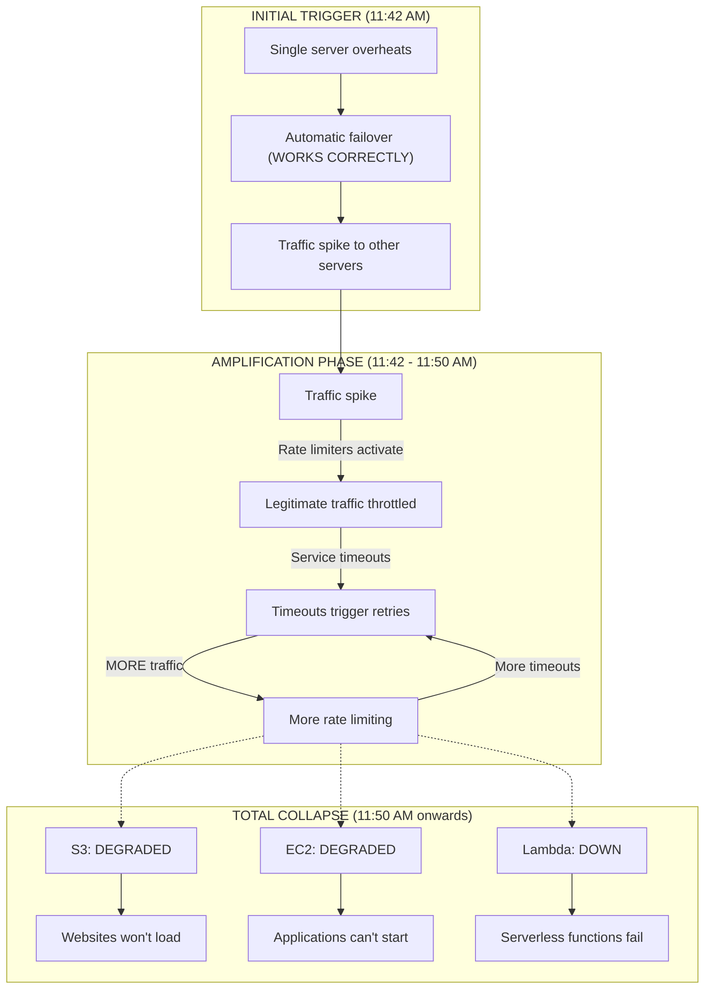

Every individual component worked exactly as designed. The failover worked. The rate limiters worked. The retry logic worked. But together, they created a catastrophe.

This is why understanding failure modes matters. **The question isn't "will it fail?" but "HOW will it fail—and what happens next?"**

---

## Why This Module Matters

Understanding failure modes lets you design systems that fail gracefully instead of catastrophically. The difference between a minor incident and a company-ending outage is often not whether failures happen, but how they propagate.

Consider two architectures:

| Architecture | When Database Slows Down | Result |
|--------------|--------------------------|--------|
| **Tightly coupled** | All services wait → timeouts cascade → retries multiply → total outage | $2M loss |
| **Well-isolated** | Checkout uses cached pricing → recommendations disabled → orders still flow | $5K loss |

Same trigger. 400x difference in business impact. The only difference is how failure modes were designed.

> **The Car Analogy**
>
> Modern cars have multiple failure modes designed in. Run out of fuel? The engine stops but the steering and brakes still work. Battery dies? The car stops but the doors still open. Brake line leaks? There's a second brake circuit.
>
> Engineers didn't just hope these systems wouldn't fail—they specifically designed what happens when they do. Your software needs the same intentional design.

---

## What You'll Learn

- Categories of failure modes in distributed systems
- FMEA (Failure Mode and Effects Analysis) technique—how to systematically predict failures
- Designing for graceful degradation—keeping some functionality when parts fail
- Blast radius and failure isolation—containing damage
- Common failure patterns and how to defend against them

---

## Part 1: Categories of Failure

### 1.1 The Failure Taxonomy

Not all failures are equal. A crash is different from corruption. A timeout is different from an error. Understanding the type of failure guides your response.

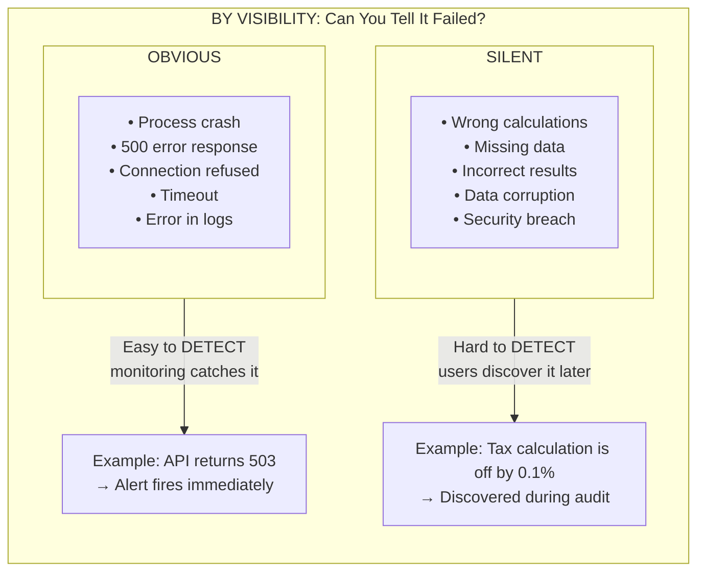

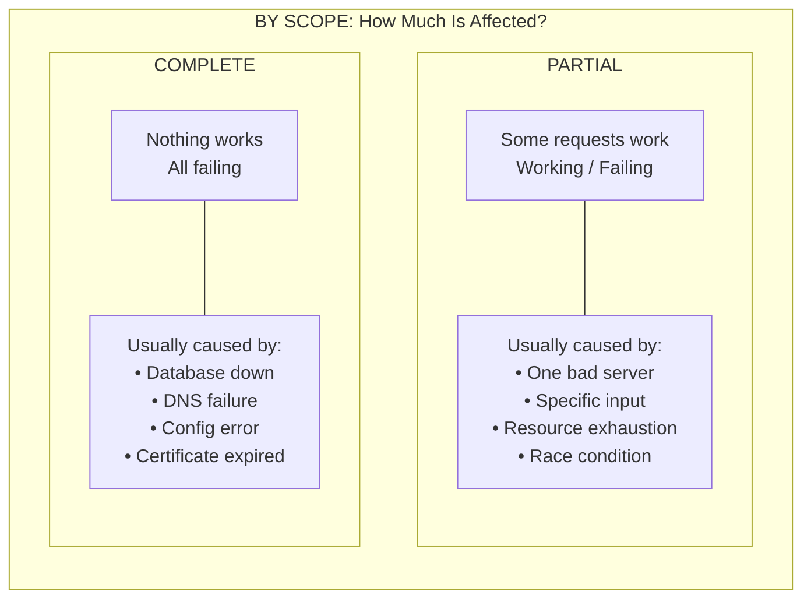

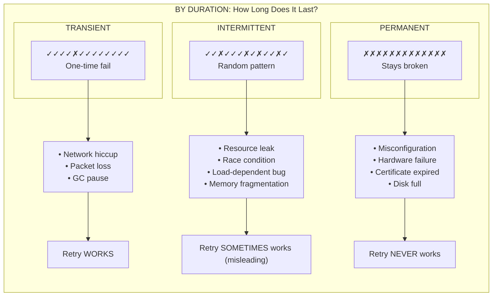

Why this taxonomy matters: **Your response should match the failure type.**

| Failure Type | Wrong Response | Right Response |
|--------------|----------------|----------------|
| **Transient** | Long investigation | Just retry with backoff |
| **Intermittent** | "We can't reproduce it" | Add extensive logging, trace the pattern |
| **Permanent** | Keep retrying | Alert immediately, investigate root cause |
| **Silent** | "All metrics are green!" | Add validation, checksums, reconciliation |

### 1.2 Common Failure Modes in Distributed Systems

Here's a field guide to the failures you'll encounter:

```text
THE EIGHT DEADLY FAILURE MODES
═══════════════════════════════════════════════════════════════════════════════

1. CRASH FAILURE
─────────────────────────────────────────────────────────────────────────────
   Process terminates unexpectedly

   Symptoms: Process disappears, logs end abruptly, no response
   Causes:   OOM kill, unhandled exception, segfault, kill -9
   Detection: Easy (process monitor, health check)
   Recovery: Restart (often automatic with orchestrators)

   Example: Java service runs out of heap → OOM killer terminates it


2. HANG FAILURE (The Silent Killer)
─────────────────────────────────────────────────────────────────────────────
   Process alive but unresponsive

   Symptoms: Process shows "running," but doesn't respond to requests
   Causes:   Deadlock, infinite loop, blocked I/O, waiting for lock
   Detection: Tricky (process looks healthy, but isn't)
   Recovery: Kill and restart (automatic detection harder)

   Example: Thread waiting for database lock → all threads exhausted

   ⚠️  Hangs are often WORSE than crashes because:
       - Health checks might pass (process is "up")
       - Resources stay consumed
       - Load balancer keeps sending traffic


3. PERFORMANCE DEGRADATION (The Slow Bleed)
─────────────────────────────────────────────────────────────────────────────
   Works, but slowly

   Symptoms: Increasing latency, timeouts, user complaints
   Causes:   Memory leak, CPU saturation, disk I/O, network congestion
   Detection: Needs baselines (what's "slow"?)
   Recovery: Fix root cause (scaling doesn't help memory leaks)

   Example: Memory leak causes GC pauses → latency spikes


4. BYZANTINE FAILURE (The Liar)
─────────────────────────────────────────────────────────────────────────────
   Returns wrong results without indicating error

   Symptoms: Inconsistent data, wrong answers, users report "weird behavior"
   Causes:   Bit flip, corrupted data, race condition, buggy logic
   Detection: VERY hard (system says "success" but result is wrong)
   Recovery: Depends on scope of corruption

   Example: Calculation bug returns $0.00 tax on $1000 purchase

   ⚠️  Byzantine failures are the HARDEST to detect and recover from


5. NETWORK PARTITION
─────────────────────────────────────────────────────────────────────────────
   Can't reach other services

   Symptoms: Timeouts to specific services, "connection refused"
   Causes:   Firewall rule, network failure, DNS issue, routing problem
   Detection: Easy (connection errors)
   Recovery: Wait for network, or fail over

   Example: Kubernetes NetworkPolicy blocks traffic between namespaces


6. RESOURCE EXHAUSTION
─────────────────────────────────────────────────────────────────────────────
   Runs out of something critical

   Symptoms: Errors like "too many open files," "disk full," "connection refused"
   Causes:   Disk full, connection pool exhausted, file descriptors, memory
   Detection: Easy (specific error messages)
   Recovery: Free resources, increase limits, find leak

   Common resources that exhaust:
   • Disk space              • Database connections
   • File descriptors        • Thread pool
   • Memory                  • Network sockets


7. DEPENDENCY FAILURE
─────────────────────────────────────────────────────────────────────────────
   External service your system needs is down

   Symptoms: Errors on specific operations, feature doesn't work
   Causes:   Database down, API timeout, third-party outage
   Detection: Easy (clear error messages usually)
   Recovery: Wait, fail over, or degrade gracefully

   Example: Stripe API is down → payment fails


8. CONFIGURATION ERROR (The Human Factor)
─────────────────────────────────────────────────────────────────────────────
   Wrong settings cause misbehavior

   Symptoms: System behaves unexpectedly, "it worked yesterday"
   Causes:   Bad deploy, wrong feature flag, typo, missing env var
   Detection: Sometimes obvious, sometimes subtle
   Recovery: Fix config, rollback

   Example: Typo in database URL → connects to wrong database
```

### 1.3 Failure Characteristics

Every failure has four characteristics that affect how you handle it:

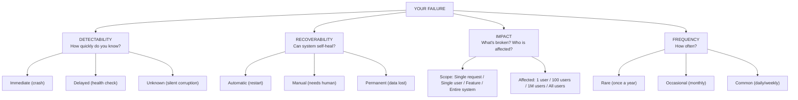

**Priority Matrix:**

The combination of these characteristics determines priority:

| Detectability | Impact | Frequency | Priority | Action |
|---------------|--------|-----------|----------|--------|
| Unknown | High | Any | **CRITICAL** | Must add detection ASAP |
| Low | High | Common | **CRITICAL** | Fix root cause immediately |
| High | Low | Rare | Low | Monitor, don't over-invest |
| High | High | Common | High | Automate recovery |

> **Try This (2 minutes)**
>
> Think of the last incident you experienced. Classify it:
> - Visibility: Obvious or silent?
> - Scope: Partial or complete?
> - Duration: Transient, intermittent, or permanent?
> - Detectability, recoverability, impact, frequency?
>
> Based on the priority matrix, was it prioritized correctly?

---

## Part 2: Failure Mode and Effects Analysis (FMEA)

> **Stop and think**: How often does your current team formally brainstorm what could go wrong before deploying a new feature? Is it documented, or just discussed casually?

### 2.1 What is FMEA?

**FMEA** (Failure Mode and Effects Analysis) is a systematic technique for identifying potential failures and their effects before they happen.

Originally from aerospace engineering, FMEA asks three questions:
1. **What can fail?** (Failure mode)
2. **What happens when it fails?** (Effect)
3. **How bad is it?** (Severity, likelihood, detectability)

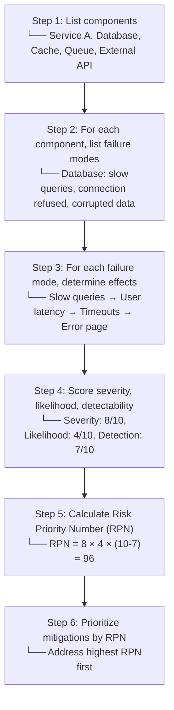

### 2.2 FMEA in Practice

| Component | Failure Mode | Effect | Severity | Likelihood | Detection | RPN | Mitigation |
|-----------|--------------|--------|----------|------------|-----------|-----|------------|
| Database | Connection timeout | Requests fail | 9 | 3 | 8 | 54 | Connection pooling, retry |
| Database | Corrupted data | Wrong results | 10 | 1 | 3 | 70 | Checksums, validation |
| Cache | Eviction storm | DB overload | 7 | 4 | 6 | 112 | Staggered TTLs, fallback |
| API Gateway | Memory leak | Crash, outage | 8 | 2 | 7 | 48 | Memory limits, restart |
| External API | Rate limited | Feature degraded | 5 | 6 | 9 | 30 | Caching, graceful degradation |

**Interpreting RPN:**
- 0-50: Low priority, monitor
- 51-100: Medium priority, plan mitigation
- 101-200: High priority, implement mitigation soon
- 200+: Critical, implement mitigation immediately

### 2.3 Conducting an FMEA

**Step-by-step guide:**

1. **Assemble the team** - Include people who know the system deeply
2. **Define the scope** - What system or feature are you analyzing?
3. **Create a system map** - Draw components and dependencies
4. **Brainstorm failure modes** - For each component, ask "how could this fail?"
5. **Trace effects** - Follow each failure through the system
6. **Score and prioritize** - Use RPN to focus effort
7. **Plan mitigations** - Design specific responses
8. **Review regularly** - FMEA is not one-time; systems change

> **Did You Know?**
>
> FMEA was developed by the U.S. military in the 1940s and was first used on the Apollo program. NASA required contractors to perform FMEA on all mission-critical systems. The technique helped identify and mitigate thousands of potential failures before they could endanger astronauts.
>
> **The Apollo 13 Survival Story**: When an oxygen tank exploded on Apollo 13, the crew survived because FMEA had identified and mitigated thousands of failure scenarios. The procedures they used—venting to reduce pressure, routing power through specific pathways, using the lunar module as a "lifeboat"—were all documented because engineers had asked "what if?" for every component.

---

## Part 3: Graceful Degradation

> **Stop and think**: Think about your favorite streaming app. What happens when your internet connection drops to 1 bar? Does it show an error, or does it lower the video quality to 480p? That is graceful degradation in action.

### 3.1 What is Graceful Degradation?

**Graceful degradation** means a system continues to provide some functionality even when parts fail, rather than failing completely.

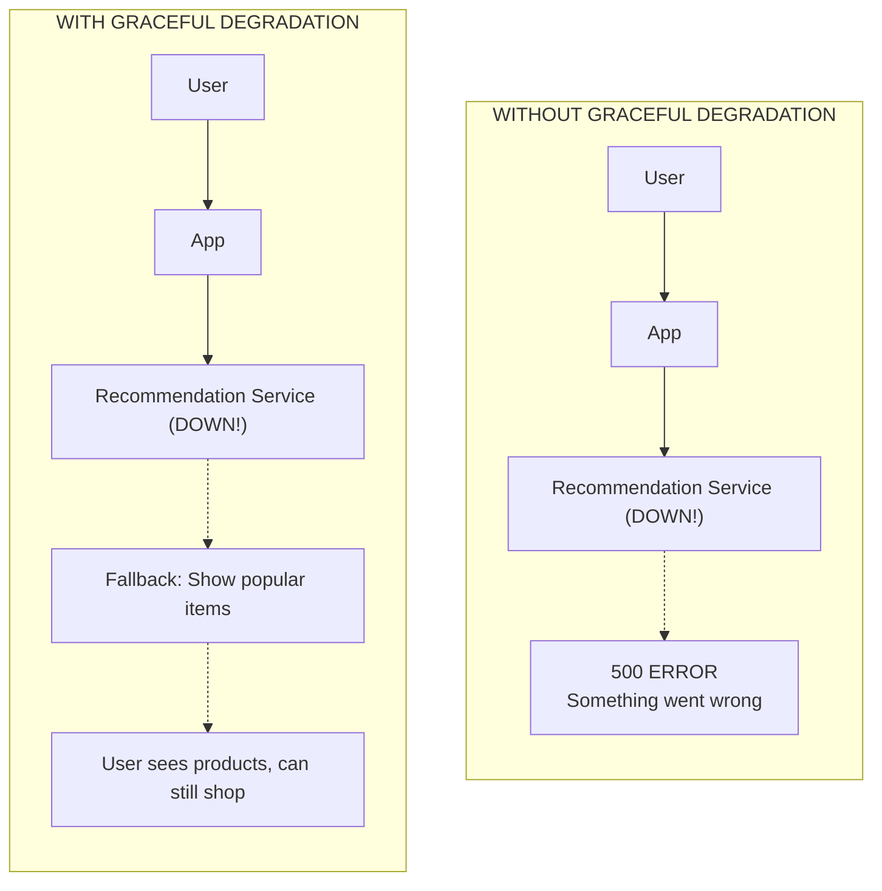

### 3.2 Degradation Strategies

| Strategy | When to Use | Example |
|----------|-------------|---------|
| **Fallback to cache** | Data freshness not critical | Show cached recommendations |
| **Fallback to default** | Any reasonable response is better than error | Show "popular items" instead |
| **Feature disable** | Feature is optional | Hide recommendation panel entirely |
| **Reduced functionality** | Core function still possible | Search works but no filters |
| **Read-only mode** | Writes more critical than reads | Can view orders but not create new ones |
| **Queue for later** | Action can be deferred | Accept order, process payment later |

### 3.3 Designing Degradation Paths

For each feature, define:

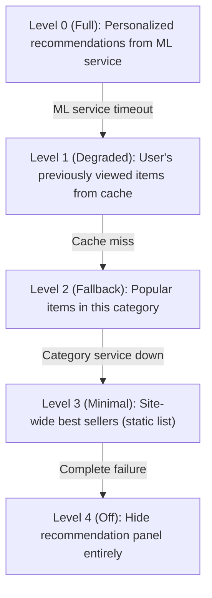

> **Try This (3 minutes)**
>
> Pick a feature in your system. Define 3-4 degradation levels:
>
> | Level | Condition | Response |
> |-------|-----------|----------|
> | Full | Everything working | Normal behavior |
> | Degraded | [What fails?] | [What's the response?] |
> | Fallback | [What else fails?] | [What's the response?] |
> | Off | [When to disable?] | [What user sees?] |

---

## Part 4: Blast Radius and Isolation

> **Pause and predict**: If the primary database in your system crashed right now, which services would survive? Would your users still be able to perform read-only tasks?

### 4.1 What is Blast Radius?

**Blast radius** is the scope of impact when a failure occurs. Smaller blast radius = fewer users/features affected.

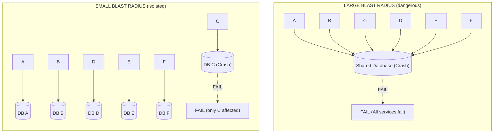

### 4.2 Isolation Patterns

**Bulkhead Pattern**

Named after ship compartments, bulkheads isolate failures to prevent them from spreading.

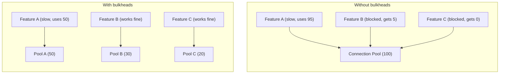

**Other Isolation Patterns:**

| Pattern | How It Works | Use Case |
|---------|--------------|----------|
| **Bulkhead** | Separate resource pools | Prevent noisy neighbors |
| **Circuit breaker** | Stop calling failing service | Prevent cascade failures |
| **Timeout** | Limit how long to wait | Prevent thread/connection exhaustion |
| **Rate limiting** | Limit request rate | Prevent overload |
| **Separate deployments** | Different instances per tenant | Tenant isolation |
| **Namespaces/quotas** | Resource limits per workload | Kubernetes isolation |

### 4.3 Reducing Blast Radius

Strategies to minimize impact:

1. **Deploy incrementally** - Canary, blue-green reduce exposure
2. **Feature flags** - Disable problematic features quickly
3. **Geographic isolation** - Failures in one region don't affect others
4. **Service isolation** - Each service fails independently
5. **Data isolation** - Separate databases for critical vs. non-critical data

> **War Story: The Shared Database That Took Down Everything**
>
> A fintech startup ran all their microservices against a shared PostgreSQL database. "It's simpler," they said. "We can do transactions across services."
>
> Then, on a random Tuesday, a developer added a new analytics query to the reporting service. The query was correct, but it ran a full table scan on a 50-million-row table. Without an index. Under normal load.
>
> ```text
> THE BLAST RADIUS OF ONE BAD QUERY
> ═════════════════════════════════════════════════════════════════════════════
>
> 2:34 PM - Reporting query starts, begins acquiring row locks
>
> 2:35 PM - User service tries to read users, waits for lock
>         - Connection pool starts filling
>
> 2:36 PM - Checkout service needs user data
>         - Calls user service → timeout
>         - Checkout starts queueing
>
> 2:37 PM - Every service waiting for database connections
>         - Connection pool exhausted across ALL services
>
> 2:38 PM - Alerts fire: "User service unhealthy"
>                       "Checkout service unhealthy"
>                       "Inventory service unhealthy"
>         - Response: "Check database" → "Looks fine, CPU low"
>
> 2:45 PM - Finally found: one query holding locks
>         - Killed the query
>
> 2:50 PM - Services slowly recover as connection pools drain
>
> Total downtime: 16 minutes
> Root cause: One missing database index
> Blast radius: ENTIRE platform
> ```
>
> The fix: separate databases for separate services, with clear ownership. Reporting now has its own read replica. A reporting bug can't take down checkout. Each service's database failure is isolated to that service.
>
> **Lesson**: Shared resources create shared fate. Isolation isn't just nice—it's survival.

---

## Part 5: Common Failure Patterns

> **Stop and think**: Have you ever written a simple `while(retries < 3)` loop in your code without adding a delay? You might have accidentally built a thundering herd trigger.

### 5.1 The Retry Storm

When a service is struggling, retries can make it worse:

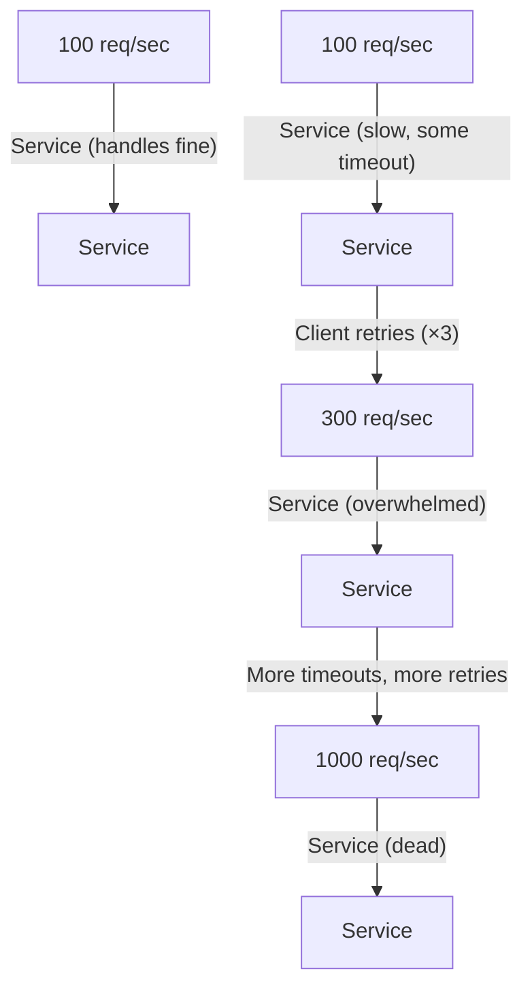

**Mitigation:**
- Exponential backoff (wait longer between retries)
- Jitter (randomize retry timing)
- Retry budgets (limit total retries)
- Circuit breakers (stop retrying entirely)

### 5.2 The Cascading Failure

One service fails, causing dependent services to fail:

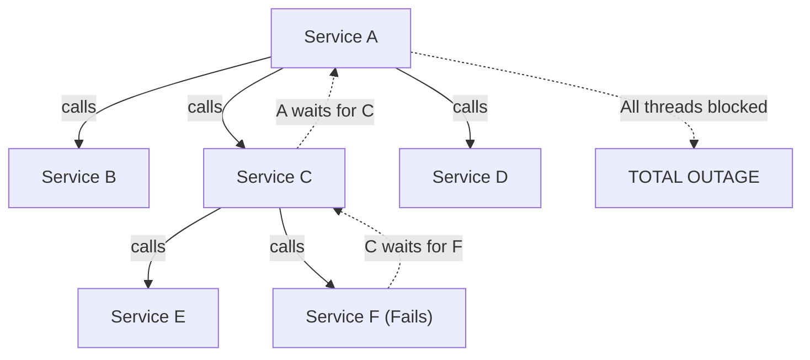

**Mitigation:** Timeouts, circuit breakers, async calls

### 5.3 The Thundering Herd

Many clients simultaneously hit a resource after an event:

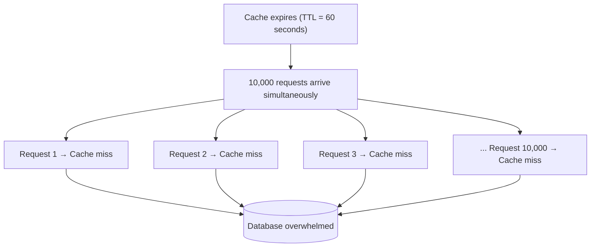

**Mitigation:**
- Staggered TTLs (add random jitter to expiration)
- Request coalescing (one request populates, others wait)
- Warm cache before traffic arrives
- Rate limit cache refresh

### 5.4 Pattern Summary

| Pattern | Trigger | Result | Mitigation |
|---------|---------|--------|------------|
| Retry storm | Slow service | Overwhelming load | Backoff, budgets, breakers |
| Cascading failure | Dependency failure | System-wide outage | Timeouts, circuit breakers |
| Thundering herd | Synchronized event | Resource exhaustion | Stagger, coalesce, warm |
| Memory leak | Time, load | OOM crash | Limits, monitoring, restart |
| Connection exhaustion | Load, slow backends | New connections refused | Pooling, timeouts, bulkheads |

> **Try This (3 minutes)**
>
> Review your system for these patterns. Can any of these happen?
>
> | Pattern | Could it happen? | Current mitigation? |
> |---------|------------------|---------------------|
> | Retry storm | | |
> | Cascading failure | | |
> | Thundering herd | | |

---

## Did You Know?

- **The term "Byzantine failure"** comes from the "Byzantine Generals Problem," a thought experiment about unreliable messengers. Byzantine failures are when a system doesn't just fail, but provides wrong or inconsistent information—the hardest type to handle.

- **NASA's Mars Climate Orbiter** was lost in 1999 due to a failure mode that wasn't analyzed: unit mismatch. One team used metric units, another used imperial. The $125 million spacecraft crashed because nobody did FMEA on the interface between teams.

- **Circuit breakers** are named after electrical circuit breakers—devices that "break" (open) when current exceeds safe levels, preventing damage. The software pattern does the same: stops calling a failing service to prevent cascading damage.

- **The "Swiss Cheese" model** from James Reason explains why complex systems fail: each defense layer has holes (like Swiss cheese slices), and failures occur when holes align. This is why defense in depth—multiple imperfect layers—is more effective than one "perfect" layer.

> **War Story: The Timeout That Was Too Long**
>
> A fintech startup set all their service timeouts to 30 seconds—a "safe" default. "Better to wait than fail," they reasoned.
>
> One day, a database query started taking 25 seconds instead of the usual 200ms. A missing WHERE clause caused a sequential scan. Not a bug—it still returned correct data. Just slowly.
>
> ```text
> THE 30-SECOND TIMEOUT DEATH SPIRAL
> ═════════════════════════════════════════════════════════════════════════════
>
> Normal state:
>   Request → Database (200ms) → Response
>   Connection pool: 10 used / 100 available
>
> Query becomes slow (25 seconds):
>   ─────────────────────────────────────────────────────────────────────────
>
>   Second 1:   New requests arrive, start waiting
>               Connections: 50/100
>
>   Second 10:  All connections waiting on slow queries
>               Connections: 100/100 (exhausted)
>
>   Second 15:  New requests can't get connections
>               Queue starts filling
>               Memory climbing
>
>   Second 20:  Queue full
>               OOM pressure building
>               GC thrashing
>
>   Second 25:  OOM killer strikes
>               Pod dies
>               Kubernetes restarts it
>
>   Second 30:  Pod comes back
>               Hits slow database
>               Connection pool fills immediately
>               Death spiral resumes
>
>   For 2 HOURS the platform oscillated between "starting up" and "crashing"
> ```
>
> The fix was embarrassingly simple: **reduce timeouts to 2 seconds**. A 25-second query now fails fast at 2 seconds, the circuit breaker opens, and the system degrades gracefully (returning cached data or an error) instead of collapsing.
>
> **Lesson**: The most dangerous failures aren't outages—they're systems that are "almost working." A long timeout that never triggers is worse than no timeout at all.

---

## Common Mistakes

| Mistake | Problem | Solution |
|---------|---------|----------|
| Not doing FMEA | Surprised by predictable failures | Regular FMEA sessions |
| Assuming dependencies won't fail | No fallback when they do | Design degradation paths |
| Tight coupling | One failure affects everything | Bulkheads, loose coupling |
| Unlimited retries | Retry storms | Budgets, backoff, circuit breakers |
| Same timeout everywhere | Either too aggressive or too lenient | Tune per-dependency |
| No feature flags | Can't disable broken features | Every feature behind a flag |

---

## Quiz

1. **You are investigating two different alerts. The first is a database timeout that occurred at 2:14 AM and hasn't repeated since. The second is an image processing service that throws a "file corrupted" error on roughly 2% of user uploads, but works perfectly if the user immediately uploads the same file again. How would you categorize these two failures, and how should your response differ?**
   <details>
   <summary>Answer</summary>

   The first alert is a **transient failure**, while the second is an **intermittent failure**.

   Transient failures occur once and then resolve on their own, like a momentary network hiccup or a brief routing delay. Because they don't persist, the system can usually recover simply by retrying the operation with exponential backoff.

   Intermittent failures, on the other hand, occur unpredictably—sometimes the system works, sometimes it doesn't, with no clear pattern. These are much harder to debug because you can't reliably reproduce them. In this scenario, retrying might occasionally succeed (masking the problem), but the correct response is to add detailed logging to capture the exact state when the error occurs, as it often points to an underlying issue like a race condition or resource exhaustion on a specific node.
   </details>

2. **During an FMEA session for a new financial reporting microservice, your team evaluates a failure mode where floating-point rounding errors could alter daily revenue totals. The team gives this a Severity of 9, but a Detection score of 2. Why is this specific combination of scores considered a "critical" risk that requires immediate architectural changes?**
   <details>
   <summary>Answer</summary>

   A high severity combined with low detection means the failure has a major impact AND you won't know it's happening until significant damage has already been done.

   In this financial reporting scenario, the failure is "silent." The system continues to operate and return 200 OK responses, but it is generating corrupted data. Because the detection score is so low, no automated alarms are firing, meaning the business will continue making decisions based on incorrect revenue numbers until someone notices during an audit months later.

   By the time you notice, the corruption has spread and fixing it requires massive manual reconciliation. These silent failure modes often yield a very high Risk Priority Number (RPN) and should be prioritized for immediate mitigation—such as adding robust reconciliation checks, strict data validation, or double-entry verification—even if you cannot eliminate the underlying likelihood of the error entirely.
   </details>

3. **Your e-commerce platform's "Recommended Products" service suddenly experiences a 30-second delay due to a bad machine learning model deployment. Within minutes, users can't even log in or view their shopping carts, and the entire site goes down. How could implementing the bulkhead pattern have prevented this total outage?**
   <details>
   <summary>Answer</summary>

   Implementing the bulkhead pattern would have isolated the resources used by the "Recommended Products" service from the rest of the application, dramatically reducing the blast radius of the failure.

   Without bulkheads, all services likely share the same global connection or thread pool. When the recommendations service slowed down, incoming requests piled up and consumed all available threads waiting for a response, starving critical services like login and cart management.

   By using bulkheads, you divide those resources into separate, isolated pools—just like watertight compartments in a ship. The recommendation service would have exhausted its dedicated thread pool and failed, but the login and cart services would still have access to their own dedicated resources. This ensures that a non-critical feature failure doesn't sink the entire platform, turning a total outage into a graceful degradation scenario.
   </details>

4. **An internal authentication service usually handles 500 requests per second. During a minor network blip, the service briefly slows down, causing some client requests to time out. Suddenly, traffic spikes to 2,500 requests per second, CPU usage hits 100%, and the service crashes completely. What failure pattern just occurred, and what specific client-side changes are needed to prevent it?**
   <details>
   <summary>Answer</summary>

   The service just experienced a **retry storm**, which occurs when a system slowdown triggers a destructive positive feedback loop.

   When the service initially slowed down and requests timed out, the clients aggressively retried their failed requests. This injected 2-3x more traffic into a service that was already struggling, which slowed it down even further, leading to more timeouts, more retries, and an overwhelming load that eventually killed the service. What started as a minor, recoverable slowdown was amplified into a total outage by the clients' "helpful" retry behavior.

   To prevent this, clients must implement **exponential backoff** (waiting progressively longer between retries) and **jitter** (adding randomness to the retry delay so clients don't all retry at the exact same millisecond). Additionally, implementing a circuit breaker or strict retry budgets will ensure clients stop hammering a service that is clearly unresponsive.
   </details>

---

## Hands-On Exercise

**Task**: Conduct a mini-FMEA on a system you work with.

**Part 1: Map the System (10 minutes)**

Draw a simple diagram of a system you operate (or use the example checkout flow):

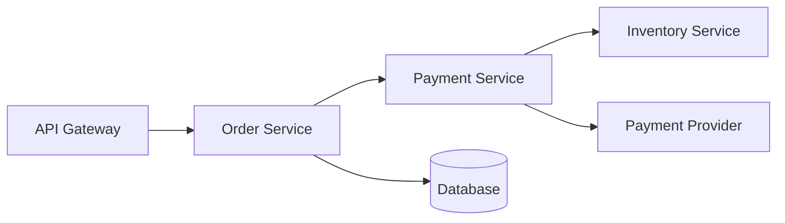

**Part 2: FMEA Table (15 minutes)**

For at least 4 failure modes, complete this table:

| Component | Failure Mode | Effect on User | Severity (1-10) | Likelihood (1-10) | Detection (1-10) | RPN | Mitigation |
|-----------|--------------|----------------|-----------------|-------------------|------------------|-----|------------|
| | | | | | | | |
| | | | | | | | |
| | | | | | | | |
| | | | | | | | |

**Part 3: Degradation Paths (10 minutes)**

For the highest RPN failure mode, design a degradation path:

| Level | Condition | User Experience |
|-------|-----------|-----------------|
| Full | Normal | |
| Degraded | [What fails?] | |
| Fallback | [More fails?] | |
| Minimal/Off | [Critical failure] | |

**Part 4: Blast Radius Analysis (5 minutes)**

Answer:
1. What's the largest blast radius failure in your FMEA?
2. How could you reduce it?
3. Is there a single point of failure that affects everything?

**Success Criteria**:
- [ ] System diagram with at least 4 components
- [ ] FMEA table with at least 4 failure modes analyzed
- [ ] RPN calculated correctly for each
- [ ] Degradation path for highest RPN item
- [ ] Blast radius improvement identified

---

## Key Takeaways

Before moving on, make sure you understand these core concepts:

```text
FAILURE MODES CHECKLIST
═══════════════════════════════════════════════════════════════════════════════

□ Failures come in types: crash, hang, degradation, byzantine, partition,
  exhaustion, dependency, configuration

□ Silent failures are worse than obvious ones
  (wrong results without errors)

□ FMEA is a systematic way to predict failures
  (Failure Mode and Effects Analysis)

□ RPN = Severity × Likelihood × (10 - Detection)
  (prioritize high RPN items)

□ Graceful degradation keeps some functionality
  (better than complete failure)

□ Blast radius = scope of impact
  (smaller is better)

□ Bulkheads isolate failures
  (like watertight compartments in a ship)

□ Retries without backoff cause storms
  (always use exponential backoff + jitter)

□ Timeouts that are too long are worse than no timeouts
  (fail fast is better than slow death)

□ Cascading failures are the real danger
  (one failure triggers another)
```

---

## Further Reading

**Books:**

- **"Release It! Second Edition"** - Michael Nygard. Essential reading on stability patterns including circuit breakers, bulkheads, and timeouts. Every chapter is a war story.

- **"Failure Mode and Effects Analysis"** - D.H. Stamatis. Comprehensive guide to FMEA technique from the manufacturing world.

**Papers:**

- **"How Complex Systems Fail"** - Richard Cook. A 5-page paper on why FMEA alone isn't enough—complex systems fail in unexpected ways. Required reading.

- **"Metastable Failures in Distributed Systems"** - Nathan Bronson et al. (Facebook/Meta). Deep dive into failure patterns that can sustain themselves even after the trigger is removed.

**Talks:**

- **"Breaking Things on Purpose"** - Kolton Andrus (Gremlin). How to build confidence through deliberate failure injection.

---

## Next Module

[Module 2.3: Redundancy and Fault Tolerance](../module-2.3-redundancy-and-fault-tolerance/) - Now that you understand how systems fail, learn how to build systems that continue working when components fail.