> **Complexity**: `[MEDIUM]`
>
> **Time to Complete**: 45-55 minutes
>
> **Prerequisites**: [Module 2.1: What is Reliability?](../module-2.1-what-is-reliability/)
>
> **Track**: Foundations

## What You'll Be Able to Do

By the end of this module, you will be able to reason about failure as a set of designed behaviors rather than a vague collection of bad outcomes. The learning outcomes below map directly to the hands-on exercise and quiz, and each one matters in real architecture reviews where teams must choose between adding capacity, adding isolation, degrading a feature, or changing how clients respond to faults.

1. **Analyze** cascading failures by tracing how a single-component failure propagates through dependent services.
2. **Apply** Failure Mode and Effects Analysis (FMEA) to identify high-risk failure paths before they occur in production.
3. **Classify** failure modes by visibility, scope, duration, detectability, recoverability, impact, and frequency.
4. **Design** graceful degradation and blast-radius containment strategies including bulkheads, timeouts, and feature-level fallbacks.
5. **Evaluate** whether retry logic, rate limiters, circuit breakers, and isolation boundaries prevent or amplify failure cascades.

---

## Why This Module Matters

Reliability engineering begins with an uncomfortable truth: every useful system can fail, and the interesting question is rarely whether failure is possible. The better question is what shape the failure will take, how quickly people or automation will notice, what other components will be pulled into the problem, and whether the system will preserve its most important user promises while the broken part is repaired. That is the difference between "the recommendation panel is temporarily unavailable" and "checkout, login, search, and support tools all stopped because they share one saturated dependency."

Failure-mode thinking gives you a vocabulary for that difference. Instead of saying "the database went down," you learn to ask whether the failure was a crash, a hang, a performance degradation, a gray failure, a network partition, a resource exhaustion problem, or silent corruption. Instead of saying "we need retries," you learn to ask whether the retry policy is helping a transient failure or amplifying a persistent one. Instead of saying "add redundancy," you learn to ask whether the redundant components are truly isolated or whether they share the same control plane, identity provider, network path, deployment pipeline, or rate limiter.

This module is deliberately theory-first because the theory changes how you review designs. A team that understands failure modes does not wait for production to teach every lesson the hard way. It runs Failure Mode and Effects Analysis before launch, defines graceful degradation paths before the dependency breaks, limits blast radius before the risky deployment rolls out, and tests whether circuit breakers and rate limiters fail open, fail closed, or quietly make the outage worse. Those habits do not eliminate incidents, but they can turn a system-wide outage into a bounded, observable, recoverable impairment.

> **The Car Analogy**
>
> A modern car is not reliable because every component is perfect. It is reliable because many failures have designed effects. If the fuel tank is empty, the engine stops but the doors still open. If a tire loses pressure, the driver receives a warning before handling becomes dangerous. If one brake circuit leaks, the other circuit can still provide stopping force. The important design act is not pretending the tire, sensor, or brake line will never fail; it is deciding what the rest of the system must still do when that part fails.
>
> Software needs the same discipline. A product page should not depend on a recommendation model in the same way that checkout depends on payment authorization. A tenant with a poison request should not consume the same thread pool as every other tenant. A slow downstream should not be allowed to hold connections forever because "eventually it might respond." Failure-mode thinking is how you encode those distinctions before the incident begins.

---

## Hypothetical Scenario: The Quiet Dependency Failure

**Hypothetical scenario:** The following story is an invented teaching scenario built from common distributed-system patterns. It is not a claim about a specific company, date, outage duration, or financial loss, and the numbers are intentionally illustrative so you can reason about the mechanics without treating them as incident data.

An online store runs a checkout service, a catalog service, a recommendation service, a customer-profile service, and a shared PostgreSQL cluster. The recommendation panel is not essential to buying an item, but it shares the same application thread pool as the checkout handler because both features live in the same web service. The database has separate schemas, but the connection pool is global. Each request can use any connection, and the application does not reserve capacity for the checkout path.

During a traffic spike, the recommendation service starts issuing slower queries. The queries still return correct data, so the service does not look "down" in a simple health check. Threads begin waiting on database calls, connection hold time increases, and the shared pool fills. At first, checkout is merely slower because it has to wait behind recommendation work. A few checkout calls time out, clients retry immediately, and the retry traffic consumes even more threads and connections. The recommendation problem has now become a checkout problem, even though the recommendation feature was optional.

The on-call engineer sees a confusing dashboard. The database CPU is not completely saturated, the web service pods are technically running, and many health probes still return success. Users, however, cannot reliably complete orders because the critical path is queued behind non-critical work. The incident is not a simple crash. It is a combination of performance degradation, resource exhaustion, retry amplification, and missing blast-radius boundaries. The first useful question is not "which server failed?" but "which failure mode is consuming shared capacity, and which dependency chain lets that consumption reach checkout?"

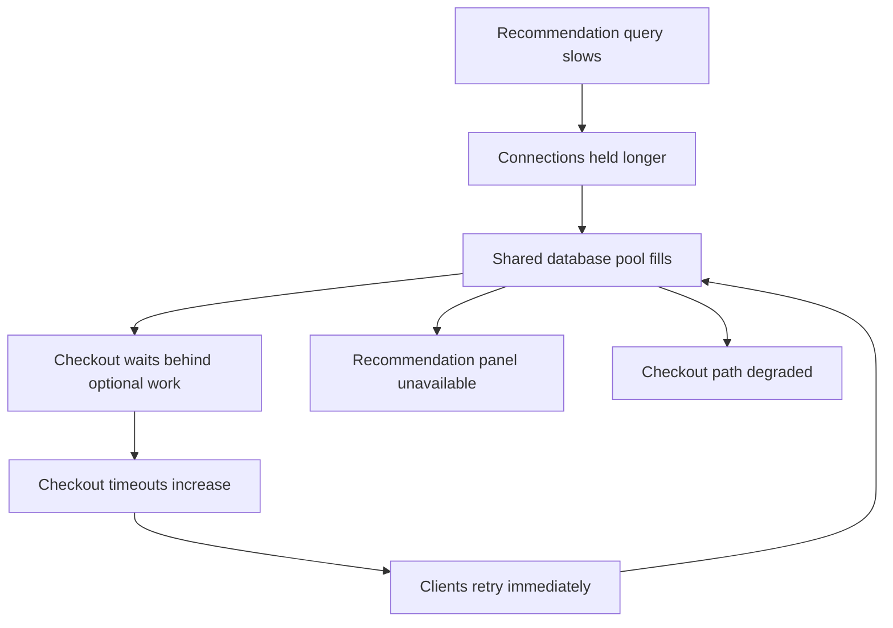
```mermaid
flowchart TD
    A["Recommendation query slows"] --> B["Connections held longer"]
    B --> C["Shared database pool fills"]
    C --> D["Checkout waits behind optional work"]
    D --> E["Checkout timeouts increase"]
    E --> F["Clients retry immediately"]
    F --> C
    C --> G["Recommendation panel unavailable"]
    C --> H["Checkout path degraded"]
```

This scenario demonstrates the core lesson of the module. Failures rarely stay inside the box where they start unless you design the box to hold them. A slow optional dependency should degrade the optional feature, not the revenue-critical path. A retry should be a careful bet that a transient fault will clear, not an unlimited loan of extra load to a system already under stress. A connection pool should be a resource boundary, not a shared sinkhole where low-priority work can starve high-priority work.

---

## Part 1: Categories of Failure

### 1.1 A Useful Failure Taxonomy

The first job in failure-mode analysis is classification. A crash failure is obvious because a process exits, a container restarts, or a load balancer stops receiving responses. A hang failure is harder because the process stays alive while useful work stops. A performance degradation is harder still because the system technically works, but it works slowly enough to trip timeouts, exhaust queues, or violate user expectations. Silent corruption is the most dangerous category because the system reports success while producing wrong data, which means operational metrics can stay green while the business accumulates damage.

Distributed systems add several categories that single-process programs can hide from you. A network partition can separate healthy components so that each side sees the other as unreachable. Resource exhaustion can occur when a service runs out of file descriptors, threads, queue slots, ephemeral ports, database connections, disk space, CPU, memory, or API quota. Dependency failure can remove a service you do not control, such as a payment provider, identity system, DNS resolver, or managed queue. Configuration failure can make correct software behave incorrectly because the wrong endpoint, feature flag, certificate, policy, or timeout was deployed.

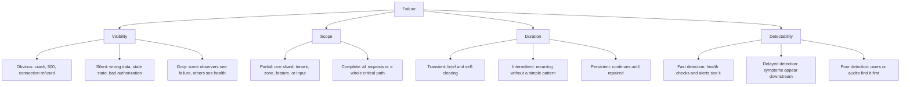
```mermaid
flowchart TD
    F["Failure"] --> V["Visibility"]
    F --> S["Scope"]
    F --> T["Duration"]
    F --> D["Detectability"]

    V --> V1["Obvious: crash, 500, connection refused"]
    V --> V2["Silent: wrong data, stale state, bad authorization"]
    V --> V3["Gray: some observers see failure, others see health"]

    S --> S1["Partial: one shard, tenant, zone, feature, or input"]
    S --> S2["Complete: all requests or a whole critical path"]

    T --> T1["Transient: brief and self-clearing"]
    T --> T2["Intermittent: recurring without a simple pattern"]
    T --> T3["Persistent: continues until repaired"]

    D --> D1["Fast detection: health checks and alerts see it"]
    D --> D2["Delayed detection: symptoms appear downstream"]
    D --> D3["Poor detection: users or audits find it first"]
```

These categories are not academic labels; they guide the response. A transient network timeout may deserve one or two retries with backoff. A persistent authentication outage should trigger a circuit breaker, cached read-only behavior where safe, and a human page. A gray failure requires cross-checking from the user's point of view because the component's own health detector may not agree that anything is wrong. A silent calculation bug requires validation, reconciliation, and sometimes data repair rather than restarts, because restarting a service that is returning wrong answers simply returns wrong answers faster.

### 1.2 Fail-Stop, Fail-Slow, Gray, and Byzantine

Engineers often wish components would fail-stop: they either produce correct output or stop responding. Fail-stop behavior is attractive because it is easier to detect and route around. Unfortunately, real systems also fail-slow, fail-partial, and fail-gray. A service might process small requests quickly while large requests hang. A disk might return correct data but with high tail latency. A network path might drop enough packets to hurt one workload while another workload looks healthy. In these cases, redundancy can be misleading because the failed component is still eligible to receive traffic.

Gray failure is the production name for a particularly frustrating class of partial failures. Different observers disagree about whether the component is healthy because symptoms depend on workload, vantage point, time window, or measurement path. A host-level agent may report success while a specific application sees packet loss; a storage system may pass simple checks while high-throughput users experience severe latency; a control plane may see the node as ready while tenant requests repeatedly time out. The Microsoft Research gray-failure work, and later public talks on the topic, emphasize this differential observability problem: detection itself becomes part of the failure mode.

Byzantine failure is different again. In the classic distributed-systems sense, a Byzantine component can behave inconsistently or maliciously: it may send different answers to different peers, return invalid results, or violate the assumptions other nodes rely on. Most platform engineers do not implement Byzantine consensus every week, but the concept is still useful. Silent data corruption, incorrect authorization decisions, clock bugs, and inconsistent cache invalidation can all feel Byzantine from an operator's perspective because the system does not merely stop; it lies, disagrees with itself, or claims success while damaging state.

| Failure Model | What You See | Why It Matters | Typical Response |
|---|---|---|---|
| Fail-stop | Component stops responding or exits | Easy to detect and remove from rotation | Health checks, restart, failover |
| Fail-slow | Component responds too slowly | Consumes resources and triggers timeouts | Timeouts, hedging with care, load shedding |
| Gray failure | Some observers see health while others see failure | Standard detectors may miss the user-visible problem | Multi-perspective probes, symptom alerts |
| Byzantine | Component returns inconsistent or wrong results | Success responses cannot be trusted | Validation, quorum, reconciliation, audit trails |
| Resource exhaustion | A finite pool is consumed | Healthy code cannot make progress without capacity | Bulkheads, quotas, backpressure, shedding |

The table is a map, not a replacement for diagnosis. A single incident can involve several models at once: a fail-slow cache causes application threads to hang, retrying clients exhaust a connection pool, and a health check still reports success because it does not exercise the failing path. When you classify an incident, write down both the starting failure and the propagated failure. That habit prevents a common postmortem mistake: fixing the trigger while leaving the amplification path untouched.

### 1.3 Characteristics That Drive Priority

After classification, evaluate four characteristics: detectability, recoverability, impact, and frequency. Detectability asks how quickly the team or automation knows the failure exists. Recoverability asks whether the system can heal without manual action and whether data must be repaired. Impact asks which users, features, tenants, regions, and business promises are affected. Frequency asks whether this is a rare edge case, an occasional operational problem, or a pattern that appears whenever load or deployments change.

These characteristics matter because severity alone can mislead. A failure that affects all users but is detected instantly and automatically failed over may be less risky than a silent accounting defect affecting a smaller group for weeks. A low-impact feature failure that happens every day may deserve more engineering attention than a dramatic outage that can occur only under an extremely narrow maintenance condition. The priority is not just "how bad is the symptom?" but "how much harm can accumulate before we notice, contain, and recover?"

| Characteristic | Low-Risk Shape | High-Risk Shape | Design Implication |
|---|---|---|---|
| Detectability | User-visible error, alert fires quickly | Silent or gray symptom discovered late | Add end-to-end checks and reconciliation |
| Recoverability | Restart or failover restores service | Manual repair or data cleanup required | Design rollback, replay, and repair tools |
| Impact | One feature, tenant, cell, or shard | Whole critical path or shared platform | Add isolation and staged rollout controls |
| Frequency | Rare and bounded | Recurring under normal change or load | Fix root cause, not only symptoms |

The priority matrix becomes especially useful during design review. Ask what you would do if the failure happened during peak traffic, during an on-call shift change, while a migration is in progress, or after the team that wrote the feature has moved on. If the answer depends on one person remembering tribal knowledge, the failure mode is not sufficiently designed. Good reliability work turns urgent human improvisation into documented, tested system behavior.

---

## Part 2: Failure Mode and Effects Analysis

### 2.1 What FMEA Is For

Failure Mode and Effects Analysis, usually shortened to FMEA, is a structured method for asking what can fail, what the effect would be, how severe the effect is, how likely the failure is, and how easily the team would detect it. The method comes from reliability and safety engineering, and standards such as IEC 60812 and NASA FMECA guidance describe it as a disciplined way to identify failure modes and their local and system-level effects. For platform engineers, the important point is not the ceremony; it is the shift from component inventory to consequence tracing.

A weak design review asks, "Do we have a database, cache, queue, and API gateway?" A stronger FMEA asks, "What happens if the cache returns stale data, if the queue accepts messages but consumers are stalled, if the gateway retries a persistent downstream failure, or if the database is reachable but slow enough to hold every connection?" The words "mode" and "effect" are doing real work. A component does not have one failure; it has many failure modes. Each mode has a different user effect, detection path, containment strategy, and recovery plan.

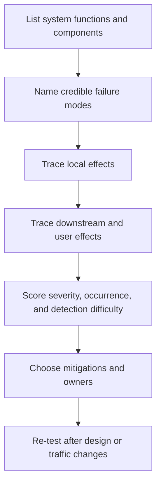
```mermaid
flowchart TD
    A["List system functions and components"] --> B["Name credible failure modes"]
    B --> C["Trace local effects"]
    C --> D["Trace downstream and user effects"]
    D --> E["Score severity, occurrence, and detection difficulty"]
    E --> F["Choose mitigations and owners"]
    F --> G["Re-test after design or traffic changes"]
```

The most useful FMEA sessions are concrete. Do not write "database fails" and move on. Split that into "connection refused," "queries slower than timeout," "primary accepts writes but replica lags," "schema migration locks a hot table," "backup restore is untested," and "query returns corrupt or incomplete data." Each row should make the system map more precise. If the row does not identify a different response or mitigation, it is probably too vague to teach you anything.

### 2.2 Scoring Without Pretending the Numbers Are Truth

Many FMEA templates use numeric scores for severity, occurrence, and detection. Some templates calculate a Risk Priority Number by multiplying those dimensions; others use criticality categories or decision tables. The exact scoring scheme matters less than consistency and discussion quality. Numbers are useful because they force tradeoffs into the open, but they are not measurements in the same sense as request latency or error rate. A score is a team judgment that should be documented with assumptions.

Use severity to represent the consequence if the failure mode reaches users or critical operations. Use occurrence to represent how plausible the cause is in the expected operating environment. Use detection difficulty to represent how likely the team is to notice before harm accumulates. Some organizations score detection with high numbers meaning "hard to detect," while others score detectability with high numbers meaning "easy to detect." Pick one convention and write it on the template so reviewers do not accidentally invert the risk calculation.

| Component | Failure Mode | Effect | Severity | Occurrence | Detection Difficulty | Mitigation |
|---|---|---|---:|---:|---:|---|
| Checkout database | Queries slow but succeed | Threads wait, timeouts rise, retries amplify load | High | Medium | Medium | Shorter timeouts, query SLOs, circuit breaker |
| Recommendation API | Dependency unavailable | Product page loses optional panel | Low | Medium | Low | Hide panel, cached fallback, separate pool |
| Payment provider | Persistent timeout | Orders cannot complete | High | Low | Low | Fast fail, queue-safe retry, user messaging |
| Cache cluster | Hot key expires for all clients | Database sees synchronized miss wave | Medium | Medium | Medium | TTL jitter, request coalescing, warmup |
| Tenant router | One tenant sends poison request | Shared workers consumed | High | Low | High | Cell routing, per-tenant quotas, quarantine |

The table above avoids fake precision. It uses relative categories because the goal is to prioritize engineering action, not to pretend a spreadsheet predicts the future. If your organization needs numeric scoring, define the scale in operational terms: "High severity means a critical user journey is unavailable or data integrity is at risk"; "High detection difficulty means existing alerts probably will not fire before users notice"; "High occurrence means normal traffic, deployments, or maintenance can plausibly trigger it." Definitions make the conversation reproducible.

### 2.3 Applying FMEA to Distributed Systems

Distributed-system FMEA needs one extra discipline: always trace across service boundaries. A failure mode that is low severity locally can become high severity after propagation. The recommendation service might consider its own timeout low impact, but if the caller holds checkout threads while waiting, the effect is not low. The cache might consider a miss normal, but a synchronized miss across many clients can overload the database. The queue might accept messages successfully, but if consumers are stuck, the user-facing effect may be delayed work, duplicate work, or eventual data inconsistency.

Start with a dependency map and mark the critical path. For each component, ask what happens when it is unavailable, slow, stale, inconsistent, overloaded, rate-limited, misconfigured, or returning partial results. Then ask what each caller does in response. Does the caller wait, retry, queue, fall back, shed load, open a circuit breaker, or pass the failure to its own callers? Finally, ask what shared resources are consumed during that response. This last step is where many cascading failures are found, because the "handling" code often consumes the same scarce resource as the original work.

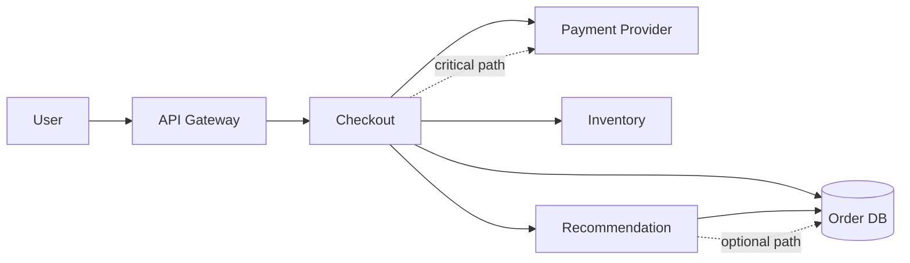
```mermaid
flowchart LR
    U["User"] --> G["API Gateway"]
    G --> C["Checkout"]
    C --> P["Payment Provider"]
    C --> I["Inventory"]
    C --> R["Recommendation"]
    C --> DB[("Order DB")]
    R --> DB
    C -. "critical path" .-> P
    R -. "optional path" .-> DB
```

In the diagram, a naive FMEA might mark payment failure as high severity and recommendation failure as low severity. A better FMEA notices that recommendation and checkout share the same database, and that optional work can become critical-path damage if resource pools are shared. The mitigation is not merely "make recommendation reliable." It is "make recommendation failure cheap": separate pools, low timeouts, cached fallback, feature kill switch, and an explicit rule that checkout capacity wins when the system is stressed.

### 2.4 What FMEA Misses

FMEA is powerful, but it has blind spots. It is best at enumerating known components and plausible failure modes. It is weaker when failures emerge from interactions nobody expected, when human procedures change under pressure, when dependency behavior changes without notice, or when the system enters a metastable state that keeps itself overloaded after the original trigger is gone. Richard Cook's "How Complex Systems Fail" is a useful corrective here: complex systems are defended by many imperfect layers, and incidents often require several defenses to align badly rather than one isolated defect.

Use FMEA as a starting point, then pair it with load testing, chaos experiments, game days, incident reviews, and observability checks. If an FMEA says a dependency timeout should degrade a feature, run a controlled test that forces that timeout and confirm the user experience, metrics, alerts, and recovery path. If an FMEA says a retry policy is safe, test it against a slow downstream and watch total request volume, queue depth, and downstream saturation. If the system behaves differently from the document, update the document or the system, because stale FMEA rows become false confidence.

---

## Part 3: Graceful Degradation

### 3.1 Degradation Is a Product Decision

Graceful degradation means the system continues to provide its most important functions when less important parts are unavailable, overloaded, or too expensive to compute. It is not a synonym for hiding errors. The user experience still needs to be honest, observable, and safe. If a product silently drops a payment, loses a message, or shows stale medical guidance, that is not graceful degradation; it is data loss or unsafe behavior. The key is deciding which promises can be reduced and which promises must be preserved.

Google SRE material on overload handling describes degraded responses as a way to preserve availability when full-quality work is too costly. Cloud architecture guidance from AWS and Google Cloud makes the same practical point: preserve the most important functions even when the system cannot deliver everything at full fidelity. In platform terms, graceful degradation is how you separate "useful but optional" from "core user promise." The distinction must be made before the incident, because the system cannot reliably invent product priorities while threads and queues are already saturated.

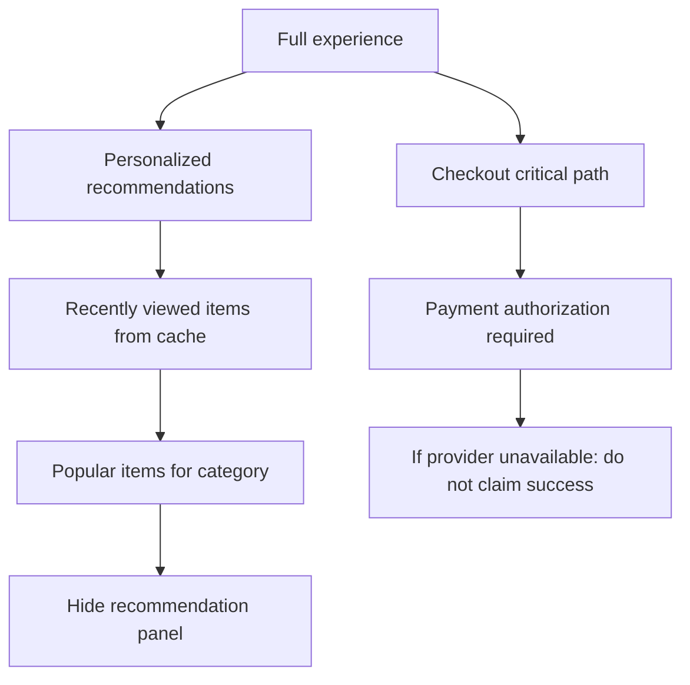
```mermaid
flowchart TD
    A["Full experience"] --> B["Personalized recommendations"]
    B --> C["Recently viewed items from cache"]
    C --> D["Popular items for category"]
    D --> E["Hide recommendation panel"]

    A --> F["Checkout critical path"]
    F --> G["Payment authorization required"]
    G --> H["If provider unavailable: do not claim success"]
```

The diagram shows two different degradation philosophies in the same application. Recommendations can lose freshness, personalization, and eventually visibility while the store remains useful. Payment authorization cannot degrade into "pretend the payment worked." The correct fallback for payment might be a clear user message, a saved cart, or a queue only if the business and compliance model support delayed authorization. Reliability engineering is not only about keeping green lights on a dashboard; it is about preserving the promises the product is allowed to make.

### 3.2 Designing Degradation Levels

A good degradation plan defines levels, triggers, user experience, observability, and recovery. Levels describe what changes as dependencies fail. Triggers describe the measurable condition that moves the feature down a level: timeout rate, circuit-breaker state, cache miss rate, queue depth, SLO burn, or manual feature flag. User experience describes what people see instead of the full feature. Observability describes which metric and alert prove the degradation happened intentionally. Recovery describes how the feature returns to normal without flapping between states.

| Level | Condition | User Experience | Engineering Behavior |
|---|---|---|---|
| Full | All dependencies healthy | Personalized and fresh response | Normal dependency calls |
| Degraded | Personalization dependency slow | Cached user-specific response | Short timeout, no retry storm |
| Fallback | Cache miss or dependency unavailable | Generic but useful response | Static data or cheap query |
| Minimal | Optional feature threatens core path | Feature hidden or disabled | Kill switch, shed optional work |
| Stop | Action would be unsafe or dishonest | Clear failure message | Fail closed, preserve data integrity |

The most common degradation mistake is treating every dependency as if it deserves the same patience. A core dependency might warrant a carefully bounded retry because the user action cannot succeed without it. An optional dependency should often get a very short timeout and no retry on the critical path. If the optional dependency fails, the caller should spend its remaining budget on the core response. The design question is not "how can this feature always be complete?" but "what is the cheapest honest answer when this dependency is unhealthy?"

### 3.3 Degradation Requires Budget Boundaries

Graceful degradation fails when optional work can consume unbounded shared resources. If the recommendation path shares the same thread pool, connection pool, queue, rate limit, and CPU quota as checkout, hiding the recommendation panel after a timeout may be too late. The optional work has already consumed the resource that checkout needed. A reliable degradation design combines product fallbacks with resource boundaries: separate pools for optional dependencies, lower concurrency caps for low-priority work, request budgets passed across services, and cancellation when the caller no longer needs the result.

Time budgets are especially important. Suppose the product page has a user-facing target of a few hundred milliseconds. The page cannot safely call three downstream services with independent multi-second timeouts and still claim to degrade gracefully. Each downstream needs a budget derived from the caller's remaining time, and each retry must spend from the same budget rather than creating a new one. This is why mature systems pass deadlines, cancellation signals, and priority metadata along with requests. Without those controls, degradation becomes a message in a runbook rather than a property of the system.

---

## Part 4: Blast Radius and Isolation

### 4.1 What Blast Radius Means

Blast radius is the scope of damage when a failure occurs. It can be measured by users, tenants, cells, shards, regions, features, data domains, request classes, or operational teams. A large blast radius means one defect, overload, dependency failure, or bad deployment can affect many unrelated users or functions. A small blast radius means the same trigger is contained within a boundary, giving the team time to repair while most of the system continues serving its promises.

Blast radius is not only an infrastructure concept. A single shared database can create data blast radius. A global feature flag can create deployment blast radius. A shared identity provider can create authentication blast radius. A shared thread pool can create runtime blast radius. A shared runbook or on-call team can create human blast radius if every service depends on the same exhausted responders. Reliability design is the art of choosing boundaries that match how the system fails, not merely how the organization chart or repository layout looks.

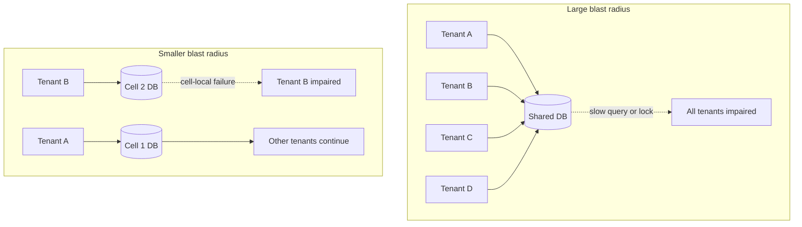
```mermaid
flowchart TD
    subgraph Large["Large blast radius"]
        A["Tenant A"] --> DB1[("Shared DB")]
        B["Tenant B"] --> DB1
        C["Tenant C"] --> DB1
        D["Tenant D"] --> DB1
        DB1 -. "slow query or lock" .-> X["All tenants impaired"]
    end

    subgraph Small["Smaller blast radius"]
        A2["Tenant A"] --> C1[("Cell 1 DB")]
        B2["Tenant B"] --> C2[("Cell 2 DB")]
        C2 -. "cell-local failure" .-> Y["Tenant B impaired"]
        C1 --> Z["Other tenants continue"]
    end
```

The point of isolation is not that every tenant, feature, or service must have a completely separate stack. Isolation has cost: more operational complexity, more capacity fragmentation, more deployment machinery, and more places to observe. The point is to isolate where failure would otherwise violate important promises. Critical and optional paths should not share unlimited resources. Tenants with very different risk profiles should not always share fate. A global control plane should be treated as a critical dependency and designed with extra caution because its blast radius is naturally large.

### 4.2 Bulkheads, Cells, and Failure Domains

The bulkhead pattern borrows from ship design: compartments prevent a breach in one section from sinking the whole vessel. In software, bulkheads can be thread pools, connection pools, queues, process groups, Kubernetes namespaces with quotas, database shards, tenant cells, regional deployments, or independent control-plane partitions. AWS Well-Architected guidance connects bulkhead and cell-based architectures to reduced scope of impact, and Microsoft Azure guidance describes bulkheads as a way to preserve some functionality when one part fails.

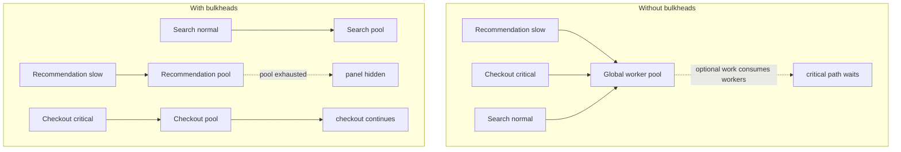
```mermaid
flowchart TD
    subgraph Without["Without bulkheads"]
        P["Global worker pool"]
        R["Recommendation slow"] --> P
        C["Checkout critical"] --> P
        S["Search normal"] --> P
        P -. "optional work consumes workers" .-> O["critical path waits"]
    end

    subgraph With["With bulkheads"]
        RP["Recommendation pool"]
        CP["Checkout pool"]
        SP["Search pool"]
        R2["Recommendation slow"] --> RP
        C2["Checkout critical"] --> CP
        S2["Search normal"] --> SP
        RP -. "pool exhausted" .-> RR["panel hidden"]
        CP --> OK["checkout continues"]
    end
```

Cell-based architecture extends the same idea to larger slices of a workload. A cell is an independent replica or partition that serves a subset of traffic, often selected by tenant, account, geography, or another stable routing key. If a bad deployment, poison request, data hot spot, or overload condition affects one cell, the design goal is that other cells continue operating. Cells are not free: you need routing, deployment, observability, capacity planning, and data movement rules. They are most valuable where a global fleet would otherwise create unacceptable shared fate.

### 4.3 Isolation Boundaries Must Match Failure Modes

Isolation only works if the boundary contains the failure mode you actually face. Separate application deployments do not protect you from a shared database lock. Separate database schemas do not protect you from a shared connection pool. Separate Kubernetes namespaces do not protect you from a shared cluster-level DNS outage. Separate regions do not protect you from a globally pushed configuration error unless rollout, validation, and rollback are also regionalized. Every boundary should be tested against a named failure mode, not accepted because it sounds resilient.

For each high-risk row in your FMEA, ask what boundary stops propagation. If the risk is thread exhaustion, the boundary might be per-dependency concurrency limits. If the risk is tenant overload, the boundary might be per-tenant rate limits and worker queues. If the risk is bad deployment, the boundary might be canaries, progressive rollout, and cell-local deployment waves. If the risk is stale or corrupt data, the boundary might be validation, versioned writes, reconciliation, and read paths that can reject impossible states. The boundary is only real when it changes the failure's effect.

---

## Part 5: Common Failure Patterns

### 5.1 Cascading Failure

A cascading failure occurs when one component failure causes dependent components to fail, which then cause their dependents to fail. Google SRE material emphasizes that capacity planning alone is not enough to prevent cascades because unexpected load distribution, network partitions, or dependency failures can create pockets of overload. The cascade often begins with a shortage somewhere: CPU, threads, connections, queue capacity, or human attention. The shortage changes the behavior of callers, and those caller behaviors push more stress into the system.

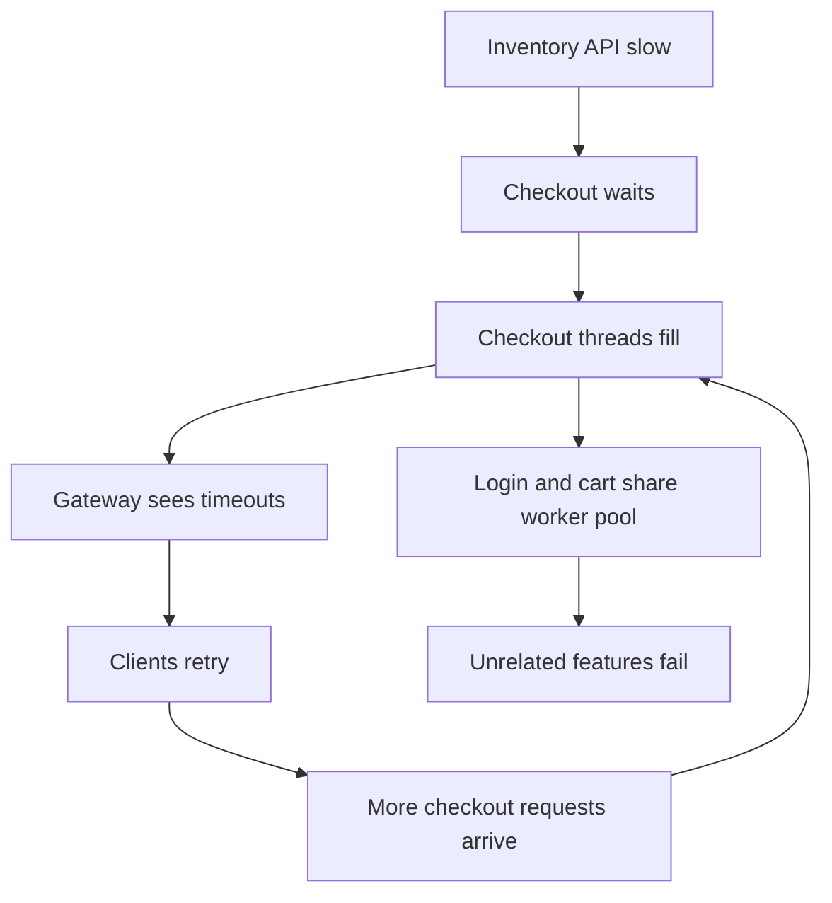
```mermaid
flowchart TD
    A["Inventory API slow"] --> B["Checkout waits"]
    B --> C["Checkout threads fill"]
    C --> D["Gateway sees timeouts"]
    D --> E["Clients retry"]
    E --> F["More checkout requests arrive"]
    F --> C
    C --> G["Login and cart share worker pool"]
    G --> H["Unrelated features fail"]
```

The key defense is to break dependency chains before they become shared failure chains. Use bounded timeouts so callers do not wait forever. Use circuit breakers so persistent failures are not called repeatedly. Use async work where the user promise allows it. Use load shedding when total work exceeds capacity. Use separate pools for unrelated request classes. Most importantly, design the caller's failure behavior as carefully as the callee's normal behavior. A caller that retries aggressively, waits indefinitely, or queues unbounded work can be more dangerous than the dependency that first became slow.

### 5.2 Retry Storm

Retries are a reliability tool only when the original fault is likely to be transient and the retry is cheaper than surfacing an error. They become a failure amplifier when many clients retry the same persistent fault at the same time. AWS Builders' Library guidance on timeouts, retries, backoff, and jitter explains why retries need caps, backoff, and randomness: immediate retries create correlated traffic precisely when the downstream is least able to accept extra work. Microsoft Azure guidance on retry storms gives the same practical warning: retry policies must be finite, delayed, and observable.

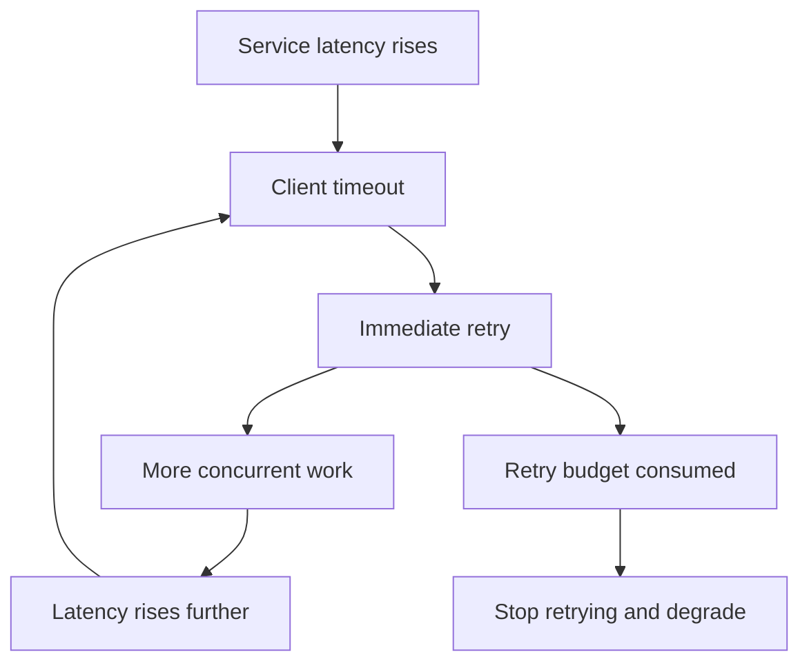
```mermaid
flowchart TD
    A["Service latency rises"] --> B["Client timeout"]
    B --> C["Immediate retry"]
    C --> D["More concurrent work"]
    D --> E["Latency rises further"]
    E --> B
    C --> F["Retry budget consumed"]
    F --> G["Stop retrying and degrade"]
```

A safe retry policy has a reason, a budget, and a stop condition. The reason is the failure class: network hiccups, temporary throttling, or leader failover may be retryable; validation errors, authorization failures, and persistent overload usually are not. The budget limits attempts across the full user operation, not per function call. The stop condition may be a deadline, circuit-breaker state, retry budget exhaustion, or an explicit server signal such as rate limiting. Adding jitter prevents synchronized clients from forming a second traffic spike after the first one.

### 5.3 Thundering Herd

A thundering herd happens when many clients perform the same expensive action at the same time. The trigger might be a cache entry expiring, a leader election completing, a scheduled job running on every instance, a daily reset, a regional failover, or a deployment that restarts many clients together. The failure pattern is synchronization: individually reasonable clients become dangerous because they are aligned. A cache miss is ordinary; a cache miss by every client for the same hot key is a database event.

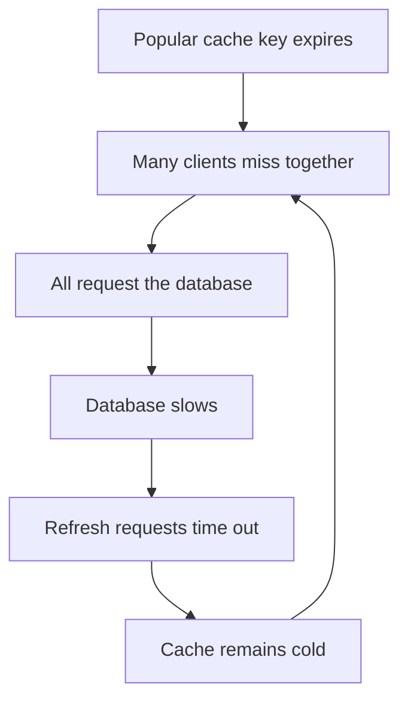
```mermaid
flowchart TD
    A["Popular cache key expires"] --> B["Many clients miss together"]
    B --> C["All request the database"]
    C --> D["Database slows"]
    D --> E["Refresh requests time out"]
    E --> F["Cache remains cold"]
    F --> B
```

The usual defenses are desynchronization and coalescing. Add jitter to cache expiration so hot keys do not expire at the same instant. Use request coalescing so one request refreshes a key while other callers wait or receive stale data. Warm caches before traffic shifts. Use stale-while-revalidate behavior where correctness allows it. Rate-limit expensive refreshes separately from normal reads. The important design idea is that a distributed system needs randomness and coordination in the right places: randomness to avoid synchronized spikes, coordination to avoid duplicated expensive work.

### 5.4 Resource Exhaustion

Resource exhaustion is often the hidden engine behind cascades. Threads, file descriptors, database connections, ephemeral ports, disk space, memory, queue slots, API quotas, and human attention are finite. When a slow dependency causes requests to wait, the waiting consumes resources. When retries multiply work, the extra work consumes resources. When a queue accepts unbounded input, the queue moves failure from request latency to memory, disk, or delayed processing. The symptom may be an application error, but the mode is scarcity.

Resource exhaustion is especially dangerous because adding capacity can delay the failure without changing the shape of the curve. Doubling a connection pool can let a slow query hold twice as many connections and push twice as much concurrent work into the database. Increasing a queue limit can hide overload until recovery requires draining a much larger backlog. Raising pod count can create more clients competing for the same downstream. The correct fix is often a boundary: per-feature pools, queue admission control, backpressure, load shedding, and deadlines that release scarce resources promptly.

### 5.5 Gray Failure

Gray failure deserves separate attention because it defeats simple health thinking. A component can be alive, passing probes, and still failing for a subset of workloads. A storage node might be slow only for certain access patterns. A network path might drop packets only between certain zones. A service might succeed for small requests and time out for large ones. A dependency might be healthy from its own metrics but unhealthy from the caller's perspective. In these cases, "is the component up?" is the wrong question.

The defense is multi-perspective observability tied to user symptoms. Synthetic checks should exercise important paths, not only shallow health endpoints. Metrics should be sliced by tenant, cell, zone, dependency, request type, and status so partial failures are visible. Callers should record dependency latency, timeout, retry, and circuit-breaker state from their own point of view. Load balancers and routers should be cautious about routing around gray failures, because moving all traffic away from a suspected component can overload the remaining pool if the diagnosis is wrong or incomplete.

### 5.6 Metastable Failure

A metastable failure is a state where a system remains overloaded even after the original trigger is removed. The triggering spike may be gone, but queues are full, caches are cold, retries are active, clients are synchronized, or background recovery work is consuming the capacity needed to serve new requests. Research on metastable failures in distributed systems frames this as a bad stable state: the system has enough reinforcing behavior to keep itself unhealthy until an operator deliberately breaks the loop.

Metastability changes the mitigation strategy. If the system is stuck because backlog processing consumes all capacity, simply waiting may not recover it. You may need to shed queued work, drain a poison partition, disable retries, bypass optional features, warm caches out of band, or temporarily reject new work so the system can return to a healthy operating region. This is why incident response should include "break the loop" actions, not only "fix the trigger" actions. Removing the spark does not help if the fire is now feeding itself.

---

## Current Landscape

Modern cloud platforms provide many primitives that help with failure-mode design, but none of them remove the need to reason about effects. Kubernetes restarts crashed containers, but it cannot know whether a restarted service is returning correct business data. Managed load balancers can remove unhealthy targets, but they rely on health signals you design. Service meshes can enforce timeouts and circuit breakers, but bad defaults can still wait too long or retry too aggressively. Cloud regions and availability zones provide failure domains, but application state, deployment systems, and identity dependencies can recreate global shared fate above them.

| Tool or Approach | What It Helps With | Main Caution |
|---|---|---|
| Kubernetes probes and restarts | Crash and hang recovery | Probes must exercise meaningful health, not only process liveness |
| Resource quotas and limits | Namespace or workload blast radius | Limits without priorities can still starve critical work |
| Service mesh policies | Timeouts, retries, circuit breaking | Central defaults can amplify failure if applied blindly |
| Feature flags | Fast degradation and rollback | Flags need owners, testing, and safe default states |
| Cell-based architecture | Tenant or shard fault isolation | Routing, observability, and data movement become more complex |
| Chaos and game days | Verifying FMEA assumptions | Experiments must be bounded and tied to learning goals |

The practical pattern is layered defense. Use platform controls for coarse boundaries, application controls for product-aware decisions, and operational controls for human recovery. A namespace quota can stop one team from consuming a whole cluster, but it cannot decide whether checkout should win over recommendations. A circuit breaker can stop calls to a failing dependency, but it cannot decide whether the user should see cached data or a hard error. Reliability work is strongest when each layer knows what decision it is responsible for.

---

## Best Practices

1. **Name the failure mode, not just the component** - "Redis failed" is too vague for design work. "Redis accepts connections but hot-key reads time out" points to caller timeouts, cache fallback, request coalescing, and database protection. Precise names help teams choose mitigations that match the actual shape of failure.
2. **Protect critical paths from optional work** - Optional features should have lower budgets, shorter timeouts, smaller pools, and fast fallbacks when they threaten shared resources. The product can still be rich in normal conditions, but critical user promises must have reserved capacity during stress.
3. **Make retries spend a shared budget** - Retries should respect the original deadline and stop when the operation is no longer useful. A retry that creates a new full timeout at every layer can turn one user request into a large hidden tree of work.
4. **Use isolation where blast radius matters** - Bulkheads, cells, shards, quotas, and per-tenant routing are worth their complexity when they contain important failure modes. Do not add isolation merely for architectural neatness; add it where the FMEA shows shared fate is dangerous.
5. **Test degradation paths before incidents** - A fallback path that is never exercised may be broken, stale, too slow, or unsafe. Controlled failure injection and game days turn graceful degradation from a diagram into evidence.
6. **Observe from the caller's point of view** - A dependency's self-reported health is useful, but the caller experiences latency, errors, retries, and timeouts. Caller-side metrics are essential for gray failures and partial outages.
7. **Document recovery actions that break loops** - Incident runbooks should include actions such as disabling retries, shedding optional work, opening a circuit breaker, draining a queue, or isolating a tenant. Restarting components is not enough when the system is sustaining its own overload.

---

## Anti-Patterns

| Anti-Pattern | Why It's Dangerous | Better Approach |
|---|---|---|
| "Everything retries three times" | Multiplies load without understanding failure type or deadline | Retry only retryable faults with budget, backoff, jitter, and stop conditions |
| One global connection pool | Optional or low-priority work can starve critical paths | Separate pools by dependency, feature, tenant, or priority |
| Health check equals homepage success | A shallow probe misses gray and path-specific failures | Add end-to-end probes and caller-side dependency metrics |
| Same timeout everywhere | Fast dependencies wait too long and slow dependencies fail too late | Derive timeouts from caller deadlines and dependency behavior |
| FMEA done once at launch | System behavior changes with traffic, dependencies, and deployments | Review FMEA after major architecture, traffic, or incident changes |
| "Add capacity" as the default fix | More capacity can hide or amplify reinforcing loops | Identify the loop, add boundaries, shed load, or change caller behavior |
| Fallback without product review | The system may silently violate user or business promises | Define safe degradation levels with product, legal, and operations input |
| Isolation boundary not tested | Assumed bulkheads may share hidden resources | Run controlled tests that prove the boundary contains the named failure |

---

## Did You Know?

- **FMEA and FMECA are documented reliability-engineering practices, not software folklore.** IEC 60812 describes how failure modes and effects analysis is planned, performed, documented, and maintained, while NASA GSFC guidance describes FMECA as a living risk assessment for missions and infrastructure. The software version should keep that "living" idea: update it as architecture, traffic, dependencies, and operational knowledge change.

- **NASA's Mars Climate Orbiter is a famous interface-failure lesson.** NASA describes the mission as unsuccessful because ground software used English units while another system expected metric units, which sent the spacecraft too close to Mars. The lesson for platform engineers is not merely "use metric"; it is that interface assumptions are failure modes and need validation at system boundaries.

- **Gray failures are hard because observers disagree.** Public Microsoft Azure research and USENIX material describe gray failures as subtle faults where some parts of the system see health and others see failure. That is why a dashboard built only from component self-checks can miss the user-visible symptom that matters.

- **Backoff without jitter is often not enough.** AWS guidance on exponential backoff and jitter shows why deterministic retry timing can keep clients synchronized. Jitter deliberately adds randomness so clients spread their retry attempts instead of creating repeated traffic waves.

---

## Common Mistakes

| Mistake | Problem | Solution |
|---|---|---|
| Describing failures only as "down" | Hides slow, gray, partial, and silent failure modes | Classify visibility, scope, duration, and detectability |
| Retrying persistent failures | Converts a dependency problem into overload | Use finite retries, backoff, jitter, budgets, and circuit breakers |
| Letting optional features share critical resources | Low-priority work can consume checkout, login, or control-plane capacity | Add bulkheads, priority queues, and separate pools |
| Treating FMEA scores as precise measurements | Spreadsheet numbers can hide weak assumptions | Define scales, document rationale, and validate with tests |
| Designing fallbacks without testing them | The fallback may be broken or unsafe when needed | Exercise degradation paths in game days and automated tests |
| Measuring only aggregate health | Partial tenant, zone, shard, or workload failures disappear in averages | Slice metrics and add caller-side dependency telemetry |
| Assuming redundancy equals isolation | Redundant instances can still share one failing control plane or data store | Map shared dependencies and failure domains explicitly |
| Increasing limits during every incident | Larger limits may delay collapse while increasing downstream pressure | Find the scarce resource and add backpressure or shedding |

---

## Quiz

1. **Scenario: A catalog service becomes slow but does not crash. The product page waits for catalog data, the gateway waits for the product page, clients retry timeouts immediately, and login begins failing because the web tier uses one shared worker pool. What kind of incident is this, and what would you trace first?**
   

   
Answer

   This is a cascading failure, and you should **analyze cascading failures by tracing how a single-component failure propagates through dependent services** and shared resources. The starting mode is fail-slow behavior in catalog, but the effect moves through waiting callers, immediate retries, and a shared worker pool until unrelated login traffic is impaired. The first trace should follow the dependency chain and the resource chain: catalog latency, product-page wait time, gateway timeout behavior, client retry volume, and worker-pool occupancy. The mitigation should break propagation with bounded timeouts, retry budgets, circuit breakers, and separate pools for critical and non-critical request classes.
   

2. **Scenario: Your team is launching a new order-history service. It depends on a database, a cache, a message queue, and a profile API. Before launch, the team wants a structured way to identify which failures could harm users and which mitigations must ship first. What technique should you use, and what should the rows contain?**
   

   
Answer

   Use FMEA and **apply Failure Mode and Effects Analysis (FMEA) to identify high-risk failure paths** before production traffic arrives. Each row should name a component or function, a specific failure mode, the local effect, the downstream or user effect, severity, occurrence or likelihood, detection difficulty, existing controls, proposed mitigation, and an owner. The row should be concrete enough to change a design decision; "database fails" is too vague, while "database accepts connections but order-history queries exceed the caller deadline and hold the checkout pool" points to timeouts, pool isolation, fallback behavior, and user messaging.
   

3. **Scenario: A service returns HTTP 200 for every request, but a small subset of users later report that tax totals were wrong on invoices. Dashboards showed normal latency and error rate during the period. How should you classify this failure, and why is it high priority even if the request volume was small?**
   

   
Answer

   You should **classify failure modes by visibility, scope, duration, detectability, recoverability, impact, and frequency**. This is a silent correctness failure because the system reported success while producing wrong data, and its detectability was poor because normal latency and error-rate dashboards did not reveal the problem. Even with small scope, the priority can be high because impact may include financial correction, audit work, customer trust, and manual reconciliation. The right response is validation, reconciliation, invariant checks, repair tooling, and domain-specific alerts, not merely restarts or more availability metrics.
   

4. **Scenario: A recommendation model dependency times out during peak traffic. The product manager says recommendations are optional, but the API currently waits for the model before returning the product page. What graceful degradation plan would you propose?**
   

   
Answer

   You should **design graceful degradation and blast-radius containment strategies including bulkheads**, short timeouts, and feature-level fallbacks. The product page should give the recommendation call a small budget, cancel it when the caller deadline is nearly spent, and fall back to cached recently viewed items, popular category items, or hiding the panel. Recommendation work should use a separate worker or connection pool so it cannot starve product-page or checkout capacity. The plan also needs observability: a metric for degradation level, circuit-breaker state, fallback rate, and user-facing product-page latency.
   

5. **Scenario: A payment provider returns persistent timeouts for several minutes. Clients retry three times with no backoff, the gateway also retries, and a rate limiter starts returning 429s that clients retry again. Which controls are misconfigured, and how should they change?**
   

   
Answer

   You should **evaluate whether retry logic, rate limiters, circuit breakers**, and client policies are preventing or amplifying the failure cascade. The client retries and gateway retries are multiplying load across layers, the lack of backoff and jitter synchronizes traffic, and retrying 429 responses can turn a rate limiter into a feedback loop. Use a single shared deadline, finite retry budget, exponential backoff with jitter for retryable transient faults, no retry for persistent or non-retryable failures, and a circuit breaker that stops calls while the provider is unhealthy. Rate-limit responses should include clear client behavior, and clients should respect those signals rather than hammering the service.
   

6. **Scenario: A cache key for a popular dashboard expires at the same moment on every application instance. All instances miss the cache, all query the database, the database slows, refreshes time out, and the cache remains empty. What pattern is this, and which mitigations directly address the pattern?**
   

   
Answer

   This is a thundering herd that can become a cascading failure if the database slowdown triggers retries and connection exhaustion. The direct mitigations are TTL jitter, request coalescing, stale-while-revalidate behavior where safe, cache warming before expected traffic shifts, and a separate cap on expensive refresh work. Adding more database connections alone is incomplete because it can increase concurrency against the database without breaking synchronization. The goal is to spread refreshes over time and ensure only a small number of callers perform expensive regeneration for a hot key.
   

7. **Scenario: A storage node passes its local health check, but one tenant sees high write latency and another tenant is unaffected. The load balancer keeps sending traffic because aggregate success rate looks normal. What failure category is this, and what observability would make it visible sooner?**
   

   
Answer

   This is a gray failure: one observer sees the system as healthy while another observer experiences failure. Aggregate metrics hide the partial scope, so you need caller-side dependency latency, timeout, and retry metrics sliced by tenant, cell, zone, request class, and storage target. Synthetic checks should exercise realistic write paths instead of only shallow node health. The mitigation may include routing away from the impaired target, but the routing decision should be careful because moving all affected traffic can overload other targets if the underlying cause is not well understood.
   

8. **Scenario: After a short traffic spike, incoming traffic returns to normal but the service remains unavailable. Queues are full, retries are still active, and cache refresh work consumes most worker capacity. Why did the system not recover by itself, and what incident actions could break the loop?**
   

   
Answer

   The system is in a metastable failure state: the original trigger is gone, but backlog, retries, cold caches, and recovery work keep the system overloaded. Waiting may not help because the unhealthy state is self-sustaining. Useful incident actions include temporarily shedding low-priority work, disabling or reducing retries, opening circuit breakers, serving stale cache entries where safe, draining or dropping non-critical queues, warming hot cache keys out of band, and reserving worker capacity for live critical requests. The recovery plan should break the reinforcing loop before attempting a full return to normal traffic.
   

---

## Hands-On Exercise

**Task:** Conduct a mini-FMEA and blast-radius review for a checkout-style system. You can use a system you operate, or use the reference architecture below. The goal is not to produce a perfect spreadsheet; the goal is to practice naming failure modes precisely, tracing effects across dependencies, and choosing mitigations that change the outcome rather than merely describing the problem.

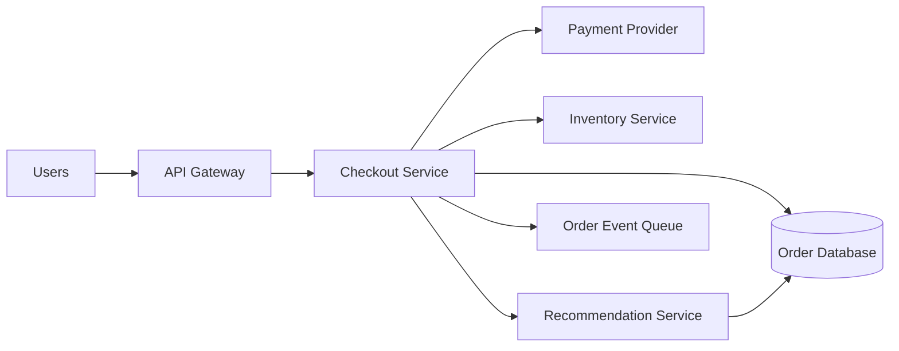
```mermaid
flowchart LR
    U["Users"] --> G["API Gateway"]
    G --> C["Checkout Service"]
    C --> P["Payment Provider"]
    C --> I["Inventory Service"]
    C --> DB[("Order Database")]
    C --> R["Recommendation Service"]
    R --> DB
    C --> Q["Order Event Queue"]
```

**Part 1: Map the critical path.** Identify which calls must succeed for checkout to make an honest promise to the user, which calls are optional, and which resources are shared between critical and optional work. Write down the user promise for each path. For example, "payment authorization must not be claimed unless provider confirmation is received" is a different promise from "recommendations should be useful when available."

**Part 2: Fill out the FMEA table.** Choose at least six failure modes across at least four components. Include one slow failure, one silent or gray failure, one resource-exhaustion failure, and one dependency failure. Use relative scores if you do not have real data, but document the assumption behind each score so another engineer can challenge it.

| Component | Failure Mode | User Effect | Severity | Occurrence | Detection Difficulty | Current Control | Better Mitigation |
|---|---|---|---|---|---|---|---|
| | | | | | | | |
| | | | | | | | |
| | | | | | | | |
| | | | | | | | |
| | | | | | | | |
| | | | | | | | |

**Part 3: Design degradation paths.** Pick the highest-risk optional feature and define at least four degradation levels. For each level, include the trigger, user experience, resource boundary, and recovery condition. Make sure the fallback cannot consume the same scarce resource that caused the degradation in the first place.

| Level | Trigger | User Experience | Resource Boundary | Recovery Condition |
|---|---|---|---|---|
| Full | | | | |
| Degraded | | | | |
| Fallback | | | | |
| Off | | | | |

**Part 4: Reduce blast radius.** Identify the largest shared-fate boundary in the architecture. It might be a global database, one worker pool, one queue, one tenant routing layer, one deployment pipeline, or one provider dependency. Propose one containment strategy and explain exactly which failure mode it contains. If your proposal is "split the database," explain whether the failure mode is locks, load, schema deployment, data corruption, or tenant isolation; different modes require different boundaries.

**Success Criteria:**

- [ ] At least six failure modes are named precisely enough to imply different mitigations.
- [ ] At least one cascading path is traced from trigger to user-visible effect.
- [ ] At least one graceful degradation path preserves a core user promise while reducing optional work.
- [ ] At least one blast-radius boundary is proposed and tied to a specific failure mode.
- [ ] Retry, rate-limit, timeout, and circuit-breaker behavior is evaluated as possible amplification, not assumed safe.

---

## Key Takeaways

Failure modes are the shapes failure can take, and those shapes determine the right response. Crashes, hangs, fail-slow behavior, gray failures, silent corruption, resource exhaustion, dependency outages, and configuration errors all require different controls. If you only ask whether a component is "up," you will miss many of the failures that matter most to users.

FMEA is valuable because it forces consequence tracing before launch. The best rows name a specific mode, follow the effect across dependencies, describe user impact, evaluate detection difficulty, and assign a mitigation owner. The spreadsheet is not the goal; the goal is a shared mental model that changes architecture, tests, dashboards, and runbooks.

Graceful degradation is a product-aware reliability pattern. It preserves core promises by reducing fidelity, freshness, personalization, or optional features when full behavior is too costly or unsafe. It works only when paired with budgets and resource boundaries; otherwise optional work can consume critical capacity before the fallback appears.

Blast radius is shared fate made visible. Bulkheads, cells, quotas, shards, separate pools, staged deployments, and feature flags all reduce blast radius when they match the failure mode. Isolation that does not contain the named mode is only organizational comfort.

Retries, rate limiters, and circuit breakers are not automatically good. A retry can mask a transient blip or create a storm. A rate limiter can protect a server or synchronize angry clients. A circuit breaker can preserve capacity or fail a critical path too aggressively. Evaluate each control by asking whether it damps or amplifies the dominant failure loop.

---

## Sources

- [Google SRE Book: Addressing Cascading Failures](https://sre.google/sre-book/addressing-cascading-failures/)
- [Google SRE Book: Handling Overload](https://sre.google/sre-book/handling-overload/)
- [Google SRE Book: Production Services Best Practices](https://sre.google/sre-book/service-best-practices/)
- [AWS Builders' Library: Timeouts, retries, and backoff with jitter](https://aws.amazon.com/builders-library/timeouts-retries-and-backoff-with-jitter/)
- [AWS Architecture Blog: Exponential Backoff and Jitter](https://aws.amazon.com/blogs/architecture/exponential-backoff-and-jitter/)
- [AWS Well-Architected: Use bulkhead architectures to limit scope of impact](https://docs.aws.amazon.com/wellarchitected/latest/framework/rel_fault_isolation_use_bulkhead.html)
- [AWS Well-Architected: Implement graceful degradation](https://docs.aws.amazon.com/wellarchitected/latest/reliability-pillar/rel_mitigate_interaction_failure_graceful_degradation.html)
- [AWS Well-Architected: What is a cell-based architecture?](https://docs.aws.amazon.com/wellarchitected/latest/reducing-scope-of-impact-with-cell-based-architecture/what-is-a-cell-based-architecture.html)
- [Microsoft Azure Architecture Center: Bulkhead Pattern](https://learn.microsoft.com/en-us/azure/architecture/patterns/bulkhead)
- [Microsoft Azure Architecture Center: Circuit Breaker Pattern](https://learn.microsoft.com/en-us/azure/architecture/patterns/circuit-breaker)
- [Microsoft Azure Architecture Center: Retry Storm Antipattern](https://learn.microsoft.com/en-us/azure/architecture/antipatterns/retry-storm/)
- [Google Cloud Architecture Framework: Design for graceful degradation](https://docs.cloud.google.com/architecture/framework/reliability/graceful-degradation)
- [NASA GSFC: Guideline for Failure Modes and Effects Analysis and Risk Assessment](https://standards.nasa.gov/standard/GSFC/GSFC-HDBK-8004)
- [IEC 60812:2018 - Failure modes and effects analysis (FMEA and FMECA)](https://webstore.iec.ch/en/publication/26359)
- [USENIX SREcon24 Americas: Gray Failure - The Achilles' Heel of Cloud-Scale Systems](https://www.usenix.org/conference/srecon24americas/presentation/li)
- [SIGOPS HotOS 2021: Metastable Failures in Distributed Systems](https://sigops.org/s/conferences/hotos/2021/papers/hotos21-s11-bronson.pdf)
- [NASA Science: Mars Climate Orbiter](https://science.nasa.gov/mission/mars-climate-orbiter/)
- [Richard Cook: How Complex Systems Fail](https://www.adaptivecapacitylabs.com/HowComplexSystemsFail.pdf)

---

## Further Reading

For deeper study, read Michael Nygard's *Release It!* for practical stability patterns such as circuit breakers, bulkheads, and timeouts; Donella Meadows' *Thinking in Systems* for feedback-loop reasoning; and Alex Hidalgo's *Implementing Service Level Objectives* for connecting reliability targets to user-visible promises. Pair those books with incident reviews from systems you operate, because the strongest learning comes from mapping these concepts onto real dependency graphs, real queues, real on-call pressure, and real product promises.

---

## Next Module

[Module 2.3: Redundancy and Fault Tolerance](../module-2.3-redundancy-and-fault-tolerance/) - Now that you understand how systems fail, learn how to build systems that continue working when components fail.
