> **Complexity**: `[MEDIUM]`
>
> **Time to Complete**: 45-50 minutes
>
> **Prerequisites**: [Module 2.2: Failure Modes and Effects](../module-2.2-failure-modes-and-effects/)
>
> **Track**: Foundations

### What You'll Be Able to Do

After completing this module, you will be able to:

1. **Design** redundancy architectures (active-active, active-passive, N+M) appropriate for different failure domains and strict budget constraints.
2. **Evaluate** distributed systems to determine whether redundant components are truly independent or whether they share hidden common-cause failure modes.
3. **Implement** fault-tolerance patterns, specifically configuring leader election and calculating quorum-based writes to prevent split-brain scenarios.
4. **Diagnose** performance degradation stemming from synchronous data replication and replication lag across geographic regions.
5. **Compare** high availability versus fault tolerance approaches when designing infrastructure for varying service tiers.

---

## Why This Module Matters

August 8, 2016. Atlanta, Georgia. Delta Airlines operates a sprawling, global flight control system powered by what on paper looked like a perfectly redundant architecture. Their data centers were equipped with dual-power feeds, backup generators, and secondary failover components across the board. 

At 2:30 AM, a small, routine power control module in their primary Atlanta data center failed. This failure should have triggered an immediate switch to backup power. Instead, the failing component caused a massive electrical surge that physically damaged the switchgear meant to route power to the backup systems. The primary data center went completely dark. Because hundreds of legacy applications had hardcoded dependencies that required the primary database to be reachable before they could fail over to the secondary site, the automated geographic redundancy failed completely.

The catastrophic sequence locked the systems in a partial failover state. The result: over 2,000 canceled flights, tens of thousands of stranded passengers globally, and a direct financial hit of $150 million. Delta had massive amounts of redundancy, but they lacked true systemic independence and isolation. The components shared a common failure domain—the switchgear—and the failover process was brittle. 

This module shifts your perspective from merely duplicating components to engineering resilient, decoupled systems. You will learn how to mathematically validate redundancy, establish robust quorum to prevent split-brain states, and ensure that when disaster strikes, your failover mechanisms act as a reliable safety net rather than a second failure point.

---

## Part 1: The Foundations of Redundancy

Redundancy is the engineering practice of provisioning extra components beyond the strict minimum required for normal operation. The core objective is that when active components fail, the redundant components seamlessly assume the load, ensuring uninterrupted service.

### 1.1 What is Redundancy?

At its simplest, redundancy introduces a secondary path for requests. 

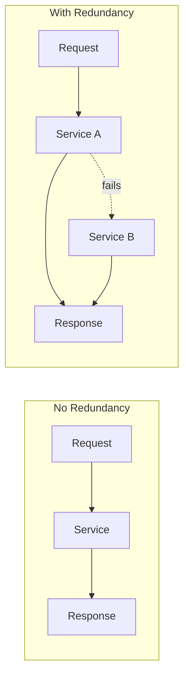

The simple addition of `Service B` provides a safety net. However, if `Service B` relies on the exact same database rack or network switch as `Service A`, the redundancy is an illusion.

### 1.2 Types of Redundancy

There are six primary categories of redundancy used in modern infrastructure.

| Type | Description | Example |
|------|-------------|---------|
| **Hardware redundancy** | Multiple physical components | RAID arrays, dual power supplies |
| **Software redundancy** | Multiple service instances | 3 replicas of a pod |
| **Data redundancy** | Multiple copies of data | Database replication |
| **Geographic redundancy** | Multiple locations | Multi-region deployment |
| **Temporal redundancy** | Retry over time | Automatic retry with backoff |
| **Informational redundancy** | Extra data for validation | Checksums, parity bits |

#### The Six Types of Redundancy - Field Guide

**1. Hardware Redundancy**
Physical duplication of hardware components within a single server or rack.
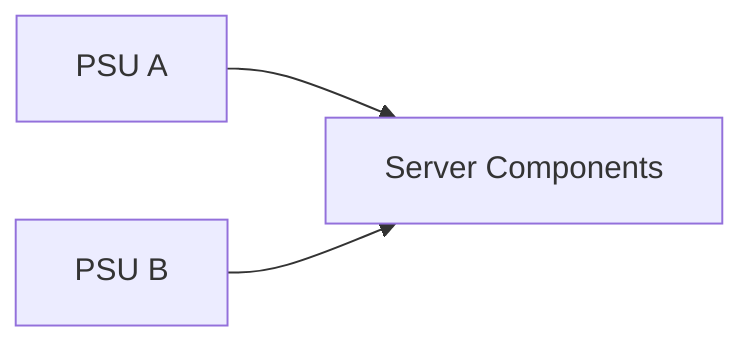

**2. Software Redundancy**
Provisioning multiple instances of identical software services.
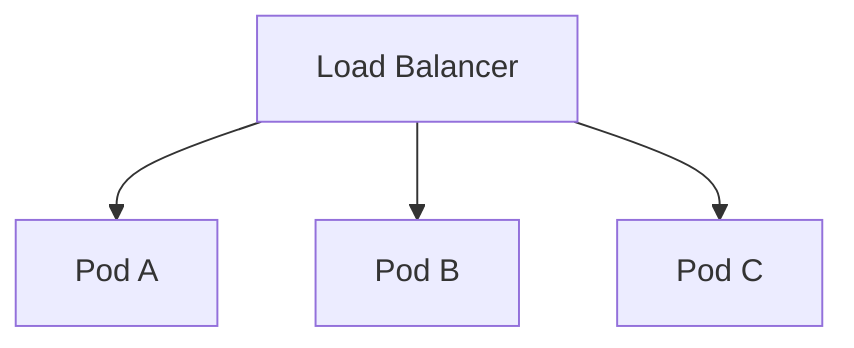

**3. Data Redundancy**
Creating secondary copies of persistent state.
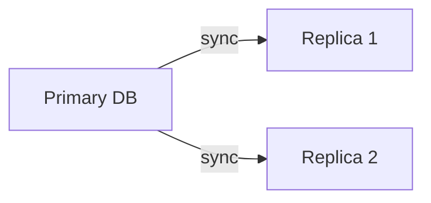

> **Stop and think**: If you use data redundancy (like database replication) but the replication is asynchronous, what happens to the data that was acknowledged to the user but hasn't replicated yet when the primary fails?

**4. Geographic Redundancy**
Distributing full infrastructure stacks across vast physical distances.
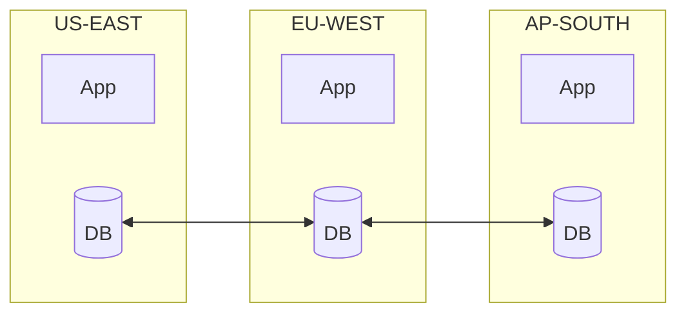

**5. Temporal Redundancy**
Executing the same operation again after a delay.
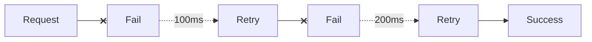

**6. Informational Redundancy**
Appending mathematical proofs to payloads.
```mermaid
flowchart LR
    A[Original: A B C D] --> B[With Checksum: A B C D | CRC32]
    A --> C[With ECC: A B C D | parity bits]
```

---

### 1.3 Redundancy Notation: N+M

Capacity planning for redundancy relies on the N+M mathematical notation.
- **N** represents the minimum number of functional components required to handle 100% of peak load.
- **M** represents the surplus components provisioned strictly to absorb failures.

**N+0: No Redundancy (Single Point of Failure)**
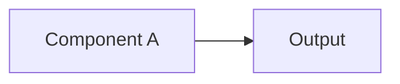
If Component A drops, an immediate system-wide outage occurs.

**N+1: One Spare**
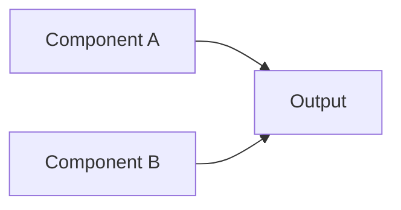
The standard deployment model for most modern microservices. If A fails, B can sustain the entire traffic load.

**N+2: Two Spares (Maintenance + Failure)**
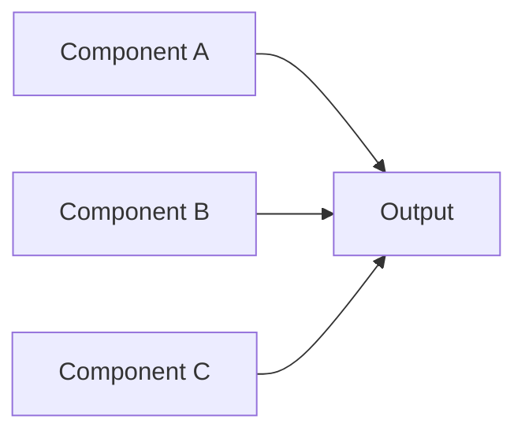
Vital for stateful systems where a node might be taken offline intentionally for a multi-hour patching window, leaving the system temporarily at N+1.

**2N: Full Duplication**
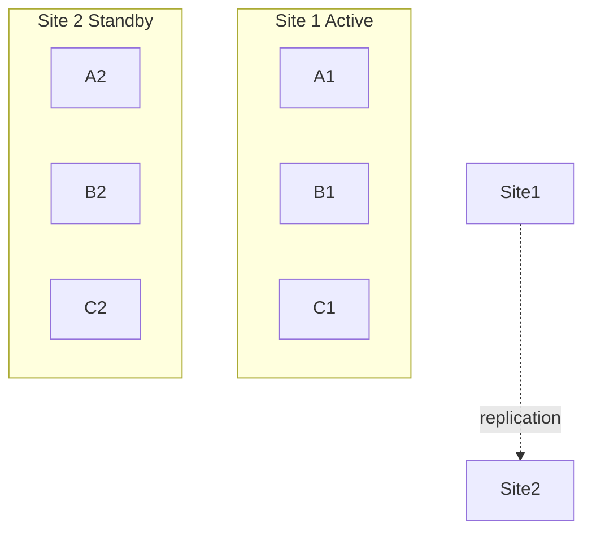

**2N+1: Full Duplication Plus Spare**
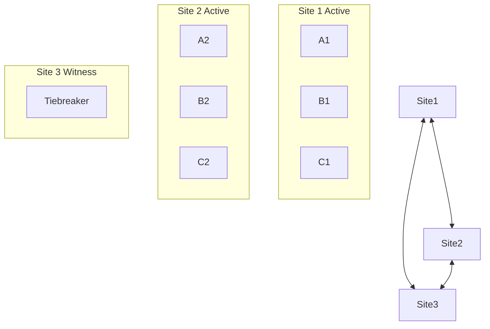

#### Capacity Planning Reality Check

A common operational anti-pattern is deploying multiple replicas without considering peak resource constraints. 

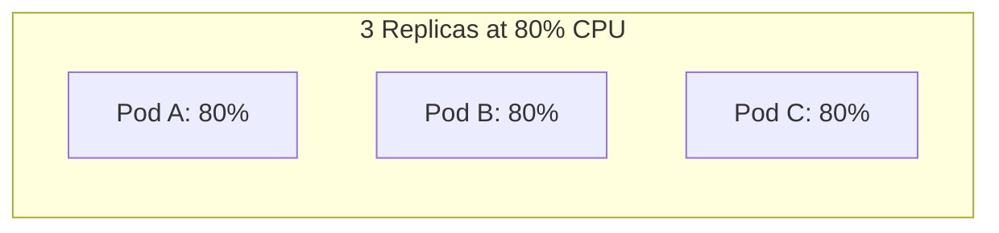

If Pod A experiences a fatal out-of-memory exception and crashes, its 80% CPU load must be instantaneously absorbed by the surviving pods.

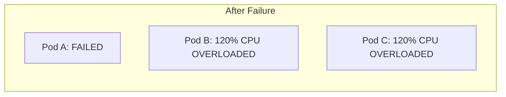

Because 120% CPU is physically impossible, Pod B and Pod C will immediately exhaust their resources, fail their health checks, and crash in a cascading failure. True N+1 requires mathematical validation: `Max load per replica = Total Load / (Number of replicas - tolerated failures)`.

> **Stop and think**: If your entire application is deployed in a single AWS Availability Zone with 50 pod replicas, do you have true redundancy against a network fiber cut or power failure in that specific data center?

---

## Part 2: High Availability vs. Fault Tolerance

While often conflated, High Availability (HA) and Fault Tolerance (FT) represent fundamentally different architectural philosophies.

### 2.1 The Distinction

| Aspect | High Availability (HA) | Fault Tolerance (FT) |
|--------|------------------------|----------------------|
| Goal | Minimize downtime | Zero downtime |
| During failure | Brief interruption okay | No interruption |
| Data loss | May lose in-flight data | No data loss |
| Cost | Moderate | High |
| Complexity | Moderate | High |
| Use case | Most web services | Financial, medical, aviation |

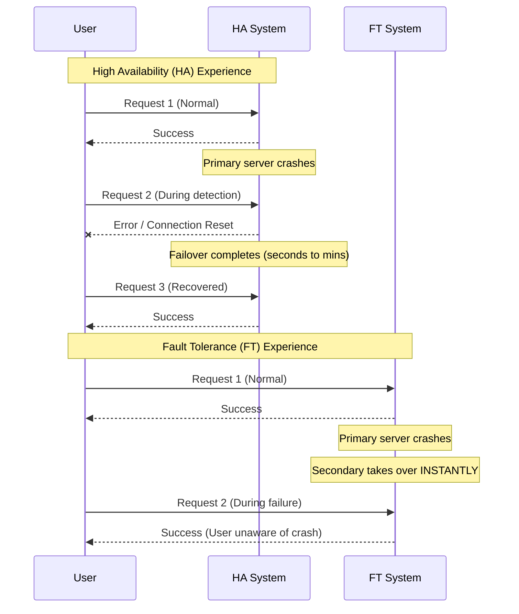

Fault Tolerance relies on continuous state synchronization. Every CPU instruction or memory write on the primary is strictly mirrored to the secondary in lock-step. If the primary burns down, the secondary proceeds from the exact same instruction clock cycle. 

> **Pause and predict**: If a payment gateway processes $1,000 per second and relies on an active-passive HA setup with a 30-second failover time, what is the minimum direct cost of a single primary node failure?

### 2.2 When to Use Which

Most modern cloud workloads only require HA. FT is reserved for environments where a dropped packet is a catastrophic event.

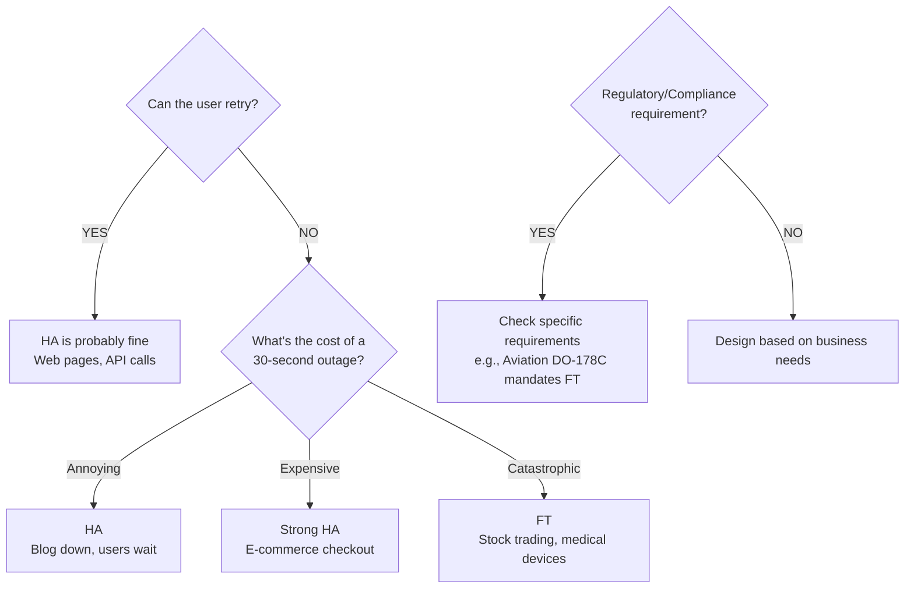

---

## Part 3: Redundancy Architectures

### 3.1 Active-Passive (Standby)

In this legacy pattern, a primary component handles all ingress traffic while a standby node receives state updates and awaits a promotion signal.

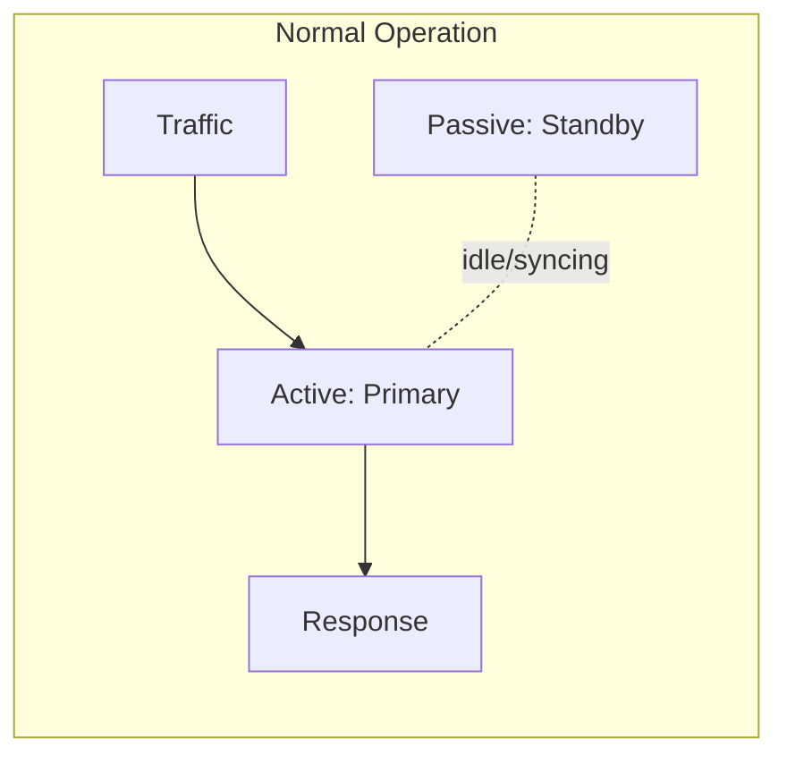

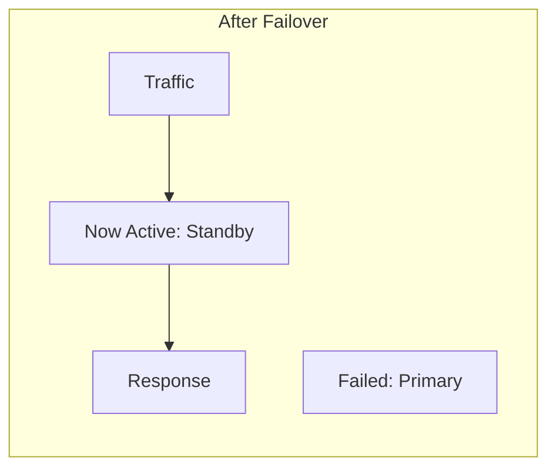

### 3.2 Active-Active (Load Shared)

In active-active topologies, all nodes sit behind a load distributor and process requests simultaneously. 

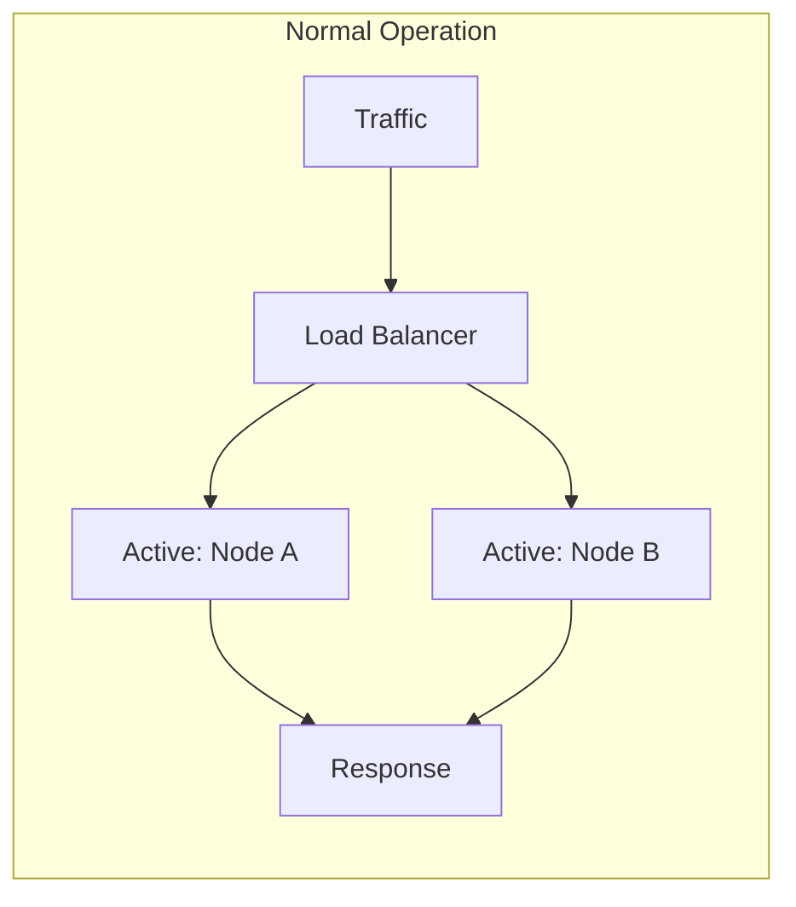

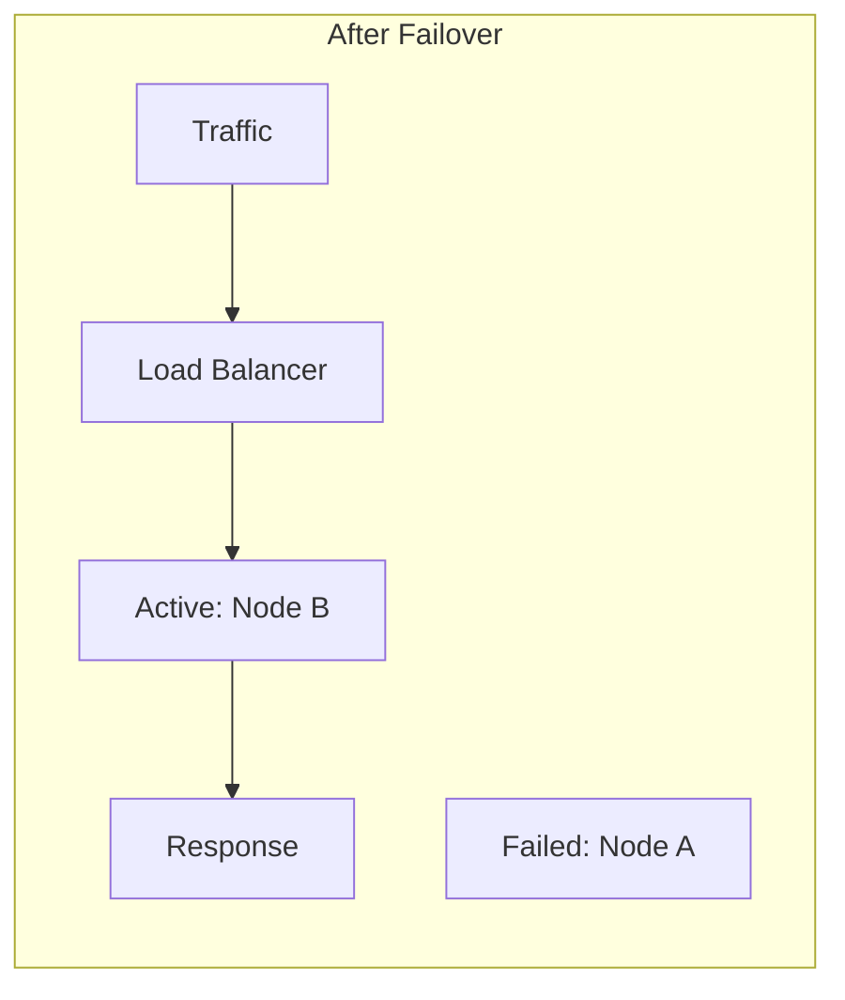

| Aspect | Active-Passive | Active-Active |
|--------|----------------|---------------|
| Resource usage | ~50% (standby idle) | ~100% |
| Failover time | Seconds to minutes | Instant |
| Complexity | Lower | Higher |
| State management | Sync to standby | Distributed state |
| Scaling | Limited | Horizontal |
| Cost efficiency | Lower | Higher |

> **Stop and think**: If an active-active architecture utilizes 100% of available resources and offers instant failover, why wouldn't you use it for every single database in your system? Consider the complexity of distributed state and data replication conflicts.

---

## Part 4: State, Quorum, and Leader Election

When redundancy intersects with persistent data, we encounter the fundamental complexities of distributed systems: network partitions, split-brain scenarios, and the critical need for consensus.

### 4.1 The Split-Brain Problem

Imagine two database instances, Node A (Primary) and Node B (Standby). They are separated by a network switch. If the switch fails, Node B can no longer reach Node A. Node B correctly assumes that it must perform a failover, and promotes itself to Primary. However, Node A is still running perfectly fine on its own side of the severed network.

Both Node A and Node B are now accepting database writes independently. This is known as a **split-brain**. When the network switch is eventually repaired, the cluster has two deeply conflicting transaction logs. Which data is correct? The answer is neither—they must be painstakingly merged, often resulting in permanent data loss.

### 4.2 Leader Election and Consensus

To prevent split-brain, distributed systems use **Leader Election** algorithms, primarily derived from consensus protocols like Paxos or Raft.

In Raft, time is divided into arbitrary terms. Nodes start as "Followers". If a Follower hears nothing from a Leader within a randomized timeout window, it becomes a "Candidate" and requests votes from the rest of the cluster.

In Kubernetes, this concept is operationalized using the **Lease API**. When you run highly available controllers (like the `kube-controller-manager`), multiple replicas boot up, but only one can actively mutate the cluster state. They compete to acquire a Lease object in the `kube-node-lease` namespace. The winner becomes the active leader and must continuously renew the lease (e.g., every 2 seconds). If the leader crashes and misses the renewal window, the lease expires, and the standby replicas immediately race to acquire it. This guarantees that only one controller loop modifies state at any given moment.

### 4.3 Quorum-Based Writes

Consensus algorithms rely entirely on the concept of **Quorum**. To safely elect a leader or commit a transaction, a strict majority of nodes must agree. 

The mathematical rule for quorum is `(N / 2) + 1`.
If you have 5 nodes, your quorum is 3. If a network partition splits your 5 nodes into a group of 3 and a group of 2, only the group of 3 can achieve quorum. They will continue functioning, while the group of 2 will automatically pause operations to prevent split-brain.

For databases like Cassandra or DynamoDB, redundancy is handled via tunable quorum reads and writes. To ensure strong consistency across replicas, the system enforces the rule:
`W + R > N`
(Write Quorum + Read Quorum > Total Replicas)

If you have 3 database replicas (`N=3`), you might configure `W=2` and `R=2`. When an application writes data, it must be successfully acknowledged by at least 2 nodes. When it reads, it must pull from at least 2 nodes and compare their timestamps. Because `2 + 2 = 4`, which is greater than `N (3)`, the read operation is mathematically guaranteed to overlap with at least one node that contains the most recent write.

---

## Part 5: Practical Redundancy Patterns

### 5.1 Database Replication

```mermaid
flowchart LR
    subgraph Primary-Replica Read Scaling
        W1[Writes] --> P1[(Primary)]
        P1 -- sync --> R1A[(Replica 1)]
        P1 -- sync --> R1B[(Replica 2)]
        Read1[Reads] --> R1A
        Read1 --> R1B
    end
```

```mermaid
flowchart LR
    subgraph Multi-Primary Write Scaling
        W2[Writes] --> P2A[(Primary A)]
        P2A <== sync ==> P2B[(Primary B)]
    end
```

> **Pause and predict**: In a multi-primary write scaling setup, what happens if two users update the exact same record simultaneously on different primary nodes before the nodes synchronize?

### 5.2 Kubernetes Redundancy

```mermaid
flowchart TD
    T[Traffic] --> Svc[Service / LB]
    subgraph Node 1
        PodA[Pod A]
    end
    subgraph Node 2
        PodB[Pod B]
    end
    subgraph Node 3
        PodC[Pod C]
    end
    Svc --> PodA
    Svc --> PodB
    Svc --> PodC
```

Pod anti-affinity prevents the Kubernetes scheduler from clustering redundant workloads onto the same underlying physical host.

```yaml
# Kubernetes deployment with redundancy (Tested on K8s v1.35)
apiVersion: apps/v1
kind: Deployment
metadata:
  name: api-server
spec:
  replicas: 3                    # N+2 redundancy
  strategy:
    type: RollingUpdate
    rollingUpdate:
      maxUnavailable: 1          # Always keep 2 running
      maxSurge: 1
  template:
    spec:
      affinity:
        podAntiAffinity:         # Spread across nodes
          requiredDuringSchedulingIgnoredDuringExecution:
          - labelSelector:
              matchLabels:
                app: api-server
            topologyKey: kubernetes.io/hostname
      containers:
      - name: api
        resources:
          requests:
            cpu: 100m
            memory: 128Mi
        livenessProbe:           # Detect failures
          httpGet:
            path: /health
            port: 8080
          periodSeconds: 10
        readinessProbe:          # Route traffic only when ready
          httpGet:
            path: /ready
            port: 8080
          periodSeconds: 5
```

### 5.3 Multi-Region Redundancy

Global traffic management mitigates localized infrastructure collapse by steering users toward surviving geographical zones.

```mermaid
flowchart TD
    DNS[Global DNS<br>Route53, Cloudflare]
    subgraph Region A: US-East
        AppA[App]
        DBA[(DB Primary)]
    end
    subgraph Region B: EU-West
        AppB[App]
        DBB[(DB Replica)]
    end
    subgraph Region C: AP-SE
        AppC[App]
        DBC[(DB Replica)]
    end
    DNS --> AppA & AppB & AppC
    DBA <--> DBB
    DBA <--> DBC
```

### 5.4 Circuit Breaker Pattern

While not providing physical redundancy, circuit breakers intelligently sever connections to deeply degraded downstream targets, shielding the broader architecture from cascading thread pool exhaustion.

```mermaid
stateDiagram-v2
    [*] --> CLOSED : normal
    CLOSED --> OPEN : failures > threshold
    OPEN --> HALF_OPEN : timeout
    HALF_OPEN --> CLOSED : success
    HALF_OPEN --> OPEN : failure
```

```mermaid
flowchart LR
    Req[Request] --> CB{Circuit Breaker}
    CB -- CLOSED --> Svc[Service]
    CB -- OPEN --> Fallback[Fallback Response<br>cached data, default error]
```

> **Pause and predict**: In the circuit breaker pattern, what happens if the fallback response itself depends on a service that is currently experiencing an outage?

---

## Part 6: The Costs and Paradox of Redundancy

Redundancy acts as a heavy tax on operational overhead, financial budgets, and system comprehensibility. Adding moving parts fundamentally introduces complex, obscure, and unpredictable failure modes.

### 6.1 Common Redundancy Failures

| Failure | What Happens | Prevention |
|---------|--------------|------------|
| **Correlated failure** | Both primary and backup fail together | Independent failure domains |
| **Split brain** | Both think they're primary | Proper leader election, fencing |
| **Replication lag** | Backup has stale data | Monitor lag, consider sync replication |
| **Untested failover** | Failover doesn't work when needed | Regular failover drills |
| **Config drift** | Backup has different config | Infrastructure as code, sync config |

### 6.2 The Redundancy Paradox

The paradox states that adding redundancy can mathematically decrease reliability if the failover mechanism is less stable than the components it monitors.

```mermaid
flowchart LR
    subgraph Simple System
        A[Component A<br>99% reliable] --> Out1[Output]
    end
    
    subgraph With Redundancy
        C_A[Component A<br>99% reliable] --> FL{Failover<br>Logic}
        C_B[Component B<br>99% reliable] --> FL
        FL --> Out2[Output]
    end
```

If failover logic is untested and heavily bug-ridden (e.g., 50% reliable):
`0.99 + 0.01 × 0.50 × 0.99 = 99.49%`
You spent twice the money for hardware, engineered a vastly more complicated system, and degraded your overall uptime.

### War Story: The $8.6 Million Untested Failover

**Architecture (looked great on paper):**

```mermaid
flowchart LR
    subgraph us-east-1a
        P[(Primary PostgreSQL)]
    end
    subgraph us-east-1b
        S[(Standby PostgreSQL)]
    end
    P -- streaming replication --> S
```

**Timeline of Disaster:**
- **For 7 months**: Monitoring dashboards displayed a critical 6-hour replication lag, but alerts went to an unmonitored mailbox (`ops-alerts@company.com`).
- **October 15th, 02:14 AM**: The primary database server's disk controller fails. All writes stop instantly. The application connection queue fills up.
- **02:15 AM**: An on-call engineer is paged. They check the dead primary and trigger a manual failover.
- **02:19 AM**: The standby is promoted to primary. The application reconnects. The engineer declares the incident resolved.
- **02:47 AM**: Customer service begins receiving calls about missing transactions. Everything placed since 8:00 PM the previous night has vanished.
- **02:52 AM**: The engineer finally checks and discovers the standby was 6 hours behind. The WAL files containing those transactions are trapped on the dead primary's disk controller.

The resulting data loss, combined with manual forensics, recovery, and regulatory fines, exacted an $8,581,000 toll. 

---

## Did You Know?

- **The AWS S3 standard storage class** targets 99.999999999% (11 9's) of durability by synchronously duplicating objects across multiple independent geographic Availability Zones before acknowledging the upload.
- **Google's Spanner database** utilizes TrueTime API and atomic clocks combined with GPS receivers to strictly order transactions globally, avoiding massive quorum latency.
- **RAID 5 arrays** historically lost catastrophic amounts of data during the 2010s because the mathematical rebuild process (after a single 2TB disk failed) placed overwhelming mechanical stress on the surviving older disks, causing a secondary failure before the array recovered.
- **The Domain Name System (DNS) Root Servers** utilize Anycast routing protocols—allowing hundreds of physical global servers to share exactly 13 logical IP addresses. If a physical node fails, BGP simply routes the traffic to the next closest node with zero required failover logic.

---

## Common Mistakes

| Mistake | Problem | Solution |
|---------|---------|----------|
| Same failure domain | Both replicas fail together | Spread across zones/regions |
| Not testing failover | Failover doesn't work | Regular chaos engineering |
| Sync replication everywhere | Performance impact | Use async where eventual consistency okay |
| Ignoring replication lag | Read your own writes fails | Read from primary after write |
| No health checks | Traffic sent to failed node | Implement proper health checks |
| Manual failover | Slow recovery | Automate failover |

---

## Quiz

<details>
> <summary>See Answers</summary>
>
> | System | HA or FT? | Why? |
> |--------|-----------|------|
> | Blog | HA | Users can refresh, low cost of outage |
> | Online banking | Strong HA → FT for transfers | Viewing balance: HA. Wire transfer mid-execution: FT |
> | Aircraft control | FT | Lives at stake, no retry possible at 30,000 feet |
> | E-commerce checkout | Strong HA | Lost sales hurt, but users can retry |
> | Pacemaker | FT | Life-critical, no "please try again" for heartbeats |
>
> </details>

<details>
   <summary>Answer</summary>

   A customer-facing outage would occur if a node failure happens exactly during a scheduled maintenance window or deployment rollout. With an N+1 setup (5 pods for a 4-pod load), taking one pod down for a rolling update leaves exactly 4 pods running, reducing the system to N+0 redundancy. If a sudden node crash or network partition takes out one of those remaining 4 pods, the service drops to 3 pods, which cannot handle peak traffic, leading to dropped requests and degraded performance. Using an N+2 setup (6 pods) ensures that even while one pod is down for maintenance, the system retains an N+1 posture, safely absorbing an unexpected secondary failure without impacting users.
   </details>

<details>
   <summary>Answer</summary>

   The patient portal should use the High Availability (HA) architecture, while the surgical telemetry system must use the Fault Tolerance (FT) architecture. The patient portal can tolerate a 10-second failover because the cost of failure is merely user annoyance; a patient can simply refresh their browser to retry booking an appointment. In contrast, the surgical telemetry system cannot afford even a single dropped packet or a 10-second interruption, as this could lead to catastrophic physical harm or death during an operation. Fault Tolerance is required for the robotics because the operations are not idempotent and cannot be retried by the user, justifying the massive cost premium of synchronous, lock-step execution.
   </details>

<details>
   <summary>Answer</summary>

   An active-active design fundamentally mitigates the risk of an untested, failing failover mechanism, as well as configuration drift between regions. In an active-passive setup, the standby region might not receive real-world traffic for months, meaning hidden bugs, stale firewall rules, or missing scaling limits could cause the standby to instantly crash when a failover finally shifts 100% of the load to it. By using an active-active architecture, both regions continuously serve live traffic, constantly validating their configuration, scaling behaviors, and health. This continuous validation ensures that if one region fails, the remaining region is already known to be fully operational and correctly configured to handle requests.
   </details>

<details>
   <summary>Answer</summary>

   The redundancy paradox occurs because the custom failover script introduced a new, fragile point of failure that was less reliable than the underlying Redis instances. Even if both Redis instances had 99.9% uptime, the failover script might have contained bugs, aggressive timeout thresholds, or lacked proper state management, leading to false positives where it incorrectly triggered failovers during momentary network blips. Each unnecessary failover likely caused connection drops, split-brain scenarios, or cache stampedes, meaning the system's overall reliability became bottlenecked by the lower reliability of the poorly written failover logic. True redundancy only increases reliability when the failure detection and routing mechanisms are significantly more robust than the components they monitor.
   </details>

<details>
   <summary>Answer</summary>

   Your manager is incorrect because true N+1 redundancy requires that the remaining components can fully absorb the load of a failed component without exceeding their own capacity limits. Currently, the total system load requires 225% CPU (3 pods × 75%). If Node 1 dies and Pod A is lost, that entire 225% load must be distributed across the two remaining pods, resulting in each pod attempting to run at 112.5% CPU. Because this exceeds their maximum 100% capacity, both remaining pods will become overloaded, likely failing their health probes and causing a cascading total system failure rather than a graceful degradation.
   </details>

<details>
   <summary>Answer</summary>

   When the network switch fails, Node B (the standby) loses its heartbeat connection to Node A (the primary) and incorrectly assumes Node A has crashed. Node B automatically promotes itself to primary to maintain availability, but Node A is still running and perfectly capable of receiving traffic from the application servers on its own rack. The application is now writing new user registrations to Node A and new orders to Node B, causing the two databases to wildly diverge in state. Once the switch is repaired and the nodes can communicate again, they will both possess conflicting, irreconcilable datasets (split-brain), requiring massive manual intervention, data loss, or application downtime to merge the conflicting transactions.
   </details>

<details>
   <summary>Answer</summary>

   The team ignored the physical limitations of network latency and the speed of light, which dictate that cross-country network trips take significantly longer than intra-region trips. By mandating synchronous replication to a region 3,000 miles away, every single database write was forced to wait for a 60-80 millisecond round-trip acknowledgment from `us-west-2` before the application could confirm the transaction. This massive increase in latency caused database transaction locks to be held longer, connection pools to exhaust rapidly, and web requests to hit their timeout thresholds, ultimately degrading the entire platform's performance. They should have used asynchronous replication or designed the application to handle eventual consistency across regions to avoid coupling their primary region's availability to a distant geographic location.
   </details>

---

## Hands-On Exercise

**Task**: Design and test redundancy for a Kubernetes deployment.

**Part A: Create a Redundant Deployment (15 minutes)**

```bash
# Create namespace
kubectl create namespace redundancy-lab

# Create a deployment with redundancy (Requires K8s v1.35+)
cat <<EOF | kubectl apply -f -
apiVersion: apps/v1
kind: Deployment
metadata:
  name: web-app
  namespace: redundancy-lab
spec:
  replicas: 3
  selector:
    matchLabels:
      app: web-app
  template:
    metadata:
      labels:
        app: web-app
    spec:
      affinity:
        podAntiAffinity:
          preferredDuringSchedulingIgnoredDuringExecution:
          - weight: 100
            podAffinityTerm:
              labelSelector:
                matchLabels:
                  app: web-app
              topologyKey: kubernetes.io/hostname
      containers:
      - name: nginx
        image: nginx:alpine
        ports:
        - containerPort: 80
        readinessProbe:
          httpGet:
            path: /
            port: 80
          initialDelaySeconds: 2
          periodSeconds: 3
        livenessProbe:
          httpGet:
            path: /
            port: 80
          initialDelaySeconds: 5
          periodSeconds: 5
        resources:
          requests:
            cpu: 50m
            memory: 64Mi
---
apiVersion: v1
kind: Service
metadata:
  name: web-app
  namespace: redundancy-lab
spec:
  selector:
    app: web-app
  ports:
  - port: 80
    targetPort: 80
EOF
```

**Part B: Verify Redundancy (5 minutes)**

```bash
# Check pods are distributed
kubectl get pods -n redundancy-lab -o wide

# Check service endpoints
kubectl get endpoints web-app -n redundancy-lab
```

**Part C: Test Failover (10 minutes)**

Terminal 1 - Watch pods:
```bash
kubectl get pods -n redundancy-lab -w
```

Terminal 2 - Simulate failure:
```bash
# Delete one pod
kubectl delete pod -n redundancy-lab -l app=web-app \
  $(kubectl get pod -n redundancy-lab -l app=web-app -o jsonpath='{.items[0].metadata.name}')

# Observe:
# - Pod terminates
# - New pod is scheduled
# - Endpoints update
```

Terminal 2 - More aggressive failure:
```bash
# Delete two pods simultaneously
kubectl delete pod -n redundancy-lab -l app=web-app \
  $(kubectl get pod -n redundancy-lab -l app=web-app -o jsonpath='{.items[0].metadata.name} {.items[1].metadata.name}')

# Observe: System recovers even with 2/3 pods gone
```

**Part D: Test PodDisruptionBudget (5 minutes)**

```bash
# Add a PodDisruptionBudget (Requires K8s v1.35+)
cat <<EOF | kubectl apply -f -
apiVersion: policy/v1
kind: PodDisruptionBudget
metadata:
  name: web-app-pdb
  namespace: redundancy-lab
spec:
  minAvailable: 2
  selector:
    matchLabels:
      app: web-app
EOF

# Try to drain a node (if you have multiple nodes)
# kubectl drain <node-name> --ignore-daemonsets --delete-emptydir-data

# The PDB will prevent draining if it would leave fewer than 2 pods
```

**Part E: Clean Up**

```bash
kubectl delete namespace redundancy-lab
```

**Analysis Checklist**:
- [ ] Deployment was instantiated with exactly 3 operational replicas.
- [ ] Pod anti-affinity successfully scheduled instances on distinct topological domains.
- [ ] The `kubectl delete` fault injection test correctly triggered rapid scheduling recovery.
- [ ] Simultaneous multi-pod termination verified that endpoints dynamically adjust to the remaining isolated components.
- [ ] Disruption budgets properly fenced administrative drains from violating `minAvailable` parameters.

---

## Next Module

Ready to quantify your engineering safety margins? Head over to [Module 2.4: Measuring and Improving Reliability](../module-2.4-measuring-and-improving-reliability/) where we tear down Service Level Indicators (SLIs), map Service Level Objectives (SLOs), and weaponize error budgets to freeze deployments before reliability craters.