> **Complexity**: `[MEDIUM]`
>
> **Time to Complete**: 35-40 minutes
>
> **Prerequisites**: [Module 2.2: Failure Modes and Effects](../module-2.2-failure-modes-and-effects/)
>
> **Track**: Foundations

### What You'll Be Able to Do

After completing this module, you will be able to:

1. **Design** redundancy architectures (active-active, active-passive, N+1) appropriate for different failure domains and cost constraints
2. **Evaluate** whether redundant components are truly independent or share hidden common-cause failure modes
3. **Implement** fault-tolerance patterns including leader election, quorum-based writes, and cross-region failover
4. **Analyze** the tradeoffs between redundancy cost, recovery time, and data durability for a given service tier

---

## The $150 Million Lesson in Independence

**January 15, 2009. New York City. 3:26 PM.**

US Airways Flight 1549 lifts off from LaGuardia Airport. Captain Chesley "Sully" Sullenberger has 19,000 flying hours. First Officer Jeff Skiles manages the controls as they climb over the Bronx.

At 2,800 feet, the unthinkable happens.

A flock of Canada geese strikes the aircraft. Both engines ingest multiple birds. Within seconds, both engines lose thrust. The cockpit fills with the smell of burning birds.

The aircraft has dual redundant engines—but both failed simultaneously. This is a **correlated failure**—a single cause (bird strike) taking out multiple redundant components.

But the Airbus A320 has something else: triple-redundant fly-by-wire controls, independent hydraulic systems, and an auxiliary power unit. The plane can still fly. It can still be controlled.

Sully has 208 seconds to find somewhere to land a commercial aircraft in the most densely populated city in America.

The answer: the Hudson River.

All 155 souls aboard survive. The aircraft, worth $60 million, is destroyed.

But here's what made it possible: **independence**. The hydraulic systems didn't share fluid lines. The flight computers didn't share power supplies. The bird strike killed the engines, but the redundancy that mattered—the ability to control the aircraft—remained intact.

**This is the lesson of redundancy**: It's not about having two of everything. It's about ensuring that when one thing fails, the backup is still working.

In software systems, the parallel is exact. Having two database replicas doesn't help if they're on the same physical server. Having three availability zones doesn't help if they share a power grid. Having ten microservice instances doesn't help if they all connect to the same overloaded dependency.

> **Stop and think**: If your entire application is deployed in a single AWS Availability Zone with 50 pod replicas, do you have true redundancy against a network fiber cut or power failure in that specific data center?

The question isn't "Do you have redundancy?" The question is: **"When component A fails, why is component B still working?"**

---

## Why This Module Matters

You've identified how your system can fail. Now, how do you keep it working when those failures happen?

The answer is **redundancy**—having more than one of critical components so that when one fails, another can take over. But redundancy isn't just "add more servers." Done wrong, it adds complexity without adding reliability. Done right, it lets your system survive failures that would otherwise cause outages.

This module teaches you to think about redundancy as an engineering discipline: when to use it, how to implement it, and the trade-offs involved.

### The Redundancy Paradox

Many teams add redundancy and actually **DECREASE** reliability. 

How is this possible?

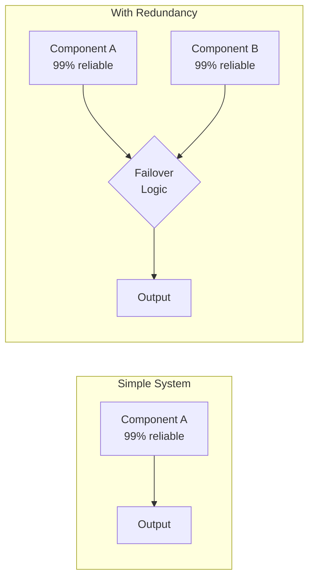

**The Math of Failure:**
- **Simple System**: Reliability is 99%. Failure happens 1 in 100 requests.
- **Redundant System**: Component A and B are 99% reliable. But what if the Failover Logic is only 90% reliable (untested, has bugs)?
- Actual reliability = `99% + (1% × 90% × 99%) = 99.89%` (Barely better than before!)
- And if the failover logic is only 50% reliable?
- Actual reliability = `99% + (1% × 50% × 99%) = 99.49%` 
- **Result: WORSE THAN NO REDUNDANCY!**

**The Lesson:**
Redundancy only works if:
1. Components fail INDEPENDENTLY.
2. The failover mechanism is TESTED.
3. The complexity doesn't outweigh the benefit.

> **The Airplane Analogy**
>
> Commercial aircraft have redundant everything: multiple engines, multiple hydraulic systems, multiple flight computers, multiple pilots. But it's not just duplication—each redundant system is designed to be **independent**. Separate power sources, separate wiring paths, separate maintenance schedules. The goal isn't just "more," it's "independent."

---

## What You'll Learn

- Types of redundancy and when to use each
- The difference between high availability and fault tolerance
- Active-passive vs. active-active architectures
- Common redundancy patterns in distributed systems
- The hidden costs and risks of redundancy

---

## Part 1: Understanding Redundancy

### 1.1 What is Redundancy?

**Redundancy** is having extra components beyond the minimum required for normal operation, so the system can continue if some components fail.

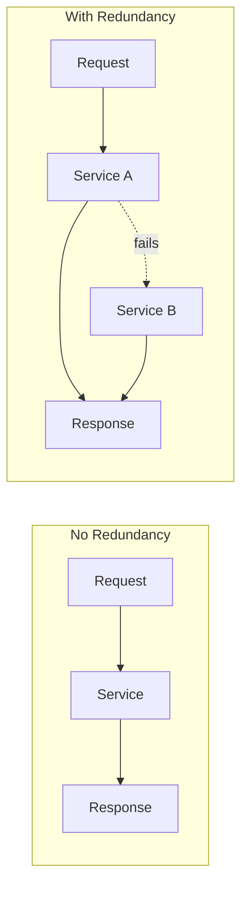

### 1.2 Types of Redundancy

| Type | Description | Example |
|------|-------------|---------|
| **Hardware redundancy** | Multiple physical components | RAID arrays, dual power supplies |
| **Software redundancy** | Multiple service instances | 3 replicas of a pod |
| **Data redundancy** | Multiple copies of data | Database replication |
| **Geographic redundancy** | Multiple locations | Multi-region deployment |
| **Temporal redundancy** | Retry over time | Automatic retry with backoff |
| **Informational redundancy** | Extra data for validation | Checksums, parity bits |

### The Six Types of Redundancy - Field Guide

#### 1. Hardware Redundancy
**What**: Multiple physical components
**Where**: Disks, power supplies, network cards, servers
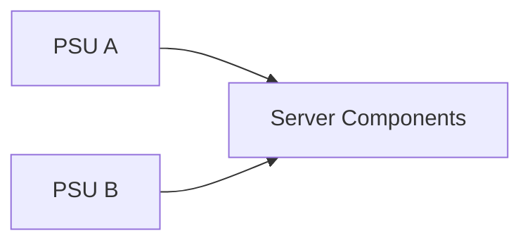
- **Cost**: $$$ (physical hardware)
- **Complexity**: Low
- **Common pitfall**: Same power circuit for both PSUs

#### 2. Software Redundancy
**What**: Multiple instances of the same service
**Where**: Web servers, API gateways, workers
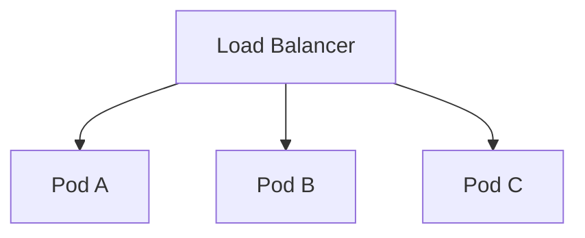
- **Cost**: $$ (compute)
- **Complexity**: Medium
- **Common pitfall**: Shared downstream dependency (single DB)

#### 3. Data Redundancy
**What**: Multiple copies of the same data
**Where**: Databases, caches, object storage
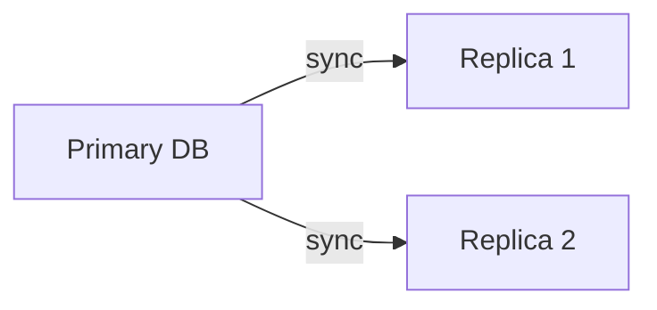
- **Cost**: $$$$ (3x storage, replication overhead)
- **Complexity**: High
- **Common pitfall**: Replication lag, split-brain

> **Stop and think**: If you use data redundancy (like database replication) but the replication is asynchronous, what happens to the data that was acknowledged to the user but hasn't replicated yet when the primary fails?

#### 4. Geographic Redundancy
**What**: Same system in multiple physical locations
**Where**: Data centers, cloud regions
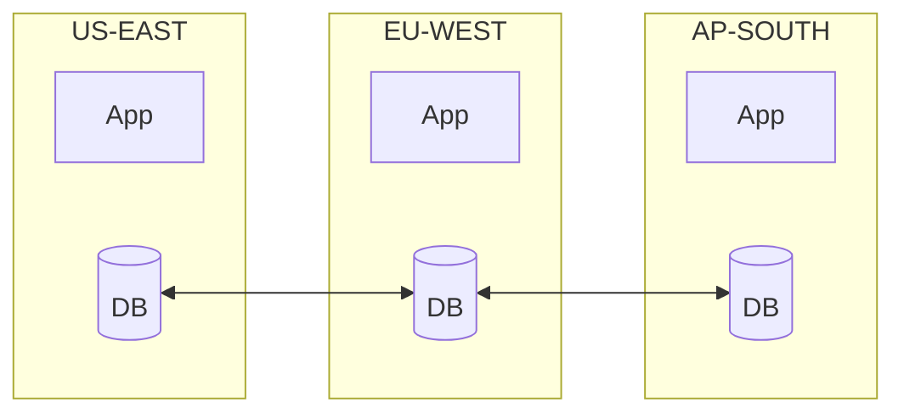
- **Cost**: $$$$$ (3x infrastructure + cross-region traffic)
- **Complexity**: Very High
- **Common pitfall**: Latency, consistency, split-brain

#### 5. Temporal Redundancy
**What**: Retry failed operations over time
**Where**: Network calls, queue processing, batch jobs
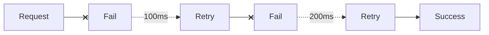
- **Cost**: $ (just time)
- **Complexity**: Low
- **Common pitfall**: Retry storms, idempotency issues

#### 6. Informational Redundancy
**What**: Extra data to detect/correct errors
**Where**: Storage, network transmission
```mermaid
flowchart LR
    A[Original: A B C D] --> B[With Checksum: A B C D | CRC32]
    A --> C[With ECC: A B C D | parity bits]
```
- **Cost**: ~5-15% storage overhead
- **Complexity**: Low (usually built into hardware/protocols)
- **Common pitfall**: Silent data corruption (bit rot)

### 1.3 Redundancy Notation: N+M

Redundancy is often expressed as N+M:
- **N** = minimum needed for normal operation
- **M** = extra for failure tolerance

#### N+0: No Redundancy (Single Point of Failure)
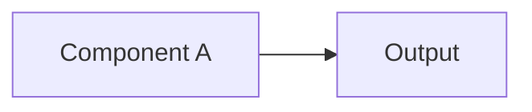
- **If A fails**: Outage
- **Survives**: 0 failures
- **Use case**: Dev environment, non-critical batch jobs

#### N+1: One Spare
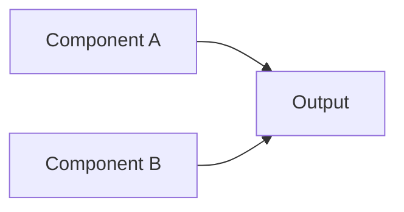
- **Load**: Either can handle 100% alone
- **If A fails**: B takes over
- **Survives**: 1 failure
- **Use case**: Most production systems
- **During Maintenance**: Take A down for patching, only B left (now N+0). If B fails during maintenance, you get an outage.

#### N+2: Two Spares (Maintenance + Failure)
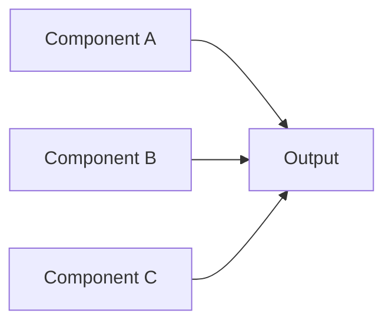
- **Load**: Any two can handle 100%
- **If A fails**: B and C continue
- **Survives**: 2 failures OR 1 failure during maintenance
- **Use case**: Critical production, financial services
- **During Maintenance**: Take A down for patching, B and C remain (N+1). If B fails during maintenance, C continues.

#### 2N: Full Duplication
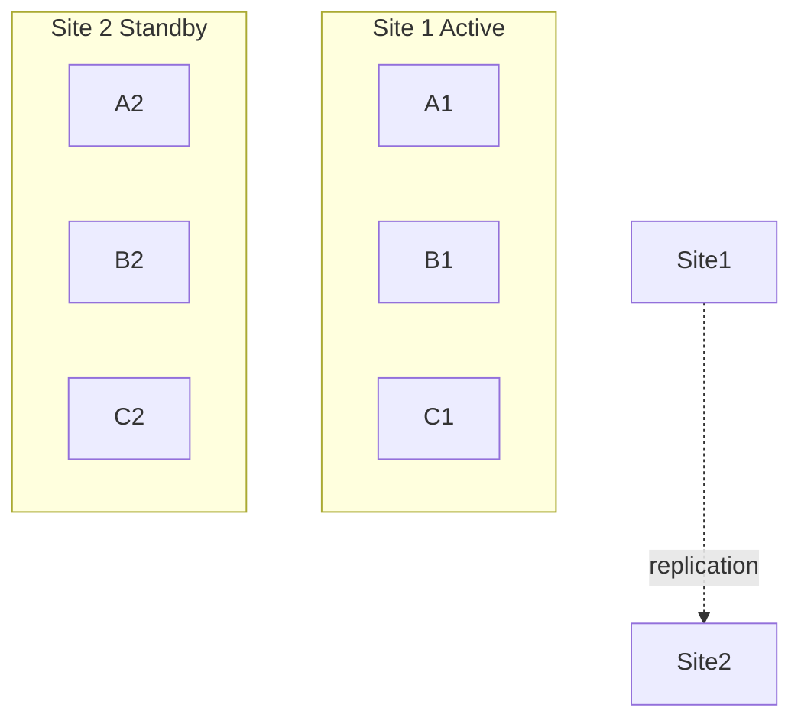
- **Survives**: Entire site failure
- **Use case**: Disaster recovery, regulatory compliance

#### 2N+1: Full Duplication Plus Spare
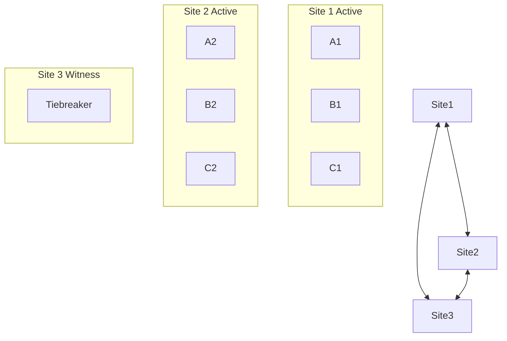
- **Survives**: Entire site failure + one more component
- **Use case**: Mission-critical, global financial systems

#### Capacity Planning Reality Check

"We have 3 replicas for redundancy!" But what's the LOAD on each replica?

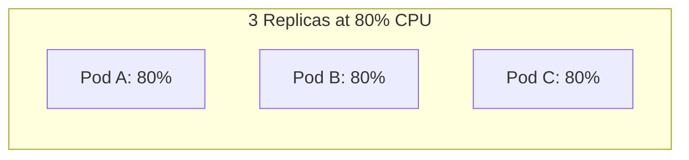
If Pod A fails, traffic redistributes:
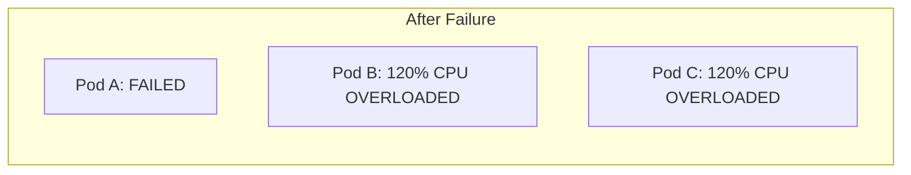

For true N+1, each replica must handle 50% of total load.
For true N+2, each replica must handle 33% of total load.

**FORMULA:** `Max load per replica = Total Load / (Number of replicas - tolerated failures)`

> **Gotcha: N+1 Isn't Always Enough**
>
> N+1 protects against single failures, but what about during maintenance? If you have 3 servers (N+1 where N=2) and take one down for updates, you're now at N+0. If another fails, you're down. Consider N+2 for critical systems to allow for maintenance + one unexpected failure.

> **The Math of Simultaneous Failures**
>
> Why is N+2 often necessary? Consider a system with N+1 redundancy (3 servers where 2 can handle the load). If each server has 99% availability, what's the chance of two failing at the same time?
>
> Naive calculation: 1% × 1% = 0.01% (1 in 10,000) — seems rare!
>
> But failures aren't independent. Common causes include:
> - Same software version → same bug affects all
> - Same rack → same power failure affects all
> - Same deployment → bad config affects all
> - Cascading failure → one failure causes another
>
> In practice, simultaneous failures happen more often than math suggests.

---

## Part 2: High Availability vs. Fault Tolerance

### 2.1 The Distinction

These terms are often used interchangeably, but they're fundamentally different engineering approaches with different costs, complexities, and use cases.

| Aspect | High Availability (HA) | Fault Tolerance (FT) |
|--------|------------------------|----------------------|
| Goal | Minimize downtime | Zero downtime |
| During failure | Brief interruption okay | No interruption |
| Data loss | May lose in-flight data | No data loss |
| Cost | Moderate | High |
| Complexity | Moderate | High |
| Use case | Most web services | Financial, medical, aviation |

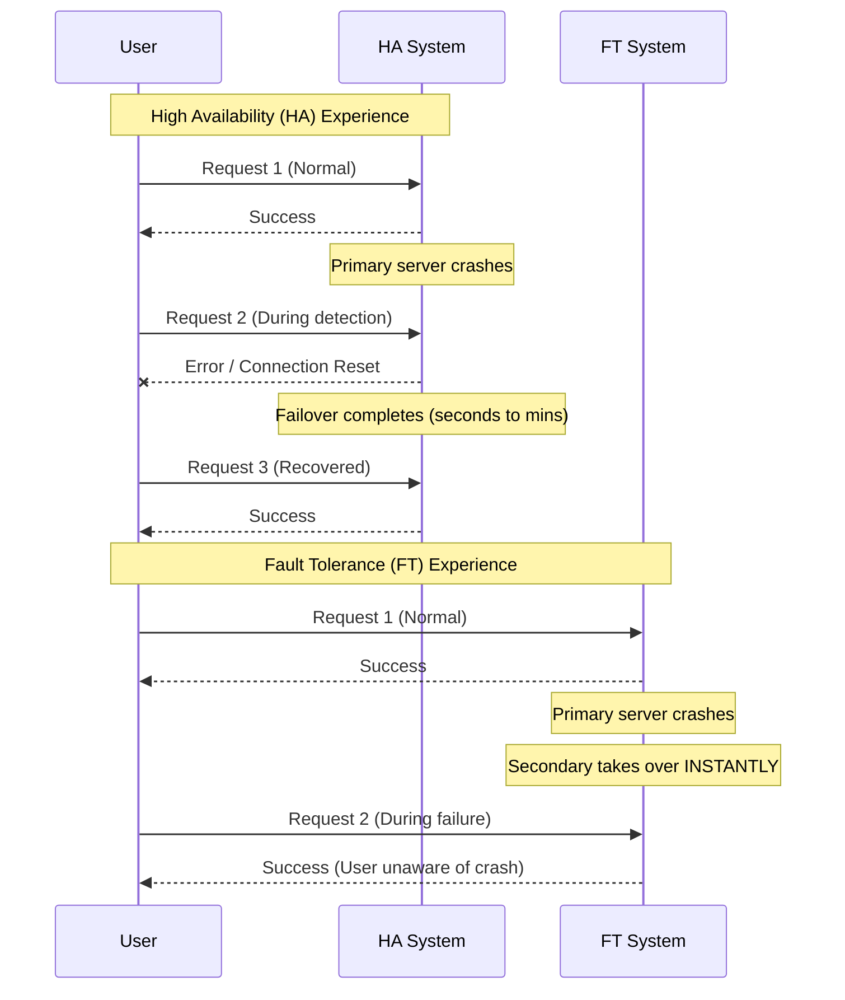

#### The Cost Difference

**High Availability:**
- **Infrastructure**: 2-3 servers, load balancers, health checks.
- **Complexity**: Detect failure (seconds), route away, restart.
- **Cost Multiplier**: 2-3×

**Fault Tolerance:**
- **Infrastructure**: 2× everything (synchronized), specialized hardware, real-time replication.
- **Complexity**: Continuous synchronization, lock-step execution, zero-switch-time handoff.
- **Cost Multiplier**: 4-10×
- **Why FT costs so much more**: Synchronous replication means every write waits for acknowledgment. It demands specialized hardware and near-zero network latency.

> **Pause and predict**: If a payment gateway processes $1,000 per second and relies on an active-passive HA setup with a 30-second failover time, what is the minimum direct cost of a single primary node failure?

### 2.2 When to Use Which

**High Availability is usually sufficient when:**
- Brief outages are acceptable
- Retrying failed requests is okay
- Cost matters
- Simpler architecture is valuable

**Fault Tolerance is required when:**
- Any downtime is unacceptable
- Transactions can't be retried
- Legal/regulatory requirements
- Lives depend on the system

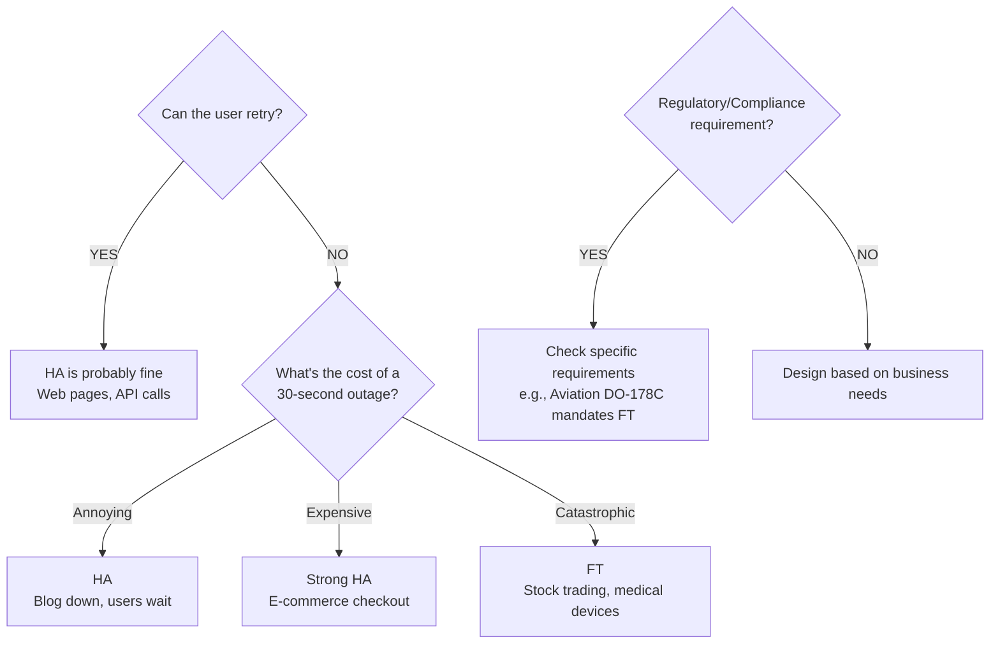

> **Try This (2 minutes)**
>
> Classify these systems—do they need HA or FT?
>
> | System | HA or FT? | Why? |
> |--------|-----------|------|
> | Blog | | |
> | Online banking | | |
> | Aircraft control | | |
> | E-commerce checkout | | |
> | Pacemaker | | |
>
> <details>
> <summary>See Answers</summary>
>
> | System | HA or FT? | Why? |
> |--------|-----------|------|
> | Blog | HA | Users can refresh, low cost of outage |
> | Online banking | Strong HA → FT for transfers | Viewing balance: HA. Wire transfer mid-execution: FT |
> | Aircraft control | FT | Lives at stake, no retry possible at 30,000 feet |
> | E-commerce checkout | Strong HA | Lost sales hurt, but users can retry |
> | Pacemaker | FT | Life-critical, no "please try again" for heartbeats |
>
> </details>

---

## Part 3: Redundancy Architectures

### 3.1 Active-Passive (Standby)

One component handles traffic; others wait to take over.

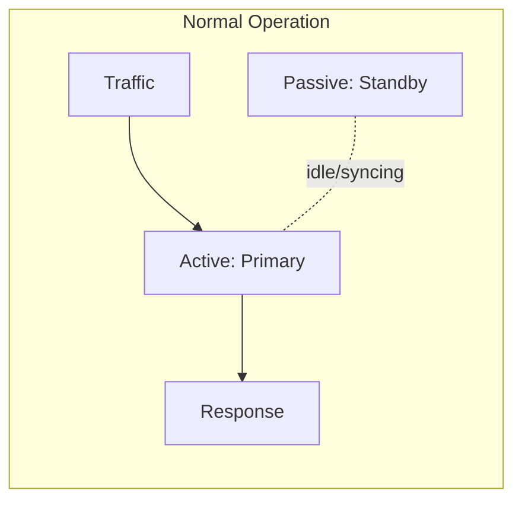
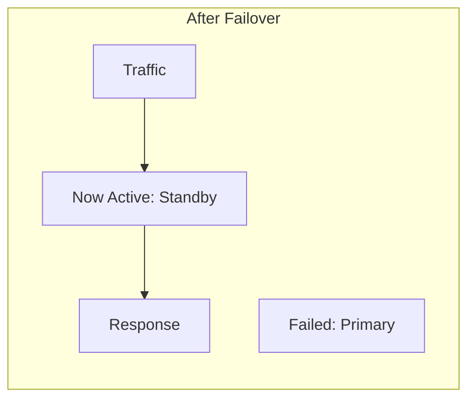

**Characteristics:**
- Simpler to implement
- Standby capacity is "wasted" during normal operation
- Failover takes time (seconds to minutes)
- Risk: Standby may have stale data or config

**Use when:**
- Cost is a concern
- You can tolerate brief failover time
- Traffic doesn't justify multiple active instances

### 3.2 Active-Active (Load Shared)

All components handle traffic simultaneously.

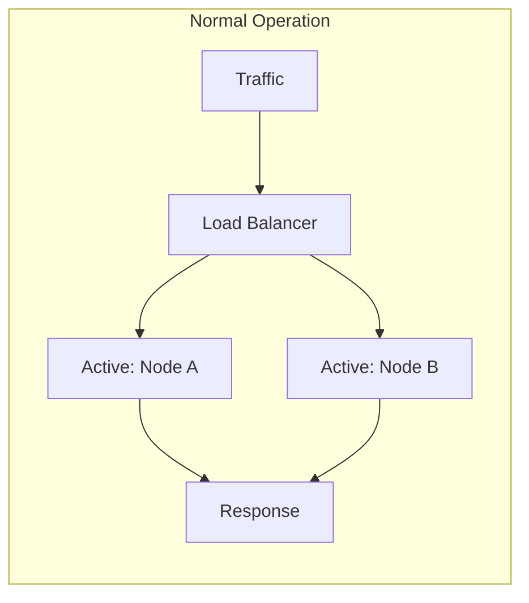
```mermaid
flowchart LR
    subgraph After Failover
        T2[Traffic] --> LB2[Load Balancer]
        LB2 --> N2B[Active: Node B] --> R2[Response]
        N2A[Failed: Node A]
    end
```

**Characteristics:**
- All capacity is used during normal operation
- No failover time—traffic immediately routes away from failed node
- More complex (need to handle shared state)
- Better resource utilization

**Use when:**
- Traffic justifies multiple instances
- You need instant failover
- Workload can be distributed

### 3.3 Comparison

| Aspect | Active-Passive | Active-Active |
|--------|----------------|---------------|
| Resource usage | ~50% (standby idle) | ~100% |
| Failover time | Seconds to minutes | Instant |
| Complexity | Lower | Higher |
| State management | Sync to standby | Distributed state |
| Scaling | Limited | Horizontal |
| Cost efficiency | Lower | Higher |

> **Stop and think**: If an active-active architecture utilizes 100% of available resources and offers instant failover, why wouldn't you use it for every single database in your system? Consider the complexity of distributed state and data replication conflicts.

> **Did You Know?**
>
> Most cloud load balancers use active-active architecture internally. AWS ELB, for example, runs across multiple availability zones with all nodes active. When one fails, traffic is simply not sent there—no failover needed because there's no single "active" node.

---

## Part 4: Redundancy Patterns

### 4.1 Database Replication

```mermaid
flowchart LR
    subgraph Primary-Replica Read Scaling
        W1[Writes] --> P1[(Primary)]
        P1 -- sync --> R1A[(Replica 1)]
        P1 -- sync --> R1B[(Replica 2)]
        Read1[Reads] --> R1A
        Read1 --> R1B
    end
```
```mermaid
flowchart LR
    subgraph Multi-Primary Write Scaling
        W2[Writes] --> P2A[(Primary A)]
        P2A <== sync ==> P2B[(Primary B)]
    end
```

> **Pause and predict**: In a multi-primary write scaling setup, what happens if two users update the exact same record simultaneously on different primary nodes before the nodes synchronize?

### 4.2 Kubernetes Redundancy

```mermaid
flowchart TD
    T[Traffic] --> Svc[Service / LB]
    subgraph Node 1
        PodA[Pod A]
    end
    subgraph Node 2
        PodB[Pod B]
    end
    subgraph Node 3
        PodC[Pod C]
    end
    Svc --> PodA
    Svc --> PodB
    Svc --> PodC
```

If Pod A fails:
- Kubernetes detects via health check
- Traffic routes to B and C
- New pod scheduled automatically

```yaml
# Kubernetes deployment with redundancy (Tested on K8s v1.35)
apiVersion: apps/v1
kind: Deployment
metadata:
  name: api-server
spec:
  replicas: 3                    # N+2 redundancy
  strategy:
    type: RollingUpdate
    rollingUpdate:
      maxUnavailable: 1          # Always keep 2 running
      maxSurge: 1
  template:
    spec:
      affinity:
        podAntiAffinity:         # Spread across nodes
          requiredDuringSchedulingIgnoredDuringExecution:
          - labelSelector:
              matchLabels:
                app: api-server
            topologyKey: kubernetes.io/hostname
      containers:
      - name: api
        resources:
          requests:
            cpu: 100m
            memory: 128Mi
        livenessProbe:           # Detect failures
          httpGet:
            path: /health
            port: 8080
          periodSeconds: 10
        readinessProbe:          # Route traffic only when ready
          httpGet:
            path: /ready
            port: 8080
          periodSeconds: 5
```

### 4.3 Multi-Region Redundancy

```mermaid
flowchart TD
    DNS[Global DNS<br>Route53, Cloudflare]
    subgraph Region A: US-East
        AppA[App]
        DBA[(DB Primary)]
    end
    subgraph Region B: EU-West
        AppB[App]
        DBB[(DB Replica)]
    end
    subgraph Region C: AP-SE
        AppC[App]
        DBC[(DB Replica)]
    end
    DNS --> AppA & AppB & AppC
    DBA <--> DBB
    DBA <--> DBC
```

**Benefits:**
- Survive entire region failure
- Lower latency for global users
- Disaster recovery

**Challenges:**
- Cross-region data replication lag
- Complexity of distributed state
- Cost (3x infrastructure)

### 4.4 Circuit Breaker Pattern

Not traditional redundancy, but enables graceful handling when redundancy fails:

```mermaid
stateDiagram-v2
    [*] --> CLOSED : normal
    CLOSED --> OPEN : failures > threshold
    OPEN --> HALF_OPEN : timeout
    HALF_OPEN --> CLOSED : success
    HALF_OPEN --> OPEN : failure
```
```mermaid
flowchart LR
    Req[Request] --> CB{Circuit Breaker}
    CB -- CLOSED --> Svc[Service]
    CB -- OPEN --> Fallback[Fallback Response<br>cached data, default error]
```

> **Pause and predict**: In the circuit breaker pattern, what happens if the fallback response itself depends on a service that is currently experiencing an outage?

> **Try This (3 minutes)**
>
> Your service calls a payment provider. Design the circuit breaker:
>
> - After how many failures should it open?
> - How long before trying again (half-open)?
> - What's the fallback response?

---

## Part 5: The Costs of Redundancy

### 5.1 Redundancy Isn't Free

**Financial Costs:**
- 2x or 3x infrastructure costs
- Cross-region data transfer fees
- Additional monitoring/management tools
- More complex debugging (more places to look)

**Complexity Costs:**
- More moving parts = more failure modes
- State synchronization challenges
- Split-brain scenarios
- Harder to reason about behavior

**Operational Costs:**
- More deployments to manage
- More configuration to keep in sync
- More capacity planning complexity
- Testing redundancy (does failover actually work?)

### 5.2 Common Redundancy Failures

| Failure | What Happens | Prevention |
|---------|--------------|------------|
| **Correlated failure** | Both primary and backup fail together | Independent failure domains |
| **Split brain** | Both think they're primary | Proper leader election, fencing |
| **Replication lag** | Backup has stale data | Monitor lag, consider sync replication |
| **Untested failover** | Failover doesn't work when needed | Regular failover drills |
| **Config drift** | Backup has different config | Infrastructure as code, sync config |

### 5.3 The Redundancy Paradox

> **Did You Know?**
>
> Adding redundancy can sometimes *decrease* reliability. More components means more things that can fail. If the redundancy mechanism itself is complex, it adds failure modes. A study by Yuan et al. (2014) found that a significant percentage of critical failures at large internet companies involved a failure of the failover mechanism itself.

```mermaid
flowchart LR
    subgraph Simple System
        A[Component A<br>99% reliable] --> Out1[Output]
    end
    
    subgraph With Redundancy
        C_A[Component A<br>99% reliable] --> FL{Failover<br>Logic}
        C_B[Component B<br>99% reliable] --> FL
        FL --> Out2[Output]
    end
```

**System reliability formula:**
`P(A works) + P(A fails) × P(failover works) × P(B works)`

If failover logic is untested and has bugs (e.g., 50% reliable):
`0.99 + 0.01 × 0.50 × 0.99 = 99.49%`

**Lesson**: Redundancy only helps if the failover mechanism is reliable. Test it regularly.

> **War Story: The Backup That Wasn't**
>
> A financial services company had "highly available" PostgreSQL: a primary with streaming replication to a standby. They were proud of their architecture diagrams. They never tested failover.
>
> When the primary failed, they triggered manual failover. The standby came up—with a 6-hour replication lag. Transactions from the last 6 hours were gone. It turned out monitoring had been alerting on lag for months, but the alerts went to a distribution list nobody read.
>
> Recovery took 3 days: restore from backup, replay transaction logs, reconcile with payment processors, apologize to customers. The CEO learned what "replication lag" means the hard way.
>
> Now they run failover drills monthly. They verify replication lag every deploy. And someone actually reads the alerts.

### War Story: The $8.6 Million Untested Failover

**Architecture (looked great on paper):**
```mermaid
flowchart LR
    subgraph us-east-1a
        P[(Primary PostgreSQL)]
    end
    subgraph us-east-1b
        S[(Standby PostgreSQL)]
    end
    P -- streaming replication --> S
```

**Timeline of Disaster:**
- **For 7 months**: Monitoring dashboards displayed a critical 6-hour replication lag, but alerts went to an unmonitored mailbox (`ops-alerts@company.com`).
- **October 15th, 02:14 AM**: The primary database server's disk controller fails. All writes stop instantly. The application connection queue fills up.
- **02:15 AM**: An on-call engineer is paged. They check the dead primary and trigger a manual failover.
- **02:19 AM**: The standby is promoted to primary. The application reconnects. The engineer declares the incident resolved.
- **02:47 AM**: Customer service begins receiving calls about missing transactions. Everything placed since 8:00 PM the previous night has vanished.
- **02:52 AM**: The engineer finally checks and discovers the standby was 6 hours behind. The WAL files containing those transactions are trapped on the dead primary's disk controller.

**Recovery (3 Painful Days):**
- **Day 1**: Forensics. The dead server is sent to a data recovery specialist. The team begins planning a manual reconciliation.
- **Day 2**: Reconstruction. Data recovery extracts the WAL files from the dead disk. Transactions are replayed, cross-referenced with payment processor logs, and 847 affected transactions are identified.
- **Day 3**: Cleanup. Customers are notified, transactions are manually corrected, and mandatory regulatory notifications are filed.

**Financial Impact:**
- **Direct costs**: Data recovery, customer compensation, consulting, and a $500,000 regulatory fine (Total: $761,000).
- **Indirect costs**: Estimated brand damage, customer churn, increased insurance premiums, and delayed product launches (Total: $7,820,000).
- **Total Impact**: **$8,581,000**

**Root Causes:**
1. **Never tested failover**: A single drill would have discovered the lag immediately.
2. **Alert fatigue**: Critical alerts were routed to an unmonitored email list.
3. **No replication lag SLO**: "It's replicating" does not mean "It's usable for failover."
4. **Manual failover process**: Lacked automated verification of database state prior to promotion.

---

## Did You Know?

- **RAID 5 lost data** at major companies because the rebuild process (after one disk failed) stressed the remaining disks, causing a second failure before rebuild completed. RAID 6 (which tolerates two failures) is now recommended for large arrays.

- **The DNS root servers** use Anycast—the same IP address is announced from multiple locations. Your request goes to the nearest one. If one fails, routing protocols automatically send you elsewhere. No failover logic needed.

- **Google's Borg** (precursor to Kubernetes) was designed around the assumption that machines will fail. Jobs are automatically rescheduled when machines die. Google expects ~1% of machines to fail per year, so redundancy isn't optional—it's the default.

- **The "Pets vs. Cattle" metaphor** for servers was coined by Bill Baker at Microsoft. Pets have names, are irreplaceable, and get nursed back to health when sick. Cattle have numbers, are identical, and get replaced when sick. Modern cloud-native redundancy assumes cattle: any instance is expendable.

---

## Common Mistakes

| Mistake | Problem | Solution |
|---------|---------|----------|
| Same failure domain | Both replicas fail together | Spread across zones/regions |
| Not testing failover | Failover doesn't work | Regular chaos engineering |
| Sync replication everywhere | Performance impact | Use async where eventual consistency okay |
| Ignoring replication lag | Read your own writes fails | Read from primary after write |
| No health checks | Traffic sent to failed node | Implement proper health checks |
| Manual failover | Slow recovery | Automate failover |

---

## Quiz

1. **Your team runs a critical authentication service on Kubernetes. The service requires 4 pods to handle peak traffic. An engineer suggests setting the HPA minimum to 5 pods to provide "N+1 redundancy." Another engineer argues for 6 pods (N+2). Under what specific real-world scenario would the 5-pod setup result in a customer-facing outage, proving the second engineer right?**
   <details>
   <summary>Answer</summary>

   A customer-facing outage would occur if a node failure happens exactly during a scheduled maintenance window or deployment rollout. With an N+1 setup (5 pods for a 4-pod load), taking one pod down for a rolling update leaves exactly 4 pods running, reducing the system to N+0 redundancy. If a sudden node crash or network partition takes out one of those remaining 4 pods, the service drops to 3 pods, which cannot handle peak traffic, leading to dropped requests and degraded performance. Using an N+2 setup (6 pods) ensures that even while one pod is down for maintenance, the system retains an N+1 posture, safely absorbing an unexpected secondary failure without impacting users.
   </details>

2. **A hospital is modernizing its IT infrastructure. They are migrating both the patient portal website (used for booking appointments) and the real-time telemetry system for robotic surgery arms to the cloud. The cloud provider offers an HA architecture (99.99% uptime, 10-second failover) and a much more expensive FT architecture (active state replication, zero failover time). Which architecture should be applied to each system, and what is the engineering justification?**
   <details>
   <summary>Answer</summary>

   The patient portal should use the High Availability (HA) architecture, while the surgical telemetry system must use the Fault Tolerance (FT) architecture. The patient portal can tolerate a 10-second failover because the cost of failure is merely user annoyance; a patient can simply refresh their browser to retry booking an appointment. In contrast, the surgical telemetry system cannot afford even a single dropped packet or a 10-second interruption, as this could lead to catastrophic physical harm or death during an operation. Fault Tolerance is required for the robotics because the operations are not idempotent and cannot be retried by the user, justifying the massive cost premium of synchronous, lock-step execution.
   </details>

3. **You are designing a global e-commerce API. In the proposed active-passive design, all traffic routes to the `us-east` region, while `eu-west` sits idle as a hot standby. A senior architect rejects this design in favor of an active-active setup where both regions serve traffic continuously. Beyond just saving the "wasted" compute costs of the standby, what operational risks of the active-passive design are mitigated by going active-active?**
   <details>
   <summary>Answer</summary>

   An active-active design fundamentally mitigates the risk of an untested, failing failover mechanism, as well as configuration drift between regions. In an active-passive setup, the standby region might not receive real-world traffic for months, meaning hidden bugs, stale firewall rules, or missing scaling limits could cause the standby to instantly crash when a failover finally shifts 100% of the load to it. By using an active-active architecture, both regions continuously serve live traffic, constantly validating their configuration, scaling behaviors, and health. This continuous validation ensures that if one region fails, the remaining region is already known to be fully operational and correctly configured to handle requests.
   </details>

4. **A startup's caching layer consists of a single Redis instance with 99.9% uptime. To "improve reliability," they add a secondary Redis instance and write a custom failover script in their application layer that pings the primary and switches connections if it fails. After a month, their cache uptime drops to 99.0%. How does the "Redundancy Paradox" explain this mathematical impossibility of adding components but losing uptime?**
   <details>
   <summary>Answer</summary>

   The redundancy paradox occurs because the custom failover script introduced a new, fragile point of failure that was less reliable than the underlying Redis instances. Even if both Redis instances had 99.9% uptime, the failover script might have contained bugs, aggressive timeout thresholds, or lacked proper state management, leading to false positives where it incorrectly triggered failovers during momentary network blips. Each unnecessary failover likely caused connection drops, split-brain scenarios, or cache stampedes, meaning the system's overall reliability became bottlenecked by the lower reliability of the poorly written failover logic. True redundancy only increases reliability when the failure detection and routing mechanisms are significantly more robust than the components they monitor.
   </details>

5. **Your manager proudly announces that a new microservice has "N+1 redundancy." You inspect the Kubernetes cluster and see 3 pods running. You check the monitoring dashboard and observe that each pod is consistently running at 75% CPU utilization. Why is your manager mathematically incorrect, and what will actually happen to the cluster if Node 1 (hosting Pod A) suddenly loses power?**
   <details>
   <summary>Answer</summary>

   Your manager is incorrect because true N+1 redundancy requires that the remaining components can fully absorb the load of a failed component without exceeding their own capacity limits. Currently, the total system load requires 225% CPU (3 pods × 75%). If Node 1 dies and Pod A is lost, that entire 225% load must be distributed across the two remaining pods, resulting in each pod attempting to run at 112.5% CPU. Because this exceeds their maximum 100% capacity, both remaining pods will become overloaded, likely failing their health probes and causing a cascading total system failure rather than a graceful degradation.
   </details>

6. **Two database nodes (Node A and Node B) operate in an active-passive cluster across two different racks. A network switch fails, severing the connection between the racks, but both racks remain connected to the internet and the application servers. Describe the sequence of events that leads to a "split-brain" scenario, and explain the devastating impact this will have on user data once the switch is repaired.**
   <details>
   <summary>Answer</summary>

   When the network switch fails, Node B (the standby) loses its heartbeat connection to Node A (the primary) and incorrectly assumes Node A has crashed. Node B automatically promotes itself to primary to maintain availability, but Node A is still running and perfectly capable of receiving traffic from the application servers on its own rack. The application is now writing new user registrations to Node A and new orders to Node B, causing the two databases to wildly diverge in state. Once the switch is repaired and the nodes can communicate again, they will both possess conflicting, irreconcilable datasets (split-brain), requiring massive manual intervention, data loss, or application downtime to merge the conflicting transactions.
   </details>

7. **A financial trading platform must survive a total loss of the AWS `us-east-1` region. They implement geographic redundancy by synchronously replicating all PostgreSQL database writes to `us-west-2` before acknowledging the transaction to the user. Shortly after deploying this architecture, they are flooded with customer complaints about the platform feeling sluggish and timing out. What fundamental law of distributed systems did they ignore, and why did it cause the timeouts?**
   <details>
   <summary>Answer</summary>

   The team ignored the physical limitations of network latency and the speed of light, which dictate that cross-country network trips take significantly longer than intra-region trips. By mandating synchronous replication to a region 3,000 miles away, every single database write was forced to wait for a 60-80 millisecond round-trip acknowledgment from `us-west-2` before the application could confirm the transaction. This massive increase in latency caused database transaction locks to be held longer, connection pools to exhaust rapidly, and web requests to hit their timeout thresholds, ultimately degrading the entire platform's performance. They should have used asynchronous replication or designed the application to handle eventual consistency across regions to avoid coupling their primary region's availability to a distant geographic location.
   </details>

---

## Hands-On Exercise

**Task**: Design and test redundancy for a Kubernetes deployment.

**Part A: Create a Redundant Deployment (15 minutes)**

```bash
# Create namespace
kubectl create namespace redundancy-lab

# Create a deployment with redundancy (Requires K8s v1.35+)
cat <<EOF | kubectl apply -f -
apiVersion: apps/v1
kind: Deployment
metadata:
  name: web-app
  namespace: redundancy-lab
spec:
  replicas: 3
  selector:
    matchLabels:
      app: web-app
  template:
    metadata:
      labels:
        app: web-app
    spec:
      affinity:
        podAntiAffinity:
          preferredDuringSchedulingIgnoredDuringExecution:
          - weight: 100
            podAffinityTerm:
              labelSelector:
                matchLabels:
                  app: web-app
              topologyKey: kubernetes.io/hostname
      containers:
      - name: nginx
        image: nginx:alpine
        ports:
        - containerPort: 80
        readinessProbe:
          httpGet:
            path: /
            port: 80
          initialDelaySeconds: 2
          periodSeconds: 3
        livenessProbe:
          httpGet:
            path: /
            port: 80
          initialDelaySeconds: 5
          periodSeconds: 5
        resources:
          requests:
            cpu: 50m
            memory: 64Mi
---
apiVersion: v1
kind: Service
metadata:
  name: web-app
  namespace: redundancy-lab
spec:
  selector:
    app: web-app
  ports:
  - port: 80
    targetPort: 80
EOF
```

**Part B: Verify Redundancy (5 minutes)**

```bash
# Check pods are distributed
kubectl get pods -n redundancy-lab -o wide

# Check service endpoints
kubectl get endpoints web-app -n redundancy-lab
```

**Part C: Test Failover (10 minutes)**

Terminal 1 - Watch pods:
```bash
kubectl get pods -n redundancy-lab -w
```

Terminal 2 - Simulate failure:
```bash
# Delete one pod
kubectl delete pod -n redundancy-lab -l app=web-app \
  $(kubectl get pod -n redundancy-lab -l app=web-app -o jsonpath='{.items[0].metadata.name}')

# Observe:
# - Pod terminates
# - New pod is scheduled
# - Endpoints update
```

Terminal 2 - More aggressive failure:
```bash
# Delete two pods simultaneously
kubectl delete pod -n redundancy-lab -l app=web-app \
  $(kubectl get pod -n redundancy-lab -l app=web-app -o jsonpath='{.items[0].metadata.name} {.items[1].metadata.name}')

# Observe: System recovers even with 2/3 pods gone
```

**Part D: Test PodDisruptionBudget (5 minutes)**

```bash
# Add a PodDisruptionBudget (Requires K8s v1.35+)
cat <<EOF | kubectl apply -f -
apiVersion: policy/v1
kind: PodDisruptionBudget
metadata:
  name: web-app-pdb
  namespace: redundancy-lab
spec:
  minAvailable: 2
  selector:
    matchLabels:
      app: web-app
EOF

# Try to drain a node (if you have multiple nodes)
# kubectl drain <node-name> --ignore-daemonsets --delete-emptydir-data

# The PDB will prevent draining if it would leave fewer than 2 pods
```

**Part E: Clean Up**

```bash
kubectl delete namespace redundancy-lab
```

**Analysis Questions:**
1. How long did it take for a new pod to become ready after deletion?
2. Did the service maintain endpoints during the failure?
3. What would happen if all 3 pods were deleted simultaneously?
4. How does podAntiAffinity improve reliability?

**Success Criteria**:
- [ ] Deployment created with 3 replicas
- [ ] Pod anti-affinity configured
- [ ] Single pod failure tested and recovered
- [ ] Multi-pod failure tested and recovered
- [ ] Understand what PodDisruptionBudget does

---

## Key Takeaways

**The Core Principle**
Redundancy is about INDEPENDENCE, not DUPLICATION.

- "We have two servers" (Duplication)
- "We have two servers that fail independently" (Redundancy)

If the same event can take out both your primary and backup, you don't have redundancy—you have expensive duplication.

**The Checklist**
Before calling your system "redundant," verify:
- [ ] Components are in different failure domains (Different racks? Different zones? Different regions?)
- [ ] Failover mechanism is tested regularly (When did you last kill production to verify?)
- [ ] Capacity math works out (N+1 means remaining components handle 100% load)
- [ ] Replication lag is monitored and acceptable (Async replication = potential data loss in failover)
- [ ] Health checks actually detect failures (Does "healthy" mean "can serve traffic"?)
- [ ] Recovery is automated or has a runbook (Manual failover at 3 AM: how fast can you do it?)

**The Decision Framework**
1. **HIGH AVAILABILITY (99.9%)**: Most applications. Brief interruption okay, users can retry, 2-3× cost multiplier.
2. **FAULT TOLERANCE (99.999%)**: Critical systems only. Zero interruption, lives or major money at stake, 4-10× cost multiplier.

**The Redundancy Levels**
- **N+0**: No redundancy (dev only)
- **N+1**: Survive one failure (most production)
- **N+2**: Survive maintenance + failure (critical production)
- **2N**: Survive entire site failure (disaster recovery)

**The Architectures**
- **ACTIVE-PASSIVE**: Simple, wasted capacity, failover delay
- **ACTIVE-ACTIVE**: Complex, efficient, instant failover. Choose active-active when traffic justifies multiple instances, you need instant failover, and the workload can be distributed.

**The Warning Signs**
- "We've never tested failover" = It won't work when needed.
- "Both replicas are in the same AZ" = Single failure domain.
- "Each pod runs at 80% CPU" = No headroom for failover.
- "Alerts go to an email list" = Nobody's watching.
- "We have replication lag" = Potential data loss.

**The Paradox**
Adding redundancy can DECREASE reliability if:
- Failover mechanism is buggy or untested.
- Components share hidden dependencies.
- Complexity exceeds the team's ability to understand.
- Split-brain scenarios aren't handled.

*Simpler redundancy, tested regularly > Complex redundancy, never tested.*

---

## Further Reading

- **"Designing Data-Intensive Applications"** - Martin Kleppmann. Chapters on replication and fault tolerance are essential reading for anyone building distributed systems.

- **"Site Reliability Engineering"** - Google. Chapter 26 on "Data Integrity" covers redundancy patterns at scale.

- **"Building Microservices"** - Sam Newman. Practical patterns for service redundancy and deployment.

- **"Release It!"** - Michael Nygard. The "Stability Patterns" chapter covers circuit breakers, bulkheads, and other redundancy patterns.

- **Netflix Tech Blog** - Their posts on "Chaos Engineering" and "Fault Injection" show how to test redundancy in practice.

- **Jepsen.io** - Kyle Kingsbury's distributed systems testing. Shows how "redundant" databases actually behave under failure.

---

## Next Module

[Module 2.4: Measuring and Improving Reliability](../module-2.4-measuring-and-improving-reliability/) - SLIs, SLOs, and the practice of continuous reliability improvement.