> **Complexity**: `[MEDIUM]`
>
> **Time to Complete**: 45-50 minutes
>
> **Prerequisites**: [Module 2.2: Failure Modes and Effects](../module-2.2-failure-modes-and-effects/)
>
> **Track**: Foundations

## What You'll Be Able to Do

After completing this module, you will be able to design redundancy architectures for specific failure domains and budget constraints, evaluate whether redundant components share hidden common-cause failure modes, implement fault-tolerance patterns including leader election and quorum-based writes, diagnose performance issues caused by synchronous replication and replication lag across geographic regions, and compare high availability against fault tolerance when designing infrastructure for varying service tiers. The numbered capabilities below map directly to the hands-on exercise and quiz.

1. **Design** redundancy architectures (active-active, active-passive, N+M) appropriate for different failure domains and strict budget constraints
2. **Evaluate** distributed systems to determine whether redundant components are truly independent or whether they share hidden common-cause failure modes
3. **Implement** fault-tolerance patterns, specifically configuring leader election and calculating quorum-based writes to prevent split-brain scenarios
4. **Diagnose** performance degradation stemming from synchronous data replication and replication lag across geographic regions
5. **Compare** high availability versus fault tolerance approaches when designing infrastructure for varying service tiers

---

## Why This Module Matters

> **Hypothetical scenario:** The following narrative is a composite teaching example illustrating redundancy failure patterns documented across airline, financial, and cloud-provider post-mortems. Timelines and details are illustrative and do not describe a specific public incident.

An organization operates a global, mission-critical control system. Their data centers are equipped with dual-power feeds, backup generators, and secondary failover components across the board — on paper, a textbook example of redundant architecture. One night, a small, routine power control module fails in their primary data center. This failure should trigger an immediate, uneventful switch to backup power. Instead, the failing component sends an electrical surge through the switchgear meant to route power to the backup systems, physically damaging it in the process. The primary data center goes completely dark, and the backup power path that was supposed to be independent turns out to share the same physical switchgear cabinet — a common failure domain hidden inside what the architecture diagram drew as separate boxes.

The situation worsens because hundreds of legacy applications have hardcoded dependencies requiring the primary database to be reachable before they can fail over to the secondary site. The automated geographic redundancy, which should have redirected traffic to a surviving region, fails because the failover logic itself depends on a component that is now dark. The system locks into a partial failover state — neither fully operational at the secondary site nor recoverable at the primary. The organization faces hours of downtime, cascading operational impact, and substantial financial loss. They had massive amounts of redundancy, but they lacked true systemic independence and isolation. The components shared a common failure domain — the switchgear — and the failover process was brittle enough that it became a second failure point rather than a safety net.

This disaster pattern is not unique to any one industry or technology stack. It recurs whenever teams provision duplicate hardware, deploy additional pods, or replicate databases without rigorously verifying that the redundancy is genuine — that the backup path shares no hidden dependencies with the primary. Redundancy that shares a power bus, a network switch, a rack, an availability zone, or a control-plane dependency is not real redundancy. It is duplication with correlated fate. This module shifts your perspective from merely duplicating components to engineering resilient, decoupled systems where each redundant element can operate independently when its sibling fails. You will work through the mathematics of capacity planning under redundancy constraints, the consensus protocols that prevent split-brain states during network partitions, the trade-offs between synchronous and asynchronous replication, and the architectural decision frameworks that tell you when high availability is enough and when you genuinely need fault tolerance.

> **The Spare Tire Principle**
>
> A spare tire in your car trunk is a perfect example of genuine redundancy — it shares no common failure mode with the four tires on the road. A nail through your left rear tire does not affect the spare. But imagine a car where all five tires (including the spare) are inflated from a single valve stem. A leak anywhere in that shared system flattens every tire simultaneously. That is what shared-fate redundancy looks like in production: multiple instances, pods, or regions that all depend on the same authentication service, the same DNS resolver, the same network backbone, or the same control plane. When you map redundancy on a whiteboard, draw not just the boxes representing services but the lines representing dependencies — and ask whether any single line connects every supposedly independent box.

---

## Part 1: The Foundations of Redundancy

Redundancy is the engineering practice of provisioning extra components beyond the strict minimum required for normal operation, so that when active components fail the redundant ones assume the load without interrupting service. The intuition is simple — have a backup — but the implementation is subtle because backup components, failover mechanisms, and the dependencies that connect them can themselves become failure sources. Redundancy that works on a whiteboard fails in production when it concentrates risk rather than distributing it. This part builds the vocabulary and mathematical notation you need to reason about redundancy rigorously before you commit to a specific architecture.

### 1.1 What Is Redundancy?

At its simplest, redundancy introduces a secondary path for work to flow through when the primary path becomes unavailable. The goal is that a user or upstream service never notices the transition — the response still arrives, the data is still committed, the operation still completes. But achieving that invisibility requires more than just deploying two instances of a service. It requires that the secondary instance has current state, that the routing layer detects the primary failure quickly and accurately, and that the secondary is not itself degraded by whatever took down the primary.

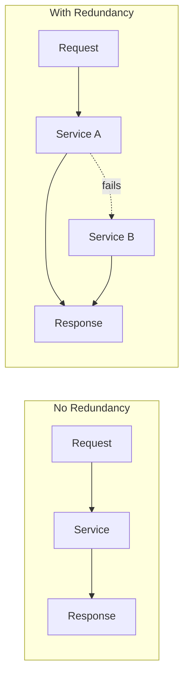
```mermaid
flowchart LR
    subgraph No Redundancy
        Req1[Request] --> S1[Service] --> Res1[Response]
    end
    
    subgraph With Redundancy
        Req2[Request] --> S_A[Service A] --> Res2[Response]
        S_A -.fails.-> S_B[Service B]
        S_B --> Res2
    end
```

The diagram above captures the idea, but hides the critical questions: how does the request router know Service A has failed? How long does detection take? Does Service B have the same data as Service A at the moment of failure? Is Service B running on the same physical host, in the same rack, behind the same network switch, or in the same availability zone as Service A? If Service B relies on the exact same database, message queue, or authentication provider as Service A, the redundancy is an illusion. When you evaluate an architecture, train yourself to look past the service boxes and trace the dependency graph. A redundant pair of application servers that both connect to a single database instance are not redundant — the database is a single point of failure, and the second application server becomes dead weight the moment that database fails.

True redundancy demands independence across the entire failure chain: independent power feeds, independent network paths, independent compute hosts, and independent state storage. Achieving full independence at every layer is expensive, so the practical art of reliability engineering involves choosing which layers need independence given your error budget and failure-domain analysis. You might tolerate shared networking if your primary failure mode is application crashes, or you might require separate availability zones if your primary threat is datacenter-scale incidents. Part 5 explores these trade-offs in detail.

### 1.2 Types of Redundancy

Modern infrastructure uses six distinct categories of redundancy, each addressing a different failure mode. They are often combined in a single architecture — a Kubernetes Deployment uses software redundancy (multiple pods), hardware redundancy (spread across nodes via anti-affinity), and data redundancy (if backed by a replicated database). Understanding each category separately lets you ask targeted questions during design reviews: which failure modes does our current redundancy protect against, and which does it leave exposed?

| Type | Description | Example |
|------|-------------|---------|
| **Hardware redundancy** | Multiple physical components within a single server or rack | RAID arrays, dual power supplies |
| **Software redundancy** | Multiple identical service instances | 3 replicas of a pod behind a load balancer |
| **Data redundancy** | Multiple copies of persistent state | Database replication, erasure coding |
| **Geographic redundancy** | Full infrastructure stacks in multiple physical locations | Multi-region deployment |
| **Temporal redundancy** | Repeating an operation after a delay | Automatic retry with exponential backoff |
| **Informational redundancy** | Extra data for error detection and correction | Checksums, parity bits, ECC memory |

Each category addresses a different failure vector, and each introduces its own costs and failure modes. The sections below walk through each with concrete diagrams and operational considerations so that you can build a mental checklist for architecture reviews: for every service you own, which of these six categories are present, and which are missing?

**1. Hardware Redundancy.** Physical duplication of hardware components — power supplies, network interface cards, disks, fans — within a single server, rack, or chassis. The classic example is RAID (Redundant Array of Independent Disks), where data is distributed across multiple physical drives so that a single drive failure does not cause data loss. Hardware redundancy protects against physical component degradation and failure, which is the most common failure mode at the infrastructure layer: disks wear out, power supplies fail, fans seize. It does not protect against software bugs, configuration errors, or application-level failures, and it provides no protection against failures that affect the entire server or rack — a power surge that takes out both power supplies, or a firmware bug that bricks every disk in the array simultaneously.

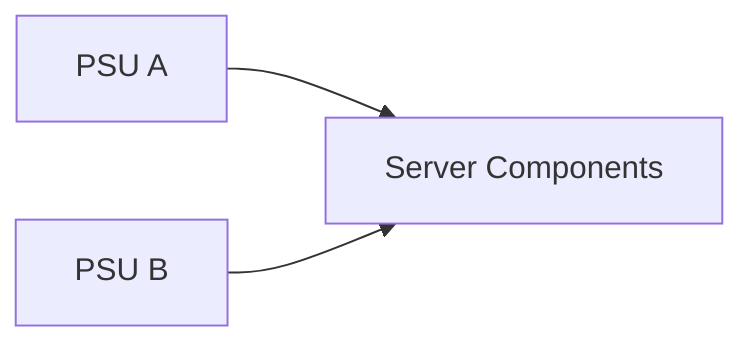
```mermaid
flowchart LR
    PSU_A[PSU A] --> Comp[Server Components]
    PSU_B[PSU B] --> Comp
```

**2. Software Redundancy.** Provisioning multiple independent instances of the same software service, each running on its own compute resources and capable of handling traffic if its siblings fail. This is the default redundancy model for stateless microservices on Kubernetes: a Deployment with `replicas: 3` means three pods, any of which can serve a given request. Software redundancy protects against application crashes, memory leaks, and node failures — if one pod OOMKills, the other two continue serving. The critical design decision is pod placement: if all three pods land on the same node due to scheduling constraints or missing anti-affinity rules, a single node failure takes down the entire service despite the replica count.

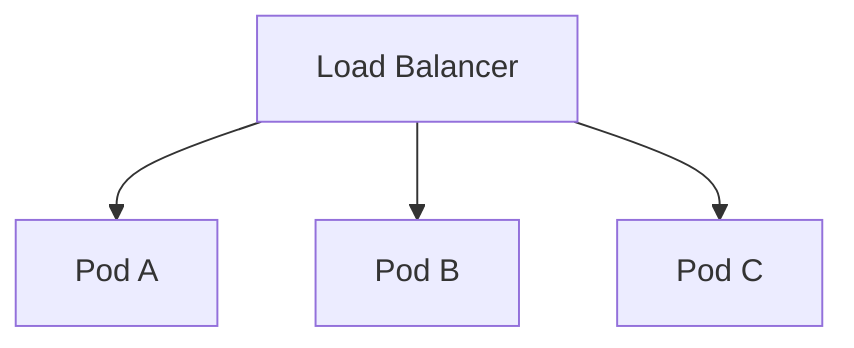
```mermaid
flowchart TD
    LB[Load Balancer] --> PodA[Pod A]
    LB --> PodB[Pod B]
    LB --> PodC[Pod C]
```

**3. Data Redundancy.** Creating and maintaining secondary copies of persistent state — database rows, file objects, message queue entries — so that a storage node failure does not cause permanent data loss. The dominant pattern in relational databases is primary-replica replication, where writes go to a single primary and are copied to one or more read-only replicas. In distributed databases like Cassandra or DynamoDB, data redundancy uses quorum writes across multiple nodes so that no single node holds the only copy of any record. Data redundancy is the most complex category because it introduces consistency trade-offs: synchronous replication guarantees the replica has the data before the write is acknowledged (no data loss on failover, but adds latency), while asynchronous replication acknowledges the write immediately and copies later (lower latency, but the replica may lag behind and lose recent writes if the primary fails).

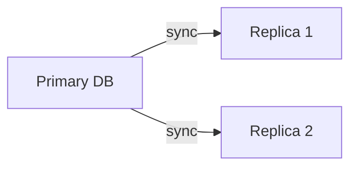
```mermaid
flowchart LR
    Primary[Primary DB] -- sync --> Rep1[Replica 1]
    Primary -- sync --> Rep2[Replica 2]
```

> **Stop and think**: If you use data redundancy with asynchronous replication, what happens to writes that were acknowledged to the user but have not yet reached the replica when the primary fails? The user believes the data is safely stored, but it exists only on a disk that is now inaccessible.

**4. Geographic Redundancy.** Distributing full infrastructure stacks — compute, storage, networking, and supporting services — across physically distant locations so that a regional disaster (earthquake, fiber cut, power grid failure, flood) cannot take down the entire system. Cloud providers expose this through the concept of regions and availability zones: a region is a geographic area containing multiple isolated availability zones, each with independent power, cooling, and networking. Geographic redundancy is expensive because it requires running idle or low-utilization capacity in a second region, maintaining cross-region network connectivity, and engineering applications to handle the increased latency of cross-region data replication. The alternative — accepting that a regional outage means downtime — is a legitimate business decision for many services, but it must be made explicitly rather than discovered during an incident.

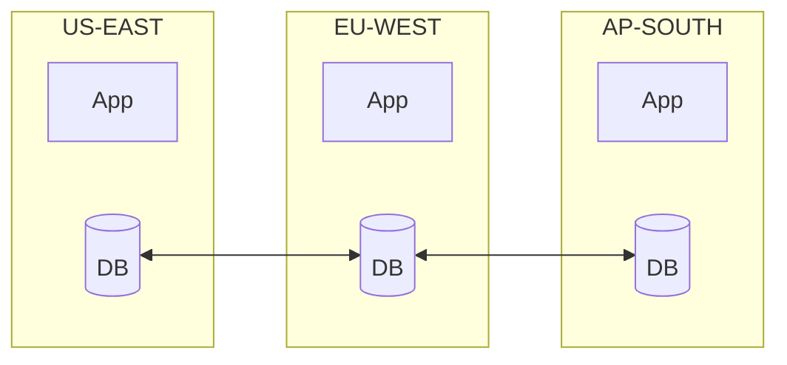
```mermaid
flowchart LR
    subgraph US-EAST
        App1[App]
        DB1[(DB)]
    end
    subgraph EU-WEST
        App2[App]
        DB2[(DB)]
    end
    subgraph AP-SOUTH
        App3[App]
        DB3[(DB)]
    end
    DB1 <--> DB2
    DB2 <--> DB3
```

**5. Temporal Redundancy.** Repeating a failed operation after a delay, on the assumption that the failure was transient and the dependency will recover. Temporal redundancy is the cheapest form of redundancy — it requires no additional hardware, software instances, or data copies — but it only protects against transient failures such as brief network glitches, temporary resource exhaustion, or brief dependency restarts. It provides no protection against persistent failures (a service that is down and staying down) or data corruption (retrying a write to a corrupted database just writes more corrupted data). Temporal redundancy becomes dangerous when retry logic is applied aggressively without backoff, jitter, or budgets — the retry storm pattern discussed in the previous module.

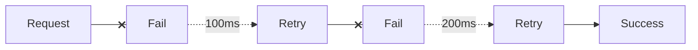
```mermaid
flowchart LR
    Req[Request] --x Fail1[Fail]
    Fail1 -. 100ms .-> Retry1[Retry] --x Fail2[Fail]
    Fail2 -. 200ms .-> Retry2[Retry] --> Success[Success]
```

**6. Informational Redundancy.** Adding mathematical metadata — checksums, parity bits, error-correcting codes — to data payloads so that corruption can be detected and, in some cases, corrected without retransmission. Informational redundancy operates at the bit and byte level, protecting against cosmic-ray bit flips in RAM, disk-sector corruption, and network packet corruption. It is typically provided by hardware (ECC memory) and protocols (TCP checksums, TLS record integrity) rather than by application code, but application-level checksums are valuable when data passes through multiple systems and you need end-to-end integrity guarantees that survive intermediate storage and transformation.

```mermaid
flowchart LR
    A[Original: A B C D] --> B[With Checksum: A B C D | CRC32]
    A --> C[With ECC: A B C D | parity bits]
```

Understanding these six categories together lets you evaluate the completeness of a system's redundancy coverage. A Kubernetes Deployment with `replicas: 3` and pod anti-affinity provides software redundancy and some hardware redundancy (spread across nodes). Adding a replicated database provides data redundancy. Deploying to multiple availability zones provides geographic redundancy. But if none of those replicas use checksums and the application does no end-to-end integrity verification, informational redundancy is absent — and a silent data corruption event could propagate through all supposedly redundant copies before anyone notices.

### 1.3 Redundancy Notation: N+M

Capacity planning for redundancy relies on the N+M mathematical notation, which separates the capacity you need for normal operation from the capacity you reserve for absorbing failures. The notation is simple, but applying it correctly requires understanding the relationship between peak load, per-component capacity, and the number of simultaneous failures you want to survive. Misunderstanding this relationship is one of the most common causes of cascading failure under load: teams count their replicas and assume redundancy, but they have never verified that the surviving replicas can actually handle the full load alone.

- **N** represents the minimum number of functional components required to handle 100% of peak load. If your peak traffic requires 4 pods at 75% CPU each to stay within latency SLOs, then N=4.
- **M** represents the surplus components provisioned strictly to absorb failures. If you deploy 5 pods when N=4, then M=1 and your configuration is N+1 — you can lose one pod without degrading below peak capacity.

**N+0: No Redundancy.** Every component is necessary. Losing any single component causes an immediate system-wide outage because the surviving components cannot absorb the failed component's share of the load. An N+0 system is a single point of failure regardless of how many components it contains — the failure of any one is catastrophic.

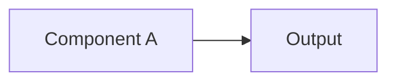
```mermaid
flowchart LR
    A[Component A] --> Out[Output]
```

**N+1: One Spare.** The system can tolerate the loss of any single component without degrading below peak capacity. This is the standard deployment model for most modern microservices and the minimum bar for production workloads. With N+1, you can survive a single node failure, a single pod crash, or a single availability zone outage (if N is distributed across zones). The critical validation is that each surviving component has enough headroom — if you deploy 5 pods (N=4, M=1) and all five run at 80% CPU at peak, losing one means the remaining 4 each jump to 100% of peak load, leaving zero headroom for traffic spikes or health-check overhead.

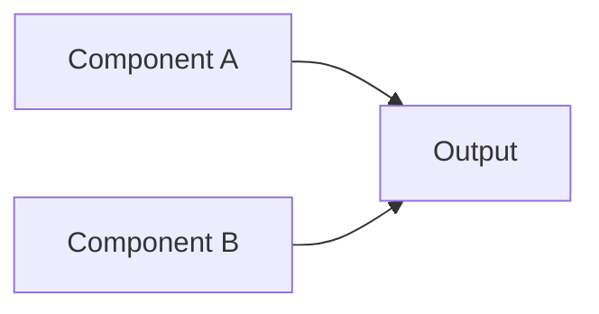
```mermaid
flowchart LR
    A[Component A] --> Out[Output]
    B[Component B] --> Out
```

**N+2: Two Spares.** The system can tolerate two simultaneous failures, or one failure during a maintenance window. This is essential for stateful systems where a node might be taken offline intentionally for hours-long patching or kernel upgrades, leaving the system temporarily at N+1 during the window. N+2 also protects against the correlated failure pattern where a single incident takes out two components at once — for example, a rack-level power failure that kills two pods that were placed on different nodes but in the same rack.

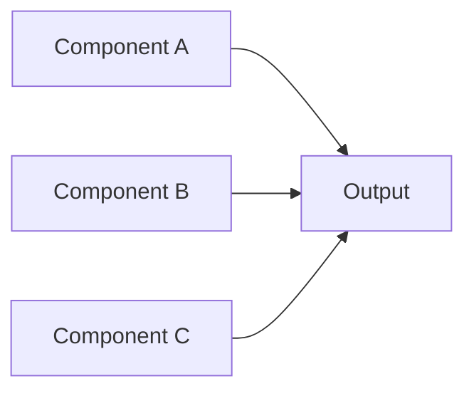
```mermaid
flowchart LR
    A[Component A] --> Out[Output]
    B[Component B] --> Out
    C[Component C] --> Out
```

**2N: Full Duplication.** The system has a complete duplicate of its entire capacity, typically in a separate failure domain (different availability zone or region). Under normal operation, half the capacity is idle or serving non-critical traffic. During a failure of the primary site, the secondary site absorbs the full load. 2N is significantly more expensive than N+1 — you are paying for 100% idle capacity — but it provides the strongest protection against site-level failures because the duplicate site is a fully independent stack with its own compute, storage, networking, and supporting services.

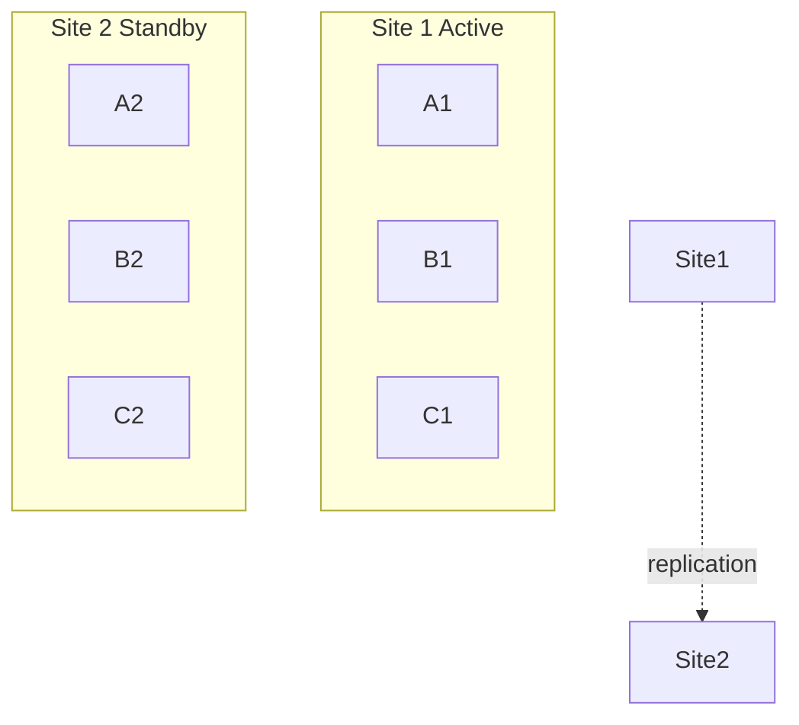
```mermaid
flowchart TD
    subgraph Site 1 Active
        A1[A1] & B1[B1] & C1[C1]
    end
    subgraph Site 2 Standby
        A2[A2] & B2[B2] & C2[C2]
    end
    Site1 -. replication .-> Site2
```

**2N+1: Full Duplication Plus Tiebreaker.** Two fully capable sites plus a lightweight third site (the "witness" or "tiebreaker") that participates in quorum decisions but does not serve traffic. This pattern is common in distributed consensus systems like etcd, where you need an odd number of voting members to break ties during network partitions. With two full sites (2N) and one tiebreaker (1), the system can survive the loss of either full site and still maintain quorum — the surviving full site plus the tiebreaker form a majority.

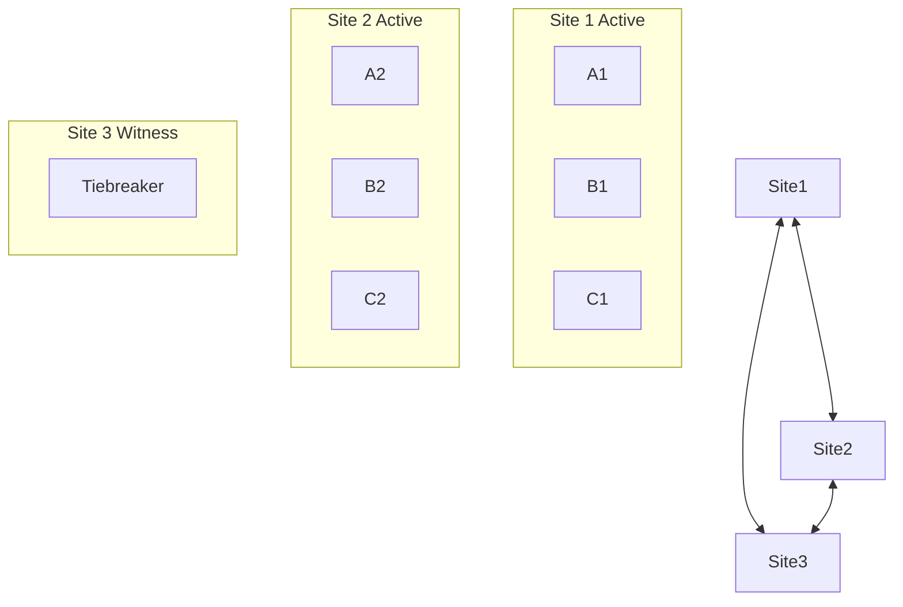
```mermaid
flowchart TD
    subgraph Site 1 Active
        A1[A1] & B1[B1] & C1[C1]
    end
    subgraph Site 2 Active
        A2[A2] & B2[B2] & C2[C2]
    end
    subgraph Site 3 Witness
        A3[Tiebreaker]
    end
    Site1 <--> Site2
    Site1 <--> Site3
    Site2 <--> Site3
```

The N+M notation is deceptively simple, and the most frequent mistake is calculating N based on average load rather than peak load. If your service typically runs at 30% CPU but spikes to 85% during your daily peak hour, N must be sized for the 85% peak — otherwise your N+1 redundancy evaporates at exactly the moment you need it most. A related mistake is assuming that more replicas always mean more redundancy without verifying that each replica has independent failure domains. Fifty pods all scheduled on the same three-node cluster provide less real redundancy than three pods spread across three availability zones with anti-affinity rules enforcing separation.

#### Capacity Planning Reality Check

Consider a deployment with three replicas, each running at 80% CPU at peak:

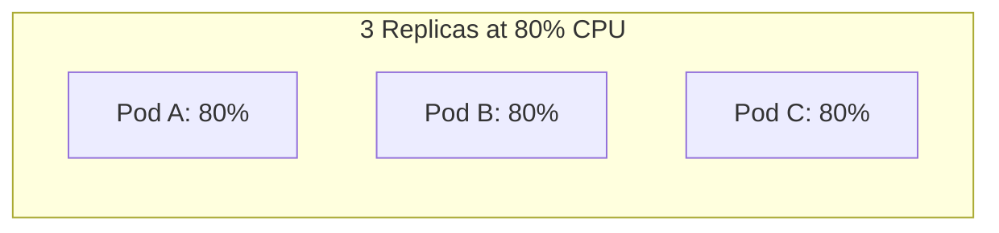
```mermaid
flowchart LR
    subgraph 3 Replicas at 80% CPU
        A[Pod A: 80%]
        B[Pod B: 80%]
        C[Pod C: 80%]
    end
```

If Pod A experiences a fatal out-of-memory exception and crashes, its 80% CPU load must be instantaneously absorbed by the two surviving pods:

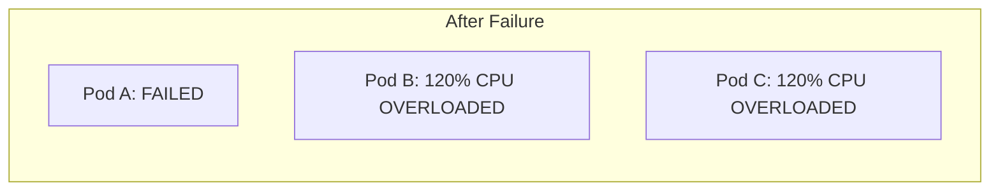
```mermaid
flowchart LR
    subgraph After Failure
        A[Pod A: FAILED]
        B[Pod B: 120% CPU OVERLOADED]
        C[Pod C: 120% CPU OVERLOADED]
    end
```

Because 120% CPU is physically impossible — a CPU cannot execute more instructions per second than its clock speed and core count allow — Pod B and Pod C will immediately exhaust their resources, fail their health checks, and crash in a cascading sequence. Three replicas running at 80% each is not N+1 redundancy. It is N+0 with extra steps, because losing any single replica pushes the survivors beyond their capacity ceiling. True N+1 requires that the maximum load per replica after one failure stays within each replica's capacity limit: `Max load per replica after failure = Total peak load / (N - 1)` must be ≤ 100% (with appropriate headroom for spikes and health-check overhead). For three replicas, each must run at no more than ~66% at peak just to absorb the full load when one fails (3 × 66.7 / 2 ≈ 100%), and lower still — around 50% — to leave headroom for spikes. This mathematical reality — that redundancy requires headroom, and headroom costs money — is why reliability engineering is fundamentally an economic discipline as much as a technical one.

> **Stop and think**: If your entire application is deployed in a single AWS Availability Zone with 50 pod replicas, do you have true redundancy against a network fiber cut or power failure in that specific data center? The replica count is high, but the failure domain is singular — one backhoe in the wrong place takes down all 50 pods simultaneously.

---

## Part 2: High Availability vs. Fault Tolerance

The terms "high availability" and "fault tolerance" are often used interchangeably in job descriptions and vendor marketing, but they describe fundamentally different engineering goals with dramatically different costs and complexity. Understanding the distinction — and knowing which one your service actually needs — is one of the highest-leverage architectural decisions you will make. Choosing fault tolerance when high availability would suffice wastes money and engineering time on lock-step synchronization you do not need. Choosing high availability when fault tolerance is required produces a system that fails at the worst possible moment, when a dropped transaction or a lost packet has consequences that cannot be undone by a retry.

### 2.1 The Distinction

High availability aims to minimize downtime. A highly available system may experience brief interruptions during failover — a few seconds to a few minutes of errors or degraded response while the standby component takes over — but it recovers automatically and the interruption is short enough that most users can retry and succeed. Fault tolerance aims for zero downtime and zero data loss. A fault-tolerant system continues operating through component failures with no visible interruption to any user, no lost in-flight operations, and no degraded response. The distinction is not a spectrum but a step function: fault tolerance requires a fundamentally different architectural approach — typically lock-step execution, where every instruction or state change on the primary is synchronously mirrored to the secondary before being committed.

| Aspect | High Availability (HA) | Fault Tolerance (FT) |
|--------|------------------------|----------------------|
| Goal | Minimize downtime | Zero downtime |
| During failure | Brief interruption acceptable | No interruption |
| Data loss | May lose in-flight data | No data loss |
| Cost | Moderate | High (typically 2-3x HA) |
| Complexity | Moderate | High |
| Use case | Most web services, APIs, SaaS | Financial settlement, medical devices, aviation |

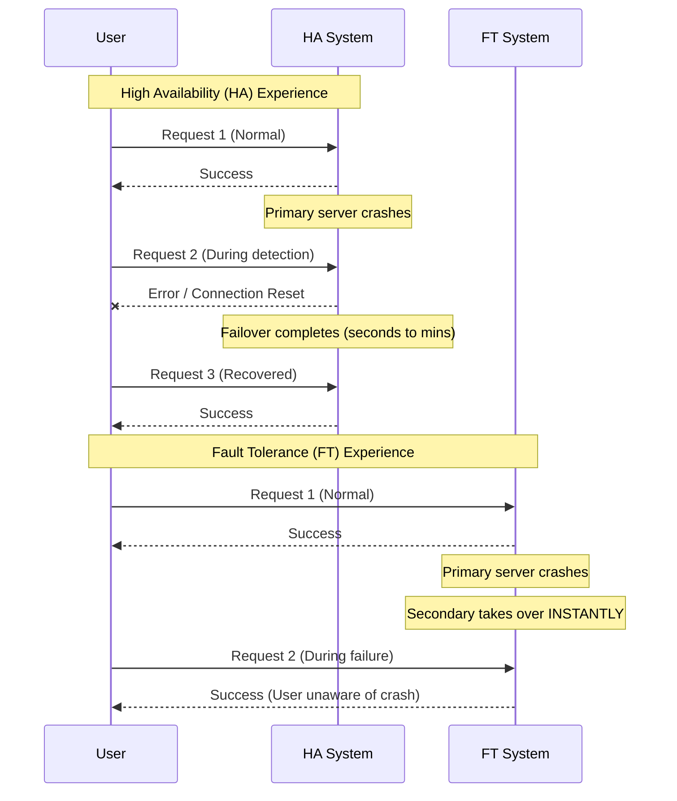
```mermaid
sequenceDiagram
    participant U as User
    participant HA as HA System
    participant FT as FT System

    Note over U, HA: High Availability (HA) Experience
    U->>HA: Request 1 (Normal)
    HA-->>U: Success
    Note over HA: Primary server crashes
    U->>HA: Request 2 (During detection)
    HA--xU: Error / Connection Reset
    Note over HA: Failover completes (seconds to mins)
    U->>HA: Request 3 (Recovered)
    HA-->>U: Success

    Note over U, FT: Fault Tolerance (FT) Experience
    U->>FT: Request 1 (Normal)
    FT-->>U: Success
    Note over FT: Primary server crashes
    Note over FT: Secondary takes over INSTANTLY
    U->>FT: Request 2 (During failure)
    FT-->>U: Success (User unaware of crash)
```

Fault tolerance relies on continuous, synchronous state synchronization. Every CPU instruction or memory write on the primary is strictly mirrored to the secondary in lock-step — the secondary is not just receiving periodic state snapshots, it is executing the exact same instruction stream at the exact same logical clock cycle. If the primary fails, the secondary proceeds from the identical execution point with no state divergence and no lost operations. This approach, sometimes called "lock-step redundancy," is used in aerospace flight control computers and financial matching engines where a single lost instruction could mean a physically dangerous control surface deflection or a multimillion-dollar settlement error. The cost is significant: you need specialized hardware or hypervisor support for deterministic replay, and you typically pay for twice the compute with half the throughput because the lock-step constraint caps performance at the speed of the slower replica.

Most modern cloud workloads require only HA. The user can retry a failed API call, refresh a page, or resubmit a form. A brief interruption is annoying but not catastrophic, and the engineering cost of FT — building and maintaining lock-step execution, paying for idle synchronized capacity, and accepting the throughput ceiling — is not justified by the business impact of a few seconds of errors. The decision framework in section 2.2 helps you make this call explicitly rather than defaulting to whichever term your cloud provider's marketing uses.

> **Pause and predict**: If a payment gateway processes $1,000 per second and relies on an active-passive HA setup with a 30-second failover window, what is the approximate direct cost of a single primary node failure in terms of transactions that cannot be processed during the gap? Is that cost high enough to justify FT?

### 2.2 When to Use Which

The decision between HA and FT should be driven by answering three questions in sequence: can the user retry the failed operation, what is the cost of a brief outage, and are there regulatory or safety requirements that mandate zero-downtime operation? The flowchart below formalizes this reasoning, but the underlying principle is simpler: FT is for operations that are not idempotent and cannot be retried safely — a surgical robot's motion command, a stock trade execution at a specific price, a pacemaker's pacing pulse. HA is for operations where the user or client can detect the failure and retry — an HTTP request for a web page, a database query that can be reissued, a file upload that can be restarted.

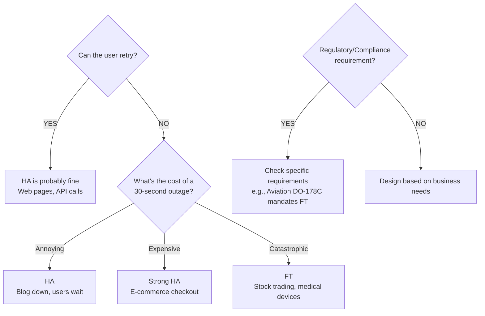
```mermaid
flowchart TD
    Q1{"Can the user retry?"}
    Q1 -- YES --> HA1[HA is probably fine<br>Web pages, API calls]
    Q1 -- NO --> Q2{"What's the cost of a<br>30-second outage?"}
    
    Q2 -- Annoying --> HA2[HA<br>Blog down, users wait]
    Q2 -- Expensive --> SHA[Strong HA<br>E-commerce checkout]
    Q2 -- Catastrophic --> FT1[FT<br>Stock trading, medical devices]
    
    Q3{"Regulatory/Compliance<br>requirement?"}
    Q3 -- YES --> Check[Check specific requirements<br>e.g., Aviation DO-178C mandates FT]
    Q3 -- NO --> Biz[Design based on business needs]
```

The "expensive" branch — strong HA — is worth examining in more detail because it is where most platform engineering decisions land. Strong HA means HA with aggressive recovery targets: single-digit-second failover, minimal data loss (synchronous replication within a region, asynchronous across regions), automated failover that does not require human approval, and regular testing that proves the failover path works. You might use strong HA for an e-commerce checkout path where every minute of downtime during peak hours costs thousands in lost revenue, but where the individual transaction is retryable (the user can refresh and try again) and the system is not life-critical. Strong HA typically costs about 1.5-2x the infrastructure cost of basic HA because you run active-active or hot-standby configurations rather than cold standby, and you invest in the operational discipline of failover drills.

The "catastrophic" branch — FT — is reserved for systems where a single failure during an operation that cannot be retried would cause irreversible harm. Financial settlement systems, medical device controllers, aircraft flight control computers, and certain industrial safety systems fall into this category. These systems are often subject to regulatory standards (DO-178C for aviation software, IEC 62304 for medical device software) that mandate specific fault-tolerance levels. If your system does not have a regulatory requirement and the operations are retryable, you almost certainly do not need FT.

---

## Part 3: Redundancy Architectures

The abstract notation N+M tells you how much capacity to provision. The architecture pattern tells you how that capacity is organized — which components are active, which are standing by, and how traffic routes between them when failures occur. The two dominant patterns are active-passive and active-active, and choosing between them involves trading off resource efficiency, failover speed, and architectural complexity.

### 3.1 Active-Passive (Standby)

In an active-passive architecture, one component — the primary — handles all ingress traffic during normal operation, while one or more standby components receive state updates and wait for a promotion signal. The standby is not idle in the sense of being powered off; it is running, receiving replication streams, and ready to take over, but it serves no user traffic until the primary fails and a failover mechanism promotes it.

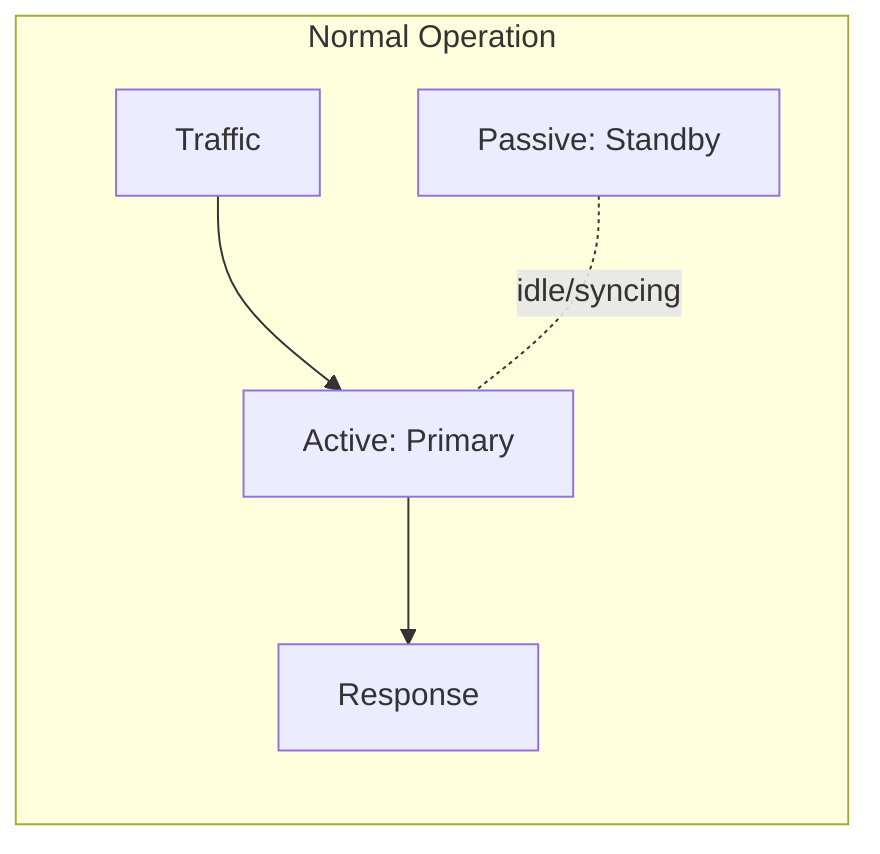
```mermaid
flowchart LR
    subgraph Normal Operation
        T1[Traffic] --> P1[Active: Primary] --> R1[Response]
        S1[Passive: Standby] -. idle/syncing .- P1
    end
```

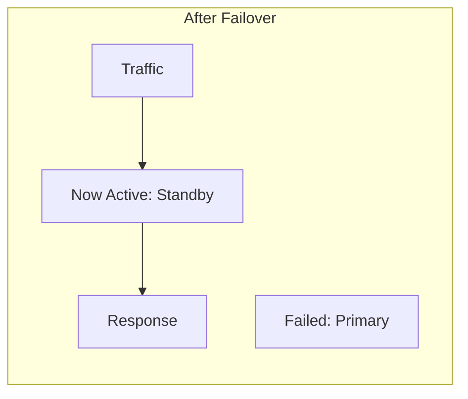
```mermaid
flowchart LR
    subgraph After Failover
        T2[Traffic] --> S2[Now Active: Standby] --> R2[Response]
        P2[Failed: Primary]
    end
```

Active-passive is the simpler of the two patterns because state ownership is unambiguous: exactly one component is the source of truth at any moment, and the standby is a follower that never initiates writes. This simplicity makes active-passive the default choice for relational databases (PostgreSQL streaming replication, MySQL replication) and for legacy applications that were not designed for distributed state. The primary cost is resource efficiency: the standby consumes compute, memory, and sometimes storage and network bandwidth, but it contributes zero throughput during normal operation. For a 2N active-passive setup, you are effectively paying for twice the capacity you use. The secondary cost is failover latency — the standby must detect the primary's failure, promote itself, and begin serving traffic, which typically takes seconds to minutes depending on the detection mechanism (heartbeat timeout, external health check) and the complexity of the promotion process (replaying replication lag, rebuilding connection pools, warming caches).

### 3.2 Active-Active (Load Shared)

In an active-active architecture, all nodes serve traffic simultaneously. A load balancer or traffic router distributes requests across the pool, and each node handles a share of the total load. If one node fails, the load balancer stops sending it traffic, and the surviving nodes absorb the failed node's share.

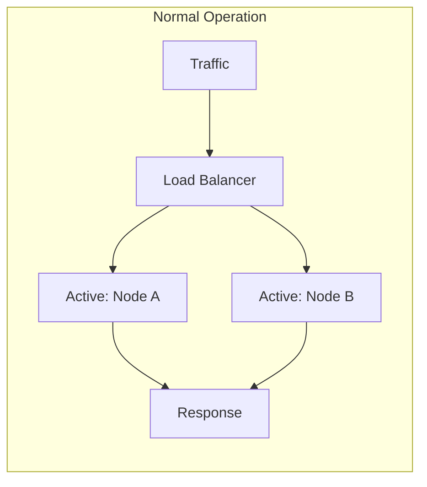
```mermaid
flowchart LR
    subgraph Normal Operation
        T1[Traffic] --> LB1[Load Balancer]
        LB1 --> N1A[Active: Node A] --> R1[Response]
        LB1 --> N1B[Active: Node B] --> R1
    end
```

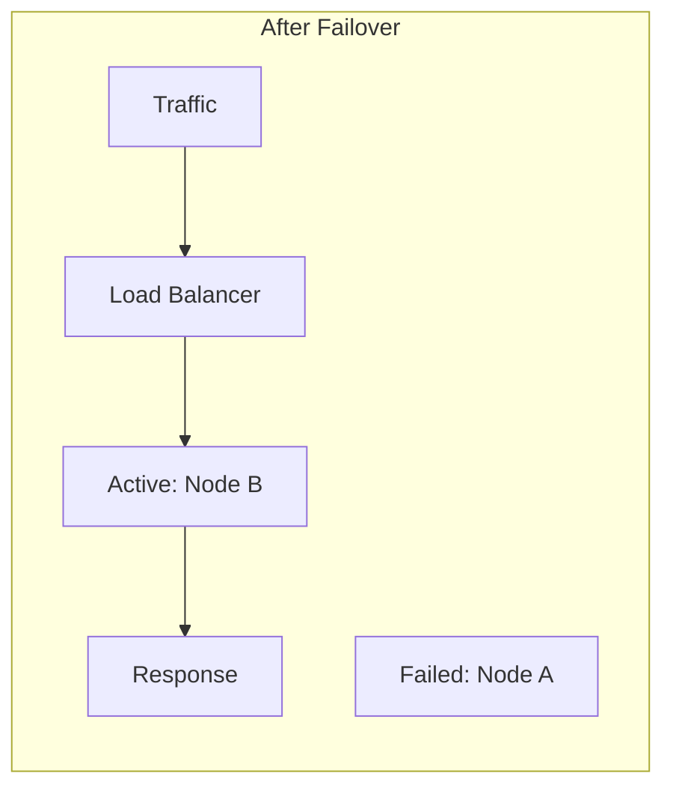
```mermaid
flowchart LR
    subgraph After Failover
        T2[Traffic] --> LB2[Load Balancer]
        LB2 --> N2B[Active: Node B] --> R2[Response]
        N2A[Failed: Node A]
    end
```

Active-active offers two advantages over active-passive: higher resource utilization (all nodes serve traffic, so you get value from every provisioned unit) and near-instant failover (the load balancer simply stops sending to the failed node — there is no promotion process, no state transfer, no warmup delay). These advantages make active-active the default pattern for stateless microservices behind a Kubernetes Service or an HTTP load balancer, and for distributed databases that use quorum writes across all nodes.

The trade-off is complexity around state. When every node can serve writes as well as reads, you need a strategy for keeping state consistent across nodes without a single authoritative source of truth. For stateless services this is trivial — there is no state to synchronize. For stateful services, active-active requires either a distributed consensus protocol (Raft or Paxos, covered in Part 4) that ensures all nodes agree on the order of writes, or a conflict-resolution strategy (last-write-wins, CRDTs, application-level merging) that accepts occasional temporary divergence. The complexity of distributed state management is the primary reason active-active databases are rarer than active-passive ones despite the resource efficiency advantage.

| Aspect | Active-Passive | Active-Active |
|--------|----------------|---------------|
| Resource usage | ~50% (standby idle) | ~100% |
| Failover time | Seconds to minutes | Instant (load balancer drops failed node) |
| Complexity | Lower | Higher |
| State management | Sync to standby | Distributed state, consensus, or conflict resolution |
| Scaling | Limited by primary capacity | Horizontal (add nodes to pool) |
| Cost efficiency | Lower (idle capacity) | Higher (all capacity utilized) |

> **Stop and think**: If an active-active architecture utilizes 100% of available resources and offers instant failover, why would anyone choose active-passive? Consider the complexity of distributed state management, the risk of write conflicts, and the cost of consensus protocol overhead. Active-active is not "active-passive but better" — it is a fundamentally different engineering trade-off where you pay for state management complexity instead of idle capacity.

---

## Part 4: State, Quorum, and Leader Election

When redundancy intersects with persistent data — databases, message queues, configuration stores — you encounter the fundamental complexities of distributed systems: network partitions that split the cluster into isolated factions, split-brain scenarios where multiple nodes believe they are the leader, and the need for mathematically rigorous consensus to determine which writes are committed and which are discarded. These are not implementation details you can defer to the database team. Every platform engineer who designs systems with replicated state must understand quorum, leader election, and the failure modes they prevent.

### 4.1 The Split-Brain Problem

Consider two database instances, Node A (Primary) and Node B (Standby), connected by a network link. The link fails — a switch reboots, a fiber is cut, a firewall rule is misapplied. Node B can no longer reach Node A. From Node B's perspective, Node A has disappeared. Node B's monitoring logic, designed to maintain availability, concludes that it must perform a failover: it promotes itself to Primary and begins accepting writes. But Node A is still running, still reachable from its own side of the partition, and still believes it is the Primary. Both nodes are now accepting writes independently, with no coordination.

This is a **split-brain**: two components that both believe they are the sole authority, making conflicting decisions that diverge the system's state. When the network partition heals — the switch comes back, the fiber is repaired — the two nodes reconnect and discover they have incompatible transaction logs. Which writes are correct? The answer is neither, in the general case. The divergent histories must be manually reconciled, which often means data loss: you pick one node's state as authoritative and discard the other's transactions, losing whatever data was written to the losing node during the partition. Split-brain is the worst failure mode in distributed systems because it destroys the invariant that makes redundancy valuable — that there is a single, consistent truth — and replaces it with two conflicting truths that cannot be automatically merged.

### 4.2 Leader Election and Consensus

To prevent split-brain, distributed systems use **leader election** algorithms, which ensure that at any given moment, at most one node believes it is the leader and is authorized to accept writes. Leader election is built on **consensus protocols** — Paxos and Raft are the two most widely implemented — that provide a mathematically proven way for a group of nodes to agree on a single value (in this case, "which node is the leader") even in the presence of network partitions, message delays, and node failures.

In Raft, time is divided into arbitrary **terms**. All nodes start as Followers. Each Follower maintains a randomized election timeout — typically 150-300 milliseconds. If a Follower receives no communication from a Leader before its timeout expires, it transitions to Candidate, increments the term number, and requests votes from every other node in the cluster. If the Candidate receives votes from a majority of nodes (quorum), it becomes the Leader for that term and begins sending periodic heartbeats to maintain authority. If multiple Candidates emerge simultaneously and none wins a majority, the term ends without a leader and a new election begins with longer timeouts to break the tie. This randomized timeout mechanism is the key insight: by making the timeout window wide enough to accommodate normal network jitter but short enough to recover quickly from leader failure, and by randomizing it so that nodes do not all time out and become Candidates simultaneously, Raft achieves both safety (at most one leader per term) and liveness (a leader is eventually elected if a majority of nodes are reachable).

In Kubernetes, leader election is operationalized through the **Lease API**. When you run highly available controllers like the `kube-controller-manager` or `kube-scheduler`, multiple replicas start up, but only one can actively mutate cluster state. They compete to acquire a Lease object — a lightweight resource in the API server that records which node holds the leadership and when the lease expires. The leader must periodically renew the lease (typically every 2 seconds). If the leader crashes and misses the renewal window, the lease expires, and the standby replicas race to acquire it. The first one to successfully create or update the Lease becomes the new leader, and the others remain standbys. This guarantees that only one controller loop modifies cluster state at any moment, preventing the split-brain scenario where two schedulers place the same pod on different nodes or two controller-managers issue conflicting deployment updates.

### 4.3 Quorum-Based Writes

Consensus algorithms and leader election both depend on the concept of **quorum**: a strict majority of nodes must agree before a decision is committed. The mathematical rule for majority quorum is `Q = floor(N / 2) + 1`. If you have 5 nodes, quorum is 3. If a network partition splits those 5 nodes into a group of 3 and a group of 2, only the group of 3 can achieve quorum — it has the majority — and will continue accepting writes. The group of 2, lacking quorum, will pause operations to prevent split-brain. This is why distributed consensus systems like etcd and ZooKeeper are typically deployed with an odd number of nodes (3, 5, or 7): an odd-sized cluster tolerates the same number of failures as the next even number (a 5-node cluster tolerates 2 failures; a 6-node cluster also tolerates 2 failures) while requiring one fewer node's worth of operational overhead.

For distributed databases like Cassandra and DynamoDB, redundancy is managed through tunable quorum reads and writes rather than leader election. Each piece of data is replicated to N nodes. The application specifies a write consistency level W (how many replicas must acknowledge a write before it is considered successful) and a read consistency level R (how many replicas must be consulted for a read). To guarantee that every read sees the most recent write, the system enforces the constraint:

`W + R > N`

If you configure 3 replicas (N=3), write to 2 replicas (W=2), and read from 2 replicas (R=2), then 2 + 2 = 4 > 3, and you are mathematically guaranteed that at least one of the replicas consulted during a read holds the most recent write. This guarantee holds regardless of which specific replicas respond — the overlap is forced by the arithmetic. You can tune the trade-off: W=1, R=3 gives you fast writes (only one replica must acknowledge) and slow but strongly consistent reads (must consult all replicas). W=3, R=1 gives you durable but low-availability writes (every replica must acknowledge, so a single unavailable replica blocks writes) and fast reads that are *still* strongly consistent. To get genuinely stale reads you need `W + R ≤ N` — e.g. W=2, R=1, where 2 + 1 = 3 is not greater than 3. W=2, R=2 balances both. The flexibility to tune these values per operation is one of the key architectural advantages of quorum-based databases over primary-replica systems, where all writes must go through the single primary.

---

## Part 5: Practical Redundancy Patterns

The concepts from Parts 1 through 4 — N+M notation, HA vs FT, active-passive vs active-active, quorum and consensus — combine into concrete deployment patterns that you can apply directly in your infrastructure. This part walks through three of the most common patterns: database replication, Kubernetes workload redundancy, and multi-region traffic management, with working configuration examples.

### 5.1 Database Replication

Database replication is the most common form of data redundancy in production systems, and it appears in two primary topologies: primary-replica (also called primary-standby or leader-follower) for read scaling, and multi-primary for write scaling. The choice between them depends on your read-to-write ratio, your tolerance for replication lag, and your appetite for conflict-resolution complexity.

```mermaid
flowchart LR
    subgraph Primary-Replica Read Scaling
        W1[Writes] --> P1[(Primary)]
        P1 -- sync --> R1A[(Replica 1)]
        P1 -- sync --> R1B[(Replica 2)]
        Read1[Reads] --> R1A
        Read1 --> R1B
    end
```

In primary-replica, all writes go to the primary, which serializes them into a replication log (WAL in PostgreSQL, binlog in MySQL, oplog in MongoDB). Replicas consume this log and apply the same writes in the same order, maintaining an eventually consistent copy. Reads can be served from any replica, which distributes read load across the pool. The critical operational metric is replication lag — the time between a write being committed on the primary and that write becoming visible on a given replica. Lag increases under write-heavy workloads, during network congestion, or when replicas fall behind due to resource contention. Applications that perform a write and then immediately read the result (the "read-your-writes" consistency pattern) must read from the primary after a write, because the replicas may not have caught up yet.

```mermaid
flowchart LR
    subgraph Multi-Primary Write Scaling
        W2[Writes] --> P2A[(Primary A)]
        P2A <== sync ==> P2B[(Primary B)]
    end
```

Multi-primary replication allows writes to any node, with bidirectional synchronization between primaries. This scales write throughput horizontally — you can add more primaries to handle more writes — but introduces the risk of write conflicts: two users updating the same record on different primaries before the synchronization can propagate. Conflict resolution strategies include last-write-wins (simple but can silently discard data), application-level merge logic (precise but complex to implement), and CRDTs (Conflict-free Replicated Data Types) for specific data structures like counters and sets. Multi-primary is appropriate when your write workload exceeds what a single primary can handle and your application can tolerate occasional conflicts or implements resolution logic, but it is dramatically more complex to operate than primary-replica and should not be the default choice.

> **Pause and predict**: In a multi-primary setup, what happens if two users update the exact same record simultaneously on different primaries before the nodes synchronize? If the conflict-resolution strategy is last-write-wins, one user's update is silently discarded — they received a success acknowledgment, but their data was overwritten. Is that acceptable for your application's data integrity requirements?

### 5.2 Kubernetes Redundancy

Kubernetes provides built-in primitives for software and hardware redundancy that, when configured correctly, give you N+M redundancy with automatic failover and self-healing without writing custom failover logic. The key resources are Deployments (for stateless workloads), StatefulSets (for stateful workloads with stable network identities), Services (for load balancing across pods), and PodDisruptionBudgets (for protecting redundancy during voluntary disruptions like node drains).

```mermaid
flowchart TD
    T[Traffic] --> Svc[Service / LB]
    subgraph Node 1
        PodA[Pod A]
    end
    subgraph Node 2
        PodB[Pod B]
    end
    subgraph Node 3
        PodC[Pod C]
    end
    Svc --> PodA
    Svc --> PodB
    Svc --> PodC
```

Pod anti-affinity is the mechanism that prevents the scheduler from clustering redundant pods onto the same underlying host. Without anti-affinity rules, a Deployment with `replicas: 3` might place all three pods on the same node — perhaps that node has the most available resources at scheduling time — and a single node failure takes down the entire service despite the replica count. The `requiredDuringSchedulingIgnoredDuringExecution` rule in the example below enforces strict separation: no two pods with the label `app: api-server` may run on the same node (identified by `topologyKey: kubernetes.io/hostname`).

```yaml
# Kubernetes deployment with redundancy (Tested on K8s v1.35)
apiVersion: apps/v1
kind: Deployment
metadata:
  name: api-server
spec:
  replicas: 3                    # 3 replicas — N+2 only if one replica handles peak load
  strategy:
    type: RollingUpdate
    rollingUpdate:
      maxUnavailable: 1          # Always keep 2 running during updates
      maxSurge: 1
  template:
    spec:
      affinity:
        podAntiAffinity:         # Spread across nodes
          requiredDuringSchedulingIgnoredDuringExecution:
          - labelSelector:
              matchLabels:
                app: api-server
            topologyKey: kubernetes.io/hostname
      containers:
      - name: api
        resources:
          requests:
            cpu: 100m
            memory: 128Mi
        livenessProbe:           # Detect failures and restart
          httpGet:
            path: /health
            port: 8080
          periodSeconds: 10
        readinessProbe:          # Route traffic only when ready
          httpGet:
            path: /ready
            port: 8080
          periodSeconds: 5
```

The `maxUnavailable: 1` setting in the rolling update strategy ensures that even during a deployment rollout, at most one pod is unavailable at any moment — the system never drops below N=2 (two pods running) during the update. Combined with the pod anti-affinity rule, this means you can roll out a new version across all nodes without ever reducing your redundancy below N+1, assuming your nodes are in different failure domains.

### 5.3 Multi-Region Redundancy

Global traffic management builds on the local redundancy patterns above by adding geographic distribution: if an entire region becomes unavailable, traffic routes to surviving regions. The mechanism is typically DNS-based (Route 53, Cloudflare, Google Cloud DNS) with health checks that remove unhealthy regions from the DNS response. DNS-based failover is simple and universally supported, but it has two important limitations: DNS TTLs mean that clients may cache a stale response pointing to the failed region for the duration of the TTL, and DNS-based routing does not provide session affinity or weighted traffic distribution with the granularity of an application-layer load balancer.

```mermaid
flowchart TD
    DNS[Global DNS<br>Route53, Cloudflare]
    subgraph Region A: US-East
        AppA[App]
        DBA[(DB Primary)]
    end
    subgraph Region B: EU-West
        AppB[App]
        DBB[(DB Replica)]
    end
    subgraph Region C: AP-SE
        AppC[App]
        DBC[(DB Replica)]
    end
    DNS --> AppA & AppB & AppC
    DBA <--> DBB
    DBA <--> DBC
```

The database replication arrows between regions in the diagram above are a deliberate simplification. In practice, cross-region database replication is one of the hardest problems in distributed systems because of the speed-of-light latency floor: a round trip between Virginia and Oregon is roughly 60-70 milliseconds, between Virginia and Frankfurt is roughly 90-100 milliseconds, and between Virginia and Singapore is roughly 200-250 milliseconds. Synchronous replication across these distances adds that latency to every write, which is unacceptable for most interactive applications. The practical compromise is typically asynchronous replication across regions (accepting the risk of replication lag and potential data loss on regional failover) combined with synchronous replication within a region (for durability within the primary region). The multi-region database topology is an active area of research and engineering, and the specific solution depends heavily on your consistency requirements, your write throughput, and your tolerance for data loss during a regional failover event.

### 5.4 Circuit Breaker Pattern

While circuit breakers do not provide physical redundancy — they do not add spare components — they protect the redundancy you already have by preventing cascading failures that can overwhelm redundant capacity. A circuit breaker sits between a caller and a downstream dependency, monitoring failure rates. When the failure rate exceeds a threshold, the breaker "opens" and immediately rejects calls to the failing dependency without waiting for timeouts. This protects the caller's thread pool, connection pool, and memory from being consumed by slow or failing downstream requests, which in turn protects the redundant capacity that might otherwise be exhausted by retries and queued requests.

```mermaid
stateDiagram-v2
    [*] --> CLOSED : normal
    CLOSED --> OPEN : failures > threshold
    OPEN --> HALF_OPEN : timeout
    HALF_OPEN --> CLOSED : success
    HALF_OPEN --> OPEN : failure
```

```mermaid
flowchart LR
    Req[Request] --> CB{Circuit Breaker}
    CB -- CLOSED --> Svc[Service]
    CB -- OPEN --> Fallback[Fallback Response<br>cached data, default error]
```

The state machine captures the three states: Closed (normal operation, requests pass through), Open (breaker has tripped, requests are rejected immediately), and Half-Open (a probe request is allowed through to test whether the downstream has recovered). The fallback behavior in the Open state is critical: it should provide a degraded but safe response — cached data, a default value, a graceful error message — rather than propagating the failure to the user. A circuit breaker without a meaningful fallback is just a faster failure, which helps the caller's resource consumption but does not improve the user experience.

> **Pause and predict**: What happens if the fallback response itself depends on a service that is also experiencing an outage? You have created a circuit breaker that protects against one dependency failure but introduces a hidden dependency on the fallback mechanism. The fallback path must be independently reliable — ideally served from local cache or static configuration with no external dependencies.

---

## Part 6: The Costs and Paradox of Redundancy

Redundancy is not free, and it is not always net-positive for reliability. Adding redundant components adds capital cost (the hardware or cloud resources), operational cost (monitoring, patching, configuring, and testing the additional components), and complexity cost (more moving parts means more interactions, more edge cases, and more obscure failure modes). This part examines the failure modes that redundancy itself introduces and the mathematical paradox that makes naive redundancy sometimes worse than no redundancy at all.

### 6.1 Common Redundancy Failures

Redundancy fails in predictable ways. The table below catalogs the five most common failure modes, each of which can turn a supposedly redundant architecture into a single point of failure — or worse, into an architecture that fails more often than a non-redundant one because the redundancy mechanism itself causes incidents.

| Failure | What Happens | Prevention |
|---------|--------------|------------|
| **Correlated failure** | Both primary and backup fail together because they share a hidden dependency | Independent failure domains, dependency mapping, chaos engineering that targets shared infrastructure |
| **Split brain** | Both nodes believe they are primary and accept conflicting writes | Proper leader election with quorum, fencing tokens, STONITH (Shoot The Other Node In The Head) |
| **Replication lag** | Backup has stale data, so failover causes data loss or inconsistent reads | Monitor replication lag with alerting, consider synchronous replication for critical paths, design applications for eventual consistency |
| **Untested failover** | Failover mechanism does not work when triggered because it has never been exercised | Regular failover drills in production, chaos engineering, automated failover testing in CI/CD |
| **Config drift** | Backup has different configuration than primary, so it behaves differently when promoted | Infrastructure as Code applied to all instances, configuration synchronization, immutable infrastructure with golden images |

Correlated failure is the subtlest and most dangerous of these because it is invisible during normal operation. Two database replicas on different nodes in the same rack share a top-of-rack switch — a switch failure takes down both. Two services in different availability zones both authenticate against the same identity provider — an IdP outage breaks both. Two regions both resolve internal service names through the same DNS infrastructure — a DNS failure makes both regions unreachable. Correlated failures hide in the dependency graph, not the architecture diagram, and the only reliable way to find them is to systematically map dependencies and then test failures of shared dependencies in a controlled environment.

### 6.2 The Redundancy Paradox

The redundancy paradox states that adding redundancy can mathematically decrease overall system reliability if the failover mechanism is less reliable than the components it is supposed to protect. This is not a hypothetical edge case — it is a common outcome when teams deploy a complex, custom failover script that has never been tested under real failure conditions, or when they add a load balancer, a health-check system, and an automated promotion pipeline that collectively have more failure modes than the simple single-instance system they replaced.

```mermaid
flowchart LR
    subgraph Simple System
        A[Component A<br>99% reliable] --> Out1[Output]
    end
    
    subgraph With Redundancy
        C_A[Component A<br>99% reliable] --> FL{Failover<br>Logic}
        C_B[Component B<br>99% reliable] --> FL
        FL --> Out2[Output]
    end
```

To see the paradox numerically, consider a system with one component that is 99% reliable (roughly 3.65 days of downtime per year). You add a second component, also 99% reliable, and a failover mechanism that is 50% reliable — perhaps it is a hand-written shell script that works correctly only under the exact failure conditions the author anticipated and fails silently or triggers incorrectly under any other condition. The effective reliability of the redundant system is the probability that Component A works, plus the probability that Component A fails AND Component B works AND the failover mechanism works: `0.99 + (0.01 × 0.50 × 0.99) = 0.99 + 0.00495 = 0.99495`, or roughly 99.5%. You spent money on a second component, engineered a more complex system, and your reliability improved by only half a percent — from about 87.6 hours of downtime per year to about 44 hours. If the failover mechanism is buggy enough that it triggers false failovers (taking down a healthy primary because of a transient metric spike), the overall reliability can actually decrease below the single-component baseline.

The paradox teaches a practical engineering lesson: the reliability of the failover mechanism must be substantially higher than the reliability of the components it protects for redundancy to be net-positive. This is why mature reliability engineering invests heavily in simple, well-tested failover mechanisms (Kubernetes' built-in pod restart is battle-tested across millions of clusters; your custom Python script that parses application logs and runs `kubectl` commands is not), regular failover testing, and chaos engineering that exercises the failover path under realistic failure conditions. A redundant system with an untested failover mechanism is a system whose reliability is unknown — and unknown reliability, in production, is indistinguishable from low reliability.

> **Hypothetical scenario:** The following narrative is a composite teaching example illustrating the risks of untested failover and unmonitored replication lag. Details are illustrative and do not describe a specific public incident.

An organization runs a primary database with a standby replica using streaming replication. For many months, monitoring dashboards display a growing replication lag — at times several hours behind — but the alerts route to an unmonitored distribution list that nobody checks. The lag grows because a configuration change months earlier introduced a long-running analytical query on the standby, consuming I/O bandwidth that the replication stream needs. Nobody notices because the primary is healthy and all user-facing reads go to the primary.

One night, the primary database server's disk controller fails. All writes stop instantly. The on-call engineer receives a page, checks the dead primary, and triggers a manual failover to the standby. The standby is promoted to primary, the application reconnects, and the engineer declares the incident resolved — the failover took a few minutes and the application is responding again.

Hours later, customer-facing teams begin receiving reports of missing data — transactions, orders, and records created during the window when the standby was lagging behind. The data was written to the primary, acknowledged to users, but never replicated to the standby before the disk controller failure. The write-ahead log segments containing those transactions are trapped on the dead primary's inaccessible storage. Recovery requires forensic data extraction from the failed hardware, manual reconciliation of the missing transactions against application logs and customer reports, and days of engineering effort. The incident highlights that redundancy without continuous validation — monitoring replication lag, alerting when it exceeds thresholds, and refusing to promote a standby that is dangerously far behind — is not redundancy. It is a bet that the primary will never fail while the standby is lagging, and that bet eventually loses.

---

## Did You Know?

- **AWS S3 standard storage** targets 99.999999999% (11 nines) of durability by synchronously storing objects across multiple independent Availability Zones before acknowledging the upload. This means that if you store 10 million objects in S3, you can expect to lose one object every 10,000 years on average — not because individual disks are that reliable, but because the redundancy scheme (erasure coding across multiple physically isolated facilities) makes correlated data loss astronomically unlikely.
- **Google Spanner** uses atomic clocks and GPS receivers in each data center, exposed through the TrueTime API, to assign globally meaningful timestamps to every transaction. This lets Spanner assign globally ordered commit timestamps without a dedicated coordination round-trip for ordering. Spanner still replicates through Paxos quorums and adds a short *commit-wait* (a few milliseconds) to bound clock uncertainty.
- **RAID 5 arrays** suffered catastrophic data loss during the 2010s as drive capacities grew into the terabyte range. When a single 2TB drive failed, the rebuild process — reading every sector from every surviving drive to reconstruct the lost data — placed sustained mechanical stress on drives that were the same age, from the same manufacturing batch, and had experienced the same wear patterns. The rebuild often triggered a second drive failure before completion, at which point the array was unrecoverable. This correlated failure mode drove the industry-wide migration to RAID 6 (double parity) and erasure coding for large-capacity drives.
- **The DNS Root Servers** use Anycast routing to share 13 logical IP addresses across hundreds of physical servers distributed globally. When a physical node fails or a network path becomes congested, BGP automatically routes traffic to the nearest healthy node with zero failover logic required — the routing layer absorbs the failure transparently. This is geographic redundancy at the internet infrastructure scale, and it is the reason DNS has survived decades of DDoS attacks, fiber cuts, and regional disasters without a global outage.

---

## Common Mistakes

| Mistake | Problem | Solution |
|---------|---------|----------|
| Same failure domain | Both replicas are in the same rack, zone, or power bus, so they fail together | Spread replicas across independent failure domains; validate with topology-aware scheduling |
| Not testing failover | The failover mechanism has never been exercised, so its behavior under real failure is unknown | Regular failover drills, chaos engineering, automated failover testing in deployment pipelines |
| Synchronous replication everywhere | Every write waits for cross-region acknowledgment, adding tens of milliseconds of latency to every user-facing request | Use synchronous replication within a region for durability, asynchronous across regions for geographic redundancy |
| Ignoring replication lag | Applications read from lagging replicas and serve stale or inconsistent data | Monitor replication lag, alert when it exceeds thresholds, route read-your-writes traffic to the primary |
| No health checks | Traffic is routed to failed or degraded instances because the load balancer has no mechanism to detect failure | Implement liveness and readiness probes with appropriate timeouts and thresholds |
| Manual failover | Failover requires a human to detect the failure, decide to act, and execute the promotion, adding minutes of downtime | Automate failover with leader election, consensus protocols, or infrastructure-level self-healing |
| Assuming more pods equals more redundancy | High replica counts on a small set of nodes or in a single failure domain provide no real redundancy | Verify that pods are distributed across failure domains with anti-affinity and topology spread constraints |

---

## Quiz

1. A platform team deploys a stateless API service with 5 pod replicas on a 3-node Kubernetes cluster, all in a single availability zone. The deployment has no pod anti-affinity rules. During a routine kernel upgrade, the operations team drains one node. The scheduler places the evicted pods onto the two remaining nodes. During the drain of the second node, all remaining pods are evicted simultaneously. Is this deployment genuinely redundant against node failures, and what is the minimum change to make it so?

<details>
<summary>Answer</summary>

No, this deployment is not genuinely redundant against node failures because the lack of pod anti-affinity rules means pods can be — and likely are — co-located on a subset of nodes. A 3-node cluster with 5 pods and no anti-affinity could place all 5 pods on 2 nodes, meaning the third node's capacity provides no redundancy benefit. When two nodes are drained or fail, all pods may be evicted simultaneously, causing a complete outage despite the replica count.

The minimum change is to add a `requiredDuringSchedulingIgnoredDuringExecution` pod anti-affinity rule with `topologyKey: kubernetes.io/hostname`, which forces the scheduler to place pods on distinct nodes. With 5 pods on a 3-node cluster and strict anti-affinity, the scheduler can place at most 3 pods (one per node), leaving 2 pods pending — which reveals that the true N is 3, not 5, and the cluster needs more nodes or a different scheduling strategy. Alternatively, use `preferredDuringScheduling` anti-affinity to encourage spreading without blocking scheduling entirely, combined with topology spread constraints to balance across nodes and zones.
</details>

2. An e-commerce platform runs its checkout service in an active-passive configuration across two regions: US-East (primary) and EU-West (standby). Database replication is asynchronous with an average lag of 800 milliseconds. The primary region experiences a complete power failure. The failover mechanism promotes the standby, but approximately 1.2 seconds of transactions — acknowledged to users as successful — were not replicated. The platform's error budget allows for up to 30 minutes of downtime per quarter but specifies zero data loss for financial transactions. Was active-passive HA with asynchronous replication the correct architecture? What should change?

<details>
<summary>Answer</summary>

No, active-passive HA with asynchronous replication was not the correct architecture for a system whose requirements specify zero data loss for financial transactions. Active-passive provides availability (the service recovers after a brief interruption) but does not provide fault tolerance — it allows in-flight data loss during the detection-and-failover window. Asynchronous replication compounds this by accepting a permanent gap between the last committed write on the primary and the last replicated write on the standby.

The architecture should change in one of two ways depending on the acceptable trade-off. If zero data loss is an absolute requirement, the replication must be synchronous within the primary region (so that no write is acknowledged to the user until it is durable on at least two storage nodes in different failure domains) and the failover mechanism must be fault-tolerant — meaning the standby has a confirmed, up-to-date copy of every committed transaction before it can be promoted. If the "zero data loss" requirement applies only to a subset of transactions (e.g., payment capture but not cart updates), the system should use synchronous replication for the critical write path and asynchronous replication for the non-critical path, potentially routing them to different database clusters with different consistency guarantees.
</details>

3. A team designs a distributed key-value store with 5 nodes and configures quorum writes (W=3) and quorum reads (R=3). A network partition splits the cluster into a group of 3 nodes and a group of 2 nodes. Which group can continue serving reads and writes, and why? If the team later reconfigures to W=2 and R=2 on the same 5-node cluster, does the behavior during the same partition change?

<details>
<summary>Answer</summary>

With W=3 and R=3 on a 5-node cluster, quorum for both reads and writes is 3 (majority). When a network partition splits the cluster into a group of 3 and a group of 2, only the group of 3 can achieve quorum. The group of 3 will continue serving reads and writes normally. The group of 2, unable to reach 3 nodes, will refuse reads and writes — clients connected to nodes in the minority partition will receive errors. This is correct behavior: the minority partition sacrifices availability to preserve consistency, preventing split-brain scenarios where both partitions accept conflicting writes.

If the team reconfigures to W=2, R=2, the constraint `W + R > N` becomes 2 + 2 = 4, which is **not** greater than 5 — so the strong-consistency guarantee no longer holds. The group of 3 can still achieve both W=2 and R=2, so it continues normal operation. The group of 2 can also achieve W=2 writes (if both nodes are reachable within the partition), which means both partitions could theoretically accept writes during the partition. However, because the W=2 writes in the minority partition would not be visible to the R=2 reads in the majority partition (and vice versa), the system has sacrificed strong consistency. When the partition heals, the divergent write histories must be reconciled. This is an example of the CAP theorem trade-off: by lowering W and R, the team gained availability (the minority partition can serve writes) at the cost of consistency (writes diverge during partitions). Whether this trade-off is acceptable depends on the application's conflict-resolution strategy.
</details>

4. A platform team deploys an N+1 redundant service with 4 pods, each running at 80% CPU at peak. The team believes they have N=3 (3 pods needed for peak load) and M=1 (one spare). A single pod crashes during peak traffic. Walk through the CPU arithmetic and explain whether the deployment was genuinely N+1 redundant.

<details>
<summary>Answer</summary>

The deployment was not genuinely N+1 redundant because the per-pod capacity utilization left insufficient headroom for failure absorption. After the crash, 3 surviving pods must handle the total peak load previously distributed across 4 pods. Each surviving pod must now handle (4 × 80%) / 3 = 106.7% of its CPU capacity — which is physically impossible, as a CPU cannot exceed 100% utilization. The surviving pods will experience CPU throttling, increased latency, health-check failures, and likely cascading crashes.

For genuine N+1 redundancy in this scenario, the per-pod CPU utilization at peak must be no higher than 75% — because (4 × 75%) / 3 = 100%, leaving zero headroom. For safe N+1 with headroom for traffic spikes, per-pod utilization should be capped at roughly 50-60%, giving the surviving pods room to absorb not just the failed pod's steady-state load but also any transient traffic increases that might coincide with the failure. This means either adding more pods (increasing M), reducing per-pod load (increasing N by right-sizing), or both. The arithmetic exposes a common misconception: replica count alone does not determine redundancy; per-replica headroom under peak load does.
</details>

5. A multi-region active-active application uses synchronous database replication between US-East and EU-West, roughly 5,000 kilometers apart. Users in both regions report that page-load times have increased from 200 milliseconds to over 800 milliseconds after the cross-region synchronous replication was enabled. Explain the physical cause of this latency increase and propose an architectural change that preserves durability without imposing cross-continental synchronous write latency on every user request.

<details>
<summary>Answer</summary>

The latency increase is caused by the speed-of-light propagation delay across the fiber-optic cables connecting the two regions. Light travels approximately 200,000 kilometers per second through fiber (about two-thirds of its vacuum speed). A round trip between US-East and EU-West, roughly 5,000 km apart, takes a minimum of about 50 milliseconds for the signal alone, plus switching, routing, and serialization overhead — typically 70-100 milliseconds total. By requiring synchronous replication for every write (the write is not acknowledged to the user until the remote region confirms it), the application forces every user-facing request that includes a write to wait for this cross-continental round trip.

The architectural fix is to make cross-region replication asynchronous while maintaining synchronous replication within each region for durability. Within US-East, writes are synchronously replicated to a second Availability Zone before acknowledgment — this protects against single-AZ failures with low intra-region latency (typically 1-2 milliseconds). The cross-region replication from US-East to EU-West is asynchronous: writes are acknowledged to the user as soon as the intra-region synchronous replication completes, and the cross-region copy happens in the background with a small, monitored lag. This preserves durability against single-AZ failures without imposing cross-continental latency on every write. The trade-off is that a complete regional failure of US-East could lose the most recent writes (those not yet replicated asynchronously to EU-West), but this is typically an acceptable risk given that complete regional failures are dramatically rarer than single-AZ or single-instance failures.
</details>

6. During a routine maintenance window, a team drains a Kubernetes node hosting a critical stateful workload with 3 replicas. The PodDisruptionBudget is set to `minAvailable: 2`. The drain command blocks and eventually times out. The operations engineer overrides the PDB with `--disable-eviction` and forces the drain, causing all 3 replicas to terminate. The workload experiences a complete outage. What went wrong, and what should the team change to allow safe node drains without violating redundancy requirements?

<details>
<summary>Answer</summary>

The drain blocked because the PDB correctly prevented the eviction that would violate the `minAvailable: 2` constraint — the cluster recognized that evicting the pod would leave fewer than 2 replicas available. This is the PDB working as designed: it protects voluntary disruptions (node drains, cluster autoscaler scale-in) from reducing availability below the specified floor. The operations engineer's override (`--disable-eviction`) bypassed this protection and forced a deletion, which the PDB does not guard against — it only controls evictions, not direct pod deletions.

The fix involves several changes. First, the team needs a documented procedure for node drains on stateful workloads that includes a pre-drain step: cordon the target node to prevent new pods from scheduling there, then verify that the other nodes have capacity to reschedule the evicted pod before starting the drain. Second, the deployment should use a budget-aware drain strategy: drain one node at a time, wait for the evicted pod to reschedule and become ready on another node, and only then proceed to the next node. Third, the operations team should be trained to treat a blocked drain as a signal that redundancy constraints are being honored, not as an obstacle to override. The PDB's `minAvailable: 2` is correct — the process, not the configuration, needs to change.
</details>

7. A monitoring system triggers a false-positive health check failure on the primary database node during a network congestion event — the node is healthy, but health-check packets are being dropped. The automated failover system promotes the standby to primary. Both the original primary (still running, still accepting writes from clients that can reach it) and the newly promoted standby now believe they are primary. Describe the split-brain scenario that results and explain which mechanism — leader election with quorum, fencing, or both — would have prevented it.

<details>
<summary>Answer</summary>

The split-brain scenario results in two database instances independently accepting writes with no coordination. The original primary continues serving clients that can reach it through uncongested network paths, while the newly promoted standby serves clients routed to it by the failover system. Both nodes commit transactions to their local storage, and their transaction logs diverge. When the network congestion clears and the two nodes can communicate again, they discover conflicting transaction histories. Neither log is fully correct — each contains writes the other lacks — and manual reconciliation is required, typically involving data loss for whichever node's writes are discarded.

Leader election with quorum would have prevented this because a properly configured consensus protocol requires a majority of voting members to agree before a leadership change. If the failover system is part of a Raft or Paxos cluster with an odd number of voters distributed across failure domains, the network congestion that drops health-check packets would also prevent the original primary from communicating with the voting members. If the original primary cannot reach a majority, it steps down or becomes a non-voting follower, even if it is technically still running. The newly elected leader must receive votes from a majority, guaranteeing that at most one leader exists.

Fencing provides an additional safety layer: before the newly promoted standby begins accepting writes, it issues a "fencing token" — a monotonically increasing number or a lease that the original primary must respect. The original primary, on receiving a higher fencing token or discovering its lease has expired, immediately stops accepting writes. Even if leader election momentarily fails (e.g., during a transient partition), fencing ensures that the old leader cannot continue operating after a new leader is elected. In practice, both mechanisms are used together: leader election determines the legitimate leader, and fencing enforces that the previous leader stops.
</details>

8. After a high-profile incident, management mandates that every production service must have redundancy — "at least two of everything." The platform team deploys a second instance of a critical but infrequently used configuration service. The failover mechanism is a custom shell script triggered by a cron job that checks if the primary is responding, and if not, updates a DNS record to point to the secondary. The script has been tested once, during a scheduled maintenance window, and worked correctly. Six months later, the primary fails. The failover script runs, detects the failure, and updates the DNS record — but the DNS change takes 15 minutes to propagate because the TTL was set to an hour and was never lowered before the failure. During this 15-minute window, clients with cached DNS continue sending requests to the failed primary and receive connection-refused errors. Was the mandated redundancy effective?

<details>
<summary>Answer</summary>

No, the mandated redundancy was not effective because it satisfied the letter of the requirement ("at least two of everything") while violating the spirit — the redundancy was present on paper but nonfunctional during the incident window that mattered. The failures were: first, DNS-based failover with a long TTL created a 15-minute window where clients could not reach the service, defeating the purpose of the redundant instance. Second, the failover mechanism relied on a cron job with a polling interval, adding detection latency on top of the DNS propagation delay. Third, the failover path had been tested only once and under ideal conditions (scheduled maintenance), not under the conditions of a real failure (sudden crash, no advance preparation to lower DNS TTLs).

For the redundancy to be effective, the team needs: active health checking at the load-balancer layer rather than DNS failover (so that traffic is rerouted in seconds, not minutes), or if DNS failover is required, a low TTL (60 seconds or less) maintained as a standing configuration, not adjusted reactively during an incident. The failover detection should be continuous and near-instant, not batch-polled by a cron job. The failover path should be tested under realistic failure conditions — kill the primary at random, without warning, and measure how long it takes for the first successful client request to reach the secondary. The management mandate was directionally correct but missed the critical implementation details that determine whether redundancy actually works when it is needed. Redundancy is not a checkbox — it is a property that must be continuously validated through testing and monitoring.
</details>

---

## Hands-On Exercise

This exercise walks you through designing and testing redundancy for a Kubernetes deployment from scratch. You will create a deployment with pod anti-affinity rules that enforce distribution across failure domains, verify that the scheduler has placed your pods on distinct nodes, simulate single and multiple simultaneous pod failures to confirm that the cluster self-heals, and configure a PodDisruptionBudget to protect your redundancy floor during planned maintenance such as node drains. By the end, you will have concrete experience with every redundancy primitive covered in this module — replicas, anti-affinity, health probes, and disruption budgets — in a working cluster you can inspect and reason about.

**Part A: Create a Redundant Deployment (15 minutes).** Start by creating a dedicated namespace and deploying a three-replica nginx workload with pod anti-affinity rules that encourage — but do not strictly require — spreading across nodes. The `preferredDuringScheduling` anti-affinity with weight 100 tells the scheduler to place pods on different hosts whenever possible, while still allowing the deployment to proceed if a single node must host multiple pods. The liveness and readiness probes ensure that Kubernetes can detect failures and stop routing traffic to unhealthy pods.

```bash
# Create namespace
kubectl create namespace redundancy-lab

# Create a deployment with redundancy (Tested on K8s v1.35)
cat <<EOF | kubectl apply -f -
apiVersion: apps/v1
kind: Deployment
metadata:
  name: web-app
  namespace: redundancy-lab
spec:
  replicas: 3
  selector:
    matchLabels:
      app: web-app
  template:
    metadata:
      labels:
        app: web-app
    spec:
      affinity:
        podAntiAffinity:
          preferredDuringSchedulingIgnoredDuringExecution:
          - weight: 100
            podAffinityTerm:
              labelSelector:
                matchLabels:
                  app: web-app
              topologyKey: kubernetes.io/hostname
      containers:
      - name: nginx
        image: nginx:alpine
        ports:
        - containerPort: 80
        readinessProbe:
          httpGet:
            path: /
            port: 80
          initialDelaySeconds: 2
          periodSeconds: 3
        livenessProbe:
          httpGet:
            path: /
            port: 80
          initialDelaySeconds: 5
          periodSeconds: 5
        resources:
          requests:
            cpu: 50m
            memory: 64Mi
---
apiVersion: v1
kind: Service
metadata:
  name: web-app
  namespace: redundancy-lab
spec:
  selector:
    app: web-app
  ports:
  - port: 80
    targetPort: 80
EOF
```

**Part B: Verify Redundancy (5 minutes).** Once the deployment is running, confirm that your pods are distributed across nodes by inspecting their placement with `-o wide`, which exposes the node column. Then check the Service endpoints to verify that the load balancer has discovered all three pods and is routing traffic to them.

```bash
# Check pods are distributed
kubectl get pods -n redundancy-lab -o wide

# Check service endpoints
kubectl get endpoints web-app -n redundancy-lab
```

**Part C: Test Failover (10 minutes).** Now simulate failures to verify that the cluster self-heals. Open two terminals — one watching pod state continuously, the other issuing deletion commands. In the watch terminal, start monitoring pods so you can observe the full lifecycle: termination, scheduling of a replacement, container startup, and readiness. In the action terminal, first delete a single pod and confirm that a replacement is scheduled and that the Service endpoints update to reflect the change. Then delete two pods simultaneously to test the more aggressive failure scenario — the cluster should recover even with two-thirds of the replicas gone simultaneously, scheduling new pods on available nodes automatically.

In the first terminal, watch pod state continuously so you can observe the full lifecycle of termination, rescheduling, container startup, and readiness probe success:
```bash
kubectl get pods -n redundancy-lab -w
```

In the second terminal, first delete a single pod and observe the replacement being scheduled and endpoints updating, then try the more aggressive two-pod deletion to confirm recovery under heavier failure:
```bash
# Delete one pod
kubectl delete pod -n redundancy-lab \
  $(kubectl get pod -n redundancy-lab -l app=web-app -o jsonpath='{.items[0].metadata.name}')

# Observe:
# - Pod terminates
# - New pod is scheduled
# - Endpoints update
```

```bash
# Delete two pods simultaneously
kubectl delete pod -n redundancy-lab \
  $(kubectl get pod -n redundancy-lab -l app=web-app -o jsonpath='{.items[0].metadata.name} {.items[1].metadata.name}')

# Observe: System recovers even with 2/3 pods gone
```

**Part D: Test PodDisruptionBudget (5 minutes).** A PodDisruptionBudget protects your redundancy during voluntary disruptions like node drains, cluster autoscaler scale-in, or `kubectl drain`. Configure a PDB with `minAvailable: 2` — this tells the cluster that at least two pods must remain available during any voluntary disruption, preventing a node drain from evicting pods if it would leave fewer than two running. If you have a multi-node cluster, try draining a node to see the PDB block the drain when it would violate the availability floor.

```bash
# Add a PodDisruptionBudget (Tested on K8s v1.35)
cat <<EOF | kubectl apply -f -
apiVersion: policy/v1
kind: PodDisruptionBudget
metadata:
  name: web-app-pdb
  namespace: redundancy-lab
spec:
  minAvailable: 2
  selector:
    matchLabels:
      app: web-app
EOF

# Try to drain a node (if you have multiple nodes)
# kubectl drain <node-name> --ignore-daemonsets --delete-emptydir-data

# The PDB will prevent draining if it would leave fewer than 2 pods
```

**Part E: Clean Up.** Remove the entire namespace to delete all resources created during this exercise — the deployment, service, and PDB.

```bash
kubectl delete namespace redundancy-lab
```

After completing the exercise, verify your understanding against this checklist to confirm you observed all the key redundancy behaviors in action:

- [ ] Deployment was instantiated with exactly 3 operational replicas
- [ ] Pod anti-affinity successfully scheduled instances on distinct topological domains
- [ ] The `kubectl delete` fault injection test correctly triggered rapid scheduling recovery
- [ ] Simultaneous multi-pod termination verified that endpoints dynamically adjust to the remaining isolated components
- [ ] Disruption budgets properly fenced administrative drains from violating `minAvailable` parameters

---

## Sources

- [Site Reliability Engineering — Handling Overload](https://sre.google/sre-book/handling-overload/) — Google SRE guidance on overload handling, retries, and circuit breaking patterns relevant to redundancy design
- [The Raft Consensus Algorithm](https://raft.github.io/) — Diego Ongaro and John Ousterhout; the canonical description of the Raft consensus protocol used for leader election and log replication in systems like etcd and Consul
- [Raft: In Search of an Understandable Consensus Algorithm (PDF)](https://raft.github.io/raft.pdf) — USENIX ATC 2014 paper; the extended academic treatment including safety proofs and cluster membership changes
- [Kubernetes — Leases](https://kubernetes.io/docs/concepts/architecture/leases/) — Kubernetes documentation on the Lease API, the mechanism used for leader election in highly available control-plane components
- [AWS Well-Architected Framework — Reliability Pillar](https://docs.aws.amazon.com/wellarchitected/latest/reliability-pillar/) — AWS guidance on designing reliable, redundant, and fault-tolerant workloads on cloud infrastructure
- [Kubernetes — Configure a PodDisruptionBudget](https://kubernetes.io/docs/tasks/run-application/configure-pdb/) — Official Kubernetes task documentation for configuring PDBs to protect workload availability during voluntary disruptions
- [Redundancy (Engineering)](https://en.wikipedia.org/wiki/Redundancy_%28engineering%29) — Wikipedia article surveying redundancy concepts across engineering disciplines including fault tolerance, reliability theory, and component duplication
- [Standard RAID Levels](https://en.wikipedia.org/wiki/Standard_RAID_levels) — Reference for RAID level definitions, parity calculations, and the correlated-failure problems that drove migration to RAID 6 and erasure coding
- [Paxos (Computer Science)](https://en.wikipedia.org/wiki/Paxos_%28computer_science%29) — Survey of the Paxos family of consensus protocols, the theoretical foundation for most modern distributed consensus implementations
- [High Availability](https://en.wikipedia.org/wiki/High_availability) — Overview of high availability concepts, measurement, and design patterns across computing
- [Google Cloud Spanner — TrueTime and External Consistency](https://cloud.google.com/spanner/docs/true-time-external-consistency) — Google's documentation of the TrueTime API and how clock uncertainty bounds support external consistency and globally ordered transactions

---

## Next Module

Ready to quantify your engineering safety margins? Head over to [Module 2.4: Measuring and Improving Reliability](../module-2.4-measuring-and-improving-reliability/) where we tear down Service Level Indicators (SLIs), map Service Level Objectives (SLOs), and weaponize error budgets to freeze deployments before reliability craters.
