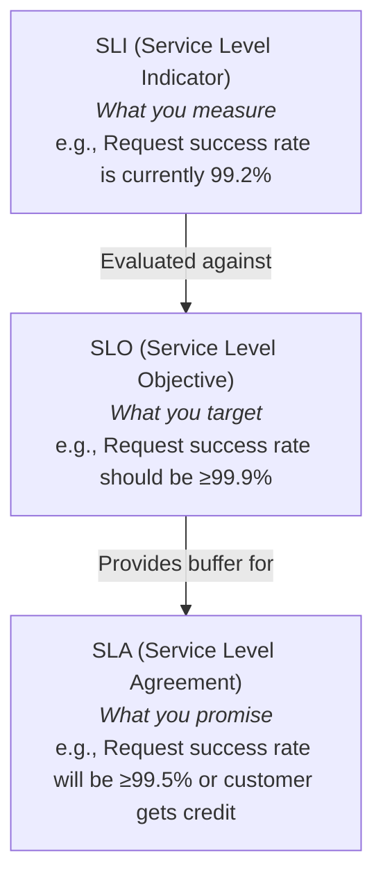
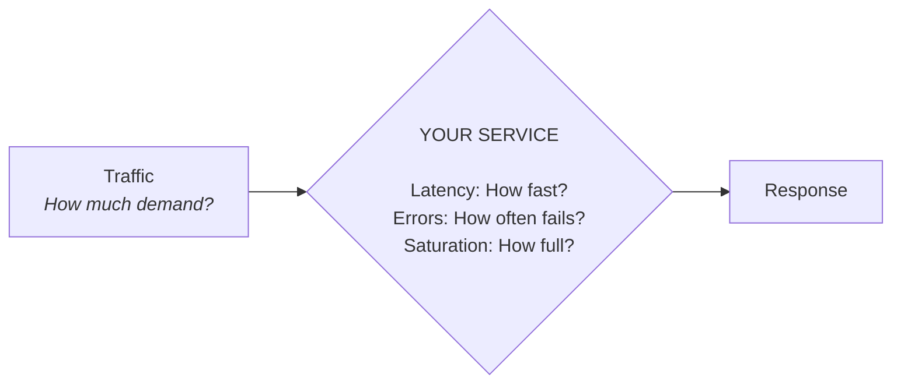
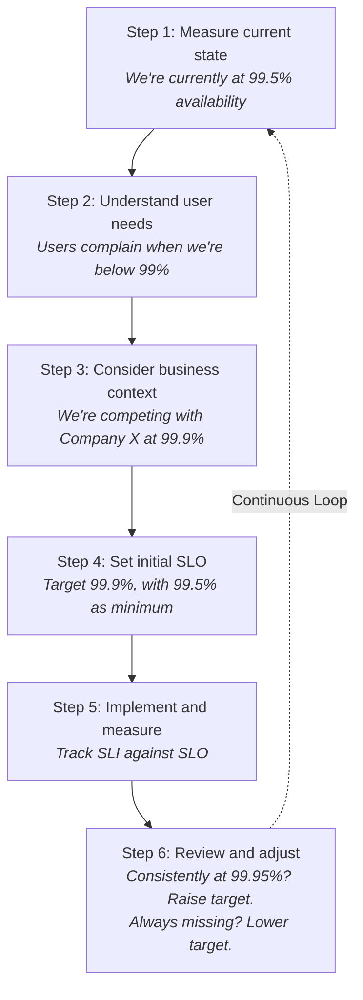
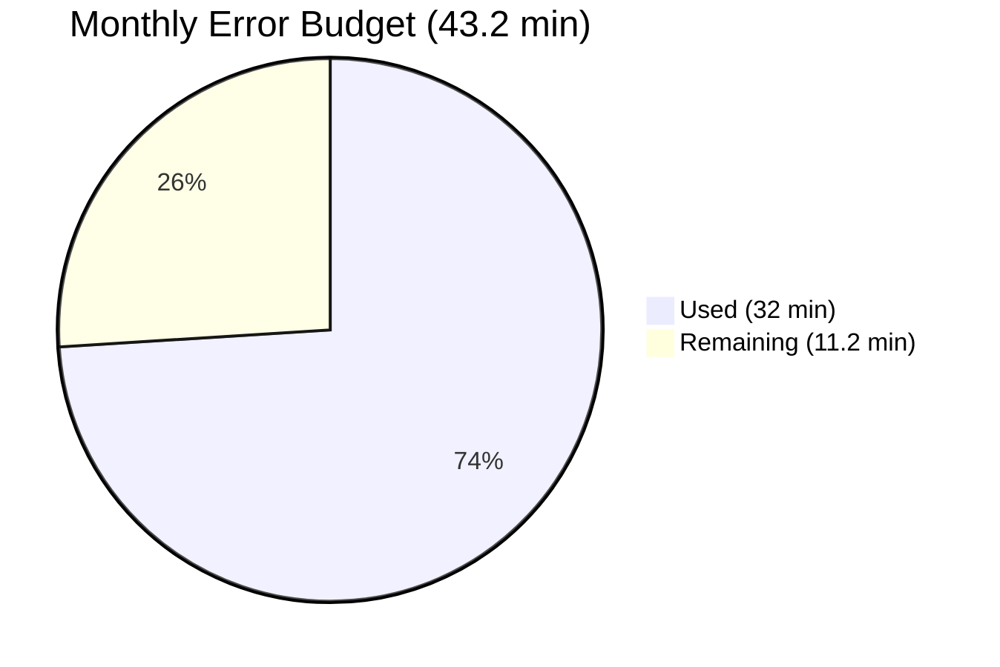
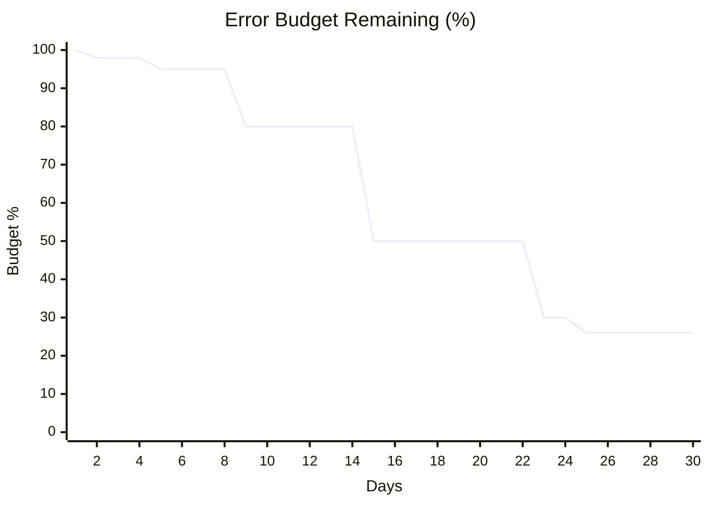
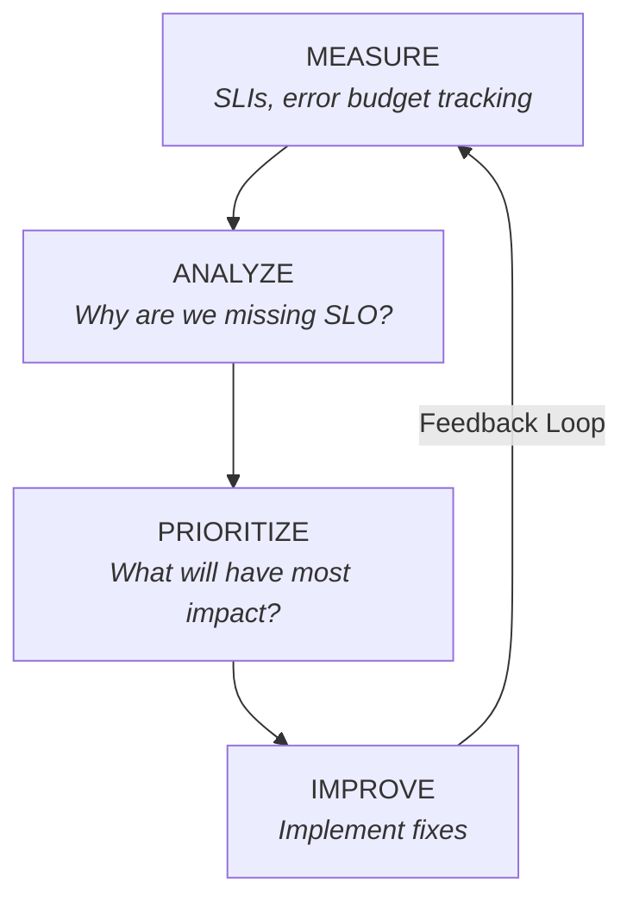
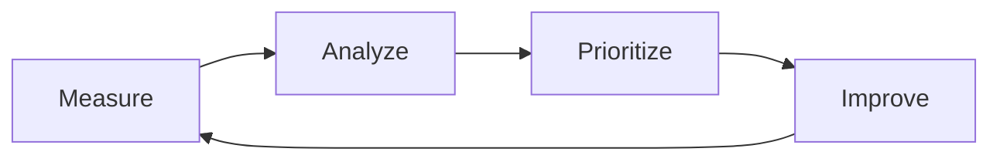
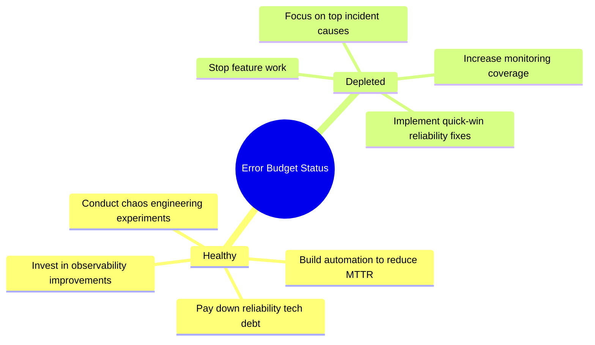
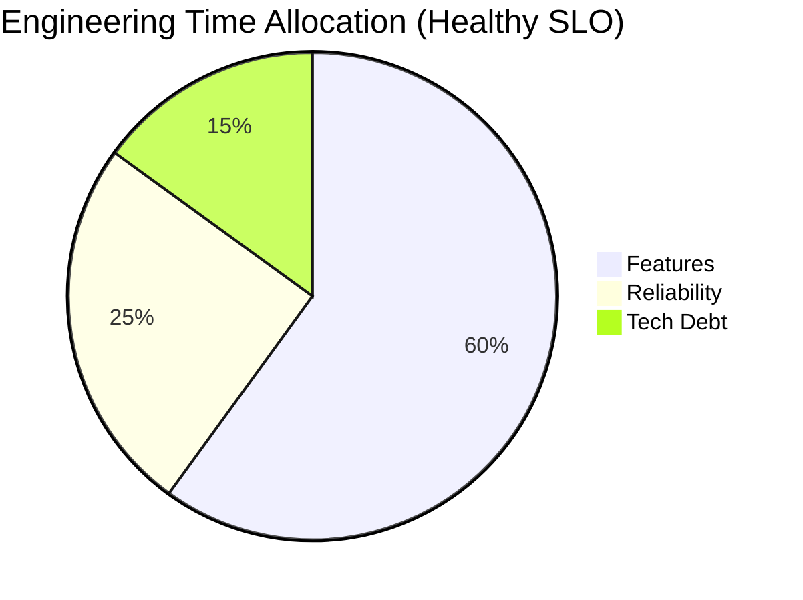
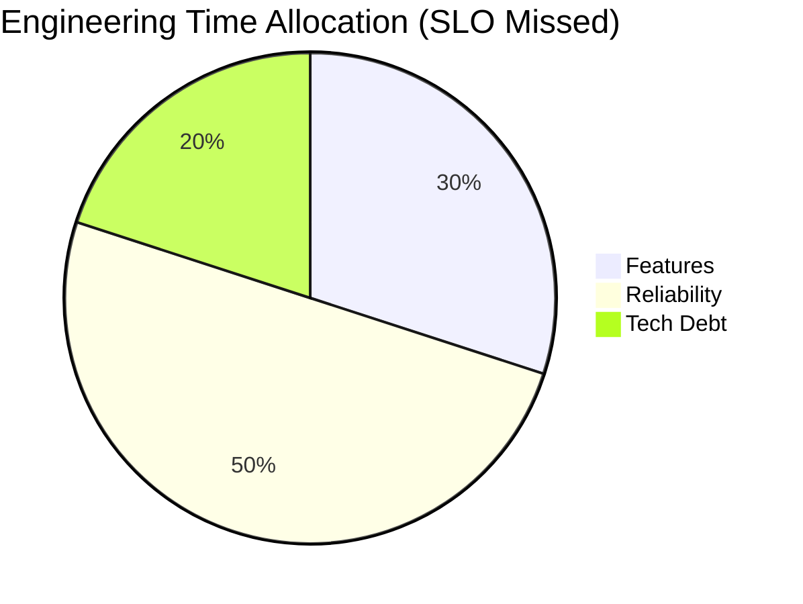

> **Complexity**: `[MEDIUM]`
>
> **Time to Complete**: 40-45 minutes
>
> **Prerequisites**: [Module 2.3: Redundancy and Fault Tolerance](../module-2.3-redundancy-and-fault-tolerance/)
>
> **Track**: Foundations

### What You'll Be Able to Do

After completing this module, you will be able to:

1. **Implement** reliability measurement frameworks using MTTR, MTBF, and availability percentages tied to user-facing impact
2. **Analyze** incident data to identify the highest-leverage reliability improvements for a given service
3. **Design** a continuous reliability improvement process that balances feature velocity with system stability
4. **Evaluate** whether a reliability investment (chaos engineering, redundancy, automation) is justified by its risk-reduction return

---

## Why This Module Matters

On August 1, 2012, Knight Capital Group, one of the largest market makers in the United States equities market, deployed a new software update to their high-frequency trading routing system. A dormant, un-tested piece of code was accidentally triggered across their production fleet. Over the next 45 minutes, the system executed millions of erroneous trades, acquiring billions of dollars in unwanted positions.

The financial impact was catastrophic: the company lost $440 million in less than an hour, nearly bankrupting the firm and forcing an immediate acquisition to survive. This wasn't just a failure of code; it was a fundamental failure of measuring risk, evaluating return on reliability investments, and lacking automated systems to calculate acceptable failure rates before catastrophic saturation. The engineering team had no framework for balancing deployment velocity against the mathematically defined risk of system failure.

We cannot improve what we cannot measure. "Make it more reliable" is a business wish, not an engineering specification. This module teaches you how to translate abstract business requirements into strict mathematical frameworks—using MTTR, MTBF, SLIs, and SLOs—so you can mathematically prove when to ship features and when to halt deployments to save the company. Without measurement, reliability is just hope. With measurement, it's engineering.

---

> **Stop and think**: If a service is 100% reliable, is it moving fast enough? At what point does chasing perfect reliability actively harm a product?

## Part 1: The Mathematics of Reliability (MTTR & MTBF)

Before we can set objectives or track budgets, we need to understand the fundamental mechanics of how systems fail and recover. The two most critical metrics in traditional reliability engineering are Mean Time Between Failures (MTBF) and Mean Time To Recovery (MTTR). These metrics form the mathematical foundation of all availability calculations.

### Understanding MTBF and Its Components

**MTBF (Mean Time Between Failures)** measures the average time a system operates continuously without a failure. It is a direct indicator of system stability and the effectiveness of your proactive quality measures, such as integration testing, code reviews, and architectural resilience. 

To calculate MTBF, you divide the total operational uptime by the number of failures experienced during that period. 

If a system runs for 1,000 hours and experiences 4 failures, the MTBF is 250 hours. This means, on average, the system runs for 250 hours before failing. Increasing MTBF requires investments in testing, redundancy, and defensive programming. However, in distributed systems, attempting to push MTBF to infinity is mathematically impossible and financially ruinous. Components will fail. Hard drives will die. Networks will partition. 

### Understanding MTTR and The Incident Lifecycle

Because failures are inevitable, world-class engineering teams focus heavily on **MTTR (Mean Time To Recovery)**. MTTR measures the average time it takes to restore a system to full functionality after a failure occurs. It indicates the efficiency of your incident response, observability tools, and automated remediation systems.

MTTR is actually an aggregate metric composed of several distinct phases of the incident lifecycle:

1. **MTTI (Mean Time To Identify):** The time from when the failure actually begins to when your monitoring systems trigger an alert. If your alerts check every 5 minutes, your MTTI has a baked-in 5-minute floor.
2. **MTTA (Mean Time To Acknowledge):** The time from when the alert fires to when a human engineer acknowledges the page and begins investigating.
3. **MTTD (Mean Time To Diagnose):** The time it takes the engineer to look at dashboards, logs, and traces to identify the root cause of the failure.
4. **MTTRepair (Mean Time To Repair):** The time required to apply the fix, such as reverting a deployment, scaling up a database, or restarting a process.
5. **MTTV (Mean Time To Verify):** The time taken to ensure the applied fix actually restored the service to a healthy state for the end user.

Reducing MTTR requires targeted investments in each of these phases. For example, moving from polling-based monitoring to streaming telemetry reduces MTTI. Implementing automated runbooks in Kubernetes v1.35 reduces MTTRepair. In Kubernetes v1.35, specifically, leveraging advanced Liveness and Readiness probes effectively drives your MTTI to milliseconds and your MTTRepair to seconds, as the cluster itself acts as an automated operator.

### Calculating Theoretical Availability

Availability is the percentage of time a system is fully operational and meeting its requirements. While we often measure it practically via successful requests, its theoretical maximum is governed by MTBF and MTTR.

The formula for calculating availability is:

`Availability = MTBF / (MTBF + MTTR)`

Imagine a system with an MTBF of 100 hours and an MTTR of 1 hour. The availability calculation would be:

`100 / (100 + 1) = 100 / 101 = 99.009%`

To improve availability, you have two mathematical levers:
1. **Increase MTBF:** Make failures happen less often.
2. **Decrease MTTR:** Make recovery faster.

In modern cloud-native systems, specifically within Kubernetes v1.35 environments, reducing MTTR is almost always more cost-effective than infinitely increasing MTBF. A system that fails frequently but recovers in milliseconds (MTTR approaching zero) via automated pod restarts or fast failovers can still mathematically achieve five-nines (99.999%) of availability.

---

## Part 2: Evaluating Risk-Reduction Returns

When you fall out of compliance with your availability targets, you must invest in reliability. But not all reliability investments are created equal. As a senior engineer, you must evaluate whether an investment (such as adopting Chaos Engineering, running active-active multi-region Kubernetes clusters, or building automated remediation pipelines) is financially justified.

### The Return on Investment (ROI) of Reliability

To evaluate a reliability investment, you must calculate the expected risk reduction against the cost of implementation. This uses a framework known as Annualized Loss Expectancy (ALE).

**Step 1: Calculate Annualized Loss Expectancy (ALE) BEFORE Investment**
You must identify the probability of a specific failure occurring in a single year, and multiply it by the financial impact of that failure. 
For example, historical data shows a database outage has a 50% chance of happening this year. If it happens, the outage costs $100,000 in lost revenue, engineering time, and SLA contractual penalties.
*ALE Before:* 0.50 * $100,000 = $50,000.

**Step 2: Calculate Annualized Loss Expectancy (ALE) AFTER Investment**
If you build an automated Kubernetes v1.35 failover mechanism using custom controllers and distributed consensus, the probability of an extended outage drops drastically to 5%. 
*ALE After:* 0.05 * $100,000 = $5,000.

**Step 3: Determine the Risk-Reduction Value**
Subtract the ALE After from the ALE Before to find the value of the mitigated risk.
*Risk Reduction:* $50,000 (Before) - $5,000 (After) = $45,000 saved per year.

**Step 4: Calculate the ROI**
Determine the cost of implementing the control. Let's say engineering time, licensing, and new infrastructure for the failover mechanism cost $15,000.
*Net Benefit:* $45,000 (Risk Reduction) - $15,000 (Cost of Control) = $30,000.
*ROI Percentage:* ($30,000 / $15,000) * 100 = **200% ROI**.

If the ROI is positive and substantial, the reliability investment is mathematically justified and should be prioritized in the backlog. If, however, you spend $60,000 to save $45,000, the investment yields a negative return. It should be rejected, even if it makes the system technically more robust. Engineering is fundamentally about delivering business value, not just achieving technical perfection for its own sake.

---

## Part 3: The SLI/SLO/SLA Framework

The traditional MTBF and MTTR metrics are excellent for hardware or monolithic systems, but they treat "failure" as a binary state. Modern distributed systems rarely fail completely; instead, they degrade. Services become slower, error rates spike intermittently, or background jobs get delayed. To capture this reality, Google pioneered the SLI, SLO, and SLA framework.

### 3.1 Definitions

| Term | What It Is | Who Cares | Example |
|------|------------|-----------|---------|
| **SLI** (Service Level Indicator) | Measurement of service behavior | Engineers | 99.2% of requests succeed |
| **SLO** (Service Level Objective) | Target for an SLI | Engineering + Product | 99.9% of requests should succeed |
| **SLA** (Service Level Agreement) | Contract with consequences | Business + Customers | 99.5% uptime or credit issued |



### 3.2 Why This Matters

Without SLOs, conversations about system health are driven by emotion and politics:
- "Is the service reliable enough?" → "I think so?"
- "Should we ship this feature or fix reliability?" → Arguments ensue
- "How urgent is this incident?" → Depends on who complains the loudest

With SLOs, conversations are driven by empirical data:
- "Is the service reliable enough?" → "Yes, we're at 99.95% against a 99.9% target"
- "Should we ship or fix reliability?" → "We have 3 hours of error budget left—fix first"
- "How urgent is this incident?" → "It's burning 10x normal error budget—high priority"

### 3.3 SLOs Enable Trade-offs

**Scenario:** A team wants to ship a massive new feature that involves complex schema changes.

**WITHOUT SLO:**
- **Product:** "Ship it!"
- **Engineering:** "It might break things!"
- **Product:** "But customers want it!"
- **Engineering:** "But reliability!"
- **Result:** Argument, politics, and the loudest voice in the room wins.

**WITH SLO:**
- **Current reliability:** 99.95%
- **SLO target:** 99.9%
- **Error budget:** 0.05% (21.6 minutes this month)
- **Budget used:** 5 minutes
- **Budget remaining:** 16.6 minutes
- **Decision:** We have error budget. Ship it, but monitor closely. If we were at 99.85%, the decision would be: Fix reliability first.
- **Result:** Data-driven decision, no argument needed.

---

> **Stop and think**: What metrics would you normally look at to determine if a web server is healthy? How many of those metrics actually tell you if the user is happy?

## Part 4: Choosing Good SLIs

If your indicator is measuring the wrong thing, your entire reliability framework collapses. We must measure what the user actually experiences, not just what is easy to measure.

### 4.1 The Four Golden Signals

Google's SRE discipline recommends monitoring these four signals to gain a comprehensive view of system health:

| Signal | What It Measures | Example SLI |
|--------|------------------|-------------|
| **Latency** | How long requests take | p99 latency < 200ms |
| **Traffic** | How much demand | Requests per second |
| **Errors** | Rate of failures | Error rate < 0.1% |
| **Saturation** | How "full" the system is | CPU < 80% |



These four signals capture the vast majority of user-visible problems:
- **High latency** means users wait, leading to a terrible experience and abandoned shopping carts.
- **High errors** means features are explicitly broken, violating the core promise of the product.
- **High traffic** indicates demand surges that might cause cascading failures across dependencies.
- **High saturation** warns that the system is running out of headroom (CPU, memory, IO ops) and is about to tip over into failure.

### 4.2 SLI Categories

Depending on the specific nature of your service, different categories of SLIs take priority. A real-time video game needs different indicators than a nightly data warehouse backup.

| Category | Measures | Good For |
|----------|----------|----------|
| **Availability** | Is it up? | Basic health |
| **Latency** | Is it fast? | User experience |
| **Throughput** | Can it handle load? | Capacity |
| **Correctness** | Is the output right? | Data quality |
| **Freshness** | Is data current? | Real-time systems |
| **Durability** | Is data safe? | Storage systems |

### 4.3 Good SLI Characteristics

A good SLI must accurately reflect user pain. If your SLI shows the system is perfectly healthy, but users are angrily tweeting at your support account, your SLI is broken.

| Characteristic | Why It Matters | Example |
|----------------|----------------|---------|
| **Measurable** | You can actually collect the data | Request latency from logs |
| **User-centric** | Reflects user experience | Measured at the edge, not internally |
| **Actionable** | You can do something about it | Not external dependencies |
| **Proportional** | Worse SLI = worse experience | p99 latency, not mean |

**Good vs. Bad SLIs**

**BAD: "Server CPU utilization"**
- Not user-centric. A user downloading a file does not care if the CPU is at 20% or 90%.
- Not proportional. 90% CPU might be perfectly optimal for a batch processing workload and indicate high efficiency.

**GOOD: "Request latency p99"**
- User-centric. Directly measures exactly how long a user had to stare at a loading spinner.
- Proportional. 500ms is worse than 200ms; 2000ms is drastically worse than 500ms.

**BAD: "Database is up"**
- Binary. It only tells you if the process is running, ignoring the fact that queries might be taking 30 seconds to return.

**GOOD: "Percentage of queries completing in <100ms"**
- Continuous. Accurately captures the spectrum of performance degradation.

When working with Kubernetes v1.35, you should collect SLIs at the ingress or service mesh level (e.g., using Prometheus ServiceMonitors to scrape NGINX or Envoy metrics). You can easily configure Prometheus to ingest latency histograms from the edge load balancers, ensuring you measure exactly what the end-client experiences before the traffic even hits your pods.

---

## Part 5: Setting SLOs

### 5.1 SLO Principles

**1. Start with user expectations, not technical capabilities**
- **WRONG:** "Our new Kubernetes cluster can theoretically do 99.99%, so that's our SLO."
- **RIGHT:** "Users expect the checkout button to work immediately. What reliability do they need to not abandon their carts?"

**2. Not everything needs the same SLO**

Different services carry different risks and business values. Over-engineering reliability for a low-value service is a waste of engineering capital.

| Service | SLO | Rationale |
|---------|-----|-----------|
| Payment processing | 99.99% | Money is involved, high stakes |
| Product search | 99.9% | Important but degraded is okay |
| Recommendations | 99.0% | Nice to have, can hide if down |
| Internal reporting | 95.0% | Async, users can wait |

**3. SLO should be achievable but challenging**
- **Too easy:** 99% (you will never be forced to improve, and users will suffer).
- **Too hard:** 99.999% (you will constantly fail the objective, making the SLO meaningless and destroying team morale).
- **Just right:** 99.9% (achievable with focused effort, provides enough error budget to maintain high feature velocity).

### 5.2 The SLO Setting Process

Setting an SLO is an iterative, continuous loop. You do not carve an SLO into stone on day one; you refine it as you gather real-world data.



### 5.3 SLO Document Template

Once defined, SLOs must be formally documented and easily accessible to all engineering and product stakeholders.

```markdown
# Service: Payment API
# Version: 1.2
# Last reviewed: 2024-01-15

## SLIs

| SLI | Definition | Measurement |
|-----|------------|-------------|
| Availability | Successful responses / Total requests | HTTP 2xx/3xx vs 5xx |
| Latency | Request duration at p99 | Measured at load balancer |
| Correctness | Valid payment responses | Reconciliation check |

## SLOs

| SLI | SLO Target | Error Budget (monthly) |
|-----|------------|----------------------|
| Availability | ≥99.95% | 21.6 minutes |
| Latency p99 | ≤500ms | 0.05% of requests |
| Correctness | ≥99.99% | 0.01% of responses |

## Error Budget Policy

- Budget >50%: Normal development velocity
- Budget 25-50%: Increased monitoring, cautious releases
- Budget <25%: Feature freeze, reliability focus
- Budget depleted: All hands on reliability

## Review Schedule

- Weekly: Error budget check
- Monthly: SLO review meeting
- Quarterly: SLO target review
```

---

> **Pause and predict**: If your SLO is 99.9% availability, exactly how many minutes of downtime are you allowed in a typical 30-day month? Try to guess before reading the formula.

## Part 6: Error Budgets in Practice

### 6.1 Calculating Error Budget

The error budget is the exact mathematical inverse of your SLO. If your SLO represents the perfection you demand, your error budget represents the imperfection you tolerate.

**SLO:** 99.9% availability
**Error budget:** 100% - 99.9% = 0.1%

**Monthly error budget:**
- Minutes in a 30-day month: 30 days × 24 hours × 60 min = 43,200 minutes
- Error budget: 43,200 × 0.001 = 43.2 minutes

**Weekly error budget:**
- Minutes in a 7-day week: 7 × 24 × 60 = 10,080 minutes
- Error budget: 10,080 × 0.001 = 10.08 minutes

This mathematical boundary gives you a definitive budget for risks, deployments, and chaos engineering experiments.

### 6.2 Error Budget Visualization

Engineering teams must have real-time visibility into their error budgets to make informed deployment decisions. Modern observability platforms will render these as dashboards.





### 6.3 Error Budget Policies

An error budget is meaningless without a strict policy that enforces consequences when the budget is depleted.

| Budget Level | Policy | Actions |
|--------------|--------|---------|
| **>75%** | Green - Full velocity | Ship features, experiment |
| **50-75%** | Yellow - Caution | Normal releases, increased monitoring |
| **25-50%** | Orange - Slow down | Only critical releases, postmortems for all incidents |
| **<25%** | Red - Stop | Feature freeze, all hands on reliability |
| **Depleted** | Emergency | War room until budget recovers |

---

> **Pause and predict**: If a team misses their SLO for three consecutive months, what is the most likely consequence for their product roadmap?

## Part 7: Continuous Improvement

### 7.1 The Reliability Improvement Cycle

Achieving high reliability is not a one-time project; it is an endless cycle of measurement, analysis, prioritization, and iterative improvement.





### 7.2 Postmortems

Every significant incident must trigger a **blameless postmortem**. The objective of a postmortem is never to assign blame to an individual engineer. Blaming individuals encourages a culture of hiding mistakes. Instead, the postmortem must assume the engineers acted rationally based on the information and tools they had, and must focus exclusively on identifying the systemic vulnerabilities that allowed the failure to occur.

#### Postmortem Template Example

**Incident: Payment API Outage 2024-01-15**

**Summary**
- **Duration**: 23 minutes
- **Impact**: 12,000 failed transactions
- **Error budget consumed**: 23 minutes (53% of monthly)

**Timeline**
- **14:32** - Deploy of version 2.3.1
- **14:35** - Error rate spikes to 15%
- **14:38** - Alert fires, on-call paged
- **14:45** - Rollback initiated
- **14:55** - Service recovered

**Contributing Factors**
1. Database migration had incompatible schema change
2. Canary deployment disabled for "quick fix"
3. Integration tests didn't cover this code path

**Action Items**

| Action | Owner | Due |
|--------|-------|-----|
| Re-enable canary deployments | Alice | 2024-01-16 |
| Add integration test for schema | Bob | 2024-01-20 |
| Review migration process | Team | 2024-01-22 |

**Lessons Learned**
- "Quick fixes" are rarely quick and bypass essential safety checks.
- Canary deployments exist for a reason and must never be disabled manually.

### 7.3 Reliability Investment Allocation

Depending on the health of your error budget, the engineering director must explicitly reallocate team resources to match the moment.



When the error budget is healthy, teams spend the majority of their time shipping features and adding business value.



When the SLO is missed for consecutive months, the focus drastically shifts to reliability to recover the system's stability and prevent catastrophic failure.



### 7.4 War Story: From Blame Culture to Learning Culture

Consider a platform team that had a deeply toxic incident culture. After every outage, leadership asked: "Who deployed last? Whose code was it? Who's responsible?"

Because engineers feared punishment, they hid information. Post-incident meetings became interrogations. Action items were ignored. The same problems kept happening over and over, because the actual root causes were never uncovered.

A new engineering director introduced blameless postmortems. During the first review of a 46-minute database outage, an engineer sheepishly admitted they ran a destructive migration script. The director stopped the interrogation immediately. 

"We're not asking who," she said. "We're asking why the system allowed this to happen."

The investigation revealed that staging lacked production-representative data volume, lock monitoring was entirely absent, and the CI/CD pipeline didn't enforce load testing for schema changes. The engineer hadn't failed; the system had failed the engineer by making a dangerous operation terrifyingly easy to execute.

| # | Action | Owner | Due |
|---|--------|-------|-----|
| 1 | Create prod-shadow DB for migration testing | Sarah | Apr 1 |
| 2 | Add lock monitoring to alerting | James | Mar 25 |
| 3 | Schema change review checklist | Team | Mar 22 |
| 4 | Document "concern escalation" for PRs | Director | Mar 18 |
| 5 | Migration runbook with rollback steps | Junior Eng | Mar 20 |

Six months later, the results of this cultural shift were mathematically undeniable:

| Metric | Before | After | Change |
|--------|--------|-------|--------|
| Incidents from same root cause | 12 | 2 | -83% |
| Action item completion rate | 34% | 89% | +162% |
| Postmortem participation | 5 avg | 12 avg | +140% |
| Engineer satisfaction (survey) | 3.2/5 | 4.4/5 | +38% |
| Mean time to acknowledge | 12 min | 4 min | -67% |
| Voluntary incident reports | 0 | 23 | ∞ |

When people fear blame, they hide information. When they feel safe, they share what went wrong. Reliability improves only when learning systematically replaces blame.

---

## Did You Know?

- **Google publishes SLOs** for many of their services. GCP has public SLOs that trigger automatic credits if breached. This transparency builds trust and sets industry standards.
- **The "rule of 10"** in SLO setting: It takes roughly 10x effort to add each nine of reliability. Going from 99% to 99.9% is hard. Going from 99.9% to 99.99% is 10x harder.
- **SLOs predate software**. The concept comes from manufacturing quality control. Walter Shewhart developed statistical quality control at Bell Labs in the 1920s—the same principles apply today.
- **Amazon's "two pizza" rule** for team size also applies to SLOs: if a service needs more SLOs than can fit on two pizza boxes, it's probably too complex. Most teams settle on 3-5 SLIs per service—enough to capture user experience, few enough to focus on.

---

## Common Mistakes

| Mistake | Problem | Solution |
|---------|---------|----------|
| Too many SLIs | Can't focus, alert fatigue | 3-5 SLIs per service max |
| SLO = current performance | No room to improve or buffer | Set slightly below current |
| Measuring internally, not at edge | Misses user experience | Measure where users connect |
| Ignoring error budget | SLO is just a number | Make budget decisions automatic |
| No postmortems | Same incidents repeat | Blameless postmortem culture |
| Yearly SLO review | SLOs become stale | Quarterly minimum |
| Uncalculated ROI | Wasting time on unneeded features | Calculate ALE before investing |
| MTTR Ignored | Long outages persist | Prioritize automated remediation |

---

## Quiz

1. **You are setting up monitoring for a new video transcoding service. Your lead asks you to define the SLI and the SLO for the service's processing time. How would you explain the difference between the two in this specific context?**
   <details>
   <summary>Answer</summary>

   In this scenario, your SLI (Service Level Indicator) would be the actual measured processing time for video transcoding, such as "p99 transcoding time." This is a factual metric pulled from your monitoring system. The SLO (Service Level Objective), on the other hand, is the target you set for that metric, such as "p99 transcoding time should be under 5 minutes." SLIs tell you the current reality of your system's performance, while SLOs define the acceptable standard you are trying to maintain. The gap between your measured SLI and your target SLO determines your remaining error budget.
   </details>

2. **Your company's legal team has signed an SLA (Service Level Agreement) with a major enterprise client guaranteeing 99.5% uptime for the API, with severe financial penalties for breaches. Your engineering team is defining internal targets. Why should the team's internal SLO be set stricter (e.g., 99.9%) than the contracted SLA?**
   <details>
   <summary>Answer</summary>

   Setting an internal SLO strictly higher than the external SLA creates a critical safety buffer for your engineering team. If your SLO matches your SLA exactly, any normal operational variance or minor incident that causes you to miss your target will immediately trigger a contract breach and financial penalties. By aiming for 99.9% internally, a drop to 99.8% will deplete your error budget and trigger a feature freeze, forcing the team to focus on reliability. This internal reaction happens well before the 99.5% SLA threshold is reached, protecting the business from legal and financial consequences.
   </details>

3. **The product manager is demanding that the team push a major new checkout flow before Black Friday, but the lead engineer argues the system has been unstable all week and they need to halt feature work. How can implementing an error budget resolve this recurring standoff?**
   <details>
   <summary>Answer</summary>

   An error budget shifts the conversation from a subjective political argument to an objective, data-driven decision. Instead of arguing about whether the system is "stable enough," the team simply looks at the math. If the SLO is 99.9% and the recent instability has consumed the entire month's error budget, the policy dictates a mandatory feature freeze to focus on reliability. Conversely, if there is still ample error budget remaining, the product manager is cleared to push the new checkout flow without debate. By agreeing on the rules beforehand, both product and engineering are aligned on when to prioritize velocity and when to prioritize stability.
   </details>

4. **Your team is choosing metrics for a new user-facing search service. One engineer suggests using "Database CPU utilization < 75%" as the primary indicator, while another suggests "Search results returned in < 200ms at the 99th percentile." Which is the better SLI for this service and why?**
   <details>
   <summary>Answer</summary>

   The p99 search latency is the significantly better SLI because it directly measures the user's experience. Users do not care about or experience database CPU utilization; they only care about how fast their search results appear on screen. Furthermore, CPU utilization is not proportional to user pain—the CPU could be running at 90% while still serving results quickly, or it could be at 20% while a network issue causes severe delays. A good SLI must be user-centric, measurable at the edge where the user connects, and directly proportional to the quality of the experience provided.
   </details>

5. **Your service has a 99.9% availability SLO. This month you had 25 minutes of downtime. Calculate: (a) Total error budget, (b) Budget consumed, (c) Budget remaining as percentage, and (d) What policy level should you be at based on a standard tiered response?**
   <details>
   <summary>Answer</summary>

   (a) Total error budget for a 99.9% monthly SLO is calculated by taking the total minutes in a 30-day month (43,200) and multiplying by the allowed error rate (0.001), resulting in 43.2 minutes. (b) The budget consumed is the 25 minutes of downtime experienced during the month. (c) The remaining budget is 18.2 minutes, which is 42.1% of the total budget (18.2 / 43.2). (d) With 42.1% remaining, the team falls into the "Orange" policy level (25-50%). At this level, the team should slow down releases, require postmortems for all incidents, and shift focus toward reliability to prevent completely depleting the budget.
   </details>

6. **An engineering team has defined an SLI of "Backend Server Memory Usage < 80%" for their web application. Over the past month, memory usage has consistently spiked to 95%, repeatedly breaking the SLO. However, no users have complained, latency is excellent, and revenue is up. What does this indicate about their choice of SLI?**
   <details>
   <summary>Answer</summary>

   This indicates that "Backend Server Memory Usage" is a poor SLI because it does not accurately reflect the actual user experience. An effective SLI must be directly proportional to user pain; if the metric looks terrible but users are perfectly happy, the metric is measuring the wrong thing. High memory usage might just be efficient database caching at work, which actually improves performance for the end user. The team should replace this internal system metric with a user-centric metric, such as the success rate of HTTP requests or page load latency measured at the load balancer.
   </details>

7. **After a massive database deletion incident, the VP of Engineering demands to know exactly which engineer ran the destructive script so they can be officially disciplined. The SRE lead argues for a "blameless postmortem" instead. Why will the blameless approach do more to prevent the next outage?**
   <details>
   <summary>Answer</summary>

   A blameless postmortem improves reliability because it shifts the focus from punishing individuals to fixing the underlying systems that allowed the failure to occur. If engineers fear punishment, they will hide information, point fingers, and cover up near-misses, leaving dangerous system flaws completely intact. By assuming the engineer was acting rationally with the tools they had, the investigation can uncover why the system lacked safeguards, such as a dry-run mode or blast radius limits. Fixing those systemic vulnerabilities ensures that the same mistake cannot be made again, regardless of who is sitting at the keyboard.
   </details>

8. **Your team manages a background reporting job with an agreed-upon SLO of 99.0% completion success. For the past six months, the service has hit 99.99% success. The team wants to celebrate this achievement. Why might this level of reliability actually be a problem that requires correction?**
   <details>
   <summary>Answer</summary>

   Consistently over-achieving an SLO by a wide margin typically indicates an inefficient over-investment in reliability. The expensive engineering hours spent maintaining 99.99% for a service that only requires 99.0% could have been spent developing new features or paying down technical debt. Additionally, the team might be acting too conservatively, avoiding necessary architectural risks or artificially slowing down deployment velocity. To correct this imbalance, the team should either deliberately increase their deployment speed to utilize their available error budget, or if the business actually requires 99.99%, formally raise the SLO to match reality.
   </details>

---

## Hands-On Exercise

**Task**: Define SLIs and SLOs for a service, create an error budget dashboard, and calculate ROI for a proposed fix.

**Part A: Define SLIs (10 minutes)**

Choose a service you work with (or use the example "User API" service).

| SLI Name | Definition | Measurement Method | Good Threshold |
|----------|------------|-------------------|----------------|
| Availability | % of successful responses | (2xx + 3xx) / total at LB | ≥99.9% |
| Latency | p99 request duration | Histogram at LB | ≤200ms |
| | | | |
| | | | |

**Part B: Set SLOs (10 minutes)**

For each SLI, set an SLO:

| SLI | SLO Target | Error Budget (monthly) | Rationale |
|-----|------------|----------------------|-----------|
| Availability | 99.9% | 43.2 minutes | Users expect high availability |
| Latency p99 | 200ms | 0.1% of requests | UX degrades above 200ms |
| | | | |

**Part C: Calculate Current Status (10 minutes)**

Using real data from your service (or the sample data below):

Sample data for this month:
- Total requests: 5,000,000
- Failed requests (5xx): 3,500
- Requests over 200ms: 6,000
- Downtime: 15 minutes

Calculate:
1. Current availability: ____%
2. Current latency compliance: ____%
3. Error budget consumed (availability): ____ minutes
4. Error budget remaining: ____ minutes
5. Current policy level: ____

**Part D: Create Improvement Plan (10 minutes)**

Based on your calculations:

1. Which SLI needs the most attention?
2. What would you investigate first?
3. What's one action that would improve it?

| Priority | Issue | Proposed Action | Expected Impact |
|----------|-------|-----------------|-----------------|
| 1 | | | |
| 2 | | | |

**Success Criteria**:
- [ ] At least 3 SLIs defined
- [ ] SLOs set with rationale
- [ ] Current status calculated correctly
- [ ] Improvement plan with prioritized actions
- [ ] Evaluated theoretical ROI of an improvement implementation

**Sample Answers**:

<details>
<summary>Check your calculations</summary>

Using the sample data:
1. Availability: (5,000,000 - 3,500) / 5,000,000 = 99.93%
2. Latency compliance: (5,000,000 - 6,000) / 5,000,000 = 99.88%
3. Error budget consumed: 15 minutes
4. Error budget remaining: 43.2 - 15 = 28.2 minutes (65% remaining)
5. Policy level: Yellow (50-75% remaining) - Normal operations but increased monitoring

Analysis:
- Latency (99.88%) is below SLO (99.9%)—needs attention
- Availability (99.93%) is meeting SLO (99.9%)—healthy
- Focus on latency improvements

</details>

---

## Conclusion & Policies

| Budget | Color | Policy |
|--------|-------|--------|
| >75% | Green | Ship fast, experiment |
| 50-75% | Yellow | Normal pace, monitor |
| 25-50% | Orange | Only critical releases |
| <25% | Red | Feature freeze |
| 0% | Black | War room until recovery |

| Module | Key Takeaway |
|--------|--------------|
| 2.1 | Reliability is measurable; each nine is 10x harder |
| 2.2 | Predict failure modes with FMEA; design degradation paths |
| 2.3 | Redundancy enables survival; but test your failover |
| 2.4 | SLIs measure, SLOs target, error budgets enable decisions |

---

## Next Module

Ready to look deeper into the systems that provide these metrics?

| Your Interest | Next Track |
|---------------|------------|
| Understanding what's happening | [Observability Theory](/platform/foundations/observability-theory/) |
| Operating reliable systems | [SRE Discipline](/platform/disciplines/core-platform/sre/) |
| Building secure systems | [Security Principles](/platform/foundations/security-principles/) |
| Distributed system challenges | [Distributed Systems](/platform/foundations/distributed-systems/) |

Up next: Discover how distributed systems generate telemetry and how Prometheus scraping works under the hood in **[Module 3.1: Observability Theory](/platform/foundations/observability-theory/)**!