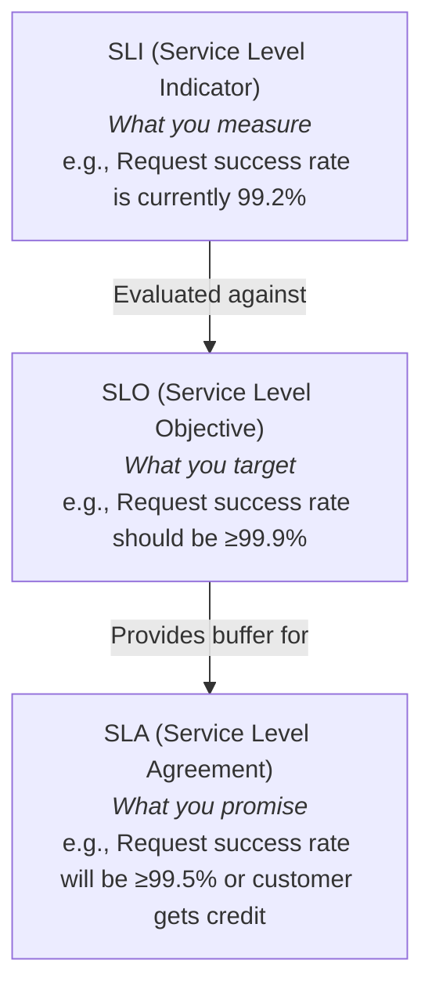
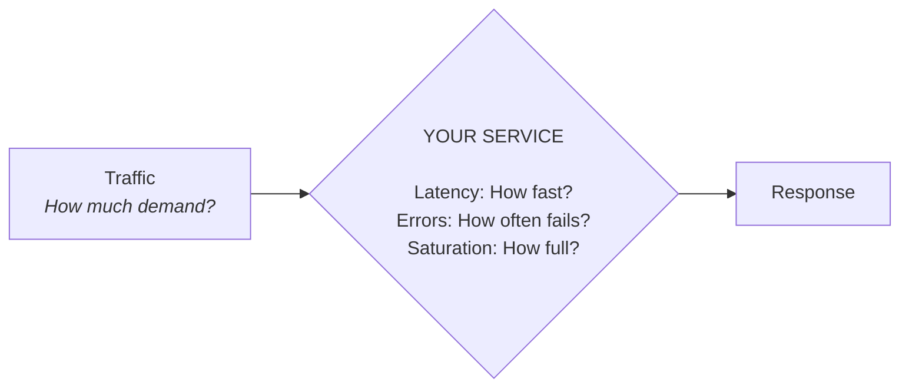
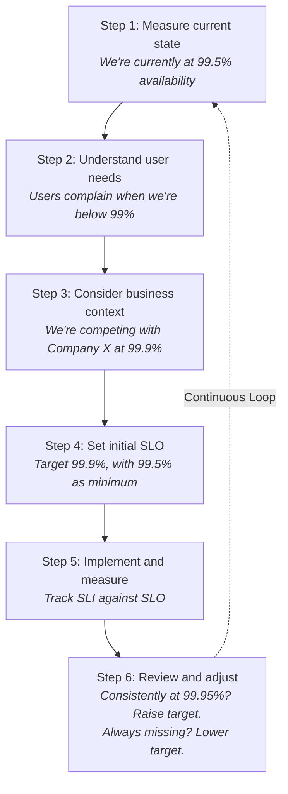
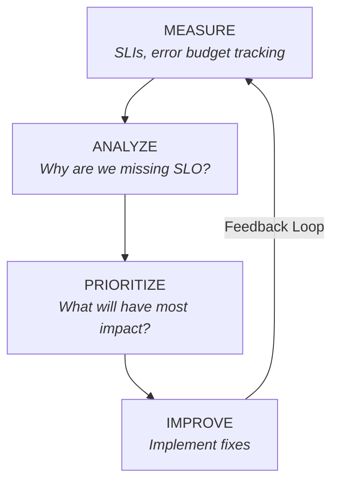
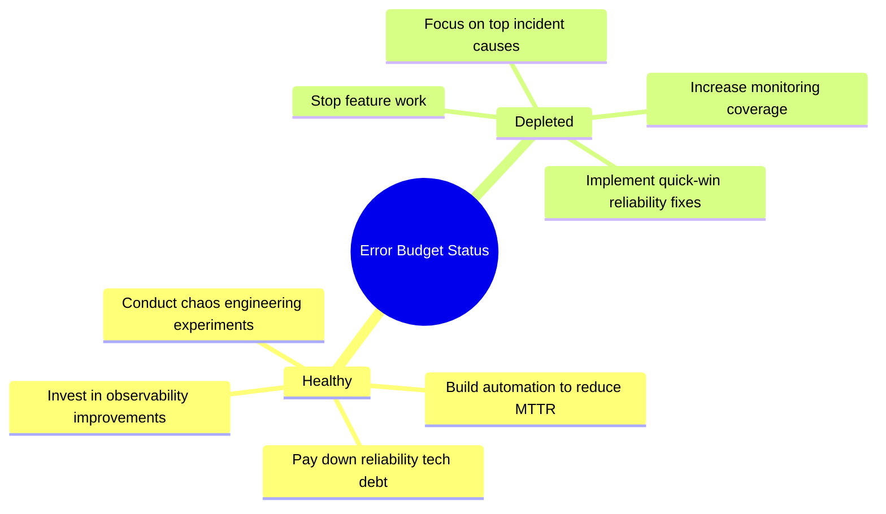

> **Complexity**: `[MEDIUM]`
>
> **Time to Complete**: 40-45 minutes
>
> **Prerequisites**: [Module 2.3: Redundancy and Fault Tolerance](../module-2.3-redundancy-and-fault-tolerance/)
>
> **Track**: Foundations

### What You'll Be Able to Do

After completing this module, you will be able to:

1. **Implement** reliability measurement frameworks using MTTR, MTBF, and availability percentages tied to user-facing impact
2. **Analyze** incident data to identify the highest-leverage reliability improvements for a given service
3. **Design** a continuous reliability improvement process that balances feature velocity with system stability
4. **Evaluate** whether a reliability investment (chaos engineering, redundancy, automation) is justified by its risk-reduction return

---

## The Meeting That Changed How Google Thinks About Reliability

**2003. Google's Mountain View campus. The weekly "availability meeting."**

Engineering VP Ben Treynor sits at the head of a conference table. Around him: frustrated engineers, exhausted operators, and a whiteboard covered in incident timelines.

"Gmail is at 99.5% availability," someone reports.

Treynor frowns. "Is that good?"

Silence. Nobody knows how to answer.

"Users are complaining," someone offers.

"But they always complain. How do we know if we should drop everything to fix this, or ship the new features that will make users happy?"

More silence.

A junior engineer speaks up: "What if... we decided in advance how reliable Gmail *needs* to be? Like, actually picked a number?"

The room considers this. It sounds almost naive—just pick a number?

"Let's say 99.9%," someone suggests. "That gives users 43 minutes of downtime a month. Is that acceptable?"

Marketing is consulted. Product weighs in. Support data is reviewed.

The team agrees: 99.9% is acceptable for Gmail. If users can email most of the time and the service recovers quickly when it doesn't, that's good enough. Higher would be nice but isn't necessary.

Then comes the insight that changes everything.

"If 99.9% is acceptable, and we're at 99.5%, we need to stop shipping features and fix reliability. But if we hit 99.95%... we're *over-engineering*. We should ship faster."

This is the birth of the **error budget**.

Google had invented a way to resolve the eternal conflict between "move fast" and "be reliable." The SLO became a ceiling, not just a floor. When budget is healthy: ship. When budget is depleted: stabilize.

Within years, every team at Google would have SLOs. The framework would spread across the industry. Today, SLIs and SLOs are standard practice at companies from startups to enterprises.

**The revolution wasn't technical. It was conceptual: reliability became something you could budget for, spend, and invest—just like money.**

---

> **Stop and think**: If a service is 100% reliable, is it moving fast enough? At what point does chasing perfect reliability actively harm a product?

## Why This Module Matters

"We need to improve reliability" is a vague goal. Improve what? By how much? How will you know if you've succeeded?

This module teaches you to measure reliability objectively using SLIs (Service Level Indicators), set meaningful targets with SLOs (Service Level Objectives), and create a continuous improvement process. Without measurement, reliability is just hope. With measurement, it's engineering.

```
THE TRANSFORMATION: FROM ARGUMENTS TO DATA
═══════════════════════════════════════════════════════════════════════════════

BEFORE SLOs (Politics)
────────────────────────────────────────────────────────────────

Monday standup at a typical tech company:

Product: "When is the new checkout feature shipping?"
Engineering: "We can't ship until we fix these reliability issues."
Product: "What issues? The site seems fine."
Engineering: "Trust us, there are problems."
Product: "But customers want this feature!"
Engineering: "And they also want the site to not crash!"
Manager: "Can we compromise and do both?"
Everyone: *sighs*

Result: Whoever argues loudest wins. Same conversation next week.

AFTER SLOs (Data)
────────────────────────────────────────────────────────────────

Monday standup at a team with SLOs:

Product: "When is the new checkout feature shipping?"
Engineering: "Let me check the error budget... We're at 99.92% against a
             99.9% SLO. We have 14 minutes of budget left this month."
Product: "That's tight. What's using our budget?"
Engineering: "The database migration last week cost us 18 minutes."
Product: "If we ship the checkout feature, what's the risk?"
Engineering: "Estimated 5-10 minutes if something goes wrong."
Product: "So we'd likely burn the rest of the budget."
Engineering: "Correct. We could wait for the new month, or ship with
             a quick rollback ready."
Product: "Let's wait. We need that budget for the holiday sale."

Result: Data-driven decision. No argument. Aligned priorities.
```

> **The Fitness Analogy**
>
> "I want to get fit" is a vague goal. "I want to run a 5K in under 25 minutes by March" is specific and measurable. You can track progress (current time), know when you've succeeded (under 25 minutes), and adjust training if needed. SLOs do the same for system reliability—they turn "be reliable" into "this specific thing, measured this way, at this target."

---

## What You'll Learn

- What SLIs, SLOs, and SLAs are and how they differ
- How to choose good SLIs for your services
- Setting realistic SLOs
- Using error budgets for decision-making
- Continuous reliability improvement practices

---

## Part 1: The SLI/SLO/SLA Framework

### 1.1 Definitions

| Term | What It Is | Who Cares | Example |
|------|------------|-----------|---------|
| **SLI** (Service Level Indicator) | Measurement of service behavior | Engineers | 99.2% of requests succeed |
| **SLO** (Service Level Objective) | Target for an SLI | Engineering + Product | 99.9% of requests should succeed |
| **SLA** (Service Level Agreement) | Contract with consequences | Business + Customers | 99.5% uptime or credit issued |



### 1.2 Why This Matters

Without SLOs:
- "Is the service reliable enough?" → "I think so?"
- "Should we ship this feature or fix reliability?" → Arguments
- "How urgent is this incident?" → Depends on who's loudest

With SLOs:
- "Is the service reliable enough?" → "Yes, we're at 99.95% against a 99.9% target"
- "Should we ship or fix reliability?" → "We have 3 hours of error budget left—fix first"
- "How urgent is this incident?" → "It's burning 10x normal error budget—high priority"

### 1.3 SLOs Enable Trade-offs

```
SLO-BASED DECISION MAKING
═══════════════════════════════════════════════════════════════

Scenario: Team wants to ship new feature that adds risk

WITHOUT SLO:
    Product: "Ship it!"
    Engineering: "It might break things!"
    Product: "But customers want it!"
    Engineering: "But reliability!"
    → Argument, politics, loudest voice wins

WITH SLO:
    Current reliability: 99.95%
    SLO target: 99.9%
    Error budget: 0.05% (21.6 minutes this month)
    Budget used: 5 minutes
    Budget remaining: 16.6 minutes

    Decision: We have error budget. Ship it, but monitor closely.
    If we were at 99.85%, decision would be: Fix reliability first.

    → Data-driven decision, no argument needed
```

> **Did You Know?**
>
> Google's SRE team famously uses error budgets to manage the tension between development velocity and reliability. When error budget is healthy, teams ship fast. When budget is depleted, feature freezes happen automatically—no negotiation needed. This has been adopted industry-wide as a best practice.

---

> **Stop and think**: What metrics would you normally look at to determine if a web server is healthy? How many of those metrics actually tell you if the user is happy?

## Part 2: Choosing Good SLIs

### 2.1 The Four Golden Signals

Google's SRE book recommends monitoring these four signals:

| Signal | What It Measures | Example SLI |
|--------|------------------|-------------|
| **Latency** | How long requests take | p99 latency < 200ms |
| **Traffic** | How much demand | Requests per second |
| **Errors** | Rate of failures | Error rate < 0.1% |
| **Saturation** | How "full" the system is | CPU < 80% |



These four signals capture most user-visible problems:
- **High latency** → Users wait → Bad experience
- **High errors** → Features broken → Bad experience
- **High traffic** → Might cause others → Leading indicator
- **High saturation** → About to have problems → Early warning

### 2.2 SLI Categories

| Category | Measures | Good For |
|----------|----------|----------|
| **Availability** | Is it up? | Basic health |
| **Latency** | Is it fast? | User experience |
| **Throughput** | Can it handle load? | Capacity |
| **Correctness** | Is the output right? | Data quality |
| **Freshness** | Is data current? | Real-time systems |
| **Durability** | Is data safe? | Storage systems |

### 2.3 Good SLI Characteristics

A good SLI is:

| Characteristic | Why It Matters | Example |
|----------------|----------------|---------|
| **Measurable** | You can actually collect the data | Request latency from logs |
| **User-centric** | Reflects user experience | Measured at the edge, not internally |
| **Actionable** | You can do something about it | Not external dependencies |
| **Proportional** | Worse SLI = worse experience | p99 latency, not mean |

```
GOOD vs BAD SLIs
═══════════════════════════════════════════════════════════════

BAD: "Server CPU utilization"
    - Not user-centric (users don't care about CPU)
    - Not proportional (80% CPU might be fine)

GOOD: "Request latency p99"
    - User-centric (directly affects experience)
    - Proportional (higher = worse)

BAD: "Database is up"
    - Binary (up/down)
    - Doesn't capture degradation

GOOD: "Percentage of queries completing in <100ms"
    - Continuous (captures degradation)
    - User-centric
```

> **Try This (3 minutes)**
>
> For a service you work with, define one SLI for each category:
>
> | Category | Your SLI |
> |----------|----------|
> | Availability | |
> | Latency | |
> | Correctness | |

---

## Part 3: Setting SLOs

### 3.1 SLO Principles

**1. Start with user expectations, not technical capabilities**

```
WRONG: "Our system can do 99.99%, so that's our SLO"
RIGHT: "Users expect checkout to work. What reliability do they need?"
```

**2. Not everything needs the same SLO**

```
DIFFERENTIATED SLOs
═══════════════════════════════════════════════════════════════

Service              SLO        Rationale
─────────────────────────────────────────────────────────────
Payment processing   99.99%     Money is involved, high stakes
Product search       99.9%      Important but degraded is okay
Recommendations      99.0%      Nice to have, can hide if down
Internal reporting   95.0%      Async, users can wait
```

**3. SLO should be achievable but challenging**

```
Too easy:    99% (you'll never improve)
Too hard:    99.999% (you'll always fail, SLO becomes meaningless)
Just right:  99.9% (achievable with effort, gives error budget)
```

### 3.2 The SLO Setting Process



### 3.3 SLO Document Template

```markdown
# Service: Payment API
# Version: 1.2
# Last reviewed: 2024-01-15

## SLIs

| SLI | Definition | Measurement |
|-----|------------|-------------|
| Availability | Successful responses / Total requests | HTTP 2xx/3xx vs 5xx |
| Latency | Request duration at p99 | Measured at load balancer |
| Correctness | Valid payment responses | Reconciliation check |

## SLOs

| SLI | SLO Target | Error Budget (monthly) |
|-----|------------|----------------------|
| Availability | ≥99.95% | 21.6 minutes |
| Latency p99 | ≤500ms | 0.05% of requests |
| Correctness | ≥99.99% | 0.01% of responses |

## Error Budget Policy

- Budget >50%: Normal development velocity
- Budget 25-50%: Increased monitoring, cautious releases
- Budget <25%: Feature freeze, reliability focus
- Budget depleted: All hands on reliability

## Review Schedule

- Weekly: Error budget check
- Monthly: SLO review meeting
- Quarterly: SLO target review
```

> **Gotcha: The SLO Ceiling Problem**
>
> If you consistently exceed your SLO by a large margin, you might be over-investing in reliability. Being at 99.99% when your SLO is 99.9% means you could move faster. Consider either: raising the SLO (if users benefit) or deliberately spending error budget on velocity (if they don't).

---

> **Pause and predict**: If your SLO is 99.9% availability, exactly how many minutes of downtime are you allowed in a typical 30-day month? Try to guess before reading the formula.

## Part 4: Error Budgets in Practice

### 4.1 Calculating Error Budget

```
ERROR BUDGET CALCULATION
═══════════════════════════════════════════════════════════════

SLO: 99.9% availability
Error budget: 100% - 99.9% = 0.1%

Monthly error budget:
- Minutes in month: 30 days × 24 hours × 60 min = 43,200 minutes
- Error budget: 43,200 × 0.001 = 43.2 minutes

Weekly error budget:
- Minutes in week: 7 × 24 × 60 = 10,080 minutes
- Error budget: 10,080 × 0.001 = 10.08 minutes

Budget burn rate:
- Normal: ~1 minute per day
- Incident: 10 minutes in 1 hour = 10x burn rate
```

### 4.2 Error Budget Visualization

```
ERROR BUDGET DASHBOARD
═══════════════════════════════════════════════════════════════

MONTHLY ERROR BUDGET: 43.2 minutes (SLO: 99.9%)

Week 1:  [████████████████████░░░░░░░░░░░░░░░░░░] Used: 8 min
Week 2:  [█████████████████████████░░░░░░░░░░░░░] Used: 15 min
Week 3:  [██████████████████████████████░░░░░░░░] Used: 25 min (incident)
Week 4:  [████████████████████████████████░░░░░░] Used: 32 min
         ─────────────────────────────────────────
         Total used: 32 minutes | Remaining: 11.2 minutes

Status: ⚠️ 26% remaining - Cautious releases

Last 30 days trend:
         Budget ──────────────────────────────────
    100% │ ●
         │   ●●
         │      ●●●
         │          ●●
         │             ●●●●●●
     50% │─────────────────────────────────────── Warning
         │                     ●●●●●●●●●●●●●●●●●●
      0% │────────────────────────────────────────────────▶
         Day 1                                      Day 30
```

### 4.3 Error Budget Policies

| Budget Level | Policy | Actions |
|--------------|--------|---------|
| **>75%** | Green - Full velocity | Ship features, experiment |
| **50-75%** | Yellow - Caution | Normal releases, increased monitoring |
| **25-50%** | Orange - Slow down | Only critical releases, postmortems for all incidents |
| **<25%** | Red - Stop | Feature freeze, all hands on reliability |
| **Depleted** | Emergency | War room until budget recovers |

> **Try This (3 minutes)**
>
> Your service has a 99.9% SLO. This month:
> - Incident 1: 15 minutes of downtime
> - Incident 2: 8 minutes of degraded performance (counts as 50%)
> - Incident 3: 5 minutes of downtime
>
> Calculate:
> 1. Total budget (43.2 minutes for 99.9%)
> 2. Budget consumed: _____ minutes
> 3. Budget remaining: _____ minutes
> 4. What policy level are you at?

---

## Part 5: Continuous Improvement

### 5.1 The Reliability Improvement Cycle



### 5.2 Postmortems

Every significant incident should have a **blameless postmortem**:

```
POSTMORTEM TEMPLATE
═══════════════════════════════════════════════════════════════

## Incident: Payment API Outage 2024-01-15

### Summary
- Duration: 23 minutes
- Impact: 12,000 failed transactions
- Error budget consumed: 23 minutes (53% of monthly)

### Timeline
- 14:32 - Deploy of version 2.3.1
- 14:35 - Error rate spikes to 15%
- 14:38 - Alert fires, on-call paged
- 14:45 - Rollback initiated
- 14:55 - Service recovered

### Contributing Factors
1. Database migration had incompatible schema change
2. Canary deployment disabled for "quick fix"
3. Integration tests didn't cover this code path

### Action Items
| Action | Owner | Due |
|--------|-------|-----|
| Re-enable canary deployments | Alice | 2024-01-16 |
| Add integration test for schema | Bob | 2024-01-20 |
| Review migration process | Team | 2024-01-22 |

### Lessons Learned
- "Quick fixes" are rarely quick
- Canary deployments exist for a reason
```

### 5.3 Reliability Reviews

Regular reliability reviews keep teams focused:

**Weekly**: Error budget check
- How much budget consumed?
- Any incidents to review?
- Upcoming risky changes?

**Monthly**: SLO review
- Are we meeting SLOs?
- What's trending?
- What's the biggest reliability risk?

**Quarterly**: Strategy review
- Are SLOs still appropriate?
- What systemic improvements are needed?
- Resource allocation for reliability work

### 5.4 Reliability Investment



```
RELIABILITY INVESTMENT ALLOCATION
═══════════════════════════════════════════════════════════════

Investment allocation (example):
    ┌─────────────────────────────────────────────────────┐
    │         Engineering Time Allocation                 │
    │                                                     │
    │  Features    █████████████████████████  60%         │
    │  Reliability ████████████             25%           │
    │  Tech Debt   █████                    15%           │
    │                                                     │
    │  If SLO missed 2 consecutive months:               │
    │                                                     │
    │  Features    ████████████             30%           │
    │  Reliability █████████████████████████  50%         │
    │  Tech Debt   ████████                 20%           │
    └─────────────────────────────────────────────────────┘
```

> **War Story: The Team That Stopped Blaming**
>
> A platform team had a toxic incident culture. After every outage: "Who deployed last? Whose code was it? Who's responsible?" Engineers hid information. Post-incident meetings were interrogations. The same problems kept happening.
>
> A new engineering director introduced blameless postmortems. The first one felt awkward—people kept trying to assign blame. She redirected: "We're not asking who. We're asking why the system allowed this to happen."
>
> Six months later: postmortem participation doubled. Engineers volunteered information. Action items actually got completed because people owned them willingly, not defensively. Incident recurrence dropped 60%.
>
> The insight: When people fear blame, they hide information. When they feel safe, they share what went wrong. Reliability improves when learning replaces blame.

```
WAR STORY: FROM BLAME CULTURE TO LEARNING CULTURE - THE TRANSFORMATION
═══════════════════════════════════════════════════════════════════════════════

THE INCIDENT: March 15th - Production Database Outage

BEFORE (Blame Culture)
────────────────────────────────────────────────────────────────

The "Post-Incident Review" (actually: public interrogation)

Meeting Room A, 15 attendees, tense silence

Manager: "The database was down for 47 minutes. Who did this?"
           *Scans the room*

Junior Engineer: *Sweating* "I... I ran the migration..."

Manager: "Did you test it first?"

Junior Engineer: "Yes, in staging, but—"

Senior Engineer: *Interrupting* "The staging database is completely
                  different. Everyone knows that."

Junior Engineer: *Wants to disappear*

Manager: "Why wasn't there a review of this migration?"

Team Lead: "There was. I approved it. But I didn't see—"

Manager: "You didn't see what could go wrong? That's your job."

Meeting continues for 90 minutes. No one learns anything.
Everyone learns to hide their mistakes.

Result 6 months later:
- Same migration issues occur 3 more times
- Engineers deploy only on Fridays so incidents happen on weekends
- Junior engineers stop asking for help
- Senior engineers stop doing code reviews
- Incident reports are vague: "unknown cause"
- MTTR increases because people are afraid to admit they know what's wrong

AFTER (Learning Culture)
────────────────────────────────────────────────────────────────

New Director's first post-incident review

Same incident, same room, different approach

Director: "Let's understand what happened. Timeline first. Facts only."

  14:32 - Migration started
  14:34 - Lock escalation began
  14:35 - Application timeouts
  14:38 - Alert fired
  14:42 - On-call paged
  14:55 - Decision to rollback
  15:19 - Service restored

Director: "47 minutes total. Now, what CONDITIONS allowed this to happen?"

Engineer 1: "The migration worked in staging but staging has 1% of
            production data."

Director: *Writing on whiteboard* "CONDITION: Staging doesn't represent
          production data volume. What else?"

Engineer 2: "There's no way to test migrations against prod-like data."

Director: "CONDITION: No production-representative test environment."

Engineer 3: "The locks weren't visible. We didn't know they were building up."

Director: "CONDITION: Lock monitoring gap. More?"

Junior Engineer: *Tentatively* "I... I actually asked about this in
                  the PR, but it got approved anyway."

Director: "Wait, you asked? Show me."

*Pulls up PR*

PR Comment from Junior Engineer: "Will this lock the users table?
                                   That seems risky for a 10M row table."

Reviewer Response: "Should be fine, staging worked."

Director: "This is GOLD. The system failed to escalate a valid concern.
          CONDITION: Review process didn't require load testing for
          schema changes. The PERSON did the right thing. The SYSTEM
          let them down."

Junior Engineer: *Visible relief*

Director: "The question isn't 'who made a mistake.' The question is
          'why was making this mistake so easy?' Our action items
          should make this mistake IMPOSSIBLE to repeat."

ACTION ITEMS (with owners who volunteered)
────────────────────────────────────────────────────────────────

| # | Action | Owner | Due |
|---|--------|-------|-----|
| 1 | Create prod-shadow DB for migration testing | Sarah | Apr 1 |
| 2 | Add lock monitoring to alerting | James | Mar 25 |
| 3 | Schema change review checklist | Team | Mar 22 |
| 4 | Document "concern escalation" for PRs | Director | Mar 18 |
| 5 | Migration runbook with rollback steps | Junior Eng | Mar 20 |

Note: Junior engineer was GIVEN an action item, not punished.
This built confidence and ownership.

RESULTS 6 MONTHS LATER
────────────────────────────────────────────────────────────────

Metric                          Before    After     Change
───────────────────────────────────────────────────────────
Incidents from same root cause    12        2       -83%
Action item completion rate       34%      89%      +162%
Postmortem participation          5 avg   12 avg    +140%
Engineer satisfaction (survey)    3.2/5   4.4/5    +38%
Mean time to acknowledge          12 min   4 min   -67%
Voluntary incident reports        0        23       ∞

THE TRANSFORMATION FORMULA
────────────────────────────────────────────────────────────────

1. Replace "Who?" with "What conditions?"
2. Assume everyone tried their best
3. Ask "What would have prevented this?"
4. Make action items about SYSTEMS, not PEOPLE
5. Celebrate catching problems over hiding them
6. Follow up on action items publicly
7. Share postmortems widely (learning becomes culture)
```

---

## Did You Know?

- **Google publishes SLOs** for many of their services. GCP has public SLOs that trigger automatic credits if breached. This transparency builds trust and sets industry standards.

- **The "rule of 10"** in SLO setting: It takes roughly 10x effort to add each nine of reliability. Going from 99% to 99.9% is hard. Going from 99.9% to 99.99% is 10x harder.

- **SLOs predate software**. The concept comes from manufacturing quality control. Walter Shewhart developed statistical quality control at Bell Labs in the 1920s—the same principles apply today.

- **Amazon's "two pizza" rule** for team size also applies to SLOs: if a service needs more SLOs than can fit on two pizza boxes, it's probably too complex. Most teams settle on 3-5 SLIs per service—enough to capture user experience, few enough to focus on.

---

## Common Mistakes

| Mistake | Problem | Solution |
|---------|---------|----------|
| Too many SLIs | Can't focus, alert fatigue | 3-5 SLIs per service max |
| SLO = current performance | No room to improve or buffer | Set slightly below current |
| Measuring internally, not at edge | Misses user experience | Measure where users connect |
| Ignoring error budget | SLO is just a number | Make budget decisions automatic |
| No postmortems | Same incidents repeat | Blameless postmortem culture |
| Yearly SLO review | SLOs become stale | Quarterly minimum |

---

## Quiz

1. **You are setting up monitoring for a new video transcoding service. Your lead asks you to define the SLI and the SLO for the service's processing time. How would you explain the difference between the two in this specific context?**
   <details>
   <summary>Answer</summary>

   In this scenario, your SLI (Service Level Indicator) would be the actual measured processing time for video transcoding, such as "p99 transcoding time." This is a factual metric pulled from your monitoring system. The SLO (Service Level Objective), on the other hand, is the target you set for that metric, such as "p99 transcoding time should be under 5 minutes." SLIs tell you the current reality of your system's performance, while SLOs define the acceptable standard you are trying to maintain. The gap between your measured SLI and your target SLO determines your remaining error budget.
   </details>

2. **Your company's legal team has signed an SLA (Service Level Agreement) with a major enterprise client guaranteeing 99.5% uptime for the API, with severe financial penalties for breaches. Your engineering team is defining internal targets. Why should the team's internal SLO be set stricter (e.g., 99.9%) than the contracted SLA?**
   <details>
   <summary>Answer</summary>

   Setting an internal SLO strictly higher than the external SLA creates a critical safety buffer for your engineering team. If your SLO matches your SLA exactly, any normal operational variance or minor incident that causes you to miss your target will immediately trigger a contract breach and financial penalties. By aiming for 99.9% internally, a drop to 99.8% will deplete your error budget and trigger a feature freeze, forcing the team to focus on reliability. This internal reaction happens well before the 99.5% SLA threshold is reached, protecting the business from legal and financial consequences.
   </details>

3. **The product manager is demanding that the team push a major new checkout flow before Black Friday, but the lead engineer argues the system has been unstable all week and they need to halt feature work. How can implementing an error budget resolve this recurring standoff?**
   <details>
   <summary>Answer</summary>

   An error budget shifts the conversation from a subjective political argument to an objective, data-driven decision. Instead of arguing about whether the system is "stable enough," the team simply looks at the math. If the SLO is 99.9% and the recent instability has consumed the entire month's error budget, the policy dictates a mandatory feature freeze to focus on reliability. Conversely, if there is still ample error budget remaining, the product manager is cleared to push the new checkout flow without debate. By agreeing on the rules beforehand, both product and engineering are aligned on when to prioritize velocity and when to prioritize stability.
   </details>

4. **Your team is choosing metrics for a new user-facing search service. One engineer suggests using "Database CPU utilization < 75%" as the primary indicator, while another suggests "Search results returned in < 200ms at the 99th percentile." Which is the better SLI for this service and why?**
   <details>
   <summary>Answer</summary>

   The p99 search latency is the significantly better SLI because it directly measures the user's experience. Users do not care about or experience database CPU utilization; they only care about how fast their search results appear on screen. Furthermore, CPU utilization is not proportional to user pain—the CPU could be running at 90% while still serving results quickly, or it could be at 20% while a network issue causes severe delays. A good SLI must be user-centric, measurable at the edge where the user connects, and directly proportional to the quality of the experience provided.
   </details>

5. **Your service has a 99.9% availability SLO. This month you had 25 minutes of downtime. Calculate: (a) Total error budget, (b) Budget consumed, (c) Budget remaining as percentage, and (d) What policy level should you be at based on a standard tiered response?**
   <details>
   <summary>Answer</summary>

   (a) Total error budget for a 99.9% monthly SLO is calculated by taking the total minutes in a 30-day month (43,200) and multiplying by the allowed error rate (0.001), resulting in 43.2 minutes. (b) The budget consumed is the 25 minutes of downtime experienced during the month. (c) The remaining budget is 18.2 minutes, which is 42.1% of the total budget (18.2 / 43.2). (d) With 42.1% remaining, the team falls into the "Orange" policy level (25-50%). At this level, the team should slow down releases, require postmortems for all incidents, and shift focus toward reliability to prevent completely depleting the budget.
   </details>

6. **An engineering team has defined an SLI of "Backend Server Memory Usage < 80%" for their web application. Over the past month, memory usage has consistently spiked to 95%, repeatedly breaking the SLO. However, no users have complained, latency is excellent, and revenue is up. What does this indicate about their choice of SLI?**
   <details>
   <summary>Answer</summary>

   This indicates that "Backend Server Memory Usage" is a poor SLI because it does not accurately reflect the actual user experience. An effective SLI must be directly proportional to user pain; if the metric looks terrible but users are perfectly happy, the metric is measuring the wrong thing. High memory usage might just be efficient database caching at work, which actually improves performance for the end user. The team should replace this internal system metric with a user-centric metric, such as the success rate of HTTP requests or page load latency measured at the load balancer.
   </details>

7. **After a massive database deletion incident, the VP of Engineering demands to know exactly which engineer ran the destructive script so they can be officially disciplined. The SRE lead argues for a "blameless postmortem" instead. Why will the blameless approach do more to prevent the next outage?**
   <details>
   <summary>Answer</summary>

   A blameless postmortem improves reliability because it shifts the focus from punishing individuals to fixing the underlying systems that allowed the failure to occur. If engineers fear punishment, they will hide information, point fingers, and cover up near-misses, leaving dangerous system flaws completely intact. By assuming the engineer was acting rationally with the tools they had, the investigation can uncover why the system lacked safeguards, such as a dry-run mode or blast radius limits. Fixing those systemic vulnerabilities ensures that the same mistake cannot be made again, regardless of who is sitting at the keyboard.
   </details>

8. **Your team manages a background reporting job with an agreed-upon SLO of 99.0% completion success. For the past six months, the service has hit 99.99% success. The team wants to celebrate this achievement. Why might this level of reliability actually be a problem that requires correction?**
   <details>
   <summary>Answer</summary>

   Consistently over-achieving an SLO by a wide margin typically indicates an inefficient over-investment in reliability. The expensive engineering hours spent maintaining 99.99% for a service that only requires 99.0% could have been spent developing new features or paying down technical debt. Additionally, the team might be acting too conservatively, avoiding necessary architectural risks or artificially slowing down deployment velocity. To correct this imbalance, the team should either deliberately increase their deployment speed to utilize their available error budget, or if the business actually requires 99.99%, formally raise the SLO to match reality.
   </details>

---

## Hands-On Exercise

**Task**: Define SLIs and SLOs for a service and create an error budget dashboard.

**Part A: Define SLIs (10 minutes)**

Choose a service you work with (or use the example "User API" service).

Define SLIs using this template:

| SLI Name | Definition | Measurement Method | Good Threshold |
|----------|------------|-------------------|----------------|
| Availability | % of successful responses | (2xx + 3xx) / total at LB | ≥99.9% |
| Latency | p99 request duration | Histogram at LB | ≤200ms |
| | | | |
| | | | |

**Part B: Set SLOs (10 minutes)**

For each SLI, set an SLO:

| SLI | SLO Target | Error Budget (monthly) | Rationale |
|-----|------------|----------------------|-----------|
| Availability | 99.9% | 43.2 minutes | Users expect high availability |
| Latency p99 | 200ms | 0.1% of requests | UX degrades above 200ms |
| | | | |

**Part C: Calculate Current Status (10 minutes)**

Using real data from your service (or the sample data below):

Sample data for this month:
- Total requests: 5,000,000
- Failed requests (5xx): 3,500
- Requests over 200ms: 6,000
- Downtime: 15 minutes

Calculate:
1. Current availability: ____%
2. Current latency compliance: ____%
3. Error budget consumed (availability): ____ minutes
4. Error budget remaining: ____ minutes
5. Current policy level: ____

**Part D: Create Improvement Plan (10 minutes)**

Based on your calculations:

1. Which SLI needs the most attention?
2. What would you investigate first?
3. What's one action that would improve it?

| Priority | Issue | Proposed Action | Expected Impact |
|----------|-------|-----------------|-----------------|
| 1 | | | |
| 2 | | | |

**Success Criteria**:
- [ ] At least 3 SLIs defined
- [ ] SLOs set with rationale
- [ ] Current status calculated correctly
- [ ] Improvement plan with prioritized actions

**Sample Answers**:

<details>
<summary>Check your calculations</summary>

Using the sample data:
1. Availability: (5,000,000 - 3,500) / 5,000,000 = 99.93%
2. Latency compliance: (5,000,000 - 6,000) / 5,000,000 = 99.88%
3. Error budget consumed: 15 minutes
4. Error budget remaining: 43.2 - 15 = 28.2 minutes (65% remaining)
5. Policy level: Yellow (50-75% remaining) - Normal operations but increased monitoring

Analysis:
- Latency (99.88%) is below SLO (99.9%)—needs attention
- Availability (99.93%) is meeting SLO (99.9%)—healthy
- Focus on latency improvements

</details>

---

## Key Takeaways

```
MEASURING AND IMPROVING RELIABILITY - WHAT TO REMEMBER
═══════════════════════════════════════════════════════════════════════════════

THE CORE FRAMEWORK
────────────────────────────────────────────────────────────────

SLI → SLO → SLA (in order of strictness)

    SLI: "We measured 99.85% availability"    ← The fact
    SLO: "We target 99.9% availability"       ← The internal goal
    SLA: "We promise 99.5% availability"      ← The contract

    SLA ≤ current SLI < SLO
    (Give yourself buffer between promise and target)

THE ERROR BUDGET FORMULA
────────────────────────────────────────────────────────────────

Error Budget = 100% - SLO

For 99.9% SLO:
    Budget = 100% - 99.9% = 0.1%
    Monthly = 30 × 24 × 60 × 0.001 = 43.2 minutes

    Budget > 75%: Ship fast
    Budget 50-75%: Normal pace
    Budget 25-50%: Slow down
    Budget < 25%: Feature freeze
    Budget = 0%: All hands on reliability

THE FOUR GOLDEN SIGNALS
────────────────────────────────────────────────────────────────

1. LATENCY    - How long requests take
2. TRAFFIC    - How much demand
3. ERRORS     - Rate of failures
4. SATURATION - How "full" the system is

These four capture most user-visible problems.

GOOD SLI CHARACTERISTICS
────────────────────────────────────────────────────────────────

[ ] User-centric (what users experience, not system internals)
[ ] Measurable (you can actually collect the data)
[ ] Proportional (worse SLI = worse experience)
[ ] Actionable (your team can influence it)
[ ] Edge-measured (where users connect)

✗ "CPU is at 80%"         → Not user-centric
✓ "p99 latency is 200ms"  → User-centric

THE RELIABILITY IMPROVEMENT CYCLE
────────────────────────────────────────────────────────────────

    MEASURE → ANALYZE → PRIORITIZE → IMPROVE → REPEAT
        │         │          │           │
        │         │          │           └── Fix the issue
        │         │          └── What has most impact?
        │         └── Why are we missing SLO?
        └── Track SLIs and error budget

BLAMELESS POSTMORTEMS
────────────────────────────────────────────────────────────────

NOT: "Who made this mistake?"
YES: "What conditions allowed this to happen?"

The question isn't WHO failed.
The question is WHY the system made failure easy.

Key behaviors:
1. Facts first, judgment later
2. Assume good intent
3. Fix systems, not people
4. Follow up on action items
5. Share learnings widely

ERROR BUDGET POLICY EXAMPLE
────────────────────────────────────────────────────────────────

| Budget | Color  | Policy                    |
|--------|--------|---------------------------|
| >75%   | Green  | Ship fast, experiment     |
| 50-75% | Yellow | Normal pace, monitor      |
| 25-50% | Orange | Only critical releases    |
| <25%   | Red    | Feature freeze            |
| 0%     | Black  | War room until recovery   |

THE KEY INSIGHT
────────────────────────────────────────────────────────────────

Error budgets resolve the eternal conflict:

    BEFORE: "Move fast!" vs "Be reliable!" → Politics wins

    AFTER:  Budget healthy? → Ship features
            Budget depleted? → Fix reliability

Data-driven decisions. No arguments needed.

COMMON MISTAKES TO AVOID
────────────────────────────────────────────────────────────────

🚩 Too many SLIs (>5 per service)
🚩 SLO = current performance (no improvement room)
🚩 Measuring internally instead of at edge
🚩 Ignoring error budget in decisions
🚩 Blaming individuals in postmortems
🚩 Never reviewing/adjusting SLOs
🚩 Consistently over-achieving (might be over-investing)

THE BOTTOM LINE
────────────────────────────────────────────────────────────────

"Hope is not a strategy."

Reliability without measurement is wishful thinking.
With SLIs, SLOs, and error budgets, it's engineering.
```

---

## Further Reading

- **"Site Reliability Engineering"** - Google. Chapters 4 (SLOs), 5 (Error Budgets), and 15 (Postmortems). The foundational text that introduced these concepts to the industry.

- **"The Art of SLOs"** - Workshop materials from Google. Practical guidance on implementing SLOs, with templates and examples.

- **"Implementing Service Level Objectives"** - Alex Hidalgo. The comprehensive book on SLO implementation, from theory to practice.

- **"The Site Reliability Workbook"** - Google. Chapter on "Implementing SLOs" has practical worksheets for defining SLIs and SLOs.

- **Datadog Blog: "SLOs in Practice"** - Real-world examples of SLO implementation at various companies.

- **Honeycomb.io Blog** - Excellent posts on observability-driven SLOs and why traditional metrics often fail.

---

## Reliability Engineering: What's Next?

Congratulations! You've completed the Reliability Engineering foundation. You now understand:

- What reliability means and how to measure it
- How systems fail and how to design for failure
- Redundancy patterns for fault tolerance
- SLIs, SLOs, and error budgets for continuous improvement

**Where to go from here:**

| Your Interest | Next Track |
|---------------|------------|
| Understanding what's happening | [Observability Theory](/platform/foundations/observability-theory/) |
| Operating reliable systems | [SRE Discipline](/platform/disciplines/core-platform/sre/) |
| Building secure systems | [Security Principles](/platform/foundations/security-principles/) |
| Distributed system challenges | [Distributed Systems](/platform/foundations/distributed-systems/) |

---

## Track Summary

| Module | Key Takeaway |
|--------|--------------|
| 2.1 | Reliability is measurable; each nine is 10x harder |
| 2.2 | Predict failure modes with FMEA; design degradation paths |
| 2.3 | Redundancy enables survival; but test your failover |
| 2.4 | SLIs measure, SLOs target, error budgets enable decisions |

*"Hope is not a strategy. Measure reliability, set targets, and engineer toward them."*