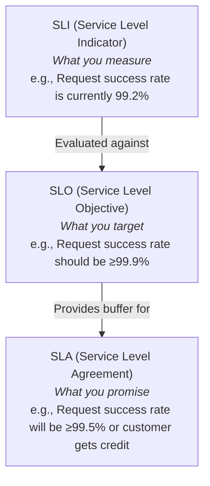
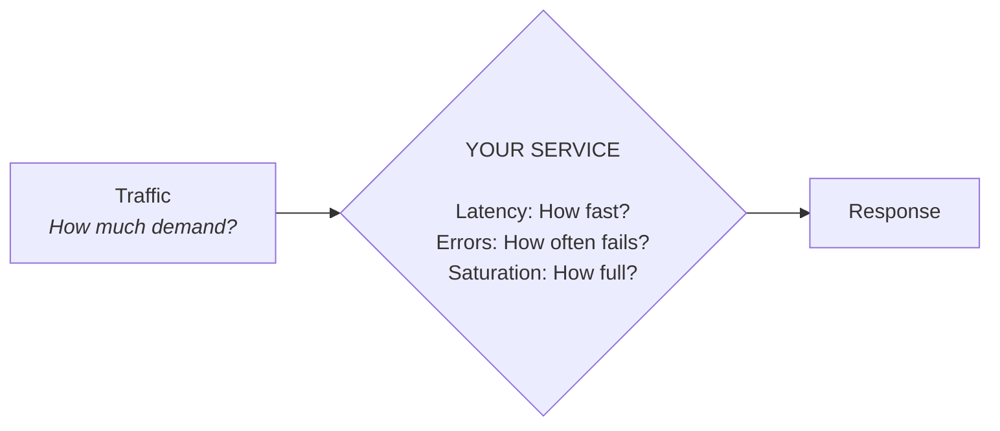
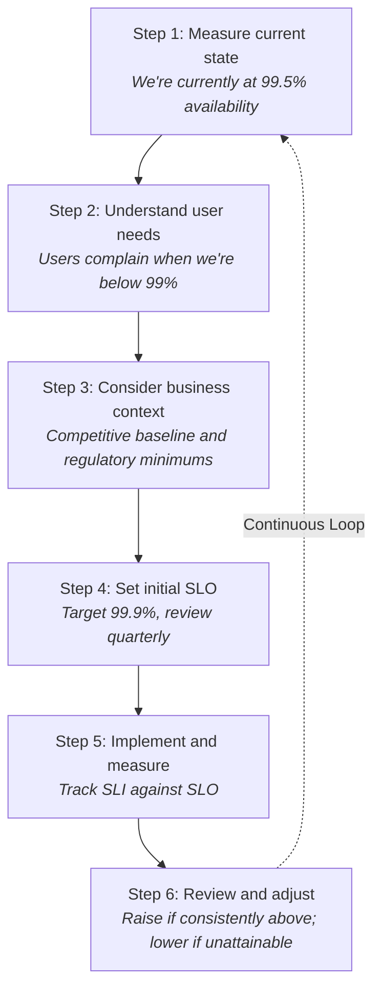
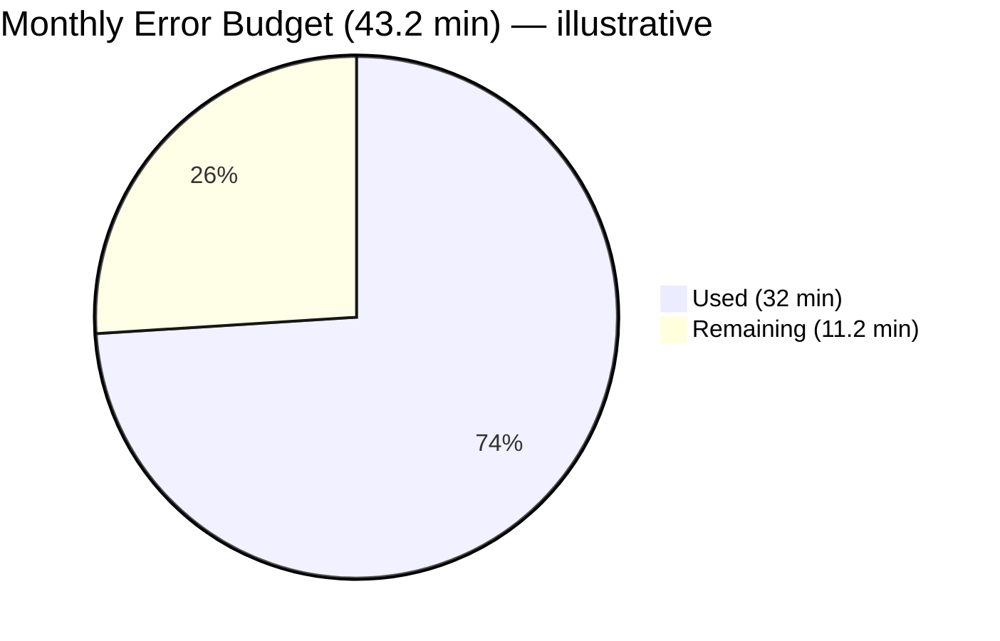
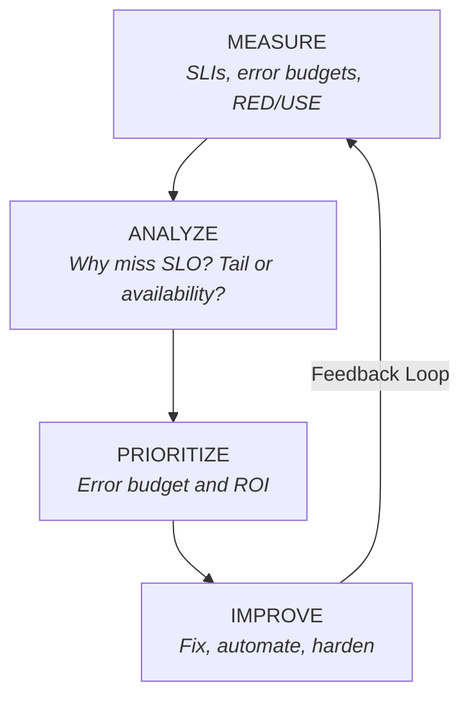

> **Complexity**: `[MEDIUM]`
>
> **Time to Complete**: 40-45 minutes
>
> **Prerequisites**: [Module 2.3: Redundancy and Fault Tolerance](../module-2.3-redundancy-and-fault-tolerance/)
>
> **Track**: Foundations

## What You'll Be Able to Do

By the end of this module, you will be able to implement reliability measurement frameworks, analyze incident and latency data for leverage, design continuous improvement loops with error-budget policy, and evaluate whether reliability investments justify their cost—the four measurable capabilities summarized below map directly to the quiz and hands-on exercise.

1. **Implement** reliability measurement frameworks using MTTR, MTBF, availability percentages, SLIs, and the four golden signals tied to user-facing impact
2. **Analyze** incident data and percentile latency distributions to identify the highest-leverage reliability improvements for a given service
3. **Design** a continuous reliability improvement process—including blameless postmortems and error-budget policies—that balances feature velocity with system stability
4. **Evaluate** whether a reliability investment such as chaos engineering, redundancy, or automated remediation is justified by its risk-reduction return

---

## Why This Module Matters

Reliability engineering without measurement is indistinguishable from hope. Teams that cannot say, in numbers tied to user experience, whether a service is healthy today will argue about priorities from gut feeling every sprint. Product wants velocity; platform wants stability; leadership wants both; and without shared indicators the loudest voice wins rather than the best trade-off. The Foundations track already covers a canonical deployment-failure cautionary tale in [Infrastructure as Code](../../../prerequisites/modern-devops/module-1.1-infrastructure-as-code/), where an organization had no framework to measure drift between intended and actual behavior until financial damage made the gap undeniable. That incident is not retold here; the lesson *for this module* is narrower and more durable than any single outage. Measurement would not have prevented every mistake, but it would have given engineers a language to halt risky change before user-visible harm compounded.

We cannot improve what we cannot measure, yet "make it more reliable" remains one of the most common—and least actionable—requests in platform engineering. This module teaches you to translate abstract reliability goals into strict, reviewable frameworks: MTTR and MTBF for recovery economics, SLIs and SLOs for user-centric targets, error budgets for prioritization, and improvement loops that turn incidents into durable capability rather than recurring fire drills. You will learn not only what to chart on a dashboard, but how to choose indicators that survive contact with real users, how to read latency percentiles without fooling yourself, and how to decide when chaos experiments or automation spend more error budget than they save in risk.

> **The Thermometer Analogy**
>
> A fever thermometer does not cure illness—it tells you whether intervention is urgent and whether treatment is working. SLIs and SLOs are thermometers for distributed systems. They do not replace good architecture or redundancy, but they prevent you from debating whether the patient is "probably fine" while latency histograms tell a different story. Teams that skip measurement often discover problems only when customers, regulators, or finance teams discover them first. Pause here and ask yourself: if internal CPU graphs look healthy but checkout latency at the ninety-ninth percentile has doubled, is the service reliable for the person staring at a loading spinner, or only for the monitoring agent that never checks out?

---

## Part 1: The Mathematics of Reliability (MTTR and MTBF)

Before you can set objectives, burn error budgets, or argue credibly in a prioritization meeting, you need shared vocabulary for how systems fail and recover. Mean Time Between Failures (MTBF) and Mean Time To Recovery (MTTR) are the traditional backbone of availability math. They predate Kubernetes, microservices, and cloud-native observability, yet they still explain why a team might rationally accept more frequent small failures if each failure is invisible to users because recovery is automatic. Treat these metrics as levers in an equation, not as vanity numbers on an executive slide.

### Understanding MTBF and Its Limits

**MTBF (Mean Time Between Failures)** is the average uninterrupted time a system runs before a failure event. In classical hardware reliability engineering, you estimate it by dividing total operational time by the count of failures in that window. If a fleet runs for one thousand hours and records four independent failures, MTBF is two hundred fifty hours on average between events. Higher MTBF generally reflects better design, testing, and component quality—up to a point. In distributed software, pushing MTBF toward infinity is neither achievable nor economical: disks fail, networks partition, certificates expire, and dependencies you do not control will misbehave on their own schedule.

Modern platform teams therefore use MTBF diagnostically rather than as a sole success metric. A dropping MTBF after a refactor tells you change introduced fragility even if users have not complained yet. A flat MTBF with rising latency may mean failures are morphing from "down" to "slow," which binary uptime counters miss entirely. When someone proposes "we need higher MTBF," ask what failure modes are included in the count and whether users would agree those events mattered. A nightly batch retry that users never see is a different class of problem than a checkout outage during peak traffic, even if both increment the same failure counter on a legacy dashboard.

### Understanding MTTR and the Incident Lifecycle

Because failures are inevitable, mature organizations optimize **MTTR (Mean Time To Recovery)**—the average time from failure onset until the service meets its requirements again for users. MTTR is not a single timer; it is the sum of human and automated phases that each deserve separate measurement because each responds to different investments. Splitting MTTR this way is how you avoid the trap of buying another monitoring tool when the real bottleneck is on-call acknowledgment or rollback automation.

**MTTI (Mean Time To Identify)** spans from failure start until monitoring detects a problem worth acting on. Polling intervals, stale dashboards, and alerts routed to unowned inboxes inflate MTTI even when the underlying defect is trivial. **MTTA (Mean Time To Acknowledge)** covers alert firing until a responder begins work; paging fatigue and unclear escalation paths show up here. **MTTD (Mean Time To Diagnose)** is investigation time—reading traces, comparing deploys, reproducing symptoms. **MTTRepair (Mean Time To Repair)** is change application: rollback, scale-out, feature flag flip, or config push. **MTTV (Mean Time To Verify)** confirms users are actually healthy again, not merely that a process restarted. A pod can be Running while readiness probes still fail and traffic still errors; verification must be user-aligned.

Reducing MTTR is often cheaper than chasing impossible MTBF in cloud-native environments. Kubernetes controllers restart failed containers; load balancers drain bad backends; GitOps pipelines revert known-good commits. Each mechanism drives MTTRepair toward seconds or minutes if you invest in runbooks, safe deploy patterns, and observability that points to likely causes instead of dumping raw logs. Module 2.3 covered redundancy; this module connects redundancy to measurement—you only know failover worked if SLIs recover within SLO after the failure injection.

### Calculating Theoretical Availability

Availability expresses the fraction of time a system meets requirements. A common theoretical relationship ties MTBF and MTTR together in the formula **Availability = MTBF / (MTBF + MTTR)**—the same identity you will see in hardware reliability textbooks and SRE primers when teams first model uptime before adopting request-level SLIs. Suppose MTBF is one hundred hours and MTTR is one hour. Availability is `100 / 101 ≈ 99.009%`. You can raise availability by increasing MTBF (fail less often) or decreasing MTTR (recover faster). In practice, distributed teams frequently choose the second lever because software change velocity guarantees new failure modes; fast detection and rollback contain blast radius while learning continues.

The formula is a model, not a substitute for SLIs. It assumes failures are independent and that "up" is binary. Real services degrade: caches warm slowly, queues backlog, and partial outages leave some users unaffected while others fail entirely. That is why Google’s SRE framework pairs availability math with SLIs measured at the request level—success rate, latency thresholds, and freshness—rather than ping checks alone. Still, the MTBF/MTTR identity helps explain executive intuition: halving MTTR has the same availability effect as doubling MTBF in this simplified model, but halving MTTR often costs less than eliminating half of your failure modes in a complex dependency graph.

### Operationalizing MTTR and MTBF in Review Cadences

Executive dashboards that show only a single MTTR number hide where investment should flow. Mature teams publish a decomposed incident timeline after every significant event and track rolling thirty-day averages for MTTI, MTTA, MTTD, MTTRepair, and MTTV separately. When MTTI dominates, the improvement theme is detection—SLO-based alerts, synthetic probes, and tracing that surfaces dependency latency before error rates spike. When MTTD dominates, the theme is diagnosability—structured logs, deploy markers on charts, and runbooks that start from symptoms rather than from a blank shell. When MTTRepair dominates, the theme is safe change—feature flags, progressive delivery, and automated rollback tied to SLI regression during canaries.

MTBF belongs in the same review rhythm but with different questions. Ask whether repeated failures share a root cause class—configuration drift, dependency timeout, or resource exhaustion—and whether each event should increment MTBF at all for user-facing reporting. A self-healing restart that users never notice might remain an internal metric while SLI error budget tracks user pain. Connecting Module 2.3 redundancy patterns to these metrics closes the loop: failover that doubles traffic on a warm standby should show up as bounded MTTR in game-day records, not as a surprise during the first real regional failure.

---

## Part 2: Evaluating Risk-Reduction Returns

When error budgets deplete or incidents repeat, you must invest in reliability—but not every investment deserves the next sprint slot. Platform engineers need a structured way to compare options: active-active replication, better alerting, chaos experiments, or automated remediation. Annualized Loss Expectancy (ALE) from risk management provides a lightweight scaffold. It will not capture every cultural benefit, yet it forces explicit assumptions instead of "we should probably add redundancy because it feels safer."

### The Return on Investment of Reliability

**Step 1: Estimate ALE before the control.** Identify a plausible failure scenario, estimate its annual probability, and multiply by impact if it occurs. Example: a database outage might have a thirty percent chance in a given year based on historical incidents; if it happens, lost revenue, engineering time, and contractual penalties total roughly one hundred thousand dollars. ALE before is `0.30 × $100,000 = $30,000`.

**Step 2: Estimate ALE after the proposed control.** If automated failover and rehearsed runbooks reduce extended outage probability to five percent with the same impact, ALE after is `0.05 × $100,000 = $5,000`.

**Step 3: Compute risk reduction.** Subtract ALE after from ALE before—for example, `$30,000 − $5,000 = $25,000` expected annual benefit from avoided loss when extended database outages become rare.

**Step 4: Compare to implementation cost.** If the control costs fifteen thousand dollars in engineering time and infrastructure in the first year, net benefit is ten thousand dollars and simple ROI is positive. If it costs sixty thousand dollars to save twenty-five thousand dollars, the business case fails even though the architecture diagram looks more impressive.

ALE math is sensitive to bad inputs. Teams routinely underestimate tail risks or double-count benefits already covered by existing controls. Use ranges, document assumptions, and revisit after postmortems. The goal is not faux precision—it is preventing six-month multi-region projects when a two-week runbook improvement addresses eighty percent of historical downtime. Error budgets help here too: if a failure mode never consumes meaningful budget, ROI for exotic mitigation may be lower than paying down the incident that burned thirty percent of the month in one afternoon.

### When ROI Framing Is Not Enough

Some reliability investments fail ROI spreadsheets yet remain mandatory—regulatory retention, audit trails, or contractual audit rights. Label those separately as compliance spend rather than pretending they will reduce outage minutes. Other investments win on option value: faster deploy pipelines may not prevent the next outage but shorten MTTR enough that error budget consumption drops across every future incident. Capture that effect by comparing MTTR distributions before and after the change rather than modeling a single catastrophic scenario. Finally, remember that human costs—on-call burnout, attrition after repeated pages—rarely appear in ALE worksheets but show up in hiring and velocity metrics quarters later. The best teams pair ALE sketches with qualitative postmortem themes so finance sees numbers and engineering sees narrative.

---

## Part 3: The SLI, SLO, and SLA Framework

Traditional uptime metrics treat failure as binary. Distributed systems usually degrade first: latency stretches, error rates rise for one shard, or asynchronous pipelines fall behind while synchronous APIs still return 200 OK. Google’s Site Reliability Engineering practice formalized **SLIs**, **SLOs**, and **SLAs** to measure reliability in terms of user-visible behavior rather than component heartbeats. The [Google SRE Book chapter on monitoring distributed systems](https://sre.google/sre-book/monitoring-distributed-systems/) introduces the four golden signals—latency, traffic, errors, and saturation—as the minimal set for most services.

### Definitions

| Term | What It Is | Who Cares | Example |
|------|------------|-----------|---------|
| **SLI** (Service Level Indicator) | Measurement of service behavior | Engineers | 99.2% of requests succeed |
| **SLO** (Service Level Objective) | Target for an SLI | Engineering + Product | 99.9% of requests should succeed |
| **SLA** (Service Level Agreement) | Contract with consequences | Business + Customers | 99.5% uptime or credit issued |


```mermaid
flowchart TD
    SLI["SLI (Service Level Indicator)<br/><i>What you measure</i><br/>e.g., Request success rate is currently 99.2%"]
    SLO["SLO (Service Level Objective)<br/><i>What you target</i><br/>e.g., Request success rate should be ≥99.9%"]
    SLA["SLA (Service Level Agreement)<br/><i>What you promise</i><br/>e.g., Request success rate will be ≥99.5% or customer gets credit"]

    SLI -->|Evaluated against| SLO
    SLO -->|Provides buffer for| SLA
```

An **SLI** is a quantitative measure of some aspect of service level. Good SLIs are ratios over a window: successful requests divided by valid requests, or requests faster than a threshold divided by total requests. An **SLO** is a target range for an SLI—your internal bar for "good enough for users this month." An **SLA** is an external promise, often with financial remedies; it should be looser than the SLO so normal variance triggers internal improvement before contractual breach. The [SRE Workbook guidance on implementing SLOs](https://sre.google/workbook/implementing-slos/) stresses picking a small set of indicators that correlate with user happiness rather than exporting every chart from Prometheus.

### Why This Matters for Prioritization

Without SLOs, reliability debates devolve into politics. Product insists the feature must ship; engineering insists the system is fragile; neither side shares definitions of "fragile." With SLOs, the question becomes empirical: what is our SLI against target, how much error budget remains, and what policy applies at this budget level? That shift does not eliminate disagreement, but it moves disagreement from vibes to negotiated rules agreed before the incident.

Consider a team planning a large schema migration before a seasonal traffic peak. **Without SLOs**, product says ship, engineering says wait, and escalation reaches executives who lack shared data—so the decision follows hierarchy, not impact. **With SLOs**, current availability SLI might read 99.99% against a 99.9% target with roughly four of the forty-three monthly budget minutes consumed; policy allows normal velocity with canaries and rollback ready. If the SLI were 99.85% instead, the same written policy might mandate reliability work first without anyone debating abstract "risk," because the numbers already triggered the agreed response.

### SLOs Enable Trade-offs

SLOs encode the product decision that one hundred percent reliability is not the goal—appropriate reliability for the business is. That sounds heretical until you notice every successful product ships imperfect code under deadline pressure. Error budgets make the trade explicit: perfection is infinite cost; the budget is the finite resource you spend on change. The [Google Cloud Architecture Framework reliability section](https://cloud.google.com/architecture/framework/reliability) similarly ties measurable targets to design choices rather than aspirational uptime slogans. When executives ask for "five nines everywhere," respond with the minutes-per-year table and the engineering cost curve—then negotiate which user journeys truly require expensive tails versus which tolerate graceful degradation documented in a lower SLO.

---

## Part 4: Choosing Good SLIs and the Four Golden Signals

If your indicator measures the wrong thing, dashboards become theatre. A green CPU graph while checkout latency spikes is worse than no graph—it provides false confidence. SLI selection is therefore a product and engineering joint task: define the user journey, identify where pain appears, and measure as close to that pain as feasible.

### The Four Golden Signals

Google recommends four signals for most user-serving systems because together they explain most user-visible failure modes without requiring dozens of bespoke charts per microservice; the table below maps each signal to a typical SLI shape you might adopt during your first SLO workshop.

| Signal | What It Measures | Example SLI |
|--------|------------------|-------------|
| **Latency** | How long requests take | p99 latency below 200 ms |
| **Traffic** | Demand volume | Requests per second |
| **Errors** | Rate of failed requests | Error rate below 0.1% |
| **Saturation** | Resource headroom | Queue depth or CPU throttling |


```mermaid
flowchart LR
    Traffic["Traffic<br><i>How much demand?</i>"] --> Service{"YOUR SERVICE<br><br>Latency: How fast?<br>Errors: How often fails?<br>Saturation: How full?"}
    Service --> Response["Response"]
```

**Latency** must distinguish success latency from error latency; failed requests that return quickly can hide user pain if you only average successful paths. **Traffic** provides context—a latency spike at normal traffic suggests regression; at ten times traffic it may indicate capacity planning work. **Errors** should use consistent definitions (HTTP 5xx, gRPC Unavailable, failed batch commits) and exclude client-caused 4xx unless your product treats them as service failures. **Saturation** warns before hard failure: disk almost full, connection pools exhausted, or scheduler backlog growing. Saturation is often the golden signal teams neglect until it is too late.

Collect SLIs at the edge where users enter your system—ingress controller, API gateway, or service mesh sidecar—so internal microservice hops do not dilute perception. In Kubernetes clusters, Prometheus ServiceMonitors on ingress metrics or OpenTelemetry HTTP semantic conventions give portable definitions across services.

### SLI Categories Beyond Request/Response

Not every system is a synchronous API, and forcing request latency SLOs onto batch analytics or storage durability problems produces green dashboards while users wait hours for stale data. Match SLI category to the user promise your service actually makes, using the category table below as a starting checklist rather than a mandate to measure everything at once.

| Category | Measures | Good For |
|----------|----------|----------|
| **Availability** | Is the service usable? | APIs, web apps |
| **Latency** | Is it fast enough? | Interactive workloads |
| **Throughput** | Can it keep up with load? | Pipelines, streaming |
| **Correctness** | Is output right? | Billing, ML inference |
| **Freshness** | Is data current? | Dashboards, search indexes |
| **Durability** | Is data safe? | Storage, ledger systems |

A data warehouse might prioritize freshness ("95% of partitions updated within six hours") over millisecond latency. A payment API might prioritize correctness and availability over raw throughput. Using the wrong category produces SLOs that teams meet while users churn.

### Good SLI Characteristics

| Characteristic | Why It Matters | Example |
|----------------|----------------|---------|
| **Measurable** | Data exists at agreed boundary | LB access logs |
| **User-centric** | Reflects experience | Edge latency, not DB CPU |
| **Actionable** | Your team can respond | Avoid pure external dependency SLIs unless paired with mitigations |
| **Proportional** | Worse value means worse UX | p99 latency, not mean alone |

**BAD:** "Database CPU below seventy-five percent"—users do not experience CPU; high CPU may coincide with excellent cache performance.

**GOOD:** "Ninety-nine percent of search queries return in under two hundred milliseconds measured at the gateway"—directly tied to perceived speed.

When SLIs disagree with support tickets, trust tickets and fix the SLI. That mismatch is valuable signal that your measurement program needs revision, not that users are wrong.

### Mapping Golden Signals to On-Call Response

Operational teams benefit from a simple runbook matrix that ties each golden signal to first actions, because during an incident nobody should invent taxonomy from scratch. **Traffic spikes** without latency or error regression often mean marketing success or a bot swarm—confirm legitimacy, scale if needed, but do not roll back a healthy deploy. **Latency spikes** with flat errors suggest saturation or dependency slowdown—check USE metrics on databases, inspect downstream p99, enable temporary rate limits if necessary. **Error spikes** with moderate latency may indicate a bad release or poison payload—compare deploy time, roll back or flip flags, and narrow blast radius. **Saturation climbing** while latency is still acceptable is a leading indicator—add capacity or shed load before errors appear. Document this matrix beside your SLO page so new on-call engineers inherit judgment instead of rediscovering it under pressure.

---

## Part 5: Percentiles, USE, and RED—Three Lenses on the Same System

Aggregates lie politely. An average latency of fifty milliseconds can coexist with a fraction of users waiting multiple seconds—a pattern that destroys trust for the unlucky percentile bucket even while mean dashboards look fine. Gil Tene’s work on latency measurement emphasizes that mean and simple averages are **mathematically unstable** for skewed distributions common in networked systems; what you need are percentiles or histograms that preserve tail behavior. His [InfoQ presentation on latency pitfalls](https://www.infoq.com/presentations/latency-pitfalls/) walks through why ranking requests by average duration mis-ranks systems under load.

### Why Percentiles Beat Averages for SLOs

**p50 (median)** tells you typical experience. **p95** and **p99** describe tail behavior where users complain and SLAs break. SLOs such as "p99 latency under three hundred milliseconds" align incentives with outliers, not only with the median happy path. Prometheus histograms and OpenTelemetry exponential histograms exist precisely because storing every request duration is expensive but tails matter; see [Prometheus histogram practices](https://prometheus.io/docs/practices/histograms/) for how bucket design affects accuracy.

When comparing canary deploys, never rely on mean latency alone. A canary might improve median while regressing p99 because of lock contention on one code path. Always plot heatmaps or percentile lines over time alongside error rates. If your tooling only gives averages, upgrade measurement before upgrading hardware.

### The USE Method (Resources)

Brendan Gregg’s **USE** method applies to infrastructure resources: for each resource, check **Utilization**, **Saturation**, and **Errors**. Utilization is busy time; saturation is queued work waiting for the resource; errors are obvious failure counts. The [USE method reference](https://www.brendangregg.com/usemethod.html) maps cleanly to CPUs, disks, and network interfaces. USE answers "are we running out of machine?" It does not replace user-facing SLIs—it explains *why* golden signals degraded.

### The RED Method (Services)

Tom Wilkie’s **RED** method targets services: **Rate**, **Errors**, and **Duration**. Rate is request throughput; errors are failed requests; duration is latency distribution. The [Weaveworks introduction to RED](https://www.weaveworks.com/blog/2016/08/17/monitoring-microservices-the-red-method/) pairs naturally with microservice meshes where each hop exports similar metrics. RED is essentially a service-level packaging of golden signals without saturation; combine RED at the service boundary with USE on nodes and saturation signals on queues for full picture.

In review meetings, ask three questions: What does RED say about user requests? What does USE say about bottlenecks? What do SLIs say about SLO compliance? When all three align, you have a causal story. When RED is red but USE is green, look for application-level bugs or dependency latency. When USE shows saturation but RED looks fine, you may be nearing cliff edge—scale or shed load before errors appear.

### Histograms, Heatmaps, and SLO Compliance Windows

Percentile SLOs require you to store distribution data, not only averages. Prometheus histogram buckets should align with your SLO threshold—if p99 must stay under three hundred milliseconds, buckets near that boundary need enough resolution that you can detect regression during canaries. OpenTelemetry HTTP metrics follow similar conventions so services exported from different languages remain comparable on one dashboard.

Compliance windows matter as much as thresholds. A rolling thirty-day window forgives a bad deploy week if recovery is fast; a calendar-month window aligns with finance but can create end-of-month panic. Some teams use shorter windows for latency (because tail pain is immediate) and longer windows for availability (because rare outages need statistical context). Document the window beside every SLO so incident reviewers do not argue about whether a breach "counts" after the fact.

When SLI queries disagree between teams, the bug is often in numerator or denominator definitions—whether you include synthetic traffic, health checks, or client-cancelled requests. Standardize those definitions in the SLO document and version them when behavior changes. Ambiguous SLI math destroys trust faster than a missed target with clear measurement.

---

## Part 6: Setting SLOs

Setting an SLO is choosing a target that is achievable, meaningful, and politically owned by product—not a number copied from a competitor’s marketing page.

### SLO Principles

**Start from user expectations, not theoretical max uptime.** If checkout must feel instant, derive latency and availability targets from journey timeouts and abandonment research, not from "we think we can hit four nines."

**Not every service deserves the same SLO.** Payment paths warrant stricter targets than internal reporting batch jobs. Over-investing in low-value services steals budget from high-value ones.

**SLOs should be challenging but reachable.** Too loose and users suffer while dashboards stay green; too tight and teams ignore the SLO as noise or burn out chasing impossible perfection.

| Service | SLO | Rationale |
|---------|-----|-----------|
| Payment processing | 99.99% availability | Financial and trust impact |
| Product search | 99.9% | Important; graceful degradation possible |
| Recommendations | 99.0% | Optional surface |
| Internal reporting | 95.0% | Async, business-hours use |

### The SLO Setting Process


```mermaid
flowchart TD
    1["Step 1: Measure current state<br><i>We're currently at 99.5% availability</i>"] --> 2["Step 2: Understand user needs<br><i>Users complain when we're below 99%</i>"]
    2 --> 3["Step 3: Consider business context<br><i>Competitive baseline and regulatory minimums</i>"]
    3 --> 4["Step 4: Set initial SLO<br><i>Target 99.9%, review quarterly</i>"]
    4 --> 5["Step 5: Implement and measure<br><i>Track SLI against SLO</i>"]
    5 --> 6["Step 6: Review and adjust<br><i>Raise if consistently above; lower if unattainable</i>"]
    6 -.->|Continuous Loop| 1
```

Document SLOs where on-call engineers and product managers can find them. Include measurement definitions, windows (rolling thirty days versus calendar month), and error budget policies. Ambiguity in measurement method causes more production conflict than ambiguity in target percentage.

### Aligning Product and Engineering Through Shared Dashboards

SLO dashboards should be boring and shared—boring because drama means missing data, shared because both product and engineering must see the same error budget bar drain in real time during an incident. Product managers do not need to become PromQL experts, but they should understand whether this week’s launch consumed five or fifty percent of monthly budget. Engineering leads should translate budget policy into sprint planning language: orange budget means reliability epics jump the queue; green budget means experiments and tech debt get airtime again.

Review meetings work best on a fixed cadence—weekly burn check, monthly target review, quarterly SLO reset—with the same three questions every time: which SLI regressed, which user journeys map to that SLI, and which postmortem actions are still open from the last regression. Skipping reviews turns SLOs into static wiki pages; holding them without action tracking turns them into ritual. The continuous improvement loop only closes when measurement, decision, and verification happen in the same room with owners assigned.

### SLO Document Template

```markdown
# Service: Payment API

## SLIs

| SLI | Definition | Measurement |
|-----|------------|-------------|
| Availability | Successful responses / valid requests | HTTP 2xx/3xx vs 5xx at gateway |
| Latency | Request duration at p99 | Histogram at load balancer |
| Correctness | Valid payment responses | Reconciliation job |

## SLOs

| SLI | SLO Target | Error Budget (30-day month) |
|-----|------------|-------------------------------|
| Availability | ≥99.95% | ~21.6 minutes |
| Latency | ≥99.95% of requests ≤500 ms | 0.05% of requests |

## Error Budget Policy

- Budget above fifty percent: normal velocity
- Budget twenty-five to fifty percent: cautious releases
- Budget below twenty-five percent: reliability focus
- Budget depleted: halt risky change until recovery
```

The [SRE Workbook alerting on SLOs chapter](https://sre.google/workbook/alerting-on-slos/) connects these documents to paging discipline—alert on budget burn rate, not on every threshold twitch.

---

## Part 7: Error Budgets in Practice

An error budget is the complement of an SLO: if you promise 99.9% success over a window, you explicitly tolerate 0.1% failure in that same window. For a **99.9% availability SLO over thirty days**, the **allowed failure fraction is 0.1%**, and the **minutes in a thirty-day month are 43,200** (thirty days times twenty-four hours times sixty minutes), which yields an error budget of **43.2 minutes** of user-visible bad time when you multiply total minutes by the allowed error rate. Weekly pacing uses the same math on 10,080 minutes per week—roughly 10.08 minutes at 99.9%—so teams can detect mid-month burnout before the calendar month ends.

Define whether budget is calendar-based or rolling; each choice changes on-call psychology. Rolling windows smooth seasonal spikes; calendar months align with business reporting. Multi-window burn-rate alerts treat rapid budget consumption differently from slow leakage—a week of budget lost in an hour deserves immediate response, while gradual drift might indicate creeping dependency latency worth scheduling rather than paging.

### Error Budget Policies

Policies only work if leadership enforces them when marketing wants an exception, because the moment executives routinely override a depleted budget for a launch, the entire SLO program becomes theater and engineers stop trusting the numbers they are asked to defend.

| Budget Level | Policy | Actions |
|--------------|--------|---------|
| **>75%** | Green | Normal feature work, controlled experiments |
| **50-75%** | Yellow | Standard releases, heightened monitoring |
| **25-50%** | Orange | Critical fixes only; postmortem for incidents |
| **<25%** | Red | Feature freeze; reliability work prioritized |
| **Depleted** | Emergency | Stop risky change; restore SLI before new scope |


```mermaid
pie title Monthly Error Budget (43.2 min) — illustrative
  "Used (32 min)" : 74
  "Remaining (11.2 min)" : 26
```

Burn-rate alerts multiply impact: consuming a week’s budget in an hour deserves a different response than slow leakage across the month. Multi-window burn alerts are standard in SRE tooling for this reason, and product stakeholders should review the same burn charts as engineers during launch weeks so everyone interprets "how bad the month is" from one shared signal instead of contradictory gut feelings.

---

## Part 8: Continuous Improvement and Chaos as Measurement

Measurement without improvement is reporting. Improvement without measurement is guesswork. High-performing teams close the loop: SLIs expose gap, incidents provide narrative, postmortems produce actions, and verification shows SLI recovery. Treat each incident as a free sample of where your indicators and runbooks actually match reality—missed pages, misleading dashboards, and slow rollbacks all belong in the improvement backlog with the same seriousness as code defects, because undetected gaps in measurement become tomorrow's costly production outage for real users.

### The Reliability Improvement Cycle


```mermaid
flowchart TD
    Measure["MEASURE<br><i>SLIs, error budgets, RED/USE</i>"] --> Analyze["ANALYZE<br><i>Why miss SLO? Tail or availability?</i>"]
    Analyze --> Prioritize["PRIORITIZE<br><i>Error budget and ROI</i>"]
    Prioritize --> Improve["IMPROVE<br><i>Fix, automate, harden</i>"]
    Improve -->|Feedback Loop| Measure
```

Prioritization should combine error budget impact, recurrence, and customer visibility. A rare failure that consumes half the budget beats a frequent minor blip that users ignore—unless the blip signals a growing dependency risk.

### Blameless Postmortems

Significant incidents deserve **blameless postmortems** focused on system factors: missing guardrails, unclear ownership, weak tests, or runbooks that assume heroic manual steps. The [Google SRE Book postmortem culture chapter](https://sre.google/sre-book/postmortem-culture/) describes publishing summaries so other teams learn without repeating. Action items need owners and due dates; otherwise postmortems become ritual documentation that never changes behavior.

**Hypothetical scenario:** A payment API outage lasting twenty-three minutes consumes most of a monthly error budget. Timeline: deploy at T+0, error rate spike by T+3, alert at T+6, rollback start at T+13, verified recovery at T+23. Contributing factors include disabled canary, untested migration path, and missing schema compatibility check. Actions: re-enable progressive delivery, add migration test fixture, document rollback. This composite illustrates the shape of a useful postmortem without claiming a specific public company event.

Richard Cook’s essay [How Complex Systems Fail](https://www.adaptivecapacitylabs.com/HowComplexSystemsFail.pdf) reinforces why blameless analysis matters: failures emerge from normal work in complex systems, not merely from individual negligence.

### Chaos Engineering as Controlled Measurement

Chaos engineering is not random destruction—it is **hypothesis-driven experimentation** in production or production-like environments. You inject a fault (kill a pod, add latency to a dependency, fill a disk) and measure whether SLIs remain within SLO and whether mitigation works as designed. The [Principles of Chaos Engineering](https://principlesofchaos.org/) define prerequisites: steady-state behavior, minimized blast radius, and organizational readiness to abort.

Production chaos experiments can consume error budget, so run them only during green-budget periods with explicit approval and automatic rollback triggers. A failed experiment that breaches SLO without teaching anything is waste; a successful one that proves failover completes under two minutes is evidence for ROI discussions. Continuous fault injection in production was popularized by the broader [chaos engineering](../../disciplines/reliability-security/chaos-engineering/module-1.1-chaos-principles/) movement; your organization may start smaller with game days in staging before touching production traffic.

Treat chaos like any reliability investment: expected learning and risk reduction should justify budget spent. If you already know MTTR is high because runbooks are untested, a targeted game day may beat another redundant cluster nobody fails over to.

### Instrumenting Improvement: From Postmortem Actions to SLI Recovery

Postmortem action items should name an SLI or MTTR phase they expect to improve, plus a verification date. "Add monitoring" is insufficient; "reduce MTTI below two minutes for checkout errors by adding SLO burn alert on p99 latency" is measurable. Quarterly reliability reviews then read like a portfolio: which actions moved tail latency, which reduced repeat incidents, which experiments failed to justify cost. This closes the **continuous reliability improvement process** loop that separates mature platform teams from organizations that write excellent incident documents and then repeat the same outage next quarter because nothing was prioritized against error budget impact.

Game days and chaos experiments belong in the same portfolio review. Record hypothesis, steady-state SLI before injection, observed SLI during fault, recovery time, and lessons. Over time you build an evidence library that supports or rejects expensive architecture bets—far more persuasive than theoretical diagrams alone when finance asks why multi-region spend is necessary.

### Hypothetical scenario: From Blame Culture to Learning Culture

**Hypothetical scenario:** A platform team historically punished whoever touched the last deploy before an outage. Engineers hid mistakes; postmortems were interrogations; repeat incidents persisted. A new leader reframes reviews: "Why did the system allow a destructive migration without dry-run?" The investigation finds staging lacked representative data volume, lock contention was unmonitored, and CI skipped load tests for schema changes. Actions include prod-shadow databases for migration rehearsal, lock alerts, and checklist gates—not a single scapegoat. Over subsequent quarters, repeat root causes drop, action item completion rises, and voluntary near-miss reports increase because reporting is safer than hiding. Reliability improves when learning replaces blame, not when fear suppresses symptoms.

---

## Did You Know?

- **Google publishes SLO guidance and case material** in the SRE Book and Workbook, paralleled by how cloud providers document reliability pillars such as [AWS Well-Architected Reliability](https://docs.aws.amazon.com/wellarchitected/latest/reliability-pillar/welcome.html) and [Azure Well-Architected Reliability](https://learn.microsoft.com/en-us/azure/well-architected/reliability/).
- **Each additional "nine" of availability** requires roughly ten times less allowed downtime per period—a heuristic repeated in SRE literature when discussing cost of extreme availability.
- **SLO thinking predates cloud native** in manufacturing statistical process control; Walter Shewhart’s work at Bell Labs on control charts parallels error budget monitoring.
- **Histogram-based SLIs** in OpenTelemetry and Prometheus enable percentile SLOs aligned with [HTTP semantic conventions](https://opentelemetry.io/docs/specs/semconv/http/http-metrics/) rather than ad hoc averages.

---

## Common Mistakes

| Mistake | Problem | Solution |
|---------|---------|----------|
| Too many SLIs | Alert fatigue, unclear priority | Three to five SLIs per service |
| SLO equals current performance | No buffer for SLA or improvement | Set SLO with headroom |
| Measuring internally only | Misses user pain | Measure at ingress or client |
| Ignoring error budget | SLO becomes wallpaper | Tie policy to budget levels |
| Skipping postmortems | Repeat incidents | Blameless reviews with tracked actions |
| Mean latency only | Hides tail suffering | Use percentiles or histograms |
| Chaos without hypothesis | Burns budget, no learning | Steady-state hypothesis and abort plans |
| ROI ignored | Over-build low-impact controls | Estimate ALE before big projects |

---

## Quiz

1. **Your team owns a video transcoding API. Product asks for an SLI and SLO for processing time. How do you define each, and how does the gap between them drive prioritization?**
   <details>
   <summary>Answer</summary>

   The SLI is the measured processing time distribution— for example, p99 transcoding duration collected from job completion events. The SLO is the target bound, such as p99 under five minutes over a rolling thirty-day window. SLIs describe current reality; SLOs define acceptable service. When measured SLI violates SLO, error budget burns and policy may slow feature work until reliability recovers. Implementing this framework ties MTTR-style recovery metrics and user-facing latency percentiles to explicit prioritization instead of debate.
   </details>

2. **Legal signed an SLA at 99.5% API availability with credits for breach. Engineering proposes an internal SLO of 99.5% as well. What do you recommend and why?**
   <details>
   <summary>Answer</summary>

   Set the internal SLO stricter than the SLA—commonly 99.9% or higher depending on variance—so normal operational wobble triggers internal reliability work before contractual breach. The SLA is the customer promise; the SLO is the engineering guardrail with buffer. Error budget policies attached to the SLO give product and engineering a shared trigger for freezes while the business remains protected from penalty events.
   </details>

3. **After three incidents this month, you must analyze incident data to choose one reliability improvement. Error budget shows latency SLO misses caused eighty percent of budget burn; availability incidents were short. What do you prioritize?**
   <details>
   <summary>Answer</summary>

   Prioritize latency tail improvements because incident analysis shows they dominate error budget consumption. Analyze percentile latency by endpoint, dependency, and deploy window; check saturation with USE metrics and service RED duration spikes. Highest-leverage fixes might include slow query remediation, cache warming, or backoff on a noisy dependency. This is analyze incident data to identify highest-leverage reliability improvements in practice—fix what the budget says hurts users most.
   </details>

4. **An engineer proposes "database CPU below seventy-five percent" as the primary SLI for search. Another proposes "p99 search latency under two hundred milliseconds at the gateway." Which SLI is better and why?**
   <details>
   <summary>Answer</summary>

   Gateway p99 latency is better because it is user-centric, proportional to experience, and measurable where users connect. CPU utilization can be high during efficient caching or low while latency explodes due to network issues. Good SLIs align with golden signals—latency and errors at the boundary—not internal resource metrics alone.
   </details>

5. **Availability SLO is 99.9% for a thirty-day month. You experienced twenty-five minutes of user-visible bad time. Compute total budget, consumed, remaining percentage, and likely policy color.**
   <details>
   <summary>Answer</summary>

   Total budget is forty-three point two minutes (forty-three thousand two hundred minutes times zero point one percent). Consumed is twenty-five minutes. Remaining is eighteen point two minutes, about forty-two percent of budget. That falls in the orange band (twenty-five to fifty percent remaining): slow non-critical releases, mandatory postmortems, reliability focus. MTTR and availability percentages connect directly to this math—faster recovery reduces minutes consumed.
   </details>

6. **Leadership asks whether to fund chaos experiments or a second passive database replica. Error budget is healthy; historical outages stem from untested failover and unknown MTTR. How do you evaluate the investment?**
   <details>
   <summary>Answer</summary>

   Evaluate both with risk-reduction framing: estimate ALE for extended outage before and after each control, plus learning value. If failover is unproven, chaos experiments or game days may yield immediate evidence about MTTR and expose gap before redundancy helps in real failure. A replica without rehearsed failover adds cost without measured recovery improvement. Evaluate whether the reliability investment is justified by risk-reduction return using error budget impact and post-incident data, not by which option sounds more sophisticated.
   </details>

7. **After a destructive migration incident, a VP demands naming the engineer who ran the script. The SRE lead requests a blameless postmortem. Why does blameless analysis improve future reliability?**
   <details>
   <summary>Answer</summary>

   Blameless postmortems surface systemic gaps—missing dry-run, weak CI checks, absent lock monitoring—that punishment hides. When engineers fear discipline, they conceal near misses and slow incident analysis, leaving MTTR high and repeat failure modes intact. A continuous reliability improvement process requires honest signal. Fixing guardrails prevents recurrence regardless of who is on call during the next deploy.
   </details>

8. **Background reporting has a ninety-nine point zero percent SLO but has achieved ninety-nine point nine nine percent for two quarters. Is this success?**
   <details>
   <summary>Answer</summary>

   It suggests over-investment relative to user need unless business requirements changed. Excess reliability spend could shift to features or debt paydown, or the SLO should be raised after product agreement. Continuous improvement includes right-sizing targets, not only raising them. Design the reliability improvement process to match actual requirements rather than maximizing every metric by default.
   </details>

---

## Hands-On Exercise

**Task**: Define SLIs and SLOs for a service, track error budget status, and sketch ROI for one proposed reliability fix. Work through four phases in order—SLI definition, SLO targets, budget calculation from sample data, and a prioritized improvement plan tied to ALE or chaos verification—using either a service you operate or the example User API described in the tables below.

**Part A — Define SLIs (about ten minutes).** Choose a service you operate or use the example User API and complete the SLI table with measurement boundaries at the gateway, not inside a single pod.

| SLI Name | Definition | Measurement Method | Good Threshold |
|----------|------------|-------------------|----------------|
| Availability | Ratio of successful responses | (2xx + 3xx) / valid requests at gateway | ≥99.9% |
| Latency | p99 request duration | Histogram at load balancer | ≤200 ms |
| Saturation | Queue depth or pool wait | Broker or DB pool metrics | Below agreed cap |

**Part B — Set SLOs (about ten minutes).** For each SLI, set a target, monthly error budget, and one-sentence rationale tied to user expectations rather than vanity nines.

| SLI | SLO Target | Error Budget (30-day month) | Rationale |
|-----|------------|-------------------------------|-----------|
| Availability | 99.9% | ~43.2 minutes | Interactive user API |
| Latency | ≥99.9% of requests ≤200 ms | 0.1% of requests | UX threshold |

**Part C — Calculate current status (about ten minutes).** Use the sample data below—five million total requests, 3,500 failed 5xx responses, 6,000 requests over 200 ms, and fifteen user-visible bad minutes—to compute availability SLI, latency compliance, budget consumed, remaining minutes, and policy color.

**Part D — Improvement plan (about ten minutes).** Identify the highest-leverage fix, estimate ALE before and after, and note whether a chaos experiment or automation change would verify MTTR improvement before asking for headcount or infrastructure budget.

**Success Criteria** — you have finished when you can demonstrate all of the following outcomes from your worksheets and calculations:

- [ ] At least three SLIs defined with measurement boundaries
- [ ] SLOs documented with error budgets
- [ ] Current status calculated from sample data
- [ ] Prioritized improvement tied to budget burn
- [ ] ROI or ALE sketch for one proposed control

<details>
<summary>Sample calculations</summary>

Availability: (5,000,000 − 3,500) / 5,000,000 ≈ 99.93%. Latency compliance: (5,000,000 − 6,000) / 5,000,000 ≈ 99.88%, just below the 99.9% latency target — so the latency SLO is breached even though availability is healthy. Availability budget consumed: fifteen of the forty-three-point-two budget minutes ≈ 35% consumed, leaving about 65% (~28 minutes) — Yellow policy zone. Action: investigate the latency tail while availability headroom remains.

</details>

---

## Sources

- [Site Reliability Engineering — Monitoring Distributed Systems (Google SRE Book)](https://sre.google/sre-book/monitoring-distributed-systems/) — Four golden signals, user-centric monitoring, and distributed system health.
- [Site Reliability Workbook — Implementing SLOs](https://sre.google/workbook/implementing-slos/) — Practical SLO implementation, measurement windows, and organizational adoption.
- [Site Reliability Workbook — Alerting on SLOs](https://sre.google/workbook/alerting-on-slos/) — Burn-rate alerting and tying pages to user impact.
- [Site Reliability Engineering — Postmortem Culture](https://sre.google/sre-book/postmortem-culture/) — Blameless review practices and sharing learnings.
- [Principles of Chaos Engineering](https://principlesofchaos.org/) — Hypothesis-driven fault injection and steady-state measurement.
- [The USE Method (Brendan Gregg)](https://www.brendangregg.com/usemethod.html) — Utilization, saturation, and errors for resources.
- [The RED Method — Monitoring Microservices (Weaveworks)](https://www.weaveworks.com/blog/2016/08/17/monitoring-microservices-the-red-method/) — Rate, errors, duration for services.
- [Gil Tene — How NOT to Measure Latency (InfoQ presentation)](https://www.infoq.com/presentations/latency-pitfalls/) — Percentile pitfalls and tail-sensitive measurement.
- [Prometheus — Histograms and Summaries](https://prometheus.io/docs/practices/histograms/) — Bucket design for percentile SLOs.
- [AWS Well-Architected Framework — Reliability Pillar](https://docs.aws.amazon.com/wellarchitected/latest/reliability-pillar/welcome.html) — Cloud reliability design principles and metrics.
- [Azure Well-Architected Framework — Reliability](https://learn.microsoft.com/en-us/azure/well-architected/reliability/) — Reliability guidance for Azure workloads.
- [Google Cloud Architecture Framework — Reliability](https://cloud.google.com/architecture/framework/reliability) — Reliability metrics tied to architecture decisions.
- [How Complex Systems Fail (Richard Cook, PDF)](https://www.adaptivecapacitylabs.com/HowComplexSystemsFail.pdf) — Systemic failure dynamics underpinning blameless learning.
- [OpenTelemetry — HTTP Metrics Semantic Conventions](https://opentelemetry.io/docs/specs/semconv/http/http-metrics/) — Portable HTTP RED-style metric definitions.

---

## Next Module

Ready to connect measurement to the telemetry pipeline and deepen the SLO mental model? The table below routes your next step by interest; most learners continue with Module 2.5 for theory depth, then Observability for how metrics are collected under the hood.

| Your Interest | Next Track |
|---------------|------------|
| Understanding what's happening | [Observability Theory](/platform/foundations/observability-theory/) |
| Operating reliable systems | [SRE Discipline](/platform/disciplines/core-platform/sre/) |
| Building secure systems | [Security Principles](/platform/foundations/security-principles/) |
| Distributed system challenges | [Distributed Systems](/platform/foundations/distributed-systems/) |

Up next: **[Module 2.5: SLIs, SLOs, and Error Budgets — The Theory](../module-2.5-slos-slis-error-budgets/)** for a deeper pass on the SRE mental model, then **[Observability Theory](/platform/foundations/observability-theory/)** for how metrics are collected and interpreted under the hood.
