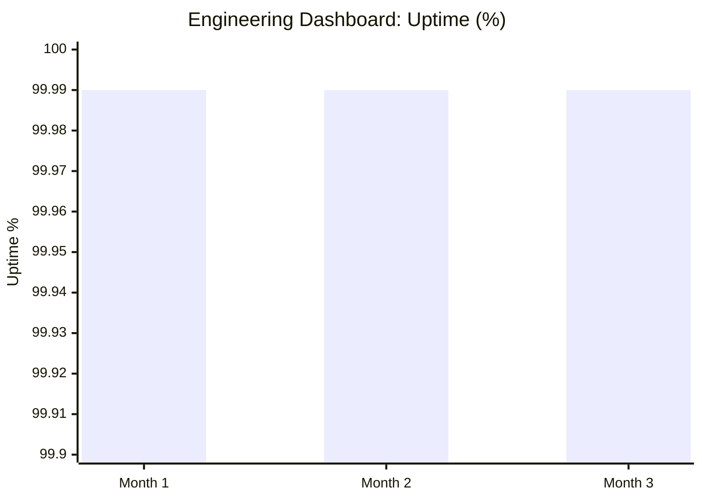
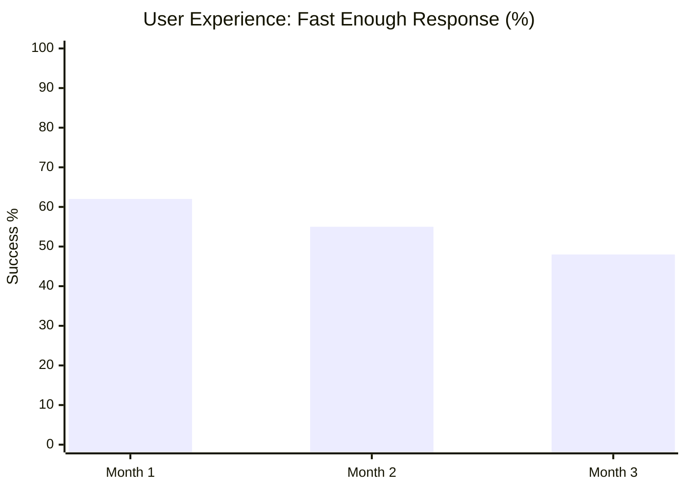
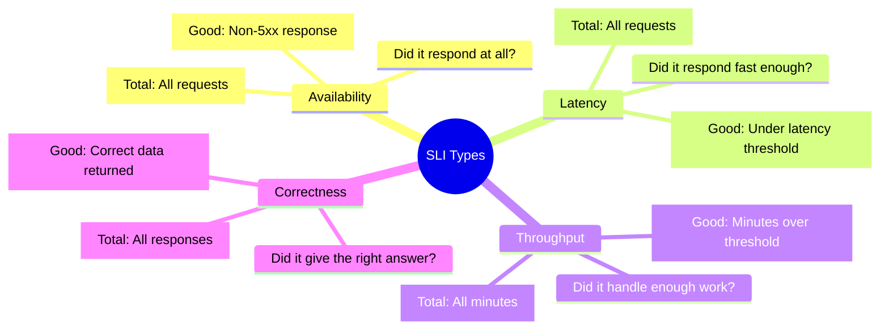
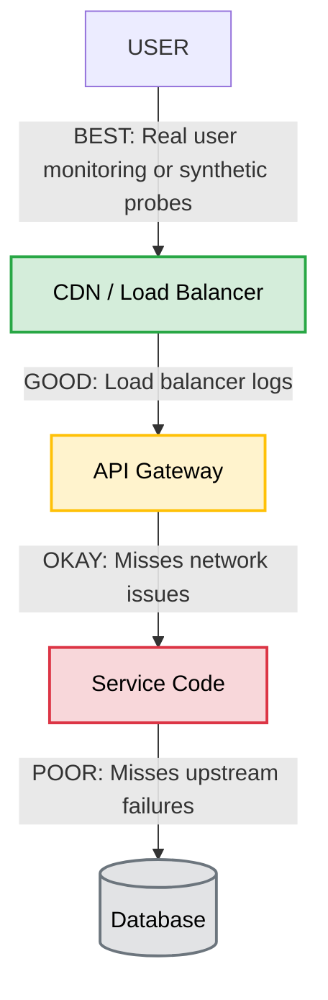
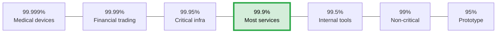
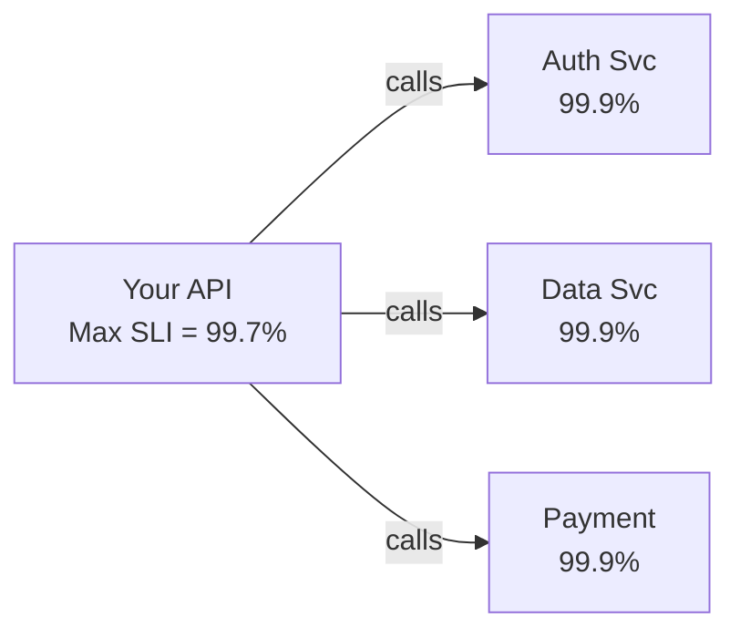
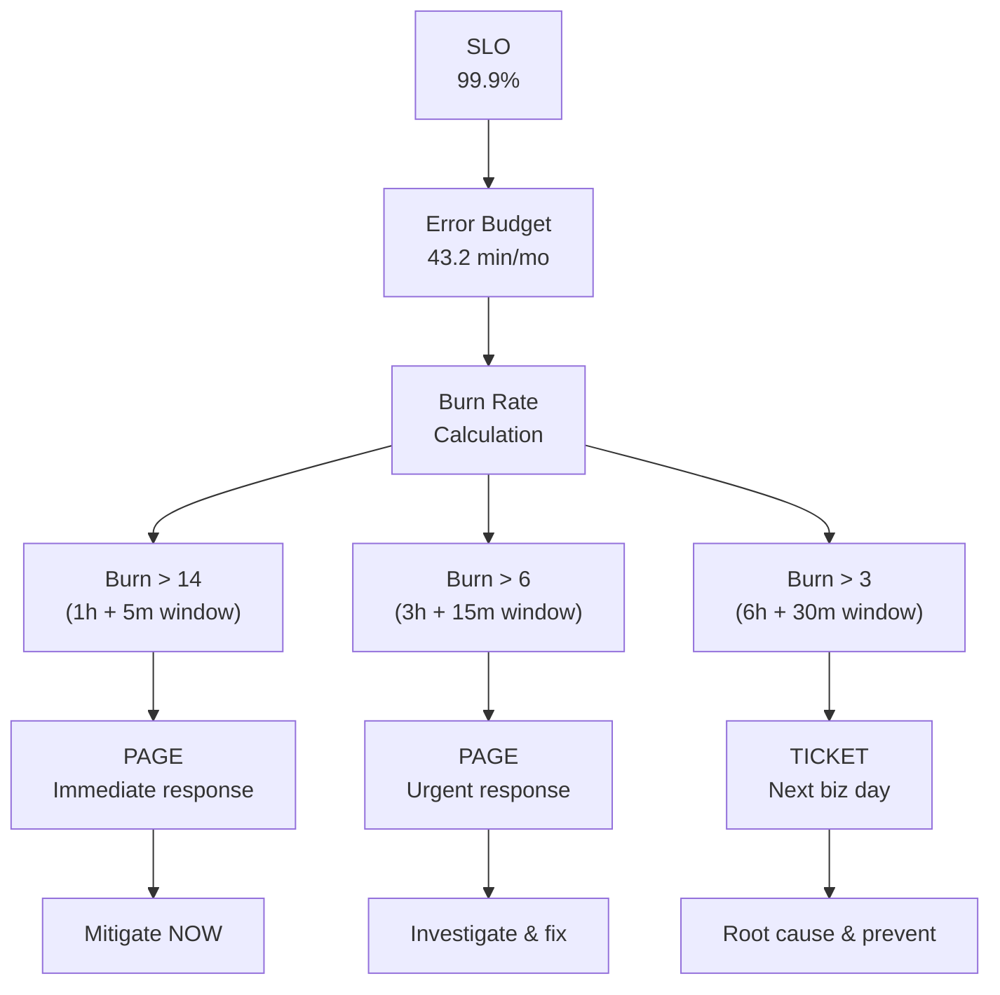
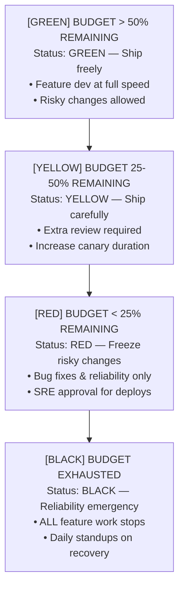

> **Complexity**: `[MEDIUM]` — Core SRE mental model
>
> **Time to Complete**: 40-50 minutes
>
> **Prerequisites**: [Module 2.1: What Is Reliability](../module-2.1-what-is-reliability/), [Module 2.4: Measuring and Improving Reliability](../module-2.4-measuring-and-improving-reliability/)
>
> **Track**: Foundations

### What You'll Be Able to Do

After completing this module, you will be able to:

1. **Design** SLIs that measure what users actually experience rather than what infrastructure dashboards report
2. **Implement** SLOs that translate business requirements into concrete reliability targets with meaningful thresholds
3. **Apply** error budget policies to make data-driven decisions about when to ship features vs. invest in reliability
4. **Evaluate** whether an existing SLO framework correctly aligns engineering incentives with user satisfaction

---

## The Team With 99.99% Uptime and Angry Users

**March 2019. A Series B fintech startup. The weekly leadership sync.**

The VP of Engineering pulls up the infrastructure dashboard with pride. "We hit 99.99% uptime last quarter. Four nines. That's only 4.3 minutes of downtime per month."

The room applauds. Engineering high-fives. The CTO nods approvingly.

Then the Head of Customer Success opens her laptop. "Interesting. Because I have 340 support tickets from last month. All say the same thing: 'Your app is unusable.'"

Silence.

"Here's one from our largest enterprise customer: *'We've been on hold for 20 minutes trying to load our portfolio dashboard. The app never goes down, but it takes 8 seconds to show my balances. I'm moving to a competitor.'*"

The VP of Engineering stammers. "But... we had 99.99% uptime."

"Your servers were up," the Head of Customer Success replies. "But the *experience* was broken. P99 latency was 8.2 seconds last month. Users don't care that the server responded. They care that it responded in *geological time*."

### The Disconnect

**What Engineering Measured (Is the server responding?)**



*Conclusion: "We're crushing it."*

**What Users Experienced (Did I get my answer fast enough?)**



*Conclusion: "This product is broken, and getting worse."*

The problem was not reliability engineering. It was that they were measuring the **wrong thing**. Their SLI (Service Level Indicator) measured availability—"did the server respond?"—when users cared about latency—"did the server respond *fast enough*?"

Once they defined SLOs around latency ("99th percentile response time under 500ms for the portfolio dashboard"), the real picture emerged. They weren't at four nines. They were at barely two nines of *meaningful* reliability.

**The SLO revealed what uptime monitoring hid.** Within two months of focusing on the right SLIs, customer satisfaction scores jumped 34%. Not because they built new features—because they finally measured what mattered.

This is why SLIs, SLOs, and error budgets exist. Not as bureaucratic overhead. As **the lens that shows you reality**.

---

## Why This Module Matters

Every engineering team argues about reliability versus velocity. Developers want to ship. Operators want stability. Product wants both. Without a shared framework, these arguments become political—whoever shouts loudest wins.

SLIs, SLOs, and error budgets replace politics with math. They answer three questions that every team fights about:

1. **"How do we know if we're reliable enough?"** — The SLO answers this.
2. **"What should we measure?"** — The SLI answers this.
3. **"Should we ship or stabilize?"** — The error budget answers this.

This module teaches the **theory** behind these concepts. You will learn what SLIs, SLOs, and error budgets are, why they work, and how to think about them correctly. Later modules cover the operational practices ([Module 1.2: SLO Discipline](/platform/disciplines/core-platform/sre/)), budget management ([Module 1.3: Error Budget Management](/platform/disciplines/core-platform/sre/)), and tooling ([Module 1.10: SLO Tooling — Sloth/Pyrra](/platform/toolkits/observability-intelligence/observability/)).

> **The Restaurant Analogy**
>
> Think of a restaurant. The *SLI* is what you measure: "percentage of meals served within 20 minutes." The *SLO* is your target: "95% of meals within 20 minutes." The *error budget* is how many slow meals you can tolerate before you stop adding new menu items and fix the kitchen.
>
> Without SLOs, the chef keeps adding exotic dishes (features) while wait times creep to 45 minutes. With SLOs, the team knows exactly when to stop expanding the menu and start hiring another line cook.

---

## What You'll Learn

- How to choose SLIs that reflect real user experience
- How to set SLOs that are ambitious but achievable
- How error budgets turn reliability into a spending decision
- How burn rate alerts catch problems before budgets run dry
- How error budget policies align engineering and product
- How to avoid the most common SLO anti-patterns

---

## Part 1: Service Level Indicators (SLIs)

### 1.1 What Is an SLI?

A **Service Level Indicator** is a quantitative measure of some aspect of the level of service being provided. In plain English: it is the number that tells you whether users are happy.

An SLI is always expressed as a ratio:

```text
              Good events
    SLI  =  ─────────────  ×  100%
             Total events
```

**Examples:**
- **Availability SLI:** Successful HTTP responses (non-5xx) / Total HTTP responses × 100%
- **Latency SLI:** Requests completed in < 300ms / Total requests × 100%
- **Correctness SLI:** Responses with correct data / Total responses × 100%
- **Throughput SLI:** Minutes where throughput > 1000 req/s / Total minutes × 100%

The ratio form matters. It lets you express any SLI as a percentage between 0% and 100%, which makes it directly comparable to your SLO target.

### 1.2 The Four Types of SLIs

There are four fundamental categories of SLIs. Most services need at least two.



### 1.3 Choosing the Right SLI

Not all SLIs are equally useful. The best SLI is the one closest to the user's actual experience.

**Good vs. Bad SLIs:**

| Bad SLI | Why It's Bad | Good SLI | Why It's Better |
|---------|-------------|----------|----------------|
| CPU utilization < 80% | Users don't experience CPU | Request success rate > 99.9% | Users experience errors directly |
| Average latency < 100ms | Averages hide tail latency | P99 latency < 500ms | Catches the worst user experiences |
| Server is ping-able | Ping doesn't test functionality | Synthetic transaction succeeds | Tests the actual user journey |
| Zero error logs | Logs miss silent failures | End-to-end probe returns correct data | Catches data corruption, not just crashes |
| Disk usage < 90% | Operational metric, not user metric | Write operations succeed within 50ms | Users experience write failures |
| Pod restart count = 0 | Restarts may be invisible to users | No user-visible request dropped during restart | Measures actual user impact |

**The Golden Rule**: Measure at the boundary closest to the user. If you can measure at the load balancer, do that—not at the application, not at the database. The load balancer sees what the user sees.

> **Stop and think**: If your users are mostly on slow mobile connections, how might measuring latency strictly at your internal API gateway fail to capture their true waiting experience?



### 1.4 Request-Based vs. Window-Based SLIs

SLIs come in two flavors, depending on what you are measuring:

**Request-based SLIs** count individual events:
- "99.9% of HTTP requests return successfully"
- Best for: APIs, web services, microservices
- Denominator: total number of requests

**Window-based SLIs** evaluate time slices:
- "99.9% of 1-minute windows have median query time < 100ms"
- Best for: Batch jobs, pipelines, background processes
- Denominator: total number of time windows

> **Did You Know?**
>
> Google's Ads system reportedly loses approximately **$200,000 per minute** of latency degradation during peak hours. This is why their SLIs focus obsessively on latency percentiles, not just availability. A system that responds with errors is obviously broken. A system that responds correctly but slowly is *invisibly* broken—and the financial damage accumulates silently.

---

## Part 2: Service Level Objectives (SLOs)

### 2.1 What Is an SLO?

A **Service Level Objective** is a target value for an SLI, measured over a time window. It is the line in the sand that separates "reliable enough" from "not reliable enough."

**An SLO has three parts:**
1. **Target:** e.g., 99.9%
2. **SLI:** e.g., of requests will complete successfully within 300ms
3. **Window:** e.g., measured over a rolling 28-day window.

**Complete SLO Examples:**
- **Web frontend:** 99.9% of page loads complete in < 2 seconds (28-day rolling)
- **Payment API:** 99.99% of payment requests return non-5xx (30-day calendar)
- **Data pipeline:** 99.5% of 10-minute windows: all records processed within 15 min of ingestion (28-day rolling)

### 2.2 Setting the Right Target

Setting the SLO target is the hardest part. Too high and you waste engineering resources. Too low and users leave.



**How to find the right target:**

1. **Start with user expectations.** What latency and error rate do users actually notice? Research shows most users tolerate < 1% errors and < 2 seconds for web pages.
2. **Look at your current performance.** If you are at 99.7%, setting an SLO of 99.99% is aspirational, not operational. Set it slightly above current performance to drive improvement.
3. **Consider your dependencies.** Your SLO cannot exceed the reliability of your least reliable critical dependency. If your database delivers 99.95%, your service cannot promise 99.99%.
4. **Factor in cost.** Each additional nine costs roughly 10x more to achieve. Is the marginal improvement worth the investment?

### 2.3 SLO Math: The Dependency Chain

When services depend on each other, reliability multiplies—and multiplying percentages always makes things worse.

> **Pause and predict**: If you set your SLO to 99.999% but rely on a cloud provider with a 99.9% SLA, what will inevitably happen to your error budget?



If ALL dependencies must succeed for your API to succeed:
**Max SLI = 99.9% × 99.9% × 99.9% = 99.7%**

You CANNOT promise 99.9% if your dependencies multiply down to 99.7%. This is why microservices with deep call chains struggle with reliability. Each hop multiplies the failure probability.

**Strategies for beating the multiplication problem:**

| Strategy | How It Helps | Example |
|----------|-------------|---------|
| **Caching** | Removes dependency from critical path | Cache auth tokens locally |
| **Graceful degradation** | Non-critical deps can fail without blocking | Show cached data if recommendation service is down |
| **Async processing** | Decouple from real-time dependency | Queue payments, confirm later |
| **Retries with backoff** | Converts transient failures to successes | Retry failed DB reads 3x |
| **Fallbacks** | Alternative path when primary fails | Use secondary data source |

### 2.4 Rolling vs. Calendar Windows

The measurement window matters more than most people realize.

**Calendar Windows (e.g., "per calendar month")**
- **How it works:** Budget resets at midnight on the 1st of the month.
- **Example:** A major incident on Jan 30 consumes 80% of the budget. On Feb 1, the budget fully resets to 100%.
- **Pros:** Simple to understand, matches business reporting cycles.
- **Cons:** Incentivizes "end of month gaming" (e.g., rushing risky deploys on the 1st).

**Rolling Windows (e.g., "trailing 28 days")**
- **How it works:** Every hour, the window slides forward.
- **Example:** Bad events from exactly 28 days ago "fall off" the back of the window, gradually restoring your budget. There is no sudden reset.
- **Pros:** No gaming, provides steady and consistent operational pressure.
- **Cons:** Harder to communicate to non-technical stakeholders.

**Recommendation:** Use ROLLING windows for operational SLOs (engineers). Use CALENDAR windows for business SLAs (contracts).

> **Did You Know?**
>
> Slack's engineering team publicly shared that a single hour-long outage costs them an estimated **$8.2 million** in lost productivity across their customer base. This calculation—total paying customers times average hourly productivity value—is exactly the kind of math that justifies investing in SLOs. When you can put a dollar figure on every minute of your error budget, reliability conversations get very concrete very fast.

---

## Part 3: Error Budgets — The Revolutionary Concept

### 3.1 What Is an Error Budget?

Here is the idea that changed the industry: **reliability has a budget, and you can spend it.**

An error budget is the maximum amount of unreliability your SLO permits. It is the gap between 100% and your SLO target.

```text
    Error Budget = 100% - SLO
```

If your SLO is 99.9%:
- **Error Budget:** 100% - 99.9% = 0.1%
- **Over 30 days:** 43,200 minutes × 0.001 = **43.2 minutes** allowed downtime
- **Over 1M requests:** 1,000,000 × 0.001 = **1,000 failed requests** allowed

> **Stop and think**: If your service has an SLO of 99.9%, allowing 43.2 minutes of downtime per month, how does a deployment that takes 5 minutes of complete downtime impact your ability to release multiple times a day?

**Common SLO Targets and Budgets (per 30 days):**

| SLO | Error Budget | Time Budget | Request Budget (1M) |
|-----|-------------|-------------|---------------------|
| 99% | 1.0% | 7 hours 12 min | 10,000 |
| 99.5% | 0.5% | 3 hours 36 min | 5,000 |
| 99.9% | 0.1% | 43.2 minutes | 1,000 |
| 99.95% | 0.05% | 21.6 minutes | 500 |
| 99.99% | 0.01% | 4.32 minutes | 100 |
| 99.999% | 0.001% | 26 seconds | 10 |

### 3.2 Why Error Budgets Are Revolutionary

Before error budgets, reliability conversations were political battles. Developers wanted speed. Operations wanted stability. Nobody had a shared framework.

Error budgets change the game by reframing reliability as a **resource to be spent**, not a **virtue to be maximized**.

**The Old World:**
Developer: "I want to ship the new checkout flow."
Ops: "No. Too risky. We had an incident last week."
*Result: Resentment, finger-pointing, politics.*

**The New World:**
Developer: "I want to ship the new checkout flow."
SRE: "Let's check the error budget. We have 28.4 minutes left (66%). Historically this deploy causes 5 min of errors. Ship it."
*Result: Data-driven decision. Shared ownership.*

Here is the profound insight: **when the budget is healthy, the SRE team should be pushing developers to take MORE risk, not less.** Unused error budget is wasted opportunity.

### 3.3 Budget Tracking Over Time

Error budget consumption should be tracked continuously, just like a financial budget.

**SLO: 99.9% | Monthly budget: 43.2 minutes**

- **Day 1-5:** [GREEN] 100% remaining. Smooth sailing.
- **Day 6:** [GREEN] 95% remaining. Deployment caused 2.1 min of errors.
- **Day 10:** [YELLOW] 72% remaining. Database failover caused 12 minutes of errors.
- **Day 15:** [YELLOW] 67% remaining. Midpoint check — healthy.
- **Day 18:** [ORANGE] 48% remaining. Dependency outage caused 8 minutes of cascading errors.
- **Day 22:** [RED] 30% remaining. Bad config push caused 7.7 minutes of errors. Entering WARNING zone.
- **Day 25:** [RED] 28% remaining. Team discussion: freeze risky deploys.
- **Day 30:** [RED] 25% remaining. Month closes. SLO met. Budget resets for next month.

> **Did You Know?**
>
> Google's original SRE book reveals that some teams intentionally **spend their entire error budget** every quarter by running chaos experiments and risky deployments. Their reasoning: if the budget exists to be spent, and you consistently finish the quarter with budget remaining, your SLO might be set too conservatively. An untouched error budget could mean you are over-investing in reliability at the expense of innovation.

---

## Part 4: Burn Rate and Multi-Window Alerting

### 4.1 What Is Burn Rate?

The error budget tells you how much you can spend. The **burn rate** tells you how fast you are spending it.

```text
    Burn Rate = (Observed error rate) / (SLO-allowed error rate)
```

- **Burn Rate 1.0:** Consuming budget at exactly the allowed rate. Budget will hit zero at end of window.
- **Burn Rate 2.0:** Consuming budget 2x faster than allowed. Budget will run out HALFWAY through window.
- **Burn Rate 10.0:** Consuming budget 10x faster. Budget exhausted in 1/10 of window (3 days for a 30-day window).

### 4.2 Multi-Window Alerting

A single burn rate check is not enough. A brief spike could trigger a false alarm. A slow leak could go unnoticed. The solution is **multi-window alerting**: check burn rate over multiple time windows simultaneously.

**Fast Burn Alert: Catches acute incidents**
- **Condition:** Burn rate > 14 over 1 hour AND burn rate > 14 over 5 minutes.
- **Action:** PAGE the on-call engineer. Budget will exhaust in ~2 days.

**Slow Burn Alert: Catches smoldering issues**
- **Condition:** Burn rate > 3 over 6 hours AND burn rate > 3 over 30 minutes.
- **Action:** Create a TICKET. Investigate during business hours.



### 4.3 Why Traditional Alerting Fails

| Problem | Traditional Alert ("error > 1%") | Burn Rate Alert |
|---------|----------------------------------|-----------------|
| **Brief spikes** | Fires alarm, wakes on-call for 30-second blip | Short window clears quickly, no page |
| **Slow degradation** | 0.3% errors never crosses 1% threshold | Burn rate 3.0 detected over 6 hours |
| **Context-free** | "Error rate is high" — so what? | "Budget exhausted in 10 days" — actionable |

---

## Part 5: Error Budget Policies

### 5.1 What Happens When the Budget Runs Out?

An error budget without a policy is just a number on a dashboard. The policy defines the **consequences** of budget status.



### 5.2 Who Owns the Policy?

The error budget policy must be **agreed upon in advance** by all stakeholders. If you negotiate the rules during a crisis, politics wins.

| Stakeholder | Role in Error Budget Policy |
|-------------|---------------------------|
| **Product** | Agrees that feature freezes happen when budget is exhausted |
| **Engineering** | Commits to meeting SLO, accepts velocity constraints |
| **SRE / Platform** | Monitors budget, enforces policy, provides tooling |
| **Leadership** | Sponsors the policy, breaks ties, escalation path |

> **Pause and predict**: If you don't define an error budget policy before an incident occurs, who ends up deciding whether to halt feature development during a crisis?

> **Did You Know?**
>
> According to Gartner research, the average cost of IT downtime across industries is approximately **$5,600 per minute**, or over **$300,000 per hour**. Error budget policies that freeze risky deploys when budget is low directly prevent these costs. A team that spends 3 days on reliability work to avoid a 2-hour outage has saved the business between $600,000 and $2 million.

---

## Part 6: Putting It All Together

### 6.1 SLO Design Checklist for New Services

- [ ] **1. IDENTIFY THE USER JOURNEYS:** What are the critical paths users take? (e.g., "User loads dashboard", "User submits payment")
- [ ] **2. CHOOSE SLIs FOR EACH JOURNEY:** What signals best represent user experience? Measure at the boundary closest to the user.
- [ ] **3. SET INITIAL SLO TARGETS:** Start with current performance minus a small buffer.
- [ ] **4. CALCULATE ERROR BUDGETS:** 100% - SLO = error budget. Convert to minutes AND request counts.
- [ ] **5. DEFINE MEASUREMENT WINDOW:** Rolling 28 days for operational metrics.
- [ ] **6. CONFIGURE BURN RATE ALERTS:** Fast burn (page) and slow burn (ticket).
- [ ] **7. WRITE THE ERROR BUDGET POLICY:** Get sign-off from product, engineering, and leadership.
- [ ] **8. DOCUMENT ASSUMPTIONS:** Expected traffic volume, dependency reliability, cache hit rates.
- [ ] **9. PUBLISH AND COMMUNICATE:** Dashboard visible to all stakeholders, monthly review meetings.
- [ ] **10. SCHEDULE QUARTERLY REVIEW:** Is the SLO too tight? Too loose? Are we measuring the right things?

### 6.2 Real-World SLO Examples

**Web Application (E-commerce Frontend)**

| Component | SLI | SLO Target | Window |
|-----------|-----|-----------|--------|
| Page load | Requests completing in < 2s | 99% | 28-day rolling |
| Page load | Requests returning non-5xx | 99.9% | 28-day rolling |
| Checkout | Checkout completing successfully | 99.95% | 28-day rolling |

**REST API (Payment Service)**

| Component | SLI | SLO Target | Window |
|-----------|-----|-----------|--------|
| All endpoints | Requests returning non-5xx | 99.99% | 30-day calendar |
| All endpoints | Requests completing in < 1s | 99.9% | 30-day calendar |
| POST /charge | Charges completing correctly | 99.999% | 30-day calendar |

### 6.3 Common Anti-Patterns

| Anti-Pattern | Why It Seems Reasonable | The Problem | Better Approach |
|-------------|------------------------|-------------|----------------|
| **99.999% SLO** | "We want to be world-class" | Budget is 26 seconds/month. ONE slow deploy blows it. Team is paralyzed. | Start at 99.9%, tighten only when you consistently exceed it |
| **Availability-only SLI** | "If it's up, it works" | Misses latency, correctness, throughput. The fintech war story above. | At minimum: availability AND latency SLIs |
| **Internal SLO = External SLA** | "Same number, less confusion" | No buffer for surprises. Every SLO miss triggers contract penalties. | Set internal SLO 2-10x stricter than external SLA |
| **SLO without policy** | "The dashboard is enough" | When budget runs out, nobody knows what to do. Politics decides. | Written policy with stakeholder sign-off |
| **Too many SLIs** | "Measure everything!" | Alert fatigue. Nobody knows which SLI matters most. | 1-3 SLIs per user journey. One primary, rest secondary. |
| **Ignoring dependencies** | "Each team manages their own SLO" | Your 99.99% SLO can't survive three 99.9% dependencies multiplied together. | Map dependency chain, set SLOs accordingly |

---

## Quiz

Test your understanding of SLIs, SLOs, and error budgets:

**1. You are the lead engineer for a new inventory service. The business stakeholders have agreed to an SLO of 99.5% availability over a rolling 30-day window. During a deployment on Friday afternoon, the service goes down. How many minutes of downtime does your error budget allow for the entire month, and why is this specific number critical for your deployment strategy?**

<details>
<summary>Answer</summary>

**Calculation:**
- 30 days = 30 x 24 x 60 = 43,200 minutes
- Error budget = 100% - 99.5% = 0.5%
- Budget in minutes = 43,200 x 0.005 = **216 minutes (3 hours 36 minutes)**

**Why this matters:** This specific number is critical because it represents the total allowed downtime for the entire 30-day period, not just a single incident. If your Friday deployment consumes 2 hours of this budget, you only have 1 hour and 36 minutes left for the rest of the month. Knowing this absolute ceiling prevents catastrophic overspending. By knowing your exact budget in minutes, you can make informed, data-driven decisions about whether to risk further deployments or halt feature releases to prioritize stability. This concrete allowance turns an abstract percentage into a practical operational boundary.
</details>

**2. You are reviewing a performance dashboard for a streaming video platform. The lead developer proudly shows that the average latency for video segment requests is 80ms, well under the 100ms target. However, customer support is overwhelmed with complaints about videos endlessly buffering. Why is this average latency SLI hiding the actual problem, and what should you use instead?**

<details>
<summary>Answer</summary>

Averages are a dangerous metric because they completely hide tail latency—the extreme outliers that ruin user experiences. In a system handling millions of requests, an average of 80ms could mean 99% of requests take 40ms, while 1% take over 4 seconds. That 1% represents thousands of users staring at a buffering spinner, which directly causes the support complaints you are seeing. Instead of averages, you should use percentile-based SLIs, such as the 99th percentile (P99). Measuring P99 latency ensures that you are tracking the worst common experiences, giving you a true reflection of what your frustrated users are actually encountering.
</details>

**3. Your new microservice depends on an authentication service, a user profile service, and a payment gateway. Each of these three external dependencies has an historical availability of 99.9%. If all three must succeed for your service to process a request, what is the theoretical maximum availability your service can achieve, and why?**

<details>
<summary>Answer</summary>

**Calculation:**
- Maximum availability = 99.9% x 99.9% x 99.9%
- = 0.999 x 0.999 x 0.999
- = 0.999^3
- = **99.7%**

**Why this happens:** This mathematical reality occurs because the probabilities of independent failures multiply across the dependency chain. Every time you add a synchronous dependency to your critical path, you increase the surface area for failure, effectively lowering the maximum possible reliability of your own service. Even if your service's code is flawlessly bug-free and never crashes, it cannot be more reliable than the combined reliability of the systems it waits on. To break this mathematical ceiling, you must introduce architectural patterns like caching, asynchronous processing, or graceful degradation to remove these dependencies from the direct critical path.
</details>

**4. Your enterprise software company is finalizing a major contract with a Fortune 500 client. To win the deal, the sales director suggests writing your engineering team's internal SLO of 99.95% directly into the customer contract as the legally binding SLA. Why is this a dangerous idea, and how should SLOs and SLAs differ?**

<details>
<summary>Answer</summary>

This is a highly dangerous idea because it completely removes your engineering team's safety margin for operational flexibility. An SLO (Service Level Objective) is an internal target designed to guide engineering decisions, whereas an SLA (Service Level Agreement) is a legally binding contract that triggers financial penalties when breached. If your SLO and SLA are identical, any minor internal breach immediately results in lost revenue, forcing the engineering team to become overly conservative and halt innovation. To protect the business while maintaining engineering velocity, your internal SLO should always be significantly stricter (e.g., 99.95%) than your external SLA (e.g., 99.9%). This approach provides a necessary buffer where you can miss internal goals and focus on reliability without automatically paying out customer credits.
</details>

**5. Your team maintains a critical API with an SLO of 99.9% over 30 days. After a new release, the error rate spikes to 0.5% and stays there. What is your current burn rate, how long until your error budget is completely exhausted, and why is tracking this burn rate more important than just watching the error rate?**

<details>
<summary>Answer</summary>

**Calculation:**
- SLO-allowed error rate = 100% - 99.9% = 0.1%
- Current error rate = 0.5%
- Burn rate = 0.5% / 0.1% = **5.0**
- Time to exhaustion = 30 days / 5.0 = **6 days**

**Why burn rate matters:** Tracking the burn rate is far more actionable than simply monitoring the raw error rate because it contextualizes the failure against your remaining budget and time window. An error rate of 0.5% might sound small and insignificant to a product manager, but a burn rate of 5.0 explicitly warns the team that their entire month's allowance will vanish in less than a week. This rapid depletion requires immediate intervention to stop the bleeding before the budget is completely gone. By translating the error rate into a velocity of budget consumption, the team can accurately prioritize whether an issue requires immediate paging (fast burn) or a standard ticket (slow burn), preventing both alert fatigue and undetected budget exhaustion.
</details>

**6. A highly ambitious startup sets an SLO of 99.999% (five nines) for their new user-facing web application, which handles 10 million requests per month. Within the first two months, the team misses their SLO repeatedly and feature development comes to a complete standstill. Why is setting such a strict SLO harmful, and what operational realities make it so difficult to maintain?**

<details>
<summary>Answer</summary>

Setting a five-nines SLO is harmful for a typical web application because it allows only 26 seconds of total downtime or roughly 100 failed requests per month. This microscopic budget is entirely unforgiving; a single routine deployment, a transient network blip, or a minor DNS timeout will instantly consume the entire allowance. Consequently, the team is forced into a state of operational paralysis where they cannot ship features, experiment, or take necessary engineering risks out of fear of violating the policy. Such aggressive targets stifle innovation and create a culture of fear around releasing code. Furthermore, achieving true five-nines reliability requires massive financial and architectural investments—such as multi-region active-active deployments and zero-downtime database migrations—which are completely disproportionate to the actual expectations of regular web users.
</details>

**7. You are setting up alerting for a high-volume payment gateway. You currently rely on a simple threshold alert that pages the on-call engineer if the error rate exceeds 1% for 5 minutes. Last night, this alert woke you up at 3 AM for a 30-second network blip that resolved itself before you even opened your laptop. How would a multi-window burn rate alert solve this problem, and why is it functionally superior?**

<details>
<summary>Answer</summary>

A multi-window burn rate alert solves this by requiring the elevated error rate to be sustained over both a short window (e.g., 5 minutes) and a longer window (e.g., 1 hour) before triggering a critical page. In the scenario of a 30-second network blip, the short window might temporarily breach its threshold, but the long window's average would remain safely below the limit, preventing the unnecessary 3 AM wake-up call. This approach is functionally superior because it directly ties alerts to the actual consumption of the error budget rather than arbitrary thresholds, allowing the system to ignore harmless, self-healing spikes. It ensures that engineers are only interrupted when there is a genuine threat of exhausting the error budget before the measurement window resets. By only waking engineers when the error budget is genuinely threatened, multi-window alerts drastically reduce alert fatigue and preserve the on-call team's mental health.
</details>

**8. It is day 18 of the month, and your team's error budget has officially dropped to zero after a massive database outage. The Product Manager frantically approaches your desk, demanding that you ship a 'critical' new marketing feature by Friday. According to the standard error budget policy framework, what should happen next, and why is having this policy pre-defined so important?**

<details>
<summary>Answer</summary>

Under a standard error budget policy, exhausting the budget places the service in a 'Black' or 'Red' status, meaning all feature deployments must be frozen and all engineering effort must pivot to reliability work. The Product Manager's request must be denied unless they escalate to executive leadership to formally authorize an explicit override of the policy. Having this policy pre-defined and signed by all stakeholders is absolutely vital because it removes emotion and politics from high-pressure situations. Without a written agreement, these conversations devolve into shouting matches about whose priorities are more important. Instead of forcing the SRE to personally block the Product Manager and spark a conflict, the pre-written contract objectively dictates the outcome, ensuring that the business consistently honors its commitment to reliability.
</details>

---

## Hands-On Exercise: Calculate Error Budgets for a Real Scenario

### Scenario

You are the newly hired SRE for **ShopFast**, an e-commerce platform. The CEO has asked you to define SLOs for three critical services. Here is the current monitoring data from the last 30 days:

```text
SHOPFAST MONITORING DATA (Last 30 Days)

SERVICE 1: Product Catalog API
  Total requests:           50,000,000
  Failed requests (5xx):    25,000
  Requests > 500ms:         750,000
  Requests > 2 seconds:     50,000
  Incidents this month:     2 (total downtime: 45 minutes)

SERVICE 2: Checkout/Payment API
  Total requests:           2,000,000
  Failed requests (5xx):    100
  Requests > 1 second:      40,000
  Requests > 5 seconds:     2,000
  Incidents this month:     1 (total downtime: 12 minutes)

SERVICE 3: Order Processing Pipeline (batch)
  Total orders processed:   500,000
  Orders processed > 5 min: 5,000
  Orders with wrong status: 15
  Pipeline stalls:          3 (total stall time: 90 minutes)
```

### Part 1: Define SLIs (10 minutes)

For each service, define at least two SLIs. Express each as "good events / total events."

```text
YOUR SLI DEFINITIONS

Service 1: Product Catalog API
  SLI 1 (Availability): _____ / _____
  SLI 2 (Latency):      _____ / _____

Service 2: Checkout/Payment API
  SLI 1 (Availability): _____ / _____
  SLI 2 (Latency):      _____ / _____

Service 3: Order Processing Pipeline
  SLI 1 (Freshness):    _____ / _____
  SLI 2 (Correctness):  _____ / _____
```

### Part 2: Calculate Current SLI Values (10 minutes)

Using the monitoring data, calculate the actual value of each SLI.

```text
YOUR CALCULATIONS

Service 1: Product Catalog API
  Availability SLI:  (_________ - _________) / _________ = _______%
  Latency SLI (500ms): (_________ - _________) / _________ = _______%

Service 2: Checkout/Payment API
  Availability SLI:  (_________ - _________) / _________ = _______%
  Latency SLI (1s):  (_________ - _________) / _________ = _______%

Service 3: Order Processing Pipeline
  Freshness SLI (5min): (_________ - _________) / _________ = _______%
  Correctness SLI:      (_________ - _________) / _________ = _______%
```

### Part 3: Set SLOs and Calculate Error Budgets (10 minutes)

Based on current performance and user expectations, propose an SLO for each SLI. Then calculate the error budget.

```text
YOUR SLO PROPOSALS

Service 1: Product Catalog API
  Availability SLO: _______% → Budget: _______ failed requests / month
  Latency SLO:      _______% → Budget: _______ slow requests / month

Service 2: Checkout/Payment API
  Availability SLO: _______% → Budget: _______ failed requests / month
  Latency SLO:      _______% → Budget: _______ slow requests / month

Service 3: Order Processing Pipeline
  Freshness SLO:    _______% → Budget: _______ late orders / month
  Correctness SLO:  _______% → Budget: _______ incorrect orders / month
```

### Part 4: Assess Budget Status (5 minutes)

For each SLO you proposed, is the service currently within budget, in warning, or over budget?

```text
BUDGET STATUS ASSESSMENT

  Service 1 Availability:  [ ] Green  [ ] Yellow  [ ] Red  [ ] Over budget
  Service 1 Latency:       [ ] Green  [ ] Yellow  [ ] Red  [ ] Over budget

  Service 2 Availability:  [ ] Green  [ ] Yellow  [ ] Red  [ ] Over budget
  Service 2 Latency:       [ ] Green  [ ] Yellow  [ ] Red  [ ] Over budget

  Service 3 Freshness:     [ ] Green  [ ] Yellow  [ ] Red  [ ] Over budget
  Service 3 Correctness:   [ ] Green  [ ] Yellow  [ ] Red  [ ] Over budget
```

### Part 5: Write a Recommendation (5 minutes)

Which service needs the most attention? What would you prioritize?

---

<details>
<summary>Check Your Work — Sample Answers</summary>

**Part 1 & 2: SLI Definitions and Current Values**

Service 1: Product Catalog API
- Availability SLI: (50M - 25K) / 50M = **99.95%**
- Latency SLI (< 500ms): (50M - 750K) / 50M = **98.5%**

Service 2: Checkout/Payment API
- Availability SLI: (2M - 100) / 2M = **99.995%**
- Latency SLI (< 1s): (2M - 40K) / 2M = **98.0%**

Service 3: Order Processing Pipeline
- Freshness SLI (< 5 min): (500K - 5K) / 500K = **99.0%**
- Correctness SLI: (500K - 15) / 500K = **99.997%**

**Part 3: Proposed SLOs and Error Budgets**

Service 1: Product Catalog API
- Availability SLO: **99.9%** (current: 99.95% — comfortable margin)
  - Budget: 50M x 0.001 = 50,000 failed requests/month
  - Currently using: 25,000 (50% of budget — GREEN)
- Latency SLO: **98%** (current: 98.5% — tight but achievable)
  - Budget: 50M x 0.02 = 1,000,000 slow requests/month
  - Currently using: 750,000 (75% of budget — YELLOW)

Service 2: Checkout/Payment API
- Availability SLO: **99.99%** (current: 99.995% — justified for payments)
  - Budget: 2M x 0.0001 = 200 failed requests/month
  - Currently using: 100 (50% of budget — GREEN)
- Latency SLO: **97%** (current: 98% — margin to improve)
  - Budget: 2M x 0.03 = 60,000 slow requests/month
  - Currently using: 40,000 (67% of budget — YELLOW)

Service 3: Order Processing Pipeline
- Freshness SLO: **98.5%** (current: 99% — healthy)
  - Budget: 500K x 0.015 = 7,500 late orders/month
  - Currently using: 5,000 (67% of budget — YELLOW)
- Correctness SLO: **99.99%** (current: 99.997% — correctness matters most for orders)
  - Budget: 500K x 0.0001 = 50 incorrect orders/month
  - Currently using: 15 (30% of budget — GREEN)

**Part 5: Recommendation**

**Priority 1: Product Catalog Latency.** At 98.5% with a proposed 98% SLO, this service is skating close to the edge. 750,000 requests per month take over 500ms. This directly impacts user browsing experience and conversion rates. Investigate the slow requests—are they specific product pages? Specific regions? A slow database query?

**Priority 2: Checkout Latency.** 40,000 payment requests taking over 1 second is a conversion killer. Users abandon carts when checkout is slow. This has direct revenue impact.

**Priority 3: Pipeline Freshness.** 5,000 orders taking over 5 minutes to processing is concerning but less urgent since it does not directly affect the real-time user experience. Monitor the trend.

</details>

---

**Success Criteria:**
- [ ] Defined at least 2 SLIs per service in ratio format
- [ ] Calculated all 6 current SLI values correctly
- [ ] Proposed reasonable SLOs (not too tight, not too loose)
- [ ] Calculated error budgets correctly for each SLO
- [ ] Assessed budget status for all 6 SLIs
- [ ] Identified the highest-priority service with justification

---

## Key Takeaways

- **SLI = what you measure (good events / total events)**: Choose SLIs that reflect REAL user experience, not server health.
- **SLO = your target for the SLI over a time window**: Set based on user needs and current capability, not aspirations.
- **Error budget = 100% - SLO = how much failure you can afford**: This is not a failure threshold. It is PERMISSION to take risks.
- **Burn rate = how fast you are consuming the budget**: Use multi-window alerts: fast burn (page) + slow burn (ticket).
- **Error budget policy = what happens at each budget level**: Written and agreed upon BEFORE you need it. Not negotiated in crisis.
- **Measure at the user boundary**: Load balancer > API gateway > application code > database metrics.
- **Use percentiles, not averages**: P99 tells you about the worst common experience. Averages lie.
- **Dependencies multiply**: Three 99.9% dependencies = 99.7% ceiling. Map the chain.
- **Review quarterly**: SLOs are living documents. Adjust as systems and users change.
- **The SLO is both a floor AND a ceiling**: Below SLO: stabilize. Above SLO: innovate faster.

---

## Further Reading

**Books:**

- **"Site Reliability Engineering"** — Google (free online). Chapters 4-5 cover SLIs, SLOs, and error budgets from the team that created the framework. The original source.
- **"The Site Reliability Workbook"** — Google (free online). Chapters 2-4 provide practical implementation guidance with worked examples and template SLO documents.
- **"Implementing Service Level Objectives"** — Alex Hidalgo. The only book dedicated entirely to SLOs. Covers theory, implementation, and organizational change. Essential reading for SLO practitioners.

**Papers and Articles:**

- **"The Calculus of Service Availability"** — Google. Formalizes the mathematics behind SLO-based alerting and error budget calculations.
- **"Alerting on SLOs like Pros"** — Google Cloud blog. Practical guide to multi-window, multi-burn-rate alerting.

**Talks:**

- **"SLOs Are the API for Your Reliability"** — Liz Fong-Jones (YouTube). Excellent explanation of why SLOs matter and how to implement them culturally.
- **"Setting SLOs and Error Budgets"** — Seth Vargo (YouTube). Hands-on walkthrough of SLO design with real-world examples.

---

## Where to Go Next

This module covered the **theory** of SLIs, SLOs, and error budgets. The following modules build on this foundation with operational practice and tooling:

- [Module 2.1: What Is Reliability](../module-2.1-what-is-reliability/) — Review the reliability fundamentals if any concepts here felt unclear
- **Module 1.2: SLO Discipline** (Disciplines track) — How to operationalize SLOs day-to-day: reviews, reporting, cultural adoption
- **Module 1.3: Error Budget Management** (Disciplines track) — Deep dive on budget policies, negotiation, and organizational alignment
- **Module 1.10: SLO Tooling — Sloth/Pyrra** (Toolkits track) — Hands-on with tools that automate SLO calculation, burn rate alerting, and budget dashboards

---

*"An SLO is a contract with your users about what 'good enough' means. Without it, every conversation about reliability is just an argument."* — Adapted from the Google SRE handbook