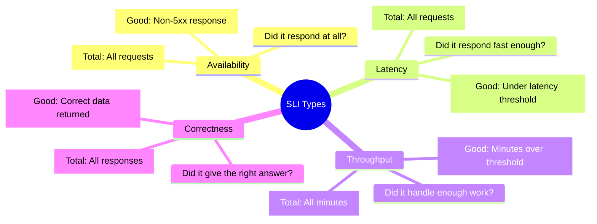
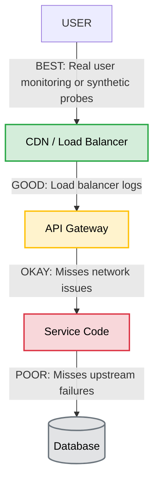
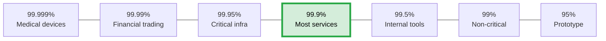
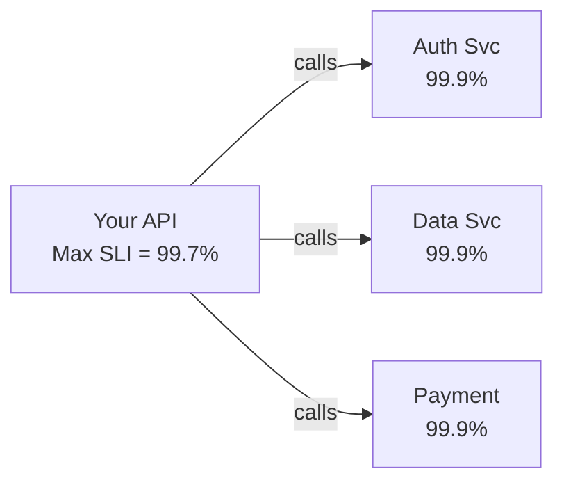
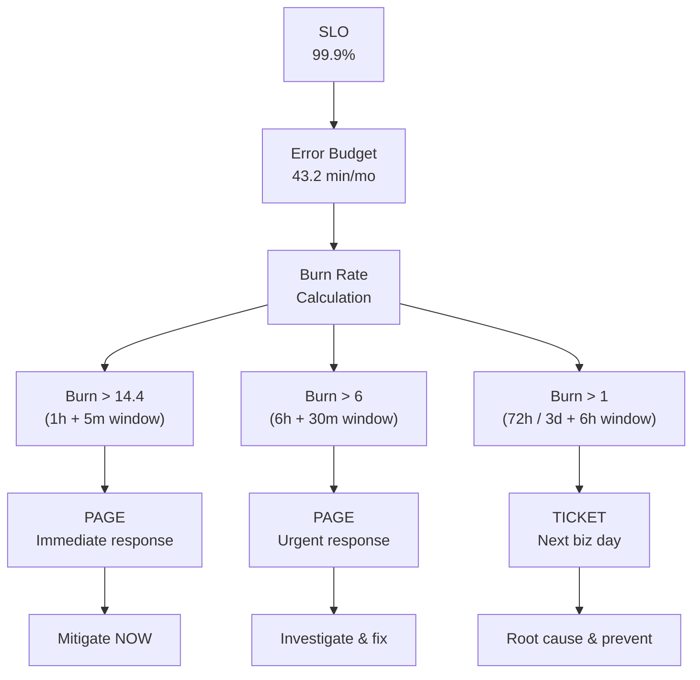
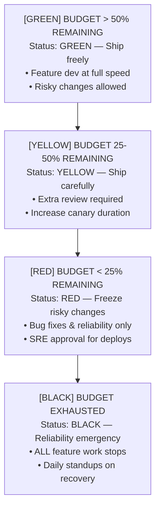

> **Complexity**: `[MEDIUM]` — Core SRE mental model
>
> **Time to Complete**: 40-50 minutes
>
> **Prerequisites**: [Module 2.1: What Is Reliability](../module-2.1-what-is-reliability/), [Module 2.4: Measuring and Improving Reliability](../module-2.4-measuring-and-improving-reliability/)
>
> **Track**: Foundations

## The Dashboard That Said Green While Users Said Broken

**Hypothetical scenario:** The following narrative is a composite teaching example. It combines patterns seen when teams celebrate infrastructure uptime while customer support reports widespread frustration. It does not describe one specific public incident. The names, dates, and ticket counts are illustrative.

A mid-stage software company runs weekly leadership reviews with infrastructure dashboards front and center. The engineering leader reports that availability metrics look excellent: servers responded to health checks, load balancers returned success codes, and the rolling uptime percentage sits near four nines for the quarter. The room relaxes. Reliability, on paper, looks like a solved problem.

Then customer success shares a different story drawn from support queues. Enterprise users describe portfolio pages that take many seconds to render, checkout flows that time out on mobile networks, and dashboards that technically load but feel unusable. The infrastructure chart and the customer experience chart are describing different worlds. Engineering measured whether the server returned a response; users measured whether the response arrived quickly enough to complete a task.

When the team finally defines a latency-oriented Service Level Indicator at the edge—say, ninety-ninth percentile page load under a concrete threshold—the picture changes. The same quarter that looked like four nines of availability may show only two nines of *meaningful* reliability for the journeys that matter. That gap is not a tooling failure. It is a measurement failure. SLIs, SLOs, and error budgets exist to close it.

**The SLO revealed what uptime monitoring hid.** Once the team aligned metrics with user journeys, engineering effort shifted from debating whether servers were "up" to fixing tail latency on the paths that drive revenue. Progress did not require a new feature launch; it required measuring what users already cared about.

---

## What You'll Be Able to Do

When you finish this module, you should be able to explain SLIs, SLOs, and error budgets to product and engineering peers without leaning on jargon, and you should be able to critique an existing reliability program against the theory in this page. The numbered outcomes below map to the quiz, the ShopFast exercise, and the anti-pattern tables you will work through in later sections.

1. **Design** SLIs that measure what users actually experience rather than what infrastructure dashboards report alone
2. **Implement** SLOs with achievable targets, error budgets, and multi-window burn-rate alerting tied to user journeys
3. **Apply** error budget policies that balance reliability investment with product velocity using pre-agreed rules
4. **Avoid** the most common SLO anti-patterns that misalign incentives and hide user pain behind green dashboards

---

## Why This Module Matters

Every engineering organization negotiates the same tension: product wants speed, operations wants stability, and leadership wants both without a clear definition of "stable enough." Without a shared measurement framework, those negotiations become political. The loudest stakeholder wins, the quietest absorbs risk, and reliability work gets funded only after an outage makes the pain undeniable.

SLIs, SLOs, and error budgets replace politics with explicit agreements about what "good enough" means for users and how much failure the business can afford while still shipping. The Service Level Indicator answers what to measure. The Service Level Objective answers what target to hit over a defined window. The error budget answers how much unreliability remains before the team must prioritize stabilization over feature work. Together they turn abstract reliability arguments into arithmetic you can plot on a dashboard and defend in a roadmap meeting.

This module teaches the **theory** behind that framework: how to choose indicators that reflect real experience, how to set targets that are ambitious without paralyzing the team, how burn-rate alerting connects metrics to time-to-budget-exhaustion, and how written policies prevent crisis-driven improvisation. Later modules in the Platform track cover operational practice—[SLO Discipline](/platform/disciplines/core-platform/sre/), [Error Budget Management](/platform/disciplines/core-platform/sre/), and [SLO Tooling](/platform/toolkits/observability-intelligence/observability/)—but the mental model lives here in Foundations because it outlasts any vendor tool.

> **The Restaurant Analogy**
>
> Think of a restaurant. The *SLI* is what you measure: the share of meals served within twenty minutes of ordering. The *SLO* is your target: for example, ninety-five percent of meals within twenty minutes over a rolling month. The *error budget* is how many slow meals you can tolerate before you stop adding exotic menu items and fix the kitchen line instead.
>
> Without SLOs, the chef keeps expanding the menu while wait times creep toward forty-five minutes. With SLOs, the team knows exactly when innovation must pause so reliability work can catch up. The analogy is simplified—production systems have more dimensions than a dining room—but the incentive alignment is the same.

---

## Part 1: Service Level Indicators (SLIs)

### 1.1 What Is an SLI?

A **Service Level Indicator** is a quantitative measure of some aspect of the service level being provided. In plain language, it is the number that tells you whether users are getting a good experience on a dimension they care about. Google’s Site Reliability Engineering book emphasizes that SLIs should be chosen close to the user: if a system is slow, unavailable, or returns wrong answers, the SLI should capture that pain in a form engineers can trend over time.

An SLI is almost always expressed as a ratio of good events to valid events, which lets you compare weeks with different traffic volumes on the same scale:

```text
              Good events
    SLI  =  ─────────────  ×  100%
             Total events
```

The ratio pattern repeats across dimensions. **Availability** might count successful HTTP responses (non-5xx) divided by total HTTP responses. **Latency** might count requests completed under a threshold divided by all requests. **Correctness** might count responses with validated data divided by all responses. Representative shapes include:

- **Availability SLI:** Successful HTTP responses (non-5xx) / Total HTTP responses × 100%
- **Latency SLI:** Requests completed in < 300ms / Total requests × 100%
- **Correctness SLI:** Responses with correct data / Total responses × 100%
- **Throughput SLI:** Minutes where throughput > 1000 req/s / Total minutes × 100%

The ratio form matters because it normalizes different traffic volumes into a percentage between zero and one hundred, which can be compared directly to an SLO target and tracked on the same chart as error budget remaining. Whether your service handles a thousand or a billion requests per month, an SLI expressed as "good divided by total" answers the same question: what fraction of experiences met the definition of good?

Choosing the denominator is as important as choosing the numerator. "Total events" should mean events users actually initiated or depended on—not background cron jobs that nobody notices unless you count them to inflate success rates. Invalid or synthetic traffic should be excluded when it would distort the user story. The Implementing SLOs chapter in the Site Reliability Workbook recommends documenting SLI definitions precisely enough that two engineers independently querying telemetry would compute the same number.

### 1.2 The Four Types of SLIs

Most production services need more than one SLI because users care about more than one dimension. A page that returns instantly with the wrong balance is not a good experience; a page that returns the right balance after eight seconds may still feel broken. The four fundamental categories below cover the majority of user-facing systems. Mature teams often pick one primary SLI per critical journey plus one or two supporting SLIs that catch blind spots.


```mermaid
mindmap
  root((SLI Types))
    Availability
      Did it respond at all?
      [Good: Non-5xx response]
      [Total: All requests]
    Latency
      Did it respond fast enough?
      [Good: Under latency threshold]
      [Total: All requests]
    Throughput
      Did it handle enough work?
      [Good: Minutes over threshold]
      [Total: All minutes]
    Correctness
      Did it give the right answer?
      [Good: Correct data returned]
      [Total: All responses]
```

**Availability** asks whether the system produced a successful response at all—typically excluding client errors that reflect user mistakes rather than service failure. **Latency** asks whether the response arrived within a threshold that matches user patience for that action. **Throughput** asks whether the system processed enough work per time window (e.g. records per second)—critical for batch jobs, search indexes, and data pipelines where volume capacity matters. **Freshness** — a distinct pipeline SLI — asks how recent the processed data is (the lag between an event occurring and it being reflected downstream), which matters when "up but stale" is still wrong. **Correctness** asks whether the response content matched truth: correct totals, authorized data, and consistent state. Payment and inventory systems often treat correctness as the highest-priority SLI because errors are hard to undo.

### 1.3 Choosing the Right SLI

The best SLI is the one closest to the user's actual experience on a journey that matters to the business. Infrastructure metrics like CPU utilization, pod restart counts, and disk free space are invaluable for debugging, but they are not SLIs unless you can draw a direct line from them to user pain. Nobl9’s SLO best-practice guidance stresses mapping complete user journeys—search, add to cart, pay, receive confirmation—rather than stopping at the first internal service boundary.

**The Golden Rule**: measure at the boundary closest to the user. If you can measure at the load balancer or CDN edge, prefer that over application-internal timers that miss DNS, TLS, and last-mile network delay. Synthetic probes that execute realistic scripts—log in, search, checkout—catch failures that unit tests and shallow health checks miss, especially when dependencies are degraded but still returning HTTP 200 with empty payloads.

> **Stop and think**: If your users are mostly on slow mobile connections, how might measuring latency strictly at your internal API gateway fail to capture their true waiting experience?


```mermaid
flowchart TD
    User[USER] -->|BEST: Real user monitoring or synthetic probes| CDN[CDN / Load Balancer]
    CDN -->|GOOD: Load balancer logs| API[API Gateway]
    API -->|OKAY: Misses network issues| Code[Service Code]
    Code -->|POOR: Misses upstream failures| DB[(Database)]
    
    classDef best fill:#d4edda,stroke:#28a745,stroke-width:2px,color:#000;
    classDef good fill:#fff3cd,stroke:#ffc107,stroke-width:2px,color:#000;
    classDef okay fill:#f8d7da,stroke:#dc3545,stroke-width:2px,color:#000;
    classDef poor fill:#e2e3e5,stroke:#6c757d,stroke-width:2px,color:#000;
    
    class CDN best;
    class API good;
    class Code okay;
    class DB poor;
```

When you evaluate a candidate SLI, ask three questions before promoting it to production dashboards: Does a drop in this number correlate with support tickets or revenue risk? Can we measure it continuously with data we already trust? Can on-call engineers influence it without needing a dozen unrelated teams to change simultaneously? If the answer to any question is no, keep searching or split the journey into smaller SLIs until each one is actionable.

Percentiles beat averages for latency SLIs because user experience lives in the tail. An average of eighty milliseconds can hide that one percent of requests take multiple seconds—the exact requests users remember when they complain about buffering or frozen checkout buttons. The Google SRE book recommends reporting tail latency (p95, p99, or p99.9 depending on traffic shape) against thresholds derived from product research or historical support themes, not from whatever number makes the chart look green.

The comparison table below contrasts infrastructure-centric metrics with user-centric SLIs. Use it as a rubric during design reviews when someone proposes "we already measure CPU, so we are fine."

**Good vs. Bad SLIs:**

| Bad SLI | Why It's Bad | Good SLI | Why It's Better |
|---------|-------------|----------|----------------|
| CPU utilization < 80% | Users don't experience CPU | Request success rate > 99.9% | Users experience errors directly |
| Average latency < 100ms | Averages hide tail latency | P99 latency < 500ms | Catches the worst common experiences |
| Server is ping-able | Ping doesn't test functionality | Synthetic transaction succeeds | Tests the actual user journey |
| Zero error logs | Logs miss silent failures | End-to-end probe returns correct data | Catches data corruption, not just crashes |
| Disk usage < 90% | Operational metric, not user metric | Write operations succeed within 50ms | Users experience write failures |
| Pod restart count = 0 | Restarts may be invisible to users | No user-visible request dropped during restart | Measures actual user impact |

### 1.4 Request-Based vs. Window-Based SLIs

SLIs come in two measurement shapes, and picking the wrong shape makes SLOs meaningless. **Request-based SLIs** count individual events: "ninety-nine point nine percent of HTTP requests return successfully." They fit APIs, web pages, and microservices where each user action generates discrete requests you can classify as good or bad. The denominator is total valid requests in the window.

**Window-based SLIs** evaluate fixed time slices: "ninety-nine point nine percent of one-minute windows have median query time under one hundred milliseconds." They fit batch jobs, streaming pipelines, and background processors where success means "this interval was healthy" rather than "this single RPC succeeded." A pipeline that stalls for ten minutes might process zero bad records while still violating freshness expectations—window-based SLIs catch that story.

Hybrid systems often need both. An order API might use request-based availability and latency SLIs for synchronous calls, while the downstream fulfillment pipeline uses window-based freshness SLIs for "orders acknowledged within five minutes of payment." Document which journeys use which shape so incident responders do not accidentally compare incompatible percentages during a crisis.

### 1.5 Validating SLIs Before You Commit

Before an SLI becomes the foundation of paging and roadmap debates, validate it against historical data and human judgment. The Implementing SLOs workbook recommends plotting proposed SLIs over the previous quarter and marking incidents, deploys, and support spikes on the same timeline. If the SLI flatlines while customers complain, the indicator is wrong—not the customers.

Run a **paper SLO** first: compute what error budget would have been consumed historically without wiring alerts or policies. Teams often discover that a proposed 99.99% target would have been breached every month, which is valuable evidence for setting a more honest target before anyone is blamed for missing an impossible number.

Involve customer-facing teams in validation. Support leaders can confirm whether tail latency on checkout correlates with ticket volume; account managers can flag enterprise journeys that telemetry misses. SLI design is not a pure engineering exercise because "good" is defined by people who depend on the service, not only by graphs in a monitoring tool.

Finally, document exclusions explicitly: planned maintenance windows, internal canary traffic, and known third-party drills should not consume user-facing budget if users were not impacted—or should consume it if users were impacted, even when the root cause sits outside your codebase. Ambiguous exclusions become political during incidents; precise exclusions become part of the SLO contract.

---

## Part 2: Service Level Objectives (SLOs)

### 2.1 What Is an SLO?

A **Service Level Objective** is a target value for an SLI measured over an explicit time window. It is the line separating "reliable enough for our users and business" from "we must act." SLOs are internal engineering agreements. They differ from **Service Level Agreements (SLAs)**, which are contractual promises to customers, often with financial remedies when breached. The Site Reliability Workbook recommends keeping internal SLOs stricter than external SLAs so the team has margin to fix problems before credits or penalties trigger.

Every complete SLO statement names three components: the **target** percentage, the **SLI** definition being measured, and the **window** over which the ratio is evaluated. For example, you might commit to 99.9% of requests completing successfully within 300ms measured over a rolling twenty-eight-day window. Omitting any component invites arguments during incidents because two teams may compute different numbers from the same raw telemetry.

Representative SLO statements across service types include:

- **Web frontend:** 99.9% of page loads complete in < 2 seconds (28-day rolling)
- **Payment API:** 99.99% of payment requests return non-5xx (30-day calendar)
- **Data pipeline:** 99.5% of 10-minute windows: all records processed within 15 min of ingestion (28-day rolling)

Well-written SLO statements read like contracts engineers can implement. They name the population (which endpoints or journeys), the threshold (latency cutoff or error definition), the aggregation method (percentile or success ratio), and the window (rolling or calendar). Vague goals like "the API should be fast" fail because nobody can calculate error budget from them and nobody knows when to freeze deploys.

SLOs also need owners. The SLO Development Lifecycle (SLODLC) framework—an open methodology co-developed with Nobl9—treats ownership and review cadence as part of the objective itself. An SLO without a named team and quarterly review drifts: traffic patterns change, dependencies shift, and the target becomes either irrelevant or impossible without anyone noticing until an executive asks why reliability investments never show up in metrics.

### 2.2 Setting the Right Target

Setting the SLO target is the hardest design choice because it encodes product judgment in a single percentage. Too aggressive a target consumes engineering capacity on reliability work that users may not notice; too loose a target lets experience degrade until churn and support costs rise. The right target sits slightly beyond current performance for teams that need to improve, or slightly below sustained performance for teams that need permission to ship faster—error budgets make that asymmetry explicit.


```mermaid
flowchart LR
    A["99.999%\nMedical devices"] --- B["99.99%\nFinancial trading"]
    B --- C["99.95%\nCritical infra"]
    C --- D["99.9%\nMost services"]
    D --- E["99.5%\nInternal tools"]
    E --- F["99%\nNon-critical"]
    F --- G["95%\nPrototype"]
    
    classDef sweetspot fill:#d4edda,stroke:#28a745,stroke-width:4px,color:#000;
    class D sweetspot;
```

Finding the right target is iterative judgment, not a formula. Work through the following lenses with product and support partners before you freeze a number in a dashboard.

1. **Start with user expectations.** What latency and error rate do users notice on this journey? Product research, support themes, and competitor benchmarks matter more than arbitrary nines.
2. **Look at current performance.** If sustained availability is 99.7%, an SLO of 99.99% is aspirational wallpaper, not an operational target. Pick a reachable next step.
3. **Consider your dependencies.** Your SLO cannot exceed the combined reliability of synchronous dependencies unless architecture removes them from the critical path.
4. **Factor in cost.** Each additional nine often requires disproportionate investment in redundancy, testing, and operational maturity. Ask whether marginal reliability wins justify delayed features.

AWS Well-Architected Reliability guidance and Google Cloud’s reliability pillar both recommend aligning reliability targets with business impact rather than maximizing uptime for every component. Not every microservice deserves the same SLO; a recommendation widget and a payment authorization service should not share a target just because they deploy in the same cluster.

### 2.3 SLO Math: The Dependency Chain

When services depend on each other synchronously, reliability multiplies—and multiplying probabilities always moves toward worse outcomes. If your API must call authentication, inventory, and payment services on every request, and each dependency succeeds ninety-nine point nine percent of the time independently, the theoretical ceiling for your own availability is roughly 99.7 percent even if your code never fails.

> **Pause and predict**: If you set your SLO to 99.999% but rely on a cloud provider with a 99.9% SLA, what will inevitably happen to your error budget?


```mermaid
flowchart LR
    YourAPI["Your API\nMax SLI = 99.7%"]
    Auth["Auth Svc\n99.9%"]
    Data["Data Svc\n99.9%"]
    Pay["Payment\n99.9%"]
    
    YourAPI -->|calls| Auth
    YourAPI -->|calls| Data
    YourAPI -->|calls| Pay
```

If ALL dependencies must succeed for your API to succeed:
**Max SLI = 99.9% × 99.9% × 99.9% = 99.7%**

You cannot credibly promise 99.9% end-to-end if dependency math caps you near 99.7% unless you change the architecture. Deep microservice call chains therefore struggle with tight SLOs—not because engineers are careless, but because independence assumptions stop holding when every hop is on the critical path.

When multiplication caps your ceiling, architecture changes beat heroic on-call work. The strategies in the table below are the usual levers platform teams use to reclaim budget without pretending dependencies are more reliable than they are.

| Strategy | How It Helps | Example |
|----------|-------------|---------|
| **Caching** | Removes dependency from critical path | Cache auth tokens locally |
| **Graceful degradation** | Non-critical deps can fail without blocking | Show cached data if recommendation service is down |
| **Async processing** | Decouple from real-time dependency | Queue payments, confirm later |
| **Retries with backoff** | Converts transient failures to successes | Retry failed DB reads with jitter |
| **Fallbacks** | Alternative path when primary fails | Use secondary data source |

Map dependency chains during SLO design reviews the same way you map them for incident response. When product asks for a tighter SLO, show the multiplication math first. Often the right answer is architectural investment—not another on-call heroics program.

### 2.4 Rolling vs. Calendar Windows

The measurement window changes incentives. **Calendar windows** reset at midnight on the first of the month or quarter. They align with finance and customer reporting cycles and are easy to explain to executives. They also invite **budget gaming**: teams may rush risky changes right after reset when the budget looks infinite, or hoard reliability work until the last week when a single incident can still breach the monthly target.

**Rolling windows** (commonly twenty-eight or thirty days) slide continuously forward. Bad events age out gradually instead of disappearing at a calendar boundary. That smooths operational pressure and reduces end-of-month cliff effects, but rolling math is harder to communicate in a quarterly business review without a good dashboard.

**Recommendation:** use rolling windows for operational SLOs that engineers live with daily. Use calendar windows when contractual SLAs or executive scorecards require fixed reporting periods—and keep internal SLOs stricter than those external commitments so you breach internally before you breach commercially.

### 2.5 Quarterly SLO Review and Stakeholder Communication

SLOs are living agreements, not install-once configuration. Schedule quarterly reviews with product, support, and dependency owners to ask four questions: Did we miss the SLO repeatedly (target too tight)? Did we finish every quarter with large unused budget (target too loose or innovation too slow)? Did support themes shift to a dimension we do not measure (wrong SLI)? Did architecture change enough that dependency math must be recalculated?

Executive communication should translate percentages into user stories and budget runway, not into nines bingo. "We consumed seventy percent of checkout latency budget in twelve days after a dependency change" lands better than "p99 slipped from 400ms to 600ms" for leaders who do not live in percentile charts. The SLO Development Lifecycle review worksheets help structure these conversations so they produce updated targets or explicit decisions to invest rather than vague promises to "watch the dashboard."

When tightening an SLO, fund the work. Tighter targets without capacity for dependency upgrades, caching, or test investment merely demoralize teams who are punished for missing goals they were never resourced to hit. When loosening an SLO, explain the user evidence—perhaps the journey is internal-only or error impact is recoverable—so the change does not read as lowering standards without cause.

---

## Part 3: Error Budgets — The Revolutionary Concept

### 3.1 What Is an Error Budget?

The insight that changed site reliability engineering practice is simple to state and hard to internalize: **reliability is not an unlimited virtue—it is a budgeted resource.** An error budget is the amount of unreliability your SLO permits. It is the gap between perfect one hundred percent and your target.

```text
    Error Budget = 100% - SLO
```

Consider a service with a 99.9% SLO over thirty days. The error budget is 0.1% of events or time in the window. That translates to roughly forty-three minutes of downtime in a month if you think in availability terms, or about one thousand failed requests per million if you think in request terms. Both views describe the same budget; teams should standardize on the view that matches how their users experience failure.

> **Stop and think**: If your service has an SLO of 99.9%, allowing 43.2 minutes of downtime per month, how does a deployment that takes 5 minutes of complete downtime impact your ability to release multiple times a day?

The reference table below shows how error budgets shrink as targets approach perfection. Use it when negotiating with leadership about whether another nine is worth the engineering cost.

| SLO | Error Budget | Time Budget | Request Budget (1M) |
|-----|-------------|-------------|---------------------|
| 99% | 1.0% | 7 hours 12 min | 10,000 |
| 99.5% | 0.5% | 3 hours 36 min | 5,000 |
| 99.9% | 0.1% | 43.2 minutes | 1,000 |
| 99.95% | 0.05% | 21.6 minutes | 500 |
| 99.99% | 0.01% | 4.32 minutes | 100 |
| 99.999% | 0.001% | 26 seconds | 10 |

Express budgets in both time and event counts when possible. A streaming API might exhaust its budget through a few long outages; a high-volume RPC service might exhaust it through thousands of small errors with no visible downtime. Teams that only track minutes miss request-driven budget burns; teams that only track failed requests miss maintenance windows that users experience as unavailable.

### 3.2 Why Error Budgets Are Revolutionary

Before error budgets, reliability conversations were zero-sum arguments. Developers wanted to ship features; operators wanted change freezes; product managers mediated without a shared numerator. Error budgets reframe the question from "are we allowed to deploy?" to "how much unreliability remains in the budget, and does this change fit inside it?"

**The Old World:**
Developer: "I want to ship the new checkout flow."
Ops: "No. Too risky. We had an incident last week."
*Result: Resentment, finger-pointing, politics.*

**The New World:**
Developer: "I want to ship the new checkout flow."
SRE: "Let's check the error budget. We have budget remaining. Historically this deploy causes a small error burst. The burn rate is acceptable—ship with the usual canary."
*Result: Data-driven decision. Shared ownership.*

The profound cultural shift is bilateral. When the budget is healthy, reliability engineers should encourage measured risk—unused budget means the SLO may be too loose or the product is under-shipping. When the budget is exhausted, product must accept that feature work pauses until reliability recovers. The Google SRE book describes error budgets as the mechanism that makes "100% is the wrong target" operationally true: perfection is expensive, and budgets force explicit trade-offs instead of implicit ones.

### 3.3 Budget Tracking Over Time

Error budget consumption should be visible continuously, like a financial runway chart. Product and engineering leaders should see the same graph: percent budget remaining, projected exhaustion date based on current burn rate, and annotations for incidents and deploys. Without that visibility, budgets become retrospective homework instead of forward-looking steering tools.

Illustrative budget tracking for a 99.9% SLO with a forty-three-minute monthly time budget might show steady consumption after deploys and incidents, then a policy-driven slowdown when remaining budget crosses warning thresholds. Teams often color-code health: green when more than half remains, yellow when caution is warranted, red when risky changes need approval, and black when the budget is exhausted and reliability work takes priority. The colors matter less than the **pre-written policy** attached to each band—see Part 5—because without agreed actions, a red dashboard becomes another ignored chart.

---

## Part 4: Burn Rate and Multi-Window Alerting

### 4.1 What Is Burn Rate?

The error budget tells you how much failure you can afford over the window. **Burn rate** tells you how fast you are spending it right now relative to the sustainable pace.

```text
    Burn Rate = (Observed error rate) / (SLO-allowed error rate)
```

- **Burn Rate 1.0:** Consuming budget at exactly the allowed rate. Budget reaches zero at the end of the window.
- **Burn Rate 2.0:** Consuming budget twice as fast. Budget exhausts halfway through the window.
- **Burn Rate 10.0:** Consuming budget ten times faster. Budget exhausts in one-tenth of the window.

Burn rate converts a small error percentage into a time-to-exhaustion story executives understand. "0.5% errors" sounds tolerable until burn rate math shows the monthly budget dying in less than a week.

### 4.2 Multi-Window Alerting

Single-threshold alerts on raw error rate fail in two directions. Brief spikes page on-call for self-healing blips. Slow leaks stay below the threshold while quietly eating the budget. The Site Reliability Workbook’s alerting chapter recommends **multi-window, multi-burn-rate alerts**: require elevated burn rate in both a short window and a longer window before paging, so transient noise clears without waking anyone while sustained problems still surface.

The Site Reliability Workbook's alerting-on-SLOs chapter provides canonical multi-window, multi-burn-rate configurations tuned for a 99.9% SLO over 30 days. Three tiers separate genuine threats from transient noise without missing slow degradation:

- **Fast burn (Page)**: burn rate **14.4**, windows **1 hour and 5 minutes**. At this rate, the budget consumes roughly two percent of the monthly allowance in one hour—a genuine emergency that pages on-call immediately.
- **Medium burn (Page)**: burn rate **6**, windows **6 hours and 30 minutes**. This burns roughly five percent of the budget in six hours. It pages on-call because sustained consumption at this rate exhausts the budget in roughly five days.
- **Slow burn (Ticket)**: burn rate **1**, windows **72 hours (3 days) and 6 hours**. This burns roughly ten percent of the budget in three days—a smoldering issue that opens a ticket for investigation during business hours but does not wake anyone at night.

These canonical values from the workbook are the default recommendation for most services. The specific constants can be tuned to your window length and risk tolerance; the workbook provides lookup tables for other SLO targets. The principle is universal: tie alert severity to budget impact, not to arbitrary error-percent thresholds divorced from SLO context.


```mermaid
flowchart TD
    SLO["SLO\n99.9%"] --> EB["Error Budget\n43.2 min/mo"]
    EB --> Calc["Burn Rate\nCalculation"]
    
    Calc --> Fast["Burn > 14.4\n(1h + 5m window)"]
    Calc --> Med["Burn > 6\n(6h + 30m window)"]
    Calc --> Slow["Burn > 1\n(72h / 3d + 6h window)"]
    
    Fast --> Page1["PAGE\nImmediate response"]
    Med --> Page2["PAGE\nUrgent response"]
    Slow --> Ticket["TICKET\nNext biz day"]
    
    Page1 --> Mitigate["Mitigate NOW"]
    Page2 --> Investigate["Investigate & fix"]
    Ticket --> RCA["Root cause & prevent"]
```

### 4.3 Why Traditional Alerting Fails

| Problem | Traditional Alert ("error > 1%") | Burn Rate Alert |
|---------|----------------------------------|-----------------|
| **Brief spikes** | Fires alarm, wakes on-call for 30-second blip | Short window clears quickly, no page |
| **Slow degradation** | 0.3% errors never crosses 1% threshold | Burn rate 3.0 detected over 6 hours |
| **Context-free** | "Error rate is high" — so what? | "Budget exhausted in 10 days" — actionable |

Alerting on SLIs rather than on every infrastructure metric also reduces alert fatigue—a prerequisite for humans to remain engaged when pages actually matter. Nobl9’s best-practice material similarly recommends alerts that reflect user pain thresholds derived from SLOs, not raw infrastructure noise.

### 4.4 From Burn-Rate Math to Runnable Alerts

Translating workbook tables into monitoring config requires documenting your SLO window length, allowed error rate, and chosen short and long windows for each alert tier. Tools such as Sloth, Pyrra, and vendor SLO platforms generate recording rules from a compact SLO spec; the generated math should match hand calculations for a known incident before you trust pages.

When tuning alerts, replay historical incidents: compute what burn rate would have been during a past outage and whether multi-window conditions would have fired at the right severity. If a sev-1 would have opened only a ticket, tighten thresholds; if on-call was paged for self-healing blips weekly, widen short windows or raise burn thresholds slightly. Alert tuning is empirical science bounded by SLO math, not intuition about error percentages.

Document alert ownership alongside SLO ownership. A burn-rate page that nobody acknowledges is worse than no page because it trains the team to ignore SLO-based alerting altogether. Pair each alert tier with a runbook section that states expected first actions: mitigate user impact, identify deploy correlation, roll back or feature-flag, and post status to the budget dashboard annotation field so product sees progress.

---

## Part 5: Error Budget Policies

### 5.1 What Happens When the Budget Runs Out?

An error budget without a policy is a vanity metric. The policy defines **actions** at each budget level: who approves risky deploys, whether feature work pauses, how escalations flow, and what evidence is required to override the policy temporarily. Policies should be written when emotions are calm and signed by product, engineering, and leadership—not improvised during an outage when revenue pressure peaks.


```mermaid
flowchart TD
    Green["[GREEN] BUDGET > 50% REMAINING\nStatus: GREEN — Ship freely\n• Feature dev at full speed\n• Risky changes allowed"]
    Yellow["[YELLOW] BUDGET 25-50% REMAINING\nStatus: YELLOW — Ship carefully\n• Extra review required\n• Increase canary duration"]
    Red["[RED] BUDGET < 25% REMAINING\nStatus: RED — Freeze risky changes\n• Bug fixes & reliability only\n• SRE approval for deploys"]
    Black["[BLACK] BUDGET EXHAUSTED\nStatus: BLACK — Reliability emergency\n• ALL feature work stops\n• Daily standups on recovery"]
    
    Green --> Yellow --> Red --> Black
```

Override paths must exist—sometimes a regulatory launch cannot wait—but overrides should be rare, documented, and visible on the same dashboard as budget status so the organization knows reliability debt was consciously accepted.

### 5.2 Who Owns the Policy?

| Stakeholder | Role in Error Budget Policy |
|-------------|---------------------------|
| **Product** | Agrees that feature freezes happen when budget is exhausted |
| **Engineering** | Commits to meeting SLO, accepts velocity constraints |
| **SRE / Platform** | Monitors budget, enforces policy, provides tooling |
| **Leadership** | Sponsors the policy, breaks ties, escalation path |

> **Pause and predict**: If you don't define an error budget policy before an incident occurs, who ends up deciding whether to halt feature development during a crisis?

The SLO Development Lifecycle includes templates for error budget policies and review worksheets so teams do not start from a blank page. Treat those documents as living artifacts: revisit them when architecture, traffic mix, or business priorities shift materially.

---

## Part 6: Putting It All Together

### 6.1 SLO Design Checklist for New Services

Walk through this checklist when launching a new service or major journey—not after the first outage proves measurement was missing.

- [ ] **1. IDENTIFY THE USER JOURNEYS:** What are the critical paths users take? (e.g., "User loads dashboard", "User submits payment")
- [ ] **2. CHOOSE SLIs FOR EACH JOURNEY:** What signals best represent user experience? Measure at the boundary closest to the user.
- [ ] **3. SET INITIAL SLO TARGETS:** Start near current performance with a small improvement buffer if needed.
- [ ] **4. CALCULATE ERROR BUDGETS:** 100% - SLO = error budget. Convert to minutes AND request counts.
- [ ] **5. DEFINE MEASUREMENT WINDOW:** Rolling 28 days for operational metrics is a common default.
- [ ] **6. CONFIGURE BURN RATE ALERTS:** Fast burn (page) and slow burn (ticket) per workbook guidance.
- [ ] **7. WRITE THE ERROR BUDGET POLICY:** Get sign-off from product, engineering, and leadership.
- [ ] **8. DOCUMENT ASSUMPTIONS:** Expected traffic volume, dependency reliability, and exclusion rules.
- [ ] **9. PUBLISH AND COMMUNICATE:** Dashboard visible to all stakeholders, regular review meetings.
- [ ] **10. SCHEDULE QUARTERLY REVIEW:** Is the SLO too tight? Too loose? Are we measuring the right things?

### 6.2 Real-World SLO Examples

The tables below show how teams often split SLOs by journey and dimension rather than declaring one uptime number for an entire monolith. E-commerce frontends typically separate browse latency from checkout success because user patience and business impact differ. Payment APIs stack strict availability with correctness-sensitive endpoints because partial failure modes differ from generic 5xx counts.

**Web Application (E-commerce Frontend)**

| Component | SLI | SLO Target | Window |
|-----------|-----|-----------|--------|
| Page load | Requests completing in < 2s | 99% | 28-day rolling |
| Page load | Requests returning non-5xx | 99.9% | 28-day rolling |
| Checkout | Checkout completing successfully | 99.95% | 28-day rolling |

Payment services frequently adopt calendar windows aligned to enterprise billing cycles while keeping rolling windows for internal latency SLOs that engineers monitor daily.

**REST API (Payment Service)**

| Component | SLI | SLO Target | Window |
|-----------|-----|-----------|--------|
| All endpoints | Requests returning non-5xx | 99.99% | 30-day calendar |
| All endpoints | Requests completing in < 1s | 99.9% | 30-day calendar |
| POST /charge | Charges completing correctly | 99.999% | 30-day calendar |

Notice how payment paths carry stricter targets than browse paths. That is intentional product judgment encoded numerically—not every endpoint deserves the same nines.

### 6.3 SLO Anti-Patterns to Avoid

| Anti-Pattern | Why It Seems Reasonable | The Problem | Better Approach |
|-------------|------------------------|-------------|----------------|
| **Chasing 99.999%** | "We want to be world-class" | Budget is microscopic. One routine deploy consumes it. Team paralysis. | Start at 99.9%, tighten only when sustained data proves spare capacity |
| **Ignoring dependency multiplication** | "Each team owns their SLO" | Three 99.9% dependencies cap you at 99.7%. Promising nines without architecture math sets teams up to fail. | Map the dependency chain before publishing SLO targets; invest in caching, async, and graceful degradation |
| **Vanity SLIs** | "We already measure CPU and disk" | Infrastructure metrics do not reflect user pain. Green servers hide slow responses, wrong data, and stale pipelines. | Choose SLIs at the user edge on critical journeys: availability, latency, correctness, freshness |
| **Averaging latency instead of percentiles** | "The mean looks fine" | Tail experiences—the requests users actually remember—disappear in the average | Use percentile latency (p95, p99) against a concrete threshold tied to user research |
| **Too many SLIs per service** | "Measure everything!" | Alert fatigue. Engineers cannot name which number matters during an incident. | Cap at one to three SLIs per critical journey; add secondary SLIs only when they catch a blind spot |
| **Designing SLOs in isolation** | "We'll define our own targets" | Teams sharing a user journey set conflicting nines or miss the handoff entirely. | Align SLOs across teams that touch the same journey; review cross-team targets quarterly |

---

## Did You Know?

- **Google's SRE book** argues that targeting 100% reliability is the wrong goal because it starves innovation; error budgets explicitly fund the risk of shipping new code by allowing a defined rate of failure.

- **Multi-window burn-rate alerting** in the Site Reliability Workbook derives alert thresholds from SLO window length and budget size so pages fire when budget is genuinely threatened—not when a arbitrary error-percent threshold flickers.

- **Dependency multiplication** means three independent 99.9% dependencies yield roughly 99.7% best-case availability for a synchronous chain—a reason architecture reviews belong in SLO design, not just in incident postmortems.

- **The SLO Development Lifecycle (SLODLC)** is an open framework with templates for discovery, implementation worksheets, and error budget policies so teams adopt SLOs as a repeatable practice rather than a one-off dashboard project.

---

## Common Mistakes

| Mistake | Problem | Solution |
|---------|---------|----------|
| Setting internal SLO equal to external SLA | No margin before contractual penalties; every internal miss becomes a customer-facing incident | Keep internal SLO measurably stricter than the customer SLA so you breach internally first |
| Writing an SLO with no error budget policy | Budget exhaustion triggers political arguments instead of agreed action | Pre-sign policy bands (green/yellow/red/black) with stakeholders before the first incident |
| Alerting on raw error thresholds | Transient spikes page on-call unnecessarily; slow leaks stay below the threshold while eating the budget | Multi-window burn-rate alerts: page on fast/medium burn, ticket on slow burn |
| Not tracking error budget on a rolling window | Calendar resets hide sustained problems; end-of-month cliff effects encourage gaming | Use rolling windows for operational SLOs; track projected exhaustion date on a shared dashboard |
| Skipping quarterly SLO review | Targets drift as traffic patterns, dependencies, and user expectations change | Schedule quarterly reviews with product, support, and dependency owners; update targets or fund reliability work |
| Retroactively lowering SLOs after a breach | Moves the goalpost instead of fixing reliability; erodes trust in the SLO framework | Treat missed SLOs as engineering investment signals; tighten targets only when sustained data proves spare capacity |
| Using error budget as a post-hoc blame tool | Teams hide incidents, undercount failures, or argue about classification instead of improving | Use budget as a forward-looking steering tool: green means ship, red means fix, no blame attached |

---

## Quiz

The questions below mix calculation, architecture judgment, and policy scenarios. Read each prompt fully before opening the answer; the explanations intentionally connect back to error budgets, burn rates, and anti-patterns covered in the body of this module.

**1. You are the lead engineer for a new inventory service. The business stakeholders have agreed to an SLO of 99.5% availability over a rolling 30-day window. During a deployment on Friday afternoon, the service goes down. How many minutes of downtime does your error budget allow for the entire month, and why is this specific number critical for your deployment strategy?**

<details>
<summary>Answer</summary>

**Calculation:**
- 30 days = 30 x 24 x 60 = 43,200 minutes
- Error budget = 100% - 99.5% = 0.5%
- Budget in minutes = 43,200 x 0.005 = **216 minutes (3 hours 36 minutes)**

**Why this matters:** This specific number is critical because it represents the total allowed downtime for the entire 30-day period, not just a single incident. If your Friday deployment consumes two hours of this budget, you only have roughly an hour and thirty-six minutes left for the rest of the month. Knowing this absolute ceiling prevents catastrophic overspending. By knowing your exact budget in minutes, you can make informed, data-driven decisions about whether to risk further deployments or halt feature releases to prioritize stability. This concrete allowance turns an abstract percentage into a practical operational boundary and supports error budget policies that product and engineering agreed in advance.
</details>

**2. You are reviewing a performance dashboard for a streaming video platform. The lead developer proudly shows that the average latency for video segment requests is 80ms, well under the 100ms target. However, customer support is overwhelmed with complaints about videos endlessly buffering. Why is this average latency SLI hiding the actual problem, and what should you use instead?**

<details>
<summary>Answer</summary>

Averages are a dangerous metric because they completely hide tail latency—the extreme outliers that ruin user experiences. In a system handling millions of requests, an average of 80ms could mean 99% of requests take 40ms while 1% take multiple seconds. That 1% represents thousands of users staring at a buffering spinner, which directly causes the support complaints you are seeing. Instead of averages, you should use percentile-based SLIs, such as the 99th percentile (P99). Measuring P99 latency ensures that you are tracking the worst common experiences, giving you a true reflection of what frustrated users encounter. This is why SLI design must measure what users actually experience rather than infrastructure summaries that look healthy while journeys fail.
</details>

**3. Your new microservice depends on an authentication service, a user profile service, and a payment gateway. Each of these three external dependencies has an historical availability of 99.9%. If all three must succeed for your service to process a request, what is the theoretical maximum availability your service can achieve, and why?**

<details>
<summary>Answer</summary>

**Calculation:**
- Maximum availability = 99.9% x 99.9% x 99.9%
- = 0.999 x 0.999 x 0.999
- = 0.999^3
- = **99.7%**

**Why this happens:** This mathematical reality occurs because the probabilities of independent failures multiply across the dependency chain. Every time you add a synchronous dependency to your critical path, you increase the surface area for failure, effectively lowering the maximum possible reliability of your own service. Even if your service's code is flawlessly bug-free and never crashes, it cannot be more reliable than the combined reliability of the systems it waits on. To break this mathematical ceiling, you must introduce architectural patterns like caching, asynchronous processing, or graceful degradation to remove dependencies from the direct critical path—core material when you implement SLOs with achievable targets.
</details>

**4. Your enterprise software company is finalizing a major contract with a Fortune 500 client. To win the deal, the sales director suggests writing your engineering team's internal SLO of 99.95% directly into the customer contract as the legally binding SLA. Why is this a dangerous idea, and how should SLOs and SLAs differ?**

<details>
<summary>Answer</summary>

This is a highly dangerous idea because it completely removes your engineering team's safety margin for operational flexibility. An SLO (Service Level Objective) is an internal target designed to guide engineering decisions, whereas an SLA (Service Level Agreement) is a legally binding contract that triggers financial penalties when breached. If your SLO and SLA are identical, any minor internal breach immediately results in lost revenue, forcing the engineering team to become overly conservative and halt innovation. To protect the business while maintaining engineering velocity, your internal SLO should always be significantly stricter (for example 99.95% internal versus 99.9% external) than your external SLA. This buffer is one of the most common SLO anti-patterns to avoid: collapsing internal objectives and customer contracts removes the margin that error budget policies rely on.
</details>

**5. Your team maintains a critical API with an SLO of 99.9% over 30 days. After a new release, the error rate spikes to 0.5% and stays there. What is your current burn rate, how long until your error budget is completely exhausted, and why is tracking this burn rate more important than just watching the error rate?**

<details>
<summary>Answer</summary>

**Calculation:**
- SLO-allowed error rate = 100% - 99.9% = 0.1%
- Current error rate = 0.5%
- Burn rate = 0.5% / 0.1% = **5.0**
- Time to exhaustion = 30 days / 5.0 = **6 days**

**Why burn rate matters:** Tracking the burn rate is far more actionable than simply monitoring the raw error rate because it contextualizes the failure against your remaining budget and time window. An error rate of 0.5% might sound small and insignificant to a product manager, but a burn rate of 5.0 explicitly warns the team that their entire month's allowance will vanish in less than a week. This rapid depletion requires immediate intervention to stop the bleeding before the budget is completely gone. Multi-window burn-rate alerting uses this math to decide whether to page on-call for a fast burn or open a ticket for a slow burn, catching problems before budgets run dry without alert fatigue from raw thresholds.
</details>

**6. A highly ambitious startup sets an SLO of 99.999% (five nines) for their new user-facing web application, which handles millions of requests per month. Within the first two months, the team misses their SLO repeatedly and feature development comes to a complete standstill. Why is setting such a strict SLO harmful, and what operational realities make it so difficult to maintain?**

<details>
<summary>Answer</summary>

Setting a five-nines SLO is harmful for a typical web application because it allows only a handful of seconds of downtime or a tiny number of failed requests per month at high volume. This microscopic budget is unforgiving: a single routine deployment, a transient network blip, or a minor DNS timeout can consume the entire allowance. Consequently, the team is forced into operational paralysis where they cannot ship features, experiment, or take necessary engineering risks out of fear of violating policy. Such aggressive targets stifle innovation and create a culture of fear around releasing code. This is a textbook SLO anti-pattern—choosing nines that sound impressive instead of targets aligned with user needs and dependency math. Better practice is to start near demonstrated performance (often 99.9% for many user-facing APIs) and tighten only when sustained data shows capacity to spare budget consistently.
</details>

**7. You are setting up alerting for a high-volume payment gateway. You currently rely on a simple threshold alert that pages the on-call engineer if the error rate exceeds 1% for 5 minutes. Last night, this alert woke you up at 3 AM for a 30-second network blip that resolved itself before you even opened your laptop. How would a multi-window burn rate alert solve this problem, and why is it functionally superior?**

<details>
<summary>Answer</summary>

A multi-window burn rate alert solves this by requiring the elevated error rate to be sustained over both a short window (for example five minutes) and a longer window (for example one hour) before triggering a critical page. In the scenario of a 30-second network blip, the short window might temporarily breach its threshold, but the long window's average would remain safely below the limit, preventing the unnecessary 3 AM wake-up call. This approach is functionally superior because it directly ties alerts to the consumption of the error budget rather than arbitrary thresholds, allowing the system to ignore harmless, self-healing spikes. It ensures that engineers are only interrupted when there is a genuine threat of exhausting the error budget before the measurement window resets. That alignment is central to implementing SLO-based alerting as described in the Site Reliability Workbook.
</details>

**8. It is day 18 of the month, and your team's error budget has officially dropped to zero after a massive database outage. The Product Manager frantically approaches your desk, demanding that you ship a 'critical' new marketing feature by Friday. According to the standard error budget policy framework, what should happen next, and why is having this policy pre-defined so important?**

<details>
<summary>Answer</summary>

Under a standard error budget policy, exhausting the budget places the service in a black or red status, meaning risky feature deployments must freeze and engineering effort must pivot to reliability work until the budget recovers. The Product Manager's request should be denied unless executive leadership formally overrides the policy with documented acceptance of reliability debt. Having this policy pre-defined and signed by product, engineering, and leadership is vital because it removes emotion and politics from high-pressure situations. Without a written agreement, these conversations devolve into shouting matches about whose priorities matter more. The pre-written contract objectively dictates the outcome so teams apply error budget policies consistently instead of improvising under outage stress.
</details>

---

## Hands-On Exercise: Calculate Error Budgets for a Real Scenario

### Scenario

You are the newly hired SRE for **ShopFast**, an e-commerce platform. The CEO has asked you to define SLOs for three critical services. Here is the current monitoring data from the last 30 days:

```text
SHOPFAST MONITORING DATA (Last 30 Days)

SERVICE 1: Product Catalog API
  Total requests:           50,000,000
  Failed requests (5xx):    25,000
  Requests > 500ms:         750,000
  Requests > 2 seconds:     50,000
  Incidents this month:     2 (total downtime: 45 minutes)

SERVICE 2: Checkout/Payment API
  Total requests:           2,000,000
  Failed requests (5xx):    100
  Requests > 1 second:      40,000
  Requests > 5 seconds:     2,000
  Incidents this month:     1 (total downtime: 12 minutes)

SERVICE 3: Order Processing Pipeline (batch)
  Total orders processed:   500,000
  Orders processed > 5 min: 5,000
  Orders with wrong status: 15
  Pipeline stalls:          3 (total stall time: 90 minutes)
```

### Part 1: Define SLIs (10 minutes)

Start by naming the user or downstream consumer for each ShopFast service, then define at least two SLIs per service in ratio form (good events divided by total valid events). Availability alone is not sufficient for the catalog API if latency is driving complaints.

```text
YOUR SLI DEFINITIONS

Service 1: Product Catalog API
  SLI 1 (Availability): _____ / _____
  SLI 2 (Latency):      _____ / _____

Service 2: Checkout/Payment API
  SLI 1 (Availability): _____ / _____
  SLI 2 (Latency):      _____ / _____

Service 3: Order Processing Pipeline
  SLI 1 (Freshness):    _____ / _____
  SLI 2 (Correctness):  _____ / _____
```

### Part 2: Calculate Current SLI Values (10 minutes)

Use the thirty-day monitoring snapshot to compute each SLI as a percentage. Show intermediate numerators and denominators so you can spot which service is closest to breaching a plausible SLO before you propose targets in Part 3.

```text
YOUR CALCULATIONS

Service 1: Product Catalog API
  Availability SLI:  (_________ - _________) / _________ = _______%
  Latency SLI (500ms): (_________ - _________) / _________ = _______%

Service 2: Checkout/Payment API
  Availability SLI:  (_________ - _________) / _________ = _______%
  Latency SLI (1s):  (_________ - _________) / _________ = _______%

Service 3: Order Processing Pipeline
  Freshness SLI (5min): (_________ - _________) / _________ = _______%
  Correctness SLI:      (_________ - _________) / _________ = _______%
```

### Part 3: Set SLOs and Calculate Error Budgets (10 minutes)

Based on current performance and user expectations, propose an SLO for each SLI. Then calculate the error budget.

```text
YOUR SLO PROPOSALS

Service 1: Product Catalog API
  Availability SLO: _______% → Budget: _______ failed requests / month
  Latency SLO:      _______% → Budget: _______ slow requests / month

Service 2: Checkout/Payment API
  Availability SLO: _______% → Budget: _______ failed requests / month
  Latency SLO:      _______% → Budget: _______ slow requests / month

Service 3: Order Processing Pipeline
  Freshness SLO:    _______% → Budget: _______ late orders / month
  Correctness SLO:  _______% → Budget: _______ incorrect orders / month
```

### Part 4: Assess Budget Status (5 minutes)

Compare current SLI values to your proposed SLOs and classify each as green, yellow, red, or over budget using the policy bands from Part 5. If a service is over budget already, note whether the issue is availability, latency, freshness, or correctness before writing recommendations.

```text
BUDGET STATUS ASSESSMENT

  Service 1 Availability:  [ ] Green  [ ] Yellow  [ ] Red  [ ] Over budget
  Service 1 Latency:       [ ] Green  [ ] Yellow  [ ] Red  [ ] Over budget

  Service 2 Availability:  [ ] Green  [ ] Yellow  [ ] Red  [ ] Over budget
  Service 2 Latency:       [ ] Green  [ ] Yellow  [ ] Red  [ ] Over budget

  Service 3 Freshness:     [ ] Green  [ ] Yellow  [ ] Red  [ ] Over budget
  Service 3 Correctness:   [ ] Green  [ ] Yellow  [ ] Red  [ ] Over budget
```

### Part 5: Write a Recommendation (5 minutes)

Write a short paragraph for the CEO summarizing which ShopFast service needs the most reliability investment this month, which SLO is closest to breach, and whether the team should slow feature work under error budget policy or has room to ship while monitoring burn rate.

---

<details>
<summary>Check Your Work — Sample Answers</summary>

**Part 1 & 2: SLI Definitions and Current Values**

Service 1: Product Catalog API
- Availability SLI: (50M - 25K) / 50M = **99.95%**
- Latency SLI (< 500ms): (50M - 750K) / 50M = **98.5%**

Service 2: Checkout/Payment API
- Availability SLI: (2M - 100) / 2M = **99.995%**
- Latency SLI (< 1s): (2M - 40K) / 2M = **98.0%**

Service 3: Order Processing Pipeline
- Freshness SLI (< 5 min): (500K - 5K) / 500K = **99.0%**
- Correctness SLI: (500K - 15) / 500K = **99.997%**

**Part 3: Proposed SLOs and Error Budgets**

Service 1: Product Catalog API
- Availability SLO: **99.9%** (current: 99.95% — comfortable margin)
  - Budget: 50M x 0.001 = 50,000 failed requests/month
  - Currently using: 25,000 (50% of budget consumed, 50% remaining — GREEN; this sits on the GREEN/YELLOW boundary per Part 5; the policy treats exactly 50% remaining as GREEN since budget has not crossed below)
- Latency SLO: **98%** (current: 98.5% — tight but achievable)
  - Budget: 50M x 0.02 = 1,000,000 slow requests/month
  - Currently using: 750,000 (75% of budget consumed, 25% remaining — YELLOW; this sits on the YELLOW/RED boundary per Part 5; the policy treats exactly 25% remaining as YELLOW since budget has not crossed below)

Service 2: Checkout/Payment API
- Availability SLO: **99.99%** (current: 99.995% — justified for payments)
  - Budget: 2M x 0.0001 = 200 failed requests/month
  - Currently using: 100 (50% of budget — GREEN)
- Latency SLO: **97%** (current: 98% — margin to improve)
  - Budget: 2M x 0.03 = 60,000 slow requests/month
  - Currently using: 40,000 (67% of budget — YELLOW)

Service 3: Order Processing Pipeline
- Freshness SLO: **98.5%** (current: 99% — healthy)
  - Budget: 500K x 0.015 = 7,500 late orders/month
  - Currently using: 5,000 (67% of budget — YELLOW)
- Correctness SLO: **99.99%** (current: 99.997% — correctness matters most for orders)
  - Budget: 500K x 0.0001 = 50 incorrect orders/month
  - Currently using: 15 (30% of budget — GREEN)

**Part 5: Recommendation**

**Priority 1: Product Catalog Latency.** At 98.5% with a proposed 98% SLO, this service is skating close to the edge. 750,000 requests per month take over 500ms. This directly impacts user browsing experience and conversion rates. Investigate the slow requests—are they specific product pages? Specific regions? A slow database query?

**Priority 2: Checkout Latency.** 40,000 payment requests taking over 1 second is a conversion killer. Users abandon carts when checkout is slow. This has direct revenue impact.

**Priority 3: Pipeline Freshness.** 5,000 orders taking over 5 minutes to processing is concerning but less urgent since it does not directly affect the real-time user experience. Monitor the trend.

</details>

---

You have completed the ShopFast exercise successfully when you can defend your SLO proposals with both user-impact reasoning and budget math, not when every number matches the sample answers exactly.

**Success Criteria:**
- [ ] Defined at least 2 SLIs per service in ratio format
- [ ] Calculated all 6 current SLI values correctly
- [ ] Proposed reasonable SLOs (not too tight, not too loose)
- [ ] Calculated error budgets correctly for each SLO
- [ ] Assessed budget status for all 6 SLIs
- [ ] Identified the highest-priority service with justification

---

## Sources

- [Site Reliability Engineering — Service Level Objectives (Google SRE Book, Chapter 4)](https://sre.google/sre-book/service-level-objectives/) — Canonical definitions of SLIs, SLOs, SLAs, and choosing indicators close to the user.
- [Site Reliability Engineering — Monitoring Distributed Systems (Google SRE Book, Chapter 6)](https://sre.google/sre-book/monitoring-distributed-systems/) — Guidance on meaningful monitoring, alerting philosophy, and why symptom-based alerting aligns with SLO thinking.
- [Implementing Service Level Objectives (Site Reliability Workbook)](https://sre.google/workbook/implementing-slos/) — Practical worksheets for SLI/SLO design, ownership, and organizational rollout.
- [Alerting on SLOs (Site Reliability Workbook)](https://sre.google/workbook/alerting-on-slos/) — Multi-window, multi-burn-rate alerting theory and lookup tables for page versus ticket severity.
- [SLO Document Template (Site Reliability Workbook)](https://sre.google/workbook/slo-document/) — Template structure for documenting SLOs, exclusions, and review cadence.
- [SLO Best Practices: A Practical Guide (Nobl9)](https://www.nobl9.com/service-level-objectives/slo-best-practices/) — User-centric SLI selection, error budgets, burn-rate monitoring, and governance patterns.
- [Service Level Objectives Development Lifecycle (SLODLC)](https://www.nobl9.com/slodlc) — Open methodology and templates for repeatable SLO adoption across teams.
- [AWS Well-Architected Framework — Reliability Pillar](https://docs.aws.amazon.com/wellarchitected/latest/reliability-pillar/welcome.html) — Reliability design principles including failure recovery and change management aligned with measurable targets.
- [Google Cloud Architecture Framework — Reliability](https://cloud.google.com/architecture/framework/reliability) — Cloud reliability perspective on defining objectives and designing for resilience.
- [Microsoft Azure Well-Architected — Reliability principles](https://learn.microsoft.com/en-us/azure/well-architected/reliability/principles) — Reliability principles including defining clear reliability goals and measuring health.
- [The Calculus of Service Availability (ACM Queue / Google)](https://queue.acm.org/detail.cfm?id=3096459) — Formal treatment of how dependency availability multiplies and shapes achievable SLOs.

---

## Next Module

[Module 3.1: What Is Observability?](../observability-theory/module-3.1-what-is-observability/) — You cannot improve or defend SLOs without seeing user-impacting behavior in production. This module introduces observability theory: the difference between monitoring and understanding, and why SLIs depend on the right signals.

---

## Further Reading

For deeper study beyond the linked sources, read Alex Hidalgo's *Implementing Service Level Objectives* for organizational change patterns, and revisit [Module 2.4: Measuring and Improving Reliability](../module-2.4-measuring-and-improving-reliability/) for postmortems and continuous improvement loops that feed back into SLO targets. Platform discipline modules on [SLO Discipline](/platform/disciplines/core-platform/sre/) and [Error Budget Management](/platform/disciplines/core-platform/sre/) operationalize the theory from this module.

---

*"An SLO is a contract with your users about what 'good enough' means. Without it, every conversation about reliability is just an argument."* — Adapted from the Google SRE handbook
