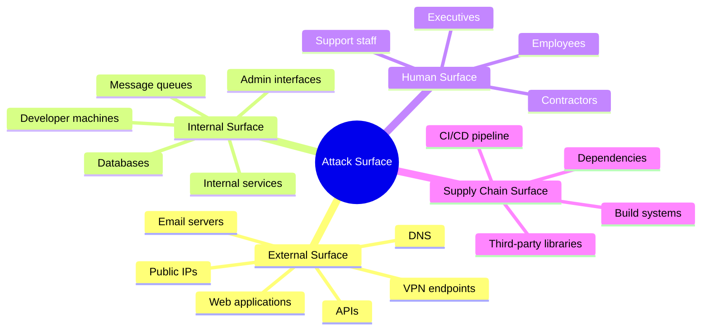
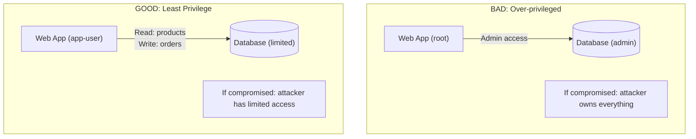
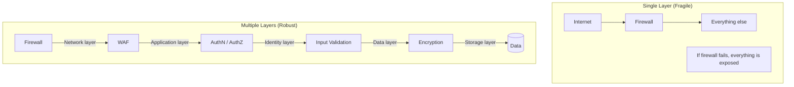
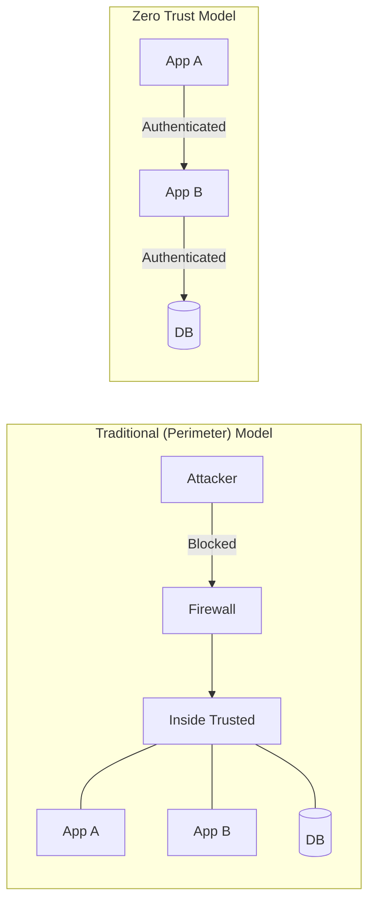
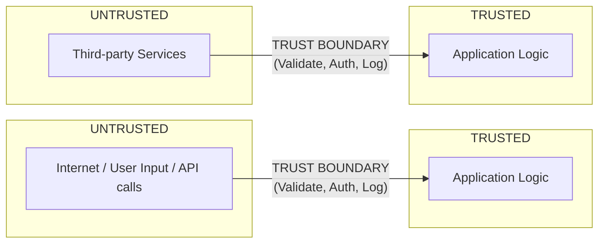
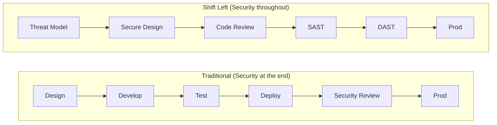

> **Complexity**: `[MEDIUM]`
>
> **Time to Complete**: 25-30 minutes
>
> **Prerequisites**: [Systems Thinking Track](/platform/foundations/systems-thinking/) (recommended)
>
> **Track**: Foundations

### What You'll Be Able to Do

After completing this module, you will be able to:

1. **Apply** attacker-mindset thinking to evaluate infrastructure designs and identify the paths of least resistance an adversary would exploit
2. **Analyze** real-world breaches (supply chain, lateral movement, credential theft) to extract defensive lessons for your own systems
3. **Design** threat models that enumerate attack surfaces, trust boundaries, and high-value targets for a given architecture
4. **Evaluate** security tradeoffs between usability, cost, and protection level when proposing defensive controls

---

The 2020 <!-- incident-xref: solarwinds-2020 -->SolarWinds supply-chain compromise reached 18,000 organizations through a trusted software update, demonstrating that attackers don't need to be smarter than defenders — they just need one way in while defenders protect everything. For the full case study, see [CI/CD Pipelines](../../../prerequisites/modern-devops/module-1.3-cicd-pipelines/).

This module teaches the security mindset—thinking like an attacker to build like a defender.

---

## Why This Module Matters

Every system you build will be attacked. Not might be—will be. The question isn't "if" but "when" and "how prepared are you?"

Security isn't a feature you add at the end. It's a way of thinking—a mindset that influences every design decision, every line of code, every operational process. Developers who understand security build better systems, even when they're not explicitly "doing security work."

This module introduces the security mindset: how attackers think, how defenders must think, and why security is everyone's responsibility.

> **The Castle Analogy**
>
> Medieval castles weren't just walls. They had moats, drawbridges, murder holes, multiple walls, keeps, and escape routes. Each layer assumed the previous one might fail. The architects thought like attackers: "If I breach the outer wall, what stops me next?" Security engineering is the same: assume breach, plan for failure, layer defenses.

---

## What You'll Learn

- How attackers think (and why you need to think like them)
- The difference between security theater and real security
- Core security principles that never change
- Why "trust" is the most dangerous word in security
- How to evaluate security trade-offs

---

## Part 1: Thinking Like an Attacker

### 1.1 The Attacker's Advantage

| Defender | Attacker |
| :--- | :--- |
| Must protect everything | Only needs one way in |
| Must be right every time | Only needs to be right once |
| Works within constraints | No rules, no ethics |
| Limited budget | Can be well-funded (or automated) |
| Must balance usability | Doesn't care about UX |

The attacker chooses:
- **WHEN** to attack (wait for weekends, holidays)
- **WHERE** to attack (weakest point)
- **HOW** to attack (known or novel technique)

The defender must be ready always, everywhere, for everything.

### 1.2 The Attack Surface

Your **attack surface** is everything an attacker could potentially target:



> **Pause and predict**: Which part of your attack surface is historically the most unpredictable and easily compromised? 

> **Try This (2 minutes)**
>
> List 5 things in your system that could be attacked:
> 1. ____________________
> 2. ____________________
> 3. ____________________
> 4. ____________________
> 5. ____________________
>
> Now think: which one would YOU attack if you were malicious?

### 1.3 Attacker Motivation

Not all attackers want the same thing:

| Attacker Type | Motivation | Targets | Sophistication |
|---------------|------------|---------|----------------|
| **Script Kiddies** | Fun, bragging rights | Easy targets | Low |
| **Hacktivists** | Political/social cause | Symbolic targets | Low-Medium |
| **Criminals** | Money | Valuable data, ransomware | Medium-High |
| **Competitors** | Business advantage | Trade secrets | Medium |
| **Nation-states** | Intelligence, disruption | Critical infrastructure | Very High |
| **Insiders** | Revenge, money | Whatever they can access | Varies |

**Threat Modeling Question: "Who would want to attack us, and why?"**

- **Small e-commerce site:**
  - Criminals (credit card data)
  - Script kiddies (defacement)
- **Healthcare company:**
  - Criminals (medical records worth more than credit cards)
  - Nation-states (intelligence)
- **Defense contractor:**
  - Nation-states (classified information)
  - Competitors (bid information)

Your threat model determines your security investment.

---

## Part 2: Security Principles

### 2.1 Principle of Least Privilege

Grant only the minimum permissions necessary to perform a function.



### 2.2 Defense in Depth

Never rely on a single security control. Layer defenses.



### 2.3 Zero Trust

Never trust, always verify. Assume the network is compromised.

> **Pause and predict**: If you adopt a Zero Trust model, how does the role of your traditional perimeter firewall change?



### 2.4 Fail Secure

When something fails, fail to a secure state, not an open one.

| Fail Open (Dangerous) | Fail Secure (Correct) |
| :--- | :--- |
| **Auth service down:** Allow all requests (so users aren't blocked).<br/>*Result:* Attacker can bypass authentication. | **Auth service down:** Deny all requests.<br/>*Result:* Users inconvenienced, but system secure. |
| **Validation error:** Skip validation (so it doesn't crash).<br/>*Result:* Malicious input gets through. | **Validation error:** Reject the request.<br/>*Result:* Legitimate requests might fail, but attacks blocked. |

The secure default is always to deny.

> **Try This (2 minutes)**
>
> For each scenario, which is the secure default?
>
> | Scenario | Fail Open | Fail Secure |
> |----------|-----------|-------------|
> | Firewall crashes | Allow traffic | Block traffic |
> | Permission check fails | Grant access | Deny access |
> | Rate limiter errors | Allow requests | Block requests |
> | Certificate validation fails | Allow connection | Reject connection |
>
> (All should be "Fail Secure")

---

## Part 3: Security vs. Security Theater

### 3.1 What is Security Theater?

**Security theater** is measures that provide the feeling of security without actually improving it.

> **Stop and think**: Can you recall a security policy at a current or past job that felt more like compliance theater than actual risk reduction?

- **Passwords**
  - *Theater:* Requiring password changes every 30 days.
  - *Result:* Users pick weak passwords with incrementing numbers.
  - *Real security:* Long passphrases + MFA.
- **Compliance Checkboxes**
  - *Theater:* "We passed the audit."
  - *Result:* Checked boxes, but real vulnerabilities remain.
  - *Real security:* Continuous security testing.
- **Network Security**
  - *Theater:* "We have a firewall."
  - *Result:* Firewall exists but rules are too permissive.
  - *Real security:* Properly configured, monitored firewall.
- **Encryption**
  - *Theater:* "We encrypt everything."
  - *Result:* Encryption at rest, but keys stored next to data.
  - *Real security:* Proper key management, encryption in transit too.

### 3.2 How to Spot Security Theater

| Real Security | Security Theater |
|---------------|------------------|
| Reduces actual risk | Reduces perceived risk |
| Based on threat modeling | Based on compliance checkboxes |
| Measured by outcomes | Measured by presence |
| Evolves with threats | Static, set-and-forget |
| Tested regularly | Assumed to work |

### 3.3 The Security vs. Usability Trade-off

```mermaid
quadrantChart
    title The Security-Usability Spectrum
    x-axis Low Usability --> High Usability
    y-axis Low Security --> High Security
    quadrant-1 Goal: Max Security & Acceptable Usability
    quadrant-2 High Security, Low Usability
    quadrant-3 Low Security, Low Usability
    quadrant-4 Low Security, High Usability
    "Air-gapped systems": [0.15, 0.85]
    "Multi-person auth": [0.25, 0.80]
    "No remote access": [0.10, 0.75]
    "SSO (Single Sign-On)": [0.85, 0.85]
    "Push Notifications MFA": [0.80, 0.75]
    "Role-based access": [0.75, 0.80]
    "No passwords": [0.90, 0.15]
    "Everyone is admin": [0.85, 0.10]
```

> **War Story: The $300 Million Firewall Failure**
>
> **March 2017.** A large financial services company proudly demonstrated their security posture to auditors. The dashboard showed a gleaming enterprise firewall—$2 million in hardware, 24/7 monitoring, intrusion detection enabled.
>
> Six months later, attackers exfiltrated 140 million customer records over a 76-day period.
>
> **How did they get past the firewall?** They didn't have to. Post-breach analysis revealed the firewall had 847 "temporary" exception rules accumulated over 8 years. One of those exceptions—added in 2012 for a contractor who left in 2013—created a path from a web server to the customer database.
>
> The attackers exploited a known vulnerability in a web application. The patch had been available for 2 months. The firewall rules that should have contained the breach were swiss cheese.
>
> **The Equifax breach cost over $1.4 billion** in settlements, remediation, and lost business. <!-- incident-xref: equifax-2017 --> The firewall dashboard showed green the entire time. For the full Equifax case study, see [Docker Fundamentals](../../../prerequisites/cloud-native-101/module-1.2-docker-fundamentals/).
>
> Real security isn't about having tools. It's about using them correctly.

---

## Part 4: Trust and Verification

### 4.1 The Problem with Trust

Every time you trust something, you create a potential attack vector:

- **"We trust our employees"** → Insider threat, compromised credentials
- **"We trust our vendors"** → Supply chain attacks (SolarWinds)
- **"We trust our internal network"** → Lateral movement after initial breach
- **"We trust this library"** → Malicious package, dependency confusion
- **"We trust input from our mobile app"** → App can be reverse-engineered, requests forged

Trust should be:
- **Explicit** (documented what you trust and why)
- **Minimal** (trust as little as possible)
- **Verified** (check that trust is warranted)
- **Revocable** (can remove trust quickly)

### 4.2 Trust Boundaries

A **trust boundary** is where data or execution crosses between different trust levels.



Every trust boundary needs:
- Input validation
- Authentication
- Authorization
- Rate limiting
- Logging

### 4.3 Verification Techniques

| What to Verify | Technique |
|----------------|-----------|
| User identity | Authentication (passwords, MFA, certificates) |
| User permissions | Authorization (RBAC, ABAC, policies) |
| Data integrity | Checksums, signatures, MACs |
| Data source | Digital signatures, certificate pinning |
| Code integrity | Code signing, reproducible builds |
| Request legitimacy | CSRF tokens, nonces, timestamps |

> **Try This (3 minutes)**
>
> Draw the trust boundaries in your system:
>
> 1. Where does untrusted data enter?
> 2. What do you implicitly trust that you shouldn't?
> 3. Where are you NOT validating input?

---

## Part 5: Building Security In

### 5.1 Shift Left

> **Pause and predict**: At what stage of the software development lifecycle do you think a vulnerability is most expensive to remediate?



### 5.2 Secure Development Practices

| Practice | What It Does | When |
|----------|--------------|------|
| **Threat modeling** | Identify what could go wrong | Design phase |
| **Secure coding standards** | Prevent common vulnerabilities | Coding |
| **Code review** | Human review for security issues | Before merge |
| **SAST** | Static analysis for vulnerabilities | CI pipeline |
| **DAST** | Dynamic testing of running app | Staging/Prod |
| **Dependency scanning** | Check for vulnerable libraries | CI pipeline |
| **Secret scanning** | Prevent credential leaks | Pre-commit, CI |
| **Penetration testing** | Find what automation misses | Periodically |

### 5.3 Security as Culture

| Bad Culture | Good Culture |
| :--- | :--- |
| "Security is the security team's problem" | "Security is everyone's job" |
| "We'll add security later" | "We design for security" |
| "That's too paranoid" | "What's the threat model?" |
| "It's just internal, doesn't matter" | "All data deserves protection" |
| "Nobody would do that" | "Assume attackers are smart and motivated" |
| "We've never been hacked" | "We haven't detected a hack" |

---

## Did You Know?

- **The term "hacker"** originally meant someone who explored systems creatively. The malicious meaning came later. "Cracker" was the original term for malicious hackers, but media conflation made "hacker" the common term.

- **The first computer virus** (Creeper, 1971) wasn't malicious—it just displayed "I'm the creeper, catch me if you can." The first antivirus (Reaper) was written to delete it.

- **Social engineering** accounts for over 90% of successful attacks. Technical defenses matter less than training humans to recognize manipulation.

- **The "Morris Worm" of 1988** was the first major internet worm and was written by a Cornell graduate student. It accidentally replicated far more aggressively than intended, crashing about 10% of the internet (roughly 6,000 machines). Robert Morris became the first person convicted under the Computer Fraud and Abuse Act—and later became a tenured MIT professor.

---

## Common Mistakes

| Mistake | Problem | Solution |
|---------|---------|----------|
| Security as afterthought | Expensive to retrofit | Shift left, threat model early |
| Trusting the network | Lateral movement after breach | Zero trust architecture |
| Assuming perimeter is enough | Insiders, supply chain | Defense in depth |
| Security through obscurity | Attackers will figure it out | Assume your code is public |
| Ignoring usability | Users bypass security | Make security easy |
| One-time security review | Security degrades over time | Continuous security |

---

## Quiz

1. **Scenario:** Your team has just deployed a new microservices architecture. You have implemented Web Application Firewalls, strict IAM roles, and tight network policies. During a weekend holiday, an attacker finds a single forgotten API endpoint from an old prototype that was never decommissioned and uses it to exfiltrate customer data. Which core concept of cybersecurity does this scenario best illustrate, and why?
   <details>
   <summary>Answer</summary>

   This scenario perfectly illustrates the "Attacker's Advantage" and the asymmetry of security. Defenders must secure every single surface, endpoint, and configuration perfectly, 100% of the time, while operating under budget and usability constraints. Attackers, conversely, only need to find one single mistake, misconfiguration, or forgotten asset to succeed. Furthermore, they can choose the time of their attack, such as a holiday weekend when defensive teams are understaffed and response times are slower.
   </details>

2. **Scenario:** A developer writes a script to back up a specific application database to cloud storage. To ensure the script doesn't fail due to permissions, the developer assigns the script a service account with broad "Database Administrator" and "Storage Administrator" roles. A month later, an attacker exploits a vulnerability in the script's logging library and deletes the entire production database cluster. Which security principle was violated, and how did it contribute to the outcome?
   <details>
   <summary>Answer</summary>

   This scenario demonstrates a severe violation of the Principle of Least Privilege. By granting the script sweeping administrative rights instead of narrowly scoping them to just database reads and bucket writes, the developer unnecessarily expanded the blast radius of a potential compromise. When the logging library vulnerability was exploited, the attacker inherited those administrative privileges, allowing them to destroy the entire cluster rather than just accessing the specific database. If least privilege had been applied, the attacker would have been confined to only the permissions required for the backup task, preventing the widespread destruction.
   </details>

3. **Scenario:** A company mandates that all employees must change their domain passwords every 30 days and include at least one uppercase letter, one number, and one special character. During a penetration test, the red team easily compromises several accounts by guessing passwords like "Spring2026!", "Summer2026!", and finding passwords written on sticky notes under keyboards. What concept does this corporate policy represent, and why did it fail?
   <details>
   <summary>Answer</summary>

   This password rotation policy is a classic example of "Security Theater." It gives management the illusion that they are enforcing strict security measures, but it fundamentally ignores human behavior and fails to reduce actual risk. When forced to constantly change complex passwords, humans resort to predictable patterns (like seasonal words with the current year) or write them down, which actively weakens the system's defenses. Genuine security would focus on outcomes rather than compliance checkboxes, perhaps by implementing long passphrases and enforcing multi-factor authentication (MFA) instead of arbitrary rotation schedules.
   </details>

4. **Scenario:** Your company is preparing for a massive product launch next week. The security team performs a final penetration test today and discovers a critical architectural flaw where the authentication microservice passes unencrypted session tokens in URLs. Fixing this will require rewriting the authentication flow, delaying the launch by three weeks and costing the company thousands of dollars in wasted marketing. Which secure development practice could have prevented this costly delay, and why?
   <details>
   <summary>Answer</summary>

   This situation highlights the critical need for the "Shift Left" approach in the software development lifecycle. By waiting until the final penetration test to review security, the organization treated security as a final gate rather than an ongoing process. If the team had performed threat modeling during the initial design phase, or implemented automated security testing during code commits, this fundamental architectural flaw would have been identified and fixed when it was just an idea. Shifting security left ensures that vulnerabilities are caught early when they are drastically cheaper and faster to remediate.
   </details>

5. **Scenario:** An attacker successfully bypasses your external firewall by exploiting a zero-day vulnerability in your VPN appliance. Once inside the internal network, they discover that all internal microservices communicate over unencrypted HTTP and require no authentication to access each other's APIs. They quickly dump the entire customer database. What architectural principle is missing here, and how would it have mitigated the breach?
   <details>
   <summary>Answer</summary>

   The network lacks both "Defense in Depth" and a "Zero Trust" architecture. The organization relied entirely on a hard exterior perimeter, operating under the dangerous assumption that anything inside the network was inherently trustworthy. If Defense in Depth had been implemented, the failure of the external firewall would have been mitigated by additional, independent security layers protecting the interior. A Zero Trust approach would have required every microservice to mutually authenticate and authorize every request, blocking the attacker's lateral movement and preventing them from accessing the database even after breaching the perimeter.
   </details>

6. **Scenario:** Your application uses an external, third-party fraud detection API to evaluate every new user registration. During a major promotional event, the third-party API goes down due to traffic overload. The development team's fallback logic catches the timeout exception and automatically approves the user registrations so that legitimate customers aren't blocked from the promotion. A botnet immediately registers 10,000 fake accounts. What design principle was violated, and what should have happened instead?
   <details>
   <summary>Answer</summary>

   The application violated the principle of "Fail Secure" by choosing to fail open during an outage. When the security control became unavailable, the system defaulted to a permissive state to prioritize usability and business metrics over security. The correct approach would have been to deny the registrations or place them in a manual review queue until the service was restored. While failing securely would have inconvenienced some legitimate users during the outage, it is the only way to ensure that the system's security posture is not compromised by the failure of a dependent component.
   </details>

7. **Scenario:** Your startup uses a popular open-source image processing library in your main web application. One day, the original maintainer of the library hands over control to a new developer, who quietly releases a patch containing a malicious script. Your CI/CD pipeline automatically pulls the latest version of the library, builds the container, and deploys it to production. The malicious script begins intercepting user sessions. What security concept does this highlight, and how could it have been mitigated?
   <details>
   <summary>Answer</summary>

   This scenario highlights the dangers of implicit trust and the "Supply Chain as an Attack Surface." The organization assumed that because a library was historically safe, all future updates would also be safe, allowing unverified code to be automatically deployed into a trusted environment. To mitigate this risk, the team should have employed strict version pinning to prevent automatic updates without deliberate human review. Furthermore, implementing zero trust principles internally and utilizing automated dependency scanning tools in the CI/CD pipeline could have identified the anomalous behavior before the code ever reached production.
   </details>

---

## Hands-On Exercise

**Task**: Perform a mini threat model for a web application.

**Scenario**: You're building a simple e-commerce site with:
- User registration and login
- Product catalog
- Shopping cart
- Checkout with credit card processing

**Part 1: Identify Assets (5 minutes)**

What data/capabilities does an attacker want?

| Asset | Value to Attacker |
|-------|-------------------|
| User credentials | |
| Credit card numbers | |
| Customer PII | |
| | |
| | |

**Part 2: Identify Threat Actors (5 minutes)**

Who might attack this system?

| Threat Actor | Motivation | Capability |
|--------------|------------|------------|
| | | |
| | | |
| | | |

**Part 3: Identify Attack Vectors (10 minutes)**

How could each asset be compromised?

| Asset | Attack Vector | Likelihood | Impact |
|-------|---------------|------------|--------|
| User credentials | Phishing | High | Medium |
| User credentials | SQL injection | Medium | High |
| Credit cards | | | |
| | | | |
| | | | |

**Part 4: Identify Controls (10 minutes)**

What controls would mitigate each attack?

| Attack Vector | Control | Type |
|---------------|---------|------|
| Phishing | MFA | Preventive |
| SQL injection | Parameterized queries | Preventive |
| | | |
| | | |

**Success Criteria**:
- [ ] At least 4 assets identified
- [ ] At least 3 threat actors with motivations
- [ ] At least 5 attack vectors with likelihood/impact
- [ ] At least 5 controls mapped to attacks

---

## Further Reading

- **"The Web Application Hacker's Handbook"** - Dafydd Stuttard. Comprehensive guide to web security from an attacker's perspective.

- **"Threat Modeling: Designing for Security"** - Adam Shostack. The definitive guide to threat modeling.

- **OWASP Top 10** - owasp.org/Top10. The most critical web application security risks, updated regularly.

---

## Key Takeaways Checklist

Before moving on, verify you can answer these:

- [ ] Can you explain why attackers have a structural advantage over defenders?
- [ ] Can you define and identify your system's attack surface (external, internal, human, supply chain)?
- [ ] Do you understand the principle of least privilege and why it limits blast radius?
- [ ] Can you distinguish security theater from real security?
- [ ] Do you understand trust boundaries and what controls each boundary needs?
- [ ] Can you explain "shift left" and why early security is cheaper than late security?
- [ ] Do you understand why complex password policies often backfire?
- [ ] Can you explain why supply chain attacks (like SolarWinds) are so dangerous?

---

## Next Module

[Module 4.2: Defense in Depth](../module-4.2-defense-in-depth/) - Layered security controls and how to implement them effectively.