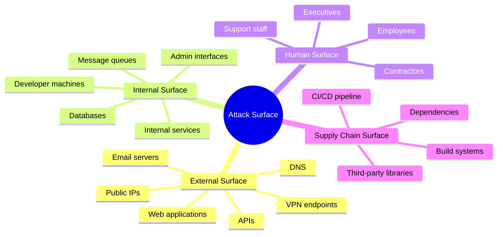
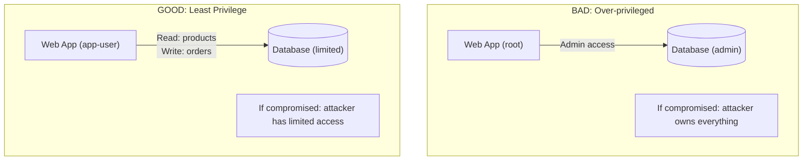
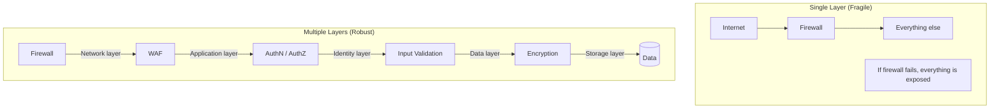
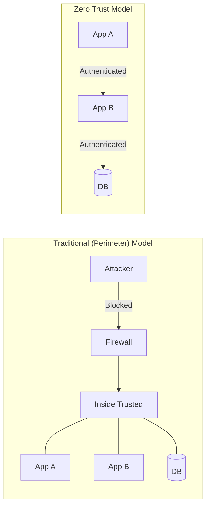
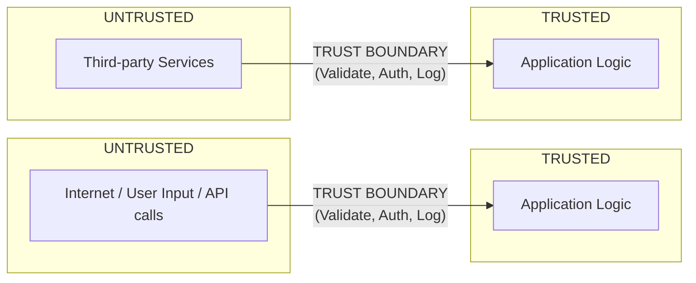
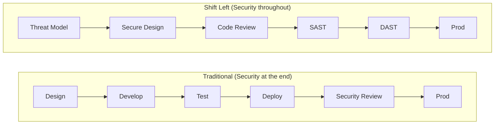
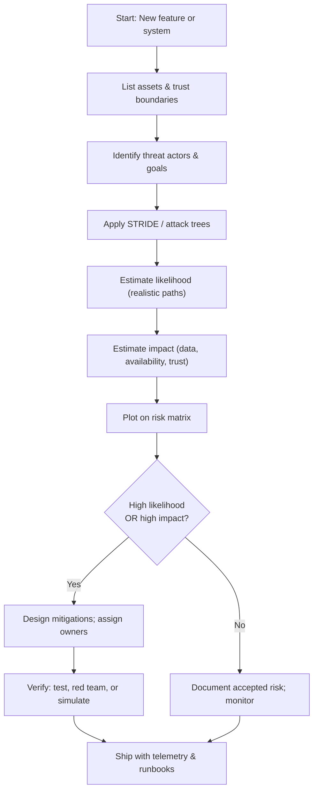

> **Complexity**: `[MEDIUM]`
>
> **Time to Complete**: 25-30 minutes
>
> **Prerequisites**: [Systems Thinking Track](/platform/foundations/systems-thinking/) (recommended)
>
> **Track**: Foundations

## What You'll Be Able to Do

After completing this module, you will be able to:

1. **Apply** attacker-mindset thinking to evaluate infrastructure designs and identify the paths of least resistance an adversary would exploit
2. **Analyze** real-world breaches (supply chain, lateral movement, credential theft) to extract defensive lessons for your own systems
3. **Design** threat models that enumerate attack surfaces, trust boundaries, and high-value targets for a given architecture
4. **Evaluate** security tradeoffs between usability, cost, and protection level when proposing defensive controls

---

The 2020 <!-- incident-xref: solarwinds-2020 -->SolarWinds supply-chain compromise reached 18,000 organizations through a trusted software update, demonstrating that attackers do not need to be smarter than defenders — they only need one way in while defenders protect everything. For the full case study, see [CI/CD Pipelines](../../../prerequisites/modern-devops/module-1.3-cicd-pipelines/).

This module teaches the security mindset: thinking like an attacker to build like a defender. The goal is not paranoia for its own sake, but disciplined imagination — the habit of asking what could go wrong before an incident answers that question for you at three in the morning.

---

## Why This Module Matters

Every system you build will be attacked. Not might be — will be. Automated scanners probe every public IP address on the internet often within hours of exposure. Credential-stuffing bots test stolen passwords against login forms continuously. Supply-chain adversaries monitor open-source maintainers for takeover opportunities. The question is not whether someone will try, but when they will succeed unless you design with that assumption from the start.

Security is not a feature you bolt on before launch or a checkbox you tick for auditors. It is a way of thinking that influences every design decision, every line of code, every operational process, and every vendor relationship. Developers who internalize this mindset build better systems even when they are not on a dedicated security team, because they notice implicit trust, oversized permissions, and missing validation before those gaps become headlines.

The modules that follow in this Security Principles track — defense in depth, identity and access, secure by default — each implement specific controls. This module establishes the mental model those controls serve. Without attacker-minded thinking, you will deploy firewalls and still leave paths open; without threat modeling, you will harden the wrong components; without understanding security theater, you will pass audits while remaining exposed. The sections below build that foundation deliberately, from asymmetry and attack surface through principles, trust, culture, and repeatable decision frameworks you can use in design reviews.

> **The Castle Analogy**
>
> Medieval castles were not just walls. They had moats, drawbridges, murder holes, multiple curtain walls, keeps, and escape routes. Each layer assumed the previous one might fail. Architects thought like attackers: "If I breach the outer wall, what stops me next?" Security engineering applies the same logic: assume breach, plan for failure, and layer defenses so that no single mistake becomes total compromise.

---

## Part 1: Thinking Like an Attacker

### 1.1 The Attacker's Advantage

Defenders and attackers operate under fundamentally different economics, and misunderstanding that asymmetry is one of the most expensive mistakes in platform engineering. A defender must protect every entry point, every service account, every dependency, and every human with access — continuously, under budget pressure, and without breaking the workflows legitimate users depend on. An attacker needs only one path that works once, at a moment when monitoring is thin or response is slow.

That imbalance is not a temporary inconvenience you can fix with better tooling alone. It is structural. The defender's job is to be right every time across an expanding surface; the attacker's job is to be right once on the weakest link. Attackers also choose timing — holidays, on-call rotations, major product launches when change velocity is high and scrutiny is divided. They choose technique — reusing a known exploit against an unpatched service costs far less than developing a zero-day. They choose target — the forgotten staging API, the contractor VPN account, the CI pipeline secret in a public fork.

| Defender | Attacker |
| :--- | :--- |
| Must protect everything | Only needs one way in |
| Must be right every time | Only needs to be right once |
| Works within constraints | Operates outside rules and ethics |
| Limited budget and headcount | Can be well-funded or fully automated |
| Must balance usability | Does not care about user experience |

The table above is not an argument for hopelessness. It is an argument for prioritization. You cannot harden everything equally, so you must identify what adversaries want, how they typically get it, and where your controls actually break their path — not where they merely appear to exist on a dashboard.

### 1.2 The Economics of Attacker Asymmetry

Think of security investment as buying time and visibility, not guaranteed invulnerability. Each control should increase the cost, skill, or noise required for an adversary to reach a high-value asset. A well-configured firewall does not make you unhackable; it forces the attacker to find another path, ideally one you have also instrumented. MFA does not eliminate phishing; it removes password-only compromise as a viable mass-scale technique for many threat actors.

Automated attack infrastructure changed the math again. A single operator can scan millions of hosts for default credentials, vulnerable Struts endpoints, or exposed S3 buckets without manual effort per target. A misconfiguration that might once have survived for days on the public internet can now be found in minutes. That is why "we are too small to be targeted" is dangerously wrong: opportunistic automation does not care about your revenue or headcount.

For platform teams, asymmetry also appears in internal politics. Shipping features has visible revenue impact; tightening default RBAC or adding admission policies has invisible risk reduction until something fails to deploy. The security mindset makes that invisible work legible by tying it to concrete threat scenarios and measurable reduction in blast radius, not vague fear.

### 1.3 The Attack Surface

Your **attack surface** is the sum of every interface, identity, dependency, and human behavior an adversary could interact with to move toward a goal. Surfaces are not only public HTTP endpoints. They include internal admin panels reachable from a compromised laptop, build pipelines that pull container images without digest pinning, support staff with broad impersonation rights, and third-party OAuth integrations that receive long-lived tokens.

The mind map below organizes surfaces into four buckets that threat models commonly use. External surfaces are what traditional perimeter thinking covers. Internal surfaces become critical once any foothold exists — and modern breaches assume that foothold will happen. The human surface remains the most unpredictable because social engineering exploits urgency, authority, and helpfulness rather than buffer overflows. The supply chain surface has grown faster than most teams' review processes as dependencies, SaaS tools, and CI plugins multiply.

```mermaid
mindmap
  root((Attack Surface))
    External Surface
      Web applications
      APIs
      DNS
      Email servers
      VPN endpoints
      Public IPs
    Internal Surface
      Internal services
      Databases
      Message queues
      Admin interfaces
      Developer machines
    Human Surface
      Employees
      Contractors
      Support staff
      Executives
    Supply Chain Surface
      Third-party libraries
      CI/CD pipeline
      Build systems
      Dependencies
```

Reducing attack surface is not the same as hiding it. Security through obscurity — unpublished admin URLs, security by IP allowlist alone — fails the moment a directory is leaked or a partner network is compromised. Effective reduction removes unnecessary services, narrows permissions, deletes unused integrations, and requires authentication at boundaries that previously trusted network location.

> **Pause and predict**: Which part of your attack surface is historically the most unpredictable and easily compromised?

> **Try This (2 minutes)**
>
> List 5 things in your system that could be attacked:
> 1. ____________________
> 2. ____________________
> 3. ____________________
> 4. ____________________
> 5. ____________________
>
> Now think: which one would YOU attack if you were malicious?

### 1.4 Attacker Motivation and Threat Actors

Not all attackers want the same outcome, and your defensive investment should reflect who actually cares about your assets. A script kiddie scanning for default passwords poses a different risk than a ransomware group targeting backup deletion, or a nation-state actor seeking long-term persistence in a supply chain. Motivation shapes patience, budget, and acceptable noise level — factors that determine whether they will phish one employee or spend months compromising a software vendor.

| Attacker Type | Motivation | Typical Targets | Sophistication |
|---------------|------------|-----------------|----------------|
| **Script kiddies** | Fun, bragging rights | Easy targets | Low |
| **Hacktivists** | Political or social cause | Symbolic targets | Low–Medium |
| **Criminals** | Financial gain | Data, ransomware | Medium–High |
| **Competitors** | Business advantage | Trade secrets | Medium |
| **Nation-states** | Intelligence, disruption | Critical infrastructure | Very high |
| **Insiders** | Revenge, financial pressure | Whatever they can access | Varies |

The question "Who would want to attack us, and why?" is the entry point to threat modeling, not a one-time workshop exercise. A small e-commerce site faces criminals after payment data and opportunistic defacement. A healthcare provider faces both criminals — medical records often sell for more than card numbers on illicit markets — and intelligence collectors. A defense contractor faces patient adversaries willing to invest in supply-chain compromise because the payoff justifies the cost.

Your answers should change what you log, what you segment, and what you test. If insiders are plausible, broad admin roles and shared break-glass accounts become unacceptable. If supply-chain compromise is plausible, unsigned artifacts and unpinned dependencies become priority fixes rather than backlog items.

### 1.5 Threat Modeling: STRIDE and Attack Trees

Threat modeling is the structured practice of identifying what can go wrong before you write the production YAML. You do not need a proprietary tool to start; you need a repeatable method that forces the team to name assets, actors, entry points, and mitigations. Two complementary approaches appear throughout industry guidance: **STRIDE** for categorizing threats at trust boundaries, and **attack trees** for decomposing how an goal could be achieved step by step.

**STRIDE** assigns six threat categories to components and data flows: **S**poofing identity, **T**ampering with data, **R**epudiation (denying actions), **I**nformation disclosure, **D**enial of service, and **E**levation of privilege. When a user submits an order to an API gateway that forwards to a payment service, you ask STRIDE questions at each hop: Can someone spoof the user? Tamper with the order total? Read another tenant's data? Exhaust connection pools? Escalate from read-only to admin?

An **attack tree** starts with an adversary goal at the root — for example, "Exfiltrate customer database" — and branches into sub-goals: gain network access, obtain database credentials, bypass logging, exfiltrate without detection. Leaves become concrete techniques: phish developer, exploit unpatched VPN, steal kubeconfig from laptop, abuse over-privileged service account. Trees make clear that multiple paths may exist and that blocking one branch does not eliminate the goal unless you address others.

For Kubernetes platforms, a lightweight threat-modeling session might enumerate: cluster admin credentials, etcd backups, ingress controllers, admission webhooks, image registries, and CI tokens with deploy rights. You then map STRIDE categories to each and prioritize mitigations by likelihood and impact. The Decision Framework later in this module formalizes that prioritization; the Hands-On Exercise walks a simplified version for a web application.

---

## Part 2: Security Principles

The principles below are durable because they describe constraints of distributed systems and human organizations, not vendor features. Tools change; least privilege and fail-secure defaults remain relevant across bare metal, VMs, and Kubernetes 1.35 clusters. Read each principle as a design test you apply during architecture reviews, not as a slogan for slide decks.

### 2.1 Principle of Least Privilege

Least privilege means every identity — human, service account, CI job, batch processor — receives only the permissions required for its current function, for the minimum time required. The principle fights the natural tendency toward convenience: shared admin roles, wildcard IAM policies, and cluster-admin bindings that "we will tighten later."

When a web application runs as root inside a container and connects to a database with admin credentials, compromise of any layer becomes total compromise. When the same application runs as a non-root user with read access to product tables and insert access only to order tables, an exploited dependency might leak catalog data but cannot drop schemas or read unrelated tenants. Blast radius shrinks even when prevention fails.

```mermaid
graph TD
    subgraph BAD ["BAD: Over-privileged"]
        App1["Web App (root)"] -->|Admin access| DB1[("Database (admin)")]
        note1["If compromised: attacker owns everything"]
    end

    subgraph GOOD ["GOOD: Least Privilege"]
        App2["Web App (app-user)"] -->|Read: products<br/>Write: orders| DB2[("Database (limited)")]
        note2["If compromised: attacker has limited access"]
    end
```

In Kubernetes, least privilege appears in RBAC RoleBindings scoped to namespaces, Pod Security Standards that forbid privileged containers, and projected service account tokens with audience and lifetime limits. The platform team's job is to make the secure path the default path: narrow Roles generated from templates, guardrails that reject cluster-admin for application teams, and break-glass access that is time-bound and logged.

Least privilege also applies to humans and automation equally. A CI pipeline that deploys to production should not reuse the same cloud role that can read every secret in the estate; a database migration job needs DDL rights for minutes, not permanent admin. Time-bound elevation — just-in-time access with approval and automatic expiry — converts standing privilege into an exception that leaves an audit trail. When reviewing RBAC manifests, ask whether each verb and resource is necessary for the workload's actual behavior, not whether it is convenient for the first sprint demo.

### 2.2 Defense in Depth

Defense in depth rejects the fantasy of a perfect outer wall. Firewalls, WAFs, authentication, input validation, encryption, and audit logging each address different failure modes. When one layer fails — misconfigured rule, stolen session token, zero-day in a dependency — independent layers still impede the attacker. Independence matters: if every layer fails together because they share one admin password or one flat network, you do not have depth; you have duplicates.

```mermaid
graph TD
    subgraph Single ["Single Layer (Fragile)"]
        Int1[Internet] --> FW1[Firewall]
        FW1 --> Sys1[Everything else]
        note1[If firewall fails, everything is exposed]
    end

    subgraph Multiple ["Multiple Layers (Robust)"]
        FW2[Firewall] -->|Network layer| WAF[WAF]
        WAF -->|Application layer| Auth[AuthN / AuthZ]
        Auth -->|Identity layer| Val[Input Validation]
        Val -->|Data layer| Enc[Encryption]
        Enc -->|Storage layer| Storage[(Data)]
    end
```

Module 4.2 explores defense in depth in implementation detail. At the mindset level, the lesson is to ask, for each critical asset, "What still protects this if the previous control fails?" If the honest answer is "nothing," you have identified your next engineering priority regardless of audit status.

### 2.3 Zero Trust

Zero trust does not mean "trust nothing and block everyone." It means **never trust, always verify** — identity and authorization decisions happen per request, per connection, per API call, without assuming that network location implies integrity. The traditional perimeter model treated internal IP ranges as safe; attackers who phish a VPN user or compromise a laptop inherit that trust and move laterally with minimal friction.

> **Pause and predict**: If you adopt a zero trust model, how does the role of your traditional perimeter firewall change?

```mermaid
graph LR
    subgraph Trad ["Traditional (Perimeter) Model"]
        Out1[Attacker] -->|Blocked| FW[Firewall]
        FW --> In1[Inside Trusted]
        In1 --- AppA1[App A]
        In1 --- AppB1[App B]
        In1 --- DB1[(DB)]
    end

    subgraph Zero ["Zero Trust Model"]
        AppA2[App A] -- Authenticated --> AppB2[App B]
        AppB2 -- Authenticated --> DB2[(DB)]
    end
```

NIST SP 800-207 frames zero trust around policy decision points, continuous verification, and encrypted communication regardless of network path. For platform engineers, that translates to mutual TLS between services, identity-aware proxies, short-lived credentials, and network policies that default deny even inside the cluster. The perimeter firewall still filters obvious noise, but it is no longer the primary authorization mechanism.

### 2.4 Fail Secure

Fail secure means that when a control errors, times out, or becomes unavailable, the system defaults to the safer state — usually deny — rather than the convenient state. Fail open designs prioritize uptime metrics over confidentiality and integrity; attackers learn to trigger dependency failures because those failures open doors.

| Fail Open (Dangerous) | Fail Secure (Correct) |
| :--- | :--- |
| **Auth service down:** Allow all requests so users are not blocked. *Result:* Authentication bypass. | **Auth service down:** Deny requests until service recovers. *Result:* Outage, but no impersonation. |
| **Validation error:** Skip validation to avoid crashing. *Result:* Malicious input accepted. | **Validation error:** Reject the request. *Result:* Some legitimate traffic fails; attacks blocked. |

The secure default is deny. Product and security leaders must align on that tradeoff explicitly, because fail secure causes visible incidents during partial outages while fail open causes invisible compromise. Monitoring should alert when security dependencies degrade so operators know they are in a heightened-risk state rather than accidentally operating open.

> **Try This (2 minutes)**
>
> For each scenario, which is the secure default?
>
> | Scenario | Fail Open | Fail Secure |
> |----------|-----------|-------------|
> | Firewall crashes | Allow traffic | Block traffic |
> | Permission check fails | Grant access | Deny access |
> | Rate limiter errors | Allow requests | Block requests |
> | Certificate validation fails | Allow connection | Reject connection |
>
> (All should be Fail Secure)

---

## Part 3: Security vs. Security Theater

### 3.1 What is Security Theater?

**Security theater** is activity that produces the feeling or appearance of safety without measurably reducing risk. It thrives where compliance metrics replace outcome metrics: password rotation policies that encourage predictable patterns, annual penetration tests that never retest findings, or firewall purchases that never receive rule hygiene. Theater is seductive because it is easier to demonstrate than real improvement — a policy document ships faster than an architecture change.

Consider password rotation every thirty days with complexity rules. Users respond rationally to annoyance: they choose `Spring2026!`, increment a digit, or write passwords on sticky notes. Auditors see a policy; attackers see guessable patterns. Real security might instead use long passphrases, phishing-resistant MFA, and breach-password detection — controls tied to how credentials actually leak.

Theater also appears in network security when a team celebrates "we have a firewall" while exception rules accumulated over years create paths from DMZ web tiers directly to sensitive data stores. The device exists; the configuration does not enforce the intended trust model. Encryption theater stores keys alongside ciphertext. Compliance theater passes an audit while critical vulnerabilities remain open because they were out of scope for the assessor's sample.

### 3.2 How to Spot Security Theater

Distinguishing theater from effective control requires asking outcome questions: Did this measure stop or detect a realistic attack in testing? Does it address a threat in our model? Can we measure its effect? Theater measures presence — "MFA enabled for 95% of users" — without measuring whether the remaining five percent hold admin rights, or whether MFA can be bypassed via help-desk social engineering.

| Real Security | Security Theater |
|---------------|------------------|
| Reduces actual risk | Reduces perceived risk |
| Based on threat modeling | Based on compliance checkboxes |
| Measured by outcomes | Measured by presence |
| Evolves with threats | Static, set-and-forget |
| Tested regularly | Assumed to work |

Red teams, game days, and chaos experiments that include security dependencies are antidotes to theater because they produce falsifiable results. If your control cannot survive a structured test, it was never a control — it was décor.

### 3.3 The Security vs. Usability Trade-off

Every security measure consumes attention, latency, or workflow steps. The art is not maximizing security in isolation but finding points on the spectrum where protection is strong enough for the threat and friction is low enough that users comply without building shadow-IT workarounds. SSO with push MFA sits in a favorable quadrant for many enterprises: high security relative to passwords alone, high usability relative to hardware tokens for every session.

```mermaid
quadrantChart
    title The Security-Usability Spectrum
    x-axis Low Usability --> High Usability
    y-axis Low Security --> High Security
    quadrant-1 Goal: Max Security & Acceptable Usability
    quadrant-2 High Security, Low Usability
    quadrant-3 Low Security, Low Usability
    quadrant-4 Low Security, High Usability
    "Air-gapped systems": [0.15, 0.85]
    "Multi-person auth": [0.25, 0.80]
    "No remote access": [0.10, 0.75]
    "SSO (Single Sign-On)": [0.85, 0.85]
    "Push Notifications MFA": [0.80, 0.75]
    "Role-based access": [0.75, 0.80]
    "No authentication": [0.90, 0.15]
    "Everyone is admin": [0.85, 0.10]
```

**Evaluate** tradeoffs explicitly when proposing controls: who bears the friction, what risk remains, and what bypass behavior you incentivize. Requiring hardware security keys for all employees including call-center staff may reduce phishing dramatically but increase lockout support load; SMS MFA is easier but vulnerable to SIM swap. Document the decision so future teams understand it was a reasoned balance, not an arbitrary default.

> **Hypothetical scenario:** A large organization invests heavily in perimeter firewalls — multi-million-dollar appliances, twenty-four-hour monitoring, intrusion detection enabled. Dashboards stay green for months. Meanwhile, hundreds of "temporary" firewall exceptions accumulated over many years: contractor access that was never revoked, debug ports opened during an incident and forgotten, rules allowing web-tier hosts to reach database subnets directly.

An attacker exploits a known vulnerability in a public web application — a patch was available but not applied. They never need to "break through" the firewall in a cinematic sense; they walk through an exception rule that was meant to be short-lived. Data exfiltration continues undetected for roughly two months because monitoring focused on blocked connections at the edge, not anomalous queries from an application server that was already allowed to talk to the database. The lesson: real security is configuration hygiene, ownership, and verification — not hardware presence alone.

Separately, the 2017 <!-- incident-xref: equifax-2017 -->Equifax breach illustrates a different failure mode: an unpatched Apache Struts vulnerability ([CVE-2017-5638](https://struts.apache.org/docs/s2-045.html)) in a public-facing application. A patch had been available for roughly two months before exploitation. Attackers remained undetected for approximately seventy-six days and accessed sensitive data affecting roughly 147 million consumers; legal settlements and total organizational costs reached into the hundreds of millions of dollars. The root cause was not firewall rule rot but patch and asset-management breakdown — yet dashboards can stay green while either failure mode proceeds. For the full Equifax case study, see [Docker Fundamentals](../../../prerequisites/cloud-native-101/module-1.2-docker-fundamentals/).

---

## Part 4: Trust and Verification

### 4.1 The Problem with Trust

Trust is the silent expansion of attack surface. Every implicit trust statement — "employees are honest," "vendors are safe," "internal traffic is fine," "this library has always been clean" — is a decision not to verify at a boundary. Some trust is necessary; systems cannot re-authenticate every nanosecond. But unexamined trust becomes the path adversaries prefer because verification is where you would stop them.

Supply chain attacks exploit vendor trust. Lateral movement exploits internal network trust. Dependency confusion exploits package registry trust. Mobile and SPA clients are not trustworthy just because your team wrote the app; attackers reverse engineer clients and replay or forge API calls. Mature teams replace "we trust X" with "we trust X for purpose Y until time T, verified by mechanism Z, revocable by process W."

Trust should be explicit in architecture documents, minimal in scope, continuously verified where feasible, and revocable without a multi-week change window. When revocation takes longer than attacker dwell time, your trust model is effectively permanent — which is fine for public certificate roots, dangerous for contractor VPN access.

### 4.2 Trust Boundaries

A **trust boundary** is any line where data or execution crosses from one trust level to another: internet to ingress, ingress to service, service to database, cluster to cloud API, CI runner to production deploy. Boundaries are where controls concentrate because everything upstream is assumed potentially hostile.

```mermaid
graph LR
    subgraph Untrusted ["UNTRUSTED"]
        Int[Internet / User Input / API calls]
    end

    subgraph Trusted ["TRUSTED"]
        App[Application Logic]
    end

    Int -- "TRUST BOUNDARY<br/>(Validate, Auth, Log)" --> App

    subgraph Untrusted2 ["UNTRUSTED"]
        Ext[Third-party Services]
    end

    subgraph Trusted2 ["TRUSTED"]
        App2[Application Logic]
    end

    Ext -- "TRUST BOUNDARY<br/>(Validate, Auth, Log)" --> App2
```

Every trust boundary should implement a consistent bundle: authenticate callers, authorize actions against policy, validate and normalize input, apply rate limits to slow abuse, and emit structured logs with correlation identifiers for later investigation. Skipping any element at a boundary moves work to incident responders who must reconstruct intent from incomplete telemetry.

In Kubernetes, boundaries appear between namespaces, between cluster and cloud provider APIs, and between Pods and the host via the service mesh or CNI policy. Platform engineers encode boundaries as NetworkPolicies, admission rules (OPA Gatekeeper, Kyverno), and IAM roles for service accounts — illustrative tools, but the principle precedes the vendor.

### 4.3 Verification Techniques

Verification is how trust earns its keep. Different assets require different mechanisms; there is no single "crypto fix" for organizational security.

| What to Verify | Technique |
|----------------|-----------|
| User identity | Passwords, MFA, passkeys, client certificates |
| User permissions | RBAC, ABAC, policy engines |
| Data integrity | Checksums, HMACs, digital signatures |
| Data source | Code signing, certificate pinning, signed SBOMs |
| Code integrity | Reproducible builds, signed images, admission verification |
| Request legitimacy | CSRF tokens, nonces, replay-protected timestamps |

Verification must fail closed. If signature checking cannot run because a key service is down, the build should stop rather than ship unsigned artifacts. If authorization middleware throws an exception, the request should be denied and alerted, not allowed "temporarily" while on-call investigates.

Operational verification also means revisiting assumptions on a schedule. Certificates expire, API keys leak, maintainers transfer packages, and employees change roles — trust that was valid last quarter may be stale today. Pair technical verification with process verification: Can you revoke a compromised service account in minutes? Can you prove which version of a dependency ran in production last Tuesday? Without answers, verification is a point-in-time snapshot rather than a living control.

> **Try This (3 minutes)**
>
> Draw the trust boundaries in your system:
>
> 1. Where does untrusted data enter?
> 2. What do you implicitly trust that you shouldn't?
> 3. Where are you NOT validating input?

---

## Part 5: Building Security In

### 5.1 Shift Left

**Shift left** means moving security activities earlier in the software lifecycle — when changes are cheap, context is fresh, and rollback is trivial. A threat-model finding during design might cost an afternoon to fix. The same flaw discovered in production during a launch freeze costs weeks, executive attention, and customer trust.

> **Pause and predict**: At what stage of the software development lifecycle do you think a vulnerability is most expensive to remediate?

```mermaid
graph LR
    subgraph Trad ["Traditional (Security at the end)"]
        direction LR
        Des1[Design] --> Dev1[Develop]
        Dev1 --> Test1[Test]
        Test1 --> Dep1[Deploy]
        Dep1 --> Sec1[Security Review]
        Sec1 --> Prod1[Prod]
    end

    subgraph Shift ["Shift Left (Security throughout)"]
        direction LR
        TM[Threat Model] --> SD[Secure Design]
        SD --> CR[Code Review]
        CR --> SAST[SAST]
        SAST --> DAST[DAST]
        DAST --> Prod2[Prod]
    end
```

Shift left is not "make developers do security alone." It is embed specialists, patterns, and automated gates so security expertise scales. Platform teams contribute secure templates, pre-wired CI checks, and policy-as-code defaults so product teams inherit protection without becoming full-time auditors.

### 5.2 Secure Development Practices

The table below maps practices to lifecycle phases. None replaces the others; SAST without threat modeling finds implementation bugs but misses wrong architecture. Penetration testing without fixing recurring CI findings repeats the same expensive lesson annually.

| Practice | What It Does | When |
|----------|--------------|------|
| **Threat modeling** | Identifies assets, actors, and mitigations | Design |
| **Secure coding standards** | Prevents common vulnerability classes | Implementation |
| **Code review** | Catches logic and auth mistakes humans see | Pre-merge |
| **SAST** | Statically scans source for patterns | CI pipeline |
| **DAST** | Tests running applications | Staging |
| **Dependency scanning** | Flags known CVEs in libraries | CI pipeline |
| **Secret scanning** | Blocks credential commits | Pre-commit, CI |
| **Penetration testing** | Finds chains automation misses | Periodic |

For cloud-native platforms, extend the list with image scanning, SBOM generation, signed commits, and admission policies that reject privileged Pods or `latest` tags in production namespaces. Each practice should link back to threats in your model; otherwise it becomes theater scanning.

### 5.3 Security as Culture

Tools and policies fail when culture treats security as an external gate. Good culture asks "what's the threat model?" in design reviews the same way it asks about scalability. It reports suspicious email without shame, treats near-misses as learning opportunities, and rewards reduction of default permissions rather than only feature velocity.

| Bad Culture | Good Culture |
| :--- | :--- |
| "Security is the security team's problem" | "Security is everyone's job" |
| "We'll add security later" | "We design for security up front" |
| "That's too paranoid" | "What's the threat model?" |
| "It's internal, doesn't matter" | "All data deserves appropriate protection" |
| "Nobody would do that" | "Assume motivated, capable adversaries" |
| "We've never been hacked" | "We haven't detected a hack yet" |

Culture change is slow but decisive. A single heroic security engineer cannot review every pull request in a growing organization; habits, templates, and automated guardrails multiply their influence. Leadership behavior matters: if executives bypass MFA, engineers learn that rules are optional.

---

## Patterns & Anti-Patterns

### Patterns That Build Real Security

**Threat-model before major architecture changes.** Schedule a ninety-minute session when adding a new data store, external integration, or multi-tenant boundary. Document assets, actors, STRIDE categories, and mitigations in the same ticket as the design doc. Revisit when the design changes materially — threat models are living artifacts, not launch gate paperwork.

**Assume breach in monitoring and response.** Design logging so that compromise of one credential does not erase evidence. Forward security-relevant logs to tamper-evident storage. Practice incident runbooks that do not assume the attacker is still outside the firewall. Assume breach turns abstract zero trust into concrete detection queries.

**Make secure defaults the lazy path.** New repositories start with branch protection, secret scanning, and CI security jobs enabled. New namespaces inherit deny-all NetworkPolicies with documented exceptions. New service accounts receive generated Roles rather than cluster-admin because someone was in a hurry.

**Instrument trust boundaries before debating exotic controls.** You cannot verify what you cannot see. Ensure every boundary in Part 4 emits authentication failures, authorization denials, validation errors, and latency anomalies with enough context to reconstruct an attack path during an incident. Many breaches persisted for weeks because logs showed green aggregate error rates while specific routes leaked data silently.

**Measure outcomes, not checkbox counts.** Track mean time to detect credential abuse, percentage of services with mTLS, time to patch critical CVEs on internet-facing assets, and repeat findings from pen tests. Metrics tied to threats reveal theater quickly.

### Anti-Patterns to Avoid

| Anti-Pattern | Why It Fails | Better Approach |
|--------------|--------------|-----------------|
| **Perimeter-only thinking** | One foothold yields full internal access | Zero trust, segmentation, per-service auth |
| **Security as final gate** | Architectural flaws are expensive to fix | Shift left: threat model and review in design |
| **Compliance equals secure** | Audits sample; attackers do not | Map controls to threats; test continuously |
| **Shared break-glass admin** | Undifferentiated access hides insider and APT activity | Time-bound, attributed elevation with logging |
| **Unpinned dependencies in CI** | Supply-chain compromise auto-deploys | Pin digests; verify signatures; manual promotion |
| **Fail open on dependency outage** | Attackers trigger failures to bypass controls | Fail secure with graceful degradation plans |

---

## Decision Framework: Threat Modeling and Risk Prioritization

Use this framework when leadership asks "What should we fix first?" or when a design review stalls on vague security concerns. The goal is repeatable prioritization tied to your threat model, not fear-driven shopping lists.

```mermaid
flowchart TD
    Start["Start: New feature or system"] --> Assets["List assets & trust boundaries"]
    Assets --> Actors["Identify threat actors & goals"]
    Actors --> STRIDE["Apply STRIDE / attack trees"]
    STRIDE --> Likelihood["Estimate likelihood (realistic paths)"]
    Likelihood --> Impact["Estimate impact (data, availability, trust)"]
    Impact --> Matrix["Plot on risk matrix"]
    Matrix --> High{"High likelihood\nOR high impact?"}
    High -->|Yes| Mitigate["Design mitigations; assign owners"]
    High -->|No| Accept["Document accepted risk; monitor"]
    Mitigate --> Verify["Verify: test, red team, or simulate"]
    Verify --> Done["Ship with telemetry & runbooks"]
    Accept --> Done
```

| Risk quadrant | Example scenario | Typical response |
|---------------|------------------|------------------|
| **High impact, high likelihood** | Public admin API without auth on customer PII | Block release; fix immediately |
| **High impact, low likelihood** | Nation-state supply-chain compromise | Defense in depth, signing, monitoring, tabletop exercises |
| **Low impact, high likelihood** | Automated scraping of non-sensitive catalog | Rate limits, bot detection, cost controls |
| **Low impact, low likelihood** | Defacement of static marketing site | Basic hardening; accept with monitoring |

When **evaluating security tradeoffs**, score each proposed control against the same matrix: does it materially move a realistic scenario down in likelihood or impact, and what usability or cost does it impose? A control that only addresses a low-likelihood Hollywood plot while ignoring unpatched internet-facing services is misprioritized spend. Revisit the matrix quarterly or after major incidents — threat landscapes and your architecture both change.

For Kubernetes platform teams, a practical first pass might rank: cluster-admin bindings in application namespaces, anonymous RBAC, public exposure of kube-apiserver, unscoped cloud credentials in Pods, and missing audit log retention — before investing in exotic deception technology. The framework does not dictate answers; it forces explicit comparison so **design** decisions for threat models and **evaluate** decisions for tradeoffs happen in the open.

---

## Part 6: From Mindset to Daily Practice

The security mindset becomes valuable when it changes Tuesday afternoon decisions, not only when it inspires a quarterly slide deck. During design reviews, ask one attacker-minded question before approving: "If I had credentialed access to this component, what is the fastest path to customer data or production deploy rights?" That question surfaces forgotten admin endpoints, shared secrets in environment variables, and CI jobs with cluster-admin more reliably than generic "is this secure?" prompts.

During code review, treat authentication and authorization changes as high-risk diffs even when they look small. A single middleware ordering bug can skip checks for an entire route tree. A "temporary" bypass for local development that merges to main is a permanent hole. Reviewers who think like attackers look for implicit trust in new integrations: Does this webhook verify signatures? Does this cache key include tenant identifier? Does this debug flag compile out in production builds?

During incidents, resist the urge to treat the initial entry vector as the whole story. Real-world breaches analyzed in industry reports — supply-chain compromise, credential theft, lateral movement after VPN access — almost always involve chained failures. Your post-incident review should ask which layer was supposed to stop stage two and why it did not, not only how stage one happened. That habit feeds threat models with evidence instead of imagination.

Platform engineers can institutionalize the mindset with lightweight rituals: a five-minute STRIDE pass on every RFC that touches identity or data stores; a monthly review of firewall or security-group rules for stale exceptions; pairing with application teams on one threat-modeling session per sprint until the method spreads. None of this requires buying a new product. It requires treating security thinking as part of engineering craftsmanship, the same way you treat idempotency, observability, and rollback design.

When you **analyze** breaches in the news, read for defensive lessons rather than schadenfreude. Equifax emphasized patch SLAs and asset inventory for internet-facing middleware. SolarWinds emphasized signed builds and vendor trust boundaries. Ransomware cases emphasize backup integrity and segmentation. Keep a living "lessons extracted" note linked from your team wiki so new hires inherit institutional memory without repeating the same post-mortem discoveries.

Finally, connect mindset to metrics leadership understands. Executives rarely fund "more security culture"; they fund reduced fraud losses, faster mean time to detect credential abuse, or fewer emergency patches during launches. Translate attacker-minded improvements into those terms. When you **evaluate** a tradeoff between stricter deploy gates and developer velocity, quantify the cost of an undetected production compromise — recovery time, customer notification, regulatory exposure — so the conversation compares real balances rather than stereotypes about security slowing innovation.

Teaching the security mindset to new engineers works best through guided practice, not policy lectures alone. Pair them on a threat-modeling exercise during their first month, review one real incident write-up together, and assign a small hardening task with measurable before-and-after risk reduction. Habits formed early persist when they later own production services without daily security oversight. That investment pays off the first time they catch an implicit trust assumption before it ships.

---

## Did You Know?

- **The term "hacker"** originally described skilled, creative exploration of systems at MIT and elsewhere. Malicious connotations grew with media coverage in the 1980s; some communities still distinguish "hackers" (builders) from "crackers" (breakers), though popular usage collapsed the terms.

- **The first computer worm (Creeper, 1971)** was an experimental self-replicating program on ARPANET that displayed the message "I'm the creeper, catch me if you can." The Reaper program followed to remove it — an early precursor to antivirus concepts, described in historical accounts of ARPANET research.

- **The human element** — social engineering, errors, and misuse — features in roughly two-thirds of breaches per the [Verizon Data Breach Investigations Report](https://www.verizon.com/business/resources/reports/dbir/). Attacks far more often combine stolen credentials and phishing than rely on exotic technical exploits.

- **The Morris Worm (1988)**, written by Robert Morris, was among the first worms to spread broadly across the early internet, infecting roughly six thousand machines — estimated at about ten percent of connected systems at the time. Morris became the first person convicted under the U.S. Computer Fraud and Abuse Act; he later became a professor at MIT.

---

## Common Mistakes

| Mistake | Problem | Solution |
|---------|---------|----------|
| Security as afterthought | Retrofit costs multiply | Shift left; threat model during design |
| Trusting the network | Enables lateral movement | Zero trust; authenticate every hop |
| Assuming perimeter is enough | Insiders and supply chain ignored | Defense in depth across layers |
| Security through obscurity | Attackers discover hidden paths | Assume attackers know your architecture |
| Ignoring usability | Users bypass controls | Design friction-aware, phishing-resistant auth |
| One-time security review | Controls rot as systems evolve | Continuous testing and rule hygiene |
| Measuring presence not outcomes | Theater passes audits | Tie metrics to threats and detection |
| Skipping threat modeling | Fixes wrong priorities | STRIDE and attack trees before build |

---

## Quiz

1. **Scenario:** Your team has just deployed a new microservices architecture. You have implemented Web Application Firewalls, strict IAM roles, and tight network policies. During a weekend holiday, an attacker finds a single forgotten API endpoint from an old prototype that was never decommissioned and uses it to exfiltrate customer data. Which core concept of cybersecurity does this scenario best illustrate, and why?
   

   
Answer

   This scenario illustrates the attacker's advantage and the asymmetry of security. Defenders must secure every surface, endpoint, and configuration continuously, while attackers need only one mistake — here, a forgotten API — at a convenient time such as a holiday weekend when response may be slower. Applying attacker-mindset thinking during architecture reviews would have included asset inventory and decommissioning of prototype services as part of attack surface reduction.
   

2. **Scenario:** A developer writes a script to back up a specific application database to cloud storage. To ensure the script does not fail due to permissions, the developer assigns the script a service account with broad Database Administrator and Storage Administrator roles. A month later, an attacker exploits a vulnerability in the script's logging library and deletes the entire production database cluster. Which security principle was violated, and how did it contribute to the outcome?
   

   
Answer

   This violates the principle of least privilege. Sweeping administrative rights expanded blast radius so a compromise of a non-critical logging dependency became catastrophic cluster destruction. Scoped permissions limited to read on the target database and write on a specific backup bucket would have confined the attacker even after the library flaw was exploited.
   

3. **Scenario:** A company mandates that all employees must change their domain passwords every thirty days with complex composition rules. During a penetration test, the red team compromises accounts using seasonal passwords like "Spring2026!" and sticky notes under keyboards. What concept does this policy represent, and why did it fail?
   

   
Answer

   This is security theater: it appears rigorous but ignores human behavior and measurable risk reduction. Predictable rotation patterns and written-down passwords weaken defenses compared to long passphrases, breach-password checks, and phishing-resistant MFA. Real security focuses on outcomes — credential theft resistance — not checkbox compliance.
   

4. **Scenario:** Your company prepares for a major product launch. A final penetration test discovers that the authentication microservice passes session tokens in URL query parameters. Fixing this requires rewriting the auth flow, delaying launch by three weeks. Which secure development practice would have prevented this costly delay, and why?
   

   
Answer

   Shift-left threat modeling and secure design review during architecture would have flagged passing session tokens in URLs before implementation. Security discovered at the pen-test gate is expensive because dependencies on the flawed design are entrenched. Early design threat models and code review catch such flaws when they are still diagram changes rather than production rewrites.
   

5. **Scenario:** An attacker exploits a zero-day in your VPN appliance. Inside the network, they find microservices communicating over unencrypted HTTP with no mutual authentication and dump a customer database. Which architectural principles were missing, and how would they have mitigated the breach?
   

   
Answer

   The environment lacked defense in depth and zero trust. Relying on a single perimeter assumed internal traffic was safe, so VPN compromise became total internal access. Independent layers — mTLS, service-level authorization, encryption, and network segmentation — would have blocked lateral movement to the database even after VPN breach, containing blast radius.
   

6. **Scenario:** Your application calls a third-party fraud API on every registration. When the API times out during a promotion, fallback logic auto-approves registrations so sales are not lost. A botnet registers thousands of fake accounts. Which principle was violated, and what should have happened?
   

   
Answer

   The system violated fail secure by failing open when the fraud service was unavailable. Convenience during outage prioritized revenue over integrity. Correct behavior denies or queues registrations for manual review until verification returns, accepting some lost conversions rather than unbounded fraudulent accounts.
   

7. **Scenario:** Your CI/CD pipeline automatically deploys when a popular open-source library releases a new version. A maintainer transfer leads to a malicious patch that exfiltrates session cookies in production. What concept does this highlight, and how could it have been mitigated?
   

   
Answer

   This highlights supply-chain trust failure and implicit trust in package updates — a real-world breach pattern seen in incidents including supply-chain compromises such as the SolarWinds case referenced elsewhere in the curriculum. Mitigations include version pinning, manual promotion of dependencies, signature verification, CI secret scanning, and analyzing real-world supply-chain breaches to require human review before production deploy of changed artifacts.
   

8. **Scenario:** Your platform team debates requiring hardware security keys for all engineers versus allowing SMS-based MFA for convenience. Developers argue keys are easy to lose during travel; security argues SMS is phishable. How should you evaluate this tradeoff using the security mindset?
   

   
Answer

   Evaluate security tradeoffs by mapping each option to threat actors, likelihood, and impact in your threat model. Hardware keys materially reduce phishing and credential replay against engineer accounts that can merge to production — high impact if compromised. SMS MFA improves on passwords alone but remains vulnerable to SIM swap. Document accepted residual risk if you choose SMS for some roles, enforce keys for production deploy rights, and measure outcomes such as phishing test failure rates rather than assuming either control is "secure enough" without context.
   

---

## Hands-On Exercise

In this exercise you will **design** a mini threat model for a representative e-commerce web application, following the same asset-to-control sequence used in professional design reviews. Work through the four parts in order, filling each table with concrete names from your own experience where possible rather than abstract placeholders. Budget roughly thirty minutes working alone, or forty-five if you debate assumptions with a colleague who owns a different layer of the stack.

The scenario assumes you are building a site with user registration and login, a browsable product catalog, a session-backed shopping cart, and checkout that forwards payment card data to a compliant processor instead of storing primary account numbers on your servers. As you complete each worksheet below, ask which trust boundaries an attacker would cross to reach high-value assets and which STRIDE categories apply at each hop — that discipline connects the exercise directly to the threat-modeling concepts in Part 1.

| Asset | Value to Attacker |
|-------|-------------------|
| User credentials | Account takeover, reuse |
| Credit card numbers | Financial fraud |
| Customer PII | Identity theft, resale |
| Session tokens | Impersonation |
| Admin access | Full data exfiltration |

The asset table above lists starting points; add rows if your variant of the scenario introduces wallets, gift cards, or marketplace seller accounts. Next, identify who would pursue those assets and with what skill — criminal groups, opportunistic bots, and insiders see different ROI from the same vulnerability.

| Threat Actor | Motivation | Capability |
|--------------|------------|------------|
| Criminal | Payment data, PII | Medium–High |
| Opportunistic bot | Automated fraud | Medium |
| Insider support staff | Curiosity, profit | Medium |

With actors and assets named, map realistic attack vectors and rate likelihood versus impact honestly — a high-impact, high-likelihood cell is your priority mitigation queue. Do not assume every attack starts with a zero-day; stolen credentials and missing authorization checks appear far more often in breach data.

| Asset | Attack Vector | Likelihood | Impact |
|-------|---------------|------------|--------|
| User credentials | Phishing | High | Medium |
| User credentials | SQL injection | Medium | High |
| Credit cards | Skimming compromised checkout | Medium | High |
| Session tokens | XSS theft | Medium | High |
| Admin access | Stolen MFA-less account | Low | High |

Finally, pair each vector with preventive or detective controls you would actually ship in the next quarter, not hypothetical perfect defenses. Prefer controls that fail secure and reduce blast radius when they fail, consistent with the principles in Part 2.

| Attack Vector | Control | Type |
|---------------|---------|------|
| Phishing | MFA, security awareness | Preventive |
| SQL injection | Parameterized queries, ORM | Preventive |
| XSS | Content Security Policy, encoding | Preventive |
| Skimming | PCI-compliant processor, no local PAN storage | Preventive |
| Admin access | Least privilege, separate admin auth | Preventive |

When you finish, compare your control list against the Decision Framework matrix: did you prioritize high-likelihood paths to customer data first, or did you start with exotic threats? Revise once if your ordering disagrees with your own likelihood ratings.

- [ ] At least 4 assets identified
- [ ] At least 3 threat actors with motivations
- [ ] At least 5 attack vectors with likelihood/impact
- [ ] At least 5 controls mapped to attacks

---

## Key Takeaways Checklist

Use the checklist below as a self-assessment before continuing to Module 4.2. If any item feels uncertain, revisit the corresponding part of this module and note one concrete action you will take on a current project — for example, scheduling a threat-model session on a service you shipped last month or reviewing one security-group rule set for stale exceptions.

- [ ] Can you explain why attackers have a structural advantage over defenders?
- [ ] Can you define and identify your system's attack surface (external, internal, human, supply chain)?
- [ ] Do you understand the principle of least privilege and why it limits blast radius?
- [ ] Can you distinguish security theater from real security?
- [ ] Do you understand trust boundaries and what controls each boundary needs?
- [ ] Can you explain shift left and why early security is cheaper than late security?
- [ ] Can you apply STRIDE or attack trees at a basic level in a design review?
- [ ] Can you explain why supply chain attacks (like SolarWinds) are so dangerous?

---

## Next Module

Continue to [Module 4.2: Defense in Depth](../module-4.2-defense-in-depth/), where you will learn how to implement layered security controls so that when one layer fails — as the mindset assumes it eventually will — independent layers still protect critical assets and contain blast radius across network, identity, application, and data planes.

## Sources

- [OWASP Top Ten](https://owasp.org/www-project-top-ten/) — Canonical overview of the most critical web application security risks, updated on a multi-year cycle.
- [OWASP Threat Modeling](https://owasp.org/www-community/Threat_Modeling) — Community guidance on structured threat identification and mitigation.
- [OWASP Threat Modeling Cheat Sheet](https://cheatsheetseries.owasp.org/cheatsheets/Threat_Modeling_Cheat_Sheet.html) — Practical steps for running threat modeling sessions.
- [OWASP Application Security Verification Standard (ASVS)](https://owasp.org/www-project-application-security-verification-standard/) — Requirements framework for verifying application security controls.
- [NIST Cybersecurity Framework (CSF)](https://www.nist.gov/cyberframework) — High-level outcomes for govern, identify, protect, detect, respond, and recover (CSF 2.0).
- [NIST SP 800-207: Zero Trust Architecture](https://csrc.nist.gov/publications/detail/sp/800-207/final) — Authoritative definition of zero trust principles and deployment patterns.
- [NIST SP 800-53 Revision 5](https://csrc.nist.gov/publications/detail/sp/800-53/rev-5/final) — Security and privacy control catalog used across federal and enterprise programs.
- [MITRE ATT&CK](https://attack.mitre.org/) — Knowledge base of adversary tactics and techniques for mapping detections and controls.
- [CIS Critical Security Controls](https://www.cisecurity.org/controls) — Prioritized defensive actions with implementation guidance.
- [Verizon Data Breach Investigations Report (DBIR)](https://www.verizon.com/business/resources/reports/dbir/) — Annual analysis of breach patterns including human-element and social engineering prevalence.
- [Apache Struts S2-045 / CVE-2017-5638 Advisory](https://struts.apache.org/docs/s2-045.html) — Official advisory for the vulnerability exploited in the 2017 Equifax breach.
- [Building Secure and Reliable Systems (Google SRE)](https://google.github.io/building-secure-and-reliable-systems/) — Free online text on integrating security with reliability engineering.
- [Kubernetes Pod Security Standards](https://kubernetes.io/docs/concepts/security/pod-security-standards/) — Built-in Pod hardening levels (privileged, baseline, restricted) for cluster enforcement.
- [Schneier: The Process of Security](https://www.schneier.com/essays/archives/2000/04/the_process_of_secur.html) — Essay on why security is a continuous process, not a product.
- [Microsoft Security Development Lifecycle: Threat Modeling](https://www.microsoft.com/en-us/securityengineering/sdl/threatmodeling) — Classic SDL reference on threat modeling process, diagrams, and mitigation prioritization.
- [SLSA Supply-chain Levels for Software Artifacts](https://slsa.dev/) — Framework for securing build pipelines against tampering and dependency attacks.
- [CISA Zero Trust Maturity Model](https://www.cisa.gov/zero-trust-maturity-model) — U.S. government guidance on progressing zero trust capabilities across pillars.
