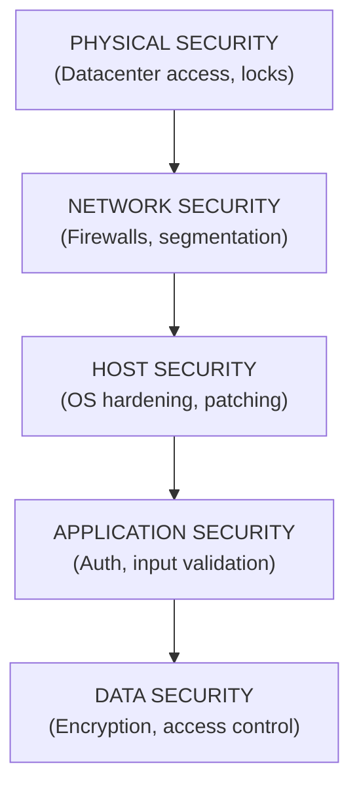
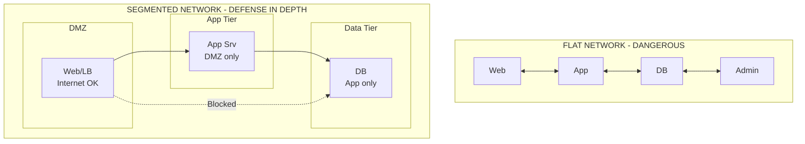
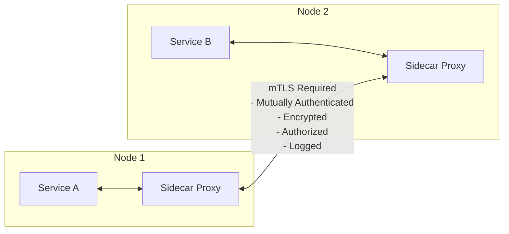
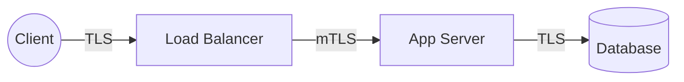
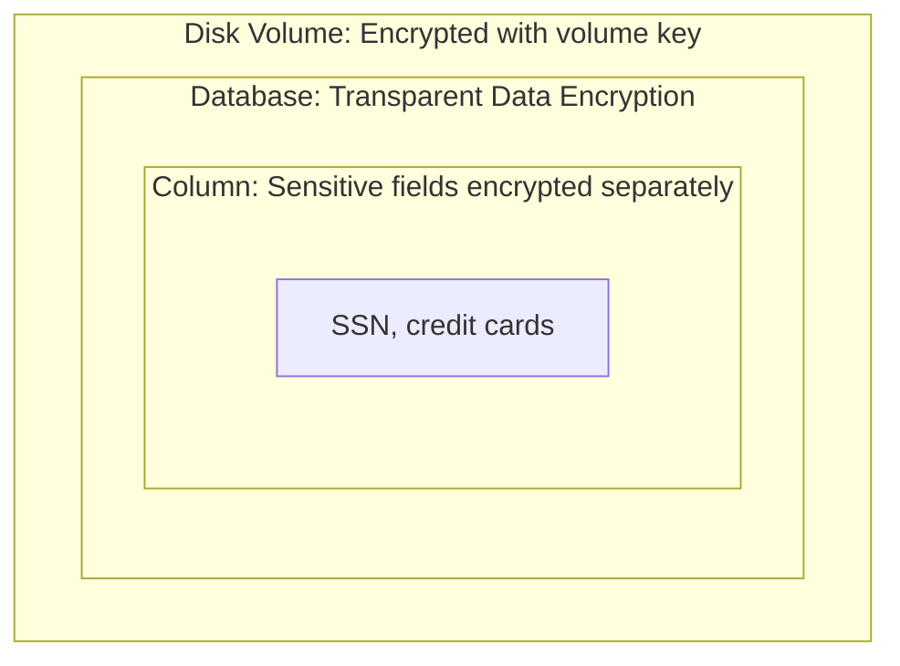
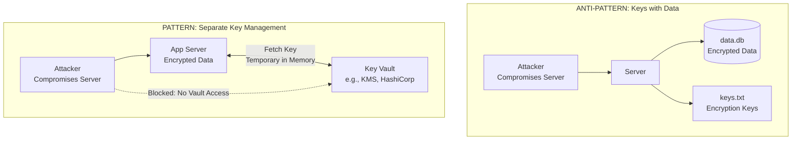
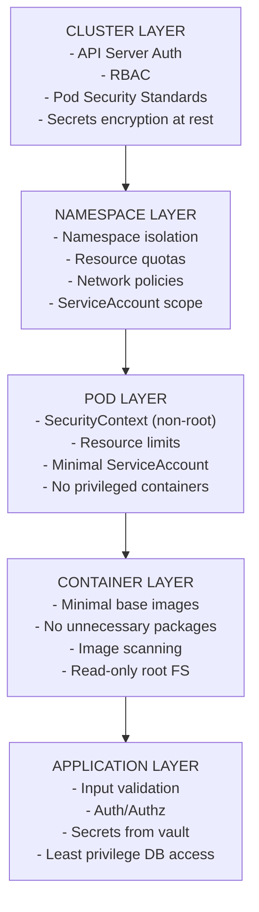

> **Complexity**: `[MEDIUM]`
>
> **Time to Complete**: 30-35 minutes
>
> **Prerequisites**: [Module 4.1: Security Mindset](../module-4.1-security-mindset/)
>
> **Track**: Foundations

### What You'll Be Able to Do

After completing this module, you will be able to:

1. **Design** layered security architectures where each layer provides independent protection and no single bypass compromises the entire system
2. **Evaluate** whether existing security layers are truly independent or share common failure modes (credentials, network paths, trust boundaries)
3. **Implement** defense-in-depth strategies across network, application, identity, and data layers for cloud-native environments
4. **Analyze** breach post-mortems to identify which defensive layers failed and where additional independent controls would have contained the blast radius

---

**November 2013. The holiday shopping season begins at Target, America's second-largest discount retailer.**

Attackers have already been inside Target's network for over two weeks. They entered through a third-party HVAC vendor's compromised credentials, moved laterally through the network, and installed memory-scraping malware on point-of-sale systems across 1,797 stores.

For 19 days, the malware quietly captured credit card data as customers swiped their cards. Target's security team received alerts from their FireEye intrusion detection system. The alerts were ignored.

**By December 15th, attackers had exfiltrated 40 million credit card numbers and 70 million customer records.** Target's stock dropped 46% in the following months. The breach cost over $292 million in direct expenses. The CEO and CIO both resigned.

Target had security tools—firewalls, network segmentation, intrusion detection. But the layers weren't truly independent. Credentials from one system worked in others. Alerts weren't investigated. Network segments could reach each other. Each slice of Swiss cheese had holes, and the holes aligned perfectly.

> **Stop and think**: What layers of security existed at Target, and why didn't they stop the attack? Consider how credentials and network access were managed across different internal boundaries.

This module teaches defense in depth—how to layer security controls so that when one fails (and it will), others still protect the system.

---

## Why This Module Matters

No security control is perfect. Firewalls get misconfigured. Authentication gets bypassed. Encryption keys get leaked. Any single layer of security will eventually fail.

**Defense in depth** is the practice of layering multiple independent security controls so that when one fails, others still protect the system. It's the difference between a house with just a locked front door and one with a locked door, alarm system, security cameras, and a safe for valuables.

This module teaches you how to design layered security—what layers exist, how they work together, and how to avoid common pitfalls that undermine defense in depth.

> **The Swiss Cheese Analogy**
>
> Imagine slices of Swiss cheese stacked together. Each slice has holes (vulnerabilities), but the holes are in different places. For an attack to succeed, the holes must align across all slices. Defense in depth means adding more slices—more layers with different vulnerabilities—so alignment becomes statistically unlikely.

---

## What You'll Learn

- The layers of defense in a modern system
- How to design independent security controls
- Network, application, and data layer security
- Common mistakes that undermine layered defense
- How Kubernetes implements defense in depth

---

## Part 1: The Security Layers

### 1.1 The Defense Stack

Each layer assumes the layer above it might be compromised.



### 1.2 Layer Independence

For defense in depth to work, layers must be **independent**. One compromise should not defeat multiple layers.

| Architecture | Characteristics | Failure Mode |
|--------------|-----------------|--------------|
| **Dependent (Weak)** | • Firewall uses same password as app admin<br>• DB credentials hardcoded in app | App server compromise gives attacker firewall and database access too. |
| **Independent (Strong)** | • Firewall requires hardware token<br>• App uses different identity provider<br>• DB credentials rotated automatically | Each layer has its own authentication, keys, and isolated failure modes. |

> **Pause and predict**: If an attacker steals a database administrator's credentials, how many layers of your current architecture are compromised?

> **Try This (2 minutes)**
>
> Think about your system. Do you reuse:
> - Passwords across security boundaries?
> - SSH keys for multiple purposes?
> - Service accounts with broad access?
>
> Each reuse is a hidden dependency between security layers.

---

## Part 2: Network Security Layer

### 2.1 Network Segmentation



### 2.2 Firewall Rules

**Default Deny Strategy**
- Block everything by default
- Explicitly allow only what's needed
- Log blocked traffic (anomaly detection)

**Example Ruleset:**
- `ALLOW TCP 443` from Internet to Web-Tier
- `ALLOW TCP 8080` from Web-Tier to App-Tier
- `ALLOW TCP 5432` from App-Tier to DB-Tier
- `DENY ALL` (default)

**Common Mistakes:**
- ✗ `ALLOW ALL` from Internal → Flat network, defeats segmentation
- ✗ `ALLOW TCP 0-65535` → Overly permissive port ranges
- ✗ Old rules never cleaned → Accumulated holes
- ✗ No logging → Attacks go unnoticed

### 2.3 Zero Trust Networking

Traditional perimeter: "Inside the network = trusted"
Zero trust: "Network location grants no trust"



---

## Part 3: Application Security Layer

### 3.1 Input Validation

**ALL INPUT IS UNTRUSTED**
Even input from "internal" services—an attacker who compromises one service shouldn't automatically compromise others.

**VALIDATION CHECKLIST**

1. **TYPE VALIDATION**
   - Expected data type (string, int, email, UUID)?
   - Does it parse correctly?
2. **LENGTH VALIDATION**
   - Minimum length (empty string attacks)?
   - Maximum length (buffer overflow, DoS)?
3. **FORMAT VALIDATION**
   - Matches expected pattern (regex)?
   - Valid characters only?
4. **RANGE VALIDATION**
   - Within expected bounds (price > 0)?
   - Valid enum value?
5. **BUSINESS VALIDATION**
   - Makes sense in context (quantity can't be negative)?
   - User authorized for this value?

### 3.2 Output Encoding

Context determines encoding. Wrong encoding equals a vulnerability. Use framework functions.

**HTML Context**
`<div>Hello, {{name}}</div>`
If `name` = `<script>alert('xss')</script>`
Encode: `&lt;script&gt;alert('xss')&lt;/script&gt;`

**JavaScript Context**
`<script>var name = "{{name}}";</script>`
If `name` = `; alert('xss');//`
Encode: `\x3B\x20alert\x28\x27xss\x27\x29\x3B\x2F\x2F`

**SQL Context**
`SELECT * FROM users WHERE name = '{{name}}'`
If `name` = `'; DROP TABLE users;--`
Use parameterized queries instead!

**URL Context**
`<a href="/search?q={{query}}">`
If `query` = `<script>alert(1)</script>`
Encode: `%3Cscript%3Ealert%281%29%3C%2Fscript%3E`

### 3.3 Authentication and Session Management

**Authentication Layers**

- **Layer 1: Something you know**
  - Password, PIN
  - *Weakness:* Phishing, brute force, credential stuffing
- **Layer 2: Something you have**
  - Phone (SMS, TOTP), hardware key (YubiKey)
  - *Weakness:* SIM swapping, device theft
- **Layer 3: Something you are**
  - Biometrics (fingerprint, face)
  - *Weakness:* Can't be changed if compromised

**Defense in Depth for Auth**
Combine multiple independent checks for robust security:
1. Password (Layer 1)
2. + TOTP Code (Layer 2)
3. + Device Trust (Is this a known device?)
4. + Risk Analysis (Unusual location, time, or behavior?)
5. + Session Limits (Timeout, single-use tokens)

> **Stop and think**: Does your password reset flow require the same level of authentication (like MFA) as your primary login flow? If not, you've created a shortcut around your security layers.

> **War Story: The $8.5 Million Password Reset Hole**
>
> **August 2019.** A financial services startup had invested heavily in authentication security: complex passwords, hardware MFA tokens, device fingerprinting, IP reputation analysis. Their login flow was nearly impenetrable.
>
> A security researcher found the password reset flow. It sent a reset link via email—no MFA required. Email access alone was enough to bypass every layer of authentication protection.
>
> The researcher reported the vulnerability through their bug bounty program. Three weeks later, before the fix deployed, attackers exploited the same flaw. They compromised employee email accounts through phishing, used password reset to gain access to the main application, and exfiltrated customer financial data.
>
> **The breach affected 2.1 million customers and cost $8.5 million** in regulatory fines, customer notification, and credit monitoring services.
>
> They'd built defense in depth for login, but forgot that password reset is also an entry point. The backup authentication path had none of the protections of the primary path. Every authentication flow—login, password reset, account recovery, API authentication—needs the same layered protection.

---

## Part 4: Data Security Layer

### 4.1 Encryption Strategy

**Encryption in Transit:** Protects against network sniffing and man-in-the-middle attacks. Does not protect against compromised endpoints.



**Encryption at Rest:** Protects against physical theft and unauthorized disk access. Does not protect against authorized users or memory access.



**Application-Level Encryption:** The application encrypts data before storing it and decrypts it after reading. The raw key never reaches the database. Protects against database compromise and rogue DBAs. Does not protect against a compromised application.

### 4.2 Key Management



> **Pause and predict**: If an attacker gains full read access to your application server's filesystem, will they be able to decrypt your database?

### 4.3 Data Classification

| Classification | Examples | Protection Level |
|----------------|----------|------------------|
| **Public** | Marketing content | Basic integrity |
| **Internal** | Employee directory | Access control |
| **Confidential** | Customer data, financials | Encryption + access control |
| **Restricted** | PII, payment data, secrets | Encryption + strict access + audit |

> **Try This (3 minutes)**
>
> Classify data in your system:
>
> | Data Type | Classification | Current Protection | Gap? |
> |-----------|----------------|-------------------|------|
> | User emails | | | |
> | Passwords | | | |
> | API keys | | | |
> | Log files | | | |

---

## Part 5: Defense in Depth in Kubernetes

### 5.1 Kubernetes Security Layers



### 5.2 Kubernetes Security Controls

```yaml
# Pod with defense in depth
apiVersion: v1
kind: Pod
metadata:
  name: secure-app
spec:
  serviceAccountName: app-minimal    # Least privilege
  securityContext:
    runAsNonRoot: true               # Not root
    runAsUser: 1000
    fsGroup: 1000
  containers:
  - name: app
    image: myapp:v1.0@sha256:abc...  # Image pinning
    securityContext:
      allowPrivilegeEscalation: false  # Can't become root
      readOnlyRootFilesystem: true     # Can't write to disk
      capabilities:
        drop: ["ALL"]                   # No special capabilities
    resources:
      limits:
        cpu: "500m"
        memory: "256Mi"              # Resource limits (DoS protection)
    volumeMounts:
    - name: tmp
      mountPath: /tmp                # Writable tmp if needed
  volumes:
  - name: tmp
    emptyDir: {}
```

### 5.3 Network Policies

```yaml
# Default deny all ingress
apiVersion: networking.k8s.io/v1
kind: NetworkPolicy
metadata:
  name: default-deny-ingress
  namespace: production
spec:
  podSelector: {}      # All pods in namespace
  policyTypes:
  - Ingress

---
# Allow only specific traffic
apiVersion: networking.k8s.io/v1
kind: NetworkPolicy
metadata:
  name: allow-web-to-api
  namespace: production
spec:
  podSelector:
    matchLabels:
      app: api
  policyTypes:
  - Ingress
  ingress:
  - from:
    - podSelector:
        matchLabels:
          app: web
    ports:
    - protocol: TCP
      port: 8080
```

> **Stop and think**: Review the network policies in your cluster. Do you rely solely on application-level authentication, or are you enforcing network isolation as an independent layer?

---

## Did You Know?

- **The "Swiss Cheese Model"** was developed by James Reason for accident causation analysis. It shows how multiple barriers, each with weaknesses, can prevent disasters when properly layered.

- **mTLS (mutual TLS)** was rare before service meshes. Now Istio and Linkerd make it the default for all service-to-service communication—encryption and authentication without application changes.

- **The Pentagon uses "air gaps"** (physically disconnected networks) for the most sensitive systems. Even sophisticated software-based defense in depth can't match physical isolation for high-value targets.

- **The 2013 Target breach** is a textbook defense-in-depth failure. Attackers compromised an HVAC vendor, used those credentials to access Target's network, then moved laterally to payment systems. Multiple security layers existed but were either misconfigured or ignored alerts—the intrusion detection system flagged the attack, but the alert wasn't investigated.

---

## Common Mistakes

| Mistake | Problem | Solution |
|---------|---------|----------|
| Single layer dependency | One compromise defeats everything | Independent controls per layer |
| Perimeter-only defense | Insiders and lateral movement | Zero trust, internal segmentation |
| Encrypted but keys exposed | Encryption provides no protection | Proper key management |
| Network security only | App vulnerabilities still exploitable | Application-layer controls too |
| Default allow policies | Too permissive | Default deny, explicit allow |
| Forgetting logging | Can't detect when layers fail | Log at every layer |

---

## Quiz

1. **Scenario**: A company's firewall requires an administrator login. To make things easier for the DevOps team, they configure the firewall to use the same LDAP directory and Active Directory groups as the main application's administrative backend. An attacker successfully phishes a DevOps engineer's Active Directory credentials. Why is this a failure of defense in depth?
   <details>
   <summary>Answer</summary>

   This setup completely violates the principle of layer independence because the network layer (firewall) and application layer (backend) share the same dependency: the Active Directory credentials. When security layers share dependencies, a single compromise affects multiple layers simultaneously, defeating the purpose of having multiple defenses. In this scenario, the attacker can now modify network perimeter rules and access the application backend using the exact same set of stolen credentials. True defense in depth would require distinct authentication mechanisms, such as a hardware token for the firewall that is separate from the application login.
   </details>

2. **Scenario**: Your team has encrypted the application's PostgreSQL database at rest using AWS EBS volume encryption. A developer argues that because the disk is encrypted, they don't need to configure TLS for the connections between the application pods and the database pods. Is the developer correct, and why?
   <details>
   <summary>Answer</summary>

   The developer is incorrect because encryption at rest and encryption in transit protect against entirely different threat vectors. Encryption at rest (EBS volume encryption) only protects the data if the physical disk is stolen or accessed without authorization at the infrastructure level. It does absolutely nothing to protect data actively moving across the network. If an attacker has compromised another pod in the cluster and is sniffing network traffic, they will see the database queries and responses in plaintext unless encryption in transit (TLS) is implemented. Defense in depth requires both layers to cover both stored data and moving data.
   </details>

3. **Scenario**: You are deploying a new microservice in a Kubernetes cluster (v1.35). The cluster administrator has mandated that all namespaces must have a default-deny NetworkPolicy. Your application pod needs to connect to an external payment API, but the connection keeps timing out. What is the most likely cause, and how does this demonstrate defense in depth?
   <details>
   <summary>Answer</summary>

   The most likely cause is that the default-deny NetworkPolicy is blocking outbound (egress) traffic from your pod to the internet. A default-deny policy requires explicit allow rules for any communication to occur. This demonstrates defense in depth because it assumes the application pod is untrusted; even if an attacker compromises the pod, they cannot automatically establish outbound connections to exfiltrate data or download malware. The network layer provides an independent security control that restricts lateral movement and outbound access, containing the blast radius of an application-layer compromise.
   </details>

4. **Scenario**: An application encrypts highly sensitive user SSNs before storing them in the database. The development team stores the encryption key as an environment variable in the application's Kubernetes Deployment manifest. During a security audit, this is flagged as a critical vulnerability. Why is this approach fundamentally flawed?
   <details>
   <summary>Answer</summary>

   This approach is flawed because storing the encryption key in the manifest (and thus as an environment variable) couples the key directly with the application environment, defeating the separation of concerns. If an attacker gains read access to the cluster's API server, the pod's specification, or executes a directory traversal attack to read `/proc/1/environ`, they instantly obtain the key. Proper key management requires storing keys in a dedicated, external system (like a Key Vault or AWS KMS) with its own access controls and audit logs. The application should fetch the key into memory only when needed, ensuring that compromising the application host doesn't automatically hand over the cryptographic keys.
   </details>

5. **Scenario**: Your organization has deployed a Web Application Firewall (WAF) that successfully blocks 99% of common SQL injection attacks. Because the WAF is highly effective, the lead engineer suggests skipping parameterized queries in the application code to speed up development time. What mathematical and architectural principles explain why this is a terrible idea?
   <details>
   <summary>Answer</summary>

   This violates the core mathematical principle of layer independence in defense in depth. If you rely solely on the WAF (which is 99% effective), an attacker has a 1% chance of success per attempt. If you layer parameterized queries (e.g., 99% effective against remaining novel bypasses), the probability of an attack bypassing both independent layers drops to 0.01% (0.01 * 0.01). Furthermore, architecturally, a WAF operates at the network/HTTP layer and lacks business logic context, making it susceptible to novel encoding tricks. Parameterized queries operate at the data layer and structurally prevent SQL injection regardless of how the payload is encoded, providing a critical fallback when the WAF fails. By relying on multiple distinct enforcement points, the system remains secure even if attackers discover a bypass technique for one specific layer.
   </details>

6. **Scenario**: Target's HVAC vendor had credentials that allowed remote access into Target's network. Once inside, attackers successfully pinged and connected to the point-of-sale (POS) systems located in physical retail stores. Based on defense in depth, what specific network security control was missing or misconfigured here?
   <details>
   <summary>Answer</summary>

   The missing control was proper network segmentation with strict access policies between segments. In a well-architected defense in depth strategy, the HVAC vendor's access should have been heavily segmented into an isolated vendor network zone. There should have been no routing path or firewall rule allowing traffic to cross from the vendor segment into the highly sensitive PCI-compliant segment housing the POS systems. By operating a flat or loosely segmented network, Target allowed an attacker who breached a low-security dependency (HVAC monitoring) to pivot laterally into a high-security zone without encountering an independent network barrier. Establishing strict internal boundaries ensures that a breach in a less critical system does not automatically compromise the entire organization.
   </details>

7. **Scenario**: You are reviewing a Kubernetes Pod manifest for a legacy application. The container runs as root, mounts the host's `/var/run/docker.sock`, and has no CPU or memory limits defined. If the application has a remote code execution (RCE) vulnerability, how does this Pod configuration fail to provide defense in depth at the host and container layers?
   <details>
   <summary>Answer</summary>

   This configuration completely strips away host and container isolation, violating defense in depth. First, running as root within the container and mounting the Docker socket means an attacker exploiting the RCE can easily escape the container, compromise the underlying node, and potentially take over the entire cluster. Second, the lack of resource limits means the attacker can launch a denial-of-service attack (like cryptomining) that consumes all node resources, starving other applications. A defense in depth approach would use a non-root `SecurityContext`, a read-only root filesystem, and strict resource quotas to contain the blast radius of the RCE to just that single, isolated container. Implementing these overlapping controls ensures that even if the application code is vulnerable, the infrastructure itself actively resists further exploitation and lateral movement.
   </details>

8. **Scenario**: During a penetration test, the tester successfully bypasses the corporate VPN (Network Layer) and accesses an internal employee portal. However, they are unable to view any sensitive HR documents because the application requires a biometric prompt (WebAuthn) for high-privilege actions. Which security concept does this demonstrate, and why is it effective?
   <details>
   <summary>Answer</summary>

   This scenario perfectly demonstrates Zero Trust Architecture and the principle of layer independence. The system does not implicitly trust the user just because they bypassed the perimeter network (the VPN). Instead, the application layer independently enforces its own strong authentication and authorization controls before granting access to sensitive data. This is highly effective because the failure of the network security layer did not result in a total system compromise; the independent, data-centric access control (Layer 3: "Something you are") stopped the attack path and protected the underlying assets. When identity and authorization are verified at the application level regardless of network origin, the system maintains its integrity even if the perimeter is fully breached.
   </details>

---

## Hands-On Exercise

**Task**: Audit a system for defense in depth.

**Scenario**: Review the following architecture and identify missing layers:

```mermaid
flowchart TD
    Internet((Internet)) --> Firewall[Firewall]
    Firewall --> WebServer[Web Server\n(serves static files)]
    WebServer --> AppServer[App Server\n(business logic)]
    AppServer --> Database[(Database\nPostgreSQL)]
```

**Part 1: Layer Inventory (10 minutes)**

Fill in current controls:

| Layer | Controls Present | Controls Missing |
|-------|------------------|------------------|
| Network | Firewall | |
| Host | | |
| Application | | |
| Data | | |

**Part 2: Attack Scenarios (10 minutes)**

For each attack, identify which layers would stop it:

| Attack | Layer 1 | Layer 2 | Layer 3 | Stopped? |
|--------|---------|---------|---------|----------|
| SQL injection | | | | |
| Stolen DB backup | | | | |
| Network sniffing | | | | |
| Compromised app server | | | | |

**Part 3: Recommendations (10 minutes)**

Propose controls to add:

| Gap | Proposed Control | Layer | Priority |
|-----|------------------|-------|----------|
| | | | |
| | | | |
| | | | |
| | | | |
| | | | |

**Success Criteria**:
- [ ] All four layers inventoried
- [ ] At least 5 missing controls identified
- [ ] Attack scenarios analyzed with layer mapping
- [ ] Prioritized recommendations provided

---

## Further Reading

- **"Network Security Essentials"** - William Stallings. Comprehensive coverage of network security principles and protocols.

- **"Kubernetes Security"** - Liz Rice. Defense in depth specifically for Kubernetes environments.

- **NIST Cybersecurity Framework** - Framework for organizing security controls in layers.

---

## Key Takeaways Checklist

Before moving on, verify you can answer these:

- [ ] Can you explain the Swiss cheese model and why layer independence matters?
- [ ] Can you name and describe the five defense-in-depth layers (physical, network, host, application, data)?
- [ ] Do you understand network segmentation and why flat networks are dangerous?
- [ ] Can you explain zero trust networking and how mTLS implements it?
- [ ] Do you understand the difference between encryption in transit and at rest?
- [ ] Can you explain why key management is often the weakest link in encryption?
- [ ] Do you understand how Kubernetes implements defense in depth (cluster, namespace, pod, container layers)?
- [ ] Can you calculate the probability difference between independent vs dependent security layers?

---

## Next Module

[Module 4.3: Identity and Access Management](../module-4.3-identity-and-access/) - Authentication, authorization, and the principle of least privilege in practice.