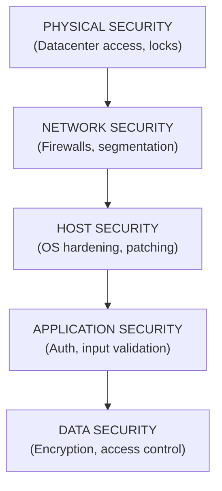
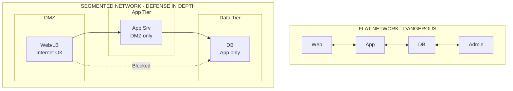
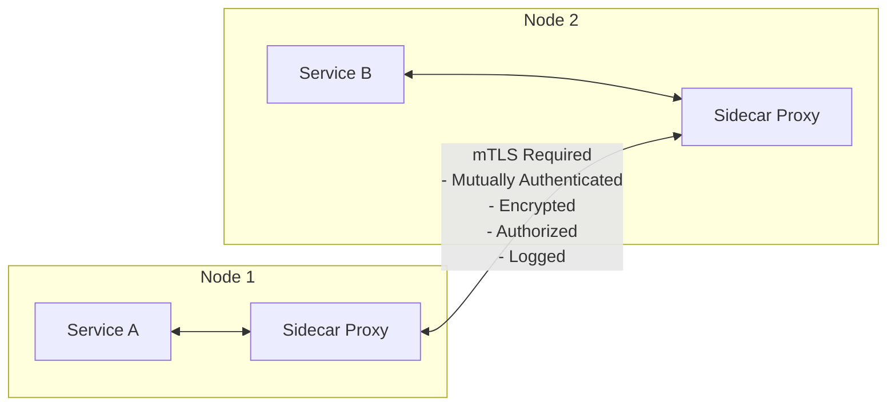
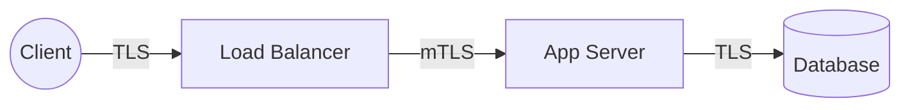
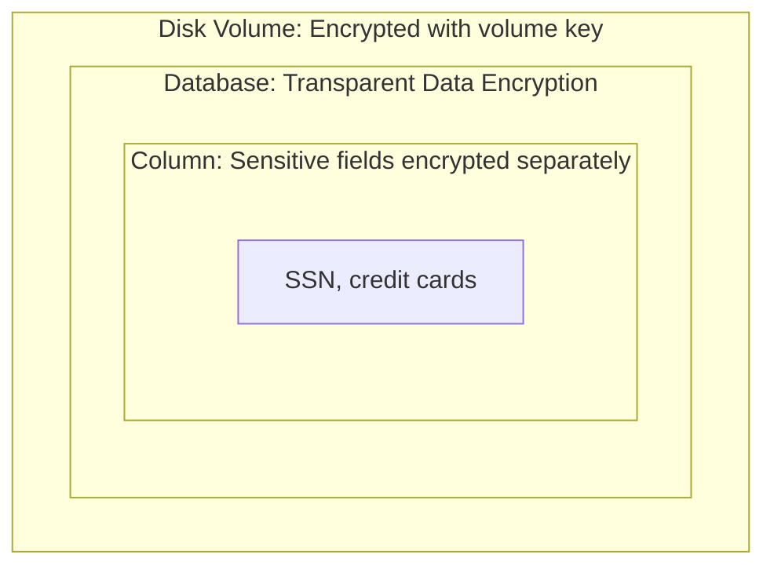
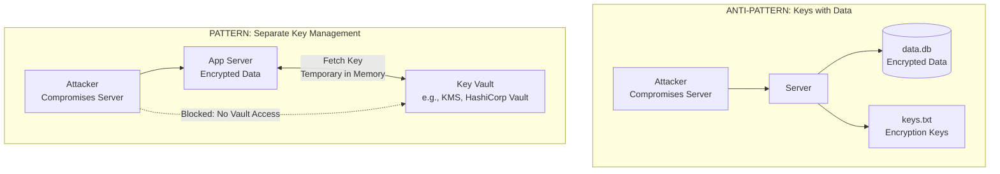
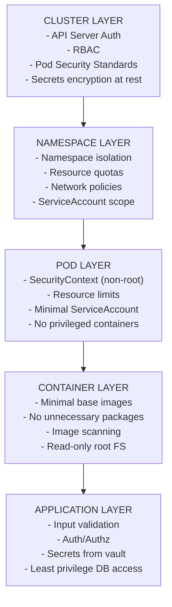
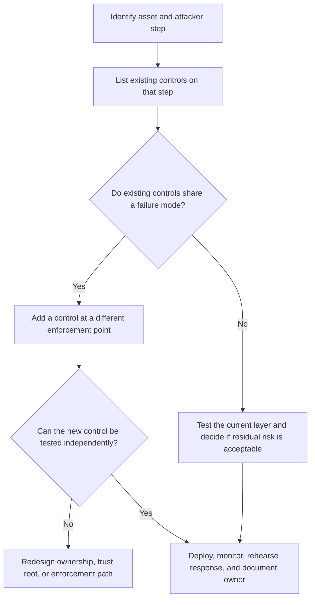
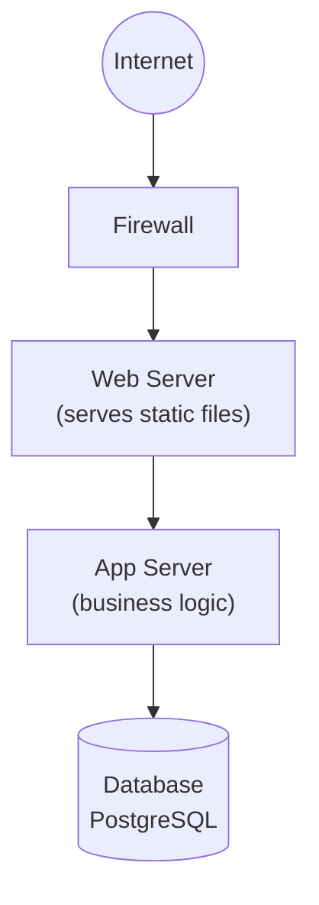

> **Complexity**: `[MEDIUM]`
>
> **Time to Complete**: 45-55 minutes
>
> **Prerequisites**: [Module 4.1: Security Mindset](../module-4.1-security-mindset/)
>
> **Track**: Foundations

## When Layers Align

**November 2013. The holiday shopping season begins at Target, one of the largest retailers in the United States.** Attackers have already been inside Target's environment for weeks. Public post-incident analyses describe a path that began with stolen credentials from Fazio Mechanical, a third-party HVAC and refrigeration vendor, and then moved from a lower-trust vendor foothold into more sensitive internal systems. The important lesson is not that HVAC software is uniquely dangerous. The lesson is that a small, practical access path became a bridge into a payment-card environment because multiple defensive layers depended on assumptions the attackers were able to reuse.

Once inside, the attackers moved laterally toward point-of-sale systems in roughly 1,800 U.S. stores and installed memory-scraping malware that captured payment-card data as cards were swiped. Target later confirmed that approximately 40 million credit and debit card accounts were exposed, and it also disclosed that non-financial personal information for up to 70 million customers was stolen. Senate Commerce staff later summarized multiple missed defensive opportunities: vendor access was not isolated tightly enough, the FireEye intrusion-detection system fired alerts that were not acted on, and warnings about data exfiltration paths were ignored in time to matter.

The financial and leadership consequences were not abstract. Target's 2016 Form 10-K reported $292 million in cumulative breach-related expenses, partially offset by insurance recoveries, and public reporting documented major executive turnover after the incident, including the departure of the CEO and the CIO. Those facts matter because defense in depth is often sold as a tooling pattern, but its real value is organizational resilience. A firewall, an intrusion-detection platform, and network segmentation do not help if the firewall trusts the same credentials, the detector's alerts are ignored, and the segmentation allows a vendor foothold to reach payment systems.

Target had defensive slices of cheese: credentials, network boundaries, monitoring, payment-system specialization, and incident-response procedures. The breach became a canonical defense-in-depth failure because the holes in those slices aligned. Vendor credentials opened the first door, weak isolation allowed movement, alerts did not become action, and sensitive data paths were not contained quickly enough. The rest of this module teaches how to design layers so one failure remains one failure instead of becoming a complete path through the system.

> **Stop and think**: In the Target breach, which controls were present but dependent on the same weak assumptions, and which missing independent control could have broken the attack chain earliest?

---

## What You'll Be Able to Do

By the end of this module, you will be able to:

1. **Design** layered security architectures where each layer provides independent protection and no single bypass compromises the entire system
2. **Evaluate** whether security controls are truly independent or whether they share failure modes such as credentials, network paths, trust roots, and operational response queues
3. **Implement** defense-in-depth strategies across network, application, identity, data, and Kubernetes layers without turning the principle into a vendor checklist
4. **Choose** which layer to add for a given threat by using a decision framework that maps attacker steps to independent control points
5. **Analyze** breach post-mortems to identify which defensive layers failed and where additional independent controls would have contained the blast radius

---

## Why This Module Matters

No security control is perfect. Firewalls get misconfigured, authentication flows get bypassed, encryption keys get leaked, and alert queues become noisy at exactly the wrong time. If the entire security posture depends on one control behaving perfectly forever, the architecture is making a promise it cannot keep. Defense in depth is the practice of layering multiple controls so a single failure does not become a complete compromise. The phrase is common, but the disciplined version is stricter than "add more tools."

Defense in depth works only when the layers fail differently. A locked front door, a second locked door using the same key, and a safe with the same combination are three objects but one failure mode. By contrast, a door lock, an alarm that detects forced entry, a camera that records evidence, and a safe that uses a separate key create independent opportunities to prevent, detect, delay, or recover. Security architecture follows the same pattern. A network policy, application authorization check, hardware-backed administrator login, and data encryption key controlled by a separate service are valuable because they force the attacker to solve different problems.

The probability intuition is simple, but it is easy to misuse. If one independent control misses one attack in a hundred and a second independent control also misses one attack in a hundred, the chance of the same attack bypassing both can become much smaller than either individual miss rate. The multiplication only helps when the failures are independent. If both controls rely on the same identity provider, the same administrator password, the same all-powerful service account, or the same noisy alert queue, the math collapses because one upstream failure can disable both controls at once.

This module therefore teaches defense in depth as an engineering discipline: identify the asset, model the attacker step, choose a control at a different enforcement point, and verify that the new layer does not share the same trust root as the old one. You will see network segmentation, default-deny firewalls, zero-trust networking, input validation, output encoding, authentication recovery paths, data encryption, key management, and Kubernetes controls. The examples are concrete, but the durable skill is deciding where an independent layer belongs and how to test whether it is actually independent.

> **The Swiss Cheese Analogy**
>
> Imagine slices of Swiss cheese stacked together. Each slice has holes, but the holes are in different places. James Reason's system-safety model uses that picture to explain how accidents pass through multiple barriers when their weaknesses align. Security uses the same idea: every control has limits, so the goal is to stack controls whose limits do not line up neatly for the attacker.

---

## Part 1: The Security Layers

### 1.1 The Defense Stack

The classic defense stack is useful because it reminds you that security exists at multiple enforcement points. Physical security protects equipment and consoles. Network security shapes who can talk to whom. Host security limits what a compromised process can do on a machine. Application security checks inputs, identities, permissions, and business rules. Data security protects the asset even when surrounding layers are stressed. A mature design does not assume these layers are equal in every system; it asks which layer can still act when the previous one fails.


```mermaid
flowchart TD
    Physical["PHYSICAL SECURITY\n(Datacenter access, locks)"] --> Network["NETWORK SECURITY\n(Firewalls, segmentation)"]
    Network --> Host["HOST SECURITY\n(OS hardening, patching)"]
    Host --> App["APPLICATION SECURITY\n(Auth, input validation)"]
    App --> Data["DATA SECURITY\n(Encryption, access control)"]
```

The diagram is deliberately vertical, but real systems are messier. A cloud workload may not expose a traditional datacenter door to your team, but it still has a physical layer through the provider's facilities and hardware controls. A Kubernetes workload may not have a named "host security team," but kernel isolation, container runtime policy, seccomp, and node patching still belong to the host layer. Treat the stack as a map of enforcement points, not as an org chart or a shopping list.

Each layer should assume the layer above it might be compromised. The network should not trust a request merely because the application sent it. The database should not trust a query merely because it came from an application server. The encryption design should not keep the only decryption key beside the encrypted data. That mindset changes the design question from "Did we add a control?" to "What can this control still stop if the neighboring control fails?"

### 1.2 Layer Independence

For defense in depth to work, layers must be independent. Independence means one compromise does not automatically defeat multiple layers. This is where many security architectures fail quietly. They contain several controls, but those controls all depend on the same directory group, the same administrator workstation, the same network route, the same certificate authority, or the same approval process. The result looks layered during an audit and behaves flat during an incident.

| Architecture | Characteristics | Failure Mode |
|--------------|-----------------|--------------|
| **Dependent (Weak)** | Firewall uses same password as app admin; database credentials are hardcoded in app; alert triage depends on one overloaded queue | App server compromise gives the attacker firewall, database, and monitoring leverage too. |
| **Independent (Strong)** | Firewall requires hardware-backed admin auth; app uses scoped identity; database credentials rotate; alerts have separate escalation | Each layer has its own authentication, keys, and operational failure modes. |

Shared credentials are the easiest dependency to spot. If the same account can administer the VPN, the CI system, the Kubernetes cluster, and the database, then a single phishing success has become a cross-layer bypass. Shared network paths are subtler. A vendor portal may be "low privilege" in the application sense, but if it has a routable path to payment systems, it can become a network-layer bridge. Shared trust roots are subtler still: if every internal service certificate, deployment token, and break-glass key is issued by one uncontrolled system, compromise of that system turns many layers into one layer.

Operational dependencies matter as much as technical dependencies. An intrusion-detection system is a layer only if alerts are investigated, suppressed alerts are reviewed, and high-severity signals can interrupt normal work. If every security product sends alerts to the same abandoned mailbox, you have multiple sensors and one response failure mode. Defense in depth includes people, queues, escalation rules, and rehearsed decisions because those determine whether detection becomes containment.

> **Pause and predict**: If an attacker steals a database administrator's credentials, how many layers of your current architecture are compromised, and which controls would still require a different secret, device, network path, or approval?

### 1.3 Probability Without False Confidence

Engineers often explain defense in depth with multiplication: a control that blocks most attacks plus another independent control that blocks most remaining attacks produces a much smaller residual risk. The intuition is useful, but exact percentages are usually less important than the independence test. You rarely know the true miss rate of a WAF, a static analyzer, a network policy, or a manual review. You can, however, reason about whether the same bypass defeats more than one of them.

Consider SQL injection. A web application firewall may block common payloads before they reach the app. Parameterized queries prevent user-controlled strings from changing SQL structure inside the data-access layer. Database permissions can ensure the application account cannot drop tables even if a query bug exists. Backups and audit logs support recovery and investigation. Those controls multiply only because they operate at different places: HTTP edge, application code, database authorization, and recovery operations.

Now contrast that with three controls that all depend on one shared library configured by the same environment variable. If the environment variable disables strict mode, every control weakens at the same time. That is not multiplication; it is decoration. The defender's job is to identify where a common-mode failure could make several controls fail together, then add a layer whose enforcement point is far enough away to survive that failure.

### 1.4 A Layer Independence Checklist

Use this checklist when you review an existing system, but do not treat it as a box-ticking exercise. Each question is a way to discover a hidden dependency that can turn several controls into one brittle control. The goal is to find the shared assumption before an attacker finds it during lateral movement.

| Independence Question | What It Reveals | Better Direction |
|-----------------------|-----------------|------------------|
| Do controls share the same credential or group? | Stolen identity may bypass several layers | Separate admin roles, MFA, hardware-backed tokens, scoped service accounts |
| Do controls share the same network path? | One foothold may reach high-value assets | Segmentation, default-deny routing, workload-level policy |
| Do controls share the same trust root? | One CA, token issuer, or secrets store may become universal access | Scoped issuers, short-lived credentials, separate break-glass path |
| Do controls share the same alert queue? | Detection may fail operationally even when sensors work | Severity routing, ownership, paging rules, rehearsed response |
| Do controls share the same deployment pipeline? | A compromised pipeline can push insecure config everywhere | Signed artifacts, policy checks, staged rollout, independent approvals |

The strongest finding in a review is often not "missing control" but "controls are coupled." A database encrypted at rest with keys stored on the same server as the database has an encryption feature, but not much blast-radius reduction against server compromise. A Kubernetes namespace with NetworkPolicy but no CNI plugin that enforces it has policy documents, but not network isolation. A zero-trust diagram where every service accepts any certificate from one overbroad issuer has encryption, but not meaningful workload authorization.

---

## Part 2: Network Security Layer

### 2.1 Network Segmentation

Network segmentation is the practice of dividing systems into zones and allowing only necessary communication between them. It is not just a performance or topology choice. It is a containment strategy. If a web server is compromised, segmentation should prevent that foothold from becoming automatic database access, administrative access, or direct access to sensitive processing systems. In a flat network, every compromised host becomes a staging area for lateral movement.


```mermaid
flowchart TD
    subgraph FlatNetwork [FLAT NETWORK - DANGEROUS]
        direction LR
        F_Web[Web] <--> F_App[App] <--> F_DB[DB] <--> F_Admin[Admin]
    end

    subgraph SegmentedNetwork [SEGMENTED NETWORK - DEFENSE IN DEPTH]
        direction LR
        subgraph DMZ
            S_Web[Web/LB\nInternet OK]
        end
        subgraph AppTier [App Tier]
            S_App[App Srv\nDMZ only]
        end
        subgraph DataTier [Data Tier]
            S_DB[DB\nApp only]
        end

        S_Web --> S_App
        S_App --> S_DB
        S_Web -.->|Blocked| S_DB
    end
```

The segmented diagram is effective because it encodes business intent into network paths. Internet clients may reach the public edge. The public edge may reach the app tier on the application port. The app tier may reach the database on the database port. Everything else requires a deliberate exception. This does not eliminate application bugs, but it changes what an application bug can reach. That is the practical meaning of blast-radius reduction.

Segmentation also creates useful detection opportunities. A web tier attempting to connect directly to the database, a vendor network attempting to scan payment systems, or a workload making unexpected outbound connections becomes suspicious precisely because normal paths are narrow. In a flat network, the same behavior blends into background noise. A good boundary therefore does two jobs: it blocks unnecessary traffic and turns boundary violations into high-signal events.

### 2.2 Firewall Rules and Default Deny

Default deny means the system blocks traffic unless a rule explicitly allows it. This sounds strict, but it is easier to reason about than default allow. With default allow, every forgotten path remains open until someone proves it dangerous. With default deny, every new path requires a positive design decision: which source, which destination, which port, which protocol, and which owner is accountable for the exception.

| Rule | Intent |
|------|--------|
| `ALLOW TCP 443` from Internet to Web-Tier | Public clients can reach the edge over HTTPS |
| `ALLOW TCP 8080` from Web-Tier to App-Tier | The edge can call the application service |
| `ALLOW TCP 5432` from App-Tier to DB-Tier | The application can reach PostgreSQL |
| `DENY ALL` | Every unmodeled path is blocked and logged |

The table is intentionally small because good firewall policy is specific. A rule such as `ALLOW ALL` from internal networks converts segmentation into a diagram rather than an enforcement mechanism. A rule such as `ALLOW TCP 0-65535` usually means the owner did not know what the application needed. Old rules that never expire become accumulated holes. No logging means the team cannot tell whether blocked traffic is an attack, a misconfiguration, or a dependency nobody documented.

Default deny also forces ownership conversations that security teams sometimes avoid. If a service needs outbound access to a payment API, someone must know which destination is legitimate and how that destination changes. If a batch job needs database access, someone must know why a batch job should bypass the app tier. Those conversations are not bureaucracy when they identify trust boundaries. They are the moment when architecture becomes enforceable policy.

### 2.3 Zero Trust Networking

Traditional perimeter thinking says, "inside the network means trusted." Zero trust says network location is not enough. NIST SP 800-207 describes a model where trust is not granted implicitly based on physical location, network location, or asset ownership. Authentication and authorization happen before a session is established, and the protected resource remains the focus. That idea complements defense in depth because it turns every sensitive access path into its own control point.


```mermaid
flowchart LR
    subgraph Node1 [Node 1]
        SvcA[Service A] <--> ProxyA[Sidecar Proxy]
    end

    subgraph Node2 [Node 2]
        SvcB[Service B] <--> ProxyB[Sidecar Proxy]
    end

    ProxyA <-->|mTLS Required\n- Mutually Authenticated\n- Encrypted\n- Authorized\n- Logged| ProxyB
```

Mutual TLS is one way to implement part of that model for service-to-service communication. In ordinary TLS, the client verifies the server. In mutual TLS, both sides prove identity using certificates, and the connection can be encrypted and authenticated without every application reimplementing certificate exchange itself. Service meshes such as Istio illustrate this pattern by moving transport authentication into sidecars or ambient data-plane components, but the principle is tool-agnostic: the network path should not be trusted merely because packets came from an internal address.

Zero trust does not mean "no one is trusted ever." It means trust is specific, contextual, and continuously checked at useful enforcement points. A workload may be allowed to call one API but not another. A human administrator may be allowed to read dashboards but need stronger proof for production writes. A device may be allowed from one posture state and denied from another. These checks are valuable only if they do not all depend on the same brittle upstream secret or overbroad network zone.

---

## Part 3: Application and Identity Layers

### 3.1 Input Validation

Input validation is the application layer refusing to treat untrusted data as already safe. The phrase "all input is untrusted" includes obvious sources such as HTTP requests and uploads, but it also includes messages from internal services, queue payloads, cached data, headers added by proxies, and values loaded from configuration. A compromised service inside the network should not automatically be able to send malicious input that the next service executes, stores, or renders.

The most reliable validation strategy is to define what good input looks like and reject everything else. Type validation asks whether a value is a string, integer, email address, UUID, date, or structured object as expected. Length validation prevents empty-string surprises, oversized payloads, and denial-of-service pressure. Format validation checks syntax such as allowed characters or normalized encodings. Range validation rejects values outside legitimate bounds. Business validation checks whether the value makes sense for the user and workflow, such as preventing one account from submitting another account's invoice number.

Validation should happen near the trust boundary and again at domain boundaries where the meaning changes. An API gateway can reject malformed requests, but it usually cannot know whether a refund amount is valid for a specific order. The service that owns the order must enforce that rule. This is another defense-in-depth pattern: broad validation at the edge reduces noise, while business validation inside the application protects decisions the edge cannot understand.

### 3.2 Output Encoding

Output encoding is the companion to input validation. Validation decides what data is acceptable to accept; encoding decides how accepted data is safely placed into a specific output context. The context matters because the same characters mean different things in HTML, JavaScript, SQL, URLs, shell commands, and log formats. Encoding for the wrong context is not a partial fix. It can be no fix at all.

**HTML Context**

`<div>Hello, {{name}}</div>`

If `name` is `<script>alert('xss')</script>`, the HTML output must render the characters as text rather than executable markup, such as `&lt;script&gt;alert('xss')&lt;/script&gt;`. Modern template engines usually provide context-aware escaping, but teams still break this layer when they disable escaping, concatenate raw HTML, or move data into a different context after the framework has encoded it.

**JavaScript Context**

`<script>var name = "{{name}}";</script>`

If `name` is `; alert('xss');//`, HTML escaping alone is not sufficient because the data is inside executable JavaScript. The safer design is to avoid placing untrusted data directly inside script blocks. When you must do it, use framework-supported JavaScript-string encoding or serialize data as JSON with the framework's safe helper rather than building script strings by hand.

**SQL Context**

`SELECT * FROM users WHERE name = '{{name}}'`

If `name` is `'; DROP TABLE users;--`, output encoding is the wrong mental model because the problem is query construction. Parameterized queries separate the SQL structure from user-controlled values. A WAF might block common payloads, but parameterization is the independent application/data-layer control that prevents the string from becoming executable SQL.

**URL Context**

`<a href="/search?q={{query}}">`

If `query` is `<script>alert(1)</script>`, URL encoding represents the value safely as data inside the query string. That does not make every destination safe; you still need allowlists for redirects and link targets. The broader lesson is that output safety depends on the interpreter that will consume the value. HTML, JavaScript, SQL, and URL parsers do not share one universal escape function.

### 3.3 Authentication and Session Management

Authentication is also a layered system. A password proves something the user knows. A TOTP app, hardware key, or passkey-capable device proves something the user has. A biometric prompt may help unlock a local device or private key, but it should be treated carefully because biometric traits cannot be rotated like passwords. Device posture, risk scoring, session lifetime, step-up authentication, and audit logging add additional checks around the primary proof.

The defense-in-depth lesson is that every authentication entry point needs comparable protection. Login is not the only door. Password reset, account recovery, email-change flows, API token creation, support impersonation, OAuth consent, and break-glass administration can all become alternative entry points. A strong login wall is moot if account recovery is a single-factor email link that lets an attacker replace the password and enroll a new device without step-up verification.

**Hypothetical scenario:** A fintech product invests in strong primary login: long passwords, hardware-backed MFA for employees, suspicious-login detection, and short-lived sessions for privileged workflows. The password-reset path, however, sends a single email link and does not require MFA, device confirmation, help-desk verification, or risk-based delay before changing credentials. An attacker who compromises an employee mailbox can skip the strong login path entirely by using account recovery, setting a new password, and creating fresh sessions that look legitimate to downstream systems.

The fix is not merely "add MFA somewhere." The fix is to classify account recovery as authentication and protect it with independent controls. Sensitive reset flows should require an existing factor when available, notify previous contact channels, limit token lifetime, bind reset tokens to the initiating browser where practical, detect unusual geography or device changes, and delay high-risk changes until review. Recovery must remain humane for legitimate users, but it cannot be a lower-trust tunnel around the primary controls.

> **Stop and think**: Does your password reset flow require protection comparable to your primary login flow, or have you created a shortcut around your strongest authentication layer?

### 3.4 Authorization as a Separate Layer

Authentication asks who or what is making the request. Authorization asks what that identity may do right now. Treating those as the same layer creates a common failure mode: once the attacker logs in, every sensitive action becomes available. Defense in depth keeps authorization close to the protected action, especially for administrative operations, money movement, data export, secret access, and configuration changes.

Good authorization is specific. A user who can view invoices should not automatically approve refunds. A service that reads customer profiles should not automatically export the full database. An administrator who can deploy to staging should not automatically change production network policy. These separations reduce blast radius because a stolen session or service token cannot perform every action. They also improve detection because denied attempts reveal intent.

Step-up authorization is useful when the action is more sensitive than the session that started it. A VPN bypass should not grant access to HR data without application-level authorization. A dashboard session should not allow production deletion without a fresh factor or privileged approval. This is zero trust expressed at the application layer: every sensitive action earns trust again at the moment it matters.

---

## Part 4: Data Security Layer

### 4.1 Encryption Strategy

Encryption is not one layer. It is several layers that protect different states of data. Encryption in transit protects data moving across a network. Encryption at rest protects stored data from storage-layer theft or unauthorized disk access. Application-level encryption protects selected fields before they enter a database, which can reduce exposure from database compromise or overbroad database administration. Each layer has a different attacker model, so replacing one with another leaves gaps.


```mermaid
flowchart LR
    Client((Client)) -->|TLS| LB[Load Balancer]
    LB -->|mTLS| App[App Server]
    App -->|TLS| DB[(Database)]
```

The transit diagram shows three network hops, and each hop needs its own trust decision. Client-to-load-balancer TLS protects the public path. Load-balancer-to-application mTLS can authenticate the workload path inside the environment. Application-to-database TLS protects queries and results from network sniffing or unintended intermediaries. None of those controls protects data after it is decrypted inside a compromised application process, which is why host, application, and data controls still matter.


```mermaid
flowchart TD
    subgraph Disk [Disk Volume: Encrypted with volume key]
        subgraph DB [Database: Transparent Data Encryption]
            subgraph Column [Column: Sensitive fields encrypted separately]
                Data[SSN, credit cards]
            end
        end
    end
```

The at-rest diagram shows nested protection, but the nesting should not imply magic. Volume encryption protects against storage media exposure. Database transparent encryption can protect database files and backups depending on implementation. Column or field encryption can protect selected values even if a database dump is copied. However, any layer that automatically decrypts for every authorized query will not stop a compromised application account from reading what that account is allowed to read. Encryption must be paired with authorization, logging, and key management.

Application-level encryption is strongest when the raw key never lives in the database and when the application decrypts only the fields needed for a specific workflow. It can reduce exposure from rogue database access, backup leaks, and broad read replicas. It does not protect against a fully compromised application runtime that can request keys and read plaintext. That limitation is not a reason to avoid the layer; it is a reminder to define the threat it addresses and to add other layers for runtime compromise.

### 4.2 Key Management

Encryption without key management is often theater. If encrypted data and the key that decrypts it are stored together, the attacker who steals one usually steals both. The key-management layer should introduce a separate trust boundary: separate identity, separate audit log, separate access policy, and ideally short-lived key access rather than permanent plaintext keys on disk. Cloud KMS products, hardware security modules, and tools such as Vault are common implementations, but the principle is independent of the product.


```mermaid
flowchart TD
    subgraph AntiPattern [ANTI-PATTERN: Keys with Data]
        direction LR
        Server1[Server] --> DB1[(data.db\nEncrypted Data)]
        Server1 --> Key1[keys.txt\nEncryption Keys]
        Attacker1[Attacker\nCompromises Server] --> Server1
    end

    subgraph Pattern [PATTERN: Separate Key Management]
        direction LR
        AppServer[App Server\nEncrypted Data] <-->|Fetch Key\nTemporary in Memory| Vault[Key Vault\ne.g., KMS, HashiCorp Vault]
        Attacker2[Attacker\nCompromises Server] --> AppServer
        Attacker2 -.->|Blocked: No Vault Access| Vault
    end
```

The pattern side of the diagram is not saying the attacker can never decrypt anything after compromising an application server. If the application identity is allowed to request a key, a runtime attacker may still abuse that permission. The improvement is that full filesystem read access no longer automatically reveals the long-term key, and key access can be scoped, rate-limited, audited, rotated, or revoked. The separate system gives defenders another place to detect and interrupt abuse.

Key rotation is useful only when the system can actually rotate. If changing a key requires a fragile manual migration, the key will stay old. If every service uses the same key, rotation becomes risky and broad. If logs do not show which identity requested which key for which purpose, incident response cannot tell what was exposed. Practical key management therefore includes key hierarchy, ownership, rotation playbooks, audit review, and a tested way to re-encrypt data when a key is suspected compromised.

> **Pause and predict**: If an attacker gains full read access to your application server's filesystem, will they find durable decryption keys, or will they still need to cross a separate identity and audit boundary?

### 4.3 Data Classification

Data classification tells you how much protection each asset deserves. Without classification, teams overprotect low-risk data, underprotect high-risk data, or argue about controls one field at a time. Classification should be understandable enough for engineers to use during design, deployment, logging, testing, and incident response. It should also influence retention: the safest sensitive data is the data you do not store longer than necessary.

| Classification | Examples | Protection Level |
|----------------|----------|------------------|
| **Public** | Marketing content, public documentation | Basic integrity, change control |
| **Internal** | Employee directory, internal runbooks | Access control, logging, limited sharing |
| **Confidential** | Customer data, financial records, contracts | Encryption, access control, audit, retention limits |
| **Restricted** | PII, payment data, secrets, private keys | Strong encryption, strict access, key separation, alerting |

Classification becomes a defense-in-depth tool when it drives independent controls. Restricted data may require application authorization, column encryption, tighter database roles, separate key policy, egress monitoring, and redaction in logs. Confidential data may require encryption and audit but not the same step-up workflow. Public data still needs integrity controls because attackers can weaponize defacement, malware injection, or documentation tampering even when confidentiality is not the goal.

Logs deserve special attention because they often cross boundaries. A team may protect the database carefully while leaking access tokens, email addresses, reset links, or payment fragments into logs consumed by many tools. Treat logs as data products with their own classification. Redaction, retention, access control, and export restrictions belong in the same conversation as database encryption because attackers do not care which storage system gives them the sensitive value.

---

## Part 5: Defense in Depth in Kubernetes

### 5.1 Kubernetes Security Layers

Kubernetes is a useful teaching environment because it makes layers visible. The API server, admission control, RBAC, namespaces, service accounts, NetworkPolicy, Pod Security Standards, container security contexts, image provenance, runtime controls, and application authorization all sit at different enforcement points. A secure cluster does not rely on any one of them. It assumes an application bug, a leaked service account token, or a misconfigured namespace will happen and then limits what that failure can reach.


```mermaid
flowchart TD
    Cluster["CLUSTER LAYER\n- API Server Auth\n- RBAC\n- Pod Security Standards\n- Secrets encryption at rest"] --> Namespace
    Namespace["NAMESPACE LAYER\n- Namespace isolation\n- Resource quotas\n- Network policies\n- ServiceAccount scope"] --> Pod
    Pod["POD LAYER\n- SecurityContext (non-root)\n- Resource limits\n- Minimal ServiceAccount\n- No privileged containers"] --> Container
    Container["CONTAINER LAYER\n- Minimal base images\n- No unnecessary packages\n- Image scanning\n- Read-only root FS"] --> App
    App["APPLICATION LAYER\n- Input validation\n- Auth/Authz\n- Secrets from vault\n- Least privilege DB access"]
```

The cluster layer decides who may ask Kubernetes to do things. RBAC can prevent a service account from listing secrets or creating privileged pods. Admission controls can reject workloads that violate security policy. The namespace layer shapes tenancy and communication boundaries. The pod and container layers limit what code can do after it starts. The application layer still validates input and authorizes actions because a locked-down container can still contain vulnerable business logic.

Pod Security Standards are a good example of layered intent. Kubernetes defines privileged, baseline, and restricted profiles to describe broad pod-security postures. Applying a restricted policy at namespace admission can prevent dangerous workload shapes before they run, but it does not replace image scanning, runtime detection, NetworkPolicy, or application authorization. It is one independent guardrail in the path from source code to running process.

### 5.2 Namespace Admission and Pod Security Standards

The following namespace labels express an intent that new pods in the namespace should satisfy the restricted Pod Security Standard for the curriculum's target Kubernetes version. In a real cluster, you would roll this out carefully because restricted mode can break legacy workloads that run as root, require extra Linux capabilities, or write to privileged paths. That rollout friction is exactly why defense in depth should be designed early rather than retrofitted after every workload has learned to depend on dangerous defaults.

```yaml
apiVersion: v1
kind: Namespace
metadata:
  name: production
  labels:
    pod-security.kubernetes.io/enforce: restricted
    pod-security.kubernetes.io/enforce-version: v1.35
    pod-security.kubernetes.io/audit: restricted
    pod-security.kubernetes.io/audit-version: v1.35
    pod-security.kubernetes.io/warn: restricted
    pod-security.kubernetes.io/warn-version: v1.35
```

The `enforce` label rejects non-compliant pods, while `audit` and `warn` help teams see violations during rollout and review. The version labels matter because policy details evolve as Kubernetes evolves; pinning the version keeps the admission decision stable while teams plan upgrades. This is a small example of independent control design: developers may intend to deploy safely, CI may check manifests, and namespace admission still enforces a final cluster-side rule when a workload reaches the API server.

### 5.3 Pod and Container Controls

The next manifest shows a pod-shaped defense-in-depth pattern, not a complete production deployment. The service account is named explicitly so it can receive minimal RBAC. The pod runs as a non-root user. The container disables privilege escalation, drops Linux capabilities, uses the runtime default seccomp profile, makes the root filesystem read-only, and declares resource limits. Each setting reduces what an attacker can do after exploiting an application bug.

```yaml
apiVersion: v1
kind: Pod
metadata:
  name: secure-app
  namespace: production
  labels:
    app: api
spec:
  serviceAccountName: app-minimal
  securityContext:
    runAsNonRoot: true
    runAsUser: 1000
    runAsGroup: 1000
    fsGroup: 1000
    seccompProfile:
      type: RuntimeDefault
  containers:
    - name: app
      image: registry.example.com/platform/secure-app@sha256:aaaaaaaaaaaaaaaaaaaaaaaaaaaaaaaaaaaaaaaaaaaaaaaaaaaaaaaaaaaaaaaa
      ports:
        - containerPort: 8080
          name: http
      securityContext:
        allowPrivilegeEscalation: false
        readOnlyRootFilesystem: true
        capabilities:
          drop:
            - ALL
      resources:
        requests:
          cpu: 100m
          memory: 128Mi
        limits:
          cpu: 500m
          memory: 256Mi
      volumeMounts:
        - name: tmp
          mountPath: /tmp
  volumes:
    - name: tmp
      emptyDir: {}
```

These settings are not decorative. `runAsNonRoot` reduces the value of code execution inside the container. `allowPrivilegeEscalation: false` prevents gaining more privileges through setuid binaries. Dropping capabilities removes broad kernel privileges most application containers do not need. A read-only root filesystem makes malware persistence harder, while an explicit `/tmp` volume gives the application a narrow writable path if it needs one. Resource limits do not stop data theft, but they can contain denial-of-service behavior from runaway or malicious code.

Image pinning is included because mutable tags create another shared failure mode. If every deployment says `latest`, a compromised registry tag or accidental overwrite can change production without a meaningful review path. A digest-pinned image does not prove the image is safe by itself, but it makes the deployed artifact specific. Combined with signing, vulnerability scanning, admission policy, and provenance checks, it becomes another layer that can interrupt supply-chain mistakes or attacks.

### 5.4 Network Policies

Kubernetes NetworkPolicy lets you declare which pods may communicate at the network layer, assuming the cluster uses a network plugin that enforces the API. This caveat is important: a YAML object that the data plane ignores is not a security layer. When enforced, NetworkPolicy gives you a workload-level segmentation control that can survive application compromise. A vulnerable API pod may still be exploited, but it should not automatically scan the namespace, call the database, and exfiltrate to any destination.

```yaml
apiVersion: networking.k8s.io/v1
kind: NetworkPolicy
metadata:
  name: default-deny-ingress-and-egress
  namespace: production
spec:
  podSelector: {}
  policyTypes:
    - Ingress
    - Egress
  ingress: []
  egress: []

---
apiVersion: networking.k8s.io/v1
kind: NetworkPolicy
metadata:
  name: allow-web-to-api
  namespace: production
spec:
  podSelector:
    matchLabels:
      app: api
  policyTypes:
    - Ingress
  ingress:
    - from:
        - podSelector:
            matchLabels:
              app: web
      ports:
        - protocol: TCP
          port: 8080

---
apiVersion: networking.k8s.io/v1
kind: NetworkPolicy
metadata:
  name: allow-api-egress-to-payment-provider
  namespace: production
spec:
  podSelector:
    matchLabels:
      app: api
  policyTypes:
    - Egress
  egress:
    - to:
        - ipBlock:
            cidr: 203.0.113.0/24
      ports:
        - protocol: TCP
          port: 443

---
apiVersion: networking.k8s.io/v1
kind: NetworkPolicy
metadata:
  name: allow-web-egress-to-api
  namespace: production
spec:
  podSelector:
    matchLabels:
      app: web
  policyTypes:
    - Egress
  egress:
    - to:
        - podSelector:
            matchLabels:
              app: api
      ports:
        - protocol: TCP
          port: 8080

---
apiVersion: networking.k8s.io/v1
kind: NetworkPolicy
metadata:
  name: allow-dns-egress
  namespace: production
spec:
  podSelector: {}
  policyTypes:
    - Egress
  egress:
    - to:
        - namespaceSelector: {}
          podSelector:
            matchLabels:
              k8s-app: kube-dns
      ports:
        - protocol: UDP
          port: 53
        - protocol: TCP
          port: 53
```

The first policy isolates every pod in the namespace for both ingress and egress, so nothing flows until something is explicitly allowed. Here the layered model has a subtlety that trips up many teams: Kubernetes evaluates ingress and egress **independently**, so a connection from `web` to `api` requires *both* halves of the rule pair — the `allow-web-to-api` **ingress** rule on the API pods *and* the `allow-web-egress-to-api` **egress** rule on the web pods. The ingress rule alone is not enough; with default-deny egress in force, the web pod's outbound traffic would still be dropped and the call would fail. The `allow-dns-egress` policy exists because a default-deny egress posture also blocks DNS, so name resolution breaks until UDP and TCP port 53 to the cluster DNS service (`kube-dns`) is explicitly permitted — a classic "my NetworkPolicy broke everything" surprise. Finally, `allow-api-egress-to-payment-provider` shows a narrow egress exception to an external provider, using a documentation CIDR that must be replaced by a real range in production. This shape is intentionally explicit: default deny creates the boundary, and each allow rule documents why — and in which direction — the boundary is crossed.

NetworkPolicy is not identity-aware in the same way application authorization is identity-aware. A compromised pod with the `app: web` label may still use the network path allowed for that label. That is why labels must be controlled, admission policy matters, service accounts need least privilege, and application authorization remains necessary. Again, the lesson is not that one layer solves the problem. The lesson is that each layer should force a different attacker step.

> **Stop and think**: Review the network policies in your cluster. Do you rely solely on application-level authentication, or are you enforcing network isolation as an independent layer with a data plane that actually honors the policy?

---

## Patterns & Anti-Patterns

Patterns make defense in depth repeatable. The first pattern is independent enforcement: place controls at different points in the request path so a bypass at one point does not disable the others. For example, combine edge filtering, application validation, database permissions, and recovery procedures for injection risk. The second pattern is narrow blast radius: scope identities, network paths, keys, and data access so compromise of one workload or person does not grant broad movement. The third pattern is actionable detection: every layer should produce signals that someone owns, understands, and can escalate.

Another useful pattern is graceful degradation of trust. When confidence drops, the system should reduce privilege rather than continue as if nothing happened. A risky login can require step-up authentication. A suspicious service identity can lose access to sensitive APIs until revalidated. A noisy egress pattern can trigger stricter policy or isolation. This is defense in depth as a dynamic posture rather than a static stack of controls.

| Pattern | Why It Works | Example |
|---------|--------------|---------|
| Independent enforcement points | One bypass does not disable every control | WAF plus parameterized queries plus least-privilege DB role |
| Narrow blast radius | Compromise stays local long enough to detect and respond | Namespace policy, scoped service account, restricted database role |
| Separate key control plane | Data theft and key theft require different steps | KMS or Vault policy separate from database access |
| Actionable detection | Failed layers become visible before the attacker finishes | High-severity alerts with ownership and rehearsed escalation |

Anti-patterns usually masquerade as efficiency. Shared administrator groups are convenient until one credential controls every layer. Flat networks are convenient until a low-trust service can reach high-trust assets. Centralized secrets in environment variables are convenient until every pod spec becomes a key inventory. A single alert queue is convenient until urgent signals wait behind routine noise. The cost of independence is operational discipline, but the cost of hidden dependency is that layers fail together.

| Anti-Pattern | Why It's Bad | Better Approach |
|--------------|--------------|-----------------|
| Same credential everywhere | One stolen identity crosses layers | Separate roles, MFA, hardware-backed admin flows |
| Flat internal network | Any foothold can move laterally | Default-deny segmentation and workload policy |
| Keys stored with encrypted data | Data theft includes decryption material | Separate KMS, scoped access, audit, rotation |
| Recovery flow weaker than login | Attackers bypass primary authentication | Treat recovery as authentication with comparable controls |
| Unowned alert streams | Detection fires but does not change outcomes | Severity routing, ownership, response playbooks |
| Policy without enforcement | YAML or documents create false confidence | Verify data-plane, admission, and operational enforcement |

The most dangerous anti-pattern is security theater: a visible control that everyone assumes is working but nobody tests against the threat it claims to reduce. A default-deny policy should be tested by trying unauthorized traffic. A key-separation design should be tested by asking what a filesystem compromise exposes. An alerting layer should be tested by running a drill that proves the right human or automation acts quickly. Defense in depth is not complete until each layer has a failure test.

---

## Decision Framework

When deciding which layer to add, start with the attacker step, not with a tool category. Ask what the attacker has already achieved, what they need next, and which enforcement point can interrupt that next step independently. If the attacker has stolen a password, adding another password policy may not help much; adding phishing-resistant MFA or step-up authorization for sensitive actions changes the required proof. If the attacker has compromised an application pod, adding another application log line may not contain movement; network egress policy, service-account scoping, and runtime restrictions may.

| Threat or Failure | First Useful Question | Independent Layer to Consider | Test of Independence |
|-------------------|-----------------------|--------------------------------|----------------------|
| Stolen human credential | What can this identity administer without another factor? | MFA, privileged access workflow, step-up authorization | Can the attacker perform the sensitive action with only the stolen password? |
| Compromised web service | What can this workload reach and read? | NetworkPolicy, scoped service account, DB role limits | Can code execution in the pod reach unrelated services or dump broad data? |
| Injection bug | Can malicious input change interpreter behavior? | Parameterized queries, output encoding, validation | Does the exploit still work if the edge filter misses it? |
| Database dump theft | Are keys and sensitive fields separate from the dump? | Field encryption, KMS policy, backup encryption | Can a copied backup be decrypted without crossing another identity boundary? |
| Noisy detection | Who acts when a high-risk signal fires? | Alert ownership, paging, automated containment | Does a drill produce timely containment rather than a ticket nobody reads? |
| Vendor or third-party access | What production paths can the vendor reach? | Isolated network zone, scoped identity, monitoring | Can vendor credentials route to high-value systems without a separate approval? |

The decision framework should feel practical during design review. Pick one asset, one credible attacker step, and one proposed control. Then ask whether the proposed control belongs to a different enforcement point from the control you already have. If the answer is no, you may still want the control for usability or audit reasons, but you should not count it as an independent layer. If the answer is yes, define how you will test it, who owns it, and what signal it produces when it blocks or detects an attack.


```mermaid
flowchart TD
    A["Identify asset and attacker step"] --> B["List existing controls on that step"]
    B --> C{"Do existing controls share a failure mode?"}
    C -->|Yes| D["Add a control at a different enforcement point"]
    C -->|No| E["Test the current layer and decide if residual risk is acceptable"]
    D --> F{"Can the new control be tested independently?"}
    F -->|No| G["Redesign ownership, trust root, or enforcement path"]
    F -->|Yes| H["Deploy, monitor, rehearse response, and document owner"]
    E --> H
```

This framework also prevents over-layering. More controls are not always better if they create fragility, unclear ownership, or user-hostile workarounds. A sensitive data export path may deserve step-up authentication, approval, rate limits, and logging. A low-risk public status page may need integrity control and deployment review but not the same interactive ceremony. The right layer is the one that reduces a real attack path without introducing a larger operational failure mode.

---

## Did You Know?

- **The "Swiss Cheese Model"** was developed by James Reason for accident causation analysis and is widely used to explain how defenses, barriers, and safeguards can be penetrated when weaknesses align across layers.

- **NIST's Zero Trust Architecture guidance** explicitly rejects implicit trust based only on network location, which is why zero trust complements defense in depth rather than replacing it.

- **Kubernetes Pod Security Standards** define privileged, baseline, and restricted policy levels; the restricted level is designed for heavily constrained pods but still needs supporting layers such as RBAC, image policy, and NetworkPolicy.

- **The 2013 Target breach** is a textbook defense-in-depth failure: stolen HVAC vendor credentials, lateral movement toward POS systems, missed anti-intrusion alerts, and weak isolation together enabled theft of roughly 40 million payment-card numbers and up to 70 million customer records.

---

## Common Mistakes

| Mistake | Problem | Solution |
|---------|---------|----------|
| Single layer dependency | One compromise defeats everything | Require independent controls per layer |
| Perimeter-only defense | Insiders, vendors, and compromised workloads can move laterally | Use zero trust, internal segmentation, and workload policy |
| Shared admin credentials | Phishing or token theft crosses network, app, and data layers | Separate privileged roles and require strong step-up factors |
| Encrypted data with exposed keys | Encryption provides little protection after filesystem compromise | Use separate key management with audit and rotation |
| Network security only | Application bugs and business-rule flaws remain exploitable | Add validation, output encoding, and authorization checks |
| Default-allow policies | Old or unknown paths remain open by accident | Start with default deny and document explicit allows |
| Weak account recovery | Attackers bypass strong login controls | Treat reset and recovery as authentication entry points |
| Unowned logging | Alerts fire but nobody responds | Assign owners, severity, escalation, and drill response |

---

## Quiz

1. **Scenario**: A company's firewall requires an administrator login. To make things easier for the DevOps team, they configure the firewall to use the same LDAP directory and Active Directory groups as the main application's administrative backend. An attacker successfully phishes a DevOps engineer's Active Directory credentials. Why is this a failure of defense in depth?
   <details>
   <summary>Answer</summary>

   This setup violates layer independence because the network layer and application layer share the same identity failure mode. The attacker does not need to defeat two different controls; the stolen directory credential can influence both the firewall and the backend. A better design would evaluate the shared dependency, then require a separate privileged access path such as hardware-backed MFA, scoped network-admin roles, and audited approval for firewall changes. This probes the outcome of evaluating whether layers are truly independent.
   </details>

2. **Scenario**: Your team has encrypted the application's PostgreSQL database at rest using cloud volume encryption. A developer argues that because the disk is encrypted, they do not need to configure TLS for the connections between the application pods and the database pods. Is the developer correct, and why?
   <details>
   <summary>Answer</summary>

   The developer is incorrect because encryption at rest and encryption in transit protect different states of data. Volume encryption helps if storage media, snapshots, or low-level disk access are exposed, but it does not protect queries and responses moving across the network. If another pod can sniff or intercept traffic, plaintext database communication remains exposed. Implementing both layers addresses the outcome of applying defense-in-depth strategies across data and network paths.
   </details>

3. **Scenario**: You are deploying a new microservice in a Kubernetes cluster targeting v1.35. The cluster administrator has mandated default-deny NetworkPolicy for namespaces. Your application pod needs to connect to an external payment API, but the connection keeps timing out. What is the most likely cause, and how does this demonstrate defense in depth?
   <details>
   <summary>Answer</summary>

   The likely cause is that egress is denied until an explicit NetworkPolicy allows the API pod to reach the payment provider on the required destination and port. Default-deny policy assumes the pod should not communicate merely because it runs inside the cluster. This demonstrates defense in depth because a compromised application pod cannot automatically exfiltrate data or download tooling through arbitrary outbound connections. The fix is to implement a narrow egress allow rule and verify that the CNI data plane enforces it.
   </details>

4. **Scenario**: An application encrypts highly sensitive user SSNs before storing them in the database. The development team stores the encryption key as an environment variable in the application's Kubernetes Deployment manifest. During a security audit, this is flagged as a critical vulnerability. Why is this approach fundamentally flawed?
   <details>
   <summary>Answer</summary>

   The design stores the decryption capability beside the application environment, so anyone who can read the manifest, inspect the pod environment, or compromise the workload may obtain the key. That collapses the data layer and key-management layer into one failure mode. A stronger design uses a separate key-management service with scoped identity, audit logging, and rotation so a database dump or filesystem read does not automatically include durable keys. This probes the outcome of designing independent data-protection layers.
   </details>

5. **Scenario**: Your organization has deployed a Web Application Firewall that blocks many common SQL injection payloads. Because the WAF is effective, the lead engineer suggests skipping parameterized queries in application code to speed up development. What mathematical and architectural principles explain why this is a bad idea?
   <details>
   <summary>Answer</summary>

   The multiplication intuition behind defense in depth works only when controls are independent, and a WAF plus parameterized queries operate at different enforcement points. The WAF can miss a novel encoding or business-specific payload, while parameterized queries prevent user input from changing SQL structure even when the edge filter misses it. Skipping parameterization turns an application/data-layer protection into a single HTTP-layer bet. This answer probes the outcomes of designing layered architecture and choosing the right independent control for a threat.
   </details>

6. **Scenario**: Target's HVAC vendor credentials allowed remote access into Target's environment. Once inside, attackers moved laterally toward point-of-sale systems in stores. Based on defense in depth, what specific network security control was missing or misconfigured here?
   <details>
   <summary>Answer</summary>

   The missing or ineffective control was strict network segmentation between the vendor-access environment and sensitive payment-system zones. Vendor credentials should have landed in a tightly scoped area with no routable path to POS systems unless a separate, justified control allowed it. Segmentation would not have prevented the initial credential theft, but it could have contained the blast radius and made lateral movement noisy. This probes the outcome of analyzing breach post-mortems for failed layers and containment opportunities.
   </details>

7. **Scenario**: You are reviewing a Kubernetes Pod manifest for a legacy application. The container runs as root, mounts the host's `/var/run/docker.sock`, and has no CPU or memory limits defined. If the application has a remote code execution vulnerability, how does this Pod configuration fail to provide defense in depth at the host and container layers?
   <details>
   <summary>Answer</summary>

   The manifest removes the containment layers that should limit the impact of application code execution. Running as root and mounting the container runtime socket can let an attacker influence the node or other containers, while missing resource limits can turn code execution into denial of service. A defense-in-depth pod would run as non-root, drop capabilities, disable privilege escalation, avoid host socket mounts, use a read-only root filesystem, and set resource requests and limits. This probes implementation of Kubernetes defense-in-depth controls across pod, container, and host boundaries.
   </details>

8. **Scenario**: During a penetration test, the tester bypasses the corporate VPN and accesses an internal employee portal. However, they cannot view sensitive HR documents because the application requires a fresh WebAuthn prompt for high-privilege actions. Which security concept does this demonstrate, and why is it effective?
   <details>
   <summary>Answer</summary>

   This demonstrates zero trust and layer independence because the application does not grant sensitive access merely because the network perimeter was crossed. The VPN layer failed, but the application authorization layer required a separate proof for a high-risk action. That independent step-up control prevented the network bypass from becoming a data breach. It also shows how to choose a control close to the protected resource rather than relying entirely on perimeter access.
   </details>

---

## Hands-On Exercise

### Task

Audit a system for defense in depth by mapping controls to attacker steps instead of merely listing security tools. The goal is to discover where the architecture has independent barriers and where it only appears layered because several controls share the same credential, network path, trust root, or operational queue.

### Scenario

Review the following architecture and identify missing layers. Assume the firewall exists, but no other controls have been proven yet. Your job is to ask what happens if the firewall is misconfigured, the application has a code flaw, a database backup leaks, or an internal credential is stolen.


```mermaid
flowchart TD
    Internet((Internet)) --> Firewall[Firewall]
    Firewall --> WebServer["Web Server\n(serves static files)"]
    WebServer --> AppServer["App Server\n(business logic)"]
    AppServer --> Database[(Database\nPostgreSQL)]
```

### Part 1: Layer Inventory

Fill in the current controls and missing controls for each layer. Be specific about whether a control prevents, detects, delays, or supports recovery, because those roles help you see whether the layers are independent.

| Layer | Controls Present | Controls Missing |
|-------|------------------|------------------|
| Network | Firewall | |
| Host | | |
| Application | | |
| Data | | |

### Part 2: Attack Scenarios

For each attack, identify which layers would stop it and which layers would merely produce evidence after the fact. If an attack passes through several boxes because they share the same trust assumption, mark that dependency explicitly instead of giving partial credit.

| Attack | Layer 1 | Layer 2 | Layer 3 | Stopped? |
|--------|---------|---------|---------|----------|
| SQL injection | | | | |
| Stolen DB backup | | | | |
| Network sniffing | | | | |
| Compromised app server | | | | |

### Part 3: Recommendations

Propose controls to add, but justify each one by naming the attacker step it interrupts. At least one recommendation should address network containment, one should address application logic, one should address data protection, and one should address detection or response.

| Gap | Proposed Control | Layer | Priority |
|-----|------------------|-------|----------|
| | | | |
| | | | |
| | | | |
| | | | |
| | | | |

### Success Criteria

- [ ] All four layers inventoried with present and missing controls
- [ ] At least five missing controls identified and mapped to attacker steps
- [ ] Attack scenarios analyzed with layer mapping and independence notes
- [ ] Prioritized recommendations include prevention, detection, and recovery controls

---

## Key Takeaways Checklist

Before moving on, verify you can answer these questions without looking back. The point is not memorizing the exact YAML; it is being able to reason about whether a proposed control creates a new independent barrier or merely repeats an assumption the system already depends on.

- [ ] Can you explain the Swiss cheese model and why layer independence matters?
- [ ] Can you name and describe the five defense-in-depth layers: physical, network, host, application, and data?
- [ ] Do you understand network segmentation and why flat networks are dangerous?
- [ ] Can you explain zero trust networking and how mTLS can support it?
- [ ] Do you understand the difference between encryption in transit, at rest, and at the application layer?
- [ ] Can you explain why key management is often the weakest link in encryption?
- [ ] Do you understand how Kubernetes implements defense in depth across cluster, namespace, pod, container, and application layers?
- [ ] Can you explain why independent layers can reduce risk multiplicatively while dependent layers fail together?

---

## Next Module

[Module 4.3: Identity and Access Management](../module-4.3-identity-and-access/) - Authentication, authorization, and the principle of least privilege in practice.

---

## Sources

- [Senate Commerce Committee: Target's missed opportunities to stop the breach](https://www.commerce.senate.gov/press/dem/release/rockefeller-staff-report-details-targets-missed-opportunities-to-stop-massive-data-breach/)
- [Krebs on Security: Target Hackers Broke in Via HVAC Company](https://krebsonsecurity.com/2014/02/target-hackers-broke-in-via-hvac-company/)
- [Target 2016 Form 10-K, SEC EDGAR](https://www.sec.gov/Archives/edgar/data/27419/000002741917000008/tgt-20170128x10k.htm)
- [TechTarget: Were executives held accountable after the Target data breach?](https://www.techtarget.com/searchsecurity/tip/FAQ-Were-executives-held-accountable-after-the-Target-data-breach)
- [NIST Cybersecurity Framework](https://www.nist.gov/cyberframework)
- [NIST SP 800-207: Zero Trust Architecture](https://csrc.nist.gov/pubs/sp/800/207/final)
- [OWASP Input Validation Cheat Sheet](https://cheatsheetseries.owasp.org/cheatsheets/Input_Validation_Cheat_Sheet.html)
- [OWASP Cross-Site Scripting Prevention Cheat Sheet](https://cheatsheetseries.owasp.org/cheatsheets/Cross_Site_Scripting_Prevention_Cheat_Sheet.html)
- [CIS Kubernetes Benchmark](https://www.cisecurity.org/benchmark/kubernetes)
- [Kubernetes Pod Security Standards](https://kubernetes.io/docs/concepts/security/pod-security-standards/)
- [Kubernetes Network Policies](https://kubernetes.io/docs/concepts/services-networking/network-policies/)
- [Kubernetes Security Contexts](https://kubernetes.io/docs/tasks/configure-pod-container/security-context/)
- [Istio Security Concepts](https://istio.io/latest/docs/concepts/security/)
- [AHRQ PSNet: Human error, models and management](https://psnet.ahrq.gov/issue/human-error-models-and-management)
- [O'Reilly: Kubernetes Security by Liz Rice and Michael Hausenblas](https://www.oreilly.com/library/view/kubernetes-security/9781492039075/)
