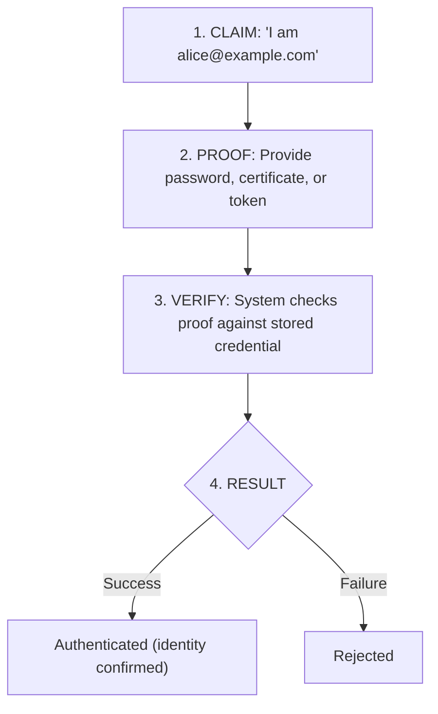
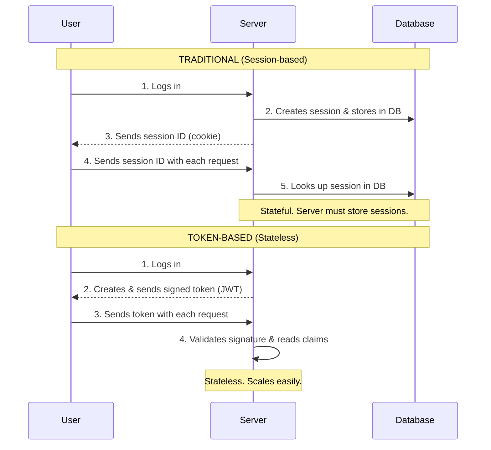
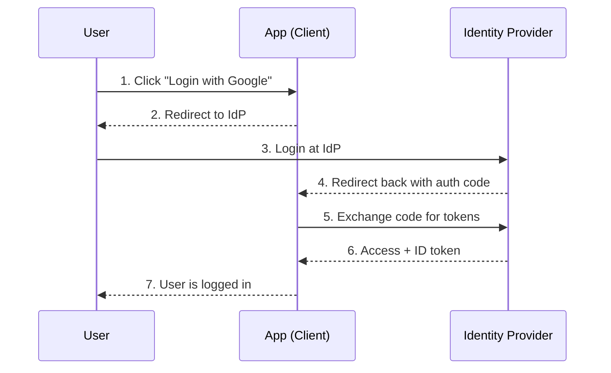
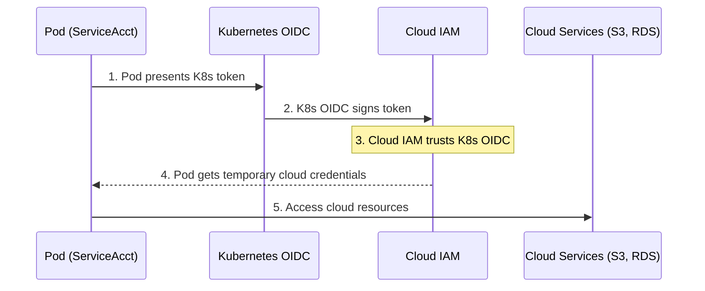

> **Complexity**: `[MEDIUM]`
>
> **Time to Complete**: 35-40 minutes
>
> **Prerequisites**: [Module 4.2: Defense in Depth](../module-4.2-defense-in-depth/)
>
> **Track**: Foundations

### What You'll Be Able to Do

After completing this module, you will be able to:

1. **Design** identity and access management architectures that enforce least privilege across human users, service accounts, and machine identities
2. **Implement** authentication and authorization patterns (OIDC, RBAC, ABAC, short-lived credentials) appropriate for different trust levels
3. **Evaluate** whether an IAM configuration prevents lateral movement by auditing permission scope, credential lifetime, and access review processes
4. **Analyze** access-related incidents to identify where over-permissioning, missing audit trails, or credential reuse enabled the breach
5. **Compare** workload identity federation against static cloud credentials and justify which to use for a given workload

---

**July 2020. Twitter's internal admin tools become a weapon.**

A 17-year-old from Florida convinces Twitter employees to surrender access to internal systems through a phone-based social engineering attack. With those credentials, the teenager gains entry to Twitter's admin panel — a tool designed for customer support that can take over any account on the platform without the owner's password, second factor, or recovery email being involved. The tool was trusted because it was internal; that trust became the breach.

Within hours, the accounts of Barack Obama, Elon Musk, Bill Gates, Apple, Uber, and dozens of other high-profile users tweeted the same message: send Bitcoin to this address and get double back. A classic scam, but with unprecedented reach. 130 accounts compromised. $120,000 in Bitcoin stolen. Twitter's stock dropped four percent the next day. The reputational damage dwarfed the financial loss — the world saw that Twitter's identity and access controls allowed a teenager with a phone to hijack any account on the platform, and regulators in three countries opened investigations.

The vulnerability wasn't technical in the way most engineers think about vulnerabilities. Twitter had authentication; employees logged in with credentials and a second factor. The problem was authorization: too many employees held access to an admin tool that could control any account, the tool offered no graduated permissions for sensitive actions, and there was no separate approval flow for high-risk operations like resetting a verified user's email. Least privilege wasn't enforced. Access wasn't audited in real time. One compromised support engineer became, effectively, root for the entire platform.

This module teaches identity and access management — how to authenticate who someone is, authorize what they can do, scope every permission to the smallest useful surface, and ensure the principle of least privilege limits the damage when (not if) a credential is compromised. By the end you will be able to read an existing IAM design and tell whether it prevents a Twitter-style failure or invites one.

---

## Why This Module Matters

Every security incident eventually reduces to a single question: "Who did this, and why were they allowed to?" Forensics teams trace the answer through logs that depend entirely on identity being meaningful, and remediation depends on access being scoped tightly enough that the answer to "why were they allowed to" isn't simply "because everyone was allowed to do everything." If you cannot answer that question crisply for any action in your system, you do not have an IAM system; you have a logging system that records mysteries.

Identity and Access Management (IAM) is the foundation of security. Network controls, encryption, and runtime protections all rest on the assumption that the system can tell who is making a request and decide whether they should be granted it. Get IAM wrong and the strongest network perimeter only delays the attacker; get it right and even a compromised credential triggers a small, contained, auditable blast.

This module teaches you the principles of authentication (proving identity) and authorization (granting access), then builds those principles into concrete patterns: RBAC in Kubernetes, OAuth and OIDC for web applications, ServiceAccount scoping for workloads, and federated workload identity for cloud access. The same conceptual framework applies whether you are securing a Kubernetes cluster, an AWS account, a SaaS admin panel, or an internal microservice — the names of the primitives change, but the questions you must answer about each request do not.

> **The Bouncer Analogy**
>
> A nightclub bouncer does two jobs at the door: check your ID (authentication) and decide if you can enter (authorization). They are different questions handled in sequence. You might present a valid ID and still be turned away because you are not on the guest list, dressed appropriately, or because the venue is at capacity. Inside, a second layer of authorization might decide whether you can enter the VIP room — same person, different resource, different decision. In systems, authentication proves who you are once; authorization decides what you can do many times, on every request.

---

## What You'll Learn

This module is organized as a progression from individual concepts to integrated patterns. Part 1 covers authentication factors and the methods used to prove identity. Part 2 covers authorization models — ACL, RBAC, ABAC — and shows how to debug a real over-privileged Kubernetes binding. Part 3 grounds least privilege in concrete implementation steps. Part 4 explores token-based authentication, JWTs, and OAuth/OIDC. Part 5 covers service identity, ServiceAccount design, and workload identity federation including a concrete IAM trust policy example. Each part builds on the previous one; do not skip ahead, because Part 5 quietly assumes you can already read RBAC fluently.

---

## Part 1: Authentication Fundamentals

### 1.1 What is Authentication?

Authentication answers exactly one question: **"Who are you?"** It is the process of verifying that an entity making a request is actually the entity it claims to be. Authentication does not decide whether the request should succeed, what data the entity can see, or whether the action is wise — it only confirms identity. Conflating it with the other security concerns is one of the most common architectural mistakes in early-career engineers, and untangling that confusion is half the work of becoming senior in this area.

Authentication is a yes/no decision based on a presented claim and a presented proof. The claim is "I am alice@example.com." The proof might be a password, a TLS client certificate, a signed JWT, a fingerprint, or a hardware token's response to a challenge. The system compares the proof to a stored expectation — a hashed password, a public key, a trusted issuer's signature — and either accepts or rejects the claim.

#### Authentication Flow



#### What Authentication Is Not

A successful authentication does not imply a successful action. The system has confirmed Alice is Alice; it has not confirmed Alice may delete the production database, view another user's medical records, or change the company's billing address. A successful authentication also does not log what Alice did — that is auditing, a separate subsystem that consumes the authenticated identity as input. And it does not protect the data in transit between Alice and the server — that is transport encryption, typically TLS, which runs orthogonally to authentication.

| Concern | Question Answered | Subsystem |
|---------|-------------------|-----------|
| Authentication | Who are you? | Identity provider, password store, certificate authority |
| Authorization | What can you do? | RBAC engine, policy engine (OPA), IAM |
| Auditing | What did you do? | Log pipeline, SIEM, audit log |
| Encryption | Can someone read this in transit? | TLS, mTLS, application-layer encryption |

> **Stop and think**: If a user is successfully authenticated, does that mean they can modify any data in the system? Why or why not? Sketch one sentence justifying your answer before reading on. The answer should reference the table above.

### 1.2 Authentication Factors

Authentication factors are categories of proof, and the security guarantee of multi-factor authentication comes from forcing an attacker to compromise multiple categories — not multiple instances of the same category. Two passwords are not two factors; they are one factor used twice. The categories are something you know, something you have, and something you are, and their security properties differ enough that mixing them produces a non-linear improvement in resistance to compromise.

#### Something You Know

Examples include passwords, PINs, and security questions. Knowledge factors are easy to implement because they require no special hardware and no biometric capture, but they are the weakest factor in practice because they can be guessed, phished, shoulder-surfed, dumped from breached databases, and reused across services. Users pick weak passwords, reuse them across dozens of accounts, and write them on sticky notes — every empirical study of password hygiene finds the same depressing pattern, year after year.

#### Something You Have

Examples include phones (receiving SMS or running a TOTP app), hardware security keys (YubiKey, Titan), and smart cards. Possession factors are harder to steal remotely because they require physical access to a specific device, but they can still be lost, physically stolen, or — in the case of SMS — hijacked through SIM swapping. Hardware security keys are the strongest member of this category because they perform a cryptographic challenge-response that cannot be phished even if the user is fooled into typing into a malicious site.

#### Something You Are

Examples include fingerprints, face geometry, retina patterns, and voice characteristics. Biometric factors are always with the user and hard to forge with current technology, but they have a unique weakness: they cannot be revoked or rotated. If your password leaks, you change it; if your fingerprint template leaks from a poorly secured database, you cannot grow new fingertips. Biometrics also struggle with false positives and negatives at scale and raise legitimate privacy concerns that other factors do not.

#### Multi-Factor Authentication (MFA)

MFA combines two or more factors from different categories. A password (know) plus a TOTP code (have) is genuinely stronger than either alone because compromising both factors requires two different attack techniques: a password-stealing technique (phishing, database dump, keylogger) and a possession-stealing technique (physical theft, SIM swap, malware on the user's phone). The mathematical effect is closer to multiplication than addition — even modest factor strengths combine into strong protection.

### 1.3 Authentication Methods

| Method | Factor | Security | Usability |
|--------|--------|----------|-----------|
| **Password** | Know | Low (if weak) | High |
| **Password + TOTP** | Know + Have | Medium-High | Medium |
| **Password + Hardware Key** | Know + Have | High | Medium |
| **Certificate (mTLS)** | Have | High | Low (complex setup) |
| **SSO/OIDC** | Delegated | Depends on IdP | High |
| **Passwordless (WebAuthn)** | Have | High | Medium-High |

Choosing a method is a trade-off between security, usability, and deployability. Hardware keys and mTLS are excellent on security but introduce friction: hardware keys cost money and can be lost, and mTLS demands a working PKI with rotation, revocation, and trust-store management — three non-trivial sub-systems. SSO/OIDC offloads identity to a dedicated provider, which is usually a strict improvement because identity providers do nothing but authenticate users and have invested heavily in the problem, but it concentrates risk: a breach of your IdP is a breach of every downstream system that trusts it. Passwordless WebAuthn is rapidly becoming the default recommendation for new consumer-facing systems because it combines a phishing-resistant factor with strong usability, but its adoption depends on the user's browser and platform supporting it.

> **Try This (2 minutes)**
>
> List the authentication methods you use daily:
>
> | Service | Method | Factors | Could be stronger? |
> |---------|--------|---------|-------------------|
> | | | | |
> | | | | |
> | | | | |

---

## Part 2: Authorization Fundamentals

### 2.1 What is Authorization?

Authorization answers a different question: **"What can you do?"** Once authentication has confirmed an identity, authorization runs on every request and decides whether that identity may perform the requested action on the requested resource. Authentication is rare and expensive (it might involve a network call to an IdP); authorization is frequent and cheap (it should be a fast in-memory check against a precomputed policy). Confusing the two leads to systems that authenticate carefully and then authorize carelessly — which is exactly the failure mode at Twitter in 2020.

Every authorization decision takes four inputs and produces one output. The inputs are the authenticated identity (who), the action (what), the resource (which), and the context (additional factors like time, IP address, or device posture). The output is allow or deny. Designing an authorization system means deciding, for every (who, what, which) triple your system supports, what the answer should be — and how that answer is encoded so that it can be reviewed, audited, and changed without bringing down the system.

| Input | Example | Where It Comes From |
|-------|---------|---------------------|
| WHO | `alice@example.com`, ServiceAccount `frontend-sa` | Authentication subsystem |
| WHAT | `read`, `write`, `delete`, `create` | API request method or RPC name |
| WHICH | `/api/users/123`, `pod/payments-7d` | API request path or resource ID |
| CONTEXT | Time of day, source IP, MFA satisfied | Request metadata, session state |

Concretely, when Alice issues `DELETE /api/users/123`, the authorization layer must check both that Alice has any permission to delete users in general and that she has permission to delete user 123 specifically. The first is a coarse class-level check; the second may require evaluating ownership, organization membership, or a tag on the resource. Confusing class-level and instance-level checks is another common bug — a system may correctly enforce "Alice can delete users" while completely failing to check that the user being deleted is one she should be allowed to touch.

### 2.2 Authorization Models

Three models dominate real-world systems, and you should be able to draw the trade-offs between them on a whiteboard from memory by the end of this section. The models differ in where permissions live, how they scale with user count, and how readable the resulting policies are when an auditor asks "who can delete production secrets?"

#### Access Control List (ACL)

Permissions are attached directly to each resource. The resource carries the answer to "who may touch me," and an authorization decision is a lookup on that list.

```text
/api/users:
    alice: read, write
    bob: read
    carol: read, write, delete
```

ACLs are simple to reason about for a small system because each resource visibly lists its allowed users. They become unmanageable at scale: with 500 users and 50 applications, the worst case is 25,000 individual entries, and changing one user's role across the organization means editing every resource they touch. ACLs are still common inside small services and on filesystems precisely because the simplicity wins when the entry count is low.

#### Role-Based Access Control (RBAC)

Permissions are attached to roles, and users are assigned to roles. The authorization decision becomes two lookups: which roles does the user have, and what permissions do those roles grant?

```text
Roles:
    viewer: read
    editor: read, write
    admin: read, write, delete

Assignments:
    alice → editor
    bob → viewer
    carol → admin
```

RBAC scales because changes happen in two layers that grow at different rates: roles change rarely and are designed by humans, while user-to-role assignments change frequently as people join, leave, and switch teams. Promote alice to admin and her permissions update instantly, everywhere. The trade-off is role explosion: in a large organization you may end up with hundreds of fine-grained roles ("orders-editor-eu," "orders-viewer-eu," "orders-editor-us") and the role catalog itself becomes a thing that needs governance.

#### Attribute-Based Access Control (ABAC)

Policies evaluate attributes of the user, the resource, and the context, and deliver a decision per request. ABAC is used in policy engines like AWS IAM and Open Policy Agent.

```text
Policy: "Allow if user.department == resource.owner.department AND time.hour >= 9 AND time.hour < 17"
```

ABAC is the most expressive model — anything you can compute from request attributes can be encoded in a policy, including conditions that RBAC cannot express like "only during business hours" or "only from corporate network." The cost is comprehension: a policy that combines five attributes with boolean logic is harder for a human to audit than a role with a list of permissions, and the entire authorization state is implicit in the policy rather than enumerable. Most production systems use a hybrid — RBAC for the coarse structure and ABAC conditions to refine it.

| Model | Best For | Worst At | Typical Use |
|-------|----------|----------|-------------|
| ACL | Small systems with few resources | Scaling user count | Filesystems, S3 bucket ACLs |
| RBAC | Organizations with stable role catalog | Conditional logic | Kubernetes, enterprise apps |
| ABAC | Fine-grained, conditional policies | Human auditability | AWS IAM conditions, OPA |

> **Pause and predict**: If you have 500 users and 50 applications, how many permission assignments would you need to manage with ACLs compared to RBAC? Write down both numbers before scrolling. The answer is roughly 25,000 versus 1,000, and the order-of-magnitude gap is the entire reason RBAC won.

### 2.3 RBAC in Practice — A Worked Example

#### Problem Statement

You're the on-call SRE during an incident. Alice, a junior developer on the orders team, needs to look at pod logs in the `production` namespace to help diagnose why orders are timing out. Right now, Alice has no Kubernetes access at all because she joined two weeks ago. Two team members on Slack are pushing different fixes:

- One says: "Just give her cluster-admin for the day, we'll clean up tomorrow."
- The other says: "Add her to the existing `developers` ClusterRole — that's what everyone else uses."

You decide both are wrong, and you're going to scope her access correctly. Walk through the diagnostic process with me.

#### Step 1 — What Action Does She Actually Need?

Start from the action, not from any existing role. Alice needs to read pod logs. In Kubernetes API terms, that is the verbs `get`, `list`, and `watch` on the resource `pods`, plus the verb `get` on the sub-resource `pods/log`. She does not need to create, delete, exec into, or port-forward to pods. She does not need access to secrets, configmaps, or deployments. Writing this down explicitly — before opening any YAML — is the single most important step, because every later decision is a constraint check against this list.

#### Step 2 — What Scope Is Acceptable?

Now ask three scoping questions in order: which namespaces, which resources within them, and for how long. Alice needs the `production` namespace only — not `staging`, not `kube-system`, not the entire cluster. She needs `pods` and `pods/log`, not all resources. She needs access for the duration of the incident, not permanently; in a mature setup we would issue a time-bound binding through a just-in-time access tool, but for now we will note "review and remove tomorrow" as an explicit follow-up.

#### Step 3 — Eliminate the Wrong Suggestions

`cluster-admin` fails on every dimension: wrong scope (cluster, not namespace), wrong actions (everything, not read), wrong duration (permanent unless someone remembers to remove it). The existing `developers` ClusterRole probably fails too, because "what every developer has" is almost certainly broader than "what Alice needs to read logs during one incident" — and granting Alice that role normalizes the over-permission for the next person. Choose the smallest possible binding that solves Alice's actual need.

#### Step 4 — Write the Minimum Viable Binding

```yaml
# Define what actions are allowed (Role, scoped to one namespace)
apiVersion: rbac.authorization.k8s.io/v1
kind: Role
metadata:
  name: pod-reader
  namespace: production
rules:
- apiGroups: [""]
  resources: ["pods", "pods/log"]
  verbs: ["get", "list", "watch"]
---
# Bind role to identity (RoleBinding, scoped to one namespace)
apiVersion: rbac.authorization.k8s.io/v1
kind: RoleBinding
metadata:
  name: alice-read-pods-incident-2025-11-04
  namespace: production
subjects:
- kind: User
  name: alice@example.com
  apiGroup: rbac.authorization.k8s.io
roleRef:
  kind: Role
  name: pod-reader
  apiGroup: rbac.authorization.k8s.io
```

Notice three deliberate choices in this YAML. First, we used `Role` and `RoleBinding`, not their cluster-scoped counterparts — this restricts Alice to the `production` namespace and nothing else. Second, the `resources` list explicitly includes both `pods` and `pods/log`, because in Kubernetes RBAC a sub-resource like `pods/log` is checked separately and forgetting to grant it is a common bug. Third, the RoleBinding name encodes the date and reason ("incident-2025-11-04") so that a future audit immediately surfaces "what was this for, and is it still needed?"

#### Step 5 — Verify

After applying, verify by impersonating Alice with `kubectl auth can-i`:

```bash
kubectl auth can-i list pods --namespace production --as alice@example.com
# yes

kubectl auth can-i delete pods --namespace production --as alice@example.com
# no

kubectl auth can-i list pods --namespace staging --as alice@example.com
# no
```

If any of those answers were wrong, you would catch it in seconds rather than during the incident. The diagnostic process — action, scope, duration, eliminate, write, verify — is the same one you will apply to every IAM problem in this module, regardless of whether the system is Kubernetes, AWS IAM, or a SaaS product. Internalize the sequence; the tool-specific YAML changes, the diagnostic does not.

---

## Part 3: The Principle of Least Privilege

### 3.1 What is Least Privilege?

The principle of least privilege states that every identity — human or machine — should hold the minimum set of permissions required to perform its function, and no more. The principle is older than computing; it appears in Saltzer and Schroeder's 1975 paper on protection, where they listed it as one of eight design principles for secure systems. Half a century later it remains the most violated principle in operational practice, because granting permissions is fast and revoking them is uncomfortable, so permissions accumulate by default.

Least privilege matters across three failure scenarios that play out in production every week. When an identity is compromised by an attacker, the blast radius is bounded by what that identity could do — a developer account that can only read its own team's resources cannot exfiltrate the whole company's data even if the attacker holds it for a year. When an authenticated user makes an honest mistake, least privilege limits the mistake's reach: a typo cannot delete what the user could not have deleted on purpose. When an insider acts maliciously, least privilege forces them to either work within their granted scope (limited damage) or visibly request more access (creating an audit trail and an opportunity to intervene).

| Scenario | Without Least Privilege | With Least Privilege |
|----------|------------------------|----------------------|
| Compromised credential | Attacker has broad access, can pivot freely | Attacker is contained to one role's surface |
| Honest mistake | Mistake can affect any resource | Mistake is bounded by granted scope |
| Insider threat | Insider can quietly access anything | Insider must request more access, creating evidence |

### 3.2 Implementing Least Privilege

Least privilege is not a setting you toggle; it is a discipline that must be applied at four distinct layers, and skipping any layer leaves a hole that the others cannot patch.

#### Start With Zero (Default Deny)

A new identity should arrive with no permissions and acquire each one through a deliberate request. The opposite — granting an admin role on creation and trimming back later — never works in practice because nobody trims back. Every system that supports it should be configured to default-deny, including Kubernetes RBAC (the default), AWS IAM (the default), and any custom application authorization layer you build. If your system's default is "permit," that is the first bug to fix.

#### Scope Permissions Narrowly

Narrow permissions along three axes simultaneously: action, resource, and context. "Admin" is too broad in every direction. "Editor" narrows the action axis. "Orders-editor" narrows the resource axis as well. "Orders-editor in EU region during business hours" narrows the context axis too. Each axis you narrow shrinks the blast radius further, and the cost of narrowing is one-time design work that pays off forever.

#### Time-Bound Elevated Access

Standing privileges are a permanent attack surface. Every permission an engineer "might need someday" is a permission an attacker definitely has today if they steal that engineer's session. Modern teams replace standing privileges with just-in-time access: the engineer requests elevated permissions for a specific task, the system grants them for a short window (often four hours, never more than a day), and they expire automatically. The friction of requesting access feels worse than standing privileges for about a week, and after that the team forgets it was ever a problem.

#### Separate Concerns

A workload that does many things should not be one identity with many permissions; it should be many identities, each with the permissions for one thing. The web frontend gets one ServiceAccount with one set of permissions. The background job runner gets a different ServiceAccount with a different set. The metrics exporter gets a third. If any of them is compromised, only that workload's surface is exposed — not all of them at once.

### 3.3 Common Violations

| Violation | Risk | Fix |
|-----------|------|-----|
| Everyone is admin | No accountability, full blast radius | Role-based access |
| Shared credentials | Cannot attribute actions | Individual accounts |
| Permanent elevated access | Ongoing exposure | Just-in-time access |
| Over-provisioned service accounts | Broad access on compromise | Minimal permissions per service |
| Forgotten accounts | Dormant attack vector | Regular access reviews |
| Wildcard permissions | Hidden capabilities, surprise on audit | Explicit verb and resource lists |

> **War Story: The $4.2 Million CI/CD Catastrophe**
>
> **March 2021.** A fast-growing e-commerce company gave their CI/CD pipeline broad Kubernetes admin access. "It needs to deploy, and sometimes fix things," the DevOps lead explained to anyone who asked, and the permissions accumulated over two years of "just add this one thing." Nobody had ever subtracted from the pipeline's role.
>
> A junior engineer submitted a pull request to update deployment scripts. A typo changed `kubectl apply -f deployment.yaml` to `kubectl delete -f deployment.yaml`. Code review missed it because the diff looked tiny and the PR was marked low-risk. CI/CD merged the change and ran the script against production.
>
> **In under a minute, the pipeline deleted twenty-three production services, three databases, and two years of customer order history.**
>
> The team had backups, but restoration took fourteen hours because the backup process itself depended on services the pipeline had deleted. The outage occurred on the second-busiest sales day of the quarter. **Total impact: $4.2 million in lost sales plus $800,000 in emergency recovery costs.**
>
> Post-incident analysis revealed the pipeline had permissions to delete any resource in any namespace — permissions it had never legitimately needed because production deletes were always done manually by the SRE team. After the incident, they implemented least privilege: CI/CD can create and update deployments in specific namespaces, it cannot delete, it cannot access databases, and it cannot modify networking or RBAC. The recovery took fourteen hours, but the redesign that prevented every future incident of this class took six. They wished, painfully and publicly, that they had done it first.

---

## Part 4: Token-Based Authentication

### 4.1 How Tokens Work

A web request happens far from the login event that authenticated the user, often on a different server, sometimes minutes or hours later. The system needs a way to remember "this request is from Alice, who logged in earlier." Two patterns dominate: server-side sessions and signed tokens. They differ in where the trust state lives — on the server or in the request itself — and that difference cascades into different operational properties at scale.



Sessions are simple to reason about and easy to revoke — delete the session row and the user is logged out everywhere. They scale poorly because every request requires a database lookup and because the database becomes a coordination point across all your application servers. Signed tokens flip the trade-off: the token carries its own authenticity proof (a signature), so any server can validate it without a database lookup, but revoking a token before it expires is hard precisely because there is no central record to delete. Most production systems pick tokens for their scaling properties and accept the revocation pain — short token lifetimes plus a small revocation list cover most cases.

> **Stop and think**: If a stateless JWT is stolen, can the server invalidate it by simply deleting a session in the database? Why or why not? Sketch your reasoning before reading the next section, which will give you the precise answer.

### 4.2 JSON Web Tokens (JWT)

A JWT is three base64url-encoded JSON segments separated by dots: `HEADER.PAYLOAD.SIGNATURE`. Each segment serves a specific purpose, and understanding them lets you read a JWT off the wire and tell at a glance whether the system using it is configured safely.

#### Header

```json
{
  "alg": "RS256",
  "typ": "JWT"
}
```

The header declares the signing algorithm and token type. The single most important field is `alg`, and the single most dangerous historical bug in JWT implementations was libraries that accepted `alg: none` and treated unsigned tokens as valid. A safe verifier pins the expected algorithm and rejects anything else.

#### Payload (Claims)

```json
{
  "sub": "alice@example.com",
  "aud": "api.example.com",
  "iat": 1700000000,
  "exp": 1700003600,
  "roles": ["editor"]
}
```

The payload contains claims about the subject. Standard claims include `sub` (the subject — who the token is about), `aud` (the audience — who the token is for), `iat` (issued at), `exp` (expires at), and `iss` (issuer — who minted the token). Custom claims can carry application-specific information like roles or tenant IDs. A correct verifier checks `iss` matches an expected issuer, `aud` matches the current service, and `exp` is in the future — skipping any of these is a hole.

#### Signature

The signature is HMAC-SHA256 (symmetric) or RSA/ECDSA (asymmetric) over the header-and-payload bytes. The verifier recomputes the signature from the bytes it received and compares to the signature in the token; any tampering with header or payload changes the bytes and fails the comparison. Asymmetric signatures are preferred when the verifier and issuer are different services, because they let the verifier hold only the public key — even a full compromise of the verifier cannot mint new tokens.

> **CRITICAL**: Never trust claims without verifying the signature. A JWT whose signature you have not checked is a piece of attacker-controlled JSON.

### 4.3 OAuth 2.0 and OpenID Connect

OAuth 2.0 is a delegation protocol: it lets a user grant a third-party application limited access to a resource (their email, their photos, their cloud storage) without sharing the password. OpenID Connect (OIDC) is a thin layer on top of OAuth 2.0 that adds an identity claim — the ID token, a JWT — so that applications can use OAuth not just to access resources but to log users in. The two are nearly always discussed together because almost every modern login-with-Google flow uses OIDC, even when developers casually call it "OAuth."



The two-step exchange (auth code, then tokens) exists for a specific reason: the auth code is delivered through the user's browser, which is an untrusted channel where browser extensions, history, and referrer headers can leak it; the tokens are delivered through a direct server-to-server call where the channel is trusted. A code is useless without the client secret needed to exchange it, so a leaked code is recoverable; a leaked access token is immediately usable. The flow is engineered to put the dangerous artifact on the safe channel.

> **Try This (3 minutes)**
>
> Decode a JWT at jwt.io. Examine:
> - What's in the header?
> - What claims are in the payload?
> - When does it expire?
> - What would happen if you changed a claim without re-signing?

---

## Part 5: Service Identity

### 5.1 Machine-to-Machine Authentication

Human authentication and service authentication look superficially similar — both prove identity to a server — but the design constraints diverge sharply. Humans can solve CAPTCHAs, type one-time codes, and tap a hardware key; services cannot. Humans authenticate occasionally and hold a session; services authenticate millions of times per day and benefit from caching. Humans are individuals; services often run as many identical instances behind a load balancer. Designing service authentication as if it were human authentication, or vice versa, produces systems that are simultaneously too inconvenient and too insecure.

| Dimension | Humans | Services |
|-----------|--------|----------|
| Interactivity | Interactive login | Automated, headless |
| Cardinality | One person, multiple sessions | One service, many replicas |
| Verification | Can verify manually if confused | Must be deterministic |
| Credential type | Password + MFA | API key, certificate, federated token |
| Lifetime | Hours to weeks | Minutes to hours, ideally |

#### Service Authentication Methods

**API Keys** are long-lived secret strings. They are simple to issue and simple for services to use, but they are risky because a leaked key can be used by anyone who finds it, rotation across many running instances is painful, and there is no built-in expiration. API keys are appropriate for prototypes and for systems where the surrounding ecosystem cannot do better; they are not appropriate for new production designs.

**Client Certificates (mTLS)** give each service a cryptographic identity tied to a private key that should never leave the service. They are strong because the key is hard to exfiltrate from a properly configured service, and they support fine-grained revocation through a CRL or OCSP. The cost is operational: you need a working PKI with issuance, rotation, revocation, and trust-store distribution — four sub-systems that fail in interesting ways at scale.

**Short-Lived Tokens** are issued by an identity provider, expire quickly (typically minutes to a few hours), and are refreshed automatically by the service's runtime. Even if a token leaks, the attacker has only the remaining lifetime to use it before it becomes worthless. Examples include Kubernetes ServiceAccount projected tokens, AWS IAM Roles for Service Accounts (IRSA), and Google Cloud Workload Identity. This is the pattern modern designs reach for first, because the operational cost is low (the runtime handles refresh) and the security properties are strong.

### 5.2 Kubernetes Service Accounts — A Worked Example

#### Problem Statement

A new developer pages you at 3am. Their `payments-api` Pod in the `production` namespace is in `CrashLoopBackOff`. The container logs show:

```
FATAL: failed to load configuration from ConfigMap 'payments-config': forbidden
```

Two suggestions appear in the chat:

- "Add `cluster-admin` to the default ServiceAccount, just for tonight."
- "Use the same ServiceAccount as the `orders-api` Pod — that one already works."

Both will get the Pod running. Both are wrong. Walk through the diagnostic process.

#### Step 1 — What Is the Pod Actually Asking For?

Read the error before changing anything. The Pod is trying to read a specific ConfigMap (`payments-config`) and is being denied. That tells you three things: the Pod is using the Kubernetes API (otherwise no RBAC check would fire), the API call is a `get` on a ConfigMap, and the current ServiceAccount is missing that permission. The Pod is not asking for cluster-admin; it is asking for one verb on one resource by one name.

#### Step 2 — What ServiceAccount Is the Pod Currently Using?

```bash
kubectl get pod payments-api -n production -o jsonpath='{.spec.serviceAccountName}'
# default
```

The Pod is using the namespace's `default` ServiceAccount, which has no RBAC bindings of its own. That is why the API call is denied — the identity exists, but no role grants it any permission.

#### Step 3 — What Are the Two Suggestions Doing Wrong?

Granting `cluster-admin` solves the symptom (the Pod can now read the ConfigMap) by handing it permission to also delete every resource in every namespace, modify RBAC itself, and read every secret in the cluster. The blast radius if the payments container is ever compromised goes from "one Pod" to "the entire cluster." Reusing the `orders-api` ServiceAccount may grant unrelated permissions the payments service should not have, couples two services' identities so a future change to one breaks the other, and destroys auditability — when the audit log shows "ServiceAccount `orders-api` read a secret," you can no longer tell which Pod actually did it.

#### Step 4 — Build the Minimum Viable ServiceAccount

The correct fix is a dedicated ServiceAccount with the smallest possible Role.

```yaml
# Service Account with minimal permissions
apiVersion: v1
kind: ServiceAccount
metadata:
  name: payments-api
  namespace: production
---
# Role with only the needed permission, scoped to one ConfigMap by name
apiVersion: rbac.authorization.k8s.io/v1
kind: Role
metadata:
  name: payments-api-config-reader
  namespace: production
rules:
- apiGroups: [""]
  resources: ["configmaps"]
  resourceNames: ["payments-config"]
  verbs: ["get"]
---
# Bind service account to role
apiVersion: rbac.authorization.k8s.io/v1
kind: RoleBinding
metadata:
  name: payments-api-binding
  namespace: production
subjects:
- kind: ServiceAccount
  name: payments-api
  namespace: production
roleRef:
  kind: Role
  name: payments-api-config-reader
  apiGroup: rbac.authorization.k8s.io
---
# Pod using the service account
apiVersion: v1
kind: Pod
metadata:
  name: payments-api
  namespace: production
spec:
  serviceAccountName: payments-api
  automountServiceAccountToken: true  # The app legitimately needs API access
  containers:
  - name: app
    image: payments-api:v1
```

Three things in this YAML are doing real work. First, `resourceNames: ["payments-config"]` restricts the Role to one specific ConfigMap by name — even if a future bug causes the app to enumerate all ConfigMaps, the API will deny it. Second, `automountServiceAccountToken: true` is set explicitly with a comment, so a future reader knows it is intentional and not a leftover default. Third, the Role grants only `get`, not `list` or `watch`, because the app reads a known-named ConfigMap once at startup — `list` would let an attacker enumerate other ConfigMaps if they ever pivoted into this Pod.

#### Step 5 — Verify

```bash
kubectl auth can-i get configmap/payments-config -n production --as system:serviceaccount:production:payments-api
# yes

kubectl auth can-i list configmaps -n production --as system:serviceaccount:production:payments-api
# no

kubectl auth can-i get secrets -n production --as system:serviceaccount:production:payments-api
# no
```

The Pod can read exactly the one ConfigMap it needs, and nothing else. If a future engineer compromises this Pod through an application vulnerability, they cannot list other ConfigMaps, read any secret, or pivot to another resource through this identity. That is least privilege made concrete.

### 5.3 Workload Identity

The hardest version of service authentication is "the service runs in Kubernetes but needs to call a cloud API like S3 or Cloud Storage." The naive solution is to bake an AWS access key (or GCP service account JSON) into a Kubernetes Secret and mount it into the Pod. That solution leaks credentials in a dozen ways: anyone with read access to Secrets in that namespace can exfiltrate them, the credentials are long-lived so leaks are catastrophic, and rotation requires coordinating across every Pod that holds them. Workload identity replaces this entire pattern with a federated trust model.



The mechanism in plain language: the Kubernetes API server acts as an OIDC issuer that mints short-lived JWTs identifying each Pod's ServiceAccount. The cloud's IAM service is configured to trust that OIDC issuer for specific identities, and when a Pod presents its JWT, the cloud exchanges it for short-lived cloud credentials scoped to a cloud IAM role. No long-lived secret ever touches the Pod, the Kubernetes Secret, or the Pod's image.

#### Concrete Example: AWS IRSA Trust Policy

The piece that makes the federation work is an IAM trust policy on the AWS side that says "trust tokens from this specific Kubernetes cluster, but only for this specific ServiceAccount in this specific namespace." Without that policy, the federation does nothing; with it, an attacker who steals a token from the wrong namespace cannot use it to assume the role.

Here is the trust policy for an IAM role named `payments-api-s3-reader`, intended to be assumed only by the `payments-api` ServiceAccount in the `production` namespace of an EKS cluster:

```json
{
  "Version": "2012-10-17",
  "Statement": [
    {
      "Effect": "Allow",
      "Principal": {
        "Federated": "arn:aws:iam::123456789012:oidc-provider/oidc.eks.us-east-1.amazonaws.com/id/EXAMPLED539D4633E53DE1B71EXAMPLE"
      },
      "Action": "sts:AssumeRoleWithWebIdentity",
      "Condition": {
        "StringEquals": {
          "oidc.eks.us-east-1.amazonaws.com/id/EXAMPLED539D4633E53DE1B71EXAMPLE:sub": "system:serviceaccount:production:payments-api",
          "oidc.eks.us-east-1.amazonaws.com/id/EXAMPLED539D4633E53DE1B71EXAMPLE:aud": "sts.amazonaws.com"
        }
      }
    }
  ]
}
```

Read this policy slowly because every clause does load-bearing work. The `Federated` principal names exactly which OIDC issuer is trusted — the cluster's own OIDC endpoint. The `Condition` block then narrows the trust to a single ServiceAccount: the `sub` claim must be `system:serviceaccount:production:payments-api`, meaning a token from the `default` namespace, the `staging` namespace, or any other ServiceAccount in `production` will fail the condition even though it comes from a trusted issuer. The `aud` claim must be `sts.amazonaws.com`, which prevents a token issued for some other audience (say, an internal service-to-service call) from being replayed against AWS STS.

The corresponding Kubernetes-side configuration annotates the ServiceAccount with the IAM role to assume:

```yaml
apiVersion: v1
kind: ServiceAccount
metadata:
  name: payments-api
  namespace: production
  annotations:
    eks.amazonaws.com/role-arn: arn:aws:iam::123456789012:role/payments-api-s3-reader
```

When a Pod uses this ServiceAccount, the EKS Pod Identity webhook injects environment variables (`AWS_ROLE_ARN`, `AWS_WEB_IDENTITY_TOKEN_FILE`) into the container, and the AWS SDK automatically calls `sts:AssumeRoleWithWebIdentity` to swap the projected ServiceAccount token for short-lived AWS credentials — typically valid for one hour. The Pod never sees a static AWS access key, and an attacker who somehow extracts the token from the Pod gets one hour of access scoped to one IAM role's permissions, then nothing.

The equivalent on Google Cloud (Workload Identity Federation) and Azure (Workload Identity) follows the same shape: annotate a Kubernetes ServiceAccount with the cloud identity it should map to, configure the cloud IAM side to trust the cluster's OIDC issuer for that specific ServiceAccount, and let the SDK's credential chain handle the token exchange. The trust-policy condition is the central security artifact in all three; if you understand the AWS example above, the GCP and Azure equivalents will read as variations on the same theme.

---

## Did You Know?

- **OAuth was invented in 2006** by Blaine Cook while building Twitter's API. He needed a way to let third-party apps post tweets without giving them user passwords. The first specification was assembled at a meeting in a San Francisco coffee shop, and what became OAuth 1.0 was published a year later — a reminder that load-bearing internet protocols sometimes start as one team's pragmatic hack.

- **TOTP codes change every 30 seconds** by design. The server and your phone share a secret, and both compute HMAC(secret, time/30) on the fly with no network round-trip required. This is why TOTP works on a phone in airplane mode and why the codes drift if your phone's clock disagrees with the server by more than a minute or two — the underlying math depends on synchronized time, not synchronized state.

- **Kubernetes historically auto-generated long-lived secret tokens** for every ServiceAccount until v1.24. Modern versions (including v1.35) use the TokenRequest API to project short-lived, automatically rotating tokens directly into Pods, so the credential a Pod actually uses is never written to a Secret object and rotates roughly every hour by default. The change quietly removed an entire class of "I found a Kubernetes ServiceAccount token in a logfile from 2019" incidents.

- **Password complexity rules often backfire.** NIST's 2017 guidelines reversed decades of advice by recommending long passphrases over complex passwords and explicitly discouraging mandatory rotation. The security mathematics says "Tr0ub4dor&3" is weaker than "correct horse battery staple" because the complex password is hard for humans to remember (driving reuse and sticky-note storage) but easy for cracking rigs to enumerate, while the four-word phrase has more entropy and is genuinely memorable.

---

## Common Mistakes

| Mistake | Problem | Solution |
|---------|---------|----------|
| Same password everywhere | One breach compromises all accounts | Unique passwords plus password manager |
| No MFA on critical systems | Single factor easily bypassed by phishing or credential stuffing | MFA everywhere possible, hardware keys for admin |
| Overly broad roles ("admin for convenience") | More access than needed, large blast radius on compromise | Granular, purpose-specific roles |
| Long-lived tokens or API keys | Large exposure window if leaked, manual rotation pain | Short-lived tokens with automatic refresh |
| Shared service accounts across workloads | Cannot attribute actions, coupled blast radius | One ServiceAccount per workload |
| No periodic access review | Permissions accumulate, dormant accounts persist | Quarterly reviews, automated unused-permission detection |
| Wildcards in role rules (`verbs: ["*"]`) | Hidden capabilities granted by future API additions | Explicit verb and resource lists |
| Static cloud credentials in Pods | Long-lived secret in a high-blast-radius location | Workload identity federation |

---

## Quiz

1. **Scenario: A developer configures an API gateway to verify JWT signatures from Okta, but users report they can access administrative endpoints they shouldn't. Is this a failure of authentication or authorization, and what is the difference between the two in this context?**
   <details>
   <summary>Answer</summary>

   The failure is in authorization, not authentication. Authentication answers "Who are you?" — the API gateway successfully verified the JWT signature, confirming the users' identities via Okta. Authorization answers "What can you do?" — the system failed to check whether those authenticated users had the specific permissions required to reach administrative endpoints. Because the two processes are distinct, a system must explicitly enforce authorization rules after successfully authenticating a user, otherwise anyone with a valid Okta account can call any endpoint the gateway forwards. The fix is to add a per-endpoint authorization check (claims-based, RBAC, or policy-based) that runs after signature verification and before the request is proxied to the backend.
   </details>

2. **Scenario: An attacker manages to steal a database containing all user passwords for your application. If your application enforces MFA, why are the user accounts still secure? Explain how the different authentication factors work together.**
   <details>
   <summary>Answer</summary>

   The accounts remain secure because MFA requires multiple independent proofs of identity from different factor categories. Even with the password (something you know), the attacker still lacks the second factor — typically a TOTP code from the user's phone or a hardware key's challenge response (something you have). Compromising both factors simultaneously demands entirely different attack techniques, such as physical device theft or SIM swapping, and these techniques do not scale across millions of users the way a database dump does. The combined probability of mass exploitation drops by orders of magnitude, which is why MFA reliably prevents the credential-stuffing attacks that follow every major password breach.
   </details>

3. **Scenario: You are auditing a Kubernetes cluster and notice that the CI/CD pipeline's ServiceAccount has cluster-admin privileges, even though it only deploys to the 'frontend' and 'backend' namespaces. Walk through the diagnostic process you would use to fix this and produce the minimum viable RBAC configuration.**
   <details>
   <summary>Answer</summary>

   Start by listing what the pipeline actually does — apply Deployments, Services, ConfigMaps, and HorizontalPodAutoscalers in two named namespaces — and write that down before touching YAML. Map each action to verbs and resources: `create`, `update`, `patch`, and `get` on the relevant resources. Next, eliminate cluster-admin because it grants every verb on every resource cluster-wide, vastly exceeding the needed scope. Replace it with two `Role` objects (one per namespace) listing only the required verbs and resources, plus two `RoleBinding` objects binding those Roles to the pipeline's ServiceAccount in each namespace. Verify with `kubectl auth can-i` for both an allowed action (creating a Deployment in `frontend`) and a denied action (creating a Role in `kube-system`); if both answers are correct, the configuration is minimal and correct.
   </details>

4. **Scenario: A developer accidentally commits a credential to a public GitHub repository. Within minutes, bots scan it and attempt to use it. If the credential was a short-lived token versus a long-lived API key, how does the impact differ and why are short-lived tokens preferred?**
   <details>
   <summary>Answer</summary>

   A long-lived API key gives the attacker permanent access until a human discovers the leak and revokes the key — typically hours to days, sometimes never. A short-lived token (such as a 15-minute JWT or an STS credential with a one-hour TTL) gives the attacker only the remaining lifetime of that specific token. Even if exploitation begins instantly, the damage is bounded by the TTL and the attacker cannot replay the same token tomorrow. Short-lived credentials shift the security model from "depend on humans noticing leaks quickly" to "the credential becomes worthless on its own schedule," which is mathematically more reliable than any process built on human alertness.
   </details>

5. **Scenario: Your company is rapidly growing and adding new internal applications every week. The IT team is overwhelmed managing access for each new hire across dozens of systems using direct user-to-resource ACLs. How would migrating to Role-Based Access Control reduce this operational burden, and what is the mathematical difference in permission management?**
   <details>
   <summary>Answer</summary>

   With direct ACLs, 500 users across 50 applications can require up to 25,000 individual permission entries, and every role change forces IT to manually update entries on every system the user touches. RBAC introduces an abstraction layer where permissions are attached to roles, not users, and users are attached to roles. With ten standard roles you maintain about 500 user-to-role mappings plus roughly 500 role-to-permission mappings — roughly 1,000 total entries instead of 25,000. When a user changes jobs, IT updates a single role assignment and the change propagates across all 50 applications instantly, eliminating both the manual workload and the permission drift that comes from forgetting to update one of the systems.
   </details>

6. **Scenario: A support engineer's laptop is compromised via malware, giving attackers access to their active session in an internal admin tool. Based on the 2020 Twitter breach case study, what specific IAM authorization controls should have been in place to limit the blast radius of this compromised identity?**
   <details>
   <summary>Answer</summary>

   Even with a compromised active session, the blast radius could have been contained by stacking three controls on top of authentication. First, scoped permissions: the support tool should partition actions into tiers, where standard support staff can access ordinary user accounts but high-value targets (verified accounts, large followings, admin users) require a separate, much smaller permission set. Second, just-in-time elevation with multi-person approval for any sensitive action such as resetting a verified user's email or password — a two-person rule turns a single compromise into an attacker who must compromise two identities simultaneously. Third, step-up authentication that re-prompts for a hardware key on critical operations, which a session-hijacking malware cannot satisfy because the hardware key is physically attached to the legitimate user.
   </details>

7. **Scenario: While analyzing network traffic, you discover an attacker has intercepted a JWT token with `exp: 1700003600` (Unix timestamp). It is currently `1700000000`. How long does the attacker have to use this token, what actions can they perform, and why can't the server immediately detect the theft?**
   <details>
   <summary>Answer</summary>

   The attacker has 3,600 seconds — exactly one hour — before the token's expiration time arrives and the server begins rejecting it. During that window the attacker can perform any action the token's claims and the server's authorization policies allow for that subject, indistinguishably from the legitimate user. The server cannot detect the theft because the token is stateless: there is no session row to flag as suspicious, and the signature is genuinely valid because the legitimate issuer signed it. Mitigations are layered: short token lifetimes shrink the window, refresh-token rotation forces periodic re-authentication, and out-of-band signals (sudden source IP change, impossible-travel patterns) can trigger forced revocation through a small denylist that the verifier consults.
   </details>

8. **Scenario: During a penetration test, the red team exploits a remote code execution vulnerability in a simple Nginx web pod. They immediately pivot to query the Kubernetes API and list all secrets in the namespace. What specific ServiceAccount configuration enabled this lateral movement, why is it a risk, and what is the correct remediation?**
   <details>
   <summary>Answer</summary>

   The lateral movement was enabled because the Pod's ServiceAccount was configured with `automountServiceAccountToken: true` (often by default), which projects a valid Kubernetes API token into the Pod's filesystem at `/var/run/secrets/kubernetes.io/serviceaccount/token`. For a Pod whose only job is serving HTTP traffic, that token is unused capability waiting to be abused — a built-in escalation vector that turns any RCE into a Kubernetes API foothold. The remediation has two parts. First, set `automountServiceAccountToken: false` on the Pod or its ServiceAccount whenever the workload does not legitimately need API access, which is the common case for web servers, reverse proxies, and most data-plane workloads. Second, when API access is required, bind the ServiceAccount only to the precise verbs and resources needed (use `resourceNames` to scope to specific objects by name) so that even with a leaked token the attacker's options are tightly constrained.
   </details>

---

## Hands-On Exercise

**Task**: Design an IAM strategy for a microservices application end-to-end, then express the most security-sensitive piece in real Kubernetes RBAC.

**Scenario**: You're building an e-commerce platform with the following components:

- Web frontend (user-facing, served via CDN)
- API gateway (terminates TLS, authenticates users, routes to services)
- Order service (creates and updates orders)
- Inventory service (tracks stock levels)
- Payment service (talks to Stripe, holds card-on-file tokens)
- PostgreSQL database (orders, inventory, users)
- Redis cache (sessions, rate-limit counters)

The exercise has four parts and an explicit success criteria checklist. Work through them in order — the later parts depend on decisions you make in the earlier ones.

**Part 1: User Authentication (10 minutes)**

Design the user authentication flow. For each component, decide which method and how many factors. Justify your choices in a sentence.

| Component | Authentication Method | Factors |
|-----------|----------------------|---------|
| Web login | | |
| API access | | |
| Admin panel | | |

**Part 2: Service Authorization (10 minutes)**

Design service-to-service permissions. For each row, write the minimum set of calls required and explicitly note one thing each service must NOT be able to do.

| Service | Can Access | Permissions | Cannot Access |
|---------|------------|-------------|---------------|
| API Gateway | Order Service | read, write | |
| Order Service | | | |
| Inventory Service | | | |
| Payment Service | | | |

**Part 3: Database Access (10 minutes)**

Design database access. Each service should have its own database role with the smallest possible grant.

| Service | Database Access | Tables | Operations |
|---------|-----------------|--------|------------|
| Order Service | PostgreSQL | orders, order_items | SELECT, INSERT, UPDATE |
| | | | |
| | | | |

**Part 4: Kubernetes RBAC (10 minutes)**

Write a ServiceAccount, Role, and RoleBinding for the Order Service. Apply the worked-example diagnostic from Part 2.3: name the actions first, scope them, and only then write YAML. Include a comment on `automountServiceAccountToken` justifying your choice.

```yaml
# Your YAML here
```

**Success Criteria**:
- [ ] User authentication uses MFA for any operation that can move money or change account ownership
- [ ] Each service has only the permissions it needs, expressed as explicit verb/resource lists
- [ ] No service has more database access than required, and the Payment service does not share a database role with Order
- [ ] Kubernetes RBAC follows least privilege, scopes to the namespace, and the YAML's `automountServiceAccountToken` setting is explicit and commented
- [ ] You can explain in one sentence what would still be safe if any single service were compromised

---

## Further Reading

- **"OAuth 2.0 Simplified"** — Aaron Parecki. The clearest available explanation of OAuth flows, written by an author who has been involved in the standards work for a decade.
- **"Identity and Data Security for Web Development"** — Jonathan LeBlanc. A practical, code-first guide to implementing authentication and authorization in real systems.
- **NIST SP 800-63** — Digital Identity Guidelines. The authoritative standard for authentication assurance levels and the source of the "long passphrase, no mandatory rotation" guidance now adopted across the industry.

---

## Key Takeaways Checklist

Before moving on, verify you can answer these from memory rather than by scrolling back:

- [ ] Can you explain the difference between authentication (who are you?) and authorization (what can you do?) in one sentence each?
- [ ] Can you describe the three authentication factor categories and explain why MFA combining them is mathematically stronger than any one of them alone?
- [ ] Do you understand RBAC versus ACL versus ABAC and the conditions under which each one is the right choice?
- [ ] Can you walk through the diagnostic process for fixing an over-permissioned binding (action → scope → eliminate → minimum YAML → verify)?
- [ ] Can you implement the principle of least privilege across its four layers (default deny, scope narrowly, time-bound, separate concerns)?
- [ ] Do you understand JWT structure and why short-lived tokens limit exposure even when stolen?
- [ ] Can you explain OAuth 2.0 and OIDC flows, and specifically why the auth-code-then-tokens two-step exists?
- [ ] Do you understand Kubernetes ServiceAccounts well enough to know when to disable `automountServiceAccountToken` and when to leave it on?
- [ ] Can you read an AWS IRSA trust policy and identify which clauses bind it to a specific ServiceAccount in a specific namespace?

---

## Next Module

[Module 4.4: Secure by Default](../module-4.4-secure-by-default/) — Building security into systems from the start, not bolting it on later.
