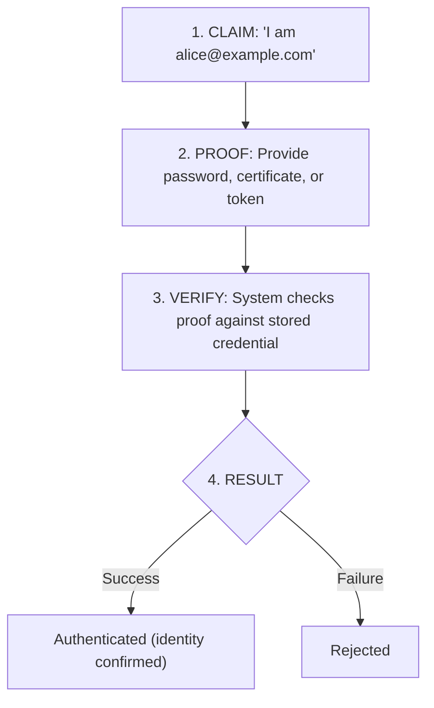
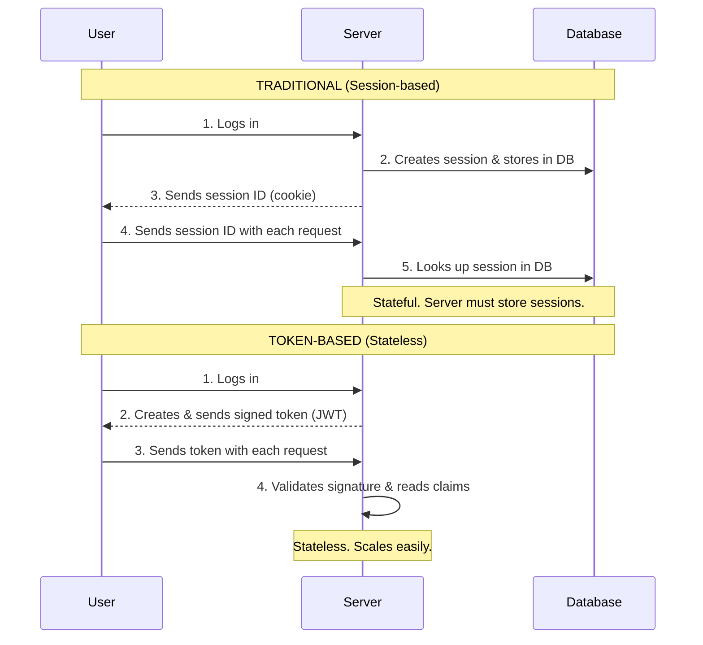
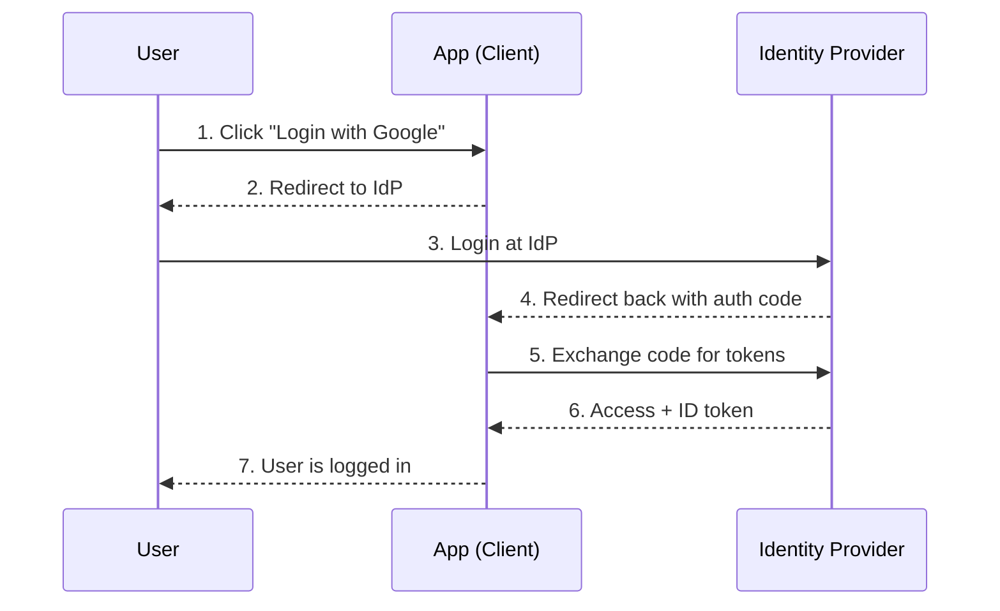
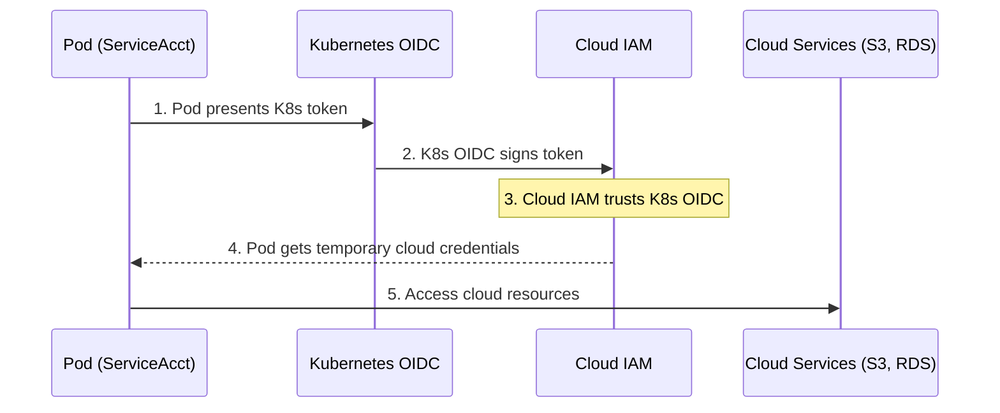

> **Complexity**: `[MEDIUM]`
>
> **Time to Complete**: 30-35 minutes
>
> **Prerequisites**: [Module 4.2: Defense in Depth](../module-4.2-defense-in-depth/)
>
> **Track**: Foundations

### What You'll Be Able to Do

After completing this module, you will be able to:

1. **Design** identity and access management architectures that enforce least privilege across human users, service accounts, and machine identities
2. **Implement** authentication and authorization patterns (OIDC, RBAC, ABAC, short-lived credentials) appropriate for different trust levels
3. **Evaluate** whether an IAM configuration prevents lateral movement by auditing permission scope, credential lifetime, and access review processes
4. **Analyze** access-related incidents to identify where over-permissioning, missing audit trails, or credential reuse enabled the breach

---

**July 2020. Twitter's internal admin tools become a weapon.**

A 17-year-old from Florida convinces Twitter employees to give him access to internal systems through a phone-based social engineering attack. With those credentials, the teenager gains access to Twitter's admin panel—a tool designed for customer support that can take over any account on the platform.

Within hours, the accounts of Barack Obama, Elon Musk, Bill Gates, Apple, Uber, and dozens of other high-profile users tweet the same message: send Bitcoin to this address and get double back. A classic scam, but with unprecedented reach.

**130 accounts compromised. $120,000 in Bitcoin stolen. Twitter's stock dropped 4% the next day.** But the real damage was reputational—the world saw that Twitter's identity and access controls allowed a teenager with social engineering skills to hijack any account on the platform.

The vulnerability wasn't technical. Twitter had authentication. The problem was authorization: too many employees had access to an admin tool that could control any account. Least privilege wasn't enforced. Access wasn't audited. One compromised credential became god mode.

This module teaches identity and access management—how to authenticate who someone is, authorize what they can do, and ensure the principle of least privilege limits the damage when (not if) credentials are compromised.

---

## Why This Module Matters

Every security incident involves a question: "Who did this?" And every access control decision requires answering: "Should this identity be allowed to do this action on this resource?"

**Identity and Access Management (IAM)** is the foundation of security. It's how you know who's who, and how you decide who can do what. Get it wrong, and you have either an unusable system (too restrictive) or a compromised one (too permissive).

This module teaches you the principles of authentication (proving identity) and authorization (granting access)—concepts that apply whether you're securing a Kubernetes cluster, a cloud account, or an internal application.

> **The Bouncer Analogy**
>
> A nightclub bouncer does two jobs: check your ID (authentication) and decide if you can enter (authorization). These are different questions. You might have valid ID but not be on the guest list. In systems, authentication proves who you are; authorization decides what you can do.

---

## What You'll Learn

- The difference between authentication and authorization
- Authentication factors and methods
- Authorization models (RBAC, ABAC, policies)
- The principle of least privilege in practice
- Token-based authentication and OAuth/OIDC

---

## Part 1: Authentication Fundamentals

### 1.1 What is Authentication?

Authentication answers: **"WHO ARE YOU?"**

It's the process of verifying that someone is who they claim to be.

### Authentication Flow



### What Authentication Is Not
- ✗ Deciding what the user can do (that's authorization)
- ✗ Tracking what the user did (that's auditing)
- ✗ Protecting the communication (that's encryption)

Authentication just answers: "Is this really Alice?"

> **Stop and think**: If a user is successfully authenticated, does that mean they can modify any data in the system? Why or why not?

### 1.2 Authentication Factors

#### Something You Know
Examples: Password, PIN, security questions
- `+` Easy to implement
- `-` Can be guessed, phished, stolen
- `-` Users pick weak passwords, reuse them

#### Something You Have
Examples: Phone (SMS, TOTP), hardware key (YubiKey), smart card
- `+` Harder to steal remotely
- `+` Proves physical possession
- `-` Can be lost, stolen, SIM-swapped
- `-` Requires user to carry device

#### Something You Are
Examples: Fingerprint, face, retina, voice
- `+` Always with you
- `+` Hard to forge (for now)
- `-` Can't be changed if compromised
- `-` Privacy concerns
- `-` False positives/negatives

#### Multi-Factor Authentication (MFA)
Combines two or more factors:

**Password (know) + TOTP (have) = Much stronger**

An attacker needs to compromise BOTH factors, which requires completely different attack techniques.

### 1.3 Authentication Methods

| Method | Factor | Security | Usability |
|--------|--------|----------|-----------|
| **Password** | Know | Low (if weak) | High |
| **Password + TOTP** | Know + Have | Medium-High | Medium |
| **Password + Hardware Key** | Know + Have | High | Medium |
| **Certificate (mTLS)** | Have | High | Low (complex setup) |
| **SSO/OIDC** | Delegated | Depends on IdP | High |
| **Passwordless (WebAuthn)** | Have | High | Medium-High |

> **Try This (2 minutes)**
>
> List the authentication methods you use daily:
>
> | Service | Method | Factors | Could be stronger? |
> |---------|--------|---------|-------------------|
> | | | | |
> | | | | |
> | | | | |

---

## Part 2: Authorization Fundamentals

### 2.1 What is Authorization?

Authorization answers: **"WHAT CAN YOU DO?"**

After authentication confirms identity, authorization decides what that identity is allowed to access.

### Authorization Decision

**Inputs:**
- **WHO**: Authenticated identity (`alice@example.com`)
- **WHAT**: Requested action (`read`, `write`, `delete`)
- **WHICH**: Target resource (`/api/users/123`)
- **CONTEXT**: Additional factors (time, location, risk)

**Output:**
- **ALLOW**: Proceed with action
- **DENY**: Block action

**Example:**
Alice requests `DELETE /api/users/123`
1. Check: Does Alice have permission to delete users?
2. Check: Can Alice delete this specific user (123)?
3. Result: ALLOW or DENY

### 2.2 Authorization Models

#### Access Control List (ACL)
Permissions attached directly to resources.
```text
/api/users:
    alice: read, write
    bob: read
    carol: read, write, delete
```
Simple, but doesn't scale. Managing permissions on thousands of resources is unwieldy.

#### Role-Based Access Control (RBAC)
Users assigned to roles, roles have permissions.
```text
Roles:
    viewer: read
    editor: read, write
    admin: read, write, delete

Assignments:
    alice → editor
    bob → viewer
    carol → admin
```
Scales better. Change a role, and all users assigned to it update automatically.

#### Attribute-Based Access Control (ABAC)
Policies evaluate attributes of user, resource, context.
```text
Policy: "Allow if user.department == resource.owner.department AND time.hour >= 9 AND time.hour < 17"
```
Very flexible. Can express complex rules. Can become hard to understand and audit.

> **Pause and predict**: If you have 500 users and 50 applications, how many permission assignments would you need to manage with ACLs compared to RBAC?

### 2.3 RBAC in Practice

#### Kubernetes RBAC Example

```yaml
# Define what actions are allowed (Role)
apiVersion: rbac.authorization.k8s.io/v1
kind: Role
metadata:
  name: pod-reader
  namespace: production
rules:
- apiGroups: [""]
  resources: ["pods"]
  verbs: ["get", "list", "watch"]
---
# Bind role to identity (RoleBinding)
apiVersion: rbac.authorization.k8s.io/v1
kind: RoleBinding
metadata:
  name: read-pods
  namespace: production
subjects:
- kind: User
  name: alice
  apiGroup: rbac.authorization.k8s.io
roleRef:
  kind: Role
  name: pod-reader
  apiGroup: rbac.authorization.k8s.io
```

**Result:**
- Alice can read pods in the production namespace.
- Alice cannot write pods.
- Alice cannot read pods in other namespaces.

---

## Part 3: The Principle of Least Privilege

### 3.1 What is Least Privilege?

Grant only the minimum permissions necessary to perform the required function—no more, no less.

#### Why It Matters

**Compromised Identity:**
- Without least privilege: Attacker has broad access
- With least privilege: Attacker access is limited

**Accidents:**
- Without least privilege: Mistake can affect anything
- With least privilege: Mistake limited to allowed scope

**Insider Threats:**
- Without least privilege: Employees can access anything
- With least privilege: Access only what job requires

### 3.2 Implementing Least Privilege

#### 1. Start With Zero
Default deny. No permissions until explicitly granted.
- **Bad**: New user → Admin role (convenient!)
- **Good**: New user → No roles → Request needed access

#### 2. Scope Permissions
Narrow by action, resource, and context.
- **Too broad**: "admin" (can do anything)
- **Better**: "editor" (can read and write)
- **Best**: "orders-editor" (can edit orders only)

#### 3. Time-Bound Access
Temporary elevated permissions for specific tasks.
- **Permanent**: Alice always has production access
- **Time-bound**: Alice gets production access for 4 hours to debug a specific issue, then revoked

#### 4. Separate Concerns
Different roles for different functions.
- **Bad**: One service account for everything
- **Good**: Separate accounts for app, monitoring, backup (each with only its required permissions)

### 3.3 Common Violations

| Violation | Risk | Fix |
|-----------|------|-----|
| Everyone is admin | No accountability, full blast radius | Role-based access |
| Shared credentials | Can't attribute actions | Individual accounts |
| Permanent elevated access | Ongoing exposure | Just-in-time access |
| Over-provisioned service accounts | Broad access on compromise | Minimal permissions per service |
| Forgotten accounts | Dormant attack vector | Regular access reviews |

> **War Story: The $4.2 Million CI/CD Catastrophe**
>
> **March 2021.** A fast-growing e-commerce company gave their CI/CD pipeline broad Kubernetes admin access. "It needs to deploy, and sometimes fix things," the DevOps lead explained. The permissions had accumulated over two years of "just add this one thing."
>
> A junior engineer submitted a pull request to update deployment scripts. A typo changed `kubectl apply -f deployment.yaml` to `kubectl delete -f deployment.yaml`. Code review missed it—the change looked small. CI/CD merged and ran the script.
>
> **In 47 seconds, the pipeline deleted 23 production services, 3 databases, and 2 years of customer order history.**
>
> The team had backups, but restoration took 14 hours. The outage occurred on the second-busiest sales day of the quarter. **Total impact: $4.2 million in lost sales plus $800,000 in emergency recovery costs.**
>
> Post-incident analysis revealed the pipeline had permissions to delete any resource in any namespace—permissions it had never legitimately needed. After the incident, they implemented least privilege: CI/CD can create and update deployments in specific namespaces. It cannot delete. It cannot access databases. It cannot modify networking or RBAC.
>
> The recovery took 14 hours. Implementing least privilege took 6 hours. They wished they'd done it first.

---

## Part 4: Token-Based Authentication

### 4.1 How Tokens Work



> **Stop and think**: If a stateless JWT is stolen, can the server invalidate it by simply deleting a session in the database? Why or why not?

### 4.2 JSON Web Tokens (JWT)

Three parts, base64-encoded, separated by dots:
`HEADER.PAYLOAD.SIGNATURE`

#### Header
```json
{
  "alg": "RS256",    // Signing algorithm
  "typ": "JWT"       // Token type
}
```

#### Payload (Claims)
```json
{
  "sub": "alice@example.com",  // Subject (who)
  "aud": "api.example.com",    // Audience (for whom)
  "iat": 1700000000,           // Issued at
  "exp": 1700003600,           // Expires at
  "roles": ["editor"]          // Custom claims
}
```

#### Signature
HMAC-SHA256 or RSA signature of header + payload.
Server verifies signature to ensure token wasn't tampered with.

> **CRITICAL**: Never trust claims without verifying the signature!

### 4.3 OAuth 2.0 and OpenID Connect



> **Try This (3 minutes)**
>
> Decode a JWT at jwt.io. Examine:
> - What's in the header?
> - What claims are in the payload?
> - When does it expire?
> - What would happen if you changed a claim without re-signing?

---

## Part 5: Service Identity

### 5.1 Machine-to-Machine Authentication

**Humans vs. Services**
- **Humans**: Password + MFA, interactive login, one person with many sessions, can verify manually.
- **Services**: API Keys, automated/non-interactive, one service with many instances, must be automated.

#### Service Authentication Methods

**API Keys**
- Long-lived secret string
- Simple but risky if leaked
- Hard to rotate across many instances

**Client Certificates (mTLS)**
- Cryptographic identity
- Strong, hard to steal
- Complex PKI management

**Short-Lived Tokens**
- Get token from identity provider
- Token expires quickly (hours)
- Even if leaked, limited window
- *Examples*: Kubernetes ServiceAccount tokens, AWS IAM roles for pods (IRSA), Cloud Workload identity

### 5.2 Kubernetes Service Accounts

```yaml
# Service Account with minimal permissions
apiVersion: v1
kind: ServiceAccount
metadata:
  name: my-app
  namespace: production
---
# Role with only needed permissions
apiVersion: rbac.authorization.k8s.io/v1
kind: Role
metadata:
  name: my-app-role
  namespace: production
rules:
- apiGroups: [""]
  resources: ["configmaps"]
  resourceNames: ["my-app-config"]  # Specific resource only
  verbs: ["get"]
---
# Bind service account to role
apiVersion: rbac.authorization.k8s.io/v1
kind: RoleBinding
metadata:
  name: my-app-binding
  namespace: production
subjects:
- kind: ServiceAccount
  name: my-app
  namespace: production
roleRef:
  kind: Role
  name: my-app-role
  apiGroup: rbac.authorization.k8s.io
---
# Pod using the service account
apiVersion: v1
kind: Pod
metadata:
  name: my-app
  namespace: production
spec:
  serviceAccountName: my-app
  automountServiceAccountToken: true  # Only if needed!
  containers:
  - name: app
    image: myapp:v1
```

### 5.3 Workload Identity



---

## Did You Know?

- **OAuth was invented in 2006** by Blaine Cook while building Twitter's API. He needed a way to let third-party apps post tweets without giving them user passwords.

- **TOTP codes change every 30 seconds** by design. The server and your phone share a secret; both compute HMAC(secret, time/30). Same algorithm, same result, no communication needed.

- **Kubernetes defaulted to auto-mounting service account tokens** until v1.24. Now you have to explicitly request it, implementing least privilege by default.

- **Password complexity rules often backfire.** NIST's 2017 guidelines reversed decades of advice—they now recommend long passphrases over complex passwords, and explicitly discourage mandatory rotation. "Tr0ub4dor&3" is weaker than "correct horse battery staple" because the complex password is hard for humans but easy for computers to crack.

---

## Common Mistakes

| Mistake | Problem | Solution |
|---------|---------|----------|
| Same password everywhere | One breach compromises all | Unique passwords + password manager |
| No MFA on critical systems | Single factor easily bypassed | MFA everywhere possible |
| Overly broad roles | More access than needed | Granular, purpose-specific roles |
| Long-lived tokens | Large exposure window if leaked | Short-lived tokens, refresh flow |
| Shared service accounts | Can attribute actions | One account per service |
| No access review | Permissions accumulate | Regular audits, remove unused |

---

## Quiz

1. **Scenario: A developer configures an API gateway to verify JWT signatures from Okta, but users report they can access administrative endpoints they shouldn't. Is this a failure of authentication or authorization, and what is the difference between the two in this context?**
   <details>
   <summary>Answer</summary>

   In this scenario, the failure is in authorization, not authentication. Authentication answers "Who are you?"—the API gateway successfully verified the JWT, confirming the users' identities via Okta. Authorization answers "What can you do?"—the system failed to check if those authenticated users had the specific permissions required to access administrative endpoints. Because the two processes are distinct, a system must explicitly enforce authorization rules after successfully authenticating a user to prevent privilege escalation.
   </details>

2. **Scenario: An attacker manages to steal a database containing all user passwords for your application. If your application enforces MFA, why are the user accounts still secure? Explain how the different authentication factors work together.**
   <details>
   <summary>Answer</summary>

   The accounts remain secure because MFA requires multiple independent proofs of identity from different factor categories. Even though the attacker obtained the passwords (something you know), they still lack the second factor (such as a physical TOTP token from the user's phone). An attacker must compromise all required factors simultaneously, which demands entirely different attack techniques like physical device theft or SIM swapping. The mathematical probability of a successful attack drops significantly when combining factors, making mass exploitation of stolen passwords nearly impossible.
   </details>

3. **Scenario: You are auditing a Kubernetes cluster and notice that the CI/CD pipeline's ServiceAccount has cluster-admin privileges, even though it only deploys to the 'frontend' and 'backend' namespaces. Explain why this violates the principle of least privilege and describe the specific steps to implement it correctly in this case.**
   <details>
   <summary>Answer</summary>

   This setup violates the principle of least privilege because the CI/CD pipeline is granted cluster-wide, unrestricted access when it only requires deployment capabilities in two specific namespaces. Least privilege dictates granting only the minimum permissions necessary to perform a function. To fix this, you would implement a default deny approach by removing the cluster-admin RoleBinding entirely. Then, create specific Roles in the 'frontend' and 'backend' namespaces that only allow the pipeline to create, update, and get necessary resources, and bind those Roles to the pipeline's ServiceAccount.
   </details>

4. **Scenario: A developer accidentally commits a credential to a public GitHub repository. Within minutes, bots scan it and attempt to use it. If the credential was a short-lived token versus a long-lived API key, how does the impact differ and why are short-lived tokens preferred?**
   <details>
   <summary>Answer</summary>

   If the leaked credential was a long-lived API key, the attacker would have permanent access until an administrator manually discovered the leak and revoked the key, resulting in an unlimited exposure window. In contrast, if it was a short-lived token (like a JWT), it would automatically expire within a short timeframe (such as 15 minutes). Even though the attacker can use the short-lived token immediately, the potential damage is inherently limited to the token's remaining lifetime. Short-lived credentials are mathematically safer because they minimize the window of opportunity for attackers and reduce reliance on slow manual revocation processes.
   </details>

5. **Scenario: Your company is rapidly growing and adding new internal applications every week. The IT team is overwhelmed managing access for each new hire across dozens of systems using direct user-to-resource ACLs. How would migrating to Role-Based Access Control (RBAC) reduce this operational burden, and what is the mathematical difference in permission management?**
   <details>
   <summary>Answer</summary>

   With direct ACLs, managing access for 500 users across 50 applications could require up to 25,000 individual permission entries, forcing IT to manually update dozens of records for every role change. Migrating to RBAC introduces an abstraction layer where permissions are assigned to roles rather than individual users. If you define 10 standard roles, you only manage 500 user-to-role mappings and 500 role-to-app permissions, drastically reducing the total entries. When a user changes jobs under RBAC, IT only updates their single role assignment, instantly updating their access across all 50 applications and preventing permission drift.
   </details>

6. **Scenario: A support engineer's laptop is compromised via malware, giving attackers access to their active session in an internal admin tool. Based on the 2020 Twitter breach case study, what specific IAM authorization controls should have been in place to limit the blast radius of this compromised identity?**
   <details>
   <summary>Answer</summary>

   Even with a compromised active session, the blast radius could have been contained through strict authorization controls and least privilege. Instead of broad administrative access to all accounts, the tool should have enforced scoped permissions where support staff can only access standard user accounts. Furthermore, sensitive actions like account takeover should have required just-in-time access approvals or multi-person authorization (a two-person rule). Finally, requiring step-up authentication (re-prompting for a physical security key) for critical administrative actions would have blocked the attacker despite them possessing a valid session token.
   </details>

7. **Scenario: While analyzing network traffic, you discover an attacker has intercepted a JWT token with `exp: 1700003600` (Unix timestamp). It's currently `1700000000`. How long does the attacker have to use this token, what actions can they perform, and why can't the server immediately detect the theft?**
   <details>
   <summary>Answer</summary>

   The attacker has exactly 3,600 seconds (1 hour) to use the token before it expires and is rejected by the server. During this one-hour window, the attacker assumes the identity of the user and can perform any actions that the token's claims and the server's authorization policies allow. The server cannot immediately detect the theft because the token is stateless; since the token is legitimately signed and unexpired, the server inherently trusts it. To mitigate this, systems rely on short expiration times to limit the damage window and use refresh token rotation to force periodic re-authentication.
   </details>

8. **Scenario: During a penetration test, the red team exploits a remote code execution vulnerability in a simple Nginx web pod. They immediately pivot to query the Kubernetes API and list all secrets in the namespace. What specific ServiceAccount configuration enabled this lateral movement, why is it a risk, and what is the correct remediation?**
   <details>
   <summary>Answer</summary>

   The lateral movement was enabled because the pod's ServiceAccount was configured with `automountServiceAccountToken: true`, which automatically injected a valid API token into the pod's filesystem. This is a severe security risk for an Nginx web pod because standard web servers do not need to interact with the Kubernetes API, yet the token provides a built-in mechanism for privilege escalation or cluster reconnaissance. The correct remediation is to explicitly set `automountServiceAccountToken: false` in the pod spec or ServiceAccount for any workload that doesn't need API access. Doing so adheres to the principle of least privilege and removes an unnecessary attack vector.
   </details>

---

## Hands-On Exercise

**Task**: Design an IAM strategy for a microservices application.

**Scenario**: You're building an e-commerce platform with:
- Web frontend (user-facing)
- API gateway
- Order service
- Inventory service
- Payment service
- PostgreSQL database
- Redis cache

**Part 1: User Authentication (10 minutes)**

Design the user authentication flow:

| Component | Authentication Method | Factors |
|-----------|----------------------|---------|
| Web login | | |
| API access | | |
| Admin panel | | |

**Part 2: Service Authorization (10 minutes)**

Design service-to-service permissions:

| Service | Can Access | Permissions | Cannot Access |
|---------|------------|-------------|---------------|
| API Gateway | Order Service | read, write | |
| Order Service | | | |
| Inventory Service | | | |
| Payment Service | | | |

**Part 3: Database Access (10 minutes)**

Design database access:

| Service | Database Access | Tables | Operations |
|---------|-----------------|--------|------------|
| Order Service | PostgreSQL | orders, order_items | SELECT, INSERT, UPDATE |
| | | | |
| | | | |

**Part 4: Kubernetes RBAC (10 minutes)**

Write a ServiceAccount and Role for the Order Service:

```yaml
# Your YAML here
```

**Success Criteria**:
- [ ] User auth uses MFA for sensitive operations
- [ ] Each service has only permissions it needs
- [ ] No service has more database access than required
- [ ] RBAC follows least privilege

---

## Further Reading

- **"OAuth 2.0 Simplified"** - Aaron Parecki. Clear explanation of OAuth flows and best practices.

- **"Identity and Data Security for Web Development"** - Jonathan LeBlanc. Practical guide to implementing authentication.

- **NIST SP 800-63** - Digital Identity Guidelines. The authoritative standard for authentication assurance levels.

---

## Key Takeaways Checklist

Before moving on, verify you can answer these:

- [ ] Can you explain the difference between authentication (who are you?) and authorization (what can you do?)?
- [ ] Can you describe the three authentication factors and why MFA combining them is stronger?
- [ ] Do you understand RBAC vs ACL and why RBAC scales better for organizations?
- [ ] Can you implement the principle of least privilege (default deny, scope narrowly, time-bound)?
- [ ] Do you understand JWT structure and why short-lived tokens limit exposure?
- [ ] Can you explain OAuth 2.0 / OIDC flows and when to use them?
- [ ] Do you understand Kubernetes ServiceAccounts and when to disable `automountServiceAccountToken`?
- [ ] Can you explain workload identity and why it's better than static cloud credentials?

---

## Next Module

[Module 4.4: Secure by Default](../module-4.4-secure-by-default/) - Building security into systems from the start, not bolting it on later.