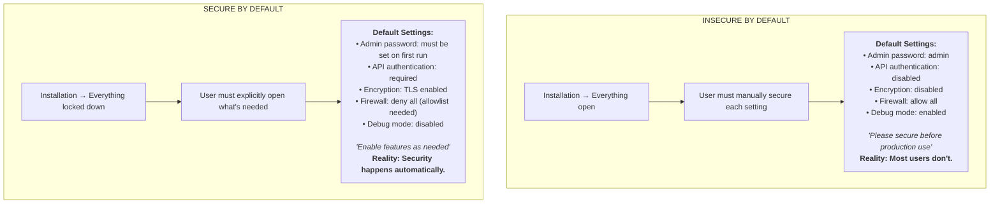
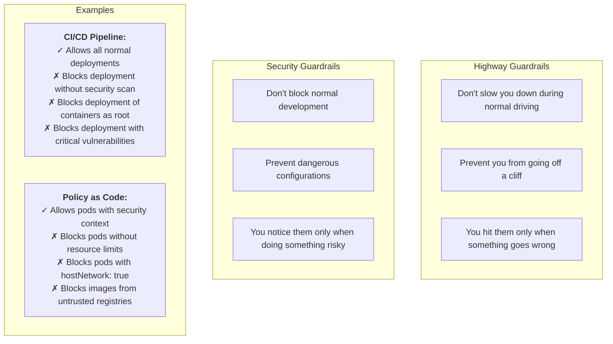
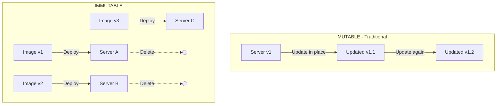

> **Complexity**: `[MEDIUM]`
>
> **Time to Complete**: 30-35 minutes
>
> **Prerequisites**: [Module 4.3: Identity and Access Management](../module-4.3-identity-and-access/)
>
> **Track**: Foundations

### What You'll Be Able to Do

After completing this module, you will be able to:

1. **Design** default configurations for platforms and services that are secure out of the box without requiring manual hardening steps
2. **Evaluate** whether a tool or framework's defaults expose unnecessary attack surface and propose secure-by-default alternatives
3. **Implement** policy-as-code guardrails (admission controllers, OPA policies, CI checks) that prevent insecure configurations from reaching production
4. **Analyze** the tradeoff between secure defaults that restrict developer flexibility and permissive defaults that increase breach risk

---

**January 2017. Security researchers discover 27,000 MongoDB databases exposed to the internet.**

No exploit was needed. MongoDB's default configuration bound to all network interfaces (0.0.0.0) with authentication disabled. Install MongoDB, start it, and the entire database is accessible to anyone on the internet.

Attackers ran automated scripts across the internet, finding these databases, deleting the contents, and leaving ransom notes demanding Bitcoin for data recovery. Many victims had no backups. Some databases contained medical records, customer data, and financial information.

**Over 28,000 MongoDB instances were ransomed in the first wave alone.** The total data loss was incalculable. And the root cause wasn't a bug or vulnerability—it was the default configuration.

MongoDB changed their defaults. New installations bind to localhost only. Authentication is strongly encouraged during setup. But thousands of organizations had already learned the hard way: insecure defaults become insecure deployments.

This module teaches secure by default—how to build systems where the easy path is also the safe path.

---

## Why This Module Matters

Most security breaches don't exploit sophisticated zero-days. They exploit misconfigurations, default passwords, and forgotten settings. The attacker didn't have to be clever—they just found what was left open.

**Secure by default** means systems ship in a secure state. Instead of requiring users to enable security, they have to explicitly disable it. Instead of hoping developers remember to validate input, the framework does it automatically.

This module teaches you how to build systems where the path of least resistance is also the secure path—where doing things the easy way is also doing them safely.

> **The Seatbelt Analogy**
>
> Old cars required you to find the seatbelt and buckle it. Many people didn't. Modern cars beep until you buckle up—the annoying path is the unsafe path. Some won't even start until passengers are buckled. The default became safe, and the unsafe choice became harder.

---

## What You'll Learn

- What "secure by default" means in practice
- How to design secure defaults for configurations
- Common insecure defaults and how to fix them
- Security guardrails that prevent mistakes
- How Kubernetes implements secure defaults

---

## Part 1: The Secure Default Philosophy

### 1.1 Default State Matters



### 1.2 Why Secure Defaults Win

| Factor | Insecure Default | Secure Default |
|--------|------------------|----------------|
| **Setup friction** | Easy setup, insecure | Slightly harder, but safe |
| **User expertise** | Requires security knowledge | Works for everyone |
| **Forgotten configs** | Become attack vectors | Remain safe |
| **Time pressure** | "We'll secure later" (won't) | Already secure |
| **Audit findings** | Many defaults insecure | Clean by default |

> **Pause and predict**: Think of a brand new internal developer tool you might deploy. Should it be accessible to everyone on the company VPN by default, or should it require explicit VPN groups and credentials out of the box? Which approach scales securely?

> **Try This (2 minutes)**
>
> Think of software you've installed. What were the defaults?
>
> | Software | Default Setting | Secure? |
> |----------|----------------|---------|
> | | | |
> | | | |
> | | | |
>
> How many required you to manually enable security?

---

## Part 2: Designing Secure Defaults

### 2.1 Authentication Defaults

```text
AUTHENTICATION DEFAULTS
═══════════════════════════════════════════════════════════════

PASSWORDS
─────────────────────────────────────────────────────────────
    ✗ Default password: "admin" or "password"
    ✗ No password required initially
    ✓ Force password set on first use
    ✓ Require minimum complexity

    # Good: Force password creation
    if not user.has_password_set():
        redirect('/setup/create-password')

API ACCESS
─────────────────────────────────────────────────────────────
    ✗ API accessible without authentication
    ✗ Optional authentication ("can be enabled")
    ✓ Authentication required by default
    ✓ All endpoints protected unless explicitly public

    # Framework level default
    @require_auth  # Applied to all routes by default
    class APIView:
        pass

    @public  # Must explicitly mark as public
    class HealthCheck:
        pass

SESSION MANAGEMENT
─────────────────────────────────────────────────────────────
    ✗ Sessions never expire
    ✗ Long session timeouts (30 days)
    ✓ Reasonable session timeout (hours, not days)
    ✓ Secure cookie flags by default (HttpOnly, Secure, SameSite)
```

### 2.2 Network Defaults

```text
NETWORK DEFAULTS
═══════════════════════════════════════════════════════════════

BINDING
─────────────────────────────────────────────────────────────
    ✗ Listen on 0.0.0.0 (all interfaces)
    ✓ Listen on localhost by default
    ✓ Require explicit config to expose externally

    # Dangerous default
    server.listen('0.0.0.0', 8080)  # World-accessible

    # Secure default
    server.listen('127.0.0.1', 8080)  # Local only
    # User must configure to expose

ENCRYPTION
─────────────────────────────────────────────────────────────
    ✗ Plain HTTP by default
    ✗ TLS "optional"
    ✓ TLS required by default
    ✓ Modern TLS versions only (1.2+)
    ✓ Strong cipher suites only

FIREWALL / NETWORK POLICY
─────────────────────────────────────────────────────────────
    ✗ Allow all traffic
    ✗ No firewall rules
    ✓ Deny all by default
    ✓ Explicit allowlist required
```

### 2.3 Data Defaults

```text
DATA DEFAULTS
═══════════════════════════════════════════════════════════════

ENCRYPTION
─────────────────────────────────────────────────────────────
    ✗ Store data in plain text
    ✗ Encryption available but not enabled
    ✓ Encryption at rest by default
    ✓ Encryption in transit required

LOGGING
─────────────────────────────────────────────────────────────
    ✗ Log everything including secrets
    ✗ No log sanitization
    ✓ Automatic secret redaction
    ✓ PII filtering by default

    # Automatic redaction
    logger.info("User login", extra={
        "username": user.email,      # Logged
        "password": user.password,   # [REDACTED]
        "api_key": request.api_key   # [REDACTED]
    })

INPUT HANDLING
─────────────────────────────────────────────────────────────
    ✗ Trust all input
    ✗ Validation optional
    ✓ Validate and sanitize all input by default
    ✓ Parameterized queries enforced (no string concatenation)

    # Framework prevents SQL injection by default
    users = db.query(User).filter_by(email=email).all()
    # Not: f"SELECT * FROM users WHERE email = '{email}'"
```

---

## Part 3: Guardrails and Constraints

### 3.1 What are Guardrails?

Guardrails are constraints that prevent mistakes without blocking legitimate work.



### 3.2 Implementing Guardrails

```yaml
# GUARDRAIL IMPLEMENTATION
# ═══════════════════════════════════════════════════════════════

# PRE-COMMIT HOOKS
# ─────────────────────────────────────────────────────────────
# Stop problems before they're committed.

    # .pre-commit-config.yaml
    repos:
    - repo: https://github.com/gitleaks/gitleaks
      hooks:
      - id: gitleaks  # Prevent committing secrets

    - repo: https://github.com/hadolint/hadolint
      hooks:
      - id: hadolint  # Lint Dockerfiles for security

# CI PIPELINE GATES
# ─────────────────────────────────────────────────────────────
# Stop problems before they're merged.

    pipeline:
      - security-scan:
          fail_on: CRITICAL, HIGH
      - container-scan:
          fail_on: CVE score > 7.0
      - policy-check:
          policies: [no-root, resource-limits, no-privileged]

# ADMISSION CONTROLLERS
# ─────────────────────────────────────────────────────────────
# Stop problems before they're deployed.

    # OPA Gatekeeper, Kyverno
    # Block at the Kubernetes API:
    # - Pods without security context
    # - Containers running as root
    # - Images from unauthorized registries
    # - Resources without limits
```

### 3.3 Kubernetes Pod Security Standards

```yaml
# POD SECURITY STANDARDS
# ═══════════════════════════════════════════════════════════════

# Kubernetes defines three security levels:

# PRIVILEGED (No restrictions)
# ─────────────────────────────────────────────────────────────
#     For system-level workloads that need full access.
#     Use only when necessary.

# BASELINE (Minimal restrictions)
# ─────────────────────────────────────────────────────────────
#     Prevents known privilege escalations.
#     Blocks: hostNetwork, hostPID, privileged containers

# RESTRICTED (Maximum security)
# ─────────────────────────────────────────────────────────────
#     Enforces security best practices.
#     Requires: non-root, drop all capabilities,
#               read-only root filesystem

# APPLYING STANDARDS
# ─────────────────────────────────────────────────────────────
# Namespace-level enforcement
apiVersion: v1
kind: Namespace
metadata:
  name: production
  labels:
    pod-security.kubernetes.io/enforce: restricted
    pod-security.kubernetes.io/audit: restricted
    pod-security.kubernetes.io/warn: restricted

# Now all pods in production must meet restricted standard
```

> **Stop and think**: If Pod Security Standards (PSS) actively block `privileged: true`, how would a cluster administrator deploy a DaemonSet that genuinely needs host network access (like a CNI plugin or a storage CSI driver)? How do automated guardrails handle legitimate exceptions securely?

> **War Story: The $2.3 Million Privileged Container**
>
> **September 2022.** A developer at a healthcare technology company needed to debug a production networking issue. "I'll just run a privileged container real quick to capture network traffic." They deployed with `privileged: true`, fixed the issue, and moved on to the next ticket. The privileged container stayed running.
>
> Eight months later, attackers exploited a Log4j vulnerability <!-- incident-xref: log4shell --> in a different service running on the same node. Normally, container isolation would have limited the blast radius. But the attacker discovered the privileged container. For the Log4Shell canonical, see [Supply Chain Security](../../disciplines/reliability-security/devsecops/module-4.4-supply-chain-security/).
>
> **With `privileged: true`, the container had full access to the host.** The attacker escaped the container, accessed the node's filesystem, read Kubernetes secrets for 47 other services, and exfiltrated patient health records for 340,000 individuals.
>
> **The breach cost $2.3 million** in HIPAA fines, breach notification, credit monitoring, and forensic investigation. The company was required to implement comprehensive security controls and submit to three years of audits.
>
> After the breach, the team implemented Pod Security Standards with `enforce: restricted` on all production namespaces. Now `privileged: true` is blocked at admission—the developer would have gotten an immediate error instead of a deployed vulnerability sitting dormant for eight months.

---

## Part 4: Secure Configuration Management

### 4.1 Configuration as Code

```text
CONFIGURATION MANAGEMENT
═══════════════════════════════════════════════════════════════

ANTI-PATTERN: Manual configuration
─────────────────────────────────────────────────────────────
    - SSH into server
    - Edit config file
    - Restart service
    - Hope you didn't break anything
    - No record of what changed

    Problems:
    - Configuration drift between environments
    - No audit trail
    - Easy to make mistakes
    - Hard to reproduce

PATTERN: Configuration as code
─────────────────────────────────────────────────────────────
    - All configuration in version control
    - Changes go through pull request
    - Automated deployment
    - Full history of changes

    Benefits:
    - Identical configuration across environments
    - Review before apply
    - Easy rollback
    - Audit trail
```

### 4.2 Secrets Management

```yaml
# SECRETS MANAGEMENT
# ═══════════════════════════════════════════════════════════════

# WRONG: Secrets in config files
# ─────────────────────────────────────────────────────────────
    # config.yaml (checked into git!)
    # database:
    #   password: "super_secret_password"

    # Problems:
    # - Visible to anyone with repo access
    # - In git history forever
    # - Same secret across environments

# RIGHT: External secrets management
# ─────────────────────────────────────────────────────────────
    # config.yaml
    # database:
    #   password: ${DATABASE_PASSWORD}  # From environment

    # Even better: from secrets manager
    # database:
    #   password_path: vault://secret/db/password

# KUBERNETES SECRETS
# ─────────────────────────────────────────────────────────────
    # Still not great: base64 encoded, not encrypted
    apiVersion: v1
    kind: Secret
    data:
      password: c3VwZXJfc2VjcmV0  # Just base64!

    # Better: External Secrets Operator
    apiVersion: external-secrets.io/v1beta1
    kind: ExternalSecret
    spec:
      secretStoreRef:
        name: vault
      target:
        name: db-credentials
      data:
      - secretKey: password
        remoteRef:
          key: secret/db/password
```

> **Pause and predict**: You've migrated all secrets to HashiCorp Vault and use ExternalSecrets to inject them. But your application pods keep crashing on startup because they attempt to read the database password before ExternalSecrets has finished syncing it from Vault. How does a secure system elegantly handle startup dependencies like this?

### 4.3 Immutable Infrastructure



**Benefits of Immutable Infrastructure:**
- **Reproducible deployments:** The server always matches the code exactly.
- **Known state at all times:** No hidden configuration drift or "ghost" processes.
- **Easy rollback:** Deploy the previous container image instead of attempting to revert changes via scripts.
- **Security:** You can't modify a running container (especially if it has a read-only filesystem). Attackers cannot persist.

> **Try This (3 minutes)**
>
> Audit your configuration:
>
> | Configuration | In Version Control? | Has Secrets? | Secure? |
> |---------------|--------------------|--------------|---------|
> | App config | | | |
> | Infrastructure | | | |
> | CI/CD pipelines | | | |
> | Kubernetes manifests | | | |

---

## Part 5: Security by Design Patterns

### 5.1 Secure Framework Patterns

```python
# SECURE FRAMEWORK PATTERNS
# ═══════════════════════════════════════════════════════════════

# AUTO-ESCAPING (XSS Prevention)
# ─────────────────────────────────────────────────────────────
    # Django template - auto-escapes by default
    # {{ user_input }}  →  &lt;script&gt;...

    # To allow HTML, must explicitly disable
    # {{ user_input|safe }}  # Developer knows they're taking risk

# PARAMETERIZED QUERIES (SQL Injection Prevention)
# ─────────────────────────────────────────────────────────────
    # ORM forces parameterization
    User.objects.filter(email=user_email)  # Safe

    # Raw SQL requires explicit params
    # cursor.execute("SELECT * FROM users WHERE email = %s", [email])

    # String formatting errors immediately
    # cursor.execute(f"SELECT * FROM users WHERE email = '{email}'")
    # ^ Framework should warn or error

# CSRF PROTECTION
# ─────────────────────────────────────────────────────────────
    # Framework adds CSRF token to forms automatically
    # <form method="post">
    #       <!-- Auto-injected -->
    #     ...
    # </form>

    # POST without valid token is rejected by default
```

### 5.2 Secure API Patterns

```python
# SECURE API PATTERNS
# ═══════════════════════════════════════════════════════════════

# AUTHENTICATION REQUIRED BY DEFAULT
# ─────────────────────────────────────────────────────────────
    # All routes require auth unless marked public
    @app.route('/api/users')
    @require_auth  # Applied globally
    def get_users():
        pass

    @app.route('/health')
    @public  # Explicit opt-out
    def health_check():
        return 'OK'

# RATE LIMITING BY DEFAULT
# ─────────────────────────────────────────────────────────────
    # Default rate limit for all endpoints
    app.config['RATELIMIT_DEFAULT'] = "100/minute"

    # Specific endpoints can override
    @app.route('/api/expensive')
    @rate_limit("10/minute")  # Stricter
    def expensive_operation():
        pass

# INPUT VALIDATION BY DEFAULT
# ─────────────────────────────────────────────────────────────
    # Pydantic, Marshmallow, etc.
    class UserInput(BaseModel):
        email: EmailStr        # Must be valid email
        age: int = Field(ge=0, le=150)  # Bounded integer

    @app.route('/api/users', methods=['POST'])
    def create_user(user: UserInput):  # Auto-validated
        pass  # Only reaches here if input is valid
```

### 5.3 Secure Deployment Patterns

```dockerfile
# SECURE DEPLOYMENT PATTERNS
# ═══════════════════════════════════════════════════════════════

# MINIMAL BASE IMAGES
# ─────────────────────────────────────────────────────────────
    # Bad: Full OS with unnecessary packages
    # FROM ubuntu:24.04
    # Contains: bash, curl, wget, apt, hundreds of packages

    # Better: Minimal base
    # FROM alpine:3.19
    # Contains: minimal shell, busybox utilities

    # Best: Distroless (no shell at all)
    # FROM gcr.io/distroless/static
    # Contains: only what your app needs
    # Attacker can't run shell commands if there's no shell

# NON-ROOT BY DEFAULT
# ─────────────────────────────────────────────────────────────
    # Dockerfile
    FROM node:20-alpine

    # Create non-root user
    RUN addgroup -S app && adduser -S app -G app

    # Set ownership
    COPY --chown=app:app . /app
    WORKDIR /app

    # Run as non-root
    USER app
    CMD ["node", "server.js"]
```

```yaml
# READ-ONLY FILESYSTEM
# ─────────────────────────────────────────────────────────────
    # Kubernetes deployment
    spec:
      containers:
      - name: app
        securityContext:
          readOnlyRootFilesystem: true
        volumeMounts:
        - name: tmp
          mountPath: /tmp  # Writable temp if needed
      volumes:
      - name: tmp
        emptyDir: {}
```

---

## Did You Know?

- **MongoDB's default config** used to bind to 0.0.0.0 with no authentication. In 2017, 27,000+ MongoDB instances were found exposed and ransomed. Now it binds to localhost by default.

- **AWS S3 bucket ACLs** defaulted to private for years, but complex permission systems led to many accidental public exposures. In 2023, AWS added "Block Public Access" settings that default to blocking all public access.

- **Kubernetes 1.25** removed Pod Security Policies (PSP) in favor of Pod Security Standards (PSS), which are simpler and enabled by default in new namespaces.

- **The Docker Hub default** of pulling `latest` tag has caused countless production incidents. The tag is mutable—meaning `nginx:latest` today might be a completely different image than `nginx:latest` tomorrow. Secure by default means pinning to immutable digests like `nginx@sha256:abc123...`, which is why many organizations now enforce digest-based image references in admission policies.

---

## Common Mistakes

| Mistake | Problem | Solution |
|---------|---------|----------|
| "We'll secure it later" | Later never comes | Secure by default from start |
| Default admin credentials | Easy target | Force credential setup |
| Debug mode in production | Exposes internals | Disable unless explicitly enabled |
| Overly permissive CORS | XSS exposure | Explicit allowed origins |
| No resource limits | DoS vulnerability | Limits required by policy |
| Trust all registries | Malicious images | Allowlist registries |

---

## Quiz

1. **Scenario: Your organization currently relies on a 50-point security checklist that developers must manually verify before each release. Despite this checklist, a recent audit found multiple services deployed with missing firewall rules and default passwords. You are proposing a shift to a "secure by default" architecture. Why is this approach more effective at preventing these types of misconfigurations?**
   <details>
   <summary>Answer</summary>

   The checklist approach relies on human perfection; developers must actively remember and take time to apply each security measure, which often fails under pressure. A "secure by default" architecture shifts this burden by ensuring systems are inherently secure out of the box without requiring manual intervention. If a developer forgets a step in a secure-by-default system, the application might fail to function (failing safely), but it won't expose a vulnerability. This makes the easiest path the secure path, drastically reducing the chance of human error leading to a breach.
   </details>

2. **Scenario: You are designing a CI/CD pipeline. You need to implement a mechanism that blocks deployments containing hardcoded secrets, and another mechanism that requires all high-risk changes to be manually reviewed by the security team. How do guardrails and gates apply to these two requirements, and what is the key difference between them?**
   <details>
   <summary>Answer</summary>

   Guardrails are passive constraints that prevent dangerous actions without interrupting normal workflows, such as an automated CI check that dynamically blocks hardcoded secrets only when they are detected. Gates, on the other hand, are active checkpoints that stop all progress until a specific condition is met, like requiring a mandatory manual security review for all high-risk deployments regardless of the automated scan results. The key difference is that guardrails only create friction when someone makes a mistake, allowing high velocity for safe changes, whereas gates intentionally introduce friction for every targeted change to ensure thorough human inspection.
   </details>

3. **Scenario: An attacker discovers a Remote Code Execution (RCE) vulnerability in your web application. They use it to gain a shell, download malicious tools, and modify the application's configuration files to establish persistence. However, when your team deploys the next regular update, the attacker's access and tools completely disappear. How does the concept of immutable infrastructure explain this outcome, and why does it improve security?**
   <details>
   <summary>Answer</summary>

   Immutable infrastructure dictates that servers or containers are never updated in place; instead, they are entirely replaced with fresh instances built from a known-good image during every deployment. Because the underlying infrastructure is immutable, any unauthorized modifications, backdoors, or malicious tools downloaded by the attacker are completely destroyed the moment the old container is spun down. This significantly improves security by limiting the lifespan of any compromise and erasing persistent threats. It guarantees that the running state always perfectly matches the audited, secure state defined in version control.
   </details>

4. **Scenario: A developer is troubleshooting a database connection issue in a local environment. To speed things up, they temporarily paste the production database password directly into the `config.yaml` file, commit the change, but then realize their mistake. They immediately delete the password, create a new commit, and push both commits to the central repository. Why does this still present a critical security risk, and what is the secure-by-default alternative?**
   <details>
   <summary>Answer</summary>

   Once a secret is committed to version control, it becomes a permanent part of the repository's history, meaning anyone with read access to the repository can view the initial commit and extract the password. Even if the secret is deleted in a subsequent commit, the original commit remains in the git log indefinitely and can be recovered by anyone. Repositories are often cloned to many developer laptops and CI/CD servers, creating widespread, uncontrolled proliferation of the exposed secret. The secure-by-default alternative is to use an external secrets manager and reference the secret dynamically via environment variables or operators like Kubernetes ExternalSecrets, ensuring the actual value is never written to disk or source code.
   </details>

5. **Scenario: An organization deploys 500 new services per month. Each deployment has a 5% chance of having a critical misconfiguration if checked manually. If the organization implements automated guardrails instead, the chance drops to 0.1%. Why is the automated approach mandatory at scale?**
   <details>
   <summary>Answer</summary>

   The manual check approach relies on human vigilance, which naturally degrades under the volume of 500 deployments a month and time pressure, leading to an expected 300 misconfigurations annually (6,000 deployments × 5%). Automated guardrails, however, run consistently and tirelessly on every single deployment, enforcing security rules without human fatigue. The math proves that relying on automated secure defaults scales effectively, dropping expected misconfigurations to just 6 per year. Manual processes inevitably fail at scale because human error is a statistical certainty, making automation the only viable path to true security.
   </details>

6. **Scenario: In 2017, ransomware automated scripts exploited 27,000 MongoDB databases because the default configuration bound to all network interfaces (0.0.0.0) with authentication disabled. What "secure by default" changes would have prevented this, and what trade-offs do they create for developers?**
   <details>
   <summary>Answer</summary>

   To prevent this, the default installation should have bound exclusively to localhost (127.0.0.1) and required an explicit administrator password to be set upon the first startup. The primary trade-off is that this introduces initial friction for developers who just want to quickly spin up a test database for local development without dealing with credentials. They now have to perform extra configuration steps to enable remote access and set up authentication. However, this intentional friction ensures that users must explicitly choose to make their database accessible and insecure, fundamentally protecting them from accidental public exposure.
   </details>

7. **Scenario: A web framework automatically escapes all HTML output in its templates by default, requiring developers to explicitly use a `|safe` filter to render raw HTML. Why is this "opt-in" approach to raw output fundamentally more secure than requiring developers to explicitly apply an `|escape` filter to untrusted data?**
   <details>
   <summary>Answer</summary>

   When a framework requires developers to explicitly apply an `|escape` filter, a simple lapse in memory or a rushed deployment results in an immediate Cross-Site Scripting (XSS) vulnerability that fails silently and dangerously. By making escaping the default, the framework ensures that a developer's mistake (forgetting the `|safe` filter) results only in a harmless visual bug where literal HTML tags are displayed on the screen. This fails safe, meaning security is guaranteed by default, and a deliberate, conscious action is required to bypass it. It also makes security audits much easier by allowing reviewers to focus exclusively on validating the explicit uses of the `|safe` filter.
   </details>

8. **Scenario: A Kubernetes deployment manifest for a critical microservice uses `image: backend-api:latest`. During an incident, the cluster autoscaler spins up a new pod, but it suddenly crashes due to a missing dependency, even though the older pods are running perfectly fine. Why is using the `latest` tag insecure by default, and what specific configuration should be used instead?**
   <details>
   <summary>Answer</summary>

   The `latest` tag is mutable, meaning the underlying image it points to can be changed at any time by the registry owner or a compromised CI pipeline. This leads to different pods running completely different code if pulled at different times, causing inconsistent runtime behavior and crashing instances. This lack of reproducibility creates massive supply chain risks, as an attacker could overwrite the `latest` tag with a malicious image, instantly compromising any newly scheduled pods. Instead, the deployment should use an immutable image digest (e.g., `image: backend-api@sha256:abc123...`), which guarantees that every single pod will pull the exact same, cryptographically verified contents.
   </details>

---

## Hands-On Exercise

**Task**: Implement secure defaults for a Kubernetes deployment.

**Scenario**: You have this insecure deployment:

```yaml
apiVersion: apps/v1
kind: Deployment
metadata:
  name: web-app
spec:
  replicas: 3
  selector:
    matchLabels:
      app: web
  template:
    metadata:
      labels:
        app: web
    spec:
      containers:
      - name: web
        image: myapp:latest
        ports:
        - containerPort: 8080
```

**Part 1: Identify Security Issues (5 minutes)**

List everything wrong with this deployment:

| Issue | Risk | Severity |
|-------|------|----------|
| | | |
| | | |
| | | |
| | | |
| | | |

**Part 2: Fix the Deployment (15 minutes)**

Rewrite with secure defaults:

```yaml
# Your secure deployment here
```

**Part 3: Add Network Policy (10 minutes)**

Create a NetworkPolicy that:
- Denies all ingress by default
- Allows only from specific sources

```yaml
# Your NetworkPolicy here
```

**Part 4: Add Pod Security (10 minutes)**

Create namespace labels to enforce restricted pod security:

```yaml
# Your Namespace with pod security labels
```

**Success Criteria**:
- [ ] Identified at least 5 security issues in original deployment
- [ ] Fixed deployment includes: non-root user, read-only fs, resource limits, image tag (not latest), security context
- [ ] Network policy implements default deny
- [ ] Namespace enforces restricted pod security standard

**Sample Solution**:

<details>
<summary>Show secure deployment</summary>

```yaml
apiVersion: apps/v1
kind: Deployment
metadata:
  name: web-app
spec:
  replicas: 3
  selector:
    matchLabels:
      app: web
  template:
    metadata:
      labels:
        app: web
    spec:
      serviceAccountName: web-app
      securityContext:
        runAsNonRoot: true
        runAsUser: 1000
        runAsGroup: 1000
        fsGroup: 1000
        seccompProfile:
          type: RuntimeDefault
      containers:
      - name: web
        image: myapp:v1.2.3@sha256:abc123...  # Pinned
        ports:
        - containerPort: 8080
        securityContext:
          allowPrivilegeEscalation: false
          readOnlyRootFilesystem: true
          capabilities:
            drop: ["ALL"]
        resources:
          requests:
            cpu: 100m
            memory: 128Mi
          limits:
            cpu: 500m
            memory: 256Mi
        livenessProbe:
          httpGet:
            path: /health
            port: 8080
        readinessProbe:
          httpGet:
            path: /ready
            port: 8080
      volumes:
      - name: tmp
        emptyDir: {}
```

</details>

---

## Further Reading

- **"Building Secure and Reliable Systems"** - Google. Comprehensive guide to building secure systems from the ground up.

- **"Container Security"** - Liz Rice. Essential reading for securing containerized applications.

- **CIS Benchmarks** - cisecurity.org. Industry-standard secure configuration baselines for various platforms.

---

## Key Takeaways Checklist

Before moving on, verify you can answer these:

- [ ] Can you explain why secure by default is more effective than security checklists?
- [ ] Do you understand the difference between guardrails (passive blockers) and gates (active checkpoints)?
- [ ] Can you describe secure defaults for authentication, networking, and data?
- [ ] Do you understand Pod Security Standards (Privileged, Baseline, Restricted) and how to enforce them?
- [ ] Can you explain why secrets should never be in version control and what to use instead?
- [ ] Do you understand immutable infrastructure and why it improves security?
- [ ] Can you explain secure framework patterns (auto-escaping, parameterized queries, CSRF tokens)?
- [ ] Do you understand why `image:latest` is insecure and what to use instead?

---

## Track Complete: Security Principles

Congratulations! You've completed the Security Principles foundation. You now understand:

- The security mindset: think like an attacker, design like a defender
- Defense in depth: layer independent security controls
- Identity and access: authentication, authorization, least privilege
- Secure by default: build security in, don't bolt it on

**Where to go from here:**

| Your Interest | Next Track |
|---------------|------------|
| Security in practice | [DevSecOps Discipline](/platform/disciplines/reliability-security/devsecops/) |
| Security tools | [Security Tools Toolkit](/platform/toolkits/security-quality/security-tools/) |
| Kubernetes security | [CKS Certification](/k8s/cks/) |
| Foundations | [Distributed Systems](/platform/foundations/distributed-systems/) |

---

## Track Summary

| Module | Key Takeaway |
|--------|--------------|
| 4.1 | Security is a mindset—think like attackers to defend against them |
| 4.2 | Layer defenses—no single control is enough |
| 4.3 | Authenticate who, authorize what—principle of least privilege |
| 4.4 | Make security the default—secure path should be the easy path |

*"Security is not a product, but a process."* — Bruce Schneier