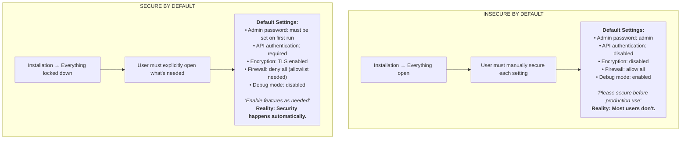
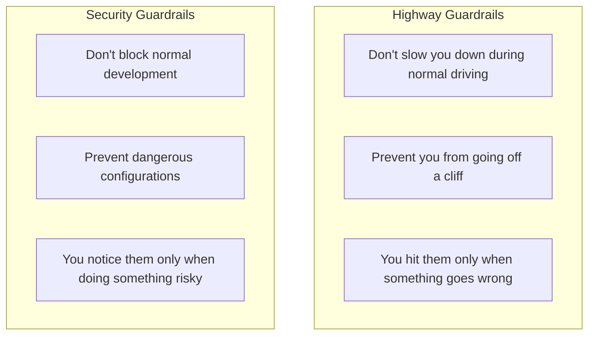
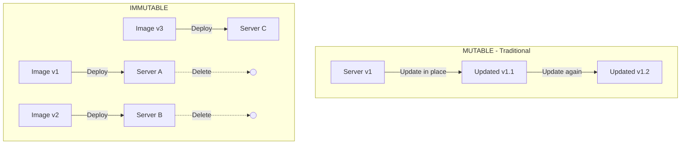
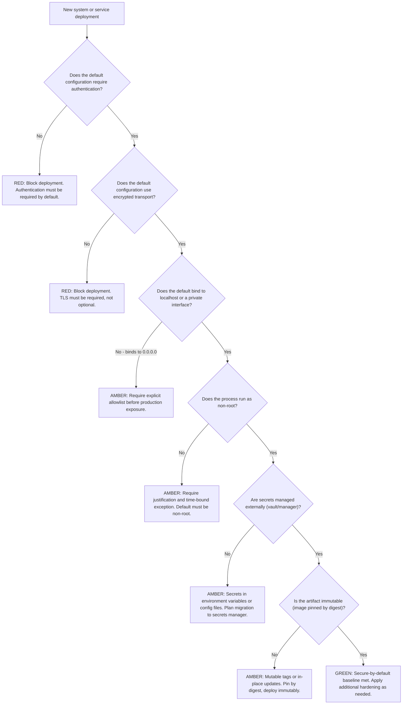

> **Complexity**: `[MEDIUM]`
>
> **Time to Complete**: 30-35 minutes
>
> **Prerequisites**: [Module 4.3: Identity and Access Management](../module-4.3-identity-and-access/)
>
> **Track**: Foundations

**January 2017. Security researchers discover tens of thousands of MongoDB databases exposed to the internet — no exploit required, no authentication configured.**

No exploit was needed. No zero-day vulnerability, no sophisticated attack chain, no advanced persistent threat. MongoDB's default configuration in versions prior to 3.6 bound the database to all network interfaces (0.0.0.0) with authentication completely disabled. Install the software, start the daemon, and the entire contents of your database were immediately accessible to anyone on the planet who knew to look.

And people did look. Attackers ran automated scanning scripts across the public IPv4 address space, identified exposed instances in seconds, deleted every database they found, and left behind a single collection containing a ransom note: pay Bitcoin within 48 hours or the data is gone forever. Many victims had no backups. Databases contained medical records, customer financial data, proprietary application logic, and years of accumulated business information — all erased by scripts that required no more sophistication than a port scanner and a TCP connection.

**Tens of thousands of MongoDB instances were ransomed in the first wave alone.** The total data loss was incalculable in dollar terms because the damage went beyond the ransom payments and the forensic investigations: it shattered trust in the infrastructure layers that organizations had assumed were inherently safe. And the root cause was not a bug, not a vulnerability, not an operator's misconfiguration — it was the default. The vendor shipped a product that required manual hardening after installation, and across thousands of organizations under time pressure and resource constraints, that hardening never happened.

MongoDB eventually changed their defaults. Starting with version 3.6 later that year, new installations bound exclusively to localhost and required explicit configuration to accept remote connections. Authentication was no longer optional. The community learned a brutal lesson, but it was the wrong lesson to have to learn: **insecure defaults become insecure deployments at scale, and the gap between "we should secure this" and "we secured this" is measured in breaches.**

This module teaches secure by default — how to build systems where the easy path is also the safe path, and where the cost of security failure is borne by the framework, not by every individual operator who might forget a step.

---

## What You'll Be Able to Do

After completing this module, you will be able to apply secure-by-default principles across every layer of the technology stack:

1. **Design** default configurations for platforms and services that are secure out of the box without requiring manual hardening steps
2. **Evaluate** whether a tool or framework's defaults expose unnecessary attack surface and propose secure-by-default alternatives
3. **Implement** policy-as-code guardrails (admission controllers, OPA policies, CI checks) that prevent insecure configurations from reaching production
4. **Analyze** the tradeoff between secure defaults that restrict developer flexibility and permissive defaults that increase breach risk
5. **Select** the appropriate Pod Security Standards level (privileged, baseline, restricted) for a given workload and enforce it at the namespace level

---


## Why This Module Matters

Most security breaches don't exploit sophisticated zero-days. The work of scanning the internet for open databases, default passwords, exposed management interfaces, and forgotten debug endpoints is fully automated — and the attackers performing it are not geniuses. They are opportunistic. They find what was left open, and what was left open is almost always there because the default made openness the path of least resistance.

**Secure by default** is the principle that systems should ship in a secure state. Instead of requiring users to *enable* security, the system should require them to explicitly *disable* it. Instead of hoping every developer remembers to validate input for every endpoint, the framework validates automatically — and forces a deliberate override to skip it. Instead of trusting that operators will tighten firewall rules after deployment, the deployment itself denies all traffic and requires an explicit allowlist to function.

This principle applies at every layer of the stack: the operating system, the container runtime, the application framework, the cloud service, the CI/CD pipeline. Authentication should be required unless explicitly marked public. Encryption should be on by default. Network policies should deny-all and allow-only-what-is-needed. Debug endpoints should be disabled in production builds. The container filesystem should be read-only. The process should run as non-root. None of these should depend on someone remembering to configure them correctly.

When you finish this module, you will understand why security checklists fail at scale, how guardrails differ from gates and where each belongs, what policy-as-code looks like in practice, and how to design systems where a developer's oversight does not become the organization's breach. You will learn to evaluate tool defaults critically — because every insecure default in your stack is a future incident waiting for an opportunistic attacker to find it.

> **The Seatbelt Analogy**
>
> Old cars required you to find the seatbelt and buckle it. Many people didn't. Modern cars beep until you buckle up — the annoying path is the unsafe path. Some won't even start until passengers are buckled. The default became safe, and the unsafe choice became harder.
>
> Secure-by-default systems work the same way. You don't disable the seatbelt alarm by writing "remember to buckle" on a Post-it note and calling it a day. The alarm itself is the guardrail. In software, the equivalent is: the deployment doesn't start until secrets are injected from a vault, the container doesn't run as root, the network doesn't accept traffic until an allowlist is specified. Make the safe path the only path that works out of the box.

---

## Part 1: The Secure Default Philosophy

### 1.1 Default State Matters

Every piece of software you deploy makes a choice about its initial posture. Either it starts open and waits for you to close things down, or it starts closed and waits for you to open things up. This single design decision — made by a vendor's product team, sometimes years before you encounter the software — determines the security baseline for every deployment that follows.

The mermaid diagram below captures the two paradigms side by side. Study the right-hand column carefully: notice that the secure-by-default path doesn't eliminate work, it *redirects* it. The operator still has to configure the system — but instead of hunting down every door that was left unlocked, the operator only opens the specific doors the application needs. The default answer to "can this be accessed?" changes from "yes, unless you remember to say no" to "no, unless you explicitly say yes."


```mermaid
graph TD
    subgraph Insecure [INSECURE BY DEFAULT]
        I_1["Installation &rarr; Everything open"]
        I_2["User must manually secure each setting"]
        I_Box["<b>Default Settings:</b><br/>• Admin password: admin<br/>• API authentication: disabled<br/>• Encryption: disabled<br/>• Firewall: allow all<br/>• Debug mode: enabled<br/><br/><i>'Please secure before production use'</i><br/><b>Reality: Most users don't.</b>"]
        I_1 --> I_2 --> I_Box
    end

    subgraph Secure [SECURE BY DEFAULT]
        S_1["Installation &rarr; Everything locked down"]
        S_2["User must explicitly open what's needed"]
        S_Box["<b>Default Settings:</b><br/>• Admin password: must be set on first run<br/>• API authentication: required<br/>• Encryption: TLS enabled<br/>• Firewall: deny all (allowlist needed)<br/>• Debug mode: disabled<br/><br/><i>'Enable features as needed'</i><br/><b>Reality: Security happens automatically.</b>"]
        S_1 --> S_2 --> S_Box
    end
```

### 1.2 Why Secure Defaults Win

The contrast between these two paradigms plays out across five dimensions, each of which compounds the others. When the default is insecure, setup is superficially faster — you get a running system in fewer steps — but every shortcut you took is a future audit finding, a future breach vector, and a future conversation with the security team that ends with "we assumed someone would lock that down." When the default is secure, setup may take an extra minute on day one, but it buys you years of not having to explain why your database was world-readable.

| Factor | Insecure Default | Secure Default |
|--------|------------------|----------------|
| **Setup friction** | Easy setup, insecure | Slightly harder, but safe |
| **User expertise** | Requires security knowledge | Works for everyone |
| **Forgotten configs** | Become attack vectors | Remain safe |
| **Time pressure** | "We'll secure later" (won't) | Already secure |
| **Audit findings** | Many defaults insecure | Clean by default |

The most dangerous phrase in operational security is "we'll harden it before production." Under schedule pressure, that hardening step is the first thing deferred and the last thing completed — if it is ever completed at all. By contrast, a secure default system reverses the incentive: you feel the friction immediately during setup, when you have the time and attention to deal with it, rather than feeling the consequences months later when an automated scanner finds what you left open.

> **Pause and predict**: Think of a brand new internal developer tool you might deploy. Should it be accessible to everyone on the company VPN by default, or should it require explicit VPN groups and credentials out of the box? Which approach scales securely?

> **Try This (2 minutes)**
>
> Think of software you've installed. What were the defaults?
>
> | Software | Default Setting | Secure? |
> |----------|----------------|---------|
> | | | |
> | | | |
> | | | |
>
> How many required you to manually enable security?

### 1.3 The Opt-Out Model: Failing Safe

The philosophical core of secure-by-default design is the **opt-out model**: security is always on, and the operator must take a deliberate action to reduce it. This is the opposite of the "opt-in" model, where security features are available but dormant until someone enables them.

Consider a web framework that auto-escapes HTML in templates. In an opt-in model, developers must remember to call `escape()` on every variable rendered into a page. Forgetting one — in a footer template, a 404 page, a rarely-visited admin panel — creates a cross-site scripting vulnerability that might sit dormant for years. In an opt-out model, the framework escapes everything automatically, and a developer who genuinely needs to render raw HTML must explicitly write `|safe` or its equivalent. That developer now carries the burden of justification: "I know this is raw HTML. I have verified its provenance. I accept the risk." And crucially, if a different developer forgets to write `|safe` on some other page, the error is a cosmetic rendering glitch, not a security vulnerability. The system fails safe.

This pattern — make the dangerous action require explicit intent, make the safe action the default — generalizes to authentication (all endpoints require auth unless marked public), network access (deny all unless allowlisted), filesystem permissions (read-only unless writable volumes are explicitly mounted), and process privileges (non-root unless a root escalation is deliberately granted).

### 1.4 Cognitive Load and the Economics of Security

There is an economic argument underneath the philosophy. Security checklists — the "secure after deployment" model — impose a flat per-deployment cognitive tax on every team member. If you have fifty services and a thirty-item hardening checklist, you are asking operators to correctly execute 1,500 security-sensitive decisions, every one of which must be done perfectly or a vulnerability results. Humans are bad at this at scale. The error rate is not zero, and across 1,500 decisions, the probability of at least one mistake approaches certainty.

Secure-by-default design shifts this cost from the operator to the system builder. The framework author makes the security decision once, in code, and every downstream deployment inherits it automatically. This is not only more reliable — it is a more efficient allocation of expertise. The framework author is likely a security specialist. The operator deploying an internal tool on a Friday afternoon is likely not. By absorbing the security burden into the platform layer, secure-by-default design ensures that every deployment benefits from the best security thinking in the organization, not just the deployments where the operator happened to be paying attention.

---

## Part 2: Designing Secure Defaults

### 2.1 Authentication Defaults

Authentication is the first line of defense, and it is where insecure defaults cause the most visible damage. The pattern is depressingly consistent: a system ships with a well-known default password (or no password at all), the administrator installs it with the intention of changing the credentials later, and "later" never arrives before an automated scanner finds the instance. The Shodan search engine routinely surfaces tens of thousands of devices and services still configured with vendor default credentials years after deployment.

A secure-by-default approach to authentication demands three properties. **First-run credential forcing:** the system must not allow itself to be used until the administrator sets a unique password. This can be implemented as a setup wizard that blocks all other functionality, or as a randomly generated initial credential displayed only once during installation. **No backdoor defaults:** there must be no hardcoded fallback password, no "support access" account with a known key, no undocumented superuser that bypasses the normal authentication flow. **Framework-level protection:** the application framework should require authentication on all routes by default, requiring an explicit `@public` or `@allow_anonymous` decorator for any endpoint that genuinely needs to be unauthenticated (such as a health check or a login form).

```python
# Framework level default: all routes require auth
@require_auth  # Applied to all routes by default
class APIView:
    pass

@public  # Must explicitly mark as public
class HealthCheck:
    pass
```

Session management is another dimension where defaults matter. A session that lasts thirty days is convenient for the user but gives an attacker who steals a session cookie a month-long window of access. Secure defaults for sessions include short timeouts (hours, not days), absolute session expiry regardless of activity, and secure cookie flags — `HttpOnly` (inaccessible to JavaScript), `Secure` (transmitted only over HTTPS), and `SameSite` (restricted cross-origin sending) — all enabled by default. These settings cost the developer nothing to implement — they are flags in the framework's session configuration — but if they are opt-in, many applications ship without them.

### 2.2 Network Defaults

Network exposure is the multiplier on every other security weakness. A vulnerable authentication system that is only accessible from localhost is a development annoyance. That same system listening on 0.0.0.0 with no firewall is a breach notification. The binding interface — the IP address a service listens on — is the single highest-leverage default in network security.

The secure default is to bind to localhost (127.0.0.1) and require explicit configuration to accept remote connections. This prevents the "I started the database and suddenly the internet can query it" class of incident that the MongoDB 2017 ransomware exploited. For containerized workloads, the equivalent is a Kubernetes NetworkPolicy that denies all ingress by default, requiring explicit allowlist rules for every service that needs to receive traffic from another namespace or from outside the cluster.

```bash
# Dangerous default
server.listen('0.0.0.0', 8080)  # World-accessible

# Secure default
server.listen('127.0.0.1', 8080)  # Local only
# User must configure to expose
```

Encryption on the network follows the same pattern. Plain HTTP should not be the default transport. TLS should be required, with modern minimum versions (TLS 1.2 or higher, with 1.3 preferred) and strong cipher suites only. Certificate validation should be enforced; "accept any certificate" or "skip verification" should require an explicit, deliberate override that is flagged in code review. In Kubernetes, this translates to requiring TLS for all ingress traffic and using mutual TLS (mTLS) for service-to-service communication within the mesh — a default that service meshes like Istio and Linkerd can enforce transparently.

### 2.3 Data Defaults

Data at rest and data in transit are the two surfaces that security defaults must protect, but data in logs represents a third, often overlooked category. Every application logs something — request parameters, error contexts, debugging information — and those logs are copied to central logging systems, backed up, shipped to observability platforms, and potentially stored for months or years. If secrets, personally identifiable information (PII), or authentication tokens appear in those logs, the data is now exposed across a much wider attack surface than the original database.

Secure-by-default logging means automatic redaction of known secret patterns before data is written to disk or shipped off the host. Regular expressions for API keys, bearer tokens, password fields, credit card numbers, and social security numbers should be applied at the logging framework level, not left to each developer's discipline. The code that logs a user login attempt should not have to remember to strip the password field — the logging library should recognize the field name and redact it automatically.

```python
# Automatic redaction at the logging layer
logger.info("User login", extra={
    "username": user.email,      # Logged
    "password": user.password,   # [REDACTED]
    "api_key": request.api_key   # [REDACTED]
})
```

Input validation is another data-facing default that pays for itself thousands of times over. Every piece of data that crosses a trust boundary — URL parameters, form fields, HTTP headers, file uploads, message queue payloads — should be validated and sanitized by default. The framework should reject malformed input before application code ever sees it, using type-enforced schemas (Pydantic, Marshmallow, Zod) that declare expected shapes and bounds. SQL injection, the perennially top-ranked vulnerability class in the OWASP Top 10, should be prevented at the framework level by enforcing parameterized queries and rejecting string-concatenated SQL. A developer who writes `db.query("SELECT * FROM users WHERE email = '" + email + "'")` should get a linter error, not a deployed vulnerability.

```python
# Framework prevents SQL injection by default
users = db.query(User).filter_by(email=email).all()
# Not: f"SELECT * FROM users WHERE email = '{email}'"
```

Encryption at rest should be enabled by default for any system that stores persistent data. Cloud providers have made this increasingly straightforward — AWS S3, Google Cloud Storage, and Azure Blob Storage all support default server-side encryption — but the organization must still configure the policy to enforce it, because the raw API still accepts unencrypted writes if no policy blocks them. The secure default is to deny unencrypted storage operations at the policy layer, not just to make encryption available.

---

## Part 3: Guardrails, Gates, and Policy as Code

### 3.1 What Are Guardrails?

Guardrails are constraints that prevent dangerous outcomes without blocking legitimate work. They are the highway guardrail, not the traffic light: they don't slow you down during normal operation, and you only notice them when you are about to go off the road. In a security context, guardrails are automated checks that allow normal development velocity while catching specific classes of dangerous configurations before they reach production.

A guardrail in a CI/CD pipeline might scan every container image for critical CVEs and block the deployment only if a vulnerability above a severity threshold is detected. It doesn't block every deployment — just the ones carrying known-exploitable flaws. A guardrail in a Kubernetes admission controller might reject any pod that runs as root or requests `privileged: true`, while allowing all other pods through without friction. The developer who writes a secure pod never encounters the guardrail. The developer who accidentally includes `privileged: true` from a debugging session hits it immediately, before the pod is scheduled.


```mermaid
graph TD
    subgraph HIGHWAY_GUARDRAILS [Highway Guardrails]
        H1["Don't slow you down during normal driving"]
        H2["Prevent you from going off a cliff"]
        H3["You hit them only when something goes wrong"]
    end

    subgraph SECURITY_GUARDRAILS [Security Guardrails]
        S1["Don't block normal development"]
        S2["Prevent dangerous configurations"]
        S3["You notice them only when doing something risky"]
    end
```

### 3.2 Guardrails vs. Gates

The distinction between a guardrail and a gate is essential for designing a security system that doesn't throttle the organization's ability to ship software. A **guardrail** is conditional — it blocks only the subset of actions that violate a specific policy. A **gate** is unconditional — it blocks everything until a condition is met, typically a human approval.

Gates are necessary at high-assurance boundaries. A change to a payment-processing service might genuinely require a security review before merging. A modification to a compliance-critical infrastructure-as-code repository might need sign-off from two senior engineers. But applying gate-level friction to every change, in every repository, creates a powerful incentive for developers to route around the process — through shadow IT, through manual deployments, through "emergency" exceptions that become routine.

The art of secure-by-default design is to use guardrails for the 95% of changes that are routine and gates for the 5% that carry elevated risk. The CI pipeline that scans every container image for hardcoded secrets is a guardrail: it only blocks the deployment when it actually finds a secret. The manual security review required for changes to the IAM policy that grants production database access is a gate: it blocks every change until a human approves it, regardless of what the change contains.

### 3.3 The Guardrail Implementation Spectrum

Guardrails can be placed at multiple points in the software delivery lifecycle, and each placement provides a different tradeoff between feedback speed and enforcement strength.

**Pre-commit hooks** provide the fastest feedback — the developer learns about a problem before the code even leaves their machine. Tools like gitleaks scan for secrets, hadolint lints Dockerfiles for security best practices, and pre-commit-terraform validates infrastructure-as-code before a commit is created. Pre-commit hooks are relatively weak — a developer can skip them with `--no-verify` — but they catch the majority of honest mistakes before they enter the shared repository.

**CI pipeline gates** provide stronger enforcement during the code review phase. A CI job that runs a security scanner can block the merge of a pull request if it finds a critical vulnerability, and unlike a pre-commit hook, it cannot be skipped by the individual developer. The CI pipeline should run the same checks that the pre-commit hooks run, because developers do skip hooks, and the pipeline is the backstop.

```yaml
# CI pipeline: guardrails at the pull-request boundary
pipeline:
  - security-scan:
      fail_on: CRITICAL, HIGH
  - container-scan:
      fail_on: CVE score > 7.0
  - policy-check:
      policies: [no-root, resource-limits, no-privileged]
```

**Admission controllers** provide the strongest enforcement, at the Kubernetes API boundary. Once a workload is admitted to the cluster, it is running — so the admission controller is the last chance to prevent a misconfiguration from becoming a live security incident. Admission controllers like OPA Gatekeeper and Kyverno evaluate every API object (Pod, Deployment, Service, Ingress, etc.) against a set of Rego or custom policies and either allow it, deny it, or mutate it to add missing security fields. This is the infrastructure-level implementation of secure by default.

```yaml
# Admission controller: gate at the cluster boundary
# OPA Gatekeeper, Kyverno
# Block at the Kubernetes API:
# - Pods without security context
# - Containers running as root
# - Images from unauthorized registries
# - Resources without limits
```

### 3.4 Kubernetes Pod Security Standards (PSS)

Kubernetes 1.25 removed Pod Security Policies (PSPs) — a complex and error-prone mechanism — and replaced them with Pod Security Standards (PSS), enforced by a built-in Pod Security admission controller that is simpler and faster than PSP. The controller ships enabled by default since 1.25, but it **enforces nothing until a namespace carries `pod-security.kubernetes.io/*` labels** — an unlabeled namespace is effectively privileged, and pods are not hardened out of the box. Once labeled, PSS defines three levels that can be enforced at the namespace boundary, providing a graduated path from permissive to fully hardened without requiring external tooling.

**Privileged** — no restrictions whatsoever. This is an explicit escape hatch for system-level workloads like CNI plugins, CSI drivers, and monitoring agents that genuinely need host-level access. It should be used sparingly, in dedicated namespaces, and never for application workloads.

**Baseline** — prevents known privilege escalations. A baseline-compliant pod cannot use `hostNetwork`, `hostPID`, or `hostIPC` (which bypass container isolation), cannot run privileged containers, and cannot use hostPath volumes that expose the node's filesystem. Baseline is the minimum acceptable standard for any production namespace and is appropriate for most application workloads that don't have specific privilege requirements.

**Restricted** — enforces the strictest built-in PSS profile. A restricted pod must run as a non-root user (`runAsNonRoot: true`, non-root UID), must set `allowPrivilegeEscalation: false`, must drop all Linux capabilities (`capabilities.drop: ["ALL"]`) and may add back only `NET_BIND_SERVICE`, must use a seccomp profile (`RuntimeDefault` or `Localhost`), and must use restricted volume types. A read-only root filesystem is recommended but is **not** enforced by the restricted standard — enforce it separately with an admission policy (Kyverno/Gatekeeper) if you require it. Restricted is the target state for any organization that has completed the hardening journey and is appropriate for most application workloads that do not need host-level access.

```yaml
# Namespace-level Pod Security Standards enforcement
apiVersion: v1
kind: Namespace
metadata:
  name: production
  labels:
    pod-security.kubernetes.io/enforce: restricted
    pod-security.kubernetes.io/audit: restricted
    pod-security.kubernetes.io/warn: restricted

# Now all pods in production must meet restricted standard
```

The three modes — enforce (block), audit (log), and warn (notify) — allow a gradual rollout. A namespace can start with `audit` to discover which workloads would be blocked, move to `warn` to give developers notice without breaking deployments, and finally graduate to `enforce` when the organization is confident that all workloads comply.

> **Stop and think**: If Pod Security Standards actively block `privileged: true`, how would a cluster administrator deploy a DaemonSet that genuinely needs host network access (such as a CNI plugin or a storage CSI driver)? How do automated guardrails handle legitimate exceptions securely?

### 3.5 Policy-as-Code: The Operational Layer

Policy-as-code is the mechanism that turns secure-by-default philosophy into enforceable reality. Instead of writing a security policy document that says "containers must not run as root" and hoping developers read it, you write a policy in a machine-enforceable language (Rego for OPA Gatekeeper, custom resources for Kyverno, Sentinel for HashiCorp, CEL for Kubernetes ValidatingAdmissionPolicies) and the admission controller blocks any resource that violates it.

The critical property of policy-as-code is that it is **version-controlled, reviewed, and tested** like application code. A policy change goes through a pull request with reviewer approval, and the policy itself has test cases that verify it blocks the intended violations and allows legitimate configurations. This closes the loop that a written policy document leaves open: the document depends on human compliance; the code enforces compliance automatically.

Both OPA Gatekeeper and Kyverno are graduated CNCF projects that operate as Kubernetes admission controllers. Gatekeeper uses the Rego language, which is expressive but has a learning curve. Kyverno uses Kubernetes-native YAML policies, which are simpler to write but less flexible for complex logic. The choice between them matters less than the decision to use either one — the presence of any policy-as-code layer is what transforms a cluster from a blank canvas where anything is permitted into a platform where the secure path is the only path.

---

## Part 4: Secure Configuration Management

### 4.1 Configuration as Code: Why It Matters

Secure defaults are only effective if they are applied consistently. A server whose configuration was hand-edited by three different operators over six months has, effectively, no known configuration state — it has an accumulated set of changes with no record of what was changed, by whom, or why. This is the anti-pattern of manual configuration management: SSH into the server, edit a file, restart the service, and hope nothing is broken. It creates configuration drift between environments, eliminates any audit trail, and makes reproducing a working state nearly impossible when something goes wrong.

**Configuration as code** reverses this by storing all configuration in version control, requiring changes to go through pull request review, and deploying automatically from the approved state. The configuration becomes a software artifact with the same properties as the application code: it is reviewed, it is tested, it is reproducible, and it has a complete history of every change, who made it, and why. When a security incident requires understanding whether a particular firewall rule was open during a specific time window, the git history provides an exact answer.

```text
CONFIGURATION MANAGEMENT

ANTI-PATTERN: Manual configuration
    - SSH into server
    - Edit config file
    - Restart service
    - Hope you didn't break anything
    - No record of what changed

    Problems:
    - Configuration drift between environments
    - No audit trail
    - Easy to make mistakes
    - Hard to reproduce

PATTERN: Configuration as code
    - All configuration in version control
    - Changes go through pull request
    - Automated deployment
    - Full history of changes

    Benefits:
    - Identical configuration across environments
    - Review before apply
    - Easy rollback
    - Audit trail
```

### 4.2 Secrets Management

The worst place for a secret is in a configuration file checked into version control. Once committed, a secret is permanently embedded in the repository's history — even if the offending commit is replaced, the original remains accessible in the reflog, in cloned copies on developer laptops, in CI/CD server checkouts, and in backups. The surface area of exposure is vast and largely invisible to the organization.

The secure-by-default approach to secrets management has three tiers. **Tier one:** no secrets in source code, period. Environment variables provide a first level of indirection — the config file contains `${DATABASE_PASSWORD}` and the actual value is injected at runtime. But environment variables leak through process listings, debug endpoints, and child process inheritance. **Tier two:** a dedicated secrets manager — HashiCorp Vault, AWS Secrets Manager, Google Cloud Secret Manager, Azure Key Vault — stores the secret, controls access, rotates credentials, and provides an audit log of every access. The application authenticates to the secrets manager, not to the credential directly. **Tier three:** for Kubernetes, the External Secrets Operator synchronizes secrets from an external manager into Kubernetes Secret objects, so the application can consume them through the native Kubernetes API while the source of truth remains in the external vault. This prevents the Kubernetes Secret anti-pattern of storing a base64-encoded (not encrypted) value that is trivially decoded by anyone with `kubectl get secret -o yaml`.

```yaml
# WRONG: Secrets in config files (checked into git!)
# database:
#   password: "super_secret_password"

# RIGHT: Reference from external secrets manager
# database:
#   password_path: vault://secret/db/password

# BETTER: External Secrets Operator for Kubernetes
apiVersion: external-secrets.io/v1
kind: ExternalSecret
spec:
  secretStoreRef:
    name: vault
  target:
    name: db-credentials
  data:
  - secretKey: password
    remoteRef:
      key: secret/db/password
```

> **Pause and predict**: You've migrated all secrets to HashiCorp Vault and use ExternalSecrets to inject them. But your application pods keep crashing on startup because they attempt to read the database password before ExternalSecrets has finished syncing it from Vault. How does a secure system elegantly handle startup dependencies like this?

### 4.3 Immutable Infrastructure

Immutable infrastructure is the deployment pattern that closes the loop on secure defaults. Instead of deploying a server and then configuring it — leaving a gap between initial deployment and hardened state — immutable infrastructure pre-bakes the entire configuration into a deployable artifact (a container image, an AMI, a VM template) and deploys it as a unit. When a configuration change is needed, you don't modify the running instance; you build a new artifact and replace the old one entirely.


```mermaid
flowchart TD
    subgraph Mutable [MUTABLE - Traditional]
        direction LR
        M1["Server v1"] -->|Update in place| M2["Updated v1.1"] -->|Update again| M3["Updated v1.2"]
    end

    subgraph Immutable [IMMUTABLE]
        direction LR
        I1["Image v1"] -->|Deploy| S1["Server A"]
        I2["Image v2"] -->|Deploy| S2["Server B"]
        I3["Image v3"] -->|Deploy| S3["Server C"]
        S1 -.->|Delete| X1(( ))
        S2 -.->|Delete| X2(( ))
    end
```

The security benefits of immutability are profound. A running instance's state is guaranteed to match the known-good artifact; any drift (an attacker's modifications, a hurried operator's manual fix, a configuration file edited at 3am during an incident) is erased on the next deployment. If an attacker compromises a container and installs persistence mechanisms, those mechanisms are destroyed when the pod is replaced — and in a Kubernetes environment with rolling deployments and node auto-repair, that replacement happens on the order of minutes, not months. The attack surface shrinks because the running system is not writable: a container with `readOnlyRootFilesystem: true` and no writable volumes gives an attacker no place to drop tools, modify binaries, or alter configuration.

```yaml
# Read-only root filesystem: no place for an attacker to persist
spec:
  containers:
  - name: app
    securityContext:
      readOnlyRootFilesystem: true
    volumeMounts:
    - name: tmp
      mountPath: /tmp  # Only writable path, ephemeral
  volumes:
  - name: tmp
    emptyDir: {}
```

Immutable infrastructure also enables reproducible rollbacks. Rolling back a configuration change on a mutable server means reversing each individual modification — and hoping none of them left side effects. Rolling back an immutable deployment means deploying the previous artifact, which is guaranteed to be exactly what was running before the change. The rollback is not a repair operation; it is a redeploy of a known-good state.

---

## Part 5: Security by Design Patterns

### 5.1 Secure Framework Patterns

The most effective secure-by-default patterns are embedded in the application framework, where they protect every developer on every endpoint without requiring individual attention. Three patterns recur across mature frameworks and deserve to be understood as design principles, not just features.

**Auto-escaping for XSS prevention** is the canonical opt-out pattern. Django, Jinja2, React, and most modern templating engines escape HTML output by default, so that `<script>alert(1)</script>` entered by a user is rendered as literal text rather than executed JavaScript. A developer who needs raw HTML must explicitly mark it as safe — and in doing so, signals to reviewers that this particular output has been sanitized upstream. The security benefit is that the default protects the developer who never thought about XSS at all, while the explicit override protects the organization by creating an auditable, grep-able marker for dangerous output.

```python
# Django template - auto-escapes by default
# {{ user_input }}  →  &lt;script&gt;...  (safe by default)

# To allow HTML, must explicitly disable
# {{ user_input|safe }}  # Developer knows they're taking risk
```

**Parameterized queries for SQL injection prevention** are the same pattern applied to database access. An ORM that only exposes parameterized query methods — Django's querysets, SQLAlchemy's filter expressions, ActiveRecord's where clauses — eliminates the string-concatenation path that creates SQL injection. The developer never writes raw SQL because the framework doesn't provide a convenient API for it; if raw SQL is genuinely needed, it requires a separate, explicitly named method that takes parameters as a tuple, making the dangerous path visible and harder to use accidentally.

**CSRF protection** auto-injected into every form eliminates an entire class of attack with zero developer effort. The framework generates a unique token, embeds it in forms automatically, and validates it on every state-changing request. The developer doesn't write validation logic — they just use the framework's form helpers. This is secure-by-default at its most efficient: security that costs nothing per use and blocks attacks the developer might not even know exist.

### 5.2 Secure API Patterns

API design is where secure-by-default meets developer experience. An API that requires authentication on every endpoint creates a thousand places where a developer can forget to add it. An API that requires authentication by default, with an explicit `@public` decorator for endpoints that do not need it, creates zero places where a developer can forget — because the default handles it.

```python
# Authentication required by default
@app.route('/api/users')
@require_auth  # Applied globally
def get_users():
    pass

@app.route('/health')
@public  # Explicit opt-out
def health_check():
    return 'OK'
```

Rate limiting follows the same pattern. A global default rate limit — say, 100 requests per minute — prevents a single client from overwhelming the API, whether through abuse or a bug in a client application. Specific endpoints that need higher limits (or stricter ones, for expensive operations) can override the default. But the baseline protection applies automatically to every new endpoint, without the developer having to think about it.

Input validation at the API boundary closes the loop. Using a schema validation library — Pydantic for Python, Zod for TypeScript, Marshmallow for Flask — the developer declares the expected shape of incoming data and the library validates it before the handler executes. Invalid data is rejected with a clear error response; valid data is passed to the handler already coerced to the correct types. This eliminates an entire category of injection attacks, type-confusion bugs, and unexpected-null errors that arise when handler code trusts raw input.

```python
# Input validation by default
class UserInput(BaseModel):
    email: EmailStr        # Must be valid email
    age: int = Field(ge=0, le=150)  # Bounded integer

@app.route('/api/users', methods=['POST'])
def create_user(user: UserInput):  # Auto-validated
    pass  # Only reaches here if input is valid
```

### 5.3 Secure Deployment Patterns

Deployment configuration is where secure-by-default manifests in the runtime environment. Three patterns deserve special attention because they are simple to implement, dramatically reduce attack surface, and are frequently omitted from standard deployment templates.

**Minimal base images** reduce the attack surface by eliminating everything the application doesn't need. A full Ubuntu container image contains a shell, package manager, dozens of system utilities, and hundreds of libraries — every one of which is a potential vector for an attacker who gains code execution. A distroless image contains only the application binary and its immediate runtime dependencies. An attacker who compromises a process running in a distroless container discovers that there is no shell, no `curl`, no `wget`, no package manager — the tools they need to explore the environment and establish persistence simply do not exist.

```dockerfile
# Bad: Full OS with unnecessary packages
# FROM ubuntu:24.04
# Contains: bash, curl, wget, apt, hundreds of packages

# Best: Distroless (no shell at all)
# FROM gcr.io/distroless/static
# Contains: only what your app needs
# Attacker can't run shell commands if there's no shell
```

**Non-root containers** eliminate the easiest privilege escalation path. A process running as root inside a container is running as root on the host — the container boundary provides namespace isolation but not user-ID isolation. If that process is compromised (through an application vulnerability, a library flaw, or simply because the attacker found an exposed debug endpoint that executes commands), the attacker inherits root privileges on the node, with access to everything the node can see: other containers' filesystems, Kubernetes secrets, cloud metadata services. Running as a non-root user with a high UID that has no special meaning on the host eliminates this path: the compromised process has no privileges to escalate.

```dockerfile
# Non-root by default
FROM node:20-alpine
RUN addgroup -S app && adduser -S app -G app
COPY --chown=app:app . /app
WORKDIR /app
USER app
CMD ["node", "server.js"]
```

---

## Patterns & Anti-Patterns

### Patterns (What Good Looks Like)

**1. Deny-All Network Policy with Explicit Allowlisting** — Every Kubernetes namespace should start with a NetworkPolicy that denies all ingress traffic. Services that need to receive traffic declare explicit allowlist rules specifying sources and ports. This ensures that a newly deployed service is not accidentally exposed — not accidentally reachable from the internet, from other namespaces, or even from other pods in the same namespace. The default posture is isolation; connectivity is a deliberate configuration choice.

**2. First-Run Credential Forcing** — Any system that authenticates users — databases, web applications, infrastructure tools — must force credential creation on first use. The system refuses to serve any request until an administrator has set a unique password. This can be implemented as a setup wizard, a one-time token displayed during installation, or a block on all functionality until the initial configuration is completed. The principle is: if the admin password can be "admin" for even one second after installation, thousands of instances will still have "admin" as their password years later.

**3. Immutable Artifact Deployment with Read-Only Filesystem** — Deploy artifacts that cannot be modified after they start running. Container images are the canonical implementation: build once, deploy many times, never modify in place. Combine with `readOnlyRootFilesystem: true` in the Kubernetes security context so that even the running process cannot write to its own filesystem (except for explicitly mounted ephemeral volumes). This guarantees that what is running matches what was audited, and that an attacker who gains code execution cannot persist.

**4. Policy-as-Code with Automated Enforcement** — Express security policies as code, stored in version control, reviewed through pull requests, and enforced automatically by admission controllers or CI pipeline checks. A policy that says "containers must not run as root" should be checked by a Rego policy in OPA Gatekeeper or a Kyverno ClusterPolicy, not by a manual review checklist. The policy is the enforcement; there is no gap between what the document says and what the cluster permits.

### Anti-Patterns (What to Avoid)

| Anti-Pattern | Why It's Bad | Better Approach |
|--------------|--------------|-----------------|
| "We'll secure it later" deployments | Under time pressure, "later" never arrives; the unsecured system becomes production infrastructure | Bake security into the deployment artifact from the first commit; no unsecured state ever exists |
| Default admin credentials in setup guides | Thousands of operators follow the guide verbatim and never change the password; automated scanners find every one | Generate a unique initial credential during installation and display it once; refuse to serve until it's changed |
| `privileged: true` as a debugging shortcut | Debug containers are left running indefinitely, creating permanent host-escape vectors on every node they touch | Use ephemeral debug containers (`kubectl debug`) with strict time-bound access; never commit privileged pods to manifests |
| Secrets in environment variables | Environment variables leak through debug endpoints, crash dumps, child processes, and container orchestrator APIs | Use a secrets manager with just-in-time retrieval; never store secrets where the process environment can expose them |
| `image: latest` tags in production manifests | Mutable tags mean the running image can change between deployments without any code change, breaking reproducibility and enabling supply-chain attacks | Pin images by digest (`@sha256:...`) so every deployment is cryptographically identical; use semver tags only as a convenience during development |
| Allow-all firewall rules with "we'll restrict later" | The window between deployment and lockdown is a window of full exposure; automated scanners find open services in minutes | Deploy with deny-all rules and require explicit allowlist entries as part of the deployment manifest; the service doesn't work until you specify who can reach it |
| Security configuration in documentation rather than code | Documentation drifts, is not read under time pressure, and has no enforcement; developers skip steps they know they "should" do | Encode security requirements as policy-as-code that automatically blocks non-compliant configurations; the documentation describes the policy, the code enforces it |
| Debug mode enabled in production builds | Stack traces, verbose error messages, debug toolbars, and interactive consoles expose internal architecture, secrets, and attack surface to anyone who triggers an error | Disable debug mode by default in production environment configurations; require an explicit, audited override to enable it for incident response |

---

## Decision Framework: Choosing the Right Default

When designing or evaluating a system's security posture, use this decision framework to determine whether the defaults are adequate and what level of intervention is appropriate.


```mermaid
flowchart TD
    START["New system or service deployment"] --> Q1{"Does the default configuration require authentication?"}
    Q1 -->|No| R1["RED: Block deployment. Authentication must be required by default."]
    Q1 -->|Yes| Q2{"Does the default configuration use encrypted transport?"}
    Q2 -->|No| R2["RED: Block deployment. TLS must be required, not optional."]
    Q2 -->|Yes| Q3{"Does the default bind to localhost or a private interface?"}
    Q3 -->|No - binds to 0.0.0.0| R3["AMBER: Require explicit allowlist before production exposure."]
    Q3 -->|Yes| Q4{"Does the process run as non-root?"}
    Q4 -->|No| R4["AMBER: Require justification and time-bound exception. Default must be non-root."]
    Q4 -->|Yes| Q5{"Are secrets managed externally (vault/manager)?"}
    Q5 -->|No| R5["AMBER: Secrets in environment variables or config files. Plan migration to secrets manager."]
    Q5 -->|Yes| Q6{"Is the artifact immutable (image pinned by digest)?"}
    Q6 -->|No| R6["AMBER: Mutable tags or in-place updates. Pin by digest, deploy immutably."]
    Q6 -->|Yes| GREEN["GREEN: Secure-by-default baseline met. Apply additional hardening as needed."]
```

The flow chart encodes a graduated security assessment that any team can apply during design review, deployment approval, or audit. The RED gates — no authentication, no encryption — are showstoppers. The AMBER gates — public binding, root execution, inline secrets, mutable deployments — are not immediate emergencies but represent significant hardening debt that should be scheduled and tracked. Only when all six gates are passed does the deployment meet the secure-by-default baseline.

### Choosing a Pod Security Standards Level

For Kubernetes workloads specifically, the choice between privileged, baseline, and restricted enforcement should follow this decision matrix, which maps workload characteristics to the appropriate security posture:

| Workload Characteristic | Recommended PSS Level | Rationale |
|------------------------|----------------------|-----------|
| System-level DaemonSet (CNI, CSI, monitoring agent) that requires host network, host PID, or privileged mode | Privileged | These workloads genuinely need elevated access; isolate them in a dedicated namespace with strict RBAC |
| Application workload that requires hostPath volumes, host namespaces (`hostNetwork`, `hostPID`, `hostIPC`), privileged containers, or capabilities beyond what Restricted allows | Baseline | Baseline blocks the most dangerous host-isolation bypasses while still permitting patterns Restricted also allows (filesystem writes, low ports via `NET_BIND_SERVICE`) |
| Stateless application workload with no host-level access requirements | Restricted | Restricted enforces non-root, seccomp RuntimeDefault, no privilege escalation, and capability dropping — maximum built-in PSS security for the majority of workloads |
| CI/CD build job or one-time task that needs temporary write access | Baseline, with time-bound namespace | Build jobs need filesystem write access but do not need host access; clean up the namespace after the job completes |

---

## Did You Know?

- **MongoDB's default config** used to bind to 0.0.0.0 with no authentication. In late 2016 and early 2017, tens of thousands of exposed MongoDB instances were found, wiped, and held for ransom by automated scripts that required nothing more than a TCP connection and a DELETE command. Starting with version 3.6 later that year, MongoDB changed the default to bind localhost only and strongly encourage authentication during setup — a direct response to one of the largest default-configuration incidents in internet history.

- **AWS S3 Block Public Access** settings were introduced in 2018 after years of organizations accidentally exposing sensitive data through misconfigured bucket policies. AWS announced in late 2022 that Block Public Access would be enabled by default for all newly created S3 buckets, with the change effective April 2023. This means an S3 bucket created today is private by default; making it public requires explicitly disabling two separate settings.

- **Kubernetes 1.25** (released August 2022) removed Pod Security Policies (PSP) — a complex, beta-level API that had been deprecated since 2021 — in favor of Pod Security Standards (PSS), enforced by a built-in Pod Security admission controller that is enabled by default. That controller still enforces nothing until namespace labels request a level — without labels, workloads remain effectively privileged. Once labeled, the three PSS levels (privileged, baseline, restricted) constrain pods at the namespace boundary without external tooling.

- **Docker's `latest` tag** is mutable — `nginx:latest` today can be a completely different image than `nginx:latest` tomorrow, because the tag is just a pointer that the registry owner can move at any time. This has caused countless production incidents where a redeployed pod pulled a different image version than the one that was tested. The secure default is to pin images by their content-addressable digest (`nginx@sha256:abc123...`), which guarantees that every deployment pulls the exact same bytes, verified by cryptographic hash. Many organizations now enforce digest-based image references in admission policies, rejecting any deployment that uses a mutable tag.

---

## Common Mistakes

| Mistake | Problem | Solution |
|---------|---------|----------|
| "We'll secure it later" | Under time pressure, "later" never arrives; the insecure default becomes the production configuration | Design secure defaults into the deployment artifact from the start; no separate hardening phase exists |
| Default admin credentials | Automated scanners find every instance with `admin/admin` or `root/password` in minutes; thousands of breaches start this way | Force credential creation on first use; refuse to serve any request until a unique password is set |
| Debug mode in production | Stack traces, debug toolbars, and interactive consoles expose internal paths, secrets, and database queries to attackers who trigger errors | Disable debug mode in production configurations; require an explicit, audited override to enable it temporarily |
| Overly permissive CORS headers | `Access-Control-Allow-Origin: *` allows any website to make authenticated requests to your API using the user's cookies | Restrict CORS to explicit allowed origins; never use wildcards in production |
| No resource limits on containers | A container that can consume unbounded CPU or memory becomes a denial-of-service vector against every other container on the node | Set CPU and memory requests and limits on every container; enforce with LimitRange or admission policy |
| Trusting all container registries | An attacker who compromises a developer's credentials can push a malicious image to a public registry, and any cluster that pulls from untrusted registries will run it | Allowlist only approved registries in admission policy; require image signatures through Sigstore or Notary |
| `image: latest` in production manifests | The image that runs is whatever the registry currently points the tag to — not what was tested or reviewed | Pin images by digest (`@sha256:...`); use semver tags only during development and pin before production |
| Secrets in version control | Once committed, a secret is permanently visible in git history, cloned repositories, and CI/CD server checkouts — it cannot be reliably removed | Store secrets in a dedicated secrets manager; reference them by indirection in configuration files; rotate any secret that was ever committed |

---

## Quiz

1. **Scenario: Your organization currently relies on a 50-point security checklist that developers must manually verify before each release. Despite this checklist, a recent audit found multiple services deployed with missing firewall rules and default passwords. You are proposing a shift to a "secure by default" architecture. Why is this approach more effective at preventing these types of misconfigurations?**
   <details>
   <summary>Answer</summary>

   The checklist approach relies on human perfection across every deployment; developers must actively remember and take time to apply each of the 50 security measures, which inevitably fails under time pressure, fatigue, or simple oversight. A secure-by-default architecture shifts the burden to the system itself by ensuring deployments are inherently secure out of the box without requiring manual hardening steps. If a developer forgets a step in a secure-by-default system, the application might fail to function — but it won't expose a vulnerability. This makes the easiest path the secure path, drastically reducing the chance of human error leading to a breach, and it applies consistent protection to every deployment regardless of which developer performs it or how much time they had.
   </details>

2. **Scenario: You are designing a CI/CD pipeline. You need a mechanism that blocks deployments containing hardcoded secrets, and another mechanism that requires all changes to production infrastructure to be manually reviewed by the security team. How do guardrails and gates apply to these two requirements, and what is the key difference between them?**
   <details>
   <summary>Answer</summary>

   Guardrails are passive, conditional constraints that prevent dangerous actions without interrupting normal workflows. An automated CI check that scans for hardcoded secrets and blocks deployments only when secrets are actually detected is a guardrail — it creates friction only when a mistake is made, allowing all safe deployments to pass through at full velocity. Gates, by contrast, are active, unconditional checkpoints that stop all progress until a specific condition is met. Requiring a manual security review for all production infrastructure changes is a gate because it blocks every single change, regardless of content, until a human approves it. The key difference is that guardrails only intervene when something is wrong (optimizing for speed on safe changes), while gates always intervene (optimizing for assurance on high-risk changes).
   </details>

3. **Scenario: An attacker discovers a Remote Code Execution vulnerability in your web application. They gain a shell, download malicious tools, and modify the application's configuration files to establish persistence. However, when your team deploys the next regular update, the attacker's access and tools completely disappear. How does immutable infrastructure explain this outcome, and why does it improve security?**
   <details>
   <summary>Answer</summary>

   Immutable infrastructure dictates that servers or containers are never updated in place; instead, they are entirely replaced with fresh instances built from a known-good, audited artifact during every deployment cycle. Because the running instance is never modified, any unauthorized changes — backdoors, malicious tools, altered configuration files — vanish the moment the old container or virtual machine is spun down and replaced. This limits the lifespan of any compromise to the deployment interval, erases persistence mechanisms without needing to detect them, and guarantees that the running state always matches the audited, secure state defined in version control. It also eliminates the "configuration drift" problem where a server accumulates undocumented changes over time.
   </details>

4. **Scenario: A developer troubleshooting a database connection issue in a local environment temporarily pastes the production database password into `config.yaml`, commits the change, but then realizes their mistake. They immediately delete the password, create a new commit, and push both commits to the central repository. Why does this still present a critical security risk, and what is the secure-by-default alternative?**
   <details>
   <summary>Answer</summary>

   Once a secret is committed to version control, it becomes a permanent part of the repository's history. Even if the password is deleted in a subsequent commit, the original commit remains in the git log indefinitely — accessible through `git log`, `git reflog`, and `git show <commit-hash>`. The repository is often cloned to dozens of developer laptops and CI/CD server checkouts, each of which retains a full copy of every commit that ever existed. Revoking and rotating the secret is the only reliable remediation, and that must happen immediately. The secure-by-default alternative is to use an external secrets manager and reference the secret dynamically through environment variables or operators like Kubernetes ExternalSecrets, ensuring the actual value is never written to disk or source code in the first place.
   </details>

5. **Scenario: An organization deploys 500 new services per month. Each deployment has roughly a 5 percent chance of containing a critical misconfiguration if checked manually. If the organization implements automated guardrails that catch almost all of these, the residual misconfiguration rate drops to approximately 0.1 percent. Why is the automated approach mandatory at scale, and what does the math reveal about manual processes?**
   <details>
   <summary>Answer</summary>

   At 500 deployments per month, a 5 percent manual error rate produces approximately 25 critical misconfigurations every month — or 300 per year — each representing a potential security incident. Human vigilance degrades predictably under volume and time pressure, so the actual error rate may be higher during crunch periods when deployments are most frequent. Automated guardrails, by contrast, run identically on every deployment without fatigue, enforcing security rules consistently and producing only about 0.5 misconfigurations per month (approximately 6 per year). The math demonstrates that human-driven security processes are inherently unscalable: even a "good" 95 percent accuracy rate generates an unacceptable number of failures when multiplied by a large deployment volume. Automation is not a luxury at scale; it is a mathematical necessity.
   </details>

6. **Scenario: In late 2016 and early 2017, automated scripts ransomed tens of thousands of MongoDB databases because the default configuration bound to all network interfaces (0.0.0.0) with authentication disabled. What specific secure-by-default changes would have prevented this, and what trade-offs do those changes create for developers?**
   <details>
   <summary>Answer</summary>

   Two secure-by-default changes would have prevented the incident entirely. First, the default bind address should have been localhost (127.0.0.1), accepting only connections from the same machine — a developer who needed remote access would have to explicitly change the bind address, making the decision conscious and deliberate. Second, authentication should have been required by default, with a forced password-creation step during initial setup. The trade-off is that these defaults introduce friction during local development: a developer spinning up a test database now has to configure remote access and set up credentials before connecting their application. This friction is intentional and proportional — it ensures that opening the database to the network is a deliberate act, not something that happens silently because the developer never thought to restrict it.
   </details>

7. **Scenario: A web framework automatically escapes all HTML output in its templates by default, requiring developers to explicitly use a `|safe` filter to render raw HTML. Why is this "opt-in" approach to raw output fundamentally more secure than requiring developers to explicitly apply an `|escape` filter to untrusted data?**
   <details>
   <summary>Answer</summary>

   When a framework requires developers to explicitly apply an `|escape` filter to every variable, a single lapse in memory — on a footer template, a 404 page, a rarely-visited admin panel — creates an immediate Cross-Site Scripting vulnerability that fails silently and dangerously, potentially remaining undetected for years. By making escaping the default, the framework ensures that a developer's mistake (forgetting the `|safe` filter) results in a cosmetic rendering issue — literal HTML tags displayed as text — rather than a security vulnerability. This fails safe. It also transforms the security audit from an exhaustive search for every unescaped variable (impossible at scale) to a focused review of the explicitly marked `|safe` uses, which are typically few, grep-able, and surrounded by the developer's justification.
   </details>

8. **Scenario: A Kubernetes deployment manifest for a critical microservice uses `image: backend-api:latest`. During an incident, the cluster autoscaler spins up new pods, but they suddenly crash due to a missing dependency, even though the older pods continued running without issues. Why is using the `latest` tag insecure by default, and what specific configuration should be used instead?**
   <details>
   <summary>Answer</summary>

   The `latest` tag is mutable — the image it resolves to can change at any moment because the registry owner (or a compromised CI pipeline) can retag a completely different image as `latest`. This creates a scenario where different pods in the same deployment run different code depending on when they were pulled, causing inconsistent runtime behavior and hard-to-diagnose crashes. More critically, an attacker who gains write access to the container registry can overwrite the `latest` tag with a malicious image, and every new pod that spins up will silently run the attacker's code. The secure-by-default alternative is to use an immutable image digest, such as `image: backend-api@sha256:abc123...`, which cryptographically guarantees that every pod pulls the exact same bytes, verified by hash, regardless of when the pull occurs or what tags have been changed in the registry.
   </details>

---

## Hands-On Exercise

**Task**: Implement secure defaults for a Kubernetes deployment by hardening an existing insecure manifest. **Scenario**: You have been given the following deployment:

```yaml
apiVersion: apps/v1
kind: Deployment
metadata:
  name: web-app
spec:
  replicas: 3
  selector:
    matchLabels:
      app: web
  template:
    metadata:
      labels:
        app: web
    spec:
      containers:
      - name: web
        image: myapp:latest
        ports:
        - containerPort: 8080
```

**Part 1: Identify Security Issues (5 minutes)** — Examine the YAML below and list every security issue you can identify, then categorize each finding by severity:

| Issue | Risk | Severity |
|-------|------|----------|
| | | |
| | | |
| | | |
| | | |
| | | |

**Part 2: Fix the Deployment (15 minutes)** — Rewrite the entire deployment manifest from scratch with secure defaults baked in:

```yaml
# Your secure deployment here
```

**Part 3: Add Network Policy (10 minutes)** — Write a NetworkPolicy manifest that enforces the following secure-by-default rules:
- Denies all ingress by default
- Allows only from specific sources

```yaml
# Your NetworkPolicy here
```

**Part 4: Add Pod Security (10 minutes)** — Write a Namespace manifest with the correct pod security labels to enforce the restricted standard:

```yaml
# Your Namespace with pod security labels
```

**Success Criteria**: Verify that your implementation satisfies all of the following requirements before you consider the exercise complete:
- [ ] Identified at least 5 security issues in original deployment
- [ ] Fixed deployment includes: non-root user, read-only fs, resource limits, image tag (not latest), security context
- [ ] Network policy implements default deny
- [ ] Namespace enforces restricted pod security standard

**Sample Solution**: Use the reference configuration below to check your work — but attempt the exercise yourself before peeking at the solution.

<details>
<summary>Show secure deployment</summary>

```yaml
apiVersion: apps/v1
kind: Deployment
metadata:
  name: web-app
spec:
  replicas: 3
  selector:
    matchLabels:
      app: web
  template:
    metadata:
      labels:
        app: web
    spec:
      serviceAccountName: web-app
      securityContext:
        runAsNonRoot: true
        runAsUser: 1000
        runAsGroup: 1000
        fsGroup: 1000
        seccompProfile:
          type: RuntimeDefault
      containers:
      - name: web
        image: myapp:v1.2.3@sha256:abc123...  # Pinned
        ports:
        - containerPort: 8080
        securityContext:
          allowPrivilegeEscalation: false
          readOnlyRootFilesystem: true
          capabilities:
            drop: ["ALL"]
        volumeMounts:
        - name: tmp
          mountPath: /tmp
        resources:
          requests:
            cpu: 100m
            memory: 128Mi
          limits:
            cpu: 500m
            memory: 256Mi
        livenessProbe:
          httpGet:
            path: /health
            port: 8080
        readinessProbe:
          httpGet:
            path: /ready
            port: 8080
      volumes:
      - name: tmp
        emptyDir: {}
```

</details>

---

## Hypothetical Scenario: The Forgotten Debug Container

A developer needs to troubleshoot a production networking issue on short notice. The quickest approach seems to be deploying a container with elevated privileges to capture network traffic at the node level. They create a Kubernetes pod with `privileged: true`, run `tcpdump` for thirty minutes, isolate the problematic packet flow, and open a fix ticket in the project tracker. The privileged pod is not deleted — it's not causing errors, nobody is paying attention to running pods on that particular node, and the developer has already moved on to the next sprint item with the intention of "cleaning up later."

Months pass. An unrelated service on the same node is compromised through a remote code execution vulnerability — a Log4Shell-class exploit that allows arbitrary command execution within the application container <!-- incident-xref: log4shell -->. Under normal circumstances, container isolation would limit the attacker's blast radius to the compromised application's namespace and resources. But the privileged container is still there, dormant, its elevated access to the host kernel having never been revoked. The attacker discovers it during lateral reconnaissance and uses its host-level access to escape the container entirely, reading Kubernetes secrets and accessing data from other workloads that share the node. For the Log4Shell canonical, see [Supply Chain Security](../../disciplines/reliability-security/devsecops/module-4.4-supply-chain-security/).

If the cluster had been running with a secure-by-default posture, the privileged container would never have been scheduled in the first place. Pod Security Standards with `enforce: restricted` on all production namespaces would have rejected the pod at admission time, returning an error to the developer: "violates PodSecurity 'restricted:latest': privileged containers are disallowed." The developer would have been forced to use an ephemeral debug container — `kubectl debug` with a time-limited, audited access grant — instead of leaving a permanent host-escape vector sitting on a production node. The lesson is not that developers should remember to delete debug pods. It is that the system should make it impossible to create an insecure state that can be forgotten.

---

## Track Complete: Security Principles

Congratulations. You've completed the Security Principles foundation — the conceptual bedrock beneath every security decision you will make as a platform engineer, SRE, or security architect. You now understand the following concepts:

- **The security mindset:** Think like an attacker to design like a defender. The asymmetry — attackers need one path, defenders must protect all of them — is the fundamental dynamic that shapes every security trade-off.
- **Defense in depth:** Layer independent controls so that no single failure results in a breach. Each layer must be independently effective; overlapping identical controls at different layers provide false assurance.
- **Identity and access:** Authenticate who is acting, authorize what they can do, and apply the principle of least privilege — every identity should have only the permissions it needs, and no more.
- **Secure by default:** Build security into the system rather than bolting it on afterward. The path of least resistance must be the safe path. Checklists fail at scale; automated guardrails succeed.

**Where to go from here:** The table below maps your interests to the next recommended track so you can continue building on these foundations.

| Your Interest | Next Track |
|---------------|------------|
| Security in practice | [DevSecOps Discipline](/platform/disciplines/reliability-security/devsecops/) |
| Security tools | [Security Tools Toolkit](/platform/toolkits/security-quality/security-tools/) |
| Kubernetes security | [CKS Certification](/k8s/cks/) |
| Foundations | [Distributed Systems](/platform/foundations/distributed-systems/) |

---

## Track Summary

| Module | Key Takeaway |
|--------|--------------|
| 4.1 | Security is a mindset — think like attackers to defend against them |
| 4.2 | Layer defenses — no single control is enough |
| 4.3 | Authenticate who, authorize what — principle of least privilege |
| 4.4 | Make security the default — the secure path should be the easy path |

This sub-track closes with Bruce Schneier's enduring insight: *"Security is not a product, but a process."* — a reminder that no single tool, policy, or module makes you secure, but the continuous practice of these principles does.

---
## Sources

1. [Kubernetes Pod Security Standards](https://kubernetes.io/docs/concepts/security/pod-security-standards/) — Official Kubernetes documentation on the three PSS levels (privileged, baseline, restricted) and namespace-level enforcement.
2. [MongoDB Databases Held for Ransom by Mysterious Attacker](https://www.bleepingcomputer.com/news/security/mongodb-databases-held-for-ransom-by-mysterious-attacker/) — BleepingComputer coverage (January 2017) of the first wave of MongoDB ransom attacks against internet-exposed instances with no authentication, the incident referenced in this module's opening.
3. [OWASP Top 10 Web Application Security Risks](https://owasp.org/www-project-top-ten/) — The definitive ranking of web application vulnerabilities; secure-by-default patterns (parameterized queries, auto-escaping, CSRF protection) directly address the most prevalent risks.
4. [OWASP Application Security Verification Standard (ASVS)](https://github.com/OWASP/ASVS) — A framework of security requirements organized by verification level; V2 (Authentication) and V7 (Logging) are directly relevant to secure-by-default design.
5. [NIST SP 800-207: Zero Trust Architecture](https://csrc.nist.gov/publications/detail/sp/800-207/final) — The foundational U.S. federal standard for zero trust architecture, which operationalizes secure-by-default through continuous verification and default-deny network posture.
6. [NIST SP 800-53: Security and Privacy Controls for Information Systems and Organizations](https://csrc.nist.gov/publications/detail/sp/800-53/rev-5/final) — Catalog of security controls; the "configuration settings" and "least privilege" control families directly map to secure-by-default implementation.
7. [Google — Building Secure and Reliable Systems (SRS Book)](https://sre.google/books/building-secure-reliable-systems/) — Free online book covering secure-by-default design patterns, including the chapter "Design for Understandability" and practical guidance on framework-level security defaults.
8. [CIS Benchmarks](https://www.cisecurity.org/cis-benchmarks/) — Industry-standard secure configuration baselines for operating systems, cloud providers, Kubernetes, and container runtimes. Each benchmark embodies the secure-by-default philosophy for a specific platform.
9. [AWS S3 Block Public Access](https://docs.aws.amazon.com/AmazonS3/latest/userguide/access-control-block-public-access.html) — Documentation for the AWS feature that enforces secure-by-default bucket access by blocking all public access at the account or bucket level.
10. [SLSA (Supply-chain Levels for Software Artifacts)](https://slsa.dev/) — Framework for software supply chain integrity; the requirement for immutable, digest-pinned artifacts is a core secure-by-default practice for container images.
11. [Kyverno — Kubernetes Policy Management](https://kyverno.io/) — CNCF-graduated policy engine that implements policy-as-code for Kubernetes using Kubernetes-native YAML resources, enabling secure-by-default enforcement at the admission control layer.
12. [OPA Gatekeeper — Policy Controller for Kubernetes](https://open-policy-agent.github.io/gatekeeper/website/docs/) — CNCF-graduated admission controller that enforces Rego-based policies on Kubernetes resources, providing a flexible policy-as-code implementation for secure-by-default guardrails.
13. [OWASP Cheat Sheet Series — Infrastructure as Code Security](https://cheatsheetseries.owasp.org/cheatsheets/Infrastructure_as_Code_Security_Cheat_Sheet.html) — Practical guidance for building security into infrastructure-as-code from the start, covering scanning, policy enforcement, and secrets management.

---

---

## Next Module

You have completed the Security Principles sub-track. Continue to the Distributed Systems sub-track: [Module 5.1: What Makes Systems Distributed](../../distributed-systems/module-5.1-what-makes-systems-distributed/), where you will explore the challenges and patterns of building software that spans multiple machines.
