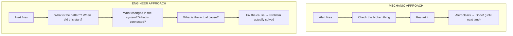
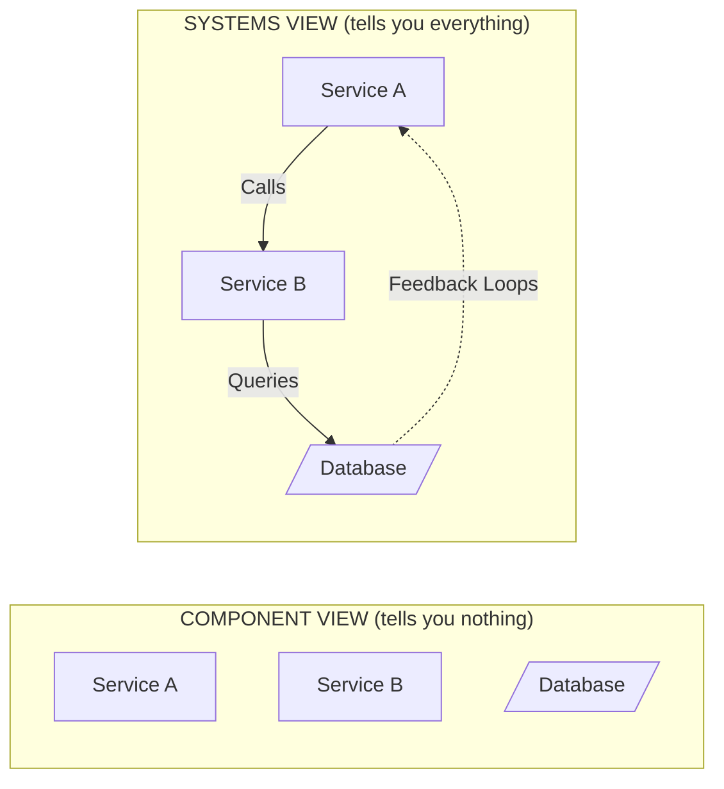
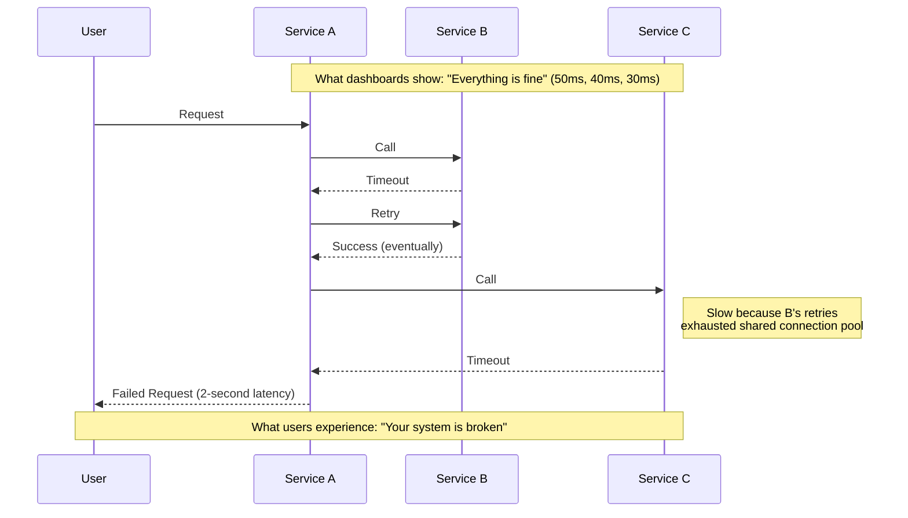
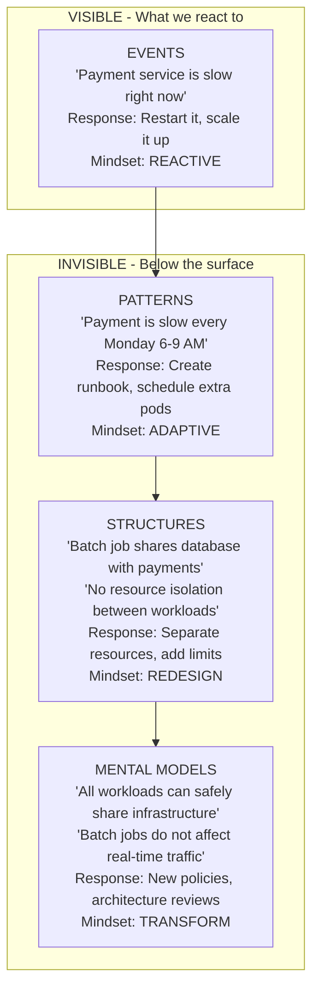
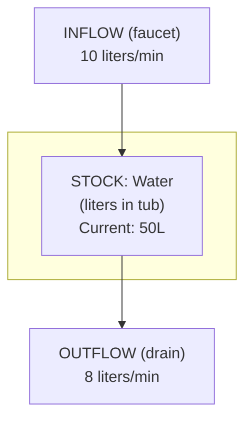
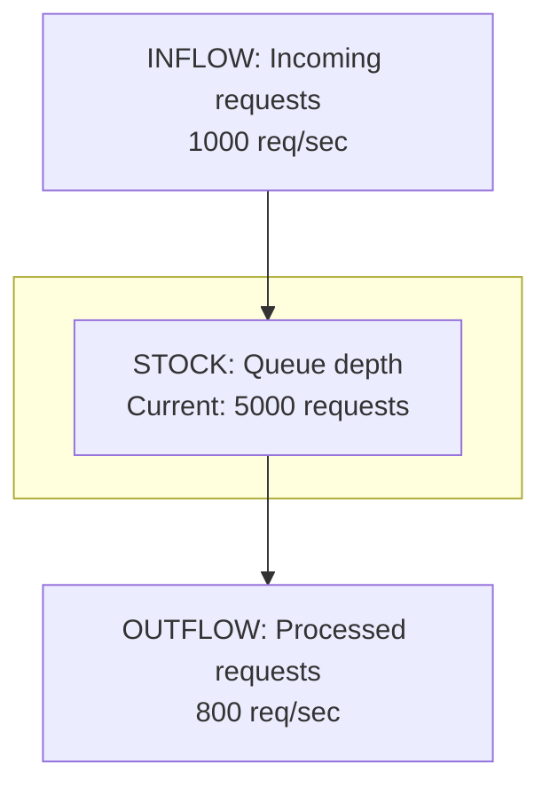
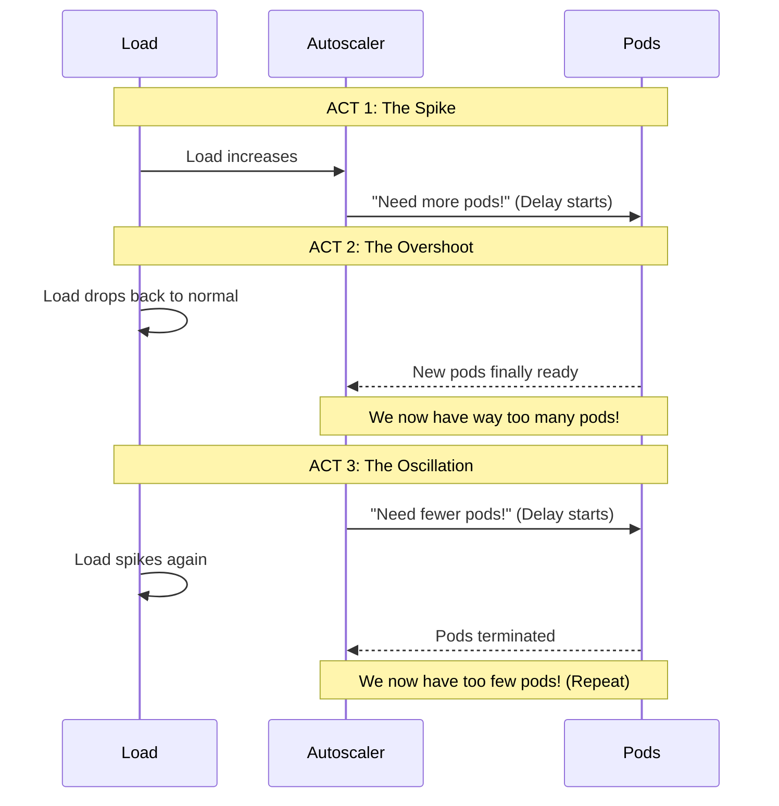
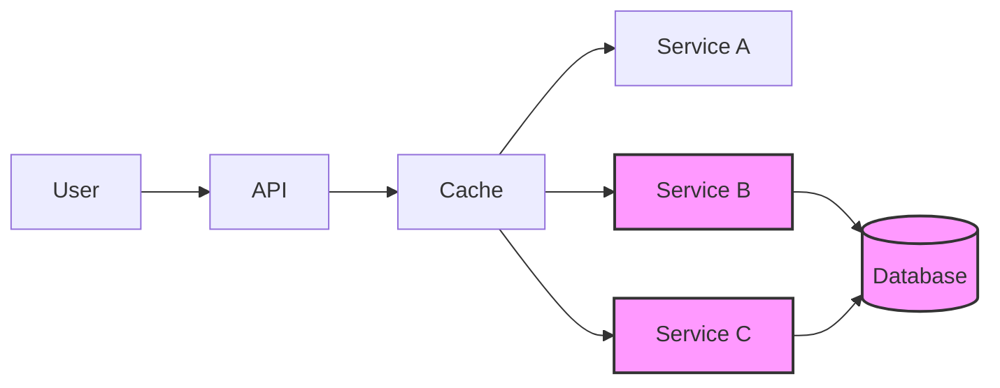

> **Complexity**: `[MEDIUM]` | **Time**: 35-45 minutes | **Prerequisites**: None (entry point to Platform track)

### What You'll Be Able to Do

After completing this module, you will be able to:

1. **Analyze** a system failure by mapping interconnected components rather than investigating services in isolation
2. **Explain** how emergent properties arise from component interactions and why they cannot be predicted from individual parts alone
3. **Apply** systems thinking frameworks (stocks-and-flows, boundaries, leverage points) to real infrastructure architectures
4. **Diagnose** incidents by zooming out to identify upstream and downstream dependencies before restarting individual services

---

## The 3 AM Incident

*Tuesday, 2:47 AM. The on-call engineer's phone explodes with alerts.*

"Payment service latency increased." Standard stuff. They check the dashboards—CPU at 23%, memory looks fine, no error spikes in the logs. Weird.

They do what any reasonable engineer would do at 3 AM: restart the service. Latency drops immediately. Back to sleep.

3:52 AM. Same alert. Latency is back.

Restart again. Works again. Sleep again.

4:23 AM. **Again.**

Now they're annoyed. They add more replicas. Check the code for memory leaks. Review recent deployments. Nothing. The service is *fine*. But the system is broken.

At 6 AM, exhausted and frustrated, they finally do what should have been done hours earlier: zoom out. Instead of staring at the payment service, they look at what's *around* it.

That's when they see it. A batch job—completely unrelated to payments—started running at 2:30 AM. It's processing end-of-day reports. It's hammering the shared database with massive analytical queries. Those queries are holding locks that block the payment service's small, fast transactions.

The payment service was *perfect*. It was the victim of a system-level problem that couldn't be seen by looking at individual components.

**This is systems thinking.** The ability to see the whole, not just the parts. To understand that behavior emerges from relationships, not components. To stop playing whack-a-mole with symptoms and start solving actual problems.

This scenario plays out in engineering teams every day. This module will teach you how to avoid it.

> **Stop and think**: How often does your team play "whack-a-mole" with production issues? Can you recall an incident where the root cause was entirely disconnected from the service that triggered the alert?

---

## What You'll Learn

- Why looking at components in isolation is a trap
- How behavior *emerges* from interactions (not from parts)
- The iceberg model for seeing below the surface
- The vocabulary that will change how you troubleshoot
- How to apply this to your next incident (starting tonight)

---

## Part 1: The Problem with Component Thinking

### The Mechanic vs. The Engineer

Here's an analogy that helped me understand this:

A **mechanic** fixes cars by testing parts until they find the broken one. Alternator dead? Replace it. Brake pads worn? New ones. This works because cars are *complicated* but not *complex*—the same input always produces the same output.

An **engineer** understands how the car actually works. They know that a weak alternator doesn't just fail—it causes the battery to drain, which causes the car to run lean, which damages the catalytic converter, which triggers the check engine light. They see the cascade.

Most ops teams are mechanics. They replace parts (restart services, scale pods, rollback deployments) until the alert goes away. Sometimes that's enough. But for complex systems, you need to be an engineer.



### What is a System?

A **system** is a set of interconnected elements organized to achieve a purpose.

Three key parts:

| Part | What It Is | Example |
|------|------------|---------|
| **Elements** | The things you can point at | Pods, services, databases, queues |
| **Interconnections** | How elements affect each other | Network calls, shared resources, data flows |
| **Purpose** | Why the system exists | Process payments, serve users, store data |

Here's the crucial insight: **you can understand every element perfectly and still not understand the system.**



> **Did You Know?** The word "system" comes from Greek *systema*, meaning "organized whole." The ancient Greeks understood something we keep forgetting: the whole is fundamentally different from the sum of its parts. Aristotle wrote about this 2,400 years ago. We're still learning the same lesson.

### Emergence: Where System Behavior Lives

**Emergence** is when a system exhibits properties that none of its individual parts possess.

This is the most important concept in this entire module. Read it again.

Your brain is made of neurons. No single neuron is conscious—it's just an electrochemical switch. But 86 billion of them connected in the right way, and suddenly you're reading this sentence and thinking about it. Consciousness *emerges*.

In distributed systems:

- **Individual service metrics**: Service A: 50ms, Service B: 40ms, Service C: 30ms
- **System behavior**: p99 latency of 2000ms, random timeouts, cascade failures

Where did the 2000ms come from? Where did the cascades come from? Not from any individual service. They emerged from the interactions—retries that amplify load, connection pools that exhaust, locks that contend.



> **Thought Exercise (2 minutes)**
>
> Think of a behavior in your system that only exists when components interact.
>
> Examples:
> - Shopping cart totals (product service + cart service + pricing rules)
> - Search ranking (search service + recommendation engine + user history)
> - Cascading failures (any service + retry logic + shared resources)
>
> Where does that behavior "live"? Not in any single service's code.

### Why Reductionism Fails

**Reductionism** is the scientific approach of understanding something by breaking it into parts and studying each part separately.

It works brilliantly for complicated machines. Want to understand a car engine? Take it apart. Study each piece. Reassemble. Done.

It fails catastrophically for complex systems. Here's why:

| Aspect | Complicated (car engine) | Complex (distributed system) |
|--------|--------------------------|------------------------------|
| **Behavior** | Predictable from parts | Emergent, surprising |
| **Cause & Effect** | Linear, traceable | Circular, networked |
| **Analysis** | Take apart, study pieces | Must observe whole in motion |
| **Fixing** | Replace broken part | Change relationships |
| **Same input** | Same output | Different output each time |

This is why "works on my machine" is such a meme. Your laptop isn't the system. The system includes the network, other services, the database state, the load from other users, and a hundred other interacting factors.

> **The Optimization Trap**
>
> Here's a counterintuitive truth: optimizing individual components often makes the system *worse*.
>
> Example: You make Service A 10x faster. Congratulations! Now it hammers the database 10x harder, causing lock contention that slows Services B and C. Global latency *increases*. Users are angrier than before.
>
> This is called **suboptimization**—winning locally while losing globally. It's one of the most common mistakes in distributed systems.

> **Pause and predict**: If optimizing a single component can sometimes make the system slower, what is the safest way to approach performance tuning in a microservices architecture?

---

## Part 2: The Iceberg Model

### Seeing Below the Surface

Most troubleshooting happens at the surface level. An alert fires, we react. Another alert, another reaction. We're playing an endless game of whack-a-mole.

The iceberg model teaches us to look deeper:



> **Stop and think**: Which level of the iceberg does your team spend most of its time in? What would need to change to move one level deeper?

### Each Level Explained

**Event level** (what happened?):
- "The payment service is slow right now."
- Response: Restart, scale up, add more resources
- Limitation: You'll be doing this forever

**Pattern level** (what's been happening?):
- "This happens every Monday morning."
- Response: Schedule extra capacity, create runbooks
- Limitation: You're managing the problem, not solving it

**Structure level** (what's causing this?):
- "The batch job and payment service share a database with no isolation."
- Response: Resource quotas, separate databases, connection pooling
- Limitation: Fixes this problem, but similar ones will appear

**Mental model level** (what beliefs allow this to exist?):
- "We assumed production workloads don't need resource isolation."
- Response: New architecture principles, design review processes
- Impact: Prevents entire *categories* of problems

---

## War Story: The Monday Mystery (Extended Cut)

*I want to tell you about the incident that taught me the iceberg model—the hard way.*

A fintech company had "random" payment failures every Monday. They weren't truly random, of course, but nobody had connected the dots. Every Monday morning, the on-call engineer would get paged, restart some services, add some pods, and things stabilize. They wrote a runbook. They scheduled extra capacity for Mondays. They were **world-class at managing the symptom**.

For eight months.

One day, a new engineer—fresh out of university, hadn't learned to accept dysfunction yet—asked an innocent question:

**"Why only Mondays?"**

The senior engineers looked at each other. Nobody knew. They'd always just... dealt with it.

The new engineer started digging. She pulled metrics from the past year. She correlated payment failures with everything she could find: deployment schedules, traffic patterns, marketing campaigns, infrastructure changes.

And there it was. At exactly 2:30 AM every Sunday night, CPU usage on one database server spiked. By 6 AM Monday, the spike ended—but the damage was done. Connection pools exhausted. Queries backed up. Payment timeouts cascading.

The culprit? A "Weekly Analytics Summary" batch job. Created two years ago. When the company was small. Processing a few thousand transactions. Now processing millions. What used to take 30 minutes now took 4 hours—and it was still growing.

Nobody owned this job anymore. The engineer who wrote it had left. It ran on the same database as real-time payments because, at the time, "it's just a small report."

**The Fix:**

| Level | What They Did |
|-------|--------------|
| Event | (What they'd been doing) Restart services, add pods |
| Pattern | Added Monday runbook, scheduled extra capacity |
| Structure | Moved batch job to replica database, added connection pool limits |
| Mental Model | New policy: "No analytical workloads on transactional databases. Ever." |

The Monday pages stopped. Not because they got better at responding—because they eliminated the cause.

**Total time to fix once they understood the problem**: 2 hours.
**Time they'd spent managing the symptom over 8 months**: ~200 engineer-hours.

> **Lesson**: The question "why only Mondays?" was worth hundreds of hours. The right question at the right level changes everything.

---

## Part 3: Systems Thinking Vocabulary

To see systems clearly, you need the right words. These terms will become essential to how you troubleshoot and communicate.

### The Essential Terms

| Term | Definition | Example |
|------|------------|---------|
| **System** | Interconnected elements with a purpose | Your entire production stack |
| **Boundary** | What's in vs. out of the system | Your services vs. AWS infrastructure |
| **Stock** | Accumulation within the system | Queue depth, connection count, error budget |
| **Flow** | Rate of change to a stock | Requests/second, pod creation rate |
| **Feedback** | When a system's output influences its input | Autoscaler: high CPU → more pods → lower CPU |
| **Delay** | Time between cause and effect | Metric collection lag, autoscaler reaction time |

### Stocks and Flows: The Bathtub Model

The easiest way to understand stocks and flows is to think of a bathtub:


*Rules: If INFLOW > OUTFLOW, stock rises. If INFLOW < OUTFLOW, stock falls. If INFLOW == OUTFLOW, stock is stable. Right now: 10 in, 8 out → Tub is filling at 2L/min → Overflow coming!*

Now apply this to your systems:


*You can't fix latency by looking at inflow or outflow alone. The STOCK determines latency. 5000 queued ÷ 800/sec = 6.25 seconds. The only ways to reduce latency: 1. Reduce inflow (rate limiting), 2. Increase outflow (more capacity), 3. Accept the backlog will drain eventually.*

> **Stop and think**: Look at the bathtub model. Can you identify the "stocks" and "flows" in the most critical service you maintain?

### Delays: The Hidden Cause of Chaos

Delays are everywhere in distributed systems:

| Delay | Typical Duration |
|-------|------------------|
| Metric collection | 10-60 seconds |
| Alerting pipeline | 30-120 seconds |
| Autoscaler reaction | 1-5 minutes |
| DNS propagation | Seconds to hours |
| Human response | Minutes to hours |
| Rolling deployment | Minutes to hours |

**Why delays matter**: They cause oscillation and overshoot.



> **Did You Know?** The famous "thundering herd" problem is a delay-induced catastrophe. A cache expires. All requests hit the database simultaneously. The database slows down. Requests time out and retry. More load. More timeouts. More retries. The delay between cache miss and successful refill creates a feedback loop that amplifies the original problem exponentially.

---

## Part 4: Applying Systems Thinking

### The Questions That Change Everything

When troubleshooting or designing systems, systems thinkers ask different questions:

| Normal Question | Systems Thinking Question |
|-----------------|---------------------------|
| "Which service is broken?" | "What changed in the system as a whole?" |
| "Who deployed what?" | "What feedback loops are active?" |
| "What's the error?" | "What's the pattern over time?" |
| "How do I fix this?" | "What structure enables this problem?" |
| "Is this service healthy?" | "Is the system achieving its purpose?" |

### A Systems Thinking Troubleshooting Session

**Scenario**: Users report intermittent slowness. Dashboards show all services green.

**Component approach** (what most people do):
1. Check each service's CPU, memory, errors
2. Everything looks fine
3. Blame the network
4. Add more logging
5. Wait for it to happen again
6. Still confused

**Systems approach**:

**Step 1: Map the System** (Draw connections, not just boxes)


**Step 2: Identify Feedback Loops**
- Cache misses → DB load → Slower queries → More timeouts → More retries → More DB load... (Reinforcing loop)
- Rate limiter → Rejected requests → Less load → Faster response... (Balancing loop)

**Step 3: Look for Stocks**
- Queue depths? Growing.
- Connection pool? 100% utilized!
- Error budget? Almost gone.

**Step 4: Check the Delays**
- How old are these metrics? 60 seconds old.
- Autoscaler cooldown? 5 minutes.
- When did the pattern start? Yesterday at 3 PM.

**Step 5: Go Deeper Than Events**
- Is this a pattern? Yes—happens during peak hours.
- What structure enables it? Shared DB connection pool with no limits.
- What mental model? "Services are independent."

**Root cause found**: Service B and C share a database connection pool. During peak load, Service B takes all connections for a slow analytics query. Service C starves. Timeouts cascade.

**Fix**: Per-service connection pool limits.

---

## Common Mistakes

| Mistake | Why It Hurts | What To Do Instead |
|---------|--------------|-------------------|
| **Treating symptoms** | Problem recurs, wastes time | Use iceberg model—go deeper |
| **Optimizing components** | Can make system worse | Optimize for system-level goals |
| **Ignoring delays** | Causes oscillation, overshoot | Map delays explicitly |
| **Tight system boundaries** | Miss external dependencies | Include what affects behavior |
| **Looking for THE root cause** | Complex systems have multiple causes | Look for contributing factors |
| **Assuming independence** | Services affect each other | Map connections and shared resources |

---

## Quiz

### Question 1
**Scenario:** Your company's checkout flow involves a Cart Service, a Pricing Service, and a Payment Service. Recently, users are experiencing 5-second delays during checkout. You check the dashboards for Cart, Pricing, and Payment, and all three services report average response times under 50ms with no errors. Your manager suggests putting a dedicated team on each service to optimize their individual performance to fix the delay. Is this the right approach?

<details>
<summary>Show Answer</summary>

**No, this approach relies on component-level optimization rather than systems thinking.**

In a complex distributed system, behavior emerges from the interactions between components, not the components themselves. The 5-second delay does not exist within the Cart, Pricing, or Payment services in isolation; it arises from how they communicate, such as network retries, connection pool exhaustion, or locking on a shared database. Optimizing the individual services without understanding their interconnections might actually make the problem worse (e.g., a faster Cart service could overwhelm a shared database). To solve this, you must map the system boundaries and look for delays or bottlenecks in the spaces *between* the services.
</details>

### Question 2
**Scenario:** You deploy a new microservice that automatically retries failed network requests up to 3 times. During testing, it works perfectly. However, in production during a minor network blip, this retry logic causes a massive spike in traffic that takes down an entirely unrelated legacy database. You are tasked with writing the incident report. How does the concept of "emergence" explain why this wasn't caught in component testing?

<details>
<summary>Show Answer</summary>

**Emergence explains that the cascading failure is a property of the entire system, not the individual retry logic.**

When you tested the microservice in isolation, the retry logic behaved exactly as designed: it made the service more resilient to transient faults. However, when integrated into the broader production environment, the interaction between the retries, the network blip, and the shared database's limited connection pool created a completely new, unpredictable behavior—a cascading failure. Emergent properties cannot be predicted by looking at a component alone because they are born from the relationships and feedback loops across the system. This is why troubleshooting complex systems requires looking at the system in motion, rather than examining isolated parts.
</details>

### Question 3
**Scenario:** Every Friday afternoon, your team's CI/CD pipeline backs up, delaying deployments by hours. The team's current solution is to manually cancel non-essential builds (Event level) and scale up the runner pool on Friday mornings (Pattern level). If you apply the Iceberg Model, what would a "Mental Model" level solution look like, and why is it more effective?

<details>
<summary>Show Answer</summary>

**A Mental Model solution would challenge the underlying assumption that all deployments must happen at the end of the week, which fundamentally eliminates the problem.**

Addressing events (canceling builds) or patterns (scaling runners) only manages the symptoms and requires continuous ongoing effort. By digging down to the Mental Model, you might discover the team believes "deployments are risky, so they should be grouped together on Fridays," which creates the structural bottleneck in the first place. Changing this belief to "deployments should be small, continuous, and safe at any time" would lead to a steady, even flow of CI/CD pipeline usage throughout the week. This approach is far more impactful because resolving a flawed mental model permanently prevents the entire category of problems from recurring.
</details>

### Question 4
**Scenario:** You configure a Kubernetes Horizontal Pod Autoscaler (HPA) to scale up your application when CPU exceeds 70%. During a traffic spike, the HPA triggers a scale-up. However, it takes 3 minutes for the new pods to become ready. By the time they start, the traffic spike has ended, leaving the cluster heavily over-provisioned. The HPA then scales down, but another traffic spike hits just as the pods terminate. Why does this specific sequence lead to system oscillation?

<details>
<summary>Show Answer</summary>

**The delay between the autoscaler's decision and the actual realization of capacity creates a mismatch between current state and current demand.**

In distributed systems, whenever there is a delay between cause and effect (such as the 3 minutes it takes for pods to boot), the system's corrective actions are essentially reacting to outdated information. By the time the new pods are ready, the initial condition (the traffic spike) has already changed, leading to an overshoot where there are too many resources. This overshoot triggers a corrective scale-down, which also suffers from delays, subsequently causing an undershoot when demand returns. Without accounting for these delays—such as by implementing predictive scaling, smoothing metrics, or adding stabilization windows—the system will continuously bounce between extremes instead of reaching equilibrium.
</details>

---

## Hands-On Exercise

### Part A: Observe Emergence in Kubernetes (15 minutes)

**Objective**: See how system behavior emerges from component interactions.

```bash
# Create namespace
kubectl create namespace systems-lab

# Deploy interconnected services
cat <<EOF | kubectl apply -f -
apiVersion: apps/v1
kind: Deployment
metadata:
  name: backend
  namespace: systems-lab
spec:
  replicas: 2
  selector:
    matchLabels:
      app: backend
  template:
    metadata:
      labels:
        app: backend
    spec:
      containers:
      - name: backend
        image: nginx:alpine
        ports:
        - containerPort: 80
---
apiVersion: v1
kind: Service
metadata:
  name: backend
  namespace: systems-lab
spec:
  selector:
    app: backend
  ports:
  - port: 80
---
apiVersion: apps/v1
kind: Deployment
metadata:
  name: frontend
  namespace: systems-lab
spec:
  replicas: 2
  selector:
    matchLabels:
      app: frontend
  template:
    metadata:
      labels:
        app: frontend
    spec:
      containers:
      - name: frontend
        image: curlimages/curl:latest
        command: ["/bin/sh", "-c"]
        args:
          - |
            while true; do
              curl -s -o /dev/null -w "%{http_code}\n" http://backend/
              sleep 1
            done
EOF

# Watch the system
kubectl get pods -n systems-lab -w
```

**Now break something and watch the system respond:**

```bash
# In another terminal, kill a backend pod
kubectl delete pod -n systems-lab -l app=backend \
  $(kubectl get pod -n systems-lab -l app=backend -o jsonpath='{.items[0].metadata.name}') \
  --wait=false
```

**What to observe:**
- Frontend continues working (load balances to surviving backend)
- New backend pod is created automatically
- System self-heals without human intervention

**This is emergence.** The self-healing behavior doesn't exist in any individual pod. It emerges from the interactions between Deployment controller, ReplicaSet, Service, and kube-proxy.

**Clean up:**
```bash
kubectl delete namespace systems-lab
```

### Part B: Apply the Iceberg Model (20 minutes)

Pick a recurring issue in your environment (or use this hypothetical):

> "The checkout page is slow during sales events."

Apply the iceberg model:

| Level | Analysis |
|-------|----------|
| **Event** | What happens? |
| **Pattern** | When? How often? What correlates? |
| **Structure** | What architecture/config enables this? |
| **Mental Model** | What assumption allowed this structure? |

**Example answer:**

| Level | Answer |
|-------|--------|
| **Event** | Checkout timeouts during Black Friday |
| **Pattern** | Happens every sale event. Correlates with >10x traffic. |
| **Structure** | Checkout service calls inventory synchronously. No caching. Single DB. |
| **Mental Model** | "Real-time inventory is always required" (but is it for checkout display?) |

**Success Criteria:**
- [ ] Observed pod deletion and automatic recovery in Part A
- [ ] Can explain what "emergence" you witnessed
- [ ] Completed iceberg analysis for Part B
- [ ] Identified at least one mental model that enables the problem

---

## Did You Know?

- **Systems thinking was born in biology**, not engineering. Ludwig von Bertalanffy developed General Systems Theory in the 1930s to understand living organisms as integrated wholes, not collections of parts.

- **The Apollo program** was one of the first engineering projects to formally apply systems thinking. With 2 million parts and 400,000 people, NASA couldn't understand the spacecraft by studying components—they had to see the whole.

- **W. Edwards Deming**, the quality management guru, estimated that **94% of problems are caused by the system, not the individual workers**. When something goes wrong, the structure almost always matters more than the person.

- **Jeff Bezos** attributes Amazon's success to "working backwards from the customer"—a systems thinking approach. Instead of building components and hoping they create good outcomes, he defines the desired system behavior first.

---

## Further Reading

- **"Thinking in Systems: A Primer"** by Donella Meadows — The foundational text. Readable, profound, and changed how I see everything.

- **"How Complex Systems Fail"** by Richard Cook — An 18-point paper that every engineer should read. Takes 10 minutes. Will change your career.

- **"The Fifth Discipline"** by Peter Senge — Systems thinking applied to organizations. Explains why your team keeps having the same problems.

- **"Drift into Failure"** by Sidney Dekker — How systems gradually drift toward catastrophe while every individual decision seems reasonable.

---

## Next Module

[Module 1.2: Feedback Loops](../module-1.2-feedback-loops/) — Understanding reinforcing and balancing feedback, and why your autoscaler sometimes makes things worse.

---

*"To understand is to perceive patterns."* — Isaiah Berlin

*"You can't understand a system by taking it apart. You can only understand it by seeing it in motion."* — Adapted from Russell Ackoff