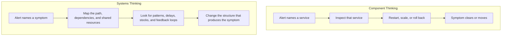
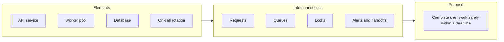
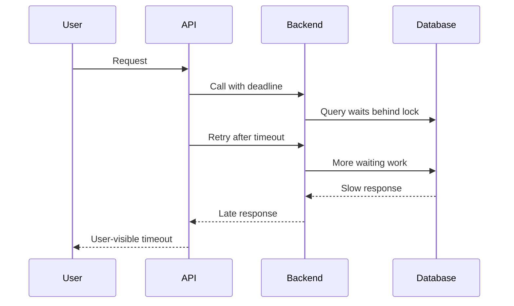
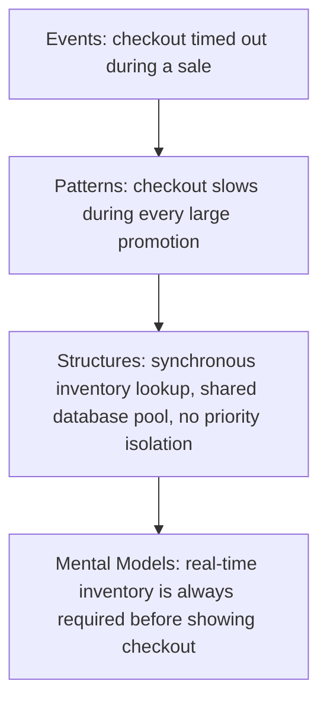
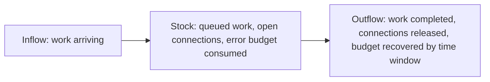
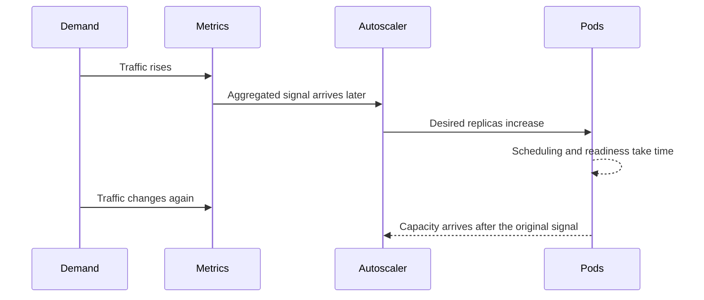
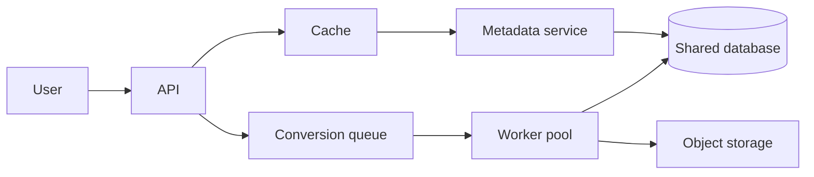

> **Complexity**: `[MEDIUM]` | **Time**: 50-65 minutes | **Prerequisites**: None (a natural starting point for the Platform foundations)

## What You'll Be Able to Do

After completing this module, you will be able to:

1. **Analyze** a system failure by mapping relationships, shared resources, delays, and feedback loops instead of investigating services in isolation.
2. **Explain** how emergent behavior arises from component interactions, and why healthy components can still create unhealthy system behavior.
3. **Apply** systems thinking frameworks such as boundaries, stocks and flows, feedback loops, delays, and leverage points to infrastructure architectures.
4. **Diagnose** incidents by moving from events to patterns, structures, and mental models before choosing a corrective action.
5. **Evaluate** tradeoffs between local optimization and whole-system outcomes when designing platform services, reliability controls, and operational processes.

---

## Why This Module Matters

**Hypothetical scenario:** A payment alert wakes the on-call engineer before dawn. The payment service dashboard looks ordinary: CPU is low, memory is stable, logs show no new exception pattern, and the most recent deployment happened earlier in the week. The immediate fix seems obvious, so the engineer restarts the payment pods, watches latency drop, and closes the incident as a transient service problem.

A little later, the same alert fires again. The restart works again, but only for a short time. Adding replicas helps briefly, then the symptom returns. A code-level investigation finds nothing because the payment service is not the origin of the behavior. The service is waiting behind locks and saturated database connections caused by a reporting workload that shares the same transactional database. The visible symptom lives in one service, but the cause lives in the relationship between workloads, schedules, database isolation, and the team's assumption that batch traffic and interactive traffic can safely share the same resource.

That shift in attention is the heart of systems thinking. Component thinking asks, "Which part is broken?" Systems thinking asks, "What pattern is the whole system producing, what relationships produce that pattern, and where can we intervene without creating a worse side effect?" Both modes are useful. A dead pod, expired certificate, or malformed deployment often needs direct component repair. The mistake is treating every production surprise as if it must have one broken part and one local fix.

Platform engineering is full of systems whose most important behavior does not belong to any single component. Kubernetes self-healing emerges from controllers comparing desired state with observed state. Tail latency emerges from fan-out, retries, queues, locks, noisy neighbors, and resource contention. Reliability emerges from service code, dependency behavior, operational practice, and user demand arriving at the same time. Observability emerges from instrumentation, context propagation, sampling policy, storage, query habits, and team literacy. In each case, the behavior operators care about is created by interaction.

Systems thinking matters because platform teams are often asked to fix symptoms whose causes cross ownership boundaries. An application team sees slow checkout. A database team sees acceptable average query time. A networking team sees packet loss within tolerance. A platform team sees autoscaling behaving as configured. Users still experience a broken system. The systems thinker is the person who can connect those truths without pretending any one dashboard is the whole story.

The goal of this module is not to give you a new vocabulary for sounding abstract in incident reviews. The goal is practical: make better troubleshooting decisions, design safer platform services, and choose interventions that improve the whole system rather than merely moving pain from one team or component to another. You will learn when to zoom in, when to zoom out, and how to move between those levels deliberately.

---

## What You'll Learn

Systems thinking starts with a simple but demanding habit: treat the system as a living arrangement of relationships, not a pile of boxes. A box diagram can be useful, but a systems view asks what flows between the boxes, what accumulates, what gets delayed, what feeds back, what is hidden outside the diagram boundary, and what purpose the arrangement actually serves.

By the end of this module, "the payment service is slow" should no longer feel like a complete diagnosis. It should feel like an event at the surface of a larger system. You should be able to ask what changed upstream, what queues or pools are accumulating pressure, what workload shares the same bottleneck, what retry or autoscaling loop may be amplifying the symptom, and what belief allowed the structure to exist in the first place.

You will also learn a disciplined way to avoid two common extremes. One extreme is local heroics: restart, scale, rollback, repeat. The other is vague abstraction: everything is connected, so nothing is actionable. Good systems thinking sits between those extremes. It uses models to find better action, not to avoid action.

---

## Part 1: The Problem with Component Thinking

### The Mechanic vs. The Systems Engineer

A useful analogy is the difference between replacing a part and understanding a traffic network. If a bicycle tire is punctured, component thinking works well: find the hole, patch the tube, inflate the tire, and ride. The part has a clear boundary, the failure is local, and the same fix usually produces the same outcome. Many infrastructure tasks are like this. A container image tag is wrong, a secret expired, a node is out of disk, or a manifest has an invalid field.

A production platform is more like a city's traffic network during bad weather. One stalled vehicle can matter, but the larger behavior comes from intersections, signal timing, driver choices, road capacity, emergency routes, weather, and feedback from navigation apps redirecting many drivers at once. Clearing one lane may help or may simply move congestion to the next bottleneck. The system's behavior depends on how parts influence one another over time.

Component thinking becomes dangerous when it is used on complex behavior. It narrows attention to the part named by the alert, which is often only the place where pain became visible. A checkout timeout may be caused by a pricing service, a fraud provider, a shared cache, a slow database query, a retry storm, an overloaded logging pipeline, or a scheduler delay. The checkout service may be healthy by every local metric and still be part of an unhealthy checkout system.


```mermaid
flowchart TD
    subgraph ComponentThinking ["Component Thinking"]
        A1["Alert names a service"] --> A2["Inspect that service"]
        A2 --> A3["Restart, scale, or roll back"]
        A3 --> A4["Symptom clears or moves"]
    end

    subgraph SystemsThinking ["Systems Thinking"]
        B1["Alert names a symptom"] --> B2["Map the path, dependencies, and shared resources"]
        B2 --> B3["Look for patterns, delays, stocks, and feedback loops"]
        B3 --> B4["Change the structure that produces the symptom"]
    end
```

The systems engineer still knows how to replace parts. The difference is sequencing. First, decide whether the problem is local, relational, or systemic. If a pod is crash-looping because it cannot parse configuration, a direct fix is appropriate. If three services are timing out even though each service is individually under its CPU limit, a relationship is likely involved. If the same class of incident recurs across teams, the structure or mental model is probably the more important target.

### What Is a System?

A **system** is an organized set of elements, interconnections, and purposes. The elements are the things you can name: pods, services, databases, queues, controllers, people, runbooks, dashboards, and deployment pipelines. The interconnections are the ways those elements affect one another: network calls, shared storage, ownership handoffs, retry behavior, alert routing, incident escalation, and policy. The purpose is what the whole arrangement is trying to accomplish, whether or not that purpose is written down.

That last phrase matters. A declared purpose might be "serve checkout reliably." The actual purpose revealed by behavior might be "ship features quickly unless checkout is visibly on fire." A platform can claim to prioritize reliability while rewarding teams only for deployment speed. A monitoring system can claim to reduce downtime while paging people on low-signal alerts until real incidents are missed. Systems thinking pays attention to the purpose the system enacts, not only the purpose people state.


```mermaid
flowchart LR
    subgraph Elements ["Elements"]
        E1["API service"]
        E2["Worker pool"]
        E3["Database"]
        E4["On-call rotation"]
    end

    subgraph Interconnections ["Interconnections"]
        I1["Requests"]
        I2["Queues"]
        I3["Locks"]
        I4["Alerts and handoffs"]
    end

    subgraph Purpose ["Purpose"]
        P1["Complete user work safely within a deadline"]
    end

    Elements --> Interconnections --> Purpose
```

The crucial insight is that you can understand every element and still misunderstand the system. A service owner may know every endpoint. A database owner may know every index. A platform owner may know every autoscaling rule. None of those facts alone explains what happens when a sale event sends user traffic through the checkout path while a background reconciliation job fills the same connection pool and a retry policy multiplies the load.

### Boundaries Decide What You Can See

Every system model has a boundary. The boundary says what is inside the model and what is outside. A tight boundary can make a problem easier to reason about, but it can also hide the actual cause. A wide boundary can reveal important relationships, but it can also become too large to act on. Systems thinking is not "include everything." It is choosing a boundary that explains the behavior you are trying to change.

For a payment timeout, a narrow boundary might include only the payment deployment and its pods. That boundary is appropriate if the pods are crashing. If the pods are waiting on a database, the boundary must include the database, connection pool, schema locks, and other workloads sharing the database. If the issue appears only after promotions, the boundary may need to include marketing calendars, traffic forecasts, release timing, rate limits, and customer behavior.

A practical boundary test is to ask, "Could something outside this diagram change the behavior inside it without changing any code inside it?" If the answer is yes, the boundary may be too tight. A DNS provider, identity provider, payment processor, object store, feature flag service, or human approval process can all change user-visible behavior while the application repository remains untouched.

Boundary choices also shape accountability. If the boundary stops at a team line, the organization may blame the owning team for symptoms created by shared infrastructure. If the boundary includes the shared resource and the policy that allowed unsafe sharing, the intervention can become structural rather than personal. This is one reason systems thinking is closely tied to blameless incident analysis: it changes the unit of analysis from a person or component to the conditions that made the outcome likely.

### Emergence: Where System Behavior Lives

**Emergence** means the whole system exhibits behavior that its individual elements do not exhibit alone. A Kubernetes Deployment controller is just a controller loop, a ReplicaSet is just a desired replica count, a Pod is just a workload unit, and a Service is just stable networking over changing endpoints. Together, they create self-healing behavior: delete a pod and the system works to return to desired state. No single pod contains "self-healing" as a property. The behavior emerges from the control loop and the relationships among objects.


```mermaid
sequenceDiagram
    participant U as User
    participant A as API
    participant B as Backend
    participant D as Database

    U->>A: Request
    A->>B: Call with deadline
    B->>D: Query waits behind lock
    A->>B: Retry after timeout
    B->>D: More waiting work
    D-->>B: Slow response
    B-->>A: Late response
    A-->>U: User-visible timeout
```

In that sequence, each component may be doing something locally reasonable. The API uses a timeout to avoid waiting forever. The backend retries because transient failures happen. The database lock exists because another workload needs consistency. The user-visible failure emerges when those individually reasonable behaviors interact under load. A component dashboard can tell you the local facts, but it will not automatically explain the emergent pattern.

Emergence is why average metrics can mislead. A service can have a healthy average latency while a small slice of requests waits behind a shared lock. A database can have acceptable total CPU while one hot table blocks a critical path. A cluster can have enough aggregate capacity while the scheduler cannot place pods that need a scarce resource. A system view asks where the user journey crosses queues, locks, rate limits, and fan-out points, because those are where local health can become global pain.

This does not mean emergent behavior is mystical or impossible to analyze. It means the behavior is located in relationships and time. To study it, you need traces, dependency maps, queue depth, saturation, timelines, and incident narratives that include what changed before the alert. You need to observe the system in motion, not only inspect component inventory.

### Why Reductionism Fails in Complex Systems

Reductionism is the habit of understanding something by breaking it into parts and studying each part separately. It is powerful when the parts have stable relationships and predictable behavior. It is less reliable when the parts adapt, contend, queue, retry, degrade, and influence one another through delayed feedback. Distributed systems have both kinds of problems, which is why experienced operators move between reductionist and systemic views instead of choosing one forever.

The table below is a useful distinction, but it is not a moral ranking. A complicated system has many parts, yet the same input usually produces the same output if the environment is controlled. A complex system has interactions that can produce surprising outcomes even when the parts are known. Your platform has complicated pieces, such as manifests, binaries, network rules, and database schemas. It also has complex behavior, such as overload, incident response, cascading failure, and organizational drift.

| Aspect | Complicated Problem | Complex System Problem |
|--------|---------------------|------------------------|
| Behavior | Mostly predictable from parts | Often emerges from interactions |
| Cause and effect | Usually linear and traceable | Often circular, delayed, and networked |
| Best first move | Inspect the suspect part | Map relationships and time sequence |
| Fix style | Repair or replace a component | Change boundaries, feedback, or incentives |
| Risk of local optimization | Usually limited | Can make the whole system worse |

The trap is local optimization. If Service A becomes faster without backpressure, it may send more traffic to a shared database and slow Services B and C. If an autoscaler reacts aggressively to short spikes, it may create capacity oscillation. If every client retries independently, the system may amplify the very failure it is trying to survive. Local improvement is valuable only when it is aligned with the constraint and purpose of the whole system.

### The First Decision: Zoom In or Zoom Out

When an incident starts, you rarely know whether the right move is local repair or system mapping. The first decision is therefore a diagnostic one: zoom in if evidence points to a discrete broken component, and zoom out if the symptom crosses boundaries, recurs after local fixes, or contradicts component dashboards. This decision should be explicit because teams often zoom in by habit.

Useful zoom-in signals include a fresh deployment tightly correlated with the symptom, a clear crash loop, a config parse error, a certificate expiration, a failed health check on one dependency, or an error message that names a specific missing resource. Useful zoom-out signals include repeated recurrence after restart, multiple services degrading at once, symptoms tied to time of day or workload mix, queue depth rising while CPU looks normal, or user complaints that do not match service averages.

The discipline is to keep both views available. If a rollback restores service, still ask why the system allowed the change to create broad impact. If a systemic map identifies a shared database bottleneck, still inspect the slow query or lock that consumed the resource. Systems thinking is not a replacement for debugging. It is the frame that tells you which debugging path is likely to matter.

---

## Part 2: The Iceberg Model

### Seeing Below the Surface

The iceberg model is a systems thinking tool for moving from visible events to deeper causes. The event is what triggered attention: an alert, a timeout, a failed deployment, a missed SLO, or a user report. Below that event are patterns over time, structures that create those patterns, and mental models that make those structures seem natural. The Donella Meadows Project describes the model as a way to connect events with patterns, structures, and mental models rather than treating each incident as isolated.


```mermaid
flowchart TD
    E["Events: checkout timed out during a sale"] --> P["Patterns: checkout slows during every large promotion"]
    P --> S["Structures: synchronous inventory lookup, shared database pool, no priority isolation"]
    S --> M["Mental Models: real-time inventory is always required before showing checkout"]
```

The model is useful because each level suggests a different class of action. Event-level action restores service. Pattern-level action prepares for recurrence. Structure-level action changes the design that creates recurrence. Mental-model action changes the assumptions that keep recreating the design. A mature team can operate at all four levels, but it should know which level it is addressing at any moment.

### Event Level: What Happened?

The event level is where production work usually begins. "Checkout timed out." "The queue is growing." "The deployment failed." "The cluster is out of allocatable memory." Event-level response is necessary because users are waiting and the system may be losing money, trust, or data. Restarting, rolling back, failing over, shedding load, disabling a feature flag, or adding temporary capacity can be exactly the right short-term action.

The limitation is that event-level work usually resets the symptom without changing the conditions that produced it. If a service is restarted every Monday, the restart is not the lesson. It is a clue. If a runbook says "scale the worker pool when the report job runs," the runbook may be useful, but the system is still designed to create manual work. The event level is where you buy time, not where you finish learning.

### Pattern Level: What Has Been Happening?

The pattern level asks whether the event is part of a repeated shape. Does it happen at the same time of day, during the same workload, after the same deployment step, near the same traffic threshold, or whenever a particular dependency is slow? Pattern analysis turns "random" into "not yet explained." It also protects teams from overfitting to the most recent event.

Good pattern questions are concrete. What changed before the first occurrence? What was different between occurrences and non-occurrences? Which metrics moved together? Which user journeys were affected and which were not? Did the symptom start after a traffic mix change, data growth, ownership handoff, new retry policy, or cost reduction? The answer is rarely in one chart. It usually appears when timelines are layered.

### Structure Level: What Arrangement Produces the Pattern?

The structure level looks for the architecture, policy, process, or resource relationship that makes the pattern likely. A structure might be a shared database without workload isolation, a queue with no age-based alerting, an autoscaler that reacts to delayed metrics, an incident process that requires too many approvals, or a deployment pipeline that batches risky changes because releases feel expensive.

Structure-level fixes are more durable than event-level fixes because they change the conditions. Moving analytical traffic to a read replica, adding connection-pool limits, separating priority queues, making retries bounded, adding backpressure, or changing rollout policy can prevent repeated events. These changes often require coordination because the structure usually crosses team lines. That coordination is part of the work, not a distraction from the work.

### Mental Model Level: What Belief Keeps Recreating the Structure?

The mental model level asks what people believed when they created or tolerated the structure. "Batch jobs are harmless if they run at night." "Services are independent if they have separate repositories." "Average latency is enough." "Retries make systems more reliable." "If a team owns a service, the service's incidents are that team's problem." These beliefs are not usually foolish. They were often reasonable in an earlier context and became unsafe as scale, coupling, or user expectations changed.

Mental-model work can feel abstract, but it has practical outputs. It changes review checklists, platform defaults, SLO definitions, capacity policies, incident templates, and design principles. For example, replacing "all production workloads can share the main database if they are careful" with "interactive and analytical workloads require explicit isolation" prevents a category of incidents. That is a higher-leverage intervention than teaching every on-call engineer to restart faster.

### The Iceberg Model in a Platform Review

**Hypothetical scenario:** A platform team reviews a recurring checkout slowdown before the next sale event. At the event level, the team records that checkout latency exceeded the user deadline during promotions. At the pattern level, it notices the issue appears only when a marketing campaign and an inventory reconciliation job overlap. At the structure level, it finds that checkout synchronously calls inventory, inventory shares a database pool with reconciliation, and neither workload has priority isolation.

At the mental-model level, the team finds two assumptions. The product assumption is that checkout must confirm exact inventory before continuing, even though the business can tolerate a small reconciliation flow after purchase. The infrastructure assumption is that batch jobs are safe if they are scheduled away from normal peak traffic, even though campaigns create new peaks. The fix is no longer "add more pods." The fix becomes a design change: isolate the reconciliation workload, cache inventory reads for the checkout path, and define which data must be exact before payment.

That example shows why the iceberg model is not just for postmortems. It is also a design review tool. Before building a new platform service, ask what events will get attention, what patterns you expect over time, what structures could create harmful patterns, and what assumptions are hidden in the design. If the team cannot name the assumptions, the system will still have them; they will simply be harder to challenge later.

---

## Part 3: Systems Thinking Vocabulary

### Elements, Interconnections, Purpose

The basic vocabulary of systems thinking gives teams a shared way to describe behavior. Elements are the visible pieces. Interconnections are the ways those pieces affect one another. Purpose is the outcome the whole system is organized to produce. In infrastructure work, the interconnections are often more important than the elements because they define how pressure moves.

A service catalog lists elements. A dependency map begins to show interconnections. A trace shows one request moving through interconnections over time. A queue depth chart shows accumulation. An incident timeline shows how actions and delays changed the system. A good platform review uses all of these views because no single artifact tells the whole story.

### Stocks and Flows

A **stock** is something that accumulates. A **flow** is the rate at which that stock increases or decreases. Queue depth is a stock. Incoming requests and completed requests are flows. Error budget is a stock. Bad events consume it, and it is replenished directly as the rolling SLO window advances and old failures age out of the window. Connection count is a stock. New checkouts increase it and completed work decreases it.

The bathtub analogy is still the simplest way to remember this. Water in the tub is the stock. Water from the faucet is inflow. Water down the drain is outflow. If inflow exceeds outflow, the stock rises even if both flows look normal by themselves. In a platform, a queue can grow while CPU is moderate because the constraint is a lock, external dependency, thread pool, or downstream quota rather than raw compute.


```mermaid
flowchart LR
    In["Inflow: work arriving"] --> Stock["Stock: queued work, open connections, error budget consumed"]
    Stock --> Out["Outflow: work completed, connections released, budget recovered by time window"]
```

Stocks are powerful because they carry memory. A system can look healthy at the inflow and outflow edges while the accumulated stock tells a different story. If requests arrive slightly faster than they complete, the queue may grow quietly until latency suddenly crosses a user deadline. If retries add new inflow while old work is still queued, the stock grows faster. If humans are the constrained stock, such as open incident actions or unreviewed changes, burnout and delay can accumulate even when each individual request seems small.

### Feedback Loops

A **feedback loop** occurs when a system's output influences future input. A balancing loop pushes the system toward a target. A thermostat turns heat on when a room is cold and off when it is warm. A Kubernetes controller observes actual state and works toward desired state. A rate limiter rejects some requests when demand exceeds policy. These loops are stabilizing when they are tuned to the real system.

A reinforcing loop amplifies change. Retries can be a reinforcing loop during overload: slow responses cause timeouts, timeouts cause retries, retries add load, added load causes slower responses. Cache stampedes can do the same thing: many callers miss the cache, all hit the database, the database slows, requests time out, and callers retry. Google SRE's cascading failure guidance describes cascading failure as a failure that grows through positive feedback, which is exactly the pattern systems thinkers look for during incidents.

Feedback loops are not good or bad by themselves. They are design tools. The question is whether the loop moves the system toward its purpose under realistic delays and saturation. A retry loop with backoff, jitter, retry budgets, and idempotency can improve resilience. A retry loop with immediate retries, no budget, and side effects can turn a minor fault into a larger outage.

### Delays

A **delay** is time between cause and effect. Delays are easy to underestimate because dashboards often display a value as if it represents the present. Metrics may be scraped periodically, processed through an alerting pipeline, and viewed after a human opens a dashboard. Autoscalers react after metric windows, control-loop intervals, scheduling, image pulls, readiness checks, and warm-up. Deployment impact may appear only after caches expire or long-lived connections drain.

Delays create overshoot. If an autoscaler adds pods based on a spike that has already ended, the system may over-provision. If it removes pods based on a quiet period just before demand returns, it may under-provision. Kubernetes documentation describes the HorizontalPodAutoscaler as a controller that periodically adjusts desired scale based on observed metrics. The word "periodically" is operationally important: the controller reacts to measured history, not perfect future demand.


```mermaid
sequenceDiagram
    participant Demand
    participant Metrics
    participant HPA as Autoscaler
    participant Pods

    Demand->>Metrics: Traffic rises
    Metrics->>HPA: Aggregated signal arrives later
    HPA->>Pods: Desired replicas increase
    Pods-->>Pods: Scheduling and readiness take time
    Demand->>Metrics: Traffic changes again
    Pods-->>HPA: Capacity arrives after the original signal
```

Delays also affect humans. An alert may fire after customers have already complained. A postmortem action may be assigned after the team has lost context. A quarterly architecture review may notice a reliability pattern months after the first warning signs. Systems thinking includes people and process because human delays are part of the production system.

### Leverage Points

A **leverage point** is a place where a small change can produce a large shift in system behavior. Donella Meadows' leverage point work is a foundational systems thinking reference because it warns that the obvious intervention is not always the powerful one. Changing a number, such as a timeout or replica count, can help. Changing information flow, incentives, rules, goals, or mental models can be more powerful when the recurring problem is structural.

In platform work, low-leverage interventions often fight symptoms. Add more dashboard panels. Add more pods. Increase a timeout. Create another runbook step. Those changes may be necessary during response, but they rarely change the pattern. Higher-leverage interventions change defaults and relationships: make dangerous retries hard to configure, provide a standard idempotency library, isolate batch and interactive workloads by default, require ownership for shared resources, or change SLO reviews so user journeys matter more than component averages.

Leverage is contextual. Separating databases may be high leverage for a workload-isolation problem and irrelevant for a deployment-risk problem. Adding tracing may be high leverage when dependency paths are unknown and low leverage when the known bottleneck is a contract with an external provider. Systems thinking does not choose the fanciest intervention. It chooses the intervention that changes the feedback loop producing the unwanted behavior.

### Coupling and Slack

**Coupling** describes how strongly one part of a system depends on another. Tight coupling is not automatically bad; synchronous calls are useful when the caller truly needs the answer before continuing. The risk is that tight coupling allows failure, delay, and demand spikes to travel quickly. A checkout flow that synchronously calls pricing, tax, inventory, fraud, payment, and email has many places where one slow component can consume the user's deadline.

**Slack** is spare capacity or flexibility that absorbs variation. Queue capacity, retry budgets, error budgets, manual fallback paths, cached reads, and human on-call bandwidth are all forms of slack. Too little slack makes the system brittle. Too much slack can hide waste or delay necessary design changes. The systems question is not "should we remove all slack?" It is "where does slack protect the system's purpose, and where does it hide a structure that should change?"

Coupling and slack interact. A tightly coupled path needs more careful deadlines, isolation, and fallback because variation travels directly to the user. A loosely coupled path can often absorb delay with queues, reconciliation, and eventual consistency. A platform engineer should be able to explain which dependencies are on the critical path, which are asynchronous, and how much slack each path has before user-visible behavior changes.

---

## Part 4: Applying Systems Thinking

### A Practical Troubleshooting Frame

When a production symptom appears, start with a clear statement of user impact, then map the path that produces that impact. The map does not need to be beautiful. It needs to show the user journey, synchronous dependencies, asynchronous work, shared resources, queues, retry loops, rate limits, and ownership boundaries. If the map has only boxes and no flows, it is not yet a systems map.

After mapping the path, place the symptom on the map and ask where pressure could accumulate before it becomes visible. Is there a queue that can grow? A connection pool that can saturate? A lock that can serialize work? A cache that can expire for many keys at once? A provider quota that can reject bursts? A human approval step that can delay recovery? These stocks often explain why the visible service is not the origin of the problem.

Next, build a timeline. Systems thinking is temporal. A dependency graph says what can influence what, but the timeline says what actually changed. Include deployments, feature flags, traffic changes, batch jobs, provider incidents, schema migrations, on-call actions, autoscaling events, and alert times. The goal is not to find a single guilty event. The goal is to identify the sequence of interactions that produced the pattern.

Finally, choose an intervention at the right level. If the event is still active, stabilize the system. If the pattern is known but the structure cannot change immediately, add guardrails and runbooks. If the structure is unsafe, redesign the relationship. If the same unsafe structure keeps appearing, change the mental model through standards, defaults, and review criteria.

### The Questions That Change the Conversation

Systems thinkers ask different questions from component troubleshooters. Instead of "Which service is broken?", ask "Where does the user journey cross a shared constraint?" Instead of "Who deployed?", ask "What changed in demand, dependency behavior, data shape, or control loops?" Instead of "Why did the alert fire?", ask "What pattern made this alert likely?" Instead of "How do we stop this page?", ask "What structure makes this page necessary?"

Those questions are not softer than technical debugging. They are more precise about the level of analysis. A restart answers an event. A capacity forecast answers a pattern. Workload isolation answers a structure. A new platform default answers a mental model. A mature incident review should be able to name which question each action item answers.

### Worked Example: Intermittent Slowness with Green Dashboards

**Hypothetical scenario:** Users report intermittent slowness in a document-processing application. The API, worker, cache, and database dashboards all show acceptable averages. A component-oriented investigation checks each service, finds no obvious error spike, and concludes the issue may be "the network." A systems-oriented investigation starts by mapping the request path and notices that slow requests all require a cache miss, a metadata lookup, and a document conversion job.


```mermaid
flowchart LR
    User --> API
    API --> Cache
    Cache --> Metadata["Metadata service"]
    Metadata --> DB[(Shared database)]
    API --> Queue["Conversion queue"]
    Queue --> Workers["Worker pool"]
    Workers --> ObjectStore["Object storage"]
    Workers --> DB
```

The map reveals two stocks: conversion queue depth and database connections. It also reveals a reinforcing loop: cache misses increase database reads, slow reads delay API responses, clients retry, retries increase cache and database demand, and worker status updates compete for the same database connections. The service averages are green because most requests hit the cache and avoid the slow path. The user impact is concentrated in a smaller path whose tail latency is hidden by averages.

The event-level fix is to shed duplicate retries and temporarily increase worker capacity. The pattern-level fix is to alert on cache-miss latency and queue age, not only service averages. The structure-level fix is to separate read pools from worker update pools and add bounded retries with jitter. The mental-model fix is to stop treating "service average latency" as proof that the user journey is healthy. Each level produces a different action, and all of them may be needed.

### Decision Framework: Where Should You Intervene?

A systems intervention should be judged by the behavior it changes, the side effects it may create, and the level at which it operates. Increasing capacity is often fast and reversible, but it may hide an unbounded demand problem. Adding a retry can improve resilience to transient faults, but it may amplify overload. Splitting a database can improve isolation, but it adds operational cost and consistency questions. Changing a platform default can prevent many incidents, but it requires migration support and clear ownership.

Use four prompts before committing to a fix. First, what stock or flow will this change? Second, what feedback loop will it strengthen or weaken? Third, what delay could make the intervention overshoot? Fourth, who or what will feel the side effect? If you cannot answer those questions, the fix may still be necessary during an emergency, but it should not be mistaken for a durable solution.

The safest durable interventions usually make the desired behavior easier than the dangerous behavior. For example, a standard HTTP client that includes deadlines, retry budgets, idempotency support, and telemetry makes safe calls easier than custom retry loops. A platform-provided queue with age alerts and dead-letter handling makes asynchronous work safer than every team inventing its own worker pattern. A deployment template that includes progressive rollout and automatic rollback makes careful release behavior the default instead of a heroic habit.

### Systems Thinking in Design Reviews

Design reviews often overemphasize component inventory: service names, database choices, API endpoints, and deployment manifests. A systems review adds questions about behavior over time. What happens when a dependency is slow rather than down? What work accumulates when consumers lag? What retries exist at each layer? Which operations are idempotent? What is the user deadline? What is the fallback behavior? What shared resource could become the real bottleneck?

It also asks what the design will teach future teams. If the platform makes it easy to create synchronous chains across many services, teams will build long critical paths. If the platform makes it easy to run analytical jobs against transactional stores, teams will share unsafe resources. If the platform exposes only component dashboards, teams will optimize components. The platform's defaults become the organization's mental model in executable form.

This is why systems thinking belongs in Platform Foundations. Platform teams do not merely run clusters. They shape the constraints, defaults, and information flows through which other teams build systems. A platform that encodes good systems thinking can prevent classes of incidents before application teams know the vocabulary. A platform that encodes poor assumptions will reproduce the same incidents across many services, even when each team is competent.

### Systems Thinking and Observability

Observability is the evidence layer for systems thinking. Metrics show stocks, flows, saturation, and trends. Logs show local facts and decisions. Traces show relationships across service boundaries and expose where time is spent. OpenTelemetry's tracing model relies on context propagation so spans from different services can be assembled into one trace. That is a technical implementation of a systems idea: the behavior belongs to the path, not only to the individual span.

The caution is that observability data can still reinforce component thinking if it is organized only around services. A dashboard per service is useful, but it should be complemented by user-journey dashboards, dependency views, queue age, saturation, and SLO burn. If the checkout journey is failing, the first dashboard should show checkout as users experience it, then let operators drill down into components. Starting with components makes it too easy to declare every part healthy while the whole remains unhealthy.

Observability also has feedback effects. If alerts reward fast restarts, teams will get better at restarts. If dashboards expose recurring structures, teams will redesign structures. If postmortems ask only "what broke?", teams will find broken parts. If postmortems ask "what made this outcome likely?", teams will find system conditions. The measurements you choose change the behavior of the people operating the system.

### A Short Practice Loop

Use this loop during your next design review or incident review. State the system purpose in user terms. Draw the boundary and name what is outside it. Identify the main stocks and flows. Mark feedback loops, especially retries, autoscalers, queues, and human escalation. Mark delays. Ask what pattern over time the current structure is likely to produce. Then choose the lowest-risk intervention that changes the unwanted pattern without damaging the system's purpose.

The loop can be done quickly. A rough diagram on a shared document is often enough to change the conversation. The value is not the artifact; it is the shift from debating isolated components to reasoning about relationships. Over time, that habit becomes part of how the team reads incidents, writes runbooks, designs platform APIs, and evaluates reliability work.

---

## Did You Know?

- **The iceberg model is a systems thinking teaching tool, not just a management metaphor.** The Donella Meadows Project describes it as a way to connect events with patterns, structures, and mental models so teams can see what keeps producing visible symptoms.
- **Kubernetes controllers are practical systems thinking in code.** The Kubernetes controller documentation describes controllers as loops that watch cluster state and make changes to move actual state toward desired state.
- **Cascading failure is a feedback problem.** Google SRE's chapter on cascading failures explains how an initial failure can grow when load shifts or retries increase pressure on remaining components.
- **Distributed tracing exists because service-local views are incomplete.** OpenTelemetry's tracing documentation emphasizes context propagation so spans from multiple services can be correlated into a single request path.

## Sources

- [Systems Thinking Resources - The Donella Meadows Project](https://donellameadows.org/systems-thinking-resources/)
- [Leverage Points: Places to Intervene in a System](https://donellameadows.org/archives/leverage-points-places-to-intervene-in-a-system/)
- [How Complex Systems Fail](https://how.complexsystems.fail/)
- [Addressing Cascading Failures - Google SRE Book](https://sre.google/sre-book/addressing-cascading-failures/)
- [Handling Overload - Google SRE Book](https://sre.google/sre-book/handling-overload/)
- [Timeouts, retries and backoff with jitter - AWS Builders' Library](https://aws.amazon.com/builders-library/timeouts-retries-and-backoff-with-jitter/)
- [The Tail at Scale - Google Research](https://research.google/pubs/the-tail-at-scale/)
- [Dapper, a Large-Scale Distributed Systems Tracing Infrastructure - Google Research](https://research.google/pubs/dapper-a-large-scale-distributed-systems-tracing-infrastructure/)
- [Horizontal Pod Autoscaling - Kubernetes](https://kubernetes.io/docs/concepts/workloads/autoscaling/horizontal-pod-autoscale/)
- [Deployments - Kubernetes](https://kubernetes.io/docs/concepts/workloads/controllers/deployment/)
- [Controllers - Kubernetes](https://kubernetes.io/docs/concepts/architecture/controller/)
- [Traces - OpenTelemetry](https://opentelemetry.io/docs/concepts/signals/traces/)

---

## Common Mistakes

| Mistake | Why It Hurts | What To Do Instead |
|---------|--------------|-------------------|
| Treating the alerting service as the cause | The alert often names where pain surfaced, not where it originated | Map the user journey and shared resources before choosing a fix |
| Optimizing one component in isolation | A faster component can overload a downstream constraint or starve peers | Optimize against the whole-system goal and current bottleneck |
| Ignoring stocks such as queues and pools | Accumulated work can hide until latency suddenly crosses a deadline | Track queue age, pool saturation, backlog, and error budget burn |
| Treating retries as free reliability | Retries can amplify overload and duplicate side effects | Use idempotency, retry budgets, backoff, jitter, and load shedding |
| Drawing boundaries around team ownership | Organizational boundaries can hide technical causes and shared constraints | Choose boundaries based on behavior, not reporting lines |
| Stopping at a single root cause | Complex incidents usually require multiple contributing conditions | Identify interacting factors and the structure that connected them |
| Writing action items only at the event level | Restart runbooks and extra capacity may leave the pattern intact | Add structure-level or mental-model changes when recurrence is likely |

---

## Quiz

<details>
<summary>Hypothetical scenario: A checkout service reports low CPU and low error rate, but users still see checkout timeouts during promotions. What systems-thinking question should you ask first?</summary>

Start by asking where the checkout journey crosses shared resources, queues, locks, synchronous dependencies, or retry loops. Low CPU on the named service only tells you that one element is not saturated in that dimension. The timeout may emerge from a database pool, inventory call, fraud provider, cache miss path, or client retry behavior. Systems thinking begins by mapping the path that produces user impact rather than accepting the alert label as the system boundary.
</details>

<details>
<summary>Hypothetical scenario: Restarting a service clears an alert for a short time, but the same alert returns later. Which iceberg levels have been addressed, and which remain?</summary>

The restart addresses the event level because it temporarily changes the immediate condition that triggered the alert. The returning symptom suggests the pattern, structure, or mental model remains unchanged. A pattern-level investigation would ask when recurrence happens, while a structure-level investigation would look for shared resources, workload schedules, or control loops that recreate the symptom. A mental-model investigation would ask what assumption allowed that structure to seem acceptable.
</details>

<details>
<summary>What is emergence, and why does it make component-only testing insufficient?</summary>

Emergence is system behavior created by interactions among elements rather than by one element alone. Component-only testing can prove that a service behaves correctly in isolation, but it cannot reveal every effect of retries, queues, shared pools, locks, delays, and user traffic interacting in production. This is why integration tests, load tests, traces, and incident timelines matter. They expose behavior that belongs to the relationship between components.
</details>

<details>
<summary>Hypothetical scenario: A team wants to make one API service ten times faster. What systems tradeoff should they evaluate before celebrating?</summary>

They should evaluate whether the faster service will increase pressure on a downstream constraint such as a database, queue, rate limit, or external provider. Local speed can improve user experience when the optimized service is the true bottleneck, but it can also move congestion to a more fragile part of the system. The team should measure whole-journey latency, saturation, and error budget impact before and after the change. Systems thinking treats local optimization as a hypothesis about the whole system, not an automatic win.
</details>

<details>
<summary>Hypothetical scenario: An autoscaler adds capacity after a traffic spike has already passed, then removes capacity just before the next spike. Which systems concept explains this behavior?</summary>

The key concept is delay. The autoscaler reacts to observed metrics after collection, aggregation, decision, scheduling, and readiness delays. If demand changes faster than the control loop can respond, the corrective action may arrive after the condition that triggered it has changed. That mismatch can cause overshoot and oscillation unless the system uses stabilization windows, predictive signals, slower scale-down, or other damping mechanisms.
</details>

<details>
<summary>Why is a system boundary a design choice rather than an objective fact?</summary>

A boundary is chosen to explain or change a behavior, so different questions require different boundaries. A pod crash may need a narrow boundary around one deployment, while recurring checkout latency may need a boundary that includes traffic sources, synchronous dependencies, shared databases, queues, retries, and human release practices. Boundaries that follow team ownership can be convenient but misleading. The useful boundary is the one that includes the relationships capable of producing the observed behavior.
</details>

<details>
<summary>Hypothetical scenario: A postmortem action item says, "Add more dashboard panels for each service." When is this low leverage, and what might be higher leverage?</summary>

It is low leverage if the recurring problem is that teams cannot see the user journey or shared bottlenecks across services. More component panels may deepen the same component-focused mental model that missed the issue. A higher-leverage action might add journey-level SLO dashboards, tracing across the critical path, queue-age alerts, or design rules for shared resource isolation. The better intervention changes the information flow or structure that made the incident hard to understand.
</details>

---

## Hands-On Exercise

### Part A: Model a Stock, Flow, Delay, and Feedback Loop

This exercise uses a small local simulation instead of a live cluster so you can focus on systems behavior without needing special infrastructure. You will model a request queue where incoming work, processing capacity, and retries interact. The numbers are intentionally a toy model; the lesson is how the shape changes when a feedback loop adds more work during overload.

Create the simulation file:

```bash
cat > /tmp/systems-thinking-queue.py <<'PY'
backlog = 0
capacity = 80
base_arrivals = [60, 70, 120, 140, 120, 90, 70, 60]
retry_fraction_when_backlogged = 0.25

print("minute arrivals retries processed backlog")
for minute, arrivals in enumerate(base_arrivals, start=1):
    retries = int(backlog * retry_fraction_when_backlogged) if backlog else 0
    total_arrivals = arrivals + retries
    processed = min(capacity, backlog + total_arrivals)
    backlog = backlog + total_arrivals - processed
    print(f"{minute:>6} {arrivals:>8} {retries:>7} {processed:>9} {backlog:>7}")
PY

.venv/bin/python /tmp/systems-thinking-queue.py
```

Read the output as a systems map. The stock is backlog. The inflow is new arrivals plus retries. The outflow is processed work. The feedback loop appears when backlog causes retries, and retries increase future backlog. The system can become worse even after base arrivals drop because the stock carries memory from previous minutes.

Now change `retry_fraction_when_backlogged` to `0.0` and run the script again. The difference shows why retries are not automatically good or bad. A retry policy changes a feedback loop. In a real service, you would combine retries with deadlines, budgets, backoff, jitter, idempotency, and load shedding so the loop helps during transient faults without amplifying overload.

### Part B: Apply the Iceberg Model to a Platform Problem

Use a recurring issue from your environment, or use this explicitly labeled teaching prompt: **Hypothetical scenario:** "The checkout page becomes slow during large promotions, but all individual service dashboards show acceptable averages." Fill in each iceberg level with one or two concrete observations, then write one action item for each level. The point is not to create the perfect answer; it is to practice separating event response from structural prevention.

| Level | Guiding Question | Example Analysis |
|-------|------------------|------------------|
| Event | What happened this time? | Checkout exceeded the user deadline during a promotion |
| Pattern | What has been happening over time? | Slowdowns correlate with promotion traffic and inventory reconciliation |
| Structure | What arrangement creates the pattern? | Checkout synchronously reads inventory through a shared database pool |
| Mental Model | What belief made the structure seem acceptable? | Exact inventory was assumed to be required before every checkout step |

**Success Criteria:**

- [ ] You can identify the stock, inflow, outflow, delay, and feedback loop in the local simulation.
- [ ] You can explain why backlog can keep growing after the original demand spike drops.
- [ ] You completed an iceberg analysis with event, pattern, structure, and mental-model levels.
- [ ] You wrote at least one structure-level action item that would reduce recurrence rather than only improving response speed.

---

## Further Reading

Start with Donella Meadows if you want the durable theory, then read Google SRE and AWS Builders' Library material when you want production examples. Meadows gives you the language of systems, stocks, flows, feedback, and leverage. The SRE and AWS sources show how those ideas appear in overload, cascading failure, retries, throttling, and tail latency in large software systems.

For a short safety-oriented companion, read Richard Cook's "How Complex Systems Fail" and pay attention to the argument that complex systems usually contain multiple latent problems before an incident. That framing is useful during postmortems because it pushes the team away from asking which person or component failed and toward asking how normal work exposed a combination of weaknesses.

---

## Next Module

[Module 1.2: Feedback Loops](../module-1.2-feedback-loops/) builds on this foundation by separating reinforcing loops from balancing loops and showing why retries, autoscalers, queues, and organizational incentives can either stabilize a platform or amplify failure.
