> **Complexity**: `[MEDIUM]`
>
> **Time to Complete**: 35-40 minutes
>
> **Prerequisites**: [Module 1.1: What is Systems Thinking?](../module-1.1-what-is-systems-thinking/)
>
> **Track**: Foundations

### What You'll Be Able to Do

After completing this module, you will be able to:

1. **Identify** reinforcing and balancing feedback loops in production systems and predict their behavior under load
2. **Diagnose** runaway cascades caused by positive feedback loops such as retry storms, autoscaler thrashing, and connection pool exhaustion
3. **Design** damping mechanisms (circuit breakers, backoff strategies, rate limiters) that interrupt destructive feedback cycles
4. **Evaluate** whether a system's feedback loops will stabilize or amplify under failure conditions

---

## The Black Friday Meltdown

*November 29th, 2019. 10:47 AM Eastern Time.*

The ShopMart engineering team is watching dashboards with coffee in hand. Black Friday traffic is building—already 3x normal load, heading toward 10x by afternoon. The autoscaler is doing its job, spinning up new pods. Everything looks green.

10:52 AM. Someone notices something odd. Database connection count is climbing faster than traffic. Not by a little—exponentially. Traffic up 20%, connections up 400%.

The senior DBA pulls up query logs. Queries are taking 3x longer than normal. Nothing has changed in the code. The database itself isn't maxed out—CPU at 40%, memory fine.

10:58 AM. The first timeouts start appearing. Payment service can't reach the database. It retries. All instances retry simultaneously—thousands of retries per second.

11:04 AM. The circuit breaker finally trips, but it's too late. The database connection pool is completely exhausted. New pods are spinning up (autoscaler sees high latency), but each new pod tries to grab connections from an empty pool. More pods, more connection attempts, more failures.

11:12 AM. Complete outage. The site displays "temporarily unavailable" to 400,000 shoppers.

**The root cause?** A single slow query. One poorly indexed query that normally took 50ms started taking 500ms under load. Connections held 10x longer meant connection pool filled 10x faster. Which meant more queuing. Which meant even longer waits. Which meant more timeouts. Which meant retries. Which added more load. Which made queries even slower.

> **Stop and think**: If a system is perfectly stable under normal load, what makes it suddenly collapse under higher load rather than just slowing down proportionally?

A **feedback loop** turned a minor performance issue into a complete system collapse in under 25 minutes.

---

## Why This Module Matters

Every production outage has a story. But if you look closely at the worst ones—the cascading failures, the death spirals, the "everything went wrong at once" disasters—they share a common element: **feedback loops** that amplified small problems into catastrophic failures.

Understanding feedback loops is understanding the DNA of system behavior.

A system with well-designed feedback loops is antifragile—it stabilizes under stress, recovers from failures, and gets stronger with use. A system with poorly designed feedback loops is a time bomb—stable in normal conditions, catastrophic when stressed.

This module teaches you to:
- Recognize feedback loops before they bite
- Predict which loops will help and which will harm
- Design systems that use feedback safely
- Break dangerous loops before they cascade

> **The Thermostat Principle**
>
> Your home thermostat is a perfect feedback loop. Temperature drops below setpoint → heater turns on → temperature rises → heater turns off. This is a **balancing loop**—it opposes change, maintaining stability.
>
> Now imagine if your thermostat were wired backwards: temperature drops → heater turns *off*. That's a **reinforcing loop**—it amplifies change. Your house would freeze.
>
> Most production incidents are just thermostats wired backwards. The system is trying to help, but its corrective actions make things worse. This module teaches you to spot backwards thermostats before they freeze your production systems.

---

## What You'll Learn

- The two fundamental types of feedback loops
- Why delays turn helpful loops into destructive oscillations
- The six most dangerous feedback patterns in distributed systems
- How to design systems that use feedback safely
- Techniques for breaking loops once they start

---

## Part 1: The Two Types of Feedback Loops

All feedback loops fall into two categories. Master this distinction and you'll understand half of all production incidents.

### 1.1 Reinforcing Loops: The Amplifiers

**Reinforcing loops** amplify change. Whatever direction the system is moving, reinforcing loops push it further. They're called "positive feedback" not because they're good (they usually aren't), but because they *add to* the existing trend.

Think of a microphone placed in front of a speaker. Sound enters the mic → gets amplified → comes out the speaker → enters the mic louder → gets amplified more. Without intervention, you get that ear-piercing screech within seconds.

> **Pause and predict**: What happens if a system has a reinforcing loop but no balancing loop to counteract it?

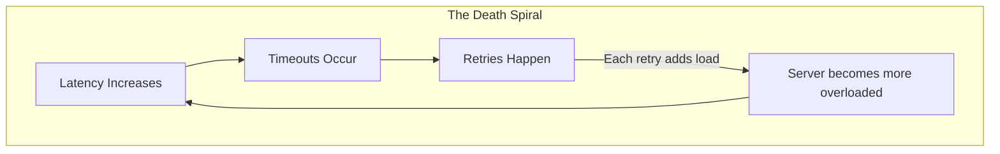

**Timeline of a real incident:**

| Time | Latency | Timeouts | Load |
|---|---|---|---|
| t=0:00 | 200ms | 0/sec | 1000 req/s |
| t=0:30 | 500ms | 50/sec | 1050 req/s |
| t=1:00 | 2000ms | 400/sec | 1400 req/s |
| t=1:30 | 5000ms | 1200/sec | 2200 req/s |
| t=2:00 | DEAD | ALL | 4000+ req/s |

*From "a little slow" to "completely dead" in 2 minutes.*

**The mathematics of reinforcing loops are terrifying.** If each loop iteration increases load by just 10%, after 10 iterations you're at 2.6x original load. After 20 iterations, 6.7x. After 30, 17x. This is exponential growth—and it happens fast.

**Common reinforcing loops in production:**

| Loop | How It Works | Why It's Dangerous |
|------|--------------|-------------------|
| **Retry storms** | Failure → retry → more load → more failure | Can 10x load in minutes |
| **Cache stampede** | Cache expires → all hit DB → DB slows → cache stays empty | Synchronized devastation |
| **Connection pool exhaustion** | Slow queries → connections held → pool fills → more waiting | Everything stops |
| **Memory pressure** | Swapping → slower processing → more memory pressure | Gradual then sudden death |
| **Alert fatigue** | Too many alerts → ignored → more incidents → more alerts | Human systems fail too |

### 1.2 Balancing Loops: The Stabilizers

**Balancing loops** oppose change. They push the system back toward a target or equilibrium. They're called "negative feedback" because they *subtract from* the current trend.

Your body temperature is maintained by balancing loops. Too hot → you sweat → cooling → temperature drops. Too cold → you shiver → heat generation → temperature rises. The target is 37°C, and your body fights any deviation.

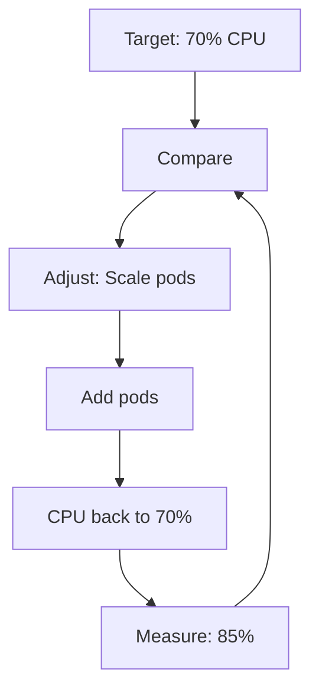

This is a **BALANCING** loop: it opposes change.
High CPU → action → lower CPU. Low CPU → action → higher CPU. System stabilizes around target.

**Common balancing loops in production:**

| Loop | How It Works | What It Protects |
|------|--------------|-----------------|
| **Autoscaling** | High load → add capacity → lower load | Performance |
| **Rate limiting** | Too many requests → reject excess → manageable load | Availability |
| **Circuit breakers** | Failures rise → stop calling → failures drop | Dependencies |
| **Backpressure** | Queue full → slow producers → queue drains | Memory |
| **Garbage collection** | Memory fills → GC runs → memory freed | Stability |

> **Did You Know?**
>
> - Your body contains over **200 feedback loops** maintaining temperature, blood sugar, blood pressure, pH levels, and more. Engineers who study biology often build more resilient systems.
>
> - The **steam engine governor** (1788) was one of the first mechanical feedback loops. When the engine sped up, weights flew outward and closed the steam valve. James Watt's governor made the Industrial Revolution possible.
>
> - **Predator-prey cycles** in nature are feedback loops. Rabbits increase → foxes increase (more food) → rabbits decrease (more predation) → foxes decrease (less food) → rabbits increase again. Ecologists mapped these loops in the 1920s; they're now used to model cloud services.

### 1.3 Identifying Loop Types: The Polarity Test

Quick technique: Count the inversions. An **inversion** is when an increase in one thing causes a *decrease* in another (or vice versa).

> **Stop and think**: Can a system have both reinforcing and balancing loops at the same time? Which one usually wins?

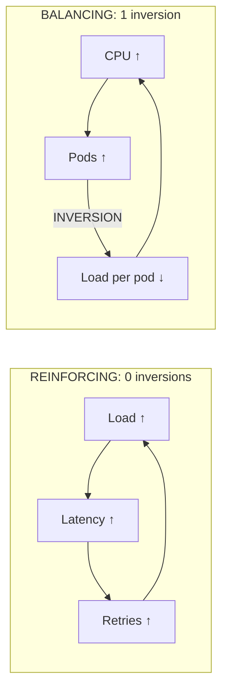

Quick test: Start with "A increases" and follow the loop.
If A ends up increasing more → Reinforcing
If A ends up decreasing back → Balancing

**Practice examples:**

1. **Rate limiting:** Requests ↑ → Rejections ↑ → *Accepted requests* ↓ → Load ↓
   - One inversion (more rejections = fewer accepted) = **Balancing**

2. **Cache miss cascade:** Misses ↑ → DB queries ↑ → DB latency ↑ → Cache timeout ↑ → Misses ↑
   - Zero inversions = **Reinforcing**

3. **Pod eviction:** Memory ↑ → Eviction ↑ → *Running pods* ↓ → *Load per pod* ↑ → Memory ↑
   - Two inversions = **Reinforcing** (eviction makes things worse!)

---

## Part 2: Delays—Why Good Loops Go Bad

Here's the dirty secret of feedback loops: **balancing loops can become destructive when delays are too long.** A well-intentioned stabilizing mechanism can oscillate wildly, causing more damage than if it didn't exist at all.

### 2.1 The Shower Problem

Everyone has experienced this. Hotel shower. Unfamiliar controls.

1. Water is cold
2. Turn up the hot
3. Still cold (water still in pipes)
4. Turn up more
5. Still cold (patience running thin)
6. Turn up even more
7. **SCALDING HOT** (all adjustments hit at once)
8. Yank it to cold
9. Still hot (pipe delay again)
10. Crank it colder
11. **FREEZING**
12. Repeat until you give up

This is a **balancing loop with delay**. The longer the delay relative to how fast you adjust, the worse the oscillation. The loop is trying to stabilize temperature, but the delay causes overshoot in both directions.

### 2.2 Autoscaler Oscillation: A Story in Three Graphs

> **Pause and predict**: If you increase the frequency of metric collection but leave the pod startup delay the same, will the oscillation get better or worse?

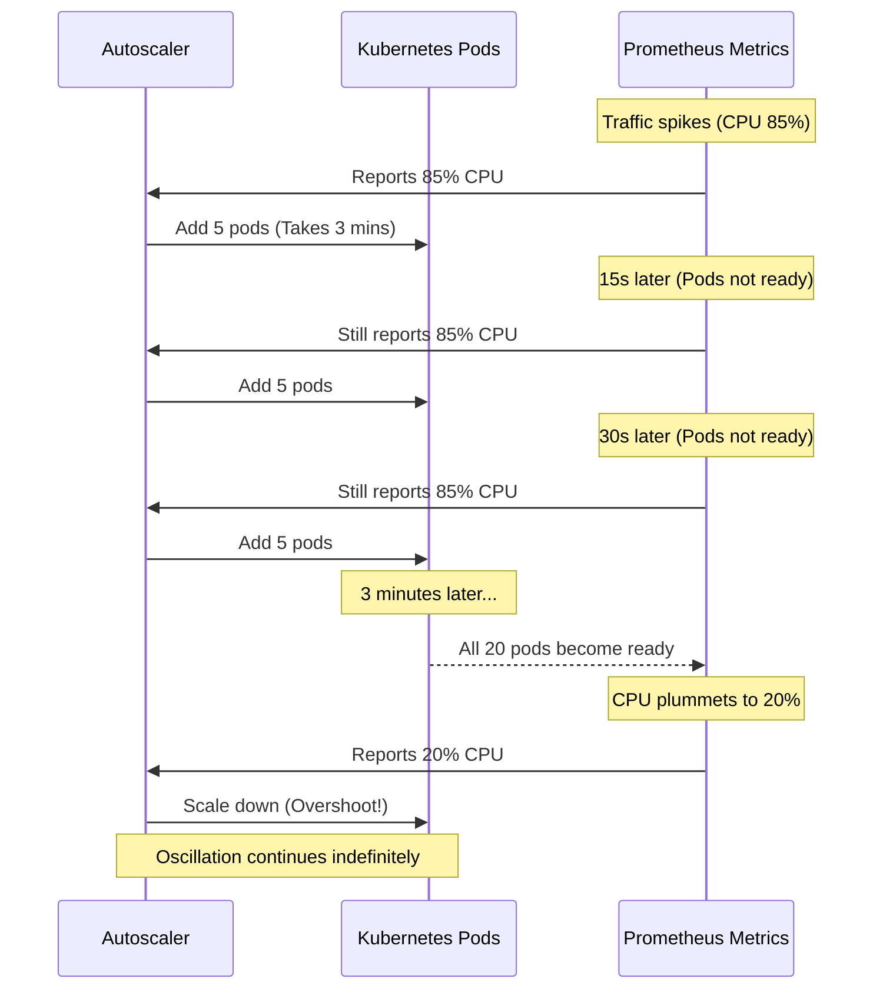

### 2.3 The Delay Inventory

Every feedback loop contains delays. Knowing your delays is essential for tuning loops correctly.

| Delay Type | Typical Duration | Where It Lurks |
|------------|-----------------|----------------|
| **Metric collection** | 10-60s | Prometheus scrape interval |
| **Metric aggregation** | 15-60s | Query evaluation period |
| **Alert threshold** | 30-300s | "Fire after 5 minutes of..." |
| **Autoscaler cooldown** | 30-600s | Prevent thrashing |
| **Pod startup** | 10-300s | Image pull + init + readiness |
| **DNS propagation** | 30-86400s | TTL-dependent |
| **Human response** | 300-3600s | Page → wake → investigate |
| **Deployment pipeline** | 300-3600s | Build + test + deploy |
| **Cache invalidation** | Variable | TTL or explicit purge |

**The total loop delay** is the sum of all delays in the loop. If your HPA evaluates every 15 seconds but pods take 3 minutes to start, your effective loop delay is 3+ minutes.

> **War Story: The Autoscaler That Destroyed Itself (Extended Version)**
>
> A logistics company ran their order tracking system on Kubernetes. They configured an HPA to scale based on a custom metric: messages in the processing queue. Clever idea—scale based on actual work, not just CPU.
>
> The metric came from their message broker, scraped by Prometheus every 30 seconds, aggregated over 1 minute for smoothing. Total delay: about 2 minutes from queue state to metric availability.
>
> The HPA evaluated every 15 seconds. So every 15 seconds, it would look at 2-minute-old data and make scaling decisions.
>
> One Thursday, a burst of orders came in. Queue depth jumped. The 2-minute-old metric showed "queue growing." HPA added 5 pods. Fifteen seconds later, still seeing "queue growing" (stale metric). Added 5 more. This continued for 2 minutes until fresh metrics arrived.
>
> By then, they had 47 pods for a queue that 8 pods could handle. But it got worse.
>
> Each pod needed 3 database connections. 47 pods × 3 connections = 141 connections. Their connection pool max was 100. Pods started failing health checks. The node autoscaler, seeing failing pods, added more nodes to "help." Each new node started more pods. More pods meant more connection attempts against a saturated pool.
>
> The database, overwhelmed with connection attempts, started timing out actual queries. The queue processing slowed. The queue grew. The HPA saw the growing queue (in now-accurate metrics) and tried to add more pods.
>
> At the peak, they had 400+ pods failing to start across 12 nodes, their database completely unresponsive, and zero orders being processed.
>
> The fix took three changes:
> 1. Increased HPA evaluation interval to exceed metric delay (3 minutes)
> 2. Added stabilization windows (5 minutes before scale-down)
> 3. Set connection pool limits as pod resource constraints
>
> Total outage: 47 minutes. Revenue impact: $230,000. The fix: 3 lines of YAML.

---

## Part 3: The Six Deadly Loops

These patterns cause the majority of cascading failures in distributed systems. Learn to recognize them instantly.

### 3.1 The Retry Storm

**Pattern:** Failure triggers retries, retries add load, load causes more failures.

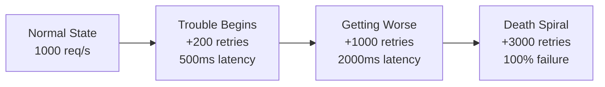

**Breaking the loop:**
- Exponential backoff: Each retry waits longer
- Jitter: Randomize backoff to prevent synchronization
- Retry budgets: Limit total retries per time window
- Circuit breakers: Stop retrying after threshold

### 3.2 The Thundering Herd

**Pattern:** Synchronized events cause coordinated resource access.

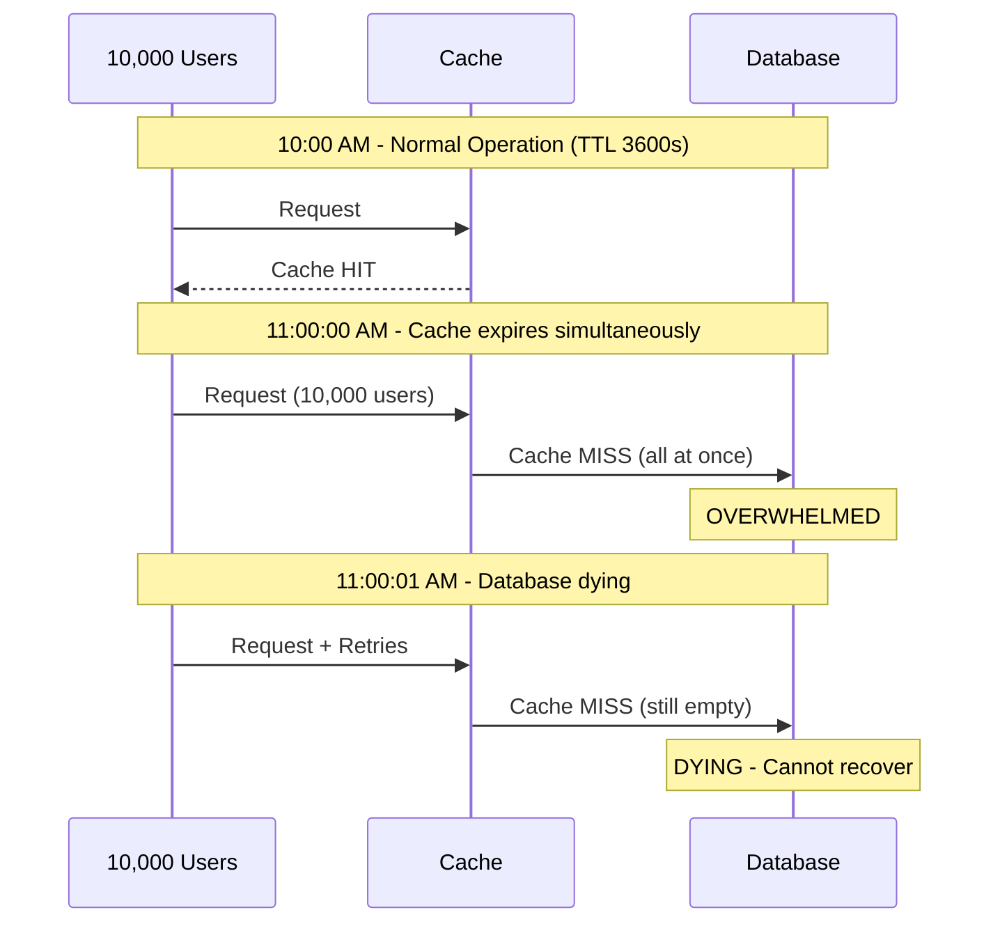

**Breaking the loop:**
- Jittered TTLs: `TTL = 3600 + random(-300, 300)` seconds
- Single-writer pattern: One request populates cache, others wait
- Cache warming: Refresh before expiration
- Request coalescing: Deduplicate identical in-flight requests

### 3.3 The Connection Pool Death Spiral

**Pattern:** Slow operations hold connections longer, exhausting the pool.

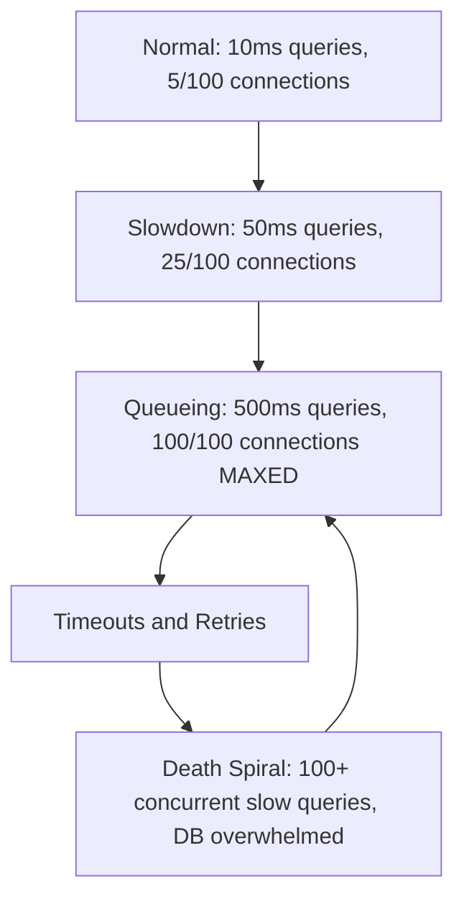

**Breaking the loop:**
- Connection timeouts: Release connections if held too long
- Query timeouts: Kill queries that exceed threshold
- Pool sizing: Size based on downstream capacity, not demand
- Bulkheading: Separate pools for different operation types

### 3.4 The Eviction Cascade

**Pattern:** Resource pressure causes evictions, evictions redistribute load, causing more pressure.

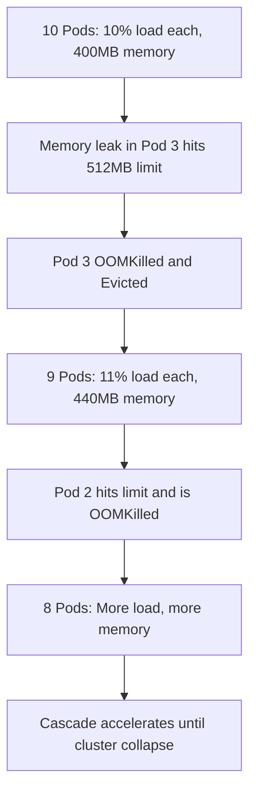

**Breaking the loop:**
- PodDisruptionBudgets: Limit concurrent evictions
- Proper resource requests: Ensure headroom
- Horizontal scaling: Add pods before eviction, not after
- Memory leak detection: Alert before OOM

### 3.5 The Alert Storm

**Pattern:** Incidents generate alerts, alerts overwhelm responders, overwhelmed responders miss alerts, more incidents.

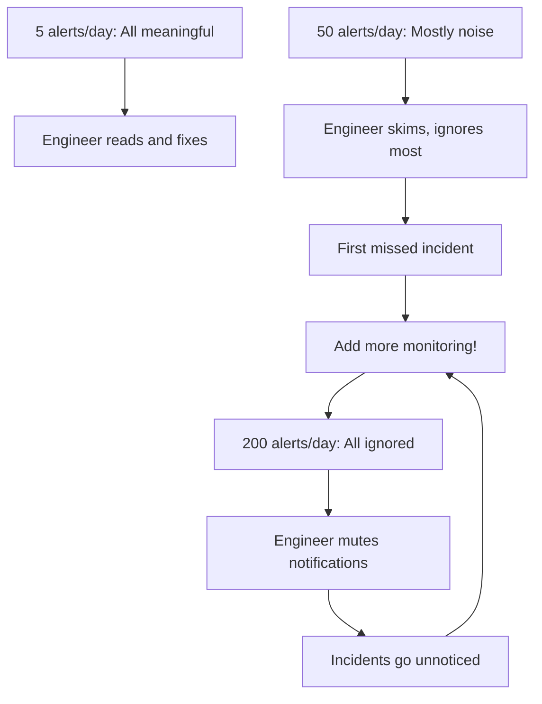

**Breaking the loop:**
- Alert on symptoms, not causes (user impact, not internal metrics)
- Every alert must be actionable
- Regular alert review: Delete alerts nobody acts on
- On-call feedback: Track alert-to-incident ratio

### 3.6 The Capacity Planning Spiral

**Pattern:** Under-provisioning causes incidents, incidents cause over-provisioning, budgets cut, under-provisioning.

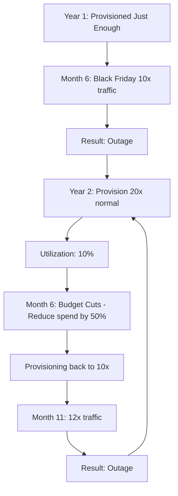

**Breaking the loop:**
- Load testing: Know your actual limits
- Autoscaling: Match capacity to demand
- Cost attribution: Show cost vs. revenue at traffic levels
- Chaos engineering: Prove you can handle expected peaks

---

## Part 4: Designing with Feedback in Mind

### 4.1 Principles for Safe Feedback Loops

**Principle 1: Match loop speed to delay**

If your system changes faster than your feedback loop can respond, you'll oscillate. The loop evaluation period should exceed the total delay.

```yaml
# Kubernetes HPA with proper stabilization
apiVersion: autoscaling/v2
kind: HorizontalPodAutoscaler
spec:
  scaleTargetRef:
    apiVersion: apps/v1
    kind: Deployment
    name: my-app
  minReplicas: 3
  maxReplicas: 100
  metrics:
  - type: Resource
    resource:
      name: cpu
      target:
        type: Utilization
        averageUtilization: 70
  behavior:
    scaleDown:
      stabilizationWindowSeconds: 300  # Wait 5 min before scaling down
      policies:
      - type: Percent
        value: 10                       # Remove max 10% of pods
        periodSeconds: 60               # Every minute
    scaleUp:
      stabilizationWindowSeconds: 60    # Wait 1 min before scaling up more
      policies:
      - type: Percent
        value: 100                      # Can double pods
        periodSeconds: 60
      - type: Pods
        value: 4                        # Or add max 4 pods
        periodSeconds: 60
      selectPolicy: Max                 # Use whichever allows more scaling
```

**Principle 2: Add damping to prevent oscillation**

Damping slows down responses, trading speed for stability. Like shock absorbers on a car.

```python
# Bad: React to every measurement
def scale_pods(current_cpu):
    if current_cpu > 70:
        add_pods(5)
    elif current_cpu < 50:
        remove_pods(5)

# Good: Damped response with smoothing
class DampedScaler:
    def __init__(self):
        self.measurements = []
        self.last_scale_time = 0
        self.cooldown = 300  # 5 minutes

    def scale_pods(self, current_cpu):
        self.measurements.append(current_cpu)

        # Only consider last 5 minutes of data
        self.measurements = self.measurements[-20:]

        # Require cooldown period
        if time.time() - self.last_scale_time < self.cooldown:
            return  # Too soon to act

        avg_cpu = sum(self.measurements) / len(self.measurements)

        # Require sustained deviation
        if all(m > 70 for m in self.measurements[-5:]):
            add_pods(2)  # Smaller increments
            self.last_scale_time = time.time()
        elif all(m < 50 for m in self.measurements[-5:]):
            remove_pods(1)  # Even smaller for scale-down
            self.last_scale_time = time.time()
```

**Principle 3: Break reinforcing loops with circuit breakers**

Don't let failure amplify failure. Insert breaks in the loop.

```python
class CircuitBreaker:
    def __init__(self, failure_threshold=5, recovery_timeout=30):
        self.failures = 0
        self.threshold = failure_threshold
        self.timeout = recovery_timeout
        self.state = "CLOSED"  # CLOSED, OPEN, HALF_OPEN
        self.opened_at = None

    def call(self, func, *args, **kwargs):
        if self.state == "OPEN":
            if time.time() - self.opened_at > self.timeout:
                self.state = "HALF_OPEN"
            else:
                raise CircuitOpenError("Circuit breaker is open")

        try:
            result = func(*args, **kwargs)
            if self.state == "HALF_OPEN":
                self.state = "CLOSED"
                self.failures = 0
            return result
        except Exception as e:
            self.failures += 1
            if self.failures >= self.threshold:
                self.state = "OPEN"
                self.opened_at = time.time()
            raise

# Usage: Breaks the retry storm loop
@circuit_breaker(failure_threshold=5, recovery_timeout=30)
def call_payment_service(order):
    return http_client.post("/payments", order)
```

**Principle 4: Add jitter to prevent synchronization**

```python
# Bad: All caches expire at exactly the same time
cache.set(key, value, ttl=3600)  # All users hit this at 3600s

# Good: Randomize to spread load
import random
jittered_ttl = 3600 + random.randint(-600, 600)  # 50-70 minutes
cache.set(key, value, ttl=jittered_ttl)

# For retries: exponential backoff with jitter
def retry_with_backoff(func, max_retries=5):
    for attempt in range(max_retries):
        try:
            return func()
        except RetryableError:
            if attempt < max_retries - 1:
                base_delay = (2 ** attempt)  # 1, 2, 4, 8, 16 seconds
                jitter = random.uniform(0, base_delay * 0.5)
                time.sleep(base_delay + jitter)
    raise MaxRetriesExceeded()
```

### 4.2 The Feedback Loop Checklist

Before deploying any system with feedback mechanisms, answer these questions:

### Feedback Loop Analysis Checklist

For each feedback loop in your system:

- [ ] **IDENTIFICATION**
  - What are the elements in the loop?
  - Is it reinforcing or balancing?
  - What behavior does it create?
- [ ] **DELAYS**
  - What is the total delay around the loop?
  - Is the loop evaluation faster than the delay?
  - What happens during the delay period?
- [ ] **STABILITY**
  - Is there damping/smoothing?
  - Are there stabilization windows?
  - Can the loop oscillate? At what frequency?
- [ ] **FAILURE MODES**
  - What happens if feedback is delayed/lost?
  - What happens under extreme load?
  - Is there a circuit breaker to stop runaway loops?
- [ ] **SYNCHRONIZATION**
  - Can multiple instances synchronize?
  - Is there jitter on timers/TTLs?
  - What triggers correlated behavior?
- [ ] **OBSERVABILITY**
  - Can you see the loop in action?
  - What metrics show loop behavior?
  - How would you detect a runaway loop?

---

## Did You Know?

- **Audio engineers** use feedback loops intentionally. Electric guitar sustain comes from controlled feedback between the pickups and amplifier. Jimi Hendrix was a master of feedback control.

- **The 2010 Flash Crash** (stock market dropped 9% in 5 minutes) was caused by algorithmic trading feedback loops. One algorithm sold, prices dropped, other algorithms sold in response, prices dropped more. Circuit breakers now halt trading when prices move too fast.

- **Climate feedback loops** worry scientists. Ice melts → less reflection → more heat absorption → more melting. Some loops are self-reinforcing with century-long delays—we might have already triggered them without knowing.

- **The Federal Reserve** manages feedback loops constantly. Raise interest rates → less borrowing → less spending → lower inflation. But with 12-18 month delays, it's like steering a supertanker through a narrow channel.

---

## Common Mistakes

| Mistake | Why It's Dangerous | Solution |
|---------|-------------------|----------|
| Retries without backoff | Creates reinforcing loop that amplifies failures | Exponential backoff with jitter |
| Tight autoscaler settings | Oscillation wastes resources and can crash systems | Stabilization windows, gradual changes |
| Identical cache TTLs | Thundering herd on expiration | Jitter all TTLs by ±10-20% |
| No circuit breakers | Failures cascade until total outage | Add breakers at every service boundary |
| Ignoring metric delay | Autoscaler reacts to stale data, overshoots | Evaluation interval > metric delay |
| Alert on every metric | Alert fatigue, real issues missed | Alert on user-facing symptoms only |
| Scaling on connection count | Each new pod adds connections, triggers more scaling | Scale on latency or queue depth instead |

---

## Quiz

1. **Scenario: Your e-commerce checkout service has a default timeout of 5 seconds. During a database slowdown, requests start taking 8 seconds. The payment processing pods automatically retry failed requests up to 3 times immediately. What type of feedback loop is this, and what will happen to the database?**
   <details>
   <summary>Answer</summary>

   This is a **reinforcing loop** (specifically, a retry storm). The database is already slow due to load or locking. When the checkout service times out and immediately retries 3 times, it multiplies the load on the database by 4. This additional load makes the database even slower, causing more timeouts, which cause even more retries. The loop will amplify the failure until the database or the payment service completely collapses.
   </details>

2. **Scenario: You configure a HorizontalPodAutoscaler (HPA) to maintain 70% CPU utilization. It evaluates metrics every 15 seconds. However, your application pods take 4 minutes to start up and become ready because they need to download a large machine learning model. After a spike in traffic, you notice the number of pods fluctuating wildly between 10 and 100 every few minutes, while CPU usage bounces between 10% and 100%. What is causing this behavior?**
   <details>
   <summary>Answer</summary>

   This oscillation is caused by a **balancing loop with a severe delay**. The HPA sees high CPU and adds pods to counteract the load. Because the pods take 4 minutes to start, the CPU metric remains high during the next 15-second evaluation, prompting the HPA to add even more pods. By the time the pods finally start, the HPA has over-provisioned massively, dropping CPU to near zero and triggering an aggressive scale-down. The system oscillates wildly because the corrective action takes longer to take effect than the HPA's evaluation interval.
   </details>

3. **Scenario: You launch a new popular mobile game. At exactly midnight, the daily quests reset for all players. Every player's app simultaneously requests the new quests from the backend. The backend checks a Redis cache, but the quest data for the new day hasn't been cached yet. The backend then queries the database. Within seconds, the database crashes. What pattern is this, and how does it create a reinforcing loop?**
   <details>
   <summary>Answer</summary>

   This is the **thundering herd** pattern, which creates a destructive reinforcing loop. The simultaneous cache misses cause a massive spike in database queries that overwhelms the database backend. The database slows down significantly, causing those queries to time out and fail to populate the cache. Because the queries time out, subsequent requests from the apps also miss the cache and hit the database directly. This keeps the database overwhelmed and ensures the cache remains empty indefinitely.
   </details>

4. **Scenario: To fix the daily quest crash from the previous scenario, you decide to cache the daily quests for 24 hours. However, you notice that exactly 24 hours later, the database crashes again. Your senior engineer suggests adding "jitter" to the cache TTL. Why is jitter the correct solution here?**
   <details>
   <summary>Answer</summary>

   Jitter is the correct solution because it breaks the synchronization of the **thundering herd**. If all cache entries have an exact TTL of 24 hours (86,400 seconds), they will all expire at exactly the same time the next day, causing another simultaneous wave of database queries. By adding a random jitter value (e.g., between -30 and +30 minutes), the cache expirations are spread out over a wide time window. This converts a massive, instantaneous spike in load into a manageable, distributed stream of requests. The database can then comfortably repopulate the cache without becoming overwhelmed.
   </details>

---

## Hands-On Exercise

**Task**: Analyze feedback loops in a production architecture.

**Scenario**: You're reviewing this API service architecture:

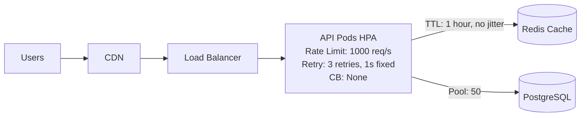

**Your Analysis**:

1. **Identify all feedback loops** (20 minutes)

   List every loop you can find. For each one:
   - Elements in the loop
   - Type (reinforcing/balancing)
   - Total delay in the loop
   - What triggers it
   - What goes wrong

2. **Find dangerous combinations** (10 minutes)

   Which loops could trigger together? Which balancing loops might fight each other?

3. **Propose fixes** (15 minutes)

   For each dangerous loop, propose a concrete fix with configuration examples.

**Expected Findings**:

<details>
<summary>Click to see answer</summary>

**Reinforcing Loops (Dangerous)**:

1. **Retry Storm**
   - Path: Timeout → Retry → More load → Slower responses → More timeouts
   - Delay: 1 second (fixed, no jitter)
   - Trigger: Any slowdown
   - Problem: 3 retries with no jitter means 3x load when slow

2. **Cache Stampede**
   - Path: Cache expires → All miss → DB overload → Timeouts → Cache not populated → More misses
   - Delay: Exactly 1 hour (synchronized)
   - Trigger: Any heavily-cached key expiring
   - Problem: No jitter means synchronized expiration

3. **Connection Pool Exhaustion**
   - Path: Slow query → Connections held → Pool fills → Requests wait → Timeouts → Retries → More connections needed
   - Delay: Query timeout (likely long)
   - Trigger: Any database slowdown
   - Problem: Only 50 connections, no circuit breaker

4. **Rate Limit Retry Amplification**
   - Path: Rate limit hit → 429 → Client retries → Rate limit hit → More 429s
   - Delay: 1 second (fixed retry)
   - Trigger: Traffic near 1000 req/s
   - Problem: Retries count against rate limit

**Balancing Loops**:

1. **HPA CPU Scaling**
   - Path: High CPU → Add pods → Lower CPU per pod
   - Delay: 15s evaluation + pod startup (60s+)
   - Problem: Cooldown too short (30s), may oscillate

2. **Rate Limiting**
   - Path: Too many requests → Reject some → Manageable load
   - Delay: Immediate
   - Problem: Works for server, but combined with retries is reinforcing for client

**Dangerous Combinations**:

1. Cache stampede + Retry storm + Connection exhaustion:
   - Cache expires → DB hit → DB slow → Connections held → Pool full → Timeouts → Retries → 3x load on full pool → Complete failure

2. HPA oscillation + Retry storm:
   - CPU high → Scale up → New pods retry → More load → CPU still high → Scale up more → Overshoot

**Fixes**:

```yaml
# 1. Add jitter to cache TTL
cache.set(key, value, ttl=3600 + random(-600, 600))

# 2. Exponential backoff with jitter for retries
retry_policy:
  max_retries: 3
  backoff:
    type: exponential
    base: 1s
    max: 30s
    jitter: 0.5

# 3. Add circuit breaker on database
circuit_breaker:
  failure_threshold: 5
  timeout: 30s
  half_open_requests: 3

# 4. Fix HPA timing
spec:
  behavior:
    scaleDown:
      stabilizationWindowSeconds: 300
    scaleUp:
      stabilizationWindowSeconds: 60

# 5. Connection pool with timeout
pool:
  max_connections: 50
  connection_timeout: 5s
  idle_timeout: 60s
```

</details>

**Success Criteria**:
- [ ] Identified at least 4 reinforcing loops
- [ ] Identified at least 2 balancing loops
- [ ] Documented delays for each loop
- [ ] Found at least 2 dangerous combinations
- [ ] Proposed fixes with specific configurations
- [ ] Explained why each fix breaks the loop

---

## Further Reading

- **"Thinking in Systems"** by Donella Meadows - Chapter 2 covers feedback loops with beautiful clarity. Essential reading.

- **"Release It!"** by Michael Nygard - Chapters on stability patterns (circuit breakers, timeouts, bulkheads) are all about managing feedback loops in production.

- **"How Complex Systems Fail"** by Richard Cook - 18 short points on why feedback loops in complex systems create surprising failures. Takes 10 minutes to read, provides lifetime of insight.

- **"Control Theory for Engineers"** - Any introductory text. Understanding PID controllers will transform how you tune autoscalers.

- **"Feedback Control for Computer Systems"** by Philipp K. Janert - Applies control theory directly to software systems. Dense but invaluable.

---

## Next Module

[Module 1.3: Mental Models for Operations](../module-1.3-mental-models-for-operations/) - Build practical mental models for understanding production systems: leverage points, stock-and-flow diagrams, and the frameworks that experienced operators use instinctively.