> **Complexity**: `[MEDIUM]`
>
> **Time to Complete**: 35-40 minutes
>
> **Prerequisites**: [Module 1.1: What is Systems Thinking?](../module-1.1-what-is-systems-thinking/)
>
> **Track**: Foundations

### What You'll Be Able to Do

When you finish this module, you will be able to identify reinforcing and balancing feedback loops in production systems, diagnose runaway cascades caused by positive feedback, design damping mechanisms that interrupt destructive cycles, and evaluate whether a system's feedback loops will stabilize or amplify under failure conditions. The numbered capabilities below map directly to the hands-on exercise and quiz.

1. **Identify** reinforcing and balancing feedback loops in production systems and predict their behavior under load
2. **Diagnose** runaway cascades caused by positive feedback loops such as retry storms, autoscaler thrashing, and connection pool exhaustion
3. **Design** damping mechanisms (circuit breakers, backoff strategies, rate limiters) that interrupt destructive feedback cycles
4. **Evaluate** whether a system's feedback loops will stabilize or amplify under failure conditions

---

## The Black Friday Meltdown

**Hypothetical scenario:** The following narrative is a composite teaching example. It combines patterns documented in post-mortems across e-commerce and retail platforms during high-traffic events, but it does not describe one specific public incident. The timeline below uses approximate clock times to show how quickly reinforcing loops can escalate—not as a claim about any particular company's outage.

The engineering team for a large online retailer is watching dashboards with coffee in hand. Black Friday traffic is building—already several times normal load, heading toward a much larger peak by afternoon. The autoscaler is doing its job, spinning up new pods. Everything looks green on the surface-level health checks.

Within minutes, someone notices something odd. Database connection count is climbing faster than traffic. Not by a little—exponentially. Traffic might be up modestly, but connections are multiplying far faster than request volume would explain.

The senior DBA pulls up query logs. Queries are taking several times longer than normal. Nothing has changed in the application code. The database itself is not maxed out on CPU or memory—the bottleneck is connection hold time, not raw compute capacity.

The first timeouts start appearing. The payment service cannot reach the database reliably. It retries. All instances retry simultaneously—creating thousands of retry attempts per second across the fleet.

The circuit breaker finally trips, but by then it is too late. The database connection pool is completely exhausted. New pods are spinning up because the autoscaler sees high latency, but each new pod tries to grab connections from an empty pool. More pods means more connection attempts, more failures, and more load on an already saturated database.

Within roughly twenty minutes, the checkout path is effectively unavailable. Shoppers see error pages instead of completed purchases.

**The root cause?** A single slow query. One poorly indexed query that normally took tens of milliseconds started taking hundreds of milliseconds under load. Connections held ten times longer meant the connection pool filled ten times faster. That meant more queuing, which meant even longer waits, which meant more timeouts, which meant retries, which added more load, which made queries even slower.

> **Stop and think**: If a system is perfectly stable under normal load, what makes it suddenly collapse under higher load rather than just slowing down proportionally?

A **feedback loop** turned a minor performance issue into a complete system collapse in under half an hour. The system did not fail because traffic exceeded designed capacity in a linear way—it failed because the system's own corrective and retry mechanisms amplified a small slowdown into a runaway cascade.

---

## What You'll Learn

- The two fundamental types of feedback loops and how to classify any loop you encounter in production
- Why delays turn helpful balancing loops into destructive oscillations—and how to measure total loop delay
- The six most dangerous feedback patterns in distributed systems, with breaking strategies for each
- How to design systems that use feedback safely, including damping, jitter, and circuit breakers
- Techniques for breaking loops once they start, plus a checklist for pre-deployment loop analysis

---

## Why This Module Matters

Every production outage has a story. But if you look closely at the worst ones—the cascading failures, the death spirals, the "everything went wrong at once" disasters—they share a common element: **feedback loops** that amplified small problems into catastrophic failures. The initial trigger is often mundane: a slow query, a cache miss, a pod that takes too long to start. The catastrophe comes from how the system responds to that trigger.

Understanding feedback loops is understanding the DNA of system behavior. When you can map the loops in an architecture, you stop asking "which service broke?" and start asking "which relationship is amplifying stress right now?" That shift—from component blame to loop diagnosis—is one of the highest-leverage skills in platform engineering.

A system with well-designed feedback loops is antifragile in the practical sense: it stabilizes under stress, recovers from failures, and learns from load. A system with poorly designed feedback loops is a time bomb—stable in normal conditions, catastrophic when stressed. Many teams discover this only during their first major traffic spike or regional outage.

This module teaches you to recognize feedback loops before they bite, predict which loops will help and which will harm, design systems that use feedback safely, and break dangerous loops before they cascade. You will work through reinforcing and balancing loops, delay-induced oscillation, six common failure patterns in distributed systems, and concrete design principles you can apply in YAML, code, and architecture reviews.

> **The Thermostat Principle**
>
> Your home thermostat is a perfect feedback loop. Temperature drops below setpoint → heater turns on → temperature rises → heater turns off. This is a **balancing loop**—it opposes change, maintaining stability around a target.
>
> Now imagine if your thermostat were wired backwards: temperature drops → heater turns *off*. That is a **reinforcing loop**—it amplifies change. Your house would freeze while the control system confidently "corrected" in the wrong direction.
>
> Most production incidents are just thermostats wired backwards. The system is trying to help, but its corrective actions make things worse. This module teaches you to spot backwards thermostats before they freeze your production systems.

---

## Part 1: The Two Types of Feedback Loops

All feedback loops fall into two categories. Master this distinction and you will understand a large fraction of production incidents. Every loop you map on a whiteboard during an outage review will be either reinforcing (amplifying change) or balancing (opposing change). The vocabulary comes from systems dynamics and control theory, but the production patterns are concrete: retries, autoscaling, rate limits, and cache behavior all express one of these two forms.

### 1.1 Reinforcing Loops: The Amplifiers

**Reinforcing loops** amplify change. Whatever direction the system is moving, reinforcing loops push it further. They are called "positive feedback" not because they are good (they usually are not in production), but because they *add to* the existing trend. If latency is rising, a reinforcing loop makes latency rise faster. If errors are increasing, a reinforcing loop increases errors at an accelerating rate.

Think of a microphone placed in front of a speaker. Sound enters the mic, gets amplified, comes out the speaker, enters the mic louder, and gets amplified more. Without intervention, you get that ear-piercing screech within seconds. The loop has no target and no inversion—it only amplifies.

> **Pause and predict**: What happens if a system has a reinforcing loop but no balancing loop to counteract it?

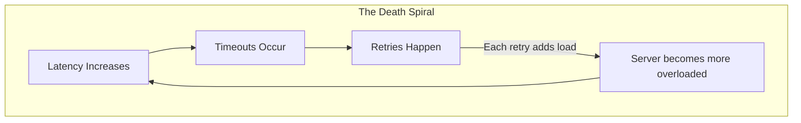
```mermaid
flowchart TD
    subgraph "The Death Spiral"
        L[Latency Increases] --> T[Timeouts Occur]
        T --> R[Retries Happen]
        R -->|Each retry adds load| S[Server becomes more overloaded]
        S --> L
    end
```

**Illustrative timeline (hypothetical):** The table below shows how a reinforcing retry loop can escalate quickly. Numbers are rounded for teaching; real systems vary by retry policy, timeout settings, and downstream capacity.

| Time | Latency | Timeouts | Effective Load |
|---|---|---|---|
| t=0:00 | 200ms | 0/sec | baseline |
| t=0:30 | 500ms | low | modest increase |
| t=1:00 | 2000ms | moderate | noticeable increase |
| t=1:30 | 5000ms | high | large increase |
| t=2:00 | service degraded | very high | runaway |

*Illustrative escalation: from "a little slow" to "effectively dead" can happen in minutes when reinforcing loops dominate and no circuit breaker or backoff breaks the cycle.*

**The mathematics of reinforcing loops are terrifying in practice.** If each loop iteration increases effective load by even a modest percentage, growth compounds quickly. Ten percent per iteration doubles effective load in roughly seven iterations; twenty percent per iteration does it in fewer than four. This is exponential growth—and in distributed systems the "iterations" can happen every few hundred milliseconds when retries and timeouts are aggressive.

**Common reinforcing loops in production** include retry storms (failure triggers retries, retries add load, load causes more failure), cache stampedes (synchronized cache expiry causes simultaneous database hits), connection pool exhaustion (slow queries hold connections, pool fills, more requests wait and retry), memory pressure spirals (swapping slows processing, which increases memory pressure), and alert fatigue in human systems (too many alerts lead to ignoring alerts, which leads to missed incidents and more reactive monitoring). Each pattern has the same signature: a small deviation triggers responses that enlarge the deviation.

| Loop | How It Works | Why It's Dangerous |
|------|--------------|-------------------|
| **Retry storms** | Failure → retry → more load → more failure | Can multiply load rapidly |
| **Cache stampede** | Cache expires → all hit DB → DB slows → cache stays empty | Synchronized devastation |
| **Connection pool exhaustion** | Slow queries → connections held → pool fills → more waiting | Everything stops |
| **Memory pressure** | Swapping → slower processing → more memory pressure | Gradual then sudden death |
| **Alert fatigue** | Too many alerts → ignored → more incidents → more alerts | Human systems fail too |

When you review an architecture diagram, mark every path where "problem → automatic response → more of the same problem" can occur. Those paths are reinforcing loops waiting for the right stress level.

### 1.2 Balancing Loops: The Stabilizers

**Balancing loops** oppose change. They push the system back toward a target or equilibrium. They are called "negative feedback" because they *subtract from* the current trend—not because they are negative in the emotional sense, but because they counteract deviation from a goal.

Your body temperature is maintained by balancing loops. Too hot → you sweat → cooling → temperature drops toward target. Too cold → you shiver → heat generation → temperature rises. The target is roughly 37°C, and your body continuously fights deviation. Production autoscaling works the same way at a systems level: high CPU → add pods → load per pod drops → CPU returns toward target.

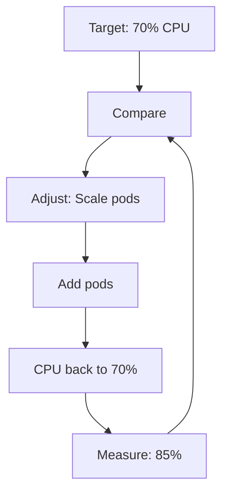
```mermaid
flowchart TD
    T[Target: 70% CPU] --> C
    M[Measure: 85%] --> C[Compare]
    C --> A[Adjust: Scale pods]
    A --> P[Add pods]
    P --> R[CPU back to 70%]
    R --> M
```

This is a **balancing** loop: it opposes change. High CPU triggers action that lowers CPU; low CPU triggers action that raises CPU. The system stabilizes around a target rather than running away from it.

**Common balancing loops in production** include autoscaling (high load → add capacity → lower load per instance), rate limiting (too many requests → reject excess → manageable load), circuit breakers (failures rise → stop calling failing dependency → failures drop on the caller side), backpressure (queue full → slow producers → queue drains), and garbage collection (memory fills → GC runs → memory freed). These mechanisms are essential—but as Part 2 explains, they fail when delays are misaligned with evaluation speed.

| Loop | How It Works | What It Protects |
|------|--------------|-------------------|
| **Autoscaling** | High load → add capacity → lower load | Performance |
| **Rate limiting** | Too many requests → reject excess → manageable load | Availability |
| **Circuit breakers** | Failures rise → stop calling → failures drop | Dependencies |
| **Backpressure** | Queue full → slow producers → queue drains | Memory |
| **Garbage collection** | Memory fills → GC runs → memory freed | Stability |

Biological and industrial systems offer useful parallels for platform engineers. Your body maintains temperature, blood sugar, and blood pressure through hundreds of active feedback loops—stability is something organisms *do*, not something they passively enjoy. The steam engine governor (1788) was an early mechanical balancing loop: as engine speed increased, centrifugal weights closed a steam valve, preventing runaway rotation and making factory power predictable. Ecological predator-prey cycles—prey rise, predators rise, prey fall, predators fall—were mapped by ecologists in the early twentieth century and mirror queue-and-consumer dynamics in message-driven services today.

### 1.3 Identifying Loop Types: The Polarity Test

Quick technique for classifying loops during incident reviews: count the **inversions**. An inversion is when an increase in one variable causes a *decrease* in another (or vice versa) somewhere in the loop. Reinforcing loops have an even number of inversions (often zero). Balancing loops have an odd number of inversions (typically one).

> **Stop and think**: Can a system have both reinforcing and balancing loops at the same time? Which one usually wins under stress?

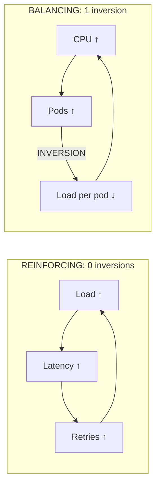
```mermaid
flowchart LR
    subgraph Reinforcing [REINFORCING: 0 inversions]
        A1[Load &uarr;] --> B1[Latency &uarr;]
        B1 --> C1[Retries &uarr;]
        C1 --> A1
    end
    
    subgraph Balancing [BALANCING: 1 inversion]
        A2[CPU &uarr;] --> B2[Pods &uarr;]
        B2 -->|INVERSION| C2[Load per pod &darr;]
        C2 --> A2
    end
```

**How to apply the polarity test:** Start with "A increases" and follow the causal chain around the loop. If A ends up increasing more without an opposing force, the loop is reinforcing. If A ends up decreasing back toward a setpoint, the loop is balancing. When multiple loops interact, the loop with the shortest effective delay often dominates early in an incident; reinforcing loops with fast iteration can overwhelm slower balancing loops before autoscaling or human intervention catches up.

The polarity test below walks through three production-style examples so you can practice classifying loops as reinforcing or balancing before you encounter them in a live incident review.

For **rate limiting**, requests increase, rejections increase, and accepted requests decrease, which reduces load on backends—one inversion, so this is a **balancing** loop when viewed from the server's perspective (though client-side immediate retries can create a reinforcing loop on the client).

For **cache miss cascade**, cache misses increase, database queries increase, database latency increases, cache timeouts cause more misses—zero inversions around the failure path, so this is **reinforcing**.

For **pod eviction under memory pressure**, memory use increases, evictions increase, running pods decrease, load per remaining pod increases, memory per pod increases—two inversions, which is even, so the eviction response can behave as **reinforcing** under certain conditions: evicting pods to "help" the cluster can concentrate load and worsen memory pressure on survivors.

Real architectures rarely have a single loop. During an outage you often see HPA trying to balance CPU while retry logic reinforces load on the database. Your job is to identify which loop is winning *right now* and break or damp the dangerous one first. A practical review habit is to draw two columns on a whiteboard—reinforcing on the left, balancing on the right—and place every automatic response you find into one column before you change any configuration. If the left column fills faster than the right during stress, your architecture is biased toward amplification.

### 1.4 Stock-and-Flow View of Loops

Feedback loops are easier to reason about when you name the **stock** (something that accumulates) and the **flow** (something that changes the stock). Connection pool occupancy is a stock; incoming requests and connection releases are flows. Queue depth is a stock; enqueue and dequeue rates are flows. Reinforcing loops often appear when a flow increases the stock and a higher stock increases the same flow—retries increase in-flight work, which increases latency, which increases retries. Balancing loops appear when a flow opposes stock growth—rate limiting reduces accepted requests when the queue stock grows too large.

When you diagram a loop for an incident review, write the stock in the center and label each arrow with its delay. Teams that skip the stock-and-flow step often misclassify loops because they focus on services (components) instead of accumulated pressure (connections held, messages waiting, memory used). The stock perspective also clarifies **where to intervene**: you can sometimes break a reinforcing loop by draining a stock (purge a poison queue), capping a stock (max pool size with fast reject), or slowing a flow (backoff on retries) without redeploying application code.

---

## Part 2: Delays—Why Good Loops Go Bad

Here's the dirty secret of feedback loops: **balancing loops can become destructive when delays are too long relative to how fast the controller reacts.** A well-intentioned stabilizing mechanism can oscillate wildly, causing more damage than if it didn't exist at all. Autoscaling is the canonical example: it is designed to stabilize load, but with the wrong timing it creates perpetual over-provisioning and under-provisioning cycles.

Delay is not a minor tuning detail—it defines whether a balancing loop feels smooth or chaotic. Control engineers express this with concepts like phase lag and overshoot; platform engineers feel it as "we scaled to a hundred pods and then immediately scaled back down while users still couldn't check out."

### 2.1 The Shower Problem

Everyone has experienced this. Hotel shower. Unfamiliar controls. You turn up the hot because the water feels cold, but nothing changes immediately because hot water is still traveling through the pipes. You turn up more, still cold, turn up even more—and then scalding hot water arrives all at once because all your adjustments hit together. You yank toward cold, but hot water is still in the pipe, so you overshoot to freezing, crank colder, and repeat until you give up.

This is a **balancing loop with delay**. The loop is trying to stabilize temperature toward your comfort target, but the delay between your action and the measured result causes overshoot in both directions. The longer the delay relative to how fast you adjust, the worse the oscillation. Production autoscaling exhibits the same human-visible frustration at cluster scale: metrics say "add capacity," you add capacity, metrics still say "add capacity" because new capacity is not ready yet, you add more, and eventually you flood the system with idle or half-ready pods.

The shower problem teaches an operational lesson: **when feedback feels "laggy," slow down your control actions.** In software, that means longer evaluation intervals, stabilization windows, and smoothed metrics—not faster reactions to stale measurements.

### 2.2 Autoscaler Oscillation: A Story in Three Graphs

> **Pause and predict**: If you increase the frequency of metric collection but leave the pod startup delay the same, will the oscillation get better or worse?

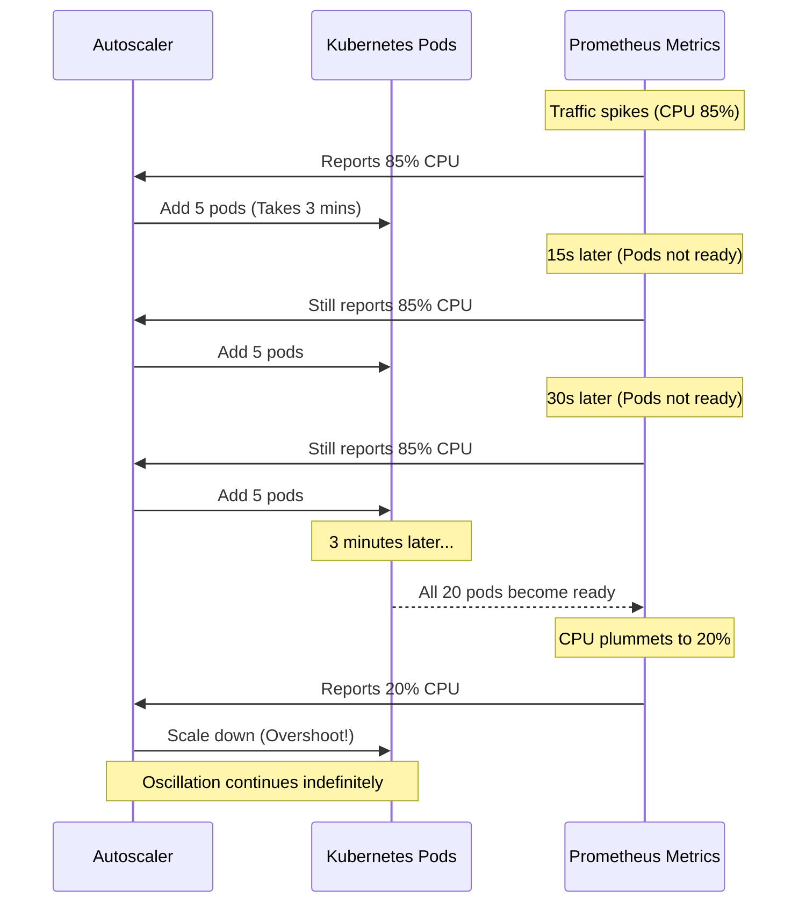
```mermaid
sequenceDiagram
    participant HPA as Autoscaler
    participant Pods as Kubernetes Pods
    participant Metric as Prometheus Metrics
    
    Note over Metric: Traffic spikes (CPU 85%)
    Metric->>HPA: Reports 85% CPU
    HPA->>Pods: Add 5 pods (Takes 3 mins)
    
    Note over Metric: 15s later (Pods not ready)
    Metric->>HPA: Still reports 85% CPU
    HPA->>Pods: Add 5 pods
    
    Note over Metric: 30s later (Pods not ready)
    Metric->>HPA: Still reports 85% CPU
    HPA->>Pods: Add 5 pods
    
    Note over Pods: 3 minutes later...
    Pods-->>Metric: All 20 pods become ready
    Note over Metric: CPU plummets to 20%
    Metric->>HPA: Reports 20% CPU
    HPA->>Pods: Scale down (Overshoot!)
    Note over HPA, Pods: Oscillation continues indefinitely
```

The sequence diagram shows a balancing loop fighting itself. HPA measures CPU, compares to target, and adds pods—but pod readiness delay means the measurement does not reflect the effect of previous scale-up decisions for several minutes. Each 15-second evaluation sees "still high CPU" and adds more pods. When pods finally become ready, CPU drops sharply and HPA aggressively scales down, potentially undershooting before traffic fills the reduced fleet. Without stabilization windows and alignment between evaluation period and provisioning delay, the cluster breathes in and out indefinitely, wasting cost and churning connections, caches, and warm JVM heaps.

To fix oscillation you need at least one of: slower scale-up decisions relative to startup delay, faster provisioning (smaller images, pre-warmed pools), better signals (queue depth or request latency rather than CPU alone), or explicit damping (stabilization windows, max scale step per period).

### 2.3 The Delay Inventory

Every feedback loop contains delays. Knowing your delays is essential for tuning loops correctly. Incident post-mortems often reveal that teams knew autoscaling existed but never summed metric scrape interval, query aggregation window, HPA evaluation period, pod schedule time, image pull, init container, readiness probe, and dependency warmup into a single "time until my scale-up helps" figure.

| Delay Type | Typical Duration | Where It Lurks |
|------------|-----------------|----------------|
| **Metric collection** | 10-60s | Prometheus scrape interval |
| **Metric aggregation** | 15-60s | Query evaluation period |
| **Alert threshold** | 30-300s | "Fire after 5 minutes of..." |
| **Autoscaler cooldown** | 30-600s | Prevent thrashing |
| **Pod startup** | 10-300s | Image pull + init + readiness |
| **DNS propagation** | 30-86400s | TTL-dependent |
| **Human response** | 300-3600s | Page → wake → investigate |
| **Deployment pipeline** | 300-3600s | Build + test + deploy |
| **Cache invalidation** | Variable | TTL or explicit purge |

**The total loop delay** is the sum of all delays in the loop path from disturbance to corrective effect visible in the metric the controller uses. If your HPA evaluates every 15 seconds but pods take several minutes to become ready and serve traffic, your effective loop delay is dominated by startup time—not evaluation interval. Controllers that react faster than the plant can respond (in control-theory terms) will overshoot.

> **Hypothetical scenario:** A logistics company runs an order-tracking system on Kubernetes. They configure an HPA to scale based on a custom metric: messages in the processing queue. Scaling on queue depth is a reasonable idea— it ties capacity to actual backlog rather than proxy metrics alone.
>
> The metric comes from their message broker, scraped by Prometheus every 30 seconds, aggregated over one minute for smoothing. Total measurement delay is on the order of one to two minutes from queue state change to metric availability.
>
> The HPA evaluates every 15 seconds. Every evaluation looks at somewhat stale queue data and may add pods. During a traffic burst, queue depth jumps. For roughly two minutes, each evaluation still sees "queue growing" and adds more pods before fresh metrics reflect earlier scale-up effects.
>
> By the time accurate metrics arrive, the fleet may be several times larger than needed for the actual backlog. Each pod opens multiple database connections. Connection demand exceeds pool limits. Pods fail health checks. A node autoscaler, seeing failing pods, may add nodes—each hosting more pods that compete for the same saturated connection pool.
>
> The database, overwhelmed with connection attempts and queries, times out. Queue processing slows. The queue grows. The HPA, now seeing accurate metrics of a growing queue, tries to add more pods—reinforcing the failure while attempting to balance backlog.
>
> Recovery required aligning control speed with measurement and provisioning delay: increasing HPA evaluation interval to exceed metric delay, adding scale-down stabilization windows, and tying connection pool sizing to known downstream limits rather than unconstrained pod count.

This scenario is hypothetical, but its ingredients—custom metrics, scrape delay, aggressive evaluation, connection pool limits, and node-level reactions—appear repeatedly in real post-mortems. The fix is usually not "remove autoscaling" but "slow the loop until the plant can keep up." Document your total delay in runbooks so on-call engineers do not tighten HPA intervals during an outage in the mistaken belief that faster reaction equals faster recovery.

### 2.4 Measuring Total Loop Delay in Practice

To measure total loop delay for an autoscaling path, walk the causal chain on paper and add conservative estimates. Start when user traffic increases. Add metric scrape interval, PromQL evaluation range, HPA sync period, scheduler queue time, image pull duration, init container time, readiness probe failure budget until Ready=True, and any application warmup before the new replica accepts production share. If that sum is five minutes, an HPA that evaluates every fifteen seconds will make many decisions before the first scale-up helps—each decision may add more replicas or trigger downstream saturation.

The same exercise applies to human loops: page delivery latency, time to open dashboard, time to identify loop type, time to apply mitigation, time for mitigation to affect user-visible metrics. Organizational loops fail for the same mathematical reason as HPA oscillation: the controller reacts faster than the system can respond. Runbooks that say "scale up immediately" without noting startup delay can accidentally instruct engineers to reinforce oscillation during incidents.

---

## Part 3: The Six Deadly Loops

These patterns cause a large share of cascading failures in distributed systems. Learn to recognize them instantly during architecture review and incident response. Each pattern below includes a reinforcing or mis-tuned balancing mechanism, typical triggers, and practical breaking strategies. None of these are exotic—they are the default failure modes of retries, caches, pools, Kubernetes eviction, alerting, and capacity planning done without loop awareness. When you read public post-mortems, practice mapping the narrative to one or more of these six patterns; over time you will notice that authors use different vendor names but describe the same causal shapes repeatedly.

The list is deliberately finite. You do not need fifty named antipatterns to run production—you need reliable recognition of the small set that recurs because our tools (retries, caches, pools, schedulers, pagers, budgets) all implement feedback. Mastery looks like sketching the loop on a whiteboard in the first ten minutes of an incident and choosing a breaker that matches the pattern, not restarting random pods until the graph looks quieter for a moment.

### 3.1 The Retry Storm

**Pattern:** Failure triggers retries, retries add load, load causes more failures. Retry logic is often added to improve reliability for transient errors, but without backoff, jitter, and budgets it becomes one of the fastest reinforcing loops in production.

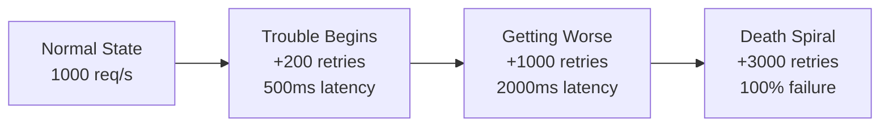
```mermaid
flowchart LR
    A[Normal State\n1000 req/s] --> B[Trouble Begins\n+200 retries\n500ms latency]
    B --> C[Getting Worse\n+1000 retries\n2000ms latency]
    C --> D[Death Spiral\n+3000 retries\n100% failure]
```

**Breaking the loop** requires treating retries as a scarce resource: exponential backoff so each retry waits longer and gives the dependency time to recover; jitter so retries desynchronize across clients; retry budgets limiting total retries per time window; and circuit breakers that stop calling a failing dependency after a threshold so the caller fails fast instead of amplifying load. Google SRE guidance and the broader microservices literature emphasize that retries multiply traffic—if ten clients each retry three times on timeout, you have up to forty attempts per original request under worst-case alignment.

### 3.2 The Thundering Herd

**Pattern:** Synchronized events cause coordinated resource access. The herd is not malicious—it is often the result of sensible design choices like fixed cache TTLs, cron schedules, or mobile app daily resets that align millions of clients to the same clock.

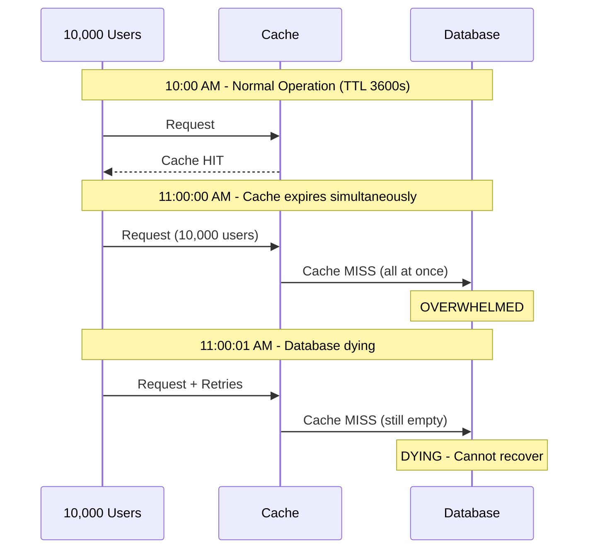
```mermaid
sequenceDiagram
    participant U as 10,000 Users
    participant C as Cache
    participant D as Database

    Note over U,D: 10:00 AM - Normal Operation (TTL 3600s)
    U->>C: Request
    C-->>U: Cache HIT

    Note over U,D: 11:00:00 AM - Cache expires simultaneously
    U->>C: Request (10,000 users)
    C->>D: Cache MISS (all at once)
    Note over D: OVERWHELMED

    Note over U,D: 11:00:01 AM - Database dying
    U->>C: Request + Retries
    C->>D: Cache MISS (still empty)
    Note over D: DYING - Cannot recover
```

**Breaking the loop** uses jittered TTLs so expirations spread over time (`TTL = base + random offset`), single-writer or request-coalescing patterns so one backend query repopulates cache while others wait, proactive cache warming before expiry for known hot keys, and stale-while-revalidate semantics so clients can serve slightly old data while refresh happens in the background. The goal is to convert a spike into a slope the database can absorb.

### 3.3 The Connection Pool Death Spiral

**Pattern:** Slow operations hold connections longer, exhausting the pool, which causes more waiting, timeouts, and retries—each retry needing a connection that is not available. Connection pools are balancing mechanisms (limit concurrency to protect the database) that become reinforcing failure paths when hold times increase.

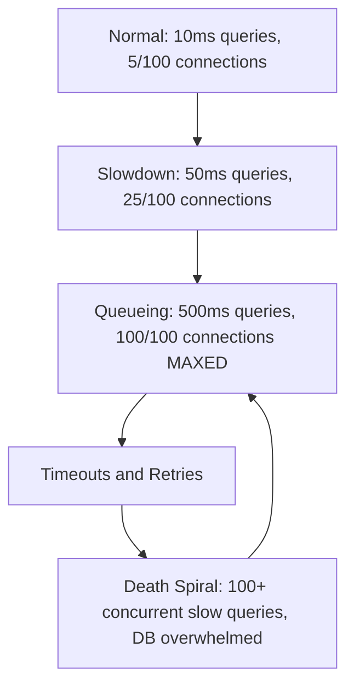
```mermaid
flowchart TD
    A[Normal: 10ms queries, 5/100 connections] --> B[Slowdown: 50ms queries, 25/100 connections]
    B --> C[Queueing: 500ms queries, 100/100 connections MAXED]
    C --> D[Timeouts and Retries]
    D --> E[Death Spiral: 100+ concurrent slow queries, DB overwhelmed]
    E --> C
```

**Breaking the loop** requires query and connection timeouts so stuck work releases resources, pool sizing based on downstream capacity rather than frontend demand alone, bulkheads separating pools for critical vs. batch traffic, and admission control at the edge so you reject work before opening connections you cannot service. Michael Nygard's stability patterns in *Release It!* treat pools as bulkheads—when the bulkhead fills, the system must shed load, not queue indefinitely.

### 3.4 The Eviction Cascade

**Pattern:** Resource pressure causes evictions, evictions redistribute load onto remaining pods, which increases per-pod pressure and triggers more evictions. Kubernetes memory limits and OOM kills are balancing loops at the node level that can behave as reinforcing cascades at the workload level.

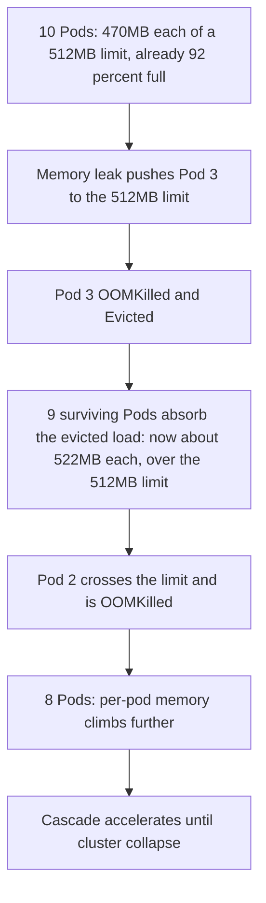
```mermaid
flowchart TD
    A[10 Pods: 470MB each of a 512MB limit, already 92 percent full] --> B[Memory leak pushes Pod 3 to the 512MB limit]
    B --> C[Pod 3 OOMKilled and Evicted]
    C --> D[9 surviving Pods absorb the evicted load: now about 522MB each, over the 512MB limit]
    D --> E[Pod 2 crosses the limit and is OOMKilled]
    E --> F[8 Pods: per-pod memory climbs further]
    F --> G[Cascade accelerates until cluster collapse]
```

**Breaking the loop** uses PodDisruptionBudgets to limit concurrent evictions, realistic resource requests and limits with headroom, horizontal scaling before memory saturation rather than after, and memory leak detection with alerts before OOM. Eviction is a signal that the scheduler and kubelet are "helping"—but concentrating traffic on fewer pods can accelerate failure unless scale-out keeps pace.

### 3.5 The Alert Storm

**Pattern:** Incidents generate alerts, alerts overwhelm responders, overwhelmed responders miss or mute alerts, real incidents go unnoticed, post-incident reviews add more monitoring, and the cycle repeats. Human attention is part of the system; alert pipelines are feedback loops too.

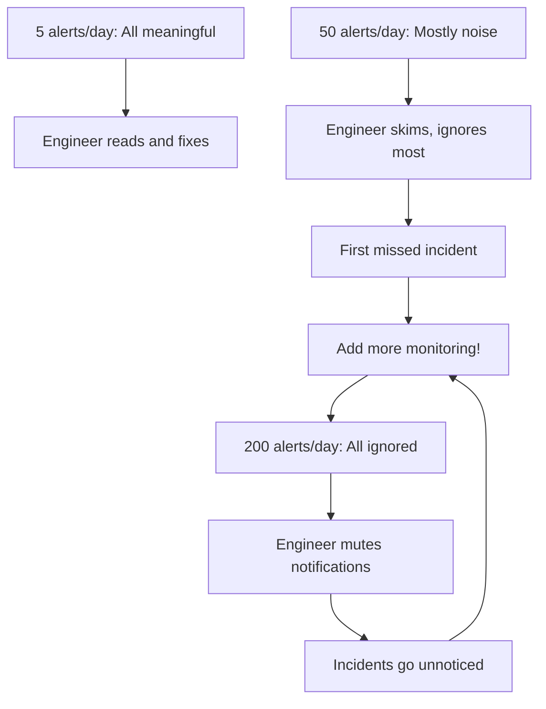
```mermaid
flowchart TD
    A[5 alerts/day: All meaningful] --> B[Engineer reads and fixes]
    C[50 alerts/day: Mostly noise] --> D[Engineer skims, ignores most]
    D --> E[First missed incident]
    E --> F["Add more monitoring!"]
    F --> G[200 alerts/day: All ignored]
    G --> H[Engineer mutes notifications]
    H --> I[Incidents go unnoticed]
    I --> F
```

**Breaking the loop** means alerting on user-visible symptoms and SLO burn rather than every internal metric fluctuation, requiring every alert to be actionable with a linked runbook, regular alert review to delete alerts nobody acts on, and tracking alert-to-incident ratio as a quality metric. Google SRE's alerting guidance distinguishes pages (wake a human) from tickets (fix later)—if everything pages, nothing pages effectively.

### 3.6 The Capacity Planning Spiral

**Pattern:** Under-provisioning causes incidents, incidents cause over-provisioning and budget scrutiny, budgets cut capacity, next peak under-provisions again. This is an organizational balancing loop with annual period and strong political delay.

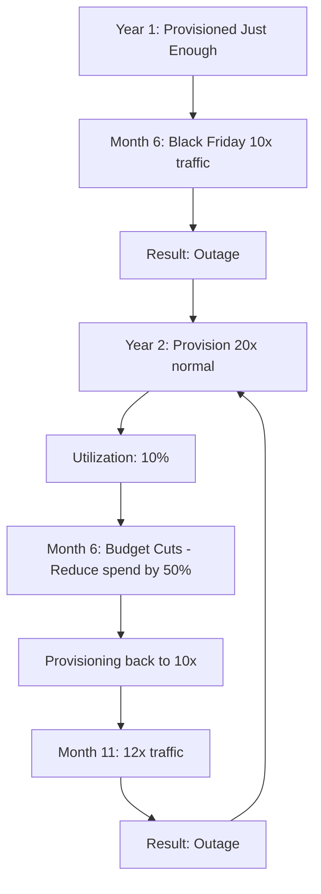
```mermaid
flowchart TD
    A[Year 1: Provisioned Just Enough] --> B[Month 6: Black Friday 10x traffic]
    B --> C[Result: Outage]
    C --> D[Year 2: Provision 20x normal]
    D --> E[Utilization: 10%]
    E --> F[Month 6: Budget Cuts - Reduce spend by 50%]
    F --> G[Provisioning back to 10x]
    G --> H[Month 11: 12x traffic]
    H --> I[Result: Outage]
    I --> D
```

**Breaking the loop** requires load testing to know actual limits, autoscaling to match capacity to demand dynamically, cost attribution that shows spend versus revenue at traffic levels, and chaos or game-day exercises that prove peak handling before marketing announces the peak. Without measured headroom, capacity debates oscillate between fear and waste. Finance and engineering should share the same graph: traffic percentile, utilization, error rate, and cost per successful request—when those series diverge, the organizational loop is already running.

### 3.7 Combining Patterns: The Perfect Storm

Individual deadly loops are teachable in isolation; real outages combine them. A cache stampede increases database latency, which triggers retry storms, which exhausts connection pools, which causes health check failures, which prompts HPA or node autoscaler to add capacity that cannot obtain connections. Each pattern alone might be survivable; together they form a reinforcing **meta-loop** where each mitigation attempt (more pods, more retries, more alerts) feeds the next failure mode.

During incident response, prioritize **stopping amplification** before **restoring capacity**. Opening circuit breakers, enabling aggressive load shedding, and disabling nonessential retries often feel counterintuitive because they increase visible errors temporarily—but they break the meta-loop so balancing mechanisms can work again. Adding capacity into an active reinforcing loop frequently worsens outcomes because new replicas participate in the same retry and connection behavior as failing ones.

---

## Part 4: Designing with Feedback in Mind

Designing for feedback loops means asking, for every automatic response in your system, what happens if the response arrives too late, too aggressively, or while a reinforcing loop is already running. The principles below are not abstract—they map directly to HPA behavior blocks, retry libraries, cache clients, and circuit breaker middleware. Good design reviews treat feedback like security: assume loops will activate under stress and document how you detect and break them before launch, not after the first Black-Friday-scale event.

Platform teams often inherit loops from application defaults—generous retry counts, optimistic pool sizes, aggressive HPA targets—without tracing combined behavior. Your checklist in section 4.2 is the minimum bar; pairing it with load tests that *intentionally* slow a dependency (fault injection on database latency, cache flush, pod startup delay) reveals loops that steady-state monitoring never shows.

### 4.1 Principles for Safe Feedback Loops

**Principle 1: Match loop speed to delay.** If your system changes faster than your feedback loop can respond effectively, you will oscillate or overshoot. The loop evaluation period should generally exceed the dominant delay in the loop, or you must use heavy damping. For Kubernetes HPA, that means stabilization windows, scale policies with max step sizes, and metrics that reflect user-visible backlog rather than instantaneous CPU spikes alone.

```yaml
# Kubernetes HPA with proper stabilization
apiVersion: autoscaling/v2
kind: HorizontalPodAutoscaler
metadata:
  name: my-app-hpa
spec:
  scaleTargetRef:
    apiVersion: apps/v1
    kind: Deployment
    name: my-app
  minReplicas: 3
  maxReplicas: 100
  metrics:
  - type: Resource
    resource:
      name: cpu
      target:
        type: Utilization
        averageUtilization: 70
  behavior:
    scaleDown:
      stabilizationWindowSeconds: 300  # Wait 5 min before scaling down
      policies:
      - type: Percent
        value: 10                       # Remove max 10% of pods
        periodSeconds: 60               # Every minute
    scaleUp:
      stabilizationWindowSeconds: 60    # Wait 1 min before scaling up more
      policies:
      - type: Percent
        value: 100                      # Can double pods
        periodSeconds: 60
      - type: Pods
        value: 4                        # Or add max 4 pods
        periodSeconds: 60
      selectPolicy: Max                 # Use whichever allows more scaling
```

**Principle 2: Add damping to prevent oscillation.** Damping slows down responses, trading speed for stability—like shock absorbers on a car. Instead of reacting to every metric sample, require sustained deviation, moving averages over multiple samples, and cooldown periods between scale actions.

```python
# Bad: React to every measurement
def scale_pods(current_cpu):
    if current_cpu > 70:
        add_pods(5)
    elif current_cpu < 50:
        remove_pods(5)

# Good: Damped response with smoothing
class DampedScaler:
    def __init__(self):
        self.measurements = []
        self.last_scale_time = 0
        self.cooldown = 300  # 5 minutes

    def scale_pods(self, current_cpu):
        self.measurements.append(current_cpu)

        # Only consider last 5 minutes of data
        self.measurements = self.measurements[-20:]

        # Require cooldown period
        if time.time() - self.last_scale_time < self.cooldown:
            return  # Too soon to act

        avg_cpu = sum(self.measurements) / len(self.measurements)

        # Require sustained deviation (need a full 5-sample window first)
        if len(self.measurements) < 5:
            return  # Not enough history to confirm a sustained trend
        if all(m > 70 for m in self.measurements[-5:]):
            add_pods(2)  # Smaller increments
            self.last_scale_time = time.time()
        elif all(m < 50 for m in self.measurements[-5:]):
            remove_pods(1)  # Even smaller for scale-down
            self.last_scale_time = time.time()
```

**Principle 3: Break reinforcing loops with circuit breakers.** Do not let failure amplify failure. Insert breaks in the loop so callers fail fast and shed load instead of retrying into a dying dependency. Circuit breakers implement a state machine: closed (normal), open (reject calls), half-open (probe recovery).

```python
class CircuitBreaker:
    def __init__(self, failure_threshold=5, recovery_timeout=30):
        self.failures = 0
        self.threshold = failure_threshold
        self.timeout = recovery_timeout
        self.state = "CLOSED"  # CLOSED, OPEN, HALF_OPEN
        self.opened_at = None

    def call(self, func, *args, **kwargs):
        if self.state == "OPEN":
            if time.time() - self.opened_at > self.timeout:
                self.state = "HALF_OPEN"
            else:
                raise CircuitOpenError("Circuit breaker is open")

        try:
            result = func(*args, **kwargs)
            if self.state == "HALF_OPEN":
                self.state = "CLOSED"
                self.failures = 0
            return result
        except Exception as e:
            self.failures += 1
            if self.failures >= self.threshold:
                self.state = "OPEN"
                self.opened_at = time.time()
            raise

# Usage: Breaks the retry storm loop
payment_breaker = CircuitBreaker(failure_threshold=5, recovery_timeout=30)

def call_payment_service(order):
    # Route the call through the breaker rather than calling http_client directly
    return payment_breaker.call(http_client.post, "/payments", order)
```

**Principle 4: Add jitter to prevent synchronization.** Synchronized timers turn benign periodic work into thundering herds. Randomize cache TTLs, retry delays, and cron offsets so correlated clients desynchronize over time.

```python
# Bad: All caches expire at exactly the same time
cache.set(key, value, ttl=3600)  # All users hit this at 3600s

# Good: Randomize to spread load
import random
jittered_ttl = 3600 + random.randint(-600, 600)  # 50-70 minutes
cache.set(key, value, ttl=jittered_ttl)

# For retries: exponential backoff with jitter
def retry_with_backoff(func, max_retries=5):
    for attempt in range(max_retries):
        try:
            return func()
        except RetryableError:
            if attempt < max_retries - 1:
                base_delay = (2 ** attempt)  # 1, 2, 4, 8, 16 seconds
                jitter = random.uniform(0, base_delay * 0.5)
                time.sleep(base_delay + jitter)
    raise MaxRetriesExceeded()
```

**Principle 5: Make loops observable.** If you cannot see loop behavior in metrics, you cannot tune it. Track retry rates, pool utilization, cache hit ratio, HPA desired versus ready replicas, circuit breaker state, and queue depth alongside user-facing latency and error rate. During incidents, plot these on the same timeline to see reinforcing loops accelerate.

### 4.2 The Feedback Loop Checklist

Before deploying any system with feedback mechanisms, walk through the checklist below for **each feedback loop** in the architecture—name the elements, classify reinforcing versus balancing behavior, and document delays before you rely on autoscaling or retries under load.

- [ ] **IDENTIFICATION**
  - What are the elements in the loop?
  - Is it reinforcing or balancing?
  - What behavior does it create?
- [ ] **DELAYS**
  - What is the total delay around the loop?
  - Is the loop evaluation faster than the delay?
  - What happens during the delay period?
- [ ] **STABILITY**
  - Is there damping/smoothing?
  - Are there stabilization windows?
  - Can the loop oscillate? At what frequency?
- [ ] **FAILURE MODES**
  - What happens if feedback is delayed/lost?
  - What happens under extreme load?
  - Is there a circuit breaker to stop runaway loops?
- [ ] **SYNCHRONIZATION**
  - Can multiple instances synchronize?
  - Is there jitter on timers/TTLs?
  - What triggers correlated behavior?
- [ ] **OBSERVABILITY**
  - Can you see the loop in action?
  - What metrics show loop behavior?
  - How would you detect a runaway loop?

When two loops interact—HPA plus retries plus connection pools—document the combination explicitly. The deadliest outages often come from benign loops that turn reinforcing only when combined under load. Schedule a quarterly "loop review" alongside dependency mapping: for each new feature flag, retry policy, or autoscaling metric, ask which of the six deadly patterns it could activate and what breaker you added at design time.

### 4.3 Decision Framework: Stabilize or Amplify?

Use this framework when triaging live loop behavior or reviewing designs. **Step one—classify:** Is the dominant loop reinforcing or balancing? Count inversions or follow the trend: are errors/latency/queue depth accelerating (reinforcing) or returning toward target (balancing)? **Step two—measure delay:** What is total loop delay versus evaluation interval? If evaluation is faster than delay, expect overshoot even from well-intentioned automation. **Step three—choose intervention:** For reinforcing dominance, break the loop (circuit breaker, shed load, disable retries, add jitter) before adding capacity. For balancing oscillation, slow the controller (stabilization windows, larger evaluation period, smoothed metrics) before removing the balancer entirely.

**Step four—verify observability:** After mitigation, you should see the accelerating metric flatten within one to two loop delays. If it keeps accelerating, you have not broken the reinforcing path—you have only shifted load. **Step five—post-incident:** Update architecture docs with the loop diagram and the measured delays so the next reviewer inherits stock-and-flow context instead of folklore about "that one time we scaled to a hundred pods."

---

## Did You Know?

- **Audio engineers** use feedback loops intentionally. Electric guitar sustain comes from controlled feedback between the pickups and amplifier. Jimi Hendrix was a master of feedback control—the same physics that destroys microphone setups creates musical expression when bounded.

- **The 2010 Flash Crash** saw major U.S. equity indices drop sharply within minutes before partially recovering. Subsequent regulatory analysis attributed part of the volatility to automated trading strategies interacting in reinforcing sell-pressure loops. Market circuit breakers now halt trading when prices move too fast—a deliberate loop breaker at financial system scale.

- **Climate feedback loops** worry scientists because some processes are self-reinforcing with long delays—ice melt reduces reflectivity, which increases heat absorption, which accelerates melt. Century-scale delays mean triggering may precede visible consequences, a cautionary tale for infrastructure teams who ignore slow-burn reinforcing loops until sudden collapse.

- **The Federal Reserve** manages economic feedback loops constantly. Raising interest rates reduces borrowing and spending, which lowers inflation—but with delays often measured in quarters or years, policy is like steering a supertanker. Platform capacity and pricing decisions have similar delayed feedback between investment, utilization, outages, and budget cuts.

---

## Common Mistakes

| Mistake | Why It's Dangerous | Solution |
|---------|-------------------|----------|
| Retries without backoff | Creates reinforcing loop that amplifies failures | Exponential backoff with jitter |
| Tight autoscaler settings | Oscillation wastes resources and can crash systems | Stabilization windows, gradual changes |
| Identical cache TTLs | Thundering herd on expiration | Jitter all TTLs by ±10-20% |
| No circuit breakers | Failures cascade until total outage | Add breakers at every service boundary |
| Ignoring metric delay | Autoscaler reacts to stale data, overshoots | Evaluation interval > metric delay |
| Alert on every metric | Alert fatigue, real issues missed | Alert on user-facing symptoms only |
| Scaling on connection count | Each new pod adds connections, triggers more scaling | Scale on latency or queue depth instead |

---

## Quiz

1. **Scenario: Your e-commerce checkout service has a default timeout of 5 seconds. During a database slowdown, requests start taking 8 seconds. The payment processing pods automatically retry failed requests up to 3 times immediately. What type of feedback loop is this, and what will happen to the database?**
   <details>
   <summary>Question</summary>

   This is a **reinforcing loop** (specifically, a retry storm). The database is already slow due to load or locking. When the checkout service times out and immediately retries three times, it multiplies the load on the database by up to four for each timed-out request. This additional load makes the database even slower, causing more timeouts, which cause even more retries. The loop amplifies the failure until the database or the payment service collapses unless you add backoff, jitter, circuit breaking, or admission control.
   </details>

2. **Scenario: You configure a HorizontalPodAutoscaler (HPA) to maintain 70% CPU utilization. It evaluates metrics every 15 seconds. However, your application pods take 4 minutes to start up and become ready because they need to download a large machine learning model. After a spike in traffic, you notice the number of pods fluctuating wildly between 10 and 100 every few minutes, while CPU usage bounces between 10% and 100%. What is causing this behavior?**
   <details>
   <summary>Question</summary>

   This oscillation is caused by a **balancing loop with a severe delay mismatch**. The HPA sees high CPU and adds pods to counteract the load, but pods take four minutes to start, so CPU remains high at each 15-second evaluation and the HPA keeps adding pods. When pods finally become ready, CPU drops sharply and triggers aggressive scale-down. The corrective action takes longer to affect the measured metric than the controller's evaluation interval, producing classic overshoot oscillation. Fix by aligning evaluation and stabilization with startup delay, limiting scale steps, or using a signal that reflects ready capacity.
   </details>

3. **Scenario: You launch a new popular mobile game. At exactly midnight, the daily quests reset for all players. Every player's app simultaneously requests the new quests from the backend. The backend checks a Redis cache, but the quest data for the new day has not been cached yet. The backend then queries the database. Within seconds, the database is overwhelmed. What pattern is this, and how does it create a reinforcing loop?**
   <details>
   <summary>Question</summary>

   This is the **thundering herd** pattern, which creates a destructive reinforcing loop. Simultaneous cache misses cause a massive spike in database queries that overwhelms the backend. The database slows down, queries time out before populating the cache, and subsequent requests also miss and hit the database directly. The cache stays empty or cold while load remains high, so the herd self-sustains until you add jitter, warming, request coalescing, or stale-while-revalidate semantics to break synchronization.
   </details>

4. **Scenario: To fix the daily quest crash from the previous scenario, you decide to cache the daily quests for 24 hours. However, you notice that exactly 24 hours later, the database crashes again. Your senior engineer suggests adding "jitter" to the cache TTL. Why is jitter the correct solution here?**
   <details>
   <summary>Question</summary>

   Jitter breaks synchronization of the thundering herd. If all cache entries expire at exactly 24 hours, they expire together the next day and recreate the simultaneous miss wave. Adding random jitter (for example, plus or minus tens of minutes) spreads expirations over a time window, converting an instantaneous spike into a manageable stream of refreshes the database can handle while keeping cache effectiveness high.
   </details>

5. **Scenario: During an incident, you disable retries entirely on the API gateway to stop load amplification. Error rates at the gateway drop, but checkout success rate for end users falls sharply because transient blips that retries used to mask now surface as hard failures. What balancing loop did you weaken, and what should you do instead?**
   <details>
   <summary>Question</summary>

   Retries implement a crude **balancing loop** against transient failures— they recover from short glitches without user-visible errors. Disabling them removed that stabilizer but did not fix the reinforcing loop caused by aggressive immediate retries downstream. Instead, keep retries with exponential backoff, jitter, per-client budgets, and circuit breakers on failing dependencies so you retain recovery for transient errors without multiplying load during sustained outages.
   </details>

6. **Scenario: Your team's on-call rotation receives hundreds of Slack alerts per day, most from non-customer-facing metrics. Engineers start muting channels. A production outage lasts an hour before anyone notices. Map this to a feedback loop type and name two organizational fixes.**
   <details>
   <summary>Question</summary>

   This is a **reinforcing loop in the human attention subsystem**: incidents and noisy monitoring increase alert volume, which reduces attention and increases missed incidents, which leads to adding more alerts after post-mortems. Fixes include alerting on SLO burn and user-visible symptoms only, and instituting regular alert review with deletion of non-actionable rules plus tracking alert-to-incident ratio so noise is visible to leadership before muting becomes culture.
   </details>

7. **Scenario: During architecture review you apply the polarity test to classify a loop: load increases, latency increases, retries increase, load increases further—zero inversions around the cycle. A memory leak then causes OOMKill evictions that concentrate traffic on surviving pods. Name both loop types involved and explain which classification step you used.**
   <details>
   <summary>Question</summary>

   The retry path is a **reinforcing loop** (zero inversions—each step amplifies load). Eviction under fixed replica count behaves as a **reinforcing loop** from the application perspective (two inversions, even count). You classified them using the **fundamental two-type framework**: count inversions around the causal cycle, determine even versus odd, and predict amplify-versus-stabilize behavior before choosing circuit breakers versus HPA tuning.
   </details>

8. **Conceptual: You are reviewing Part 3 of this module—the six deadly feedback patterns in distributed systems. A teammate proposes fixing connection pool exhaustion by doubling the pool size without adding query timeouts or circuit breakers. Which of the six patterns are they partially addressing, and why is their fix incomplete as a breaking strategy?**
   <details>
   <summary>Question</summary>

   Doubling the pool addresses **connection pool death spiral** symptoms by delaying exhaustion, but without query timeouts, circuit breakers, or bulkheads the reinforcing path remains: slow queries still hold connections longer, retries still multiply load, and a larger pool can eventually saturate the database with more concurrent work. Effective breaking strategies for this pattern include connection and query timeouts, pool sizing tied to downstream capacity, bulkheads, and admission control—not pool size alone.
   </details>

---

## Hands-On Exercise

**Task:** Analyze feedback loops in a production architecture. **Scenario:** You are reviewing the API service architecture shown below, which includes an HPA-managed API tier, a Redis cache with fixed TTL, fixed-interval retries, and a PostgreSQL pool with no circuit breaker. Your goal is to map loops, find dangerous combinations, and propose concrete configuration fixes.

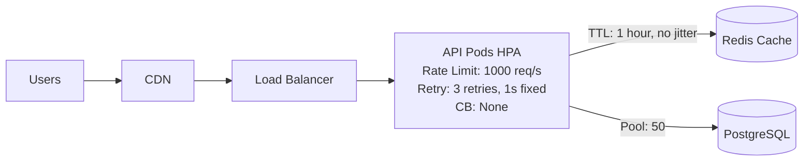
```mermaid
flowchart LR
    U[Users] --> CDN
    CDN --> LB[Load Balancer]
    LB --> API[API Pods HPA\nRate Limit: 1000 req/s\nRetry: 3 retries, 1s fixed\nCB: None]
    API -->|TTL: 1 hour, no jitter| Cache[(Redis Cache)]
    API -->|Pool: 50| DB[(PostgreSQL)]
```

Work through three phases in order. First, spend roughly twenty minutes listing every feedback loop you can find—for each loop, document the elements, type (reinforcing or balancing), total delay, trigger conditions, and failure mode. Second, spend ten minutes identifying which loops could fire together and whether any balancing loops might fight each other under spike load. Third, spend fifteen minutes proposing a concrete fix per dangerous loop with YAML or policy snippets that break the reinforcing path.

<details>
<summary>Click to see expected findings</summary>

**Reinforcing Loops (Dangerous)**:

1. **Retry Storm**
   - Path: Timeout → Retry → More load → Slower responses → More timeouts
   - Delay: 1 second (fixed, no jitter)
   - Trigger: Any slowdown
   - Problem: 3 retries with no jitter means up to 4x load when slow

2. **Cache Stampede**
   - Path: Cache expires → All miss → DB overload → Timeouts → Cache not populated → More misses
   - Delay: Exactly 1 hour (synchronized)
   - Trigger: Any heavily-cached key expiring
   - Problem: No jitter means synchronized expiration

3. **Connection Pool Exhaustion**
   - Path: Slow query → Connections held → Pool fills → Requests wait → Timeouts → Retries → More connections needed
   - Delay: Query timeout (likely long)
   - Trigger: Any database slowdown
   - Problem: Only 50 connections, no circuit breaker

4. **Rate Limit Retry Amplification**
   - Path: Rate limit hit → 429 → Client retries → Rate limit hit → More 429s
   - Delay: 1 second (fixed retry)
   - Trigger: Traffic near 1000 req/s
   - Problem: Retries count against rate limit

**Balancing Loops**:

1. **HPA CPU Scaling**
   - Path: High CPU → Add pods → Lower CPU per pod
   - Delay: 15s evaluation + pod startup (60s+)
   - Problem: Cooldown too short (30s), may oscillate

2. **Rate Limiting**
   - Path: Too many requests → Reject some → Manageable load
   - Delay: Immediate
   - Problem: Works for server, but combined with retries is reinforcing for client

**Dangerous Combinations**:

1. Cache stampede + Retry storm + Connection exhaustion:
   - Cache expires → DB hit → DB slow → Connections held → Pool full → Timeouts → Retries → amplified load on full pool → Complete failure

2. HPA oscillation + Retry storm:
   - CPU high → Scale up → New pods retry → More load → CPU still high → Scale up more → Overshoot

**Fixes**:

```yaml
# 1. Add jitter to cache TTL
cache.set(key, value, ttl=3600 + random(-600, 600))

# 2. Exponential backoff with jitter for retries
retry_policy:
  max_retries: 3
  backoff:
    type: exponential
    base: 1s
    max: 30s
    jitter: 0.5

# 3. Add circuit breaker on database
circuit_breaker:
  failure_threshold: 5
  timeout: 30s
  half_open_requests: 3

# 4. Fix HPA timing
spec:
  behavior:
    scaleDown:
      stabilizationWindowSeconds: 300
    scaleUp:
      stabilizationWindowSeconds: 60

# 5. Connection pool with timeout
pool:
  max_connections: 50
  connection_timeout: 5s
  idle_timeout: 60s
```

</details>

You have succeeded when you can demonstrate all of the following:

- [ ] Identified at least four reinforcing loops with documented delays and triggers
- [ ] Identified at least two balancing loops and noted where delay mismatch could invert their effect
- [ ] Found at least two dangerous combinations and explained why fixes must break paths—not just add capacity
- [ ] Proposed configuration changes (backoff, jitter, circuit breakers, HPA behavior) tied to specific loops

---

## Sources

- [Thinking in Systems: A Primer (Donella Meadows)](https://www.chelseagreen.com/product/thinking-in-systems/) — Primary reference for reinforcing and balancing loops, delays, and system behavior.
- [Site Reliability Engineering (Google SRE Book)](https://sre.google/sre-book/table-of-contents/) — Cascading failures, overload control, and retry discipline in large-scale production systems.
- [Site Reliability Workbook — Alerting on SLOs](https://sre.google/workbook/alerting-on-slos/) — Actionable alerting guidance to avoid alert-storm reinforcing loops in on-call workflows.
- [Kubernetes Horizontal Pod Autoscaling](https://kubernetes.io/docs/tasks/run-application/horizontal-pod-autoscale/) — Official documentation for HPA metrics, behavior, and stabilization windows.
- [Kubernetes HorizontalPodAutoscaler v2 behavior](https://kubernetes.io/docs/tasks/run-application/horizontal-pod-autoscale/#configurable-scaling-behavior) — Scale-up/scale-down policies and stabilization configuration referenced in Part 4.
- [Release It! Design and Deploy Production-Ready Software (Michael Nygard)](https://pragprog.com/titles/mnee2/release-it-second-edition/) — Stability patterns including circuit breakers, bulkheads, and timeouts as loop breakers.
- [Feedback Control for Computer Systems (Philipp K. Janert, O'Reilly)](https://www.oreilly.com/library/view/feedback-control-for/9781449362638/) — Control-theory framing for tuning software feedback mechanisms.
- [How Complex Systems Fail (Richard Cook, PDF)](https://www.adaptivecapacitylabs.com/HowComplexSystemsFail.pdf) — Foundational essay on failure dynamics in complex operational systems.
- [SEC Concept Release on Equity Market Structure (2010)](https://www.sec.gov/rules-regulations/2010/02/concept-release-equity-market-structure) — Regulatory review of automated and high-frequency trading and the feedback effects of automated market-making.
- [AWS Architecture Blog — Exponential Backoff And Jitter](https://aws.amazon.com/blogs/architecture/exponential-backoff-and-jitter/) — Canonical practical guidance on desynchronizing retries to prevent thundering herds and retry storms.
- [Prometheus scrape configuration](https://prometheus.io/docs/prometheus/latest/configuration/configuration/#scrape_config) — Metric collection intervals as a component of total feedback loop delay in autoscaling paths.

---

## Next Module

[Module 1.3: Mental Models for Operations](../module-1.3-mental-models-for-operations/) - Build practical mental models for understanding production systems: leverage points, stock-and-flow diagrams, and the frameworks that experienced operators use instinctively.

---

## Further Reading

For deeper study beyond the linked sources above, start with Donella Meadows' *Thinking in Systems* (Chapter 2 on feedback loops), Michael Nygard's *Release It!* (stability patterns), Richard Cook's *How Complex Systems Fail*, and Philipp K. Janert's *Feedback Control for Computer Systems*. The Google SRE books connect these concepts to alerting, overload handling, and cascading failures at organizational scale.
