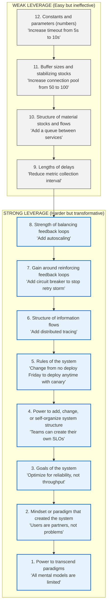
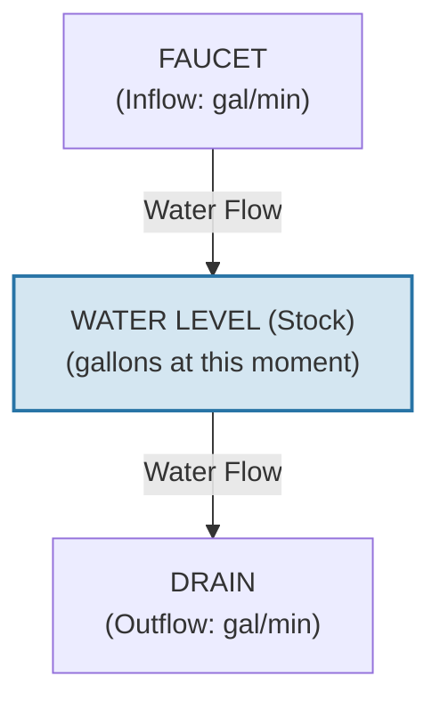
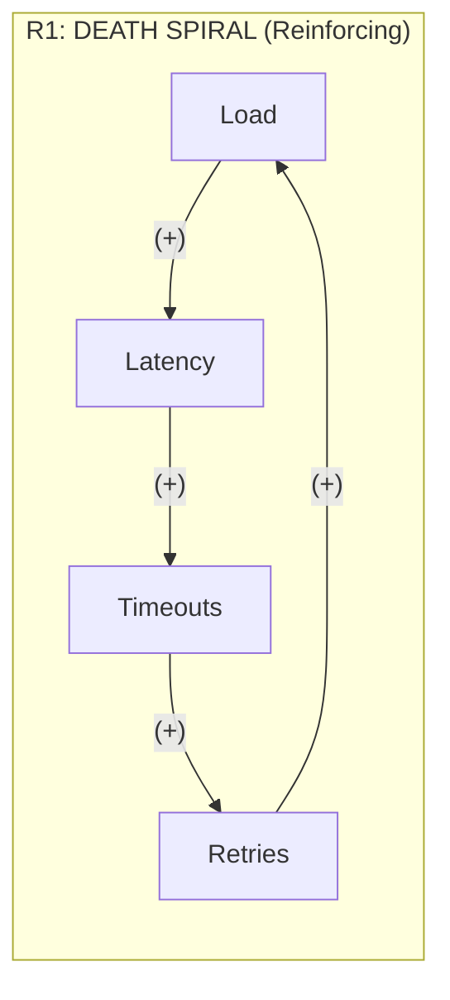
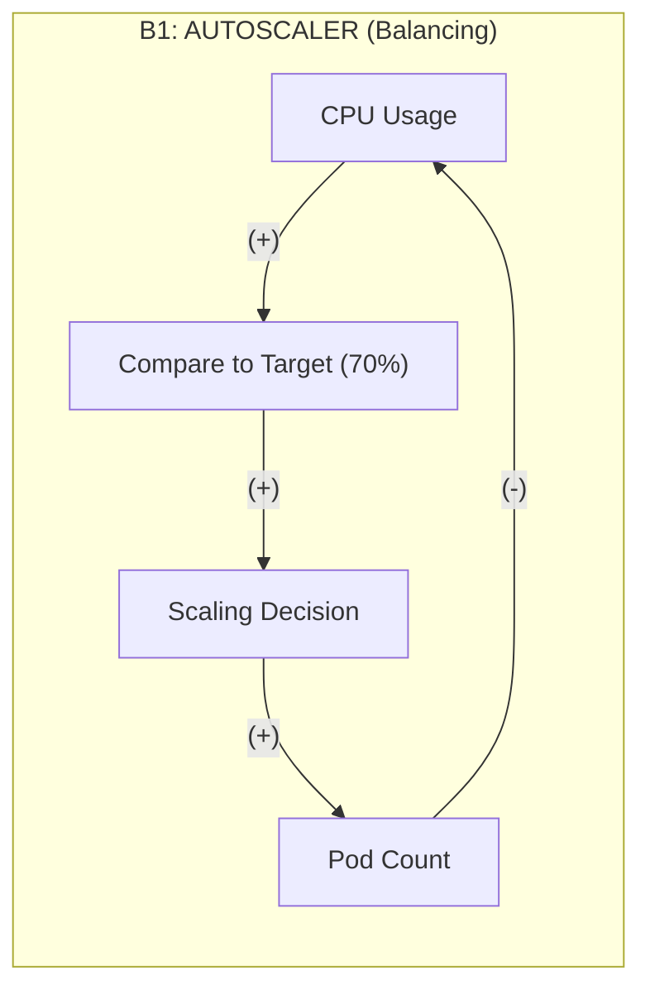
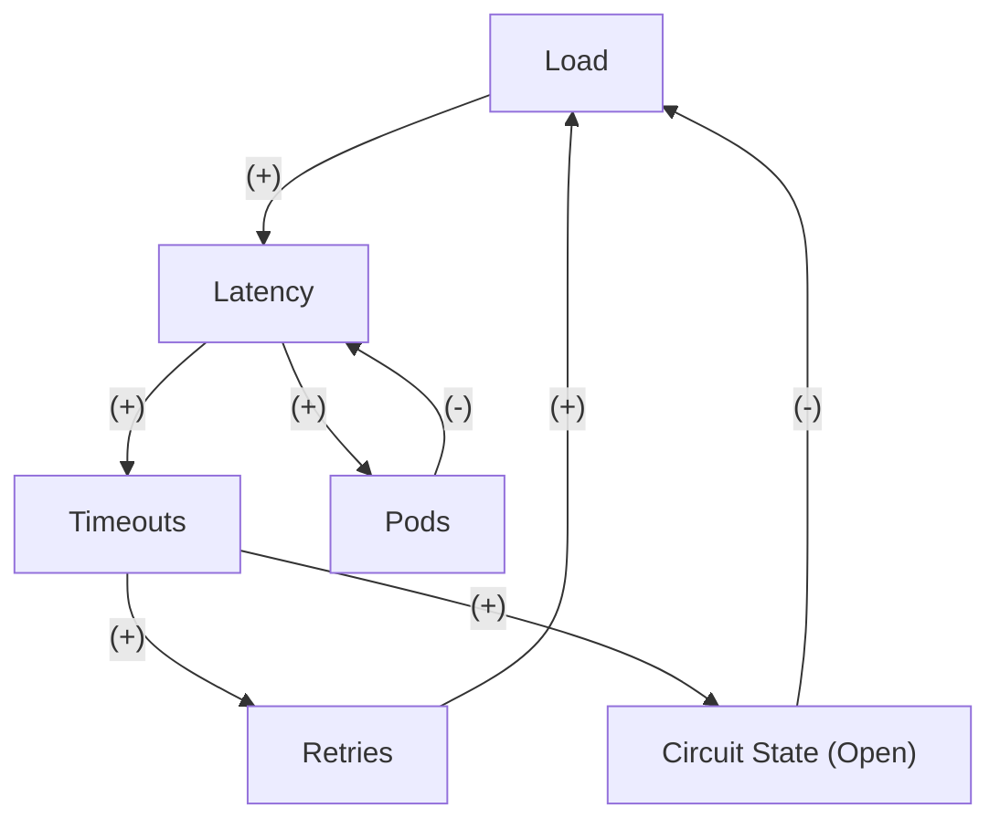
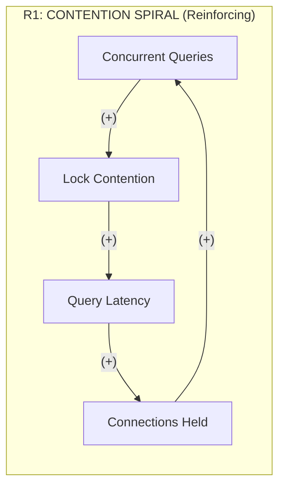
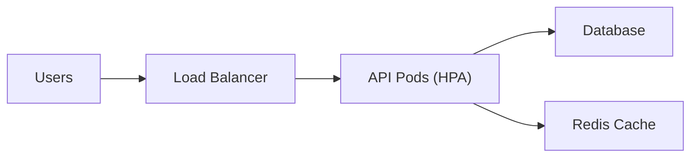

> **Complexity**: `[MEDIUM]`
>
> **Time to Complete**: 35-40 minutes
>
> **Prerequisites**: [Module 1.2: Feedback Loops](../module-1.2-feedback-loops/)
>
> **Track**: Foundations

### What You'll Be Able to Do

After completing this module, you will be able to:

1. **Apply** at least five mental models (constraint theory, queue theory, Swiss cheese, OODA loop, Cynefin) to operational decision-making
2. **Evaluate** which mental model best fits a given incident scenario and explain why others fall short
3. **Diagnose** production incidents faster by selecting the appropriate reasoning framework before diving into logs
4. **Compare** competing hypotheses during incidents using structured mental models rather than intuition alone

---

## The Incident That Revealed Everything

*Tuesday, 4:23 PM. An e-commerce platform's checkout is down.*

The war room is packed. Engineers stare at dashboards. The CTO is asking for updates every five minutes. Everyone has a theory.

"It's the database—connections are maxed out."
"No, it's the cache miss rate—look at this spike."
"We should just restart everything."
"We already tried that. Twice."

Three hours in, someone junior asks a question nobody else thought to ask: "What's *supposed* to happen when checkout gets slow?"

Silence. Then: "The frontend retries... oh no."

Within minutes, they draw a diagram on a whiteboard. Frontend retries on timeout. Each retry adds load. More load means more timeouts. More timeouts mean more retries. The database was fine—it was being crushed by a retry storm that had been amplifying for hours.

The fix took 30 seconds: disable retries. The outage had lasted three hours because nobody had the right mental model to see what was happening.

> **Stop and think**: If the database was perfectly healthy, what system behavior actually brought it down in this scenario?

---

## Why This Module Matters

You've got 20 metrics dashboards, 500 alerts, and a system doing something unexpected. Where do you focus? What do you change? How do you know if your fix will help or make things worse?

Raw data doesn't give you answers. **Mental models** do.

Mental models are thinking tools—compressed wisdom about how systems behave. They're not the territory (your actual system), but they're maps that help you navigate it. The right mental model helps you see patterns others miss and find solutions that actually work.

This module gives you three essential frameworks:
1. **Leverage Points**: Where to intervene for maximum effect
2. **Stock-and-Flow Diagrams**: What's accumulating and why
3. **Causal Loop Diagrams**: How variables influence each other

These aren't abstract theory. They're the tools used by the best SREs and operators to understand and influence production systems under pressure.

> **The Map Analogy**
>
> A subway map isn't geographically accurate—it's schematically useful. The London Underground map famously distorts distances and directions, but it's perfect for planning your journey.
>
> Mental models work the same way. A stock-and-flow diagram doesn't capture every aspect of your system, but it helps you see where things accumulate and why. "All models are wrong, but some are useful." Your job is to know which model is useful when.

---

## What You'll Learn

- Donella Meadows' leverage points for system intervention
- Stock-and-flow diagrams for operational analysis
- Causal loop diagrams for visualizing feedback
- How to choose the right model for the situation
- Practical application to real incidents

---

## Part 1: Leverage Points—Where Small Changes Create Big Results

### 1.1 The Counterintuitive Truth

When something goes wrong, there's usually an obvious fix: add more servers, increase the timeout, bump the memory limit. These fixes feel good. They're fast. They're tangible.

They're also usually wrong.

> **Pause and predict**: Before reading further, think about the last incident you handled. Did your team's fix involve changing a number (like a timeout) or changing a rule?

**Leverage points** are places in a system where a small change can produce big results. Donella Meadows, the systems thinker behind "Limits to Growth," identified 12 leverage points, ranked from least to most effective.

The counterintuitive insight: **the most obvious interventions are usually the weakest**.



### 1.2 Leverage Points in Action

Let's apply this framework to a real scenario: **"The API is consistently slow."**

| Leverage Level | Intervention | Why This Level | Effectiveness |
|----------------|--------------|----------------|---------------|
| **12** (Numbers) | Increase timeout from 5s to 10s | Just changing a number | Masks the problem, users still wait |
| **11** (Buffers) | Increase connection pool from 20 to 50 | Adding capacity | Delays the problem, doesn't solve it |
| **10** (Structure) | Add a cache layer | Changes how data flows | Moderate—reduces load on slow path |
| **9** (Delays) | Faster metrics collection (60s → 15s) | Reduces response time | Moderate—see problems faster |
| **8** (Balancing loops) | Add autoscaling | Adds stabilizing mechanism | Moderate—matches capacity to demand |
| **7** (Reinforcing loops) | Add circuit breaker | Breaks amplification | **Strong—stops cascades** |
| **6** (Information) | Add distributed tracing | Reveals where time goes | **Strong—enables root cause fix** |
| **5** (Rules) | "All queries must have timeout" | Changes the game | **Strong—prevents accumulation** |
| **3** (Goals) | "Optimize for P99, not throughput" | Changes what matters | **Very strong—realigns all decisions** |

Notice the pattern: **interventions at levels 12-11 are what everyone tries first, but levels 7-5 are where the real solutions live.**

> **Did You Know?**
>
> - Most incident response stays at leverage point 12—tweaking numbers. "Increase replicas." "Raise the timeout." "Bump the memory limit." These interventions are easy, but they rarely solve the underlying problem. They buy time, not solutions.
>
> - **Netflix's Chaos Engineering** operates at level 6 (information): by intentionally injecting failures, they reveal how their system actually behaves under stress—information that would otherwise remain hidden until an outage.
>
> - **Google's SRE model** operates at level 3: by making reliability a shared goal between dev and ops (error budgets), they changed what teams optimize for.

### 1.3 Finding High-Leverage Interventions

When you're in an incident or designing a system, ask these questions in order:

### The High-Leverage Question Sequence

1. **REINFORCING LOOPS (Level 7)**: *"Where's the amplification?"*
   - Is there a retry storm?
   - Is something filling up and making things worse?
   - Is success breeding more success (or failure breeding failure)?
   - *Breaking a reinforcing loop is almost always high leverage.*

2. **INFORMATION GAPS (Level 6)**: *"Who doesn't have information they need?"*
   - Can the on-call see what's happening?
   - Does the autoscaler know about the real load?
   - Can developers see the production impact of their code?
   - *Adding visibility enables all other improvements.*

3. **RULES (Level 5)**: *"What rule prevents the obvious solution?"*
   - Why can't we deploy the fix now?
   - Why do we retry on every error?
   - Why don't we have that circuit breaker?
   - *Often the barrier is a rule nobody remembers making.*

4. **GOALS (Level 3)**: *"What is the system actually optimizing for?"*
   - Is the team measured on features shipped or reliability?
   - Does the business prioritize speed or stability?
   - What gets celebrated vs. what gets punished?
   - *Changing goals changes everything downstream.*

**Worked Example:**

> **SCENARIO: Frequent production incidents (3-4 per week)**
>
> * **Team's first instinct (Level 12)**: "Add more on-call engineers"
>   * **Problem**: More people doing the same broken process. Incidents keep happening at the same rate.
> * **Better intervention (Level 8)**: "Add PagerDuty escalation policies"
>   * **Improvement**: Better balancing loop for incident response.
>   * **Problem**: Doesn't prevent incidents, just handles them better.
> * **High-leverage intervention (Level 6)**: "Replay production traffic in staging before every deploy"
>   * **Impact**: New information flow catches issues before production. Incidents drop from 4/week to 1/month.
> * **Highest-leverage intervention (Level 3)**: "Team goal changes from 'ship features' to 'ship reliable features' - with error budget enforcing the balance"
>   * **Impact**: Changes what the whole system optimizes for. Incidents become rare because preventing them is now valued.

---

## Part 2: Stock-and-Flow Diagrams—What's Accumulating and Why

### 2.1 The Bathtub Model

Imagine a bathtub. The water level is the **stock**—it's what you can measure at a point in time. The faucet is the **inflow**—water entering. The drain is the **outflow**—water leaving.



Simple, right? But this model explains why queue depths grow, why memory fills up, why connection pools exhaust, and why incidents cascade.

### 2.2 Stocks and Flows in Operations

> **Stop and think**: Where does "technical debt" fit in the stock-and-flow model? What is the inflow, and what is the outflow?

| Stock (What accumulates) | Inflow (What adds) | Outflow (What removes) | Why It Matters |
|--------------------------|-------------------|----------------------|----------------|
| **Request queue** | Incoming requests | Processed requests | Queue depth = latency |
| **Connection pool usage** | New connections | Released connections | Full pool = blocked requests |
| **Memory usage** | Allocations | GC collections | Memory full = OOM kills |
| **Error budget** | Time passing (SLO met) | Incidents (SLO violated) | Budget exhausted = no deploys |
| **Technical debt** | Shortcuts taken | Refactoring done | Debt grows → velocity shrinks |
| **On-call fatigue** | Alerts, pages | Rest time | Fatigue → burnout → turnover |
| **Backlog items** | Feature requests | Completed features | Backlog bloat → priority chaos |

### 2.3 Drawing Stock-and-Flow Diagrams

**Example: Request Processing Pipeline**

```mermaid
flowchart TD
    Incoming["Incoming requests<br/>Rate: 100/s"] --> Queue["REQUEST QUEUE<br/>Stock Level: Currently 50 items<br/>Max Capacity: 1000 items<br/>(If max -> HTTP 503)"]
    Queue -->|Processed requests<br/>Rate: 100/s (healthy)<br/>Rate: 40/s (DB slow)| Processed{"Outcome"}
    
    Processed -->|95/s| Successes["Successes"]
    Processed -->|5/s| Failures["Failures"]
    
    Failures -->|60% retry| Retries["Retries<br/>3/s"]
    Retries -.->|Adds to inflow!| Incoming
    
    classDef stock fill:#d4e6f1,stroke:#2874a6,stroke-width:2px;
    class Queue stock;
```

**What This Diagram Reveals:**

1. If incoming (100/s) = processing (100/s): Queue stable at 50.
2. If database slows (processing drops to 40/s):
   - Queue grows by 60 items/second.
   - Queue full in ~16 seconds.
   - Then requests start dropping.
3. Retries add 3/s to inflow when failing:
   - Effective inflow becomes 103/s.
   - If failures increase, retries increase.
   - This is a reinforcing loop hiding in the diagram!
4. The queue is your BUFFER:
   - Small queue = fast response, but fragile.
   - Large queue = can absorb bursts, but high latency.
   - Choose based on your SLO.

### 2.4 Using Stock-and-Flow for Incident Diagnosis

**Incident: Latency increasing over time**

The mental model immediately tells you what to check:

### Stock-and-Flow Incident Diagnosis

**SYMPTOM**: Queue depth (stock) is growing. Latency = Queue Depth / Processing Rate. Growing queue = growing latency.

**DIAGNOSIS**: Inflow > Outflow. Two possibilities:

**POSSIBILITY A: INFLOW INCREASED**
* **Traffic spike?** → Check: Load balancer request rate. Cause: Marketing campaign, viral content, attack.
* **Retry storm?** → Check: Error rate and retry metrics. Cause: Downstream failure triggering retries.
* **Batch job started?** → Check: Cron schedules, job queues. Cause: Nightly ETL, report generation.
* **Backlog processing?** → Check: Was there recent downtime? Cause: System catching up on missed work.

**POSSIBILITY B: OUTFLOW DECREASED**
* **Fewer workers?** → Check: Pod count, node status. Cause: Eviction, failed deployment, node failure.
* **Slower processing?** → Check: Request latency breakdown. Cause: Database slow, dependency slow, CPU throttle.
* **Resource contention?** → Check: CPU, memory, network, disk I/O. Cause: Noisy neighbor, resource limits hit.
* **Lock contention?** → Check: Database locks, mutex waits. Cause: Blocking queries, deadlocks.

*Check each systematically. The answer is always: inflow went up OR outflow went down (or both).*

> **War Story: The Invisible Stock**
>
> A team spent three weeks debugging "random" latency spikes. They had dashboards for everything: CPU, memory, network, database. All looked fine during spikes.
>
> Finally, someone thought to check the TCP layer. Linux has a **listen queue**—a stock of pending connections waiting to be accepted. The application was accepting connections slower than they arrived during traffic bursts.
>
> The listen queue (controlled by `net.core.somaxconn`) had a max of 128. When it filled, the kernel dropped connections silently. No errors, no logs, no metrics—just "random" client failures.
>
> Once they visualized it as a stock-and-flow problem, the fix was obvious:
> 1. Increase the buffer (`net.core.somaxconn=4096`)
> 2. Increase outflow (more accept workers)
> 3. Add monitoring for the queue depth they'd never measured
>
> **Lesson**: Every system has stocks you don't see. Stock-and-flow thinking helps you find them.

---

## Part 3: Causal Loop Diagrams—Seeing the Invisible Connections

### 3.1 The Grammar of Causation

Causal loop diagrams show how variables influence each other. They're the X-ray vision of systems thinking—revealing connections that dashboards hide.

### Causal Loop Notation

**POSITIVE (+) LINK: Same direction**
When A increases, B increases. When A decreases, B decreases.
*Examples:* Load (+)→ Latency (More load = more latency). Users (+)→ Revenue (More users = more revenue). Failures (+)→ Retries (More failures = more retries).

**NEGATIVE (-) LINK: Opposite direction**
When A increases, B decreases. When A decreases, B increases.
*Examples:* Pods (-)→ CPU per pod (More pods = less CPU each). Cache hits (-)→ DB load (More cache hits = less DB load). Circuit open (-)→ Requests (Breaker open = fewer requests).

**LOOP TYPES: Count the negative links**
* **REINFORCING (R)**: Even number of (-) links (0, 2, 4...). Amplifies change, creates exponential growth or collapse, unstable without limits.
* **BALANCING (B)**: Odd number of (-) links (1, 3, 5...). Opposes change, creates stability or oscillation, seeks equilibrium.

### 3.2 Mapping Real Systems

**Example 1: The Retry Storm**


*Reading the Loop: Load ↑ → Latency ↑ → Timeouts ↑ → Retries ↑ → Load ↑ (more!). All links are positive (+) = 0 negative links = REINFORCING. This loop has no natural stopping point. It will grow exponentially until something breaks.*

**Example 2: Autoscaling (the Savior)**


*Reading the Loop: CPU ↑ → Decision: scale up → Pods ↑ → CPU per pod ↓. One negative link (more pods = less CPU) = BALANCING. This loop opposes change. High CPU triggers more pods, which reduces CPU. System seeks equilibrium. BUT: If there are delays, it can oscillate!*

**Example 3: The Complex Reality**



*Three Loops Interacting:*
* **R1 (Retry Storm)**: Load → Latency → Timeouts → Retries → Load. DANGEROUS: Exponential growth toward failure.
* **B2 (Autoscaler)**: Load → Latency → Pods → Latency. PROTECTIVE: Adds capacity to handle load. BUT: Has delays, might oscillate.
* **B3 (Circuit Breaker)**: Timeouts → Circuit opens → Load drops → Latency drops. PROTECTIVE: Breaks the retry storm. FASTEST: Acts immediately when failures spike.

*Analysis: B3 (circuit breaker) protects against R1 (retry storm). B2 (autoscaler) handles sustained load. Without B3, R1 can overwhelm B2's ability to respond.*

### 3.3 Using Causal Loops for Design

Before building any feature that involves feedback, draw the loops:

### Causal Loop Design Checklist

1. **IDENTIFY ALL LOOPS**
   * [ ] What feedback mechanisms exist?
   * [ ] Are they reinforcing or balancing?
   * [ ] Are there hidden loops you haven't considered?

2. **ASSESS EACH LOOP**
   * [ ] What triggers it?
   * [ ] What delays are involved?
   * [ ] What limits exist?
   * [ ] What happens at the limits?

3. **CHECK LOOP INTERACTIONS**
   * [ ] Can reinforcing loops overpower balancing ones?
   * [ ] Can balancing loops fight each other?
   * [ ] Is there a sequence where loops activate?

4. **DESIGN SAFETY MECHANISMS**
   * [ ] Every reinforcing loop needs a circuit breaker.
   * [ ] Every balancing loop needs appropriate delays.
   * [ ] Every loop needs observability.

> **Gotcha: Fighting Autoscalers**
>
> A team had two autoscalers: HPA scaling on CPU, and a custom controller scaling on queue depth. Both were balancing loops. Both were "correct."
>
> But they fought each other:
> 1. Queue grows → Custom scaler adds pods
> 2. More pods → Queue drains fast → CPU drops
> 3. Low CPU → HPA removes pods
> 4. Fewer pods → Queue grows
> 5. Repeat
>
> The system oscillated continuously. Neither loop was wrong—they just had different goals (queue depth vs. CPU) and different response times.
>
> **Lesson**: When designing systems, map ALL the loops. Individual loops can be correct but collectively dysfunctional.

---

## Part 4: Applying Mental Models to Real Incidents

### 4.1 The Unified Framework

When an incident occurs, use all three models in sequence:

### Mental Model Incident Framework

**STEP 1: STOCK-AND-FLOW (What's accumulating?)**
*"Something is growing that shouldn't be."*
* **Ask**: What stocks are changing? Is inflow > outflow? Where's the bottleneck?
* **Quick checks**: Queue depths, connection pool usage, memory trends, error counts.

**STEP 2: CAUSAL LOOPS (Why is it accumulating?)**
*"What's driving the accumulation?"*
* **Ask**: Is there a reinforcing loop amplifying the problem? Is a balancing loop broken or overwhelmed? What feedback is missing?
* **Quick checks**: Retry rates (retry storm?), autoscaler behavior (fighting or oscillating?), circuit breaker states.

**STEP 3: LEVERAGE POINTS (Where to intervene?)**
*"What's the highest-leverage fix?"*
* **Ask**: Can we break a reinforcing loop? Can we add information? Do we need to change a rule? Or just tune a parameter?
* **Quick checks**: What's the immediate need (stop bleeding)? What's the root cause fix? What prevents this from recurring?

### 4.2 Worked Example: Database Connection Exhaustion

**Incident**: "All pods reporting database connection timeouts"

> **Stop and think**: Before jumping to a fix, what is the highest leverage point you can affect in this system?

**Step 1: Stock-and-Flow Analysis**

```mermaid
flowchart TD
    Incoming["New queries<br/>Rate: 50/s"] --> Pool["ACTIVE CONNECTIONS<br/>Stock: 200 (AT MAX!)<br/>Max: 200"]
    Pool -->|Rate: 20/s (!!)| Completed["Completed queries"]
    
    classDef stock fill:#d4e6f1,stroke:#2874a6,stroke-width:2px;
    class Pool stock;
```
*Inflow (50/s) > Outflow (20/s) = Stock was growing. Stock hit max (200) = New queries can't get connections.*
*Why is outflow only 20/s when it should be 50/s? Queries are taking 10x longer than normal (1s vs 100ms). Connections held 10x longer. Pool saturated with slow queries.*

**Step 2: Causal Loop Analysis**


*Reading: More concurrent queries → more lock contention. More contention → slower queries. Slower queries → connections held longer. Connections held → more concurrent queries (waiting). This is REINFORCING. It has no natural stopping point. The database will get slower and slower until it dies.*

**Step 3: Leverage Point Analysis**

| Leverage Level | Option | Effectiveness |
|----------------|--------|---------------|
| **12** (Parameters) | Increase pool size (200 → 500) | **Terrible**—more concurrent queries = more contention = even slower |
| **11** (Buffers) | Increase connection timeout | Makes users wait longer, doesn't fix root cause |
| **9** (Delays) | Faster query timeout (kill after 5s) | **Moderate**—releases connections faster |
| **8** (Balancing) | Add read replicas | **Good for reads**—distributes load |
| **7** (Break reinforcing) | Circuit breaker on slow queries | **High**—breaks the contention spiral |
| **6** (Information) | Add slow query logging + APM | **High**—shows which queries are slow |
| **5** (Rules) | "All queries must have timeout" | **Very high**—prevents accumulation |

**Action Plan**:

**IMMEDIATE (next 5 minutes):**
* **Kill long-running queries** (break the loop now): Command to kill queries running > 30 seconds.
* **Reduce connection pool temporarily** (counterintuitive!): Fewer concurrent queries = less contention = faster queries. Pool: 200 → 50.

**SHORT-TERM (next hour):**
* **Add query timeouts** (change rules): Every query gets a 5-second timeout, no exceptions.
* **Identify the slow queries** (add information): Enable slow query log, threshold = 500ms.

**MEDIUM-TERM (next sprint):**
* **Add circuit breaker on database calls** (break reinforcing loop): If 5 failures in 30 seconds, return cached/default value.
* **Add read replica for heavy queries** (structural change): Route reporting queries to replica.

**LONG-TERM (next quarter):**
* **Add database connection observability** (information flow): Dashboard showing active connections, query times, lock waits.
* **Change team goal** (highest leverage): "Every query must be explainable and have an index". Review before merge, not after incident.

---

## Did You Know?

- **Donella Meadows** was lead author of "Limits to Growth" (1972), which used system dynamics to model global resource depletion. Her leverage points framework came from decades of modeling complex systems, distilled into a few pages that changed how a generation thought about intervention.

- **Jay Forrester**, who invented system dynamics at MIT in the 1950s, originally developed it to understand why GE's factories had boom-bust hiring cycles. He discovered that feedback delays were causing oscillation—the exact same pattern we see in modern autoscalers.

- **The London cholera epidemic of 1854** was solved by John Snow using stock-and-flow thinking, though he didn't call it that. He mapped where people were dying (stock of deaths) and traced inflow (water sources) to a single contaminated pump. Removing the pump handle stopped the epidemic.

- **Modern epidemiology** is pure stock-and-flow thinking: susceptible → infected → recovered, with rates for infection and recovery. COVID-19 models used the same mathematics we use for queue depth and error budgets.

---

## Common Mistakes

| Mistake | Problem | Solution |
|---------|---------|----------|
| Jumping to parameter tuning | Low leverage, treats symptoms | First identify loops, then find highest leverage |
| Ignoring delays | Causes oscillation or surprise | Map delays explicitly, design around them |
| Missing feedback loops | Unexpected behavior | Draw causal loop diagram before debugging |
| Optimizing one stock | May harm another | Consider all affected stocks |
| Not validating the model | Model may be wrong | Test predictions against reality |
| Ignoring loop interactions | Autoscalers fight each other | Map ALL loops, check for conflicts |
| Treating symptoms as causes | Retry storm vs. its trigger | Trace loops back to root cause |

---

## Quiz

1. **During a major Black Friday event, the checkout service starts dropping requests. The on-call engineer's first instinct is to double the connection pool size, but the incident commander instead asks to enable a circuit breaker that will drop 10% of traffic immediately. Why is the incident commander's approach considered higher leverage?**
   <details>
   <summary>Answer</summary>

   The incident commander's approach operates at a higher leverage point (Level 7: breaking a reinforcing loop) compared to the engineer's approach (Level 11: increasing buffer sizes). Doubling the connection pool only delays the inevitable by providing a larger buffer to fill up, which is a weak intervention. In contrast, the circuit breaker actively prevents the system from entering a death spiral by breaking the reinforcing loop of retries and resource exhaustion. By shedding load early, the system can recover and process the remaining 90% of traffic successfully, rather than crashing entirely. This demonstrates why the most effective interventions often feel counterintuitive or punitive in the moment.
   </details>

2. **You are investigating an alert for 'High API Latency'. Looking at the dashboard, you see the active request queue has grown from a steady 50 items to over 800 items in the last five minutes. Walk through the diagnostic branching process you would use to determine the cause of this accumulation.**
   <details>
   <summary>Answer</summary>

   A growing queue depth indicates a fundamental imbalance where the inflow of requests exceeds the outflow (processing rate). To diagnose this, you must first investigate if the inflow has increased unexpectedly by checking metrics like load balancer request rates for traffic spikes or retry storms. If the inflow is normal, you must investigate if the outflow has decreased by checking for issues like node failures, CPU throttling, or downstream database latency. By systematically isolating whether the faucet was turned up or the drain got clogged, you eliminate half of the potential root causes immediately. This structured approach prevents engineers from guessing and directs them to the exact metrics needed to confirm the hypothesis.
   </details>

3. **Your team implements a new caching layer. When cache hit rates are high, database load drops, which makes cache population queries faster, encouraging more cache usage. However, when the cache is cold, database load spikes, making cache population fail, leading to more cache misses. What type of causal loop is this, and how can you mathematically prove it using link polarities?**
   <details>
   <summary>Answer</summary>

   This scenario describes a reinforcing loop, which amplifies change and leads to either exponential success or a death spiral. You can prove this mathematically by mapping the variables and counting the negative links: Cache Misses (+) -> DB Load (+) -> Cache Population Failure (+) -> Cache Misses. Since all links are positive (moving in the same direction), the total count of negative links is zero (an even number), confirming it is a reinforcing loop. If it were a balancing loop, it would contain an odd number of negative links and naturally seek equilibrium, rather than spiraling out of control when stressed.
   </details>

4. **A team has experienced three database exhaustion incidents this month. Leadership wants to rewrite the data access layer in Rust for better performance. Instead, the Staff Engineer suggests spending a week adding distributed tracing and query attribution headers. Why is the Staff Engineer's proposal likely to be a much higher-leverage intervention than the rewrite?**
   <details>
   <summary>Answer</summary>

   Adding information flow is a Level 6 leverage point because it changes how the system and its operators perceive reality, enabling better decisions across the board. A rewrite without observability might just recreate the same bottlenecks faster, as the team still wouldn't know *which* queries are causing the exhaustion. By adding tracing and attribution, the team gains the missing feedback loop needed to identify the exact problematic query patterns. This visibility will likely reveal that a simple index or a minor code change can solve the problem, saving months of unnecessary rewrite effort. Information interventions are powerful because they permanently improve the team's ability to navigate the system.
   </details>

---

## Hands-On Exercise

### Part A: Observe Stocks and Flows in Kubernetes (15 minutes)

**Objective**: See stocks and flows in action using a Kubernetes Job queue.

**Prerequisites**: A running Kubernetes cluster (kind, minikube, or any cluster)

**Step 1: Create a job processing system**

```bash
# Create namespace
kubectl create namespace stocks-lab

# Create a series of jobs (the "queue")
for i in {1..10}; do
cat <<EOF | kubectl apply -f -
apiVersion: batch/v1
kind: Job
metadata:
  name: task-$i
  namespace: stocks-lab
spec:
  template:
    spec:
      containers:
      - name: worker
        image: busybox
        command: ["sh", "-c", "echo Processing task $i; sleep \$((RANDOM % 10 + 5))"]
      restartPolicy: Never
  backoffLimit: 2
EOF
done
```

**Step 2: Watch the stock (pending jobs) drain**

```bash
# Watch jobs - this shows the "stock" of work
kubectl get jobs -n stocks-lab -w

# In another terminal, watch pods (the workers processing the queue)
kubectl get pods -n stocks-lab -w
```

**Step 3: Observe the dynamics**

```bash
# Count pending vs completed (stock levels)
watch -n 1 'echo "Pending: $(kubectl get jobs -n stocks-lab --no-headers 2>/dev/null | grep -c "0/1"); echo "Completed: $(kubectl get jobs -n stocks-lab --no-headers 2>/dev/null | grep -c "1/1")"'
```

**What to observe:**
- **Stock**: Number of pending jobs (accumulation)
- **Inflow**: Jobs being created (we created 10, then will add more)
- **Outflow**: Jobs completing (depends on processing time and worker capacity)
- **Flow rate**: How fast does the stock drain?

**Step 4: Create a flow imbalance**

```bash
# Add 10 more jobs quickly (spike in inflow)
for i in {11..20}; do
kubectl create job task-$i -n stocks-lab --image=busybox -- sh -c "echo Processing task $i; sleep 8"
done
```

Watch how the pending stock grows when inflow exceeds outflow capacity.

**Step 5: Clean up**

```bash
kubectl delete namespace stocks-lab
```

---

### Part B: Analyze a System Using All Three Models (25 minutes)

**Scenario**: You operate a web application with this architecture:



**Current issues:**
- Latency spikes every hour (on the hour)
- Occasional cascading failures during traffic spikes
- Cache hit rate drops from 95% to 60% periodically

**Your Analysis:**

**Section 1: Stock-and-Flow Diagram (10 minutes)**

Draw a diagram including:
- At least 2 stocks (request queue, connection pool, cache entries)
- Inflows and outflows for each
- How stocks are connected

Answer these questions:
- What stock is related to the hourly latency spikes?
- What happens when traffic spikes?

**Section 2: Causal Loop Diagram (10 minutes)**

Draw a diagram including:
- The retry storm loop (reinforcing)
- The autoscaling loop (balancing)
- The cache behavior loop

Mark each link as (+) or (−). Label each loop as R or B.

**Section 3: Leverage Point Analysis (5 minutes)**

For "cascading failures during traffic spikes," list interventions:

| Level | Intervention | Expected Impact |
|-------|--------------|-----------------|
| 12 | | |
| 8 | | |
| 7 | | |
| 6 | | |
| 5 | | |

**Success Criteria**:
- [ ] Part A: Created and observed job queue draining
- [ ] Part A: Observed what happens when inflow > outflow
- [ ] Part B: Stock-and-flow diagram with clear accumulation points
- [ ] Part B: Causal loop diagram with at least 2 loops identified
- [ ] Part B: Leverage point interventions ranked correctly
- [ ] Part B: Can explain why the hourly spikes happen (hint: cache TTL)

---

## Further Reading

- **"Thinking in Systems: A Primer"** - Donella Meadows. Chapters 5-6 on leverage points and system traps are essential. Short, clear, and will change how you think.

- **"Places to Intervene in a System"** - Donella Meadows (original article). Free online, even shorter than the book.

- **"Business Dynamics"** - John Sterman. Academic but thorough. The definitive text on stock-and-flow modeling.

- **"An Introduction to Systems Thinking"** - Barry Richmond. Practical guide with lots of diagram examples.

- **"The Fifth Discipline"** - Peter Senge. Applies systems thinking to organizations. Relevant if you're trying to change team behavior.

---

## Next Module

[Module 1.4: Complexity and Emergent Behavior](../module-1.4-complexity-and-emergent-behavior/) - The Cynefin framework for decision-making, why complex systems fail unpredictably, and how to design for resilience in environments you can't fully understand.